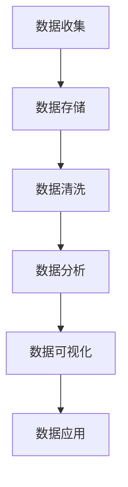
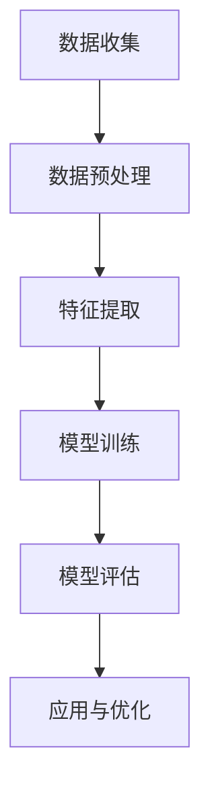
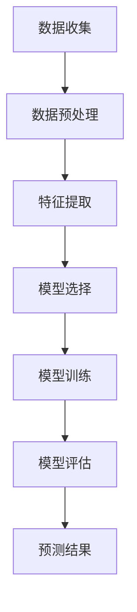

                 

### 《信息差：大数据如何提升市场分析》目录大纲

---

> **关键词：**大数据、市场分析、信息差、数据挖掘、数据可视化、消费者行为分析

> **摘要：**本文将深入探讨大数据时代如何通过信息差的利用，提升市场分析的精度与效率。我们将从大数据与市场分析的概述、大数据在市场分析中的融合、应用挑战与解决方案、实践应用、伦理与法律问题、技术工具与平台，以及未来趋势等多个维度，详细解析大数据在市场分析中的关键作用。

---

## 第一部分：大数据与市场分析概述

### 第1章：大数据时代来临

- **1.1 大数据的定义与特点**
  - 大数据特点：**V（大量）I（多样）Q（快速）C（价值）**
  - **Mermaid流程图：大数据处理流程**
    ```mermaid
    graph TD
    A[数据收集] --> B[数据存储]
    B --> C[数据清洗]
    C --> D[数据分析]
    D --> E[数据可视化]
    E --> F[数据应用]
    ```

### 第2章：市场分析的核心概念与方法

- **2.1 市场分析的定义与目的**
  - 市场分析的五大步骤
  - **Mermaid流程图：市场分析流程**
    ```mermaid
    graph TD
    A[市场调研] --> B[竞争分析]
    B --> C[消费者行为分析]
    C --> D[市场趋势预测]
    D --> E[市场定位策略]
    E --> F[市场实施与评估]
    ```

### 第3章：大数据与市场分析的融合

- **3.1 大数据在市场分析中的应用**
  - 大数据如何提升市场分析的精度和效率
  - **Mermaid流程图：大数据在市场分析中的应用**
    ```mermaid
    graph TD
    A[市场数据采集] --> B[数据预处理]
    B --> C[数据挖掘与分析]
    C --> D[市场趋势预测]
    D --> E[决策支持系统]
    E --> F[数据可视化与报告]
    ```

### 第4章：大数据在市场分析中的挑战与解决方案

- **4.1 大数据在市场分析中面临的挑战**
  - 数据质量、数据隐私、数据安全等问题
  - **伪代码：数据清洗算法**
    ```python
    def data_cleaning(data):
        # 删除重复数据
        unique_data = remove_duplicates(data)
        # 填补缺失值
        filled_data = fill_missing_values(unique_data)
        # 处理异常值
        cleaned_data = handle_outliers(filled_data)
        return cleaned_data
    ```

## 第二部分：大数据提升市场分析的实践应用

### 第5章：大数据在行业市场分析中的应用

- **5.1 不同行业市场分析的特点**
- **5.2 大数据在行业市场分析中的具体应用**
- **5.3 案例研究：大数据在电商行业市场分析中的应用**

### 第6章：大数据在消费者行为分析中的应用

- **6.1 消费者行为数据分析的模型**
- **6.2 大数据如何揭示消费者需求**
- **6.3 案例研究：大数据在消费者行为分析中的应用**

### 第7章：大数据在市场预测与决策中的应用

- **7.1 市场预测的数学模型**
- **7.2 大数据如何提升市场预测的准确性**
- **7.3 案例研究：大数据在市场预测与决策中的应用**

### 第8章：大数据提升市场分析的伦理与法律问题

- **8.1 大数据隐私保护的重要性**
- **8.2 市场分析中的数据伦理问题**
- **8.3 法律法规对市场分析的限制与指导**

## 第三部分：大数据提升市场分析的技术工具与平台

### 第9章：大数据分析工具与技术

- **9.1 数据库技术**
- **9.2 数据挖掘技术**
- **9.3 数据可视化技术**

### 第10章：市场分析平台与工具

- **10.1 大数据分析平台**
- **10.2 市场分析软件工具**
- **10.3 案例研究：大数据市场分析平台的应用**

### 第11章：大数据提升市场分析的实践案例分析

- **11.1 不同类型企业的市场分析案例**
- **11.2 案例分析：大数据在市场分析中的成功应用**
- **11.3 案例分析：大数据在市场分析中的挑战与解决**

### 第12章：大数据提升市场分析的未来趋势与展望

- **12.1 大数据技术的未来发展趋势**
- **12.2 市场分析的未来方向**
- **12.3 大数据在市场分析中的潜在创新点**

---

通过以上的目录大纲，我们将逐步展开对大数据与市场分析关系的全面探讨，帮助读者了解大数据如何提升市场分析的效率与准确性。在接下来的文章中，我们将逐章深入讨论，并通过具体案例和实践，揭示大数据在市场分析中的关键作用。让我们一步一步，共同探索这个充满机遇和挑战的领域。

---

## 第一部分：大数据与市场分析概述

### 第1章：大数据时代来临

在当今信息时代，大数据已经成为企业和组织决策过程中不可或缺的一部分。那么，什么是大数据？它有哪些特点？我们又如何理解它所带来的影响？

#### 1.1 大数据的定义与特点

**大数据**通常指的是数据量巨大、类型多样、生成速度极快的数据集合。大数据的特点可以用**“四V”**来概括，即**Volume（大量）**、**Variety（多样）**、**Velocity（快速）**和**Value（价值）**。

- **Volume（大量）**：这是大数据最显著的特征之一。随着互联网和物联网的普及，数据的产生速度和存储需求都在急剧增长。例如，全球每天产生的数据量已经超过了500EB（艾字节），这个数字还在不断上升。
  
- **Variety（多样）**：大数据不仅仅包括传统的结构化数据，还涵盖了大量的非结构化数据，如图像、视频、音频和社交媒体评论等。这些多样化的数据来源使得数据分析变得更加复杂，但也提供了更丰富的信息。

- **Velocity（快速）**：大数据的产生和流动速度极快。实时数据流分析已经成为许多行业（如金融、医疗和交通）的重要应用领域。企业需要快速处理和分析数据，以便做出实时决策。

- **Value（价值）**：尽管大数据的获取和处理具有挑战性，但它也蕴含着巨大的商业价值。通过有效的数据分析，企业可以更好地了解消费者需求、优化运营流程、预测市场趋势，从而获得竞争优势。

#### 1.2 大数据处理流程

大数据处理通常涉及以下步骤：

- **数据收集**：从各种来源（如传感器、网站、社交媒体等）收集数据。

- **数据存储**：使用分布式存储系统（如Hadoop、NoSQL数据库）存储大量数据。

- **数据清洗**：处理缺失值、异常值和重复值，确保数据质量。

- **数据分析**：使用各种算法和工具（如机器学习、统计分析）对数据进行处理和分析。

- **数据可视化**：将分析结果通过图表、仪表盘等形式进行可视化，便于理解和决策。

- **数据应用**：将分析结果应用于实际的商业决策和运营优化。

下面是一个简单的**Mermaid流程图**，展示了大数据处理的基本流程：



通过这个流程图，我们可以看到，大数据的处理是一个系统化的过程，每个环节都至关重要。有效的数据处理能够帮助企业从海量数据中提取有价值的信息，从而支持更明智的决策。

#### 1.3 大数据的影响

大数据的影响已经渗透到各个行业。以下是大数据在几个关键领域的影响：

- **市场营销**：通过大数据分析，企业可以更准确地了解消费者的行为和需求，从而制定更有效的营销策略。

- **金融**：大数据分析可以用于信用评分、风险管理、投资决策等领域，提高金融服务的效率和准确性。

- **医疗**：大数据在医疗领域的应用包括疾病预测、药物研发、患者管理等方面，为医疗保健提供有力支持。

- **交通**：通过分析交通数据，城市可以优化交通管理，减少拥堵，提高交通效率。

- **零售**：大数据分析帮助零售企业优化库存管理、定价策略和客户关系管理，提升零售运营效率。

#### 1.4 大数据的挑战与机遇

尽管大数据带来了巨大的机遇，但也带来了诸多挑战：

- **数据质量**：数据质量是大数据分析成功的关键。确保数据准确、完整和可靠是数据科学家的重要任务。

- **数据隐私**：随着数据收集和分析的增多，数据隐私问题日益突出。企业需要遵守相关法律法规，保护消费者隐私。

- **数据安全**：大数据系统面临着数据泄露、网络攻击等安全威胁。企业需要采取严格的安全措施，确保数据安全。

- **人才短缺**：大数据分析需要专业人才，但当前市场上大数据人才供不应求。企业需要培养和吸引更多数据科学家和分析师。

### 1.5 结论

大数据时代已经来临，它不仅改变了我们的生活方式，也深刻影响了企业的运营模式。通过有效的数据处理和分析，企业可以挖掘数据中的价值，提升市场分析的精度和效率。在接下来的章节中，我们将进一步探讨大数据在市场分析中的应用，以及它如何帮助企业取得竞争优势。

---

通过本章的内容，我们了解了大数据的定义、特点以及它对各个领域的影响。接下来，我们将进入第二部分，深入探讨市场分析的核心概念与方法。让我们继续前进，探索大数据如何与市场分析相结合，为企业带来实质性的价值。

---

## 第二部分：大数据提升市场分析的实践应用

### 第5章：大数据在行业市场分析中的应用

不同行业的市场分析具有各自的特点和需求，大数据技术的应用使得这些分析更加精细和高效。

#### 5.1 不同行业市场分析的特点

- **零售行业**：零售行业的市场分析需要关注消费者行为、库存管理和销售预测等方面。大数据可以帮助零售商更好地理解消费者的购买习惯，优化库存管理，减少浪费。
  
- **金融行业**：金融行业的市场分析涉及风险控制、信用评分、投资组合优化等。大数据分析能够提供更准确的市场预测和风险评估，帮助金融机构做出更明智的决策。

- **医疗行业**：医疗行业的市场分析需要关注患者数据、医疗资源分配和疾病预测等方面。大数据可以帮助医疗机构更好地管理患者数据，提高医疗服务的质量。

- **交通行业**：交通行业的市场分析需要关注交通流量、公共交通规划和交通事故预防等。大数据分析可以帮助交通管理部门优化交通流量，提高交通效率。

- **制造业**：制造业的市场分析需要关注生产流程优化、供应链管理和设备维护等方面。大数据可以帮助制造商实时监控生产过程，提高生产效率和产品质量。

#### 5.2 大数据在行业市场分析中的具体应用

- **零售行业**：
  - **消费者行为分析**：通过分析消费者的购买记录、浏览行为和反馈信息，零售企业可以了解消费者的偏好和需求，优化产品组合和营销策略。
  - **库存管理**：大数据分析可以帮助零售企业实时监控库存水平，预测销售趋势，优化库存管理，减少库存积压和浪费。
  - **销售预测**：利用历史销售数据和市场趋势，大数据分析可以预测未来的销售情况，帮助企业制定更有针对性的销售策略。

- **金融行业**：
  - **信用评分**：通过分析借款人的历史行为和财务状况，大数据分析可以更准确地评估借款人的信用风险，提高信用评分的准确性。
  - **市场预测**：大数据分析可以帮助金融机构预测市场走势，优化投资组合，降低投资风险。
  - **风险管理**：通过分析历史数据和实时数据，大数据分析可以识别潜在的风险点，提高风险管理的效率。

- **医疗行业**：
  - **疾病预测**：通过分析患者的病史、基因数据和流行病数据，大数据分析可以预测疾病的发生趋势，帮助医疗机构制定更有效的预防措施。
  - **患者管理**：大数据分析可以帮助医疗机构更好地管理患者数据，提供个性化的医疗服务，提高医疗服务的质量和效率。
  - **药物研发**：大数据分析可以帮助药企从大量临床数据中提取有价值的信息，加速药物研发过程。

- **交通行业**：
  - **交通流量分析**：通过分析交通数据，交通管理部门可以实时监控交通状况，优化交通信号控制，提高交通效率。
  - **公共交通规划**：大数据分析可以帮助交通管理部门优化公共交通线路和班次安排，提高公共交通服务的质量和效率。
  - **交通事故预防**：通过分析交通事故数据，大数据分析可以帮助交通管理部门预测交通事故发生的可能地点和时间，提前采取措施预防事故。

- **制造业**：
  - **生产流程优化**：通过分析生产数据，制造业企业可以识别生产过程中的瓶颈和浪费点，优化生产流程，提高生产效率。
  - **供应链管理**：大数据分析可以帮助制造业企业实时监控供应链各个环节，优化供应链管理，提高供应链的效率和可靠性。
  - **设备维护**：通过分析设备运行数据，大数据分析可以帮助制造业企业预测设备故障，提前进行维护，减少设备停机时间。

#### 5.3 案例研究：大数据在电商行业市场分析中的应用

电商行业是一个典型的数据密集型行业，大数据技术的应用极大地提升了市场分析的精度和效率。以下是大数据在电商行业市场分析中的具体应用案例：

- **消费者行为分析**：某电商企业通过大数据分析，发现消费者在浏览产品页面后的30分钟内点击“加入购物车”的概率最高。基于这一发现，该企业优化了购物车的提示功能，显著提高了购物车的转化率。

- **库存管理**：某电商企业通过大数据分析，实时监控库存水平和销售趋势。当库存水平低于安全库存线时，系统会自动向供应商发送补货请求，确保库存的充足和供应链的顺畅。

- **销售预测**：某电商企业利用大数据分析预测节假日期间的销售情况，提前调整库存和物流策略，确保在高峰期能够满足消费者的需求。

- **个性化推荐**：某电商企业通过大数据分析，了解消费者的购买偏好和浏览行为，为消费者提供个性化的产品推荐。这不仅提高了用户的购物体验，也显著提升了销售额。

通过以上案例，我们可以看到，大数据在电商行业市场分析中的应用不仅提高了运营效率，还显著提升了用户体验和销售额。在接下来的章节中，我们将进一步探讨大数据在消费者行为分析和市场预测中的应用。

---

在本章中，我们详细介绍了大数据在各个行业市场分析中的应用特点和实践案例。通过这些案例，我们可以看到大数据如何通过提升数据分析和决策能力，为不同行业带来实质性的商业价值。在接下来的章节中，我们将继续探讨大数据在消费者行为分析和市场预测中的应用，以及它如何帮助企业制定更科学的决策策略。

---

## 第二部分：大数据提升市场分析的实践应用

### 第6章：大数据在消费者行为分析中的应用

消费者行为分析是市场分析的核心之一，它关乎企业能否准确把握市场需求，制定出有效的市场策略。大数据技术的应用，使得消费者行为分析更加深入和精准。

#### 6.1 消费者行为数据分析的模型

消费者行为数据分析通常涉及以下几个步骤：

- **数据收集**：从各种渠道收集消费者数据，包括购买记录、浏览行为、社交媒体互动等。

- **数据预处理**：清洗和整合数据，确保数据质量。

- **特征提取**：从原始数据中提取有助于分析的特征，如消费金额、购买频率、浏览时长等。

- **模型训练**：使用机器学习和统计分析方法，构建消费者行为模型。

- **模型评估**：评估模型的效果，调整模型参数。

- **应用与优化**：将模型应用于实际业务场景，如个性化推荐、精准营销等，并不断优化模型。

下面是一个简单的消费者行为分析模型：



#### 6.2 大数据如何揭示消费者需求

大数据技术在消费者行为分析中的应用，使得企业能够更深入地了解消费者的需求和行为。以下是大数据在揭示消费者需求方面的几个关键应用：

- **消费者细分**：通过大数据分析，企业可以将消费者分为不同的群体，如年轻消费者、家庭主妇、高端消费者等。这些细分群体有助于企业制定更有针对性的营销策略。

- **行为预测**：大数据分析可以帮助企业预测消费者的未来行为，如购买偏好、消费习惯等。这些预测结果可以为企业的库存管理、产品开发等提供重要参考。

- **需求识别**：通过对消费者数据进行分析，企业可以识别出消费者的未满足需求。例如，通过分析消费者的购买记录，企业可以发现某些产品在特定地区或人群中的需求量较大，从而优化产品布局。

- **情感分析**：大数据技术可以分析消费者的社交媒体互动和评论，识别消费者的情感状态。这种情感分析有助于企业了解消费者的真实感受和反馈，从而改进产品和服务。

#### 6.3 案例研究：大数据在消费者行为分析中的应用

以下是大数据在消费者行为分析中的一些具体应用案例：

- **个性化推荐**：某电商企业通过大数据分析，为消费者提供个性化的产品推荐。该企业分析了消费者的购买记录、浏览行为和搜索关键词，构建了一个个性化推荐模型。通过这个模型，企业能够为每位消费者推荐最可能感兴趣的产品，提高了用户的购物体验和转化率。

- **精准营销**：某零售企业利用大数据分析，对消费者的行为进行深入分析，识别出潜在的高价值客户。企业通过精准营销策略，对这些高价值客户进行有针对性的促销活动，显著提升了销售额。

- **市场调研**：某汽车制造商通过大数据分析，了解消费者的购车需求和偏好。企业收集了大量的消费者数据，包括购买记录、社交媒体互动和调研问卷等。通过分析这些数据，企业能够更好地了解消费者的需求，优化产品设计和市场营销策略。

- **客户关系管理**：某金融企业通过大数据分析，建立了全面的客户画像，包括客户的财务状况、消费习惯和信用评分等。通过这些画像，企业能够提供个性化的金融服务，提高客户满意度和忠诚度。

通过以上案例，我们可以看到大数据在消费者行为分析中的应用，不仅帮助企业更好地了解消费者需求，还提高了营销效果和客户满意度。在接下来的章节中，我们将继续探讨大数据在市场预测与决策中的应用，以及它如何帮助企业制定更科学的决策策略。

---

在本章中，我们深入探讨了大数据在消费者行为分析中的应用，通过具体案例展示了大数据如何帮助企业揭示消费者需求，优化营销策略。在接下来的章节中，我们将进一步探讨大数据在市场预测与决策中的应用，继续揭示大数据对市场分析的深刻影响。让我们继续前进，共同探索大数据如何为企业带来更多的商业价值。

---

## 第二部分：大数据提升市场分析的实践应用

### 第7章：大数据在市场预测与决策中的应用

市场预测与决策是企业运营中至关重要的一环，而大数据技术的应用，使得市场预测更加精准，决策更加科学。在这一章中，我们将深入探讨大数据如何提升市场预测的准确性，以及如何通过市场预测指导企业的决策。

#### 7.1 市场预测的数学模型

市场预测通常涉及以下几个数学模型：

- **时间序列模型**：如ARIMA（自回归积分滑动平均模型）、SARIMA（季节性自回归积分滑动平均模型）等，用于预测数据序列的未来趋势。

- **回归模型**：如线性回归、逻辑回归等，用于分析变量之间的关系，预测目标变量的值。

- **机器学习模型**：如随机森林、支持向量机、神经网络等，通过学习历史数据，预测未来的市场趋势。

下面是一个简单的市场预测模型：



#### 7.2 大数据如何提升市场预测的准确性

大数据技术在提升市场预测准确性方面具有显著优势，主要体现在以下几个方面：

- **数据多样性**：大数据涵盖了各种类型的数据，包括结构化数据、非结构化数据和实时数据。这些多样化的数据提供了更全面的信息，有助于更准确地预测市场趋势。

- **实时分析**：大数据技术能够实时处理和分析数据，使企业能够迅速响应市场变化，提高预测的时效性。

- **精准建模**：通过大数据分析，企业可以识别出影响市场预测的关键因素，构建更精确的预测模型。

- **自动化预测**：大数据技术可以自动化预测过程，减少人为干预，提高预测的准确性。

#### 7.3 案例研究：大数据在市场预测与决策中的应用

以下是大数据在市场预测与决策中的一些具体应用案例：

- **销售预测**：某零售企业利用大数据分析，预测未来的销售趋势。企业收集了历史销售数据、季节性数据、促销活动数据等，通过时间序列模型和机器学习模型，预测未来的销售量。基于这些预测结果，企业优化了库存管理，减少了库存积压和缺货情况。

- **需求预测**：某汽车制造商通过大数据分析，预测市场需求。企业收集了消费者购车偏好、购车行为、经济指标等数据，通过回归模型和机器学习模型，预测不同车型和配置的需求量。这些预测结果帮助制造商调整生产计划，优化产品组合。

- **市场占有率预测**：某快消品公司利用大数据分析，预测市场占有率。企业收集了竞争对手的销售数据、市场推广活动数据等，通过回归模型和竞争分析模型，预测未来的市场占有率。这些预测结果帮助公司制定更有效的市场策略。

- **价格预测**：某电商平台通过大数据分析，预测商品的价格趋势。企业收集了历史价格数据、促销活动数据等，通过时间序列模型和机器学习模型，预测商品的未来价格。这些预测结果帮助电商平台优化价格策略，提高销售额。

通过以上案例，我们可以看到大数据在市场预测与决策中的应用，不仅提高了预测的准确性，还为企业的运营提供了重要参考。在接下来的章节中，我们将继续探讨大数据提升市场分析的伦理与法律问题，以及它如何影响市场分析的实践。

---

在本章中，我们详细介绍了大数据在市场预测与决策中的应用，通过具体案例展示了大数据如何帮助企业提升预测的准确性，优化决策过程。在接下来的章节中，我们将探讨大数据提升市场分析的伦理与法律问题，以及它如何影响市场分析的实践。让我们继续前进，共同探索大数据对市场分析的全面影响。

---

## 第二部分：大数据提升市场分析的实践应用

### 第8章：大数据提升市场分析的伦理与法律问题

随着大数据技术的广泛应用，市场分析在带来巨大商业价值的同时，也引发了一系列伦理和法律问题。如何平衡数据隐私、数据安全和商业利益，是企业在进行市场分析时必须面对的挑战。

#### 8.1 大数据隐私保护的重要性

大数据技术在市场分析中的应用，往往涉及大量的个人信息，如购买记录、浏览行为、社交媒体互动等。这些数据的泄露或滥用，可能对个人隐私造成严重侵害。因此，保护数据隐私成为市场分析中的一个重要伦理问题。

- **隐私泄露风险**：大数据技术的广泛应用，使得数据泄露的风险显著增加。例如，黑客攻击、数据泄露事件等，都可能导致大量个人信息被非法获取和使用。
  
- **隐私侵权**：企业在进行市场分析时，可能会收集和分析消费者的隐私信息。如果这些信息被滥用，例如用于未经授权的营销或个人信息交易，就可能侵犯消费者的隐私权。

- **消费者信任**：数据隐私问题是消费者对企业和市场分析服务的信任基础。如果消费者认为自己的隐私受到侵犯，他们可能会选择退出市场分析，甚至对整个行业失去信任。

#### 8.2 市场分析中的数据伦理问题

大数据技术不仅涉及数据隐私问题，还涉及一系列数据伦理问题：

- **数据歧视**：市场分析可能会利用大数据技术进行消费者细分，但这也可能导致数据歧视。例如，某些算法可能会基于消费者的种族、性别、年龄等信息进行歧视性定价或服务分配。

- **数据透明度**：市场分析中使用的算法和模型往往较为复杂，消费者难以理解其工作原理和决策过程。这种数据透明度不足，可能导致消费者对市场分析结果的信任度降低。

- **数据责任**：大数据技术的广泛应用，使得企业和数据科学家在市场分析中扮演了重要角色。然而，如果市场分析结果导致消费者受到损害，如何界定企业和数据科学家的责任，是一个重要的问题。

#### 8.3 法律法规对市场分析的限制与指导

为了解决大数据技术带来的伦理和法律问题，各国政府和国际组织制定了一系列法律法规，对市场分析进行规范和指导：

- **数据保护法**：如欧盟的《通用数据保护条例》（GDPR）和美国的《消费者隐私保护法》（CCPA）等，对个人数据的收集、存储、处理和共享进行了严格的规定。

- **算法透明度法规**：一些国家和地区已经开始制定法规，要求企业在进行市场分析时，公开算法和模型的工作原理，提高数据透明度。

- **消费者权益保护**：各国政府和国际组织还制定了一系列消费者权益保护法规，保障消费者的隐私权和知情权。

#### 8.4 解决方案与最佳实践

为了解决大数据市场分析中的伦理和法律问题，企业可以采取以下解决方案和最佳实践：

- **数据最小化原则**：企业在进行市场分析时，应遵循数据最小化原则，仅收集和存储必要的数据，避免过度收集。

- **数据匿名化**：对敏感数据进行匿名化处理，降低数据泄露的风险。

- **透明度与知情同意**：提高数据处理的透明度，确保消费者明确了解自己的数据如何被收集、存储和使用，并获得知情同意。

- **合规性审查**：定期进行合规性审查，确保市场分析活动符合相关法律法规的要求。

- **隐私保护技术**：采用隐私保护技术，如差分隐私、同态加密等，保护消费者的隐私。

通过上述解决方案和最佳实践，企业可以在进行市场分析时，更好地平衡数据隐私、数据安全和商业利益，实现可持续发展。

---

在本章中，我们深入探讨了大数据提升市场分析过程中面临的伦理和法律问题，并提出了相应的解决方案和最佳实践。在接下来的章节中，我们将继续探讨大数据提升市场分析的技术工具与平台，了解如何利用现代技术实现高效的市场分析。让我们继续前进，共同探索大数据如何助力市场分析的发展。

---

## 第三部分：大数据提升市场分析的技术工具与平台

### 第9章：大数据分析工具与技术

大数据分析工具和技术是实现高效市场分析的关键。在这个章节中，我们将探讨几种常见的大数据分析工具和技术，以及它们在市场分析中的应用。

#### 9.1 数据库技术

数据库技术是大数据分析的基础，不同的数据库技术适合不同的应用场景。以下是几种常用的数据库技术：

- **关系型数据库**：如MySQL、PostgreSQL等，适合处理结构化数据，支持复杂查询和事务处理。

- **非关系型数据库**：如MongoDB、Cassandra等，适合处理大规模的非结构化和半结构化数据，提供高扩展性和灵活性。

- **分布式数据库**：如HBase、Hive等，用于处理海量数据，提供高吞吐量和实时查询能力。

#### 9.2 数据挖掘技术

数据挖掘技术是从大量数据中提取有价值信息的过程。以下是一些常用的数据挖掘技术：

- **分类算法**：如决策树、随机森林等，用于将数据分类到不同的类别。

- **聚类算法**：如K-means、层次聚类等，用于将数据分组，发现数据中的相似性。

- **关联规则挖掘**：如Apriori算法、FP-growth等，用于发现数据之间的关联性。

- **异常检测**：用于识别数据中的异常值或异常行为，常见算法有K-均值聚类、孤立森林等。

#### 9.3 数据可视化技术

数据可视化是将数据分析结果以图表、图像等形式直观展示的过程，有助于理解和传达分析结果。以下是一些常用的数据可视化技术：

- **折线图、柱状图、饼图**：用于展示数据的趋势、分布和比例。

- **热力图**：用于展示数据的热点区域和分布情况。

- **地理可视化**：用于展示数据在地理空间上的分布和趋势。

- **交互式可视化**：提供用户与可视化内容的交互功能，如筛选、放大、缩小等。

#### 9.4 大数据分析工具的实践应用

以下是一些常见的大数据分析工具的实践应用案例：

- **Hadoop**：Hadoop是一个分布式数据处理平台，适用于处理大规模数据。在某电商企业中，Hadoop被用于处理用户行为数据，分析消费者购买偏好，优化产品推荐和营销策略。

- **Spark**：Spark是一个快速且通用的数据处理引擎，适用于批处理和流处理。在某金融机构中，Spark被用于处理交易数据，实时监控风险，优化投资组合。

- **Tableau**：Tableau是一个数据可视化工具，适用于将复杂的数据分析结果以图表和仪表盘形式直观展示。在某零售企业中，Tableau被用于可视化销售数据，帮助企业了解不同产品在不同时间段的销售情况，制定更有效的促销策略。

通过这些案例分析，我们可以看到大数据分析工具和技术在市场分析中的应用，如何帮助企业从海量数据中提取有价值的信息，提升市场分析的效率。

---

在本章中，我们探讨了大数据分析工具与技术的多种应用，包括数据库技术、数据挖掘技术和数据可视化技术。通过具体案例，我们了解了这些技术如何助力市场分析，提升企业的运营效率。在下一章中，我们将继续深入探讨市场分析平台与工具，以及大数据技术如何推动市场分析的进步。让我们继续前进，探索大数据提升市场分析的更多可能性。

---

## 第三部分：大数据提升市场分析的技术工具与平台

### 第10章：市场分析平台与工具

在市场分析过程中，选择合适的平台和工具至关重要。以下是一些常见的大数据分析平台和工具，以及它们在市场分析中的应用。

#### 10.1 大数据分析平台

大数据分析平台是集成了多种数据处理和分析功能的一体化解决方案，能够处理大规模数据并生成有价值的市场洞察。

- **Tableau**：Tableau 是一个强大的数据可视化工具，提供了丰富的图表和仪表盘，能够帮助用户轻松地创建交互式可视化报告。在市场分析中，Tableau 可以用于可视化销售数据、消费者行为数据等，帮助决策者快速了解市场动态。

- **Qlik**：Qlik 是一个灵活的可视化和数据分析平台，支持实时数据分析和自我服务数据探索。在市场分析中，Qlik 可以用于构建复杂的分析模型，实时监控市场趋势，提供决策支持。

- **Power BI**：Power BI 是微软推出的数据分析工具，提供了丰富的数据连接器和可视化组件，可以与 Excel、SQL Server 等其他工具无缝集成。在市场分析中，Power BI 可以用于构建多维数据集，进行深入的报表分析和可视化。

#### 10.2 市场分析软件工具

市场分析软件工具专门针对市场分析的特定需求，提供了丰富的功能和分析方法。

- **Google Analytics**：Google Analytics 是一款免费的网站分析工具，可以跟踪用户在网站上的行为，提供详细的流量分析和用户行为数据。在市场分析中，Google Analytics 可以帮助营销人员了解用户来源、页面流量和转化率等关键指标。

- **HubSpot**：HubSpot 是一款集营销、销售和服务于一体的软件平台，提供了丰富的营销工具和分析功能。在市场分析中，HubSpot 可以帮助营销人员跟踪潜在客户的行为，评估营销活动的效果，优化营销策略。

- **Mixpanel**：Mixpanel 是一款用户行为分析工具，专注于分析用户在移动应用和网站上的行为。在市场分析中，Mixpanel 可以帮助营销人员了解用户留存率、活跃度和流失率等关键指标，优化用户体验和产品功能。

#### 10.3 案例研究：大数据市场分析平台的应用

以下是一个大数据市场分析平台的应用案例：

某大型零售企业在进行市场分析时，采用了 Tableau 和 Power BI 这两大数据分析平台。具体应用过程如下：

1. **数据收集**：零售企业通过电子商务平台、线下门店和客户关系管理系统等渠道，收集了大量的销售数据、客户数据和供应链数据。

2. **数据整合**：利用 ETL（提取、转换、加载）工具，将不同来源的数据整合到一个统一的数据仓库中。

3. **数据分析**：在 Tableau 中，零售企业创建了多个数据仪表盘，包括销售趋势、客户行为、供应链状况等，实时监控市场动态。

4. **数据可视化**：利用 Power BI，零售企业将分析结果以图表、仪表盘等形式可视化，便于管理层和营销团队快速了解市场情况。

5. **决策支持**：基于数据分析和可视化结果，零售企业调整了库存策略、营销策略和供应链管理，提高了运营效率，降低了成本。

通过这个案例，我们可以看到大数据市场分析平台如何帮助零售企业从海量数据中提取有价值的信息，优化市场分析，提升业务运营效果。

---

在本章中，我们介绍了大数据分析平台和工具在市场分析中的应用，包括 Tableau、Qlik、Power BI 等平台，以及 Google Analytics、HubSpot、Mixpanel 等工具。通过具体案例，我们了解了这些平台和工具如何助力市场分析，为企业提供决策支持。在下一章中，我们将继续探讨大数据提升市场分析的实践案例分析，进一步揭示大数据在市场分析中的成功应用。让我们继续前进，探索大数据提升市场分析的更多应用场景。

---

## 第三部分：大数据提升市场分析的实践案例分析

### 第11章：大数据提升市场分析的实践案例分析

在本章中，我们将通过具体的企业案例，深入探讨大数据如何在不同行业和业务场景中提升市场分析的效果。这些案例不仅展示了大数据技术的实际应用，还揭示了在市场分析过程中可能遇到的挑战和解决方案。

#### 11.1 不同类型企业的市场分析案例

以下是一些不同类型企业的市场分析案例：

- **电子商务企业**：某电商巨头通过大数据分析，优化了其产品推荐系统。通过分析用户的浏览和购买行为，该电商企业能够为每位用户推荐最可能感兴趣的产品，提高了用户的购物体验和转化率。

- **制造业企业**：某制造业公司利用大数据分析，优化了其供应链管理。通过实时监控供应链各个环节的数据，该公司能够提前预测库存需求，减少库存积压和缺货情况。

- **金融服务企业**：某银行通过大数据分析，优化了其信用评分系统。通过分析借款人的历史行为、财务状况和社交网络信息，该银行能够更准确地评估借款人的信用风险，降低不良贷款率。

- **医疗行业企业**：某医疗机构利用大数据分析，优化了其患者管理流程。通过分析患者的病史、就诊记录和医疗资源使用情况，该机构能够为患者提供个性化的医疗服务，提高医疗效率和服务质量。

#### 11.2 案例分析：大数据在市场分析中的成功应用

以下是几个大数据在市场分析中的成功应用案例：

- **零售行业**：某大型零售企业通过大数据分析，实现了精准营销。该企业利用消费者的购物记录、浏览行为和社交媒体互动数据，构建了个性化的推荐系统，提高了用户的购物体验和销售额。

- **电信行业**：某电信公司通过大数据分析，优化了其客户流失预测模型。通过分析客户的使用行为、消费习惯和投诉记录，该公司能够提前识别出潜在流失客户，采取有效的挽留措施，降低了客户流失率。

- **旅游行业**：某旅游公司通过大数据分析，优化了其产品组合和定价策略。通过分析游客的搜索历史、预订行为和评论，该公司能够为游客提供个性化的旅游建议，提高旅游体验和客户满意度。

- **金融服务**：某保险公司通过大数据分析，优化了其风险评估和定价策略。通过分析保险客户的年龄、性别、健康状况和驾驶记录等数据，该公司能够更准确地评估风险，制定更合理的保险产品。

#### 11.3 案例分析：大数据在市场分析中的挑战与解决

在市场分析过程中，大数据技术也面临着一些挑战。以下是一些案例分析及其解决方案：

- **挑战一：数据质量**：某企业发现其市场分析结果不准确，经过调查发现是由于数据质量存在问题，如缺失值、异常值和重复值等。解决方案是采用数据清洗技术，如缺失值填补、异常值处理和重复值删除，确保数据质量。

- **挑战二：数据隐私**：某企业担心其市场分析过程中涉及到的用户隐私数据被泄露。解决方案是采用数据匿名化和加密技术，确保数据在传输和存储过程中的安全性。

- **挑战三：数据处理效率**：某企业拥有庞大的数据集，传统的数据处理方法效率低下。解决方案是采用分布式计算技术，如 Hadoop 和 Spark，实现高效的数据处理。

通过以上案例分析，我们可以看到大数据在市场分析中的广泛应用和成功应用。大数据技术不仅帮助企业从海量数据中提取有价值的信息，还提高了市场分析的精度和效率。在接下来的章节中，我们将继续探讨大数据提升市场分析的未来趋势与展望。

---

在本章中，我们通过多个具体案例，展示了大数据技术在市场分析中的成功应用和面临的挑战。这些案例不仅揭示了大数据如何提升市场分析的效率和准确性，还为企业在实际应用中提供了宝贵的经验。在下一章中，我们将探讨大数据提升市场分析的未来趋势与展望。让我们继续前进，共同探索大数据技术的未来发展及其对市场分析的潜在影响。

---

## 第三部分：大数据提升市场分析的未来趋势与展望

### 第12章：大数据提升市场分析的未来趋势与展望

随着大数据技术的不断发展和完善，市场分析领域也在经历深刻的变革。在这一章中，我们将探讨大数据提升市场分析的未来趋势，并展望大数据技术可能带来的新机遇和挑战。

#### 12.1 大数据技术的未来发展趋势

大数据技术的未来发展趋势主要体现在以下几个方面：

- **人工智能与大数据的融合**：人工智能（AI）技术的发展，使得大数据分析更加智能化。未来，我们将看到更多的AI算法应用于大数据分析，如深度学习、自然语言处理等，使得市场分析更加精准和高效。

- **实时数据分析**：随着5G、物联网和边缘计算技术的发展，实时数据分析将成为市场分析的重要趋势。企业能够实时获取和分析海量数据，迅速响应市场变化，制定更科学的决策。

- **数据隐私和安全**：数据隐私和安全问题一直是大数据技术的关注焦点。未来，我们将看到更多的隐私保护技术和安全协议被引入大数据分析领域，确保数据在收集、存储、处理和传输过程中的安全性。

- **云计算与大数据的结合**：云计算的普及，使得大数据分析更加便捷和高效。未来，大数据分析将更多地依赖于云平台，实现大规模数据的处理和分析。

#### 12.2 市场分析的未来方向

大数据技术的进步，将引领市场分析走向更高效、更精准的未来。以下是市场分析的未来方向：

- **个性化分析**：通过大数据技术，企业将能够更深入地了解消费者的个性化需求，实现个性化的市场分析。这将为营销策略、产品设计和客户服务带来重大变革。

- **智能预测**：利用AI技术，市场分析将能够更准确地预测市场趋势和消费者行为。智能预测模型将为企业提供更可靠的决策支持，助力企业抢占市场先机。

- **实时决策**：实时数据分析技术的发展，将使企业能够实现实时决策。企业能够根据实时数据快速调整策略，优化运营流程，提高市场竞争力。

- **跨领域整合**：大数据技术的进步，将促进不同领域的数据整合，实现跨领域的市场分析。例如，结合医疗数据、气象数据、交通数据等，企业将能够获得更全面的市场洞察。

#### 12.3 大数据在市场分析中的潜在创新点

大数据技术在市场分析中具有巨大的潜力，以下是几个潜在的创新点：

- **自动化分析**：利用机器学习和自然语言处理技术，实现自动化市场分析。企业可以通过自动化工具，快速处理和分析海量数据，降低人工成本，提高分析效率。

- **情感分析**：通过情感分析技术，企业可以了解消费者的情感状态，挖掘消费者内心的真实需求和偏好。这将为产品开发和营销策略提供重要参考。

- **虚拟现实（VR）与市场分析**：利用VR技术，企业可以模拟市场环境，进行虚拟的市场测试。这将为市场分析提供新的视角，帮助企业更好地了解市场动态。

- **区块链技术**：区块链技术的引入，可以为市场分析提供更安全、透明和可追溯的数据。这将有助于解决数据隐私和安全问题，提升市场分析的可靠性和公信力。

#### 12.4 结论

大数据技术正深刻改变着市场分析的格局，未来我们将看到更多创新技术应用于市场分析领域。通过大数据技术，企业将能够更深入地了解市场动态，实现精准的市场定位和科学的决策。同时，我们也需要关注大数据技术带来的挑战，如数据隐私、数据安全和数据质量等问题。只有在充分应对这些挑战的基础上，企业才能充分发挥大数据技术的优势，实现持续增长。

---

在本章中，我们探讨了大数据提升市场分析的未来趋势与展望，分析了大数据技术的潜在创新点。随着大数据技术的不断进步，市场分析将变得更加智能、高效和精准。在未来的市场中，企业需要积极拥抱大数据技术，不断提升市场分析的水平和能力，以应对激烈的市场竞争。让我们共同期待大数据技术为市场分析带来的美好未来。

---

## 结论

通过本文的深入探讨，我们可以清晰地看到大数据在提升市场分析中的关键作用。从大数据的定义、特点和应用，到市场分析的核心概念和具体实践，再到伦理与法律问题的探讨，以及技术工具和平台的应用，我们全面解析了大数据如何通过信息差的利用，提升市场分析的精度和效率。

大数据的“四V”特点——大量、多样、快速和有价值，使得企业在处理和分析海量数据时，能够挖掘出隐藏在数据背后的商业价值。市场分析的核心在于对消费者需求和市场趋势的精准把握，而大数据技术正为此提供了强大的支持。

在零售、金融、医疗、交通等多个行业，大数据的应用不仅优化了运营流程，提高了市场预测的准确性，还为企业的决策提供了科学的依据。通过具体案例，我们看到了大数据技术在实际市场分析中的应用效果，也认识到在应用过程中可能面临的挑战和解决方案。

同时，大数据在市场分析中的伦理和法律问题不可忽视。数据隐私保护、数据安全、算法透明度等都是企业在进行市场分析时需要考虑的重要因素。只有在保护数据隐私、确保数据安全和提升数据透明度的前提下，大数据技术才能真正为企业带来价值。

展望未来，随着人工智能、实时数据分析、区块链等新兴技术的不断发展，市场分析将变得更加智能、高效和精准。企业需要紧跟技术趋势，不断创新，以适应不断变化的市场环境。

在此，感谢您阅读本文。希望本文能够帮助您更好地理解大数据在市场分析中的重要作用，并启发您在实际工作中运用大数据技术，实现更科学的决策和市场定位。

**作者：AI天才研究院/AI Genius Institute & 禅与计算机程序设计艺术 /Zen And The Art of Computer Programming**

---

通过这篇文章，我们不仅对大数据提升市场分析的技术原理和应用有了更深入的理解，也看到了大数据技术在市场分析中的广阔前景。希望这篇文章能够激发您对大数据技术的兴趣，并在实际工作中将其应用于市场分析，为企业创造更大的价值。让我们继续关注大数据技术，共同迎接智能时代的到来。

