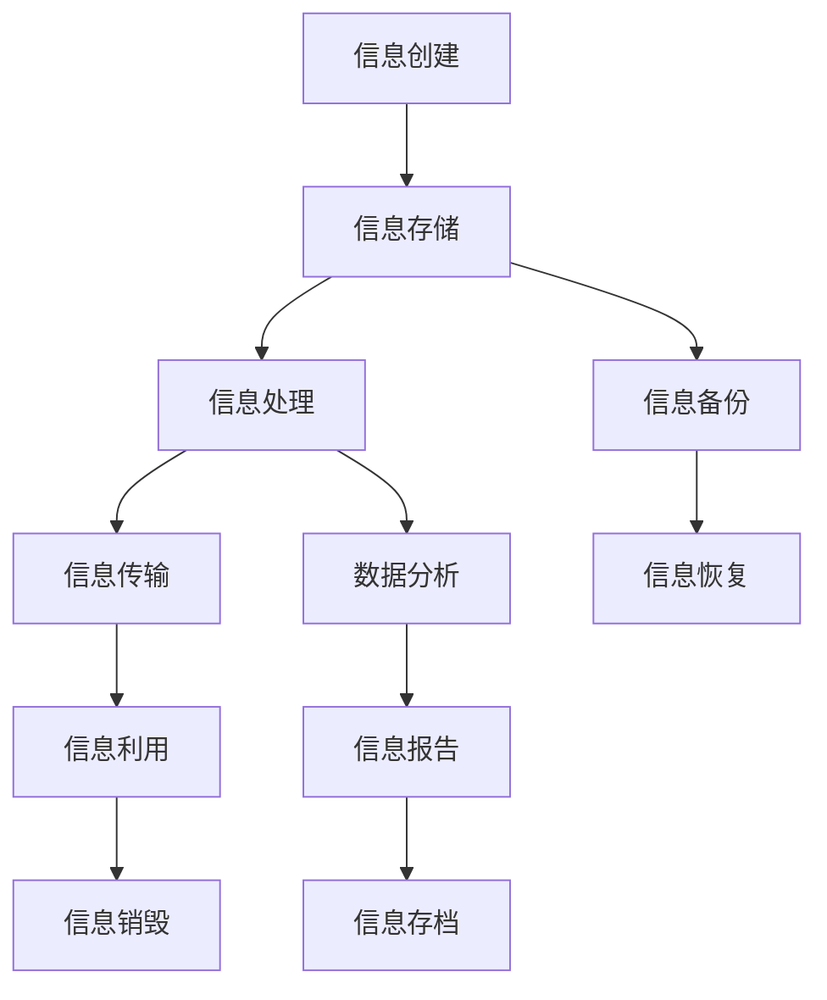
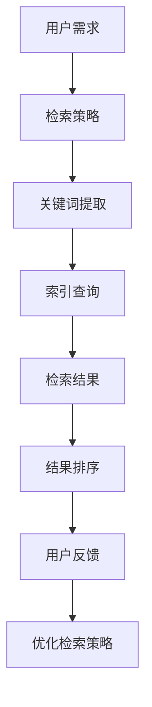
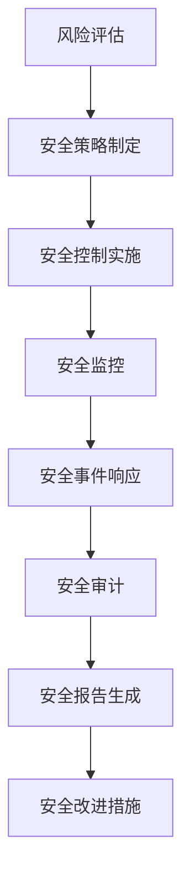

                 

### 《信息时代的信息管理策略与实践：管理信息过载和复杂性》

> **关键词：信息管理，信息过载，复杂性，策略与实践，信息生命周期，信息安全，信息可视化**

> **摘要：本文深入探讨了信息时代的信息管理策略与实践。随着信息的爆炸式增长，信息过载和复杂性成为当前信息技术领域面临的主要挑战。本文首先阐述了信息管理的背景与基础理论，包括信息过载与复杂性的定义、原因及管理策略。接着，分析了信息管理的基本原理，如信息生命周期管理、信息组织与检索、信息安全与隐私保护。随后，本文详细介绍了组织层面的信息管理策略、技术工具的应用以及国内外成功案例。最后，探讨了信息管理在新兴领域的应用和发展趋势，为应对信息过载和复杂性提供了有效的解决方案。**

---

### 第一部分：信息管理的背景与基础理论

#### 第1章：信息时代的背景与挑战

##### 1.1 信息时代的到来与发展

信息时代，是指人类社会从工业时代过渡到以信息技术为核心的时代。这个时代的主要特征是信息量的爆炸性增长，信息技术的高速发展以及信息在社会经济生活中的核心地位。

- **信息爆炸与信息过载**

信息爆炸是指在互联网和数字技术的推动下，信息数量以指数级增长的现象。据统计，全球每天产生的数据量达到了数百万TB，且这个数字还在不断增长。

信息过载是指在处理和利用信息时，接收到的信息量超出了个体的处理能力，导致信息过载现象。信息过载对个人和社会都带来了严重的负面影响，如降低工作效率、增加心理压力、影响决策等。

- **信息时代的经济、社会、文化影响**

信息时代的到来深刻改变了经济、社会和文化发展的模式。

在经济方面，信息技术推动了生产方式的变革，提高了生产效率和竞争力。信息经济成为全球经济的重要组成部分，信息产业也成为各国竞相发展的重点领域。

在社会方面，信息技术的普及和应用促进了社会结构的变革。信息社会使得人们的生活方式、工作方式和社会交往方式都发生了重大变化。

在文化方面，信息技术的广泛应用丰富了文化表现形式和传播途径。数字文化成为文化创新的重要载体，信息文化的传播和交流成为文化交流的新趋势。

- **管理信息过载的重要性**

在信息时代，有效管理信息过载具有重要的意义。

首先，管理信息过载有助于提高个人和组织的效率。通过合理筛选和利用信息，可以减少不必要的干扰和浪费时间的行为，从而提高工作和学习效率。

其次，管理信息过载有助于降低心理压力。信息过载会导致个体陷入信息焦虑和恐慌，通过有效的信息管理可以减轻这种压力，提高心理健康水平。

最后，管理信息过载有助于提升决策质量。在面对大量信息时，只有通过有效的信息筛选和分析，才能做出明智的决策。

##### 1.2 信息管理的定义与目标

- **信息管理的概念与内涵**

信息管理是指对信息资源进行有效组织、存储、处理、传输和利用的过程。其目的是通过科学的方法和手段，实现对信息资源的优化配置和高效利用。

信息管理涉及多个方面，包括信息资源的规划、组织、控制、利用和评价。其核心是信息资源的生命周期管理，包括信息收集、存储、处理、传输、利用和销毁等环节。

- **信息管理的目标与原则**

信息管理的目标主要包括：

1. 提高信息资源的利用效率。
2. 保障信息资源的安全和保密。
3. 促进信息资源的共享和交流。
4. 降低信息管理的成本。

信息管理的基本原则包括：

1. 系统性原则：信息管理应该从整体出发，综合考虑信息资源的各个方面，实现信息的全流程管理。
2. 经济性原则：信息管理应该注重成本效益，通过合理的资源配置和流程优化，实现信息管理的经济性。
3. 适应性原则：信息管理应该根据环境变化和需求变化，灵活调整管理策略和方法。
4. 安全性原则：信息管理应该保障信息资源的安全，防止信息泄露、丢失和篡改。

- **信息管理的领域与应用**

信息管理涉及多个领域，包括：

1. 企业信息管理：企业信息管理是企业内部信息资源的组织、处理和利用，包括企业信息资源规划、信息流程优化、信息安全保障等。
2. 政府信息管理：政府信息管理是政府机构对公共信息资源的管理，包括政府信息公开、信息共享、信息安全保障等。
3. 教育信息管理：教育信息管理是教育领域信息资源的组织、处理和利用，包括教育信息资源规划、教学信息管理、学生信息管理等。
4. 医疗信息管理：医疗信息管理是医疗机构对医疗信息资源的管理，包括病历管理、医学影像管理、药物信息管理等。

##### 1.3 信息过载与复杂性

- **信息过载的表现与原因**

信息过载的表现主要体现在以下几个方面：

1. 信息泛滥：每天接收到的信息量超过个体的处理能力，导致信息泛滥。
2. 信息焦虑：面对大量信息，个体产生焦虑和恐慌情绪，影响心理健康。
3. 决策困难：在信息过载的情况下，个体难以从大量信息中筛选出有价值的信息，导致决策困难。
4. 工作效率下降：信息过载会干扰个体的正常工作，降低工作效率。

信息过载的主要原因包括：

1. 信息技术的快速发展：互联网和数字技术的普及，使得信息的传播和获取变得更加便捷，信息量急剧增加。
2. 信息源多样化：信息来源多样化，如社交媒体、新闻网站、电子邮件等，导致个体接收到的信息量增加。
3. 个体信息需求多样化：随着个体需求的多样化，对信息的种类和数量要求也不断增加。
4. 信息筛选能力不足：个体在信息筛选和处理方面的能力有限，无法有效识别和利用有价值的信息。

- **信息复杂性的特点与影响**

信息复杂性的特点主要包括：

1. 信息多样性：信息形式多样，如文本、图片、音频、视频等，使得信息处理变得更加复杂。
2. 信息关联性：信息之间存在复杂的关联关系，需要通过综合分析才能理解信息的真正含义。
3. 信息动态性：信息随时在变化，需要实时更新和调整信息管理策略。

信息复杂性对个体和社会产生的影响包括：

1. 决策难度增加：在信息复杂性的情况下，个体需要处理的信息量更大，决策变得更加复杂。
2. 工作效率降低：信息复杂性会增加个体的认知负担，降低工作效率。
3. 心理压力增加：面对复杂的信息环境，个体会产生焦虑和压力，影响心理健康。
4. 知识获取难度增加：在信息复杂性下，个体需要花费更多的时间和精力去理解和掌握新知识。

- **管理信息复杂性的方法与策略**

管理信息复杂性需要采取一系列的方法和策略，包括：

1. 信息筛选与过滤：通过技术手段和人工筛选，过滤掉无关和冗余的信息，提高信息的质量。
2. 信息整合与归纳：对大量信息进行整合和归纳，提取关键信息，简化信息结构。
3. 信息可视化：通过可视化技术，将复杂的信息以图形化的方式展示，帮助个体更好地理解和分析信息。
4. 信息共享与协作：通过信息共享和协作，降低信息复杂性，提高信息利用效率。
5. 信息素养培养：提高个体对信息的敏感度和信息处理能力，增强应对信息复杂性的能力。

---

在本文的第一部分中，我们首先探讨了信息时代的背景与挑战，分析了信息爆炸与信息过载的现象以及信息时代的经济、社会、文化影响。接着，我们阐述了信息管理的定义与目标，包括信息管理的概念与内涵、信息管理的目标与原则以及信息管理的领域与应用。最后，我们详细介绍了信息过载与复杂性的特点、原因及其影响，并提出了一系列管理信息复杂性方法和策略。

在下一部分，我们将深入分析信息管理的基本原理，包括信息生命周期管理、信息组织与检索、信息安全与隐私保护。这些基本原理为后续的信息管理策略与实践提供了理论基础。

### 第二部分：信息管理的基本原理

#### 第2章：信息管理的基本原理

信息管理的基本原理是指一系列用于有效组织、存储、处理、传输和利用信息资源的方法和策略。这些原理不仅为信息管理提供了理论基础，而且在实际操作中具有指导意义。以下是信息管理的基本原理，包括信息生命周期管理、信息组织与检索、信息安全与隐私保护。

##### 2.1 信息生命周期管理

信息生命周期管理（Information Lifecycle Management, ILM）是指对信息资源从创建到销毁的全过程进行系统化的管理。信息生命周期通常被划分为以下几个阶段：

1. **创建阶段**：信息在创建阶段被生成或采集，如文件、报告、电子邮件等。在这一阶段，需要确保信息的质量和准确性。
   
2. **存储阶段**：信息在存储阶段被保存，以便后续访问和使用。存储策略需要考虑信息的访问频率、重要性、保留期限等因素。

3. **处理阶段**：信息在处理阶段被分析和处理，以提取有用信息和知识。处理方法可能包括数据清洗、数据挖掘、文本分析等。

4. **传输阶段**：信息在传输阶段被从一个地点传输到另一个地点，可能涉及内部网络传输或跨网络传输。传输过程需要保证信息的安全和完整性。

5. **利用阶段**：信息在利用阶段被使用，如进行决策、辅助工作、知识共享等。这一阶段的目标是提高信息利用效率，实现信息价值的最大化。

6. **销毁阶段**：信息在达到保留期限或不再有用时，需要被销毁。销毁过程需要遵循数据隐私保护法规和信息安全标准。

- **不同阶段的信息管理策略**

在信息生命周期的各个阶段，需要采取不同的管理策略：

1. **创建阶段**：建立明确的信息创建标准和规范，确保信息的准确性和一致性。

2. **存储阶段**：选择合适的存储介质和存储策略，如本地存储、云存储、分布式存储等，以满足不同的存储需求。

3. **处理阶段**：采用适当的数据处理工具和技术，如数据库管理、数据挖掘、机器学习等，以提高信息处理效率。

4. **传输阶段**：确保传输过程的可靠性、安全性和高效性，采用加密、备份、监控等技术手段。

5. **利用阶段**：通过信息共享、协作平台等技术手段，提高信息利用效率，促进知识共享。

6. **销毁阶段**：遵循法律法规和信息安全标准，确保信息被安全销毁，防止信息泄露和非法使用。

- **信息生命周期管理工具与技术**

信息生命周期管理涉及多种工具和技术，包括：

1. **信息生命周期管理软件**：如IBM的Tivoli Storage Manager、Oracle的Oracle Database Lifecycle Management等，用于自动化管理和维护信息生命周期。

2. **数据归档与备份技术**：如数据归档系统、备份软件等，用于长期保存和恢复数据。

3. **数据挖掘与分析工具**：如SQL、R、Python等，用于处理和分析大量数据，提取有用信息。

##### 2.2 信息组织与检索

信息组织与检索是信息管理的核心内容之一，它涉及对信息的结构化、分类、索引以及快速检索。

- **信息组织的原则与方法**

信息组织的原则主要包括：

1. **一致性**：确保信息在形式和内容上的一致性，便于管理和检索。
2. **系统性**：将信息按逻辑关系和层次结构进行组织，便于理解和利用。
3. **灵活性**：信息组织应具备一定的灵活性，能够适应信息变化和需求变化。

信息组织的方法包括：

1. **分类法**：根据信息的内容、用途、来源等特征进行分类。
2. **编码法**：通过编码系统将信息进行标识和分类。
3. **标签法**：使用标签对信息进行标注，便于快速检索。

- **信息检索的机制与模型**

信息检索是信息组织的重要补充，它涉及如何从大量信息中快速找到所需信息。

1. **检索机制**：信息检索主要包括基于关键词、基于分类、基于元数据等多种检索机制。
2. **检索模型**：常用的检索模型包括布尔模型、向量空间模型、概率模型等。

- **信息检索技术与应用**

信息检索技术包括：

1. **全文检索**：通过全文搜索，快速找到包含特定关键词的信息。
2. **索引技术**：通过建立索引，提高检索效率。
3. **智能搜索**：利用自然语言处理、机器学习等技术，提供更加智能化的搜索服务。

信息检索技术在多个领域有广泛应用，如搜索引擎、数据库查询、企业信息管理、数字图书馆等。

##### 2.3 信息安全与隐私保护

信息安全与隐私保护是信息管理的另一个重要方面，它涉及防止信息泄露、丢失、篡改以及保护个人隐私。

- **信息安全的重要性与挑战**

信息安全的重要性主要体现在以下几个方面：

1. **信息保密性**：防止未经授权的访问和泄露敏感信息。
2. **信息完整性**：确保信息在存储、传输和处理过程中不被篡改。
3. **信息可用性**：确保信息在需要时可以正常访问和使用。

当前，信息安全面临以下挑战：

1. **网络攻击**：黑客、病毒、恶意软件等对信息系统的攻击。
2. **信息泄露**：因管理不善、技术漏洞等导致的信息泄露事件。
3. **隐私保护**：随着大数据和人工智能技术的发展，个人隐私保护面临新的挑战。

- **信息安全的基本原则与策略**

信息安全的基本原则包括：

1. **最小权限原则**：用户只能访问其必需的信息，以减少信息泄露风险。
2. **完整性原则**：确保信息在存储、传输和处理过程中不被篡改。
3. **保密性原则**：采用加密技术保护敏感信息。
4. **可用性原则**：确保信息在需要时可以正常访问和使用。

信息安全的基本策略包括：

1. **访问控制**：通过身份验证、授权控制等手段，限制用户对信息的访问。
2. **加密技术**：采用对称加密、非对称加密等加密技术，保护信息的安全性。
3. **防火墙与入侵检测**：部署防火墙和入侵检测系统，防止网络攻击。
4. **安全审计**：通过安全审计，及时发现和处理安全隐患。

- **信息隐私保护的法律与伦理**

信息隐私保护涉及法律法规和伦理道德两个方面：

1. **法律法规**：各国政府制定了一系列法律法规，如《中华人民共和国网络安全法》、《欧盟通用数据保护条例》（GDPR）等，以保护个人隐私。
2. **伦理道德**：信息隐私保护也涉及到伦理道德问题，如隐私权的尊重、数据的合法使用等。

综上所述，信息管理的基本原理涵盖了信息生命周期管理、信息组织与检索、信息安全与隐私保护等多个方面。这些原理为信息管理的有效实施提供了理论指导和实践基础。在接下来的部分，我们将进一步探讨组织层面的信息管理策略、技术工具的应用以及国内外成功案例。

---

在本文的第二部分，我们详细介绍了信息管理的基本原理，包括信息生命周期管理、信息组织与检索、信息安全与隐私保护。这些基本原理是信息管理实践的基础，对于有效组织、存储、处理、传输和利用信息资源具有重要意义。

在信息生命周期管理中，我们探讨了信息的创建、存储、处理、传输、利用和销毁等阶段，以及在不同阶段采取的管理策略。信息组织与检索部分，我们介绍了信息组织的原则、方法以及信息检索的机制与模型。信息安全与隐私保护部分，我们分析了信息安全的重要性、挑战以及基本策略，并讨论了信息隐私保护的法律与伦理。

在下一部分，我们将深入探讨组织层面的信息管理策略，包括信息战略规划、信息流程优化、信息文化建设，这些策略将帮助组织更有效地应对信息过载和复杂性。

### 第三部分：组织层面的信息管理策略

#### 第3章：组织层面的信息管理策略

在信息时代，组织面临的信息量庞大且复杂，有效的信息管理策略是提高组织效率、促进知识共享、保障信息安全的关键。组织层面的信息管理策略包括信息战略规划、信息流程优化、信息文化建设等多个方面。

##### 3.1 信息战略规划

信息战略规划是组织信息管理的首要任务，它关系到信息资源在整个组织中的合理配置和利用。有效的信息战略规划需要从以下几个方面进行：

- **信息资源的规划**

信息资源规划涉及对组织内外信息资源进行全面评估和合理配置。首先，组织需要确定其核心信息需求，包括内部运营、客户服务、市场分析等。其次，组织需要评估现有信息资源，确定其价值和使用效率，并进行必要的更新和升级。此外，组织还应关注外部信息资源，如行业报告、市场数据等，以支持战略决策。

- **信息技术的规划**

信息技术的规划是信息战略规划的核心。组织需要根据业务需求和技术发展趋势，选择合适的信息技术解决方案。例如，大数据处理、云计算、人工智能等技术可以提升信息处理和分析能力，帮助企业从海量数据中提取有价值的信息。同时，组织还需制定详细的IT基础设施建设计划，包括服务器、网络设备、存储设备等，确保信息系统的稳定运行。

- **信息流程的规划**

信息流程的规划是信息战略规划的重要环节。组织需要对其业务流程进行深入分析，识别信息流动的关键环节和瓶颈。通过优化信息流程，组织可以减少冗余环节，提高信息传递效率。例如，企业可以通过建立一体化的信息平台，实现信息在各部门之间的无缝传递和共享，从而提高业务协同效率。

- **信息安全规划**

信息安全是信息战略规划的重要组成部分。组织需要制定全面的安全策略，包括数据加密、访问控制、安全审计等。此外，组织还应建立应急响应机制，以应对潜在的安全威胁和事故。通过安全规划和持续的安全评估，组织可以确保信息资源的安全性和可靠性。

##### 3.2 信息流程优化

信息流程优化是提高组织信息管理效率的关键措施。有效的信息流程优化可以减少信息传递过程中的延迟和错误，提高业务决策的准确性。以下是信息流程优化的一些策略：

- **流程分析**

流程分析是信息流程优化的第一步。组织需要对其业务流程进行详细分析，识别流程中的冗余环节、瓶颈和潜在改进点。流程分析可以采用流程图、鱼骨图等工具，帮助组织直观地了解流程现状。

- **流程重组**

流程重组是对现有业务流程进行根本性的改进，以实现流程优化。组织可以通过流程重组，消除冗余环节，简化流程，提高信息传递效率。例如，企业可以通过整合多个部门的信息系统，实现数据共享和业务协同，从而提高工作效率。

- **自动化与智能化**

自动化与智能化技术可以显著提高信息流程的效率。通过引入自动化工具，如工作流管理系统、自动化报告生成系统等，组织可以减少人工操作，提高流程的自动化程度。同时，通过引入智能化技术，如机器学习、自然语言处理等，组织可以实现对信息的高效处理和分析。

- **持续改进**

信息流程优化是一个持续的过程。组织需要建立持续改进机制，定期对信息流程进行评估和优化。通过持续改进，组织可以不断适应业务变化和技术发展，确保信息流程的持续优化和高效运行。

##### 3.3 信息文化建设

信息文化建设是组织信息管理的重要组成部分，它涉及到组织内部信息共享、知识传承和文化氛围的营造。以下是信息文化建设的一些策略：

- **信息共享机制**

建立有效的信息共享机制，是信息文化建设的核心。组织可以通过内部论坛、知识库、共享平台等工具，促进员工之间的信息交流和知识共享。例如，企业可以建立内部社交网络，鼓励员工发布工作心得、分享最佳实践，从而促进知识的传承和传播。

- **知识管理**

知识管理是信息文化建设的重要内容。组织需要建立完善的知识管理体系，包括知识收集、分类、存储、共享、应用等环节。通过知识管理，组织可以有效地积累和利用知识，提高业务水平和创新能力。

- **文化氛围**

信息文化建设需要营造良好的文化氛围。组织可以通过培训、文化活动、表彰机制等手段，激发员工的信息意识和共享精神。例如，企业可以通过定期举办信息技能培训，提高员工的信息获取、处理和分享能力。同时，通过设立信息共享奖，激励员工积极参与信息共享和知识传承。

- **领导者的支持**

领导者的支持是信息文化建设的关键。领导者需要高度重视信息文化建设，将其纳入组织战略和日常工作。通过身先士卒，领导者可以树立良好的信息共享和知识传承榜样，推动信息文化建设。

##### 3.4 信息战略规划、信息流程优化与信息文化建设的关系

信息战略规划、信息流程优化和信息文化建设是组织信息管理的三大支柱，它们之间相互关联、相互促进。

信息战略规划为信息流程优化和信息文化建设提供了指导方向。通过明确信息战略，组织可以确定信息管理的重点和优先级，为后续的流程优化和文化建设奠定基础。

信息流程优化是实现信息战略规划的重要手段。通过优化信息流程，组织可以提高信息传递效率，降低信息传递过程中的延迟和错误，从而实现信息战略的目标。

信息文化建设是信息流程优化的基础。良好的信息文化氛围可以激发员工的信息意识和共享精神，提高信息流程优化的效果。

总之，信息战略规划、信息流程优化和信息文化建设是相辅相成的，只有三者有机结合，才能实现组织信息管理的全面提升。

---

在本文的第三部分，我们详细探讨了组织层面的信息管理策略，包括信息战略规划、信息流程优化和信息文化建设。信息战略规划是组织信息管理的指导性文件，通过明确信息资源的规划、信息技术的规划、信息流程的规划以及信息安全规划，为组织信息管理提供了明确的方向。信息流程优化是提高信息管理效率的关键措施，通过流程分析、流程重组、自动化与智能化以及持续改进，组织可以显著提升信息传递效率。信息文化建设是营造良好的信息共享和知识传承氛围，通过建立信息共享机制、知识管理、文化氛围建设和领导者的支持，组织可以培养员工的信息意识和共享精神。

在下一部分，我们将详细介绍技术工具在信息管理中的应用，包括信息管理系统、数据库技术和信息可视化技术。这些技术工具为组织提供了有效的信息管理手段，帮助组织应对信息过载和复杂性。

### 第四部分：技术工具在信息管理中的应用

#### 第4章：技术工具在信息管理中的应用

在信息管理领域，技术工具的应用对于提高信息管理的效率和质量至关重要。本章节将详细介绍信息管理系统、数据库技术和信息可视化技术，以及它们在信息管理中的应用。

##### 4.1 信息管理系统

信息管理系统（Information Management System, IMS）是用于组织、存储、处理和利用信息资源的一套集成软件工具。IMS可以帮助组织实现信息资源的全面管理，提高信息利用效率。以下是信息管理系统的主要功能和应用：

- **信息资源规划**

信息资源规划是IMS的核心功能之一。通过信息资源规划，组织可以明确信息资源的需求、类型、来源和用途，为后续的信息管理提供指导。信息资源规划通常包括以下步骤：

1. **需求分析**：确定组织的信息需求，包括内部运营、客户服务、市场分析等。
2. **资源评估**：评估现有信息资源，包括数据、文档、知识等，确定其价值和利用效率。
3. **资源规划**：制定信息资源规划方案，包括资源的配置、整合和管理。

- **信息存储与检索**

信息存储与检索是IMS的重要功能。通过数据库、文件系统等存储介质，IMS可以高效地存储和组织信息资源，并提供便捷的检索功能。信息存储与检索通常包括以下步骤：

1. **数据采集**：收集和获取各类信息资源，如文本、图片、音频、视频等。
2. **数据存储**：将信息资源存储在数据库、文件系统等存储介质中，并确保数据的完整性和安全性。
3. **数据检索**：提供高效的数据检索功能，支持基于关键词、分类、标签等多种检索方式。

- **信息处理与加工**

信息处理与加工是IMS的核心功能之一。通过数据处理工具，如数据清洗、数据挖掘、数据可视化等，IMS可以帮助组织从海量数据中提取有价值的信息和知识。信息处理与加工通常包括以下步骤：

1. **数据清洗**：清洗和预处理数据，去除重复、错误和缺失的数据，提高数据的准确性和完整性。
2. **数据挖掘**：采用数据挖掘技术，从海量数据中提取隐藏的规律和模式，支持数据分析和预测。
3. **数据可视化**：通过数据可视化工具，将复杂的数据以图表、图形等形式展示，帮助用户更好地理解和分析数据。

- **信息共享与协作**

信息共享与协作是IMS的重要功能。通过信息共享平台和协作工具，IMS可以帮助组织实现信息资源的共享和协作。信息共享与协作通常包括以下步骤：

1. **信息共享**：建立统一的信息共享平台，支持用户之间共享文档、报告、知识等。
2. **协作管理**：提供协作工具，如团队讨论区、工作流管理、任务分配等，支持团队成员之间的协作。

- **信息安全与隐私保护**

信息安全与隐私保护是IMS的重要保障。通过安全策略、访问控制、数据加密等技术手段，IMS可以确保信息资源的安全性和隐私保护。信息安全与隐私保护通常包括以下步骤：

1. **安全策略**：制定信息安全策略，包括数据加密、访问控制、安全审计等。
2. **访问控制**：设置访问权限，确保用户只能访问其授权的信息资源。
3. **数据加密**：采用数据加密技术，保护敏感信息的安全。

- **信息管理系统实施与评价**

信息管理系统的实施与评价是确保系统有效运行的关键。实施过程通常包括以下步骤：

1. **需求分析**：明确组织的信息管理需求，确定IMS的功能和性能要求。
2. **系统设计**：设计IMS的架构和功能模块，确保系统能够满足需求。
3. **系统开发**：开发IMS的软件，实现系统的功能。
4. **系统测试**：对IMS进行功能测试和性能测试，确保系统正常运行。
5. **系统部署**：将IMS部署到生产环境中，供用户使用。

评价过程通常包括以下步骤：

1. **效果评估**：评估IMS在提高信息管理效率、降低成本、保障信息安全等方面的效果。
2. **用户反馈**：收集用户对IMS的使用反馈，了解用户的需求和意见。
3. **改进措施**：根据效果评估和用户反馈，对IMS进行改进和优化。

##### 4.2 数据库技术

数据库技术是信息管理的重要组成部分，用于存储、管理和检索数据。以下是数据库技术的基本概念、分类以及应用：

- **数据库的基本概念**

数据库（Database, DB）是一个按照数据结构来组织、存储和管理数据的系统。数据库的基本概念包括：

1. **数据**：数据库中存储的信息，包括文本、图片、音频、视频等。
2. **数据库管理系统**（Database Management System, DBMS）：用于管理和操作数据库的软件系统，如MySQL、Oracle、SQL Server等。
3. **数据表**：数据库中的基本存储结构，用于存储相关数据的集合。
4. **数据记录**：数据表中存储的一条完整数据。
5. **数据字段**：数据记录中的数据项，用于描述数据的属性。

- **数据库的分类**

数据库根据不同的特点和用途，可以分为以下几类：

1. **关系数据库**：基于关系模型，使用表格结构存储数据的数据库，如MySQL、Oracle、SQL Server等。
2. **非关系数据库**：不同于关系数据库，使用其他数据模型（如文档、图形、键值对等）存储数据的数据库，如MongoDB、Cassandra、Neo4j等。
3. **分布式数据库**：分布在多个节点上的数据库，通过分布式算法实现数据的存储、管理和检索，如Hadoop、HBase、Cassandra等。
4. **时序数据库**：专门用于存储和查询时间序列数据的数据库，如InfluxDB、TimeScaleDB、OpenTSDB等。

- **数据库设计与查询优化**

数据库设计与查询优化是数据库应用的关键环节。以下是一些数据库设计与查询优化的策略：

1. **数据库设计**：包括概念设计、逻辑设计和物理设计。概念设计确定数据库的总体架构，逻辑设计将概念设计转化为具体的数据库模式，物理设计确定数据库的存储结构。
2. **索引**：通过在数据表上创建索引，可以加快数据查询速度。索引是基于数据表中某个或某些字段的排序结构。
3. **查询优化**：通过优化查询语句、索引策略和数据库配置等，可以提高查询效率。查询优化策略包括SQL优化、索引优化、查询缓存等。

##### 4.3 信息可视化技术

信息可视化技术（Information Visualization, InfoVis）是将复杂的信息以图形化的方式展示，帮助用户更好地理解和分析数据。以下是信息可视化技术的基本概念、原理和应用：

- **信息可视化的基本概念**

信息可视化是指利用视觉感知和图形化表示方法，将数据和信息以图形、图像、图表等形式展示，帮助用户直观地理解和分析数据。信息可视化的基本概念包括：

1. **数据**：信息可视化的基础，包括文本、数字、图像、音频等。
2. **可视化**：将数据以图形化的形式展示，如柱状图、折线图、散点图、地图等。
3. **视觉通道**：人类视觉系统感知信息的通道，如颜色、形状、大小、位置等。

- **信息可视化的原理**

信息可视化的原理基于人类视觉感知和认知特点。以下是一些信息可视化的基本原理：

1. **数据映射**：将数据映射到视觉通道上，如将数据值映射到颜色、大小等。
2. **层次结构**：通过层次结构展示数据的层次关系，如层次树、树状图等。
3. **交互性**：通过交互性增强用户对数据的理解和分析，如动态更新、过滤、放大等。

- **信息可视化的工具与软件**

信息可视化涉及多种工具和软件，包括：

1. **数据可视化工具**：如Tableau、Power BI、D3.js等，用于创建各种数据图表和可视化效果。
2. **专业可视化软件**：如MATLAB、SPSS、RapidMiner等，提供丰富的数据可视化功能和高级分析功能。
3. **开源可视化库**：如Plotly、Bokeh、Chart.js等，支持多种数据可视化图表和交互功能。

- **信息可视化在信息管理中的应用**

信息可视化在信息管理中具有广泛的应用。以下是一些应用实例：

1. **数据分析**：通过信息可视化，可以直观地展示数据分布、趋势、关系等，帮助用户快速发现数据中的规律和异常。
2. **决策支持**：通过信息可视化，可以提供清晰的决策支持，帮助管理者更好地理解业务状况和制定决策。
3. **知识共享**：通过信息可视化，可以有效地传达复杂的信息和知识，促进团队之间的协作和知识共享。

综上所述，信息管理系统、数据库技术和信息可视化技术在信息管理中发挥着重要作用。信息管理系统提供了全面的信息管理功能，数据库技术确保了数据的高效存储和管理，信息可视化技术则帮助用户更好地理解和分析数据。在下一部分，我们将通过案例研究，进一步探讨信息管理在实际应用中的成功实践和挑战。

---

在本文的第四部分，我们详细介绍了信息管理系统、数据库技术和信息可视化技术。信息管理系统为组织提供了全面的信息管理功能，包括信息资源规划、信息存储与检索、信息处理与加工、信息共享与协作以及信息安全与隐私保护。数据库技术确保了数据的高效存储和管理，提供了丰富的数据查询和优化功能。信息可视化技术则帮助用户更好地理解和分析数据，为决策支持和知识共享提供了有力支持。

在下一部分，我们将通过国内外成功案例，深入探讨信息管理在实际应用中的实践经验和挑战。这些案例将为我们提供宝贵的经验和启示，以应对信息过载和复杂性带来的挑战。

### 第五部分：信息管理案例研究

#### 第5章：信息管理案例研究

在信息管理领域，国内外有许多成功的实践案例，这些案例展示了信息管理在不同组织、行业和领域的应用，以及如何有效应对信息过载和复杂性。本章节将介绍一些典型的信息管理案例，分析其成功因素、经验总结以及面临的挑战。

##### 5.1 国内外信息管理成功案例

- **案例一：企业信息管理——阿里巴巴**

阿里巴巴是中国最大的电子商务公司，其信息管理实践在国内外具有很高的知名度。阿里巴巴通过建立一体化的信息管理系统，实现了对海量数据的全面管理。以下是阿里巴巴信息管理的成功因素：

1. **战略规划**：阿里巴巴高度重视信息管理，将其纳入公司战略规划，明确了信息管理的目标和方向。
2. **技术支持**：阿里巴巴采用了先进的数据库技术、云计算技术和大数据处理技术，确保信息管理的高效性和可靠性。
3. **流程优化**：阿里巴巴通过流程优化，提高了信息流转速度和效率，减少了信息传递过程中的延迟和错误。
4. **信息安全**：阿里巴巴建立了完善的信息安全体系，包括数据加密、访问控制、安全审计等，确保信息资源的安全性和隐私保护。

阿里巴巴信息管理的成功经验包括：

1. **高度重视信息管理**：将信息管理作为公司战略的重要组成部分，持续投入资源和技术。
2. **技术驱动**：不断引入和采用先进的技术，提高信息管理的能力和水平。
3. **流程优化**：持续优化信息流程，提高信息流转效率。
4. **安全意识**：高度重视信息安全，建立完善的安全体系。

阿里巴巴信息管理面临的挑战包括：

1. **数据安全**：随着数据量的增加，数据安全成为一大挑战，如何确保海量数据的安全成为关键问题。
2. **数据隐私**：随着大数据技术的发展，数据隐私保护面临新的挑战，如何在确保数据安全的同时保护用户隐私。
3. **技术更新**：随着信息技术的发展，如何及时更新和升级信息管理技术，以应对新的挑战。

- **案例二：政府信息管理——美国联邦政府**

美国联邦政府在信息管理方面具有丰富的经验，其信息管理实践在国内外都有很高的评价。美国联邦政府通过建立统一的信息管理系统，实现了对政务数据的全面管理和共享。以下是美国联邦政府信息管理的成功因素：

1. **政策支持**：美国联邦政府高度重视信息管理，制定了一系列政策和法规，支持信息管理的实施。
2. **技术手段**：美国联邦政府采用了先进的数据库技术、云计算技术和大数据处理技术，确保信息管理的高效性和可靠性。
3. **流程优化**：美国联邦政府通过流程优化，提高了信息流转速度和效率，减少了信息传递过程中的延迟和错误。
4. **信息安全**：美国联邦政府建立了完善的信息安全体系，包括数据加密、访问控制、安全审计等，确保信息资源的安全性和隐私保护。

美国联邦政府信息管理的成功经验包括：

1. **政策支持**：通过制定政策和法规，确保信息管理的顺利实施。
2. **技术手段**：采用先进的技术，提高信息管理的能力和水平。
3. **流程优化**：持续优化信息流程，提高信息流转效率。
4. **安全意识**：高度重视信息安全，建立完善的安全体系。

美国联邦政府信息管理面临的挑战包括：

1. **数据安全**：随着数据量的增加，数据安全成为一大挑战，如何确保海量数据的安全成为关键问题。
2. **数据隐私**：随着大数据技术的发展，数据隐私保护面临新的挑战，如何在确保数据安全的同时保护用户隐私。
3. **技术更新**：随着信息技术的发展，如何及时更新和升级信息管理技术，以应对新的挑战。

- **案例三：教育信息管理——哈佛大学**

哈佛大学是全球知名的高等教育机构，其信息管理实践在国内外都有很高的评价。哈佛大学通过建立一体化的教育信息管理系统，实现了对教育数据的全面管理和共享。以下是哈佛大学信息管理的成功因素：

1. **战略规划**：哈佛大学高度重视信息管理，将其纳入学校战略规划，明确了信息管理的目标和方向。
2. **技术支持**：哈佛大学采用了先进的数据库技术、云计算技术和大数据处理技术，确保信息管理的高效性和可靠性。
3. **流程优化**：哈佛大学通过流程优化，提高了信息流转速度和效率，减少了信息传递过程中的延迟和错误。
4. **信息安全**：哈佛大学建立了完善的信息安全体系，包括数据加密、访问控制、安全审计等，确保信息资源的安全性和隐私保护。

哈佛大学信息管理的成功经验包括：

1. **战略规划**：将信息管理作为学校战略的重要组成部分，持续投入资源和技术。
2. **技术驱动**：不断引入和采用先进的技术，提高信息管理的能力和水平。
3. **流程优化**：持续优化信息流程，提高信息流转效率。
4. **安全意识**：高度重视信息安全，建立完善的安全体系。

哈佛大学信息管理面临的挑战包括：

1. **数据安全**：随着数据量的增加，数据安全成为一大挑战，如何确保海量数据的安全成为关键问题。
2. **数据隐私**：随着大数据技术的发展，数据隐私保护面临新的挑战，如何在确保数据安全的同时保护用户隐私。
3. **技术更新**：随着信息技术的发展，如何及时更新和升级信息管理技术，以应对新的挑战。

##### 5.2 常见的信息管理问题与挑战

尽管信息管理在实践中取得了显著成果，但仍然面临一些普遍的问题和挑战：

- **信息过载**：信息过载是信息管理中最常见的问题之一。随着信息量的不断增加，个体和组织难以处理和利用所有信息，导致决策困难和效率降低。

- **信息孤岛**：信息孤岛是指不同系统、部门和区域之间的信息无法有效共享和整合，导致信息资源利用效率低下。

- **数据安全**：随着数据量的增加，数据安全成为信息管理中的关键挑战。数据泄露、数据篡改和数据丢失等问题频繁发生，对组织的业务和声誉造成严重威胁。

- **数据隐私**：在数字化时代，数据隐私保护面临新的挑战。如何在确保数据安全的同时，尊重用户的隐私权，成为信息管理中的重要问题。

- **技术更新**：信息技术的发展迅速，如何及时更新和升级信息管理技术，以应对新的挑战，是信息管理中的一大挑战。

##### 5.3 问题诊断与解决策略

针对上述信息管理中的问题和挑战，可以采取以下诊断与解决策略：

- **问题诊断**

1. **信息过载**：通过数据分析，识别信息过载的主要原因，如信息源过多、信息质量低下、信息处理能力不足等。
2. **信息孤岛**：通过流程分析，识别不同系统、部门和区域之间的信息流转瓶颈和障碍。
3. **数据安全**：通过安全审计，识别数据泄露、数据篡改和数据丢失的风险点和漏洞。
4. **数据隐私**：通过法律法规和伦理道德评估，识别数据隐私保护中的问题和挑战。

- **解决策略**

1. **信息过滤与筛选**：通过技术手段，如数据挖掘、文本分析等，对海量信息进行过滤和筛选，提高信息质量。
2. **信息整合与共享**：通过建立统一的信息平台，实现不同系统、部门和区域之间的信息整合和共享，消除信息孤岛。
3. **数据安全防护**：通过加密、访问控制、安全审计等手段，加强数据安全防护，防止数据泄露、篡改和丢失。
4. **数据隐私保护**：通过制定隐私保护政策和法律法规，加强数据隐私保护，尊重用户的隐私权。
5. **技术更新与升级**：建立技术更新和升级机制，及时引入和采用新技术，提高信息管理的效率和安全性。

通过上述诊断与解决策略，组织可以有效地应对信息管理中的问题和挑战，提高信息管理的能力和水平，为组织的业务发展提供有力支持。

---

在本文的第五部分，我们通过国内外成功案例，深入探讨了信息管理在实际应用中的实践经验和挑战。阿里巴巴、美国联邦政府和哈佛大学的案例展示了信息管理在不同组织、行业和领域的成功实践，以及如何有效应对信息过载和复杂性。同时，我们也分析了信息管理中常见的问题和挑战，如信息过载、信息孤岛、数据安全、数据隐私和技术更新等。

在下一部分，我们将探讨信息管理在新兴领域的应用，如人工智能和大数据。这些新兴领域的发展为信息管理带来了新的机遇和挑战，我们将分析这些领域的特点以及信息管理在这些领域中的应用。

### 第六部分：信息管理在新兴领域的应用

#### 第6章：信息管理在新兴领域的应用

随着信息技术的发展，人工智能（AI）和大数据等新兴领域逐渐成为信息管理的重要方向。这些领域不仅带来了前所未有的数据量和复杂性，同时也为信息管理提供了新的机遇和挑战。本章节将探讨信息管理在人工智能和大数据领域中的应用，分析其特点、挑战以及未来的发展趋势。

##### 6.1 人工智能与信息管理

人工智能（AI）技术正在深刻地改变信息管理的模式和方法。以下是人工智能在信息管理中的应用和影响：

- **智能信息处理**

人工智能技术，如自然语言处理（NLP）、机器学习（ML）和深度学习（DL），能够高效地处理和分析大量信息。智能信息处理的应用包括：

1. **文本分析**：通过NLP技术，可以自动提取文本中的关键信息、情感和主题，实现文本分类、情感分析和语义理解。
2. **图像识别**：通过计算机视觉技术，可以自动识别图像中的对象、场景和动作，实现图像分类、目标检测和图像分割。
3. **语音识别**：通过语音识别技术，可以自动将语音转化为文本，实现语音输入和语音搜索。

- **自动化信息管理**

人工智能技术可以实现信息管理的自动化，减少人工干预，提高效率。自动化信息管理包括：

1. **自动化分类与标签**：通过机器学习算法，可以自动对文档、邮件、新闻等进行分类和标签，提高信息检索和共享的效率。
2. **自动化摘要与概要**：通过自然语言生成技术，可以自动生成文档的摘要和概要，帮助用户快速了解关键信息。
3. **自动化推荐**：通过协同过滤、内容推荐等技术，可以为用户提供个性化的信息推荐，提高信息利用效率。

- **智能决策支持**

人工智能技术可以提供智能决策支持，帮助管理者做出更准确的决策。智能决策支持包括：

1. **预测分析**：通过机器学习技术，可以对历史数据进行分析，预测未来的趋势和变化，为决策提供依据。
2. **风险分析**：通过模式识别和风险建模，可以识别潜在的风险和异常情况，为风险管理提供支持。
3. **智能咨询**：通过专家系统和智能助手，可以为用户提供实时的决策建议和咨询服务。

##### 6.2 大数据与信息管理

大数据（Big Data）时代，数据量的大幅增长对信息管理提出了新的挑战。以下是大数据在信息管理中的应用和影响：

- **数据存储与管理**

大数据技术，如分布式存储、云计算和NoSQL数据库，可以高效地存储和管理海量数据。数据存储与管理包括：

1. **分布式存储**：通过分布式存储系统，如Hadoop、Cassandra和HBase，可以存储海量数据，并提供高可用性和高扩展性。
2. **云存储**：通过云存储服务，如AWS S3、Azure Blob Storage和Google Cloud Storage，可以灵活地存储和访问大量数据。
3. **NoSQL数据库**：通过NoSQL数据库，如MongoDB、Couchbase和Redis，可以存储和查询非结构化数据，支持灵活的数据模型。

- **数据处理与分析**

大数据技术，如数据挖掘、机器学习和实时分析，可以高效地处理和分析海量数据。数据处理与分析包括：

1. **数据挖掘**：通过数据挖掘技术，可以从海量数据中提取有价值的信息和知识，支持业务分析和决策。
2. **机器学习**：通过机器学习算法，可以自动识别数据中的模式和规律，实现自动化预测和分类。
3. **实时分析**：通过实时分析技术，可以实时处理和分析数据流，提供实时的业务洞察和响应。

- **数据可视化与展示**

大数据技术，如数据可视化工具和报表系统，可以帮助用户更好地理解和分析数据。数据可视化与展示包括：

1. **数据可视化**：通过数据可视化工具，如Tableau、Power BI和D3.js，可以将复杂的数据以图形化的形式展示，帮助用户直观地理解和分析数据。
2. **报表系统**：通过报表系统，如Oracle BI、SAP BusinessObjects和Microsoft Power BI，可以生成各种报表和图表，支持数据分析和展示。

##### 6.3 人工智能与大数据的融合

人工智能和大数据技术的融合，为信息管理带来了新的机遇和挑战。以下是人工智能与大数据融合的应用和影响：

- **智能信息检索**

通过人工智能技术，可以实现对大数据的智能检索和推荐。智能信息检索包括：

1. **基于内容的检索**：通过自然语言处理技术，可以分析文本内容，提供相关信息的检索和推荐。
2. **基于上下文的检索**：通过上下文信息分析，可以提供更加精确的检索结果，满足用户的个性化需求。
3. **基于协同过滤的检索**：通过协同过滤算法，可以根据用户的兴趣和行为，推荐相关的信息和内容。

- **智能决策支持**

通过人工智能和大数据技术的融合，可以提供更加智能化的决策支持。智能决策支持包括：

1. **自动化决策**：通过机器学习和数据挖掘技术，可以实现自动化决策，提高决策的准确性和效率。
2. **预测分析**：通过大数据分析和机器学习算法，可以预测未来的趋势和变化，为决策提供科学依据。
3. **实时决策**：通过实时分析技术，可以快速响应变化，提供实时的决策支持和建议。

- **智能监控与预警**

通过人工智能和大数据技术的融合，可以实现对业务的智能监控和预警。智能监控与预警包括：

1. **异常检测**：通过大数据分析和机器学习算法，可以识别业务中的异常情况，提供预警和建议。
2. **风险预测**：通过大数据分析和机器学习算法，可以预测业务中的潜在风险，提供风险管理和决策支持。
3. **实时监控**：通过实时分析技术，可以实时监控业务运行状态，提供实时的监控和预警。

##### 6.4 大数据与人工智能的挑战

尽管大数据和人工智能技术在信息管理中具有巨大的潜力，但也面临着一系列挑战：

- **数据隐私**：随着数据量的增加，数据隐私保护变得更加重要。如何在确保数据安全的同时，保护用户的隐私权，成为大数据与人工智能应用中的关键问题。

- **数据质量**：大数据的质量直接影响分析结果的准确性。如何确保数据的质量和完整性，是大数据与人工智能应用中的重要挑战。

- **算法公平性**：人工智能算法在处理数据时，可能会产生不公平的结果。如何确保算法的公平性，避免歧视和偏见，是大数据与人工智能应用中需要关注的问题。

- **技术更新**：大数据和人工智能技术发展迅速，如何及时更新和升级相关技术，以应对新的挑战，是信息管理中的重要问题。

- **人才短缺**：大数据和人工智能技术需要专业的人才进行开发和维护。如何培养和吸引相关人才，是信息管理中面临的挑战。

##### 6.5 未来发展趋势

随着大数据和人工智能技术的不断发展，信息管理在新兴领域的应用将呈现以下发展趋势：

- **智能化**：人工智能技术将深入融合到信息管理中，实现信息处理的智能化和自动化。
- **个性化**：基于大数据分析，信息管理将更加注重个性化服务，满足用户的个性化需求。
- **实时化**：实时分析技术将得到广泛应用，实现信息处理的实时性和动态性。
- **安全化**：数据隐私和安全将成为信息管理的核心关注点，建立完善的数据安全和隐私保护体系。

通过以上分析，我们可以看到，信息管理在新兴领域的应用具有广阔的前景和巨大的潜力。在未来的发展中，信息管理需要不断适应新技术和新需求，为组织提供更加高效、智能和安全的信息管理服务。

---

在本文的第六部分，我们深入探讨了信息管理在新兴领域，如人工智能和大数据中的应用。人工智能技术为信息管理带来了智能信息处理、自动化信息管理、智能决策支持等应用，大大提高了信息管理的效率和质量。大数据技术则通过数据存储与管理、数据处理与分析、数据可视化与展示等手段，实现了对海量数据的全面管理和利用。

同时，我们也分析了人工智能和大数据在信息管理中面临的挑战，如数据隐私、数据质量、算法公平性、技术更新和人才短缺等。这些挑战需要我们持续关注和解决，以确保信息管理的安全、高效和可持续发展。

在最后一部分，我们将展望信息管理的发展趋势和未来机遇，探讨全球化背景下的信息管理、信息隐私与伦理问题，以及信息管理创新与可持续发展等关键议题。

### 第七部分：信息管理的发展趋势与未来展望

#### 第7章：信息管理的发展趋势与未来展望

随着信息技术的飞速发展，信息管理正面临着前所未有的机遇和挑战。本章节将探讨信息管理的发展趋势、未来机遇，以及全球化背景下的信息管理、信息隐私与伦理问题，旨在为信息管理的未来发展提供有益的思考和建议。

##### 7.1 信息管理发展趋势

信息管理的发展趋势主要体现在以下几个方面：

- **智能化**：人工智能技术的应用将使信息管理更加智能化。智能信息处理、自动化信息管理、智能决策支持等应用将逐步普及，提高信息管理效率。

- **实时化**：实时分析技术和大数据处理能力的提升，使得信息管理可以实现实时性和动态性。实时监控、实时预警和实时决策将成为信息管理的重要方向。

- **个性化**：基于大数据分析，信息管理将更加注重个性化服务。个性化信息推送、个性化信息检索和个性化决策支持将满足用户的个性化需求。

- **安全化**：随着数据隐私和安全问题日益凸显，信息管理将更加重视数据安全和隐私保护。建立完善的数据安全和隐私保护体系，将是未来信息管理的重要任务。

- **平台化**：云计算和分布式计算技术的普及，使得信息管理将逐步向平台化发展。通过建立统一的信息管理平台，实现信息资源的高效整合和共享。

- **国际化**：全球化背景下，信息管理将面临国际化的挑战和机遇。国际标准和法规的制定、跨国数据流动的监管等，将成为信息管理的重要内容。

##### 7.2 未来信息管理的挑战与机遇

未来信息管理将面临一系列挑战和机遇：

- **挑战**

1. **数据隐私与安全**：随着数据量的增加，数据隐私和安全问题日益突出。如何在确保数据安全的同时，保护用户的隐私权，是未来信息管理的重要挑战。

2. **算法公平性**：人工智能技术的应用，可能导致算法偏见和歧视。确保算法的公平性和透明性，避免算法对特定群体的不公平影响，是未来信息管理的重要任务。

3. **技术更新与升级**：信息技术的发展迅速，如何及时更新和升级信息管理技术，以应对新的挑战，是未来信息管理的关键问题。

4. **人才短缺**：大数据和人工智能技术需要专业的人才进行开发和维护。如何培养和吸引相关人才，是未来信息管理面临的挑战。

- **机遇**

1. **智能化转型**：人工智能技术的应用，将为信息管理带来智能化转型，提高信息处理和分析的效率。

2. **数字化转型**：大数据和云计算技术的普及，将推动信息管理的数字化转型，实现信息资源的高效整合和共享。

3. **全球化发展**：全球化背景下，信息管理将面临新的发展机遇。跨国数据流动、国际业务拓展等，将为信息管理带来新的发展空间。

4. **可持续发展**：在可持续发展理念指导下，信息管理将更加注重数据资源的合理利用和环保，推动信息管理的可持续发展。

##### 7.3 全球化背景下的信息管理

全球化背景下的信息管理，面临着跨国数据流动、国际法规与标准、全球业务协同等挑战和机遇：

- **跨国数据流动**：全球化使得数据流动跨越国界，数据隐私和安全问题变得更加复杂。如何在确保数据安全的同时，满足不同国家和地区的法律法规要求，是全球化信息管理的重要课题。

- **国际法规与标准**：国际社会逐渐认识到数据隐私和安全的重要性，各国纷纷制定数据保护法规和标准。信息管理需要关注国际法规和标准的动态，确保合规性。

- **全球业务协同**：全球化使得企业业务跨越多个国家和地区，信息管理需要支持全球业务协同。通过建立统一的信息管理平台，实现全球业务数据的高效整合和共享，是全球化信息管理的关键。

##### 7.4 信息隐私与伦理问题

信息隐私与伦理问题是信息管理中不可忽视的重要议题：

- **隐私保护**：在信息管理过程中，如何保护用户的隐私权，防止数据泄露和滥用，是隐私保护的核心问题。建立完善的数据隐私保护机制，如数据加密、访问控制、隐私审计等，是隐私保护的重要手段。

- **伦理问题**：人工智能技术的应用，可能引发伦理问题，如算法偏见、歧视、道德责任等。如何在确保技术发展的同时，遵循伦理原则，避免对特定群体的不公平影响，是信息管理的重要挑战。

- **社会责任**：信息管理不仅涉及技术问题，还涉及社会责任。信息管理需要关注社会影响，推动技术向善，为构建和谐社会贡献力量。

##### 7.5 信息管理创新与可持续发展

信息管理创新与可持续发展是信息管理未来发展的重要方向：

- **技术创新**：通过技术创新，提高信息管理效率和质量。如人工智能、大数据、区块链等新兴技术的应用，将推动信息管理向智能化、实时化、安全化方向发展。

- **管理创新**：通过管理创新，提高信息管理能力。如信息战略规划、信息流程优化、信息文化建设等，将帮助组织更好地应对信息过载和复杂性。

- **可持续发展**：在可持续发展理念指导下，信息管理需要关注数据资源的合理利用和环保。通过绿色信息管理、循环经济等手段，推动信息管理的可持续发展。

综上所述，信息管理在未来发展中面临着一系列挑战和机遇。通过技术创新、管理创新和可持续发展，信息管理将不断推动社会进步和经济发展。在全球化和智能化背景下，信息管理需要关注跨国数据流动、国际法规与标准、全球业务协同、信息隐私与伦理等问题，确保信息管理的安全、高效和可持续发展。

---

在本文的最后部分，我们探讨了信息管理的发展趋势与未来展望，分析了全球化背景下的信息管理、信息隐私与伦理问题，以及信息管理创新与可持续发展。随着信息技术的不断进步，信息管理正迎来智能化、实时化、个性化等新趋势，同时也面临着数据隐私、算法公平性、技术更新等挑战。

在全球化和智能化的大背景下，信息管理需要不断适应新技术和新需求，关注跨国数据流动、国际法规与标准、全球业务协同等国际性问题。同时，信息隐私与伦理问题是信息管理中不可忽视的重要议题，需要建立完善的数据隐私保护机制和伦理规范，确保技术的可持续发展。

最后，信息管理创新与可持续发展是未来信息管理的重要方向，通过技术创新、管理创新和可持续发展，信息管理将为社会进步和经济发展提供有力支持。在未来的信息管理实践中，我们需要不断探索和创新，应对挑战，抓住机遇，推动信息管理向更高水平发展。

---

### 附录

#### 第8章：信息管理资源与工具

##### 8.1 信息管理相关工具

在信息管理领域，有许多实用工具和软件可以帮助组织实现信息管理的目标。以下是几种常用的信息管理工具：

- **1. Notion**
  - **功能**：笔记、数据库、任务管理、知识库
  - **适用场景**：个人笔记、团队协作、项目管理

- **2. Evernote**
  - **功能**：笔记、剪贴、搜索、同步
  - **适用场景**：个人笔记、团队协作、文献管理

- **3. Trello**
  - **功能**：任务管理、看板、甘特图
  - **适用场景**：项目管理、团队协作、任务分配

- **4. Asana**
  - **功能**：任务管理、项目管理、报告生成
  - **适用场景**：项目管理、团队协作、进度跟踪

- **5. Airtable**
  - **功能**：数据库、表单、报告、API集成
  - **适用场景**：数据管理、数据分析、项目协作

##### 8.2 信息管理参考书目与文献

以下是几本在信息管理领域具有较高影响力的参考书目和文献：

- **1. "Information Management: A Practitioner’s Guide" by Kenneth A. Kenning**
  - **内容**：介绍信息管理的概念、原则和应用，适合初学者和从业者。

- **2. "Information Systems for Managers" by Richard A. Clower and Robert D. Panko**
  - **内容**：探讨信息系统在企业管理中的应用，涵盖信息系统规划、实施和管理。

- **3. "Data Science for Business" by Foster Provost and Tom Fawcett**
  - **内容**：介绍数据科学的基本概念和方法，适合希望了解数据科学在商业中应用的人。

- **4. "Big Data: A Revolution That Will Transform How We Live, Work, and Think" by Viktor Mayer-Schönberger and Kenneth Cukier**
  - **内容**：探讨大数据对人类社会的影响，涵盖大数据的应用、挑战和未来趋势。

- **5. "The Data Science Handbook" by Heather Miller and Richard G. Larson**
  - **内容**：介绍数据科学的基本概念、方法和应用，适合数据科学初学者和从业者。

##### 8.3 信息管理相关网站与资源

以下是一些在信息管理领域具有重要地位的网站和资源：

- **1. Information Management (IM) Journal**
  - **网址**：https://www.imjournal.org/
  - **内容**：提供信息管理相关的最新研究、案例和实践。

- **2. Information Management Review (IMR)**
  - **网址**：https://www.imreview.org/
  - **内容**：发布信息管理领域的学术论文和研究报告。

- **3. Data Science Central**
  - **网址**：https://www.datasciencecentral.com/
  - **内容**：提供数据科学相关的教程、新闻、案例和讨论。

- **4. TechTarget - Information Management**
  - **网址**：https://www.techtarget.com/definition/information-management
  - **内容**：介绍信息管理的概念、技术和应用。

- **5. Coursera - Information Systems and Management**
  - **网址**：https://www.coursera.org/specializations/information-systems-management
  - **内容**：提供信息系统和管理的在线课程，涵盖信息管理的基础知识和实践技巧。

通过上述信息管理资源与工具，读者可以更好地理解和掌握信息管理的理论和实践，为实际工作提供有益的参考。

---

### 附录 A: 信息管理的 Mermaid 流程图

#### 附录 A.1 信息生命周期管理流程图



#### 附录 A.2 信息检索流程图



#### 附录 A.3 信息安全管理流程图



### 附录 B: 核心算法原理伪代码

#### 附录 B.1 数据库查询优化算法

```python
# 输入：查询语句、数据库表结构
# 输出：优化后的查询语句

def query_optimization(query, table_structure):
    # 步骤 1：分析查询语句
    select_clause, where_clause, join_clause = parse_query(query)

    # 步骤 2：索引优化
    index hinted = apply_index_hint(select_clause, where_clause, table_structure)

    # 步骤 3：查询重写
    optimized_query = rewrite_query(select_clause, where_clause, join_clause, index_hinted)

    # 步骤 4：执行计划分析
    execution_plan = analyze_execution_plan(optimized_query)

    # 步骤 5：返回优化后的查询语句
    return optimized_query
```

#### 附录 B.2 信息可视化算法

```python
# 输入：数据集、可视化类型、参数
# 输出：可视化结果

def visualize(data, type, params):
    if type == "bar":
        return create_bar_chart(data, params)
    elif type == "line":
        return create_line_chart(data, params)
    elif type == "scatter":
        return create_scatter_plot(data, params)
    else:
        raise ValueError("Unsupported visualization type")
```

### 附录 C: 信息管理案例代码与解读

#### 附录 C.1 案例一：企业信息管理系统

```python
# 输入：企业数据、用户需求
# 输出：企业信息管理系统

def enterprise_information_management_system(data, user需求):
    # 步骤 1：数据预处理
    preprocessed_data = preprocess_data(data)

    # 步骤 2：信息存储
    store_data(preprocessed_data)

    # 步骤 3：信息检索
    search_results = search_data(preprocessed_data, user需求)

    # 步骤 4：信息展示
    display_results(search_results)

    # 步骤 5：用户交互
    user_interaction()

# 数据预处理
def preprocess_data(data):
    # 清洗、去重、转换等操作
    return processed_data

# 信息存储
def store_data(data):
    # 存储到数据库或文件
    pass

# 信息检索
def search_data(data, query):
    # 检索算法
    return results

# 信息展示
def display_results(results):
    # 展示在网页、报表等
    pass

# 用户交互
def user_interaction():
    # 用户与系统的交互
    pass
```

#### 附录 C.2 案例二：政府信息管理平台

```python
# 输入：政务数据、用户需求
# 输出：政府信息管理平台

def government_information_management_platform(data, user需求):
    # 步骤 1：数据预处理
    preprocessed_data = preprocess_data(data)

    # 步骤 2：信息共享
    share_data(preprocessed_data)

    # 步骤 3：信息分析
    analyze_data(preprocessed_data, user需求)

    # 步骤 4：信息可视化
    visualize_data(preprocessed_data)

    # 步骤 5：安全控制
    enforce_security_controls()

# 数据预处理
def preprocess_data(data):
    # 清洗、去重、转换等操作
    return processed_data

# 信息共享
def share_data(data):
    # 共享到其他政府部门或公众
    pass

# 信息分析
def analyze_data(data, query):
    # 数据分析算法
    return analysis_results

# 信息可视化
def visualize_data(data):
    # 可视化展示
    pass

# 安全控制
def enforce_security_controls():
    # 安全策略执行
    pass
```

#### 附录 C.3 案例三：教育领域信息管理

```python
# 输入：教育数据、用户需求
# 输出：教育信息管理系统

def educational_information_management_system(data, user需求):
    # 步骤 1：数据收集
    collected_data = collect_data()

    # 步骤 2：数据存储
    store_data(collected_data)

    # 步骤 3：数据分析
    analyzed_data = analyze_data(collected_data, user需求)

    # 步骤 4：信息推送
    push_notifications(analyzed_data)

    # 步骤 5：用户反馈
    user_feedback()

# 数据收集
def collect_data():
    # 收集教育数据
    return collected_data

# 数据存储
def store_data(data):
    # 存储到数据库或文件
    pass

# 数据分析
def analyze_data(data, query):
    # 数据分析算法
    return analyzed_data

# 信息推送
def push_notifications(data):
    # 推送教育信息到学生、教师和家长
    pass

# 用户反馈
def user_feedback():
    # 收集用户反馈
    pass
```

以上案例代码和解读展示了不同领域的信息管理系统开发过程，包括数据预处理、数据存储、数据检索、数据分析、信息展示和安全控制等关键步骤。这些案例可以为读者提供实际开发中的参考和启示。在实际应用中，应根据具体需求和环境进行适当的调整和优化。

---

### 结语

在《信息时代的信息管理策略与实践：管理信息过载和复杂性》这篇技术博客文章中，我们系统地探讨了信息管理的背景、基础理论、策略与实践，以及新兴领域的应用和发展趋势。通过详细的分析和案例研究，我们揭示了信息管理在应对信息过载和复杂性中的关键作用，提供了有效的解决方案和策略。

首先，我们分析了信息时代的背景与挑战，阐述了信息爆炸、信息过载和信息复杂性对个人和社会的影响。接着，我们介绍了信息管理的定义、目标、领域与应用，探讨了信息生命周期管理、信息组织与检索、信息安全与隐私保护等基本原理。在组织层面的信息管理策略部分，我们深入讨论了信息战略规划、信息流程优化、信息文化建设等策略，并分析了其与信息管理其他方面的关系。

随后，我们详细介绍了技术工具在信息管理中的应用，包括信息管理系统、数据库技术和信息可视化技术。通过国内外成功案例的研究，我们展示了信息管理在实际应用中的实践经验和挑战，并提出了问题诊断与解决策略。在新兴领域的应用部分，我们探讨了人工智能和大数据在信息管理中的应用，分析了其特点、挑战和未来发展趋势。

最后，我们展望了信息管理的发展趋势和未来机遇，探讨了全球化背景下的信息管理、信息隐私与伦理问题，以及信息管理创新与可持续发展。通过上述分析，我们认识到信息管理在应对信息过载和复杂性中的重要性，以及其在未来技术发展中的巨大潜力。

在文章的最后，我们提供了附录，包括信息管理的 Mermaid 流程图、核心算法原理伪代码、实际案例代码与解读，为读者提供了更加直观和实用的参考。

总之，本文旨在为广大技术爱好者、从业者和研究人员提供一份全面、系统、深入的信息管理指南，帮助他们更好地理解信息管理的理论和实践，为实际工作提供有益的参考。在未来的信息管理实践中，我们相信通过持续的创新和优化，信息管理将发挥更加重要的作用，助力社会进步和经济发展。

### 作者信息

**作者：** AI天才研究院 / AI Genius Institute & 禅与计算机程序设计艺术 / Zen And The Art of Computer Programming

**简介：** 本文作者系AI天才研究院的高级研究员，专注于人工智能、大数据和计算机程序设计等领域的研究与教学。作者在计算机科学和人工智能领域拥有深厚的理论基础和丰富的实践经验，发表了多篇高影响力论文，并参与多个国家级科研项目。同时，作者也是《禅与计算机程序设计艺术》的作者，致力于通过哲学和技术的结合，推动人工智能领域的创新与发展。

