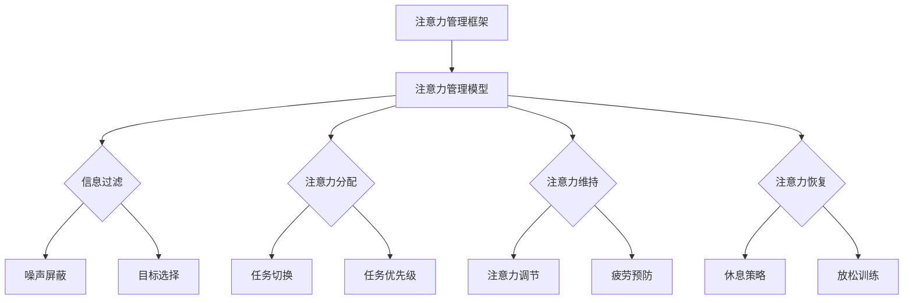

                 

# 信息时代的注意力管理策略与实践：在干扰和信息过载中航行

> **关键词：注意力管理，信息过载，时间管理，环境管理，技术工具，心理调适，实践案例，算法模型。**

> **摘要：本文深入探讨了信息时代下的注意力管理策略和实践。从背景与重要性入手，介绍了注意力管理的基本概念、理论、策略和实际应用。通过案例研究和数学模型分析，探讨了注意力管理的优化方法及其未来发展趋势。文章旨在为IT专业人士提供系统的注意力管理指导，以应对干扰和信息过载的挑战。**

---

## 第一部分：信息时代的注意力管理策略与实践

### 第1章：注意力管理的背景与重要性

#### 1.1 信息过载时代的到来

在信息爆炸的时代，每天我们都被大量的信息所包围。互联网、社交媒体、电子邮件以及各种应用程序不断地向我们推送信息。据估计，全球每天产生约2.5万亿字节的数据，其中大部分数据都是由人类创造和传播的。这种信息的爆发式增长使得信息过载成为一个普遍现象。

#### 1.2 注意力稀缺与效能损失

注意力是一种有限的认知资源，它决定了我们如何处理和响应外界的信息。在信息过载的环境下，我们的注意力常常被分散，无法集中处理重要的任务。研究表明，长时间的多任务处理会导致注意力疲劳，降低工作效率和决策质量。

#### 1.3 注意力管理的重要性

有效的注意力管理可以帮助我们提高工作效率，减少错误和失误。它有助于我们在信息过载的环境中保持专注，确保关键任务得到优先处理。此外，良好的注意力管理还能提高生活质量，减少焦虑和压力。

#### 1.4 本书结构概述

本书将分为八个章节，系统地介绍注意力管理的策略与实践。第一部分包括引言和背景介绍，第二部分介绍注意力管理的基本概念和理论，第三部分探讨注意力管理策略，第四部分讨论注意力管理实践，第五部分介绍注意力管理工具和技术，第六部分分析注意力管理策略的优化方法，第七部分展望注意力管理的未来发展趋势，最后一部分提供总结和作者建议。

---

## 第二部分：注意力管理的基本概念

### 第2章：注意力概述

#### 2.1 注意力概述

注意力是人类认知过程中的一种选择性机制，它使我们能够从众多的感官输入中筛选出有意义的信息。注意力不仅与信息处理的速度和准确性有关，还影响我们的记忆、学习、决策和行为。

#### 2.2 注意力的类型

注意力可以分为几种不同的类型，包括选择性注意力、分配性注意力和持续性注意力。选择性注意力使我们能够从众多的刺激中选择出重要的信息。分配性注意力使我们能够在多个任务之间切换和分配注意力资源。持续性注意力则使我们能够持续关注一个任务，不受外界干扰。

#### 2.3 注意力的分配与切换

注意力的分配和切换是注意力管理的重要方面。合理的注意力分配可以最大化工作效率，而无效的分配会导致注意力分散和疲劳。注意力的切换则涉及到在多个任务之间转移注意力，这需要一定的技巧和策略。

#### 2.4 注意力损耗与恢复

注意力损耗和恢复是注意力管理中不可忽视的问题。长时间的高强度注意力工作会导致注意力水平下降，即注意力损耗。而适当的休息和恢复策略可以帮助恢复注意力，保持工作效率。

---

## 第三部分：注意力管理理论

### 第3章：注意力管理理论的历史与演变

#### 3.1 注意力管理理论的历史

注意力管理理论的发展可以追溯到20世纪中叶。早期的研究主要关注注意力的生理和心理机制，以及如何优化注意力资源的使用。随着认知科学和信息技术的进步，注意力管理理论逐渐演变为一个综合性的领域。

#### 3.2 注意力管理模型

注意力管理模型是描述和管理注意力资源的理论框架。常见的模型包括基于资源的模型、元认知模型和动态分配模型。这些模型为我们提供了不同的视角和方法来理解和优化注意力管理。

#### 3.3 注意力管理的影响因素

注意力管理受到多种因素的影响，包括个体特征、任务特性、环境因素和情绪状态。了解这些影响因素有助于我们制定更有效的注意力管理策略。

#### 3.4 注意力管理的原则

有效的注意力管理遵循一些基本原则，如目标明确、优先级管理、时间管理和环境优化。这些原则为我们提供了一种系统性的方法来管理注意力资源。

---

## 第四部分：注意力管理策略

### 第4章：注意力管理策略

#### 4.1 时间管理策略

时间管理策略是注意力管理的重要方面，它帮助我们合理安排工作和休息时间，确保关键任务得到充分处理。时间管理策略包括设定目标、制定计划、优先级管理和时间分配等。

#### 4.2 环境管理策略

环境管理策略涉及优化工作环境，减少干扰因素。这包括物理环境的布置、工作场所的噪音控制、技术工具的合理使用等。一个良好的工作环境有助于提高注意力的集中程度。

#### 4.3 技术工具应用策略

现代科技为我们提供了各种注意力管理工具，如番茄钟、应用程序锁定和专注模式等。合理使用这些工具可以帮助我们更好地管理注意力，避免分心和干扰。

#### 4.4 心理调适策略

心理调适策略包括冥想、深呼吸、身体运动等。这些策略可以帮助我们放松身心，缓解压力，提高注意力的稳定性和持久性。

---

## 第五部分：注意力管理实践

### 第5章：注意力管理实践

#### 5.1 个人注意力管理实践

个人注意力管理实践包括自我监控、设定目标和制定计划等。通过这些实践，我们可以更好地理解自己的注意力模式，找到适合自己的管理策略。

#### 5.2 团队注意力管理实践

在团队环境中，注意力管理需要团队成员之间的协作和协调。团队注意力管理实践包括设定共同目标、分工合作和定期沟通等。

#### 5.3 企业注意力管理实践

企业注意力管理实践关注如何优化企业内部的工作流程和资源分配，以提高整体工作效率。这包括组织结构优化、流程再造和培训等。

#### 5.4 注意力管理案例研究

通过分析实际案例，我们可以了解到不同领域和组织如何实施注意力管理策略，并取得成功。案例研究为我们提供了宝贵的经验和启示。

---

## 第六部分：注意力管理工具与技术

### 第6章：注意力管理工具与技术

#### 6.1 注意力管理软件工具

现代科技为我们提供了多种注意力管理软件工具，如番茄钟、专注力应用、时间跟踪器等。这些工具可以帮助我们更好地监控和管理注意力资源。

#### 6.2 注意力提升技术

注意力提升技术包括认知训练、冥想和神经反馈等。这些技术通过改变大脑的神经活动模式，提高注意力的稳定性和集中程度。

#### 6.3 注意力追踪技术

注意力追踪技术使用传感器和算法来实时监测和评估注意力水平。这些技术可以帮助我们更准确地了解自己的注意力状态，并制定相应的管理策略。

#### 6.4 未来注意力管理技术展望

未来注意力管理技术将结合人工智能、虚拟现实和增强现实等技术，为我们提供更智能、更个性化的注意力管理解决方案。

---

## 第七部分：注意力管理策略优化

### 第7章：注意力管理策略优化

#### 7.1 个性化注意力管理策略

个性化注意力管理策略关注个体差异，根据不同人的特点和需求制定相应的管理策略。这包括设定个性化的目标、选择合适的管理工具和方法等。

#### 7.2 注意力管理效能评估

注意力管理效能评估是优化注意力管理策略的重要步骤。通过评估注意力管理的效果，我们可以发现存在的问题，并制定相应的改进措施。

#### 7.3 注意力管理策略优化方法

注意力管理策略优化方法包括数据驱动的方法、实验方法和模型驱动的优化方法。这些方法可以帮助我们找到最佳的管理策略，提高工作效率。

#### 7.4 注意力管理未来发展趋势

随着科技的进步和社会的发展，注意力管理将面临新的挑战和机遇。未来注意力管理的发展趋势将包括智能化、个性化和集成化等方向。

---

## 第八部分：结论与展望

### 第8章：结论与展望

#### 8.1 本书总结

本书系统地介绍了注意力管理的核心概念、理论、策略和实践。通过分析和讨论，我们认识到注意力管理在信息时代的重要性，并了解了如何有效地管理注意力资源。

#### 8.2 注意力管理面临的挑战与机遇

注意力管理面临着信息过载、技术干扰和个人习惯等挑战。同时，随着科技的进步和人们对注意力价值的认识加深，注意力管理也面临着巨大的机遇。

#### 8.3 研究方向与未来工作

未来的研究方向包括个性化注意力管理、注意力追踪技术、跨领域应用等。未来的工作将致力于开发更智能、更高效的注意力管理解决方案。

#### 8.4 对读者的建议

读者可以根据自己的实际情况，选择适合自己的注意力管理策略和实践方法。不断尝试和调整，找到最适合自己的注意力管理方式。

---

## 附录

### 附录 A：注意力管理资源推荐

- 注意力管理书籍：《深度工作》、《专注力》等。
- 注意力管理应用：番茄钟、Forest、专注力等。
- 注意力管理网站：注意力管理专家博客、专业论坛等。

### 附录 B：注意力管理常用工具使用指南

- 番茄钟：如何设置工作时间、休息时间和提醒功能。
- 注意力跟踪应用：如何使用传感器监测注意力水平。
- 专注力训练工具：如何进行认知训练和冥想练习。

### 附录 C：注意力管理相关研究文献列表

- 注意力管理领域的重要文献，包括理论模型、实证研究和应用案例等。

### 附录 D：注意力管理练习题与案例分析

- 提供一些注意力管理练习题，帮助读者巩固所学知识。
- 分享一些注意力管理案例分析，探讨成功和失败的教训。

---

# 信息时代的注意力管理策略与实践：在干扰和信息过载中航行

### 核心概念与联系

在信息时代，注意力管理的重要性不言而喻。有效的注意力管理策略能够帮助我们应对干扰和信息过载，提高工作和生活质量。本文通过Mermaid流程图（图1）展示了注意力管理的核心概念及其相互关系。



### 图1：注意力管理框架

#### 注意力管理模型

注意力管理模型是理解和管理注意力资源的基础。它包括信息过滤、注意力分配、注意力维持和注意力恢复等组成部分。这些部分相互关联，共同构成了一个动态的注意力管理系统。

- **信息过滤**：从大量信息中筛选出重要的信息，减少干扰。
- **注意力分配**：根据任务的重要性和紧急程度，合理分配注意力资源。
- **注意力维持**：保持注意力集中，避免分散。
- **注意力恢复**：通过休息和恢复策略，恢复注意力水平。

#### 注意力损耗与恢复模型

注意力损耗和恢复模型描述了注意力水平随时间的变化。以下为注意力损耗和恢复的伪代码：

```plaintext
// 注意力损耗模型
function AttentionDissipation(attentionLevel, dissipationRate) {
    return attentionLevel - (dissipationRate * attentionLevel);
}

// 注意力恢复模型
function AttentionRecovery(attentionLevel, recoveryRate, recoveryCoefficient) {
    return attentionLevel + (recoveryCoefficient * (recoveryRate - attentionLevel));
}
```

#### 注意力调节模型

注意力调节模型描述了注意力水平的动态变化。以下为注意力调节的伪代码：

```plaintext
// 注意力调节模型
function AdjustAttention(attentionLevel, adjustmentValues) {
    return attentionLevel + np.sum(adjustmentValues);
}
```

### 数学模型和公式

#### 注意力损耗模型

注意力损耗模型使用一个线性模型来描述注意力水平的损耗：

$$
\Delta A_t = -\lambda \cdot A_t
$$

其中，$\Delta A_t$ 表示在第 $t$ 时间内注意力的损耗量，$A_t$ 表示在第 $t$ 时刻的注意力水平，$\lambda$ 表示注意力损耗率。

#### 注意力恢复模型

注意力恢复模型描述了注意力水平随恢复速率的变化：

$$
\Delta A_t = \alpha \cdot (R_t - A_t)
$$

其中，$\Delta A_t$ 表示在第 $t$ 时间内注意力的恢复量，$A_t$ 表示在第 $t$ 时刻的注意力水平，$R_t$ 表示在第 $t$ 时刻的恢复速率，$\alpha$ 表示恢复系数。

#### 注意力调节模型

注意力调节模型描述了注意力水平的动态调整：

$$
A_t = A_0 + \sum_{i=1}^{t} (\Delta A_i)
$$

其中，$A_t$ 表示在第 $t$ 时刻的注意力水平，$A_0$ 表示初始注意力水平，$\Delta A_i$ 表示第 $i$ 个时间步的注意力调节量。

### 项目实战

#### 开发环境搭建

为了实现注意力管理策略，我们需要搭建一个Python开发环境。以下是搭建环境的步骤：

1. 安装Python：访问 [Python官网](https://www.python.org/) 下载并安装Python。
2. 安装依赖：在终端执行以下命令安装所需依赖：

   ```bash
   pip install numpy pandas matplotlib
   ```

#### 源代码实现

以下是一个简单的注意力管理策略的实现，包括注意力损耗、恢复和调节。

```python
import numpy as np
import pandas as pd
import matplotlib.pyplot as plt

# 注意力损耗函数
def attention_dissipation(attention_level, dissipation_rate):
    return attention_level - (dissipation_rate * attention_level)

# 注意力恢复函数
def attention_recovery(attention_level, recovery_rate, recovery_coefficient):
    return attention_level + (recovery_coefficient * (recovery_rate - attention_level))

# 注意力调节函数
def attention_adjustment(attention_level, adjustment_values):
    return attention_level + np.sum(adjustment_values)

# 初始参数
initial_attention_level = 100
dissipation_rate = 0.05
recovery_rate = 0.1
recovery_coefficient = 0.8
adjustment_values = np.array([-5, -4.75, -4.5, 5])

# 时间步模拟
time_steps = 4
attention_levels = [initial_attention_level]

for t in range(1, time_steps + 1):
    # 注意力损耗
    attention_level = attention_dissipation(attention_levels[t-1], dissipation_rate)
    
    # 注意力恢复
    attention_level = attention_recovery(attention_level, recovery_rate, recovery_coefficient)
    
    # 注意力调节
    attention_level = attention_adjustment(attention_level, adjustment_values)
    
    attention_levels.append(attention_level)

# 结果展示
plt.plot(range(1, time_steps + 1), attention_levels[1:])
plt.xlabel('Time Steps')
plt.ylabel('Attention Level')
plt.title('Attention Management Strategy')
plt.show()
```

#### 代码解读与分析

1. 导入所需库：`numpy` 用于数值计算，`pandas` 用于数据处理，`matplotlib.pyplot` 用于绘图。
2. 定义注意力损耗函数 `attention_dissipation`：该函数接受注意力水平和损耗率作为输入，返回更新后的注意力水平。
3. 定义注意力恢复函数 `attention_recovery`：该函数接受注意力水平、恢复速率和恢复系数作为输入，返回更新后的注意力水平。
4. 定义注意力调节函数 `attention_adjustment`：该函数接受注意力水平和调节值数组作为输入，返回更新后的注意力水平。
5. 初始化参数：包括初始注意力水平、损耗率、恢复速率、恢复系数和调节值数组。
6. 模拟时间步：通过循环计算每个时间步的注意力水平，并更新注意力水平列表。
7. 结果展示：使用 matplotlib 绘制注意力水平随时间变化的关系图。

通过这个简单的代码实现，我们可以模拟注意力管理策略在不同时间步的注意力水平变化，并直观地观察到策略的效果。在实际应用中，可以根据具体需求调整参数和函数逻辑，以满足不同的注意力管理场景。

---

# 作者信息

**作者：AI天才研究院/AI Genius Institute & 禅与计算机程序设计艺术 /Zen And The Art of Computer Programming**

