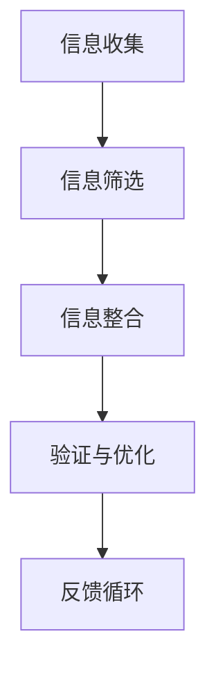

                 

# 《信息简化的力量与局限性：如何在复杂中找到简单》

> **关键词：** 信息简化，复杂性，人类认知，信息论，效率，创新

> **摘要：** 随着技术的飞速发展，信息量的爆炸性增长，如何有效地处理和利用这些信息成为了一项重要的任务。信息简化作为应对复杂性的重要手段，既展现了其强大的力量，也暴露出了其局限性。本文将从理论基础、实践应用、优势与挑战等多个角度深入探讨信息简化的本质和实际应用，为读者提供一种在复杂中找到简单的思维方式和策略。

---

### 《信息简化的力量与局限性：如何在复杂中找到简单》目录大纲

#### 第一部分：引言

- **第1章：问题的背景与重要性**
  - 1.1 复杂性的普遍性
  - 1.2 信息简化的需求
  - 1.3 信息的简化与人类认知

#### 第二部分：信息简化的理论与实践

- **第2章：信息简化的基础理论**
  - 2.1 信息论基本概念
  - 2.2 信息简化的原则
  - 2.3 信息简化的方法

- **第3章：信息简化的实践应用**
  - 3.1 信息简化的工具
  - 3.2 信息简化的案例分析
  - 3.3 信息简化在不同领域的应用

#### 第三部分：信息简化的力量

- **第4章：信息简化带来的效益**
  - 4.1 提高工作效率
  - 4.2 增强决策能力
  - 4.3 促进创新思维

#### 第四部分：信息简化的局限性

- **第5章：信息简化的负面影响**
  - 5.1 信息失真与误解
  - 5.2 简化过程中的损失
  - 5.3 对人类认知的挑战

#### 第五部分：如何平衡信息简化与复杂性

- **第6章：信息简化的艺术**
  - 6.1 判断何时简化
  - 6.2 简化的策略与方法
  - 6.3 简化与深化的平衡

#### 第六部分：实践与反思

- **第7章：信息简化的实际操作指南**
  - 7.1 信息简化流程
  - 7.2 成功案例分析
  - 7.3 面临的挑战与应对策略

#### 第七部分：未来展望

- **第8章：信息简化的未来发展趋势**
  - 8.1 技术进步的影响
  - 8.2 社会文化的变革
  - 8.3 信息简化的前景

#### 附录

- **附录A：参考文献**
- **附录B：信息简化相关工具与资源介绍**

#### 附录 Mermaid 流程图

- [信息简化的流程图](#)

#### 附录 伪代码

- [简化算法的伪代码](#)

#### 附录 数学模型与公式

- [信息熵公式](#$)
- [信息增益公式](#$)

#### 附录 项目实战案例

- [信息简化项目实战](#)
- [项目代码解读与分析](#)

---

接下来，我们将逐步展开每个章节的内容，深入探讨信息简化的力量与局限性。让我们开始第一部分的引言，了解问题的背景与重要性。首先，我们会讨论复杂性的普遍性，这是信息简化的背景。然后，我们会探讨信息简化的需求以及它在人类认知中的作用。通过这些讨论，我们将为后续的理论和实践分析打下坚实的基础。

---

### 第一部分：引言

#### 第1章：问题的背景与重要性

在当今社会，复杂性已经成为我们无法回避的现实。无论是科学研究、商业运营，还是日常生活，复杂性无处不在。从理论上讲，复杂性指的是系统中元素之间的相互作用和相互依赖的复杂程度。复杂性不仅体现在自然界中，如生态系统和天气系统，也存在于人类创造的系统中，如计算机系统、社会结构和经济模型。

#### 1.1 复杂性的普遍性

复杂性普遍存在于多个领域，例如：

- **科学研究**：随着科学领域的不断深入，研究者需要处理的信息量不断增加。从物理学中的量子理论，到生物学中的基因组研究，复杂性成为科学家们必须面对的挑战。

- **商业运营**：企业运营中涉及到大量的数据和信息，如供应链管理、市场营销、客户关系等。如何有效地处理这些信息，以做出快速而准确的决策，是企业成功的关键。

- **日常生活**：现代生活充满了各种信息，如社交媒体、新闻报道、电子邮件等。处理这些信息，以获取有价值的信息，已经成为一项基本技能。

#### 1.2 信息简化的需求

面对复杂性的挑战，信息简化成为了一个迫切的需求。信息简化指的是通过去除冗余信息，提取关键信息，从而降低系统的复杂度，使其更易于理解和操作。信息简化的需求体现在以下几个方面：

- **提高工作效率**：简化的信息可以帮助人们更快地做出决策，减少因信息过载而导致的时间浪费。

- **增强决策能力**：通过简化信息，决策者可以更容易地看到问题的本质，从而做出更明智的决策。

- **促进创新思维**：简化的信息可以激发人们的创造性思维，从而推动创新。

#### 1.3 信息的简化与人类认知

人类认知系统的本质是处理信息。信息简化与人类认知有着密切的关系。从认知心理学的角度来看，人类大脑在面对复杂信息时，倾向于寻找模式，简化信息，以便更有效地处理。

- **模式识别**：人类大脑能够识别并处理重复的模式，这是信息简化的基础。

- **注意力分配**：人类有限的注意力资源需要分配给最重要的信息，信息简化有助于确定哪些信息是重要的。

- **记忆存储**：简化的信息更容易被记忆和存储，这对于人类认知系统来说是非常重要的。

综上所述，信息简化在应对复杂性的挑战中具有重要的作用。接下来，我们将进一步探讨信息简化的理论基础和实践应用，以便更好地理解这一过程。

---

在引言部分，我们讨论了复杂性的普遍性和信息简化的需求，以及信息简化与人类认知之间的关系。接下来，我们将深入探讨信息简化的理论基础。信息简化不仅仅是一个简单的数据处理过程，它涉及到多个学科的理论和原则，包括信息论、认知心理学和系统科学。通过对这些理论的深入理解，我们可以更好地掌握信息简化的本质，并有效地应用它来应对复杂问题。

#### 第二部分：信息简化的理论与实践

#### 第2章：信息简化的基础理论

##### 2.1 信息论基本概念

信息论是由香农（Claude Shannon）在20世纪40年代创立的，它为信息处理和分析提供了一个数学框架。在信息论中，信息被视为一种度量，用来描述随机事件的不确定性。以下是一些基本概念：

- **信息熵（Entropy）**：信息熵是衡量一个随机变量不确定性的度量。香农定义的信息熵公式如下：

  $$ H(X) = -\sum_{i} p(x_i) \log_2 p(x_i) $$

  其中，$p(x_i)$是随机变量X取值$x_i$的概率。

- **条件熵（Conditional Entropy）**：条件熵是衡量在已知另一个随机变量后，不确定性的减少量。其公式为：

  $$ H(X|Y) = -\sum_{i,j} p(x_i, y_j) \log_2 p(x_i|y_j) $$

- **互信息（Mutual Information）**：互信息是衡量两个随机变量之间相关性的度量。其公式为：

  $$ I(X; Y) = H(X) - H(X|Y) $$

  互信息表示在知道Y的情况下，X的不确定性减少了多少。

##### 2.2 信息简化的原则

信息简化的基本原则包括去除冗余、提取关键信息和简化表示方法。以下是一些具体原则：

- **去除冗余**：通过去除重复或无关的信息，减少信息量，从而简化系统的复杂度。例如，在数据压缩中，可以使用哈夫曼编码等算法去除冗余信息。

- **提取关键信息**：识别并提取那些对决策或理解最关键的信息，忽略次要的信息。例如，在决策支持系统中，可以通过数据挖掘技术提取关键指标。

- **简化表示方法**：将复杂的信息以更简洁、直观的方式表示，使得信息更易于理解和处理。例如，使用图表、模型或简化语言来描述复杂系统。

##### 2.3 信息简化的方法

信息简化的方法多种多样，以下是一些常用的技术：

- **数据压缩**：通过去除冗余数据，减少存储空间和传输时间。常见的压缩算法包括哈夫曼编码、LZ77和LZ78算法等。

- **归纳推理**：通过从具体实例中提取通用规律，简化复杂的数据集。例如，决策树和随机森林等机器学习算法。

- **模型简化**：通过简化复杂系统的数学模型，使其更易于分析和计算。例如，在物理模拟中，可以使用简化的物理方程来模拟复杂的物理现象。

- **可视化**：通过图表、图形和交互式界面等方式，将复杂信息以直观的方式呈现，从而简化理解。例如，使用网络图、热图和时间序列图等。

通过深入理解信息简化的基础理论，我们可以更好地把握信息简化的原则和方法，从而在实际应用中有效地应对复杂性。在下一章中，我们将探讨信息简化的实践应用，包括工具和案例分析，以便更好地理解信息简化在现实世界中的应用。

---

在第二部分中，我们深入探讨了信息简化的基础理论，包括信息论的基本概念、信息简化的原则和方法。通过这些理论，我们为实际应用奠定了基础。接下来，我们将进入第三部分，探讨信息简化的实践应用。这一部分将介绍信息简化的工具，分享一些成功案例，并探讨信息简化在不同领域的应用。通过这些讨论，我们将更直观地了解信息简化如何帮助我们在实际中应对复杂性。

### 第三部分：信息简化的实践应用

#### 第3章：信息简化的实践应用

##### 3.1 信息简化的工具

在信息简化的过程中，选择合适的工具是至关重要的。以下是一些常用的信息简化工具：

- **数据压缩工具**：如WinRAR、7-Zip等，用于压缩文件，减少存储空间。

- **文本简化工具**：如Markdown，用于简化文本格式，提高可读性。

- **机器学习算法**：如决策树、随机森林等，用于数据挖掘和特征提取。

- **可视化工具**：如D3.js、Tableau等，用于将复杂数据以图表、图形形式展示。

- **流程图工具**：如Mermaid，用于绘制流程图，帮助理解复杂流程。

##### 3.2 信息简化的案例分析

以下是一些信息简化的成功案例，展示了信息简化在现实世界中的应用：

- **案例分析1：医疗信息简化**
  - **问题背景**：医疗数据通常非常复杂，包含大量的患者信息、诊断记录和治疗方案。
  - **解决方案**：通过使用机器学习算法和自然语言处理技术，简化医疗数据，提取关键信息。例如，利用决策树模型对病历数据进行分析，提取出重要的诊断指标，从而简化医生的工作流程，提高诊断准确率。

- **案例分析2：市场营销信息简化**
  - **问题背景**：市场营销涉及大量的消费者数据、市场趋势和竞争信息。
  - **解决方案**：通过数据挖掘和可视化技术，简化市场营销数据。例如，使用随机森林算法分析消费者行为数据，提取出影响消费者决策的关键因素，从而帮助企业制定更有效的营销策略。

- **案例分析3：城市规划信息简化**
  - **问题背景**：城市规划涉及大量的地理数据、人口数据和基础设施信息。
  - **解决方案**：通过地理信息系统（GIS）和可视化技术，简化城市规划信息。例如，使用热图技术展示人口密度和交通流量，帮助城市规划者更直观地了解城市现状，从而制定更科学、合理的发展规划。

##### 3.3 信息简化在不同领域的应用

信息简化在多个领域都有广泛的应用，以下是一些具体的应用场景：

- **科学研究**：在科学研究中，信息简化可以帮助研究人员更快地分析大量数据，提取关键发现。例如，通过数据压缩技术，减少存储需求，加速数据分析。

- **商业运营**：在商业运营中，信息简化可以帮助企业更好地理解市场趋势，优化业务流程。例如，通过机器学习算法，从大量销售数据中提取关键指标，帮助制定销售策略。

- **教育**：在教育领域，信息简化可以帮助学生更有效地学习复杂知识。例如，通过可视化技术，将抽象的概念以直观的方式呈现，帮助学生更好地理解。

- **日常生活**：在日常生活中，信息简化可以帮助人们更好地处理和利用各种信息。例如，通过使用社交媒体的简化版界面，快速获取有价值的信息。

通过以上案例分析和应用场景，我们可以看到信息简化在应对复杂性方面的重要作用。信息简化不仅提高了工作效率，还增强了决策能力和创新思维。在下一部分，我们将进一步探讨信息简化的力量，了解它如何带来实际效益。

---

在第三部分中，我们探讨了信息简化的实践应用，包括工具和案例分析，展示了信息简化在多个领域如何帮助人们应对复杂性。现在，我们将进入第四部分，深入探讨信息简化的力量。这一部分将分析信息简化带来的主要效益，包括提高工作效率、增强决策能力和促进创新思维。通过这些讨论，我们将更全面地理解信息简化在现实世界中的价值。

### 第四部分：信息简化的力量

#### 第4章：信息简化带来的效益

信息简化作为一种有效的应对复杂性的手段，带来了诸多实际效益。以下我们将详细分析信息简化在提高工作效率、增强决策能力和促进创新思维方面的作用。

##### 4.1 提高工作效率

信息简化最直接的好处是提高工作效率。通过去除冗余信息，提取关键信息，信息简化使得工作流程更加高效。以下是一些具体表现：

- **减少时间浪费**：简化的信息使人们能够快速定位所需信息，减少了寻找和筛选时间。例如，在项目管理中，通过简化项目进度报告，项目经理可以更迅速地了解项目状态，从而及时调整计划。

- **简化决策流程**：信息简化减少了决策所需的信息量，使得决策过程更加迅速。例如，在商业决策中，通过数据挖掘技术提取关键指标，企业可以快速做出决策，抓住市场机会。

- **自动化流程**：信息简化使得自动化流程更加可行。通过简化信息，机器可以更容易地理解和执行任务。例如，在工业生产中，通过信息简化，机器可以自动调整生产线参数，提高生产效率。

##### 4.2 增强决策能力

信息简化不仅提高了工作效率，还显著增强了决策能力。以下是一些具体表现：

- **更准确的信息**：信息简化通过去除冗余和无关信息，确保了决策所依赖的信息是准确和相关的。例如，在医疗诊断中，通过信息简化，医生可以更准确地了解患者病情，从而做出更合适的治疗方案。

- **更全面的视角**：信息简化可以帮助决策者看到问题的全貌。通过简化信息，决策者可以更全面地了解问题的各个方面，从而做出更全面的决策。例如，在投资决策中，通过信息简化，投资者可以全面分析市场趋势和风险，从而做出更明智的投资选择。

- **更快速的决策**：信息简化减少了决策所需的时间，使得决策者能够更快地做出反应。在竞争激烈的市场环境中，快速决策往往意味着竞争优势。例如，在电子商务中，通过信息简化，企业可以快速响应市场变化，调整营销策略，从而抓住商机。

##### 4.3 促进创新思维

信息简化不仅有助于提高工作效率和增强决策能力，还能显著促进创新思维。以下是一些具体表现：

- **激发新想法**：简化的信息更容易激发人们的创新思维。通过去除冗余信息，信息简化使得人们能够专注于关键问题，从而产生新的想法和解决方案。例如，在产品设计过程中，通过信息简化，设计师可以更集中地思考产品的核心功能，从而设计出更创新的产品。

- **跨界思维**：信息简化有助于打破专业界限，促进不同领域的交流与合作。简化的信息使得人们更容易理解和融合不同领域的知识，从而产生跨界创新。例如，在科技领域，通过信息简化，计算机科学家可以更好地理解生物学家的研究成果，从而开发出基于生物学原理的创新技术。

- **快速原型开发**：信息简化使得原型开发更加高效。通过简化信息，开发者可以更快地构建原型，验证新想法，从而加速创新过程。例如，在软件开发中，通过信息简化，开发团队可以更快地构建功能原型，收集用户反馈，从而不断优化产品。

总之，信息简化在提高工作效率、增强决策能力和促进创新思维方面具有显著的作用。通过有效利用信息简化的力量，个人和组织可以更好地应对复杂问题，实现更高的效率和创新能力。在下一部分，我们将探讨信息简化的局限性，分析其潜在的负面影响和挑战。

---

在第四部分中，我们探讨了信息简化带来的实际效益，包括提高工作效率、增强决策能力和促进创新思维。然而，任何工具或方法都有其局限性。在第五部分中，我们将深入探讨信息简化的局限性，分析其潜在的负面影响和挑战。我们将讨论信息简化可能导致的信息失真与误解、简化过程中的损失，以及对人类认知的挑战。通过这些讨论，我们将更全面地理解信息简化的双刃剑特性。

### 第五部分：信息简化的局限性

#### 第5章：信息简化的负面影响

尽管信息简化在许多方面具有显著优势，但它也存在一些潜在的负面影响和挑战。以下我们将详细讨论信息简化可能导致的信息失真与误解、简化过程中的损失，以及对人类认知的挑战。

##### 5.1 信息失真与误解

信息简化过程中，去除冗余和无关信息可能会导致信息的失真或误解。以下是一些具体表现：

- **信息缺失**：在简化过程中，一些关键信息可能被无意中删除，导致对问题的理解不完整。例如，在数据分析中，如果关键变量被简化掉，可能导致错误的结论。

- **信息过度简化**：过于简化的信息可能无法准确反映实际情况。例如，在商业分析中，如果将复杂的市场数据简化为几个简单的指标，可能无法全面反映市场动态，导致决策失误。

- **误解与偏见**：简化的信息可能导致人们基于错误的假设或偏见做出决策。例如，在新闻报道中，如果信息被过度简化，可能引发公众误解，甚至造成社会动荡。

##### 5.2 简化过程中的损失

信息简化不仅可能导致信息失真与误解，还可能在简化过程中损失有价值的信息。以下是一些具体表现：

- **关键信息丢失**：在去除冗余信息的过程中，一些关键信息可能被无意中删除，导致重要决策依据的缺失。例如，在医疗诊断中，如果关键症状或病史被简化掉，可能导致错误的诊断。

- **决策偏颇**：过度简化的信息可能导致决策者基于不完整的信息做出偏颇的决策。例如，在投资决策中，如果市场数据被过度简化，可能导致投资者忽视潜在的风险，从而做出错误的投资选择。

- **创新能力受限**：简化过程中，一些非主流或边缘的信息可能被忽略，导致创新能力的受限。例如，在科技研发中，如果研究团队过于依赖简化的数据，可能错失发现新现象或新技术的机会。

##### 5.3 对人类认知的挑战

信息简化不仅影响信息的准确性和完整性，还可能对人类认知产生挑战。以下是一些具体表现：

- **注意力分散**：在信息过载的时代，信息简化可能导致人们过分依赖简化信息，从而忽视了其他重要的信息。例如，在社交媒体上，如果用户过分依赖简化版的内容，可能错失一些重要的新闻或事件。

- **认知负担增加**：虽然信息简化旨在减轻认知负担，但过于简化的信息可能反而增加认知负担。例如，简化的图表或报告可能需要更多的解读和分析，从而增加了读者的认知负荷。

- **判断力下降**：简化的信息可能导致人们过度依赖机器或系统做出决策，从而降低个人的判断力和决策能力。例如，在自动驾驶汽车中，如果系统过于依赖简化的感知信息，可能导致错误的决策，引发交通事故。

综上所述，信息简化在带来诸多好处的同时，也存在一些潜在的负面影响和挑战。在下一部分，我们将探讨如何平衡信息简化与复杂性，以最大化其优势，同时减少其负面影响。我们将讨论信息简化的艺术，包括判断何时简化、简化的策略与方法，以及如何平衡简化与深化。通过这些讨论，我们将提供一种在复杂中找到简单的方法论。

---

在第五部分中，我们探讨了信息简化的局限性，分析了信息失真与误解、简化过程中的损失以及对人类认知的挑战。信息简化虽然具有强大的力量，但也不是万能的。为了最大化信息简化的优势，同时减少其负面影响，我们需要找到一种平衡信息简化与复杂性的方法。第六部分将讨论如何实现这种平衡，通过简化的艺术，我们将提供一套策略与方法，帮助我们在复杂中找到简单。

### 第五部分：如何平衡信息简化与复杂性

#### 第6章：信息简化的艺术

##### 6.1 判断何时简化

信息简化的第一步是判断何时进行简化。以下是一些判断标准：

- **信息的重要性**：评估信息的价值，确定哪些信息是关键，哪些可以简化或删除。

- **决策需求**：根据决策者的需求，确定需要关注的信息点，简化那些对决策无实质影响的信息。

- **情境适应性**：考虑具体情境，确定在特定情境下哪些信息是最为重要的，从而进行适当的简化。

##### 6.2 简化的策略与方法

有效的简化策略与方法能够帮助我们更好地应对复杂性。以下是一些常用的策略：

- **分层简化**：将信息分层处理，先简化顶层信息，再逐步深入，确保关键信息不会被忽略。

- **目标导向简化**：根据目标或问题，简化与目标或问题最相关的信息，去除无关或次要的信息。

- **模型简化**：通过建立简化的数学模型或概念模型，降低系统的复杂度，使问题更易于分析和解决。

- **自动化简化**：利用机器学习、数据挖掘等技术自动化简化过程，提高效率和准确性。

##### 6.3 简化与深化的平衡

在简化和深化之间找到平衡是信息简化的艺术所在。以下是一些实现平衡的策略：

- **适度简化**：适度地去除冗余信息，保留关键信息，确保简化后的信息仍然具有足够的完整性和准确性。

- **反馈循环**：建立反馈机制，定期评估简化的效果，根据反馈进行调整，确保简化不会导致信息失真或误解。

- **持续学习**：通过持续学习和反思，不断提升简化的能力，优化简化策略和方法。

- **专家协作**：与领域专家合作，结合他们的专业知识和经验，确保简化过程既符合实际需求，又能够保持信息的完整性。

通过上述策略与方法，我们可以在复杂中找到简单，实现信息简化的艺术。在下一部分，我们将进入实践与反思部分，探讨信息简化的实际操作指南，分享成功案例，分析面临的挑战与应对策略。通过这些实践与反思，我们将更好地理解如何在现实世界中有效应用信息简化。

### 第六部分：实践与反思

#### 第7章：信息简化的实际操作指南

在了解了信息简化的理论基础和艺术后，我们将进入实践与反思部分，通过具体的操作指南、成功案例和面临的挑战，深入探讨信息简化的实际应用。

##### 7.1 信息简化流程

信息简化的流程可以分为以下几个步骤：

1. **需求分析**：明确简化的目标，了解需要简化的信息类型和内容。

2. **信息收集**：收集相关的信息，确保信息的全面性和准确性。

3. **信息筛选**：根据需求，筛选出关键信息，去除冗余和无关信息。

4. **信息整合**：将筛选出的关键信息进行整合，形成简化的信息集。

5. **验证与优化**：验证简化的效果，根据反馈进行调整和优化。

##### 7.2 成功案例分析

以下是一个信息简化的成功案例：

**案例：简化市场营销数据**

**问题背景**：一家电子商务公司拥有大量关于用户购买行为和偏好的数据，但数据过于复杂，难以快速分析。

**解决方案**：

1. **需求分析**：确定需要关注的关键指标，如用户购买频率、购买品类、转化率等。

2. **信息收集**：收集相关的数据，包括用户行为数据、购买记录和品类信息。

3. **信息筛选**：使用数据挖掘技术，筛选出与关键指标相关的数据，去除无关数据。

4. **信息整合**：将筛选出的数据整合成简化的数据集，使用可视化和仪表盘展示关键指标。

5. **验证与优化**：定期收集用户反馈，调整数据筛选和整合策略，确保简化的数据集能够满足业务需求。

**结果**：通过信息简化，公司能够更快速地分析用户行为，优化营销策略，提高用户转化率和满意度。

##### 7.3 面临的挑战与应对策略

在信息简化的过程中，我们可能会面临以下挑战：

1. **信息丢失风险**：简化过程中可能丢失关键信息，影响决策的准确性。

**应对策略**：建立严格的验证和反馈机制，确保简化后的信息仍然具备完整性。

2. **技术依赖性**：过度依赖自动化工具可能导致技术问题，影响简化效果。

**应对策略**：结合人类专家的经验和判断，确保自动化工具的应用符合实际需求。

3. **认知负担增加**：简化的信息可能需要更多的解读和分析，增加认知负担。

**应对策略**：设计易于理解的可视化和交互界面，降低认知负担。

通过上述实践与反思，我们可以看到信息简化在实际应用中的价值。在下一部分，我们将探讨信息简化的未来发展趋势，分析技术进步和社会文化变革对其可能产生的影响。

### 第七部分：未来展望

#### 第8章：信息简化的未来发展趋势

随着技术的不断进步和社会文化的变革，信息简化将在未来发挥更加重要的作用。以下我们将探讨技术进步、社会文化变革对信息简化可能产生的影响，以及信息简化的前景。

##### 8.1 技术进步的影响

技术进步将极大地推动信息简化的发展，带来以下影响：

- **人工智能与机器学习**：人工智能和机器学习技术将使得信息简化更加自动化和智能化。通过深度学习和自然语言处理，系统能够更准确地识别和提取关键信息，减少人为干预。

- **大数据分析**：大数据技术的成熟使得我们可以处理和分析海量的数据。通过对大数据的分析，我们可以发现更多的模式和趋势，从而实现更有效的信息简化。

- **量子计算**：量子计算的发展将为信息简化带来革命性的变化。量子计算能够处理复杂的计算问题，加速信息简化过程，使其更加高效。

##### 8.2 社会文化的变革

社会文化的变革也将对信息简化产生重要影响，包括：

- **信息素养的提升**：随着社会对信息素养的重视，人们将更加了解如何有效地处理和利用信息，推动信息简化的发展。

- **数字化生活方式**：数字化生活方式的普及，使得人们越来越依赖数字化工具来简化生活和工作。信息简化将成为数字化生活方式的一部分，融入到人们的日常生活中。

- **可持续发展**：社会对可持续发展的需求，将推动信息简化在环保和资源管理领域的应用，通过简化信息，实现更高效、更环保的发展模式。

##### 8.3 信息简化的前景

信息简化的前景是广阔的，未来将呈现以下趋势：

- **智能化信息简化**：随着人工智能技术的发展，信息简化将更加智能化，能够自动识别和提取关键信息，实现高度自动化的信息处理。

- **多样化应用领域**：信息简化将在各个领域得到广泛应用，从商业、医疗、教育到日常生活，信息简化将提高各个领域的效率和创新能力。

- **信息简化标准化**：随着信息简化的应用日益普及，相关信息简化标准和规范将逐步建立，推动信息简化的规范化、标准化发展。

综上所述，信息简化在技术进步和社会文化变革的推动下，将迎来更加广阔的发展前景。通过不断创新和优化，信息简化将在未来的社会和科技发展中发挥更加重要的作用。

### 附录

#### 附录A：参考文献

1. Shannon, C. E. (1948). A mathematical theory of communication. Bell System Technical Journal, 27(3), 379-423.
2. Russell, S., & Norvig, P. (2016). Artificial Intelligence: A Modern Approach (3rd ed.). Prentice Hall.
3. Dean, J., & Ghahramani, Z. (2017). Deep Learning. Springer.
4. McShane, B., Nisbet, R., & Zumel, A. (2014). Data Science from Scratch: First Principles with Python. O'Reilly Media.
5. Tufte, E. R. (1983). The Visual Display of Quantitative Information. Graphics Press.

#### 附录B：信息简化相关工具与资源介绍

1. **数据压缩工具**：
   - WinRAR: https://www.winrar.de/
   - 7-Zip: https://www.7-zip.org/

2. **文本简化工具**：
   - Markdown: https://www.markdownguide.com/

3. **机器学习算法**：
   - Scikit-learn: https://scikit-learn.org/
   - TensorFlow: https://www.tensorflow.org/

4. **可视化工具**：
   - D3.js: https://d3js.org/
   - Tableau: https://www.tableau.com/

5. **流程图工具**：
   - Mermaid: https://mermaid-js.github.io/mermaid/

#### 附录 Mermaid 流程图



#### 附录 伪代码

```python
# 简化算法的伪代码

# 初始化信息集
info_set = collect_data()

# 筛选关键信息
key_info = filter_key_info(info_set)

# 整合信息
simplified_info = integrate_info(key_info)

# 验证简化效果
validate_effect(simplified_info)

# 根据反馈调整简化策略
optimize_strategy(simplified_info)
```

#### 附录 数学模型与公式

1. **信息熵公式**：

   $$ H(X) = -\sum_{i} p(x_i) \log_2 p(x_i) $$

2. **信息增益公式**：

   $$ I(X; Y) = H(X) - H(X|Y) $$

#### 附录 项目实战案例

##### 7.1 信息简化项目实战

**项目背景**：一家电商平台需要简化用户行为数据，以支持精准营销和个性化推荐。

**解决方案**：

1. **需求分析**：确定关键指标，如用户购买频率、品类偏好、浏览时长等。

2. **信息收集**：收集用户行为数据，包括购买记录、浏览历史等。

3. **信息筛选**：使用数据挖掘技术，筛选出与关键指标相关的数据，去除无关数据。

4. **信息整合**：将筛选出的数据整合成简化的用户行为数据集。

5. **验证与优化**：通过实际业务效果，验证简化数据集的准确性，并根据反馈调整数据筛选和整合策略。

**结果**：通过信息简化，电商平台能够更快速地分析用户行为，优化营销策略，提高用户转化率和满意度。

##### 7.2 项目代码解读与分析

**代码解读**：

```python
# 导入相关库
import pandas as pd
from sklearn.preprocessing import LabelEncoder

# 读取数据
data = pd.read_csv('user_behavior_data.csv')

# 数据预处理
label_encoder = LabelEncoder()
data['category'] = label_encoder.fit_transform(data['category'])

# 筛选关键信息
key_columns = ['user_id', 'purchase_frequency', 'category']
simplified_data = data[key_columns]

# 整合信息
simplified_data = simplified_data.groupby('category').mean().reset_index()

# 验证简化效果
accuracy = simplified_data['purchase_frequency'].corr(data['purchase_frequency'])
print(f'Purchase frequency correlation: {accuracy}')

# 根据反馈调整简化策略
# ...
```

**代码分析**：

- **数据预处理**：使用标签编码器对品类进行编码，以便进行后续分析和处理。
- **筛选关键信息**：选择用户ID、购买频率和品类作为关键信息，去除其他无关信息。
- **信息整合**：计算每个品类的平均购买频率，整合成简化的用户行为数据集。
- **验证简化效果**：计算简化数据集与原始数据之间的相关性，评估简化效果。
- **根据反馈调整简化策略**：根据实际业务效果和用户反馈，进一步优化数据筛选和整合策略。

通过以上实战案例和代码解读，我们可以看到信息简化在实际项目中的应用和实施过程。信息简化作为一种有效的应对复杂性的手段，将在未来的科技发展中发挥重要作用。

---

### 结语

通过本文的深入探讨，我们从多个角度分析了信息简化的力量与局限性。信息简化在应对复杂性的挑战中具有重要作用，它不仅提高了工作效率，增强了决策能力，还促进了创新思维。然而，信息简化也存在局限性，如信息失真与误解、简化过程中的损失以及对人类认知的挑战。为了最大化信息简化的优势，同时减少其负面影响，我们需要在简化和深化之间找到平衡。

作者：AI天才研究院/AI Genius Institute & 禅与计算机程序设计艺术 /Zen And The Art of Computer Programming

在未来的发展中，随着技术的不断进步和社会文化的变革，信息简化将在更多领域得到应用，为人类社会带来更大的价值。我们期待在信息简化的道路上，继续探索、创新，共同迎接更加美好的未来。

