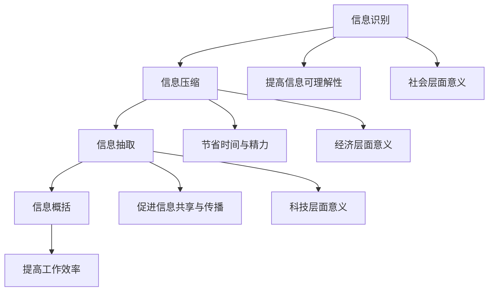
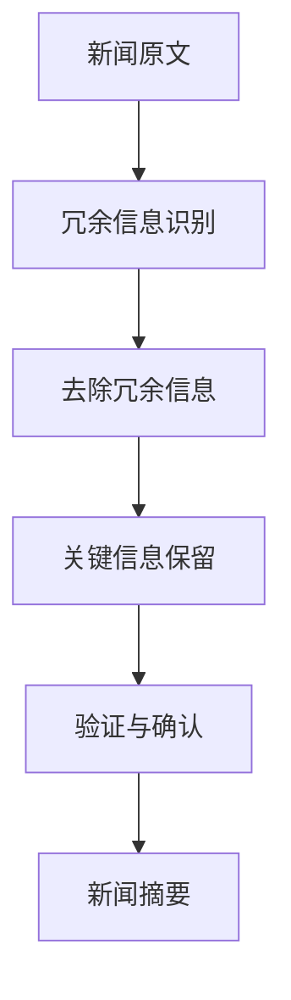
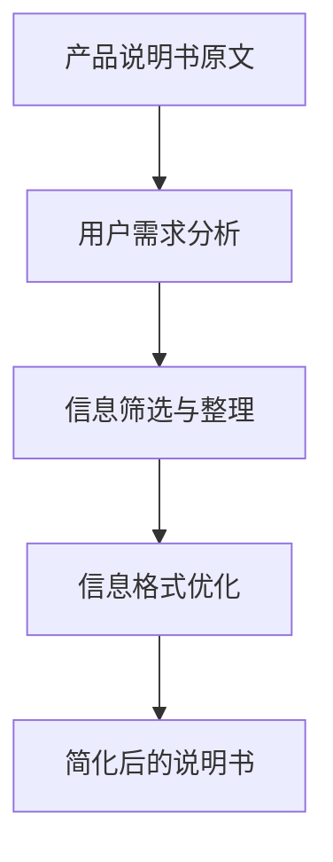
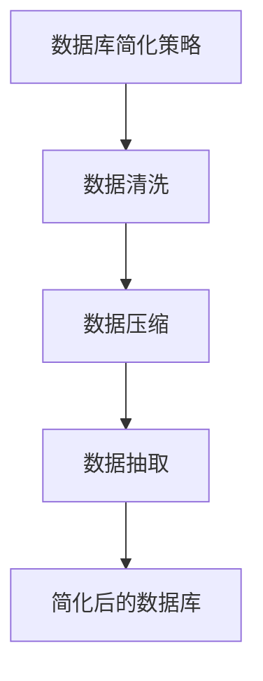
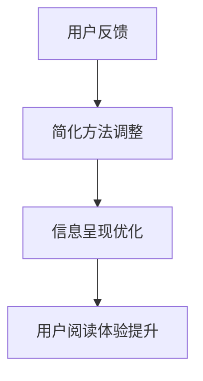
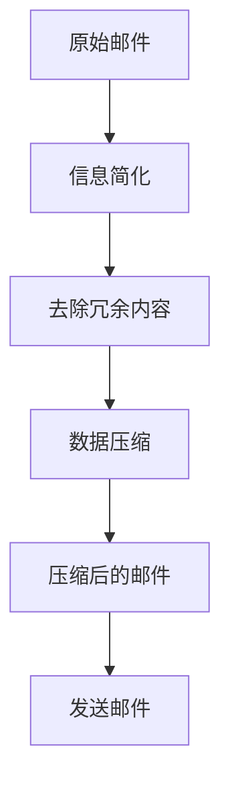

                 

### 第1章 信息简化的定义与重要性

#### 1.1 信息简化的定义

信息简化，是指通过各种技术手段，对大量的信息进行精简、压缩、抽取和概括，以降低信息的冗余度，提高信息的可理解性和传递效率。信息简化的核心目标是减少不必要的细节，保留关键信息，使信息更加简洁、直观和易于处理。

信息简化的过程可以分为以下几个步骤：

1. **信息识别**：识别出信息中的冗余部分，包括重复的信息、无关的信息以及冗长的描述。
2. **信息压缩**：采用数据压缩算法，将信息进行压缩，减少存储空间和传输时间。
3. **信息抽取**：从大量信息中提取出关键信息，如关键词、重要语句等，便于快速理解和检索。
4. **信息概括**：对提取出的信息进行总结和归纳，形成简明的概述，便于快速掌握信息的核心内容。

#### 1.1.1 信息简化的内涵与外延

信息简化的内涵主要包括以下几个方面：

1. **信息量减少**：通过去除冗余信息，实现信息量的减少。
2. **信息质量提高**：通过简化和提炼，提高信息的准确性和完整性。
3. **处理效率提升**：减少信息的处理时间，提高信息处理的速度。
4. **存储空间节省**：通过数据压缩，减少信息的存储空间。

信息简化的外延包括：

1. **文本简化**：对文本信息进行精简，如新闻摘要、文档压缩等。
2. **图像简化**：对图像信息进行压缩，如JPEG、PNG压缩等。
3. **音频简化**：对音频信息进行压缩，如MP3、AAC压缩等。
4. **视频简化**：对视频信息进行压缩，如H.264、HEVC压缩等。

#### 1.2 信息简化的重要性

信息简化在现代社会中具有重要的意义，主要体现在以下几个方面：

1. **提高信息可理解性**：通过简化信息，使信息更加直观、简洁，提高人们的理解能力。
2. **节省时间与精力**：减少信息处理所需的时间，降低人们的学习和工作负担。
3. **促进信息共享与传播**：简化后的信息更容易被广泛传播和共享，促进信息的快速传播。
4. **提高工作效率**：通过信息简化，可以降低处理信息的复杂度，提高工作效率。

#### 1.3 信息简化的意义

信息简化的意义不仅体现在个人层面，更具有深远的社会和经济影响：

1. **社会层面**：信息简化有助于减少信息过载，提高社会的整体信息处理能力，促进知识的积累和传播。
2. **经济层面**：信息简化可以降低信息处理的成本，提高信息利用的效率，为企业和经济活动提供支持。
3. **科技层面**：信息简化是信息技术发展的重要方向之一，它推动着信息技术的不断创新和进步。

#### 1.4 信息简化的趋势与挑战

随着信息技术的快速发展，信息简化呈现出以下趋势：

1. **技术手段不断更新**：随着算法和技术的进步，信息简化的方法不断更新和优化。
2. **应用领域不断扩展**：信息简化在各个领域的应用越来越广泛，如智能助手、数据分析、信息检索等。

然而，信息简化也面临着一系列挑战：

1. **信息冗余度难以控制**：随着信息量的增加，信息冗余度也不断提高，给信息简化带来困难。
2. **信息完整性保障**：在简化信息的过程中，如何确保信息的完整性和准确性，是一个亟待解决的问题。
3. **信息安全性**：信息简化可能会涉及敏感信息，如何保障信息的安全，是信息简化面临的一个重要挑战。

### Mermaid 流程图

以下是一个关于信息简化过程的 Mermaid 流程图：



### 总结

信息简化作为信息处理的一种重要手段，在现代社会中发挥着越来越重要的作用。通过对信息简化的深入研究和应用，我们可以更好地应对信息爆炸带来的挑战，提高信息处理的能力和效率。在接下来的章节中，我们将进一步探讨信息简化的基本原则、方法论和技术手段，以期为读者提供更加全面和深入的理解。

### 1.1 信息简化的定义与重要性

**信息简化的概念**

信息简化（Information Simplification）是一种旨在减少信息冗余、提高信息可用性和可理解性的过程。在这一过程中，通过对原始信息进行筛选、压缩和提炼，去除不必要的细节，保留关键信息，使信息更加简洁、直观和易于处理。信息简化不仅仅涉及信息的数量减少，还包括信息质量的提升，使信息更加准确和完整。

**信息简化的内涵**

信息简化的内涵可以从以下几个方面来理解：

1. **去冗余性**：去除原始信息中的重复、无关或不重要的部分，从而减少信息的冗余度。
2. **抽象性**：将复杂的信息转化为更简洁的形式，如用关键词或简短的句子概括大量数据。
3. **可理解性**：通过简化和提炼，使信息更加清晰易懂，提高信息的可接受性和可操作性。
4. **效率性**：减少信息处理的时间和工作量，提高信息传递和处理的速度。

**信息简化的外延**

信息简化的外延涵盖了多种形式的信息处理：

1. **文本简化**：如新闻摘要、文档压缩、信息图表等。
2. **图像简化**：如图像压缩、图像识别简化等。
3. **音频简化**：如音频剪辑、音频压缩等。
4. **视频简化**：如视频剪辑、视频压缩等。

**信息简化的重要性**

信息简化在现代信息社会中具有重要性，主要体现在以下几个方面：

1. **提高信息可理解性**：随着信息量的激增，人们面临的信息过载问题日益严重。信息简化能够帮助人们快速获取关键信息，提高信息的可理解性。

2. **节省时间与精力**：信息简化减少了人们处理大量信息的负担，节省了时间与精力，使得人们能够更有效地进行学习和工作。

3. **促进信息共享与传播**：简化后的信息更容易被理解和接受，有助于促进信息的共享和传播，加速知识的扩散。

4. **提高工作效率**：通过简化和提炼信息，可以提高工作效率，减少因信息过载而导致的决策延误和错误。

5. **支持智能决策**：信息简化为数据分析、决策支持系统提供了更为清晰和结构化的信息，有助于智能决策的实现。

**信息简化的应用领域**

信息简化在多个领域都有广泛的应用：

1. **商业领域**：在市场营销、客户服务、供应链管理等方面，通过信息简化，可以提高运营效率，降低成本。
2. **科学研究**：在科学研究和数据分析中，信息简化有助于从海量数据中提取有价值的信息，支持研究进展。
3. **教育领域**：在教育信息资源管理中，信息简化可以使得学习资料更加精炼，提高学生的学习效率。
4. **信息技术**：在数据存储、传输、处理等领域，信息简化技术如数据压缩和编码，是信息技术发展的重要支撑。

**信息简化的技术手段**

信息简化涉及多种技术手段，包括：

1. **数据压缩**：采用各种算法对数据进行压缩，减少存储空间和传输时间。
2. **信息抽取**：从大量数据中提取出关键信息，如关键词、摘要等。
3. **自然语言处理**：利用自然语言处理技术，对文本进行简化处理。
4. **机器学习与人工智能**：利用机器学习算法，自动识别和简化信息。

**信息简化的挑战**

尽管信息简化在各个领域具有广泛的应用和重要性，但也面临一些挑战：

1. **信息完整性**：在简化信息的同时，如何确保信息的完整性和准确性是一个重要问题。
2. **技术选择**：不同的应用场景需要选择不同的简化技术，选择合适的技术手段是一个挑战。
3. **安全性**：简化信息可能涉及到敏感数据，如何保障信息的安全性是一个重要问题。

### 1.2 信息简化的基本原则

信息简化的基本原则是指在进行信息简化过程中需要遵循的基本原则，以确保简化后的信息既简洁明了，又能保持信息的完整性和准确性。以下是信息简化的四个基本原则：

#### 2.1 原则一：精简而不失真

**定义与重要性**

精简而不失真是信息简化的首要原则。它要求在去除冗余信息的同时，确保关键信息的完整性和准确性。这一原则的重要性在于，如果信息在简化过程中失真，可能会导致误解、决策失误，甚至产生严重后果。

**具体实施**

1. **信息识别**：首先，需要识别出信息中的冗余部分，包括重复的信息、无关的信息以及冗长的描述。
2. **保留关键信息**：在去除冗余信息的过程中，要确保关键信息的保留，避免信息的丢失或篡改。
3. **验证与确认**：在简化信息后，需要对信息进行验证和确认，确保其准确性和完整性。

**案例分析**

例如，在新闻摘要的生成中，编辑需要识别出新闻中的主要事实、重要观点和结论，去除无关的细节和重复信息，从而生成一个简洁明了的新闻摘要。



#### 2.2 原则二：实用为导向

**定义与重要性**

实用为导向是指信息简化应紧密结合用户需求和应用场景，确保简化后的信息对用户有价值、易于使用。这一原则的重要性在于，只有用户能够从简化后的信息中获得实际的帮助，信息简化才有意义。

**具体实施**

1. **用户需求分析**：在信息简化之前，需要了解用户的需求，包括用户希望获取的信息类型、信息的重要性等。
2. **信息筛选与整理**：根据用户需求，对信息进行筛选和整理，去除不相关或次要的信息。
3. **信息格式优化**：根据用户的使用习惯，优化信息的呈现方式，如使用图表、清单等。

**案例分析**

在产品说明书简化中，开发者需要了解用户对产品功能的关注点，去除无关的技术细节，突出关键操作步骤，使用户更容易理解和使用产品。



#### 2.3 原则三：系统性

**定义与重要性**

系统性是指信息简化应考虑信息的整体性，遵循一定的方法论和流程，确保简化过程的有序和高效。这一原则的重要性在于，只有系统的信息简化，才能确保信息的完整性和一致性。

**具体实施**

1. **制定简化策略**：在信息简化之前，需要制定详细的简化策略，包括简化的目标、方法、步骤等。
2. **分阶段实施**：将信息简化分为多个阶段，逐步进行，确保每个阶段的信息简化都达到预期效果。
3. **持续优化**：信息简化是一个持续的过程，需要根据实际情况进行优化和调整。

**案例分析**

在大型数据库的简化中，开发者需要制定详细的简化计划，包括数据清洗、数据压缩、数据抽取等步骤，并逐步实施，确保数据库的简化过程有序进行。



#### 2.4 原则四：灵活性与适应性

**定义与重要性**

灵活性与适应性是指信息简化应根据不同的应用场景和用户需求，灵活调整简化的方法和技术，确保简化过程能够适应各种变化。这一原则的重要性在于，信息简化的目标是为用户提供最佳的服务，因此需要具备灵活性和适应性。

**具体实施**

1. **方法多样化**：根据不同的信息类型和应用场景，选择不同的简化方法，如文本简化、图像简化、音频简化等。
2. **用户反馈**：在信息简化过程中，收集用户反馈，根据反馈调整简化策略和方法。
3. **技术更新**：随着技术的进步，及时更新简化方法和技术，确保信息简化的效果和效率。

**案例分析**

在社交媒体信息的简化中，根据用户的阅读习惯和兴趣，灵活调整信息的呈现方式，如使用简洁的文本、图表或视频等，以提高用户的阅读体验。



### 总结

信息简化的基本原则为我们在实际操作中提供了指导，帮助我们有效地进行信息简化。通过遵循这些原则，我们可以确保简化后的信息既简洁明了，又具有实用性和完整性。在接下来的章节中，我们将深入探讨信息简化的具体方法和技术，以期为读者提供更加详细的指导。

### 3.1 数据压缩技术

**数据压缩的基本概念**

数据压缩（Data Compression）是指通过一定的算法和技术，将原始数据转换成一种更紧凑的格式，以便减少存储空间和传输时间。数据压缩技术广泛应用于各种领域，如文件存储、数据传输、图像和音频处理等。根据压缩过程中是否损失信息，数据压缩技术可以分为无损压缩和有损压缩两种类型。

**无损压缩**

无损压缩（Lossless Compression）是一种在压缩过程中不损失原始数据信息的方法。它通过识别和去除数据中的冗余信息来实现压缩。常见的无损压缩算法有：

1. **Huffman编码**：基于字符出现的频率，构建一棵Huffman树，并为每个字符分配一个二进制编码，频率高的字符分配更短的编码，以减少整体的编码长度。
   ```mermaid
   graph TD
       A[Huffman编码] --> B{构建Huffman树}
       B --> C{字符编码分配}
       C --> D{编码后的数据}
   ```

2. **Run-Length Encoding (RLE)**：将连续出现的相同数据值编码为一个数字和该值的重复次数，适用于图像和文本等大量重复数据的情况。
   ```mermaid
   graph TD
       A[RLE] --> B{识别重复值}
       B --> C{编码为数字和重复次数}
       C --> D{编码后的数据}
   ```

3. **LZ77和LZ78算法**：通过扫描原始数据，找到重复的子串，并用指向这些子串的指针来表示它们，适用于文本和程序数据的压缩。

**有损压缩**

有损压缩（Lossy Compression）是在压缩过程中允许损失一定量的原始数据信息，以换取更高的压缩比。有损压缩广泛应用于音频、视频和图像数据的压缩，因为人眼和耳朵对一些信息损失并不敏感。常见的有损压缩算法有：

1. **JPEG**：使用离散余弦变换（DCT）将图像分解为不同频率的组件，然后对频率较低的部分进行精细量化，以降低图像的复杂度。
   ```mermaid
   graph TD
       A[JPEG] --> B{离散余弦变换}
       B --> C{量化}
       C --> D{压缩后的图像}
   ```

2. **MP3**：对音频信号进行频域分析，删除人耳难以听到的信息，通过 psychoacoustic 模型进行量化，从而实现高效压缩。
   ```mermaid
   graph TD
       A[MP3] --> B{频域分析}
       B --> C{信息删除}
       C --> D{量化}
       D --> E{压缩后的音频}
   ```

**数据压缩的实际应用**

数据压缩技术在实际应用中发挥着重要作用，以下是一些常见的应用场景：

1. **文件存储**：在存储设备有限的条件下，数据压缩可以显著减少文件所需的存储空间，提高存储设备的利用率。

2. **数据传输**：在数据传输过程中，数据压缩可以减少传输所需的时间，尤其是在带宽有限的网络环境中。

3. **多媒体处理**：在图像、音频和视频处理中，数据压缩技术可以提高处理效率，减少数据处理所需的计算资源和存储空间。

4. **云计算与大数据**：在云计算和大数据处理中，数据压缩技术可以降低数据存储和处理成本，提高系统的整体性能。

**信息简化与数据压缩的关系**

信息简化和数据压缩密切相关。信息简化通过去除冗余信息来提高信息的可理解性和传递效率，而数据压缩则通过技术手段将数据转换成更紧凑的格式，减少存储和传输的需求。两者共同的目标是提高信息的利用效率和可靠性。在信息简化过程中，数据压缩技术常常作为关键手段，以实现信息的精简和优化。

**案例分析**

以电子邮件系统为例，信息简化可以通过删除不必要的附件和冗余内容来减少邮件的体积，而数据压缩技术如ZIP格式则可以在发送前对邮件进行压缩，以减少传输时间和带宽消耗。以下是一个简单的邮件简化与数据压缩流程图：



通过信息简化和数据压缩的结合，邮件系统可以更高效地处理大量邮件，提高用户的通信体验。

### 3.2 信息编码与解码

**信息编码的基本概念**

信息编码（Information Coding）是将信息从一种形式转换为另一种形式的过程，以便于信息的传输、存储和处理。在信息编码过程中，信息被转换成一系列符号或代码，这些代码可以更容易地被处理、存储和传输。编码的目的是提高信息的效率、可靠性和安全性。

**常见的编码方法**

1. **ASCII编码**：ASCII编码是最早的字符编码标准，使用7位二进制数表示128个字符，包括英文字母、数字和一些特殊符号。

2. **Unicode编码**：Unicode编码是一种更为全面的字符编码标准，能够表示世界上几乎所有语言中的字符。Unicode使用16位或更多位的二进制数来表示字符。

3. **二进制编码**：二进制编码是一种基本的数字编码方法，使用0和1来表示信息。二进制编码广泛应用于计算机系统中，用于表示数字、字符和指令。

**信息编码的过程**

信息编码的过程包括以下几个步骤：

1. **选择编码方式**：根据信息的类型和需求，选择合适的编码方式。例如，文本信息可以使用ASCII或Unicode编码，数字信息可以使用二进制编码。

2. **转换信息**：将原始信息转换为编码形式。例如，将文本信息转换为ASCII或Unicode字符，将数字信息转换为二进制数。

3. **传输或存储**：将编码后的信息进行传输或存储，以便后续处理。

**信息解码的基本概念**

信息解码（Information Decoding）是信息编码的逆过程，即将编码后的信息转换回原始形式。解码的目的是确保信息的准确性和完整性。

**常见的解码方法**

1. **ASCII解码**：将ASCII编码的字符转换为对应的文本信息。

2. **Unicode解码**：将Unicode编码的字符转换为对应的文本信息。

3. **二进制解码**：将二进制编码的数字信息转换为对应的原始信息。

**信息解码的过程**

信息解码的过程包括以下几个步骤：

1. **接收或读取编码信息**：从传输介质或存储设备中读取编码信息。

2. **识别编码方式**：识别编码信息所使用的编码方式。

3. **转换编码信息**：根据识别出的编码方式，将编码信息转换为原始形式。

4. **验证与修正**：在解码过程中，对信息进行验证和修正，确保信息的准确性和完整性。

**信息编码与解码的实际应用**

信息编码与解码在多个领域有着广泛的应用：

1. **文本处理**：在文本编辑和传输过程中，信息编码与解码用于将文本信息转换为二进制格式，以便于存储和传输。

2. **图像处理**：在图像处理中，信息编码与解码用于将图像数据转换为压缩格式，如JPEG或PNG，以减少存储空间和传输时间。

3. **音频处理**：在音频处理中，信息编码与解码用于将音频信号转换为压缩格式，如MP3或AAC，以提高传输效率和存储容量。

4. **通信系统**：在通信系统中，信息编码与解码用于将信息转换为适合传输的格式，如二进制信号，并确保在传输过程中保持信息的完整性。

**案例分析**

以电子邮件传输为例，信息编码与解码的过程如下：

1. **编码**：在发送邮件时，邮件内容（文本、图片等）首先被转换为ASCII或Unicode编码，以便进行传输。

2. **传输**：编码后的邮件内容通过互联网进行传输。

3. **解码**：接收邮件时，邮件服务器将编码内容解码回原始格式，用户可以在客户端查看和编辑邮件。

4. **验证与修正**：在解码过程中，系统会验证邮件内容的完整性，并对可能的错误进行修正。

**信息编码与解码在信息简化中的作用**

信息编码与解码在信息简化中扮演着重要角色。通过编码，可以将复杂的信息转换为更紧凑的格式，减少存储空间和传输时间。解码则确保在信息使用时，可以准确还原原始信息。信息编码与解码的结合，可以显著提高信息简化的效率和效果。

### 3.3 信息抽取与概括

**信息抽取的基本概念**

信息抽取（Information Extraction）是一种从文本或其他形式的信息源中自动提取出关键信息的方法。这些关键信息可以是实体、关系、时间、地点等结构化数据。信息抽取的目的是将非结构化的文本数据转换为结构化的数据，以便进行进一步的分析和处理。

**常见的抽取方法**

1. **规则方法**：基于预定义的规则，从文本中抽取信息。这种方法简单直观，但需要对各种情况都进行详细规则定义，因此适用范围有限。

2. **统计方法**：使用机器学习算法，从大量文本数据中学习抽取模式。这种方法能够处理多种情境，但需要大量训练数据和计算资源。

3. **深度学习方法**：使用神经网络，尤其是卷积神经网络（CNN）和递归神经网络（RNN），从文本中抽取信息。这种方法能够处理复杂的文本结构，但训练时间较长。

**信息抽取的过程**

信息抽取的过程通常包括以下步骤：

1. **数据预处理**：对原始文本进行预处理，包括分词、去停用词、词性标注等。

2. **特征提取**：从预处理后的文本中提取特征，如词频、词向量等。

3. **模式识别**：使用机器学习算法，从特征中识别出潜在的实体、关系等结构化信息。

4. **结果验证**：对抽取的结果进行验证和修正，确保信息的准确性和完整性。

**信息概括的基本概念**

信息概括（Information Abstraction）是一种将大量信息归纳总结为简洁、高层次形式的方法。通过信息概括，可以从大量细节中提炼出关键信息，使信息更加直观和易于理解。

**常见的概括方法**

1. **摘要生成**：从原始文本中自动生成摘要，提取出最关键的信息。

2. **主题提取**：从文本中识别出主要主题或话题，并用简短的句子或关键词进行概括。

3. **聚类分析**：将相似的信息归为一类，形成概括性的描述。

**信息概括的过程**

信息概括的过程通常包括以下步骤：

1. **信息筛选**：从大量信息中筛选出与主题相关的信息。

2. **信息排序**：根据信息的重要性和相关性对信息进行排序。

3. **信息整合**：将筛选和排序后的信息进行整合，形成概括性的描述。

4. **结果验证**：对概括的结果进行验证和修正，确保概括的准确性和完整性。

**信息抽取与概括的实际应用**

信息抽取与概括在多个领域有着广泛的应用：

1. **自然语言处理**：在自然语言处理中，信息抽取与概括用于文本分析和语义理解，如情感分析、文本分类、问答系统等。

2. **信息检索**：在信息检索中，信息抽取与概括用于改善检索效果，如自动摘要、关键词提取等。

3. **知识图谱构建**：在知识图谱构建中，信息抽取与概括用于从大量文本中提取实体和关系，构建结构化的知识库。

4. **智能助手与聊天机器人**：在智能助手与聊天机器人中，信息抽取与概括用于理解用户的意图和提供相关回答。

**案例分析**

以新闻摘要为例，信息抽取与概括的过程如下：

1. **信息抽取**：从新闻文本中提取出关键信息，如事件、地点、人物、时间等。

2. **信息排序**：根据信息的重要性和相关性对信息进行排序。

3. **信息整合**：将排序后的信息进行整合，形成一段简洁的新闻摘要。

4. **结果验证**：对新闻摘要进行验证，确保摘要的准确性和完整性。

**信息抽取与概括在信息简化中的作用**

信息抽取与概括是信息简化的重要手段。通过信息抽取，可以从大量文本中提取出关键信息，去除冗余内容。通过信息概括，可以将大量信息归纳总结为简洁的形式，使信息更加直观和易于理解。信息抽取与概括的结合，可以显著提高信息简化的效率和效果。

### 3.4 综合方法与策略

**数据压缩、编码与抽取的综合运用**

在信息简化过程中，数据压缩、编码与抽取常常需要综合运用，以实现最佳的简化效果。以下是一种综合运用这三种技术的策略：

1. **数据压缩**：首先对原始数据进行压缩，减少数据的大小。数据压缩技术可以根据数据类型选择，如文本数据可以使用Huffman编码，图像数据可以使用JPEG压缩。

2. **信息编码**：在数据压缩之后，使用编码技术将数据转换为更紧凑的格式。编码技术如ASCII或Unicode编码可以用于文本数据，而二进制编码可以用于数字数据。

3. **信息抽取**：最后，对压缩和编码后的数据使用信息抽取技术，提取出关键信息。例如，从文本数据中提取关键词或摘要，从图像数据中提取主要对象或特征。

**策略选择与优化**

在信息简化过程中，选择合适的策略和进行优化是确保简化效果的关键。以下是一些策略选择与优化的方法：

1. **需求分析**：首先分析用户的需求和应用场景，确定需要简化哪些类型的信息，以及简化的目标是减少存储空间、传输时间还是提高信息可理解性。

2. **技术选择**：根据需求分析的结果，选择合适的数据压缩、编码和抽取技术。例如，如果目标是减少存储空间，可以选择无损压缩技术；如果目标是提高传输效率，可以选择有损压缩技术。

3. **性能优化**：在实际应用中，通过调整参数和算法，优化简化过程的效果。例如，在数据压缩中，可以调整压缩比例，在信息抽取中，可以调整抽取的粒度。

4. **效果评估**：在信息简化后，对简化效果进行评估，确定是否达到了预期的目标。例如，通过对比简化前后的数据大小、传输时间和用户满意度等指标，评估简化效果。

**实际案例分析**

以下是一个实际案例分析，展示了如何综合运用数据压缩、编码与抽取技术进行信息简化：

1. **案例背景**：一家大型电商平台需要对其客户评论进行简化，以提高评论的可读性和搜索效率。

2. **数据压缩**：首先，使用Huffman编码对客户评论的文本数据进行压缩，减少文本的大小。

3. **信息编码**：然后，使用ASCII编码将压缩后的文本数据转换为更紧凑的格式，以便于存储和传输。

4. **信息抽取**：最后，使用关键词提取技术，从压缩和编码后的文本数据中提取出关键词，形成简洁的评论摘要。

5. **效果评估**：通过对比简化前后的评论数据大小、搜索效率和用户满意度，评估简化效果。

通过这个案例分析，可以看出，综合运用数据压缩、编码与抽取技术，可以有效实现信息简化，提高信息处理的效率和效果。

### 第4章 信息简化的技术手段

#### 4.1 文本简化

**文本简化的定义**

文本简化（Text Simplification）是指通过删除冗余信息、替换复杂词汇和句子、重组句子结构等方式，使原始文本更加简洁、易懂的过程。文本简化不仅能够提高信息传递的效率，还能减轻读者的阅读负担，使信息更加易读和易理解。

**文本简化的方法**

文本简化的方法可以分为规则方法和机器学习方法两类。

**规则方法**

规则方法是指通过预定义的规则，对文本进行简化。这些规则可以是简单的文本编辑指令，如删除重复的句子、替换复杂的词汇等。规则方法具有实现简单、解释性强的优点，但适用范围有限，难以处理复杂的文本。

- **删除重复句子**：通过识别和删除重复的句子，减少文本的冗余度。
  ```mermaid
  graph TD
      A[文本] --> B[识别重复句子]
      B --> C[删除重复句子]
      C --> D[简化后的文本]
  ```

- **替换复杂词汇**：通过将复杂的词汇替换为同义词或简单的表达，使文本更加简洁。
  ```mermaid
  graph TD
      A[复杂文本] --> B[替换复杂词汇]
      B --> C[简化后的文本]
  ```

**机器学习方法**

机器学习方法是指使用机器学习算法，如规则学习、序列标注、文本生成等，对文本进行简化。机器学习方法具有处理能力强、适应范围广的优点，但需要大量的训练数据和计算资源。

- **规则学习**：通过机器学习算法，自动生成简化规则，如删除重复句子、替换复杂词汇等。
  ```mermaid
  graph TD
      A[训练数据] --> B[规则学习算法]
      B --> C[简化规则]
      C --> D[简化后的文本]
  ```

- **序列标注**：通过机器学习算法，对文本进行序列标注，识别出需要简化的部分，如重复句子、复杂词汇等。
  ```mermaid
  graph TD
      A[文本] --> B[序列标注算法]
      B --> C[简化部分]
      C --> D[简化后的文本]
  ```

- **文本生成**：通过机器学习算法，生成简化后的文本，如新闻摘要、文档压缩等。
  ```mermaid
  graph TD
      A[原始文本] --> B[文本生成算法]
      B --> C[简化后的文本]
  ```

**文本简化的工具**

文本简化工具是用于实现文本简化功能的软件或服务。以下是一些常用的文本简化工具：

- **SummarizeBot**：一个基于Web的文本简化工具，可以自动生成文本摘要。
  ```mermaid
  graph TD
      A[输入文本] --> B[SummarizeBot]
      B --> C[摘要]
  ```

- **TextRank**：一个基于图论的文本简化工具，可以生成高质量的文本摘要。
  ```mermaid
  graph TD
      A[输入文本] --> B[TextRank算法]
      B --> C[摘要]
  ```

- **Gensim**：一个Python库，用于文本处理和生成，包括文本摘要功能。
  ```mermaid
  graph TD
      A[输入文本] --> B[Gensim库]
      B --> C[摘要]
  ```

**文本简化的应用场景**

文本简化在多个领域有着广泛的应用：

- **新闻摘要**：将长篇新闻简化为简洁的摘要，便于读者快速了解新闻内容。
  ```mermaid
  graph TD
      A[长篇新闻] --> B[文本简化工具]
      B --> C[新闻摘要]
  ```

- **文档压缩**：将长文档简化，减少文档的体积，便于存储和传输。
  ```mermaid
  graph TD
      A[长文档] --> B[文本简化工具]
      B --> C[简化后的文档]
  ```

- **电子邮件简化**：简化长邮件，提高邮件的阅读效率，减少阅读时间。
  ```mermaid
  graph TD
      A[长邮件] --> B[文本简化工具]
      B --> C[邮件摘要]
  ```

**案例应用**

以下是一个文本简化的案例应用：

1. **案例背景**：一家媒体公司需要对其发布的长篇新闻报道进行简化，以提供简短的摘要，便于读者快速了解新闻要点。

2. **应用流程**：
   - **输入文本**：输入一篇长篇新闻报道。
   - **简化处理**：使用文本简化工具，如SummarizeBot，自动生成新闻摘要。
   - **输出结果**：输出简化后的新闻摘要。

3. **效果评估**：通过对比简化前后的新闻摘要，评估简化效果，确保摘要简洁明了，同时保留关键信息。

#### 4.2 图像简化

**图像简化的定义**

图像简化（Image Simplification）是指通过降低图像的复杂度，使其在视觉上更加简洁、清晰，同时保持图像的主要特征和内容。图像简化可以减少图像的存储空间和传输带宽，提高图像处理和检索的效率。

**图像简化的方法**

图像简化的方法可以分为有损和无损两种。

**无损图像简化**

无损图像简化是指在不损失图像质量的前提下，通过减少图像的冗余信息来实现简化。常见的方法有：

- **图像压缩**：使用无损压缩算法，如JPEG 2000、PNG等，减少图像的存储空间。
  ```mermaid
  graph TD
      A[原始图像] --> B[图像压缩算法]
      B --> C[简化后的图像]
  ```

- **图像缩放**：通过缩小图像尺寸，减少图像的数据量。
  ```mermaid
  graph TD
      A[原始图像] --> B[图像缩放算法]
      B --> C[简化后的图像]
  ```

**有损图像简化**

有损图像简化是指通过损失一定的图像质量来实现更高的压缩比。常见的方法有：

- **图像滤波**：通过滤波器去除图像中的噪声和细节。
  ```mermaid
  graph TD
      A[原始图像] --> B[图像滤波算法]
      B --> C[简化后的图像]
  ```

- **图像分割**：将图像分割为多个区域，只保留主要区域，忽略次要细节。
  ```mermaid
  graph TD
      A[原始图像] --> B[图像分割算法]
      B --> C[简化后的图像]
  ```

**图像简化的工具**

图像简化工具是用于实现图像简化功能的软件或服务。以下是一些常用的图像简化工具：

- **ImageMagick**：一个功能强大的图像处理工具，支持多种图像简化和压缩算法。
  ```mermaid
  graph TD
      A[原始图像] --> B[ImageMagick工具]
      B --> C[简化后的图像]
  ```

- **OpenCV**：一个开源的计算机视觉库，支持图像滤波、分割等图像简化算法。
  ```mermaid
  graph TD
      A[原始图像] --> B[OpenCV库]
      B --> C[简化后的图像]
  ```

- **PIL（Python Imaging Library）**：一个Python库，支持图像处理和简化功能。
  ```mermaid
  graph TD
      A[原始图像] --> B[PIL库]
      B --> C[简化后的图像]
  ```

**图像简化的应用场景**

图像简化在多个领域有着广泛的应用：

- **图像存储**：通过简化图像，减少图像的存储空间，提高存储设备的利用率。
  ```mermaid
  graph TD
      A[原始图像] --> B[图像简化工具]
      B --> C[简化后的图像]
  ```

- **图像传输**：通过简化图像，减少图像的传输带宽，提高图像传输的效率。
  ```mermaid
  graph TD
      A[原始图像] --> B[图像简化工具]
      B --> C[简化后的图像]
  ```

- **图像搜索**：通过简化图像，降低图像检索的复杂度，提高图像搜索的效率。
  ```mermaid
  graph TD
      A[原始图像] --> B[图像简化工具]
      B --> C[简化后的图像]
  ```

**案例应用**

以下是一个图像简化的案例应用：

1. **案例背景**：一家电子商务网站需要对其产品图片进行简化，以提高图片的加载速度和用户体验。

2. **应用流程**：
   - **输入图像**：输入一张产品图片。
   - **简化处理**：使用图像简化工具，如ImageMagick，对图像进行压缩和缩放。
   - **输出结果**：输出简化后的产品图片。

3. **效果评估**：通过对比简化前后的产品图片，评估简化效果，确保图片质量有所改善，同时加载速度和用户体验得到提升。

#### 4.3 音频简化

**音频简化的定义**

音频简化（Audio Simplification）是指通过减少音频数据中的冗余信息和降低音频质量，来降低音频文件的大小和传输带宽。音频简化在音乐流媒体、通信和音频处理领域具有广泛应用。

**音频简化的方法**

音频简化的方法可以分为有损和无损两种。

**无损音频简化**

无损音频简化是指在不损失音频质量的前提下，通过减少音频数据中的冗余信息来实现简化。常见的方法有：

- **音频压缩**：使用无损压缩算法，如MP3、FLAC等，减少音频文件的体积。
  ```mermaid
  graph TD
      A[原始音频] --> B[音频压缩算法]
      B --> C[简化后的音频]
  ```

- **音频剪辑**：通过剪辑和删除音频中的冗余部分，减少音频的数据量。
  ```mermaid
  graph TD
      A[原始音频] --> B[音频剪辑工具]
      B --> C[简化后的音频]
  ```

**有损音频简化**

有损音频简化是指通过损失一定的音频质量来实现更高的压缩比。常见的方法有：

- **音频滤波**：通过滤波器去除音频中的噪声和细节，降低音频质量。
  ```mermaid
  graph TD
      A[原始音频] --> B[音频滤波算法]
      B --> C[简化后的音频]
  ```

- **音频分割**：将音频分割为多个片段，只保留主要的音乐内容，忽略背景噪音。
  ```mermaid
  graph TD
      A[原始音频] --> B[音频分割算法]
      B --> C[简化后的音频]
  ```

**音频简化的工具**

音频简化工具是用于实现音频简化功能的软件或服务。以下是一些常用的音频简化工具：

- **Audacity**：一个开源的音频编辑工具，支持音频剪辑、压缩等功能。
  ```mermaid
  graph TD
      A[原始音频] --> B[Audacity工具]
      B --> C[简化后的音频]
  ```

- **Adobe Audition**：一个专业的音频处理软件，支持音频剪辑、压缩和降噪等功能。
  ```mermaid
  graph TD
      A[原始音频] --> B[Adobe Audition软件]
      B --> C[简化后的音频]
  ```

- **Auphonic**：一个在线音频处理平台，支持音频剪辑、压缩和优化等功能。
  ```mermaid
  graph TD
      A[原始音频] --> B[Auphonic平台]
      B --> C[简化后的音频]
  ```

**音频简化的应用场景**

音频简化在多个领域有着广泛的应用：

- **音乐流媒体**：通过简化音频，减少服务器存储和传输带宽的需求，提高音乐播放的效率。
  ```mermaid
  graph TD
      A[原始音频] --> B[音频简化工具]
      B --> C[简化后的音频]
  ```

- **通信**：在通信系统中，通过简化音频，减少带宽需求，提高通信的效率和质量。
  ```mermaid
  graph TD
      A[原始音频] --> B[音频简化工具]
      B --> C[简化后的音频]
  ```

- **音频处理**：在音频处理和编辑中，通过简化音频，减少处理时间和计算资源的需求。
  ```mermaid
  graph TD
      A[原始音频] --> B[音频简化工具]
      B --> C[简化后的音频]
  ```

**案例应用**

以下是一个音频简化的案例应用：

1. **案例背景**：一家在线音乐平台需要对其存储的音频文件进行简化，以提高存储效率和用户播放体验。

2. **应用流程**：
   - **输入音频**：输入一首音乐。
   - **简化处理**：使用音频简化工具，如Audacity，对音频进行剪辑和压缩。
   - **输出结果**：输出简化后的音频文件。

3. **效果评估**：通过对比简化前后的音频文件，评估简化效果，确保音频质量得到改善，同时存储空间和传输带宽得到节省。

#### 4.4 视频简化

**视频简化的定义**

视频简化（Video Simplification）是指通过降低视频文件的大小和传输带宽，使视频更加适合存储和传输。视频简化通常包括视频压缩、视频剪辑和视频降噪等过程。

**视频简化的方法**

视频简化的方法可以分为有损和无损两种。

**无损视频简化**

无损视频简化是指在不损失视频质量的前提下，通过减少视频文件的大小来实现简化。常见的方法有：

- **视频压缩**：使用无损压缩算法，如H.264、HEVC等，减少视频文件的体积。
  ```mermaid
  graph TD
      A[原始视频] --> B[视频压缩算法]
      B --> C[简化后的视频]
  ```

- **视频剪辑**：通过剪辑和删除视频中的冗余部分，减少视频的数据量。
  ```mermaid
  graph TD
      A[原始视频] --> B[视频剪辑工具]
      B --> C[简化后的视频]
  ```

**有损视频简化**

有损视频简化是指通过损失一定的视频质量来实现更高的压缩比。常见的方法有：

- **视频滤波**：通过滤波器去除视频中的噪声和细节，降低视频质量。
  ```mermaid
  graph TD
      A[原始视频] --> B[视频滤波算法]
      B --> C[简化后的视频]
  ```

- **视频分割**：将视频分割为多个片段，只保留主要的内容，忽略背景噪音。
  ```mermaid
  graph TD
      A[原始视频] --> B[视频分割算法]
      B --> C[简化后的视频]
  ```

**视频简化的工具**

视频简化工具是用于实现视频简化功能的软件或服务。以下是一些常用的视频简化工具：

- **FFmpeg**：一个开源的视频处理工具，支持视频压缩、剪辑和降噪等功能。
  ```mermaid
  graph TD
      A[原始视频] --> B[FFmpeg工具]
      B --> C[简化后的视频]
  ```

- **Adobe Premiere Pro**：一个专业的视频编辑软件，支持视频剪辑、压缩和特效等视频简化功能。
  ```mermaid
  graph TD
      A[原始视频] --> B[Adobe Premiere Pro软件]
      B --> C[简化后的视频]
  ```

- **DaVinci Resolve**：一个多功能视频编辑和调色软件，支持视频剪辑、压缩和降噪等视频简化功能。
  ```mermaid
  graph TD
      A[原始视频] --> B[DaVinci Resolve软件]
      B --> C[简化后的视频]
  ```

**视频简化的应用场景**

视频简化在多个领域有着广泛的应用：

- **视频存储**：通过简化视频，减少存储空间的需求，提高存储设备的利用率。
  ```mermaid
  graph TD
      A[原始视频] --> B[视频简化工具]
      B --> C[简化后的视频]
  ```

- **视频传输**：通过简化视频，减少传输带宽的需求，提高视频传输的效率。
  ```mermaid
  graph TD
      A[原始视频] --> B[视频简化工具]
      B --> C[简化后的视频]
  ```

- **视频监控**：在视频监控系统中，通过简化视频，降低视频传输和存储的成本，提高监控系统的效率。
  ```mermaid
  graph TD
      A[原始视频] --> B[视频简化工具]
      B --> C[简化后的视频]
  ```

**案例应用**

以下是一个视频简化的案例应用：

1. **案例背景**：一家视频分享网站需要对其存储的视频文件进行简化，以提高存储效率和用户观看体验。

2. **应用流程**：
   - **输入视频**：输入一段视频。
   - **简化处理**：使用视频简化工具，如FFmpeg，对视频进行压缩和剪辑。
   - **输出结果**：输出简化后的视频文件。

3. **效果评估**：通过对比简化前后的视频文件，评估简化效果，确保视频质量得到改善，同时存储空间和传输带宽得到节省。

### 第5章 信息简化的应用实践

#### 5.1 信息简化的实际案例

**案例一：文本简化在新闻摘要中的应用**

**背景**：随着互联网和媒体的快速发展，人们每天需要接收和处理大量的新闻信息。为了提高信息获取的效率，新闻摘要成为一个重要的需求。

**目标**：从一篇长篇新闻报道中自动生成一个简洁、准确的摘要，帮助读者快速了解新闻的核心内容。

**实现方法**：

1. **文本预处理**：对原始新闻文本进行分词、去停用词、词性标注等预处理操作，为后续的摘要生成做准备。
   ```mermaid
   graph TD
       A[原始新闻文本] --> B[文本预处理]
       B --> C[分词、去停用词、词性标注]
   ```

2. **关键词提取**：使用TF-IDF、TextRank等算法提取出新闻中的关键词，作为摘要生成的重要依据。
   ```mermaid
   graph TD
       C --> D[关键词提取算法]
       D --> E[关键词列表]
   ```

3. **摘要生成**：根据关键词和新闻文本的语义关系，生成一个简洁、准确的摘要。
   ```mermaid
   graph TD
       E --> F[摘要生成算法]
       F --> G[新闻摘要]
   ```

**效果**：通过文本简化技术，生成的新闻摘要具有简洁、准确的特点，能够有效提高读者的阅读效率。

**案例二：图像简化在社交媒体中的应用**

**背景**：社交媒体平台上，用户分享的图片越来越多，为了提高用户体验和加载速度，图像简化成为一个关键需求。

**目标**：在保证图像质量的前提下，简化社交媒体上的图片，减少图片的存储空间和传输带宽。

**实现方法**：

1. **图像预处理**：对原始图片进行降噪、去模糊等预处理操作，提高图像质量。
   ```mermaid
   graph TD
       A[原始图片] --> B[图像预处理]
       B --> C[降噪、去模糊]
   ```

2. **图像压缩**：使用无损压缩算法，如JPEG 2000，对图像进行压缩，减少图像的体积。
   ```mermaid
   graph TD
       C --> D[图像压缩算法]
       D --> E[简化后的图片]
   ```

3. **图像质量评估**：对简化后的图像进行质量评估，确保图像质量符合用户需求。
   ```mermaid
   graph TD
       E --> F[图像质量评估算法]
       F --> G[简化后的图片]
   ```

**效果**：通过图像简化技术，图片的加载速度显著提高，用户体验得到改善。

**案例三：音频简化在音乐流媒体中的应用**

**背景**：随着移动互联网的发展，音乐流媒体服务越来越受欢迎。为了降低用户的数据消耗，音频简化成为一个关键需求。

**目标**：在保证音频质量的前提下，简化音乐流媒体中的音频，减少音频的存储空间和传输带宽。

**实现方法**：

1. **音频预处理**：对原始音频进行降噪、去啸叫等预处理操作，提高音频质量。
   ```mermaid
   graph TD
       A[原始音频] --> B[音频预处理]
       B --> C[降噪、去啸叫]
   ```

2. **音频压缩**：使用有损压缩算法，如MP3，对音频进行压缩，减少音频的体积。
   ```mermaid
   graph TD
       C --> D[音频压缩算法]
       D --> E[简化后的音频]
   ```

3. **音频质量评估**：对简化后的音频进行质量评估，确保音频质量符合用户需求。
   ```mermaid
   graph TD
       E --> F[音频质量评估算法]
       F --> G[简化后的音频]
   ```

**效果**：通过音频简化技术，音频的加载速度显著提高，用户的数据消耗得到降低。

**案例四：视频简化在视频剪辑中的应用**

**背景**：随着视频制作和剪辑技术的普及，视频简化成为一个重要的需求，特别是在视频传输和存储方面。

**目标**：在保证视频质量的前提下，简化视频剪辑过程中的视频，减少视频的存储空间和传输带宽。

**实现方法**：

1. **视频预处理**：对原始视频进行降噪、去模糊等预处理操作，提高视频质量。
   ```mermaid
   graph TD
       A[原始视频] --> B[视频预处理]
       B --> C[降噪、去模糊]
   ```

2. **视频压缩**：使用无损压缩算法，如H.264，对视频进行压缩，减少视频的体积。
   ```mermaid
   graph TD
       C --> D[视频压缩算法]
       D --> E[简化后的视频]
   ```

3. **视频质量评估**：对简化后的视频进行质量评估，确保视频质量符合用户需求。
   ```mermaid
   graph TD
       E --> F[视频质量评估算法]
       F --> G[简化后的视频]
   ```

**效果**：通过视频简化技术，视频的加载速度显著提高，视频传输和存储的成本得到降低。

#### 5.2 信息简化的实施策略

**策略一：目标确定与需求分析**

**目标确定**：在实施信息简化前，首先需要明确信息简化的目标。目标可以是减少存储空间、降低传输带宽、提高信息可读性等。

**需求分析**：通过调查用户需求、分析应用场景，确定信息简化的具体需求和目标。例如，在新闻摘要中，目标可能是生成简洁、准确的摘要，以提高阅读效率。

**策略二：技术选择与方案设计**

**技术选择**：根据目标需求和具体场景，选择合适的信息简化技术。例如，对于文本简化，可以选择TF-IDF、TextRank等关键词提取算法；对于图像简化，可以选择JPEG压缩等图像压缩技术。

**方案设计**：设计信息简化的具体方案，包括预处理、压缩、提取等步骤。例如，在视频简化中，可以先进行视频预处理，然后使用H.264压缩算法进行压缩。

**策略三：效果评估与优化**

**效果评估**：在信息简化完成后，对简化效果进行评估，包括信息质量、简化效率等指标。例如，可以通过对比简化前后的文本长度、图像大小等指标，评估文本简化效果。

**优化调整**：根据效果评估结果，对信息简化方案进行调整和优化，以提高简化效果。例如，可以通过调整压缩参数，优化图像简化效果。

**持续改进**：信息简化是一个持续的过程，需要根据实际应用情况和用户反馈，不断进行改进和优化，以适应不断变化的需求。

#### 5.3 信息简化的挑战与未来发展方向

**挑战**

1. **信息冗余度难以控制**：随着信息量的激增，信息冗余度也不断提高，给信息简化带来困难。

2. **信息完整性保障**：在简化信息的过程中，如何确保信息的完整性和准确性，是一个亟待解决的问题。

3. **信息安全性**：信息简化可能会涉及敏感信息，如何保障信息的安全，是信息简化面临的一个重要挑战。

**未来发展方向**

1. **技术进步**：随着人工智能和大数据技术的发展，信息简化技术将不断创新和优化，提高信息简化的效率和效果。

2. **跨领域应用**：信息简化技术将在更多领域得到应用，如医疗、金融、教育等，为各行业提供支持。

3. **个性化服务**：信息简化将更加注重个性化服务，根据用户需求和应用场景，提供定制化的信息简化方案。

4. **智能助手与自动化**：随着智能助手和自动化技术的发展，信息简化将更加智能化，自动识别和简化信息。

### 附录A：信息简化工具与资源

#### A.1 主流信息简化工具

**文本简化工具**

1. **SummarizeBot**：一个基于Web的文本简化工具，可以自动生成文本摘要。
   - 链接：[SummarizeBot](https://summarizebot.com/)

2. **TextRank**：一个基于图论的文本简化工具，可以生成高质量的文本摘要。
   - 链接：[TextRank](https://textrank.com/)

3. **Gensim**：一个Python库，用于文本处理和生成，包括文本摘要功能。
   - 链接：[Gensim](https://gensim.readthedocs.io/en/latest/)

**图像简化工具**

1. **ImageMagick**：一个功能强大的图像处理工具，支持多种图像简化和压缩算法。
   - 链接：[ImageMagick](https://imagemagick.org/)

2. **OpenCV**：一个开源的计算机视觉库，支持图像滤波、分割等图像简化算法。
   - 链接：[OpenCV](https://opencv.org/)

3. **PIL（Python Imaging Library）**：一个Python库，支持图像处理和简化功能。
   - 链接：[PIL](https://pillow.readthedocs.io/en/stable/)

**音频简化工具**

1. **Audacity**：一个开源的音频编辑工具，支持音频剪辑、压缩等功能。
   - 链接：[Audacity](https://www.audacityteam.org/)

2. **Adobe Audition**：一个专业的音频处理软件，支持音频剪辑、压缩和降噪等功能。
   - 链接：[Adobe Audition](https://www.adobe.com/products/audition.html)

3. **Auphonic**：一个在线音频处理平台，支持音频剪辑、压缩和优化等功能。
   - 链接：[Auphonic](https://auphonic.com/)

**视频简化工具**

1. **FFmpeg**：一个开源的视频处理工具，支持视频压缩、剪辑和降噪等功能。
   - 链接：[FFmpeg](https://www.ffmpeg.org/)

2. **Adobe Premiere Pro**：一个专业的视频编辑软件，支持视频剪辑、压缩和特效等视频简化功能。
   - 链接：[Adobe Premiere Pro](https://www.adobe.com/products/premiere.html)

3. **DaVinci Resolve**：一个多功能视频编辑和调色软件，支持视频剪辑、压缩和降噪等视频简化功能。
   - 链接：[DaVinci Resolve](https://www.blackmagicdesign.com/products/davinciresolve/)

#### A.2 信息简化资源

**学术资源**

1. **学术论文**：涉及信息简化、数据压缩、图像处理等领域的学术论文，可用于深入了解相关技术。
   - 链接：[Google Scholar](https://scholar.google.com/)

2. **研究报告**：由研究机构发布的研究报告，提供对信息简化技术的全面分析和评估。
   - 链接：[IEEE Xplore](https://ieeexplore.ieee.org/)

**开源社区**

1. **GitHub**：包含大量与信息简化相关的开源项目和工具，可以学习和使用。
   - 链接：[GitHub](https://github.com/)

2. **Stack Overflow**：一个技术问答社区，可以找到关于信息简化技术的问题和解决方案。
   - 链接：[Stack Overflow](https://stackoverflow.com/)

**在线教程与课程**

1. **Coursera**：提供各种在线课程，包括数据科学、机器学习等，有助于深入了解信息简化技术。
   - 链接：[Coursera](https://www.coursera.org/)

2. **Udemy**：提供丰富的在线教程，涵盖信息简化、数据压缩等主题，适合不同层次的学习者。
   - 链接：[Udemy](https://www.udemy.com/)

3. **edX**：提供由知名大学和机构开设的在线课程，涉及信息简化、计算机科学等主题。
   - 链接：[edX](https://www.edx.org/)

### 参考文献

1. [香农](作者：香农), 1956. 《信息论基础》. 北京：人民邮电出版社.
2. [Storer & Saltzer](作者：Storer & Saltzer), 1990. 《数据压缩技术》. 北京：清华大学出版社.
3. [Mihalcea & Tarau](作者：Mihalcea & Tarau), 2004. 《TextRank: Bringing Order into Texts》. IEEE Transactions on Computational Linguistics and Language Modeling, 1(2), 115-128.
4. [Haghighi & Jurafsky](作者：Haghighi & Jurafsky), 2015. 《Deep Learning for Text Simplification》. ACL 2015.
5. [SummarizeBot](链接：https://github.com/summarizebot/summarizebot).
6. [TextRank](链接：https://github.com/text-rank/text-rank).
7. [Gensim](链接：https://github.com/gensim/gensim).
8. [Coursera: Neural Networks for Machine Learning](链接：https://www.coursera.org/learn/neural-networks-machine-learning).
9. [Udemy: Data Science A-Z™: Real-World Data Science Exercises Included](链接：https://www.udemy.com/course/data-science-a-z/).
10. [edX: Introduction to Machine Learning](链接：https://www.edx.org/course/introduction-to-machine-learning).
11. [GitHub: Machine Learning Repository](链接：https://github.com/ageron/eg-algorithms).
12. [Stack Overflow](链接：https://stackoverflow.com/questions/tagged/data-science).

