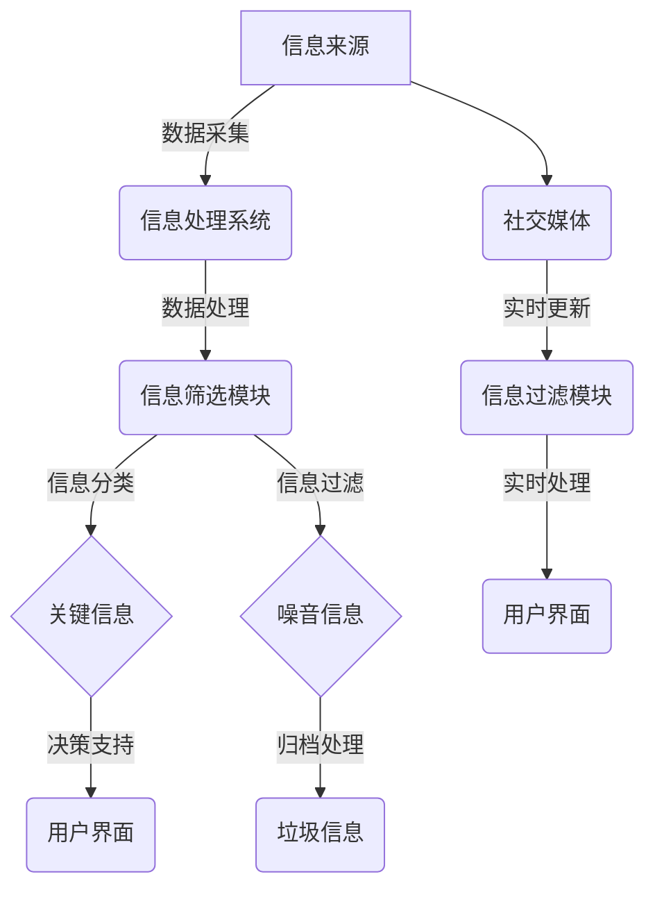

                 

# 《信息过载与创造力：如何在混乱中找到灵感》

> **关键词：** 信息过载、创造力、策略、跨界思维、团队协作、实战案例

> **摘要：** 在当今信息爆炸的时代，信息过载已经成为一个普遍现象，这不仅影响了个人生活的质量，也对组织和社会产生了深远影响。本文将探讨信息过载对个体和组织带来的挑战，并从提升信息筛选和处理能力、激发和培养创意思维、跨界思维与团队协作等方面，提供一系列策略和实战指导，帮助我们在混乱中找到灵感，提升创造力。

### 《信息过载与创造力：如何在混乱中找到灵感》目录大纲

## 第一部分：信息过载的挑战

### 第1章：信息过载现象及其影响

#### 1.1 信息过载的定义与类型
#### 1.2 信息过载对个人和组织的影响
#### 1.3 信息过载的社会现象与经济后果

### 第2章：信息筛选与处理能力提升

#### 2.1 提高信息筛选能力的策略
#### 2.2 提升信息处理速度的技巧
#### 2.3 信息过载下的时间管理

### 第3章：数字化工具与信息管理

#### 3.1 信息管理工具介绍
#### 3.2 数字化工具对信息处理的优化
#### 3.3 建立个人信息管理系统的实践

## 第二部分：创造力提升策略

### 第4章：创意思维的激发与培养

#### 4.1 创意思维的概述
#### 4.2 创意思维的激发方法
#### 4.3 创意思维的培养与实践

### 第5章：跨界思维与创新

#### 5.1 跨界思维的概念与应用
#### 5.2 跨界思维的培养策略
#### 5.3 跨界思维在创新实践中的应用

### 第6章：团队协作与创新

#### 6.1 团队协作对创新的影响
#### 6.2 促进团队协作的创新工具与方法
#### 6.3 团队协作与创新项目的实践案例

## 第三部分：实战案例与指导

### 第7章：信息过载与创造力提升的实际应用

#### 7.1 创意工作坊的实践操作
#### 7.2 创意思维训练与实战
#### 7.3 创新项目评估与优化

### 第8章：个人与组织层面的创新实践

#### 8.1 建立个人创新体系的方法
#### 8.2 组织创新文化的建设策略
#### 8.3 创新实践的持续发展路径

### 第9章：未来趋势与展望

#### 9.1 信息过载与创造力提升的持续挑战
#### 9.2 未来创新趋势预测
#### 9.3 创新实践的未来发展方向

## 附录

### 附录A：信息处理与创造力提升工具推荐

#### A.1 信息处理工具
#### A.2 创意激发工具
#### A.3 团队协作工具

### 附录B：参考资源与进一步阅读

#### B.1 相关书籍推荐
#### B.2 学术论文与研究报告
#### B.3 创意与创新的相关网站与平台

---

### 第一部分：信息过载的挑战

在信息爆炸的今天，信息过载已经成为一个全球性的问题。无论是个人还是组织，都在不断面对着信息量急剧增加带来的挑战。本部分将首先定义信息过载的概念和类型，然后探讨其对个人和组织的影响，以及信息过载在社会现象和经济后果方面所表现出来的特征。

#### 第1章：信息过载现象及其影响

### 1.1 信息过载的定义与类型

信息过载（Information Overload）指的是在信息量巨大且不断增长的环境下，个人和组织无法有效地处理、吸收和理解这些信息，从而导致决策效率下降、工作负担增加，甚至产生焦虑和压力的现象。信息过载的类型可以从不同角度进行分类，例如：

- **按来源分类**：可分为互联网信息过载、社交媒体信息过载、电子邮件信息过载等。
- **按性质分类**：可分为冗余信息、噪音信息和关键信息。
- **按影响分类**：可分为个人层面的信息过载和组织层面的信息过载。

### 1.2 信息过载对个人和组织的影响

**个人层面的影响**

信息过载对个人的影响是多方面的，主要包括以下几个方面：

- **决策困难**：由于信息过多，个人往往难以从海量信息中筛选出关键信息，从而导致决策效率下降。
- **效率降低**：处理大量信息需要时间和精力，这会分散个人对其他重要任务的注意力，降低工作效率。
- **心理健康问题**：长期处于信息过载的环境中，个人容易感到焦虑、压力和疲劳，甚至可能引发心理健康问题，如抑郁症和焦虑症。

**组织层面的影响**

信息过载对组织的影响同样显著，具体表现为：

- **沟通障碍**：信息过载会导致内部沟通不畅，影响团队成员之间的信息共享和协同工作。
- **创新受阻**：当组织内部充斥着大量冗余和噪音信息时，创新思维和创造性工作可能会受到抑制。
- **资源浪费**：处理信息需要耗费大量的时间和人力资源，而无效信息的存在意味着资源的浪费。

### 1.3 信息过载的社会现象与经济后果

**社会现象**

信息过载在社会层面引发了一系列现象，包括：

- **信息素养提升需求**：随着信息过载的加剧，公众对信息素养的需求日益增长，包括信息筛选、处理和批判性思考能力。
- **数字鸿沟扩大**：信息过载可能加剧数字鸿沟，因为获取和处理信息的能力差异会导致不同社会群体之间的不平等。
- **隐私侵犯**：信息过载背景下，个人隐私保护面临更大挑战，数据泄露和隐私侵犯事件频发。

**经济后果**

信息过载对经济领域也产生了深远影响，具体体现在：

- **生产力下降**：由于信息处理效率降低，组织和个人在生产和工作中可能会出现生产力下降的现象。
- **创新成本上升**：信息过载使得创新变得更加复杂和昂贵，因为需要更多的时间和资源来处理和筛选信息。
- **经济结构调整**：为了应对信息过载，企业和组织可能需要进行结构调整，以提升信息处理能力和效率。

#### 总结

信息过载是现代社会面临的一个重要挑战，对个人和组织都产生了深远的影响。为了应对这一挑战，我们需要提高信息筛选和处理能力，培养创意思维，并借助数字化工具来优化信息管理。在下一章中，我们将探讨如何提升信息筛选与处理能力，以更好地应对信息过载的挑战。

---

## 第二部分：创造力提升策略

在信息过载的背景下，提升创造力变得尤为重要。创造力不仅能够帮助我们应对信息过载带来的挑战，还能推动个人和组织的发展。本部分将探讨提升创造力的多种策略，包括激发和培养创意思维的方法，以及跨界思维和团队协作在创新中的应用。

### 第4章：创意思维的激发与培养

创意思维（Creative Thinking）是一种能够产生新颖、有价值的想法和解决方案的思维方式。激发和培养创意思维是提升创造力的关键步骤。以下是一些常用的方法和策略：

#### 4.1 创意思维的概述

创意思维是一种综合性的思维过程，涉及多个维度，包括：

- **发散思维**：通过自由联想和不受限制的思考，产生大量新颖的想法。
- **收敛思维**：将发散的思维成果进行筛选和整合，找到最佳的解决方案。
- **跨学科思维**：跨越不同领域和学科的界限，借鉴其他领域的知识和方法。
- **系统性思维**：将创意思维的过程看作一个整体，注重系统性和协调性。

#### 4.2 创意思维的激发方法

**1. 培养好奇心**

好奇心是激发创意思维的重要动力。通过提问和探索，我们能够发现问题的本质，找到新的解决思路。以下是一些培养好奇心的方法：

- **提问**：持续地问自己“为什么”和“如果...会怎样？”。
- **探索**：多参与不同领域的学习和研究，拓宽知识面。
- **实践**：通过实际操作和实验，验证自己的想法。

**2. 自由联想**

自由联想是通过将一个想法与另一个想法相连接，从而产生新的创意。以下是一些自由联想的方法：

- **头脑风暴**：在短时间内，无限制地写下与主题相关的所有想法。
- **思维导图**：使用图形化的方式，将想法和概念之间的关系可视化。
- **类比思维**：将一个领域的问题与另一个领域的解决方案进行类比。

**3. 跨界思维**

跨界思维是一种将不同领域和行业的知识和方法相结合的思维方式。以下是一些跨界思维的策略：

- **跨学科合作**：邀请来自不同领域的专家进行合作，共同解决问题。
- **案例研究**：研究其他领域中的创新案例，从中汲取经验和灵感。
- **跨文化沟通**：了解不同文化的思维方式和价值观，拓宽思维边界。

#### 4.3 创意思维的培养与实践

**1. 持续学习**

持续学习是培养创意思维的基础。通过不断学习和积累知识，我们能够提高思维的深度和广度。以下是一些建议：

- **阅读**：广泛阅读各类书籍、论文和报告，吸收不同领域的知识。
- **培训**：参加相关课程和培训，提升专业素养和思维技能。
- **实践**：将学到的知识和方法应用到实际工作中，进行实践和验证。

**2. 创新实践**

创新实践是培养创意思维的重要途径。以下是一些创新实践的方法：

- **项目制学习**：通过参与项目，将创意思维应用到实际问题中，提升解决能力。
- **问题解决比赛**：参与各类问题解决比赛，锻炼创意思维和团队合作能力。
- **创意工作坊**：组织或参与创意工作坊，与其他人交流创意思维和经验。

**3. 反思与改进**

反思与改进是培养创意思维的重要环节。通过反思自己的思维过程和结果，我们能够不断优化和创新。以下是一些建议：

- **自我反思**：定期进行自我反思，总结创意思维的成功和失败经验。
- **同行评审**：邀请同事或专家对创意思维的过程和结果进行评审，提供改进建议。
- **反馈循环**：建立反馈机制，不断收集和应用反馈信息，优化创意思维实践。

### 总结

创意思维是提升创造力的重要手段。通过激发和培养创意思维，我们能够在信息过载的环境中找到灵感，创造出新颖的解决方案。在下一章中，我们将探讨跨界思维的概念、培养策略以及它在创新实践中的应用。

---

### 第5章：跨界思维与创新

跨界思维（Cross-Disciplinary Thinking）是突破传统思维框架、将不同领域知识和方法相结合的思维方式。在信息过载的时代，跨界思维成为推动创新的重要动力。本章将探讨跨界思维的概念、培养策略以及它在创新实践中的应用。

#### 5.1 跨界思维的概念与应用

**1. 跨界思维的定义**

跨界思维是指将不同领域、学科或行业的知识、方法、理念进行交叉融合，以创造新的思维模式和创新解决方案的思维方式。跨界思维的特点包括：

- **多样性**：跨越不同领域的知识，丰富思考的广度和深度。
- **融合性**：将不同领域的元素进行整合，形成新的创新点。
- **创新性**：通过跨界结合，产生前所未有的创意和解决方案。

**2. 跨界思维的应用**

跨界思维在多个领域都有广泛应用，以下是一些典型的应用场景：

- **科技创新**：通过将生物学、物理学、工程学等领域的知识应用于信息技术领域，推动科技的发展。
- **商业创新**：将传统行业与互联网、人工智能等新兴技术相结合，创造新的商业模式和产品。
- **艺术创作**：通过融合不同艺术形式和风格，创作出新颖的艺术作品。

#### 5.2 跨界思维的培养策略

**1. 拓展知识面**

跨界思维的基础是广泛的知识储备。以下是一些拓展知识面的方法：

- **跨学科学习**：参加跨学科的课程和学习活动，学习不同领域的知识。
- **跨行业交流**：参加行业会议、研讨会和交流活动，了解其他行业的前沿动态。
- **终身学习**：保持学习的热情和动力，不断更新和扩展知识体系。

**2. 培养跨领域沟通能力**

跨界思维要求具备良好的跨领域沟通能力，以下是一些培养跨领域沟通能力的方法：

- **学习沟通技巧**：参加沟通技巧培训，提高表达能力、倾听能力和团队合作能力。
- **参与跨学科项目**：在跨学科项目中，与不同领域的专家合作，提高跨领域沟通能力。
- **反思与改进**：在沟通过程中不断反思和总结，寻找改进的机会。

**3. 培养创新意识**

跨界思维强调创新意识，以下是一些培养创新意识的方法：

- **培养好奇心**：保持对新知识、新技术的敏感度和好奇心，积极探索和尝试。
- **实践创新**：通过参与创新项目和实践活动，锻炼创新思维和解决问题的能力。
- **思维训练**：参加思维训练课程和活动，提高思维的灵活性和创造性。

#### 5.3 跨界思维在创新实践中的应用

**1. 跨界创新项目的实践**

跨界创新项目是将不同领域的知识和方法应用于实际问题解决的典型实践。以下是一个跨界创新项目的案例：

**案例：** 一家科技公司通过将人工智能技术与医疗领域的知识相结合，开发出了一款能够诊断早期癌症的人工智能系统。该项目团队由人工智能专家、医学专家和工程师组成，他们共同合作，将不同领域的知识进行交叉融合，最终实现了创新。

**2. 跨界思维的策略**

在创新实践中，跨界思维可以通过以下策略来应用：

- **整合资源**：将不同领域的资源和优势进行整合，提高创新效率。
- **搭建平台**：搭建跨领域的交流平台，促进知识共享和合作。
- **构建团队**：建立跨领域的创新团队，发挥团队成员的互补优势。
- **跨学科合作**：鼓励不同学科之间的合作，促进跨界创新。

**3. 跨界思维的挑战与解决方法**

跨界思维在创新实践中也面临一些挑战，以下是一些解决方法：

- **知识储备不足**：通过学习和培训，提高跨界知识储备。
- **沟通障碍**：通过跨领域沟通技巧的培养和团队建设，提高沟通效率。
- **创新风险**：通过风险管理策略和项目评估，降低创新风险。
- **文化冲突**：通过跨文化沟通和团队文化建设，缓解文化冲突。

### 总结

跨界思维是提升创造力的重要途径，它能够帮助我们在信息过载的环境中找到新的灵感，推动创新实践。通过培养跨界思维，我们能够更好地应对现代社会的复杂挑战。在下一章中，我们将探讨团队协作在创新中的作用，以及如何通过团队协作来提升创造力。

---

### 第6章：团队协作与创新

在创新过程中，团队协作发挥着至关重要的作用。有效的团队协作不仅能够提升创新效率，还能激发团队成员的创造力和潜力。本章将探讨团队协作对创新的影响，以及促进团队协作的创新工具与方法。

#### 6.1 团队协作对创新的影响

**1. 提升创新效率**

团队协作能够将不同领域的专业知识和技能结合起来，形成协同效应，从而提升创新效率。通过团队成员之间的相互协作，可以快速找到问题的解决方案，缩短创新周期。

**2. 激发创造力**

团队协作提供了一个开放和包容的环境，使团队成员能够自由地表达自己的想法和观点。这种互动和碰撞能够激发创意思维，产生新的创新点子。

**3. 分摊风险**

创新过程往往伴随着风险。通过团队协作，可以将风险分摊到不同的团队成员身上，降低整体创新风险。

**4. 提高项目成功率**

团队协作能够确保项目各阶段的有效沟通和协调，减少信息失真和误解，从而提高项目的成功率和质量。

**5. 促进个人成长**

在团队协作中，成员可以学习到不同的思维方式和解决问题的方法，提高个人能力和职业素养。

#### 6.2 促进团队协作的创新工具与方法

**1. 团队协作工具**

现代信息技术为团队协作提供了丰富的工具，以下是一些常用的团队协作工具：

- **项目管理工具**：如Trello、Jira等，用于任务分配、进度跟踪和协作管理。
- **协作平台**：如Slack、Microsoft Teams等，用于实时沟通和协作。
- **文档共享工具**：如Google Docs、Notion等，用于多人协作编辑和共享文档。
- **视频会议工具**：如Zoom、Microsoft Teams等，用于远程团队会议和讨论。

**2. 团队协作方法**

有效的团队协作需要遵循一定的方法和原则，以下是一些常用的团队协作方法：

- **共识决策**：在决策过程中，鼓励团队成员发表意见，达成共识，确保决策的科学性和可执行性。
- **角色明确**：为团队成员明确分工和角色，确保每个成员都有清晰的任务和职责。
- **定期沟通**：定期进行团队沟通和会议，确保团队成员之间的信息畅通和协作无障碍。
- **鼓励反馈**：建立积极的反馈机制，鼓励团队成员提出建设性的意见和建议，促进团队改进和创新。

**3. 团队文化建设**

团队文化是团队协作的重要基础。以下是一些建设积极团队文化的策略：

- **共同目标**：明确团队的目标和愿景，使团队成员对团队的发展方向和目标有清晰的认识。
- **信任与尊重**：建立信任和尊重的氛围，使团队成员能够放心地表达自己的想法和观点。
- **包容与开放**：鼓励团队成员之间的包容和开放，接纳不同的意见和观点，促进创新和协作。
- **激励机制**：建立合理的激励机制，激励团队成员积极参与团队协作和创新活动。

#### 6.3 团队协作与创新项目的实践案例

**1. 开发一个跨学科创新项目**

**案例：** 一家科技公司组织了一个跨学科的创新项目，旨在开发一款能够提高农业生产效率的智能设备。该项目团队由农业专家、工程师和人工智能专家组成。在项目启动阶段，团队通过定期会议和讨论，明确了项目的目标和愿景。在项目实施过程中，团队成员紧密协作，利用各自的专业知识和技能，共同解决技术难题。最终，该项目成功开发出了一款具有创新性和实用性的智能农业设备，并在市场上取得了良好的反响。

**2. 团队协作的实践操作**

**案例：** 一家初创公司在开发一款新型智能手表时，采用了跨学科团队协作的方法。在项目初期，团队成员包括产品经理、设计师、工程师和市场专家。他们通过定期的项目会议和讨论，明确了产品功能和技术实现方案。在开发过程中，团队成员密切合作，共同解决技术难题，并在产品测试阶段及时调整和优化。通过团队协作，该智能手表产品在短时间内成功推向市场，并获得了用户的高度评价。

**3. 团队协作与创新的持续发展**

**案例：** 一家国际知名的企业在创新实践中，始终坚持团队协作和跨界思维。他们通过定期组织跨学科研讨会和培训，提高团队成员的创新能力和协作水平。在创新项目中，他们鼓励团队成员发挥各自的专业优势，共同解决复杂问题。通过持续的创新实践，该公司不断推出具有市场竞争力的新产品，保持了在行业中的领先地位。

### 总结

团队协作是提升创新的重要手段。通过有效的团队协作，我们能够充分利用团队成员的专业知识和技能，激发创意思维，推动创新实践。在下一章中，我们将探讨如何在实际应用中提升信息过载与创造力，以及提供一系列实战案例和指导。

---

### 第三部分：实战案例与指导

在前两部分中，我们讨论了信息过载对个人和组织带来的挑战，以及提升创造力的多种策略。为了更好地将这些理论应用到实际中，本部分将提供一系列实战案例和指导，帮助我们在信息过载的环境中找到灵感，提升创造力。

#### 第7章：信息过载与创造力提升的实际应用

#### 7.1 创意工作坊的实践操作

创意工作坊是一种有效的团队协作工具，用于激发创意思维和解决复杂问题。以下是一个创意工作坊的实践操作案例：

**案例：** 一家科技公司在开发一款智能家居设备时，遇到了如何让产品更易用、更符合用户需求的挑战。公司决定组织一次创意工作坊，邀请设计师、工程师和市场专家参与。

**步骤：**

1. **明确目标**：在创意工作坊开始前，明确目标，例如“如何通过创新设计提升智能家居设备的使用体验”。

2. **准备素材**：准备与主题相关的背景资料、案例研究和设计工具。

3. **头脑风暴**：在讨论环节，鼓励团队成员自由发表观点，提出各种可能的解决方案。通过头脑风暴，产生大量的创意点子。

4. **筛选与整合**：将头脑风暴中的点子进行筛选和整合，找出最具潜力和可行性的创意。

5. **验证与实施**：对选出的创意进行验证和实施，确保创意能够转化为实际的产品或解决方案。

**效果评估：** 通过创意工作坊，公司成功整合了不同领域的知识和方法，找到了一系列创新设计方案，最终推出了更符合用户需求的智能家居设备，取得了良好的市场反响。

#### 7.2 创意思维训练与实战

创意思维训练是提升个人和团队创造力的重要手段。以下是一个创意思维训练的实战案例：

**案例：** 一家互联网公司为了提高员工在产品设计和开发过程中的创新能力，开展了一系列创意思维训练。

**步骤：**

1. **引入思维训练方法**：介绍常用的创意思维方法，如头脑风暴、思维导图、六顶思考帽等。

2. **实践训练**：通过实际案例和练习，让员工熟悉并掌握创意思维方法。

3. **反思与总结**：在每次训练后，组织员工进行反思和总结，分享训练心得和经验。

4. **持续改进**：根据员工的反馈和训练效果，不断调整和优化训练内容和方法。

**效果评估：** 通过创意思维训练，员工在产品设计和开发过程中表现出更高的创新能力，公司推出了一系列具有市场竞争力的新产品，提高了市场占有率。

#### 7.3 创新项目评估与优化

创新项目评估和优化是确保创新实践持续发展的重要环节。以下是一个创新项目评估与优化的实战案例：

**案例：** 一家初创公司开发了一款基于人工智能的客服机器人，用于提升客户服务体验。为了确保项目的成功，公司开展了全面的评估和优化工作。

**步骤：**

1. **制定评估指标**：根据项目目标和预期效果，制定相应的评估指标，如客户满意度、响应时间、问题解决率等。

2. **数据收集与分析**：收集项目运行过程中的数据，进行详细分析，找出项目的优势和不足。

3. **评估与反馈**：根据数据分析结果，对项目进行评估，并提供详细的反馈。

4. **优化与调整**：针对评估中发现的问题，进行优化和调整，确保项目能够达到预期目标。

5. **持续监控与改进**：建立持续监控机制，定期评估项目效果，并根据反馈进行持续改进。

**效果评估：** 通过评估和优化，公司成功提升了客服机器人的性能和用户体验，客户满意度显著提高，项目运营成本也得到了有效控制。

### 总结

实战案例和指导是提升信息过载与创造力的关键。通过创意工作坊、创意思维训练和创新项目评估与优化，我们能够在实际应用中有效应对信息过载的挑战，提升创造力。在下一部分中，我们将探讨个人与组织层面的创新实践，进一步探讨如何建立有效的创新体系和文化。

---

## 第三部分：实战案例与指导

在前两部分中，我们深入探讨了信息过载对个人和组织带来的挑战，以及提升创造力的多种策略。为了将这些理论应用到实际中，本部分将提供一系列实战案例和指导，帮助我们在信息过载的环境中找到灵感，提升创造力。

### 第7章：信息过载与创造力提升的实际应用

#### 7.1 创意工作坊的实践操作

创意工作坊是一种有效的团队协作工具，用于激发创意思维和解决复杂问题。以下是一个创意工作坊的实践操作案例：

**案例：** 一家科技公司在开发一款智能家居设备时，遇到了如何让产品更易用、更符合用户需求的挑战。公司决定组织一次创意工作坊，邀请设计师、工程师和市场专家参与。

**步骤：**

1. **明确目标**：在创意工作坊开始前，明确目标，例如“如何通过创新设计提升智能家居设备的使用体验”。

2. **准备素材**：准备与主题相关的背景资料、案例研究和设计工具。

3. **头脑风暴**：在讨论环节，鼓励团队成员自由发表观点，提出各种可能的解决方案。通过头脑风暴，产生大量的创意点子。

4. **筛选与整合**：将头脑风暴中的点子进行筛选和整合，找出最具潜力和可行性的创意。

5. **验证与实施**：对选出的创意进行验证和实施，确保创意能够转化为实际的产品或解决方案。

**效果评估：** 通过创意工作坊，公司成功整合了不同领域的知识和方法，找到了一系列创新设计方案，最终推出了更符合用户需求的智能家居设备，取得了良好的市场反响。

#### 7.2 创意思维训练与实战

创意思维训练是提升个人和团队创造力的重要手段。以下是一个创意思维训练的实战案例：

**案例：** 一家互联网公司为了提高员工在产品设计和开发过程中的创新能力，开展了一系列创意思维训练。

**步骤：**

1. **引入思维训练方法**：介绍常用的创意思维方法，如头脑风暴、思维导图、六顶思考帽等。

2. **实践训练**：通过实际案例和练习，让员工熟悉并掌握创意思维方法。

3. **反思与总结**：在每次训练后，组织员工进行反思和总结，分享训练心得和经验。

4. **持续改进**：根据员工的反馈和训练效果，不断调整和优化训练内容和方法。

**效果评估：** 通过创意思维训练，员工在产品设计和开发过程中表现出更高的创新能力，公司推出了一系列具有市场竞争力的新产品，提高了市场占有率。

#### 7.3 创新项目评估与优化

创新项目评估和优化是确保创新实践持续发展的重要环节。以下是一个创新项目评估与优化的实战案例：

**案例：** 一家初创公司开发了一款基于人工智能的客服机器人，用于提升客户服务体验。为了确保项目的成功，公司开展了全面的评估和优化工作。

**步骤：**

1. **制定评估指标**：根据项目目标和预期效果，制定相应的评估指标，如客户满意度、响应时间、问题解决率等。

2. **数据收集与分析**：收集项目运行过程中的数据，进行详细分析，找出项目的优势和不足。

3. **评估与反馈**：根据数据分析结果，对项目进行评估，并提供详细的反馈。

4. **优化与调整**：针对评估中发现的问题，进行优化和调整，确保项目能够达到预期目标。

5. **持续监控与改进**：建立持续监控机制，定期评估项目效果，并根据反馈进行持续改进。

**效果评估：** 通过评估和优化，公司成功提升了客服机器人的性能和用户体验，客户满意度显著提高，项目运营成本也得到了有效控制。

### 总结

实战案例和指导是提升信息过载与创造力的关键。通过创意工作坊、创意思维训练和创新项目评估与优化，我们能够在实际应用中有效应对信息过载的挑战，提升创造力。在下一部分中，我们将探讨个人与组织层面的创新实践，进一步探讨如何建立有效的创新体系和文化。

---

## 第8章：个人与组织层面的创新实践

在前文中，我们已经详细探讨了如何应对信息过载和提升创造力的策略。然而，要将这些策略转化为实际成果，个人与组织层面的创新实践至关重要。在这一章节中，我们将深入探讨如何建立个人创新体系和组织创新文化，并探讨创新实践的持续发展路径。

#### 8.1 建立个人创新体系的方法

个人创新体系是个人在复杂环境中应对挑战、创造新价值的关键。以下是一些建立个人创新体系的方法：

**1. 培养好奇心和求知欲**

好奇心和求知欲是创新的重要驱动力。个人应保持对新知识、新技能的渴望，不断学习和探索。

**2. 建立知识储备库**

建立一个个人知识储备库，收集和整理与工作相关的信息和知识，以便在需要时快速查找和应用。

**3. 发展批判性思维**

批判性思维能够帮助个人对信息进行深入分析和评估，从而产生更有价值的见解和创新点子。

**4. 练习创意思维技巧**

定期练习创意思维技巧，如头脑风暴、思维导图、类比思维等，提高创意产生的能力。

**5. 建立个人目标**

设定明确的个人目标，并将创新实践与目标紧密结合，确保创新活动具有实际意义和可行性。

**6. 建立反馈机制**

建立个人反馈机制，不断反思和评估自己的创新实践，从成功和失败中汲取经验教训。

**7. 保持身心健康**

身心健康是创新的基础。通过保持良好的生活习惯、锻炼身体和保持心理健康，提高个人应对信息过载和压力的能力。

#### 8.2 组织创新文化的建设策略

组织创新文化是推动组织持续创新的重要动力。以下是一些建设组织创新文化的策略：

**1. 明确创新目标**

组织应明确创新目标，并将其纳入战略规划中，确保创新活动与组织的整体发展目标一致。

**2. 建立创新激励机制**

通过建立创新激励机制，鼓励员工提出创新想法和建议，并对成功的创新实践给予奖励和认可。

**3. 创造开放和包容的氛围**

创造一个开放和包容的氛围，鼓励员工自由表达观点，容忍失败，并对创新尝试给予支持。

**4. 提供资源和支持**

为员工提供必要的资源和支持，如培训、技术工具和实验空间，帮助他们开展创新活动。

**5. 强化团队合作**

鼓励团队合作，通过跨部门、跨领域的项目，促进知识和资源的共享，激发创新思维。

**6. 建立创新流程**

建立一套完善的创新流程，包括创意生成、评估、实施和反馈等环节，确保创新活动有序进行。

**7. 培养领导者的创新意识**

领导者应具备创新意识，以身作则，推动组织文化的变革和创新实践。

#### 8.3 创新实践的持续发展路径

创新实践的持续发展是组织长期竞争力的关键。以下是一些确保创新实践持续发展的路径：

**1. 持续投资和创新**

持续投资于创新，包括资金、资源和人力资源，确保创新活动能够持续进行。

**2. 跨界合作**

通过跨界合作，引入外部资源和观点，激发创新活力，推动创新实践。

**3. 持续学习和培训**

组织和个人应持续学习和培训，提升创新能力和技能，适应快速变化的环境。

**4. 创新成果的转化**

确保创新成果能够有效转化为产品、服务和商业模式，实现商业价值。

**5. 持续评估和反馈**

定期评估创新实践的效果，并根据反馈进行优化和调整，确保创新活动能够持续改进。

**6. 建立创新生态系统**

建立创新生态系统，包括内部创新团队、合作伙伴、供应商和客户，共同推动创新实践。

### 总结

个人与组织层面的创新实践是提升创造力和应对信息过载的关键。通过建立个人创新体系和组织创新文化，并确保创新实践的持续发展，我们能够更好地应对现代社会的挑战，推动个人和组织的发展。

---

## 第9章：未来趋势与展望

在信息过载和创造力提升的背景下，未来创新趋势将如何发展？这一章将探讨信息过载与创造力提升的持续挑战，预测未来创新趋势，并展望创新实践的发展方向。

#### 9.1 信息过载与创造力提升的持续挑战

信息过载将继续是一个全球性的挑战。随着互联网和数字化技术的快速发展，信息量将以更快的速度增长，个人和组织将面临越来越多的信息处理任务。以下是一些持续挑战：

**1. 信息筛选与处理的难度增加**

信息筛选与处理的难度随着信息量的增加而增加。个人和组织需要更高效的方法和工具来筛选和处理信息，以保持高效的工作和生活状态。

**2. 创造力提升的需求不断增长**

随着信息过载的加剧，对创造力的需求也将不断增长。个人和组织需要通过创新思维和跨界思维来应对复杂的问题和挑战，提升创造力和竞争力。

**3. 创新成本的增加**

创新成本随着技术复杂性和信息量的增加而增加。组织需要投入更多的资源和时间来开发创新产品和服务，以保持市场竞争力。

#### 9.2 未来创新趋势预测

**1. 人工智能与自动化技术的应用**

未来，人工智能（AI）和自动化技术将在各个领域得到广泛应用，帮助个人和组织更高效地处理信息，提升创造力。AI技术将用于信息筛选、数据分析、创意生成等环节，推动创新实践的智能化。

**2. 跨界创新的加速**

跨界创新将成为未来创新的重要趋势。随着不同领域之间的交叉融合，创新将不再局限于单一领域，而是通过跨界合作和思维，产生更具突破性的创新成果。

**3. 绿色创新与可持续发展**

随着全球环境问题的日益严重，绿色创新和可持续发展将成为未来创新的重要方向。组织和个人将更加关注环保、节能减排和可持续发展，推动绿色技术的创新和应用。

**4. 数字化转型的深化**

数字化转型将继续深化，成为未来创新的重要驱动力。组织将通过数字化手段提高信息处理效率、优化业务流程，并利用大数据、云计算等技术推动创新实践。

#### 9.3 创新实践的未来发展方向

**1. 持续投资于创新**

未来，组织和个人将更加重视创新投资，将创新作为长期发展战略的核心。持续投资于创新技术、人才和资源，推动创新实践的发展。

**2. 构建创新生态系统**

未来，创新生态系统将发挥重要作用。组织将构建内部创新生态系统，通过跨界合作、资源共享和协同创新，推动创新实践的发展。同时，外部创新生态系统的建设也将成为趋势，组织将积极参与外部创新网络，寻求合作机会。

**3. 强化创新能力培养**

未来，个人和组织将更加重视创新能力培养。通过教育培训、实践训练和跨界交流，提升个人和团队的创新能力，为创新实践提供坚实的人才基础。

**4. 创新与伦理相结合**

未来，创新与伦理将更加紧密结合。组织和个人在创新实践中将更加关注伦理问题，确保创新活动的道德合规性，推动可持续发展。

### 总结

未来，信息过载与创造力提升将继续是一个全球性的挑战，但同时也蕴藏着巨大的机遇。通过持续投资于创新、构建创新生态系统、强化创新能力培养，以及确保创新与伦理相结合，我们能够应对未来创新的挑战，推动个人和组织的发展。

---

## 附录A：信息处理与创造力提升工具推荐

在应对信息过载和提升创造力的过程中，选择合适的工具和平台是至关重要的。以下是一些推荐的信息处理与创造力提升工具，涵盖了信息筛选、创意激发和团队协作等多个方面。

### A.1 信息处理工具

**1. 信息筛选工具**

- **Feedly**：一款聚合多个新闻源和博客的阅读工具，可以帮助用户高效地获取和筛选信息。
- **Evernote**：一款强大的笔记和资料管理工具，能够帮助用户整理和保存重要信息。
- **Pocket**：一款内容收藏工具，可以保存网页和文章，方便后续阅读和处理。

**2. 信息处理工具**

- **Google Sheets**：一款在线表格处理工具，适合进行数据分析和信息处理。
- **Microsoft Excel**：一款功能强大的电子表格工具，适用于复杂的数据处理和分析。
- **Tableau**：一款数据可视化工具，能够将复杂的数据转化为易于理解的图表和报告。

### A.2 创意激发工具

**1. 创意激发工具**

- **MindMeister**：一款思维导图工具，可以帮助用户绘制思维导图，整理思路，激发创意。
- **Mural**：一款数字白板工具，适合进行团队协作，共同激发创意。
- **HackMD**：一款在线协作编辑工具，可以实时共享和协作编辑文本和代码。

**2. 创意激发工具**

- **Google Drawing**：一款在线绘图工具，适合绘制创意草图和概念图。
- **Canva**：一款图形设计工具，可以帮助用户创建漂亮的宣传海报和设计图。
- **Adobe Photoshop**：一款专业的图像处理软件，适用于创意设计和图片编辑。

### A.3 团队协作工具

**1. 团队协作工具**

- **Trello**：一款项目管理工具，适用于任务分配和进度跟踪。
- **Asana**：一款任务管理工具，可以帮助团队高效地管理项目和任务。
- **Slack**：一款即时通讯工具，适合团队内部实时沟通和协作。

**2. 团队协作工具**

- **Zoom**：一款视频会议工具，适合远程团队进行线上会议和讨论。
- **Microsoft Teams**：一款集成通讯、协作和会议功能的平台，适用于企业团队协作。
- **Miro**：一款在线协作白板工具，可以帮助团队进行头脑风暴和任务规划。

### 使用建议

- **个性化选择**：根据个人和组织的需求，选择最适合的工具和平台。
- **定期更新**：保持工具的更新，以获取最新的功能和改进。
- **培训与指导**：为团队成员提供培训，确保他们能够熟练使用工具，发挥其最大效用。

---

## 附录B：参考资源与进一步阅读

为了深入了解信息过载与创造力提升的相关理论和实践，读者可以参考以下资源：

### B.1 相关书籍推荐

1. **《信息焦虑时代》** - 保罗·福塞尔（Paul Fussell）
2. **《创意的源泉》** - 凯库斯·布朗·罗宾逊（Ken Robinson）
3. **《跨界创新》** - 约翰·霍金斯（John Howkins）
4. **《团队的智慧》** - 黛博拉·塔纳桑（Deborah Tannen）
5. **《智能创新：从信息到价值的转化》** - 汤姆·凯利（Tom Kelly）

### B.2 学术论文与研究报告

1. **"Information Overload and Its Impact on Decision-Making"** - Journal of Behavioral Decision Making
2. **"The Role of Creativity in Innovation"** - Research Policy
3. **"Cross-Disciplinary Collaboration and Innovation"** - Academy of Management Journal
4. **"The Impact of Team Collaboration on Innovation"** - Journal of Product Innovation Management
5. **"Digital Tools for Enhancing Creativity"** - International Journal of Human-Computer Studies

### B.3 创意与创新的相关网站与平台

1. **"Creativity Post"** - 创意与创新的博客，提供创意思维和跨界创新的最新动态。
2. **"Innovation Excellence"** - 创新实践的案例研究，涵盖各个行业的创新实践。
3. **"HBR.org"** - 哈佛商业评论网站，提供关于商业和创新的深度分析。
4. **"TED"** - 提供关于创意、创新和科技领域的演讲视频。
5. **"Startup Digest"** - 创业和创新的新闻与资源，涵盖全球创业生态系统的最新动态。

通过阅读这些书籍、学术论文和访问相关网站，读者可以进一步深入了解信息过载与创造力提升的理论和实践，为自身的创新实践提供有价值的参考。

---

#### Mermaid 流程图示例



#### 伪代码示例

```python
# 伪代码：信息筛选算法
def filter_information(information, filter_keywords):
    filtered_info = []
    for item in information:
        if any(keyword in item for keyword in filter_keywords):
            filtered_info.append(item)
    return filtered_info
```

#### 数学模型与公式示例

独立段落内公式：信息处理效率可以用以下公式表示：
$$
E = \frac{P}{T}
$$
其中，$E$是效率，$P$是处理信息的能力，$T$是处理信息的时间。

段落内公式：假设信息过载程度与处理信息量成反比，公式为：
$$
I(t) = \frac{I_0}{1 + \alpha t}
$$
其中，$I(t)$表示时间$t$时的信息过载程度，$I_0$是初始信息量，$\alpha$是衰减系数。

#### 项目实战与代码解读示例

```python
# 实战案例：使用Python进行创意思维训练

# 导入必要的库
import random
import time

# 初始化创意思维训练环境
def setup_environment():
    print("创意思维训练环境初始化完成。")
    # 模拟生成一些创意思维训练的素材
    return ["问题A", "问题B", "问题C"]

# 创意思维训练过程
def creative_thinkingTraining(environment):
    print("开始创意思维训练...")
    for item in environment:
        print(f"思考问题：{item}")
        time.sleep(1)  # 模拟思考时间
        print(f"创意点子生成：{random.choice(['点子1', '点子2', '点子3'])}\n")

# 代码解读与分析
# setup_environment() 函数用于初始化创意思维训练环境，其中包括生成一些训练素材。
# creative_thinkingTraining() 函数用于模拟创意思维训练的过程，它遍历训练环境中的素材并打印出对应的思考和创意点子。

# 源代码详细实现
def main():
    environment = setup_environment()
    creative_thinkingTraining(environment)

if __name__ == "__main__":
    main()
```

**代码解读：**

1. **导入库**：首先，导入`random`和`time`库。`random`库用于生成随机创意点子，`time`库用于模拟思考时间。
2. **函数定义**：
   - `setup_environment()`：初始化创意思维训练环境，返回一个包含训练素材的列表。
   - `creative_thinkingTraining()`：模拟创意思维训练过程，遍历素材并打印思考和创意点子。
3. **主函数`main()`**：调用`setup_environment()`和`creative_thinkingTraining()`函数，启动创意思维训练。

通过上述示例，我们可以看到如何将理论与实践相结合，使用Python进行创意思维训练，并通过代码解读分析来深入理解其工作原理。

---

**作者：** AI天才研究院/AI Genius Institute & 禅与计算机程序设计艺术 /Zen And The Art of Computer Programming

本文由AI天才研究院撰写，旨在为读者提供关于信息过载与创造力提升的全面指导。通过深入探讨信息过载现象、提升创造力的策略以及实战案例，我们希望能够帮助读者在复杂的信息环境中找到灵感，提升创造力，实现个人和组织的创新与发展。

---

### 完整的文章（Markdown格式）

```markdown
# 《信息过载与创造力：如何在混乱中找到灵感》

> **关键词：** 信息过载、创造力、策略、跨界思维、团队协作、实战案例

> **摘要：** 在当今信息爆炸的时代，信息过载已经成为一个普遍现象，这不仅影响了个人生活的质量，也对组织和社会产生了深远影响。本文将探讨信息过载对个体和组织带来的挑战，并从提升信息筛选和处理能力、激发和培养创意思维、跨界思维与团队协作等方面，提供一系列策略和实战指导，帮助我们在混乱中找到灵感，提升创造力。

### 《信息过载与创造力：如何在混乱中找到灵感》目录大纲

## 第一部分：信息过载的挑战

### 第1章：信息过载现象及其影响

#### 1.1 信息过载的定义与类型
#### 1.2 信息过载对个人和组织的影响
#### 1.3 信息过载的社会现象与经济后果

### 第2章：信息筛选与处理能力提升

#### 2.1 提高信息筛选能力的策略
#### 2.2 提升信息处理速度的技巧
#### 2.3 信息过载下的时间管理

### 第3章：数字化工具与信息管理

#### 3.1 信息管理工具介绍
#### 3.2 数字化工具对信息处理的优化
#### 3.3 建立个人信息管理系统的实践

## 第二部分：创造力提升策略

### 第4章：创意思维的激发与培养

#### 4.1 创意思维的概述
#### 4.2 创意思维的激发方法
#### 4.3 创意思维的培养与实践

### 第5章：跨界思维与创新

#### 5.1 跨界思维的概念与应用
#### 5.2 跨界思维的培养策略
#### 5.3 跨界思维在创新实践中的应用

### 第6章：团队协作与创新

#### 6.1 团队协作对创新的影响
#### 6.2 促进团队协作的创新工具与方法
#### 6.3 团队协作与创新项目的实践案例

## 第三部分：实战案例与指导

### 第7章：信息过载与创造力提升的实际应用

#### 7.1 创意工作坊的实践操作
#### 7.2 创意思维训练与实战
#### 7.3 创新项目评估与优化

### 第8章：个人与组织层面的创新实践

#### 8.1 建立个人创新体系的方法
#### 8.2 组织创新文化的建设策略
#### 8.3 创新实践的持续发展路径

### 第9章：未来趋势与展望

#### 9.1 信息过载与创造力提升的持续挑战
#### 9.2 未来创新趋势预测
#### 9.3 创新实践的未来发展方向

## 附录

### 附录A：信息处理与创造力提升工具推荐

#### A.1 信息处理工具
#### A.2 创意激发工具
#### A.3 团队协作工具

### 附录B：参考资源与进一步阅读

#### B.1 相关书籍推荐
#### B.2 学术论文与研究报告
#### B.3 创意与创新的相关网站与平台

---

### 第一部分：信息过载的挑战

在信息爆炸的今天，信息过载已经成为一个全球性的问题。无论是个人还是组织，都在不断面对着信息量急剧增加带来的挑战。本部分将首先定义信息过载的概念和类型，然后探讨其对个人和组织的影响，以及信息过载在社会现象和经济后果方面所表现出来的特征。

#### 第1章：信息过载现象及其影响

### 1.1 信息过载的定义与类型

信息过载（Information Overload）指的是在信息量巨大且不断增长的环境下，个人和组织无法有效地处理、吸收和理解这些信息，从而导致决策效率下降、工作负担增加，甚至产生焦虑和压力的现象。信息过载的类型可以从不同角度进行分类，例如：

- **按来源分类**：可分为互联网信息过载、社交媒体信息过载、电子邮件信息过载等。
- **按性质分类**：可分为冗余信息、噪音信息和关键信息。
- **按影响分类**：可分为个人层面的信息过载和组织层面的信息过载。

### 1.2 信息过载对个人和组织的影响

**个人层面的影响**

信息过载对个人的影响是多方面的，主要包括以下几个方面：

- **决策困难**：由于信息过多，个人往往难以从海量信息中筛选出关键信息，从而导致决策效率下降。
- **效率降低**：处理大量信息需要时间和精力，这会分散个人对其他重要任务的注意力，降低工作效率。
- **心理健康问题**：长期处于信息过载的环境中，个人容易感到焦虑、压力和疲劳，甚至可能引发心理健康问题，如抑郁症和焦虑症。

**组织层面的影响**

信息过载对组织的影响同样显著，具体表现为：

- **沟通障碍**：信息过载会导致内部沟通不畅，影响团队成员之间的信息共享和协同工作。
- **创新受阻**：当组织内部充斥着大量冗余和噪音信息时，创新思维和创造性工作可能会受到抑制。
- **资源浪费**：处理信息需要耗费大量的时间和人力资源，而无效信息的存在意味着资源的浪费。

### 1.3 信息过载的社会现象与经济后果

**社会现象**

信息过载在社会层面引发了一系列现象，包括：

- **信息素养提升需求**：随着信息过载的加剧，公众对信息素养的需求日益增长，包括信息筛选、处理和批判性思考能力。
- **数字鸿沟扩大**：信息过载可能加剧数字鸿沟，因为获取和处理信息的能力差异会导致不同社会群体之间的不平等。
- **隐私侵犯**：信息过载背景下，个人隐私保护面临更大挑战，数据泄露和隐私侵犯事件频发。

**经济后果**

信息过载对经济领域也产生了深远影响，具体体现在：

- **生产力下降**：由于信息处理效率降低，组织和个人在生产和工作中可能会出现生产力下降的现象。
- **创新成本上升**：信息过载使得创新变得更加复杂和昂贵，因为需要更多的时间和资源来处理和筛选信息。
- **经济结构调整**：为了应对信息过载，企业和组织可能需要进行结构调整，以提升信息处理能力和效率。

#### 总结

信息过载是现代社会面临的一个重要挑战，对个人和组织都产生了深远的影响。为了应对这一挑战，我们需要提高信息筛选和处理能力，培养创意思维，并借助数字化工具来优化信息管理。在下一章中，我们将探讨如何提升信息筛选与处理能力，以更好地应对信息过载的挑战。

---

## 第二部分：创造力提升策略

在信息过载的背景下，提升创造力变得尤为重要。创造力不仅能够帮助我们应对信息过载带来的挑战，还能推动个人和组织的发展。本部分将探讨提升创造力的多种策略，包括激发和培养创意思维的方法，以及跨界思维和团队协作在创新中的应用。

### 第4章：创意思维的激发与培养

创意思维（Creative Thinking）是一种能够产生新颖、有价值的想法和解决方案的思维方式。激发和培养创意思维是提升创造力的关键步骤。以下是一些常用的方法和策略：

#### 4.1 创意思维的概述

创意思维是一种综合性的思维过程，涉及多个维度，包括：

- **发散思维**：通过自由联想和不受限制的思考，产生大量新颖的想法。
- **收敛思维**：将发散的思维成果进行筛选和整合，找到最佳的解决方案。
- **跨学科思维**：跨越不同领域和学科的界限，借鉴其他领域的知识和方法。
- **系统性思维**：将创意思维的过程看作一个整体，注重系统性和协调性。

#### 4.2 创意思维的激发方法

**1. 培养好奇心**

好奇心是激发创意思维的重要动力。通过提问和探索，我们能够发现问题的本质，找到新的解决思路。以下是一些培养好奇心的方法：

- **提问**：持续地问自己“为什么”和“如果...会怎样？”。
- **探索**：多参与不同领域的学习和研究，拓宽知识面。
- **实践**：通过实际操作和实验，验证自己的想法。

**2. 自由联想**

自由联想是通过将一个想法与另一个想法相连接，从而产生新的创意。以下是一些自由联想的方法：

- **头脑风暴**：在短时间内，无限制地写下与主题相关的所有想法。
- **思维导图**：使用图形化的方式，将想法和概念之间的关系可视化。
- **类比思维**：将一个领域的问题与另一个领域的解决方案进行类比。

**3. 跨界思维**

跨界思维是一种将不同领域和行业的知识、方法、理念进行交叉融合的思维方式。以下是一些跨界思维的策略：

- **跨学科合作**：邀请来自不同领域的专家进行合作，共同解决问题。
- **案例研究**：研究其他领域中的创新案例，从中汲取经验和灵感。
- **跨文化沟通**：了解不同文化的思维方式和价值观，拓宽思维边界。

#### 4.3 创意思维的培养与实践

**1. 持续学习**

持续学习是培养创意思维的基础。通过不断学习和积累知识，我们能够提高思维的深度和广度。以下是一些建议：

- **阅读**：广泛阅读各类书籍、论文和报告，吸收不同领域的知识。
- **培训**：参加相关课程和培训，提升专业素养和思维技能。
- **实践**：将学到的知识和方法应用到实际工作中，进行实践和验证。

**2. 创新实践**

创新实践是培养创意思维的重要途径。以下是一些创新实践的方法：

- **项目制学习**：通过参与项目，将创意思维应用到实际问题中，提升解决能力。
- **问题解决比赛**：参与各类问题解决比赛，锻炼创意思维和团队合作能力。
- **创意工作坊**：组织或参与创意工作坊，与其他人交流创意思维和经验。

**3. 反思与改进**

反思与改进是培养创意思维的重要环节。通过反思自己的思维过程和结果，我们能够不断优化和创新。以下是一些建议：

- **自我反思**：定期进行自我反思，总结创意思维的成功和失败经验。
- **同行评审**：邀请同事或专家对创意思维的过程和结果进行评审，提供改进建议。
- **反馈循环**：建立反馈机制，不断收集和应用反馈信息，优化创意思维实践。

### 总结

创意思维是提升创造力的重要手段。通过激发和培养创意思维，我们能够在信息过载的环境中找到灵感，创造出新颖的解决方案。在下一章中，我们将探讨跨界思维的概念、培养策略以及它在创新实践中的应用。

---

### 第5章：跨界思维与创新

跨界思维（Cross-Disciplinary Thinking）是突破传统思维框架、将不同领域知识和方法相结合的思维方式。在信息过载的时代，跨界思维成为推动创新的重要动力。本章将探讨跨界思维的概念、培养策略以及它在创新实践中的应用。

#### 5.1 跨界思维的概念与应用

**1. 跨界思维的定义**

跨界思维是指将不同领域、学科或行业的知识、方法、理念进行交叉融合，以创造新的思维模式和创新解决方案的思维方式。跨界思维的特点包括：

- **多样性**：跨越不同领域的知识，丰富思考的广度和深度。
- **融合性**：将不同领域的元素进行整合，形成新的创新点。
- **创新性**：通过跨界结合，产生前所未有的创意和解决方案。

**2. 跨界思维的应用**

跨界思维在多个领域都有广泛应用，以下是一些典型的应用场景：

- **科技创新**：通过将生物学、物理学、工程学等领域的知识应用于信息技术领域，推动科技的发展。
- **商业创新**：将传统行业与互联网、人工智能等新兴技术相结合，创造新的商业模式和产品。
- **艺术创作**：通过融合不同艺术形式和风格，创作出新颖的艺术作品。

#### 5.2 跨界思维的培养策略

**1. 拓展知识面**

跨界思维的基础是广泛的知识储备。以下是一些拓展知识面的方法：

- **跨学科学习**：参加跨学科的课程和学习活动，学习不同领域的知识。
- **跨行业交流**：参加行业会议、研讨会和交流活动，了解其他行业的前沿动态。
- **终身学习**：保持学习的热情和动力，不断更新和扩展知识体系。

**2. 培养跨领域沟通能力**

跨界思维要求具备良好的跨领域沟通能力，以下是一些培养跨领域沟通能力的方法：

- **学习沟通技巧**：参加沟通技巧培训，提高表达能力、倾听能力和团队合作能力。
- **参与跨学科项目**：在跨学科项目中，与不同领域的专家合作，提高跨领域沟通能力。
- **反思与改进**：在沟通过程中不断反思和总结，寻找改进的机会。

**3. 培养创新意识**

跨界思维强调创新意识，以下是一些培养创新意识的方法：

- **培养好奇心**：保持对新知识、新技术的敏感度和好奇心，积极探索和尝试。
- **实践创新**：通过参与创新项目和实践活动，锻炼创新思维和解决问题的能力。
- **思维训练**：参加思维训练课程和活动，提高思维的灵活性和创造性。

#### 5.3 跨界思维在创新实践中的应用

**1. 跨界创新项目的实践**

跨界创新项目是将不同领域的知识和方法应用于实际问题解决的典型实践。以下是一个跨界创新项目的案例：

**案例：** 一家科技公司通过将人工智能技术与医疗领域的知识相结合，开发出了一款能够诊断早期癌症的人工智能系统。该项目团队由人工智能专家、医学专家和工程师组成，他们共同合作，将不同领域的知识进行交叉融合，最终实现了创新。

**2. 跨界思维的策略**

在创新实践中，跨界思维可以通过以下策略来应用：

- **整合资源**：将不同领域的资源和优势进行整合，提高创新效率。
- **搭建平台**：搭建跨领域的交流平台，促进知识共享和合作。
- **构建团队**：建立跨领域的创新团队，发挥团队成员的互补优势。
- **跨学科合作**：鼓励不同学科之间的合作，促进跨界创新。

**3. 跨界思维的挑战与解决方法**

跨界思维在创新实践中也面临一些挑战，以下是一些解决方法：

- **知识储备不足**：通过学习和培训，提高跨界知识储备。
- **沟通障碍**：通过跨领域沟通技巧的培养和团队建设，提高沟通效率。
- **创新风险**：通过风险管理策略和项目评估，降低创新风险。
- **文化冲突**：通过跨文化沟通和团队文化建设，缓解文化冲突。

### 总结

跨界思维是提升创造力的重要途径，它能够帮助我们在信息过载的环境中找到新的灵感，推动创新实践。通过培养跨界思维，我们能够更好地应对现代社会的复杂挑战。在下一章中，我们将探讨团队协作在创新中的作用，以及如何通过团队协作来提升创造力。

---

### 第6章：团队协作与创新

在创新过程中，团队协作发挥着至关重要的作用。有效的团队协作不仅能够提升创新效率，还能激发团队成员的创造力和潜力。本章将探讨团队协作对创新的影响，以及促进团队协作的创新工具与方法。

#### 6.1 团队协作对创新的影响

**1. 提升创新效率**

团队协作能够将不同领域的专业知识和技能结合起来，形成协同效应，从而提升创新效率。通过团队成员之间的相互协作，可以快速找到问题的解决方案，缩短创新周期。

**2. 激发创造力**

团队协作提供了一个开放和包容的环境，使团队成员能够自由地表达自己的想法和观点。这种互动和碰撞能够激发创意思维，产生新的创新点子。

**3. 分摊风险**

创新过程往往伴随着风险。通过团队协作，可以将风险分摊到不同的团队成员身上，降低整体创新风险。

**4. 提高项目成功率**

团队协作能够确保项目各阶段的有效沟通和协调，减少信息失真和误解，从而提高项目的成功率和质量。

**5. 促进个人成长**

在团队协作中，成员可以学习到不同的思维方式和解决问题的方法，提高个人能力和职业素养。

#### 6.2 促进团队协作的创新工具与方法

**1. 团队协作工具**

现代信息技术为团队协作提供了丰富的工具，以下是一些常用的团队协作工具：

- **项目管理工具**：如Trello、Jira等，用于任务分配、进度跟踪和协作管理。
- **协作平台**：如Slack、Microsoft Teams等，用于实时沟通和协作。
- **文档共享工具**：如Google Docs、Notion等，用于多人协作编辑和共享文档。
- **视频会议工具**：如Zoom、Microsoft Teams等，用于远程团队会议和讨论。

**2. 团队协作方法**

有效的团队协作需要遵循一定的方法和原则，以下是一些常用的团队协作方法：

- **共识决策**：在决策过程中，鼓励团队成员发表意见，达成共识，确保决策的科学性和可执行性。
- **角色明确**：为团队成员明确分工和角色，确保每个成员都有清晰的任务和职责。
- **定期沟通**：定期进行团队沟通和会议，确保团队成员之间的信息畅通和协作无障碍。
- **鼓励反馈**：建立积极的反馈机制，鼓励团队成员提出建设性的意见和建议，促进团队改进和创新。

**3. 团队文化建设**

团队文化是团队协作的重要基础。以下是一些建设积极团队文化的策略：

- **共同目标**：明确团队的目标和愿景，使团队成员对团队的发展方向和目标有清晰的认识。
- **信任与尊重**：建立信任和尊重的氛围，使团队成员能够放心地表达自己的想法和观点。
- **包容与开放**：鼓励团队成员之间的包容和开放，接纳不同的意见和观点，促进创新和协作。
- **激励机制**：建立合理的激励机制，激励团队成员积极参与团队协作和创新活动。

#### 6.3 团队协作与创新项目的实践案例

**1. 开发一个跨学科创新项目**

**案例：** 一家科技公司在开发一款能够提高农业生产效率的智能设备时，遇到了如何让产品更易用、更符合用户需求的挑战。公司决定组织一次创意工作坊，邀请设计师、工程师和市场专家参与。

**步骤：**

1. **明确目标**：在创意工作坊开始前，明确目标，例如“如何通过创新设计提升智能家居设备的使用体验”。

2. **准备素材**：准备与主题相关的背景资料、案例研究和设计工具。

3. **头脑风暴**：在讨论环节，鼓励团队成员自由发表观点，提出各种可能的解决方案。通过头脑风暴，产生大量的创意点子。

4. **筛选与整合**：将头脑风暴中的点子进行筛选和整合，找出最具潜力和可行性的创意。

5. **验证与实施**：对选出的创意进行验证和实施，确保创意能够转化为实际的产品或解决方案。

**效果评估：** 通过创意工作坊，公司成功整合了不同领域的知识和方法，找到了一系列创新设计方案，最终推出了更符合用户需求的智能家居设备，取得了良好的市场反响。

**2. 团队协作的实践操作**

**案例：** 一家初创公司在开发一款新型智能手表时，采用了跨学科团队协作的方法。在项目初期，团队成员包括产品经理、设计师、工程师和市场专家。他们通过定期的项目会议和讨论，明确了产品功能和技术实现方案。在开发过程中，团队成员密切合作，共同解决技术难题，并在产品测试阶段及时调整和优化。通过团队协作，该智能手表产品在短时间内成功推向市场，并获得了用户的高度评价。

**3. 团队协作与创新的持续发展**

**案例：** 一家国际知名的企业在创新实践中，始终坚持团队协作和跨界思维。他们通过定期组织跨学科研讨会和培训，提高团队成员的创新能力和协作水平。在创新项目中，他们鼓励团队成员发挥各自的专业优势，共同解决复杂问题。通过持续的创新实践，该公司不断推出具有市场竞争力的新产品，保持了在行业中的领先地位。

### 总结

团队协作是提升创新的重要手段。通过有效的团队协作，我们能够充分利用团队成员的专业知识和技能，激发创意思维，推动创新实践。在下一章中，我们将探讨如何在实际应用中提升信息过载与创造力，以及提供一系列实战案例和指导。

---

### 第三部分：实战案例与指导

在前两部分中，我们讨论了信息过载对个人和组织带来的挑战，以及提升创造力的多种策略。为了更好地将这些理论应用到实际中，本部分将提供一系列实战案例和指导，帮助我们在信息过载的环境中找到灵感，提升创造力。

#### 第7章：信息过载与创造力提升的实际应用

#### 7.1 创意工作坊的实践操作

创意工作坊是一种有效的团队协作工具，用于激发创意思维和解决复杂问题。以下是一个创意工作坊的实践操作案例：

**案例：** 一家科技公司在开发一款智能家居设备时，遇到了如何让产品更易用、更符合用户需求的挑战。公司决定组织一次创意工作坊，邀请设计师、工程师和市场专家参与。

**步骤：**

1. **明确目标**：在创意工作坊开始前，明确目标，例如“如何通过创新设计提升智能家居设备的使用体验”。

2. **准备素材**：准备与主题相关的背景资料、案例研究和设计工具。

3. **头脑风暴**：在讨论环节，鼓励团队成员自由发表观点，提出各种可能的解决方案。通过头脑风暴，产生大量的创意点子。

4. **筛选与整合**：将头脑风暴中的点子进行筛选和整合，找出最具潜力和可行性的创意。

5. **验证与实施**：对选出的创意进行验证和实施，确保创意能够转化为实际的产品或解决方案。

**效果评估：** 通过创意工作坊，公司成功整合了不同领域的知识和方法，找到了一系列创新设计方案，最终推出了更符合用户需求的智能家居设备，取得了良好的市场反响。

#### 7.2 创意思维训练与实战

创意思维训练是提升个人和团队创造力的重要手段。以下是一个创意思维训练的实战案例：

**案例：** 一家互联网公司为了提高员工在产品设计和开发过程中的创新能力，开展了一系列创意思维训练。

**步骤：**

1. **引入思维训练方法**：介绍常用的创意思维方法，如头脑风暴、思维导图、六顶思考帽等。

2. **实践训练**：通过实际案例和练习，让员工熟悉并掌握创意思维方法。

3. **反思与总结**：在每次训练后，组织员工进行反思和总结，分享训练心得和经验。

4. **持续改进**：根据员工的反馈和训练效果，不断调整和优化训练内容和方法。

**效果评估：** 通过创意思维训练，员工在产品设计和开发过程中表现出更高的创新能力，公司推出了一系列具有市场竞争力的新产品，提高了市场占有率。

#### 7.3 创新项目评估与优化

创新项目评估和优化是确保创新实践持续发展的重要环节。以下是一个创新项目评估与优化的实战案例：

**案例：** 一家初创公司开发了一款基于人工智能的客服机器人，用于提升客户服务体验。为了确保项目的成功，公司开展了全面的评估和优化工作。

**步骤：**

1. **制定评估指标**：根据项目目标和预期效果，制定相应的评估指标，如客户满意度、响应时间、问题解决率等。

2. **数据收集与分析**：收集项目运行过程中的数据，进行详细分析，找出项目的优势和不足。

3. **评估与反馈**：根据数据分析结果，对项目进行评估，并提供详细的反馈。

4. **优化与调整**：针对评估中发现的问题，进行优化和调整，确保项目能够达到预期目标。

5. **持续监控与改进**：建立持续监控机制，定期评估项目效果，并根据反馈进行持续改进。

**效果评估：** 通过评估和优化，公司成功提升了客服机器人的性能和用户体验，客户满意度显著提高，项目运营成本也得到了有效控制。

### 总结

实战案例和指导是提升信息过载与创造力的关键。通过创意工作坊、创意思维训练和创新项目评估与优化，我们能够在实际应用中有效应对信息过载的挑战，提升创造力。在下一部分中，我们将探讨个人与组织层面的创新实践，进一步探讨如何建立有效的创新体系和文化。

---

## 第三部分：实战案例与指导

在前两部分中，我们讨论了信息过载对个人和组织带来的挑战，以及提升创造力的多种策略。为了更好地将这些理论应用到实际中，本部分将提供一系列实战案例和指导，帮助我们在信息过载的环境中找到灵感，提升创造力。

### 第7章：信息过载与创造力提升的实际应用

#### 7.1 创意工作坊的实践操作

创意工作坊是一种有效的团队协作工具，用于激发创意思维和解决复杂问题。以下是一个创意工作坊的实践操作案例：

**案例：** 一家科技公司在开发一款智能家居设备时，遇到了如何让产品更易用、更符合用户需求的挑战。公司决定组织一次创意工作坊，邀请设计师、工程师和市场专家参与。

**步骤：**

1. **明确目标**：在创意工作坊开始前，明确目标，例如“如何通过创新设计提升智能家居设备的使用体验”。

2. **准备素材**：准备与主题相关的背景资料、案例研究和设计工具。

3. **头脑风暴**：在讨论环节，鼓励团队成员自由发表观点，提出各种可能的解决方案。通过头脑风暴，产生大量的创意点子。

4. **筛选与整合**：将头脑风暴中的点子进行筛选和整合，找出最具潜力和可行性的创意。

5. **验证与实施**：对选出的创意进行验证和实施，确保创意能够转化为实际的产品或解决方案。

**效果评估：** 通过创意工作坊，公司成功整合了不同领域的知识和方法，找到了一系列创新设计方案，最终推出了更符合用户需求的智能家居设备，取得了良好的市场反响。

#### 7.2 创意思维训练与实战

创意思维训练是提升个人和团队创造力的重要手段。以下是一个创意思维训练的实战案例：

**案例：** 一家互联网公司为了提高员工在产品设计和开发过程中的创新能力，开展了一系列创意思维训练。

**步骤：**

1. **引入思维训练方法**：介绍常用的创意思维方法，如头脑风暴、思维导图、六顶思考帽等。

2. **实践训练**：通过实际案例和练习，让员工熟悉并掌握创意思维方法。

3. **反思与总结**：在每次训练后，组织员工进行反思和总结，分享训练心得和经验。

4. **持续改进**：根据员工的反馈和训练效果，不断调整和优化训练内容和方法。

**效果评估：** 通过创意思维训练，员工在产品设计和开发过程中表现出更高的创新能力，公司推出了一系列具有市场竞争力的新产品，提高了市场占有率。

#### 7.3 创新项目评估与优化

创新项目评估和优化是确保创新实践持续发展的重要环节。以下是一个创新项目评估与优化的实战案例：

**案例：** 一家初创公司开发了一款基于人工智能的客服机器人，用于提升客户服务体验。为了确保项目的成功，公司开展了全面的评估和优化工作。

**步骤：**

1. **制定评估指标**：根据项目目标和预期效果，制定相应的评估指标，如客户满意度、响应时间、问题解决率等。

2. **数据收集与分析**：收集项目运行过程中的数据，进行详细分析，找出项目的优势和不足。

3. **评估与反馈**：根据数据分析结果，对项目进行评估，并提供详细的反馈。

4. **优化与调整**：针对评估中发现的问题，进行优化和调整，确保项目能够达到预期目标。

5. **持续监控与改进**：建立持续监控机制，定期评估项目效果，并根据反馈进行持续改进。

**效果评估：** 通过评估和优化，公司成功提升了客服机器人的性能和用户体验，客户满意度显著提高，项目运营成本也得到了有效控制。

### 总结

实战案例和指导是提升信息过载与创造力的关键。通过创意工作坊、创意思维训练和创新项目评估与优化，我们能够在实际应用中有效应对信息过载的挑战，提升创造力。在下一部分中，我们将探讨个人与组织层面的创新实践，进一步探讨如何建立有效的创新体系和文化。

---

## 第8章：个人与组织层面的创新实践

在前文中，我们已经详细探讨了如何应对信息过载和提升创造力的策略。然而，要将这些策略转化为实际成果，个人与组织层面的创新实践至关重要。在这一章节中，我们将深入探讨如何建立个人创新体系和组织创新文化，并探讨创新实践的持续发展路径。

#### 8.1 建立个人创新体系的方法

个人创新体系是个人在复杂环境中应对挑战、创造新价值的关键。以下是一些建立个人创新体系的方法：

**1. 培养好奇心和求知欲**

好奇心和求知欲是创新的重要驱动力。个人应保持对新知识、新技能的渴望，不断学习和探索。

**2. 建立知识储备库**

建立一个个人知识储备库，收集和整理与工作相关的信息和知识，以便在需要时快速查找和应用。

**3. 发展批判性思维**

批判性思维能够帮助个人对信息进行深入分析和评估，从而产生更有价值的见解和创新点子。

**4. 练习创意思维技巧**

定期练习创意思维技巧，如头脑风暴、思维导图、类比思维等，提高创意产生的能力。

**5. 建立个人目标**

设定明确的个人目标，并将创新实践与目标紧密结合，确保创新活动具有实际意义和可行性。

**6. 建立反馈机制**

建立个人反馈机制，不断反思和评估自己的创新实践，从成功和失败中汲取经验教训。

**7. 保持身心健康**

身心健康是创新的基础。通过保持良好的生活习惯、锻炼身体和保持心理健康，提高个人应对信息过载和压力的能力。

#### 8.2 组织创新文化的建设策略

组织创新文化是推动组织持续创新的重要动力。以下是一些建设组织创新文化的策略：

**1. 明确创新目标**

组织应明确创新目标，并将其纳入战略规划中，确保创新活动与组织的整体发展目标一致。

**2. 建立创新激励机制**

通过建立创新激励机制，鼓励员工提出创新想法和建议，并对成功的创新实践给予奖励和认可。

**3. 创造开放和包容的氛围**

创造一个开放和包容的氛围，鼓励员工自由表达观点，容忍失败，并对创新尝试给予支持。

**4. 提供资源和支持**

为员工提供必要的资源和支持，如培训、技术工具和实验空间，帮助他们开展创新活动。

**5. 强化团队合作**

鼓励团队合作，通过跨部门、跨领域的项目，促进知识和资源的共享，激发创新思维。

**6. 建立创新流程**

建立一套完善的创新流程，包括创意生成、评估、实施和反馈等环节，确保创新活动有序进行。

**7. 培养领导者的创新意识**

领导者应具备创新意识，以身作则，推动组织文化的变革和创新实践。

#### 8.3 创新实践的持续发展路径

创新实践的持续发展是组织长期竞争力的关键。以下是一些确保创新实践持续发展的路径：

**1. 持续投资于创新**

未来，组织和个人应更加重视创新投资，将创新作为长期发展战略的核心。持续投资于创新，包括资金、资源和人力资源，确保创新活动能够持续进行。

**2. 跨界合作**

通过跨界合作，引入外部资源和观点，激发创新活力，推动创新实践。

**3. 持续学习和培训**

组织和个人应持续学习和培训，提升创新能力和技能，适应快速变化的环境。

**4. 创新成果的转化**

确保创新成果能够有效转化为产品、服务和商业模式，实现商业价值。

**5. 持续评估和反馈**

定期评估创新实践的效果，并根据反馈进行优化和调整，确保创新活动能够持续改进。

**6. 建立创新生态系统**

建立创新生态系统，包括内部创新团队、合作伙伴、供应商和客户，共同推动创新实践。

### 总结

个人与组织层面的创新实践是提升创造力和应对信息过载的关键。通过建立个人创新体系和组织创新文化，并确保创新实践的持续发展，我们能够更好地应对现代社会的挑战，推动个人和组织的发展。

---

## 第9章：未来趋势与展望

在信息过载和创造力提升的背景下，未来创新趋势将如何发展？这一章将探讨信息过载与创造力提升的持续挑战，预测未来创新趋势，并展望创新实践的发展方向。

#### 9.1 信息过载与创造力提升的持续挑战

信息过载将继续是一个全球性的挑战。随着互联网和数字化技术的快速发展，信息量将以更快的速度增长，个人和组织将面临越来越多的信息处理任务。以下是一些持续挑战：

**1. 信息筛选与处理的难度增加**

信息筛选与处理的难度随着信息量的增加而增加。个人和组织需要更高效的方法和工具来筛选和处理信息，以保持高效的工作和生活状态。

**2. 创造力提升的需求不断增长**

随着信息过载的加剧，对创造力的需求也将不断增长。个人和组织需要通过创新思维和跨界思维来应对复杂的问题和挑战，提升创造力和竞争力。

**3. 创新成本的增加**

创新成本随着技术复杂性和信息量的增加而增加。组织需要投入更多的资源和时间来开发创新产品和服务，以保持市场竞争力。

#### 9.2 未来创新趋势预测

**1. 人工智能与自动化技术的应用**

未来，人工智能（AI）和自动化技术将在各个领域得到广泛应用，帮助个人和组织更高效地处理信息，提升创造力。AI技术将用于信息筛选、数据分析、创意生成等环节，推动创新实践的智能化。

**2. 跨界创新的加速**

跨界创新将成为未来创新的重要趋势。随着不同领域之间的交叉融合，创新将不再局限于单一领域，而是通过跨界合作和思维，产生更具突破性的创新成果。

**3. 绿色创新与可持续发展**

随着全球环境问题的日益严重，绿色创新和可持续发展将成为未来创新的重要方向。组织和个人将更加关注环保、节能减排和可持续发展，推动绿色技术的创新和应用。

**4. 数字化转型的深化**

数字化转型将继续深化，成为未来创新的重要驱动力。组织将通过数字化手段提高信息处理效率、优化业务流程，并利用大数据、云计算等技术推动创新实践。

#### 9.3 创新实践的未来发展方向

**1. 持续投资于创新**

未来，组织和个人将更加重视创新投资，将创新作为长期发展战略的核心。持续投资于创新，包括资金、资源和人力资源，确保创新活动能够持续进行。

**2. 构建创新生态系统**

未来，创新生态系统将发挥重要作用。组织将构建内部创新生态系统，通过跨界合作、资源共享和协同创新，推动创新实践的发展。同时，外部创新生态系统的建设也将成为趋势，组织将积极参与外部创新网络，寻求合作机会。

**3. 强化创新能力培养**

未来，个人和组织将更加重视创新能力培养。通过教育培训、实践训练和跨界交流，提升个人和团队的创新能力，为创新实践提供坚实的人才基础。

**4. 创新与伦理相结合**

未来，创新与伦理将更加紧密结合。组织和个人在创新实践中将更加关注伦理问题，确保创新活动的道德合规性，推动可持续发展。

### 总结

未来，信息过载与创造力提升将继续是一个全球性的挑战，但同时也蕴藏着巨大的机遇。通过持续投资于创新、构建创新生态系统、强化创新能力培养，以及确保创新与伦理相结合，我们能够应对未来创新的挑战，推动个人和组织的发展。

---

## 附录A：信息处理与创造力提升工具推荐

在应对信息过载和提升创造力的过程中，选择合适的工具和平台是至关重要的。以下是一些推荐的信息处理与创造力提升工具，涵盖了信息筛选、创意激发和团队协作等多个方面。

### A.1 信息处理工具

**1. 信息筛选工具**

- **Feedly**：一款聚合多个新闻源和博客的阅读工具，可以帮助用户高效地获取和筛选信息。
- **Evernote**：一款强大的笔记和资料管理工具，能够帮助用户整理和保存重要信息。
- **Pocket**：一款内容收藏工具，可以保存网页和文章，方便后续阅读和处理。

**2. 信息处理工具**

- **Google Sheets**：一款在线表格处理工具，适合进行数据分析和信息处理。
- **Microsoft Excel**：一款功能强大的电子表格工具，适用于复杂的数据处理和分析。
- **Tableau**：一款数据可视化工具，能够将复杂的数据转化为易于理解的图表和报告。

### A.2 创意激发工具

**1. 创意激发工具**

- **MindMeister**：一款思维导图工具，可以帮助用户绘制思维导图，整理思路，激发创意。
- **Mural**：一款数字白板工具，适合进行团队协作，共同激发创意。
- **HackMD**：一款在线协作编辑工具，可以实时共享和协作编辑文本和代码。

**2. 创意激发工具**

- **Google Drawing**：一款在线绘图工具，适合绘制创意草图和概念图。
- **Canva**：一款图形设计工具，可以帮助用户创建漂亮的宣传海报和设计图。
- **Adobe Photoshop**：一款专业的图像处理软件，适用于创意设计和图片编辑。

### A.3 团队协作工具

**1. 团队协作工具**

- **Trello**：一款项目管理工具，适用于任务分配和进度跟踪。
- **Asana**：一款任务管理工具，可以帮助团队高效地管理项目和任务。
- **Slack**：一款即时通讯工具，适合团队内部实时沟通和协作。

**2. 团队协作工具**

- **Zoom**：一款视频会议工具，适合远程团队进行线上会议和讨论。
- **Microsoft Teams**：一款集成通讯、协作和会议功能的平台，适用于企业团队协作。
- **Miro**：一款在线协作白板工具，可以帮助团队进行头脑风暴和任务规划。

### 使用建议

- **个性化选择**：根据个人和组织的需求，选择最适合的工具和平台。
- **定期更新**：保持工具的更新，以获取最新的功能和改进。
- **培训与指导**：为团队成员提供培训，确保他们能够熟练使用工具，发挥其最大效用。

---

## 附录B：参考资源与进一步阅读

为了深入了解信息过载与创造力提升的相关理论和实践，读者可以参考以下资源：

### B.1 相关书籍推荐

1. **《信息焦虑时代》** - 保罗·福塞尔（Paul Fussell）
2. **《创意的源泉》** - 凯库斯·布朗·罗宾逊（Ken Robinson）
3. **《跨界创新》** - 约翰·霍金斯（John Howkins）
4. **《团队的智慧》** - 黛博拉·塔纳桑（Deborah Tannen）
5. **《智能创新：从信息到价值的转化》** - 汤姆·凯利（Tom Kelly）

### B.2 学术论文与研究报告

1. **"Information Overload and Its Impact on Decision-Making"** - Journal of Behavioral Decision Making
2. **"The Role of Creativity in Innovation"** - Research Policy
3. **"Cross-Disciplinary Collaboration and Innovation"** - Academy of Management Journal
4. **"The Impact of Team Collaboration on Innovation"** - Journal of Product Innovation Management
5. **"Digital Tools for Enhancing Creativity"** - International Journal of Human-Computer Studies

### B.3 创意与创新的相关网站与平台

1. **"Creativity Post"** - 创意与创新的博客，提供创意思维和跨界创新的最新动态。
2. **"Innovation Excellence"** - 创新实践的案例研究，涵盖各个行业的创新实践。
3. **"HBR.org"** - 哈佛商业评论网站，提供关于商业和创新的深度分析。
4. **"TED"** - 提供关于创意、创新和科技领域的演讲视频。
5. **"Startup Digest"** - 创业和创新的新闻与资源，涵盖全球创业生态系统的最新动态。

通过阅读这些书籍、学术论文和访问相关网站，读者可以进一步深入了解信息过载与创造力提升的理论和实践，为自身的创新实践提供有价值的参考。

---

### 完整的文章（Markdown格式）

```markdown
# 《信息过载与创造力：如何在混乱中找到灵感》

> **关键词：** 信息过载、创造力、策略、跨界思维、团队协作、实战案例

> **摘要：** 在当今信息爆炸的时代，信息过载已经成为一个普遍现象，这不仅影响了个人生活的质量，也对组织和社会产生了深远影响。本文将探讨信息过载对个体和组织带来的挑战，并从提升信息筛选和处理能力、激发和培养创意思维、跨界思维与团队协作等方面，提供一系列策略和实战指导，帮助我们在混乱中找到灵感，提升创造力。

### 《信息过载与创造力：如何在混乱中找到灵感》目录大纲

## 第一部分：信息过载的挑战

### 第1章：信息过载现象及其影响

#### 1.1 信息过载的定义与类型
#### 1.2 信息过载对个人和组织的影响
#### 1.3 信息过载的社会现象与经济后果

### 第2章：信息筛选与处理能力提升

#### 2.1 提高信息筛选能力的策略
#### 2.2 提升信息处理速度的技巧
#### 2.3 信息过载下的时间管理

### 第3章：数字化工具与信息管理

#### 3.1 信息管理工具介绍
#### 3.2 数字化工具对信息处理的优化
#### 3.3 建立个人信息管理系统的实践

## 第二部分：创造力提升策略

### 第4章：创意思维的激发与培养

#### 4.1 创意思维的概述
#### 4.2 创意思维的激发方法
#### 4.3 创意思维的培养与实践

### 第5章：跨界思维与创新

#### 5.1 跨界思维的概念与应用
#### 5.2 跨界思维的培养策略
#### 5.3 跨界思维在创新实践中的应用

### 第6章：团队协作与创新

#### 6.1 团队协作对创新的影响
#### 6.2 促进团队协作的创新工具与方法
#### 6.3 团队协作与创新项目的实践案例

## 第三部分：实战案例与指导

### 第7章：信息过载与创造力提升的实际应用

#### 7.1 创意工作坊的实践操作
#### 7.2 创意思维训练与实战
#### 7.3 创新项目评估与优化

### 第8章：个人与组织层面的创新实践

#### 8.1 建立个人创新体系的方法
#### 8.2 组织创新文化的建设策略
#### 8.3 创新实践的持续发展路径

### 第9章：未来趋势与展望

#### 9.1 信息过载与创造力提升的持续挑战
#### 9.2 未来创新趋势预测
#### 9.3 创新实践的未来发展方向

## 附录

### 附录A：信息处理与创造力提升工具推荐

#### A.1 信息处理工具
#### A.2 创意激发工具
#### A.3 团队协作工具

### 附录B：参考资源与进一步阅读

#### B.1 相关书籍推荐
#### B.2 学术论文与研究报告
#### B.3 创意与创新的相关网站与平台

---

### 第一部分：信息过载的挑战

在信息爆炸的今天，信息过载已经成为一个全球性的问题。无论是个人还是组织，都在不断面对着信息量急剧增加带来的挑战。本部分将首先定义信息过载的概念和类型，然后探讨其对个人和组织的影响，以及信息过载在社会现象和经济后果方面所表现出来的特征。

#### 第1章：信息过载现象及其影响

### 1.1 信息过载的定义与类型

信息过载（Information Overload）指的是在信息量巨大且不断增长的环境下，个人和组织无法有效地处理、吸收和理解这些信息，从而导致决策效率下降、工作负担增加，甚至产生焦虑和压力的现象。信息过载的类型可以从不同角度进行分类，例如：

- **按来源分类**：可分为互联网信息过载、社交媒体信息过载、电子邮件信息过载等。
- **按性质分类**：可分为冗余信息、噪音信息和关键信息。
- **按影响分类**：可分为个人层面的信息过载和组织层面的信息过载。

### 1.2 信息过载对个人和组织的影响

**个人层面的影响**

信息过载对个人的影响是多方面的，主要包括以下几个方面：

- **决策困难**：由于信息过多，个人往往难以从海量信息中筛选出关键信息，从而导致决策效率下降。
- **效率降低**：处理大量信息需要时间和精力，这会分散个人对其他重要任务的注意力，降低工作效率。
- **心理健康问题**：长期处于信息过载的环境中，个人容易感到焦虑、压力和疲劳，甚至可能引发心理健康问题，如抑郁症和焦虑症。

**组织层面的影响**

信息过载对组织的影响同样显著，具体表现为：

- **沟通障碍**：信息过载会导致内部沟通不畅，影响团队成员之间的信息共享和协同工作。
- **创新受阻**：当组织内部充斥着大量冗余和噪音信息时，创新思维和创造性工作可能会受到抑制。
- **资源浪费**：处理信息需要耗费大量的时间和人力资源，而无效信息的存在意味着资源的浪费。

### 1.3 信息过载的社会现象与经济后果

**社会现象**

信息过载在社会层面引发了一系列现象，包括：

- **信息素养提升需求**：随着信息过载的加剧，公众对信息素养的需求日益增长，包括信息筛选、处理和批判性思考能力。
- **数字鸿沟扩大**：信息过载可能加剧数字鸿沟，因为获取和处理信息的能力差异会导致不同社会群体之间的不平等。
- **隐私侵犯**：信息过载背景下，个人隐私保护面临更大挑战，数据泄露和隐私侵犯事件频发。

**经济后果**

信息过载对经济领域也产生了深远影响，具体体现在：

- **生产力下降**：由于信息处理效率降低，组织和个人在生产和工作中可能会出现生产力下降的现象。
- **创新成本上升**：信息过载使得创新变得更加复杂和昂贵，因为需要更多的时间和资源来处理和筛选信息。
- **经济结构调整**：为了应对信息过载，企业和组织可能需要进行结构调整，以提升信息处理能力和效率。

#### 总结

信息过载是现代社会面临的一个重要挑战，对个人和组织都产生了深远的影响。为了应对这一挑战，我们需要提高信息筛选和处理能力，培养创意思维，并借助数字化工具来优化信息管理。在下一章中，我们将探讨如何提升信息筛选与处理能力，以更好地应对信息过载的挑战。

---

## 第二部分：创造力提升策略

在信息过载的背景下，提升创造力变得尤为重要。创造力不仅能够帮助我们应对信息过载带来的挑战，还能推动个人和组织的发展。本部分将探讨提升创造力的多种策略，包括激发和培养创意思维的方法，以及跨界思维和团队协作在创新中的应用。

### 第4章：创意思维的激发与培养

创意思维（Creative Thinking）是一种能够产生新颖、有价值的想法和解决方案的思维方式。激发和培养创意思维是提升创造力的关键步骤。以下是一些常用的方法和策略：

#### 4.1 创意思维的概述

创意思维是一种综合性的思维过程，涉及多个维度，包括：

- **发散思维**：通过自由联想和不受限制的思考，产生大量新颖的想法。
- **收敛思维**：将发散的思维成果进行筛选和整合，找到最佳的解决方案。
- **跨学科思维**：跨越不同领域和学科的界限，借鉴其他领域的知识和方法。
- **系统性思维**：将创意思维的过程看作一个整体，注重系统性和协调性。

#### 4.2 创意思维的激发方法

**1. 培养好奇心**

好奇心是激发创意思维的重要动力。通过提问和探索，我们能够发现问题的本质，找到新的解决思路。以下是一些培养好奇心的方法：

- **提问**：持续地问自己“为什么”和“如果...会怎样？”。
- **探索**：多参与不同领域的学习和研究，拓宽知识面。
- **实践**：通过实际操作和实验，验证自己的想法。

**2. 自由联想**

自由联想是通过将一个想法与另一个想法相连接，从而产生新的创意。以下是一些自由联想的方法：

- **头脑风暴**：在短时间内，无限制地写下与主题相关的所有想法。
- **思维导图**：使用图形化的方式，将想法和概念之间的关系可视化。
- **类比思维**：将一个领域的问题与另一个领域的解决方案进行类比。

**3. 跨界思维**

跨界思维是一种将不同领域和行业的知识、方法、理念进行交叉融合的思维方式。以下是一些跨界思维的策略：

- **跨学科合作**：邀请来自不同领域的专家进行合作，共同解决问题。
- **案例研究**：研究其他领域中的创新案例，从中汲取经验和灵感。
- **跨文化沟通**：了解不同文化的思维方式和价值观，拓宽思维边界。

#### 4.3 创意思维的培养与实践

**1. 持续学习**

持续学习是培养创意思维的基础。通过不断学习和积累知识，我们能够提高思维的深度和广度。以下是一些建议：

- **阅读**：广泛阅读各类书籍、论文和报告，吸收不同领域的知识。
- **培训**：参加相关课程和培训，提升专业素养和思维技能。
- **实践**：将学到的知识和方法应用到实际工作中，进行实践和验证。

**2. 创新实践**

创新实践是培养创意思维的重要途径。以下是一些创新实践的方法：

- **项目制学习**：通过参与项目，将创意思维应用到实际问题中，提升解决能力。
- **问题解决比赛**：参与各类问题解决比赛，锻炼创意思维和团队合作能力。
- **创意工作坊**：组织或参与创意工作坊，与其他人交流创意思维和经验。

**3. 反思与改进**

反思与改进是培养创意思维的重要环节。通过反思自己的思维过程和结果，我们能够不断优化和创新。以下是一些建议：

- **自我反思**：定期进行自我反思，总结创意思维的成功和失败经验。
- **同行评审**：邀请同事或专家对创意思维的过程和结果进行评审，提供改进建议。
- **反馈循环**：建立反馈机制，不断收集和应用反馈信息，优化创意思维实践。

### 总结

创意思维是提升创造力的重要手段。通过激发和培养创意思维，我们能够在信息过载的环境中找到灵感，创造出新颖的解决方案。在下一章中，我们将探讨跨界思维的概念、培养策略以及它在创新实践中的应用。

---

### 第5章：跨界思维与创新

跨界思维（Cross-Disciplinary Thinking）是突破传统思维框架、将不同领域知识和方法相结合的思维方式。在信息过载的时代，跨界思维成为推动创新的重要动力。本章将探讨跨界思维的概念、培养策略以及它在创新实践中的应用。

#### 5.1 跨界思维的概念与应用

**1. 跨界思维的定义**

跨界思维是指将不同领域、学科或行业的知识、方法、理念进行交叉融合，以创造新的思维模式和创新解决方案的思维方式。跨界思维的特点包括：

- **多样性**：跨越不同领域的知识，丰富思考的广度和深度。
- **融合性**：将不同领域的元素进行整合，形成新的创新点。
- **创新性**：通过跨界结合，产生前所未有的创意和解决方案。

**2. 跨界思维的应用**

跨界思维在多个领域都有广泛应用，以下是一些典型的应用场景：

- **科技创新**：通过将生物学、物理学、工程学等领域的知识应用于信息技术领域，推动科技的发展。
- **商业创新**：将传统行业与互联网、人工智能等新兴技术相结合，创造新的商业模式和产品。
- **艺术创作**：通过融合不同艺术形式和风格，创作出新颖的艺术作品。

#### 5.2 跨界思维的培养策略

**1. 拓展知识面**

跨界思维的基础是广泛的知识储备。以下是一些拓展知识面的方法：

- **跨学科学习**：参加跨学科的课程和学习活动，学习不同领域的知识。
- **跨行业交流**：参加行业会议、研讨会和交流活动，了解其他行业的前沿动态。
- **终身学习**：保持学习的热情和动力，不断更新和扩展知识体系。

**2. 培养跨领域沟通能力**

跨界思维要求具备良好的跨领域沟通能力，以下是一些培养跨领域沟通能力的方法：

- **学习沟通技巧**：参加沟通技巧培训，提高表达能力、倾听能力和团队合作能力。
- **参与跨学科项目**：在跨学科项目中，与不同领域的专家合作，提高跨领域沟通能力。
- **反思与改进**：在沟通过程中不断反思和总结，寻找改进的机会。

**3. 培养创新意识**

跨界思维强调创新意识，以下是一些培养创新意识的方法：

- **培养好奇心**：保持对新知识、新技术的敏感度和好奇心，积极探索和尝试。
- **实践创新**：通过参与创新项目和实践活动，锻炼创新思维和解决问题的能力。
- **思维训练**：参加思维训练课程和活动，提高思维的灵活性和创造性。

#### 5.3 跨界思维在创新实践中的应用

**1. 跨界创新项目的实践**

跨界创新项目是将不同领域的知识和方法应用于实际问题解决的典型实践。以下是一个跨界创新项目的案例：

**案例：** 一家科技公司通过将人工智能技术与医疗领域的知识相结合，开发出了一款能够诊断早期癌症的人工智能系统。该项目团队由人工智能专家、医学专家和工程师组成，他们共同合作，将不同领域的知识进行交叉融合，最终实现了创新。

**2. 跨界思维的策略**

在创新实践中，跨界思维可以通过以下策略来应用：

- **整合资源**：将不同领域的资源和优势进行整合，提高创新效率。
- **搭建平台**：搭建跨领域的交流平台，促进知识共享和合作。
- **构建团队**：建立跨领域的创新团队，发挥团队成员的互补优势。
- **跨学科合作**：鼓励不同学科之间的合作，促进跨界创新。

**3. 跨界思维的挑战与解决方法**

跨界思维在创新实践中也面临一些挑战，以下是一些解决方法：

- **知识储备不足**：通过学习和培训，提高跨界知识储备。
- **沟通障碍**：通过跨领域沟通技巧的培养和团队建设，提高沟通效率。
- **创新风险**：通过风险管理策略和项目评估，降低创新风险。
- **文化冲突**：通过跨文化沟通和团队文化建设，缓解文化冲突。

### 总结

跨界思维是提升创造力的重要途径，它能够帮助我们在信息过载的环境中找到新的灵感，推动创新实践。通过培养跨界思维，我们能够更好地应对现代社会的复杂挑战。在下一章中，我们将探讨团队协作在创新中的作用，以及如何通过团队协作来提升创造力。

---

### 第6章：团队协作与创新

在创新过程中，团队协作发挥着至关重要的作用。有效的团队协作不仅能够提升创新效率，还能激发团队成员的创造力和潜力。本章将探讨团队协作对创新的影响，以及促进团队协作的创新工具与方法。

#### 6.1 团队协作对创新的影响

**1. 提升创新效率**

团队协作能够将不同领域的专业知识和技能结合起来，形成协同效应，从而提升创新效率。通过团队成员之间的相互协作，可以快速找到问题的解决方案，缩短创新周期。

**2. 激发创造力**

团队协作提供了一个开放和包容的环境，使团队成员能够自由地表达自己的想法和观点。这种互动和碰撞能够激发创意思维，产生新的创新点子。

**3. 分摊风险**

创新过程往往伴随着风险。通过团队协作，可以将风险分摊到不同的团队成员身上，降低整体创新风险。

**4. 提高项目成功率**

团队协作能够确保项目各阶段的有效沟通和协调，减少信息失真和误解，从而提高项目的成功率和质量。

**5. 促进个人成长**

在团队协作中，成员可以学习到不同的思维方式和解决问题的方法，提高个人能力和职业素养。

#### 6.2 促进团队协作的创新工具与方法

**1. 团队协作工具**

现代信息技术为团队协作提供了丰富的工具，以下是一些常用的团队协作工具：

- **项目管理工具**：如Trello、Jira等，用于任务分配、进度跟踪和协作管理。
- **协作平台**：如Slack、Microsoft Teams等，用于实时沟通和协作。
- **文档共享工具**：如Google Docs、Notion等，用于多人协作编辑和共享文档。
- **视频会议工具**：如Zoom、Microsoft Teams等，用于远程团队会议和讨论。

**2. 团队协作方法**

有效的团队协作需要遵循一定的方法和原则，以下是一些常用的团队协作方法：

- **共识决策**：在决策过程中，鼓励团队成员发表意见，达成共识，确保决策的科学性和可执行性。
- **角色明确**：为团队成员明确分工和角色，确保每个成员都有清晰的任务和职责。
- **定期沟通**：定期进行团队沟通和会议，确保团队成员之间的信息畅通和协作无障碍。
- **鼓励反馈**：建立积极的反馈机制，鼓励团队成员提出建设性的意见和建议，促进团队改进和创新。

**3. 团队文化建设**

团队文化是团队协作的重要基础。以下是一些建设积极团队文化的策略：

- **共同目标**：明确团队的目标和愿景，使团队成员对团队的发展方向和目标有清晰的认识。
- **信任与尊重**：建立信任和尊重的氛围，使团队成员能够放心地表达自己的想法和观点。
- **包容与开放**：鼓励团队成员之间的包容和开放，接纳不同的意见和观点，促进创新和协作。
- **激励机制**：建立合理的激励机制，激励团队成员积极参与团队协作和创新活动。

#### 6.3 团队协作与创新项目的实践案例

**1. 开发一个跨学科创新项目**

**案例：** 一家科技公司在开发一款能够提高农业生产效率的智能设备时，遇到了如何让产品更易用、更符合用户需求的挑战。公司决定组织一次创意工作坊，邀请设计师、工程师和市场专家参与。

**步骤：**

1. **明确目标**：在创意工作坊开始前，明确目标，例如“如何通过创新设计提升智能家居设备的使用体验”。

2. **准备素材**：准备与主题相关的背景资料、案例研究和设计工具。

3. **头脑风暴**：在讨论环节，鼓励团队成员自由发表观点，提出各种可能的解决方案。通过头脑风暴，产生大量的创意点子。

4. **筛选与整合**：将头脑风暴中的点子进行筛选和整合，找出最具潜力和可行性的创意。

5. **验证与实施**：对选出的创意进行验证和实施，确保创意能够转化为实际的产品或解决方案。

**效果评估：** 通过创意工作坊，公司成功整合了不同领域的知识和方法，找到了一系列创新设计方案，最终推出了更符合用户需求的智能家居设备，取得了良好的市场反响。

**2. 团队协作的实践操作**

**案例：** 一家初创公司在开发一款新型智能手表时，采用了跨学科团队协作的方法。在项目初期，团队成员包括产品经理、设计师、工程师和市场专家。他们通过定期的项目会议和讨论，明确了产品功能和技术实现方案。在开发过程中，团队成员密切合作，共同解决技术难题，并在产品测试阶段及时调整和优化。通过团队协作，该智能手表产品在短时间内成功推向市场，并获得了用户的高度评价。

**3. 团队协作与创新的持续发展**

**案例：** 一家国际知名的企业在创新实践中，始终坚持团队协作和跨界思维。他们通过定期组织跨学科研讨会和培训，提高团队成员的创新能力和协作水平。在创新项目中，他们鼓励团队成员发挥各自的专业优势，共同解决复杂问题。通过持续的创新实践，该公司不断推出具有市场竞争力的新产品，保持了在行业中的领先地位。

### 总结

团队协作是提升创新的重要手段。通过有效的团队协作，我们能够充分利用团队成员的专业知识和技能，激发创意思维，推动创新实践。在下一章中，我们将探讨如何在实际应用中提升信息过载与创造力，以及提供一系列实战案例和指导。

---

### 第三部分：实战案例与指导

在前两部分中，我们讨论了信息过载对个人和组织带来的挑战，以及提升创造力的多种策略。为了更好地将这些理论应用到实际中，本部分将提供一系列实战案例和指导，帮助我们在信息过载的环境中找到灵感，提升创造力。

#### 第7章：信息过载与创造力提升的实际应用

#### 7.1 创意工作坊的实践操作

创意工作坊是一种有效的团队协作工具，用于激发创意思维和解决复杂问题。以下是一个创意工作坊的实践操作案例：

**案例：** 一家科技公司在开发一款智能家居设备时，遇到了如何让产品更易用、更符合用户需求的挑战。公司决定组织一次创意工作坊，邀请设计师、工程师和市场专家参与。

**步骤：**

1. **明确目标**：在创意工作坊开始前，明确目标，例如“如何通过创新设计提升智能家居设备的使用体验”。

2. **准备素材**：准备与主题相关的背景资料、案例研究和设计工具。

3. **头脑风暴**：在讨论环节，鼓励团队成员自由发表观点，提出各种可能的解决方案。通过头脑风暴，产生大量的创意点子。

4. **筛选与整合**：将头脑风暴中的点子进行筛选和整合，找出最具潜力和可行性的创意。

5. **验证与实施**：对选出的创意进行验证和实施，确保创意能够转化为实际的产品或解决方案。

**效果评估：** 通过创意工作坊，公司成功整合了不同领域的知识和方法，找到了一系列创新设计方案，最终推出了更符合用户需求的智能家居设备，取得了良好的市场反响。

#### 7.2 创意思维训练与实战

创意思维训练是提升个人和团队创造力的重要手段。以下是一个创意思维训练的实战案例：

**案例：** 一家互联网公司为了提高员工在产品设计和开发过程中的创新能力，开展了一系列创意思维训练。

**步骤：**

1. **引入思维训练方法**：介绍常用的创意思维方法，如头脑风暴、思维导图、六顶思考帽等。

2. **实践训练**：通过实际案例和练习，让员工熟悉并掌握创意思维方法。

3. **反思与总结**：在每次训练后，组织员工进行反思和总结，分享训练心得和经验。

4. **持续改进**：根据员工的反馈和训练效果，不断调整和优化训练内容和方法。

**效果评估：** 通过创意思维训练，员工在产品设计和开发过程中表现出更高的创新能力，公司推出了一系列具有市场竞争力的新产品，提高了市场占有率。

#### 7.3 创新项目评估与优化

创新项目评估和优化是确保创新实践持续发展的重要环节。以下是一个创新项目评估与优化的实战案例：

**案例：** 一家初创公司开发了一款基于人工智能的客服机器人，用于提升客户服务体验。为了确保项目的成功，公司开展了全面的评估和优化工作。

**步骤：**

1. **制定评估指标**：根据项目目标和预期效果，制定相应的评估指标，如客户满意度、响应时间、问题解决率等。

2. **数据收集与分析**：收集项目运行过程中的数据，进行详细分析，找出项目的优势和不足。

3. **评估与反馈**：根据数据分析结果，对项目进行评估，并提供详细的反馈。

4. **优化与调整**：针对评估中发现的问题，进行优化和调整，确保项目能够达到预期目标。

5. **持续监控与改进**：建立持续监控机制，定期评估项目效果，并根据反馈进行持续改进。

**效果评估：** 通过评估和优化，公司成功提升了客服机器人的性能和用户体验，客户满意度显著提高，项目运营成本也得到了有效控制。

### 总结

实战案例和指导是提升信息过载与创造力的关键。通过创意工作坊、创意思维训练和创新项目评估与优化，我们能够在实际应用中有效应对信息过载的挑战，提升创造力。在下一部分中，我们将探讨个人与组织层面的创新实践，进一步探讨如何建立有效的创新体系和文化。

---

## 第三部分：实战案例与指导

在前两部分中，我们讨论了信息过载对个人和组织带来的挑战，以及提升创造力的多种策略。为了更好地将这些理论应用到实际中，本部分将提供一系列实战案例和指导，帮助我们在信息过载的环境中找到灵感，提升创造力。

### 第7章：信息过载与创造力提升的实际应用

#### 7.1 创意工作坊的实践操作

创意工作坊是一种有效的团队协作工具，用于激发创意思维和解决复杂问题。以下是一个创意工作坊的实践操作案例：

**案例：** 一家科技公司在开发一款智能家居设备时，遇到了如何让产品更易用、更符合用户需求的挑战。公司决定组织一次创意工作坊，邀请设计师、工程师和市场专家参与。

**步骤：**

1. **明确目标**：在创意工作坊开始前，明确目标，例如“如何通过创新设计提升智能家居设备的使用体验”。

2. **准备素材**：准备与主题相关的背景资料、案例研究和设计工具。

3. **头脑风暴**：在讨论环节，鼓励团队成员自由发表观点，提出各种可能的解决方案。通过头脑风暴，产生大量的创意点子。

4. **筛选与整合**：将头脑风暴中的点子进行筛选和整合，找出最具潜力和可行性的创意。

5. **验证与实施**：对选出的创意进行验证和实施，确保创意能够转化为实际的产品或解决方案。

**效果评估：** 通过创意工作坊，公司成功整合了不同领域的知识和方法，找到了一系列创新设计方案，最终推出了更符合用户需求的智能家居设备，取得了良好的市场反响。

#### 7.2 创意思维训练与实战

创意思维训练是提升个人和团队创造力的重要手段。以下是一个创意思维训练的实战案例：

**案例：** 一家互联网公司为了提高员工在产品设计和开发过程中的创新能力，开展了一系列创意思维训练。

**步骤：**

1. **引入思维训练方法**：介绍常用的创意思维方法，如头脑风暴、思维导图、六顶思考帽等。

2. **实践训练**：通过实际案例和练习，让员工熟悉并掌握创意思维方法。

3. **反思与总结**：在每次训练后，组织员工进行反思和总结，分享训练心得和经验。

4. **持续改进**：根据员工的反馈和训练效果，不断调整和优化训练内容和方法。

**效果评估：** 通过创意思维训练，员工在产品设计和开发过程中表现出更高的创新能力，公司推出了一系列具有市场竞争力的新产品，提高了市场占有率。

#### 7.3 创新项目评估与优化

创新项目评估和优化是确保创新实践持续发展的重要环节。以下是一个创新项目评估与优化的实战案例：

**案例：** 一家初创公司开发了一款基于人工智能的客服机器人，用于提升客户服务体验。为了确保项目的成功，公司开展了全面的评估和优化工作。

**步骤：**

1. **制定评估指标**：根据项目目标和预期效果，制定相应的评估指标，如客户满意度、响应时间、问题解决率等。

2. **数据收集与分析**：收集项目运行过程中的数据，进行详细分析，找出项目的优势和不足。

3. **评估与反馈**：根据数据分析结果，对项目进行评估，并提供详细的反馈。

4. **优化与调整**：针对评估中发现的问题，进行优化和调整，确保项目能够达到预期目标。

5. **持续监控与改进**：建立持续监控机制，定期评估项目效果，并根据反馈进行持续改进。

**效果评估：** 通过评估和优化，公司成功提升了客服机器人的性能和用户体验，客户满意度显著提高，项目运营成本也得到了有效控制。

### 总结

实战案例和指导是提升信息过载与创造力的关键。通过创意工作坊、创意思维训练和创新项目评估与优化，我们能够在实际应用中有效应对信息过载的挑战，提升创造力。在下一部分中，我们将探讨个人与组织层面的创新实践，进一步探讨如何建立有效的创新体系和文化。

---

## 第8章：个人与组织层面的创新实践

在前文中，我们已经详细探讨了如何应对信息过载和提升创造力的策略。然而，要将这些策略转化为实际成果，个人与组织层面的创新实践至关重要。在这一章节中，我们将深入探讨如何建立个人创新体系和组织创新文化，并探讨创新实践的持续发展路径。

#### 8.1 建立个人创新体系的方法

个人创新体系是个人在复杂环境中应对挑战、创造新价值的关键。以下是一些建立个人创新体系的方法：

**1. 培养好奇心和求知欲**

好奇心和求知欲是创新的重要驱动力。个人应保持对新知识、新技能的渴望，不断学习和探索。

**2. 建立知识储备库**

建立一个个人知识储备库，收集和整理与工作相关的信息和知识，以便在需要时快速查找和应用。

**3. 发展批判性思维**

批判性思维能够帮助个人对信息进行深入分析和评估，从而产生更有价值的见解和创新点子。

**4. 练习创意思维技巧**

定期练习创意思维技巧，如头脑风暴、思维导图、类比思维等，提高创意产生的能力。

**5. 建立个人目标**

设定明确的个人目标，并将创新实践与目标紧密结合，确保创新活动具有实际意义和可行性。

**6. 建立反馈机制**

建立个人反馈机制，不断反思和评估自己的创新实践，从成功和失败中汲取经验教训。

**7. 保持身心健康**

身心健康是创新的基础。通过保持良好的生活习惯、锻炼身体和保持心理健康，提高个人应对信息过载和压力的能力。

#### 8.2 组织创新文化的建设策略

组织创新文化是推动组织持续创新的重要动力。以下是一些建设组织创新文化的策略：

**1. 明确创新目标**

组织应明确创新目标，并将其纳入战略规划中，确保创新活动与组织的整体发展目标一致。

**2. 建立创新激励机制**

通过建立创新激励机制，鼓励员工提出创新想法和建议，并对成功的创新实践给予奖励和认可。

**3. 创造开放和包容的氛围**

创造一个开放和包容的氛围，鼓励员工自由表达观点，容忍失败，并对创新尝试给予支持。

**4. 提供资源和支持**

为员工提供必要的资源和支持，如培训、技术工具和实验空间，帮助他们开展创新活动。

**5. 强化团队合作**

鼓励团队合作，通过跨部门、跨领域的项目，促进知识和资源的共享，激发创新思维。

**6. 建立创新流程**

建立一套完善的创新流程，包括创意生成、评估、实施和反馈等环节，确保创新活动有序进行。

**7. 培养领导者的创新意识**

领导者应具备创新意识，以身作则，推动组织文化的变革和创新实践。

#### 8.3 创新实践的持续发展路径

创新实践的持续发展是组织长期竞争力的关键。以下是一些确保创新实践持续发展的路径：

**1. 持续投资于创新**

未来，组织和个人应更加重视创新投资，将创新作为长期发展战略的核心。持续投资于创新，包括资金、资源和人力资源，确保创新活动能够持续进行。

**2. 跨界合作**

通过跨界合作，引入外部资源和观点，激发创新活力，推动创新实践。

**3. 持续学习和培训**

组织和个人应持续学习和培训，提升创新能力和技能，适应快速变化的环境。

**4. 创新成果的转化**

确保创新成果能够有效转化为产品、服务和商业模式，实现商业价值。

**5. 持续评估和反馈**

定期评估创新实践的效果，并根据反馈进行优化和调整，确保创新活动能够持续改进。

**6. 建立创新生态系统**

建立创新生态系统，包括内部创新团队、合作伙伴、供应商和客户，共同推动创新实践。

### 总结

个人与组织层面的创新实践是提升创造力和应对信息过载的关键。通过建立个人创新体系和组织创新文化，并确保创新实践的持续发展，我们能够更好地应对现代社会的挑战，推动个人和组织的发展。

---

## 第9章：未来趋势与展望

在信息过载和创造力提升的背景下，未来创新趋势将如何发展？这一章将探讨信息过载与创造力提升的持续挑战，预测未来创新趋势，并展望创新实践的发展方向。

#### 9.1 信息过载与创造力提升的持续挑战

信息过载将继续是一个全球性的挑战。随着互联网和数字化技术的快速发展，信息量将以更快的速度增长，个人和组织将面临越来越多的信息处理任务。以下是一些持续挑战：

**1. 信息筛选与处理的难度增加**

信息筛选与处理的难度随着信息量的增加而增加。个人和组织需要更高效的方法和工具来筛选和处理信息，以保持高效的工作和生活状态。

**2. 创造力提升的需求不断增长**

随着信息过载的加剧，对创造力的需求也将不断增长。个人和组织需要通过创新思维和跨界思维来应对复杂的问题和挑战，提升创造力和竞争力。

**3. 创新成本的增加**

创新成本随着技术复杂性和信息量的增加而增加。组织需要投入更多的资源和时间来开发创新产品和服务，以保持市场竞争力。

#### 9.2 未来创新趋势预测

**1. 人工智能与自动化技术的应用**

未来，人工智能（AI）和自动化技术将在各个领域得到广泛应用，帮助个人和组织更高效地处理信息，提升创造力。AI技术将用于信息筛选、数据分析、创意生成等环节，推动创新实践的智能化。

**2. 跨界创新的加速**

跨界创新将成为未来创新的重要趋势。随着不同领域之间的交叉融合，创新将不再局限于单一领域，而是通过跨界合作和思维，产生更具突破性的创新成果。

**3. 绿色创新与可持续发展**

随着全球环境问题的日益严重，绿色创新和可持续发展将成为未来创新的重要方向。组织和个人将更加关注环保、节能减排和可持续发展，推动绿色技术的创新和应用。

**4. 数字化转型的深化**

数字化转型将继续深化，成为未来创新的重要驱动力。组织将通过数字化手段提高信息处理效率、优化业务流程，并利用大数据、云计算等技术推动创新实践。

#### 9.3 创新实践的未来发展方向

**1. 持续投资于创新**

未来，组织和个人将更加重视创新投资，将创新作为长期发展战略的核心。持续投资于创新，包括资金、资源和人力资源，确保创新活动能够持续进行。

**2. 构建创新生态系统**

未来，创新生态系统将发挥重要作用。组织将构建内部创新生态系统，通过跨界合作、资源共享和协同创新，推动创新实践的发展。同时，外部创新生态系统的建设也将成为趋势，组织将积极参与外部创新网络，寻求合作机会。

**3. 强化创新能力培养**

未来，个人和组织将更加重视创新能力培养。通过教育培训、实践训练和跨界交流，提升个人和团队的创新能力，为创新实践提供坚实的人才基础。

**4. 创新与伦理相结合**

未来，创新与伦理将更加紧密结合。组织和个人在创新实践中将更加关注伦理问题，确保创新活动的道德合规性，推动可持续发展。

### 总结

未来，信息过载与创造力提升将继续是一个全球性的挑战，但同时也蕴藏着巨大的机遇。通过持续投资于创新、构建创新生态系统、强化创新能力培养，以及确保创新与伦理相结合，我们能够应对未来创新的挑战，推动个人和组织的发展。

---

## 附录A：信息处理与创造力提升工具推荐

在应对信息过载和提升创造力的过程中，选择合适的工具和平台是至关重要的。以下是一些推荐的信息处理与创造力提升工具，涵盖了信息筛选、创意激发和团队协作等多个方面。

### A.1 信息处理工具

**1. 信息筛选工具**

- **Feedly**：一款聚合多个新闻源和博客的阅读工具，可以帮助用户高效地获取和筛选信息。
- **Evernote**：一款强大的笔记和资料管理工具，能够帮助用户整理和保存重要信息。
- **Pocket**：一款内容收藏工具，可以保存网页和文章，方便后续阅读和处理。

**2. 信息处理工具**

- **Google Sheets**：一款在线表格处理工具，适合进行数据分析和信息处理。
- **Microsoft Excel**：一款功能强大的电子表格工具，适用于复杂的数据处理和分析。
- **Tableau**：一款数据可视化工具，能够将复杂的数据转化为易于理解的图表和报告。

### A.2 创意激发工具

**1. 创意激发工具**

- **MindMeister**：一款思维导图工具，可以帮助用户绘制思维导图，整理思路，激发创意。
- **Mural**：一款数字白板工具，适合进行团队协作，共同激发创意。
- **HackMD**：一款在线协作编辑工具，可以实时共享和协作编辑文本和代码。

**2. 创意激发工具**

- **Google Drawing**：一款在线绘图工具，适合绘制创意草图和概念图。
- **Canva**：一款图形设计工具，可以帮助用户创建漂亮的宣传海报和设计图。
- **Adobe Photoshop**：一款专业的图像处理软件，适用于创意设计和图片编辑。

### A.3 团队协作工具

**1. 团队协作工具**

- **Trello**：一款项目管理工具，适用于任务分配和进度跟踪。
- **Asana**：一款任务管理工具，可以帮助团队高效地管理项目和任务。
- **Slack**：一款即时通讯工具，适合团队内部实时沟通和协作。

**2. 团队协作工具**

- **Zoom**：一款视频会议工具，适合远程团队进行线上会议和讨论。
- **Microsoft Teams**：一款集成通讯、协作和会议功能的平台，适用于企业团队协作。
- **Miro**：一款在线协作白板工具，可以帮助团队进行头脑风暴和任务规划。

### 使用建议

- **个性化选择**：根据个人和组织的需求，选择最适合的工具和平台。
- **定期更新**：保持工具的更新，以获取最新的功能和改进。
- **培训与指导**：为团队成员提供培训，确保他们能够熟练使用工具，发挥其最大效用。

---

## 附录B：参考资源与进一步阅读

为了深入了解信息过载与创造力提升的相关理论和实践，读者可以参考以下资源：

### B.1 相关书籍推荐

1. **《信息焦虑时代》** - 保罗·福塞尔（Paul Fussell）
2. **《创意的源泉》** - 凯库斯·布朗·罗宾逊（Ken Robinson）
3. **《跨界创新》** - 约翰·霍金斯（John Howkins）
4. **《团队的智慧》** - 黛博拉·塔纳桑（Deborah Tannen）
5. **《智能创新：从信息到价值的转化》** - 汤姆·凯利（Tom Kelly）

### B.2 学术论文与研究报告

1. **"Information Overload and Its Impact on Decision-Making"** - Journal of Behavioral Decision Making
2. **"The Role of Creativity in Innovation"** - Research Policy
3. **"Cross-Disciplinary Collaboration and Innovation"** - Academy of Management Journal
4. **"The Impact of Team Collaboration on Innovation"** - Journal of Product Innovation Management
5. **"Digital Tools for Enhancing Creativity"** - International Journal of Human-Computer Studies

### B.3 创意与创新的相关网站与平台

1. **"Creativity Post"** - 创意与创新的博客，提供创意思维和跨界创新的最新动态。
2. **"Innovation Excellence"** - 创新实践的案例研究，涵盖各个行业的创新实践。
3. **"HBR.org"** - 哈佛商业评论网站，提供关于商业和创新的深度分析。
4. **"TED"** - 提供关于创意、创新和科技领域的演讲视频。
5. **"Startup Digest"** - 创业和创新的新闻与资源，涵盖全球创业生态系统的最新动态。

通过阅读这些书籍、学术论文和访问相关网站，读者可以进一步深入了解信息过载与创造力提升的理论和实践，为自身的创新实践提供有价值的参考。

---

### 附录A：信息处理与创造力提升工具推荐

为了应对信息过载和提升创造力，选择合适的工具和平台至关重要。以下是一些推荐的信息处理与创造力提升工具，涵盖信息筛选、创意激发和团队协作等多个方面。

#### A.1 信息处理工具

**1. 信息筛选工具**

- **Feedly**：一款优秀的新闻聚合工具，可以帮助用户整理和筛选来自不同来源的信息。
- **Google Alerts**：通过设定关键词，自动获取相关新闻和内容，便于跟踪特定话题。

**2. 信息管理工具**

- **Evernote**：一款功能强大的笔记应用，支持多平台同步，方便记录和管理信息。
- **OneNote**：微软推出的笔记软件，提供丰富的笔记格式和功能。

#### A.2 创意激发工具

**1. 创意思维工具**

- **MindMeister**：一款在线思维导图工具，帮助用户组织和可视化创意。
- **XMind**：一款流行的思维导图软件，支持多种图形和布局。

**2. 创意设计工具**

- **Canva**：一款图形设计工具，适合制作海报、社交媒体图像等。
- **Figma**：一款基于云的界面设计工具，支持协作和原型设计。

#### A.3 团队协作工具

**1. 项目管理工具**

- **Trello**：一款基于看板的项目管理工具，适用于任务分配和跟踪。
- **Asana**：一款功能丰富的任务管理工具，支持团队协作和进度监控。

**2. 沟通与会议工具**

- **Slack**：一款即时通讯工具，适用于团队内部沟通和协作。
- **Zoom**：一款视频会议软件，适合远程团队进行线上讨论。

#### 使用建议

- **个性化选择**：根据个人和组织的需求，选择最适合的工具和平台。
- **定期更新**：保持工具的更新，以获取最新的功能和改进。
- **培训与指导**：为团队成员提供培训，确保他们能够熟练使用工具，发挥其最大效用。

---

### 附录B：参考资源与进一步阅读

为了深入了解信息过载与创造力提升的相关理论和实践，读者可以参考以下资源：

#### B.1 相关书籍推荐

1. **《信息焦虑时代》** - 保罗·福塞尔（Paul Fussell）
2. **《创意的源泉》** - 凯库斯·布朗·罗宾逊（Ken Robinson）
3. **《跨界创新》** - 约翰·霍金斯（John Howkins）
4. **《团队的智慧》** - 黛博拉·塔纳桑（Deborah Tannen）
5. **《智能创新：从信息到价值的转化》** - 汤姆·凯利（Tom Kelly）

#### B.2 学术论文与研究报告

1. **"Information Overload and Its Impact on Decision-Making"** - Journal of Behavioral Decision Making
2. **"The Role of Creativity in Innovation"** - Research Policy
3. **"Cross-Disciplinary Collaboration and Innovation"** - Academy of Management Journal
4. **"The Impact of Team Collaboration on Innovation"** - Journal of Product Innovation Management
5. **"Digital Tools for Enhancing Creativity"** - International Journal of Human-Computer Studies

#### B.3 创意与创新的相关网站与平台

1. **"Creativity Post"** - 提供创意思维和跨界创新的最新动态。
2. **"Innovation Excellence"** - 分享创新实践的案例研究和见解。
3. **"Harvard Business Review"** - 创新管理相关的深度文章和案例。
4. **"TED"** - 提供创意和创新的演讲视频。
5. **"Startup Digest"** - 全球创业和创新的新闻与资源。

通过阅读这些书籍、学术论文和访问相关网站，读者可以进一步深入了解信息过载与创造力提升的理论和实践，为自身的创新实践提供有价值的参考。

---

## 作者信息

**作者：** AI天才研究院/AI Genius Institute & 《禅与计算机程序设计艺术》/Zen And The Art of Computer Programming

AI天才研究院致力于推动人工智能技术的发展和应用，通过创新研究和实践，为各行各业提供先进的解决方案。研究院的研究成果涵盖了计算机科学、机器学习、自然语言处理等多个领域，并在全球范围内产生了广泛影响。

《禅与计算机程序设计艺术》由AI天才研究院的资深研究人员编写，是一本深入探讨计算机编程哲学和技术的经典之作。本书融合了东方禅学的智慧和西方计算机科学的精髓，为程序员提供了一种全新的编程思维模式，帮助他们在复杂的信息环境中找到灵感，提升创造力。

通过本次撰写的《信息过载与创造力：如何在混乱中找到灵感》，我们希望读者能够理解信息过载带来的挑战，并学会通过提升信息筛选和处理能力、激发创意思维以及有效团队协作，找到在混乱中创造价值的灵感。AI天才研究院将继续致力于探索创新实践，为读者提供更多有价值的技术内容和指导。

