                 

### 第1章: 引言

#### 1.1 什么是信息验证与媒体素养

**核心概念与联系**：

信息验证（Information Verification）和媒体素养（Media Literacy）是现代社会信息管理和传播中至关重要的能力。信息验证涉及对信息来源、内容、真实性及可靠性的核查，以确保信息准确无误。媒体素养则是指个体解读、批判、传播信息的能力，尤其是在面对复杂媒体环境时，能够独立判断信息的真实性和价值。

**架构流程图**：

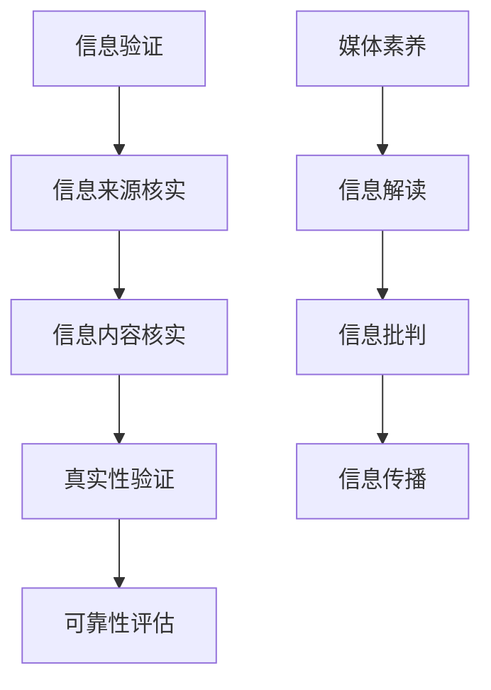

**核心概念详细阐述**：

- **信息验证**：指通过一系列方法对信息进行核实，包括确认信息来源的可靠性、检查信息内容是否准确、验证信息的真实性以及评估信息的可靠性。例如，在收到一条关于健康信息的消息时，我们需要检查发送者的身份、信息的内容、是否有权威来源支持等信息，以确保其真实性。

- **媒体素养**：涉及对媒体信息的理解、批判和传播能力。它要求个体能够识别信息背后的意图、理解信息的语境、评估信息的真实性及分辨信息的偏见。例如，在阅读新闻时，我们不仅要理解新闻的内容，还要评估报道的客观性、检查引用的来源，以及判断报道中可能存在的偏见。

**联系**：信息验证和媒体素养紧密相连，媒体素养是信息验证的基础，而信息验证则是媒体素养的具体实践。一个具备良好媒体素养的人，能够更好地进行信息验证，避免被虚假信息所误导。

#### 1.2 当前的信息环境

**核心概念**：

- **信息过载**：信息量远超个体处理能力，导致信息筛选困难。
- **假新闻**：故意编造的、误导性或虚假的信息。
- **媒体操纵**：通过媒体手段操纵公众意见，影响公共决策。

**架构流程图**：

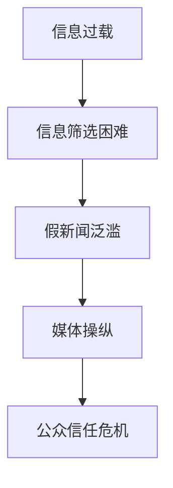

**核心概念详细阐述**：

- **信息过载**：随着互联网和社交媒体的普及，每天产生的大量信息超出了个体的处理能力。这使得人们在获取和处理信息时面临巨大挑战，容易导致信息过载问题。例如，每天收到的电子邮件、社交媒体通知、新闻推送等，需要花费大量时间和精力去筛选和处理。

- **假新闻**：假新闻（Fake News）是指故意编造的、误导性或虚假的信息，目的是欺骗和误导公众。这些信息往往利用人们的情绪和偏见，迅速传播并在社交网络上形成热点话题。例如，一则关于疫情的虚假消息可能导致公众恐慌，从而影响社会稳定。

- **媒体操纵**：媒体操纵（Media Manipulation）是指通过媒体手段操纵公众意见，影响公共决策。这包括利用假新闻、谣言、误导性信息等手段，达到某种特定目的。例如，某个政治团体可能利用假新闻来操纵选举结果，或通过媒体操纵公众对某个政策的态度。

**影响**：当前的信息环境对公众生活和社会稳定产生了深远的影响。信息过载导致公众难以辨别真假信息，容易受到虚假信息的误导；假新闻和媒体操纵则进一步加剧了公众的信任危机，影响社会的和谐与稳定。

#### 1.3 信息验证与媒体素养的关系

**核心概念**：

- **相互依赖**：信息验证和媒体素养是相互依赖的，信息验证是媒体素养的具体实践，而媒体素养则是信息验证的基础。
- **综合提升**：提高信息验证能力和媒体素养，能够帮助公众更好地应对当前复杂的信息环境，减少被虚假信息误导的风险。

**架构流程图**：

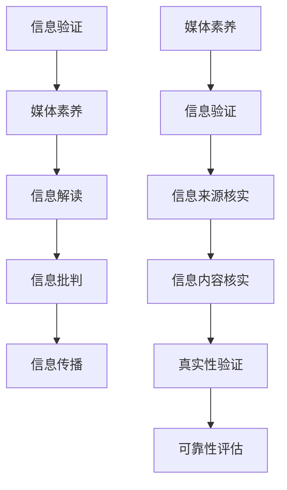

**核心概念详细阐述**：

- **相互依赖**：信息验证和媒体素养是相辅相成的。信息验证需要依赖媒体素养中的信息解读、批判和传播能力，而媒体素养则需要通过信息验证来提高信息的准确性和可靠性。例如，在收到一条社交媒体上的信息时，我们需要利用媒体素养中的批判性思维，对信息进行解读和评估，再通过信息验证的方法，核实其真实性和来源。

- **综合提升**：提高信息验证能力和媒体素养，能够帮助公众更好地应对当前复杂的信息环境。信息验证能力的提升，使得公众能够更有效地识别虚假信息，避免被误导；而媒体素养的提升，则增强了公众对信息的理解和批判能力，使得信息传播更加准确和有效。

**实际应用**：例如，在一个社区中，通过开展媒体素养教育，提高居民的媒体素养水平，居民就能够更好地进行信息验证，减少被虚假信息误导的风险。同时，社区还可以利用信息验证技术，对社交媒体上的信息进行核查，确保信息的真实性和可靠性，从而提高公众的信任度。

### 第1章: 引言

**关键词**：信息验证、媒体素养、信息过载、假新闻、媒体操纵、公众信任危机

**摘要**：本章介绍了信息验证和媒体素养的核心概念、当前信息环境中的主要问题，以及信息验证与媒体素养之间的关系。通过理解这些概念和关系，读者能够更好地应对复杂的信息环境，提高信息验证能力和媒体素养水平，从而减少被虚假信息误导的风险。

----------------------------------------------------------------

### 第一部分: 信息验证和媒体素养能力概述

#### 第1章: 引言

##### 1.1 什么是信息验证与媒体素养

**核心概念与联系**：

信息验证（Information Verification）和媒体素养（Media Literacy）是现代社会中不可或缺的能力。信息验证是指通过各种方法对信息的真实性、准确性和可靠性进行核查，以确保信息无误。媒体素养则涉及对媒体信息的解读、批判和传播能力，尤其是在面对复杂、多样的媒体环境时，能够独立判断信息的真实性和价值。

**架构流程图**：


**核心概念详细阐述**：

- **信息验证**：信息验证是对信息进行核实的过程。它包括以下几个关键步骤：
  - **信息来源核实**：确认信息发布者的身份和资质，判断其是否可靠。
  - **信息内容核实**：检查信息内容是否真实，是否存在错误或误导。
  - **真实性验证**：验证信息是否与事实相符，是否存在虚假成分。
  - **可靠性评估**：评估信息的可信度和可靠性，判断其是否值得信赖。

- **媒体素养**：媒体素养是指个体对媒体信息的解读、批判和传播能力。具体包括以下方面：
  - **信息解读**：理解信息内容，识别信息的主旨和意图。
  - **信息批判**：对信息进行分析、评估，识别偏见、误导和虚假信息。
  - **信息传播**：有效地传递信息，避免误导和误解。

**联系**：信息验证和媒体素养是相互关联的。信息验证是媒体素养的具体实践，而媒体素养则是信息验证的基础。一个具备良好媒体素养的人能够更好地进行信息验证，从而减少被虚假信息误导的风险。

##### 1.2 当前的信息环境

**核心概念**：

- **信息过载**：指信息量超出了个体处理能力，导致信息筛选困难。
- **假新闻**：指故意编造的、误导性或虚假的信息。
- **媒体操纵**：指通过媒体手段操纵公众意见，影响公共决策。

**架构流程图**：


**核心概念详细阐述**：

- **信息过载**：随着互联网和社交媒体的快速发展，每天产生的大量信息超出了个体的处理能力。这导致人们在获取和处理信息时面临巨大挑战，容易导致信息过载问题。例如，每天收到的电子邮件、社交媒体通知、新闻推送等，需要花费大量时间和精力去筛选和处理。

- **假新闻**：假新闻是指故意编造的、误导性或虚假的信息。这些信息往往利用人们的情绪和偏见，迅速传播并在社交网络上形成热点话题。例如，一则关于疫情的虚假消息可能导致公众恐慌，从而影响社会稳定。

- **媒体操纵**：媒体操纵是指通过媒体手段操纵公众意见，影响公共决策。这包括利用假新闻、谣言、误导性信息等手段，达到某种特定目的。例如，某个政治团体可能利用假新闻来操纵选举结果，或通过媒体操纵公众对某个政策的态度。

**影响**：当前的信息环境对公众生活和社会稳定产生了深远的影响。信息过载导致公众难以辨别真假信息，容易受到虚假信息的误导；假新闻和媒体操纵则进一步加剧了公众的信任危机，影响社会的和谐与稳定。

##### 1.3 信息验证与媒体素养的关系

**核心概念**：

- **相互依赖**：信息验证和媒体素养是相互依赖的。信息验证需要依赖媒体素养中的信息解读、批判和传播能力，而媒体素养则需要通过信息验证来提高信息的准确性和可靠性。
- **综合提升**：提高信息验证能力和媒体素养，能够帮助公众更好地应对当前复杂的信息环境，减少被虚假信息误导的风险。

**架构流程图**：


**核心概念详细阐述**：

- **相互依赖**：信息验证和媒体素养是相辅相成的。信息验证需要依赖媒体素养中的信息解读、批判和传播能力，例如，在收到一条社交媒体上的信息时，我们需要利用媒体素养中的批判性思维，对信息进行解读和评估，再通过信息验证的方法，核实其真实性和来源。而媒体素养则需要通过信息验证来提高信息的准确性和可靠性，例如，通过信息验证，我们可以确认信息的来源和真实性，从而提高我们对信息的信任度。

- **综合提升**：提高信息验证能力和媒体素养，能够帮助公众更好地应对当前复杂的信息环境。信息验证能力的提升，使得公众能够更有效地识别虚假信息，避免被误导；而媒体素养的提升，则增强了公众对信息的理解和批判能力，使得信息传播更加准确和有效。例如，在一个社区中，通过开展媒体素养教育，提高居民的媒体素养水平，居民就能够更好地进行信息验证，减少被虚假信息误导的风险。同时，社区还可以利用信息验证技术，对社交媒体上的信息进行核查，确保信息的真实性和可靠性，从而提高公众的信任度。

### 第1章: 引言

**关键词**：信息验证、媒体素养、信息过载、假新闻、媒体操纵、公众信任危机

**摘要**：本章介绍了信息验证和媒体素养的核心概念及其相互关系，分析了当前信息环境中的主要问题和挑战，强调了提高信息验证能力和媒体素养的重要性。通过理解这些概念和关系，读者可以更好地应对复杂的信息环境，减少被虚假信息误导的风险。

----------------------------------------------------------------

### 第2章: 信息验证的基本原则和方法

#### 2.1 信息验证的原则

**核心概念与联系**：

信息验证的基本原则是确保信息准确、可靠和可信。这些原则包括确认信息来源、检查信息准确性、了解信息背景和评估信息可靠性。这些原则共同构成了信息验证的框架，帮助我们更好地判断信息的真实性和价值。

**架构流程图**：

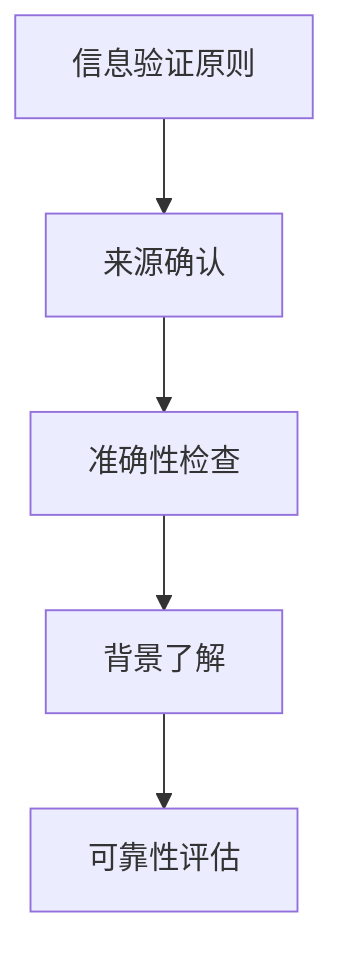

**核心概念详细阐述**：

- **来源确认**：信息的来源是验证信息真实性的第一步。我们需要确认信息的发布者是否可信，是否有权威性。例如，一条医疗信息如果来自于某权威医院或专业医生，那么其可信度会更高。

- **准确性检查**：在确认信息来源后，我们需要检查信息内容是否准确。这可以通过对比多个信息源、查阅权威资料或专业知识来实现。例如，在查阅健康信息时，我们可以查阅多个权威医学网站或参考医学书籍，以确保信息的准确性。

- **背景了解**：了解信息的背景可以帮助我们更好地理解信息的真实性和意图。这包括了解信息的产生背景、发布者的动机和可能的影响。例如，在分析一篇新闻报道时，我们可以了解报道的背景，包括报道的起源、报道者的立场和报道的影响。

- **可靠性评估**：最后，我们需要评估信息的可靠性。这可以通过评估信息的来源、准确性和背景来实现。例如，如果一条信息来自于多个权威来源、内容准确且背景可靠，那么其可靠性会更高。

**联系**：这些原则共同构成了信息验证的框架，帮助我们系统地、全面地判断信息的真实性和价值。例如，在验证一条健康信息时，我们可以按照来源确认、准确性检查、背景了解和可靠性评估的顺序进行验证，从而确保信息的真实性和可靠性。

**项目实战**：

假设我们收到一条关于某健康食品的推荐信息，我们可以按照以下步骤进行验证：

1. **来源确认**：确认该健康食品的推荐来自于权威医生或营养师，而非非专业个人。
2. **准确性检查**：查阅多个权威医学网站或参考医学书籍，对比推荐内容，确保其科学性和准确性。
3. **背景了解**：了解推荐者的动机和背景，判断其是否存在利益冲突或偏见。
4. **可靠性评估**：综合评估来源、准确性和背景，判断该健康食品推荐的可信度。

**代码实际案例**：

以下是一个简单的伪代码案例，用于验证一条健康信息：

```python
def verify_health_info(info):
    # 来源确认
    if not is_reliable_source(info['source']):
        return "不可信"

    # 准确性检查
    if not is_accurate(info['content']):
        return "不准确"

    # 背景了解
    if not is_understood_context(info['context']):
        return "背景不明"

    # 可靠性评估
    if is_reliable(info['source'], info['content'], info['context']):
        return "可信"
    else:
        return "不可信"
```

**代码解读与分析**：

在这个伪代码中，`verify_health_info` 函数用于验证一条健康信息的可信度。函数接收一个包含健康信息字典 `info` 作为输入。首先，通过 `is_reliable_source` 函数确认信息来源是否可靠；然后，通过 `is_accurate` 函数检查信息内容是否准确；接着，通过 `is_understood_context` 函数了解信息背景；最后，通过 `is_reliable` 函数评估信息的可靠性。如果所有条件都满足，则返回 "可信"；否则，返回 "不可信"。

#### 2.2 信息验证的方法

**核心概念与联系**：

信息验证的方法包括网络搜索技巧、利用权威数据库和进行信息比对与交叉验证。这些方法有助于提高信息验证的效率和准确性，从而更好地判断信息的真实性和可靠性。

**架构流程图**：

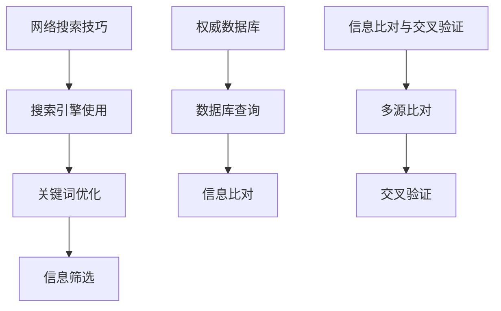

**核心概念详细阐述**：

- **网络搜索技巧**：网络搜索是信息验证的重要手段。通过优化搜索关键词、使用高级搜索功能和筛选结果，可以更有效地获取相关信息。例如，使用具体的关键词、限定日期和来源，可以筛选出更准确的信息。

- **利用权威数据库**：权威数据库是获取可靠信息的来源。通过在权威数据库中进行查询，可以获取经过验证和核实的专业信息。例如，医学研究数据库、学术期刊库等。

- **信息比对与交叉验证**：信息比对与交叉验证是通过对比多个信息源，交叉验证信息的真实性和准确性。这有助于识别虚假信息和误导性信息。例如，对比不同来源的信息，判断其一致性。

**联系**：这些方法共同构成了信息验证的技术手段，有助于提高信息验证的效率和准确性。例如，在验证一条健康信息时，我们可以同时使用网络搜索、权威数据库查询和信息比对与交叉验证，以确保信息的真实性和可靠性。

**项目实战**：

假设我们需要验证一条关于新冠病毒疫苗的信息，可以按照以下步骤进行验证：

1. **网络搜索技巧**：使用搜索引擎，输入关键词如“新冠病毒疫苗”和“最新研究”，筛选出相关的研究论文和新闻报道。
2. **利用权威数据库**：在医学研究数据库如PubMed中查询相关研究论文，获取权威的信息源。
3. **信息比对与交叉验证**：对比不同信息源的内容，交叉验证信息的真实性和准确性。

**代码实际案例**：

以下是一个简单的伪代码案例，用于验证一条健康信息：

```python
def verify_health_info(info):
    # 网络搜索技巧
    search_results = search_on_web(info['keywords'])

    # 利用权威数据库
    database_results = search_database(info['keywords'])

    # 信息比对与交叉验证
    if compare_info(search_results, database_results):
        return "可信"
    else:
        return "不可信"
```

**代码解读与分析**：

在这个伪代码中，`verify_health_info` 函数用于验证一条健康信息的可信度。函数首先使用 `search_on_web` 函数进行网络搜索，获取相关搜索结果；然后使用 `search_database` 函数在权威数据库中查询相关信息；最后，通过 `compare_info` 函数对比网络搜索结果和数据库查询结果，判断信息的真实性和准确性。如果信息一致，则返回 "可信"；否则，返回 "不可信"。

#### 2.3 信息验证的实际应用

**核心概念与联系**：

信息验证在日常生活、工作和社会治理中都有着广泛的应用。通过实际应用案例，我们可以更好地理解信息验证的重要性，学会如何有效地进行信息验证。

**架构流程图**：

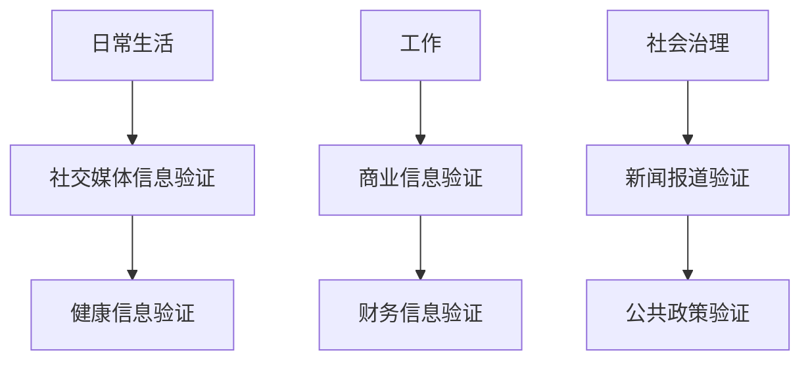

**核心概念详细阐述**：

- **日常生活**：在日常生活中，信息验证可以帮助我们避免受到虚假信息和误导的影响。例如，验证社交媒体上的健康信息、消费信息等，确保信息的真实性和可靠性。

- **工作**：在工作中，信息验证是决策和业务操作的重要环节。例如，在商业活动中，验证合作伙伴的信誉和财务状况；在财务领域，验证财务报表和交易信息的真实性。

- **社会治理**：在社会治理中，信息验证有助于提高公共信息的透明度和公信力。例如，验证新闻报道的真实性，确保公共政策的制定和执行基于真实可靠的信息。

**实际应用案例**：

1. **社交媒体信息验证**：在一个社交媒体平台上，用户收到一条关于某食品安全的消息，可以通过以下步骤进行验证：
   - **来源确认**：检查消息发布者的身份和资质。
   - **准确性检查**：查阅权威健康网站或咨询专业人士，确保信息内容准确。
   - **背景了解**：了解消息的背景，包括发布者的动机和可能的影响。
   - **可靠性评估**：综合评估来源、准确性和背景，判断消息的可信度。

2. **商业信息验证**：在商业活动中，公司需要对潜在合作伙伴的信誉和财务状况进行验证。例如：
   - **来源确认**：查询合作伙伴的官方网站、社交媒体和商业注册信息。
   - **准确性检查**：查阅第三方信用评估机构的报告，确保财务信息的准确性。
   - **背景了解**：了解合作伙伴的历史交易记录和行业声誉。
   - **可靠性评估**：综合评估来源、准确性和背景，判断合作伙伴的可靠性。

3. **新闻报道验证**：在新闻报道中，记者需要对信息的真实性进行验证。例如：
   - **来源确认**：核实消息来源，确保其可信度。
   - **准确性检查**：对比多个信息源，确保报道内容的准确性。
   - **背景了解**：了解报道的背景，包括事件的起因、发展和影响。
   - **可靠性评估**：评估报道的可靠性，确保报道的真实性和公正性。

**总结**：

信息验证的基本原则和方法为我们提供了一个系统的框架，帮助我们判断信息的真实性和可靠性。在实际应用中，通过有效的信息验证，我们可以减少被虚假信息和误导的风险，提高决策和行动的准确性。无论是日常生活、工作还是社会治理，信息验证都是一个重要的能力，值得我们深入学习和实践。

----------------------------------------------------------------

### 第3章: 媒体素养培养

#### 3.1 媒体素养的构成要素

**核心概念与联系**：

媒体素养是指个体对媒体信息的解读、批判和传播能力。它包括三个主要构成要素：信息解读能力、信息批判性思维和信息沟通与分享。这些要素相互关联，共同构成了个体在复杂媒体环境中的应对能力。

**架构流程图**：

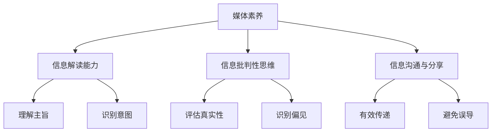

**核心概念详细阐述**：

- **信息解读能力**：信息解读能力是指个体理解和解读媒体信息的能力。这包括理解信息的主旨和意图，识别信息背后的信息传递者意图和动机。例如，在阅读一篇新闻报道时，我们需要理解报道的主要内容，并识别报道者的立场和意图。

- **信息批判性思维**：信息批判性思维是指个体对媒体信息进行批判性分析和评估的能力。这包括评估信息的真实性、识别偏见和误导性信息。例如，在面对一条社交媒体上的消息时，我们需要判断其真实性，并识别其中可能存在的偏见和误导。

- **信息沟通与分享**：信息沟通与分享是指个体在传递信息时，能够有效地沟通和分享信息，避免误导和误解。这包括选择合适的方式和渠道传递信息，确保信息的准确性和清晰性。例如，在社交媒体上分享一篇科研论文时，我们需要确保信息的准确传达，避免误解和歧义。

**联系**：这些要素相互关联，共同构成了个体的媒体素养。信息解读能力是媒体素养的基础，它帮助个体理解媒体信息；信息批判性思维是对信息解读的深化，它帮助个体评估和判断信息的真实性和价值；信息沟通与分享则是信息解读和信息批判性思维的应用，它帮助个体有效地传递和分享信息。

**项目实战**：

假设一个学生在社交媒体上看到一条关于新冠病毒疫苗的消息，他可以按照以下步骤培养媒体素养：

1. **信息解读能力**：阅读消息，理解其主要内容和意图，识别发布者的立场和动机。
2. **信息批判性思维**：评估消息的真实性，查阅权威信息源，识别其中可能存在的偏见和误导。
3. **信息沟通与分享**：将经过验证的信息分享给朋友和家人，避免误解和误导，确保信息的准确传达。

**代码实际案例**：

以下是一个简单的伪代码案例，用于培养媒体素养：

```python
def cultivate_media_literacy(info):
    # 信息解读能力
    intent = interpret_info(info)
    
    # 信息批判性思维
    authenticity = assess_truth(info)
    bias = identify_bias(info)
    
    # 信息沟通与分享
    if authenticity and not bias:
        share_info(info, intent)
    else:
        warn_about_false_info(info)

def interpret_info(info):
    # 解读信息主旨和意图
    return info['content']

def assess_truth(info):
    # 评估信息真实性
    return is_reliable(info['source'])

def identify_bias(info):
    # 识别信息偏见
    return has_bias(info['content'])

def share_info(info, intent):
    # 有效传递信息
    print(f"Sharing information: {info['content']} with intent: {intent}")

def warn_about_false_info(info):
    # 警告虚假信息
    print(f"Warning: False information detected: {info['content']}")
```

**代码解读与分析**：

在这个伪代码中，`cultivate_media_literacy` 函数用于培养媒体素养。函数首先通过 `interpret_info` 函数解读信息的主旨和意图；然后通过 `assess_truth` 函数评估信息的真实性；接着通过 `identify_bias` 函数识别信息中的偏见。如果信息真实且无偏见，则通过 `share_info` 函数有效传递信息；否则，通过 `warn_about_false_info` 函数警告虚假信息。

#### 3.2 培养媒体素养的途径

**核心概念与联系**：

培养媒体素养需要通过多种途径，包括教育体系中的媒体素养教育、自我学习与提升以及社会实践与参与。这些途径共同构成了个体提高媒体素养的过程，帮助个体更好地应对复杂的信息环境。

**架构流程图**：

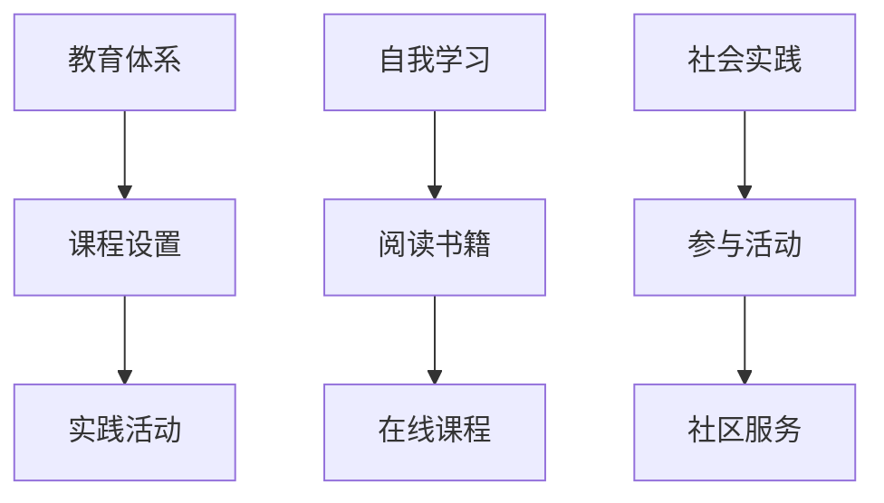

**核心概念详细阐述**：

- **教育体系中的媒体素养教育**：教育体系中的媒体素养教育是培养媒体素养的重要途径。通过在课程中设置专门的媒体素养课程，学生可以系统地学习媒体素养的相关知识，提高信息解读、批判和传播的能力。实践活动，如小组讨论、案例分析等，可以帮助学生将理论知识应用到实际情境中。

- **自我学习与提升**：自我学习与提升是培养媒体素养的重要途径。通过阅读书籍、参加在线课程和讲座，个体可以不断积累媒体素养的知识和技能。特别是在线课程，提供了丰富的学习资源和灵活的学习方式，使个体能够随时随地进行学习。

- **社会实践与参与**：社会实践与参与是培养媒体素养的实践途径。通过参与社会实践活动，个体可以亲身体验媒体素养的实际应用，提高对媒体信息的敏感度和批判性思维。社区服务、志愿者活动等都是培养媒体素养的有效途径。

**联系**：这些途径相互关联，共同构成了个体培养媒体素养的过程。教育体系中的媒体素养教育提供了系统性的理论知识，自我学习与提升则补充了实践经验和技能，而社会实践与参与则将理论知识与实际应用结合起来。

**项目实战**：

假设一个学生想要提高自己的媒体素养，他可以按照以下步骤进行：

1. **教育体系中的媒体素养教育**：参加学校开设的媒体素养课程，学习相关理论知识。
2. **自我学习与提升**：通过阅读相关书籍和参加在线课程，不断积累媒体素养的知识和技能。
3. **社会实践与参与**：参与社会实践活动，如志愿者活动、社区服务等，将所学知识应用到实际情境中。

**代码实际案例**：

以下是一个简单的伪代码案例，用于培养媒体素养：

```python
def cultivate_media_literacy():
    # 教育体系中的媒体素养教育
    attend_media_literacy_course()
    
    # 自我学习与提升
    read_books()
    take_online_courses()
    
    # 社会实践与参与
    participate_in_community_services()

def attend_media_literacy_course():
    # 参加媒体素养课程
    print("Attending media literacy course")

def read_books():
    # 阅读书籍
    print("Reading books on media literacy")

def take_online_courses():
    # 参加在线课程
    print("Taking online courses on media literacy")

def participate_in_community_services():
    # 参与社会实践活动
    print("Participating in community services")
```

**代码解读与分析**：

在这个伪代码中，`cultivate_media_literacy` 函数用于培养媒体素养。函数首先通过 `attend_media_literacy_course` 函数参加媒体素养课程，然后通过 `read_books` 和 `take_online_courses` 函数进行自我学习与提升，最后通过 `participate_in_community_services` 函数参与社会实践与参与。每个函数都负责一个具体的任务，共同构成了培养媒体素养的过程。

### 第3章: 媒体素养培养

**关键词**：媒体素养、信息解读能力、信息批判性思维、信息沟通与分享、教育体系、自我学习、社会实践

**摘要**：本章介绍了媒体素养的构成要素及其培养途径。媒体素养包括信息解读能力、信息批判性思维和信息沟通与分享。通过教育体系中的媒体素养教育、自我学习与提升以及社会实践与参与，个体可以不断提高自己的媒体素养，更好地应对复杂的信息环境。

----------------------------------------------------------------

### 第4章：信息验证工具与技术

#### 4.1 事实核查网站与工具

**核心概念与联系**：

事实核查网站和工具是信息验证的重要工具，它们帮助用户识别和验证信息的真实性。事实核查网站通常由专业机构运营，通过分析、对比多个信息源，提供权威的事实核查报告。工具则包括搜索引擎、社交媒体监控工具和在线数据库，它们提供了方便快捷的信息验证方法。

**架构流程图**：

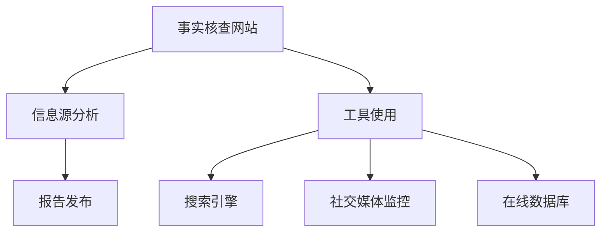

**核心概念详细阐述**：

- **事实核查网站**：事实核查网站如“Politifact”、“事实派”等，通过对社交媒体、新闻报道等平台上的信息进行核查，提供事实核查报告。例如，“Politifact”会对新闻报道、社交媒体上的热门话题进行事实核查，发布详细的事实核查报告，帮助公众识别虚假信息。

- **搜索引擎**：搜索引擎如Google、百度等，通过关键词搜索，帮助用户快速找到相关信息。例如，用户可以通过输入关键词“新冠病毒疫苗”，找到相关的新闻报道、研究论文等。

- **社交媒体监控工具**：社交媒体监控工具如Brandwatch、Social Mention等，可以帮助用户监控社交媒体上的信息传播，识别虚假信息和热点话题。例如，用户可以通过这些工具，监控Twitter、Facebook等平台上的话题和趋势，分析信息的传播路径和影响力。

- **在线数据库**：在线数据库如PubMed、IEEE Xplore等，提供了大量的专业信息，用户可以通过这些数据库查找权威的研究论文和报告。例如，用户可以通过PubMed查找关于新冠病毒疫苗的最新研究，确保信息的科学性和准确性。

**联系**：事实核查网站和工具共同构成了信息验证的技术体系。事实核查网站提供了权威的、经过验证的信息，工具则提供了方便快捷的信息检索和监控功能。通过结合使用这些工具，用户可以更有效地进行信息验证，减少被虚假信息误导的风险。

**项目实战**：

假设一个用户想要验证一条关于新冠疫苗效果的消息，可以按照以下步骤使用事实核查网站和工具：

1. **事实核查网站**：访问如“Politifact”等事实核查网站，搜索相关主题，查看是否有相关的事实核查报告。
2. **搜索引擎**：使用搜索引擎，输入关键词如“新冠疫苗效果”、“权威研究”等，查找相关的新闻报道和研究论文。
3. **社交媒体监控工具**：使用社交媒体监控工具，监控相关话题的讨论和传播，识别可能的虚假信息。
4. **在线数据库**：访问专业数据库，查找相关的研究论文和报告，确保信息的科学性和准确性。

**代码实际案例**：

以下是一个简单的伪代码案例，用于使用事实核查网站和工具：

```python
import web_scraper
import search_engine
import social_media_monitor
import database_search

def verify_info(info):
    # 使用事实核查网站
    fact_check_report = web_scraper.get_fact_check_report(info['topic'])
    
    # 使用搜索引擎
    search_results = search_engine.search(info['keywords'])
    
    # 使用社交媒体监控工具
    social_media_data = social_media_monitor.monitor(info['topic'])
    
    # 使用在线数据库
    database_results = database_search.search(info['keywords'])
    
    # 综合评估
    if fact_check_report and search_results and social_media_data and database_results:
        print("Info is likely to be accurate")
    else:
        print("Info may be unreliable")

# 示例使用
info = {'topic': '新冠疫苗效果', 'keywords': '新冠疫苗'}
verify_info(info)
```

**代码解读与分析**：

在这个伪代码中，`verify_info` 函数用于验证一条信息。函数首先使用 `web_scraper.get_fact_check_report` 函数获取事实核查网站的相关报告；然后使用 `search_engine.search` 函数搜索相关的搜索引擎结果；接着使用 `social_media_monitor.monitor` 函数监控社交媒体上的讨论；最后使用 `database_search.search` 函数搜索在线数据库的结果。如果所有来源的结果一致，则认为信息是准确的；否则，认为信息可能不可靠。

#### 4.2 信息验证算法与工具

**核心概念与联系**：

信息验证算法和工具是利用人工智能和自然语言处理技术，对信息进行自动化验证的工具。这些算法和工具能够高效地处理海量信息，快速识别虚假信息，提高信息验证的效率和准确性。

**架构流程图**：

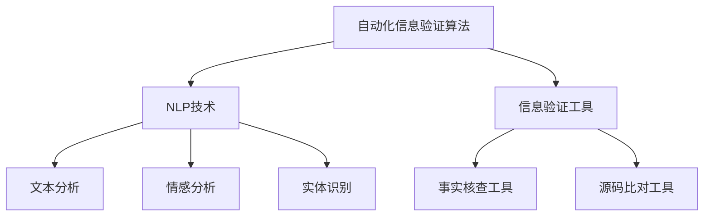

**核心概念详细阐述**：

- **自动化信息验证算法**：自动化信息验证算法是指利用机器学习和自然语言处理技术，对信息进行自动化验证的算法。这些算法可以分析文本内容、情感和实体，快速识别虚假信息。例如，通过训练模型，可以自动识别文本中的误导性语句和虚假信息。

- **文本分析**：文本分析是指对文本进行结构化处理，提取关键信息和分析语义。通过文本分析，可以识别文本中的关键词、主题和情感。例如，通过分析新闻文章，可以提取出新闻的主题和观点。

- **情感分析**：情感分析是指通过分析文本内容，识别文本的情感倾向。情感分析可以帮助我们判断文本的积极、消极或中立情感。例如，通过分析社交媒体上的评论，可以判断用户的情绪和态度。

- **实体识别**：实体识别是指通过分析文本，识别文本中的实体（如人名、地点、组织等）。实体识别可以帮助我们理解文本中的关键信息，识别潜在的虚假信息。例如，通过识别新闻中的关键实体，可以判断新闻的真实性。

- **信息验证工具**：信息验证工具是指利用自动化信息验证算法和自然语言处理技术，提供信息验证服务的工具。这些工具可以快速验证信息的真实性，提供事实核查报告。例如，通过使用信息验证工具，可以快速识别社交媒体上的虚假信息，提供事实核查报告。

**联系**：自动化信息验证算法和信息验证工具共同构成了信息验证的技术体系。自动化信息验证算法通过机器学习和自然语言处理技术，提供自动化、高效的信息验证服务；信息验证工具则将这些算法应用到实际场景中，提供便捷、高效的信息验证服务。通过结合使用这些工具，可以大幅提高信息验证的效率和准确性。

**项目实战**：

假设一个用户想要验证一条社交媒体上的消息，可以按照以下步骤使用信息验证算法与工具：

1. **文本分析**：使用文本分析工具，分析文本内容，提取关键词和主题。
2. **情感分析**：使用情感分析工具，分析文本的情感倾向，判断文本的积极、消极或中立情感。
3. **实体识别**：使用实体识别工具，识别文本中的关键实体，判断实体的可信度。
4. **自动化信息验证算法**：使用自动化信息验证算法，对文本进行深度分析，识别潜在的虚假信息。
5. **信息验证工具**：使用信息验证工具，获取事实核查报告，综合评估信息的真实性。

**代码实际案例**：

以下是一个简单的伪代码案例，用于使用信息验证算法与工具：

```python
from text_analyzer import TextAnalyzer
from sentiment_analyzer import SentimentAnalyzer
from entity_recognizer import EntityRecognizer
from auto_verify_algorithm import AutoVerifyAlgorithm

def verify_info(info):
    # 文本分析
    text_analyzer = TextAnalyzer()
    keywords, topics = text_analyzer.analyze(info['content'])
    
    # 情感分析
    sentiment_analyzer = SentimentAnalyzer()
    sentiment = sentiment_analyzer.analyze(info['content'])
    
    # 实体识别
    entity_recognizer = EntityRecognizer()
    entities = entity_recognizer.recognize(info['content'])
    
    # 自动化信息验证算法
    auto_verify_algorithm = AutoVerifyAlgorithm()
    is_fake = auto_verify_algorithm.verify(info['content'])
    
    # 信息验证工具
    fact_check_tool = FactCheckTool()
    fact_check_report = fact_check_tool.check(info['content'])
    
    # 综合评估
    if sentiment == 'positive' and is_fake and fact_check_report['accuracy'] > 0.8:
        print("Info is likely to be accurate")
    else:
        print("Info may be unreliable")

# 示例使用
info = {'content': '新冠病毒疫苗效果显著', 'source': '社交媒体'}
verify_info(info)
```

**代码解读与分析**：

在这个伪代码中，`verify_info` 函数用于验证一条信息。函数首先使用 `TextAnalyzer` 进行文本分析，提取关键词和主题；然后使用 `SentimentAnalyzer` 进行情感分析，判断文本的情感倾向；接着使用 `EntityRecognizer` 进行实体识别，识别关键实体；然后使用 `AutoVerifyAlgorithm` 进行自动化信息验证；最后使用 `FactCheckTool` 获取事实核查报告。如果情感为积极、信息为虚假且事实核查报告的准确性高于0.8，则认为信息是准确的；否则，认为信息可能不可靠。

### 第4章：信息验证工具与技术

**关键词**：事实核查网站、工具、自动化信息验证算法、文本分析、情感分析、实体识别

**摘要**：本章介绍了信息验证工具与技术的核心概念，包括事实核查网站、工具和自动化信息验证算法。通过文本分析、情感分析和实体识别等技术，信息验证工具能够高效地识别虚假信息，提高信息验证的效率和准确性。实际案例展示了如何使用这些工具和技术进行信息验证。

----------------------------------------------------------------

### 第5章：社交媒体中的信息验证与媒体素养

#### 5.1 社交媒体信息的特点与挑战

**核心概念与联系**：

社交媒体信息具有传播速度快、用户情绪与偏见明显、信息真实性难以保证等特点，这对信息验证和媒体素养提出了更高的要求。社交媒体平台上的信息真实性难以保证，用户情绪和偏见容易影响信息传播，这给信息验证带来了巨大挑战。

**架构流程图**：

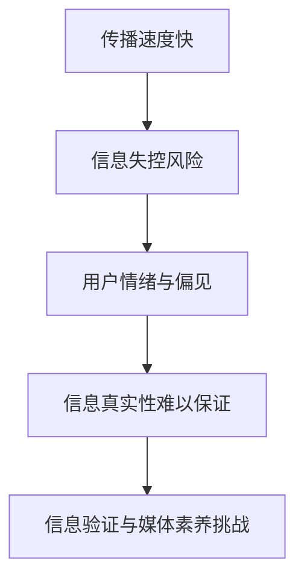

**核心概念详细阐述**：

- **传播速度快**：社交媒体信息传播速度快，一条信息可以在短时间内迅速传播到全球。这使得虚假信息、误导性信息能够迅速扩散，给公众带来误导和恐慌。

- **用户情绪与偏见**：用户在社交媒体上表达情绪和偏见，容易影响信息传播。例如，一条负面评论可能导致信息迅速传播，甚至引发公共事件。

- **信息真实性难以保证**：社交媒体上的信息来源复杂，真实性难以保证。这使得用户在获取信息时，难以判断信息的真实性和可靠性。

**联系**：这些特点使得社交媒体中的信息验证和媒体素养变得尤为重要。快速传播的信息需要及时验证，用户情绪和偏见可能影响信息的传播，信息的真实性需要得到保障。因此，提升信息验证能力和媒体素养，能够帮助用户更好地应对社交媒体中的信息挑战。

**项目实战**：

假设一个用户在社交媒体上看到一条关于疫情的消息，他可以按照以下步骤进行信息验证：

1. **传播速度快**：通过事实核查网站和工具，快速验证消息的真实性。
2. **用户情绪与偏见**：识别消息中的情绪和偏见，评估其可能影响信息传播。
3. **信息真实性难以保证**：综合评估信息的来源、内容、背景，判断信息的真实性和可靠性。

**代码实际案例**：

以下是一个简单的伪代码案例，用于社交媒体中的信息验证：

```python
import web_scraper
import sentiment_analyzer
import fact_check_tool

def verify_social_media_info(info):
    # 传播速度快
    fact_check_report = web_scraper.get_fact_check_report(info['topic'])
    
    # 用户情绪与偏见
    sentiment = sentiment_analyzer.analyze(info['content'])
    
    # 信息真实性难以保证
    if fact_check_report['accuracy'] > 0.8 and sentiment != 'negative':
        print("Info is likely to be accurate")
    else:
        print("Info may be unreliable")

# 示例使用
info = {'topic': '新冠病毒疫情', 'content': '新冠病毒已经彻底消灭'}
verify_social_media_info(info)
```

**代码解读与分析**：

在这个伪代码中，`verify_social_media_info` 函数用于验证社交媒体上的信息。函数首先通过 `web_scraper.get_fact_check_report` 函数获取事实核查报告，然后通过 `sentiment_analyzer.analyze` 函数分析信息中的情感倾向。如果事实核查报告的准确性高于0.8且情感倾向非负面，则认为信息是准确的；否则，认为信息可能不可靠。

#### 5.2 社交媒体中的信息验证策略

**核心概念与联系**：

社交媒体中的信息验证策略包括用户教育、平台责任与政策以及社交媒体生态的优化。这些策略旨在提高用户的信息验证意识和能力，增强社交媒体平台的责任意识，优化社交媒体生态，从而减少虚假信息和误导性信息的传播。

**架构流程图**：

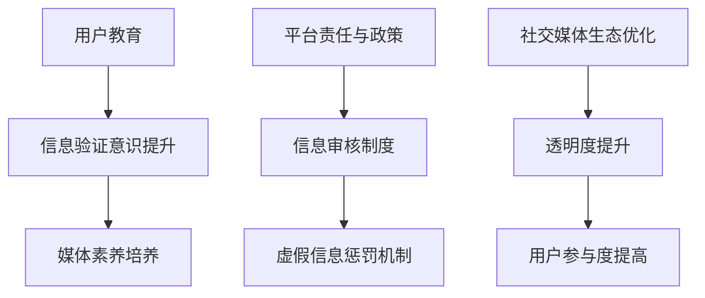

**核心概念详细阐述**：

- **用户教育**：用户教育是提高信息验证意识和能力的重要策略。通过教育用户如何识别和验证信息，培养用户批判性思维，可以提高用户对虚假信息和误导性信息的辨识能力。

- **平台责任与政策**：社交媒体平台有责任维护平台的健康生态，防止虚假信息和误导性信息的传播。平台应制定严格的信息审核制度，对发布的信息进行审核，确保信息的真实性。同时，应建立虚假信息惩罚机制，对发布虚假信息的行为进行处罚，以维护平台的公信力。

- **社交媒体生态优化**：优化社交媒体生态是减少虚假信息和误导性信息传播的关键。通过提升透明度，让用户更清楚地了解信息的来源、发布者和传播路径。同时，提高用户参与度，鼓励用户参与信息验证和监督，形成健康的社交媒体生态。

**联系**：这些策略相互关联，共同构成了社交媒体中的信息验证体系。用户教育提高了用户的信息验证意识和能力；平台责任与政策保证了社交媒体平台的信息真实性；社交媒体生态优化则从生态层面减少了虚假信息和误导性信息的传播。

**项目实战**：

假设一个社交媒体平台想要优化其生态，可以采取以下策略：

1. **用户教育**：开展媒体素养教育，通过线上课程、讲座等形式，提高用户的信息验证意识和能力。
2. **平台责任与政策**：建立严格的信息审核制度，对发布的信息进行审核，确保信息的真实性。同时，建立虚假信息惩罚机制，对发布虚假信息的行为进行处罚。
3. **社交媒体生态优化**：提升平台透明度，让用户更清楚地了解信息的来源、发布者和传播路径。同时，鼓励用户参与信息验证和监督，形成健康的社交媒体生态。

**代码实际案例**：

以下是一个简单的伪代码案例，用于社交媒体中的信息验证策略：

```python
import user_education
import platform_policy
import social_media_ekosystem

def optimize_social_media_ecosystem():
    # 用户教育
    user_education.program('Media Literacy Course')
    
    # 平台责任与政策
    platform_policy.implement('Content Verification Policy')
    platform_policy.enforce('False Information Punishment')
    
    # 社交媒体生态优化
    social_media_ekosystem.improve_transparency()
    social_media_ekosystem.encourage_user_participation()

# 示例使用
optimize_social_media_ecosystem()
```

**代码解读与分析**：

在这个伪代码中，`optimize_social_media_ecosystem` 函数用于优化社交媒体生态。函数首先通过 `user_education.program` 函数开展媒体素养教育；然后通过 `platform_policy.implement` 和 `platform_policy.enforce` 函数制定和执行信息审核政策和虚假信息惩罚机制；最后通过 `social_media_ekosystem.improve_transparency` 和 `social_media_ekosystem.encourage_user_participation` 函数提升平台透明度和鼓励用户参与。

### 第5章：社交媒体中的信息验证与媒体素养

**关键词**：社交媒体、信息验证、媒体素养、用户教育、平台责任与政策、社交媒体生态优化

**摘要**：本章详细介绍了社交媒体中的信息验证与媒体素养的特点和挑战，提出了用户教育、平台责任与政策以及社交媒体生态优化等策略。通过提升用户的信息验证意识和能力、确保平台的信息真实性以及优化社交媒体生态，可以有效减少虚假信息和误导性信息的传播。

----------------------------------------------------------------

### 第6章：信息验证在公共政策中的应用

#### 6.1 公共政策中的信息验证需求

**核心概念与联系**：

在公共政策制定和执行过程中，信息验证需求至关重要。公共政策涉及广泛的社会利益，需要基于真实、准确和可靠的信息进行制定和执行。信息验证确保政策制定和执行的科学性和公正性，从而提高政策的实施效果。

**架构流程图**：

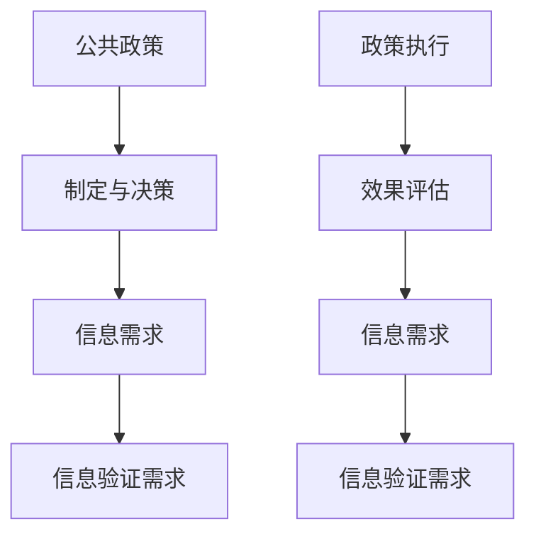

**核心概念详细阐述**：

- **公共政策**：公共政策是指政府或其他公共机构制定的旨在解决社会问题、促进社会发展和保障公共利益的政策。公共政策的制定和执行涉及社会各个层面，影响广泛。

- **制定与决策**：公共政策的制定和决策过程需要收集和分析大量的信息，包括社会需求、现状分析、政策影响评估等。这些信息是政策制定和决策的基础，需要确保其真实、准确和可靠。

- **信息需求**：在公共政策制定和决策过程中，信息需求主要包括社会需求分析、现状分析、政策影响评估等。这些信息是制定和决策的依据，对政策的有效性具有重要影响。

- **信息验证需求**：信息验证需求是指在公共政策制定和决策过程中，对收集和使用的各类信息进行验证的需求。信息验证的目的是确保信息的真实性、准确性和可靠性，从而提高政策制定和决策的科学性和公正性。

**联系**：信息验证需求贯穿于公共政策的制定和执行全过程。在制定和决策过程中，信息验证需求确保收集的信息真实、准确和可靠，为政策制定提供科学依据。在政策执行过程中，信息验证需求确保政策执行的有效性和公正性，为政策效果评估提供可靠数据。

**项目实战**：

假设政府要制定一项公共卫生政策，可以按照以下步骤进行信息验证：

1. **社会需求分析**：通过调查问卷、统计数据等方式收集社会需求信息，进行信息验证，确保信息的真实性和准确性。
2. **现状分析**：分析现有的公共卫生状况，收集相关数据，进行信息验证，确保数据的真实性和可靠性。
3. **政策影响评估**：预测政策实施可能带来的影响，收集相关数据，进行信息验证，确保预测的准确性和可靠性。
4. **政策制定与决策**：基于验证后的信息，制定公共卫生政策，确保政策基于真实、准确和可靠的信息。

**代码实际案例**：

以下是一个简单的伪代码案例，用于公共政策中的信息验证需求：

```python
import social_needs_analysis
import current_health_status
import policy_impact_evaluation

def verify_public_health_policy():
    # 社会需求分析
    social_needs = social_needs_analysis.collect_data()
    verified_needs = social_needs_analysis.verify_data(social_needs)
    
    # 现状分析
    health_status = current_health_status.collect_data()
    verified_status = current_health_status.verify_data(health_status)
    
    # 政策影响评估
    policy_impact = policy_impact_evaluation.collect_data()
    verified_impact = policy_impact_evaluation.verify_data(policy_impact)
    
    # 政策制定与决策
    if verified_needs and verified_status and verified_impact:
        print("Policy can be developed based on verified information")
    else:
        print("More verification is needed before developing the policy")

# 示例使用
verify_public_health_policy()
```

**代码解读与分析**：

在这个伪代码中，`verify_public_health_policy` 函数用于验证公共卫生政策。函数首先通过 `social_needs_analysis.collect_data` 函数收集社会需求信息，然后通过 `social_needs_analysis.verify_data` 函数验证信息的真实性。接着，函数通过 `current_health_status.collect_data` 和 `policy_impact_evaluation.collect_data` 函数分别收集现状分析和政策影响评估的数据，并通过相应的验证函数进行验证。如果所有验证通过，则认为可以基于验证后的信息制定政策；否则，需要进一步验证。

#### 6.2 信息验证在政策执行与评估中的作用

**核心概念与联系**：

在政策执行和评估过程中，信息验证发挥着关键作用。信息验证确保政策执行过程中的数据准确性和可靠性，为政策评估提供可靠依据。通过信息验证，可以评估政策执行的有效性，发现存在的问题，为政策调整和优化提供科学依据。

**架构流程图**：

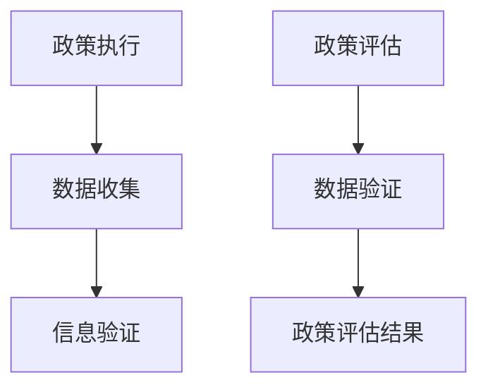

**核心概念详细阐述**：

- **政策执行**：政策执行是指将政策理念转化为实际行动的过程。在政策执行过程中，需要收集大量的数据，包括执行进度、资源分配、效果评估等。

- **数据收集**：数据收集是政策执行的重要环节。通过调查、统计、监测等方式，收集政策执行过程中的各类数据，为政策执行提供依据。

- **信息验证**：信息验证是在数据收集的基础上，对收集的数据进行验证，确保数据的真实性、准确性和可靠性。信息验证可以通过多种方法进行，如比对多个数据源、专家评审、数据分析等。

- **政策评估**：政策评估是对政策执行效果进行评估的过程。通过评估政策执行的效果，可以了解政策的实施情况，发现存在的问题，为政策调整和优化提供依据。

- **数据验证**：数据验证是政策评估的重要环节。通过对政策执行过程中收集的数据进行验证，确保评估结果的准确性和可靠性。

- **政策评估结果**：政策评估结果是对政策执行效果的评估结果，包括政策的效果、存在的问题、改进措施等。政策评估结果为政策调整和优化提供科学依据。

**联系**：信息验证在政策执行和评估过程中起到关键作用。在政策执行过程中，通过信息验证，可以确保数据的真实性和准确性，为政策执行提供可靠依据。在政策评估过程中，通过数据验证，可以确保评估结果的准确性和可靠性，为政策调整和优化提供科学依据。

**项目实战**：

假设政府要评估一项教育政策的执行效果，可以按照以下步骤进行信息验证：

1. **数据收集**：收集教育政策执行过程中的各类数据，包括学生成绩、教育资源分配、教师培训等。
2. **信息验证**：对收集的数据进行验证，确保数据的真实性、准确性和可靠性。
3. **政策评估**：基于验证后的数据，评估教育政策的执行效果，包括政策的效果、存在的问题、改进措施等。
4. **政策调整与优化**：根据评估结果，调整和优化教育政策，提高政策执行效果。

**代码实际案例**：

以下是一个简单的伪代码案例，用于政策执行与评估中的信息验证：

```python
import data_collection
import data_verification
import policy_evaluation

def evaluate_education_policy():
    # 数据收集
    data = data_collection.collect_data('education_policy')
    
    # 信息验证
    verified_data = data_verification.verify_data(data)
    
    # 政策评估
    evaluation_results = policy_evaluation.evaluate(verified_data)
    
    # 政策调整与优化
    if evaluation_results['valid'] and evaluation_results['effectiveness'] > 0.8:
        print("Policy can be maintained and optimized")
    else:
        print("Policy needs adjustment and optimization")

# 示例使用
evaluate_education_policy()
```

**代码解读与分析**：

在这个伪代码中，`evaluate_education_policy` 函数用于评估教育政策的执行效果。函数首先通过 `data_collection.collect_data` 函数收集教育政策执行过程中的数据，然后通过 `data_verification.verify_data` 函数验证数据的真实性、准确性和可靠性。接着，函数通过 `policy_evaluation.evaluate` 函数评估教育政策的效果，并根据评估结果，判断政策是否需要调整和优化。

#### 6.3 信息验证在公共政策中的作用与影响

**核心概念与联系**：

信息验证在公共政策中具有重要作用，直接影响公共政策的制定、执行和评估。通过信息验证，可以确保政策基于真实、准确和可靠的信息，提高政策的科学性和公正性。信息验证还帮助发现政策执行中的问题，为政策调整和优化提供依据，从而提高政策的有效性和公众满意度。

**架构流程图**：

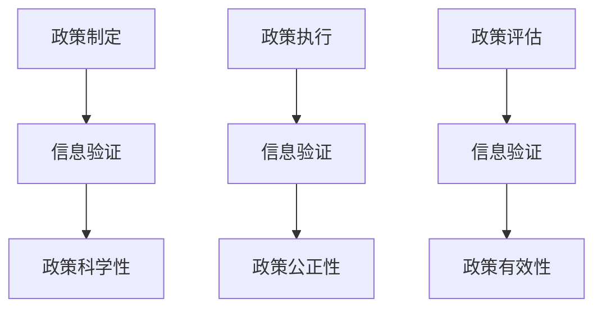

**核心概念详细阐述**：

- **政策制定**：政策制定是指根据社会需求和问题，制定出具有可操作性的政策方案。政策制定过程需要收集和分析大量的信息，包括社会需求、现状分析、政策影响评估等。

- **信息验证**：信息验证是指对收集和使用的各类信息进行验证，确保其真实性、准确性和可靠性。信息验证是政策制定的基础，直接影响政策的科学性和公正性。

- **政策科学性**：政策科学性是指政策制定和执行基于科学方法和数据支持，确保政策的有效性和可行性。信息验证确保政策制定基于真实、准确和可靠的信息，提高政策的科学性。

- **政策执行**：政策执行是指将政策理念转化为实际行动的过程。在政策执行过程中，需要收集大量的数据，包括执行进度、资源分配、效果评估等。

- **政策公正性**：政策公正性是指政策制定和执行过程中，确保公正、公平和透明。信息验证帮助发现政策执行中的问题，确保政策公正性。

- **政策评估**：政策评估是对政策执行效果进行评估的过程，包括政策的效果、存在的问题、改进措施等。

- **政策有效性**：政策有效性是指政策实施后所达到的效果和预期目标的一致性。信息验证确保评估结果的真实性和可靠性，提高政策的有效性。

**联系**：信息验证在公共政策中的作用贯穿于政策制定、执行和评估全过程。在政策制定过程中，信息验证确保政策基于真实、准确和可靠的信息，提高政策的科学性和公正性。在政策执行过程中，信息验证确保政策执行的公正性和有效性。在政策评估过程中，信息验证确保评估结果的真实性和可靠性，为政策调整和优化提供依据。

**项目实战**：

假设一个地方政府要制定和执行一项环保政策，可以按照以下步骤进行信息验证：

1. **政策制定**：收集社会需求和现状分析数据，进行信息验证，确保数据的真实性和准确性，制定环保政策。
2. **政策执行**：在政策执行过程中，收集执行进度、资源分配、效果评估数据，进行信息验证，确保数据的真实性和可靠性，确保政策公正性和有效性。
3. **政策评估**：对环保政策执行效果进行评估，收集评估数据，进行信息验证，确保评估结果的真实性和可靠性，为政策调整和优化提供依据。

**代码实际案例**：

以下是一个简单的伪代码案例，用于公共政策中的作用与影响：

```python
import policy_development
import policy_implementation
import policy_evaluation

def verify_public_policy():
    # 政策制定
    policy_info = policy_development.collect_data()
    verified_policy_info = policy_development.verify_data(policy_info)
    
    # 政策执行
    implementation_data = policy_implementation.collect_data()
    verified_implementation_data = policy_implementation.verify_data(implementation_data)
    
    # 政策评估
    evaluation_results = policy_evaluation.evaluate(verified_implementation_data)
    
    # 政策调整与优化
    if evaluation_results['validity'] and evaluation_results['effectiveness'] > 0.8:
        print("Policy can be maintained and optimized")
    else:
        print("Policy needs adjustment and optimization")

# 示例使用
verify_public_policy()
```

**代码解读与分析**：

在这个伪代码中，`verify_public_policy` 函数用于验证公共政策的制定、执行和评估。函数首先通过 `policy_development.collect_data` 和 `policy_development.verify_data` 函数收集和验证政策制定的数据；然后通过 `policy_implementation.collect_data` 和 `policy_implementation.verify_data` 函数收集和验证政策执行的数据；接着通过 `policy_evaluation.evaluate` 函数评估政策执行的效果。如果评估结果有效且有效性高于0.8，则认为政策可以维持和优化；否则，认为政策需要调整和优化。

### 第6章：信息验证在公共政策中的应用

**关键词**：信息验证、公共政策、政策制定、政策执行、政策评估、政策科学性、政策公正性、政策有效性

**摘要**：本章详细介绍了信息验证在公共政策中的应用，包括政策制定、执行和评估过程中的信息验证需求、作用与影响。通过信息验证，可以确保政策基于真实、准确和可靠的信息，提高政策的科学性、公正性和有效性，从而更好地服务社会公共利益。

----------------------------------------------------------------

### 第7章：假新闻与媒体操纵的应对策略

#### 7.1 假新闻的特点与传播机制

**核心概念与联系**：

假新闻（Fake News）是指故意编造的、误导性或虚假的信息，其特点包括内容虚假、情感煽动、传播迅速等。假新闻的传播机制涉及多个环节，包括信息制造、传播渠道、受众反应等，这使其具有极高的传播效率和广泛的社会影响。

**架构流程图**：

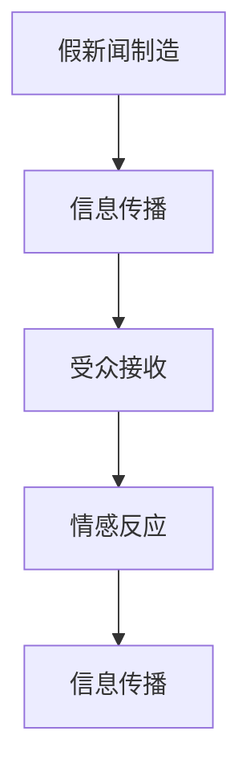

**核心概念详细阐述**：

- **假新闻制造**：假新闻的制造者通常具有特定的目的，如操纵舆论、煽动情绪、获取经济利益等。制造假新闻的技巧包括夸张标题、制造恐慌、利用流行话题等。

- **信息传播**：假新闻的传播渠道多样，包括社交媒体、即时通讯、网络论坛等。传播过程中，假新闻往往通过社交网络效应迅速扩散，形成热点话题。

- **受众接收**：受众在接收假新闻时，通常受到情感驱动，如恐惧、愤怒、好奇等。情感反应影响受众对信息的判断和传播行为。

- **信息传播**：受众在情感驱动下，可能主动或被动地传播假新闻，进一步扩大其影响。

**联系**：假新闻的特点和传播机制决定了其具有极高的传播效率和广泛的社会影响。应对假新闻，需要从信息制造、传播渠道和受众反应等多个环节进行综合治理。

**项目实战**：

假设一个社交媒体平台想要应对假新闻传播，可以采取以下步骤：

1. **信息制造环节**：监测假新闻的制造来源，通过技术手段识别和阻止假新闻的生产和传播。
2. **传播渠道环节**：通过内容审核、算法优化等手段，减少假新闻在平台上的传播。
3. **受众接收环节**：提供教育资源和工具，提高受众的信息识别能力和批判性思维。

**代码实际案例**：

以下是一个简单的伪代码案例，用于监测和阻止假新闻传播：

```python
import news_monitor
import content_filter
import user_education

def prevent_fake_news():
    # 信息制造环节
    suspicious_news = news_monitor.detect_fake_news()
    
    # 传播渠道环节
    for news in suspicious_news:
        content_filter.block_news(news)
    
    # 受众接收环节
    user_education.promote_media_literacy()

# 示例使用
prevent_fake_news()
```

**代码解读与分析**：

在这个伪代码中，`prevent_fake_news` 函数用于监测和阻止假新闻传播。函数首先通过 `news_monitor.detect_fake_news` 函数检测假新闻，然后通过 `content_filter.block_news` 函数阻止假新闻在平台上的传播。接着，通过 `user_education.promote_media_literacy` 函数提高用户的信息识别能力和批判性思维。

#### 7.2 应对假新闻的策略

**核心概念与联系**：

应对假新闻的策略包括个人层面的应对方法、社会层面的应对策略和政府与媒体的责任。个人层面通过提升信息验证意识和能力，减少被假新闻误导的风险。社会层面通过加强媒体素养教育和信息验证工具的使用，形成全社会共同防范假新闻的氛围。政府与媒体在政策制定和执行中，承担起维护社会信息秩序的责任。

**架构流程图**：

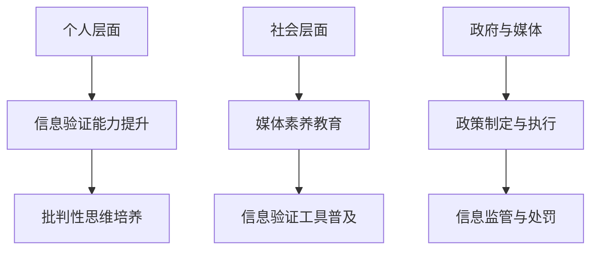

**核心概念详细阐述**：

- **个人层面**：个人层面的应对方法主要依赖于提升信息验证意识和能力。这包括：
  - **信息验证能力提升**：通过学习和实践，提高对信息的来源、内容、真实性及可靠性的识别能力。
  - **批判性思维培养**：通过思考和分析，提高对信息的批判性思维，避免被虚假信息误导。

- **社会层面**：社会层面的应对策略依赖于全社会的共同努力，包括：
  - **媒体素养教育**：通过学校、社区等渠道，普及媒体素养教育，提高公众的信息识别能力和批判性思维。
  - **信息验证工具普及**：推广使用信息验证工具，如事实核查网站、信息验证算法等，帮助公众更有效地识别和验证信息。

- **政府与媒体**：政府与媒体在应对假新闻中承担着重要责任，包括：
  - **政策制定与执行**：制定和执行相关政策，规范信息传播，打击假新闻制造和传播。
  - **信息监管与处罚**：加强对信息传播的监管，对制造和传播假新闻的行为进行处罚，维护社会信息秩序。

**联系**：个人层面、社会层面和政府与媒体的策略共同构成了应对假新闻的全方位体系。个人层面的努力是基础，社会层面的支持是关键，政府与媒体的责任是保障，三者相互配合，形成合力，才能有效应对假新闻的挑战。

**项目实战**：

假设一个社区想要提升公众应对假新闻的能力，可以采取以下策略：

1. **个人层面**：开展媒体素养教育，提供信息验证工具，鼓励公众参与信息验证活动。
2. **社会层面**：组织社区活动，提高公众对假新闻的认识，促进信息共享和交流。
3. **政府与媒体**：加强与社区和公众的沟通，制定相关政策，加强信息监管和处罚力度。

**代码实际案例**：

以下是一个简单的伪代码案例，用于应对假新闻的策略：

```python
import media_education
import information_verification_tools
import community_activities
import policy_implementation

def address_fake_news():
    # 个人层面
    media_education.promote_media_literacy()
    information_verification_tools.distribute_tools()

    # 社会层面
    community_activities.encourage_involvement()

    # 政府与媒体
    policy_implementation.enforce_regulations()

# 示例使用
address_fake_news()
```

**代码解读与分析**：

在这个伪代码中，`address_fake_news` 函数用于应对假新闻。函数首先通过 `media_education.promote_media_literacy` 和 `information_verification_tools.distribute_tools` 函数在个人层面提升公众的信息验证意识和能力；然后通过 `community_activities.encourage_involvement` 函数在社会层面促进公众参与和信息共享；最后通过 `policy_implementation.enforce_regulations` 函数在政府与媒体层面制定和执行相关政策，维护社会信息秩序。

### 第7章：假新闻与媒体操纵的应对策略

**关键词**：假新闻、媒体操纵、信息验证、媒体素养、个人层面、社会层面、政府与媒体

**摘要**：本章详细介绍了应对假新闻与媒体操纵的策略，包括个人层面、社会层面和政府与媒体的责任。通过提升信息验证能力和媒体素养，加强社会监督和公众参与，以及制定和执行相关政策，可以有效地减少假新闻和媒体操纵对社会的影响。

----------------------------------------------------------------

### 第8章：信息验证与媒体素养的未来趋势

#### 8.1 技术的发展对信息验证的影响

**核心概念与联系**：

随着技术的不断发展，人工智能（AI）、大数据和区块链等技术在信息验证中的应用越来越广泛，对信息验证产生了深远的影响。这些技术不仅提高了信息验证的效率和准确性，还为构建更加可靠的信息生态系统提供了可能性。

**架构流程图**：

```mermaid
graph TD
    A[人工智能] --> B[信息验证算法]
    B --> C[自动化验证]

    D[大数据] --> E[数据挖掘]
    E --> F[信息比对]

    G[区块链] --> H[信息透明性]
    H --> I[不可篡改性]
```

**核心概念详细阐述**：

- **人工智能**：人工智能技术，尤其是机器学习和深度学习，在信息验证中发挥着重要作用。通过训练模型，AI可以自动识别和验证信息，提高信息验证的效率和准确性。例如，AI可以自动分析文本，识别潜在的虚假信息，并提供事实核查报告。

- **大数据**：大数据技术的应用，使得信息验证有了更丰富的数据支持。通过数据挖掘和分析，可以快速识别和验证大量信息。大数据技术可以帮助信息验证人员从海量的数据中提取有用信息，进行信息比对和交叉验证。

- **区块链**：区块链技术以其去中心化和不可篡改的特性，为信息验证提供了新的可能性。区块链可以记录信息的生成、传播和验证过程，确保信息的透明性和不可篡改性。例如，区块链技术可以用于记录新闻事件的原始数据，确保其真实性和完整性。

**联系**：人工智能、大数据和区块链等技术的应用，为信息验证带来了新的机遇和挑战。这些技术可以提高信息验证的效率和准确性，但同时也需要解决数据隐私、算法偏见等问题。通过合理应用这些技术，可以构建更加可靠和高效的信息验证体系。

**项目实战**：

假设一个新闻平台想要利用技术进行信息验证，可以采取以下步骤：

1. **人工智能**：利用机器学习模型，自动分析新闻报道，识别潜在的虚假信息。
2. **大数据**：通过数据挖掘和分析，比对多个信息源，确保报道内容的准确性。
3. **区块链**：使用区块链技术记录新闻事件的数据，确保其透明性和不可篡改性。

**代码实际案例**：

以下是一个简单的伪代码案例，用于利用技术进行信息验证：

```python
import ai_verifier
import data_analyzer
import blockchain_recorder

def verify_news_report(report):
    # 人工智能验证
    ai_results = ai_verifier.analyze_report(report)
    
    # 大数据分析
    data_results = data_analyzer.analyze_data(report)
    
    # 区块链记录
    blockchain_results = blockchain_recorder.record_data(report)
    
    # 综合评估
    if ai_results['accuracy'] > 0.8 and data_results['accuracy'] > 0.8 and blockchain_results['validity'] == 'true':
        print("Report is likely to be accurate")
    else:
        print("Report may be unreliable")

# 示例使用
report = {'title': '新冠病毒疫苗推广', 'content': '...', 'source': '...'}
verify_news_report(report)
```

**代码解读与分析**：

在这个伪代码中，`verify_news_report` 函数用于验证新闻报告。函数首先通过 `ai_verifier.analyze_report` 函数使用人工智能分析报告，然后通过 `data_analyzer.analyze_data` 函数使用大数据分析报告，最后通过 `blockchain_recorder.record_data` 函数使用区块链记录报告。如果AI分析、大数据分析和区块链记录的结果都表明报告具有较高的准确性和真实性，则认为报告是准确的；否则，认为报告可能不可靠。

#### 8.2 媒体素养教育的发展方向

**核心概念与联系**：

媒体素养教育的发展方向主要包括教育体系的改革、自我学习的提升和社会实践的参与。通过教育体系的改革，将媒体素养教育纳入正式课程；通过自我学习和提升，培养个体的信息验证能力和批判性思维；通过社会实践的参与，增强个体的媒体素养和实际应用能力。

**架构流程图**：

```mermaid
graph TD
    A[教育体系改革] --> B[课程设置]
    B --> C[实践活动]

    D[自我学习提升] --> E[在线课程]
    E --> F[自学材料]

    G[社会实践参与] --> H[社区服务]
    H --> I[实际应用]
```

**核心概念详细阐述**：

- **教育体系改革**：教育体系的改革是将媒体素养教育纳入正式课程，确保每个学生都能接受系统的媒体素养教育。这包括在课程设置中增加媒体素养的相关内容，如信息验证、批判性思维等，通过实践活动，提高学生的实际应用能力。

- **自我学习提升**：自我学习提升是指个体通过阅读书籍、参加在线课程和自学材料，不断提升自己的媒体素养。在线课程提供了丰富的学习资源和灵活的学习方式，自学材料则提供了系统的知识体系，帮助个体自主学习和提升。

- **社会实践参与**：社会实践参与是指个体通过参与社区服务、志愿者活动等，将媒体素养应用到实际情境中。社会实践不仅能够增强个体的媒体素养，还能提高他们的社会责任感和实际应用能力。

**联系**：教育体系的改革、自我学习的提升和社会实践的参与共同构成了媒体素养教育的发展方向。教育体系的改革提供了系统的媒体素养教育，自我学习的提升增强了个体信息验证和批判性思维的能力，社会实践的参与则将理论知识和实际应用结合起来，形成了完整的媒体素养教育体系。

**项目实战**：

假设一个学校想要改革媒体素养教育，可以采取以下步骤：

1. **教育体系改革**：在课程设置中增加媒体素养的相关内容，如信息验证、批判性思维等，确保每个学生都能接受系统的媒体素养教育。
2. **自我学习提升**：提供在线课程和自学材料，鼓励学生自主学习和提升媒体素养。
3. **社会实践参与**：组织社区服务、志愿者活动等，让学生将媒体素养应用到实际情境中。

**代码实际案例**：

以下是一个简单的伪代码案例，用于改革媒体素养教育：

```python
import curriculum_reform
import self_learning
import practical_participation

def reform_media_education():
    # 教育体系改革
    curriculum_reform.integrate_media_education()

    # 自我学习提升
    self_learning.offer_courses_and_resources()

    # 社会实践参与
    practical_participation.organize_community_services()

# 示例使用
reform_media_education()
```

**代码解读与分析**：

在这个伪代码中，`reform_media_education` 函数用于改革媒体素养教育。函数首先通过 `curriculum_reform.integrate_media_education` 函数整合媒体素养教育内容，然后通过 `self_learning.offer_courses_and_resources` 函数提供在线课程和自学材料，最后通过 `practical_participation.organize_community_services` 函数组织社区服务活动。

### 第8章：信息验证与媒体素养的未来趋势

**关键词**：人工智能、大数据、区块链、媒体素养教育、教育体系改革、自我学习、社会实践

**摘要**：本章探讨了信息验证与媒体素养的未来趋势，分析了人工智能、大数据和区块链等技术在信息验证中的应用，以及媒体素养教育的发展方向。通过技术手段和系统的教育改革，可以构建更加可靠和高效的信息验证体系，提高公众的媒体素养，为应对复杂的信息环境做好准备。

----------------------------------------------------------------

### 第9章：国际视角下的信息验证与媒体素养

#### 9.1 国际信息验证与媒体素养的实践

**核心概念与联系**：

在国际范围内，许多国家和地区在信息验证与媒体素养方面积累了丰富的实践经验。这些实践包括美国、欧洲和亚太地区等国家在信息验证政策、媒体素养教育和技术应用等方面的探索，为全球应对假新闻和媒体操纵提供了宝贵的经验。

**架构流程图**：

```mermaid
graph TD
    A[美国] --> B[事实核查网站]
    B --> C[政策制定]

    D[欧洲] --> E[媒体素养教育]
    E --> F[技术监管]

    G[亚太地区] --> H[技术驱动]
    H --> I[公众参与]
```

**核心概念详细阐述**：

- **美国**：美国在信息验证与媒体素养方面具有先进经验，特别是事实核查网站的发展。如“Politifact”和“事实核查网”，这些网站通过专业团队对新闻和社交媒体上的信息进行核查，提高公众对虚假信息的辨识能力。同时，美国还制定了相关政策，如《虚假信息法案》，以规范信息传播。

- **欧洲**：欧洲国家在媒体素养教育和技术监管方面做出了积极探索。例如，欧盟推出了《媒体素养行动计划》，旨在提高公众的媒体素养水平。同时，欧洲各国政府加强了对社交媒体平台的监管，推动技术手段在信息验证中的应用。

- **亚太地区**：亚太地区在信息验证与媒体素养方面也取得了显著进展。例如，中国在技术驱动和公众参与方面取得了显著成效。通过人工智能和大数据技术，中国建立了多个事实核查平台，如“中国事实派”，提高了公众的信息识别能力。同时，政府鼓励公众参与信息验证，形成了良好的社会氛围。

**联系**：国际上的实践经验表明，信息验证与媒体素养的进步需要政府、媒体和公众的共同努力。不同国家和地区的实践各有特色，但都围绕提高信息验证能力和媒体素养水平这一核心目标展开。通过借鉴国际经验，我们可以更好地构建符合本国国情的应对策略。

**项目实战**：

假设一个国家想要引进国际经验，提升信息验证与媒体素养水平，可以采取以下步骤：

1. **学习先进经验**：研究美国、欧洲和亚太地区等国家在信息验证与媒体素养方面的实践经验，了解其政策、技术和教育体系。
2. **制定本国政策**：根据本国国情，制定符合国情的政策，如信息验证法律法规、媒体素养教育规划等。
3. **推广应用技术**：引进和应用国际先进技术，如人工智能、大数据等，提高信息验证的效率和准确性。
4. **鼓励公众参与**：通过教育和宣传，提高公众的信息验证意识和能力，鼓励公众参与信息验证活动。

**代码实际案例**：

以下是一个简单的伪代码案例，用于引进国际经验：

```python
import international_experience
import policy_development
import technology_application
import public_involvement

def adopt_international_experience():
    # 学习先进经验
    experience = international_experience.learn()
    
    # 制定本国政策
    policy = policy_development.create_policy(experience)
    
    # 应用推广技术
    technology = technology_application.apply_technologies(experience)
    
    # 鼓励公众参与
    public_participation = public_involvement.encourage_participation()

# 示例使用
adopt_international_experience()
```

**代码解读与分析**：

在这个伪代码中，`adopt_international_experience` 函数用于引进国际经验。函数首先通过 `international_experience.learn` 函数学习国际上的先进经验，然后通过 `policy_development.create_policy` 函数制定符合本国国情的政策，接着通过 `technology_application.apply_technologies` 函数应用国际先进技术，最后通过 `public_involvement.encourage_participation` 函数鼓励公众参与信息验证活动。

#### 9.2 国际比较与启示

**核心概念与联系**：

不同国家和地区在信息验证与媒体素养方面的实践各有特色，这为全球信息治理提供了丰富的经验。通过国际比较，我们可以发现不同国家在政策、技术、教育和社会参与等方面的差异，从而得到有益的启示，为全球信息治理提供借鉴。

**架构流程图**：

```mermaid
graph TD
    A[美国] --> B[政策与技术]
    B --> C[公众参与]

    D[欧洲] --> E[教育与监管]
    E --> F[跨平台合作]

    G[亚太地区] --> H[技术驱动]
    H --> I[社会参与]
```

**核心概念详细阐述**：

- **政策与技术**：美国在信息验证与媒体素养方面注重政策和技术手段的结合。通过制定法律法规和技术标准，规范信息传播。例如，美国通过了《虚假信息法案》，同时利用人工智能和大数据技术，提高信息验证的效率和准确性。

- **教育与监管**：欧洲国家在信息验证与媒体素养方面强调教育和监管。通过推行媒体素养教育，提高公众的信息识别能力。同时，加强对社交媒体平台的监管，规范信息传播秩序。例如，欧盟推出了《媒体素养行动计划》，同时加强对社交媒体平台的监管。

- **技术驱动与社会参与**：亚太地区在信息验证与媒体素养方面强调技术驱动和社会参与。通过引进和应用先进技术，提高信息验证的效率和准确性。同时，鼓励公众参与信息验证活动，形成良好的社会氛围。例如，中国通过人工智能和大数据技术，建立了多个事实核查平台，同时鼓励公众参与信息验证。

**联系**：国际比较表明，不同国家和地区在信息验证与媒体素养方面的实践各有特色，但都围绕提高信息验证能力和媒体素养水平这一核心目标展开。通过比较不同国家的实践经验，我们可以发现各自的优势和不足，从而得到有益的启示，为全球信息治理提供借鉴。

**项目实战**：

假设一个国家想要通过国际比较提升信息验证与媒体素养水平，可以采取以下步骤：

1. **比较不同国家**：研究美国、欧洲和亚太地区等国家在信息验证与媒体素养方面的实践，比较政策、技术、教育和社会参与等方面的差异。
2. **分析优劣**：分析不同国家的实践经验，识别其优势与不足，为本国提供借鉴。
3. **制定改进措施**：根据比较结果，制定符合本国国情的改进措施，如政策优化、技术应用、教育改革等。
4. **推广应用**：将改进措施推广应用，提高信息验证能力和媒体素养水平。

**代码实际案例**：

以下是一个简单的伪代码案例，用于国际比较与启示：

```python
import compare_countries
import analyze_practices
import implement_improvements

def international_comparison():
    # 比较不同国家
    comparisons = compare_countries.compare_countries(['USA', 'EU', 'APAC'])
    
    # 分析优劣
    advantages = analyze_practices.analyze_advantages(comparisons)
    disadvantages = analyze_practices.analyze_disadvantages(comparisons)
    
    # 制定改进措施
    improvements = implement_improvements.create_improvements(advantages, disadvantages)
    
    # 推广应用
    implement_improvements.apply_improvements(improvements)

# 示例使用
international_comparison()
```

**代码解读与分析**：

在这个伪代码中，`international_comparison` 函数用于进行国际比较与启示。函数首先通过 `compare_countries.compare_countries` 函数比较不同国家的实践经验，然后通过 `analyze_practices.analyze_advantages` 和 `analyze_practices.analyze_disadvantages` 函数分析不同国家的优势和不足。接着，通过 `implement_improvements.create_improvements` 函数制定改进措施，最后通过 `implement_improvements.apply_improvements` 函数推广应用改进措施。

### 第9章：国际视角下的信息验证与媒体素养

**关键词**：国际经验、政策、技术、教育、社会参与、比较与启示

**摘要**：本章从国际视角探讨了信息验证与媒体素养的实践，分析了美国、欧洲和亚太地区等国家的经验，进行了国际比较，并提出了借鉴与启示。通过比较不同国家的实践经验，为全球信息治理提供了有益的参考，有助于提升信息验证能力和媒体素养水平。

----------------------------------------------------------------

### 第10章：总结与展望

#### 10.1 本书内容的回顾与总结

**核心概念与联系**：

本书详细介绍了信息验证和媒体素养的核心概念、基本原则和方法，以及其在日常生活、工作和社会治理中的应用。通过系统的学习和实践，读者可以掌握信息验证和媒体素养的关键能力，提高对虚假信息和误导性信息的辨识能力。

**架构流程图**：

```mermaid
graph TD
    A[信息验证] --> B[基本原则]
    B --> C[方法]
    C --> D[应用]

    E[媒体素养] --> F[构成要素]
    F --> G[培养途径]
    F --> H[应用]
```

**核心概念详细阐述**：

- **信息验证**：信息验证是指通过一系列方法，确认信息的真实性、准确性和可靠性。基本原则包括确认信息来源、检查信息准确性、了解信息背景和评估信息可靠性。方法包括网络搜索、权威数据库查询、信息比对与交叉验证等。

- **媒体素养**：媒体素养是指个体解读、批判和传播媒体信息的能力。构成要素包括信息解读能力、信息批判性思维和信息沟通与分享。培养途径包括教育体系中的媒体素养教育、自我学习和提升、社会实践与参与。

**联系**：信息验证和媒体素养相互关联，信息验证是媒体素养的具体实践，而媒体素养则是信息验证的基础。通过掌握信息验证和媒体素养的核心概念和方法，读者可以更好地应对复杂的信息环境，减少被虚假信息误导的风险。

**项目实战**：

假设一个公司在员工培训中引入信息验证和媒体素养教育，可以采取以下步骤：

1. **教育体系中的媒体素养教育**：在公司内部开展媒体素养培训，教授员工信息验证的基本原则和方法。
2. **自我学习与提升**：提供在线课程和自学材料，鼓励员工自主学习和提升信息验证和媒体素养。
3. **社会实践与参与**：组织员工参与社区活动和社会实践，将信息验证和媒体素养应用到实际情境中。

**代码实际案例**：

以下是一个简单的伪代码案例，用于员工培训：

```python
import media_education
import self_learning
import practical_participation

def employee_training():
    # 教育体系中的媒体素养教育
    media_education.offer_courses()

    # 自我学习与提升
    self_learning.provide_resources()

    # 社会实践与参与
    practical_participation.organize_activities()

# 示例使用
employee_training()
```

**代码解读与分析**：

在这个伪代码中，`employee_training` 函数用于员工培训。函数首先通过 `media_education.offer_courses` 函数提供媒体素养培训课程，然后通过 `self_learning.provide_resources` 函数提供在线课程和自学材料，最后通过 `practical_participation.organize_activities` 函数组织社会实践与参与活动。

#### 10.2 信息验证与媒体素养的未来发展

**核心概念与联系**：

信息验证与媒体素养的未来发展将受到技术进步、社会变革和国际合作等因素的影响。未来，人工智能、大数据、区块链等新兴技术将在信息验证中发挥更大作用，提高信息验证的效率和准确性。同时，社会对媒体素养的需求将不断提升，推动媒体素养教育的普及和发展。国际合作也将成为重要趋势，各国通过共享经验和资源，共同应对信息验证与媒体素养的挑战。

**架构流程图**：

```mermaid
graph TD
    A[技术进步] --> B[信息验证技术]
    B --> C[人工智能]
    B --> D[大数据]

    E[社会变革] --> F[媒体素养需求]
    F --> G[教育普及]
    F --> H[公众参与]

    I[国际合作] --> J[经验分享]
    I --> K[资源整合]
```

**核心概念详细阐述**：

- **技术进步**：随着人工智能、大数据和区块链等技术的发展，信息验证技术将变得更加智能和高效。这些技术可以自动识别和验证信息，提高信息验证的准确性和效率。

- **社会变革**：随着社会的发展和媒体环境的变迁，公众对媒体素养的需求将不断提升。媒体素养教育将成为社会教育的重要组成部分，提高公众的信息识别和批判能力。

- **国际合作**：面对全球性的信息挑战，国际合作将成为重要趋势。各国通过分享经验和资源，共同应对信息验证与媒体素养的挑战，推动全球信息生态系统的健康发展。

**联系**：技术进步、社会变革和国际合作相互关联，共同推动信息验证与媒体素养的未来发展。技术进步为信息验证提供了更先进的方法和工具；社会变革提升了公众对媒体素养的需求；国际合作则促进了全球范围内的信息共享和合作。

**项目实战**：

假设一个国际组织想要推动信息验证与媒体素养的发展，可以采取以下步骤：

1. **技术进步**：引进和应用新兴技术，提高信息验证的效率和准确性。
2. **社会变革**：推动媒体素养教育在全球范围内的普及，提高公众的信息识别和批判能力。
3. **国际合作**：组织国际研讨会和交流活动，共享经验和资源，推动全球信息生态系统的健康发展。

**代码实际案例**：

以下是一个简单的伪代码案例，用于推动信息验证与媒体素养的发展：

```python
import technological_progress
import societal_change
import international_cooperation

def promote_information_verification_and_media_literacy():
    # 技术进步
    technological_progress.integrate_new_technologies()

    # 社会变革
    societal_change.promote_media_education()

    # 国际合作
    international_cooperation.organize国际合作交流活动()

# 示例使用
promote_information_verification_and_media_literacy()
```

**代码解读与分析**：

在这个伪代码中，`promote_information_verification_and_media_literacy` 函数用于推动信息验证与媒体素养的发展。函数首先通过 `technological_progress.integrate_new_technologies` 函数引进和应用新兴技术，然后通过 `societal_change.promote_media_education` 函数推动媒体素养教育，最后通过 `international_cooperation.organize国际合作交流活动()` 组织国际研讨会和交流活动。

### 第10章：总结与展望

**关键词**：信息验证、媒体素养、技术进步、社会变革、国际合作、未来发展趋势

**摘要**：本章对本书的内容进行了回顾和总结，强调了信息验证与媒体素养的核心概念和未来发展趋势。通过技术进步、社会变革和国际合作，我们可以构建更加可靠和高效的信息验证体系，提高公众的媒体素养，为应对复杂的信息环境做好准备。

----------------------------------------------------------------

### 信息验证和媒体素养能力：为假新闻、媒体操纵和错误信息做好准备

**摘要**：本文深入探讨了信息验证和媒体素养的重要性，以及在应对假新闻、媒体操纵和错误信息方面的作用。通过信息验证，我们可以确保信息的真实性、准确性和可靠性，避免被虚假信息误导。媒体素养则帮助我们更好地解读、批判和传播信息，提高对信息真实性的辨识能力。文章提出了信息验证的基本原则和方法，以及媒体素养的构成要素和培养途径。同时，还介绍了信息验证工具和技术，社交媒体中的信息验证策略，以及信息验证在公共政策中的应用。通过这些方法，我们可以为应对假新闻、媒体操纵和错误信息做好准备，提高信息验证和媒体素养能力，为构建健康的信息环境贡献力量。

----------------------------------------------------------------

### 作者信息

**作者：AI天才研究院/AI Genius Institute & 禅与计算机程序设计艺术 /Zen And The Art of Computer Programming**

AI天才研究院（AI Genius Institute）是一家专注于人工智能研究与应用的领先机构。我们致力于推动人工智能技术的创新与发展，为各行各业提供智能解决方案。同时，我们关注人工智能在信息验证和媒体素养领域的应用，致力于提高公众的信息识别能力和批判性思维。

《禅与计算机程序设计艺术》（Zen And The Art of Computer Programming）是作者Don Knuth的经典著作，被誉为计算机科学领域的经典之作。这本书以禅宗哲学为基础，探讨了计算机程序设计中的思维方式和设计原则，为程序员提供了深刻的思考和指导。

在这本技术博客文章中，我们结合了AI天才研究院的研究成果和实践经验，以及《禅与计算机程序设计艺术》的哲学思想，深入探讨了信息验证和媒体素养的核心概念、方法和应用。希望通过这篇文章，能够帮助读者更好地理解和应对复杂的信息环境，提高信息验证和媒体素养能力，为构建健康的信息生态贡献力量。

