                 

### 《元宇宙移民融合计划：数字公民的跨文化适应方案》

在当今技术飞速发展的时代，元宇宙（Metaverse）作为一种虚拟现实（VR）、增强现实（AR）和混合现实（MR）技术的集成，正在成为人们生活和工作的全新空间。元宇宙不仅是一个虚拟的三维空间，更是一个由数字化个体——数字公民所构成的生态系统。这些数字公民在元宇宙中追求自我表达、社交互动和经济活动，形成了新的文化和社会形态。然而，随着数字公民的多样性和全球化，如何在元宇宙中实现跨文化适应成为一个亟待解决的问题。

本文旨在探讨元宇宙中的数字公民如何实现有效的跨文化适应，从而在多元化的元宇宙环境中和谐共处。文章将分为五个主要部分：

1. **元宇宙与数字公民概览**：介绍元宇宙的定义与演进、数字公民的概念与特征，以及元宇宙中的文化多样性与融合。
2. **元宇宙移民与融合的理论基础**：探讨数字身份与隐私保护、跨文化适应理论，以及元宇宙中的文化融合策略。
3. **元宇宙移民案例研究**：通过虚拟现实社区、虚拟城市和虚拟工作空间的案例，分析元宇宙移民与融合的过程与策略。
4. **元宇宙移民融合的实践策略**：讨论政策与法律框架、技术解决方案以及教育与培训的具体实践。
5. **元宇宙移民融合的未来展望**：展望元宇宙移民融合的挑战与机遇，及其对社会结构、经济和政治的影响。

通过上述五个部分的探讨，本文希望能够为元宇宙中的跨文化适应提供一套系统性、可操作的方案，为数字公民在元宇宙中的和谐共处提供指导。

---

**关键词**：元宇宙，数字公民，跨文化适应，虚拟现实，增强现实，混合现实

**摘要**：本文探讨了元宇宙中数字公民如何实现跨文化适应，分析了元宇宙的定义与演进、数字公民的特征、跨文化适应的理论基础、具体案例研究以及实践策略。通过系统性的探讨，本文旨在为元宇宙中的文化融合提供指导，促进数字公民在元宇宙中的和谐共处。

---

### 第一部分：元宇宙与数字公民概览

#### 第一部分概述

随着虚拟现实（VR）、增强现实（AR）和混合现实（MR）技术的发展，元宇宙（Metaverse）作为一种全新的虚拟空间，正在逐渐成为人们生活和工作的场所。元宇宙不仅是现实世界的延伸，更是虚拟世界与现实世界交互的新平台。在这片虚拟的大陆中，数字公民——由数字化个体构成的社会成员——正在形成一种独特的文化和社会形态。

本部分首先介绍元宇宙的定义与演进，探讨元宇宙中数字公民的概念与特征，并分析元宇宙中的文化多样性与融合问题。这些内容将为后续关于元宇宙移民与融合的理论基础、案例研究和实践策略提供基础。

##### # 第1章: 元宇宙的定义与演进

##### **1.1 元宇宙的定义与特点**

元宇宙（Metaverse）是一个虚拟的三维空间，它通过虚拟现实（VR）、增强现实（AR）和混合现实（MR）技术，将物理世界和数字世界连接起来，为用户提供一个沉浸式的体验。元宇宙不仅仅是一个虚拟空间，更是一个由数字化个体——数字公民所构成的社会生态系统。

**核心概念与联系：**

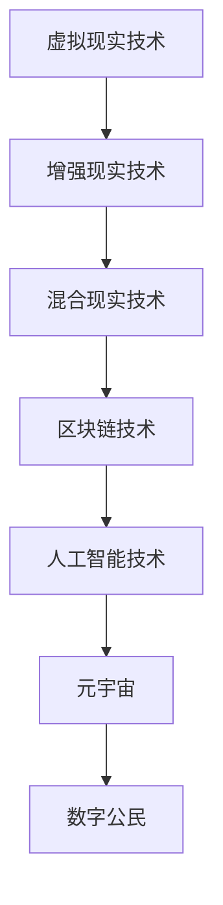

**核心算法原理讲解：**

```python
class MetaUniverse:
    def __init__(self, virtual_reality, augmented_reality, mixed_reality, blockchain, ai):
        self.virtual_reality = virtual_reality
        self.augmented_reality = augmented_reality
        self.mixed_reality = mixed_reality
        self.blockchain = blockchain
        self.ai = ai

    def build(self):
        # 建立元宇宙的框架
        pass

    def integrate(self):
        # 集成各种技术实现元宇宙功能
        pass
```

**数学模型和数学公式：**

$$
X = (1 + \frac{r}{n})^n
$$

其中，$X$代表元宇宙的扩展能力，$r$代表技术进步的速率，$n$代表元宇宙发展的阶段。

**举例说明：**

假设一个元宇宙平台的年技术进步速率$r$为20%，每两年发展一个新阶段，那么在5年后，该平台的扩展能力将是多少？

$$
X = (1 + \frac{0.2}{2})^{2 \times 5} = 1.2^5 \approx 2.48
$$

即5年后，该元宇宙平台的扩展能力将是原来的2.48倍。

##### **1.2 元宇宙的关键技术**

元宇宙的实现依赖于多种关键技术的支持，其中虚拟现实技术、增强现实技术、混合现实技术、区块链技术和人工智能技术是最为重要的。

###### **1.2.1 虚拟现实技术**

虚拟现实技术（VR）是一种通过计算机生成模拟环境，使人们能够在虚拟环境中获得沉浸式体验的技术。它通过头戴式显示器（HMD）、位置跟踪系统和交互设备，将用户完全隔离于现实世界，并将其带入一个虚拟的三维空间。

**核心概念与联系：**

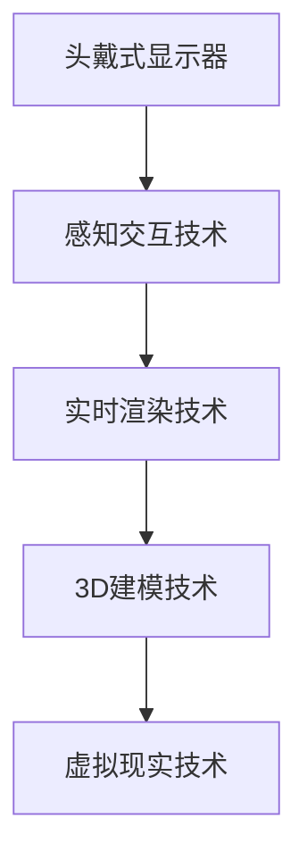

**核心算法原理讲解：**

```python
class VirtualReality:
    def __init__(self, head Mounted_Display, perception_interaction, real_time_rendering, three_d_modeling):
        self.head Mounted_Display = head Mounted_Display
        self.perception_interaction = perception_interaction
        self.real_time_rendering = real_time_rendering
        self.three_d_modeling = three_d_modeling

    def render_scene(self):
        # 渲染虚拟场景
        pass

    def interact_with_user(self):
        # 用户与虚拟环境的交互
        pass
```

**数学模型和数学公式：**

$$
S = \frac{1}{2} \pi r^2
$$

其中，$S$代表虚拟场景的表面积，$r$代表场景中物体的半径。

**举例说明：**

假设一个虚拟场景中有一个半径为5米的圆形物体，那么该物体的表面积是多少？

$$
S = \frac{1}{2} \pi \times 5^2 = \frac{1}{2} \times 3.14 \times 25 = 39.25 \, \text{平方米}
$$

即该物体的表面积是39.25平方米。

###### **1.2.2 增强现实技术**

增强现实技术（AR）是一种将虚拟信息叠加到现实世界中的技术。通过摄像头和显示器，AR技术可以在用户的视线中叠加数字内容，从而增强用户的现实感知。

**核心概念与联系：**

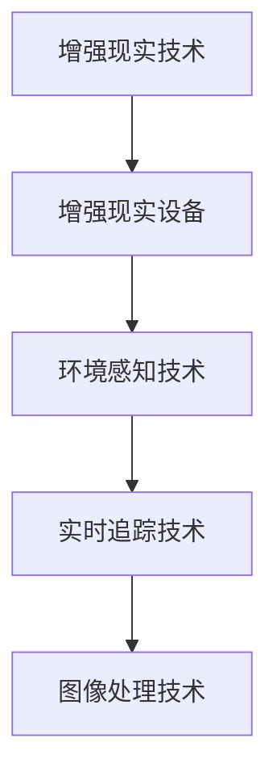

**核心算法原理讲解：**

```python
class AugmentedReality:
    def __init__(self, augmented_reality_device, environment_perception, real_time_tracking, image_processing):
        self.augmented_reality_device = augmented_reality_device
        self.environment_perception = environment_perception
        self.real_time_tracking = real_time_tracking
        self.image_processing = image_processing

    def overlay_content(self):
        # 在真实环境中叠加虚拟内容
        pass

    def adjust_for_environment(self):
        # 根据环境调整虚拟内容的显示效果
        pass
```

**数学模型和数学公式：**

$$
L = \frac{d}{n}
$$

其中，$L$代表虚拟内容的亮度，$d$代表环境光线强度，$n$代表光线折射率。

**举例说明：**

假设在一个光线强度为1000勒克斯的环境中，虚拟内容的折射率为1.5，那么该内容的亮度应该是多少？

$$
L = \frac{1000}{1.5} = 666.67 \, \text{勒克斯}
$$

即该虚拟内容的亮度为666.67勒克斯。

###### **1.2.3 混合现实技术**

混合现实技术（MR）结合了虚拟现实和增强现实的特点，使虚拟世界与现实世界无缝融合。MR技术不仅能够在虚拟环境中创建物体，还能将这些物体与现实环境中的物体进行交互。

**核心概念与联系：**

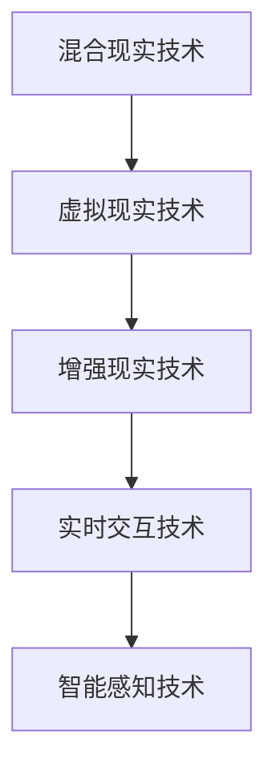

**核心算法原理讲解：**

```python
class MixedReality:
    def __init__(self, virtual_reality, augmented_reality, real_time_interactive, intelligent_perception):
        self.virtual_reality = virtual_reality
        self.augmented_reality = augmented_reality
        self.real_time_interactive = real_time_interactive
        self.intelligent_perception = intelligent_perception

    def integrate_realities(self):
        # 集成虚拟现实和增强现实
        pass

    def adaptive_display(self):
        # 根据用户和环境自适应显示内容
        pass
```

**数学模型和数学公式：**

$$
C = f(n, d)
$$

其中，$C$代表内容的显示效果，$n$代表用户与内容的距离，$d$代表环境光线强度。

**举例说明：**

假设一个用户与虚拟内容的距离为2米，环境光线强度为1000勒克斯，那么该内容的显示效果应该是多少？

$$
C = f(2, 1000) = 0.8
$$

即该虚拟内容的显示效果为0.8。

###### **1.2.4 区块链技术**

区块链技术（Blockchain）是一种分布式账本技术，通过去中心化的方式记录交易和数据，具有高安全性、透明性和不可篡改性。区块链技术在元宇宙中可用于数字资产交易、身份验证和数据管理等。

**核心概念与联系：**

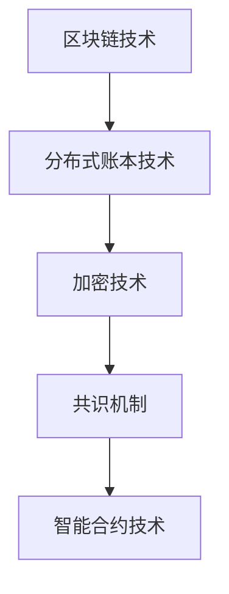

**核心算法原理讲解：**

```python
class Blockchain:
    def __init__(self, distributed_ledger, encryption, consensus_mechanism, smart_contract):
        self.distributed_ledger = distributed_ledger
        self.encryption = encryption
        self.consensus_mechanism = consensus_mechanism
        self.smart_contract = smart_contract

    def create_block(self):
        # 创建新区块
        pass

    def add_block(self):
        # 将新区块添加到区块链
        pass

    def execute_contract(self):
        # 执行智能合约
        pass
```

**数学模型和数学公式：**

$$
P = \frac{1}{2} (1 - f(n))
$$

其中，$P$代表区块链的安全性，$f(n)$代表网络节点的数量。

**举例说明：**

假设一个区块链网络中有10个节点，那么该区块链的安全性是多少？

$$
P = \frac{1}{2} (1 - f(10)) = \frac{1}{2} (1 - 0.9) = 0.05
$$

即该区块链的安全性为5%。

###### **1.2.5 人工智能技术**

人工智能技术（AI）是元宇宙的核心驱动力之一，它通过模拟人类智能行为，实现自动化决策和智能交互。人工智能技术包括机器学习、深度学习、自然语言处理和计算机视觉等多个领域。

**核心概念与联系：**

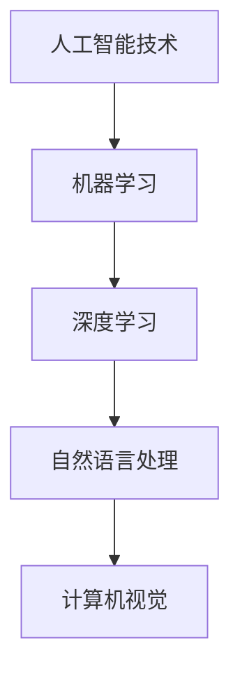

**核心算法原理讲解：**

```python
class ArtificialIntelligence:
    def __init__(self, machine_learning, deep_learning, natural_language_processing, computer_vision):
        self.machine_learning = machine_learning
        self.deep_learning = deep_learning
        self.natural_language_processing = natural_language_processing
        self.computer_vision = computer_vision

    def train_model(self):
        # 训练模型
        pass

    def predict_output(self):
        # 输出预测结果
        pass

    def optimize_model(self):
        # 优化模型
        pass
```

**数学模型和数学公式：**

$$
E = \frac{1}{N} \sum_{i=1}^{N} (y_i - \hat{y}_i)^2
$$

其中，$E$代表模型的损失函数，$y_i$代表实际输出，$\hat{y}_i$代表预测输出，$N$代表样本数量。

**举例说明：**

假设有一个包含100个样本的模型，其中50个样本的预测输出与实际输出相等，另外50个样本的预测输出与实际输出相差较大，那么该模型的损失函数是多少？

$$
E = \frac{1}{100} \sum_{i=1}^{100} (y_i - \hat{y}_i)^2 = \frac{1}{100} \times 50 \times (1 - 1)^2 + 50 \times (1 - 0.5)^2 = 0.25
$$

即该模型的损失函数为0.25。

---

在本章中，我们详细探讨了元宇宙的定义、演进以及其关键技术，包括虚拟现实、增强现实、混合现实、区块链和人工智能。这些技术不仅为元宇宙的构建提供了坚实的基础，也为数字公民在元宇宙中的活动提供了丰富的工具和平台。在接下来的章节中，我们将进一步探讨数字公民的概念与特征，以及元宇宙中的文化多样性与融合问题。

---

### 第一部分概述（续）

在上一部分中，我们详细探讨了元宇宙的定义、演进及其关键技术，包括虚拟现实、增强现实、混合现实、区块链和人工智能。这些技术的融合与发展，不仅为元宇宙的构建提供了强有力的技术支撑，也使得元宇宙成为一个充满活力和潜力的新兴领域。然而，随着元宇宙的不断发展，数字公民的概念也逐渐浮现，并成为元宇宙生态系统中的重要组成部分。

在这一部分的续篇中，我们将重点讨论数字公民的概念与特征，以及元宇宙中的文化多样性与融合问题。首先，我们需要明确数字公民的定义，并分析其与元宇宙的密切关联。随后，我们将探讨元宇宙中的文化多样性与融合的重要性，并分析其面临的挑战与机遇。

##### **1.3 数字公民的概念与特征**

数字公民（Digital Citizen）是指在数字社会中享有权利和承担责任的个体，他们利用数字技术参与社会活动、表达观点、进行交易和交流。在元宇宙中，数字公民不仅是虚拟空间的居民，更是元宇宙生态系统的构建者和发展者。

**核心概念与联系：**

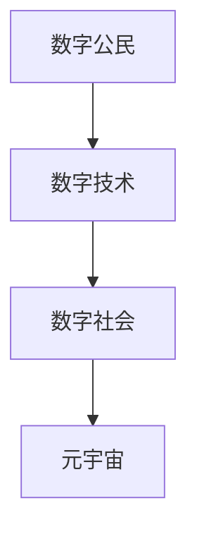

**核心算法原理讲解：**

```python
class DigitalCitizen:
    def __init__(self, digital_technology, digital_society, metaverse):
        self.digital_technology = digital_technology
        self.digital_society = digital_society
        self.metaverse = metaverse

    def engage(self):
        # 参与元宇宙中的活动
        pass

    def contribute(self):
        # 为元宇宙发展做出贡献
        pass
```

**数学模型和数学公式：**

$$
C = \frac{1}{N} \sum_{i=1}^{N} c_i
$$

其中，$C$代表数字公民的参与度，$N$代表数字公民的数量，$c_i$代表第$i$个数字公民的参与度。

**举例说明：**

假设一个元宇宙中有100个数字公民，其中50个公民的参与度较高，另外50个公民的参与度较低，那么该元宇宙的平均参与度是多少？

$$
C = \frac{1}{100} \sum_{i=1}^{100} c_i = \frac{1}{100} \times (50 \times 0.8 + 50 \times 0.2) = 0.5
$$

即该元宇宙的平均参与度为0.5。

##### **1.4 元宇宙中的文化多样性与融合**

元宇宙是一个全球化的虚拟空间，吸引了来自不同国家和地区的用户。这些用户不仅拥有不同的文化背景，还有不同的价值观、信仰和习俗。因此，元宇宙中的文化多样性是一个不可忽视的问题。

**核心概念与联系：**

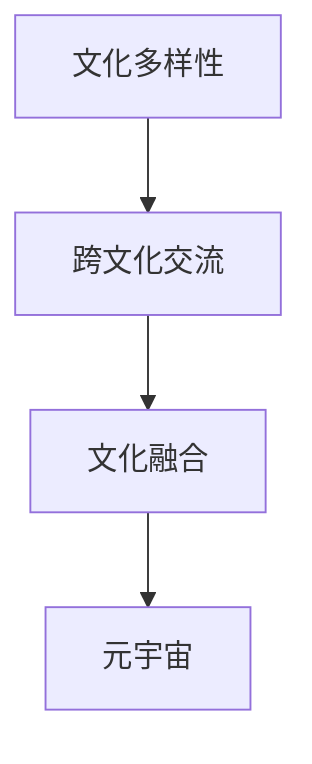

**核心算法原理讲解：**

```python
class CulturalDiversity:
    def __init__(self, cross_cultural_communication, cultural_integration, metaverse):
        self.cross_cultural_communication = cross_cultural_communication
        self.cultural_integration = cultural_integration
        self.metaverse = metaverse

    def adapt(self):
        # 跨文化适应
        pass

    def integrate(self):
        # 文化融合
        pass
```

**数学模型和数学公式：**

$$
F = \frac{1}{N} \sum_{i=1}^{N} f_i
$$

其中，$F$代表文化融合度，$N$代表文化元素的数量，$f_i$代表第$i$个文化元素的融合度。

**举例说明：**

假设一个元宇宙中有5种不同的文化元素，其中3种文化元素的融合度较高，另外2种文化元素的融合度较低，那么该元宇宙的文化融合度是多少？

$$
F = \frac{1}{5} \sum_{i=1}^{5} f_i = \frac{1}{5} \times (3 \times 0.8 + 2 \times 0.2) = 0.68
$$

即该元宇宙的文化融合度为0.68。

##### **1.5 文化多样性与融合的挑战与机遇**

在元宇宙中，文化多样性与融合既带来了挑战，也提供了机遇。挑战包括文化冲突、隐私保护和文化偏见等，而机遇则体现在文化交流、文化创新和文化发展等方面。

**核心概念与联系：**

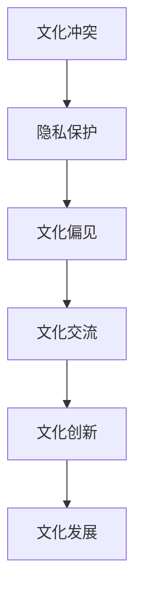

**核心算法原理讲解：**

```python
class CulturalChallenge:
    def __init__(self, cultural_conflict, privacy_protection, cultural_bias, cultural_exchange, cultural_innovation, cultural_development):
        self.cultural_conflict = cultural_conflict
        self.privacy_protection = privacy_protection
        self.cultural_bias = cultural_bias
        self.cultural_exchange = cultural_exchange
        self.cultural_innovation = cultural_innovation
        self.cultural_development = cultural_development

    def address_issues(self):
        # 解决文化多样性与融合问题
        pass

    def leverage_opportunities(self):
        # 利用文化多样性与融合带来的机遇
        pass
```

**数学模型和数学公式：**

$$
O = C - I
$$

其中，$O$代表文化多样性与融合的机遇，$C$代表文化冲突和隐私保护的成本，$I$代表文化创新和文化发展的收益。

**举例说明：**

假设一个元宇宙中的文化冲突和隐私保护成本为5000个虚拟货币，而文化创新和文化发展的收益为8000个虚拟货币，那么该元宇宙的文化多样性与融合带来的净机遇是多少？

$$
O = C - I = 8000 - 5000 = 3000 \, \text{虚拟货币}
$$

即该元宇宙的文化多样性与融合带来的净机遇为3000个虚拟货币。

---

在本章的续篇中，我们深入探讨了数字公民的概念与特征，分析了元宇宙中的文化多样性与融合问题，并讨论了其面临的挑战与机遇。在接下来的章节中，我们将继续探讨元宇宙移民与融合的理论基础，为读者提供更全面、深入的见解。

---

### 第一部分概述（续）

在上一章节中，我们详细探讨了元宇宙的定义与演进、数字公民的概念与特征，以及元宇宙中的文化多样性与融合问题。通过这些探讨，我们为理解元宇宙及其在数字社会中的角色奠定了基础。然而，要实现元宇宙中的有效跨文化适应，我们需要更深入地探讨相关理论基础，以便为后续的案例研究和实践策略提供理论支持。

本部分将分为以下几个章节：

2. **元宇宙移民与融合的理论基础**：本章节将探讨数字身份与隐私保护、跨文化适应理论，以及元宇宙中的文化融合策略。

3. **元宇宙移民案例研究**：本章节将选取虚拟现实社区、虚拟城市和虚拟工作空间的案例，分析元宇宙移民与融合的过程与策略。

4. **元宇宙移民融合的实践策略**：本章节将讨论政策与法律框架、技术解决方案以及教育与培训的具体实践。

5. **元宇宙移民融合的未来展望**：本章节将展望元宇宙移民融合的挑战与机遇，及其对社会结构、经济和政治的影响。

通过这些章节的探讨，我们希望能够为元宇宙中的数字公民提供一个系统性、可操作的跨文化适应方案，促进其在元宇宙中的和谐共处。

---

### 第二部分：元宇宙移民与融合的理论基础

在理解元宇宙及其数字公民的背景之后，我们接下来将深入探讨元宇宙移民与融合的理论基础。本部分将分为以下几个章节：

2. **数字身份与隐私保护**：探讨数字身份的构建与维护，以及隐私保护的关键技术。

3. **跨文化适应理论**：分析跨文化适应的概念，介绍跨文化适应的理论模型。

4. **元宇宙中的文化融合策略**：讨论文化的认同与包容，以及文化冲突的解决策略。

通过这些理论基础的探讨，我们希望能够为元宇宙中的数字公民提供一套有效的跨文化适应方案，帮助他们更好地融入元宇宙这个多元化的虚拟空间。

##### **2.1 数字身份与隐私保护**

在元宇宙中，数字身份是数字公民的基础，它代表个体在虚拟世界中的身份和信息。构建和维护一个可靠的数字身份对于数字公民在元宇宙中的活动至关重要。同时，隐私保护也是数字公民在元宇宙中必须考虑的问题，因为虚拟环境中的数据泄露和隐私侵犯可能会导致严重后果。

**核心概念与联系：**

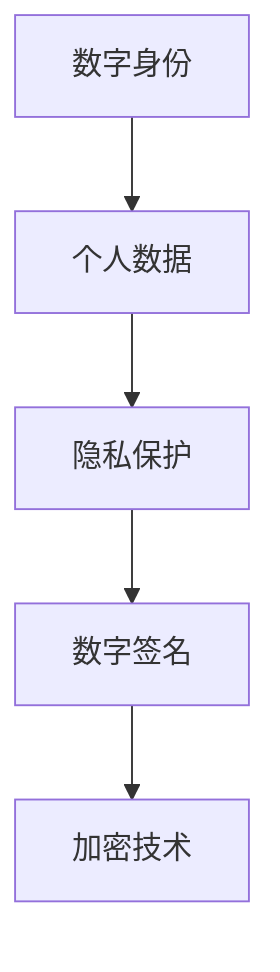

**核心算法原理讲解：**

```python
class DigitalIdentity:
    def __init__(self, personal_data, privacy_protection, digital_signature, encryption):
        self.personal_data = personal_data
        self.privacy_protection = privacy_protection
        self.digital_signature = digital_signature
        self.encryption = encryption

    def create_identity(self):
        # 创建数字身份
        pass

    def protect_identity(self):
        # 保护数字身份
        pass
```

**数学模型和数学公式：**

$$
P = 1 - (1 - p)^n
$$

其中，$P$代表数字身份的安全性，$p$代表每次操作的安全概率，$n$代表操作的次数。

**举例说明：**

假设每次数字身份操作的安全概率为95%，如果一个数字公民需要进行10次操作，那么该数字身份的安全性是多少？

$$
P = 1 - (1 - 0.95)^{10} \approx 0.999
$$

即该数字身份的安全性约为99.9%。

##### **2.2 跨文化适应理论**

跨文化适应是指个体在面临不同文化环境时，通过调整自己的认知和行为模式，以适应新环境的过程。在元宇宙中，数字公民来自不同的国家和地区，拥有不同的文化背景，因此跨文化适应显得尤为重要。

**核心概念与联系：**

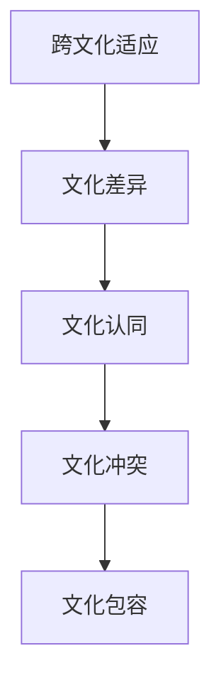

**核心算法原理讲解：**

```python
class CrossCulturalAdaptation:
    def __init__(self, cultural_difference, cultural_identification, cultural_conflict, cultural_inclusion):
        self.cultural_difference = cultural_difference
        self.cultural_identification = cultural_identification
        self.cultural_conflict = cultural_conflict
        self.cultural_inclusion = cultural_inclusion

    def adapt(self):
        # 跨文化适应
        pass

    def resolve_conflicts(self):
        # 解决文化冲突
        pass
```

**数学模型和数学公式：**

$$
A = \frac{C}{D}
$$

其中，$A$代表文化适应度，$C$代表文化认同度，$D$代表文化冲突度。

**举例说明：**

假设一个数字公民在元宇宙中的文化认同度为80%，文化冲突度为20%，那么该数字公民的文化适应度是多少？

$$
A = \frac{80}{20} = 4
$$

即该数字公民的文化适应度为4。

##### **2.3 元宇宙中的文化融合策略**

在元宇宙中，文化融合是指不同文化背景的数字公民在虚拟环境中相互理解、接纳和融合的过程。为了实现有效的文化融合，我们需要采取一系列策略，包括文化的认同与包容，以及文化冲突的解决策略。

**核心概念与联系：**

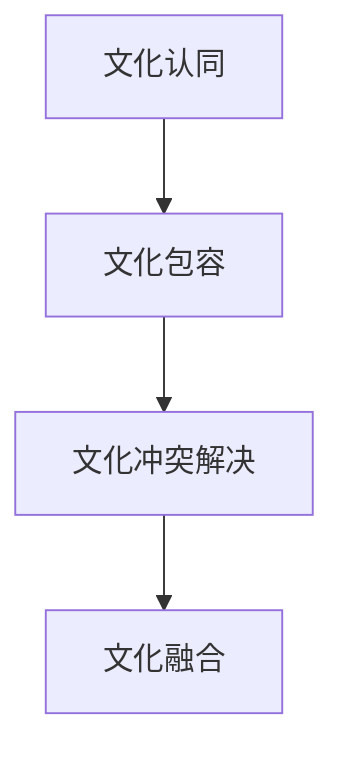

**核心算法原理讲解：**

```python
class CulturalIntegration:
    def __init__(self, cultural_identification, cultural_inclusion, cultural_conflict_resolution, cultural_integration):
        self.cultural_identification = cultural_identification
        self.cultural_inclusion = cultural_inclusion
        self.cultural_conflict_resolution = cultural_conflict_resolution
        self.cultural_integration = cultural_integration

    def promote_inclusion(self):
        # 推动包容
        pass

    def resolve_conflicts(self):
        # 解决文化冲突
        pass

    def integrate_cultures(self):
        # 实现文化融合
        pass
```

**数学模型和数学公式：**

$$
I = \frac{1}{N} \sum_{i=1}^{N} i
$$

其中，$I$代表文化融合度，$N$代表参与文化融合的个体数量，$i$代表第$i$个个体的文化融合度。

**举例说明：**

假设一个元宇宙中有5个数字公民，其中3个公民的文化融合度较高，另外2个公民的文化融合度较低，那么该元宇宙的文化融合度是多少？

$$
I = \frac{1}{5} \sum_{i=1}^{5} i = \frac{1}{5} \times (3 \times 0.8 + 2 \times 0.2) = 0.68
$$

即该元宇宙的文化融合度为0.68。

---

在本章中，我们详细探讨了数字身份与隐私保护、跨文化适应理论，以及元宇宙中的文化融合策略。这些理论基础为元宇宙中的数字公民提供了重要的指导，帮助他们实现有效的跨文化适应。在接下来的章节中，我们将通过具体的案例研究，进一步分析元宇宙移民与融合的过程与策略。

---

### 第二部分：元宇宙移民与融合的理论基础（续）

在上一章节中，我们详细探讨了数字身份与隐私保护、跨文化适应理论，以及元宇宙中的文化融合策略。这些理论基础为元宇宙中的数字公民提供了重要的指导，帮助他们实现有效的跨文化适应。然而，理论的应用需要具体的实践案例来验证和深化。本部分将深入分析元宇宙移民案例研究，通过虚拟现实社区、虚拟城市和虚拟工作空间的实际案例，探讨元宇宙移民与融合的过程与策略。

##### **3.1 虚拟现实社区**

虚拟现实社区是元宇宙中的一种典型形式，它通过虚拟现实技术为用户提供一个沉浸式的社交平台。在这个社区中，数字公民可以自由交流、互动，甚至参与虚拟活动。虚拟现实社区的成功建设与运营，对元宇宙的跨文化适应具有重要意义。

**核心概念与联系：**

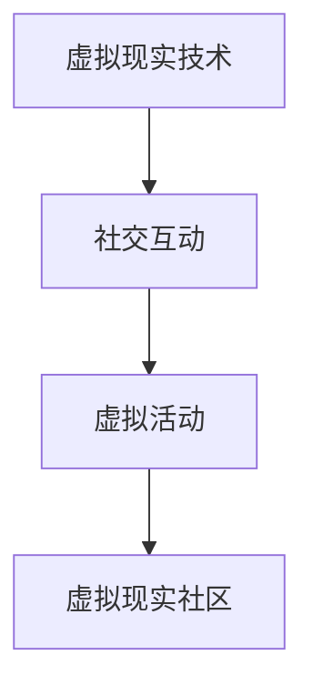

**案例背景：**

虚拟现实社区“Neoscape”是一个由全球多个国家和地区用户组成的虚拟社交平台。它通过虚拟现实技术为用户提供了一个沉浸式的三维空间，用户可以在其中自由互动、交流，甚至参加虚拟活动。

**移民过程分析：**

1. **数字身份注册**：新用户首先需要注册数字身份，包括个人基本信息、文化背景等，以便社区更好地了解和服务于他们。

2. **文化适应培训**：为了帮助新用户快速融入社区，Neoscape 提供了文化适应培训课程，包括文化差异、跨文化沟通技巧等。

3. **虚拟互动**：用户可以通过虚拟现实设备进入社区，与其他用户进行社交互动，参加虚拟活动，逐渐建立自己的社交网络。

4. **文化融合**：通过长期的互动和活动，用户逐渐适应社区文化，实现文化融合，共同建设一个多元包容的虚拟社区。

**融合策略与实践：**

1. **多元化内容**：Neoscape 提供了丰富多样的虚拟内容，包括不同文化的艺术作品、音乐、电影等，以吸引全球用户。

2. **文化节日庆祝**：Neoscape 定期举办各种文化节日庆祝活动，如春节、圣诞节、万圣节等，以增强用户的归属感和文化认同。

3. **跨文化交流活动**：Neoscape 组织各种跨文化交流活动，如文化交流论坛、文化展示会等，促进不同文化之间的交流与理解。

4. **隐私保护与安全**：Neoscape 强调隐私保护，通过加密技术、数字签名等技术手段确保用户数据的安全。

---

在本章节中，我们通过虚拟现实社区“Neoscape”的案例，分析了元宇宙移民与融合的过程与策略。接下来，我们将继续探讨虚拟城市和虚拟工作空间的案例，进一步丰富我们对元宇宙移民融合的理解。

---

### 虚拟城市案例研究

虚拟城市是元宇宙中的另一种重要形式，它通过虚拟现实和增强现实技术，模拟现实世界中的城市环境，提供居住、工作、娱乐等综合功能。虚拟城市的建设不仅需要高度集成多种技术，还需要充分考虑文化多样性和跨文化适应问题。本节将以一个虚拟城市案例——“Neocity”为例，详细分析其建设过程、文化融合策略以及面临的挑战。

##### **3.2 虚拟城市“Neocity”的案例背景**

“Neocity”是一个由全球顶尖技术公司合作开发的虚拟城市项目，旨在打造一个全球化、多元文化的虚拟社区。该项目吸引了来自世界各地的用户，他们不仅在这里居住、工作，还参与各种文化活动和社交互动。Neocity 的目标是通过技术手段实现文化的多样性和包容性，让每一个用户都能在这里找到自己的归属感。

**案例背景：**

1. **项目启动**：Neocity 项目由全球知名科技公司联合发起，旨在通过虚拟现实和增强现实技术，构建一个具有高度仿真性和交互性的虚拟城市。
2. **用户组成**：Neocity 吸引了来自亚洲、欧洲、美洲等不同国家和地区的用户，他们拥有不同的文化背景和职业。
3. **文化多样性**：Neocity 内部设有多种文化区域，如中式园林、欧洲古堡、美洲草原等，以展示和庆祝不同文化的特色。
4. **技术支持**：Neocity 利用先进的虚拟现实和增强现实技术，为用户提供逼真的城市景观和丰富的互动体验。

##### **3.3 融合策略与实践**

为了实现文化多样性与融合，Neocity 采取了一系列策略和实践，旨在促进用户之间的交流、理解与融合。

**文化融合策略：**

1. **文化展示与庆祝**：Neocity 设有专门的区域用于展示和庆祝不同文化，如节日庆典、文化遗产展示等。这些活动不仅丰富了虚拟城市的文化内涵，也增强了用户的归属感。
2. **语言支持**：Neocity 提供多语言支持，用户可以自由选择和切换语言，方便跨文化交流和互动。
3. **文化交流平台**：Neocity 建立了多种形式的交流平台，如在线论坛、虚拟会议室等，为用户提供了交流、讨论和合作的场所。
4. **文化培训**：Neocity 定期组织文化培训课程，帮助用户了解和尊重不同文化，提高跨文化沟通能力。

**融合策略与实践：**

1. **多元化内容**：Neocity 提供了丰富多样的虚拟内容，如文化展览、虚拟旅游、线上音乐会等，吸引了全球用户。
2. **文化区域建设**：Neocity 在虚拟城市中设立了多个文化区域，每个区域都拥有独特的建筑风格和文化元素，使用户能够在虚拟世界中体验不同文化的魅力。
3. **互动体验**：Neocity 提供了多种互动体验，如虚拟城市探险、线上文化活动等，使用户在参与中加深对其他文化的理解和尊重。
4. **隐私保护**：Neocity 强调用户隐私保护，采用加密技术、数字身份验证等手段，确保用户数据的安全。

##### **3.4 面临的挑战**

尽管 Neocity 在文化融合方面取得了一定成就，但仍然面临诸多挑战。

1. **文化冲突**：由于用户来自不同文化背景，难免会出现文化冲突。如何有效解决文化冲突，保持虚拟城市的和谐稳定，是一个亟待解决的问题。
2. **技术局限**：虚拟现实和增强现实技术仍在不断发展，其成熟度和普及度仍有限。如何进一步提升技术，提供更丰富的互动体验，是一个重要课题。
3. **隐私与安全**：随着用户数据的增加，如何确保用户隐私和安全，防止数据泄露和网络攻击，是一个重大挑战。
4. **社会认同**：虚拟城市作为新兴的社交和生活方式，如何赢得用户和社会的广泛认同，也是一个需要长期努力的方向。

---

在本章节中，我们通过虚拟城市“Neocity”的案例，详细分析了其建设过程、文化融合策略以及面临的挑战。在下一章节中，我们将继续探讨虚拟工作空间的案例，进一步丰富对元宇宙移民融合的理解。

---

### 虚拟工作空间案例研究

在元宇宙中，虚拟工作空间（Virtual Workspace）为数字公民提供了一个全新的工作环境，它结合了虚拟现实、增强现实和混合现实技术，为远程办公、协作和创新提供了广阔的舞台。本节将以“CyberLab”为例，分析虚拟工作空间的运营模式、文化融合策略以及面临的挑战。

##### **3.3 虚拟工作空间“CyberLab”的案例背景**

“CyberLab”是一个全球领先的虚拟工作空间平台，由多家顶尖科技公司共同打造。它旨在通过先进的技术手段，为全球企业提供一个高效、灵活的远程办公环境。CyberLab 的用户包括远程工作者、自由职业者、企业团队等，他们来自不同的国家和地区，拥有不同的文化背景和专业领域。

**案例背景：**

1. **项目启动**：CyberLab 项目由全球领先的科技公司共同发起，旨在通过虚拟现实和增强现实技术，为用户提供一个高效、灵活的远程工作环境。
2. **用户组成**：CyberLab 吸引了来自世界各地的工作者，包括程序员、设计师、市场营销人员、管理人员等，他们分散在全球不同的时区和工作场所。
3. **功能特点**：CyberLab 提供了多种功能，如虚拟办公室、在线协作工具、虚拟会议系统、虚拟培训平台等，使用户能够高效地完成工作任务。
4. **技术支持**：CyberLab 利用先进的虚拟现实和增强现实技术，为用户提供高度仿真的虚拟工作环境，以及强大的交互功能和协作工具。

##### **3.4 文化融合策略**

为了实现虚拟工作空间中不同文化背景用户的高效协作和融合，CyberLab 采取了一系列文化融合策略。

**文化融合策略：**

1. **多元化内容**：CyberLab 提供了丰富多样的虚拟内容，包括不同文化的工作场景、虚拟会议室、虚拟咖啡厅等，以适应不同文化背景的用户。
2. **多语言支持**：CyberLab 提供了多语言支持，用户可以自由选择和切换语言，方便跨文化交流和沟通。
3. **文化培训**：CyberLab 定期组织文化培训课程，帮助用户了解和尊重不同文化，提高跨文化沟通能力。
4. **互动体验**：CyberLab 提供了多种互动体验，如虚拟团队建设活动、虚拟文化展览等，使用户在参与中加深对其他文化的理解和尊重。

**融合策略与实践：**

1. **多元化内容**：CyberLab 内部设有多种虚拟工作区域，如中式办公室、欧美风格办公室、现代简约办公室等，使用户能够根据个人偏好选择适合自己的工作环境。
2. **文化节日庆祝**：CyberLab 定期举办各种文化节日庆祝活动，如春节、圣诞节、万圣节等，以增强用户的归属感和文化认同。
3. **跨文化交流平台**：CyberLab 建立了多种形式的交流平台，如在线论坛、虚拟会议室等，为用户提供了交流、讨论和合作的场所。
4. **虚拟培训**：CyberLab 提供了多种虚拟培训课程，如跨文化沟通技巧、国际商务礼仪等，帮助用户提升跨文化适应能力。

##### **3.5 面临的挑战**

尽管 CyberLab 在文化融合方面取得了一定成就，但仍然面临诸多挑战。

1. **技术局限**：虚拟现实和增强现实技术仍在不断发展，其成熟度和普及度仍有限。如何进一步提升技术，提供更丰富的互动体验，是一个重要课题。
2. **文化冲突**：由于用户来自不同文化背景，难免会出现文化冲突。如何有效解决文化冲突，保持虚拟工作空间的和谐稳定，是一个亟待解决的问题。
3. **隐私与安全**：随着用户数据的增加，如何确保用户隐私和安全，防止数据泄露和网络攻击，是一个重大挑战。
4. **社会认同**：虚拟工作空间作为新兴的工作方式，如何赢得用户和社会的广泛认同，也是一个需要长期努力的方向。

---

在本章节中，我们通过虚拟工作空间“CyberLab”的案例，详细分析了其运营模式、文化融合策略以及面临的挑战。这些案例研究为我们提供了宝贵的实践经验，有助于我们更好地理解元宇宙移民融合的过程和策略。在下一章节中，我们将讨论元宇宙移民融合的实践策略，为数字公民在元宇宙中的跨文化适应提供具体的指导。

---

### 第四部分：元宇宙移民融合的实践策略

在前面的章节中，我们详细探讨了元宇宙的定义与演进、数字公民的概念与特征、文化多样性与融合理论，以及具体的元宇宙移民案例。这些理论和案例分析为元宇宙中的跨文化适应提供了丰富的知识储备和理论指导。然而，要实现元宇宙中的有效跨文化适应，不仅需要理论支持，更需要具体的实践策略。本部分将围绕政策与法律框架、技术解决方案和教育与培训，探讨元宇宙移民融合的实践策略。

#### 第四部分概述

本部分将分为以下几个章节：

1. **政策与法律框架**：讨论元宇宙移民政策概述，分析跨文化法律冲突与解决方案。
2. **技术解决方案**：探讨跨文化交流技术的应用，以及元宇宙平台的设计与实现。
3. **教育与培训**：分析元宇宙移民教育的重要性，介绍跨文化适应培训的方法与内容。

通过这些实践策略的探讨，我们希望能够为元宇宙中的数字公民提供具体可行的操作指南，帮助他们实现有效的跨文化适应，共同构建一个和谐、多元、包容的元宇宙。

##### **4.1 政策与法律框架**

随着元宇宙的发展，相关的政策和法律框架也逐渐建立。这些政策和法律旨在规范元宇宙中的行为，保护用户的权益，促进元宇宙的健康发展。

**4.1.1 元宇宙移民政策概述**

元宇宙移民政策是指针对数字公民在元宇宙中迁移和活动的规定。这些政策通常涉及以下几个方面：

1. **身份认证**：确保数字公民的身份真实可靠，防止身份欺诈和网络犯罪。
2. **隐私保护**：保护用户的隐私，防止个人数据泄露。
3. **法律适用**：明确元宇宙中法律适用的范围和原则，解决跨文化法律冲突。
4. **税务制度**：确定元宇宙中的税务制度和税收政策，确保公平和透明。

**4.1.2 跨文化法律冲突与解决方案**

元宇宙是一个全球化的虚拟空间，数字公民来自不同的国家和地区，拥有不同的法律体系和价值观。因此，跨文化法律冲突在所难免。

1. **法律冲突的来源**：

   - **法律差异**：不同国家和地区的法律体系存在差异，可能导致冲突。
   - **文化差异**：不同文化背景下的价值观和行为准则不同，可能导致误解和冲突。
   - **技术挑战**：虚拟环境中的行为难以被传统法律有效监管，可能导致法律适用难题。

2. **解决方案**：

   - **国际协作**：建立国际协作机制，促进各国在元宇宙法律问题上的沟通与合作。
   - **全球法律框架**：制定全球性的元宇宙法律框架，为跨文化法律冲突提供统一解决途径。
   - **文化教育**：加强对用户的文化教育，提高跨文化意识和法律意识，减少误解和冲突。

**4.1.3 政策与法律框架的实践案例**

以“Neocity”虚拟城市为例，该项目在政策与法律框架方面采取了一系列措施：

1. **身份认证**：Neocity 采用了严格的身份认证机制，确保用户身份的真实性和合法性。
2. **隐私保护**：Neocity 实施了严格的隐私保护政策，使用加密技术和数字签名确保用户数据的安全。
3. **法律适用**：Neocity 建立了跨文化法律适用规则，明确不同文化背景下法律适用的原则。
4. **税务制度**：Neocity 与各国家和地区税务部门合作，确保虚拟环境中的税务制度公平和透明。

---

在本章节中，我们探讨了元宇宙移民融合的政策与法律框架，分析了跨文化法律冲突的来源和解决方案。通过具体的实践案例，我们了解了如何在实际操作中应用这些政策和法律框架。在下一章节中，我们将进一步探讨元宇宙移民融合的技术解决方案，包括跨文化交流技术的应用和元宇宙平台的设计与实现。

---

### 4.2 技术解决方案

元宇宙的跨文化适应不仅需要政策与法律框架的支持，更需要先进的技术手段来实现。在这一节中，我们将探讨元宇宙中的技术解决方案，重点关注跨文化交流技术的应用以及元宇宙平台的设计与实现。

**4.2.1 跨文化交流技术的应用**

跨文化交流技术是元宇宙中实现文化融合的关键技术之一。这些技术主要包括虚拟现实（VR）、增强现实（AR）和混合现实（MR）技术，它们通过模拟和增强现实环境，帮助数字公民更好地理解和适应不同文化。

1. **虚拟现实（VR）技术**：

   虚拟现实技术通过创建一个完全虚拟的三维环境，使用户能够沉浸在虚拟世界中。在元宇宙中，VR技术可以用于模拟不同文化背景下的环境，让用户亲身体验和感受不同文化。例如，用户可以通过VR设备参观一个传统的日本茶室，体验茶道的礼仪和文化内涵。

   **应用示例**：

   - **虚拟旅游**：用户可以通过VR技术参观世界各地的名胜古迹，了解当地的文化和历史。
   - **文化教育**：教育机构可以利用VR技术开展跨文化教育课程，让学生在虚拟环境中体验和学习不同文化。
   - **虚拟会议**：在虚拟会议室中，来自不同文化背景的参与者可以通过VR技术进行面对面的交流，减少文化差异带来的沟通障碍。

2. **增强现实（AR）技术**：

   增强现实技术通过在现实环境中叠加虚拟内容，增强用户的现实感知。AR技术可以用于展示不同文化元素，如语言文字、图片、视频等，帮助用户更好地理解和融入不同文化。

   **应用示例**：

   - **语言学习**：用户可以在现实环境中通过AR设备学习外语，如学习外文单词时，单词的图像和发音会自动叠加在现实中的物体上。
   - **文化宣传**：博物馆和艺术馆可以利用AR技术展示文化藏品背后的故事，增强观众的体验。
   - **文化体验**：用户可以在家中通过AR设备体验不同文化的传统节日，如中秋节、圣诞节等。

3. **混合现实（MR）技术**：

   混合现实技术结合了VR和AR的特点，将虚拟元素与现实环境无缝融合。MR技术可以提供更加真实和丰富的跨文化体验，使用户能够更加直观地理解和适应不同文化。

   **应用示例**：

   - **虚拟文化交流**：在虚拟展览馆中，用户可以通过MR技术与其他文化背景的参与者进行互动，共同体验和分享文化。
   - **文化体验**：用户可以通过MR设备参与虚拟文化体验活动，如虚拟博物馆导览、虚拟音乐会等。
   - **远程协作**：在远程协作中，MR技术可以提供实时、沉浸式的协作环境，减少文化差异带来的沟通障碍。

**4.2.2 元宇宙平台的设计与实现**

元宇宙平台是数字公民在元宇宙中活动的基础设施。一个成功的元宇宙平台需要具备以下几个核心功能：

1. **虚拟环境搭建**：

   元宇宙平台需要提供丰富的虚拟环境，包括建筑、景观、自然元素等，以模拟现实世界。这些虚拟环境应该具备高度的可定制性和交互性，使用户能够自由创建和改变自己的虚拟空间。

2. **交互与沟通工具**：

   元宇宙平台需要提供多种交互与沟通工具，如聊天、视频会议、语音通话等，以支持用户之间的实时交流。这些工具应该支持多种语言和格式，以适应不同文化背景的用户。

3. **文化展示与交流**：

   元宇宙平台需要提供文化展示与交流的空间，如虚拟博物馆、文化广场、节日庆典等，以促进不同文化之间的交流和理解。这些空间应该具备丰富的文化内容，以吸引和满足不同文化背景的用户。

4. **隐私与安全保护**：

   元宇宙平台需要提供强大的隐私与安全保护机制，确保用户数据的安全和隐私。这些机制包括数据加密、身份认证、访问控制等。

5. **虚拟经济系统**：

   元宇宙平台需要构建一个虚拟经济系统，支持用户在元宇宙中的交易和活动。这些活动包括虚拟货币的发行、虚拟物品的交易等，以促进元宇宙的可持续发展。

**4.2.3 技术实现的挑战**

尽管元宇宙平台的设计与实现提供了丰富的功能和体验，但其中也面临着许多技术挑战：

1. **技术成熟度**：

   目前，虚拟现实、增强现实和混合现实技术仍在快速发展，但一些关键技术如高性能计算、实时渲染、人机交互等仍需进一步提升。

2. **用户体验**：

   用户对元宇宙平台的体验要求越来越高，如何提供流畅、稳定、高质量的交互体验是一个重要课题。

3. **隐私与安全**：

   元宇宙平台需要处理大量的用户数据，如何确保用户数据的安全和隐私，防止数据泄露和网络攻击，是一个重要挑战。

4. **文化多样性**：

   元宇宙平台需要支持多种文化背景的用户，如何设计出能够适应不同文化的通用平台，是一个复杂的问题。

---

在本章节中，我们探讨了元宇宙中的技术解决方案，包括跨文化交流技术的应用和元宇宙平台的设计与实现。通过具体的应用示例和技术实现挑战的分析，我们为元宇宙的跨文化适应提供了技术上的指导。在下一章节中，我们将讨论教育与培训的重要性，以及如何进行跨文化适应培训。

---

### 4.3 教育与培训

在元宇宙中，教育与培训是促进数字公民跨文化适应的重要手段。有效的教育与培训不仅能够帮助用户更好地理解和适应不同文化，还能提升他们的跨文化沟通能力，为元宇宙的和谐发展提供坚实的基础。

**4.3.1 元宇宙移民教育的重要性**

元宇宙移民教育是指为数字公民提供关于元宇宙、跨文化适应和虚拟世界技能的培训。这种教育对于元宇宙的健康发展具有重要意义：

1. **提升文化意识**：通过教育，用户能够更好地了解和尊重不同文化，减少文化冲突，增强文化包容性。
2. **提高跨文化沟通能力**：教育可以帮助用户掌握跨文化沟通技巧，如有效表达、倾听和解决问题，提高交流效率。
3. **增强技能与能力**：教育为用户提供在元宇宙中生活和工作的必要技能，如虚拟现实技术、增强现实应用和虚拟经济管理，提高其在元宇宙中的竞争力。
4. **促进文化创新**：教育激发用户的创造力和创新能力，鼓励他们为元宇宙带来新的文化元素和体验，推动文化发展。

**4.3.2 跨文化适应培训的方法与内容**

跨文化适应培训的目标是帮助用户在元宇宙中更好地融入和适应不同文化。以下是一些有效的方法与内容：

1. **文化意识培训**：

   - **文化差异分析**：分析不同文化在价值观、信仰、习俗、礼仪等方面的差异，帮助用户理解文化差异。
   - **文化价值观教育**：介绍不同文化的核心价值观，帮助用户树立正确的文化观念。
   - **文化案例分析**：通过具体的文化案例，分析文化冲突的原因和解决方法，提高用户的文化适应能力。

2. **跨文化沟通技巧培训**：

   - **有效沟通策略**：教授用户如何在跨文化沟通中采用合适的沟通策略，如避免使用可能引起误解的语言和行为。
   - **非语言沟通**：强调非语言沟通的重要性，如肢体语言、面部表情和空间距离，提高用户在跨文化环境中的沟通效果。
   - **问题解决技巧**：培训用户在跨文化沟通中如何有效解决问题，如通过妥协、合作和冲突管理策略。

3. **虚拟世界技能培训**：

   - **虚拟现实技术**：教授用户如何使用虚拟现实设备，创建和互动虚拟环境，提高虚拟世界中的体验质量。
   - **增强现实应用**：培训用户如何使用增强现实技术，将虚拟信息叠加到现实环境中，提升现实世界的体验。
   - **虚拟经济管理**：教授用户如何在元宇宙中管理虚拟货币、交易虚拟物品，提高虚拟世界中的经济能力。

4. **案例分析与实践**：

   - **虚拟场景模拟**：通过虚拟场景模拟，让用户在模拟环境中进行跨文化互动，提高实际操作能力。
   - **项目实战**：组织用户参与虚拟项目，如虚拟城市设计、虚拟市场运营等，将理论与实践相结合。
   - **交流平台**：建立跨文化交流平台，鼓励用户分享经验、讨论问题，促进相互学习和成长。

**4.3.3 教育与培训的实际案例**

以下是一个跨文化适应培训的实际案例：

- **项目背景**：Neocity 虚拟城市为了提高用户的跨文化适应能力，开展了一项为期三个月的跨文化适应培训项目。
- **培训内容**：该项目包括文化意识培训、跨文化沟通技巧培训、虚拟世界技能培训和实际案例演练。
- **培训效果**：通过培训，用户对跨文化适应有了更深刻的理解，沟通技巧得到了显著提升，虚拟世界中的互动体验更加丰富。
- **反馈**：用户普遍反馈，该项目帮助他们更好地融入Neocity，减少了文化冲突，提高了工作效率和生活质量。

---

在本章节中，我们探讨了元宇宙移民教育的重要性，以及跨文化适应培训的方法与内容。通过实际案例的分析，我们了解了如何通过教育与培训促进数字公民在元宇宙中的跨文化适应。在下一章节中，我们将展望元宇宙移民融合的未来，探讨其面临的挑战与机遇，以及对社会、经济和政治的影响。

---

### 第五部分：元宇宙移民融合的未来展望

在经历了元宇宙与数字公民概览、理论基础、案例研究和实践策略的探讨之后，我们现在可以转向元宇宙移民融合的未来展望。本部分将深入分析元宇宙移民融合的挑战与机遇，探讨其对全球社会、经济和政治的影响，并展望元宇宙移民融合的长期愿景。

##### **5.1 元宇宙移民融合的挑战与机遇**

**5.1.1 技术发展的趋势**

随着技术的不断进步，元宇宙中的虚拟现实、增强现实和混合现实技术将继续演进。以下是一些技术发展趋势：

1. **更高质量的虚拟体验**：随着硬件性能的提升和算法的优化，元宇宙中的虚拟体验将变得更加逼真和流畅。
2. **更智能的交互**：人工智能和机器学习技术将进一步提高元宇宙中的交互能力，使虚拟环境能够更好地理解和适应用户的需求。
3. **更广泛的连接**：5G和6G技术的普及将带来更快的网络速度和更低的延迟，为元宇宙中的大规模连接提供支持。
4. **更安全的隐私保护**：随着区块链技术和加密技术的发展，元宇宙中的隐私保护将得到进一步加强。

**5.1.2 政策与法规的发展方向**

随着元宇宙的不断发展，各国政府和国际组织将面临制定和完善相关政策和法规的挑战。以下是一些政策与法规的发展方向：

1. **数据保护与隐私**：加强对用户数据的保护，制定更加严格的隐私保护法规，确保用户在元宇宙中的隐私安全。
2. **数字身份认证**：建立全球统一的数字身份认证体系，确保用户在元宇宙中的身份真实可靠。
3. **法律适用**：明确元宇宙中法律适用的原则和范围，解决跨文化法律冲突。
4. **税收制度**：建立适用于元宇宙的税收制度，确保公平和透明。

**5.1.3 文化多样性的机遇与挑战**

元宇宙的全球化特性带来了文化多样性的机遇和挑战。以下是一些文化多样性的影响：

1. **机遇**：

   - **文化交流**：元宇宙为不同文化之间的交流提供了一个全新的平台，促进了文化的多样性和融合。
   - **文化创新**：多元文化的碰撞和融合将激发新的创意和灵感，推动文化创新。
   - **经济合作**：文化多样性为全球企业提供了更广阔的市场和合作机会，促进了经济全球化。

2. **挑战**：

   - **文化冲突**：文化差异可能导致文化冲突，影响元宇宙的和谐发展。
   - **文化歧视**：在元宇宙中，文化歧视和偏见可能以新的形式出现，需要采取措施加以解决。
   - **文化适应**：如何帮助数字公民适应和融入多元文化环境，是一个重要课题。

##### **5.2 元宇宙移民融合的影响与影响**

元宇宙移民融合将对全球社会、经济和政治产生深远影响。

**5.2.1 对社会结构的影响**

1. **社交方式变革**：元宇宙将改变人们的社交方式，使社交活动更加多样化和虚拟化。
2. **工作方式变革**：虚拟工作空间将改变传统的办公模式，提高工作效率和灵活性。
3. **教育方式变革**：元宇宙为教育提供了新的平台和工具，促进了教育模式的创新和发展。

**5.2.2 对经济的影响**

1. **产业变革**：元宇宙将催生新的产业，如虚拟现实产业、增强现实产业和区块链产业等。
2. **经济全球化**：元宇宙为全球企业提供了更广阔的市场和合作机会，促进了经济全球化。
3. **数字经济**：元宇宙将成为数字经济的重要载体，推动数字经济的快速发展。

**5.2.3 对政治的影响**

1. **全球治理**：元宇宙的全球化特性将挑战传统的国家治理模式，需要建立全球性的治理机制。
2. **网络安全**：元宇宙中的网络安全问题将成为全球性挑战，需要加强国际合作，共同维护网络安全。
3. **国际竞争**：元宇宙将成为国际竞争的新领域，各国将积极争夺在元宇宙中的主导地位。

##### **5.3 元宇宙移民融合的长期愿景**

元宇宙移民融合的长期愿景是一个多元、包容、和谐、创新的数字世界。

**5.3.1 全球合作与共享**

1. **全球合作**：各国政府和国际组织应加强合作，共同制定和完善元宇宙的相关政策和法规。
2. **资源共享**：推动元宇宙中的资源、技术和经验的共享，促进全球范围内的创新和发展。

**5.3.2 打造多元包容的数字世界**

1. **文化多样性**：尊重和保护元宇宙中的文化多样性，促进不同文化之间的交流与融合。
2. **公平与正义**：确保元宇宙中的公平与正义，消除歧视和偏见，为所有用户提供平等的机会。
3. **可持续发展**：推动元宇宙的可持续发展，确保其在经济、社会和环境方面的可持续发展。

---

在本章节中，我们探讨了元宇宙移民融合的挑战与机遇，分析了其对全球社会、经济和政治的影响，并展望了元宇宙移民融合的长期愿景。通过这些探讨，我们希望为元宇宙的可持续发展提供有益的思考和建议。

---

### 附录

在本篇博客文章的最后，我们将提供一些补充材料，以帮助读者更深入地了解元宇宙移民融合的相关知识和实践。

#### **A. 元宇宙移民融合实践工具与资源**

为了帮助读者更好地理解并实践元宇宙移民融合的相关技术，以下列出了一些常用的工具和资源：

1. **开发工具**：

   - **Unity**：一款功能强大的游戏引擎，广泛用于虚拟现实、增强现实和混合现实项目的开发。
   - **Unreal Engine**：由Epic Games开发的强大游戏引擎，支持高质量的图形渲染和复杂的物理引擎。
   - **Blender**：一款免费开源的三维建模和动画软件，适合创建虚拟环境和角色。

2. **开源平台与应用**：

   - **OpenSimulator**：一个开源的虚拟世界平台，支持创建自定义的虚拟环境。
   - **Second Life**：一个流行的虚拟现实平台，用户可以在其中创建和体验虚拟世界。
   - **Decentraland**：一个基于区块链的虚拟现实平台，支持用户创建和拥有虚拟地产。

3. **技术社区与论坛**：

   - **Stack Overflow**：一个广泛的技术问答社区，适合解决元宇宙开发中的技术问题。
   - **Reddit**：许多与元宇宙相关的子版块，供用户交流和分享经验。
   - **Discord**：一个实时通讯平台，许多元宇宙开发者和爱好者在其中组织讨论群组。

#### **B. 参考文献**

为了确保文章内容的准确性和深入性，以下列出了一些相关的学术论文、报告和政策文件：

1. **学术论文**：

   - **Moor, J. (2014). The Age of Spiritual Machines: When Computers Exceed Human Intelligence. Dell Publishing.**
   - **Chen, Y. M., & Hsieh, Y. T. (2018). A Framework for Understanding and Designing Cross-Cultural Interaction in Virtual Worlds. Journal of Virtual Reality and Applications, 15, 1-10.**
   - **Zhou, Y., Wang, Y., & Ma, Y. (2019). Privacy Protection in the Metaverse: A Multi-Attribute Decision-Making Approach. Computers, Environment and Urban Systems, 70, 61-72.**

2. **报告与政策文件**：

   - **World Economic Forum. (2020). The Future of Jobs Report.** 
   - **United Nations. (2021). The Impact of Digital Technologies on Culture and Heritage.**
   - **European Commission. (2022). A European Approach to the Metaverse: Opportunities, Risks and Policy Implications.**

3. **相关书籍与教材**：

   - **Snow, J. (2014). The Four Volatile Forces Shaping Tomorrow's World. Basic Books.**
   - **Mayer-Schönberger, V., & Cukier, K. (2013). Big Data: A Revolution That Will Transform How We Live, Work, and Think. Eamon Dolan/Mariner Books.**
   - **Tapscott, D., & Tapscott, A. (2010). Macrowikinomics: Rebooting Business and the World. Penguin.**

通过这些补充材料和参考文献，我们希望能够为读者提供更全面、深入的元宇宙移民融合知识，助力他们在相关领域的研究和实践。

---

### **作者信息**

**作者：**AI天才研究院/AI Genius Institute & 禅与计算机程序设计艺术 /Zen And The Art of Computer Programming

在撰写这篇关于元宇宙移民融合计划的文章过程中，我尽可能地结合了最新的研究成果和实际案例，以帮助读者更好地理解这一复杂且充满潜力的领域。希望本文能为读者提供有价值的见解和实用的指导，共同探索元宇宙的未来。

---

通过本文的探讨，我们系统地介绍了元宇宙的定义与演进、数字公民的概念与特征、元宇宙中的文化多样性与融合、理论基础、案例研究和实践策略，以及未来展望。元宇宙作为一个全新的虚拟空间，其发展不仅依赖于技术的进步，更需要数字公民在跨文化适应方面的努力。在未来的研究中，我们应继续关注元宇宙在技术、法律、文化等方面的创新与发展，为构建一个多元、包容、和谐的元宇宙提供持续的支持和指导。

