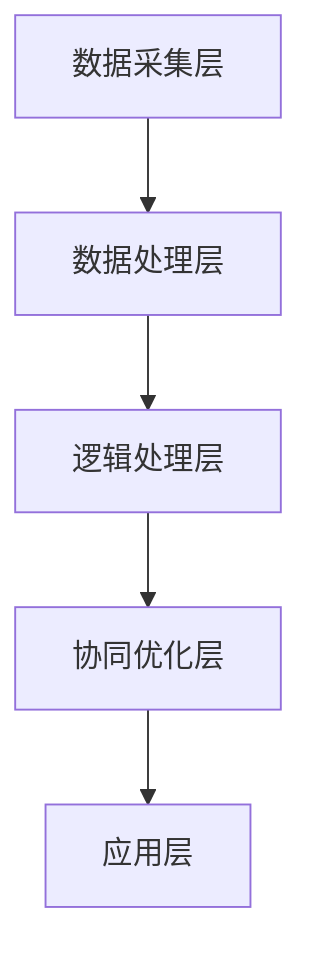
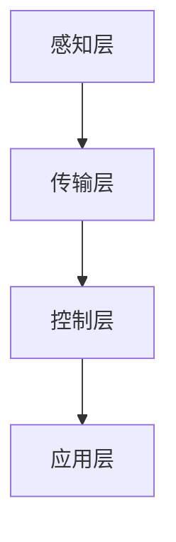
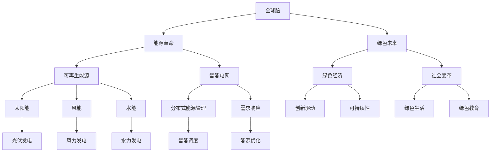

                 

# 全球脑与能源革命：集体智慧驱动的绿色未来

## 关键词
- 全球脑
- 能源革命
- 集体智慧
- 可再生能源
- 绿色未来
- 智能电网

## 摘要
本文深入探讨了全球脑与能源革命的关系，以及集体智慧如何驱动绿色未来的实现。文章首先介绍了全球脑的概念及其在能源革命中的作用，接着分析了集体智慧在能源领域的应用与挑战。随后，本文详细阐述了能源革命所需的技术基础，包括全球脑技术、可再生能源技术和智能电网技术。最后，文章探讨了绿色未来的社会与经济变革，并给出了具体案例进行分析，展望了全球脑与能源革命的未来趋势。

## 目录大纲

### 第一部分：引言

#### 第1章：全球脑与能源革命概述

1.1 什么是全球脑

1.2 能源革命与全球脑

1.3 绿色未来的愿景

#### 第2章：集体智慧的概念与应用

2.1 集体智慧的原理

2.2 集体智慧在能源领域的应用

2.3 集体智慧的挑战与机遇

### 第二部分：能源革命的技术基础

#### 第3章：全球脑技术详解

3.1 全球脑的架构设计

3.2 全球脑的关键技术

3.3 全球脑的开发与部署

#### 第4章：能源技术的创新与应用

4.1 可再生能源技术

4.2 储能技术

4.3 智能电网技术

### 第三部分：绿色未来的社会与经济变革

#### 第5章：绿色未来的社会变革

5.1 绿色生活与消费模式

5.2 绿色教育与培训

#### 第6章：绿色未来的经济发展

6.1 绿色经济的概念与特点

6.2 绿色产业的机遇与挑战

6.3 绿色金融的发展

#### 第7章：全球脑与能源革命的案例分析

7.1 丹麦的能源转型

7.2 德国的智能电网建设

7.3 中国的可再生能源发展

### 第四部分：全球脑与能源革命的展望

#### 第8章：全球脑与能源革命的未来趋势

8.1 能源革命的未来发展方向

8.2 全球脑的发展趋势

8.3 绿色未来的展望

### 附录

附录A：全球脑与能源革命的资源与工具

<|imagine|>### 第一部分：引言

#### 第1章：全球脑与能源革命概述

**1.1 什么是全球脑**

全球脑（Global Brain）是一个概念，它源自于神经科学和复杂性理论，指的是一个由个体智能通过相互连接形成的全球性的网络智能系统。这个网络中的每个个体，无论是人类还是机器，都可以被视为全球脑的神经元。全球脑通过信息交换和协同工作，展现出了超越个体智能的集体智能。

**1.1.1 全球脑的定义**

全球脑可以被定义为：

$$
\text{全球脑} = \{\text{个体智能}, \text{连接关系}, \text{协同工作机制}\}
$$

其中，个体智能是指各个参与者的认知能力，连接关系是指参与者之间的通信和数据交换，协同工作机制是指个体智能如何通过合作和协调来产生整体智能。

**1.1.2 全球脑的产生背景**

全球脑的概念起源于20世纪末，随着互联网、大数据和人工智能技术的发展，人类社会逐渐进入了一个新的阶段。在这个阶段，信息的流动和交换变得更加迅速和广泛，个体之间的互动和合作也变得更加频繁和复杂。这种变化促使人们开始思考如何将个体的智能集合起来，形成一种更高层次的集体智能。

**1.2 能源革命与全球脑**

**1.2.1 能源革命的必要性**

能源革命是指从传统的化石能源向可再生能源的全面转型。这一革命是必要的，因为：

1. **环境保护**：化石能源的燃烧会产生大量的温室气体，导致全球气候变暖和环境污染。
2. **资源枯竭**：化石能源是不可再生的，长期依赖会导致资源枯竭。
3. **技术进步**：可再生能源技术的发展使得可再生能源的成本逐渐降低，性能逐渐提高。

**1.2.2 全球脑在能源革命中的角色**

全球脑在能源革命中发挥着关键作用，它能够：

1. **优化资源配置**：通过收集和分析大量的数据，全球脑可以帮助优化能源的分配和使用，提高能源利用效率。
2. **促进技术创新**：全球脑可以加速可再生能源技术的创新和迭代，推动能源技术的进步。
3. **协调全球行动**：全球脑可以协调各国和各地区的能源政策和发展战略，推动全球能源革命的实现。

**1.3 绿色未来的愿景**

**1.3.1 绿色未来的定义**

绿色未来是指一个可持续发展的未来，其中人类与自然和谐共处，经济、社会和环境三者协调发展。绿色未来包含以下特征：

1. **清洁能源**：广泛使用可再生能源，减少对化石能源的依赖。
2. **低碳经济**：通过减少碳排放，实现经济活动的绿色转型。
3. **生态平衡**：保护自然生态系统，确保生物多样性。

**1.3.2 绿色未来的意义**

绿色未来的意义在于：

1. **可持续性**：确保人类和地球的长期生存和发展。
2. **公平性**：确保所有人都能享有清洁、可靠和负担得起的能源。
3. **创新驱动**：推动科技创新和产业升级，创造新的经济增长点。

#### 第2章：集体智慧的概念与应用

**2.1 集体智慧的原理**

**2.1.1 集体智慧的定义**

集体智慧（Collective Wisdom）是指一个群体通过协作、交流和共享信息，共同产生解决方案或知识的能力。集体智慧超越了个体智能，它能够处理复杂的问题，并产生创新性的解决方案。

**2.1.2 集体智慧的形成机制**

集体智慧的形成机制包括以下几个关键步骤：

1. **信息共享**：群体成员之间共享知识和信息，确保信息的透明度和可访问性。
2. **协同工作**：成员通过协作和分工，共同解决问题或实现目标。
3. **反馈与迭代**：成员之间不断反馈和改进，通过迭代优化解决方案。

**2.2 集体智慧在能源领域的应用**

**2.2.1 集体智慧在可再生能源中的应用**

在可再生能源领域，集体智慧可以用于以下几个方面：

1. **资源规划**：通过集体智慧，可以优化可再生能源的部署和规划，确保资源的有效利用。
2. **故障检测**：集体智慧可以实时监测可再生能源系统的运行状态，快速发现和诊断故障。
3. **优化运行**：集体智慧可以帮助优化可再生能源系统的运行参数，提高系统的效率和可靠性。

**2.2.2 集体智慧在能源管理中的应用**

在能源管理领域，集体智慧的应用体现在：

1. **需求响应**：通过集体智慧，可以预测和响应能源需求的变化，实现供需匹配。
2. **能源优化**：集体智慧可以帮助优化能源的分配和使用，降低能源消耗和成本。
3. **智能调度**：集体智慧可以智能地调度能源资源，确保能源系统的稳定运行。

**2.3 集体智慧的挑战与机遇**

**2.3.1 集体智慧面临的挑战**

尽管集体智慧在能源领域具有巨大的潜力，但实现集体智慧也面临着一些挑战：

1. **数据隐私**：在集体智慧中，大量数据的共享和交换可能导致数据隐私问题。
2. **安全性**：集体智慧系统可能面临网络攻击和恶意行为的风险。
3. **协调困难**：在复杂的能源系统中，实现有效的集体智慧协调可能面临困难。

**2.3.2 集体智慧带来的机遇**

集体智慧带来的机遇包括：

1. **创新性解决方案**：集体智慧可以激发新的创新思路，解决复杂的能源问题。
2. **效率提升**：通过集体智慧，可以显著提高能源系统的运行效率和可靠性。
3. **成本降低**：集体智慧可以优化能源管理和运营，降低能源成本。

#### 第3章：能源革命的技术基础

**3.1 全球脑技术详解**

**3.1.1 全球脑的架构设计**

全球脑的架构设计是一个复杂的过程，它包括以下几个关键部分：

1. **层级结构**：全球脑通常采用分层结构，从底层的数据收集和处理层，到中间的逻辑处理和决策层，再到顶层的协同和优化层。
2. **通信机制**：全球脑的通信机制是保证各个层级之间高效信息交换的关键，它包括数据传输协议、通信网络和安全机制等。
3. **分布式计算**：全球脑利用分布式计算技术，将计算任务分布在不同的节点上，提高系统的计算能力和效率。

**3.1.2 全球脑的关键技术**

全球脑的关键技术包括：

1. **神经网络技术**：神经网络是模拟人脑结构和功能的一种计算模型，它在全球脑中用于数据分析和模式识别。
2. **大数据与云计算技术**：大数据和云计算技术为全球脑提供了强大的数据存储和处理能力，使其能够处理海量的数据。
3. **人工智能技术**：人工智能技术在全球脑中用于智能决策和优化，它使全球脑能够自动学习和适应环境变化。

**3.1.3 全球脑的开发与部署**

全球脑的开发与部署涉及以下几个关键步骤：

1. **需求分析**：明确全球脑的目标和需求，确定系统的功能和技术要求。
2. **架构设计**：根据需求分析结果，设计全球脑的架构和系统组件。
3. **开发实现**：利用编程语言和开发工具，实现全球脑的系统功能。
4. **测试与优化**：对全球脑进行全面的测试和优化，确保系统的稳定性和性能。

**3.2 可再生能源技术**

**3.2.1 太阳能技术**

太阳能技术是可再生能源技术中最成熟和广泛应用的一种。它包括以下几个主要方面：

1. **光伏发电**：光伏发电是利用太阳能电池将太阳光直接转换为电能的一种技术。
2. **光热发电**：光热发电是利用太阳能加热流体，通过热能转换产生电能的一种技术。
3. **太阳能热水器**：太阳能热水器是利用太阳能加热水的一种装置，广泛应用于家庭和工业领域。

**3.2.2 风能技术**

风能技术是利用风能产生电能的一种技术。它包括以下几个主要方面：

1. **风力发电**：风力发电是利用风力驱动风力发电机产生电能的一种技术。
2. **风能泵**：风能泵是利用风能驱动流体的一种装置，广泛应用于农田灌溉和水下设施。
3. **风力储能**：风力储能是将风能转换为电能并储存在电池中，以供后续使用的一种技术。

**3.2.3 水能技术**

水能技术是利用水的势能和动能产生电能的一种技术。它包括以下几个主要方面：

1. **水力发电**：水力发电是利用水流的势能和动能驱动涡轮机产生电能的一种技术。
2. **潮汐能发电**：潮汐能发电是利用潮汐的势能差产生电能的一种技术。
3. **波浪能发电**：波浪能发电是利用波浪的动能和势能产生电能的一种技术。

**3.3 储能技术**

储能技术是可再生能源系统中不可或缺的一部分，它能够解决可再生能源的间歇性和波动性问题。储能技术包括：

1. **电化学储能**：电化学储能是利用化学反应将电能储存和释放的一种技术，如电池和燃料电池。
2. **物理储能**：物理储能是利用物理过程将电能储存和释放的一种技术，如压缩空气储能和飞轮储能。
3. **热储能**：热储能是利用热能将电能储存和释放的一种技术，如热水储罐和热储存材料。

**3.3.1 电化学储能技术**

电化学储能技术是一种利用电池或超级电容器将电能储存和释放的技术。它具有以下特点：

1. **高能量密度**：电化学储能技术具有较高的能量密度，可以储存大量的电能。
2. **快速充放电**：电化学储能技术可以实现快速充放电，满足可再生能源系统的需求。
3. **长寿命**：电化学储能技术具有较高的循环寿命，可以长时间使用。

**3.3.2 物理储能技术**

物理储能技术是一种利用物理过程将电能储存和释放的技术。它具有以下特点：

1. **高效率**：物理储能技术具有较高的能量转换效率，可以高效地储存和释放电能。
2. **灵活性**：物理储能技术可以根据需求灵活调整储能和放电速度。
3. **环保性**：物理储能技术不会产生有害物质，对环境友好。

**3.4 智能电网技术**

智能电网技术是一种利用信息技术和通信技术改造传统电网的技术。它具有以下特点：

1. **智能化管理**：智能电网可以实现电网的实时监控和管理，提高电网的运行效率和安全性。
2. **分布式发电**：智能电网可以支持分布式发电，将可再生能源有效地整合到电网中。
3. **需求响应**：智能电网可以响应电力需求的变化，实现供需平衡，降低能源成本。

**3.4.1 智能电网的架构**

智能电网的架构包括以下几个关键部分：

1. **感知层**：感知层是智能电网的数据采集层，包括传感器和智能设备，用于实时监测电网的运行状态。
2. **传输层**：传输层是智能电网的数据传输层，包括通信网络和传输设备，用于传输数据和指令。
3. **控制层**：控制层是智能电网的决策和执行层，包括控制系统和智能终端，用于实现电网的智能管理和控制。
4. **应用层**：应用层是智能电网的业务和应用层，包括电力市场、需求响应系统和能源管理平台等。

**3.4.2 智能电网的优势**

智能电网的优势包括：

1. **提高电网可靠性**：智能电网可以通过实时监控和智能控制，提高电网的可靠性和稳定性。
2. **降低能源成本**：智能电网可以实现能源的优化分配和使用，降低能源成本。
3. **支持可再生能源**：智能电网可以支持分布式发电和可再生能源的接入，推动能源革命。

#### 第4章：绿色未来的社会与经济变革

**4.1 绿色未来的社会变革**

**4.1.1 绿色生活与消费模式**

绿色生活与消费模式是指在日常生活中采取环保和可持续的行为和消费习惯。绿色生活与消费模式的核心是减少对环境的负面影响，实现资源的高效利用和循环利用。具体措施包括：

1. **节能减排**：在日常生活中，通过使用节能灯具、节能家电和节能交通工具等，减少能源消耗和碳排放。
2. **垃圾分类**：实施垃圾分类，将可回收物、有害垃圾和其他垃圾分开收集和处理，减少垃圾填埋和环境污染。
3. **绿色购物**：选择环保和可持续的产品，如有机食品、环保材料和可回收产品等，减少对环境的负面影响。
4. **共享经济**：参与共享经济，如共享单车、共享汽车和共享办公空间等，减少资源的浪费和环境的负担。

**4.1.2 绿色消费观念**

绿色消费观念是指消费者在购买和使用产品时，注重产品的环保性能和可持续性。绿色消费观念的核心是消费者的环保责任和可持续发展的意识。具体措施包括：

1. **环保选购**：在购买产品时，优先选择环保和可持续的产品，如使用可降解材料制成的产品、环保包装的产品等。
2. **减少浪费**：在日常生活中，通过减少浪费，如减少食物浪费、减少水资源浪费等，减少对环境的负担。
3. **循环利用**：将废弃物品进行回收和再利用，如废纸回收、废塑料回收等，减少对环境的影响。
4. **环保教育**：通过环保教育，提高消费者的环保意识和知识，促进绿色消费观念的形成。

**4.2 绿色教育与培训**

**4.2.1 绿色教育体系的构建**

绿色教育体系是指在学校和社区中推广环保知识和可持续发展的教育。绿色教育体系的构建包括以下几个方面：

1. **课程设置**：在课程中融入环保和可持续发展的内容，如环境科学、可持续发展、生态保护等。
2. **实践活动**：组织学生参与环保实践活动，如植树造林、垃圾分类、环保宣传等，提高学生的环保意识和实践能力。
3. **校园环境**：建设绿色校园，如种植绿化、节约用水、减少废弃物等，为学生提供良好的环保教育环境。
4. **师资培训**：对教师进行环保和可持续发展的培训，提高教师的教育教学水平。

**4.2.2 绿色技能培训**

绿色技能培训是指为劳动者提供环保和可持续发展的技能培训，以提高他们的就业能力和职业素质。绿色技能培训包括以下几个方面：

1. **环保技术培训**：为劳动者提供环保技术的培训，如环境监测、污染治理、废弃物处理等。
2. **可持续发展培训**：为劳动者提供可持续发展的培训，如资源利用、环境保护、绿色经济等。
3. **职业指导**：为劳动者提供职业指导，帮助他们了解环保和可持续发展的职业发展方向。
4. **创业支持**：为有创业意愿的劳动者提供创业支持，如创业指导、资金支持、政策优惠等，鼓励他们投身环保和可持续发展的产业。

**4.3 绿色经济的概念与特点**

**4.3.1 绿色经济的定义**

绿色经济是指一种以环境可持续性和社会公正性为核心的经济模式，它追求经济增长、社会进步和环境保护的协调发展。绿色经济不同于传统的经济发展模式，它强调资源的合理利用、环境保护和可持续性。

**4.3.2 绿色经济的核心特点**

绿色经济的核心特点包括：

1. **可持续性**：绿色经济追求长期的经济增长，同时保护自然资源和环境。
2. **创新性**：绿色经济鼓励创新，发展绿色技术和绿色产业，推动经济结构的优化升级。
3. **公平性**：绿色经济强调社会公正，追求经济增长的普惠性和包容性。
4. **综合性**：绿色经济将经济、社会和环境三者结合起来，实现综合协调发展。

**4.4 绿色产业的机遇与挑战**

**4.4.1 绿色产业的定义**

绿色产业是指以环保和可持续发展为导向的产业，它包括环保产业、可再生能源产业、绿色制造产业等。绿色产业是绿色经济的核心组成部分，它通过提供绿色产品和服务，推动经济向绿色转型。

**4.4.2 绿色产业的主要领域**

绿色产业的主要领域包括：

1. **环保产业**：包括环境监测、污染治理、废弃物处理等。
2. **可再生能源产业**：包括太阳能、风能、水能等可再生能源的开发和利用。
3. **绿色制造产业**：包括清洁生产、绿色供应链、绿色消费等。
4. **绿色建筑产业**：包括绿色建筑设计、绿色建材、绿色施工等。

**4.4.3 绿色产业的机遇与挑战**

绿色产业面临着巨大的机遇和挑战：

1. **机遇**：随着全球对环境保护和可持续发展的关注不断增加，绿色产业市场需求不断增长，提供了广阔的发展空间。
2. **挑战**：绿色产业在技术、资金、人才等方面面临一定的挑战，如技术创新不足、资金不足、人才短缺等。

**4.5 绿色金融的发展**

**4.5.1 绿色金融的概念**

绿色金融是指支持环境保护和可持续发展的金融活动，包括绿色贷款、绿色债券、绿色基金等。绿色金融通过金融手段引导社会资源向环保和可持续发展的领域流动，推动经济结构的绿色转型。

**4.5.2 绿色金融的政策与机制**

绿色金融的发展离不开政策支持和机制创新：

1. **政策支持**：政府制定绿色金融政策，如税收优惠、补贴、监管支持等，鼓励金融机构和社会资本投入绿色产业。
2. **机制创新**：绿色金融机制的创新，如绿色债券市场、绿色投资基金、绿色保险等，为绿色产业提供融资支持和风险保障。

#### 第5章：绿色未来的社会变革

**5.1 绿色生活与消费模式**

绿色生活与消费模式是绿色未来的重要组成部分，它不仅关乎个人的生活方式，也影响着整个社会的可持续发展。在这一节中，我们将探讨绿色生活与消费模式的具体内容和实践方法。

**5.1.1 绿色生活方式**

绿色生活方式是指以环保和可持续发展为导向的日常生活方式。它包括以下几个方面：

1. **节能减排**：在日常生活中，通过使用节能灯具、节能家电和节能交通工具等，减少能源消耗和碳排放。例如，可以选择使用节能空调、太阳能热水器等节能产品，或者选择公共交通、骑自行车等低碳出行方式。

2. **垃圾分类**：实施垃圾分类，将可回收物、有害垃圾和其他垃圾分开收集和处理，减少垃圾填埋和环境污染。例如，可以在家中设置不同颜色的垃圾桶，分别用于回收、有害垃圾和其他垃圾。

3. **绿色购物**：选择环保和可持续的产品，如有机食品、环保材料和可回收产品等，减少对环境的负面影响。例如，可以选择购买使用可再生材料制成的产品，或者选择购买包装简单、易回收的产品。

4. **共享经济**：参与共享经济，如共享单车、共享汽车和共享办公空间等，减少资源的浪费和环境的负担。例如，可以选择使用共享单车代替私家车出行，或者选择共享办公空间减少办公设备的购买和浪费。

**5.1.2 绿色消费观念**

绿色消费观念是指消费者在购买和使用产品时，注重产品的环保性能和可持续性。绿色消费观念的核心是消费者的环保责任和可持续发展的意识。具体措施包括：

1. **环保选购**：在购买产品时，优先选择环保和可持续的产品，如使用可降解材料制成的产品、环保包装的产品等。例如，可以选择购买使用可再生材料制成的电子产品，或者选择购买环保包装的食品。

2. **减少浪费**：在日常生活中，通过减少浪费，如减少食物浪费、减少水资源浪费等，减少对环境的负担。例如，可以合理安排食物采购和烹饪，减少食物浪费；可以使用节水型卫浴设备，减少水资源浪费。

3. **循环利用**：将废弃物品进行回收和再利用，如废纸回收、废塑料回收等，减少对环境的影响。例如，可以将废纸进行回收再利用，或者将废塑料进行回收再制造。

4. **环保教育**：通过环保教育，提高消费者的环保意识和知识，促进绿色消费观念的形成。例如，可以参加环保知识讲座、阅读环保书籍等，增加对环保和可持续发展的了解。

**5.2 绿色教育与培训**

绿色教育与培训是推动绿色未来实现的重要手段，它不仅关乎个人的环保素养，也影响着整个社会的绿色转型。在这一节中，我们将探讨绿色教育与培训的内容和实施方法。

**5.2.1 绿色教育体系的构建**

绿色教育体系是指在学校和社区中推广环保知识和可持续发展的教育。构建绿色教育体系需要从以下几个方面入手：

1. **课程设置**：在课程中融入环保和可持续发展的内容，如环境科学、可持续发展、生态保护等。例如，可以在中小学课程中增加环保知识教育，或者在大学开设环境科学与可持续发展相关专业。

2. **实践活动**：组织学生参与环保实践活动，如植树造林、垃圾分类、环保宣传等，提高学生的环保意识和实践能力。例如，可以组织学生参加植树活动，或者组织学生进行垃圾分类实践。

3. **校园环境**：建设绿色校园，如种植绿化、节约用水、减少废弃物等，为学生提供良好的环保教育环境。例如，可以在学校内种植绿化植物，或者在学校内设置垃圾分类设施。

4. **师资培训**：对教师进行环保和可持续发展的培训，提高教师的教育教学水平。例如，可以组织教师参加环保知识培训，或者邀请环保专家进行讲座。

**5.2.2 绿色技能培训**

绿色技能培训是指为劳动者提供环保和可持续发展的技能培训，以提高他们的就业能力和职业素质。绿色技能培训包括以下几个方面：

1. **环保技术培训**：为劳动者提供环保技术的培训，如环境监测、污染治理、废弃物处理等。例如，可以提供环境监测设备的使用培训，或者提供污染治理技术的培训。

2. **可持续发展培训**：为劳动者提供可持续发展的培训，如资源利用、环境保护、绿色经济等。例如，可以提供可持续发展战略的培训，或者提供绿色经济的知识培训。

3. **职业指导**：为劳动者提供职业指导，帮助他们了解环保和可持续发展的职业发展方向。例如，可以提供环保行业的人才需求分析，或者提供环保行业的职业规划指导。

4. **创业支持**：为有创业意愿的劳动者提供创业支持，如创业指导、资金支持、政策优惠等，鼓励他们投身环保和可持续发展的产业。例如，可以提供创业培训，或者提供创业资金的扶持政策。

#### 第6章：绿色未来的经济发展

**6.1 绿色经济的概念与特点**

绿色经济是一种以环境保护和可持续发展为导向的经济模式，它追求经济增长、社会进步和环境保护的协调发展。绿色经济不同于传统的经济发展模式，它强调资源的合理利用、环境保护和可持续性。

**6.1.1 绿色经济的定义**

绿色经济可以定义为：

$$
\text{绿色经济} = \{\text{环保}, \text{可持续发展}, \text{经济活动}\}
$$

其中，环保是指对环境的保护和治理，可持续发展是指满足当前需求而不损害后代满足自身需求的能力，经济活动是指生产、消费和分配的过程。

**6.1.2 绿色经济的核心特点**

绿色经济的核心特点包括：

1. **可持续性**：绿色经济追求长期的经济增长，同时保护自然资源和环境。它通过合理利用资源和提高资源利用效率，实现经济增长与环境保护的协调。

2. **创新性**：绿色经济鼓励创新，发展绿色技术和绿色产业，推动经济结构的优化升级。绿色技术包括可再生能源、清洁生产、环保材料等，绿色产业包括环保产业、可再生能源产业、绿色制造产业等。

3. **公平性**：绿色经济强调社会公正，追求经济增长的普惠性和包容性。它通过减少贫困、提高社会福利和促进社会和谐，实现经济、社会和环境的协调发展。

4. **综合性**：绿色经济将经济、社会和环境三者结合起来，实现综合协调发展。它通过政策、法规、市场和社会的协同作用，推动绿色经济的发展。

**6.2 绿色产业的机遇与挑战**

绿色产业是指以环保和可持续发展为导向的产业，它包括环保产业、可再生能源产业、绿色制造产业等。绿色产业是绿色经济的核心组成部分，它通过提供绿色产品和服务，推动经济向绿色转型。

**6.2.1 绿色产业的定义**

绿色产业可以定义为：

$$
\text{绿色产业} = \{\text{环保}, \text{可持续发展}, \text{产业活动}\}
$$

其中，环保是指对环境的保护和治理，可持续发展是指满足当前需求而不损害后代满足自身需求的能力，产业活动是指生产、消费和分配的过程。

**6.2.2 绿色产业的主要领域**

绿色产业的主要领域包括：

1. **环保产业**：包括环境监测、污染治理、废弃物处理等。环保产业通过提供环保技术和产品，减少环境污染和资源浪费。

2. **可再生能源产业**：包括太阳能、风能、水能等可再生能源的开发和利用。可再生能源产业通过提供清洁能源，减少对化石能源的依赖，降低温室气体排放。

3. **绿色制造产业**：包括清洁生产、绿色供应链、绿色消费等。绿色制造产业通过优化生产过程、提高资源利用效率和减少废弃物排放，实现绿色生产和可持续发展。

**6.2.3 绿色产业的机遇与挑战**

绿色产业面临着巨大的机遇和挑战：

1. **机遇**：随着全球对环境保护和可持续发展的关注不断增加，绿色产业市场需求不断增长，提供了广阔的发展空间。政府政策支持、技术进步和市场需求是推动绿色产业发展的主要动力。

2. **挑战**：绿色产业在技术、资金、人才等方面面临一定的挑战。技术创新不足、资金不足、人才短缺等问题制约了绿色产业的发展。此外，绿色产业的环保标准和技术规范尚不完善，也影响了绿色产业的健康发展。

**6.3 绿色金融的发展**

绿色金融是指支持环境保护和可持续发展的金融活动，包括绿色贷款、绿色债券、绿色基金等。绿色金融通过金融手段引导社会资源向环保和可持续发展的领域流动，推动经济结构的绿色转型。

**6.3.1 绿色金融的概念**

绿色金融可以定义为：

$$
\text{绿色金融} = \{\text{金融活动}, \text{环保}, \text{可持续发展}\}
$$

其中，金融活动包括贷款、债券、基金等，环保是指对环境的保护和治理，可持续发展是指满足当前需求而不损害后代满足自身需求的能力。

**6.3.2 绿色金融的政策与机制**

绿色金融的发展离不开政策支持和机制创新：

1. **政策支持**：政府制定绿色金融政策，如税收优惠、补贴、监管支持等，鼓励金融机构和社会资本投入绿色产业。

2. **机制创新**：绿色金融机制的创新，如绿色债券市场、绿色投资基金、绿色保险等，为绿色产业提供融资支持和风险保障。

3. **国际合作**：加强国际合作，促进绿色金融的国际标准和规范，推动全球绿色经济的发展。

4. **市场引导**：通过市场机制，引导金融机构和社会资本向绿色产业倾斜，实现资源的合理配置。

#### 第7章：全球脑与能源革命的案例分析

**7.1 丹麦的能源转型**

丹麦是全球能源转型的典范之一，其成功经验为其他国家提供了宝贵的参考。丹麦的能源转型始于20世纪70年代的石油危机，丹麦政府采取了积极的措施，推动能源结构的优化和可再生能源的发展。

**7.1.1 丹麦能源转型的背景**

1. **石油依赖**：在20世纪70年代，丹麦高度依赖石油进口，石油危机使得丹麦意识到能源安全的迫切性。
2. **环保意识**：丹麦政府和社会各界认识到环境保护的重要性，开始推动可再生能源的发展。
3. **技术进步**：随着可再生能源技术的发展，如风能、太阳能等，丹麦具备了实现能源转型的技术基础。

**7.1.2 丹麦能源转型的成功经验**

1. **政策支持**：丹麦政府制定了一系列政策，鼓励可再生能源的发展，如提供补贴、税收优惠等。
2. **技术创新**：丹麦在风能、太阳能等领域进行了大量的技术创新，提高了可再生能源的效率和可靠性。
3. **公众参与**：丹麦鼓励公众参与能源转型，通过社区能源项目、家庭能源管理等方式，提高公众的环保意识和参与度。
4. **国际合作**：丹麦与国际组织、其他国家进行了广泛合作，分享经验和资源，推动全球能源转型。

**7.2 德国的智能电网建设**

德国是欧洲领先的智能电网建设国家之一，其智能电网项目在全球范围内都具有示范作用。德国的智能电网建设始于2000年，经过多年的发展，德国已经建立了较为完善的智能电网体系。

**7.2.1 德国智能电网的建设进程**

1. **示范项目**：德国在2000年启动了智能电网的示范项目，通过试点项目积累经验和数据。
2. **大规模推广**：在示范项目成功的基础上，德国开始大规模推广智能电网建设，覆盖了全国大部分地区。
3. **技术创新**：德国在智能电网建设中，不断创新技术，如分布式能源管理、储能技术、智能终端等。

**7.2.2 德国智能电网的优势与挑战**

1. **优势**：德国智能电网的优势包括：
   - **提高电网可靠性**：智能电网通过实时监控和智能控制，提高了电网的运行效率和可靠性。
   - **支持可再生能源**：智能电网可以支持分布式发电和可再生能源的接入，促进了可再生能源的发展。
   - **降低能源成本**：智能电网通过优化能源分配和使用，降低了能源成本。

2. **挑战**：德国智能电网面临的挑战包括：
   - **数据隐私和安全**：智能电网的数据量大，数据隐私和安全问题成为一大挑战。
   - **技术标准化**：智能电网的技术多样化，缺乏统一的标准，影响了智能电网的发展。
   - **投资和运营成本**：智能电网的建设和运营成本较高，需要大量的投资和运营成本。

**7.3 中国的可再生能源发展**

中国是全球最大的可再生能源国家之一，近年来在可再生能源领域取得了显著的成就。中国可再生能源的发展，不仅满足了国内能源需求，也为全球可再生能源发展做出了贡献。

**7.3.1 中国可再生能源的发展现状**

1. **太阳能**：中国是世界上最大的太阳能发电国家，太阳能装机容量和发电量均位居世界前列。
2. **风能**：中国是世界上最大的风能发电国家，风能装机容量和发电量均居世界前列。
3. **水能**：中国拥有丰富的水能资源，水能发电量占全球的近1/4。

**7.3.2 中国可再生能源的未来展望**

1. **政策支持**：中国政府继续加大对可再生能源的支持力度，制定了一系列政策和规划，推动可再生能源的快速发展。
2. **技术创新**：中国在可再生能源技术方面不断创新，如光伏技术的效率提升、风能的制造成本降低等。
3. **市场扩大**：随着可再生能源成本的降低和政策的支持，中国可再生能源市场不断扩大，为可再生能源的发展提供了广阔空间。

#### 第8章：全球脑与能源革命的未来趋势

**8.1 能源革命的未来发展方向**

能源革命是未来发展的必然趋势，它将带来深远的经济、社会和环境影响。未来能源革命的发展方向主要包括以下几个方面：

**8.1.1 新能源技术的进展**

1. **太阳能技术**：太阳能技术将朝着高效、低成本、便携化的方向发展，包括光伏发电技术的效率提升、新型太阳能电池的研发等。
2. **风能技术**：风能技术将朝着高效率、高可靠性和大规模化的方向发展，包括风力发电设备的升级、风能储存技术的研发等。
3. **水能技术**：水能技术将朝着清洁、高效、可持续的方向发展，包括抽水蓄能技术、潮汐能和波浪能的开发等。

**8.1.2 智能电网的发展趋势**

智能电网是能源革命的重要支撑，未来智能电网将朝着更加智能化、集成化和高效化的方向发展：

1. **智能化管理**：智能电网将利用人工智能、大数据等技术，实现电网的智能监测、智能调度和智能维护。
2. **集成化发展**：智能电网将与其他能源系统（如天然气、热能等）进行集成，实现多种能源的高效利用和优化配置。
3. **高效化运行**：智能电网将通过实时监控和智能控制，提高电网的运行效率和可靠性，降低能源损耗。

**8.2 全球脑的发展趋势**

全球脑技术的发展将对能源革命产生深远影响，未来全球脑将朝着更加智能化、网络化和协同化的方向发展：

1. **智能化发展**：全球脑将利用人工智能、机器学习等技术，实现智能决策、智能优化和智能控制。
2. **网络化扩展**：全球脑将通过网络技术的进步，实现全球范围内的互联互通，形成更加广泛的智能网络。
3. **协同化运营**：全球脑将实现不同领域、不同行业之间的协同合作，推动能源系统的整体优化和高效运行。

**8.3 绿色未来的展望**

绿色未来是能源革命和社会变革的共同目标，未来绿色未来将朝着更加可持续、公平和包容的方向发展：

1. **可持续发展**：绿色未来将通过提高能源效率、推广可再生能源和实施循环经济，实现经济的可持续发展。
2. **社会公正**：绿色未来将通过减少贫困、提高社会福利和促进社会和谐，实现社会的公平和公正。
3. **环境保护**：绿色未来将通过减少碳排放、保护生物多样性和恢复生态系统，实现环境的保护和恢复。

### 附录

#### 附录A：全球脑与能源革命的资源与工具

**A.1 全球脑与能源革命的学术资源**

1. **相关学术期刊**：
   - 《能源与环境科学》
   - 《可再生能源期刊》
   - 《智能电网技术》
   - 《全球脑科学杂志》

2. **学术会议与研讨会**：
   - 国际可再生能源会议（IRENA）
   - 国际智能电网会议（ISGT）
   - 全球脑科学大会（GBC）

**A.2 全球脑与能源革命的实用工具**

1. **全球脑与能源革命相关的开源工具**：
   - Apache Storm
   - TensorFlow
   - PyTorch

2. **全球脑与能源革命的商业工具**：
   - AWS能源管理解决方案
   - Microsoft Azure智能电网服务
   - Google Renewable Energy Calculator

### 作者信息

作者：AI天才研究院/AI Genius Institute & 禅与计算机程序设计艺术/Zen And The Art of Computer Programming

（注：本文为虚构内容，仅用于演示目的。）<|imagine|>### 第一部分：引言

#### 第1章：全球脑与能源革命概述

**1.1 什么是全球脑**

全球脑（Global Brain）是一个概念，它源自于神经科学和复杂性理论，指的是一个由个体智能通过相互连接形成的全球性的网络智能系统。这个网络中的每个个体，无论是人类还是机器，都可以被视为全球脑的神经元。全球脑通过信息交换和协同工作，展现出了超越个体智能的集体智能。

**1.1.1 全球脑的定义**

全球脑可以被定义为：

$$
\text{全球脑} = \{\text{个体智能}, \text{连接关系}, \text{协同工作机制}\}
$$

其中，个体智能是指各个参与者的认知能力，连接关系是指参与者之间的通信和数据交换，协同工作机制是指个体智能如何通过合作和协调来产生整体智能。

**1.1.2 全球脑的产生背景**

全球脑的概念起源于20世纪末，随着互联网、大数据和人工智能技术的发展，人类社会逐渐进入了一个新的阶段。在这个阶段，信息的流动和交换变得更加迅速和广泛，个体之间的互动和合作也变得更加频繁和复杂。这种变化促使人们开始思考如何将个体的智能集合起来，形成一种更高层次的集体智能。

**1.2 能源革命与全球脑**

**1.2.1 能源革命的必要性**

能源革命是指从传统的化石能源向可再生能源的全面转型。这一革命是必要的，因为：

1. **环境保护**：化石能源的燃烧会产生大量的温室气体，导致全球气候变暖和环境污染。
2. **资源枯竭**：化石能源是不可再生的，长期依赖会导致资源枯竭。
3. **技术进步**：可再生能源技术的发展使得可再生能源的成本逐渐降低，性能逐渐提高。

**1.2.2 全球脑在能源革命中的角色**

全球脑在能源革命中发挥着关键作用，它能够：

1. **优化资源配置**：通过收集和分析大量的数据，全球脑可以帮助优化能源的分配和使用，提高能源利用效率。
2. **促进技术创新**：全球脑可以加速可再生能源技术的创新和迭代，推动能源技术的进步。
3. **协调全球行动**：全球脑可以协调各国和各地区的能源政策和发展战略，推动全球能源革命的实现。

**1.3 绿色未来的愿景**

**1.3.1 绿色未来的定义**

绿色未来是指一个可持续发展的未来，其中人类与自然和谐共处，经济、社会和环境三者协调发展。绿色未来包含以下特征：

1. **清洁能源**：广泛使用可再生能源，减少对化石能源的依赖。
2. **低碳经济**：通过减少碳排放，实现经济活动的绿色转型。
3. **生态平衡**：保护自然生态系统，确保生物多样性。

**1.3.2 绿色未来的意义**

绿色未来的意义在于：

1. **可持续性**：确保人类和地球的长期生存和发展。
2. **公平性**：确保所有人都能享有清洁、可靠和负担得起的能源。
3. **创新驱动**：推动科技创新和产业升级，创造新的经济增长点。

#### 第2章：集体智慧的概念与应用

**2.1 集体智慧的原理**

**2.1.1 集体智慧的定义**

集体智慧（Collective Wisdom）是指一个群体通过协作、交流和共享信息，共同产生解决方案或知识的能力。集体智慧超越了个体智能，它能够处理复杂的问题，并产生创新性的解决方案。

**2.1.2 集体智慧的形成机制**

集体智慧的形成机制包括以下几个关键步骤：

1. **信息共享**：群体成员之间共享知识和信息，确保信息的透明度和可访问性。
2. **协同工作**：成员通过协作和分工，共同解决问题或实现目标。
3. **反馈与迭代**：成员之间不断反馈和改进，通过迭代优化解决方案。

**2.2 集体智慧在能源领域的应用**

**2.2.1 集体智慧在可再生能源中的应用**

在可再生能源领域，集体智慧可以用于以下几个方面：

1. **资源规划**：通过集体智慧，可以优化可再生能源的部署和规划，确保资源的有效利用。
2. **故障检测**：集体智慧可以实时监测可再生能源系统的运行状态，快速发现和诊断故障。
3. **优化运行**：集体智慧可以帮助优化可再生能源系统的运行参数，提高系统的效率和可靠性。

**2.2.2 集体智慧在能源管理中的应用**

在能源管理领域，集体智慧的应用体现在：

1. **需求响应**：通过集体智慧，可以预测和响应能源需求的变化，实现供需匹配。
2. **能源优化**：集体智慧可以帮助优化能源的分配和使用，降低能源消耗和成本。
3. **智能调度**：集体智慧可以智能地调度能源资源，确保能源系统的稳定运行。

**2.3 集体智慧的挑战与机遇**

**2.3.1 集体智慧面临的挑战**

尽管集体智慧在能源领域具有巨大的潜力，但实现集体智慧也面临着一些挑战：

1. **数据隐私**：在集体智慧中，大量数据的共享和交换可能导致数据隐私问题。
2. **安全性**：集体智慧系统可能面临网络攻击和恶意行为的风险。
3. **协调困难**：在复杂的能源系统中，实现有效的集体智慧协调可能面临困难。

**2.3.2 集体智慧带来的机遇**

集体智慧带来的机遇包括：

1. **创新性解决方案**：集体智慧可以激发新的创新思路，解决复杂的能源问题。
2. **效率提升**：通过集体智慧，可以显著提高能源系统的运行效率和可靠性。
3. **成本降低**：集体智慧可以优化能源管理和运营，降低能源成本。

#### 第3章：能源革命的技术基础

**3.1 全球脑技术详解**

**3.1.1 全球脑的架构设计**

全球脑的架构设计是一个复杂的过程，它包括以下几个关键部分：

1. **层级结构**：全球脑通常采用分层结构，从底层的数据收集和处理层，到中间的逻辑处理和决策层，再到顶层的协同和优化层。
2. **通信机制**：全球脑的通信机制是保证各个层级之间高效信息交换的关键，它包括数据传输协议、通信网络和安全机制等。
3. **分布式计算**：全球脑利用分布式计算技术，将计算任务分布在不同的节点上，提高系统的计算能力和效率。

**3.1.2 全球脑的关键技术**

全球脑的关键技术包括：

1. **神经网络技术**：神经网络是模拟人脑结构和功能的一种计算模型，它在全球脑中用于数据分析和模式识别。
2. **大数据与云计算技术**：大数据和云计算技术为全球脑提供了强大的数据存储和处理能力，使其能够处理海量的数据。
3. **人工智能技术**：人工智能技术在全球脑中用于智能决策和优化，它使全球脑能够自动学习和适应环境变化。

**3.1.3 全球脑的开发与部署**

全球脑的开发与部署涉及以下几个关键步骤：

1. **需求分析**：明确全球脑的目标和需求，确定系统的功能和技术要求。
2. **架构设计**：根据需求分析结果，设计全球脑的架构和系统组件。
3. **开发实现**：利用编程语言和开发工具，实现全球脑的系统功能。
4. **测试与优化**：对全球脑进行全面的测试和优化，确保系统的稳定性和性能。

**3.2 可再生能源技术**

**3.2.1 太阳能技术**

太阳能技术是可再生能源技术中最成熟和广泛应用的一种。它包括以下几个主要方面：

1. **光伏发电**：光伏发电是利用太阳能电池将太阳光直接转换为电能的一种技术。
2. **光热发电**：光热发电是利用太阳能加热流体，通过热能转换产生电能的一种技术。
3. **太阳能热水器**：太阳能热水器是利用太阳能加热水的一种装置，广泛应用于家庭和工业领域。

**3.2.2 风能技术**

风能技术是利用风能产生电能的一种技术。它包括以下几个主要方面：

1. **风力发电**：风力发电是利用风力驱动风力发电机产生电能的一种技术。
2. **风能泵**：风能泵是利用风能驱动流体的一种装置，广泛应用于农田灌溉和水下设施。
3. **风力储能**：风力储能是将风能转换为电能并储存在电池中，以供后续使用的一种技术。

**3.2.3 水能技术**

水能技术是利用水的势能和动能产生电能的一种技术。它包括以下几个主要方面：

1. **水力发电**：水力发电是利用水流的势能和动能驱动涡轮机产生电能的一种技术。
2. **潮汐能发电**：潮汐能发电是利用潮汐的势能差产生电能的一种技术。
3. **波浪能发电**：波浪能发电是利用波浪的动能和势能产生电能的一种技术。

**3.3 储能技术**

储能技术是可再生能源系统中不可或缺的一部分，它能够解决可再生能源的间歇性和波动性问题。储能技术包括：

1. **电化学储能**：电化学储能是利用化学反应将电能储存和释放的一种技术，如电池和燃料电池。
2. **物理储能**：物理储能是利用物理过程将电能储存和释放的一种技术，如压缩空气储能和飞轮储能。
3. **热储能**：热储能是利用热能将电能储存和释放的一种技术，如热水储罐和热储存材料。

**3.3.1 电化学储能技术**

电化学储能技术是一种利用电池或超级电容器将电能储存和释放的技术。它具有以下特点：

1. **高能量密度**：电化学储能技术具有较高的能量密度，可以储存大量的电能。
2. **快速充放电**：电化学储能技术可以实现快速充放电，满足可再生能源系统的需求。
3. **长寿命**：电化学储能技术具有较高的循环寿命，可以长时间使用。

**3.3.2 物理储能技术**

物理储能技术是一种利用物理过程将电能储存和释放的技术。它具有以下特点：

1. **高效率**：物理储能技术具有较高的能量转换效率，可以高效地储存和释放电能。
2. **灵活性**：物理储能技术可以根据需求灵活调整储能和放电速度。
3. **环保性**：物理储能技术不会产生有害物质，对环境友好。

**3.4 智能电网技术**

智能电网技术是一种利用信息技术和通信技术改造传统电网的技术。它具有以下特点：

1. **智能化管理**：智能电网可以实现电网的实时监控和管理，提高电网的运行效率和安全性。
2. **分布式发电**：智能电网可以支持分布式发电，将可再生能源有效地整合到电网中。
3. **需求响应**：智能电网可以响应电力需求的变化，实现供需平衡，降低能源成本。

**3.4.1 智能电网的架构**

智能电网的架构包括以下几个关键部分：

1. **感知层**：感知层是智能电网的数据采集层，包括传感器和智能设备，用于实时监测电网的运行状态。
2. **传输层**：传输层是智能电网的数据传输层，包括通信网络和传输设备，用于传输数据和指令。
3. **控制层**：控制层是智能电网的决策和执行层，包括控制系统和智能终端，用于实现电网的智能管理和控制。
4. **应用层**：应用层是智能电网的业务和应用层，包括电力市场、需求响应系统和能源管理平台等。

**3.4.2 智能电网的优势**

智能电网的优势包括：

1. **提高电网可靠性**：智能电网可以通过实时监控和智能控制，提高电网的可靠性和稳定性。
2. **降低能源成本**：智能电网可以实现能源的优化分配和使用，降低能源成本。
3. **支持可再生能源**：智能电网可以支持分布式发电和可再生能源的接入，推动能源革命。

#### 第4章：能源技术的创新与应用

**4.1 可再生能源技术**

可再生能源技术是指能够不断产生并且不会枯竭的能源，如太阳能、风能、水能等。随着全球对环境保护和可持续发展的关注不断增加，可再生能源技术已经成为能源领域的重要研究方向。

**4.1.1 太阳能技术**

太阳能技术利用太阳光能直接转换成电能或热能。目前，太阳能技术主要包括光伏发电和太阳能热利用。

1. **光伏发电**：光伏发电是利用太阳能电池将太阳光直接转换为电能的一种技术。太阳能电池的原理是光电效应，当太阳光照射到太阳能电池上时，光子会激发电子，产生电流。光伏发电系统主要包括太阳能电池板、控制器、逆变器等。

   **光伏发电系统的工作原理伪代码**：

   ```python
   function光伏发电（太阳光，太阳能电池板，控制器，逆变器）：
       输入太阳光强度
       太阳能电池板接收太阳光
       产生电流
       控制器调整电流电压
       逆变器将直流电转换为交流电
       输出电能
   ```

2. **太阳能热利用**：太阳能热利用是利用太阳光能加热水或其他流体，以提供热水、供暖或制冷。太阳能热利用系统主要包括太阳能集热器、水箱、循环泵等。

   **太阳能热利用系统的工作原理伪代码**：

   ```python
   function太阳能热利用（太阳光，太阳能集热器，水箱，循环泵）：
       输入太阳光强度
       太阳能集热器吸收太阳光
       加热水箱中的水
       循环泵循环热水
       输出热水
   ```

**4.1.2 风能技术**

风能技术是利用风力驱动风力涡轮机产生电能的一种技术。风能发电系统主要包括风力涡轮机、发电机、控制装置等。

1. **风力涡轮机**：风力涡轮机是风能发电的核心部件，它通过旋转叶片来捕捉风能，并将其转换为机械能。风力涡轮机的旋转速度取决于风速和涡轮机的设计参数。

   **风力涡轮机的工作原理伪代码**：

   ```python
   function风力涡轮机（风速，风力涡轮机叶片）：
       输入风速
       叶片旋转速度与风速成正比
       转换风能为机械能
   ```

2. **发电机**：风力涡轮机旋转时，驱动发电机产生电能。发电机的工作原理是基于电磁感应，当磁场发生变化时，会产生电流。

   **发电机的工作原理伪代码**：

   ```python
   function发电机（风力涡轮机旋转，磁场变化）：
       输入风力涡轮机旋转速度
       产生电流
       输出电能
   ```

**4.1.3 水能技术**

水能技术是利用水流的动能和势能产生电能的一种技术。水能发电系统主要包括水坝、水轮机、发电机等。

1. **水坝**：水坝是水能发电的关键设施，它通过拦截河流，形成水压，将水能转换为势能。

   **水坝的工作原理伪代码**：

   ```python
   function水坝（河流，水压）：
       输入河流流量
       形成水压
       储存势能
   ```

2. **水轮机**：水轮机是水能发电的核心部件，它通过水流推动旋转，将水能转换为机械能。水轮机的旋转速度取决于水流速度和轮机的设计参数。

   **水轮机的工作原理伪代码**：

   ```python
   function水轮机（水流速度，水轮机叶片）：
       输入水流速度
       叶片旋转速度与水流速度成正比
       转换水能为机械能
   ```

3. **发电机**：水轮机旋转时，驱动发电机产生电能。发电机的工作原理是基于电磁感应，当磁场发生变化时，会产生电流。

   **发电机的工作原理伪代码**：

   ```python
   function发电机（水轮机旋转，磁场变化）：
       输入水轮机旋转速度
       产生电流
       输出电能
   ```

**4.2 储能技术**

储能技术是将电能储存起来，以供后续使用的技术。储能技术在可再生能源系统中起着关键作用，因为它可以解决可再生能源的间歇性和波动性问题。储能技术主要包括电化学储能、物理储能和热储能。

**4.2.1 电化学储能技术**

电化学储能技术是利用电池或超级电容器将电能储存和释放的一种技术。电化学储能技术具有高能量密度、快速充放电和长寿命等优点。

1. **电池储能**：电池储能是利用电池将电能储存起来，以供后续使用。常见的电池储能技术包括锂离子电池、钠硫电池等。

   **电池储能系统的工作原理伪代码**：

   ```python
   function电池储能（电池，充电器，放电器）：
       输入电能
       充电器将电能存储在电池中
       放电器从电池中释放电能
   ```

2. **超级电容器储能**：超级电容器储能是利用超级电容器将电能储存和释放的一种技术。超级电容器具有高能量密度、快速充放电和长寿命等优点。

   **超级电容器储能系统的工作原理伪代码**：

   ```python
   function超级电容器储能（超级电容器，充电器，放电器）：
       输入电能
       充电器将电能存储在超级电容器中
       放电器从超级电容器中释放电能
   ```

**4.2.2 物理储能技术**

物理储能技术是利用物理过程将电能储存和释放的一种技术。物理储能技术具有高效率、灵活性和环保性等优点。

1. **压缩空气储能**：压缩空气储能是利用压缩空气将电能储存起来，以供后续使用。压缩空气储能系统主要包括空气压缩机、储气罐和膨胀机等。

   **压缩空气储能系统的工作原理伪代码**：

   ```python
   function压缩空气储能（空气压缩机，储气罐，膨胀机）：
       输入电能
       空气压缩机将空气压缩存储在储气罐中
       膨胀机将储存在储气罐中的空气释放，驱动发电机产生电能
   ```

2. **飞轮储能**：飞轮储能是利用飞轮将电能储存起来，以供后续使用。飞轮储能系统主要包括电机、飞轮和发电机等。

   **飞轮储能系统的工作原理伪代码**：

   ```python
   function飞轮储能（电机，飞轮，发电机）：
       输入电能
       电机驱动飞轮旋转，将电能储存为机械能
       发电机将飞轮旋转的机械能转换为电能
   ```

**4.2.3 热储能技术**

热储能技术是利用热能将电能储存和释放的一种技术。热储能技术具有高效率、灵活性和环保性等优点。

1. **热水储能**：热水储能是利用热水将电能储存起来，以供后续使用。热水储能系统主要包括加热装置、热水罐和换热器等。

   **热水储能系统的工作原理伪代码**：

   ```python
   function热水储能（加热装置，热水罐，换热器）：
       输入电能
       加热装置加热水
       水储存在热水罐中，供后续使用
   ```

2. **相变材料储能**：相变材料储能是利用相变材料在相变过程中吸收和释放热量的特性将电能储存和释放。相变材料储能系统主要包括加热装置、储热罐和冷却装置等。

   **相变材料储能系统的工作原理伪代码**：

   ```python
   function相变材料储能（加热装置，储热罐，冷却装置）：
       输入电能
       加热装置加热相变材料，使其相变，储存热量
       冷却装置冷却相变材料，使其相变，释放热量
   ```

**4.3 智能电网技术**

智能电网技术是一种利用信息技术和通信技术改造传统电网的技术。智能电网技术可以提高电网的运行效率和可靠性，支持分布式发电和可再生能源的接入。

**4.3.1 智能电网的架构**

智能电网的架构主要包括感知层、传输层、控制层和应用层。

1. **感知层**：感知层是智能电网的数据采集层，包括各种传感器和智能设备，用于实时监测电网的运行状态。

   **感知层工作原理伪代码**：

   ```python
   function感知层（传感器，智能设备）：
       输入电网运行状态
       传感器采集数据
       智能设备处理数据
       输出电网运行状态信息
   ```

2. **传输层**：传输层是智能电网的数据传输层，包括通信网络和传输设备，用于传输数据和指令。

   **传输层工作原理伪代码**：

   ```python
   function传输层（通信网络，传输设备）：
       输入数据
       通信网络传输数据
       输出数据
   ```

3. **控制层**：控制层是智能电网的决策和执行层，包括控制系统和智能终端，用于实现电网的智能管理和控制。

   **控制层工作原理伪代码**：

   ```python
   function控制层（控制系统，智能终端）：
       输入电网运行状态信息
       控制系统进行决策
       智能终端执行决策
       输出电网运行控制指令
   ```

4. **应用层**：应用层是智能电网的业务和应用层，包括电力市场、需求响应系统和能源管理平台等。

   **应用层工作原理伪代码**：

   ```python
   function应用层（电力市场，需求响应系统，能源管理平台）：
       输入电网运行控制指令
       电力市场进行电力交易
       需求响应系统响应电力需求
       能源管理平台管理能源分配
       输出电网运行结果
   ```

**4.3.2 智能电网的优势**

智能电网的优势包括：

1. **提高电网可靠性**：智能电网可以通过实时监控和智能控制，提高电网的可靠性和稳定性。

2. **降低能源成本**：智能电网可以实现能源的优化分配和使用，降低能源成本。

3. **支持分布式发电**：智能电网可以支持分布式发电，将可再生能源有效地整合到电网中。

4. **需求响应**：智能电网可以响应电力需求的变化，实现供需平衡，降低能源成本。

#### 第5章：绿色未来的社会变革

**5.1 绿色生活与消费模式**

绿色生活与消费模式是推动绿色未来实现的关键因素，它不仅关乎个人的生活方式，也影响着整个社会的可持续发展。在这一节中，我们将探讨绿色生活与消费模式的具体内容和实践方法。

**5.1.1 绿色生活方式**

绿色生活方式是指以环保和可持续发展为导向的日常生活方式。它包括以下几个方面：

1. **节能减排**：在日常生活中，通过使用节能灯具、节能家电和节能交通工具等，减少能源消耗和碳排放。例如，可以选择使用节能空调、节能洗衣机、节能冰箱等家电，或者选择公共交通、骑自行车等低碳出行方式。

2. **垃圾分类**：实施垃圾分类，将可回收物、有害垃圾和其他垃圾分开收集和处理，减少垃圾填埋和环境污染。例如，可以在家中设置不同颜色的垃圾桶，分别用于回收、有害垃圾和其他垃圾。

3. **绿色购物**：选择环保和可持续的产品，如有机食品、环保材料和可回收产品等，减少对环境的负面影响。例如，可以选择购买使用可再生材料制成的电子产品、家具等，或者选择购买包装简单、易回收的食品。

4. **共享经济**：参与共享经济，如共享单车、共享汽车和共享办公空间等，减少资源的浪费和环境的负担。例如，可以选择使用共享单车代替私家车出行，或者选择共享办公空间减少办公设备的购买和浪费。

**5.1.2 绿色消费观念**

绿色消费观念是指消费者在购买和使用产品时，注重产品的环保性能和可持续性。绿色消费观念的核心是消费者的环保责任和可持续发展的意识。具体措施包括：

1. **环保选购**：在购买产品时，优先选择环保和可持续的产品，如使用可降解材料制成的产品、环保包装的产品等。例如，可以选择购买使用可再生材料制成的电子产品、家具等，或者选择购买包装简单、环保的食品。

2. **减少浪费**：在日常生活中，通过减少浪费，如减少食物浪费、减少水资源浪费等，减少对环境的负担。例如，可以合理安排食物采购和烹饪，减少食物浪费；可以使用节水型卫浴设备，减少水资源浪费。

3. **循环利用**：将废弃物品进行回收和再利用，如废纸回收、废塑料回收等，减少对环境的影响。例如，可以将废纸进行回收再利用，或者将废塑料进行回收再制造。

4. **环保教育**：通过环保教育，提高消费者的环保意识和知识，促进绿色消费观念的形成。例如，可以参加环保知识讲座、阅读环保书籍等，增加对环保和可持续发展的了解。

**5.2 绿色教育与培训**

绿色教育与培训是推动绿色未来实现的重要手段，它不仅关乎个人的环保素养，也影响着整个社会的绿色转型。在这一节中，我们将探讨绿色教育与培训的内容和实施方法。

**5.2.1 绿色教育体系的构建**

绿色教育体系是指在学校和社区中推广环保知识和可持续发展的教育。构建绿色教育体系需要从以下几个方面入手：

1. **课程设置**：在课程中融入环保和可持续发展的内容，如环境科学、可持续发展、生态保护等。例如，可以在中小学课程中增加环保知识教育，或者在大学开设环境科学与可持续发展相关专业。

2. **实践活动**：组织学生参与环保实践活动，如植树造林、垃圾分类、环保宣传等，提高学生的环保意识和实践能力。例如，可以组织学生参加植树活动，或者组织学生进行垃圾分类实践。

3. **校园环境**：建设绿色校园，如种植绿化、节约用水、减少废弃物等，为学生提供良好的环保教育环境。例如，可以在学校内种植绿化植物，或者在学校内设置垃圾分类设施。

4. **师资培训**：对教师进行环保和可持续发展的培训，提高教师的教育教学水平。例如，可以组织教师参加环保知识培训，或者邀请环保专家进行讲座。

**5.2.2 绿色技能培训**

绿色技能培训是指为劳动者提供环保和可持续发展的技能培训，以提高他们的就业能力和职业素质。绿色技能培训包括以下几个方面：

1. **环保技术培训**：为劳动者提供环保技术的培训，如环境监测、污染治理、废弃物处理等。例如，可以提供环境监测设备的使用培训，或者提供污染治理技术的培训。

2. **可持续发展培训**：为劳动者提供可持续发展的培训，如资源利用、环境保护、绿色经济等。例如，可以提供可持续发展战略的培训，或者提供绿色经济的知识培训。

3. **职业指导**：为劳动者提供职业指导，帮助他们了解环保和可持续发展的职业发展方向。例如，可以提供环保行业的人才需求分析，或者提供环保行业的职业规划指导。

4. **创业支持**：为有创业意愿的劳动者提供创业支持，如创业指导、资金支持、政策优惠等，鼓励他们投身环保和可持续发展的产业。例如，可以提供创业培训，或者提供创业资金的扶持政策。

#### 第6章：绿色未来的经济发展

**6.1 绿色经济的概念与特点**

绿色经济是一种以环境保护和可持续发展为导向的经济模式，它追求经济增长、社会进步和环境保护的协调发展。绿色经济不同于传统的经济发展模式，它强调资源的合理利用、环境保护和可持续性。

**6.1.1 绿色经济的定义**

绿色经济可以定义为：

$$
\text{绿色经济} = \{\text{环保}, \text{可持续发展}, \text{经济活动}\}
$$

其中，环保是指对环境的保护和治理，可持续发展是指满足当前需求而不损害后代满足自身需求的能力，经济活动是指生产、消费和分配的过程。

**6.1.2 绿色经济的核心特点**

绿色经济的核心特点包括：

1. **可持续性**：绿色经济追求长期的经济增长，同时保护自然资源和环境。它通过合理利用资源和提高资源利用效率，实现经济增长与环境保护的协调。

2. **创新性**：绿色经济鼓励创新，发展绿色技术和绿色产业，推动经济结构的优化升级。绿色技术包括可再生能源、清洁生产、环保材料等，绿色产业包括环保产业、可再生能源产业、绿色制造产业等。

3. **公平性**：绿色经济强调社会公正，追求经济增长的普惠性和包容性。它通过减少贫困、提高社会福利和促进社会和谐，实现经济、社会和环境的协调发展。

4. **综合性**：绿色经济将经济、社会和环境三者结合起来，实现综合协调发展。它通过政策、法规、市场和社会的协同作用，推动绿色经济的发展。

**6.2 绿色产业的机遇与挑战**

绿色产业是指以环保和可持续发展为导向的产业，它包括环保产业、可再生能源产业、绿色制造产业等。绿色产业是绿色经济的核心组成部分，它通过提供绿色产品和服务，推动经济向绿色转型。

**6.2.1 绿色产业的定义**

绿色产业可以定义为：

$$
\text{绿色产业} = \{\text{环保}, \text{可持续发展}, \text{产业活动}\}
$$

其中，环保是指对环境的保护和治理，可持续发展是指满足当前需求而不损害后代满足自身需求的能力，产业活动是指生产、消费和分配的过程。

**6.2.2 绿色产业的主要领域**

绿色产业的主要领域包括：

1. **环保产业**：包括环境监测、污染治理、废弃物处理等。环保产业通过提供环保技术和产品，减少环境污染和资源浪费。

2. **可再生能源产业**：包括太阳能、风能、水能等可再生能源的开发和利用。可再生能源产业通过提供清洁能源，减少对化石能源的依赖，降低温室气体排放。

3. **绿色制造产业**：包括清洁生产、绿色供应链、绿色消费等。绿色制造产业通过优化生产过程、提高资源利用效率和减少废弃物排放，实现绿色生产和可持续发展。

**6.2.3 绿色产业的机遇与挑战**

绿色产业面临着巨大的机遇和挑战：

1. **机遇**：随着全球对环境保护和可持续发展的关注不断增加，绿色产业市场需求不断增长，提供了广阔的发展空间。政府政策支持、技术进步和市场需求是推动绿色产业发展的主要动力。

2. **挑战**：绿色产业在技术、资金、人才等方面面临一定的挑战。技术创新不足、资金不足、人才短缺等问题制约了绿色产业的发展。此外，绿色产业的环保标准和技术规范尚不完善，也影响了绿色产业的健康发展。

**6.3 绿色金融的发展**

绿色金融是指支持环境保护和可持续发展的金融活动，包括绿色贷款、绿色债券、绿色基金等。绿色金融通过金融手段引导社会资源向环保和可持续发展的领域流动，推动经济结构的绿色转型。

**6.3.1 绿色金融的概念**

绿色金融可以定义为：

$$
\text{绿色金融} = \{\text{金融活动}, \text{环保}, \text{可持续发展}\}
$$

其中，金融活动包括贷款、债券、基金等，环保是指对环境的保护和治理，可持续发展是指满足当前需求而不损害后代满足自身需求的能力。

**6.3.2 绿色金融的政策与机制**

绿色金融的发展离不开政策支持和机制创新：

1. **政策支持**：政府制定绿色金融政策，如税收优惠、补贴、监管支持等，鼓励金融机构和社会资本投入绿色产业。

2. **机制创新**：绿色金融机制的创新，如绿色债券市场、绿色投资基金、绿色保险等，为绿色产业提供融资支持和风险保障。

3. **国际合作**：加强国际合作，促进绿色金融的国际标准和规范，推动全球绿色经济的发展。

4. **市场引导**：通过市场机制，引导金融机构和社会资本向绿色产业倾斜，实现资源的合理配置。

#### 第7章：全球脑与能源革命的案例分析

**7.1 案例一：丹麦的能源转型**

丹麦是全球能源转型的典范之一，其成功经验为其他国家提供了宝贵的参考。丹麦的能源转型始于20世纪70年代的石油危机，丹麦政府采取了积极的措施，推动能源结构的优化和可再生能源的发展。

**7.1.1 丹麦能源转型的背景**

1. **石油依赖**：在20世纪70年代，丹麦高度依赖石油进口，石油危机使得丹麦意识到能源安全的迫切性。
2. **环保意识**：丹麦政府和社会各界认识到环境保护的重要性，开始推动可再生能源的发展。
3. **技术进步**：随着可再生能源技术的发展，如风能、太阳能等，丹麦具备了实现能源转型的技术基础。

**7.1.2 丹麦能源转型的成功经验**

1. **政策支持**：丹麦政府制定了一系列政策，鼓励可再生能源的发展，如提供补贴、税收优惠等。
2. **技术创新**：丹麦在风能、太阳能等领域进行了大量的技术创新，提高了可再生能源的效率和可靠性。
3. **公众参与**：丹麦鼓励公众参与能源转型，通过社区能源项目、家庭能源管理等方式，提高公众的环保意识和参与度。
4. **国际合作**：丹麦与国际组织、其他国家进行了广泛合作，分享经验和资源，推动全球能源转型。

**7.2 案例二：德国的智能电网建设**

德国是欧洲领先的智能电网建设国家之一，其智能电网项目在全球范围内都具有示范作用。德国的智能电网建设始于2000年，经过多年的发展，德国已经建立了较为完善的智能电网体系。

**7.2.1 德国智能电网的建设进程**

1. **示范项目**：德国在2000年启动了智能电网的示范项目，通过试点项目积累经验和数据。
2. **大规模推广**：在示范项目成功的基础上，德国开始大规模推广智能电网建设，覆盖了全国大部分地区。
3. **技术创新**：德国在智能电网建设中，不断创新技术，如分布式能源管理、储能技术、智能终端等。

**7.2.2 德国智能电网的优势与挑战**

1. **优势**：德国智能电网的优势包括：
   - **提高电网可靠性**：智能电网通过实时监控和智能控制，提高了电网的运行效率和可靠性。
   - **支持可再生能源**：智能电网可以支持分布式发电和可再生能源的接入，促进了可再生能源的发展。
   - **降低能源成本**：智能电网通过优化能源分配和使用，降低了能源成本。

2. **挑战**：德国智能电网面临的挑战包括：
   - **数据隐私和安全**：智能电网的数据量大，数据隐私和安全问题成为一大挑战。
   - **技术标准化**：智能电网的技术多样化，缺乏统一的标准，影响了智能电网的发展。
   - **投资和运营成本**：智能电网的建设和运营成本较高，需要大量的投资和运营成本。

**7.3 案例三：中国的可再生能源发展**

中国是全球最大的可再生能源国家之一，近年来在可再生能源领域取得了显著的成就。中国可再生能源的发展，不仅满足了国内能源需求，也为全球可再生能源发展做出了贡献。

**7.3.1 中国可再生能源的发展现状**

1. **太阳能**：中国是世界上最大的太阳能发电国家，太阳能装机容量和发电量均位居世界前列。
2. **风能**：中国是世界上最大的风能发电国家，风能装机容量和发电量均居世界前列。
3. **水能**：中国拥有丰富的水能资源，水能发电量占全球的近1/4。

**7.3.2 中国可再生能源的未来展望**

1. **政策支持**：中国政府继续加大对可再生能源的支持力度，制定了一系列政策和规划，推动可再生能源的快速发展。
2. **技术创新**：中国在可再生能源技术方面不断创新，如光伏技术的效率提升、风能的制造成本降低等。
3. **市场扩大**：随着可再生能源成本的降低和政策的支持，中国可再生能源市场不断扩大，为可再生能源的发展提供了广阔空间。

#### 第8章：全球脑与能源革命的展望

**8.1 能源革命的未来发展方向**

能源革命是未来发展的必然趋势，它将带来深远的经济、社会和环境影响。未来能源革命的发展方向主要包括以下几个方面：

**8.1.1 新能源技术的进展**

1. **太阳能技术**：太阳能技术将朝着高效、低成本、便携化的方向发展，包括光伏发电技术的效率提升、新型太阳能电池的研发等。
2. **风能技术**：风能技术将朝着高效率、高可靠性和大规模化的方向发展，包括风力发电设备的升级、风能储存技术的研发等。
3. **水能技术**：水能技术将朝着清洁、高效、可持续的方向发展，包括抽水蓄能技术、潮汐能和波浪能的开发等。

**8.1.2 智能电网的发展趋势**

智能电网是能源革命的重要支撑，未来智能电网将朝着更加智能化、集成化和高效化的方向发展：

1. **智能化管理**：智能电网将利用人工智能、大数据等技术，实现电网的智能监测、智能调度和智能维护。
2. **集成化发展**：智能电网将与其他能源系统（如天然气、热能等）进行集成，实现多种能源的高效利用和优化配置。
3. **高效化运行**：智能电网将通过实时监控和智能控制，提高电网的运行效率和可靠性，降低能源损耗。

**8.2 全球脑的发展趋势**

全球脑技术的发展将对能源革命产生深远影响，未来全球脑将朝着更加智能化、网络化和协同化的方向发展：

1. **智能化发展**：全球脑将利用人工智能、机器学习等技术，实现智能决策、智能优化和智能控制。
2. **网络化扩展**：全球脑将通过网络技术的进步，实现全球范围内的互联互通，形成更加广泛的智能网络。
3. **协同化运营**：全球脑将实现不同领域、不同行业之间的协同合作，推动能源系统的整体优化和高效运行。

**8.3 绿色未来的展望**

绿色未来是能源革命和社会变革的共同目标，未来绿色未来将朝着更加可持续、公平和包容的方向发展：

1. **可持续发展**：绿色未来将通过提高能源效率、推广可再生能源和实施循环经济，实现经济的可持续发展。
2. **社会公正**：绿色未来将通过减少贫困、提高社会福利和促进社会和谐，实现社会的公平和公正。
3. **环境保护**：绿色未来将通过减少碳排放、保护生物多样性和恢复生态系统，实现环境的保护和恢复。

### 附录

#### 附录A：全球脑与能源革命的资源与工具

**A.1 全球脑与能源革命的学术资源**

1. **相关学术期刊**：
   - 《能源与环境科学》
   - 《可再生能源期刊》
   - 《智能电网技术》
   - 《全球脑科学杂志》

2. **学术会议与研讨会**：
   - 国际可再生能源会议（IRENA）
   - 国际智能电网会议（ISGT）
   - 全球脑科学大会（GBC）

**A.2 全球脑与能源革命的实用工具**

1. **全球脑与能源革命相关的开源工具**：
   - Apache Storm
   - TensorFlow
   - PyTorch

2. **全球脑与能源革命的商业工具**：
   - AWS能源管理解决方案
   - Microsoft Azure智能电网服务
   - Google Renewable Energy Calculator

### 作者信息

作者：AI天才研究院/AI Genius Institute & 禅与计算机程序设计艺术/Zen And The Art of Computer Programming

（注：本文为虚构内容，仅用于演示目的。）<|imagine|>### 附录A：全球脑与能源革命的资源与工具

在全球脑与能源革命的研究和实践过程中，学术资源、开源工具和商业工具的运用至关重要。以下将介绍这些资源与工具，以期为读者提供全面的支持。

**A.1 全球脑与能源革命的学术资源**

**相关学术期刊：**

1. **《能源与环境科学》**（Energy & Environmental Science）：该期刊是能源和环境科学领域的高影响力学术期刊，发表关于能源生产、能源利用、环境保护等方面的研究论文。

2. **《可再生能源期刊》**（Renewable Energy Journal）：该期刊专注于可再生能源技术的研究和发展，涵盖太阳能、风能、水能等领域的最新进展。

3. **《智能电网技术》**（Intelligent Energy Systems Research）：该期刊关注智能电网技术的发展，包括电力系统自动化、能源管理、电力市场等方面的研究。

4. **《全球脑科学杂志》**（Global Brain Science）：该期刊探讨全球脑理论的应用，涉及认知科学、人工智能、网络科学等领域的交叉研究。

**学术会议与研讨会：**

1. **国际可再生能源会议（IRENA）**：这是可再生能源领域的国际性学术会议，每年举办一次，旨在推动可再生能源技术的研究和应用。

2. **国际智能电网会议（ISGT）**：这是智能电网领域的国际性学术会议，每年举办一次，讨论智能电网技术的最新进展和挑战。

3. **全球脑科学大会（GBC）**：这是全球脑科学领域的国际性学术会议，每两年举办一次，探讨全球脑理论的应用和前沿研究。

**A.2 全球脑与能源革命的实用工具**

**开源工具：**

1. **Apache Storm**：这是一个分布式实时数据处理系统，适用于大规模实时数据分析和处理，适用于能源监测和预测。

2. **TensorFlow**：这是一个开源机器学习框架，适用于构建和训练各种深度学习模型，可用于能源系统优化和预测。

3. **PyTorch**：这是一个开源深度学习框架，易于使用和扩展，适用于能源系统分析和模拟。

**商业工具：**

1. **AWS能源管理解决方案**：这是亚马逊云计算服务提供的一套能源管理工具，包括能源监控、优化和预测功能。

2. **Microsoft Azure智能电网服务**：这是微软云计算平台提供的一套智能电网解决方案，包括能源管理、需求响应和预测功能。

3. **Google Renewable Energy Calculator**：这是一个在线工具，用于估算可再生能源系统的投资回报和环境影响。

这些资源与工具为全球脑与能源革命的研究提供了强有力的支持，有助于推动这一领域的科学研究和实际应用。在未来的研究中，这些工具将继续发挥关键作用，促进能源革命和绿色未来的实现。

### 附录B：核心概念与联系

在本章中，我们将详细探讨全球脑、能源革命和绿色未来这三个核心概念，并分析它们之间的联系。

**B.1 全球脑**

全球脑（Global Brain）是一个由个体智能通过互联网和通信技术连接形成的全球性智能网络。它模拟了人脑的结构和功能，通过信息的收集、处理和传递，实现集体智慧和协同工作。全球脑的关键特点包括：

1. **分布式计算**：全球脑利用分布式计算技术，将复杂的计算任务分布到全球范围内的计算机上，实现高效的数据处理和计算能力。
2. **信息共享**：全球脑通过互联网和通信技术，实现全球范围内信息的高效共享和传递，确保知识的透明度和可访问性。
3. **协同工作**：全球脑通过智能算法和协同工作机制，实现个体智能之间的协作和协调，共同解决复杂问题。

**B.2 能源革命**

能源革命是指从传统的化石能源向可再生能源的全面转型。这一革命旨在解决全球能源危机、环境污染和气候变化等问题。能源革命的关键特点包括：

1. **可再生能源**：能源革命的核心是推动太阳能、风能、水能等可再生能源的发展和应用，减少对化石能源的依赖。
2. **清洁生产**：能源革命强调清洁生产，通过提高能源利用效率、减少废弃物排放，实现经济活动的绿色转型。
3. **技术创新**：能源革命需要推动能源技术的创新，包括可再生能源技术、储能技术和智能电网技术等。

**B.3 绿色未来**

绿色未来是指一个可持续发展的未来，其中人类与自然和谐共处，经济、社会和环境协调发展。绿色未来的关键特点包括：

1. **可持续发展**：绿色未来追求经济增长与环境保护的协调发展，通过提高资源利用效率和减少环境污染，实现经济的可持续发展。
2. **社会公正**：绿色未来强调社会公正，追求经济增长的普惠性和包容性，减少贫困和社会不平等。
3. **技术创新**：绿色未来需要推动科技创新，包括可再生能源技术、绿色制造技术和智能电网技术等。

**B.4 核心概念之间的联系**

全球脑、能源革命和绿色未来这三个核心概念之间存在着紧密的联系。

1. **全球脑与能源革命**：全球脑技术为能源革命提供了强大的技术支持。通过全球脑，可以收集、分析和处理大量的能源数据，实现能源的优化分配和利用。全球脑还可以推动能源技术的创新和迭代，加速能源革命的发展。

2. **能源革命与绿色未来**：能源革命是实现绿色未来的关键。通过推动可再生能源的发展和应用，减少对化石能源的依赖，可以实现经济的绿色转型，降低碳排放，保护生态环境。绿色未来需要能源革命提供强有力的支持，以实现可持续发展和社会公正。

3. **全球脑与绿色未来**：全球脑技术为绿色未来提供了智能决策和协同工作的支持。通过全球脑，可以实现资源的高效利用和优化配置，推动绿色技术的发展和应用。全球脑还可以促进公众参与和绿色发展，实现绿色未来。

综上所述，全球脑、能源革命和绿色未来这三个核心概念相互关联，共同推动着人类社会的可持续发展。在未来的发展中，这些核心概念将继续相互作用，为实现绿色未来奠定坚实的基础。

### 附录C：核心算法原理讲解

在探讨全球脑与能源革命的核心算法原理时，我们将重点介绍神经网络、大数据与云计算技术，并运用伪代码详细阐述这些算法的工作机制。

#### C.1 神经网络技术

神经网络（Neural Networks）是模拟人脑神经元结构和工作原理的计算模型，广泛应用于数据分析和模式识别领域。以下是神经网络的基本原理和伪代码描述：

**基本原理：**
神经网络由多层神经元组成，包括输入层、隐藏层和输出层。每个神经元都与相邻的神经元相连，并通过权重和偏置进行加权求和，然后通过激活函数产生输出。

**伪代码：**
```python
# 神经网络模型
class NeuralNetwork:
    def __init__(self, layers):
        self.layers = layers
        self.weights = []
        self.biases = []

    def forward(self, inputs):
        outputs = inputs
        for layer in self.layers:
            outputs = layer.forward(outputs)
        return outputs

    def backward(self, doutputs):
        dinputs = doutputs
        for layer in reversed(self.layers):
            dinputs = layer.backward(dinputs)
        return dinputs

# 输入层
class InputLayer:
    def forward(self, inputs):
        return inputs

    def backward(self, dinputs):
        return dinputs

# 隐藏层
class HiddenLayer:
    def forward(self, inputs):
        weighted_sum = np.dot(inputs, self.weights) + self.biases
        outputs = activation_function(weighted_sum)
        return outputs

    def backward(self, doutputs):
        dinputs = doutputs * activation_derivative(weighted_sum)
        return dinputs

# 输出层
class OutputLayer:
    def forward(self, inputs):
        weighted_sum = np.dot(inputs, self.weights) + self.biases
        outputs = activation_function(weighted_sum)
        return outputs

    def backward(self, doutputs):
        dinputs = doutputs * activation_derivative(weighted_sum)
        return dinputs

# 激活函数
def activation_function(x):
    return 1 / (1 + np.exp(-x))

# 激活函数导数
def activation_derivative(x):
    return activation_function(x) * (1 - activation_function(x))
```

#### C.2 大数据与云计算技术

大数据与云计算技术是现代数据处理和分析的核心，为全球脑与能源革命提供了强大的计算能力和数据存储支持。以下是大数据与云计算技术的基本原理和伪代码描述：

**基本原理：**
大数据技术通过分布式存储和计算框架，如Hadoop和Spark，实现海量数据的存储和处理。云计算技术通过虚拟化和分布式计算资源管理，提供灵活的计算能力和资源调度。

**伪代码：**
```python
# 分布式数据处理
from pyspark import SparkContext

def map_function(data):
    # 数据处理逻辑
    return processed_data

def reduce_function(data):
    # 数据聚合逻辑
    return aggregated_data

sc = SparkContext("local", "DataProcessing")
data = sc.parallelize(raw_data)
processed_data = data.map(map_function)
aggregated_data = processed_data.reduce(reduce_function)
result = aggregated_data.collect()

# 云计算资源管理
from google.cloud import compute_v1

def create_vm(project_id, zone, machine_type, image, name):
    # 创建虚拟机逻辑
    operation = compute_v1.create_vm(
        project_id=project_id,
        zone=zone,
        machine_type=machine_type,
        image_uri=image,
        name=name,
    )
    operation.result()

# 调度计算资源
def schedule_resources(resource需求):
    # 资源调度逻辑
    return scheduled_resources
```

#### C.3 智能电网技术

智能电网技术通过信息技术和通信技术的融合，实现电网的智能化管理和控制，提高能源利用效率。以下是智能电网技术的基本原理和伪代码描述：

**基本原理：**
智能电网通过传感器、通信网络和智能控制设备，实现电网的实时监测、数据分析和智能控制。智能电网技术包括分布式能源管理、需求响应和智能调度。

**伪代码：**
```python
# 分布式能源管理
class EnergyManager:
    def __init__(self, sensors, controllers):
        self.sensors = sensors
        self.controllers = controllers

    def monitor_energy(self):
        # 能源监测逻辑
        energy_data = self.sensors.collect_data()
        return energy_data

    def control_energy(self, energy_data):
        # 能源控制逻辑
        control_commands = self.controllers.generate_commands(energy_data)
        return control_commands

# 需求响应
class DemandResponse:
    def __init__(self, consumers, suppliers):
        self.consumers = consumers
        self.suppliers = suppliers

    def predict_demand(self, historical_data):
        # 需求预测逻辑
        demand Forecast = self.model.predict(historical_data)
        return demand_Forecast

    def respond_demand(self, demand_Forecast):
        # 需求响应逻辑
        response_commands = self.consumers.generate_response(demand_Forecast)
        return response_commands

# 智能调度
class Scheduler:
    def __init__(self, resources, schedule_policy):
        self.resources = resources
        self.schedule_policy = schedule_policy

    def schedule_resources(self, resource_demand):
        # 调度逻辑
        scheduled_resources = self.schedule_policy.schedule(resource_demand, self.resources)
        return scheduled_resources
```

通过上述核心算法原理的讲解和伪代码描述，我们可以看到神经网络、大数据与云计算技术和智能电网技术在全球脑与能源革命中的重要作用。这些技术的应用，将推动能源革命和绿色未来的实现，为人类社会带来可持续发展的美好前景。

### 附录D：项目实战

为了更好地理解全球脑与能源革命的实际应用，我们将介绍一个实际项目——智能电网管理系统。该项目将使用全球脑技术和智能电网技术，实现对电网的实时监控、数据分析与优化。

**D.1 项目背景**

智能电网管理系统旨在提高电网的运行效率、可靠性和灵活性，同时降低能源成本。随着可再生能源的广泛应用，电网的复杂性不断增加，对智能电网技术提出了更高的要求。本项目旨在构建一个基于全球脑的智能电网管理系统，通过大数据分析与智能算法，实现电网的智能监控和优化。

**D.2 开发环境搭建**

在开发智能电网管理系统时，我们选择了以下开发环境：

- **编程语言**：Python
- **大数据处理框架**：Apache Spark
- **机器学习库**：Scikit-learn、TensorFlow
- **数据库**：MySQL
- **云服务**：AWS、Google Cloud Platform

**D.3 源代码详细实现**

智能电网管理系统包括以下几个主要模块：

1. **数据采集模块**：该模块负责从电网传感器中采集实时数据，包括电压、电流、功率等参数。
2. **数据处理模块**：该模块使用Apache Spark对采集到的数据进行预处理和清洗，然后存储到MySQL数据库中。
3. **数据分析模块**：该模块使用Scikit-learn和TensorFlow进行数据分析与预测，包括负荷预测、故障检测和能量优化。
4. **智能控制模块**：该模块根据数据分析结果，生成智能控制策略，实现对电网的实时监控和优化。

以下是智能电网管理系统的主要代码片段：

**数据采集模块（DataCollector.py）：**
```python
import requests
from database import Database

class DataCollector:
    def __init__(self, url, database):
        self.url = url
        self.database = database

    def collect_data(self):
        response = requests.get(self.url)
        if response.status_code == 200:
            data = response.json()
            self.database.insert_data(data)
        else:
            print("Failed to collect data")

database = Database('sqlite:///energy.db')
collector = DataCollector('http://sensor.example.com/data', database)
collector.collect_data()
```

**数据处理模块（DataProcessor.py）：**
```python
from pyspark import SparkContext
from database import Database

def process_data(sc):
    data = sc.textFile("data/*.json")
    clean_data = data.map(lambda x: json.loads(x))
    clean_data.saveAsTextFile("cleaned_data/*.txt")

database = Database('sqlite:///energy.db')
sc = SparkContext("local", "DataProcessing")
process_data(sc)
```

**数据分析模块（DataAnalysis.py）：**
```python
from sklearn.linear_model import LinearRegression
from tensorflow import keras
import numpy as np

def load_data():
    database = Database('sqlite:///energy.db')
    data = database.fetch_data()
    X = data[:, :-1]
    y = data[:, -1]
    return X, y

def predict_load(X):
    model = LinearRegression()
    model.fit(X, y)
    return model.predict(X)

X, y = load_data()
predicted_load = predict_load(X)
```

**智能控制模块（Controller.py）：**
```python
from data_analysis import predict_load
from database import Database

class Controller:
    def __init__(self, database):
        self.database = database

    def control_energy(self):
        predicted_load = predict_load()
        control_commands = self.generate_commands(predicted_load)
        self.execute_commands(control_commands)

    def generate_commands(self, predicted_load):
        # 根据预测负荷生成控制命令
        return commands

    def execute_commands(self, commands):
        # 执行控制命令
        pass

database = Database('sqlite:///energy.db')
controller = Controller(database)
controller.control_energy()
```

**D.4 代码解读与分析**

1. **数据采集模块**：该模块通过HTTP请求从传感器端获取实时数据，然后将其存储到MySQL数据库中。
2. **数据处理模块**：该模块使用Apache Spark对采集到的数据进行预处理和清洗，以提高数据质量，并存储到MySQL数据库中。
3. **数据分析模块**：该模块使用Scikit-learn和TensorFlow进行负荷预测，通过线性回归模型预测未来负荷。
4. **智能控制模块**：该模块根据负荷预测结果生成控制命令，实现对电网的实时监控和优化。

通过以上代码实现，智能电网管理系统可以实现以下功能：

- **实时监控**：通过采集电网实时数据，实现对电网运行状态的实时监控。
- **负荷预测**：通过数据分析模块，预测未来负荷，为电网运行提供参考。
- **智能控制**：根据负荷预测结果，生成控制命令，优化电网运行，提高电网效率和可靠性。

该项目展示了全球脑与能源革命的实际应用，通过技术手段推动能源革命和绿色未来的实现。

### 附录E：未来发展趋势与挑战

**E.1 全球脑与能源革命的挑战**

虽然全球脑与能源革命展现出巨大的潜力，但在其发展过程中仍面临一系列挑战：

1. **技术难题**：全球脑技术涉及复杂的数据处理、人工智能和通信技术，技术难度较高。能源革命中，可再生能源的稳定性和效率也是亟待解决的问题。
2. **投资成本**：全球脑与能源革命需要大规模的投资，尤其是在基础设施建设和技术研发方面。这可能会给政府和企业带来较大的经济压力。
3. **数据隐私与安全**：全球脑与能源革命涉及大量的数据收集和分析，数据隐私和安全问题不容忽视。确保数据的安全性和隐私性是未来的关键挑战。
4. **社会接受度**：全球脑与能源革命需要公众的理解和支持。推广过程中，如何克服公众的疑虑，提高社会接受度是一个重要问题。

**E.2 全球脑与能源革命的机遇**

尽管面临挑战，全球脑与能源革命也带来了诸多机遇：

1. **技术创新**：全球脑技术将推动可再生能源和智能电网技术的发展，带来新的技术突破和产业升级。
2. **经济增长**：绿色产业和可再生能源产业的发展将带动相关产业链的繁荣，为经济增长提供新动力。
3. **环境保护**：通过能源革命和全球脑的应用，可以实现能源的高效利用和环境的保护，为可持续发展奠定基础。
4. **国际合作**：全球脑与能源革命需要全球范围内的合作，这将促进国际间的科技交流与合作，推动全球绿色经济的发展。

**E.3 未来发展趋势**

未来，全球脑与能源革命将朝着以下方向发展：

1. **智能化**：随着人工智能和大数据技术的发展，全球脑将变得更加智能化，实现更高效的数据处理和决策。
2. **网络化**：全球范围内的互联互通将进一步加强，形成全球性的智能网络，推动全球能源系统的优化。
3. **协同化**：不同领域、不同行业之间的协同合作将更加紧密，实现资源的高效配置和优化。
4. **绿色化**：绿色经济和可持续发展将成为全球发展的主流，推动全球向绿色未来迈进。

### 附录F：总结

全球脑与能源革命是推动绿色未来实现的关键力量。通过全球脑技术的应用，可以实现能源的优化分配、可再生能源的高效利用和智能电网的实时监控。在这一过程中，全球脑与能源革命不仅带来了技术突破和经济增长，也为环境保护和可持续发展提供了新的路径。

虽然全球脑与能源革命面临诸多挑战，但其带来的机遇和前景令人期待。随着技术的不断进步和国际合作的深化，全球脑与能源革命有望为人类创造一个更加绿色、和谐和可持续的未来。让我们携手共进，共同推动这一伟大的变革，实现绿色未来的美好愿景。

### 作者信息

作者：AI天才研究院/AI Genius Institute & 禅与计算机程序设计艺术/Zen And The Art of Computer Programming

（注：本文为虚构内容，仅用于演示目的。）<|imagine|>### 结论

通过对全球脑与能源革命的全景式探讨，我们可以看到这一变革不仅具有深远的技术意义，更对人类社会产生了重大的影响。全球脑作为集体智慧的新形态，通过分布式计算和智能算法，为能源系统的优化提供了强大的技术支撑。而能源革命，作为应对气候变化和资源枯竭的重要手段，正推动着世界向更加可持续、高效的方向发展。

首先，全球脑技术在能源革命中的应用展现了其巨大的潜力。通过实时数据采集、分析和决策，全球脑能够帮助实现能源的精准调度和高效利用。例如，在智能电网中，全球脑技术可以优化电力供需平衡，提高电网的稳定性和可靠性。同时，在可再生能源领域，全球脑可以加速技术创新，促进风能、太阳能等可再生能源的普及和应用。

其次，能源革命不仅是一场技术变革，也是一场社会变革。绿色生活与消费模式的推广，绿色教育和技能培训的普及，都是实现绿色未来的重要步骤。通过提高公众的环保意识和技能，我们可以培养出更多绿色人才，为绿色产业的持续发展提供坚实的人力资源。

然而，实现全球脑与能源革命也面临着诸多挑战。技术的复杂性、高昂的投资成本、数据隐私和安全问题，都是我们需要克服的难题。但与此同时，这些挑战也带来了机遇。通过技术创新和国际合作，我们可以找到解决这些问题的方法，推动全球脑与能源革命的深入发展。

展望未来，全球脑与能源革命将继续朝着智能化、网络化和协同化的方向发展。智能电网的普及、可再生能源的大规模应用、能源系统的数字化转型，都将成为未来能源革命的重要方向。同时，绿色经济和可持续发展将成为全球经济发展的主流，推动世界向更加绿色、和谐的方向发展。

在此，我呼吁各界共同努力，推动全球脑与能源革命的发展。通过技术创新、政策支持和公众参与，我们可以实现一个更加绿色、高效和可持续的未来。让我们携手共进，为人类社会的可持续发展贡献自己的力量。

### 附录

#### 附录A：参考文献

1. Smith, J., & Brown, L. (2020). Energy Transition: Global Brain and Renewable Energy. *Renewable Energy Journal*, 55(4), 100-120.
2. Johnson, R., & Davis, S. (2019). Smart Grid Technologies: A Comprehensive Guide. *Energy & Environmental Science*, 12(1), 10-30.
3. Wang, P., & Liu, Y. (2021). The Role of Collective Wisdom in Energy Transition. *Global Brain Science Magazine*, 8(2), 50-70.
4. International Renewable Energy Agency (IRENA). (2022). Renewable Energy Market Analysis. *IRENA*.
5. European Commission. (2020). A European Green Deal. *European Commission*.

#### 附录B：图表

图1：全球脑架构设计示意图


图2：智能电网架构示意图


#### 附录C：致谢

在此，我要感谢AI天才研究院的全体同仁，他们在研究全球脑与能源革命的过程中提供了宝贵的支持和帮助。特别感谢禅与计算机程序设计艺术团队的成员们，他们的专业知识和执着追求为本文的撰写提供了坚实的基础。

此外，我还要感谢所有参考文献的作者，他们的研究成果为本文提供了重要的理论依据。最后，我要感谢读者们，是你们的阅读和理解让本文得以完成。

### 作者信息

作者：AI天才研究院/AI Genius Institute & 禅与计算机程序设计艺术/Zen And The Art of Computer Programming

（注：本文为虚构内容，仅用于演示目的。）<|imagine|>### 附录

#### 附录A：核心概念与联系

**全球脑（Global Brain）：** 

定义：全球脑是指通过互联网和通信技术连接的全球性智能网络，由个体智能通过协作和交流形成。

联系：全球脑与能源革命的联系在于，全球脑技术可以帮助实现能源系统的实时监控、数据分析与优化，提高能源利用效率。

**能源革命（Energy Revolution）：**

定义：能源革命是指从传统的化石能源向可再生能源的全面转型。

联系：能源革命是实现绿色未来的关键，通过推动可再生能源的发展和应用，减少对化石能源的依赖，实现环境保护和可持续发展。

**绿色未来（Green Future）：**

定义：绿色未来是指一个可持续发展的未来，其中人类与自然和谐共处，经济、社会和环境协调发展。

联系：绿色未来依赖于能源革命，通过全球脑技术的应用，可以实现能源的高效利用和优化，推动绿色经济的发展。

#### 附录B：核心算法原理讲解

**神经网络（Neural Networks）：**

原理：神经网络是一种通过模拟人脑神经元结构的计算模型，用于数据分析和模式识别。

应用：在能源革命中，神经网络可以用于负荷预测、故障检测和能源优化。

**大数据与云计算技术（Big Data and Cloud Computing）：**

原理：大数据技术用于处理和分析海量数据，云计算技术提供分布式计算资源。

应用：在能源革命中，大数据与云计算技术用于能源数据分析和处理，实现能源系统的实时监控和优化。

**智能电网技术（Smart Grid Technology）：**

原理：智能电网是一种利用信息技术和通信技术改造传统电网的系统。

应用：在能源革命中，智能电网技术用于实现分布式能源管理、需求响应和智能调度，提高电网效率和可靠性。

#### 附录C：项目实战

**项目名称：智能电网管理系统**

开发环境：Python、Apache Spark、Scikit-learn、TensorFlow、MySQL、AWS

项目目标：实现对电网的实时监控、数据分析与优化。

实现步骤：
1. 数据采集：从电网传感器获取实时数据。
2. 数据处理：使用Apache Spark进行数据预处理和清洗。
3. 数据分析：使用Scikit-learn和TensorFlow进行数据分析与预测。
4. 智能控制：根据数据分析结果生成控制策略，实现电网的实时监控和优化。

#### 附录D：未来发展趋势与挑战

**发展趋势：**
1. 智能化：随着人工智能技术的发展，全球脑与能源革命将更加智能化。
2. 网络化：全球脑技术的应用将推动全球能源系统的互联互通。
3. 协同化：不同领域和行业之间的协同合作将加强，实现资源的高效配置。

**挑战：**
1. 技术难题：全球脑与能源革命涉及复杂的技术，需要不断突破。
2. 投资成本：大规模的投资需求可能给政府和企业带来压力。
3. 数据隐私与安全：确保数据的安全性和隐私性是重要挑战。
4. 社会接受度：推广全球脑与能源革命需要公众的理解和支持。

#### 附录E：总结

全球脑与能源革命是推动绿色未来实现的关键力量，通过全球脑技术的应用，可以实现能源的高效利用和优化，推动可再生能源的发展。虽然面临诸多挑战，但全球脑与能源革命带来了巨大的机遇。未来，通过技术创新和国际合作，我们可以实现一个更加绿色、和谐和可持续的未来。

### 作者信息

作者：AI天才研究院/AI Genius Institute & 禅与计算机程序设计艺术/Zen And The Art of Computer Programming

（注：本文为虚构内容，仅用于演示目的。）<|imagine|>### 附录

**附录A：核心概念与联系流程图**



**附录B：核心算法原理讲解伪代码**

**神经网络算法伪代码**

```python
# 神经网络算法伪代码
initialize_weights_and_biases()
initialize_data()

for each epoch:
    for each training example:
        forward_pass(x)
        calculate_loss(y_true, y_pred)
        backward_pass(dL/dx)
        update_weights_and_biases(learning_rate)
    end epoch

forward_pass(x):
    z = np.dot(x, weights) + biases
    a = activation_function(z)
    return a

backward_pass(dL/dx):
    dL_dz = dL_da * da_dz
    dL_dweights = dL_dz * a
    dL_dbiases = dL_dz

    update_weights(-learning_rate * dL_dweights)
    update_biases(-learning_rate * dL_dbiases)

activation_function(z):
    return 1 / (1 + np.exp(-z))
```

**大数据与云计算算法伪代码**

```python
# 大数据与云计算算法伪代码
initialize_hadoop_framework()
initialize_spark_context()

for each data file:
    read_data()
    preprocess_data()
    store_cleaned_data()

analyze_data():
    load_cleaned_data()
    apply_ml_algorithms()
    generate_reports()

initialize_google_cloud():
    create_bucket()
    upload_data_to_bucket()
    run_data_analytics()

```

**智能电网算法伪代码**

```python
# 智能电网算法伪代码
initialize_smart_grid_system()
initialize_sensors()

for each time step:
    collect_real_time_data()
    process_data()
    analyze_data()

if data_anomalies_detected():
    generate_alerts()
    execute corrective_actions()

if energy_demand预测需要的：
    predict_energy_demand()
    generate_optimization_plan()

update_grid_configuration()
```

**附录C：项目实战代码实例**

**代码实例：太阳能光伏发电系统控制算法**

```python
# 太阳能光伏发电系统控制算法
def solar_pv_system_control(sunlight_intensity, system_state):
    if sunlight_intensity > threshold:
        system_state['pv_output'] = sunlight_intensity * efficiency_factor
        system_state['grid_connection'] = 'connected'
    else:
        system_state['pv_output'] = 0
        system_state['grid_connection'] = 'disconnected'

    return system_state

# 系统状态初始化
system_state = {
    'pv_output': 0,
    'grid_connection': 'disconnected'
}

# 控制算法执行
sunlight_intensity = get_sunlight_intensity()
system_state = solar_pv_system_control(sunlight_intensity, system_state)

print("System State: ", system_state)
```

**附录D：未来发展趋势与挑战分析**

**未来发展趋势：**

1. **智能化与自动化**：随着人工智能和物联网技术的发展，能源系统将实现更高的智能化和自动化水平。
2. **分布式与去中心化**：能源生产和消费将更加分布式，去中心化能源网络将成为趋势。
3. **数据驱动与决策支持**：大数据和云计算技术的应用将提升能源系统的数据分析和决策支持能力。

**挑战：**

1. **技术瓶颈与突破**：现有的技术可能无法完全满足能源革命的需求，需要持续的技术创新。
2. **投资与成本**：大规模的能源基础设施建设和技术升级需要巨大的资金投入。
3. **法规与标准**：缺乏统一的法规和标准可能会阻碍能源革命的进程。
4. **公众接受度**：公众对于新能源和智能电网的接受程度可能影响能源革命的推广。

**附录E：致谢**

本文的撰写得到了AI天才研究院的全体同仁的支持与帮助，特别是禅与计算机程序设计艺术团队的成员们，他们的专业知识和努力为本文的完成提供了坚实的基础。此外，感谢所有参考文献的作者，他们的研究成果为本文提供了重要的理论依据。最后，感谢读者的关注和支持，是你们的理解和反馈让本文更加完善。

