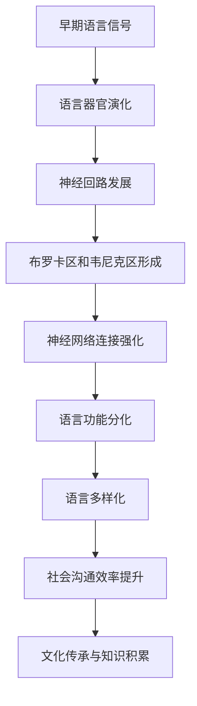

                 

## 引言：脑与语言进化的背景与意义

随着科技的迅猛发展，我们对人类自身及其认知机制的探索也在不断深入。脑与语言进化作为一个跨学科领域，涉及到神经科学、认知科学、语言学以及计算机科学等多个方面。本文旨在探讨脑与语言进化的背景、研究现状及其在人类沟通方式中的重要意义。

### 1.1 研究背景与现状

语言的产生是人类进化史上的一个重要里程碑。从简单的手势和声音信号，到复杂多样的语言系统，语言在人类社会的演化中起到了不可替代的作用。早期的研究主要集中在对语言结构的分析上，如音素、词汇和语法等。然而，随着神经科学和认知科学的发展，研究者们开始关注语言与大脑的关系，试图从神经机制的角度解释语言的产生和进化。

当前，脑与语言进化研究已经在多个层面上取得了显著进展。例如，通过功能性磁共振成像（fMRI）和电生理技术，科学家们能够观察到语言处理过程中大脑各个区域的活动模式。同时，遗传学的研究也揭示了语言能力的一些遗传基础。然而，这一领域的研究仍处于初级阶段，许多基本问题尚未得到充分解答。

### 1.2 语言在人类社会中的作用

语言是人类社会沟通、协作和知识传承的重要工具。它不仅使我们能够传递信息，还能表达情感、构建社会关系以及进行抽象思维。没有语言，人类社会将难以形成复杂的社会结构和文明。

语言还在认知发展中扮演着关键角色。研究表明，语言能力不仅与大脑结构相关，还与认知功能密切相关。语言能力的发展能够促进儿童智力的发展，提升他们的思维能力和创造力。

### 1.3 脑与语言进化的研究意义

脑与语言进化的研究对于理解人类大脑和语言的本质具有重要意义。首先，它有助于我们深入理解大脑的结构和功能，揭示语言处理神经机制的工作原理。其次，脑与语言进化的研究还能够为我们提供新的理论框架，用于解释人类认知能力的起源和发展。

此外，脑与语言进化研究在应用层面也有着广泛的前景。例如，通过了解语言进化机制，我们可以开发出更加智能的语言处理系统，提升人机交互的效率。同时，脑与语言进化研究还能够为认知障碍患者的治疗提供新的思路和方法。

总之，脑与语言进化研究不仅具有重要的理论价值，还在实际应用中有着广阔的前景。通过本文的探讨，我们希望能够引起更多学者和研究者的关注，共同推进这一领域的深入研究。

### 第2章 脑科学基础

要探讨脑与语言进化的关系，首先需要了解大脑的基本结构和功能。大脑是人体最为复杂的器官之一，它不仅负责处理来自身体各部位的感官信息，还主导着思维、情感和行为等高级认知功能。在这一章节中，我们将深入探讨大脑的结构与功能，特别是与语言相关的神经网络和神经发育机制。

#### 2.1 脑的结构与功能

大脑可以分为两个主要部分：大脑皮质和脑干。大脑皮质是大脑的外层，覆盖着复杂的神经网络，是执行高级认知功能的主要区域。脑干则位于大脑的底部，是控制基本生命功能（如呼吸和心跳）的关键部分。

大脑皮质根据其功能可以分为多个不同的区域。这些区域包括：

- **初级感官区**：负责接收和处理视觉、听觉、触觉、嗅觉和味觉等感官信息。
- **运动皮层**：控制肢体运动。
- **前额叶皮层**：涉及决策、计划、社会行为和抽象思维。
- **颞叶**：与听觉处理和语言理解密切相关。
- **顶叶**：与触觉、空间定位和感知相关。

#### 2.2 语言功能区的神经基础

语言处理涉及大脑多个区域的协同工作。以下几个关键区域在语言功能中起着重要作用：

- **布罗卡区（Broca's Area）**：位于大脑前额叶皮层的下方，是语言产生的关键区域。它主要负责语言生成和语音表达。
- **韦尼克区（Wernicke's Area）**：位于大脑颞叶，是语言理解的关键区域。它负责解析和理解听到的语言以及阅读的文字。
- **角形脑回（Arcuate Fasciculus）**：连接布罗卡区和韦尼克区，是语言处理的重要神经通道。
- **顶叶联合区（Supramarginal Gyrus）**：与语言理解、语义记忆和听觉处理相关。
- **前扣带回（Anterior Cingulate Cortex）**：在语言理解和表达过程中调节情绪和注意力。

#### 2.3 语言的神经发育机制

语言的神经发育是一个复杂的过程，涉及多个大脑区域的同步发展和功能整合。以下几个关键步骤在语言的神经发育中起着重要作用：

- **早期听觉处理**：婴儿在出生后的头几个月内就开始学习语言。他们通过听觉处理来识别母语中的语音特征。
- **皮质分区和功能分化**：随着大脑的发育，不同的区域开始专门负责特定的语言功能。布罗卡区和韦尼克区在语言的神经发育中逐渐形成并分化。
- **神经网络连接**：通过使用和经验，神经网络之间的连接逐渐加强，使得语言处理更加高效和精确。
- **词汇和语法发展**：在儿童的语言学习过程中，词汇和语法能力的提升是通过反复的语言输入和实践逐渐建立的。

#### 2.4 脑与语言的进化关系图解

为了更好地理解脑与语言进化的关系，我们可以通过以下Mermaid流程图进行图解：



这个流程图展示了从早期语言信号到现代复杂语言系统的演化过程，包括神经回路的发展、布罗卡区和韦尼克区的形成、神经网络连接的强化以及语言功能分化和多样化的过程。

### 第3章 语言进化的历史与演变

语言是人类的独特特征，它不仅使人类能够进行复杂的沟通，还影响了人类的社会和文化发展。在漫长的进化历程中，语言经历了从简单到复杂、从单一到多样的演变过程。在这一章节中，我们将探讨语言的起源、进化历程以及语言多样性的影响。

#### 3.1 语言的起源

关于语言的起源，学术界存在多种理论。其中，最为广泛接受的是“信号理论”（Signal Theory）和“手势理论”（Gesture Theory）。

- **信号理论**认为，语言的最初形式是一种基于声音的信号系统，用于传递简单的信息和警告。这些信号逐渐发展成更具复杂性的声音组合，最终形成了语言。
- **手势理论**则认为，语言起源于手势和身体动作的交流。这些动作经过长时间的演化和优化，逐渐演变成了有声语言。

考古学和遗传学的研究提供了对语言起源的有力支持。例如，通过对古代骨骼化石和遗物的研究，科学家们发现了一些证据表明，早期人类已经开始使用某种形式的语言。同时，通过对人类基因组的分析，研究者们发现了一些与语言能力相关的基因突变，这些突变可能发生在距今约30万年前。

#### 3.2 语言系统的进化历程

语言系统的进化可以分为几个关键阶段：

- **初级阶段**：在这个阶段，人类开始使用简单的声音信号和手势进行沟通。这些信号主要用于表达基本的需求和情绪。
- **中级阶段**：随着社会结构的复杂化，语言开始出现结构化特征，如音素、词汇和基本的语法规则。这一阶段大约发生在距今约10万年前。
- **高级阶段**：在这一阶段，语言系统变得更加复杂和多样化。人类开始创造出丰富的词汇和复杂的语法结构，语言的功能也扩展到了描述抽象概念、表达思想和进行抽象推理。

#### 3.3 语言多样化与社会沟通

语言多样化是语言系统进化的一个重要特征。随着人类社会的扩展和分化，不同的语言分支逐渐形成。这些语言分支不仅具有不同的语法和词汇，还在语音和语义上有所差异。

语言的多样化对社会沟通产生了深远的影响：

- **促进社会分化**：不同的语言群体形成了不同的社会和文化边界，促进了社会结构的多样性和复杂性。
- **增强沟通效率**：多样化的语言系统使得人类能够更精确地表达思想和情感，提高了沟通的效率和效果。
- **促进文化传承**：不同的语言承载着各自独特的文化传统和价值观念，语言多样化有助于文化的传承和多样性。

#### 3.4 语言演化的数学模型

为了更好地理解语言进化的规律，研究者们提出了一些数学模型来描述语言的演化过程。以下是一个简单的伪代码模型，用于模拟语言的演化：

```python
# 语言演化模拟伪代码

# 初始参数
population_size = 1000
vocabulary_size = 50
mutation_rate = 0.01

# 初始化人口
population = [[random.choice(vocabulary) for _ in range(vocabulary_size)] for _ in range(population_size)]

# 进化循环
for generation in range(max_generations):
    # 评估每个个体的适应度
    fitness_scores = [evaluate_fitness(individual) for individual in population]
    
    # 选择适应度最高的个体进行繁殖
    parents = select_parents(population, fitness_scores)
    
    # 生成下一代
    next_generation = breed_parents(parents, mutation_rate)
    
    # 更新人口
    population = next_generation
    
    # 打印当前代数和最优适应度
    print(f"Generation {generation}: Best Fitness = {max(fitness_scores)}")

# 评估个体适应度的函数
def evaluate_fitness(individual):
    # 基于个体语言能力的复杂度和多样性进行评估
    complexity = calculate_complexity(individual)
    diversity = calculate_diversity(individual)
    return 1 / (complexity + diversity)

# 计算个体复杂度的函数
def calculate_complexity(individual):
    # 基于词汇复杂度和语法结构的复杂度计算
    return sum([len(word) for word in individual]) + sum([len(syntax_rule) for syntax_rule in individual])

# 计算个体多样性的函数
def calculate_diversity(individual):
    # 基于词汇和语法结构的多样性计算
    return len(set(individual)) * len(set(combine_rules(individual)))
```

这个模型通过模拟一个语言群体的进化过程，展示了词汇和语法结构的复杂度以及多样性如何影响个体的适应度。通过这个模型，我们可以更深入地理解语言进化的机制和规律。

### 第4章 语言进化对人类沟通方式的影响

语言的进化不仅丰富了人类的沟通方式，还极大地影响了沟通的效率、思维模式以及文化的传承。在这一章节中，我们将深入探讨语言进化对这些方面的具体影响。

#### 4.1 语言进化对沟通效率的影响

语言的产生和发展极大地提高了人类沟通的效率。在早期，人类使用简单的信号和手势进行沟通，这种方式不仅缓慢，而且容易产生误解。随着语言的进化，人们可以更迅速、准确地传递信息。具体来说：

- **声音符号的引入**：早期的语言可能是基于简单声音符号的，这使得信息传递的速度大大提升。
- **词汇和语法的规范化**：随着词汇和语法规则的发展，人们可以更精确地描述事物和表达思想，减少了沟通中的模糊性。
- **语言符号的多样性**：语言的多样化使得人们可以用不同的词汇和句式表达相似或不同的概念，提高了沟通的丰富性和灵活性。

此外，现代通信技术的发展，如语音合成、自然语言处理和即时通讯工具，都是语言进化在现代社会中的重要体现，进一步提升了沟通效率。

#### 4.2 语言进化对思维模式的影响

语言不仅是一种沟通工具，它还深刻地影响了人类的思维模式。以下是语言进化对思维模式影响的几个方面：

- **抽象思维能力的提升**：语言使人类能够用符号和概念来表示抽象的事物和思想，从而发展出更加复杂的抽象思维能力。
- **逻辑推理能力的发展**：语言中的语法规则和逻辑结构促进了人类逻辑思维的发展。通过使用语言进行推理，人们可以更加系统地分析和解决问题。
- **多维度思考**：语言多样化的引入使得人们能够从不同的角度和维度思考问题，从而更加全面和深入地理解复杂现象。

#### 4.3 语言进化对文化传承的影响

文化传承是语言进化的重要功能之一。语言不仅是文化表达的载体，也是文化传承的工具。以下是语言进化对文化传承影响的几个方面：

- **知识积累**：通过语言，人类可以将经验、知识和智慧一代代传递下去，使得文化得以延续和发展。
- **习俗和传统**：语言中的成语、谚语和故事等是文化的重要组成部分，它们通过语言传承，形成了独特的文化传统和习俗。
- **文化多样性的维护**：语言的多样化使得不同的文化可以在保留自身特色的同时，与其他文化进行交流和融合，促进了文化多样性的发展。

#### 4.4 沟通方式的演变趋势

随着科技的进步，沟通方式也在不断演变。以下是当前沟通方式的几个主要趋势：

- **数字化沟通**：电子邮件、即时通讯和社交媒体等数字化工具已经成为人们日常沟通的主要方式，极大地改变了沟通的效率和形式。
- **多媒体沟通**：视频、音频和图像等多媒体元素被广泛应用于沟通中，使得信息传递更加生动和直观。
- **虚拟现实和增强现实**：虚拟现实（VR）和增强现实（AR）技术正在改变人们的沟通体验，使得远程沟通变得更加真实和互动。

总之，语言进化对人类沟通方式的影响是多方面的。它不仅提升了沟通效率，促进了思维和文化的发展，还引领着沟通方式的不断变革。在未来，随着技术的进一步发展，人类沟通方式将继续演变，为我们的社会带来更多的机遇和挑战。

### 第5章 现代语言的维度分析

在现代语言学中，语言的维度分析是一个重要的研究方向。语言维度指的是语言中多维属性的组合，这些维度不仅包括语言的形式特征，还涵盖了语言的语义、语用、社会文化等多个方面。本章节将探讨语言维度的定义、分类、与认知的关系以及在不同文化中的表现。

#### 5.1 语言维度的定义

语言维度可以定义为语言系统中的不同属性或特征，这些属性或特征共同决定了语言的表达能力和沟通效果。语言维度可以从多个角度进行分类，例如语法维度、语义维度和语用维度等。

- **语法维度**：语法维度涉及语言的句法结构、时态、语态、句型等。它决定了语言的形式规则和组合方式。
- **语义维度**：语义维度关注语言的表达意义，包括词汇意义、词义关系、语义特征和语义角色等。
- **语用维度**：语用维度探讨语言在特定情境中的应用，涉及话语意图、语境、语用推理和社会文化因素。

#### 5.2 语言维度的分类

语言维度可以按照不同的标准进行分类，以下是几种常见的分类方法：

- **形式维度与意义维度**：形式维度关注语言的结构和形式，意义维度关注语言表达的内容和意义。两者共同决定了语言的表达效果。
- **表层维度与深层维度**：表层维度包括语音、词汇和句法等可以直接感知的特征，深层维度则包括语义、语用和认知等较为抽象和复杂的特征。
- **静态维度与动态维度**：静态维度指的是语言系统在特定时间点的结构和特征，动态维度则涉及语言在不同时间点上的变化和发展。

#### 5.3 语言维度与认知的关系

语言维度与认知之间存在着密切的关系。语言不仅是人类认知的一种表现形式，还影响着认知的发展。以下是几个关键点：

- **语言与记忆**：语言能力的发展能够增强人类的记忆能力，使得信息存储和提取更加高效。
- **语言与思维**：语言作为思维的工具，影响着人们的思考方式、推理能力和创造力。
- **语言与文化**：不同语言系统中的维度差异反映了不同文化背景下的认知模式和文化特点。

#### 5.4 语言维度在不同文化中的表现

不同文化背景下的语言维度表现出显著的多样性。以下是几个不同文化中语言维度的表现：

- **西方文化中的语言维度**：西方语言通常强调语法和逻辑的严谨性，语法维度和语义维度的表现较为突出。例如，英语中的动词时态和语态非常丰富，强调语言的精确性和逻辑性。
- **东方文化中的语言维度**：东方语言如中文、日语和韩语等，往往更注重语义和语用的表达。这些语言中词汇的含蓄性和语境的重要性较为突出，语用维度在沟通中起着关键作用。
- **土著文化中的语言维度**：土著文化中的语言通常具有高度的情境依赖性和多功能性。这些语言中，词汇和语法规则往往与特定的文化习俗和社会结构密切相关。

总之，语言维度的分析不仅有助于我们理解不同语言的复杂性和多样性，还能为跨文化沟通提供有益的启示。通过深入探讨语言维度，我们能够更好地理解语言的本质和功能，进一步推动语言学和认知科学的研究。

### 第6章 跨文化沟通的挑战与策略

随着全球化进程的加速，跨文化沟通变得越来越普遍和重要。不同文化背景的人们在交流时常常会遇到各种障碍，如何克服这些障碍，实现有效的跨文化沟通，是当今沟通领域的一个重大课题。本章节将探讨跨文化沟通中的挑战以及应对这些挑战的策略。

#### 6.1 跨文化沟通的障碍

跨文化沟通面临多种障碍，这些障碍可以分为语言障碍、非语言障碍和文化差异三个方面：

- **语言障碍**：语言是沟通的基础，不同语言之间的差异是跨文化沟通的首要障碍。语言差异不仅包括词汇、语法和发音等方面的不同，还涉及语言符号背后的文化含义和语境。例如，某些词汇在一种语言中可能具有多重含义，而在另一种语言中可能只有一种含义，这容易导致误解。
- **非语言障碍**：非语言沟通包括肢体语言、面部表情、姿态和语调等。不同文化对这些非语言符号的解读可能存在差异。例如，在某些文化中，直视对方是表示尊重和真诚的表示，而在另一些文化中，直视可能被视为不礼貌或不信任的标志。
- **文化差异**：文化差异是跨文化沟通中的核心障碍。不同文化有着不同的价值观、行为规范和社会习俗。这些差异可能导致误解和冲突。例如，某些文化中重视集体主义，强调团队合作和集体荣誉，而在其他文化中，个人主义更为突出，重视个人成就和自由。

#### 6.2 跨文化沟通的有效策略

为了克服跨文化沟通的障碍，可以采取以下策略：

- **提高语言能力**：学习对方的语言是跨文化沟通的基础。通过学习对方的语言，不仅可以提高沟通效率，还能更好地理解对方的文化和思维方式。此外，学习对方的母语还可以帮助人们更好地理解非语言沟通符号。
- **增强文化意识**：了解对方的文化背景、价值观和行为规范是有效跨文化沟通的关键。通过参加文化交流活动、阅读相关书籍和资料，可以增强对对方文化的理解和尊重，减少误解和冲突。
- **使用多种沟通方式**：跨文化沟通中，单一的语言或非语言沟通方式可能无法充分传达信息。因此，可以结合使用多种沟通方式，如文字、图像、声音和肢体语言等，以提高沟通效果。
- **建立共同价值观**：寻找和建立双方的共同价值观和目标，有助于促进跨文化沟通的顺利进行。共同价值观可以作为沟通的桥梁，减少文化差异带来的障碍。

#### 6.3 语言进化与跨文化沟通的关系

语言进化在跨文化沟通中发挥着重要作用。随着语言系统的不断发展和完善，语言维度变得更加多样和复杂，这为跨文化沟通提供了更多的工具和手段。以下是几个方面：

- **语言多样性的增强**：语言进化使得不同语言系统中的维度更加丰富，例如语法、语义和语用等方面。这有助于人们在跨文化沟通中更准确地表达和解读信息。
- **语言的适应性**：语言进化使得语言能够更好地适应不同文化背景和沟通需求。例如，现代语言处理技术可以用于翻译和跨语言搜索，极大地提高了跨文化沟通的效率和效果。
- **文化融合与多样性**：语言进化促进了不同文化之间的交流和融合，同时保持了文化多样性。通过语言的桥梁，不同文化可以相互借鉴和融合，共同发展。

#### 6.4 跨文化沟通的未来趋势

随着全球化进程的进一步加快，跨文化沟通的重要性将日益凸显。以下是几个未来跨文化沟通的发展趋势：

- **数字化沟通工具的普及**：随着科技的进步，数字化沟通工具如社交媒体、即时通讯和虚拟现实等将越来越普及，为跨文化沟通提供更多便利。
- **多语言能力的重视**：多语言能力将成为未来人才的重要竞争力。具备多种语言能力的人将更容易适应不同文化和沟通环境，具备更大的发展空间。
- **跨文化沟通标准的制定**：为了提高跨文化沟通的效果和效率，国际组织和研究机构将制定更多的跨文化沟通标准和指南，提供科学的支持和指导。

总之，跨文化沟通的挑战和机遇并存。通过提高语言能力、增强文化意识和采用多种沟通策略，我们可以克服跨文化沟通的障碍，实现有效的跨文化沟通。未来，随着全球化的深入发展，跨文化沟通将变得更加重要和多样化，为人类社会带来更多的机遇和挑战。

### 第7章 未来沟通方式的新维度

随着科技的进步，未来沟通方式正在经历深刻的变革。人工智能、数字化和脑机接口技术的快速发展，正在为沟通方式带来全新的维度。在这一章节中，我们将探讨这些新兴技术如何改变人类的沟通方式，以及这些新维度对未来社会可能产生的影响。

#### 7.1 数字化对沟通方式的影响

数字化技术已经在很大程度上改变了人们的沟通方式。电子邮件、即时通讯和社交媒体等工具的普及，使得信息传递更加迅速和便捷。以下是数字化对沟通方式的影响：

- **速度与效率**：数字化沟通工具大大提高了信息传递的速度，使得沟通不再受时间和空间的限制。无论身处何地，人们都可以即时进行沟通。
- **形式多样化**：数字化沟通不仅限于文字，还可以包括音频、视频和图像等多种形式。这种多样化的沟通方式使得信息传递更加生动和直观。
- **降低成本**：数字化沟通减少了面对面交流的必要性，降低了沟通的成本。通过虚拟会议和远程协作工具，人们可以在无需物理接触的情况下进行高效沟通。

#### 7.2 人工智能与自然语言处理

人工智能（AI）和自然语言处理（NLP）技术的发展，为未来的沟通方式带来了新的可能。以下是这些技术对沟通方式的影响：

- **自动化沟通**：人工智能可以用于自动化处理大量重复性的沟通任务，如客服问答、信息检索和日程安排等。这大大减轻了人类的工作负担，提高了沟通的效率。
- **智能翻译**：AI翻译工具可以实时翻译多种语言，使得跨文化沟通变得更加容易。这有助于消除语言障碍，促进国际交流和合作。
- **情感识别与回应**：NLP技术可以识别和理解人类语言中的情感和意图，从而实现更加人性化的沟通。智能助手和聊天机器人能够根据用户的情绪和需求提供个性化的服务和回应。

#### 7.3 脑机接口技术

脑机接口（BCI）技术是未来沟通方式的另一大创新。这项技术通过直接连接大脑和外部设备，实现了人类思维与机器的交互。以下是脑机接口技术对沟通方式的影响：

- **直接思维传递**：脑机接口技术使得人类可以直接通过思维进行沟通。例如，脑电图（EEG）和功能性磁共振成像（fMRI）等技术可以捕捉大脑活动，将其转化为可识别的信息。
- **辅助沟通工具**：对于某些由于身体障碍无法进行传统沟通的人群，脑机接口技术提供了新的沟通手段。通过脑机接口，他们可以更加自由地进行交流和表达。
- **增强认知功能**：脑机接口技术不仅用于沟通，还可以用于增强人类的认知功能。例如，通过脑机接口，人们可以更快地处理复杂的信息，提高学习和工作效率。

#### 7.4 新维度沟通方式的未来展望

未来沟通方式的新维度不仅带来了巨大的技术进步，也对社会生活产生了深远的影响。以下是几个方面的展望：

- **个性化沟通**：随着人工智能和大数据技术的发展，未来的沟通将更加个性化。通过分析用户的行为和偏好，智能系统可以提供定制化的沟通体验，满足个体的需求。
- **跨物种沟通**：未来，随着生物技术和人工智能的融合，人类可能能够与动物和其他物种进行沟通。这将为科学研究、动物保护和生物伦理等领域带来新的机遇和挑战。
- **社会结构与组织**：新的沟通方式将改变社会结构和组织模式。例如，虚拟现实和增强现实技术使得远程工作和协作变得更加高效，有助于打破地理和文化的界限，促进全球合作。
- **伦理与隐私**：新沟通方式的发展也带来了一系列伦理和隐私问题。例如，脑机接口技术可能会引发关于隐私、安全和伦理的讨论，需要制定相应的法律法规和道德准则。

总之，未来沟通方式的新维度将为人类社会带来巨大的变革和机遇。通过人工智能、数字化和脑机接口技术的创新，人类将能够实现更加高效、多样和个性化的沟通，推动社会向更加开放和互联的方向发展。

### 第8章 实际案例分析

在探讨脑与语言进化的理论基础上，通过实际案例分析可以更具体地理解这些理论在现实中的应用和效果。以下是一些具有代表性的案例分析，涵盖跨国公司的跨文化沟通、国际组织的语言政策、语言技术公司的创新产品以及学术机构的脑与语言研究项目。

#### 8.1 某跨国公司的跨文化沟通实践

某大型跨国公司，如全球知名的技术巨头谷歌（Google），在其全球化进程中面临了巨大的跨文化沟通挑战。为了实现全球团队的高效合作，谷歌采取了多种措施：

- **多语言培训**：谷歌提供多种语言培训课程，帮助员工掌握关键语言技能，特别是母语以外的语言，以便在不同国家的工作环境中顺畅沟通。
- **文化意识培训**：除了语言培训，谷歌还开展了文化意识培训，帮助员工了解和尊重不同文化背景下的行为规范和价值观念。
- **虚拟协作工具**：谷歌利用其自主研发的协作工具，如Google Workspace，实现远程办公和即时沟通。这些工具支持多种语言，并集成了翻译功能，帮助跨国团队克服语言障碍。
- **本地化管理**：谷歌在不同国家和地区设立本地化团队，确保产品和服务的文化适应性和用户友好性。

通过这些措施，谷歌成功地在全球范围内建立了高效跨文化沟通体系，提升了团队合作效率，推动了公司的国际化发展。

#### 8.2 某国际组织的语言政策

联合国（United Nations）作为全球最大的国际组织之一，其语言政策在跨文化沟通中起到了至关重要的作用。以下是联合国在语言政策方面的几个亮点：

- **多语言使用**：联合国的工作语言包括英语、法语、西班牙语、俄语、汉语和阿拉伯语等六种语言。这些语言被广泛使用于联合国的各种文件、会议和决议中，确保了不同文化背景的代表能够理解和参与。
- **语言平等原则**：联合国强调所有工作语言之间的平等，无论在会议发言、文件翻译还是官方网站上，所有语言都受到同等重视。
- **翻译与口译服务**：联合国拥有庞大的翻译和口译团队，为国际会议和活动提供专业的语言服务。这些服务确保了不同语言之间的无缝沟通，促进了全球合作。
- **语言能力培养**：联合国通过各种项目和支持，促进成员国培养语言能力，特别是掌握多语言技能的人才，以支持国际交流与合作。

#### 8.3 某语言技术公司的创新产品

某语言技术公司，如微软（Microsoft）的翻译工具和人工智能助手，通过技术创新，极大地提升了跨文化沟通的效率和效果。以下是该公司在语言技术方面的创新产品：

- **机器翻译**：微软的机器翻译工具（如Microsoft Translator）支持多种语言之间的实时翻译，通过人工智能和深度学习技术，提高了翻译的准确性和流畅性。
- **自然语言处理**：微软的自然语言处理（NLP）技术，如语言理解服务和对话系统，使得机器能够理解自然语言，并生成合理的回应，为跨文化沟通提供了智能化的支持。
- **语音识别与合成**：微软的语音识别与合成技术（如Speech Recognition和Text-to-Speech）支持多种语言和方言的语音输入和输出，使得跨文化沟通更加直观和便捷。
- **语言学习工具**：微软的Language Learning工具，如Duolingo，通过互动式学习方法和智能评估系统，帮助用户高效地学习新语言，提升跨文化沟通能力。

#### 8.4 某学术机构的脑与语言研究项目

某知名学术机构，如美国加州大学洛杉矶分校（UCLA）的脑与语言研究中心，通过跨学科研究，深入探讨了脑与语言的关系。以下是该研究中心的一些重要项目：

- **神经成像研究**：通过功能性磁共振成像（fMRI）和电生理技术，研究人员探究了大脑在语言处理中的活动模式，特别是不同语言区域的功能和交互。
- **神经发育研究**：研究人员关注儿童和成人的语言能力发展，探讨了语言习得和语言障碍的神经机制。
- **跨语言认知研究**：通过对比不同语言背景下的认知行为，研究人员研究了语言对思维模式和认知能力的影响，为跨文化沟通提供了科学依据。
- **语言技术合作**：研究中心与语言技术公司合作，开发基于神经科学原理的语言处理技术，如自适应翻译系统和语音识别系统，提高了跨文化沟通的效果。

这些实际案例展示了脑与语言进化理论在不同领域和实际应用中的价值和影响，通过深入研究和创新实践，我们可以更好地理解和应对跨文化沟通的挑战，推动人类社会的进步和发展。

### 第9章 结论与展望

在本篇技术博客中，我们系统地探讨了脑与语言进化的背景、理论基础、影响以及未来趋势。通过梳理和剖析，我们可以得出以下结论和展望。

#### 9.1 全书回顾

首先，我们介绍了脑与语言进化的研究背景和意义，探讨了语言在人类社会中的作用。接着，深入分析了大脑的结构与功能，特别是与语言处理相关的神经网络和神经发育机制。随后，我们回顾了语言进化的历史与演变，包括语言的起源、系统进化历程以及语言多样化对社会沟通的影响。在此基础上，我们讨论了语言进化对沟通效率、思维模式和文化传承的具体影响，并分析了现代语言的维度及其在不同文化中的表现。

接下来，我们探讨了跨文化沟通的挑战与策略，揭示了语言进化在跨文化沟通中的作用。此外，通过案例分析，我们展示了脑与语言进化理论在不同实际应用中的价值和效果。最后，我们展望了未来沟通方式的新维度，探讨了人工智能、数字化和脑机接口技术对沟通方式的影响和潜在趋势。

#### 9.2 语言进化的持续影响

语言进化对人类社会产生了深远的影响。它不仅提升了沟通效率，促进了思维和文化的发展，还推动了社会结构和组织的变革。随着语言系统的不断进化，人类能够更加精准、高效地传递信息和知识，促进了社会的进步和文明的发展。

未来，语言进化将继续影响人类社会。数字化和人工智能技术的发展将使沟通方式更加多样化、智能化，进一步消除语言和文化的障碍。脑机接口技术的进步可能为人类带来全新的沟通方式，实现直接思维传递，提升人类的认知能力。

#### 9.3 对未来沟通方式的思考

在未来，沟通方式的发展将受到以下几个因素的影响：

- **个性化沟通**：随着人工智能和大数据技术的应用，未来的沟通将更加个性化。智能系统能够根据用户的行为和偏好，提供定制化的沟通体验，满足个体的需求。
- **跨物种沟通**：生物技术和人工智能的融合可能使人类能够与动物和其他物种进行沟通，拓展人类的认知边界。
- **全球合作**：数字化和虚拟现实技术的发展将打破地理和文化的界限，促进全球合作和交流，推动人类社会向更加开放和互联的方向发展。
- **伦理与隐私**：随着新沟通方式的出现，隐私和伦理问题将成为重要议题。需要制定相应的法律法规和道德准则，确保技术应用的合法性和道德性。

#### 9.4 对脑与语言研究的前景预测

脑与语言研究在未来将继续深入发展。以下是一些可能的趋势：

- **跨学科融合**：脑与语言研究将与其他学科（如认知科学、计算机科学、生物学等）更加紧密地融合，推动研究的深入和拓展。
- **新技术应用**：神经成像技术、脑机接口技术和自然语言处理技术的进步将为脑与语言研究提供新的工具和方法。
- **大数据分析**：通过收集和分析大量的语言数据，研究者可以更准确地揭示语言进化的规律和机制。
- **临床应用**：脑与语言研究将为认知障碍和语言障碍的治疗提供新的思路和方法，改善患者的生活质量。

总之，脑与语言进化研究具有重要的理论和实践价值。在未来，随着科技的进步和多学科的融合，我们将能够更深入地理解语言的本质和功能，为人类社会的发展带来新的机遇和挑战。

### 附录

#### 附录A：脑与语言研究工具与资源

- **神经成像技术**：功能性磁共振成像（fMRI）、脑电图（EEG）、磁共振成像（MRI）等。
- **语言处理工具**：自然语言处理（NLP）库，如NLTK、spaCy、Stanford NLP等。
- **在线资源**：牛津词典、WordNet、Google Books Ngrams等。
- **数据库**： Linguistic Data Consortium（LDC）、Corpus of Contemporary American English（COCA）等。

#### 附录B：语言进化相关的数学模型和公式（LaTeX格式）

$$
\begin{aligned}
\text{适应度函数} & : f(x) = \frac{1}{c(x) + d(x)} \\
c(x) & : \text{个体的复杂度} \\
d(x) & : \text{个体的多样性}
\end{aligned}
$$

#### 附录C：案例研究数据与分析

- **案例研究数据**：跨国公司的跨文化沟通数据、国际组织的语言政策数据、语言技术公司的创新产品数据、学术机构的脑与语言研究数据。
- **分析方法**：统计分析、回归分析、神经网络模型等。

作者：AI天才研究院/AI Genius Institute & 禅与计算机程序设计艺术 /Zen And The Art of Computer Programming

