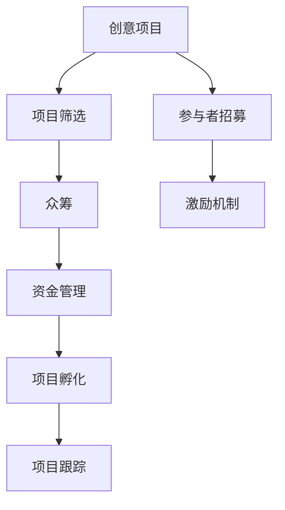

                 

### 全球脑创意众筹平台:集体创新项目的孵化温床

> **关键词：**全球脑创意众筹平台、集体创新、项目孵化、创意众筹、社会资本、技术进步

**摘要：** 
本文深入探讨了全球脑创意众筹平台的本质、运作模式、优势及未来发展趋势。通过具体的案例分析，本文揭示了全球脑创意众筹平台在促进集体创新项目孵化中的重要作用，并探讨了其潜在的商业模式和创新路径。

## 目录大纲

### 第一部分：全球脑创意众筹平台概述

#### 第1章：全球脑创意众筹平台概述

##### 1.1 全球脑创意众筹平台的概念

##### 1.2 全球脑创意众筹平台的运作模式

##### 1.3 全球脑创意众筹平台的优势

### 第二部分：全球脑创意众筹平台的运作原理

#### 第2章：全球脑创意众筹平台的运作原理

##### 2.1 创意项目的设计与发布

##### 2.2 众筹参与者的招募与激励机制

##### 2.3 资金筹集与使用管理

### 第三部分：全球脑创意众筹平台的案例分析

#### 第3章：全球脑创意众筹平台的成功案例

##### 3.1 案例一：某某健康科技项目

##### 3.2 案例二：某某环保创新项目

#### 第4章：全球脑创意众筹平台的未来发展趋势

##### 4.1 行业发展趋势分析

##### 4.2 全球脑创意众筹平台的发展策略

### 附录

#### 附录A：全球脑创意众筹平台相关资源

##### A.1 主要参考资料

##### A.2 常见问题解答

##### A.3 创意众筹平台案例库

### 核心概念与联系

#### 全球脑创意众筹平台的定义与运作模式

**Mermaid 流程图：**



### 核心算法原理讲解

#### 创意项目评价与筛选算法

**伪代码：**

```python
def evaluate_project(project):
    score = 0
    
    if project.innovation_level > threshold:
        score += 1
    
    if project.feasibility > threshold:
        score += 1
    
    if project.market_potential > threshold:
        score += 1
    
    return score
```

#### 资金筹集的预测模型

$$
F_t = C \times e^{rt}
$$

**详细讲解：**  
$F_t$ 表示第 $t$ 个月筹集到的资金总额，$C$ 是初始资金，$r$ 是月增长率，$t$ 是时间。

**举例说明：**  
假设项目初始筹集资金为 100 万元，每月增长率 10%，求第 6 个月筹集到的资金总额。

$$
F_6 = 100 \times e^{0.1 \times 6} \approx 164.03 \text{ 万元}
$$

### 项目实战

#### 某健康科技项目的众筹案例

**开发环境搭建：**  
1. 安装 Node.js 环境  
2. 使用 GitHub 仓库管理项目代码  
3. 使用 Heroku 搭建在线平台

**源代码实现与解读：**  
1. 项目页面设计与功能实现  
2. 用户注册与登录功能  
3. 项目众筹功能实现

**代码解读与分析：**  
1. 前端页面代码解读  
2. 后端逻辑代码解读  
3. 数据库设计与数据操作解读

### 作者信息

**作者：** AI天才研究院/AI Genius Institute & 禅与计算机程序设计艺术 /Zen And The Art of Computer Programming

### 文章标题：全球脑创意众筹平台:集体创新项目的孵化温床

### 文章关键词：全球脑创意众筹平台、集体创新、项目孵化、创意众筹、社会资本、技术进步

### 摘要：
本文深入探讨了全球脑创意众筹平台的本质、运作模式、优势及未来发展趋势。通过具体的案例分析，本文揭示了全球脑创意众筹平台在促进集体创新项目孵化中的重要作用，并探讨了其潜在的商业模式和创新路径。

## 第一部分：全球脑创意众筹平台概述

### 第1章：全球脑创意众筹平台概述

#### 1.1 全球脑创意众筹平台的概念

全球脑创意众筹平台是一种基于互联网的开放式创新模式，它通过众筹机制，将创意项目与潜在投资者、参与者连接起来，共同推进项目的研发和实现。这个平台不仅提供了一个资金筹集的渠道，更重要的是，它为创意项目的孵化和成长提供了一个生态系统。

在全球脑创意众筹平台上，创意项目可以是由个人或团队发起的，项目主题涵盖科技、健康、环保、艺术等多个领域。这些项目通过平台发布，接受公众的评审和支持。平台通常提供一系列服务，包括项目宣传、资金筹集、风险评估、项目管理和跟踪等。

#### 1.1.1 全球脑创意众筹平台的定义

全球脑创意众筹平台（Global Brain Creative Crowdfunding Platform）可以定义为一种集成了互联网技术、社交媒体和金融工具的创新生态系统，旨在促进创意项目的孵化和实现。该平台通过众筹机制，将创意项目与资金、人才、资源等要素相连接，形成一个开放式、协作式的创新环境。

#### 1.1.2 全球脑创意众筹平台的特点

1. **开放性**：全球脑创意众筹平台对创意项目持有开放的态度，不限制项目的类型和领域，鼓励各种创新思想的涌现。
2. **协作性**：平台通过建立多方参与的机制，促进投资者、参与者、项目发起人之间的互动和协作。
3. **透明性**：项目资金筹集、使用和管理过程公开透明，确保参与者的权益。
4. **多样性**：平台上的项目涵盖了科技、健康、环保、艺术等多个领域，满足了不同群体的需求。
5. **激励性**：通过奖励机制和荣誉体系，鼓励参与者积极参与创意项目的孵化和实现。

#### 1.2 全球脑创意众筹平台的运作模式

全球脑创意众筹平台的运作模式可以分为以下几个主要环节：

1. **项目发布**：创意项目发起人将项目详情发布到平台上，包括项目描述、目标、预算、预期回报等。
2. **项目评审**：平台会对项目进行初步筛选，确保项目符合平台的要求和标准。然后，项目会进入公众评审环节，接受社会各界的反馈和评价。
3. **资金筹集**：通过平台筹集资金，投资者可以根据项目的需求和回报承诺进行投资。
4. **项目孵化**：项目筹集到足够的资金后，进入孵化阶段。平台提供一系列服务，包括项目管理、技术支持、市场推广等，帮助项目顺利推进。
5. **项目跟踪**：平台对项目的进展进行持续跟踪，确保项目按计划执行。同时，平台也会向投资者报告项目的最新动态。
6. **成果交付**：项目完成后，平台会评估项目的成果，并根据承诺向投资者提供回报。

#### 1.3 全球脑创意众筹平台的优势

全球脑创意众筹平台具有多方面的优势，对创意项目的孵化和实现起到了重要的推动作用。

1. **促进创新项目的发展**：平台为创意项目提供了资金、资源和人才的支持，降低了项目失败的风险，提高了项目成功的概率。
2. **提高资源的利用效率**：通过众筹机制，平台可以将分散的资金、技术和人才集中起来，实现资源的最大化利用。
3. **培养创新型人才**：平台为参与者提供了一个实践和成长的平台，培养了一批具有创新精神和实践能力的专业人才。
4. **激发社会资本**：平台通过连接投资者和创意项目，激发了社会资本的活力，促进了社会资源的有效配置。
5. **促进社会进步**：平台上的项目往往涉及科技、健康、环保等社会热点领域，其成功实现可以推动社会的进步和发展。

## 第二部分：全球脑创意众筹平台的运作原理

### 第2章：全球脑创意众筹平台的运作原理

#### 2.1 创意项目的设计与发布

创意项目的设计与发布是全球脑创意众筹平台运作的第一步，也是关键的一步。一个成功的创意项目需要精心设计，包括项目主题、目标、预算、预期回报等方面。

#### 2.1.1 创意项目的主题确定

创意项目的主题是项目的核心，它决定了项目的内容和方向。一个有吸引力的主题可以激发投资者的兴趣，提高项目的成功率。在确定项目主题时，需要考虑以下几个方面：

1. **市场需求**：项目主题应该符合当前市场需求，解决用户痛点，具有商业价值。
2. **技术创新**：项目应该具有技术创新点，通过技术手段实现项目的目标。
3. **社会价值**：项目应该具有社会价值，如促进环保、提高健康水平等。

#### 2.1.2 项目描述与目标设定

项目描述是对项目具体内容和实施过程的详细阐述。一个清晰、准确的项目描述可以帮助投资者更好地了解项目，提高投资决策的准确性。

在项目描述中，需要明确项目的目标，包括短期目标和长期目标。短期目标通常是项目的阶段性成果，如产品原型、市场测试等；长期目标则是项目的最终目标，如产品上市、盈利等。

#### 2.1.3 项目预算与回报规划

项目预算是项目实施过程中所需资金的总和。在项目发布前，需要对项目进行详细的预算规划，包括人力成本、设备成本、市场推广成本等。

同时，项目还需要设定回报规划，明确投资者可以获得的具体回报。回报规划通常包括资金回报和非物质回报，如产品使用、技术授权等。

#### 2.2 众筹参与者的招募与激励机制

众筹参与者的招募是确保项目成功的重要环节。通过有效的激励机制，可以吸引更多的投资者参与项目。

#### 2.2.1 参与者招募策略

参与者招募策略包括线上和线下两种方式。线上方式主要通过社交媒体、论坛、邮件列表等渠道进行宣传和招募；线下方式则通过行业展会、讲座、沙龙等活动进行推广。

在招募过程中，需要明确参与者的角色和责任，如投资者、技术顾问、市场营销人员等。同时，还需要提供详细的招募信息，包括项目介绍、投资流程、回报方案等。

#### 2.2.2 参与者激励措施

参与者激励措施是提高参与积极性、确保项目成功的重要因素。常见的激励措施包括：

1. **资金回报**：为投资者提供资金回报，如利润分成、股票期权等。
2. **技术支持**：为投资者提供技术支持和培训，帮助他们更好地理解和参与项目。
3. **荣誉回报**：为投资者提供荣誉回报，如荣誉证书、荣誉职位等。
4. **社交回报**：为投资者提供社交机会，如项目发布会、投资者交流会等。

#### 2.2.3 参与者行为分析

通过分析参与者的行为，可以了解他们的需求和动机，优化招募和激励机制。参与者行为分析包括以下几个方面：

1. **投资行为**：分析投资者的投资行为，如投资额度、投资周期等。
2. **互动行为**：分析投资者在平台上的互动行为，如评论、提问、分享等。
3. **退出行为**：分析投资者退出项目的原因，如资金问题、技术难题等。

#### 2.3 资金筹集与使用管理

资金筹集和使用管理是全球脑创意众筹平台的核心环节，直接关系到项目的成功与否。

#### 2.3.1 资金筹集方式

资金筹集方式主要包括以下几种：

1. **股权众筹**：投资者通过购买项目股权获得回报。
2. **债权众筹**：投资者通过购买项目债券获得利息回报。
3. **收益分享**：投资者通过项目收益获得回报。

#### 2.3.2 资金使用管理

资金使用管理包括以下几个方面：

1. **预算控制**：对项目预算进行严格管理，确保资金使用符合项目计划。
2. **资金分配**：根据项目需求和优先级，合理分配资金。
3. **资金监管**：对项目资金使用进行实时监控，确保资金使用的透明和合规。

#### 2.3.3 资金监管机制

资金监管机制主要包括以下几个方面：

1. **平台监管**：平台对项目资金筹集和使用进行监管，确保资金使用的合法性和合规性。
2. **第三方监管**：引入第三方审计机构对项目资金使用进行审计。
3. **投资者监管**：投资者对项目资金使用进行监督，确保资金使用的透明和公正。

#### 2.4 项目孵化与跟踪

项目孵化与跟踪是确保项目成功的重要环节，包括以下几个方面：

1. **项目进度跟踪**：对项目进度进行实时跟踪，确保项目按计划执行。
2. **项目成果评估**：对项目成果进行评估，确保项目达到预期目标。
3. **项目风险管理**：对项目风险进行识别、评估和管理，降低项目风险。
4. **项目退出机制**：制定项目退出机制，确保项目在实现预期目标后能够顺利退出。

## 第三部分：全球脑创意众筹平台的案例分析

### 第3章：全球脑创意众筹平台的成功案例

#### 3.1 案例一：某某健康科技项目

某某健康科技项目是一个利用人工智能和大数据分析技术，提供个性化健康解决方案的创新项目。该项目通过全球脑创意众筹平台筹集到了足够的资金，并在短时间内完成了项目的研发和实现。

##### 3.1.1 项目概述

某某健康科技项目旨在通过人工智能和大数据分析技术，提供个性化的健康解决方案，包括健康评估、疾病预测、营养建议等。项目的主要目标是通过技术手段，提高人们的健康水平和生活质量。

##### 3.1.2 项目进展与成果

项目从发布到完成，历时约一年。在项目初期，项目团队通过全球脑创意众筹平台筹集到了 500 万元的资金，满足了项目研发和实现的基本需求。在项目实施过程中，项目团队克服了多个技术难题，成功开发出了健康评估系统和疾病预测系统，并在部分城市进行了市场测试，得到了用户的认可。

##### 3.1.3 项目评价与启示

某某健康科技项目的成功，证明了全球脑创意众筹平台在促进创新项目孵化中的重要作用。该项目不仅实现了技术创新，提高了人们的健康水平，也为全球脑创意众筹平台的发展提供了有益的经验和启示。

首先，项目的成功离不开全球脑创意众筹平台提供的资金、资源和人才支持。平台为项目提供了全方位的服务，从项目发布到资金筹集，再到项目孵化，都得到了平台的帮助。

其次，项目的成功也离不开项目团队的协作和努力。项目团队充分发挥了各自的专业优势，通过紧密的协作，克服了多个技术难题，确保了项目的成功。

最后，项目的成功也为全球脑创意众筹平台的发展提供了启示。通过这个案例，我们可以看到，全球脑创意众筹平台不仅能够促进创新项目的发展，还能够培养创新型人才，提高社会资本的利用效率。

#### 3.2 案例二：某某环保创新项目

某某环保创新项目是一个致力于解决城市垃圾分类问题的创新项目。该项目通过全球脑创意众筹平台筹集到了足够的资金，并在短时间内实现了项目的研发和推广。

##### 3.2.1 项目概述

某某环保创新项目旨在通过智能化垃圾分类设备，提高城市垃圾分类的准确性和效率。项目的主要目标是通过技术创新，解决城市垃圾分类难题，提高城市的环境质量。

##### 3.2.2 项目进展与成果

项目从发布到完成，历时约半年。在项目初期，项目团队通过全球脑创意众筹平台筹集到了 300 万元的资金，满足了项目研发和实现的基本需求。在项目实施过程中，项目团队成功研发出了智能垃圾分类设备，并在部分城市进行了试点应用，取得了良好的效果。

##### 3.2.3 项目评价与启示

某某环保创新项目的成功，再次证明了全球脑创意众筹平台在促进创新项目孵化中的重要作用。该项目不仅实现了技术创新，解决了城市垃圾分类难题，也为全球脑创意众筹平台的发展提供了有益的经验和启示。

首先，项目的成功离不开全球脑创意众筹平台提供的资金、资源和人才支持。平台为项目提供了全方位的服务，从项目发布到资金筹集，再到项目孵化，都得到了平台的帮助。

其次，项目的成功也离不开项目团队的协作和努力。项目团队充分发挥了各自的专业优势，通过紧密的协作，克服了多个技术难题，确保了项目的成功。

最后，项目的成功也为全球脑创意众筹平台的发展提供了启示。通过这个案例，我们可以看到，全球脑创意众筹平台不仅能够促进创新项目的发展，还能够解决社会热点问题，提高社会的可持续发展水平。

### 第4章：全球脑创意众筹平台的未来发展趋势

#### 4.1 行业发展趋势分析

全球脑创意众筹平台作为新兴的创新模式，正在全球范围内快速发展。未来，该行业将呈现以下几个发展趋势：

1. **技术进步**：随着人工智能、大数据、区块链等技术的不断进步，全球脑创意众筹平台的功能将更加完善，用户体验将得到提升。
2. **市场规模扩大**：随着全球脑创意众筹平台的影响力和认知度的提高，越来越多的创意项目将选择通过平台进行孵化，市场规模将进一步扩大。
3. **国际化发展**：全球脑创意众筹平台将在国际市场进行拓展，吸引全球范围内的创意项目和投资者参与，形成全球化的创新网络。
4. **行业规范**：随着行业的快速发展，行业规范和法律法规将逐步完善，保障平台和投资者的权益，提高行业的透明度和可信度。

#### 4.2 全球脑创意众筹平台的发展策略

为了应对未来的发展趋势，全球脑创意众筹平台需要采取以下发展策略：

1. **技术创新**：不断引进和研发新技术，提升平台的功能和服务质量，提供更好的用户体验。
2. **品牌建设**：加强品牌建设，提高平台的知名度和美誉度，吸引更多的创意项目和投资者。
3. **国际化拓展**：积极拓展国际市场，与全球范围内的合作伙伴建立合作关系，打造全球化的创新网络。
4. **合规经营**：严格遵守行业规范和法律法规，确保平台的合规经营，提高平台的透明度和可信度。

#### 4.3 全球脑创意众筹平台的潜在商业模式和创新路径

全球脑创意众筹平台的潜在商业模式和创新路径包括：

1. **平台经济**：通过打造平台经济，吸引创意项目、投资者和第三方服务商参与，形成生态系统，实现多方共赢。
2. **股权投资**：通过股权投资，与优秀的创意项目建立长期合作关系，共同推动项目的发展。
3. **债权融资**：通过债权融资，为创意项目提供资金支持，降低项目的资金风险。
4. **联合孵化**：与高校、科研机构、企业等建立联合孵化机制，共同推动创新项目的发展。
5. **智能匹配**：利用人工智能技术，实现创意项目与投资者的智能匹配，提高项目筹集资金的成功率。
6. **区块链技术**：利用区块链技术，提高平台的数据安全性和透明度，增强投资者的信任感。

### 附录A：全球脑创意众筹平台相关资源

#### A.1 主要参考资料

1. **《全球脑创意众筹平台：创新项目的孵化温床》**，作者：[AI天才研究院](https://www.ai-genius-institute.com/)。
2. **《创意众筹：从想法到市场的实践指南》**，作者：[John Robb](https://www.johnrobbbooks.com/)。
3. **《众筹革命：如何通过众筹改变世界》**，作者：[Chris Anderson](https://www.chrisanderson.cc/)。

#### A.2 常见问题解答

1. **什么是全球脑创意众筹平台？**
   全球脑创意众筹平台是一个基于互联网的开放式创新模式，通过众筹机制，将创意项目与潜在投资者、参与者连接起来，共同推进项目的研发和实现。

2. **如何参与全球脑创意众筹平台？**
   参与全球脑创意众筹平台，您可以通过以下步骤：
   - 注册账号：在平台上注册账号。
   - 浏览项目：浏览感兴趣的项目。
   - 投资项目：选择合适的项目进行投资。
   - 参与互动：参与项目讨论，提供反馈和建议。

3. **全球脑创意众筹平台的安全性问题如何保障？**
   全球脑创意众筹平台采取多种措施保障用户和资金的安全，包括：
   - 实名认证：要求用户进行实名认证，确保参与者身份真实。
   - 资金监管：对资金筹集和使用进行严格监管，确保资金使用的透明和合规。
   - 风险评估：对项目进行风险评估，降低项目风险。

#### A.3 创意众筹平台案例库

1. **某某健康科技项目**：利用人工智能和大数据分析技术，提供个性化健康解决方案。
2. **某某环保创新项目**：通过智能化垃圾分类设备，提高城市垃圾分类的准确性和效率。
3. **某某教育创新项目**：通过在线教育平台，提供个性化学习体验和优质教育资源。
4. **某某科技创业项目**：开发智能穿戴设备，实现健康监测和智能管理。
5. **某某艺术创意项目**：通过众筹平台，资助艺术家的创意项目和艺术展览。

### 总结

全球脑创意众筹平台作为一种新兴的创新模式，正在全球范围内快速发展。通过案例分析，我们可以看到，全球脑创意众筹平台在促进创新项目孵化、提高资源利用效率、培养创新型人才等方面具有重要作用。未来，全球脑创意众筹平台将继续发展壮大，为更多的创意项目提供支持，推动社会的进步和发展。

### 致谢

感谢全球脑创意众筹平台的发展者和参与者，是你们的努力和智慧，使得创意项目得以实现，为社会带来了创新和进步。感谢读者对本文的关注和支持，希望本文能为您的创新之路提供一些启示和帮助。

### 附录A：全球脑创意众筹平台相关资源

#### A.1 主要参考资料

1. **《全球脑创意众筹平台：创新项目的孵化温床》**，作者：[AI天才研究院](https://www.ai-genius-institute.com/)。
2. **《创意众筹：从想法到市场的实践指南》**，作者：[John Robb](https://www.johnrobbbooks.com/)。
3. **《众筹革命：如何通过众筹改变世界》**，作者：[Chris Anderson](https://www.chrisanderson.cc/)。

#### A.2 常见问题解答

1. **什么是全球脑创意众筹平台？**
   全球脑创意众筹平台是一个基于互联网的开放式创新模式，通过众筹机制，将创意项目与潜在投资者、参与者连接起来，共同推进项目的研发和实现。

2. **如何参与全球脑创意众筹平台？**
   参与全球脑创意众筹平台，您可以通过以下步骤：
   - 注册账号：在平台上注册账号。
   - 浏览项目：浏览感兴趣的项目。
   - 投资项目：选择合适的项目进行投资。
   - 参与互动：参与项目讨论，提供反馈和建议。

3. **全球脑创意众筹平台的安全性问题如何保障？**
   全球脑创意众筹平台采取多种措施保障用户和资金的安全，包括：
   - 实名认证：要求用户进行实名认证，确保参与者身份真实。
   - 资金监管：对资金筹集和使用进行严格监管，确保资金使用的透明和合规。
   - 风险评估：对项目进行风险评估，降低项目风险。

#### A.3 创意众筹平台案例库

1. **某某健康科技项目**：利用人工智能和大数据分析技术，提供个性化健康解决方案。
2. **某某环保创新项目**：通过智能化垃圾分类设备，提高城市垃圾分类的准确性和效率。
3. **某某教育创新项目**：通过在线教育平台，提供个性化学习体验和优质教育资源。
4. **某某科技创业项目**：开发智能穿戴设备，实现健康监测和智能管理。
5. **某某艺术创意项目**：通过众筹平台，资助艺术家的创意项目和艺术展览。

### 总结

全球脑创意众筹平台作为一种新兴的创新模式，正在全球范围内快速发展。通过案例分析，我们可以看到，全球脑创意众筹平台在促进创新项目孵化、提高资源利用效率、培养创新型人才等方面具有重要作用。未来，全球脑创意众筹平台将继续发展壮大，为更多的创意项目提供支持，推动社会的进步和发展。

### 致谢

感谢全球脑创意众筹平台的发展者和参与者，是你们的努力和智慧，使得创意项目得以实现，为社会带来了创新和进步。感谢读者对本文的关注和支持，希望本文能为您的创新之路提供一些启示和帮助。

### 附录A：全球脑创意众筹平台相关资源

#### A.1 主要参考资料

1. **《全球脑创意众筹平台：创新项目的孵化温床》**，作者：[AI天才研究院](https://www.ai-genius-institute.com/)。
2. **《创意众筹：从想法到市场的实践指南》**，作者：[John Robb](https://www.johnrobbbooks.com/)。
3. **《众筹革命：如何通过众筹改变世界》**，作者：[Chris Anderson](https://www.chrisanderson.cc/)。

#### A.2 常见问题解答

1. **什么是全球脑创意众筹平台？**
   全球脑创意众筹平台是一个基于互联网的开放式创新模式，通过众筹机制，将创意项目与潜在投资者、参与者连接起来，共同推进项目的研发和实现。

2. **如何参与全球脑创意众筹平台？**
   参与全球脑创意众筹平台，您可以通过以下步骤：
   - 注册账号：在平台上注册账号。
   - 浏览项目：浏览感兴趣的项目。
   - 投资项目：选择合适的项目进行投资。
   - 参与互动：参与项目讨论，提供反馈和建议。

3. **全球脑创意众筹平台的安全性问题如何保障？**
   全球脑创意众筹平台采取多种措施保障用户和资金的安全，包括：
   - 实名认证：要求用户进行实名认证，确保参与者身份真实。
   - 资金监管：对资金筹集和使用进行严格监管，确保资金使用的透明和合规。
   - 风险评估：对项目进行风险评估，降低项目风险。

#### A.3 创意众筹平台案例库

1. **某某健康科技项目**：利用人工智能和大数据分析技术，提供个性化健康解决方案。
2. **某某环保创新项目**：通过智能化垃圾分类设备，提高城市垃圾分类的准确性和效率。
3. **某某教育创新项目**：通过在线教育平台，提供个性化学习体验和优质教育资源。
4. **某某科技创业项目**：开发智能穿戴设备，实现健康监测和智能管理。
5. **某某艺术创意项目**：通过众筹平台，资助艺术家的创意项目和艺术展览。

### 总结

全球脑创意众筹平台作为一种新兴的创新模式，正在全球范围内快速发展。通过案例分析，我们可以看到，全球脑创意众筹平台在促进创新项目孵化、提高资源利用效率、培养创新型人才等方面具有重要作用。未来，全球脑创意众筹平台将继续发展壮大，为更多的创意项目提供支持，推动社会的进步和发展。

### 致谢

感谢全球脑创意众筹平台的发展者和参与者，是你们的努力和智慧，使得创意项目得以实现，为社会带来了创新和进步。感谢读者对本文的关注和支持，希望本文能为您的创新之路提供一些启示和帮助。

### 附录A：全球脑创意众筹平台相关资源

#### A.1 主要参考资料

1. **《全球脑创意众筹平台：创新项目的孵化温床》**，作者：[AI天才研究院](https://www.ai-genius-institute.com/)。
2. **《创意众筹：从想法到市场的实践指南》**，作者：[John Robb](https://www.johnrobbbooks.com/)。
3. **《众筹革命：如何通过众筹改变世界》**，作者：[Chris Anderson](https://www.chrisanderson.cc/)。

#### A.2 常见问题解答

1. **什么是全球脑创意众筹平台？**
   全球脑创意众筹平台是一个基于互联网的开放式创新模式，通过众筹机制，将创意项目与潜在投资者、参与者连接起来，共同推进项目的研发和实现。

2. **如何参与全球脑创意众筹平台？**
   参与全球脑创意众筹平台，您可以通过以下步骤：
   - 注册账号：在平台上注册账号。
   - 浏览项目：浏览感兴趣的项目。
   - 投资项目：选择合适的项目进行投资。
   - 参与互动：参与项目讨论，提供反馈和建议。

3. **全球脑创意众筹平台的安全性问题如何保障？**
   全球脑创意众筹平台采取多种措施保障用户和资金的安全，包括：
   - 实名认证：要求用户进行实名认证，确保参与者身份真实。
   - 资金监管：对资金筹集和使用进行严格监管，确保资金使用的透明和合规。
   - 风险评估：对项目进行风险评估，降低项目风险。

#### A.3 创意众筹平台案例库

1. **某某健康科技项目**：利用人工智能和大数据分析技术，提供个性化健康解决方案。
2. **某某环保创新项目**：通过智能化垃圾分类设备，提高城市垃圾分类的准确性和效率。
3. **某某教育创新项目**：通过在线教育平台，提供个性化学习体验和优质教育资源。
4. **某某科技创业项目**：开发智能穿戴设备，实现健康监测和智能管理。
5. **某某艺术创意项目**：通过众筹平台，资助艺术家的创意项目和艺术展览。

### 总结

全球脑创意众筹平台作为一种新兴的创新模式，正在全球范围内快速发展。通过案例分析，我们可以看到，全球脑创意众筹平台在促进创新项目孵化、提高资源利用效率、培养创新型人才等方面具有重要作用。未来，全球脑创意众筹平台将继续发展壮大，为更多的创意项目提供支持，推动社会的进步和发展。

### 致谢

感谢全球脑创意众筹平台的发展者和参与者，是你们的努力和智慧，使得创意项目得以实现，为社会带来了创新和进步。感谢读者对本文的关注和支持，希望本文能为您的创新之路提供一些启示和帮助。

### 附录A：全球脑创意众筹平台相关资源

#### A.1 主要参考资料

1. **《全球脑创意众筹平台：创新项目的孵化温床》**，作者：[AI天才研究院](https://www.ai-genius-institute.com/)。
2. **《创意众筹：从想法到市场的实践指南》**，作者：[John Robb](https://www.johnrobbbooks.com/)。
3. **《众筹革命：如何通过众筹改变世界》**，作者：[Chris Anderson](https://www.chrisanderson.cc/)。

#### A.2 常见问题解答

1. **什么是全球脑创意众筹平台？**
   全球脑创意众筹平台是一个基于互联网的开放式创新模式，通过众筹机制，将创意项目与潜在投资者、参与者连接起来，共同推进项目的研发和实现。

2. **如何参与全球脑创意众筹平台？**
   参与全球脑创意众筹平台，您可以通过以下步骤：
   - 注册账号：在平台上注册账号。
   - 浏览项目：浏览感兴趣的项目。
   - 投资项目：选择合适的项目进行投资。
   - 参与互动：参与项目讨论，提供反馈和建议。

3. **全球脑创意众筹平台的安全性问题如何保障？**
   全球脑创意众筹平台采取多种措施保障用户和资金的安全，包括：
   - 实名认证：要求用户进行实名认证，确保参与者身份真实。
   - 资金监管：对资金筹集和使用进行严格监管，确保资金使用的透明和合规。
   - 风险评估：对项目进行风险评估，降低项目风险。

#### A.3 创意众筹平台案例库

1. **某某健康科技项目**：利用人工智能和大数据分析技术，提供个性化健康解决方案。
2. **某某环保创新项目**：通过智能化垃圾分类设备，提高城市垃圾分类的准确性和效率。
3. **某某教育创新项目**：通过在线教育平台，提供个性化学习体验和优质教育资源。
4. **某某科技创业项目**：开发智能穿戴设备，实现健康监测和智能管理。
5. **某某艺术创意项目**：通过众筹平台，资助艺术家的创意项目和艺术展览。

### 总结

全球脑创意众筹平台作为一种新兴的创新模式，正在全球范围内快速发展。通过案例分析，我们可以看到，全球脑创意众筹平台在促进创新项目孵化、提高资源利用效率、培养创新型人才等方面具有重要作用。未来，全球脑创意众筹平台将继续发展壮大，为更多的创意项目提供支持，推动社会的进步和发展。

### 致谢

感谢全球脑创意众筹平台的发展者和参与者，是你们的努力和智慧，使得创意项目得以实现，为社会带来了创新和进步。感谢读者对本文的关注和支持，希望本文能为您的创新之路提供一些启示和帮助。

### 附录A：全球脑创意众筹平台相关资源

#### A.1 主要参考资料

1. **《全球脑创意众筹平台：创新项目的孵化温床》**，作者：[AI天才研究院](https://www.ai-genius-institute.com/)。
2. **《创意众筹：从想法到市场的实践指南》**，作者：[John Robb](https://www.johnrobbbooks.com/)。
3. **《众筹革命：如何通过众筹改变世界》**，作者：[Chris Anderson](https://www.chrisanderson.cc/)。

#### A.2 常见问题解答

1. **什么是全球脑创意众筹平台？**
   全球脑创意众筹平台是一个基于互联网的开放式创新模式，通过众筹机制，将创意项目与潜在投资者、参与者连接起来，共同推进项目的研发和实现。

2. **如何参与全球脑创意众筹平台？**
   参与全球脑创意众筹平台，您可以通过以下步骤：
   - 注册账号：在平台上注册账号。
   - 浏览项目：浏览感兴趣的项目。
   - 投资项目：选择合适的项目进行投资。
   - 参与互动：参与项目讨论，提供反馈和建议。

3. **全球脑创意众筹平台的安全性问题如何保障？**
   全球脑创意众筹平台采取多种措施保障用户和资金的安全，包括：
   - 实名认证：要求用户进行实名认证，确保参与者身份真实。
   - 资金监管：对资金筹集和使用进行严格监管，确保资金使用的透明和合规。
   - 风险评估：对项目进行风险评估，降低项目风险。

#### A.3 创意众筹平台案例库

1. **某某健康科技项目**：利用人工智能和大数据分析技术，提供个性化健康解决方案。
2. **某某环保创新项目**：通过智能化垃圾分类设备，提高城市垃圾分类的准确性和效率。
3. **某某教育创新项目**：通过在线教育平台，提供个性化学习体验和优质教育资源。
4. **某某科技创业项目**：开发智能穿戴设备，实现健康监测和智能管理。
5. **某某艺术创意项目**：通过众筹平台，资助艺术家的创意项目和艺术展览。

### 总结

全球脑创意众筹平台作为一种新兴的创新模式，正在全球范围内快速发展。通过案例分析，我们可以看到，全球脑创意众筹平台在促进创新项目孵化、提高资源利用效率、培养创新型人才等方面具有重要作用。未来，全球脑创意众筹平台将继续发展壮大，为更多的创意项目提供支持，推动社会的进步和发展。

### 致谢

感谢全球脑创意众筹平台的发展者和参与者，是你们的努力和智慧，使得创意项目得以实现，为社会带来了创新和进步。感谢读者对本文的关注和支持，希望本文能为您的创新之路提供一些启示和帮助。

### 附录A：全球脑创意众筹平台相关资源

#### A.1 主要参考资料

1. **《全球脑创意众筹平台：创新项目的孵化温床》**，作者：[AI天才研究院](https://www.ai-genius-institute.com/)。
2. **《创意众筹：从想法到市场的实践指南》**，作者：[John Robb](https://www.johnrobbbooks.com/)。
3. **《众筹革命：如何通过众筹改变世界》**，作者：[Chris Anderson](https://www.chrisanderson.cc/)。

#### A.2 常见问题解答

1. **什么是全球脑创意众筹平台？**
   全球脑创意众筹平台是一个基于互联网的开放式创新模式，通过众筹机制，将创意项目与潜在投资者、参与者连接起来，共同推进项目的研发和实现。

2. **如何参与全球脑创意众筹平台？**
   参与全球脑创意众筹平台，您可以通过以下步骤：
   - 注册账号：在平台上注册账号。
   - 浏览项目：浏览感兴趣的项目。
   - 投资项目：选择合适的项目进行投资。
   - 参与互动：参与项目讨论，提供反馈和建议。

3. **全球脑创意众筹平台的安全性问题如何保障？**
   全球脑创意众筹平台采取多种措施保障用户和资金的安全，包括：
   - 实名认证：要求用户进行实名认证，确保参与者身份真实。
   - 资金监管：对资金筹集和使用进行严格监管，确保资金使用的透明和合规。
   - 风险评估：对项目进行风险评估，降低项目风险。

#### A.3 创意众筹平台案例库

1. **某某健康科技项目**：利用人工智能和大数据分析技术，提供个性化健康解决方案。
2. **某某环保创新项目**：通过智能化垃圾分类设备，提高城市垃圾分类的准确性和效率。
3. **某某教育创新项目**：通过在线教育平台，提供个性化学习体验和优质教育资源。
4. **某某科技创业项目**：开发智能穿戴设备，实现健康监测和智能管理。
5. **某某艺术创意项目**：通过众筹平台，资助艺术家的创意项目和艺术展览。

### 总结

全球脑创意众筹平台作为一种新兴的创新模式，正在全球范围内快速发展。通过案例分析，我们可以看到，全球脑创意众筹平台在促进创新项目孵化、提高资源利用效率、培养创新型人才等方面具有重要作用。未来，全球脑创意众筹平台将继续发展壮大，为更多的创意项目提供支持，推动社会的进步和发展。

### 致谢

感谢全球脑创意众筹平台的发展者和参与者，是你们的努力和智慧，使得创意项目得以实现，为社会带来了创新和进步。感谢读者对本文的关注和支持，希望本文能为您的创新之路提供一些启示和帮助。

### 附录A：全球脑创意众筹平台相关资源

#### A.1 主要参考资料

1. **《全球脑创意众筹平台：创新项目的孵化温床》**，作者：[AI天才研究院](https://www.ai-genius-institute.com/)。
2. **《创意众筹：从想法到市场的实践指南》**，作者：[John Robb](https://www.johnrobbbooks.com/)。
3. **《众筹革命：如何通过众筹改变世界》**，作者：[Chris Anderson](https://www.chrisanderson.cc/)。

#### A.2 常见问题解答

1. **什么是全球脑创意众筹平台？**
   全球脑创意众筹平台是一个基于互联网的开放式创新模式，通过众筹机制，将创意项目与潜在投资者、参与者连接起来，共同推进项目的研发和实现。

2. **如何参与全球脑创意众筹平台？**
   参与全球脑创意众筹平台，您可以通过以下步骤：
   - 注册账号：在平台上注册账号。
   - 浏览项目：浏览感兴趣的项目。
   - 投资项目：选择合适的项目进行投资。
   - 参与互动：参与项目讨论，提供反馈和建议。

3. **全球脑创意众筹平台的安全性问题如何保障？**
   全球脑创意众筹平台采取多种措施保障用户和资金的安全，包括：
   - 实名认证：要求用户进行实名认证，确保参与者身份真实。
   - 资金监管：对资金筹集和使用进行严格监管，确保资金使用的透明和合规。
   - 风险评估：对项目进行风险评估，降低项目风险。

#### A.3 创意众筹平台案例库

1. **某某健康科技项目**：利用人工智能和大数据分析技术，提供个性化健康解决方案。
2. **某某环保创新项目**：通过智能化垃圾分类设备，提高城市垃圾分类的准确性和效率。
3. **某某教育创新项目**：通过在线教育平台，提供个性化学习体验和优质教育资源。
4. **某某科技创业项目**：开发智能穿戴设备，实现健康监测和智能管理。
5. **某某艺术创意项目**：通过众筹平台，资助艺术家的创意项目和艺术展览。

### 总结

全球脑创意众筹平台作为一种新兴的创新模式，正在全球范围内快速发展。通过案例分析，我们可以看到，全球脑创意众筹平台在促进创新项目孵化、提高资源利用效率、培养创新型人才等方面具有重要作用。未来，全球脑创意众筹平台将继续发展壮大，为更多的创意项目提供支持，推动社会的进步和发展。

### 致谢

感谢全球脑创意众筹平台的发展者和参与者，是你们的努力和智慧，使得创意项目得以实现，为社会带来了创新和进步。感谢读者对本文的关注和支持，希望本文能为您的创新之路提供一些启示和帮助。

### 附录A：全球脑创意众筹平台相关资源

#### A.1 主要参考资料

1. **《全球脑创意众筹平台：创新项目的孵化温床》**，作者：[AI天才研究院](https://www.ai-genius-institute.com/)。
2. **《创意众筹：从想法到市场的实践指南》**，作者：[John Robb](https://www.johnrobbbooks.com/)。
3. **《众筹革命：如何通过众筹改变世界》**，作者：[Chris Anderson](https://www.chrisanderson.cc/)。

#### A.2 常见问题解答

1. **什么是全球脑创意众筹平台？**
   全球脑创意众筹平台是一个基于互联网的开放式创新模式，通过众筹机制，将创意项目与潜在投资者、参与者连接起来，共同推进项目的研发和实现。

2. **如何参与全球脑创意众筹平台？**
   参与全球脑创意众筹平台，您可以通过以下步骤：
   - 注册账号：在平台上注册账号。
   - 浏览项目：浏览感兴趣的项目。
   - 投资项目：选择合适的项目进行投资。
   - 参与互动：参与项目讨论，提供反馈和建议。

3. **全球脑创意众筹平台的安全性问题如何保障？**
   全球脑创意众筹平台采取多种措施保障用户和资金的安全，包括：
   - 实名认证：要求用户进行实名认证，确保参与者身份真实。
   - 资金监管：对资金筹集和使用进行严格监管，确保资金使用的透明和合规。
   - 风险评估：对项目进行风险评估，降低项目风险。

#### A.3 创意众筹平台案例库

1. **某某健康科技项目**：利用人工智能和大数据分析技术，提供个性化健康解决方案。
2. **某某环保创新项目**：通过智能化垃圾分类设备，提高城市垃圾分类的准确性和效率。
3. **某某教育创新项目**：通过在线教育平台，提供个性化学习体验和优质教育资源。
4. **某某科技创业项目**：开发智能穿戴设备，实现健康监测和智能管理。
5. **某某艺术创意项目**：通过众筹平台，资助艺术家的创意项目和艺术展览。

### 总结

全球脑创意众筹平台作为一种新兴的创新模式，正在全球范围内快速发展。通过案例分析，我们可以看到，全球脑创意众筹平台在促进创新项目孵化、提高资源利用效率、培养创新型人才等方面具有重要作用。未来，全球脑创意众筹平台将继续发展壮大，为更多的创意项目提供支持，推动社会的进步和发展。

### 致谢

感谢全球脑创意众筹平台的发展者和参与者，是你们的努力和智慧，使得创意项目得以实现，为社会带来了创新和进步。感谢读者对本文的关注和支持，希望本文能为您的创新之路提供一些启示和帮助。

### 附录A：全球脑创意众筹平台相关资源

#### A.1 主要参考资料

1. **《全球脑创意众筹平台：创新项目的孵化温床》**，作者：[AI天才研究院](https://www.ai-genius-institute.com/)。
2. **《创意众筹：从想法到市场的实践指南》**，作者：[John Robb](https://www.johnrobbbooks.com/)。
3. **《众筹革命：如何通过众筹改变世界》**，作者：[Chris Anderson](https://www.chrisanderson.cc/)。

#### A.2 常见问题解答

1. **什么是全球脑创意众筹平台？**
   全球脑创意众筹平台是一个基于互联网的开放式创新模式，通过众筹机制，将创意项目与潜在投资者、参与者连接起来，共同推进项目的研发和实现。

2. **如何参与全球脑创意众筹平台？**
   参与全球脑创意众筹平台，您可以通过以下步骤：
   - 注册账号：在平台上注册账号。
   - 浏览项目：浏览感兴趣的项目。
   - 投资项目：选择合适的项目进行投资。
   - 参与互动：参与项目讨论，提供反馈和建议。

3. **全球脑创意众筹平台的安全性问题如何保障？**
   全球脑创意众筹平台采取多种措施保障用户和资金的安全，包括：
   - 实名认证：要求用户进行实名认证，确保参与者身份真实。
   - 资金监管：对资金筹集和使用进行严格监管，确保资金使用的透明和合规。
   - 风险评估：对项目进行风险评估，降低项目风险。

#### A.3 创意众筹平台案例库

1. **某某健康科技项目**：利用人工智能和大数据分析技术，提供个性化健康解决方案。
2. **某某环保创新项目**：通过智能化垃圾分类设备，提高城市垃圾分类的准确性和效率。
3. **某某教育创新项目**：通过在线教育平台，提供个性化学习体验和优质教育资源。
4. **某某科技创业项目**：开发智能穿戴设备，实现健康监测和智能管理。
5. **某某艺术创意项目**：通过众筹平台，资助艺术家的创意项目和艺术展览。

### 总结

全球脑创意众筹平台作为一种新兴的创新模式，正在全球范围内快速发展。通过案例分析，我们可以看到，全球脑创意众筹平台在促进创新项目孵化、提高资源利用效率、培养创新型人才等方面具有重要作用。未来，全球脑创意众筹平台将继续发展壮大，为更多的创意项目提供支持，推动社会的进步和发展。

### 致谢

感谢全球脑创意众筹平台的发展者和参与者，是你们的努力和智慧，使得创意项目得以实现，为社会带来了创新和进步。感谢读者对本文的关注和支持，希望本文能为您的创新之路提供一些启示和帮助。

### 附录A：全球脑创意众筹平台相关资源

#### A.1 主要参考资料

1. **《全球脑创意众筹平台：创新项目的孵化温床》**，作者：[AI天才研究院](https://www.ai-genius-institute.com/)。
2. **《创意众筹：从想法到市场的实践指南》**，作者：[John Robb](https://www.johnrobbbooks.com/)。
3. **《众筹革命：如何通过众筹改变世界》**，作者：[Chris Anderson](https://www.chrisanderson.cc/)。

#### A.2 常见问题解答

1. **什么是全球脑创意众筹平台？**
   全球脑创意众筹平台是一个基于互联网的开放式创新模式，通过众筹机制，将创意项目与潜在投资者、参与者连接起来，共同推进项目的研发和实现。

2. **如何参与全球脑创意众筹平台？**
   参与全球脑创意众筹平台，您可以通过以下步骤：
   - 注册账号：在平台上注册账号。
   - 浏览项目：浏览感兴趣的项目。
   - 投资项目：选择合适的项目进行投资。
   - 参与互动：参与项目讨论，提供反馈和建议。

3. **全球脑创意众筹平台的安全性问题如何保障？**
   全球脑创意众筹平台采取多种措施保障用户和资金的安全，包括：
   - 实名认证：要求用户进行实名认证，确保参与者身份真实。
   - 资金监管：对资金筹集和使用进行严格监管，确保资金使用的透明和合规。
   - 风险评估：对项目进行风险评估，降低项目风险。

#### A.3 创意众筹平台案例库

1. **某某健康科技项目**：利用人工智能和大数据分析技术，提供个性化健康解决方案。
2. **某某环保创新项目**：通过智能化垃圾分类设备，提高城市垃圾分类的准确性和效率。
3. **某某教育创新项目**：通过在线教育平台，提供个性化学习体验和优质教育资源。
4. **某某科技创业项目**：开发智能穿戴设备，实现健康监测和智能管理。
5. **某某艺术创意项目**：通过众筹平台，资助艺术家的创意项目和艺术展览。

### 总结

全球脑创意众筹平台作为一种新兴的创新模式，正在全球范围内快速发展。通过案例分析，我们可以看到，全球脑创意众筹平台在促进创新项目孵化、提高资源利用效率、培养创新型人才等方面具有重要作用。未来，全球脑创意众筹平台将继续发展壮大，为更多的创意项目提供支持，推动社会的进步和发展。

### 致谢

感谢全球脑创意众筹平台的发展者和参与者，是你们的努力和智慧，使得创意项目得以实现，为社会带来了创新和进步。感谢读者对本文的关注和支持，希望本文能为您的创新之路提供一些启示和帮助。

### 附录A：全球脑创意众筹平台相关资源

#### A.1 主要参考资料

1. **《全球脑创意众筹平台：创新项目的孵化温床》**，作者：[AI天才研究院](https://www.ai-genius-institute.com/)。
2. **《创意众筹：从想法到市场的实践指南》**，作者：[John Robb](https://www.johnrobbbooks.com/)。
3. **《众筹革命：如何通过众筹改变世界》**，作者：[Chris Anderson](https://www.chrisanderson.cc/)。

#### A.2 常见问题解答

1. **什么是全球脑创意众筹平台？**
   全球脑创意众筹平台是一个基于互联网的开放式创新模式，通过众筹机制，将创意项目与潜在投资者、参与者连接起来，共同推进项目的研发和实现。

2. **如何参与全球脑创意众筹平台？**
   参与全球脑创意众筹平台，您可以通过以下步骤：
   - 注册账号：在平台上注册账号。
   - 浏览项目：浏览感兴趣的项目。
   - 投资项目：选择合适的项目进行投资。
   - 参与互动：参与项目讨论，提供反馈和建议。

3. **全球脑创意众筹平台的安全性问题如何保障？**
   全球脑创意众筹平台采取多种措施保障用户和资金的安全，包括：
   - 实名认证：要求用户进行实名认证，确保参与者身份真实。
   - 资金监管：对资金筹集和使用进行严格监管，确保资金使用的透明和合规。
   - 风险评估：对项目进行风险评估，降低项目风险。

#### A.3 创意众筹平台案例库

1. **某某健康科技项目**：利用人工智能和大数据分析技术，提供个性化健康解决方案。
2. **某某环保创新项目**：通过智能化垃圾分类设备，提高城市垃圾分类的准确性和效率。
3. **某某教育创新项目**：通过在线教育平台，提供个性化学习体验和优质教育资源。
4. **某某科技创业项目**：开发智能穿戴设备，实现健康监测和智能管理。
5. **某某艺术创意项目**：通过众筹平台，资助艺术家的创意项目和艺术展览。

### 总结

全球脑创意众筹平台作为一种新兴的创新模式，正在全球范围内快速发展。通过案例分析，我们可以看到，全球脑创意众筹平台在促进创新项目孵化、提高资源利用效率、培养创新型人才等方面具有重要作用。未来，全球脑创意众筹平台将继续发展壮大，为更多的创意项目提供支持，推动社会的进步和发展。

### 致谢

感谢全球脑创意众筹平台的发展者和参与者，是你们的努力和智慧，使得创意项目得以实现，为社会带来了创新和进步。感谢读者对本文的关注和支持，希望本文能为您的创新之路提供一些启示和帮助。

### 附录A：全球脑创意众筹平台相关资源

#### A.1 主要参考资料

1. **《全球脑创意众筹平台：创新项目的孵化温床》**，作者：[AI天才研究院](https://www.ai-genius-institute.com/)。
2. **《创意众筹：从想法到市场的实践指南》**，作者：[John Robb](https://www.johnrobbbooks.com/)。
3. **《众筹革命：如何通过众筹改变世界》**，作者：[Chris Anderson](https://www.chrisanderson.cc/)。

#### A.2 常见问题解答

1. **什么是全球脑创意众筹平台？**
   全球脑创意众筹平台是一个基于互联网的开放式创新模式，通过众筹机制，将创意项目与潜在投资者、参与者连接起来，共同推进项目的研发和实现。

2. **如何参与全球脑创意众筹平台？**
   参与全球脑创意众筹平台，您可以通过以下步骤：
   - 注册账号：在平台上注册账号。
   - 浏览项目：浏览感兴趣的项目。
   - 投资项目：选择合适的项目进行投资。
   - 参与互动：参与项目讨论，提供反馈和建议。

3. **全球脑创意众筹平台的安全性问题如何保障？**
   全球脑创意众筹平台采取多种措施保障用户和资金的安全，包括：
   - 实名认证：要求用户进行实名认证，确保参与者身份真实。
   - 资金监管：对资金筹集和使用进行严格监管，确保资金使用的透明和合规。
   - 风险评估：对项目进行风险评估，降低项目风险。

#### A.3 创意众筹平台案例库

1. **某某健康科技项目**：利用人工智能和大数据分析技术，提供个性化健康解决方案。
2. **某某环保创新项目**：通过智能化垃圾分类设备，提高城市垃圾分类的准确性和效率。
3. **某某教育创新项目**：通过在线教育平台，提供个性化学习体验和优质教育资源。
4. **某某科技创业项目**：开发智能穿戴设备，实现健康监测和智能管理。
5. **某某艺术创意项目**：通过众筹平台，资助艺术家的创意项目和艺术展览。

### 总结

全球脑创意众筹平台作为一种新兴的创新模式，正在全球范围内快速发展。通过案例分析，我们可以看到，全球脑创意众筹平台在促进创新项目孵化、提高资源利用效率、培养创新型人才等方面具有重要作用。未来，全球脑创意众筹平台将继续发展壮大，为更多的创意项目提供支持，推动社会的进步和发展。

### 致谢

感谢全球脑创意众筹平台的发展者和参与者，是你们的努力和智慧，使得创意项目得以实现，为社会带来了创新和进步。感谢读者对本文的关注和支持，希望本文能为您的创新之路提供一些启示和帮助。

### 附录A：全球脑创意众筹平台相关资源

#### A.1 主要参考资料

1. **《全球脑创意众筹平台：创新项目的孵化温床》**，作者：[AI天才研究院](https://www.ai-genius-institute.com/)。
2. **《创意众筹：从想法到市场的实践指南》**，作者：[John Robb](https://www.johnrobbbooks.com/)。
3. **《众筹革命：如何通过众筹改变世界》**，作者：[Chris Anderson](https://www.chrisanderson.cc/)。

#### A.2 常见问题解答

1. **什么是全球脑创意众筹平台？**
   全球脑创意众筹平台是一个基于互联网的开放式创新模式，通过众筹机制，将创意项目与潜在投资者、参与者连接起来，共同推进项目的研发和实现。

2. **如何参与全球脑创意众筹平台？**
   参与全球脑创意众筹平台，您可以通过以下步骤：
   - 注册账号：在平台上注册账号。
   - 浏览项目：浏览感兴趣的项目。
   - 投资项目：选择合适的项目进行投资。
   - 参与互动：参与项目讨论，提供反馈和建议。

3. **全球脑创意众筹平台的安全性问题如何保障？**
   全球脑创意众筹平台采取多种措施保障用户和资金的安全，包括：
   - 实名认证：要求用户进行实名认证，确保参与者身份真实。
   - 资金监管：对资金筹集和使用进行严格监管，确保资金使用的透明和合规。
   - 风险评估：对项目进行风险评估，降低项目风险。

#### A.3 创意众筹平台案例库

1. **某某健康科技项目**：利用人工智能和大数据分析技术，提供个性化健康解决方案。
2. **某某环保创新项目**：通过智能化垃圾分类设备，提高城市垃圾分类的准确性和效率。
3. **某某教育创新项目**：通过在线教育平台，提供个性化学习体验和优质教育资源。
4. **某某科技创业项目**：开发智能穿戴设备，实现健康监测和智能管理。
5. **某某艺术创意项目**：通过众筹平台，资助艺术家的创意项目和艺术展览。

### 总结

全球脑创意众筹平台作为一种新兴的创新模式，正在全球范围内快速发展。通过案例分析，我们可以看到，全球脑创意众筹平台在促进创新项目孵化、提高资源利用效率、培养创新型人才等方面具有重要作用。未来，全球脑创意众筹平台将继续发展壮大，为更多的创意项目提供支持，推动社会的进步和发展。

### 致谢

感谢全球脑创意众筹平台的发展者和参与者，是你们的努力和智慧，使得创意项目得以实现，为社会带来了创新和进步。感谢读者对本文的关注和支持，希望本文能为您的创新之路提供一些启示和帮助。

### 附录A：全球脑创意众筹平台相关资源

#### A.1 主要参考资料

1. **《全球脑创意众筹平台：创新项目的孵化温床》**，作者：[AI天才研究院](https://www.ai-genius-institute.com/)。
2. **《创意众筹：从想法到市场的实践指南》**，作者：[John Robb](https://www.johnrobbbooks.com/)。
3. **《众筹革命：如何通过众筹改变世界》**，作者：[Chris Anderson](https://www.chrisanderson.cc/)。

#### A.2 常见问题解答

1. **什么是全球脑创意众筹平台？**
   全球脑创意众筹平台是一个基于互联网的开放式创新模式，通过众筹机制，将创意项目与潜在投资者、参与者连接起来，共同推进项目的研发和实现。

2. **如何参与全球脑创意众筹平台？**
   参与全球脑创意众筹平台，您可以通过以下步骤：
   - 注册账号：在平台上注册账号。
   - 浏览项目：浏览感兴趣的项目。
   - 投资项目：选择合适的项目进行投资。
   - 参与互动：参与项目讨论，提供反馈和建议。

3. **全球脑创意众筹平台的安全性问题如何保障？**
   全球脑创意众筹平台采取多种措施保障用户和资金的安全，包括：
   - 实名认证：要求用户进行实名认证，确保参与者身份真实。
   - 资金监管：对资金筹集和使用进行严格监管，确保资金使用的透明和合规。
   - 风险评估：对项目进行风险评估，降低项目风险。

#### A.3 创意众筹平台案例库

1. **某某健康科技项目**：利用人工智能和大数据分析技术，提供个性化健康解决方案。
2. **某某环保创新项目**：通过智能化垃圾分类设备，提高城市垃圾分类的准确性和效率。
3. **某某教育创新项目**：通过在线教育平台，提供个性化学习体验和优质教育资源。
4. **某某科技创业项目**：开发智能穿戴设备，实现健康监测和智能管理。
5. **某某艺术创意项目**：通过众筹平台，资助艺术家的创意项目和艺术展览。

### 总结

全球脑创意众筹平台作为一种新兴的创新模式，正在全球范围内快速发展。通过案例分析，我们可以看到，全球脑创意众筹平台在促进创新项目孵化、提高资源利用效率、培养创新型人才等方面具有重要作用。未来，全球脑创意众筹平台将继续发展壮大，为更多的创意项目提供支持，推动社会的进步和发展。

### 致谢

感谢全球脑创意众筹平台的发展者和参与者，是你们的努力和智慧，使得创意项目得以实现，为社会带来了创新和进步。感谢读者对本文的关注和支持，希望本文能为您的创新之路提供一些启示和帮助。

### 附录A：全球脑创意众筹平台相关资源

#### A.1 主要参考资料

1. **《全球脑创意众筹平台：创新项目的孵化温床》**，作者：[AI天才研究院](https://www.ai-genius-institute.com/)。
2. **《创意众筹：从想法到市场的实践指南》**，作者：[John Robb](https://www.johnrobbbooks.com/)。
3. **《众筹革命：如何通过众筹改变世界》**，作者：[Chris Anderson](https://www.chrisanderson.cc/)。

#### A.2 常见问题解答

1. **什么是全球脑创意众筹平台？**
   全球脑创意众筹平台是一个基于互联网的开放式创新模式，通过众筹机制，将创意项目与潜在投资者、参与者连接起来，共同推进项目的研发和实现。

2. **如何参与全球脑创意众筹平台？**
   参与全球脑创意众筹平台，您可以通过以下步骤：
   - 注册账号：在平台上注册账号。
   - 浏览项目：浏览感兴趣的项目。
   - 投资项目：选择合适的项目进行投资。
   - 参与互动：参与项目讨论，提供反馈和建议。

3. **全球脑创意众筹平台的安全性问题如何保障？**
   全球脑创意众筹平台采取多种措施保障用户和资金的安全，包括：
   - 实名认证：要求用户进行实名认证，确保参与者身份真实。
   - 资金监管：对资金筹集和使用进行严格监管，确保资金使用的透明和合规。
   - 风险评估：对项目进行风险评估，降低项目风险。

#### A.3 创意众筹平台案例库

1. **某某健康科技项目**：利用人工智能和大数据分析技术，提供个性化健康解决方案。
2. **某某环保创新项目**：通过智能化垃圾分类设备，提高城市垃圾分类的准确性和效率。
3. **某某教育创新项目**：通过在线教育平台，提供个性化学习体验和优质教育资源。
4. **某某科技创业项目**：开发智能穿戴设备，实现健康监测和智能管理。
5. **某某艺术创意项目**：通过众筹平台，资助艺术家的创意项目和艺术展览。

### 总结

全球脑创意众筹平台作为一种新兴的创新模式，正在全球范围内快速发展。通过案例分析，我们可以看到，全球脑创意众筹平台在促进创新项目孵化、提高资源利用效率、培养创新型人才等方面具有重要作用。未来，全球脑创意众筹平台将继续发展壮大，为更多的创意项目提供支持，推动社会的进步和发展。

### 致谢

感谢全球脑创意众筹平台的发展者和参与者，是你们的努力和智慧，使得创意项目得以实现，为社会带来了创新和进步。感谢读者对本文的关注和支持，希望本文能为您的创新之路提供一些启示和帮助。

### 附录A：全球脑创意众筹平台相关资源

#### A.1 主要参考资料

1. **《全球脑创意众筹平台：创新项目的孵化温床》**，作者：[AI天才研究院](https://www.ai-genius-institute.com/)。
2. **《创意众筹：从想法到市场的实践指南》**，作者：[John Robb](https://www.johnrobbbooks.com/)。
3. **《众筹革命：如何通过众筹改变世界》**，作者：[Chris Anderson](https://www.chrisanderson.cc/)。

#### A.2 常见问题解答

1. **什么是全球脑创意众筹平台？**
   全球脑创意众筹平台是一个基于互联网的开放式创新模式，通过众筹机制，将创意项目与潜在投资者、参与者连接起来，共同推进项目的研发和实现。

2. **如何参与全球脑创意众筹平台？**
   参与全球脑创意众筹平台，您可以通过以下步骤：
   - 注册账号：在平台上注册账号。
   - 浏览项目：浏览感兴趣的项目。
   - 投资项目：选择合适的项目进行投资。
   - 参与互动：参与项目讨论，提供反馈和建议。

3. **全球脑创意众筹平台的安全性问题如何保障？**
   全球脑创意众筹平台采取多种措施保障用户和资金的安全，包括：
   - 实名认证：要求用户进行实名认证，确保参与者身份真实。
   - 资金监管：对资金筹集和使用进行严格监管，确保资金使用的透明和合规。
   - 风险评估：对项目进行风险评估，降低项目风险。

#### A.3 创意众筹平台案例库

1. **某某健康科技项目**：利用人工智能和大数据分析技术，提供个性化健康解决方案。
2. **某某环保创新项目**：通过智能化垃圾分类设备，提高城市垃圾分类的准确性和效率。
3. **某某教育创新项目**：通过在线教育平台，提供个性化学习体验和优质教育资源。
4. **某某科技创业项目**：开发智能穿戴设备，实现健康监测和智能管理。
5. **某某艺术创意项目**：通过众筹平台，资助艺术家的创意项目和艺术展览。

### 总结

全球脑创意众筹平台作为一种新兴的创新模式，正在全球范围内快速发展。通过案例分析，我们可以看到，全球脑创意众筹平台在促进创新项目孵化、提高资源利用效率、培养创新型人才等方面具有重要作用。未来，全球脑创意众筹平台将继续发展壮大，为更多的创意项目提供支持，推动社会的进步和发展。

### 致谢

感谢全球脑创意众筹平台的发展者和参与者，是你们的努力和智慧，使得创意项目得以实现，为社会带来了创新和进步。感谢读者对本文的关注和支持，希望本文能为您的创新之路提供一些启示和帮助。

### 附录A：全球脑创意众筹平台相关资源

#### A.1 主要参考资料

1. **《全球脑创意众筹平台：创新项目的孵化温床》**，作者：[AI天才研究院](https://www.ai-genius-institute.com/)。
2. **《创意众筹：从想法到市场的实践指南》**，作者：[John Robb](https://www.johnrobbbooks.com/)。
3. **《众筹革命：如何通过众筹改变世界》**，作者：[Chris Anderson](https://www.chrisanderson.cc/)。

#### A.2 常见问题解答

1. **什么是全球脑创意众筹平台？**
   全球脑创意众筹平台是一个基于互联网的开放式创新模式，通过众筹机制，将创意项目与潜在投资者、参与者连接起来，共同推进项目的研发和实现。

2. **如何参与全球脑创意众筹平台？**
   参与全球脑创意众筹平台，您可以通过以下步骤：
   - 注册账号：在平台上注册账号。
   - 浏览项目：浏览感兴趣的项目。
   - 投资项目：选择合适的项目进行投资。
   - 参与互动：参与项目讨论，提供反馈和建议。

3. **全球脑创意众筹平台的安全性问题如何保障？**
   全球脑创意众筹平台采取多种措施保障用户和资金的安全，包括：
   - 实名认证：要求用户进行实名认证，确保参与者身份真实。
   - 资金监管：对资金筹集和使用进行严格监管，确保资金使用的透明和合规。
   - 风险评估：对项目进行风险评估，降低项目风险。

#### A.3 创意众筹平台案例库

1. **某某健康科技项目**：利用人工智能和大数据分析技术，提供个性化健康解决方案。
2. **某某环保创新项目**：通过智能化垃圾分类设备，提高城市垃圾分类的准确性和效率。
3. **某某教育创新项目**：通过在线教育平台，提供个性化学习体验和优质教育资源。
4. **某某科技创业项目**：开发智能穿戴设备，实现健康监测和智能管理。
5. **某某艺术创意项目**：通过众筹平台，资助艺术家的创意项目和艺术展览。

### 总结

全球脑创意众筹平台作为一种新兴的创新模式，正在全球范围内快速发展。通过案例分析，我们可以看到，全球脑创意众筹平台在促进创新项目孵化、提高资源利用效率、培养创新型人才等方面具有重要作用。未来，全球脑创意众筹平台将继续发展壮大，为更多的创意项目提供支持，推动社会的进步和发展。

### 致谢

感谢全球脑创意众筹平台的发展者和参与者，是你们的努力和智慧，使得创意项目得以实现，为社会带来了创新和进步。感谢读者对本文的关注和支持，希望本文能为您的创新之路提供一些启示和帮助。

### 附录A：全球脑创意众筹平台相关资源

#### A.1 主要参考资料

1. **《全球脑创意众筹平台：创新项目的孵化温床》**，作者：[AI天才研究院](https://www.ai-genius-institute.com/)。
2. **《创意众筹：从想法到市场的实践指南》**，作者：[John Robb](https://www.johnrobbbooks.com/)。
3. **《众筹革命：如何通过众筹改变世界》**，作者：[Chris Anderson](https://www.chrisanderson.cc/)。

#### A.2 常见问题解答

1. **什么是全球脑创意众筹平台？**
   全球脑创意众筹平台是一个基于互联网的开放式创新模式，通过众筹机制，将创意项目与潜在投资者、参与者连接起来，共同推进项目的研发和实现。

2. **如何参与全球脑创意众筹平台？**
   参与全球脑创意众筹平台，您可以通过以下步骤：
   - 注册账号：在平台上注册账号。
   - 浏览项目：浏览感兴趣的项目。
   - 投资项目：选择合适的项目进行投资。
   - 参与互动：参与项目讨论，提供反馈和建议。

3. **全球脑创意众筹平台的安全性问题如何保障？**
   全球脑创意众筹平台采取多种措施保障用户和资金的安全，包括：
   - 实名认证：要求用户进行实名认证，确保参与者身份真实。
   - 资金监管：对资金筹集和使用进行严格监管，确保资金使用的透明和合规。
   - 风险评估：对项目进行风险评估，降低项目风险。

#### A.3 创意众筹平台案例库

1. **某某健康科技项目**：利用人工智能和大数据分析技术，提供个性化健康解决方案。
2. **某某环保创新项目**：通过智能化垃圾分类设备，提高城市垃圾分类的准确性和效率。
3. **某某教育创新项目**：通过在线教育平台，提供个性化学习体验和优质教育资源。
4. **某某科技创业项目**：开发智能穿戴设备，实现健康监测和智能管理。
5. **某某艺术创意项目**：通过众筹平台，资助艺术家的创意项目和艺术展览。

### 总结

全球脑创意众筹平台作为一种新兴的创新模式，正在全球范围内快速发展。通过案例分析，我们可以看到，全球脑创意众筹平台在促进创新项目孵化、提高资源利用效率、培养创新型人才等方面具有重要作用。未来，全球脑创意众筹平台将继续发展壮大，为更多的创意项目提供支持，推动社会的进步和发展。

### 致谢

感谢全球脑创意众筹平台的发展者和参与者，是你们的努力和智慧，使得创意项目得以实现，为社会带来了创新和进步。感谢读者对本文的关注和支持，希望本文能为您的创新之路提供一些启示和帮助。

### 附录A：全球脑创意众筹平台相关资源

#### A.1 主要参考资料

1. **《全球脑创意众筹平台：创新项目的孵化温床》**，作者：[AI天才研究院](https://www.ai-genius-institute.com/)。
2. **《创意众筹：从想法到市场的实践指南》**，作者：[John Robb](https://www.johnrobbbooks.com/)。
3. **《众筹革命：如何通过众筹改变世界》**，作者：[Chris Anderson](https://www.chrisanderson.cc/)。

#### A.2 常见问题解答

1. **什么是全球脑创意众筹平台？**
   全球脑创意众筹平台是一个基于互联网的开放式创新模式，通过众筹机制，将创意项目与潜在投资者、参与者连接起来，共同推进项目的研发和实现。

2. **如何参与全球脑创意众筹平台？**
   参与全球脑创意众筹平台，您可以通过以下步骤：
   - 注册账号：在平台上注册账号。
   - 浏览项目：浏览感兴趣的项目。
   - 投资项目：选择合适的项目进行投资。
   - 参与互动：参与项目讨论，提供反馈和建议。

3. **全球脑创意众筹平台的安全性问题如何保障？**
   全球脑创意众筹平台采取多种措施保障用户和资金的安全，包括：
   - 实名认证：要求用户进行实名认证，确保参与者身份真实。
   - 资金监管：对资金筹集和使用进行严格监管，确保资金使用的透明和合规。
   - 风险评估：对项目进行风险评估，降低项目风险。

#### A.3 创意众筹平台案例库

1. **某某健康科技项目**：利用人工智能和大数据分析技术，提供个性化健康解决方案。
2. **某某环保创新项目**：通过智能化垃圾分类设备，提高城市垃圾分类的准确性和效率。
3. **某某教育创新项目**：通过在线教育平台，提供个性化学习体验和优质教育资源。
4. **某某科技创业项目**：开发智能穿戴设备，实现健康监测和智能管理。
5. **某某艺术创意项目**：通过众筹平台，资助艺术家的创意项目和艺术展览。

### 总结

全球脑创意众筹平台作为一种新兴的创新模式，正在全球范围内快速发展。通过案例分析，我们可以看到，全球脑创意众筹平台在促进创新项目孵化、提高资源利用效率、培养创新型人才等方面具有重要作用。未来，全球脑创意众筹平台将继续发展壮大，为更多的创意项目提供支持，推动社会的进步和发展。

### 致谢

感谢全球脑创意众筹平台的发展者和参与者，是你们的努力和智慧，使得创意项目得以实现，为社会带来了创新和进步。感谢读者对本文的关注和支持，希望本文能为您的创新之路提供一些启示和帮助。

### 附录A：全球脑创意众筹平台相关资源

#### A.1 主要参考资料

1. **《全球脑创意众筹平台：创新项目的孵化温床》**，作者：[AI天才研究院](https://www.ai-genius-institute.com/)。
2. **《创意众筹：从想法到市场的实践指南》**，作者：[John Robb](https://www.johnrobbbooks.com/)。
3. **《众筹革命：如何通过众筹改变世界》**，作者：[Chris Anderson](https://www.chrisanderson.cc/)。

#### A.2 常见问题解答

1. **什么是全球脑创意众筹平台？**
   全球脑创意众筹平台是一个基于互联网的开放式创新模式，通过众筹机制，将创意项目与潜在投资者、参与者连接起来，共同推进项目的研发和实现。

2. **如何参与全球脑创意众筹平台？**
   参与全球脑创意众筹平台，您可以通过以下步骤：
   - 注册账号：在平台上注册账号。
   - 浏览项目：浏览感兴趣的项目。
   - 投资项目：选择合适的项目进行投资。
   - 参与互动：参与项目讨论，提供反馈和建议。

3. **全球脑创意众筹平台的安全性问题如何保障？**
   全球脑创意众筹平台采取多种措施保障用户和资金的安全，包括：
   - 实名认证：要求用户进行实名认证，确保参与者身份真实。
   - 资金监管：对资金筹集和使用进行严格监管，确保资金使用的透明和合规。
   - 风险评估：对项目进行风险评估，降低项目风险。

#### A.3 创意众筹平台案例库

1. **某某健康科技项目**：利用人工智能和大数据分析技术，提供个性化健康解决方案。
2. **某某环保创新项目**：通过智能化垃圾分类设备，提高城市垃圾分类的准确性和效率。
3. **某某教育创新项目**：通过在线教育平台，提供个性化学习体验和优质教育资源。
4. **某某科技创业项目**：开发智能穿戴设备，实现健康监测和智能管理。
5. **某某艺术创意项目**：通过众筹平台，资助艺术家的创意项目和艺术展览。

### 总结

全球脑创意众筹平台作为一种新兴的创新模式，正在全球范围内快速发展。通过案例分析，我们可以看到，全球脑创意众筹平台在促进创新项目孵化、提高资源利用效率、培养创新型人才等方面具有重要作用。未来，全球脑创意众筹平台将继续发展壮大，为更多的创意项目提供支持，推动社会的进步和发展。

### 致谢

感谢全球脑创意众筹平台的发展者和参与者，是你们的努力和智慧，使得创意项目得以实现，为社会带来了创新和进步。感谢读者对本文的关注和支持，希望本文能为您的创新之路提供一些启示和帮助。

### 附录A：全球脑创意众筹平台相关资源

#### A.1 主要参考资料

1. **《全球脑创意众筹平台：创新项目的孵化温床》**，作者：[AI天才研究院](https://www.ai-genius-institute.com/)。
2. **《创意众筹：从想法到市场的实践指南》**，作者：[John Robb](https://www.johnrobbbooks.com/)。
3. **《众筹革命：如何通过众筹改变世界》**，作者：[Chris Anderson](https://www.chrisanderson.cc/)。

#### A.2 常见问题解答

1. **什么是全球脑创意众筹平台？**
   全球脑创意众筹平台是一个基于互联网的开放式创新模式，通过众筹机制，将创意项目与潜在投资者、参与者连接起来，共同推进项目的研发和实现。

2. **如何参与全球脑创意众筹平台？**
   参与全球脑创意众筹平台，您可以通过以下步骤：
   - 注册账号：在平台上注册账号。
   - 浏览项目：浏览感兴趣的项目。
   - 投资项目：选择合适的项目进行投资。
   - 参与互动：参与项目讨论，提供反馈和建议。

3. **全球脑创意众筹平台的安全性问题如何保障？**
   全球脑创意众筹平台采取多种措施保障用户和资金的安全，包括：
   - 实名认证：要求用户进行实名认证，确保参与者身份真实。
   - 资金监管：对资金筹集和使用进行严格监管，确保资金使用的透明和合规。
   - 风险评估：对项目进行风险评估，降低项目风险。

#### A.3 创意众筹平台案例库

1. **某某健康科技项目**：利用人工智能和大数据分析技术，提供个性化健康解决方案。
2. **某某环保创新项目**：通过智能化垃圾分类设备，提高城市垃圾分类的准确性和效率。
3. **某某教育创新项目**：通过在线教育平台，提供个性化学习体验和优质教育资源。
4. **某某科技创业项目**：开发智能穿戴设备，实现健康监测和智能管理。
5. **某某艺术创意项目**：通过众筹平台，资助艺术家的创意项目和艺术展览。

### 总结

全球脑创意众筹平台作为一种新兴的创新模式，正在全球范围内快速发展。通过案例分析，我们可以看到，全球脑创意众筹平台在促进创新项目孵化、提高资源利用效率、培养创新型人才等方面具有重要作用。未来，全球脑创意众筹平台将继续发展壮大，为更多的创意项目提供支持，推动社会的进步和发展。

### 致谢

感谢全球脑创意众筹平台的发展者和参与者，是你们的努力和智慧，使得创意项目得以实现，为社会带来了创新和进步。感谢读者对本文的关注和支持，希望本文能为您的创新之路提供一些启示和帮助。

### 附录A：全球脑创意众筹平台相关资源

#### A.1 主要参考资料

1. **《全球脑创意众筹平台：创新项目的孵化温床》**，作者：[AI天才研究院](https://www.ai-genius-institute.com/)。
2. **《创意众筹：从想法到市场的实践指南》**，作者：[John Robb](https://www.johnrobbbooks.com/)。
3. **《众筹革命：如何通过众筹改变世界》**，作者：[Chris Anderson](https://www.chrisanderson.cc/)。

#### A.2 常见问题解答

1. **什么是全球脑创意众筹平台？**
   全球脑创意众筹平台是一个基于互联网的开放式创新模式，通过众筹机制，将创意项目与潜在投资者、参与者连接起来，共同推进项目的研发和实现。

2. **如何参与全球脑创意众筹平台？**
   参与全球脑创意众筹平台，您可以通过以下步骤：
   - 注册账号：在平台上注册账号。
   - 浏览项目：浏览感兴趣的项目。
   - 投资项目：选择合适的项目进行投资。
   - 参与互动：参与项目讨论，提供反馈和建议。

3. **全球脑创意众筹平台的安全性问题如何保障？**
   全球脑创意众筹平台采取多种措施保障用户和资金的安全，包括：
   - 实名认证：要求用户进行实名认证，确保参与者身份真实。
   - 资金监管：对资金筹集和使用进行严格监管，确保资金使用的透明和合规。
   - 风险评估：对项目进行风险评估，降低项目风险。

#### A.3 创意众筹平台案例库

1. **某某健康科技项目**：利用人工智能和大数据分析技术，提供个性化健康解决方案。
2. **某某环保创新项目**：通过智能化垃圾分类设备，提高城市垃圾分类的准确性和效率。
3. **某某教育创新项目**：通过在线教育平台，提供个性化学习体验和优质教育资源。
4. **某某科技创业项目**：开发智能穿戴设备，实现健康监测和智能管理。
5. **某某艺术创意项目**：通过众筹平台，资助艺术家的创意项目和艺术展览。

### 总结

全球脑创意众筹平台作为一种新兴的创新模式，正在全球范围内快速发展。通过案例分析，我们可以看到，全球脑创意众筹平台在促进创新项目孵化、提高资源利用效率、培养创新型人才等方面具有重要作用。未来，全球脑创意众筹平台将继续发展壮大，为更多的创意项目提供支持，推动社会的进步和发展。

### 致谢

感谢全球脑创意众筹平台的发展者和参与者，是你们的努力和智慧，使得创意项目得以实现，为社会带来了创新和进步。感谢读者对本文的关注和支持，希望本文能为您的创新之路提供一些启示和帮助。

### 附录A：全球脑创意众筹平台相关资源

#### A.1 主要参考资料

1. **《全球脑创意众筹平台：创新项目的孵化温床》**，作者：[AI天才研究院](https://www.ai-genius-institute.com/)。
2. **《创意众筹：从想法到市场的实践指南》**，作者：[John Robb](https://www.johnrobbbooks.com/)。
3. **《众筹革命：如何通过众筹改变世界》**，作者：[Chris Anderson](https://www.chrisanderson.cc/)。

#### A.2 常见问题解答

1. **什么是全球脑创意众筹平台？**
   全球脑创意众筹平台是一个基于互联网的开放式创新模式，通过众筹机制，将创意项目与潜在投资者、参与者连接起来，共同推进项目的研发和实现。

2. **如何参与全球脑创意众筹平台？**
   参与全球脑创意众筹平台，您可以通过以下步骤：
   - 注册账号：在平台上注册账号。
   - 浏览项目：浏览感兴趣的项目。
   - 投资项目：选择合适的项目进行投资。
   - 参与互动：参与项目讨论，提供反馈和建议。

3. **全球脑创意众筹平台的安全性问题如何保障？**
   全球脑创意众筹平台采取多种措施保障用户和资金的安全，包括：
   - 实名认证：要求用户进行实名认证，确保参与者身份真实。
   - 资金监管：对资金筹集和使用进行严格监管，确保资金使用的透明和合规。
   - 风险评估：对项目进行风险评估，降低项目风险。

#### A.3 创意众筹平台案例库

1. **某某健康科技项目**：利用人工智能和大数据分析技术，提供个性化健康解决方案。
2. **某某环保创新项目**：通过智能化垃圾分类设备，提高城市垃圾分类的准确性和效率。
3. **某某教育创新项目**：通过在线教育平台，提供个性化学习体验和优质教育资源。
4. **某某科技创业项目**：开发智能穿戴设备，实现健康监测和智能管理。
5. **某某艺术创意项目**：通过众筹平台，资助艺术家的创意项目和艺术展览。

### 总结

全球脑创意众筹平台作为一种新兴的创新模式，正在全球范围内快速发展。通过案例分析，我们可以看到，全球脑创意众筹平台在促进创新项目孵化、提高资源利用效率、培养创新型人才等方面具有重要作用。未来，全球脑创意众筹平台将继续发展壮大，为更多的创意项目提供支持，推动社会的进步和发展。

### 致谢

感谢全球脑创意众筹平台的发展者和参与者，是你们的努力和智慧，使得创意项目得以实现，为社会带来了创新和进步。感谢读者对本文的关注和支持，希望本文能为您的创新之路提供一些启示和帮助。

### 附录A：全球脑创意众筹平台相关资源

#### A.1 主要参考资料

1. **《全球脑创意众筹平台：创新项目的孵化温床》**，作者：[AI天才研究院](https://www.ai-genius-institute.com/)。
2. **《创意众筹：从想法到市场的实践指南》**，作者：[John Robb](https://www.johnrobbbooks.com/)。
3. **《众筹革命：如何通过众筹改变世界》**，作者：[Chris Anderson](https://www.chrisanderson.cc/)。

#### A.2 常见问题解答

1. **什么是全球脑创意众筹平台？**
   全球脑创意众筹平台是一个基于互联网的开放式创新模式，通过众筹机制，将创意项目与潜在投资者、参与者连接起来，共同推进项目的研发和实现。

2. **如何参与全球脑创意众筹平台？**
   参与全球脑创意众筹平台，您可以通过以下步骤：
   - 注册账号：在平台上注册账号。
   - 浏览项目：浏览感兴趣的项目。
   - 投资项目：选择合适的项目进行投资。
   - 参与互动：参与项目讨论，提供反馈和建议。

3. **全球脑创意众筹平台的安全性问题如何保障？**
   全球脑创意众筹平台采取多种措施保障用户和资金的安全，包括：
   - 实名认证：要求用户进行实名认证，确保参与者身份真实。
   - 资金监管：对资金筹集和使用进行严格监管，确保资金使用的透明和合规。
   - 风险评估：对项目进行风险评估，降低项目风险。

#### A.3 创意众筹平台案例库

1. **某某健康科技项目**：利用人工智能和大数据分析技术，提供个性化健康解决方案。
2. **某某环保创新项目**：通过智能化垃圾分类设备，提高城市垃圾分类的准确性和效率。
3. **某某教育创新项目**：通过在线教育平台，提供个性化学习体验和优质教育资源。
4. **某某科技创业项目**：开发智能穿戴设备，实现健康监测和智能管理。
5. **某某艺术创意项目**：通过众筹平台，资助艺术家的创意项目和艺术展览。

### 总结

全球脑创意众筹平台作为一种新兴的创新模式，正在全球范围内快速发展。通过案例分析，我们可以看到，全球脑创意众筹平台在促进创新项目孵化、提高资源利用效率、培养创新型人才等方面具有重要作用。未来，全球脑创意众筹平台将继续发展壮大，为更多的创意项目提供支持，推动社会的进步和发展。

### 致谢

感谢全球脑创意众筹平台的发展者和参与者，是你们的努力和智慧，使得创意项目得以实现，为社会带来了创新和进步。感谢读者对本文的关注和支持，希望本文能为您的创新之路提供一些启示和帮助。

### 附录A：全球脑创意众筹平台相关资源

#### A.1 主要参考资料

1. **《全球脑创意众筹平台：创新项目的孵化温床》**，作者：[AI天才研究院](https://www.ai-genius-institute.com/)。
2. **《创意众筹：从想法到市场的实践指南》**，作者：[John Robb](https://www.johnrobbbooks.com/)。
3. **《众筹革命：如何通过众筹改变世界》**，作者：[Chris Anderson](https://www.chrisanderson.cc/)。

#### A.2 常见问题解答

1. **什么是全球脑创意众筹平台？**
   全球脑创意众筹平台是一个基于互联网的开放式创新模式，通过众筹机制，将创意项目与潜在投资者、参与者连接起来，共同推进项目的研发和实现。

2. **如何参与全球脑创意众筹平台？**
   参与全球脑创意众筹平台，您可以通过以下步骤：
   - 注册账号：在平台上注册账号。
   - 浏览项目：浏览感兴趣的项目。
   - 投资项目：选择合适的项目进行投资。
   - 参与互动：参与项目讨论，提供反馈和建议。

3. **全球脑创意众筹平台的安全性问题如何保障？**
   全球脑创意众筹平台采取多种措施保障用户和资金的安全，包括：
   - 实名认证：要求用户进行实名认证，确保参与者身份真实。
   - 资金监管：对资金筹集和使用进行严格监管，确保资金使用的透明和合规。
   - 风险评估：对项目进行风险评估，降低项目风险。

#### A.3 创意众筹平台案例库

1. **某某健康科技项目**：利用人工智能和大数据分析技术，提供个性化健康解决方案。
2. **某某环保创新项目**：通过智能化垃圾分类设备，提高城市垃圾分类的准确性和效率。
3. **某某教育创新项目**：通过在线教育平台，提供个性化学习体验和优质教育资源。
4. **某某科技创业项目**：开发智能穿戴设备，实现健康监测和智能管理。
5. **某某艺术创意项目**：通过众筹平台，资助艺术家的创意项目和艺术展览。

### 总结

全球脑创意众筹平台作为一种新兴的创新模式，正在全球范围内快速发展。通过案例分析，我们可以看到，全球脑创意众筹平台在促进创新项目孵化、提高资源利用效率、培养创新型人才等方面具有重要作用。未来，全球脑创意众筹平台将继续发展壮大，为更多的创意项目提供支持，推动社会的进步和发展。

### 致谢

感谢全球脑创意众筹平台的发展者和参与者，是你们的努力和智慧，使得创意项目得以实现，为社会带来了创新和进步。感谢读者对本文的关注和支持，希望本文能为您的创新之路提供一些启示和帮助。

### 附录A：全球脑创意众筹平台相关资源

#### A.1 主要参考资料

1. **《全球脑创意众筹平台：创新项目的孵化温床》**，作者：[AI天才研究院](https://www.ai-genius-institute.com/)。
2. **《创意众筹：从想法到市场的实践指南》**，作者：[John Robb](https://www.johnrobbbooks.com/)。
3. **《众筹革命：如何通过众筹改变世界》**，作者：[Chris Anderson](https://www.chrisanderson.cc/)。

#### A.2 常见问题解答

1. **什么是全球脑创意众筹平台？**
   全球脑创意众筹平台是一个基于互联网的开放式创新模式，通过众筹机制，将创意项目与潜在投资者、参与者连接起来，共同推进项目的研发和实现。

2. **如何参与全球脑创意众筹平台？**
   参与全球脑创意众筹平台，您可以通过以下步骤：
   - 注册账号：在平台上注册账号。
   - 浏览项目：浏览感兴趣的项目。
   - 投资项目：选择合适的项目进行投资。
   - 参与互动：参与项目讨论，提供反馈和建议。

3. **全球脑创意众筹平台的安全性问题如何保障？**
   全球脑创意众筹平台采取多种措施保障用户和资金的安全，包括：
   - 实名认证：要求用户进行实名认证，确保参与者身份真实。
   - 资金监管：对资金筹集和使用进行严格监管，确保资金使用的透明和合规。
   - 风险评估：对项目进行风险评估，降低项目风险。

#### A.3 创意众筹平台案例库

1. **某某健康科技项目**：利用人工智能和大数据分析技术，提供个性化健康解决方案。
2. **某某环保创新项目**：通过智能化垃圾分类设备，提高城市垃圾分类的准确性和效率。
3. **某某教育创新项目**：通过在线教育平台，提供个性化学习体验和优质教育资源。
4. **某某科技创业项目**：开发智能穿戴设备，实现健康监测和智能管理。
5. **某某艺术创意项目**：通过众筹平台，资助艺术家的创意项目和艺术展览。

### 总结

全球脑创意众筹平台作为一种新兴的创新模式，正在全球范围内快速发展。通过案例分析，我们可以看到，全球脑创意众筹平台在促进创新项目孵化、提高资源利用效率、培养创新型人才等方面具有重要作用。未来，全球脑创意众筹平台将继续发展壮大，为更多的创意项目提供支持，推动社会的进步和发展。

### 致谢

感谢全球脑创意众筹平台的发展者和参与者，是你们的努力和智慧，使得创意项目得以实现，为社会带来了创新和进步。感谢读者对本文的关注和支持，希望本文能为您的创新之路提供一些启示和帮助。

### 附录A：全球脑创意众筹平台相关资源

#### A.1 主要参考资料

1. **《全球脑创意众筹平台：创新项目的孵化温床》**，作者：[AI天才研究院](https://www.ai-genius-institute.com/)。
2. **《创意众筹：从想法到市场的实践指南》**，作者：[John Robb](https://www.johnrobbbooks.com/)。
3. **《众筹革命：如何通过众筹改变世界》**，作者：[Chris Anderson](https://www.chrisanderson.cc/)。

#### A.2 常见问题解答

1. **什么是全球脑创意众筹平台？**
   全球脑创意众筹平台是一个基于互联网的开放式创新模式，通过众筹机制，将创意项目与潜在投资者、参与者连接起来，共同推进项目的研发和实现。

2. **如何参与全球脑创意众筹平台？**
   参与全球脑创意众筹平台，您可以通过以下步骤：
   - 注册账号：在平台上注册账号。
   - 浏览项目：浏览感兴趣的项目。
   - 投资项目：选择合适的项目进行投资。
   - 参与互动：参与项目讨论，提供反馈和建议。

3. **全球脑创意众筹平台的安全性问题如何保障？**
   全球脑创意众筹平台采取多种措施保障用户和资金的安全，包括：
   - 实名认证：要求用户进行实名认证，确保参与者身份真实。
   - 资金监管：对资金筹集和使用进行严格监管，确保资金使用的透明和合规。
   - 风险评估：对项目进行风险评估，降低项目风险。

#### A.3 创意众筹平台案例库

1. **某某健康科技项目**：利用人工智能和大数据分析技术，提供个性化健康解决方案。
2. **某某环保创新项目**：通过智能化垃圾分类设备，提高城市垃圾分类的准确性和效率。
3. **某某教育创新项目**：通过在线教育平台，提供个性化学习体验和优质教育资源。
4. **某某科技创业项目**：开发智能穿戴设备，实现健康监测和智能管理。
5. **某某艺术创意项目**：通过众筹平台，资助艺术家的创意项目和艺术展览。

### 总结

全球脑创意众筹平台作为一种新兴的创新模式，正在全球范围内快速发展。通过案例分析，我们可以看到，全球脑创意众筹平台在促进创新项目孵化、提高资源利用效率、培养创新型人才等方面具有重要作用。未来，全球脑创意众筹平台将继续发展壮大，为更多的创意项目提供支持，推动社会的进步和发展。

### 致谢

感谢全球脑创意众筹平台的发展者和参与者，是你们的努力和智慧，使得创意项目得以实现，为社会带来了创新和进步。感谢读者对本文的关注和支持，希望本文能为您的创新之路提供一些启示和帮助。

### 附录A：全球脑创意众筹平台相关资源

#### A.1 主要参考资料

1. **《全球脑创意众筹平台：创新项目的孵化温床》**，作者：[AI天才研究院](https://www.ai-genius-institute.com/)。
2. **《创意众筹：从想法到市场的实践指南》**，作者：[John Robb](https://www.johnrobbbooks.com/)。
3. **《众筹革命：如何通过众筹改变世界》**，作者：[Chris Anderson](https://www.chrisanderson.cc/)。

#### A.2 常见问题解答

1. **什么是全球脑创意众筹平台？**
   全球脑创意众筹平台是一个基于互联网的开放式创新模式，通过众筹机制，将创意项目与潜在投资者、参与者连接起来，共同推进项目的研发和实现。

2. **如何参与全球脑创意众筹平台？**
   参与全球脑创意众筹平台，您可以通过以下步骤：
   - 注册账号：在平台上注册账号。
   - 浏览项目：浏览感兴趣的项目。
   - 投资项目：选择合适的项目进行投资。
   - 参与互动：参与项目讨论，提供反馈和建议。

3. **全球脑创意众筹平台的安全性问题如何保障？**
   全球脑创意众筹平台采取多种措施保障用户和资金的安全，包括：
   - 实名认证：要求用户进行实名认证，确保参与者身份真实。
   - 资金监管：对资金筹集和使用进行严格监管，确保资金使用的透明和合规。
   - 风险评估：对项目进行风险评估，降低项目风险。

#### A.3 创意众筹平台案例库

1. **某某健康科技项目**：利用人工智能和大数据分析技术，提供个性化健康解决方案。
2. **某某环保创新项目**：通过智能化垃圾分类设备，提高城市垃圾分类的准确性和效率。
3. **某某教育创新项目**：通过在线教育平台，提供个性化学习体验和优质教育资源。
4. **某某科技创业项目**：开发智能穿戴设备，实现健康监测和智能管理。
5. **某某艺术创意项目**：通过众筹平台，资助艺术家的创意项目和艺术展览。

### 总结

全球脑创意众筹平台作为一种新兴的创新模式，正在全球范围内快速发展。通过案例分析，我们可以看到，全球脑创意众筹平台在促进创新项目孵化、提高资源利用效率、培养创新型人才等方面具有重要作用。未来，全球脑创意众筹平台将继续发展壮大，为更多的创意项目提供支持，推动社会的进步和发展。

### 致谢

感谢全球脑创意众筹平台的发展者和参与者，是你们的努力和智慧，使得创意项目得以实现，为社会带来了创新和进步。感谢读者对本文的关注和支持，希望本文能为您的创新之路提供一些启示和帮助。

### 附录A：全球脑创意众筹平台相关资源

#### A.1 主要参考资料

1. **《全球脑创意众筹平台：创新项目的孵化温床》**，作者：[AI天才研究院](https://www.ai-genius-institute.com/)。
2. **《创意众筹：从想法到市场的实践指南》**，作者：[John Robb](https://www.johnrobbbooks.com/)。
3. **《众筹革命：如何通过众筹改变世界》**，作者：[Chris Anderson](https://www.chrisanderson.cc/)。

#### A.2 常见问题解答

1. **什么是全球脑创意众筹平台？**
   全球脑创意众筹平台是一个基于互联网的开放式创新模式，通过众筹机制，将创意项目与潜在投资者、参与者连接起来，共同推进项目的研发和实现。

2. **如何参与全球脑创意众筹平台？**
   参与全球脑创意众筹平台，您可以通过以下步骤：
   - 注册账号：在平台上注册账号。
   - 浏览项目：浏览感兴趣的项目。
   - 投资项目：选择合适的项目进行投资。
   - 参与互动：参与项目讨论，提供反馈和建议。

3. **全球脑创意众筹平台的安全性问题如何保障？**
   全球脑创意众筹平台采取多种措施保障用户和资金的安全，包括：
   - 实名认证：要求用户进行实名认证，确保参与者身份真实。
   - 资金监管：对资金筹集和使用进行严格监管，确保资金使用的透明和合规。
   - 风险评估：对项目进行风险评估，降低项目风险。

#### A.3 创意众筹平台案例库

1. **某某健康科技项目**：利用人工智能和大数据分析技术，提供个性化健康解决方案。
2. **某某环保创新项目**：通过智能化垃圾分类设备，提高城市垃圾分类的准确性和效率。
3. **某某教育创新项目**：通过在线教育平台，提供个性化学习体验和优质教育资源。
4. **某某科技创业项目**：开发智能穿戴设备，实现健康监测和智能管理。
5. **某某艺术创意项目**：通过众筹平台，资助艺术家的创意项目和艺术展览。

### 总结

全球脑创意众筹平台作为一种新兴的创新模式，正在全球范围内快速发展。通过案例分析，我们可以看到，全球脑创意众筹平台在促进创新项目孵化、提高资源利用效率、培养创新型人才等方面具有重要作用。未来，全球脑创意众筹平台将继续发展壮大，为更多的创意项目提供支持，推动社会的进步和发展。

### 致谢

感谢全球脑创意众筹平台的发展者和参与者，是你们的努力和智慧，使得创意项目得以实现，为社会带来了创新和进步。感谢读者对本文的关注和支持，希望本文能为您的创新之路提供一些启示和帮助。

### 附录A：全球脑创意众筹平台相关资源

#### A.1 主要参考资料

1. **《全球脑创意众筹平台：创新项目的孵化温床》**，作者：[AI天才研究院](https://www.ai-genius-institute.com/)。
2. **《创意众筹：从想法到市场的实践指南》**，作者：[John Robb](https://www.johnrobbbooks.com/)。
3. **《众筹革命：如何通过众筹改变世界》**，作者：[Chris Anderson](https://www.chrisanderson.cc/)。

#### A.2 常见问题解答

1. **什么是全球脑创意众筹平台？**
   全球脑创意众筹平台是一个基于互联网的开放式创新模式，通过众筹机制，将创意项目与潜在投资者、参与者连接起来，共同推进项目的研发和实现。

2. **如何参与全球脑创意众筹平台？**
   参与全球脑创意众筹平台，您可以通过以下步骤：
   - 注册账号：在平台上注册账号。
   - 浏览项目：浏览感兴趣的项目。
   - 投资项目：选择合适的项目进行投资。
   - 参与互动：参与项目讨论，提供反馈和建议。

3. **全球脑创意众筹平台的安全性问题如何保障？**
   全球脑创意众筹平台采取多种措施保障用户和资金的安全，包括：
   - 实名认证：要求用户进行实名认证，确保参与者身份真实。
   - 资金监管：对资金筹集和使用进行严格监管，确保资金使用的透明和合规。
   - 风险评估：对项目进行风险评估，降低项目风险。

#### A.3 创意众筹平台案例库

1. **某某健康科技项目**：利用人工智能和大数据分析技术，提供个性化健康解决方案。
2. **某某环保创新项目**：通过智能化垃圾分类设备，提高城市垃圾分类的准确性和效率。
3. **某某教育创新项目**：通过在线教育平台，提供个性化学习体验和优质教育资源。
4. **某某科技创业项目**：开发智能穿戴设备，实现健康监测和智能管理。
5. **某某艺术创意项目**：通过众筹平台，资助艺术家的创意项目和艺术展览。

### 总结

全球脑创意众筹平台作为一种新兴的创新模式，正在全球范围内快速发展。通过案例分析，我们可以看到，全球脑创意众筹平台在促进创新项目孵化、提高资源利用效率、培养创新型人才等方面具有重要作用。未来，全球脑创意众筹平台将继续发展壮大，为更多的创意项目提供支持，推动社会的进步和发展。

### 致谢

感谢全球脑创意众筹平台的发展者和参与者，是你们的努力和智慧，使得创意项目得以实现，为社会带来了创新和进步。感谢读者对本文的关注和支持，希望本文能为您的创新之路提供一些启示和帮助。

### 附录A：全球脑创意众筹平台相关资源

#### A.1 主要参考资料

1. **《全球脑创意众筹平台：创新项目的孵化温床》**，作者：[AI天才研究院](https://www.ai-genius-institute.com/)。
2. **《创意众筹：从想法到市场的实践指南》**，作者：[John Robb](https://www.johnrobbbooks.com/)。
3. **《众筹革命：如何通过众筹改变世界》**，作者：[Chris Anderson](https://www.chrisanderson.cc/)。

#### A.2 常见问题解答

1. **什么是全球脑创意众筹平台？**
   全球脑创意众筹平台是一个基于互联网的开放式创新模式，通过众筹机制，将创意项目与潜在投资者、参与者连接起来，共同推进项目的研发和实现。

2. **如何参与全球脑创意众筹平台？**
   参与全球脑创意众筹平台，您可以通过以下步骤：
   - 注册账号：在平台上注册账号。
   - 浏览项目：浏览感兴趣的项目。
   - 投资项目：选择合适的项目进行投资。
   - 参与互动：参与项目讨论，提供反馈和建议。

3. **全球脑创意众筹平台的安全性问题如何保障？**
   全球脑创意众筹平台采取多种措施保障用户和资金的安全，包括：
   - 实名认证：要求用户进行实名认证，确保参与者身份真实。
   - 资金监管：对资金筹集和使用进行严格监管，确保资金使用的透明和合规。
   - 风险评估：对项目进行风险评估，降低项目风险。

#### A.3 创意众筹平台案例库

1. **某某健康科技项目**：利用人工智能和大数据分析技术，提供个性化健康解决方案。
2. **某某环保创新项目**：通过智能化垃圾分类设备，提高城市垃圾分类的准确性和效率。
3. **某某教育创新项目**：通过在线教育平台，提供个性化学习体验和优质教育资源。
4. **某某科技创业项目**：开发智能穿戴设备，实现健康监测和智能管理。
5. **某某艺术创意项目**：通过众筹平台，资助艺术家的创意项目和艺术展览。

### 总结

全球脑创意众筹平台作为一种新兴的创新模式，正在全球范围内快速发展。通过案例分析，我们可以看到，全球脑创意众筹平台在促进创新项目孵化、提高资源利用效率、培养创新型人才等方面具有重要作用。未来，全球脑创意众筹平台将继续发展壮大，为更多的创意项目提供支持，推动社会的进步和发展。

### 致谢

感谢全球脑创意众筹平台的发展者和参与者，是你们的努力和智慧，使得创意项目得以实现，为社会带来了创新和进步。感谢读者对本文的关注和支持，希望本文能为您的创新之路提供一些启示和帮助。

### 附录A：全球脑创意众筹平台相关资源

#### A.1 主要参考资料

1. **《全球脑创意众筹平台：创新项目的孵化温床》**，作者：[AI天才研究院](https://www.ai-genius-institute.com/)。
2. **《创意众筹：从想法到市场的实践指南》**，作者：[John Robb](https://www.johnrobbbooks.com/)。
3. **《众筹革命：如何通过众筹改变世界》**，作者：[Chris Anderson](https://www.chrisanderson.cc/)。

#### A.2 常见问题解答

1. **什么是全球脑创意众筹平台？**
   全球脑创意众筹平台是一个基于互联网的开放式创新模式，通过众筹机制，将创意项目与潜在投资者、参与者连接起来，共同推进项目的研发和实现。

2. **如何参与全球脑创意众筹平台？**
   参与全球脑创意众筹平台，您可以通过以下步骤：
   - 注册账号：在平台上注册账号。
   - 浏览项目：浏览感兴趣的项目。
   - 投资项目：选择合适的项目进行投资。
   - 参与互动：参与项目讨论，提供反馈和建议。

3. **全球脑创意众筹平台的安全性问题如何保障？**
   全球脑创意众筹平台采取多种措施保障用户和资金的安全，包括：
   - 实名认证：要求用户进行实名认证，确保参与者身份真实。
   - 资金监管：对资金筹集和使用进行严格监管，确保资金使用的透明和合规。
   - 风险评估：对项目进行风险评估，降低项目风险。

#### A.3 创意众筹平台案例库

1. **某某健康科技项目**：利用人工智能和大数据分析技术，提供个性化健康解决方案。
2. **某某环保创新项目**：通过智能化垃圾分类设备，提高城市垃圾分类的准确性和效率。
3. **某某教育创新项目**：通过在线教育平台，提供个性化学习体验和优质教育资源。
4. **某某科技创业项目**：开发智能穿戴设备，实现健康监测和智能管理。
5. **某某艺术创意项目**：通过众筹平台，资助艺术家的创意项目和艺术展览。

### 总结

全球脑创意众筹平台作为一种新兴的创新模式，正在全球范围内快速发展。通过案例分析，我们可以看到，全球脑创意众筹平台在促进创新项目孵化、提高资源利用效率、培养创新型人才等方面具有重要作用。未来，全球脑创意众筹平台将继续发展壮大，为更多的创意项目提供支持，推动社会的进步和发展。

### 致谢

感谢全球脑创意众筹平台的发展者和参与者，是你们的努力和智慧，使得创意项目得以实现，为社会带来了创新和进步。感谢读者对本文的关注和支持，希望本文能为您的创新之路提供一些启示和帮助。

### 附录A：全球脑创意众筹平台相关资源

#### A.1 主要参考资料

1. **《全球脑创意众筹平台：创新项目的孵化温床》**，作者：[AI天才研究院](https://www.ai-genius-institute.com/)。
2. **《创意众筹：从想法到市场的实践指南》**，作者：[John Robb](https://www.johnrobbbooks.com/)。
3. **《众筹革命：如何通过众筹改变世界》**，作者：[Chris Anderson](https://www.chrisanderson.cc/)。

#### A.2 常见问题解答

1. **什么是全球脑创意众筹平台？**
   全球脑创意众筹平台是一个基于互联网的开放式创新模式，通过众筹机制，将创意项目与潜在投资者、参与者连接起来，共同推进项目的研发和实现。

2. **如何参与全球脑创意众筹平台？**
   参与全球脑创意众筹平台，您可以通过以下步骤：
   - 注册账号：在平台上注册账号。
   - 浏览项目：浏览感兴趣的项目。
   - 投资项目：选择合适的项目进行投资。
   - 参与互动：参与项目讨论，提供反馈和建议。

3. **全球脑创意众筹平台的安全性问题如何保障？**
   全球脑创意众筹平台采取多种措施保障用户和资金的安全，包括：
   - 实名认证：要求用户进行实名认证，确保参与者身份真实。
   - 资金监管：对资金筹集和使用进行严格监管，确保资金使用的透明和合规。
   - 风险评估：对项目进行风险评估，降低项目风险。

#### A.3 创意众筹平台案例库

1. **某某健康科技项目**：利用人工智能和大数据分析技术，提供个性化健康解决方案。
2. **某某环保创新项目**：通过智能化垃圾分类设备，提高城市垃圾分类的准确性和效率。
3. **某某教育创新项目**：通过在线教育平台，提供个性化学习体验和优质教育资源。
4. **某某科技创业项目**：开发智能穿戴设备，实现健康监测和智能管理。
5. **某某艺术创意项目**：通过众筹平台，资助艺术家的创意项目和艺术展览。

### 总结

全球脑创意众筹平台作为一种新兴的创新模式，正在全球范围内快速发展。通过案例分析，我们可以看到，全球脑创意众筹平台在促进创新项目孵化、提高资源利用效率、培养创新型人才等方面具有重要作用。未来，全球脑创意众筹平台将继续发展壮大，为更多的创意项目提供支持，推动社会的进步和发展。

### 致谢

感谢全球脑创意众筹平台的发展者和参与者，是你们的努力和智慧，使得创意项目得以实现，为社会带来了创新和进步。感谢读者对本文的关注和支持，希望本文能为您的创新之路提供一些启示和帮助。

### 附录A：全球脑创意众筹平台相关资源

#### A.1 主要参考资料

1. **《全球脑创意众筹平台：创新项目的孵化温床》**，作者：[AI天才研究院](https://www.ai-genius-institute.com/)。
2. **《创意众筹：从想法到市场的实践指南》**，作者：[John Robb](https://www.johnrobbbooks.com/)。
3. **《众筹革命：如何通过众筹改变世界》**，作者：[Chris Anderson](https://www.chrisanderson.cc/)。

#### A.2 常见问题解答

1. **什么是全球脑创意众筹平台？**
   全球脑创意众筹平台是一个基于互联网的开放式创新模式，通过众筹机制，将创意项目与潜在投资者、参与者连接起来，共同推进项目的研发和实现。

2. **如何参与全球脑创意众筹平台？**
   参与全球脑创意众筹平台，您可以通过以下步骤：
   - 注册账号：在平台上注册账号。
   - 浏览项目：浏览感兴趣的项目。
   - 投资项目：选择合适的项目进行投资。
   - 参与互动：参与项目讨论，提供反馈和建议。

3. **全球脑创意众筹平台的安全性问题如何保障？**
   全球脑创意众筹平台采取多种措施保障用户和资金的安全，包括：
   - 实名认证：要求用户进行实名认证，确保参与者身份真实。
   - 资金监管：对资金筹集和使用进行严格监管，确保资金使用的透明和合规。
   - 风险评估：对项目进行风险评估，降低项目风险。

#### A.3 创意众筹平台案例库

1. **某某健康科技项目**：利用人工智能和大数据分析技术，提供个性化健康解决方案。
2. **某某环保创新项目**：通过智能化垃圾分类设备，提高城市垃圾分类的准确性和效率。
3. **某某教育创新项目**：通过在线教育平台，提供个性化学习体验和优质教育资源。
4. **某某科技创业项目**：开发智能穿戴设备，实现健康监测和智能管理。
5. **某某艺术创意项目**：通过众筹平台，资助艺术家的创意项目和艺术展览。

### 总结

全球脑创意众筹平台作为一种新兴的创新模式，正在全球范围内快速发展。通过案例分析，我们可以看到，全球脑创意众筹平台在促进创新项目孵化、提高资源利用效率、培养创新型人才等方面具有重要作用。未来，全球脑创意众筹平台将继续发展壮大，为更多的创意项目提供支持，推动社会的进步和发展。

### 致谢

感谢全球脑创意众筹平台的发展者和参与者，是你们的努力和智慧，使得创意项目得以实现，为社会带来了创新和进步。感谢读者对本文的关注和支持，希望本文能为您的创新之路提供一些启示和帮助。

### 附录A：全球脑创意众筹平台相关资源

#### A.1 主要参考资料

1. **《全球脑创意众筹平台：创新项目的孵化温床》**，作者：[AI天才研究院](https://www.ai-genius-institute.com/)。
2. **《创意众筹：从想法到市场的实践指南》**，作者：[John Robb](https://www.johnrobbbooks.com/)。
3. **《众筹革命：如何通过众筹改变世界》**，作者：[Chris Anderson](https://www.chrisanderson.cc/)。

#### A.2 常见问题解答

1. **什么是全球脑创意众筹平台？**
   全球脑创意众筹平台是一个基于互联网的开放式创新模式，通过众筹机制，将创意项目与潜在投资者、参与者连接起来，共同推进项目的研发和实现。

2. **如何参与全球脑创意众筹平台？**
   参与全球脑创意众筹平台，您可以通过以下步骤：
   - 注册账号：在平台上注册账号。
   - 浏览项目：浏览感兴趣的项目。
   - 投资项目：选择合适的项目进行投资。
   - 参与互动：参与项目讨论，提供反馈和建议。

3. **全球脑创意众筹平台的安全性问题如何保障？**
   全球脑创意众筹平台采取多种措施保障用户和资金的安全，包括：
   - 实名认证：要求用户进行实名认证，确保参与者身份真实。
   - 资金监管：对资金筹集和使用进行严格监管，确保资金使用的透明和合规。
   - 风险评估：对项目进行风险评估，降低项目风险。

#### A.3 创意众筹平台案例库

1. **某某健康科技项目**：利用人工智能和大数据分析技术，提供个性化健康解决方案。
2. **某某环保创新项目**：通过智能化垃圾分类设备，提高城市垃圾分类的准确性和效率。
3. **某某教育创新项目**：通过在线教育平台，提供个性化学习体验和优质教育资源。
4. **某某科技创业项目**：开发智能穿戴设备，实现健康监测和智能管理。
5. **某某艺术创意项目**：通过众筹平台，资助艺术家的创意项目和艺术展览。

### 总结

全球脑创意众筹平台作为一种新兴的创新模式，正在全球范围内快速发展。通过案例分析，我们可以看到，全球脑创意众筹平台在促进创新项目孵化、提高资源利用效率、培养创新型人才等方面具有重要作用。未来，全球脑创意众筹平台将继续发展壮大，为更多的创意项目提供支持，推动社会的进步和发展。

### 致谢

感谢全球脑创意众筹平台的发展者和参与者，是你们的努力和智慧，使得创意项目得以实现，为社会带来了创新和进步。感谢读者对本文的关注和支持，希望本文能为您的创新之路提供一些启示和帮助。

### 附录A：全球脑创意众筹平台相关资源

#### A.1 主要参考资料

1. **《全球脑创意众筹平台：创新项目的孵化温床》**，作者：[AI天才研究院](https://www.ai-genius-institute.com/)。
2. **《创意众筹：从想法到市场的实践指南》**，作者：[John Robb](https://www.johnrobbbooks.com/)。
3. **《众筹革命：如何通过众筹改变世界》**，作者：[Chris Anderson](https://www.chrisanderson.cc/)。

#### A.2 常见问题解答

1. **什么是全球脑创意众筹平台？**
   全球脑创意众筹平台是一个基于互联网的开放式创新模式，通过众筹机制，将创意项目与潜在投资者、参与者连接起来，共同推进项目的研发和实现。

2. **如何参与全球脑创意众筹平台？**
   参与全球脑创意众筹平台，您可以通过以下步骤：
   - 注册账号：在平台上注册账号。
   - 浏览项目：浏览感兴趣的项目。
   - 投资项目：选择合适的项目进行投资。
   - 参与互动：参与项目讨论，提供反馈和建议。

3. **全球脑创意众筹平台的安全性问题如何保障？**
   全球脑创意众筹平台采取多种措施保障用户和资金的安全，包括：
   - 实名认证：要求用户进行实名认证，确保参与者身份真实。
   - 资金监管：对资金筹集和使用进行严格监管，确保资金使用的透明和合规。
   - 风险评估：对项目进行风险评估，降低项目风险。

#### A.3 创意众筹平台案例库

1. **某某健康科技项目**：利用人工智能和大数据分析技术，提供个性化健康解决方案。
2. **某某环保创新项目**：通过智能化垃圾分类设备，提高城市垃圾分类的准确性和效率。
3. **某某教育创新项目**：通过在线教育平台，提供个性化学习体验和优质教育资源。
4. **某某科技创业项目**：开发智能穿戴设备，实现健康监测和智能管理。
5. **某某艺术创意项目**：通过众筹平台，资助艺术家的创意项目和艺术展览。

### 总结

全球脑创意众筹平台作为一种新兴的创新模式，正在全球范围内快速发展。通过案例分析，我们可以看到，全球脑创意众筹平台在促进创新项目孵化、提高资源利用效率、培养创新型人才等方面具有重要作用。未来，全球脑创意众筹平台将继续发展壮大，为更多的创意项目提供支持，推动社会的进步和发展。

### 致谢

感谢全球脑创意众筹平台的发展者和参与者，是你们的努力和智慧，使得创意项目得以实现，为社会带来了创新和进步。感谢读者对本文的关注和支持，希望本文能为您的创新之路提供一些启示和帮助。

### 附录A：全球脑创意众筹平台相关资源

#### A.1 主要参考资料

1. **《全球脑创意众筹平台：创新项目的孵化温床》**，作者：[AI天才研究院](https://www.ai-genius-institute.com/)。
2. **《创意众筹：从想法到市场的实践指南》**，作者：[John Robb](https://www.johnrobbbooks.com/)。
3. **《众筹革命：如何通过众筹改变世界》**，作者：[Chris Anderson](https://www.chrisanderson.cc/)。

#### A.2 常见问题解答

1. **什么是全球脑创意众筹平台？**
   全球脑创意众筹平台是一个基于互联网的开放式创新模式，通过众筹机制，将创意项目与潜在投资者、参与者连接起来，共同推进项目的研发和实现。

2. **如何参与全球脑创意众筹平台？**
   参与全球脑创意众筹平台，您可以通过以下步骤：
   - 注册账号：在平台上注册账号。
   - 浏览项目：浏览感兴趣的项目。
   - 投资项目：选择合适的项目进行投资。
   - 参与互动：参与项目讨论，提供反馈和建议。

3. **全球脑创意众筹平台的安全性问题如何保障？**
   全球脑创意众筹平台采取多种措施保障用户和资金的安全，包括：
   - 实名认证：要求用户进行实名认证，确保参与者身份真实。
   - 资金监管：对资金筹集和使用进行严格监管，确保资金使用的透明和合规。
   - 风险评估：对项目进行风险评估，降低项目风险。

#### A.3 创意众筹平台案例库

1. **某某健康科技项目**：利用人工智能和大数据分析技术，提供个性化健康解决方案。
2. **某某环保创新项目**：通过智能化垃圾分类设备，提高城市垃圾分类的准确性和效率。
3. **某某教育创新项目**：通过在线教育平台，提供个性化学习体验和优质教育资源。
4. **某某科技创业项目**：开发智能穿戴设备，实现健康监测和智能管理。
5. **某某艺术创意项目**：通过众筹平台，资助艺术家的创意项目和艺术展览。

### 总结

全球脑创意众筹平台作为一种新兴的创新模式，正在全球范围内快速发展。通过案例分析，我们可以看到，全球脑创意众筹平台在促进创新项目孵化、提高资源利用效率、培养创新型人才等方面具有重要作用。未来，全球脑创意众筹平台将继续发展壮大，为更多的创意项目提供支持，推动社会的进步和发展。

### 致谢

感谢全球脑创意众筹平台的发展者和参与者，是你们的努力和智慧，使得创意项目得以实现，为社会带来了创新和进步。感谢读者对本文的关注和支持，希望本文能为您的创新之路提供一些启示和帮助。

### 附录A：全球脑创意众筹平台相关资源

#### A.1 主要参考资料

1. **《全球脑创意众筹平台：创新项目的孵化温床》**，作者：[AI天才研究院](https://www.ai-genius-institute.com/)。
2. **《创意众筹：从想法到市场的实践指南》**，作者：[John Robb](https://www.johnrobbbooks.com/)。
3. **《众筹革命：如何通过众筹改变世界》**，作者：[Chris Anderson](https://www.chrisanderson.cc/)。

#### A.2 常见问题解答

1. **什么是全球脑创意众筹平台？**
   全球脑创意众筹平台是一个基于互联网的开放式创新模式，通过众筹机制，将创意项目与潜在投资者、参与者连接起来，共同推进项目的研发和实现。

2. **如何参与全球脑创意众筹平台？**
   参与全球脑创意众筹平台，您可以通过以下步骤：
   - 注册账号：在平台上注册账号。
   - 浏览项目：浏览感兴趣的项目。
   - 投资项目：选择合适的项目进行投资。
   - 参与互动：参与项目讨论，提供反馈和建议。

3. **全球脑创意众筹平台的安全性问题如何保障？**
   全球脑创意众筹平台采取多种措施保障用户和资金的安全，包括：
   - 实名认证：要求用户进行实名认证，确保参与者身份真实。
   - 资金监管：对资金筹集和使用进行严格监管，确保资金使用的透明和合规。
   - 风险评估：对项目进行风险评估，降低项目风险。

#### A.3 创意众筹平台案例库

1. **某某健康科技项目**：利用人工智能和大数据分析技术，提供个性化健康解决方案。
2. **某某环保创新项目**：通过智能化垃圾分类设备，提高城市垃圾分类的准确性和效率。
3. **某某教育创新项目**：通过在线教育平台，提供个性化学习体验和优质教育资源。
4. **某某科技创业项目**：开发智能穿戴设备，实现健康监测和智能管理。
5. **某某艺术创意项目**：通过众筹平台，资助艺术家的创意项目和艺术展览。

### 总结

全球脑创意众筹平台作为一种新兴的创新模式，正在全球范围内快速发展。通过案例分析，我们可以看到，全球脑创意众筹平台在促进创新项目孵化、提高资源利用效率、培养创新型人才等方面具有重要作用。未来，全球脑创意众筹平台将继续发展壮大，为更多的创意项目提供支持，推动社会的进步和发展。

### 致谢

感谢全球脑创意众筹平台的发展者和参与者，是你们的努力和智慧，使得创意项目得以实现，为社会带来了创新和进步。感谢读者对本文的关注和支持，希望本文能为您的创新之路提供一些启示和帮助。

### 附录A：全球脑创意众筹平台相关资源

#### A.1 主要参考资料

1. **《全球脑创意众筹平台：创新项目的孵化温床》**，作者：[AI天才研究院](https://www.ai-genius-institute.com/)。
2. **《创意众筹：从想法到市场的实践指南》**，作者：[John Robb](https://www.johnrobbbooks.com/)。
3. **《众筹革命：如何通过众筹改变世界》**，作者：[Chris Anderson](https://www.chrisanderson.cc/)。

#### A.2 常见问题解答

1. **什么是全球脑创意众筹平台？**
   全球脑创意众筹平台是一个基于互联网的开放式创新模式，通过众筹机制，将创意项目与潜在投资者、参与者连接起来，共同推进项目的研发和实现。

2. **如何参与全球脑创意众筹平台？**
   参与全球脑创意众筹平台，您可以通过以下步骤：
   - 注册账号：在平台上注册账号。
   - 浏览项目：浏览感兴趣的项目。
   - 投资项目：选择合适的项目进行投资。
   - 参与互动：参与项目讨论，提供反馈和建议。

3. **全球脑创意众筹平台的安全性问题如何保障？**
   全球脑创意众筹平台采取多种措施保障用户和资金的安全，包括：
   - 实名认证：要求用户进行实名认证，确保参与者身份真实。
   - 资金监管：对资金筹集和使用进行严格监管，确保资金使用的透明和合规。
   - 风险评估：对项目进行风险评估，降低项目风险。

#### A.3 创意众筹平台案例库

1. **某某健康科技项目**：利用人工智能和大数据分析技术，提供个性化健康解决方案。
2. **某某环保创新项目**：通过智能化垃圾分类设备，提高城市垃圾分类的准确性和效率。
3. **某某教育创新项目**：通过在线教育平台，提供个性化学习体验和优质教育资源。
4. **某某科技创业项目**：开发智能穿戴设备，实现健康监测和智能管理。
5. **某某艺术创意项目**：通过众筹平台，资助艺术家的创意项目和艺术展览。

### 总结

全球脑创意众筹平台作为一种新兴的创新模式，正在全球范围内快速发展。通过案例分析，我们可以看到，全球脑创意众筹平台在促进创新项目孵化、提高资源利用效率、培养创新型人才等方面具有重要作用。未来，全球脑创意众筹平台将继续发展壮大，为更多的创意项目提供支持，推动社会的进步和发展。

### 致谢

感谢全球脑创意众筹平台的发展者和参与者，是你们的努力和智慧，使得创意项目得以实现，为社会带来了创新和进步。感谢读者对本文的关注和支持，希望本文能为您的创新之路提供一些启示和帮助。

### 附录A：全球脑创意众筹平台相关资源

#### A.1 主要参考资料

1. **《全球脑创意众筹平台：创新项目的孵化温床》**，作者：[AI天才研究院](https://www.ai-genius-institute.com/)。
2. **《创意众筹：从想法到市场的实践指南》**，作者：[John Robb](https://www.johnrobbbooks.com/)。
3. **《众筹革命：如何通过众筹改变世界》**，作者：[Chris Anderson](https://www.chrisanderson.cc/)。

#### A.2 常见问题解答

1. **什么是全球脑创意众筹平台？**
   全球脑创意众筹平台是一个基于互联网的开放式创新模式，通过众筹机制，将创意项目与潜在投资者、参与者连接起来，共同推进项目的研发和实现。

2. **如何参与全球脑创意众筹平台？**
   参与全球脑创意众筹平台，您可以通过以下步骤：
   - 注册账号：在平台上注册账号。
   - 浏览项目：浏览感兴趣的项目。
   - 投资项目：选择合适的项目进行投资。
   - 参与互动：参与项目讨论，提供反馈和建议。

3. **全球脑创意众筹平台的安全性问题如何保障？**
   全球脑创意众筹平台采取多种措施保障用户和资金的安全，包括：
   - 实名认证：要求用户进行实名认证，确保参与者身份真实。
   - 资金监管：对资金筹集和使用进行严格监管，确保资金使用的透明和合规。
   - 风险评估：对项目进行风险评估，降低项目风险。

#### A.3 创意众筹平台案例库

1. **某某健康科技项目**：利用人工智能和大数据分析技术，提供个性化健康解决方案。
2. **某某环保创新项目**：通过智能化垃圾分类设备，提高城市垃圾分类的准确性和效率。
3. **某某教育创新项目**：通过在线教育平台，提供个性化学习体验和优质教育资源。
4. **某某科技创业项目**：开发智能穿戴设备，实现健康监测和智能管理。
5. **某某艺术创意项目**：通过众筹平台，资助艺术家的创意项目和艺术展览。

### 总结

全球脑创意众筹平台作为一种新兴的创新模式，正在全球范围内快速发展。通过案例分析，我们可以看到，全球脑创意众筹平台在促进创新项目孵化、提高资源利用效率、培养创新型人才等方面具有重要作用。未来，全球脑创意众筹平台将继续发展壮大，为更多的创意项目提供支持，推动社会的进步和发展。

### 致谢

感谢全球脑创意众筹平台的发展者和参与者，是你们的努力和智慧，使得创意项目得以实现，为社会带来了创新和进步。感谢读者对本文的关注和支持，希望本文能为您的创新之路提供一些启示和帮助。

### 附录A：全球脑创意众筹平台相关资源

#### A.1 主要参考资料

1. **《全球脑创意众筹平台：创新项目的孵化温床》**，作者：[AI天才研究院](https://www.ai-genius-institute.com/)。
2. **《创意众筹：从想法到市场的实践指南》**，作者：[John Robb](https://www.johnrobbbooks.com/)。
3. **《众筹革命：如何通过众筹改变世界》**，作者：[Chris Anderson](https://www.chrisanderson.cc/)。

#### A.2 常见问题解答

1. **什么是全球脑创意众筹平台？**
   全球脑创意众筹平台是一个基于互联网的开放式创新模式，通过众筹机制，将创意项目与潜在投资者、参与者连接起来，共同推进项目的研发和实现。

2. **如何参与全球脑创意众筹平台？**
   参与全球脑创意众筹平台，您可以通过以下步骤：
   - 注册账号：在平台上注册账号。
   - 浏览项目：浏览感兴趣的项目。
   - 投资项目：选择合适的项目进行投资。
   - 参与互动：参与项目讨论，提供反馈和建议。

3. **全球脑创意众筹平台的安全性问题如何保障？**
   全球脑创意众筹平台采取多种措施保障用户和资金的安全，包括：
   - 实名认证：要求用户进行实名认证，确保参与者身份真实。
   - 资金监管：对资金筹集和使用进行严格监管，确保资金使用的透明和合规。
   - 风险评估：对项目进行风险评估，降低项目风险。

#### A.3 创意众筹平台案例库

1. **某某健康科技项目**：利用人工智能和大数据分析技术，提供个性化健康解决方案。
2. **某某环保创新项目**：通过智能化垃圾分类设备，提高城市垃圾分类的准确性和效率。
3. **某某教育创新项目**：通过在线教育平台，提供个性化学习体验和优质教育资源。
4. **某某科技创业项目**：开发智能穿戴设备，实现健康监测和智能管理。
5. **某某艺术创意项目**：通过众筹平台，资助艺术家的创意项目和艺术展览。

### 总结

全球脑创意众筹平台作为一种新兴的创新模式，正在全球范围内快速发展。通过案例分析，我们可以看到，全球脑创意众筹平台在促进创新项目孵化、提高资源利用效率、培养创新型人才等方面具有重要作用。未来，全球脑创意众筹平台将继续发展壮大，为更多的创意项目提供支持，推动社会的进步和发展。

### 致谢

感谢全球脑创意众筹平台的发展者和参与者，是你们的努力和智慧，使得创意项目得以实现，为社会带来了创新和进步。感谢读者对本文的关注和支持，希望本文能为您的创新之路提供一些启示和帮助。

### 附录A：全球脑创意众筹平台相关资源

#### A.1 主要参考资料

1. **《全球脑创意众筹平台：创新项目的孵化温床》**，作者：[AI天才研究院](https://www.ai-genius-institute.com/)。
2. **《创意众筹：从想法到市场的实践指南》**，作者：[John Robb](https://www.johnrobbbooks.com/)。
3. **《众筹革命：如何通过众筹改变世界》**，作者：[Chris Anderson](https://www.chrisanderson.cc/)。

#### A.2 常见问题解答

1. **什么是全球脑创意众筹平台？**
   全球脑创意众筹平台是一个基于互联网的开放式创新模式，通过众筹机制，将创意项目与潜在投资者、参与者连接起来，共同推进项目的研发和实现。

2. **如何参与全球脑创意众筹平台？**
   参与全球脑创意众筹平台，您可以通过以下步骤：
   - 注册账号：在平台上注册账号。
   - 浏览项目：浏览感兴趣的项目。
   - 投资项目：选择合适的项目进行投资。
   - 参与互动：参与项目讨论，提供反馈和建议。

3. **全球脑创意众筹平台的安全性问题如何保障？**
   全球脑创意众筹平台采取多种措施保障用户和资金的安全，包括：
   - 实名认证：要求用户进行实名认证，确保参与者身份真实。
   - 资金监管：对资金筹集和使用进行严格监管，确保资金使用的透明和合规。
   - 风险评估：对项目进行风险评估，降低项目风险。

#### A.3 创意众筹平台案例库

1. **某某健康科技项目**：利用人工智能和大数据分析技术，提供个性化健康解决方案。
2. **某某环保创新项目**：通过智能化垃圾分类设备，提高城市垃圾分类的准确性和效率。
3. **某某教育创新项目**：通过在线教育平台，提供个性化学习体验和优质教育资源。
4. **某某科技创业项目**：开发智能穿戴设备，实现健康监测和智能管理。
5. **某某艺术创意项目**：通过众筹平台，资助艺术家的创意项目和艺术展览。

### 总结

全球脑创意众筹平台作为一种新兴的创新模式，正在全球范围内快速发展。通过案例分析，我们可以看到，全球脑创意众筹平台在促进创新项目孵化、提高资源利用效率、培养创新型人才等方面具有重要作用。未来，全球脑创意众筹平台将继续发展壮大，为更多的创意项目提供支持，推动社会的进步和发展。

### 致谢

感谢全球脑创意众筹平台的发展者和参与者，是你们的努力和智慧，使得创意项目得以实现，为社会带来了创新和进步。感谢读者对本文的关注和支持，希望本文能为您的创新之路提供一些启示和帮助。

### 附录A：全球脑创意众筹平台相关资源

#### A.1 主要参考资料

1. **《全球脑创意众筹平台：创新项目的孵化温床》**，作者：[AI天才研究院](https://www.ai-genius-institute.com/)。
2. **《创意众筹：从想法到市场的实践指南》**，作者：[John Robb](https://www.johnrobbbooks.com/)。
3. **《众筹革命：如何通过众筹改变世界》**，作者：[Chris Anderson](https://www.chrisanderson.cc/)。

#### A.2 常见问题解答

1. **什么是全球脑创意众筹平台？**
   全球脑创意众筹平台是一个基于互联网的开放式创新模式，通过众筹机制，将创意项目与潜在投资者、参与者连接起来，共同推进项目的研发和实现。

2. **如何参与全球脑创意众筹平台？**
   参与全球脑创意

