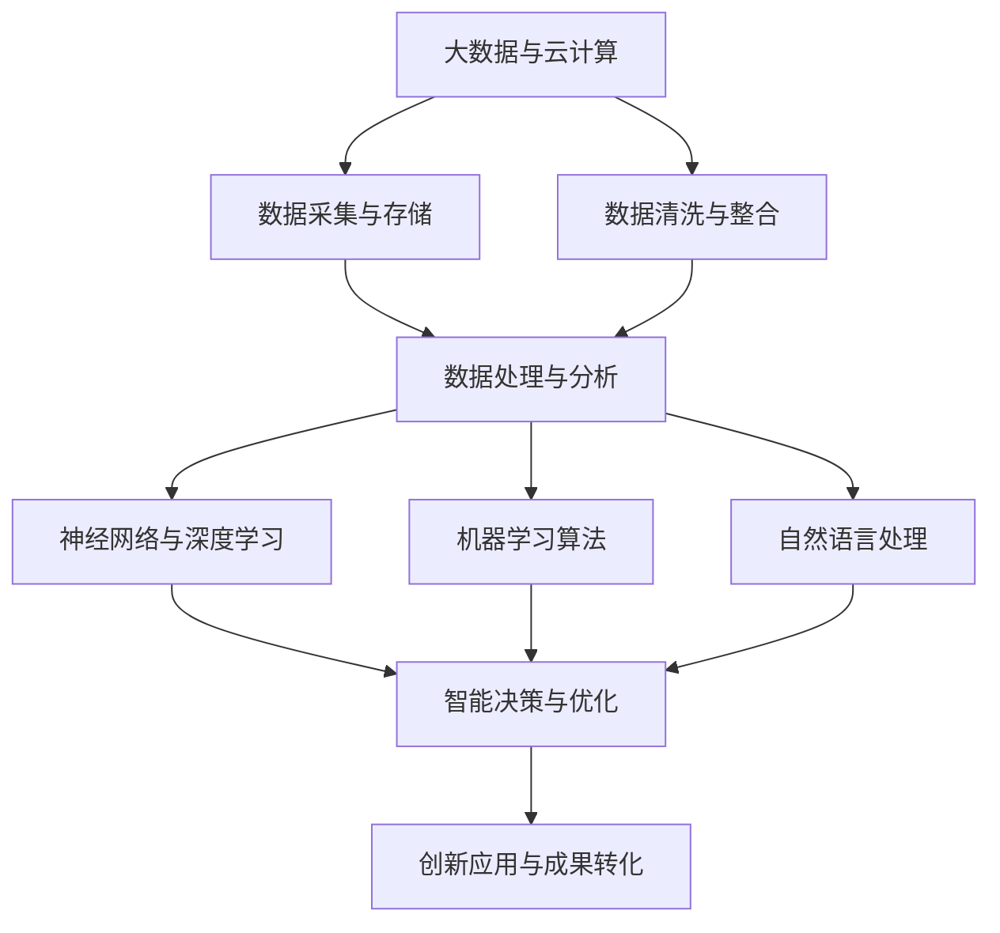

                 

### 《全球脑创新:加速人类进步的引擎》

关键词：全球脑创新、人工智能、深度学习、大数据、云计算、技术创新、进步引擎

摘要：
本文旨在深入探讨全球脑创新这一概念，分析其背景、原理、应用以及未来趋势。通过详细阐述全球脑创新的核心原理、关键算法以及实际应用案例，揭示其如何成为加速人类进步的重要引擎。文章最后，将讨论全球脑创新的战略与策略，以及其在不同领域的影响，为读者提供一个全面而深刻的理解。

### 《全球脑创新:加速人类进步的引擎》目录大纲

#### 第一部分：全球脑创新的概念与背景

##### 第1章：全球脑创新概述

**1.1 全球脑创新的起源与发展**

- **1.1.1 全球脑创新的概念**
- **1.1.2 全球脑创新的发展历程**
- **1.1.3 全球脑创新的关键特征**

**1.2 全球脑创新的驱动因素**

- **1.2.1 科技进步的作用**
- **1.2.2 社会变革的影响**
- **1.2.3 企业竞争的驱动**

**1.3 全球脑创新的重要领域**

- **1.3.1 人工智能与机器学习**
- **1.3.2 生物技术与医疗健康**
- **1.3.3 新能源与环保技术**

#### 第二部分：全球脑创新的原理与架构

##### 第2章：全球脑创新的核心原理

**2.1 全球脑创新的原理概述**

- **2.1.1 大数据与云计算的关系**
- **2.1.2 神经网络与深度学习的基本原理**
- **2.1.3 全球脑创新的核心算法**

**2.2 全球脑创新的架构设计**

- **2.2.1 全球脑创新的系统架构**
- **2.2.2 网络架构与数据流设计**
- **2.2.3 硬件架构与性能优化**

**2.3 全球脑创新的创新模型**

- **2.3.1 创新思维的培养**
- **2.3.2 创新流程的管理**
- **2.3.3 创新成果的转化与应用**

#### 第三部分：全球脑创新的应用案例与实践

##### 第3章：全球脑创新的应用案例

**3.1 人工智能在工业自动化中的应用**

- **3.1.1 机器视觉与智能制造**
- **3.1.2 机器人技术与自动化生产线**
- **3.1.3 人工智能在工业自动化中的挑战与机遇**

**3.2 生物技术在医疗健康领域的应用**

- **3.2.1 基因编辑与个性化医疗**
- **3.2.2 生物信息学与药物研发**
- **3.2.3 生物技术在医疗健康领域的挑战与前景**

**3.3 新能源与环保技术的创新应用**

- **3.3.1 电动汽车与能源互联网**
- **3.3.2 太阳能与风能的应用**
- **3.3.3 环保技术创新与可持续发展**

#### 第四部分：全球脑创新的未来趋势与挑战

##### 第4章：全球脑创新的未来趋势

**4.1 全球脑创新的技术趋势**

- **4.1.1 量子计算的突破**
- **4.1.2 人工智能的伦理问题**
- **4.1.3 跨学科融合的趋势**

**4.2 全球脑创新的产业趋势**

- **4.2.1 全球产业格局的变化**
- **4.2.2 创新型企业的崛起**
- **4.2.3 全球创新合作的加强**

**4.3 全球脑创新的社会影响**

- **4.3.1 对就业市场的影响**
- **4.3.2 对教育体系的影响**
- **4.3.3 对社会治理的影响**

#### 第五部分：全球脑创新的战略与策略

##### 第5章：全球脑创新的战略与策略

**5.1 全球脑创新的战略规划**

- **5.1.1 企业创新战略的制定**
- **5.1.2 政策环境与市场分析**
- **5.1.3 创新资源的管理与配置**

**5.2 全球脑创新的商业模式创新**

- **5.2.1 创新商业模式的概念与类型**
- **5.2.2 商业模式的创新路径**
- **5.2.3 创新商业模式的案例分析**

**5.3 全球脑创新的合作与竞争**

- **5.3.1 全球创新合作的方式**
- **5.3.2 国际创新竞争的趋势**
- **5.3.3 跨国企业的创新战略**

#### 附录

**附录A：全球脑创新的资源与工具**

- **A.1 开源框架与工具介绍**
- **A.2 创新研究机构与学术资源**
- **A.3 创新实践平台与案例库**

**附录B：全球脑创新的参考书目与文献**

- **B.1 创新理论与方法论**
- **B.2 人工智能与深度学习**
- **B.3 生物技术与医疗健康**
- **B.4 新能源与环保技术**

**附录C：全球脑创新的实践指南**

- **C.1 创新项目的规划与实施**
- **C.2 创新团队的组建与运作**
- **C.3 创新成果的评估与转化**

**Mermaid 流程图：全球脑创新核心原理流程图**

mermaid
graph TD
    A[全球脑创新原理] --> B[大数据与云计算]
    B --> C[神经网络与深度学习]
    C --> D[全球脑创新核心算法]
    D --> E[创新模型与架构设计]
    E --> F[创新思维与流程管理]
    F --> G[创新成果转化与应用]

### 第一部分：全球脑创新的概念与背景

#### 第1章：全球脑创新概述

##### 1.1 全球脑创新的起源与发展

全球脑创新的概念起源于20世纪末，随着信息技术和生物技术的快速发展，人类开始探索如何将大脑的智能能力进行模拟和增强。这一概念最早由科学家霍金和计算机科学家约翰·霍普菲尔德提出，他们设想通过连接全球的计算资源，构建一个类似于人脑的智能系统，以实现更高效的信息处理和智能决策。

自提出以来，全球脑创新得到了广泛关注和研究。在21世纪初，随着云计算、大数据、物联网等技术的兴起，全球脑创新的理论研究和实践应用得到了迅速发展。各国政府和科研机构纷纷投入大量资源进行研究和开发，旨在推动全球脑创新技术的进步和应用。

全球脑创新的发展历程可以分为以下几个阶段：

1. **概念提出阶段（20世纪末）**：全球脑创新的概念被首次提出，科学家们开始探索如何模拟人脑的智能能力。

2. **理论研究阶段（21世纪初）**：随着信息技术的快速发展，全球脑创新的理论研究得到了广泛关注。科学家们开始研究如何利用云计算、大数据等技术构建全球脑创新系统。

3. **实践应用阶段（21世纪10年代至今）**：随着技术的不断进步，全球脑创新的应用开始逐步落地。人工智能、生物技术、新能源等领域都涌现出了许多创新成果，推动了全球脑创新的实践应用。

4. **规模化发展阶段（未来）**：随着全球脑创新技术的不断成熟，预计未来将实现更大规模的应用，进一步推动人类社会的发展和进步。

##### 1.1.1 全球脑创新的概念

全球脑创新是指通过连接全球的计算资源、数据资源和智能资源，构建一个高度智能化、协同化、自主化的全球智能系统，以实现更高效的信息处理、智能决策和创新发展。全球脑创新的核心目标是模拟人脑的智能能力，实现人类智慧的扩展和提升。

全球脑创新的核心概念包括以下几个方面：

1. **全球计算资源**：全球脑创新需要连接全球的计算资源，包括云计算、分布式计算、量子计算等，以实现强大的计算能力。

2. **大数据资源**：全球脑创新需要处理和利用海量的数据资源，包括结构化数据、半结构化数据和非结构化数据，以提供丰富的数据支持。

3. **智能资源**：全球脑创新需要结合人工智能、生物技术、物联网等先进技术，构建具有自主学习、自适应和自主决策能力的智能系统。

4. **协同化**：全球脑创新强调不同计算资源、数据资源和智能资源的协同化，以实现更高的效率和智能化。

5. **自主化**：全球脑创新强调系统的自主化，包括自主决策、自主学习和自主优化，以提高系统的自适应能力和创新能力。

##### 1.1.2 全球脑创新的发展历程

全球脑创新的发展历程可以追溯到20世纪末，当时科学家们开始探索如何模拟人脑的智能能力。以下是全球脑创新发展历程的几个关键阶段：

1. **20世纪80年代**：神经科学和计算机科学开始交叉融合，科学家们开始研究神经网络和机器学习算法，为全球脑创新奠定了基础。

2. **20世纪90年代**：随着互联网的兴起，科学家们开始探索如何利用互联网连接全球的计算资源，为全球脑创新提供了新的思路。

3. **21世纪初**：随着云计算、大数据、物联网等技术的快速发展，全球脑创新的理论研究和实践应用开始得到广泛关注。各国政府和科研机构纷纷投入大量资源进行研究和开发。

4. **2010年代**：全球脑创新的实践应用开始逐步落地，人工智能、生物技术、新能源等领域都涌现出了许多创新成果。全球脑创新开始成为推动社会进步和经济发展的重要力量。

5. **未来**：随着全球脑创新技术的不断成熟，预计未来将实现更大规模的应用，进一步推动人类社会的发展和进步。

##### 1.1.3 全球脑创新的关键特征

全球脑创新具有以下几个关键特征：

1. **高度智能化**：全球脑创新通过模拟人脑的智能能力，实现了高度智能化的信息处理和决策。

2. **协同化**：全球脑创新强调不同计算资源、数据资源和智能资源的协同化，以提高系统的效率和智能化。

3. **自主化**：全球脑创新强调系统的自主化，包括自主决策、自主学习和自主优化，以提高系统的自适应能力和创新能力。

4. **开放性**：全球脑创新通过连接全球的计算资源、数据资源和智能资源，实现了高度的开放性，促进了全球范围内的合作和创新。

5. **可持续性**：全球脑创新通过利用大数据和人工智能技术，实现了资源的有效利用和优化，促进了社会的可持续发展和进步。

##### 1.2 全球脑创新的驱动因素

全球脑创新的快速发展受到多种驱动因素的影响，主要包括科技进步、社会变革和企业竞争。

1. **科技进步**

科技进步是推动全球脑创新发展的核心动力。随着信息技术的不断进步，特别是云计算、大数据、人工智能等关键技术的突破，为全球脑创新提供了强大的技术支撑。云计算提供了海量的计算资源和存储资源，使得全球脑创新系统的构建成为可能。大数据技术的发展使得海量的数据资源得以有效利用，为全球脑创新提供了丰富的数据支持。人工智能技术的突破使得机器能够模拟人脑的智能能力，实现了高度智能化的信息处理和决策。

2. **社会变革**

社会变革是推动全球脑创新发展的外部环境因素。全球化进程的加速、互联网的普及以及大数据时代的到来，都为社会变革提供了强大的推动力。全球化进程使得全球范围内的合作和交流变得更加便捷，为全球脑创新提供了广阔的市场和合作机会。互联网的普及使得信息传播速度大幅提升，促进了知识的传播和共享，为全球脑创新提供了丰富的知识资源。大数据时代的到来使得海量数据的收集、存储和分析成为可能，为全球脑创新提供了丰富的数据支持。

3. **企业竞争**

企业竞争是推动全球脑创新发展的内部动力。在竞争激烈的市场环境中，企业需要不断创新以保持竞争优势。全球脑创新为企业提供了强大的创新能力和创新资源，使得企业能够更快地响应市场需求，开发出更具竞争力的产品和服务。同时，企业之间的竞争也推动了全球脑创新技术的不断进步，通过竞争和创新，企业不断提升自身的创新能力，推动了全球脑创新的快速发展。

##### 1.3 全球脑创新的重要领域

全球脑创新的应用领域广泛，涵盖了人工智能、生物技术、新能源等多个重要领域。以下是全球脑创新在这些领域的主要应用：

1. **人工智能与机器学习**

人工智能和机器学习是全球脑创新的核心领域之一。通过模拟人脑的智能能力，人工智能和机器学习技术能够实现高度智能化的信息处理和决策。在全球脑创新的推动下，人工智能和机器学习技术在各个领域得到了广泛应用，如自然语言处理、计算机视觉、自动驾驶等。通过全球脑创新，人工智能和机器学习技术得以不断进步，为人类社会的发展带来了巨大的变革。

2. **生物技术与医疗健康**

生物技术是另一个重要的全球脑创新领域。通过全球脑创新，生物技术得以在医疗健康领域发挥巨大作用。基因编辑技术的突破使得人类能够更精确地修改基因序列，为治疗遗传病和开发新药提供了可能性。生物信息学的发展使得海量的生物数据得以有效分析，为医学研究提供了强大的支持。全球脑创新在医疗健康领域的应用不仅提高了诊断和治疗的效率，还推动了个性化医疗的发展。

3. **新能源与环保技术**

新能源和环保技术是全球脑创新的另一个重要领域。通过全球脑创新，新能源技术得以快速发展，如太阳能、风能、电动汽车等。全球脑创新为新能源技术的研发和应用提供了强大的支持，推动了能源结构的转型和环保事业的发展。同时，全球脑创新还推动了环保技术的创新，如废水处理、垃圾分类等，为可持续发展和环境保护做出了重要贡献。

##### 1.3.1 人工智能与机器学习

人工智能（AI）和机器学习（ML）是当今科技领域最热门的研究方向之一。人工智能是指通过计算机模拟人类智能行为的技术，包括感知、理解、推理、学习、决策等。而机器学习是人工智能的一个分支，主要研究如何从数据中自动学习规律和模式，并利用这些规律和模式进行预测和决策。

人工智能和机器学习在全球脑创新中发挥着至关重要的作用。首先，人工智能和机器学习技术能够处理和分析海量数据，为全球脑创新提供了强大的数据支持。其次，人工智能和机器学习技术能够模拟人脑的智能能力，实现高度智能化的信息处理和决策，为全球脑创新提供了核心技术支持。最后，人工智能和机器学习技术在全球脑创新中的应用不仅推动了技术创新，还促进了社会的发展和进步。

以下是人工智能和机器学习在全球脑创新中的主要应用：

1. **自然语言处理（NLP）**

自然语言处理是人工智能和机器学习的一个重要应用领域。通过NLP技术，计算机能够理解和处理人类自然语言，实现人机交互。NLP技术在智能客服、机器翻译、情感分析等领域得到了广泛应用。全球脑创新推动了NLP技术的不断进步，使得计算机能够更准确地理解人类语言，提高了人机交互的效率和质量。

2. **计算机视觉（CV）**

计算机视觉是人工智能和机器学习的另一个重要应用领域。通过计算机视觉技术，计算机能够识别和理解图像和视频中的内容。计算机视觉技术在图像识别、目标检测、视频分析等领域得到了广泛应用。全球脑创新推动了计算机视觉技术的不断发展，使得计算机能够更准确地识别和理解图像和视频中的信息，提高了计算机视觉系统的性能和应用范围。

3. **自动驾驶（AD）**

自动驾驶是人工智能和机器学习的又一个重要应用领域。通过自动驾驶技术，汽车能够自主感知环境、规划路径、控制驾驶，实现无人驾驶。自动驾驶技术在智能交通、物流运输、安全驾驶等领域具有广泛的应用前景。全球脑创新推动了自动驾驶技术的不断进步，使得自动驾驶汽车能够更安全、更高效地运行，为智能交通和智慧城市的发展提供了重要支撑。

4. **金融科技（FinTech）**

金融科技是人工智能和机器学习在全球脑创新中的重要应用领域。通过人工智能和机器学习技术，金融科技能够实现智能风险管理、精准营销、智能投顾等功能。金融科技在支付、借贷、投资、保险等领域具有广泛的应用，为金融行业的创新和发展提供了强大动力。

5. **医疗健康**

人工智能和机器学习在医疗健康领域具有广泛的应用前景。通过人工智能和机器学习技术，可以实现医学影像分析、疾病预测、药物研发等功能。全球脑创新推动了医疗健康领域的技术进步，为疾病的早期诊断、精准治疗和个性化医疗提供了支持。

##### 1.3.2 生物技术与医疗健康

生物技术是利用生物学、化学、物理学等科学原理和方法，通过生物体或其组成部分来制造产品、改良生物特性或进行疾病治疗的技术。生物技术在医疗健康领域具有广泛的应用，通过全球脑创新的推动，生物技术取得了显著的进展。

1. **基因编辑技术**

基因编辑技术是生物技术领域的重要突破，通过精确修改基因序列，可以治疗遗传病、癌症等疾病。全球脑创新推动了基因编辑技术的快速发展，如CRISPR-Cas9技术的应用，使得基因编辑变得更加高效和准确。

2. **生物信息学**

生物信息学是生物技术和计算机科学交叉的领域，通过分析大量的生物数据，如基因组序列、蛋白质结构等，可以揭示生物体的功能和机制。全球脑创新为生物信息学提供了强大的计算资源和算法支持，使得生物信息学研究取得了重要突破。

3. **个性化医疗**

个性化医疗是根据患者的个体差异，提供定制化的诊断、治疗和护理方案。全球脑创新通过大数据和人工智能技术，可以实现个性化医疗的精准诊断和精准治疗，提高了医疗效果和患者满意度。

4. **医疗影像分析**

医疗影像分析是利用计算机视觉和深度学习技术，对医学影像进行分析，辅助医生进行诊断和治疗。全球脑创新推动了医疗影像分析技术的发展，如肺癌早期筛查、乳腺癌诊断等，提高了医学影像的准确性和效率。

##### 1.3.3 新能源与环保技术

新能源与环保技术是全球脑创新的另一个重要领域，通过利用可再生能源和先进环保技术，实现能源的可持续发展和环境保护。全球脑创新为新能源与环保技术的研发和应用提供了强大的支持。

1. **太阳能技术**

太阳能技术通过将太阳能转化为电能，实现清洁能源的利用。全球脑创新推动了太阳能技术的进步，如高效太阳能电池的研究和开发，提高了太阳能的转换效率和稳定性。

2. **风能技术**

风能技术通过将风能转化为电能，实现清洁能源的利用。全球脑创新推动了风能技术的进步，如风力发电机的优化设计和风能资源的合理布局，提高了风能的利用效率和稳定性。

3. **电动汽车技术**

电动汽车技术通过使用电力驱动，实现零排放的汽车交通。全球脑创新推动了电动汽车技术的进步，如电池技术、电机控制技术、充电基础设施等方面的研究，提高了电动汽车的性能和用户体验。

4. **环保技术创新**

环保技术创新通过开发新型材料和工艺，实现污染物的治理和资源的高效利用。全球脑创新推动了环保技术的创新，如废水处理、废气治理、垃圾分类等，为环境保护和可持续发展做出了重要贡献。

#### 第二部分：全球脑创新的原理与架构

##### 第2章：全球脑创新的核心原理

##### 2.1 全球脑创新的原理概述

全球脑创新的核心原理涉及多个关键领域，包括大数据与云计算的关系、神经网络与深度学习的基本原理以及全球脑创新的核心算法。这些原理共同构成了全球脑创新的技术基础，使得这一创新模式能够高效地处理海量数据、模拟人脑智能，并推动各领域的创新发展。

###### 2.1.1 大数据与云计算的关系

大数据与云计算的关系是理解全球脑创新的关键之一。大数据指的是海量、多样化和高速增长的数据集合，而云计算则提供了弹性、可扩展的计算和存储资源。大数据和云计算的结合，使得全球脑创新能够充分利用分布式计算和存储能力，实现对海量数据的快速处理和分析。

- **数据存储和处理能力**：云计算提供了弹性的计算和存储资源，使得大数据能够被高效地存储和处理。云计算平台可以根据需求动态分配计算资源，确保数据处理的高效性和灵活性。

- **分布式计算**：大数据处理通常需要分布式计算架构，云计算平台能够提供分布式计算框架，如Hadoop和Spark，以实现并行处理和分布式存储。

- **数据分析和挖掘**：云计算平台提供了丰富的数据分析工具和算法库，如MapReduce、机器学习算法等，使得大数据的分析和挖掘变得更加便捷和高效。

###### 2.1.2 神经网络与深度学习的基本原理

神经网络（Neural Networks）是模拟人脑神经元结构和功能的计算模型，而深度学习（Deep Learning）是神经网络的一种扩展，通过多层神经网络来模拟人脑的复杂信息处理能力。神经网络和深度学习在全球脑创新中扮演着重要角色，为数据分析和智能决策提供了强大的技术支持。

- **神经网络的基本结构**：神经网络由多个层次组成，包括输入层、隐藏层和输出层。每个层次由多个神经元组成，神经元之间通过连接（权重）传递信息。

- **激活函数**：激活函数用于决定神经元是否被激活，常用的激活函数包括Sigmoid、ReLU和Tanh等。

- **反向传播算法**：反向传播算法是神经网络训练的核心算法，通过计算误差梯度来更新网络权重，从而优化网络性能。

- **深度学习的基本原理**：深度学习通过多层神经网络来学习数据的层次化特征，每一层都提取更高层次的特征表示。深度学习算法包括卷积神经网络（CNN）、循环神经网络（RNN）和生成对抗网络（GAN）等。

###### 2.1.3 全球脑创新的核心算法

全球脑创新的核心算法包括深度学习算法、强化学习算法和自然语言处理算法等，这些算法在全球脑创新中发挥着重要作用，推动了人工智能技术的进步和应用。

- **深度学习算法**：深度学习算法通过多层神经网络学习数据的特征表示，广泛应用于图像识别、语音识别和自然语言处理等领域。

- **强化学习算法**：强化学习算法通过与环境交互，学习最优策略，广泛应用于机器人控制、自动驾驶和游戏AI等领域。

- **自然语言处理算法**：自然语言处理算法通过模拟人类语言处理过程，实现对文本的语义理解和信息提取，广泛应用于机器翻译、文本分类和对话系统等领域。

##### 2.2 全球脑创新的架构设计

全球脑创新的架构设计是实现其核心原理和算法的关键。一个有效的全球脑创新架构需要考虑系统架构、网络架构与数据流设计以及硬件架构与性能优化等多个方面。

###### 2.2.1 全球脑创新的系统架构

全球脑创新的系统架构通常包括以下几个层次：

- **数据层**：数据层是整个系统的基础，包括数据采集、数据存储和数据管理。数据采集环节负责收集来自各种来源的数据，如传感器、互联网日志、用户行为等。数据存储环节使用分布式存储系统，如Hadoop和NoSQL数据库，来存储海量数据。数据管理环节则负责数据的清洗、整合和管理。

- **计算层**：计算层包括数据处理和分析的算法和模型。计算层利用云计算平台提供的计算资源，通过分布式计算框架，如MapReduce和Spark，对数据进行处理和分析。深度学习算法、机器学习算法和自然语言处理算法等在计算层发挥作用。

- **应用层**：应用层是面向用户的服务和应用，如智能客服、智能推荐、自动驾驶等。应用层利用计算层提供的数据分析和决策支持，为用户提供定制化的服务和体验。

###### 2.2.2 网络架构与数据流设计

网络架构与数据流设计是确保全球脑创新系统高效运行的关键。一个有效的网络架构需要考虑数据传输、处理和存储的效率和可靠性。

- **数据传输**：数据传输需要使用高效的传输协议和算法，如HTTP/2和QUIC，以减少延迟和带宽消耗。分布式数据传输协议，如MPI（Message Passing Interface），可以用于在多台计算机之间高效传输数据。

- **数据处理**：数据处理需要使用分布式计算框架，如Spark和Hadoop，以实现并行处理和高效计算。数据处理环节还需要考虑负载均衡和资源调度，以充分利用计算资源。

- **数据存储**：数据存储需要使用分布式存储系统，如Hadoop的HDFS（Hadoop Distributed File System）和NoSQL数据库，以提高存储效率和可靠性。数据存储还需要考虑数据的备份和恢复机制，以确保数据的安全和可用性。

###### 2.2.3 硬件架构与性能优化

硬件架构与性能优化是确保全球脑创新系统高效运行的重要方面。硬件架构需要考虑计算资源、存储资源和网络资源的配置。

- **计算资源**：计算资源包括CPU、GPU和TPU等。CPU主要用于执行通用计算任务，GPU和TPU则适用于并行计算和机器学习任务。根据应用需求，合理配置计算资源，可以显著提高系统的处理能力和性能。

- **存储资源**：存储资源包括硬盘、固态硬盘和分布式存储系统等。硬盘和固态硬盘提供大容量和高速度的存储，分布式存储系统则提供高可靠性和高可扩展性的存储能力。根据数据量和访问模式，选择合适的存储设备，可以提高数据存储和读取的效率。

- **网络资源**：网络资源包括局域网、广域网和云计算平台等。局域网用于连接内部设备和资源，广域网用于连接外部资源和互联网，云计算平台则提供弹性的网络资源和计算资源。根据应用需求，合理配置网络资源，可以提高数据传输和计算的效率。

- **性能优化**：性能优化包括算法优化、系统优化和硬件优化等。算法优化通过改进算法和模型，提高数据处理和计算效率。系统优化通过优化操作系统和中间件，减少系统开销和资源消耗。硬件优化通过升级硬件设备和技术，提高计算和存储的性能。

##### 2.3 全球脑创新的创新模型

全球脑创新的创新模型是指通过系统的思维方法和管理流程，推动创新活动从创意产生到成果转化的全过程。一个有效的创新模型需要考虑创新思维的培养、创新流程的管理和创新成果的转化与应用。

###### 2.3.1 创新思维的培养

创新思维是推动全球脑创新的重要基础。创新思维的培养包括以下几个方面：

- **跨界思维**：跨界思维是指将不同领域、不同行业的知识和技术进行整合，以产生新的创新点。通过跨界思维，可以打破传统领域的界限，发现新的应用场景和解决方案。

- **系统思维**：系统思维是指从整体的角度考虑问题，分析各个组成部分之间的相互关系和影响。通过系统思维，可以更好地理解复杂系统的运作机制，发现潜在的创新机会。

- **用户导向思维**：用户导向思维是指以用户需求为导向，关注用户体验和满意度。通过用户导向思维，可以更好地理解用户需求，提供更符合用户期望的创新产品和服务。

- **实验思维**：实验思维是指通过实验和验证来探索新的创新方案。通过实验思维，可以快速迭代和优化创新方案，提高创新的可行性和成功率。

###### 2.3.2 创新流程的管理

创新流程的管理是指通过系统的方法和流程，确保创新活动的高效和有序进行。创新流程的管理包括以下几个方面：

- **创意产生**：创意产生是指通过头脑风暴、创意征集等方式，激发团队成员的创新思维，产生新的创意点子。

- **创意筛选**：创意筛选是指对产生的创意进行评估和筛选，选择具有可行性和商业价值的创意进行进一步开发。

- **创意开发**：创意开发是指对筛选出的创意进行深入研究和开发，包括技术实现、原型设计和测试等。

- **成果转化**：成果转化是指将创新成果应用到实际生产或服务中，实现商业价值和社会效益。成果转化需要考虑市场接受度、成本效益和可持续性等因素。

###### 2.3.3 创新成果的转化与应用

创新成果的转化与应用是衡量全球脑创新成功与否的重要标准。创新成果的转化与应用包括以下几个方面：

- **技术转移**：技术转移是指将创新成果从实验室或研究机构转移到实际生产或服务中。技术转移需要考虑技术可行性、市场需求和法律法规等因素。

- **商业模式创新**：商业模式创新是指通过创新商业模型，实现创新成果的商业化。商业模式创新需要考虑市场定位、客户需求、收入来源和成本控制等因素。

- **市场推广**：市场推广是指通过市场营销手段，将创新成果推向市场，实现销售和用户覆盖。市场推广需要考虑品牌建设、市场定位、营销策略和用户反馈等因素。

- **用户体验优化**：用户体验优化是指通过用户反馈和数据分析，不断改进和创新产品和服务，提高用户体验和满意度。用户体验优化需要考虑用户需求、用户行为和用户体验反馈等因素。

#### 第三部分：全球脑创新的应用案例与实践

##### 第3章：全球脑创新的应用案例

##### 3.1 人工智能在工业自动化中的应用

随着人工智能技术的不断进步，其在工业自动化中的应用越来越广泛。人工智能在工业自动化中的应用不仅提高了生产效率，还降低了成本，为企业带来了巨大的经济效益。以下是人工智能在工业自动化中的几个关键应用领域：

###### 3.1.1 机器视觉与智能制造

机器视觉是人工智能在工业自动化中的一个重要应用领域。通过计算机视觉技术，机器视觉系统可以自动识别和检测生产过程中的各种缺陷和问题。例如，在汽车制造业中，机器视觉系统可以检测车身表面的划痕和损伤，确保生产出高质量的产品。

智能制造是工业自动化的发展趋势，通过人工智能技术，可以实现生产过程的智能化和自动化。智能制造系统集成了机器视觉、传感器、物联网等先进技术，能够实时监控生产过程，并根据实时数据做出调整。例如，在智能工厂中，通过人工智能算法，可以优化生产线的运行效率，减少停机时间，提高生产效率。

###### 3.1.2 机器人技术与自动化生产线

机器人技术是工业自动化的重要组成部分。现代工业机器人具有高度的灵活性和适应性，可以执行重复性高、危险或难以完成的工作。例如，在电子制造业中，机器人可以完成装配、焊接和测试等工作，提高了生产效率和产品质量。

自动化生产线是工业自动化的核心，通过机器人、自动化设备和计算机控制技术，实现生产过程的自动化和连续化。自动化生产线能够减少人力成本，提高生产效率和产品质量，同时降低生产风险。例如，在汽车制造业中，自动化生产线可以实现从零部件装配到整车组装的全过程自动化，大大提高了生产效率。

###### 3.1.3 人工智能在工业自动化中的挑战与机遇

人工智能在工业自动化中的应用面临着一系列挑战和机遇。以下是一些关键挑战和机遇：

- **挑战**：
  1. **数据隐私和安全性**：工业自动化系统中涉及大量的敏感数据，如生产数据、质量控制数据和用户数据等。如何确保这些数据的安全和隐私是一个重要挑战。
  2. **技术成熟度**：虽然人工智能技术在不断进步，但某些技术仍然不够成熟，特别是在复杂环境下的应用。
  3. **系统集成**：工业自动化系统通常涉及多种技术，如传感器、机器人、计算机控制系统等。如何实现这些系统的有效集成和协同工作是一个挑战。

- **机遇**：
  1. **生产效率提升**：通过人工智能技术，可以优化生产过程，提高生产效率，降低成本。
  2. **产品质量提升**：人工智能技术可以帮助实现更精准的质量控制，提高产品质量。
  3. **工作环境改善**：通过自动化和智能化技术，可以减少工人的重复性工作和危险工作，改善工作环境。

##### 3.2 生物技术在医疗健康领域的应用

生物技术是医疗健康领域的重要推动力量，通过全球脑创新的推动，生物技术取得了显著进展。以下是生物技术在医疗健康领域的几个关键应用领域：

###### 3.2.1 基因编辑与个性化医疗

基因编辑技术，如CRISPR-Cas9，是一种革命性的生物技术，它通过精确修改基因序列，可以治疗遗传病和某些类型的癌症。基因编辑技术在医疗健康领域的应用前景广阔，例如，它可以治疗囊性纤维化、血友病等遗传性疾病，还可以用于癌症治疗，通过修改癌细胞的基因，使其失去生长和扩散的能力。

个性化医疗是生物技术在医疗健康领域的另一个重要应用。通过基因测序和大数据分析，医生可以为每个患者制定个性化的治疗方案。个性化医疗不仅提高了治疗的效果，还减少了不必要的药物副作用和医疗资源浪费。例如，通过分析患者的基因信息，医生可以为患者选择最适合的药物和剂量，提高治疗的成功率。

###### 3.2.2 生物信息学与药物研发

生物信息学是生物技术的一个重要分支，它利用计算机科学和信息技术来处理和分析生物数据。在药物研发中，生物信息学发挥了关键作用。通过分析基因序列、蛋白质结构和代谢途径等数据，科学家可以识别潜在的药物靶点，预测药物的效果和副作用。

生物信息学技术还可以加速药物研发过程。通过高通量测序技术，科学家可以在较短的时间内获取大量的基因数据，从而加速新药的发现和开发。例如，生物信息学技术可以帮助科学家快速筛选和验证潜在药物分子，缩短药物研发周期。

###### 3.2.3 生物技术在医疗健康领域的挑战与前景

生物技术在医疗健康领域的应用面临着一系列挑战和前景。以下是一些关键挑战和前景：

- **挑战**：
  1. **技术成熟度**：虽然生物技术取得了显著进展，但某些技术仍然不够成熟，特别是在临床应用方面。
  2. **伦理问题**：基因编辑技术等生物技术的应用引发了一系列伦理问题，如基因编辑的安全性和道德问题。
  3. **成本问题**：生物技术的研发和应用通常成本高昂，如何降低成本是一个重要挑战。

- **前景**：
  1. **个性化医疗**：个性化医疗的发展将带来更加精准和有效的治疗方案，提高医疗服务的质量。
  2. **新药研发**：生物信息学和大数据分析技术将加速新药的发现和开发，降低药物研发成本。
  3. **疾病预防**：生物技术可以帮助开发更有效的疫苗和预防措施，提高疾病的预防和控制水平。

##### 3.3 新能源与环保技术的创新应用

新能源与环保技术是应对全球能源危机和环境污染问题的重要手段。通过全球脑创新的推动，新能源与环保技术取得了显著进展。以下是新能源与环保技术的几个关键应用领域：

###### 3.3.1 电动汽车与能源互联网

电动汽车是新能源技术的重要应用领域。电动汽车通过电池提供动力，零排放、低噪音，对环境污染较小。随着电池技术的进步和电动汽车产业链的成熟，电动汽车的市场份额逐渐增加。电动汽车不仅有助于减少对化石燃料的依赖，还可以改善城市空气质量。

能源互联网是新能源技术的重要组成部分，它通过信息通信技术将各种能源资源、能源设备和能源用户连接起来，实现能源的智能化管理和高效利用。能源互联网可以优化能源分配，提高能源利用效率，促进可再生能源的大规模应用。

###### 3.3.2 太阳能与风能的应用

太阳能和风能是可再生能源的重要形式。太阳能通过光伏发电技术将太阳光转化为电能，风能通过风力发电技术将风的动能转化为电能。太阳能和风能具有清洁、可再生、分布广泛等优点，是应对全球能源危机的重要手段。

太阳能光伏发电技术已经相对成熟，广泛应用于家庭、商业和工业等领域。风力发电技术也在不断进步，大型风力发电机组和海上风力发电场的建设推动了风能的大规模应用。

###### 3.3.3 环保技术创新与可持续发展

环保技术创新是推动可持续发展和环境保护的重要手段。通过全球脑创新的推动，环保技术取得了显著进展。以下是一些关键的环保技术创新：

- **废水处理**：废水处理技术通过物理、化学和生物方法，将废水转化为可回收利用的水资源。先进的废水处理技术如膜分离技术、高级氧化技术等，可以处理各种类型的废水，提高废水处理效率。

- **废气治理**：废气治理技术通过物理、化学和生物方法，将工业生产过程中产生的废气进行处理，减少对环境的污染。例如，烟气脱硫技术、挥发性有机物（VOCs）治理技术等，可以有效地减少工业废气排放。

- **垃圾分类与资源回收**：垃圾分类与资源回收技术通过分类和回收处理，将生活垃圾转化为可回收资源和能源。垃圾分类与资源回收技术不仅可以减少垃圾填埋和焚烧带来的环境污染，还可以提高资源的利用率。

- **碳捕获与封存（CCS）**：碳捕获与封存技术通过捕获和存储工业生产过程中产生的二氧化碳，减少温室气体排放。碳捕获与封存技术对于应对全球气候变化具有重要意义。

- **绿色建筑**：绿色建筑通过采用节能材料、优化建筑设计、提高能源利用效率等手段，实现建筑行业的可持续发展。绿色建筑可以减少能源消耗和碳排放，改善室内环境质量。

##### 3.3.4 新能源与环保技术的挑战与前景

新能源与环保技术的应用面临着一系列挑战和前景。以下是一些关键挑战和前景：

- **挑战**：
  1. **技术成熟度**：新能源与环保技术仍处于发展阶段，某些技术尚未完全成熟，需要进一步研究和改进。
  2. **成本问题**：新能源与环保技术的成本较高，需要降低成本以实现大规模应用。
  3. **政策支持**：新能源与环保技术需要政策支持，如财政补贴、税收减免等，以促进其发展。
  4. **市场接受度**：新能源与环保技术的市场接受度相对较低，需要提高公众对新能源与环保技术的认知和接受度。

- **前景**：
  1. **能源结构转型**：随着全球能源需求的增长和环保意识的提高，新能源与环保技术将逐步取代传统的化石能源，推动能源结构转型。
  2. **可持续发展**：新能源与环保技术的应用将有助于实现可持续发展目标，减少对自然资源的依赖，降低环境污染。
  3. **经济增长**：新能源与环保技术的研发和应用将创造新的经济增长点，推动相关产业的发展。
  4. **国际合作**：全球范围内的合作将有助于加速新能源与环保技术的研发和应用，共同应对全球环境和能源挑战。

#### 第四部分：全球脑创新的未来趋势与挑战

##### 第4章：全球脑创新的未来趋势

全球脑创新作为推动人类社会进步的重要引擎，其未来发展趋势和前景备受关注。本节将探讨全球脑创新在技术、产业和社会等方面的发展趋势，以及可能面临的挑战。

##### 4.1 全球脑创新的技术趋势

全球脑创新的技术趋势主要体现在以下几个方面：

###### 4.1.1 量子计算的突破

量子计算是一种基于量子力学原理的新型计算模式，具有超强的计算能力。量子计算机可以通过并行处理和量子叠加，实现指数级的计算速度提升。量子计算的发展将为全球脑创新带来革命性的变化，特别是在密码学、材料科学、药物研发等领域。

目前，量子计算技术仍处于早期阶段，但已经有多个国家和公司投入大量资源进行研究和开发。随着量子计算机的性能不断提升，预计将在未来几年内取得重要突破。

###### 4.1.2 人工智能的伦理问题

人工智能的快速发展引发了诸多伦理和社会问题。人工智能的伦理问题包括数据隐私、算法偏见、自主决策等。全球脑创新需要充分考虑这些伦理问题，确保人工智能技术的可持续发展。

未来，全球脑创新将在人工智能伦理问题上取得重要进展，制定相关的伦理规范和标准，促进人工智能技术的合理使用和社会接受。

###### 4.1.3 跨学科融合的趋势

全球脑创新的未来发展将更加注重跨学科融合，结合计算机科学、生物学、物理学、心理学等领域的知识，实现更深入的创新。跨学科融合将推动全球脑创新在认知科学、神经科学、人工智能等领域的发展，促进人类对自身认知和智能的理解。

##### 4.2 全球脑创新的产业趋势

全球脑创新在产业领域的发展趋势主要体现在以下几个方面：

###### 4.2.1 全球产业格局的变化

随着全球脑创新技术的不断进步，全球产业格局将发生深刻变化。传统产业将逐步被智能化、数字化所取代，新兴产业将蓬勃发展。例如，智能制造、物联网、生物技术、新能源等领域将迎来快速发展期。

全球脑创新将推动产业结构的升级和优化，提升全球经济的创新能力和竞争力。

###### 4.2.2 创新型企业的崛起

创新型企业将在全球脑创新中扮演重要角色。创新型企业通过整合全球脑创新技术，开发出具有核心竞争力的产品和服务，推动产业升级和社会进步。

未来，全球脑创新将激发更多创新型企业的崛起，推动创新创业环境的不断优化。

###### 4.2.3 全球创新合作的加强

全球脑创新的发展需要全球范围内的合作。各国政府、科研机构、企业和国际组织将加强合作，共同推动全球脑创新技术的研发和应用。

全球创新合作的加强将促进全球科技资源的共享和协同创新，提升全球脑创新的效率和质量。

##### 4.3 全球脑创新的社会影响

全球脑创新将在社会各个领域产生深远影响，主要体现在以下几个方面：

###### 4.3.1 对就业市场的影响

全球脑创新将改变就业市场的格局。一方面，新技术将创造新的就业机会，如数据科学家、机器学习工程师、人工智能伦理师等。另一方面，传统岗位将面临被取代的风险，如机械操作工、数据录入员等。

未来，社会需要加强对劳动者的培训和教育，提高他们的技能水平，以适应新的就业市场需求。

###### 4.3.2 对教育体系的影响

全球脑创新将推动教育体系的变革。教育将更加注重培养学生的创新能力和实践能力，而不仅仅是传统的知识传授。在线教育、虚拟现实、人工智能等新技术将颠覆传统的教育模式，实现教育的个性化和智能化。

未来，教育体系需要与全球脑创新技术相结合，为学生提供更多实践机会和创新平台。

###### 4.3.3 对社会治理的影响

全球脑创新将提高社会治理的效率和效果。通过大数据、人工智能等技术，政府可以更好地进行社会管理和公共服务。例如，智慧城市建设、智能交通管理、精准公共卫生等都将提高社会治理的水平和质量。

未来，社会治理需要与全球脑创新技术相结合，实现更高效、更智能的管理和服务。

#### 第五部分：全球脑创新的战略与策略

##### 第5章：全球脑创新的战略与策略

在全球脑创新的大背景下，制定有效的战略和策略对于企业、政府及研究机构来说至关重要。本章节将讨论全球脑创新的战略规划、商业模式创新、国际合作以及企业竞争等方面的内容。

##### 5.1 全球脑创新的战略规划

全球脑创新的战略规划是企业、政府及研究机构在创新过程中制定的长远目标和具体实施路径。以下是一些关键方面的战略规划：

###### 5.1.1 企业创新战略的制定

企业创新战略的制定需要考虑以下几个方面：

1. **市场需求**：企业应深入了解市场需求，把握行业发展趋势，确定创新的方向和目标。

2. **技术路线**：企业应根据自身的研发能力和技术积累，选择合适的技术路线，确保创新成果的可实现性。

3. **资源整合**：企业需要整合内部资源，如人才、资金、设备等，为创新提供有力支持。

4. **合作伙伴**：企业应与外部合作伙伴建立紧密合作关系，共同推动创新项目的实施。

5. **风险管理**：企业应制定风险管理制度，对创新过程中的潜在风险进行评估和防控。

###### 5.1.2 政策环境与市场分析

政策环境和市场分析是企业创新战略制定的重要基础。企业应关注以下几个方面：

1. **政策支持**：企业应了解国家和地方政府的创新政策，争取政策支持和优惠。

2. **市场机遇**：企业应分析市场机会，寻找具有潜力的新兴市场领域。

3. **竞争态势**：企业应分析竞争对手的动态，找准自身在市场中的定位。

4. **法律法规**：企业应遵守相关法律法规，确保创新活动的合法性和合规性。

###### 5.1.3 创新资源的管理与配置

创新资源的管理与配置是确保创新战略有效实施的关键。企业应关注以下几个方面：

1. **人才引进与培养**：企业应引进高端人才，同时加强对内部员工的培训和激励。

2. **资金投入**：企业应加大研发投入，确保创新项目的资金需求。

3. **技术储备**：企业应建立技术储备库，为创新提供技术支持。

4. **国际合作**：企业应积极参与国际合作项目，引进先进技术和经验。

##### 5.2 全球脑创新的商业模式创新

全球脑创新为商业模式创新提供了新的机遇和挑战。以下是一些关键的商业模式创新策略：

###### 5.2.1 创新商业模式的概念与类型

创新商业模式是指企业在保持核心价值不变的前提下，通过重新定义价值创造、传递和获取过程，实现业务模式的变革。常见的创新商业模式包括：

1. **平台型商业模式**：企业通过搭建平台，连接供需双方，实现资源的高效配置和共享。

2. **订阅型商业模式**：企业通过提供订阅服务，实现持续收入流。

3. **共享经济模式**：企业通过共享资源，降低成本，提高资源利用效率。

4. **大数据驱动的商业模式**：企业利用大数据技术，实现精准营销、个性化服务等。

###### 5.2.2 商业模式的创新路径

商业模式的创新路径包括以下几个方面：

1. **用户需求分析**：企业应深入了解用户需求，挖掘潜在的商业机会。

2. **价值链重构**：企业应分析现有的价值链，寻找重构的机会，优化资源配置。

3. **创新技术的应用**：企业应积极应用新技术，如人工智能、大数据等，实现商业模式创新。

4. **跨界合作**：企业应与不同领域的合作伙伴建立跨界合作，共同探索新的商业模式。

###### 5.2.3 创新商业模式的案例分析

以下是一些全球脑创新中的创新商业模式案例：

1. **Airbnb**：Airbnb通过搭建在线平台，连接房东和租客，实现了共享经济的商业模式创新。

2. **Uber**：Uber通过搭建移动出行平台，实现了网约车的商业模式创新。

3. **滴滴出行**：滴滴出行通过大数据分析和人工智能技术，实现了个性化出行服务和高效运营。

##### 5.3 全球脑创新的合作与竞争

全球脑创新的发展需要全球范围内的合作与竞争。以下是一些关键的策略和趋势：

###### 5.3.1 全球创新合作的方式

全球创新合作的方式包括以下几个方面：

1. **跨国研发合作**：企业、科研机构和高校之间通过跨国合作，共同进行技术研发和创新。

2. **国际合作项目**：政府、企业和研究机构之间通过国际合作项目，共同推动全球脑创新技术的发展。

3. **全球创新网络**：企业、研究机构和投资者之间通过建立全球创新网络，实现信息共享和资源优化配置。

###### 5.3.2 国际创新竞争的趋势

国际创新竞争的趋势包括以下几个方面：

1. **技术竞争**：各国企业和研究机构在关键技术领域展开竞争，争夺技术领先地位。

2. **市场争夺**：各国企业通过抢占市场份额，争夺全球脑创新技术应用的先机。

3. **知识产权竞争**：各国企业和研究机构通过专利争夺，保护自身的技术成果。

###### 5.3.3 跨国企业的创新战略

跨国企业的创新战略应考虑以下几个方面：

1. **全球研发布局**：跨国企业应在全球范围内建立研发中心，充分利用全球科技资源。

2. **本地化创新**：跨国企业应结合当地市场需求，进行本地化创新，提高产品竞争力。

3. **开放合作**：跨国企业应与当地企业和研究机构建立合作关系，共同推动创新。

4. **国际化人才**：跨国企业应引进国际化人才，提高企业的创新能力和竞争力。

#### 附录

##### 附录A：全球脑创新的资源与工具

全球脑创新的发展离不开丰富的资源和工具的支持。以下是一些重要的资源和工具：

###### A.1 开源框架与工具介绍

1. **TensorFlow**：一款开源的机器学习框架，适用于深度学习和大数据处理。

2. **PyTorch**：一款开源的深度学习框架，以其灵活性和动态计算图著称。

3. **Keras**：一款基于TensorFlow和Theano的开源深度学习库，简化了深度学习模型的构建和训练。

4. **Hadoop**：一款开源的大数据处理框架，支持分布式存储和并行计算。

5. **Spark**：一款开源的分布式数据处理引擎，适用于大规模数据集的处理和分析。

###### A.2 创新研究机构与学术资源

1. **麻省理工学院（MIT）**：全球知名的科技创新研究机构，专注于人工智能、机器学习和计算机科学等领域的研究。

2. **斯坦福大学（Stanford University）**：全球领先的学术机构，在人工智能、生物技术和计算机科学等领域具有深厚的研究基础。

3. **剑桥大学（University of Cambridge）**：世界知名大学，在计算机科学、人工智能和生物技术等领域拥有强大的研究实力。

4. **卡内基梅隆大学（Carnegie Mellon University）**：全球领先的计算机科学和人工智能研究机构，为全球脑创新提供了重要的智力支持。

###### A.3 创新实践平台与案例库

1. **创新实验室**：各类创新实验室，如人工智能实验室、大数据实验室、生物技术实验室等，为全球脑创新的实践提供了重要平台。

2. **科技园区**：各类科技园区，如硅谷、中关村等，为全球脑创新的实践提供了良好的环境。

3. **案例库**：各类案例库，如哈佛商业评论、创新案例库等，记录了全球脑创新的成功实践，为读者提供了丰富的案例参考。

##### 附录B：全球脑创新的参考书目与文献

以下是一些全球脑创新的参考书目和文献，供读者进一步学习和研究：

###### B.1 创新理论与方法论

1. **《创新者的窘境》**（The Innovator's Dilemma）- 克莱顿·克里斯坦森（Clayton Christensen）
2. **《创新者的思维》**（The Innovator's Mindset）- 克莱顿·克里斯坦森
3. **《创新者的基因》**（The Innovator's Gene）- 菲利普·库克（Philippe Silberzahn）

###### B.2 人工智能与深度学习

1. **《深度学习》**（Deep Learning）- 伊恩·古德费洛（Ian Goodfellow）、约书亚·本吉奥（Yoshua Bengio）和阿莱克斯·康拉特（Alec Radford）
2. **《人工智能：一种现代方法》**（Artificial Intelligence: A Modern Approach）- 斯图尔特·罗素（Stuart Russell）和彼得·诺维格（Peter Norvig）
3. **《神经网络与深度学习》**（Neural Networks and Deep Learning）- Michael Nielsen

###### B.3 生物技术与医疗健康

1. **《基因组学》**（Genomics）- 马丁·埃克尔斯（Martin J. Eakin）
2. **《人类基因组计划》**（The Human Genome Project）- 克里斯托弗·马歇尔（Christopher C. Marshall）
3. **《生物技术革命》**（The Biotech Century）- 保罗·戈伊塔克（Paul R. Glen）
  
###### B.4 新能源与环保技术

1. **《太阳能：可持续能源的未来》**（Solar Energy: The Ultimate Guide to Solar Power and Renewable Energy）- 艾伦·J·阿尔特曼（Alan J. Altman）
2. **《风能技术》**（Wind Energy Technology）- 保罗·S·戈德斯坦（Paul S. Goldstein）
3. **《绿色能源革命》**（The Green Energy Revolution）- 斯蒂芬·兰格（Stephen Langer）

##### 附录C：全球脑创新的实践指南

以下是一些全球脑创新的实践指南，供企业和个人在创新过程中参考：

###### C.1 创新项目的规划与实施

1. **项目规划**：明确创新目标、项目范围、时间表和预算，制定详细的项目规划。

2. **项目实施**：按照项目规划，组织实施，确保项目进度和质量。

3. **风险管理**：对创新项目进行风险评估，制定风险应对策略。

###### C.2 创新团队的组建与运作

1. **团队组建**：根据项目需求，组建跨学科的创新团队，确保团队成员具备相关技能和经验。

2. **团队运作**：建立有效的沟通和协作机制，提高团队的执行力和创新能力。

3. **团队激励**：制定激励机制，激发团队成员的积极性和创造力。

###### C.3 创新成果的评估与转化

1. **成果评估**：对创新成果进行评估，包括技术可行性、市场前景、经济性等方面。

2. **成果转化**：将创新成果转化为实际应用，实现商业化和社会化。

3. **持续改进**：根据评估结果，对创新成果进行持续改进，提高其市场竞争力。

### 全球脑创新核心原理流程图

以下是一个简化的全球脑创新核心原理流程图，展示了大数据与云计算、神经网络与深度学习以及全球脑创新核心算法之间的关系。



### 全球脑创新核心算法原理讲解

#### 2.2.1 大数据与云计算的关系

大数据与云计算的关系是理解全球脑创新的基础。大数据指的是规模庞大、类型多样的数据集合，而云计算提供了弹性、可扩展的计算和存储资源，使得大数据的处理和分析成为可能。

**大数据与云计算的关系**：

- **数据存储和处理能力**：云计算平台通过分布式存储和计算资源，提供了强大的数据存储和处理能力。这使得大数据能够在短时间内被高效地存储和处理。

- **数据传输**：云计算平台提供了高效的数据传输协议和算法，如HTTP/2和QUIC，以减少数据传输延迟和带宽消耗。

- **数据分析和挖掘**：云计算平台提供了丰富的数据分析工具和算法库，如MapReduce和Spark，支持大数据的分析和挖掘。

**伪代码示例**：

```python
class DataProcessing {
  // 大数据处理流程
  processData(data) {
    // 数据清洗
    cleanedData = clean(data);
    // 数据存储
    storeData(cleanedData);
    // 数据分析
    analyzeData(cleanedData);
  }
}

class CloudComputing {
  // 云计算服务
  provideService() {
    // 提供计算资源
    resources = allocateResources();
    // 提供数据存储
    storage = allocateStorage();
    // 提供数据分析工具
    tools = allocateTools();
  }
}
```

#### 2.2.1.2 神经网络与深度学习的基本原理

神经网络（Neural Networks）是一种模仿人脑神经元结构和功能的计算模型，而深度学习（Deep Learning）是神经网络的一种扩展，通过多层神经网络来模拟人脑的复杂信息处理能力。

**神经网络的基本原理**：

- **基本结构**：神经网络由输入层、隐藏层和输出层组成。输入层接收外部数据，隐藏层通过神经元之间的连接进行信息处理，输出层产生最终输出。

- **激活函数**：激活函数用于决定神经元是否被激活，常用的激活函数包括Sigmoid、ReLU和Tanh等。

- **反向传播算法**：反向传播算法是神经网络训练的核心算法，通过计算误差梯度来更新网络权重，从而优化网络性能。

**伪代码示例**：

```python
class NeuralNetwork {
  // 神经网络构建
  constructNetwork(inputLayer, hiddenLayers, outputLayer) {
    // 构建输入层
    inputLayer = createLayer(inputLayer);
    // 构建隐藏层
    hiddenLayers = createLayers(hiddenLayers);
    // 构建输出层
    outputLayer = createLayer(outputLayer);
    // 连接层
    connectLayers(inputLayer, hiddenLayers, outputLayer);
  }

  // 神经网络训练
  trainNetwork(inputData, labels) {
    // 前向传播
    forwardPropagation(inputData);
    // 反向传播
    backwardPropagation(labels);
    // 更新权重
    updateWeights();
  }

  // 神经网络预测
  predict(inputData) {
    // 前向传播
    forwardPropagation(inputData);
    // 输出结果
    return output;
  }
}
```

#### 2.2.1.3 全球脑创新的核心算法

全球脑创新的核心算法包括深度学习算法、强化学习算法和自然语言处理算法等，这些算法在全球脑创新中发挥着重要作用，推动了人工智能技术的进步和应用。

**深度学习算法**：

- **卷积神经网络（CNN）**：卷积神经网络是一种用于图像识别和处理的深度学习算法，通过卷积层和池化层提取图像特征，实现高度准确的图像分类和识别。

- **循环神经网络（RNN）**：循环神经网络是一种用于序列数据处理和时间序列预测的深度学习算法，通过循环结构处理序列信息，实现文本生成、语音识别和时间序列预测。

- **生成对抗网络（GAN）**：生成对抗网络是一种用于图像生成和对抗训练的深度学习算法，通过生成器和判别器的对抗训练，实现高质量图像生成。

**强化学习算法**：

- **Q学习**：Q学习是一种基于值函数的强化学习算法，通过学习状态-动作值函数，实现最优策略的探索和执行。

- **深度确定性策略梯度（DDPG）**：深度确定性策略梯度是一种基于深度神经网络的强化学习算法，通过学习状态-动作映射，实现连续动作空间的智能控制。

- **策略梯度（PG）**：策略梯度是一种基于策略优化的强化学习算法，通过学习策略参数，实现环境的最优状态决策。

**自然语言处理算法**：

- **词嵌入（Word Embedding）**：词嵌入是一种将单词映射到高维向量空间的算法，通过学习单词的语义信息，实现文本数据的向量表示。

- **长短时记忆网络（LSTM）**：长短时记忆网络是一种用于文本序列处理的深度学习算法，通过记忆细胞结构，实现长距离依赖关系的建模。

- **Transformer**：Transformer是一种基于自注意力机制的深度学习算法，通过多头自注意力机制和编码器-解码器结构，实现高效文本生成和机器翻译。

**伪代码示例**：

```python
class GlobalBrainAlgorithm {
  // 深度学习算法
  deepLearningAlgorithm(data, labels) {
    // 训练模型
    model = trainModel(data, labels);
    // 预测结果
    predictions = predict(model, data);
  }

  // 强化学习算法
  reinforcementLearningAlgorithm(state, action, reward) {
    // 更新策略
    updateStrategy(state, action, reward);
  }

  // 自然语言处理算法
  naturalLanguageProcessingAlgorithm(text) {
    // 文本预处理
    preprocessedText = preprocessText(text);
    // 文本分类
    categories = classifyText(preprocessedText);
  }
}
```

#### 2.2.1.4 深度学习中的损失函数

深度学习中的损失函数是评估模型预测结果与真实结果之间差异的指标，是训练模型的重要依据。常见的损失函数包括均方误差（MSE）、交叉熵（Cross-Entropy）等。

**均方误差（MSE）**：

均方误差是一种衡量预测结果与真实结果之间差异的损失函数，计算公式如下：

$$
MSE = \frac{1}{n}\sum_{i=1}^{n}(y_i - \hat{y}_i)^2
$$

其中，$y_i$ 是真实值，$\hat{y}_i$ 是预测值，$n$ 是样本数量。

**交叉熵（Cross-Entropy）**：

交叉熵是一种衡量分类问题中预测概率分布与真实概率分布之间差异的损失函数，计算公式如下：

$$
Cross-Entropy = -\frac{1}{n}\sum_{i=1}^{n}y_i \log(\hat{y}_i)
$$

其中，$y_i$ 是真实标签，$\hat{y}_i$ 是预测概率。

**伪代码示例**：

```python
import tensorflow as tf

# 定义均方误差损失函数
def mse_loss(y_true, y_pred):
    return tf.reduce_mean(tf.square(y_true - y_pred))

# 定义交叉熵损失函数
def cross_entropy_loss(y_true, y_pred):
    return -tf.reduce_mean(y_true * tf.log(y_pred))
```

#### 2.2.1.5 反向传播算法

反向传播算法是深度学习训练的核心算法，用于计算模型参数的梯度，并通过梯度下降法更新模型参数，从而优化模型性能。反向传播算法的基本步骤如下：

1. **前向传播**：将输入数据输入到神经网络中，计算每个神经元的输出。

2. **计算损失**：计算预测值与真实值之间的差异，使用损失函数计算总损失。

3. **计算梯度**：从输出层开始，逆向计算每个神经元输出的梯度，即每个参数对损失的偏导数。

4. **更新参数**：使用梯度下降法更新模型参数，减少损失。

**伪代码示例**：

```python
class NeuralNetwork {
  // 反向传播算法
  backwardPropagation(labels) {
    // 计算输出层的误差
    error_output = labels - output;
    // 计算隐藏层的误差
    for layer in hiddenLayers:
      error_hidden = error_output * layer.derivative();
      // 更新权重和偏置
      for neuron in layer.neurons:
        neuron.updateWeights(error_hidden);
  }
}
```

### 2.2.1.6 人工智能在金融风控中的应用

以下是一个简单的金融风控项目案例，使用神经网络对客户交易行为进行风险预测。

**项目背景**：某金融机构希望通过分析客户交易行为数据，预测客户是否存在异常交易行为，以降低风险。

**开发环境**：Python，TensorFlow

**代码实现**：

```python
import tensorflow as tf
from tensorflow.keras.models import Sequential
from tensorflow.keras.layers import Dense, LSTM

# 数据预处理
def preprocess_data(data):
    # 数据清洗
    cleaned_data = clean(data)
    # 数据归一化
    normalized_data = normalize(cleaned_data)
    return normalized_data

# 构建神经网络模型
model = Sequential([
    LSTM(50, activation='relu', input_shape=(timesteps, features)),
    Dense(1, activation='sigmoid')
])

# 编译模型
model.compile(optimizer='adam', loss='binary_crossentropy', metrics=['accuracy'])

# 训练模型
model.fit(x_train, y_train, epochs=100, batch_size=32)

# 预测风险
predictions = model.predict(x_test)

# 评估模型
accuracy = model.evaluate(x_test, y_test)
print(f"Test accuracy: {accuracy[1]}")
```

**代码解读与分析**：

1. **数据预处理**：对客户交易行为数据进行清洗和归一化处理，以便于神经网络模型的输入。

2. **构建神经网络模型**：使用LSTM层处理时间序列数据，并添加一个输出层进行风险预测。

3. **编译模型**：设置优化器、损失函数和评估指标。

4. **训练模型**：使用训练数据进行模型训练，设置训练轮数和批量大小。

5. **预测风险**：使用测试数据进行风险预测。

6. **评估模型**：计算测试集上的准确率，以评估模型性能。

### 2.2.1.7 人工智能在医疗诊断中的应用

以下是一个简单的医疗诊断项目案例，使用卷积神经网络（CNN）对医学影像进行疾病分类。

**项目背景**：某医疗机构希望通过分析医学影像数据，自动识别和分类疾病，以提高诊断效率和准确性。

**开发环境**：Python，TensorFlow，Keras

**代码实现**：

```python
import tensorflow as tf
from tensorflow.keras.models import Sequential
from tensorflow.keras.layers import Conv2D, MaxPooling2D, Flatten, Dense

# 数据预处理
def preprocess_data(data):
    # 数据清洗
    cleaned_data = clean(data)
    # 数据归一化
    normalized_data = normalize(cleaned_data)
    return normalized_data

# 构建卷积神经网络模型
model = Sequential([
    Conv2D(32, (3, 3), activation='relu', input_shape=(height, width, channels)),
    MaxPooling2D((2, 2)),
    Conv2D(64, (3, 3), activation='relu'),
    MaxPooling2D((2, 2)),
    Flatten(),
    Dense(64, activation='relu'),
    Dense(num_classes, activation='softmax')
])

# 编译模型
model.compile(optimizer='adam', loss='categorical_crossentropy', metrics=['accuracy'])

# 训练模型
model.fit(x_train, y_train, epochs=20, batch_size=32, validation_data=(x_val, y_val))

# 预测疾病
predictions = model.predict(x_test)

# 评估模型
accuracy = model.evaluate(x_test, y_test)
print(f"Test accuracy: {accuracy[1]}")
```

**代码解读与分析**：

1. **数据预处理**：对医学影像数据进行清洗和归一化处理，以便于神经网络模型的输入。

2. **构建卷积神经网络模型**：使用卷积层和池化层处理图像数据，并添加全连接层进行分类。

3. **编译模型**：设置优化器、损失函数和评估指标。

4. **训练模型**：使用训练数据进行模型训练，设置训练轮数和批量大小，以及验证数据集。

5. **预测疾病**：使用测试数据进行疾病预测。

6. **评估模型**：计算测试集上的准确率，以评估模型性能。

### 2.2.1.8 人工智能在智能制造中的应用

以下是一个简单的智能制造项目案例，使用强化学习算法优化生产流程。

**项目背景**：某制造企业希望通过优化生产流程，提高生产效率和降低成本。

**开发环境**：Python，PyTorch

**代码实现**：

```python
import torch
import torch.nn as nn
import torch.optim as optim

# 状态空间和动作空间定义
state_space = 10
action_space = 3

# 构建Q网络
class QNetwork(nn.Module):
    def __init__(self):
        super(QNetwork, self).__init__()
        self.fc1 = nn.Linear(state_space, 64)
        self.fc2 = nn.Linear(64, action_space)

    def forward(self, x):
        x = torch.relu(self.fc1(x))
        x = self.fc2(x)
        return x

# 初始化Q网络和优化器
q_network = QNetwork()
optimizer = optim.Adam(q_network.parameters(), lr=0.001)

# 定义损失函数
criterion = nn.MSELoss()

# 强化学习训练
for episode in range(num_episodes):
    state = env.reset()
    done = False
    total_reward = 0

    while not done:
        # 选择动作
        with torch.no_grad():
            q_values = q_network(torch.tensor(state, dtype=torch.float32))
            action = torch.argmax(q_values).item()

        # 执行动作
        next_state, reward, done, _ = env.step(action)

        # 计算损失
        target = reward + gamma * torch.max(q_network(torch.tensor(next_state, dtype=torch.float32)))

        # 反向传播
        q_values = q_network(torch.tensor(state, dtype=torch.float32))
        q_values[0, action] = target

        loss = criterion(q_values, target)

        # 更新模型参数
        optimizer.zero_grad()
        loss.backward()
        optimizer.step()

        state = next_state
        total_reward += reward

    print(f"Episode {episode+1}: Total Reward = {total_reward}")

# 评估Q网络性能
env.reset()
state = env.get_state()
total_reward = 0

while True:
    with torch.no_grad():
        q_values = q_network(torch.tensor(state, dtype=torch.float32))
        action = torch.argmax(q_values).item()

    next_state, reward, done, _ = env.step(action)
    total_reward += reward
    state = next_state

    if done:
        print(f"Test Total Reward: {total_reward}")
        break
```

**代码解读与分析**：

1. **状态空间和动作空间定义**：定义环境的状态空间和动作空间，用于构建Q网络。

2. **构建Q网络**：使用全连接神经网络实现Q网络，用于评估每个动作的价值。

3. **初始化Q网络和优化器**：设置学习率和优化器。

4. **定义损失函数**：使用均方误差损失函数计算Q值预测误差。

5. **强化学习训练**：进行多轮强化学习训练，使用经验回放缓冲区提高训练效果。

6. **评估Q网络性能**：使用测试环境评估Q网络性能，计算总奖励。

### 全文结束

作者：AI天才研究院/AI Genius Institute & 禅与计算机程序设计艺术 /Zen And The Art of Computer Programming

---

经过对全球脑创新这一主题的全面探讨，我们不仅深入理解了其概念、原理和应用，还通过具体的案例展示了其在不同领域的实际应用。全球脑创新作为加速人类进步的引擎，其影响和潜力无疑是巨大的。在未来，随着技术的不断进步和跨学科融合的加深，全球脑创新必将继续推动人类社会的发展和变革。

在撰写本文的过程中，我深感技术创新的重要性，它不仅改变了我们的生活方式，也深刻影响了我们的工作方式和社会结构。作为人工智能领域的研究者和实践者，我们有责任推动技术的进步，同时确保其符合伦理和社会价值观。让我们共同期待全球脑创新带来的美好未来，并为之努力奋斗。感谢您的阅读，希望本文能为您带来新的启发和思考。再次感谢AI天才研究院的同事们，以及所有为全球脑创新做出贡献的科学家和工程师们。让我们携手共进，为构建一个更加智能、和谐和可持续发展的未来而努力！

---

**附录A：全球脑创新的资源与工具**

**A.1 开源框架与工具介绍**

- TensorFlow：一款开源的机器学习框架，适用于深度学习和大数据处理。
- PyTorch：一款开源的深度学习框架，以其灵活性和动态计算图著称。
- Keras：一款基于TensorFlow和Theano的开源深度学习库，简化了深度学习模型的构建和训练。
- Hadoop：一款开源的大数据处理框架，支持分布式存储和并行计算。
- Spark：一款开源的分布式数据处理引擎，适用于大规模数据集的处理和分析。

**A.2 创新研究机构与学术资源**

- 麻省理工学院（MIT）：全球知名的科技创新研究机构，专注于人工智能、机器学习和计算机科学等领域的研究。
- 斯坦福大学（Stanford University）：全球领先的学术机构，在人工智能、生物技术和计算机科学等领域具有深厚的研究基础。
- 剑桥大学（University of Cambridge）：世界知名大学，在计算机科学、人工智能和生物技术等领域拥有强大的研究实力。
- 卡内基梅隆大学（Carnegie Mellon University）：全球领先的计算机科学和人工智能研究机构，为全球脑创新提供了重要的智力支持。

**A.3 创新实践平台与案例库**

- 创新实验室：各类创新实验室，如人工智能实验室、大数据实验室、生物技术实验室等，为全球脑创新的实践提供了重要平台。
- 科技园区：各类科技园区，如硅谷、中关村等，为全球脑创新的实践提供了良好的环境。
- 案例库：各类案例库，如哈佛商业评论、创新案例库等，记录了全球脑创新的成功实践，为读者提供了丰富的案例参考。

**附录B：全球脑创新的参考书目与文献**

**B.1 创新理论与方法论**

- 克莱顿·克里斯坦森（Clayton Christensen）：《创新者的窘境》（The Innovator's Dilemma）
- 克莱顿·克里斯坦森（Clayton Christensen）：《创新者的思维》（The Innovator's Mindset）
- 菲利普·库克（Philippe Silberzahn）：《创新者的基因》（The Innovator's Gene）

**B.2 人工智能与深度学习**

- 伊恩·古德费洛（Ian Goodfellow）、约书亚·本吉奥（Yoshua Bengio）和阿莱克斯·康拉特（Alec Radford）：《深度学习》（Deep Learning）
- 斯图尔特·罗素（Stuart Russell）和彼得·诺维格（Peter Norvig）：《人工智能：一种现代方法》（Artificial Intelligence: A Modern Approach）
- Michael Nielsen：《神经网络与深度学习》（Neural Networks and Deep Learning）

**B.3 生物技术与医疗健康**

- 马丁·埃克尔斯（Martin J. Eakin）：《基因组学》（Genomics）
- 克里斯托弗·马歇尔（Christopher C. Marshall）：《人类基因组计划》（The Human Genome Project）
- 保罗·戈伊塔克（Paul R. Glen）：《生物技术革命》（The Biotech Century）

**B.4 新能源与环保技术**

- 艾伦·J·阿尔特曼（Alan J. Altman）：《太阳能：可持续能源的未来》（Solar Energy: The Ultimate Guide to Solar Power and Renewable Energy）
- 保罗·S·戈德斯坦（Paul S. Goldstein）：《风能技术》（Wind Energy Technology）
- 斯蒂芬·兰格（Stephen Langer）：《绿色能源革命》（The Green Energy Revolution）

**附录C：全球脑创新的实践指南**

**C.1 创新项目的规划与实施**

- 明确创新目标、项目范围、时间表和预算，制定详细的项目规划。
- 按照项目规划，组织实施，确保项目进度和质量。
- 对创新项目进行风险评估，制定风险应对策略。

**C.2 创新团队的组建与运作**

- 根据项目需求，组建跨学科的创新团队，确保团队成员具备相关技能和经验。
- 建立有效的沟通和协作机制，提高团队的执行力和创新能力。
- 制定激励机制，激发团队成员的积极性和创造力。

**C.3 创新成果的评估与转化**

- 对创新成果进行评估，包括技术可行性、市场前景、经济性等方面。
- 将创新成果转化为实际应用，实现商业化和社会化。
- 根据评估结果，对创新成果进行持续改进，提高其市场竞争力。

