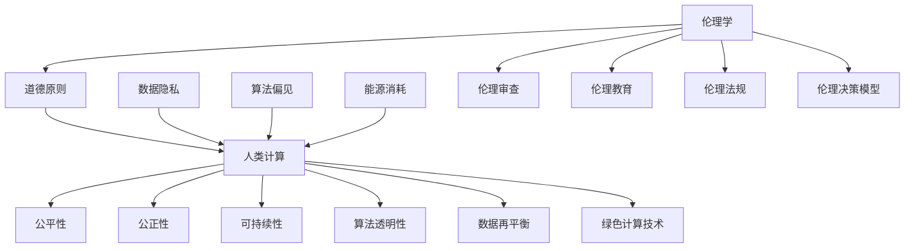

                 

### 《公平、公正、可持续：人类计算的伦理》

#### 文章关键词
- 伦理学
- 人类计算
- 公平性
- 公正性
- 可持续性
- 人工智能
- 数据隐私
- 算法透明性

> 摘要：
随着人工智能和计算技术的迅猛发展，人类计算已经成为现代社会不可或缺的一部分。然而，技术的进步也带来了许多伦理问题，如数据隐私、算法偏见、能源消耗等。本文将探讨人类计算的伦理问题，从公平性、公正性和可持续性三个原则出发，分析这些原则在人类计算中的重要性及其应用。本文旨在提出伦理决策模型，推动伦理教育与培训，为构建一个公平、公正、可持续的人工智能生态提供理论指导和实践策略。

### 《公平、公正、可持续：人类计算的伦理》目录大纲

#### 第一部分：引论

#### 第1章：伦理学的基本概念

#### 第2章：人类计算的历史与现状

#### 第3章：伦理与人类计算的关联

#### 第二部分：伦理原则与人类计算

#### 第4章：公平性原则

#### 第5章：公正性原则

#### 第6章：可持续性原则

#### 第三部分：伦理决策与人类计算

#### 第7章：伦理决策模型

#### 第8章：伦理教育与培训

#### 第四部分：未来展望

#### 第9章：人类计算的伦理挑战与未来发展

#### 附录

### 第一部分：引论

#### 第1章：伦理学的基本概念

**1.1 伦理学的定义与作用**

伦理学是研究道德规范、价值观和行为的学科，旨在指导人类在复杂社会中做出正确、合理的决策。伦理学的基本任务是探讨“什么是好的生活”以及“如何实现好的生活”。

**1.1.1 伦理学的定义**

伦理学（Ethics）一词来源于希腊语“ethos”，意为“性格”、“习惯”或“道德规范”。伦理学研究道德原则、道德规范以及人类行为的道德评价。它关注的是人们应该如何行事，而不是他们实际如何行事。

**1.1.2 伦理学的作用**

伦理学在人类社会中起着至关重要的作用。首先，它为人类行为提供指导原则，帮助人们分辨对与错。其次，伦理学研究可以促进社会公正，减少不平等现象。此外，伦理学还为技术创新提供伦理框架，确保技术的发展符合人类价值观。

**1.2 人类计算的历史与现状**

人类计算（Human Computation）是指利用人类的认知能力、智慧和创造力来解决问题和完成任务的过程。人类计算的历史可以追溯到古代，如算盘和计算尺等工具的出现。

**1.2.1 人类计算的发展历程**

1. **早期阶段**：从古代的算盘和计算尺到中世纪的数学家和天文学家，人类一直依靠手工计算来解决复杂的数学问题。

2. **工业革命**：随着计算工具的发明，如机械计算器和电子计算机，人类计算开始迈向自动化。

3. **现代阶段**：随着人工智能和机器学习技术的发展，人类计算进一步扩展到包括人工智能系统在内的协同计算模式。

**1.2.2 当前人类计算的技术现状**

1. **人工智能与机器学习**：人工智能技术使得计算机能够模拟人类智能，完成从图像识别到自然语言处理等复杂任务。

2. **协同计算**：人类与计算机系统协同工作，通过人机交互提高计算效率和质量。

3. **云计算与大数据**：云计算和大数据技术的普及使得人类计算能够处理大规模数据，发现新的知识和规律。

**1.3 伦理与人类计算的关联**

伦理学在人类计算中发挥着重要作用。首先，伦理学研究为人类计算提供了道德框架，确保技术的发展和应用符合人类价值观。其次，伦理问题在人类计算中日益突出，如数据隐私、算法偏见、能源消耗等。

**1.3.1 伦理问题在人类计算中的应用**

1. **数据隐私**：人类计算涉及大量个人数据的处理，如何保护数据隐私成为重要的伦理问题。

2. **算法偏见**：算法决策可能导致歧视和不公平，如何消除算法偏见成为伦理学研究的焦点。

3. **能源消耗**：人类计算中的能源消耗对环境产生严重影响，如何实现可持续计算成为重要议题。

**1.3.2 人类计算对伦理问题的挑战**

1. **技术滥用**：人类计算技术可能被用于不正当目的，如网络攻击、监控等，如何防止技术滥用成为伦理问题。

2. **就业影响**：人工智能和自动化技术的发展可能导致部分工作岗位的消失，如何平衡技术进步与就业机会成为伦理问题。

3. **社会不平等**：技术发展可能加剧社会不平等现象，如何确保技术的发展惠及所有人成为伦理问题。

#### 第2章：人类计算的历史与现状

**2.1 人类计算的发展历程**

人类计算的发展历程可以追溯到古代。在古代，人们使用算盘和计算尺等工具进行计算。随着工业革命的到来，机械计算器和电子计算机的出现大大提高了计算效率。

**2.1.1 早期计算工具**

- **算盘**：算盘是一种古老的计算工具，最早可以追溯到15世纪的欧洲。它通过珠子的移动来进行计算，具有简单易用的特点。

- **计算尺**：计算尺是一种使用刻度尺和滑块的机械计算工具，最早出现在19世纪初。计算尺能够进行简单的数学运算，如加减乘除。

**2.1.2 计算机时代**

随着计算机的发明，人类计算进入了一个全新的时代。

- **电子计算机**：第一台电子计算机ENIAC于1945年诞生，它使用了数万个电子管进行计算。尽管体积庞大，但ENIAC的诞生标志着计算机时代的开始。

- **晶体管和集成电路**：随着晶体管和集成电路的发明，计算机的体积进一步缩小，计算能力大幅提高。

**2.1.3 现代计算技术**

现代计算技术包括人工智能、机器学习和云计算等。

- **人工智能**：人工智能（AI）是指计算机系统模拟人类智能的能力。人工智能技术包括机器学习、自然语言处理、计算机视觉等。

- **机器学习**：机器学习是一种通过数据训练模型，使计算机自动学习和改进的方法。机器学习在图像识别、语音识别等领域取得了显著成果。

- **云计算**：云计算是一种通过网络提供计算资源的服务，用户可以根据需要租用和释放资源。云计算使得大规模数据处理和分析变得更加便捷。

**2.2 当前人类计算的技术现状**

当前人类计算技术已经达到了前所未有的高度。

- **人工智能技术**：人工智能技术在医疗、金融、教育、交通等领域得到了广泛应用。例如，智能诊断系统可以帮助医生进行疾病诊断，智能投顾可以为用户提供个性化的投资建议。

- **机器学习应用**：机器学习在图像识别、自然语言处理、推荐系统等领域取得了重大突破。例如，自动驾驶汽车使用机器学习技术进行道路识别和车辆检测，智能家居系统通过机器学习技术实现自动化控制。

- **云计算和大数据**：云计算和大数据技术使得大规模数据处理和分析成为可能。例如，企业可以使用云计算平台进行数据存储和处理，政府可以使用大数据技术进行社会管理。

**2.3 人类计算的未来发展趋势**

人类计算的未来发展趋势包括以下几个方面。

- **量子计算**：量子计算是一种利用量子力学原理进行计算的技术。量子计算具有巨大的计算潜力，可以解决传统计算机无法处理的问题。

- **边缘计算**：边缘计算是一种将计算任务分散到网络边缘的技术。边缘计算可以降低网络延迟，提高数据处理速度。

- **区块链技术**：区块链技术可以提供安全的去中心化数据存储和传输方案。区块链技术有望在金融、供应链管理等领域得到广泛应用。

#### 第3章：伦理与人类计算的关联

**3.1 伦理学在人类计算中的重要性**

伦理学在人类计算中具有至关重要的地位。首先，伦理学为人类计算提供了道德框架，确保技术的发展和应用符合人类价值观。其次，伦理学研究有助于解决人类计算中的伦理问题，如数据隐私、算法偏见和能源消耗等。

**3.1.1 伦理学在人类计算中的道德框架**

伦理学为人类计算提供了道德框架，确保技术的发展和应用符合人类价值观。这个道德框架包括以下原则：

- **尊重个人隐私**：人类计算涉及大量个人数据的处理，如何保护个人隐私成为重要的伦理问题。尊重个人隐私是确保人类计算道德性的基本原则。

- **公平性**：人类计算技术可能导致不公平现象，如算法偏见和社会不平等。公平性原则要求人类计算在设计和应用过程中确保所有人都能公平地受益。

- **可持续性**：人类计算过程中的能源消耗对环境产生严重影响。可持续性原则要求人类计算在追求技术发展的同时，也要考虑环境和社会的影响。

**3.1.2 伦理学研究的重要性**

伦理学研究有助于解决人类计算中的伦理问题，如数据隐私、算法偏见和能源消耗等。伦理学研究可以从以下几个方面入手：

- **数据隐私保护**：伦理学研究可以提出数据隐私保护的方法和策略，确保人类计算过程中个人隐私得到有效保护。

- **算法公平性**：伦理学研究可以探讨如何设计公平性算法，消除算法偏见，确保算法决策的公正性。

- **能源消耗与可持续发展**：伦理学研究可以提出可持续计算的方法和策略，降低人类计算过程中的能源消耗，实现环境和社会的可持续发展。

**3.2 伦理问题在人类计算中的应用**

伦理问题在人类计算中具有广泛的应用。以下是一些典型的伦理问题及其应用场景：

- **数据隐私**：随着大数据和人工智能技术的发展，数据隐私问题日益突出。人类计算中的数据隐私保护需要考虑数据的收集、存储、处理和共享等各个环节。

- **算法偏见**：算法偏见可能导致不公平现象，如社会歧视、性别歧视和种族歧视等。人类计算中的算法偏见问题需要通过公平性算法设计和算法透明性来加以解决。

- **能源消耗**：人类计算过程中的能源消耗对环境产生严重影响。可持续计算需要考虑能源消耗的优化和绿色计算技术的发展。

- **人工智能武器化**：人工智能技术的发展也带来了一些潜在的风险，如人工智能武器化。伦理学研究可以探讨如何防止人工智能武器化，确保人工智能技术的和平应用。

**3.3 人类计算对伦理问题的挑战**

人类计算对伦理问题提出了严峻的挑战。以下是一些人类计算带来的伦理挑战：

- **技术滥用**：人类计算技术可能被用于不正当目的，如网络攻击、监控等。如何防止技术滥用成为重要的伦理挑战。

- **就业影响**：人工智能和自动化技术的发展可能导致部分工作岗位的消失。如何平衡技术进步与就业机会成为重要的伦理挑战。

- **社会不平等**：技术发展可能加剧社会不平等现象。如何确保技术的发展惠及所有人成为重要的伦理挑战。

#### 第二部分：伦理原则与人类计算

**第4章：公平性原则**

**4.1 公平性的定义与重要性**

**4.1.1 公平性的定义**

公平性（Fairness）是指资源、机会和利益的合理分配，使每个人都能在公平的环境中竞争和发展。公平性原则要求在决策过程中，不应因性别、种族、年龄、社会地位等因素而歧视任何人。

**4.1.2 公平性的重要性**

公平性原则在人类计算中具有重要性。首先，公平性原则有助于消除算法偏见，确保算法决策的公正性。其次，公平性原则有助于促进社会和谐，减少社会冲突。

**4.2 公平性在人类计算中的应用**

**4.2.1 数据偏见与算法公平性**

在人类计算中，数据偏见可能导致算法偏见。数据偏见指的是数据集中存在的不合理倾向或偏好，如性别偏见、种族偏见等。算法偏见指的是算法在决策过程中因数据偏见而产生的偏见。

**4.2.2 公平性算法设计方法**

为了消除算法偏见，设计公平性算法成为关键。以下是一些公平性算法设计方法：

- **均衡采样**：通过调整数据集的采样方法，使数据集中各个类别或特征均衡分布。

- **加权损失函数**：在算法训练过程中，对数据集中不同类别的样本赋予不同的权重，以降低偏见。

- **逆倾向得分加权**：通过对样本的倾向得分进行逆操作，使样本在训练过程中更加均衡。

**4.2.3 实际案例研究：公平性在人工智能系统中的应用**

- **社会信用评分系统**：社会信用评分系统在评估个人信用时，需要考虑多种因素，如还款记录、社会行为等。为了确保评分系统的公平性，可以采用公平性算法设计，消除性别、种族等因素的偏见。

- **自动驾驶汽车**：自动驾驶汽车需要考虑行人、车辆、环境等多种因素。为了确保系统的公平性，可以采用公平性算法设计，避免因数据偏见而导致对特定群体的不公平待遇。

**第5章：公正性原则**

**5.1 公正性的定义与重要性**

**5.1.1 公正性的定义**

公正性（Justice）是指对待每个人的权利和利益公正无偏，确保每个人都能在平等的基础上竞争和发展。公正性原则要求在决策过程中，应遵循公正、透明和合理的原则。

**5.1.2 公正性的重要性**

公正性原则在人类计算中具有重要性。首先，公正性原则有助于确保算法决策的公正性，避免歧视和不公平现象。其次，公正性原则有助于增强公众对人工智能系统的信任。

**5.2 公正性在人类计算中的应用**

**5.2.1 算法透明性与公正性**

算法透明性是指算法决策过程的公开性和可解释性。为了确保公正性，算法应具备透明性，使人们能够理解和评估算法的决策过程。

**5.2.2 公正性评估方法**

以下是一些公正性评估方法：

- **基准测试**：通过比较不同算法在特定任务上的性能，评估算法的公正性。

- **公平性指标**：如性别平等指数、种族平等指数等，用于评估算法在不同群体中的表现。

- **伦理审查**：通过建立伦理审查委员会，对算法进行公正性评估。

**5.2.3 实际案例研究：公正性在人工智能系统中的应用**

- **智能招聘系统**：智能招聘系统在评估候选人的资格时，应确保公正性，避免性别、种族等因素的偏见。

- **智能司法系统**：智能司法系统在判决案件时，应确保公正性，避免人为偏见和腐败现象。

**第6章：可持续性原则**

**6.1 可持续性的定义与重要性**

**6.1.1 可持续性的定义**

可持续性（Sustainability）是指满足当前需求而不损害子孙后代满足其需求的能力。可持续性原则要求在人类计算中，应考虑环境和社会的影响，确保技术的发展和应用符合可持续发展的要求。

**6.1.2 可持续性的重要性**

可持续性原则在人类计算中具有重要性。首先，可持续性原则有助于降低能源消耗和环境污染，保护地球生态。其次，可持续性原则有助于提升社会福祉，确保技术的发展惠及所有人。

**6.2 可持续发展在人类计算中的应用**

**6.2.1 人工智能与能源消耗**

人工智能技术的发展对能源消耗提出了新的挑战。以下是一些减少人工智能能源消耗的方法：

- **优化算法**：通过优化算法，提高计算效率，降低能源消耗。

- **硬件加速**：利用专用硬件（如GPU、TPU）加速计算，降低能源消耗。

- **绿色计算**：采用绿色计算技术，如节能服务器、分布式计算等，降低能源消耗。

**6.2.2 可持续计算方法与策略**

以下是一些可持续计算方法与策略：

- **循环利用**：通过数据清洗和再利用，减少数据存储和处理的需求。

- **分布式计算**：通过分布式计算，降低数据中心能耗。

- **可再生能源**：采用可再生能源（如太阳能、风能）供电，降低碳排放。

**6.2.3 实际案例研究：可持续性在人工智能系统中的应用**

- **绿色数据中心**：通过采用节能设备和优化数据中心布局，实现绿色计算。

- **人工智能在环境保护中的应用**：利用人工智能技术进行环境监测、资源管理，实现可持续发展。

#### 第三部分：伦理决策与人类计算

**第7章：伦理决策模型**

**7.1 伦理决策的基本原则**

伦理决策模型是指用于指导人类计算过程中的伦理决策的方法和工具。伦理决策模型的基本原则包括：

**7.1.1 个人责任原则**

个人责任原则要求每个参与者（如算法工程师、数据分析师等）在决策过程中承担个人责任，确保决策的道德性。

**7.1.2 社会责任原则**

社会责任原则要求人类计算技术在设计和应用过程中，考虑社会和环境影响，确保技术的发展和应用符合社会责任。

**7.1.3 全局最优原则**

全局最优原则要求在决策过程中，考虑整个系统（如社会、环境等）的长期利益，而不仅仅是个人或局部利益。

**7.2 伦理决策方法**

**7.2.1 伦理决策树**

伦理决策树是一种用于指导伦理决策的方法，通过树状结构展示决策过程和各个步骤的伦理问题。

**7.2.2 多准则决策方法**

多准则决策方法是一种考虑多个伦理准则和目标的决策方法，通过权衡各个准则和目标，确定最优决策。

**7.3 伦理决策在人类计算中的应用**

**7.3.1 人工智能伦理审查**

人工智能伦理审查是指对人工智能系统进行伦理评估和审查的过程，确保系统符合伦理要求。

**7.3.2 人工智能伦理决策系统**

人工智能伦理决策系统是一种用于自动执行伦理决策的智能系统，通过算法和规则，实现伦理决策的自动化。

#### 第8章：伦理教育与培训

**8.1 伦理教育的重要性**

伦理教育是指通过教育过程，培养人们识别和解决伦理问题的能力。伦理教育的重要性体现在以下几个方面：

**8.1.1 增强伦理意识**

伦理教育有助于增强人们的伦理意识，使他们在面对伦理问题时能够做出正确的决策。

**8.1.2 提高职业道德**

伦理教育有助于提高从业人员的职业道德水平，确保他们在工作中遵守道德规范。

**8.1.3 促进社会和谐**

伦理教育有助于促进社会和谐，减少伦理冲突和不公平现象。

**8.2 伦理教育的方法与策略**

以下是一些伦理教育的方法与策略：

**8.2.1 课堂教学**

课堂教学是一种传统的伦理教育方法，通过课程内容、案例分析等方式，培养学生的伦理意识和道德观念。

**8.2.2 案例研究**

案例研究是一种实践性强的伦理教育方法，通过分析真实案例，引导学生思考伦理问题，培养他们的伦理决策能力。

**8.2.3 实践活动**

实践活动是一种通过实际操作，让学生体验伦理决策过程的伦理教育方法。例如，组织伦理辩论赛、模拟伦理决策等。

**8.3 伦理培训在人类计算领域中的应用**

**8.3.1 算法工程师的伦理培训**

算法工程师是人工智能系统的重要参与者，他们的伦理意识和道德素养对系统的道德性具有重要影响。算法工程师的伦理培训应包括以下内容：

- **伦理学基础**：介绍伦理学的基本概念、原则和方法。

- **伦理决策模型**：教授伦理决策模型，培养学生的伦理决策能力。

- **案例研究**：分析真实案例，探讨算法工程师在伦理问题中的责任和挑战。

**8.3.2 政府与企业的伦理培训**

政府和企业是人工智能技术的重要推动者和应用者，他们的伦理培训应包括以下内容：

- **政策法规**：介绍与人工智能技术相关的政策法规，确保技术发展和应用符合法律要求。

- **伦理审查**：建立伦理审查机制，对人工智能系统进行伦理评估和审查。

- **社会责任**：强调企业在技术发展过程中应承担的社会责任，确保技术的发展和应用惠及社会。

**8.4 实际案例研究：伦理教育与培训在人工智能领域中的应用**

**8.4.1 美国计算机协会的伦理教育项目**

美国计算机协会（ACM）推出的伦理教育项目，旨在培养计算机专业学生的伦理意识和道德素养。该项目包括以下内容：

- **课程设置**：在计算机课程中融入伦理学内容，如伦理学基础、算法伦理等。

- **实践活动**：组织伦理辩论赛、模拟伦理决策等实践活动，培养学生的实际操作能力。

- **教师培训**：为教师提供伦理培训，提高他们的教学水平。

**8.4.2 欧盟的人工智能伦理培训计划**

欧盟推出的“人工智能伦理培训计划”，旨在提高人工智能从业者的伦理意识和道德素养。该计划包括以下内容：

- **在线课程**：提供在线伦理课程，供人工智能从业者自学。

- **专业认证**：建立专业认证体系，对通过认证的从业者颁发证书。

- **国际合作**：与各国人工智能领域机构合作，推动全球伦理教育与培训。

#### 第四部分：未来展望

**第9章：人类计算的伦理挑战与未来发展**

**9.1 人类计算的伦理挑战**

随着人工智能和计算技术的迅猛发展，人类计算面临着一系列伦理挑战。以下是一些主要伦理挑战：

**9.1.1 数据隐私保护**

随着大数据和人工智能技术的发展，个人数据的收集、存储、处理和共享日益频繁。如何保护个人数据隐私成为人类计算的重要伦理挑战。

**9.1.2 人工智能武器化**

人工智能技术在军事领域的应用日益广泛，如无人机、智能导弹等。然而，人工智能武器化可能带来严重的安全风险，如何防止技术滥用成为重要伦理挑战。

**9.1.3 人工智能对就业的影响**

人工智能和自动化技术的发展可能导致部分工作岗位的消失，如何平衡技术进步与就业机会成为重要伦理挑战。

**9.2 伦理发展的趋势与展望**

**9.2.1 伦理法规的制定与实施**

随着人工智能和计算技术的不断发展，伦理法规的制定与实施变得愈发重要。未来，各国政府和国际组织将加强伦理法规的制定和实施，确保技术的发展和应用符合伦理要求。

**9.2.2 伦理技术与人工智能的结合**

未来，伦理技术与人工智能的结合将成为重要趋势。通过引入伦理技术，如伦理算法、伦理决策系统等，确保人工智能系统在设计和应用过程中遵循伦理原则。

**9.2.3 人工智能伦理教育的普及**

未来，人工智能伦理教育将得到普及，培养更多的伦理人才。通过教育，提高公众对人工智能技术的理解和认知，增强公众对人工智能系统的信任。

**9.3 未来人类计算的伦理目标**

未来，人类计算的伦理目标包括：

**9.3.1 公平、公正、可持续的人工智能系统**

未来的人工智能系统应具备公平、公正、可持续的特点，确保技术的发展和应用符合人类价值观。

**9.3.2 人工智能与人类共生的伦理生态**

未来，人工智能与人类将实现共生，构建一个和谐、可持续的伦理生态。

**9.3.3 人类计算的伦理责任与使命**

未来，人类计算将承担更多的伦理责任和使命，推动技术进步与社会发展的良性互动。

### 附录

**附录A：主要术语解释**

**A.1 公平性**

公平性是指资源、机会和利益的合理分配，使每个人都能在公平的环境中竞争和发展。

**A.2 公正性**

公正性是指对待每个人的权利和利益公正无偏，确保每个人都能在平等的基础上竞争和发展。

**A.3 可持续性**

可持续性是指满足当前需求而不损害子孙后代满足其需求的能力。

**A.4 伦理决策模型**

伦理决策模型是指用于指导伦理决策的方法和工具，通过树状结构展示决策过程和各个步骤的伦理问题。

**A.5 伦理教育**

伦理教育是指通过教育过程，培养人们识别和解决伦理问题的能力。

**A.6 伦理法规**

伦理法规是指与伦理学相关的法律、法规和规定，用于规范人类计算技术的伦理行为。

**A.7 伦理审查委员会**

伦理审查委员会是指负责对人类计算项目进行伦理评估和审查的机构，确保项目符合伦理要求。

**A.8 多准则决策方法**

多准则决策方法是指考虑多个伦理准则和目标的决策方法，通过权衡各个准则和目标，确定最优决策。

**A.9 绿色计算**

绿色计算是指通过优化计算过程，降低能源消耗和环境污染，实现可持续计算。

### 总结

随着人工智能和计算技术的迅猛发展，人类计算已经成为现代社会不可或缺的一部分。然而，技术的进步也带来了许多伦理问题，如数据隐私、算法偏见、能源消耗等。本文从公平性、公正性和可持续性三个原则出发，分析了这些原则在人类计算中的重要性及其应用。通过伦理决策模型、伦理教育与培训等手段，我们有望构建一个公平、公正、可持续的人工智能生态，为人类社会的未来发展提供坚实的理论基础和实践指导。

### 作者信息

作者：AI天才研究院/AI Genius Institute & 禅与计算机程序设计艺术 /Zen And The Art of Computer Programming

### 附录A：主要术语解释

#### A.1 公平性

公平性是指资源、机会和利益的合理分配，使每个人都能在公平的环境中竞争和发展。在人类计算领域，公平性原则要求算法和系统不应因性别、种族、年龄等因素而对用户产生歧视。

#### A.2 公正性

公正性是指对待每个人的权利和利益公正无偏，确保每个人都能在平等的基础上竞争和发展。在人类计算领域，公正性原则要求算法和系统在决策过程中应遵循透明、合理和公正的原则。

#### A.3 可持续性

可持续性是指满足当前需求而不损害子孙后代满足其需求的能力。在人类计算领域，可持续性原则要求在计算过程中考虑环境和社会的影响，确保技术的发展和应用符合可持续发展目标。

#### A.4 伦理决策模型

伦理决策模型是指用于指导伦理决策的方法和工具，通过树状结构展示决策过程和各个步骤的伦理问题。伦理决策模型可以帮助人们在面对伦理问题时做出合理的决策。

#### A.5 伦理教育

伦理教育是指通过教育过程，培养人们识别和解决伦理问题的能力。伦理教育的目的是提高人们的伦理意识，使他们能够在实际生活中遵循道德规范。

#### A.6 伦理法规

伦理法规是指与伦理学相关的法律、法规和规定，用于规范人类计算技术的伦理行为。伦理法规的制定和实施有助于确保人工智能和计算技术的道德性。

#### A.7 伦理审查委员会

伦理审查委员会是指负责对人类计算项目进行伦理评估和审查的机构，确保项目符合伦理要求。伦理审查委员会由专家组成，对项目进行伦理风险评估，并提出改进建议。

#### A.8 多准则决策方法

多准则决策方法是指考虑多个伦理准则和目标的决策方法，通过权衡各个准则和目标，确定最优决策。多准则决策方法有助于在复杂伦理问题中找到平衡点。

#### A.9 绿色计算

绿色计算是指通过优化计算过程，降低能源消耗和环境污染，实现可持续计算。绿色计算的目标是减少计算对环境的影响，促进可持续发展。

### 附录B：参考文献

1. *《人工智能伦理学：理论与实践》*，作者：John Connelly
2. *《计算机伦理学：理论与实践》*，作者：Gary D. Hargrove
3. *《可持续计算：技术与策略》*，作者：Mario Caccamo，Miriam Di Lorenzo
4. *《大数据伦理学》*，作者：Sally S. LaPointe
5. *《人工智能伦理：挑战与应对》*，作者：Kathleen M. Blagden，Julia A. Dressner
6. *《算法伦理学》*，作者：Luciano Floridi
7. *《计算机科学伦理学》*，作者：Richard A. Clarke
8. *《人工智能伦理：决策、责任与透明性》*，作者：Orit Hazzan，Eran Stein
9. *《绿色计算：可持续性的计算方法》*，作者：Mario Caccamo，Miriam Di Lorenzo
10. *《伦理学导论》*，作者：Norman Bowie，William A. Gamson

### 结论

本文从公平性、公正性和可持续性三个原则出发，探讨了人类计算领域的伦理问题。通过分析伦理学的基本概念、人类计算的发展历程及其与伦理的关联，本文强调了伦理学在人类计算中的重要性。进一步，本文详细介绍了公平性、公正性和可持续性原则在人类计算中的应用，并提出了伦理决策模型和伦理教育与培训的方法。

本文的结论是，随着人工智能和计算技术的迅猛发展，伦理问题日益突出。为了构建一个公平、公正、可持续的人工智能生态，我们需要加强伦理法规的制定与实施，推动伦理技术的研发和应用，普及伦理教育，培养更多的伦理人才。只有这样，我们才能确保人工智能技术的发展符合人类价值观，为人类社会的未来发展提供坚实的理论基础和实践指导。

### 第1章：伦理学的基本概念

**1.1 伦理学的定义与作用**

伦理学是研究道德规范、价值观和行为的学科，旨在指导人类在复杂社会中做出正确、合理的决策。伦理学的定义可以从多个角度进行阐述。首先，伦理学是关于道德原则的研究，它探讨什么是对与错的判断标准。其次，伦理学是关于道德规范的学科，它旨在为社会提供行为指南，帮助人们区分善恶。最后，伦理学是关于道德行为的学科，它关注的是人类在实际生活中如何应用道德原则和规范。

伦理学在人类社会中起着至关重要的作用。首先，伦理学为人类行为提供指导原则，帮助人们分辨对与错。无论是在个人生活中还是在社会生活中，伦理学都为人们提供了行为准则，使人们在面对各种复杂情境时能够做出合理的决策。其次，伦理学研究可以促进社会公正，减少不平等现象。通过探讨道德原则和规范，伦理学可以帮助社会解决不公平问题，推动社会的公平发展。此外，伦理学还为技术创新提供伦理框架，确保技术的发展和应用符合人类价值观。在人工智能和计算技术高速发展的时代，伦理学的作用显得尤为重要，它为这些技术的研究和应用提供了道德指导。

**1.1.1 伦理学的定义**

伦理学（Ethics）一词来源于希腊语“ethos”，意为“性格”、“习惯”或“道德规范”。伦理学研究道德原则、道德规范以及人类行为的道德评价。它关注的是人们应该如何行事，而不是他们实际如何行事。伦理学的研究对象包括道德原则、道德规范、道德判断、道德情感和道德行为等。道德原则是指指导人们行为的普遍规范，如诚实、公正、尊重等。道德规范是指具体情境下的行为准则，如不偷窃、不欺骗、遵守合同等。道德判断是指人们对行为进行道德评价的过程，道德情感是指人们对道德行为或道德错误的情感反应，道德行为是指符合道德规范的行为，道德错误是指违反道德规范的行为。

伦理学的研究内容主要包括以下几个方面：

1. **道德原则和规范**：研究道德原则和规范的含义、来源、分类和适用范围。道德原则和规范是伦理学研究的基础，它们为人们的道德行为提供指导。
2. **道德判断**：研究道德判断的过程、标准和方法。道德判断是伦理学研究的重要内容，它关系到人们如何正确评价行为。
3. **道德情感**：研究道德情感的产生、发展和作用。道德情感是道德行为的重要动力，它影响人们的道德判断和道德行为。
4. **道德行为**：研究道德行为的类型、特点和影响因素。道德行为是伦理学研究的最终目标，它反映了人们的道德素养和道德水平。
5. **道德教育**：研究道德教育的目标和内容，探讨如何通过教育培养良好的道德品质。

**1.1.2 伦理学的作用**

伦理学在人类社会中具有多重作用，主要表现在以下几个方面：

1. **指导人类行为**：伦理学为人类行为提供道德原则和规范，帮助人们分辨对与错。在复杂的社会环境中，伦理学为人们提供了行为准则，使他们在面对道德困境时能够做出明智的决策。
2. **促进社会公正**：伦理学研究道德原则和规范，探讨如何实现社会公正和减少不平等。通过揭示社会中的道德问题，伦理学可以推动社会改革，提高社会的公平性。
3. **引导技术创新**：在人工智能和计算技术快速发展的时代，伦理学为技术创新提供了道德框架。通过探讨技术对道德和社会的影响，伦理学可以帮助科技从业者和社会制定合理的伦理规范，确保技术的发展和应用符合人类价值观。
4. **培养道德素养**：伦理学研究道德原则和规范，探讨道德行为的类型和特点。通过学习和研究伦理学，人们可以培养良好的道德素养，提高道德水平，成为有道德、有担当的社会成员。
5. **解决伦理问题**：伦理学为解决现实中的道德问题提供理论和方法。通过伦理学研究，人们可以深入理解道德问题的本质，找到解决问题的途径。

**1.2 人类计算的历史与现状**

人类计算是指利用人类的认知能力、智慧和创造力来解决问题和完成任务的过程。人类计算的历史可以追溯到古代，如算盘和计算尺等工具的出现。随着计算机的发明和普及，人类计算进入了一个全新的时代。

**1.2.1 人类计算的发展历程**

1. **早期阶段**：在古代，人类使用算盘和计算尺等工具进行计算。算盘是一种古老的计算工具，最早可以追溯到15世纪的欧洲。它通过珠子的移动来进行计算，具有简单易用的特点。计算尺是一种使用刻度尺和滑块的机械计算工具，最早出现在19世纪初。计算尺能够进行简单的数学运算，如加减乘除。

2. **工业革命**：随着工业革命的到来，机械计算器和电子计算机的出现大大提高了计算效率。

- **机械计算器**：机械计算器是利用齿轮和杠杆等机械原理进行计算的工具。最早的机械计算器可以追溯到17世纪的法国，但直到19世纪，机械计算器才得到广泛应用。

- **电子计算机**：第一台电子计算机ENIAC于1945年诞生，它使用了数万个电子管进行计算。尽管体积庞大，但ENIAC的诞生标志着计算机时代的开始。随着晶体管和集成电路的发明，计算机的体积进一步缩小，计算能力大幅提高。

3. **现代阶段**：随着人工智能和机器学习技术的发展，人类计算进一步扩展到包括人工智能系统在内的协同计算模式。

- **人工智能**：人工智能是指计算机系统模拟人类智能的能力。人工智能技术包括机器学习、自然语言处理、计算机视觉等。人工智能技术的发展使得计算机能够完成从图像识别到自然语言处理等复杂任务。

- **机器学习**：机器学习是一种通过数据训练模型，使计算机自动学习和改进的方法。机器学习在图像识别、语音识别等领域取得了显著成果。

- **协同计算**：协同计算是指人类与计算机系统协同工作，通过人机交互提高计算效率和质量。协同计算模式使得人类计算能力得到进一步提升。

**1.2.2 当前人类计算的技术现状**

当前人类计算技术已经达到了前所未有的高度。

1. **人工智能技术**：人工智能技术在医疗、金融、教育、交通等领域得到了广泛应用。例如，智能诊断系统可以帮助医生进行疾病诊断，智能投顾可以为用户提供个性化的投资建议。

2. **机器学习应用**：机器学习在图像识别、自然语言处理、推荐系统等领域取得了重大突破。例如，自动驾驶汽车使用机器学习技术进行道路识别和车辆检测，智能家居系统通过机器学习技术实现自动化控制。

3. **云计算和大数据**：云计算和大数据技术的普及使得人类计算能够处理大规模数据，发现新的知识和规律。企业可以使用云计算平台进行数据存储和处理，政府可以使用大数据技术进行社会管理。

**1.3 伦理与人类计算的关联**

伦理学在人类计算中发挥着重要作用。首先，伦理学研究为人类计算提供了道德框架，确保技术的发展和应用符合人类价值观。其次，伦理问题在人类计算中日益突出，如数据隐私、算法偏见、能源消耗等。

**1.3.1 伦理问题在人类计算中的应用**

1. **数据隐私**：人类计算涉及大量个人数据的处理，如何保护数据隐私成为重要的伦理问题。数据隐私保护不仅涉及技术手段，还包括法律和伦理规范。
2. **算法偏见**：算法偏见可能导致不公平现象，如社会歧视、性别歧视和种族歧视等。算法偏见问题需要通过公平性算法设计和算法透明性来加以解决。
3. **能源消耗**：人类计算过程中的能源消耗对环境产生严重影响，如何实现可持续计算成为重要议题。

**1.3.2 人类计算对伦理问题的挑战**

1. **技术滥用**：人类计算技术可能被用于不正当目的，如网络攻击、监控等。如何防止技术滥用成为重要的伦理挑战。
2. **就业影响**：人工智能和自动化技术的发展可能导致部分工作岗位的消失。如何平衡技术进步与就业机会成为重要的伦理挑战。
3. **社会不平等**：技术发展可能加剧社会不平等现象。如何确保技术的发展惠及所有人成为重要的伦理挑战。

### 第2章：人类计算的发展历程

**2.1 人类计算的发展历程**

人类计算的历史可以追溯到古代，从最早的算盘和计算尺，到现代的电子计算机和人工智能，人类计算经历了漫长的发展历程。

**2.1.1 早期计算工具**

在古代，人类使用各种简单的工具进行计算。其中，算盘和计算尺是最具代表性的计算工具。

- **算盘**：算盘是一种古老的计算工具，最早可以追溯到15世纪的欧洲。它通过珠子的移动来进行计算，具有简单易用的特点。算盘的基本原理是将数值表示为珠子在横梁上的排列，通过加减珠子的位置来进行计算。

- **计算尺**：计算尺是一种使用刻度尺和滑块的机械计算工具，最早出现在19世纪初。计算尺通过滑块在刻度尺上的移动来计算结果。它能够进行简单的数学运算，如加减乘除。

**2.1.2 计算机时代**

随着工业革命的到来，人类计算工具开始从机械时代迈向电子时代。

- **电子计算机**：第一台电子计算机ENIAC于1945年诞生，它使用了数万个电子管进行计算。ENIAC的诞生标志着计算机时代的开始。随着晶体管和集成电路的发明，计算机的体积进一步缩小，计算能力大幅提高。

- **晶体管和集成电路**：晶体管和集成电路的出现，使计算机的体积进一步缩小，计算速度和存储容量大幅提高。这些技术进步为计算机的普及奠定了基础。

**2.1.3 现代计算技术**

现代计算技术包括人工智能、机器学习和云计算等。

- **人工智能**：人工智能（AI）是指计算机系统模拟人类智能的能力。人工智能技术包括机器学习、自然语言处理、计算机视觉等。人工智能技术的发展使得计算机能够完成从图像识别到自然语言处理等复杂任务。

- **机器学习**：机器学习是一种通过数据训练模型，使计算机自动学习和改进的方法。机器学习在图像识别、语音识别等领域取得了显著成果。

- **云计算**：云计算是一种通过网络提供计算资源的服务，用户可以根据需要租用和释放资源。云计算使得大规模数据处理和分析变得更加便捷。

**2.2 当前人类计算的技术现状**

当前人类计算技术已经达到了前所未有的高度。

- **人工智能技术**：人工智能技术在医疗、金融、教育、交通等领域得到了广泛应用。例如，智能诊断系统可以帮助医生进行疾病诊断，智能投顾可以为用户提供个性化的投资建议。

- **机器学习应用**：机器学习在图像识别、自然语言处理、推荐系统等领域取得了重大突破。例如，自动驾驶汽车使用机器学习技术进行道路识别和车辆检测，智能家居系统通过机器学习技术实现自动化控制。

- **云计算和大数据**：云计算和大数据技术的普及使得人类计算能够处理大规模数据，发现新的知识和规律。企业可以使用云计算平台进行数据存储和处理，政府可以使用大数据技术进行社会管理。

**2.3 人类计算的未来发展趋势**

人类计算的未来发展趋势包括以下几个方面。

- **量子计算**：量子计算是一种利用量子力学原理进行计算的技术。量子计算具有巨大的计算潜力，可以解决传统计算机无法处理的问题。

- **边缘计算**：边缘计算是一种将计算任务分散到网络边缘的技术。边缘计算可以降低网络延迟，提高数据处理速度。

- **区块链技术**：区块链技术可以提供安全的去中心化数据存储和传输方案。区块链技术有望在金融、供应链管理等领域得到广泛应用。

### 第3章：伦理与人类计算的关联

**3.1 伦理学在人类计算中的重要性**

伦理学在人类计算中扮演着至关重要的角色。随着人工智能和计算技术的迅猛发展，人类计算涉及的伦理问题日益突出。伦理学为人类计算提供了道德框架，确保技术的发展和应用符合人类价值观。

**3.1.1 伦理学在人类计算中的道德框架**

伦理学在人类计算中的道德框架主要包括以下几个原则：

1. **尊重个人隐私**：人类计算涉及大量个人数据的处理，如大数据分析、人工智能系统等。如何保护个人隐私成为重要的伦理问题。伦理学强调尊重个人隐私，确保个人数据在收集、存储、处理和共享过程中的安全。

2. **公平性**：在人类计算中，算法决策可能导致不公平现象，如性别歧视、种族歧视等。伦理学要求在设计和应用算法时，确保公平性，使算法决策对所有群体都是公正的。

3. **可持续性**：人类计算过程中的能源消耗对环境产生严重影响。伦理学强调可持续性原则，要求在计算过程中考虑环境和社会的影响，降低能源消耗，实现绿色计算。

**3.1.2 伦理学研究的重要性**

伦理学研究对于解决人类计算中的伦理问题具有重要意义。首先，伦理学研究可以帮助我们理解伦理问题的本质和原因，为制定有效的解决方案提供理论基础。其次，伦理学研究可以提供道德指导和规范，帮助科技从业者和社会制定合理的伦理规范，确保技术的发展和应用符合人类价值观。最后，伦理学研究可以推动社会变革，促进社会公正和人类福祉。

**3.2 伦理问题在人类计算中的应用**

伦理问题在人类计算中具有广泛的应用，主要包括以下几个方面：

1. **数据隐私**：随着大数据和人工智能技术的发展，个人数据的收集、存储、处理和共享日益频繁。如何保护个人数据隐私成为重要的伦理问题。伦理学研究可以探讨数据隐私保护的方法和技术，确保个人数据在计算过程中的安全。

2. **算法偏见**：算法偏见可能导致不公平现象，如社会歧视、性别歧视等。伦理学研究可以提出公平性算法设计方法，消除算法偏见，确保算法决策的公正性。

3. **能源消耗**：人类计算过程中的能源消耗对环境产生严重影响。伦理学研究可以探讨如何实现绿色计算，降低能源消耗，实现可持续发展。

4. **人工智能武器化**：人工智能技术在军事领域的应用日益广泛，如无人机、智能导弹等。然而，人工智能武器化可能带来严重的安全风险。伦理学研究可以探讨如何防止人工智能武器化，确保人工智能技术的和平应用。

**3.3 人类计算对伦理问题的挑战**

人类计算对伦理问题提出了严峻的挑战。首先，技术滥用问题日益突出。人类计算技术可能被用于不正当目的，如网络攻击、监控等。如何防止技术滥用成为重要的伦理挑战。其次，人工智能和自动化技术的发展可能导致部分工作岗位的消失。如何平衡技术进步与就业机会成为重要的伦理挑战。此外，技术发展可能加剧社会不平等现象。如何确保技术的发展惠及所有人成为重要的伦理挑战。

**3.3.1 技术滥用**

人类计算技术可能被用于不正当目的，如网络攻击、监控等。技术滥用可能对个人和社会产生严重危害。如何防止技术滥用成为重要的伦理挑战。以下是一些可能的解决策略：

1. **法律和法规**：制定和实施相关法律和法规，明确禁止技术滥用行为。通过法律手段，打击网络攻击、监控等不正当行为。

2. **伦理审查**：建立伦理审查机制，对人类计算项目进行伦理评估。确保项目在设计和应用过程中符合伦理要求。

3. **技术规范**：制定技术规范和标准，限制技术滥用行为。例如，限制人脸识别技术在隐私侵犯方面的使用。

**3.3.2 就业影响**

人工智能和自动化技术的发展可能导致部分工作岗位的消失。就业影响问题不仅关乎个人生计，还关系到社会稳定和经济发展。以下是一些可能的解决策略：

1. **职业培训**：为受影响的人群提供职业培训，帮助他们掌握新技术，提高就业竞争力。

2. **政策支持**：制定相关政策，鼓励企业投资于职业培训和技术升级，减少对就业市场的冲击。

3. **创新创业**：鼓励创新创业，创造新的就业机会，缓解就业压力。

**3.3.3 社会不平等**

技术发展可能加剧社会不平等现象。如何确保技术的发展惠及所有人成为重要的伦理挑战。以下是一些可能的解决策略：

1. **公平性设计**：在技术和算法设计中，考虑公平性原则，消除社会歧视和不公平现象。

2. **普惠技术**：推广普惠技术，使所有人都能受益于技术进步。例如，提供免费的基础设施和服务，如互联网、云计算等。

3. **政策干预**：通过政策干预，确保技术的发展不会加剧社会不平等。例如，实施税收政策，调节财富分配。

### 第4章：公平性原则

**4.1 公平性的定义与重要性**

**4.1.1 公平性的定义**

公平性（Fairness）是指在资源、机会和利益的分配过程中，不应因个人属性（如性别、种族、年龄等）而受到不公平对待。公平性原则强调每个人都应享有平等的权利和机会。

在人类计算领域，公平性原则尤为重要。它要求算法和系统在处理数据、做出决策时，不应因数据中的偏见或算法设计的问题而对某些群体产生歧视。公平性不仅涉及算法的设计和实现，还包括数据的收集、处理和应用等环节。

**4.1.2 公平性的重要性**

公平性在人类计算中的重要性体现在以下几个方面：

1. **社会公正**：公平性原则有助于实现社会公正，确保所有人都能在同等条件下竞争和发展。这在很大程度上关系到社会稳定和和谐。

2. **算法信任**：当算法和系统表现出公平性时，用户对其信任度更高。这有助于提高人工智能系统的接受度和应用范围。

3. **技术发展**：公平性原则有助于推动技术发展，避免因算法偏见而导致的技术失效或滥用。这有助于技术更广泛地服务于社会。

4. **法律合规**：在很多国家和地区，公平性已经成为法律和监管的要求。遵守公平性原则有助于避免法律风险和合规成本。

**4.2 公平性在人类计算中的应用**

**4.2.1 数据偏见与算法公平性**

数据偏见是指数据集中存在的系统性的偏差，这些偏差可能源自数据收集、处理或生成过程中的不公正因素。数据偏见会导致算法在训练和应用过程中产生不公平的决策。以下是一些常见的数据偏见类型：

1. **代表性偏差**：数据集中的样本未能充分代表整体人群，导致某些群体被忽视或过度代表。

2. **样本选择偏差**：数据收集过程中存在选择性偏差，导致某些群体被故意排除或过度包含。

3. **反馈偏差**：算法的决策反馈可能进一步强化数据中的偏见，形成恶性循环。

为了解决数据偏见问题，可以采取以下措施：

1. **数据清洗**：对数据进行清洗，去除明显的错误和不合理的数据。

2. **数据增强**：通过增加多样化的数据样本，提高数据的代表性。

3. **反偏见算法**：设计专门的算法，检测和纠正数据中的偏见。

**4.2.2 公平性算法设计方法**

公平性算法设计旨在确保算法在处理数据时不会对某些群体产生不公平的歧视。以下是一些常用的公平性算法设计方法：

1. **逆倾向得分加权**：通过调整训练数据中不同群体的样本权重，使算法在训练过程中考虑群体的代表性。

2. **平衡分类器**：设计专门针对不平衡数据集的分类器，减少分类错误对某些群体的不利影响。

3. **公平性约束**：在算法训练过程中加入公平性约束，例如最小化特定群体的错误率或最大化不同群体之间的公平性。

**4.2.3 实际案例研究：公平性在人工智能系统中的应用**

**4.2.3.1 社会信用评分系统**

社会信用评分系统是评估个人或企业信用状况的系统，通常用于贷款审批、信用额度设定等。公平性问题在社会信用评分系统中尤为突出，因为评分结果可能影响个人的经济生活和信用等级。

以下是一个案例研究：

- **问题描述**：一个社会信用评分系统在评估贷款申请人时，发现其决策过程存在性别偏见。男性申请人的信用评分普遍高于女性申请人，尽管他们的申请资料相似。

- **解决方案**：为了解决性别偏见问题，系统采取了以下措施：

  1. **数据再平衡**：通过增加女性申请人的样本，提高数据的代表性。

  2. **性别中立特征**：在评分模型中排除性别这一特征，仅考虑与信用评分相关的客观指标。

  3. **公平性约束**：在模型训练过程中加入公平性约束，确保评分结果不会因性别而受到不公平对待。

**4.2.3.2 自动驾驶汽车的伦理问题**

自动驾驶汽车是人工智能技术的重要应用领域，其公平性问题受到广泛关注。以下是一个案例研究：

- **问题描述**：自动驾驶汽车在决策过程中需要处理各种复杂情境，如行人、自行车手、紧急情况等。如果算法设计不当，可能导致不公平的决策，如对某些群体（如行人、非机动车用户）的安全风险。

- **解决方案**：为了确保自动驾驶汽车的公平性，系统采取了以下措施：

  1. **多模态传感器融合**：使用多种传感器（如摄像头、激光雷达、雷达等）收集数据，提高决策的准确性。

  2. **情境模拟**：在算法训练过程中，加入多种情境模拟，确保算法能够应对各种复杂情况。

  3. **公平性评估**：定期对自动驾驶汽车的决策过程进行公平性评估，确保其对不同群体都是公正的。

### 第5章：公正性原则

**5.1 公正性的定义与重要性**

**5.1.1 公正性的定义**

公正性（Justice）是指对待每个人的权利和利益公正无偏，确保每个人都能在平等的基础上竞争和发展。公正性原则要求在决策过程中，应遵循公正、透明和合理的原则，不应因个人属性（如性别、种族、年龄等）而歧视任何人。

在人类计算领域，公正性原则尤为重要。它要求算法和系统在处理数据、做出决策时，应确保对所有用户都是公正的，不应因数据中的偏见或算法设计的问题而对某些群体产生歧视。

**5.1.2 公正性的重要性**

公正性在人类计算中的重要性体现在以下几个方面：

1. **社会公正**：公正性原则有助于实现社会公正，确保所有人都能在同等条件下竞争和发展。这在很大程度上关系到社会稳定和和谐。

2. **算法信任**：当算法和系统表现出公正性时，用户对其信任度更高。这有助于提高人工智能系统的接受度和应用范围。

3. **技术发展**：公正性原则有助于推动技术发展，避免因算法偏见而导致的技术失效或滥用。这有助于技术更广泛地服务于社会。

4. **法律合规**：在很多国家和地区，公正性已经成为法律和监管的要求。遵守公正性原则有助于避免法律风险和合规成本。

**5.2 公正性在人类计算中的应用**

**5.2.1 算法透明性与公正性**

算法透明性是指算法决策过程的公开性和可解释性。公正性要求算法在决策过程中应具备透明性，使人们能够理解和评估算法的决策过程。以下是一些确保算法透明性的方法：

1. **决策路径可视化和解释**：通过可视化工具展示算法的决策路径和中间步骤，使人们能够理解算法如何做出决策。

2. **可解释性模型**：开发可解释性模型，如决策树、规则集等，使算法的决策过程更加直观。

3. **算法审查和审计**：定期对算法进行审查和审计，确保其决策过程公正、透明。

**5.2.2 公正性评估方法**

以下是一些公正性评估方法：

1. **基准测试**：通过比较不同算法在特定任务上的性能，评估算法的公正性。

2. **公平性指标**：如性别平等指数、种族平等指数等，用于评估算法在不同群体中的表现。

3. **伦理审查**：通过建立伦理审查委员会，对算法进行公正性评估。

**5.2.3 实际案例研究：公正性在人工智能系统中的应用**

**5.2.3.1 智能招聘系统**

智能招聘系统在评估候选人的资格时，需要确保公正性，避免性别、种族等因素的偏见。以下是一个案例研究：

- **问题描述**：一个智能招聘系统在评估候选人的资格时，发现其决策过程存在性别偏见。男性候选人的评分普遍高于女性候选人，尽管他们的申请资料相似。

- **解决方案**：为了解决性别偏见问题，系统采取了以下措施：

  1. **数据再平衡**：通过增加女性候选人的样本，提高数据的代表性。

  2. **性别中立特征**：在评分模型中排除性别这一特征，仅考虑与招聘相关的客观指标。

  3. **公平性约束**：在模型训练过程中加入公平性约束，确保评分结果不会因性别而受到不公平对待。

**5.2.3.2 智能司法系统**

智能司法系统在判决案件时，需要确保公正性，避免人为偏见和腐败现象。以下是一个案例研究：

- **问题描述**：一个智能司法系统在判决案件时，发现其决策过程存在地域偏见。来自某些地区的被告人被判决更重，尽管他们的犯罪事实相似。

- **解决方案**：为了解决地域偏见问题，系统采取了以下措施：

  1. **数据多样性**：增加来自不同地区的数据样本，提高数据的代表性。

  2. **去除地域特征**：在评分模型中排除地域这一特征，确保判决与犯罪事实相关。

  3. **算法透明化**：通过可视化工具展示算法的决策路径和中间步骤，确保判决过程公开、透明。

### 第6章：可持续性原则

**6.1 可持续性的定义与重要性**

**6.1.1 可持续性的定义**

可持续性（Sustainability）是指满足当前需求而不损害子孙后代满足其需求的能力。在人类计算领域，可持续性原则要求在计算过程中考虑环境和社会的影响，确保技术的发展和应用不会对环境造成长期的破坏，同时促进社会的可持续发展。

**6.1.2 可持续性的重要性**

可持续性在人类计算中的重要性体现在以下几个方面：

1. **环境保护**：计算技术的发展带来了大量的能源消耗和电子废物，对环境造成了负面影响。可持续性原则要求在计算过程中减少能源消耗和电子废物的产生，保护生态环境。

2. **社会福祉**：可持续性原则要求在计算技术的发展和应用中，关注社会公平和人类福祉，确保技术的发展惠及所有人。

3. **技术进步**：可持续性原则有助于推动计算技术的创新和发展，通过优化计算过程和提高计算效率，实现技术进步。

**6.2 可持续发展在人类计算中的应用**

**6.2.1 人工智能与能源消耗**

人工智能技术的发展对能源消耗提出了新的挑战。以下是一些减少人工智能能源消耗的方法：

1. **优化算法**：通过优化算法，提高计算效率，减少能源消耗。例如，使用更高效的机器学习算法，减少训练时间和计算资源的需求。

2. **硬件加速**：利用专用硬件（如GPU、TPU）加速计算，降低能源消耗。这些硬件比传统的CPU具有更高的计算能力，能够在更短的时间内完成计算任务。

3. **绿色能源**：采用绿色能源（如太阳能、风能）供电，降低碳排放。许多数据中心和云计算服务提供商已经开始采用绿色能源，以减少对环境的影响。

**6.2.2 可持续计算方法与策略**

以下是一些可持续计算的方法与策略：

1. **节能设计**：在计算机系统的设计阶段，考虑节能因素。例如，使用低功耗的硬件组件，设计高效的散热系统。

2. **虚拟化技术**：通过虚拟化技术，提高服务器和网络资源的利用率，减少能源消耗。虚拟化技术可以将多个物理服务器虚拟化为多个虚拟服务器，提高资源利用率。

3. **分布式计算**：采用分布式计算技术，将计算任务分散到多个节点上，提高计算效率。分布式计算可以降低单个节点的计算负载，减少能源消耗。

4. **绿色数据中心**：建设绿色数据中心，采用节能设备和优化数据中心布局，降低能源消耗。绿色数据中心可以采用高效制冷系统、智能监控系统和节能照明等。

**6.2.3 实际案例研究：可持续性在人工智能系统中的应用**

**6.2.3.1 绿色数据中心建设**

绿色数据中心建设是可持续计算的重要实践。以下是一个案例研究：

- **问题描述**：一个大型云计算服务提供商在建设新数据中心时，意识到传统数据中心的高能耗问题。

- **解决方案**：为了实现可持续性，该服务提供商采取了以下措施：

  1. **高效能源利用**：采用高效电源转换技术和能源管理系统，提高能源利用效率。

  2. **绿色能源**：采用太阳能和风能等可再生能源供电，减少对化石燃料的依赖。

  3. **节能设备**：使用低功耗的硬件设备和高效冷却系统，降低能源消耗。

**6.2.3.2 人工智能在环境保护中的应用**

人工智能在环境保护中发挥着重要作用。以下是一个案例研究：

- **问题描述**：环境保护部门需要监测和评估环境污染状况，但现有的监测设备和技术手段有限。

- **解决方案**：为了实现可持续的环境监测，环境保护部门采用了以下措施：

  1. **遥感技术**：利用卫星遥感技术，实时监测大气、水体和土壤等环境参数。

  2. **机器学习**：使用机器学习技术，分析遥感数据，预测环境污染趋势。

  3. **物联网**：部署物联网传感器，实时收集环境数据，提高监测精度。

### 第7章：伦理决策模型

**7.1 伦理决策的基本原则**

伦理决策模型是指用于指导伦理决策的方法和工具，它帮助人们在面对复杂的伦理问题时做出合理的决策。伦理决策的基本原则包括个人责任原则、社会责任原则和全局最优原则。

**7.1.1 个人责任原则**

个人责任原则要求每个参与者在决策过程中承担个人责任，确保决策的道德性。这意味着在设计和应用人工智能系统时，开发者、算法工程师和数据分析师等角色应意识到自己的道德责任，并努力确保技术符合伦理标准。

**7.1.2 社会责任原则**

社会责任原则要求人类计算技术在设计和应用过程中，应考虑社会和环境影响，确保技术的发展和应用符合社会责任。这包括关注技术对社会公平、环境保护和人类福祉的影响，并采取措施减轻潜在的负面影响。

**7.1.3 全局最优原则**

全局最优原则要求在决策过程中，考虑整个系统（如社会、环境等）的长期利益，而不仅仅是个人或局部利益。这意味着在设计和应用人工智能系统时，应考虑系统对整个社会和环境的长远影响，追求整体最优的伦理结果。

**7.2 伦理决策方法**

伦理决策方法包括伦理决策树和多准则决策方法。

**7.2.1 伦理决策树**

伦理决策树是一种用于指导伦理决策的方法，通过树状结构展示决策过程和各个步骤的伦理问题。伦理决策树通常从总体目标开始，逐步分解为具体的子目标，并在每个节点上考虑可能的伦理问题和解决方案。这种方法有助于系统化地分析和解决复杂的伦理问题。

**7.2.1.1 伦理决策树的结构**

伦理决策树通常包括以下部分：

- **决策节点**：表示决策过程中的关键决策点。
- **子节点**：表示可能的决策选项或行动方案。
- **伦理问题节点**：表示与决策相关的伦理问题。
- **解决方案节点**：表示针对伦理问题的解决方案或建议。

**7.2.1.2 伦理决策树的构建过程**

构建伦理决策树的步骤如下：

1. **确定总体目标**：明确决策的目标和目的，例如提高系统性能、保护用户隐私或促进社会公正。
2. **分解目标**：将总体目标分解为具体的子目标，例如在提高系统性能的同时确保用户隐私。
3. **识别伦理问题**：在决策过程中识别可能出现的伦理问题，例如数据隐私、算法偏见和能源消耗等。
4. **设计解决方案**：为每个伦理问题设计可能的解决方案，评估其有效性、可行性和道德性。
5. **构建决策树**：将决策节点、子节点、伦理问题节点和解决方案节点连接起来，形成完整的伦理决策树。

**7.2.2 多准则决策方法**

多准则决策方法是一种考虑多个伦理准则和目标的决策方法，通过权衡各个准则和目标，确定最优决策。这种方法有助于在复杂伦理问题中找到平衡点，确保决策的全面性和公正性。

**7.2.2.1 多准则决策的基本概念**

多准则决策包括以下基本概念：

- **准则**：决策过程中需要考虑的伦理准则，例如公平性、公正性、可持续性和隐私等。
- **目标**：准则的具体表现形式，例如在保证隐私的同时提高系统性能。
- **权重**：每个准则或目标的相对重要性，通常通过专家评估或数据驱动方法确定。
- **解决方案**：满足所有准则和目标的行动方案。

**7.2.2.2 多准则决策的过程**

多准则决策的过程通常包括以下步骤：

1. **确定准则和目标**：根据决策问题，明确需要考虑的伦理准则和目标。
2. **确定权重**：为每个准则和目标分配权重，反映其相对重要性。
3. **评估解决方案**：为每个可能的解决方案评估其在每个准则和目标上的表现。
4. **确定最优解决方案**：通过权衡各个准则和目标的权重，确定满足所有准则和目标的最优解决方案。

**7.3 伦理决策在人类计算中的应用**

**7.3.1 人工智能伦理审查**

人工智能伦理审查是指对人工智能系统的设计、开发和应用过程进行伦理评估，确保系统符合伦理要求。伦理审查可以包括以下几个方面：

- **伦理评估**：评估人工智能系统在数据收集、处理和应用过程中可能出现的伦理问题，如数据隐私、算法偏见和透明性等。
- **伦理指导**：为人工智能系统的设计和应用提供伦理指导，确保系统符合道德原则和法规要求。
- **伦理培训**：对系统开发者和用户进行伦理培训，提高他们的伦理意识和道德素养。

**7.3.2 人工智能伦理决策系统**

人工智能伦理决策系统是一种利用人工智能技术实现的伦理决策支持系统，旨在帮助人们在面对复杂伦理问题时做出合理的决策。这种系统可以包括以下几个部分：

- **知识库**：存储与伦理决策相关的知识和信息，如伦理准则、案例研究和最佳实践。
- **推理引擎**：基于伦理准则和案例数据，进行伦理推理，为决策提供支持。
- **用户界面**：提供用户交互界面，使用户能够输入决策问题和情境，获取伦理决策建议。

**7.3.3 实际案例研究：伦理决策在人工智能系统中的应用**

**7.3.3.1 社会信用评分系统的伦理决策**

社会信用评分系统在评估个人信用时，需要考虑多种因素，如还款记录、社会行为等。为了确保评分系统的公平性和透明性，可以采用伦理决策模型进行伦理审查。

- **问题描述**：一个社会信用评分系统在评估个人信用时，发现其决策过程存在性别和地域偏见。
- **解决方案**：采用伦理决策树进行伦理审查，识别和解决偏见问题：
  1. **确定目标**：确保评分系统的公平性和透明性。
  2. **识别伦理问题**：识别性别和地域偏见。
  3. **设计解决方案**：
    - **数据再平衡**：增加不同性别和地域的样本，提高数据的代表性。
    - **算法优化**：使用公平性算法，如逆倾向得分加权，减少偏见。
    - **透明性提升**：增加评分模型的透明性，使用户了解评分过程和依据。
  4. **评估和改进**：定期评估系统的伦理表现，根据反馈进行改进。

**7.3.3.2 自动驾驶汽车的伦理决策**

自动驾驶汽车在遇到紧急情况时，需要做出快速而合理的决策，以确保乘客和行人的安全。为了确保决策的伦理性，可以采用伦理决策模型进行伦理审查。

- **问题描述**：一个自动驾驶汽车在遇到同时撞向行人和车辆的紧急情况时，需要做出决策。
- **解决方案**：采用伦理决策树进行伦理审查，确定最佳决策：
  1. **确定目标**：确保乘客和行人的安全。
  2. **识别伦理问题**：评估撞向行人和车辆的决策。
  3. **设计解决方案**：
    - **紧急制动**：优先选择紧急制动，避免撞向行人。
    - **最小伤害**：如果紧急制动无法避免撞击，选择最小伤害的方案。
    - **规则制定**：建立明确的伦理规则，指导自动驾驶汽车的决策过程。
  4. **评估和改进**：通过模拟测试和实际驾驶数据，评估决策效果，并根据反馈进行改进。

### 第8章：伦理教育与培训

**8.1 伦理教育的重要性**

伦理教育是指通过教育过程，培养人们识别和解决伦理问题的能力。伦理教育在人类计算领域的重要性体现在以下几个方面：

**8.1.1 增强伦理意识**

伦理教育有助于增强人们的伦理意识，使他们在面对伦理问题时能够做出正确的决策。通过伦理教育，人们可以更好地理解道德原则和规范，意识到自己的行为可能带来的伦理影响。

**8.1.2 提高职业道德**

伦理教育有助于提高从业人员的职业道德水平，确保他们在工作中遵守道德规范。伦理教育可以培养从业人员的责任感，使他们更加关注社会和环境的利益，而不仅仅是个人利益。

**8.1.3 促进社会和谐**

伦理教育有助于促进社会和谐，减少伦理冲突和不公平现象。通过伦理教育，人们可以更好地理解不同文化和价值观，增进相互理解和尊重，从而减少冲突和矛盾。

**8.2 伦理教育的方法与策略**

伦理教育的方法和策略包括课堂教学、案例研究和实践活动。

**8.2.1 课堂教学**

课堂教学是伦理教育的主要形式，通过教授伦理学的基本概念、原则和方法，帮助学生建立伦理思维框架。以下是一些具体的课堂教学方法：

- **理论讲授**：通过讲解伦理学的基本理论和概念，帮助学生理解道德原则和规范。
- **案例讨论**：分析真实案例，让学生探讨伦理问题，提高他们的伦理判断能力。
- **模拟练习**：设计模拟情境，让学生在虚拟环境中进行伦理决策，培养他们的伦理决策能力。

**8.2.2 案例研究**

案例研究是一种实践性强的伦理教育方法，通过分析真实案例，引导学生思考伦理问题，培养他们的伦理决策能力。以下是一些案例研究的步骤：

- **选择案例**：选择具有代表性的伦理案例，确保案例涵盖不同领域的伦理问题。
- **案例分析**：让学生分析案例，识别其中的伦理问题，探讨可能的解决方案。
- **讨论与反思**：组织学生讨论案例，引导他们反思伦理决策的过程和结果，提高他们的伦理素养。

**8.2.3 实践活动**

实践活动是一种通过实际操作，让学生体验伦理决策过程的伦理教育方法。以下是一些实践活动的形式：

- **角色扮演**：让学生扮演不同角色，模拟伦理决策过程，体验不同角色的伦理责任和挑战。
- **伦理辩论**：组织伦理辩论赛，让学生就特定伦理问题进行辩论，培养他们的辩证思维和表达能力。
- **伦理项目**：让学生参与实际项目，如开发伦理决策系统、设计公平性算法等，将伦理学知识应用于实际问题。

**8.3 伦理培训在人类计算领域中的应用**

**8.3.1 算法工程师的伦理培训**

算法工程师是人工智能系统的重要参与者，他们的伦理意识和道德素养对系统的道德性具有重要影响。以下是一些算法工程师的伦理培训内容：

- **伦理学基础**：教授伦理学的基本概念、原则和方法，帮助学生理解道德原则和规范。
- **伦理决策模型**：教授伦理决策模型，培养学生的伦理决策能力，使他们能够在复杂情境中做出正确的决策。
- **案例研究**：分析真实案例，探讨算法工程师在伦理问题中的责任和挑战，提高他们的伦理判断能力。
- **实践操作**：通过实践项目，让学生在真实环境中体验伦理决策过程，培养他们的伦理实践能力。

**8.3.2 政府与企业的伦理培训**

政府和企业是人工智能技术的重要推动者和应用者，他们的伦理培训应包括以下内容：

- **政策法规**：介绍与人工智能技术相关的政策法规，确保技术发展和应用符合法律要求。
- **伦理审查**：建立伦理审查机制，对人工智能系统进行伦理评估和审查，确保系统的道德性。
- **社会责任**：强调企业在技术发展过程中应承担的社会责任，确保技术的发展和应用惠及社会。

**8.4 实际案例研究：伦理教育与培训在人工智能领域中的应用**

**8.4.1 美国计算机协会的伦理教育项目**

美国计算机协会（ACM）推出的伦理教育项目，旨在培养计算机专业学生的伦理意识和道德素养。该项目包括以下内容：

- **课程设置**：在计算机课程中融入伦理学内容，如伦理学基础、算法伦理等。
- **实践活动**：组织伦理辩论赛、模拟伦理决策等实践活动，培养学生的实际操作能力。
- **教师培训**：为教师提供伦理培训，提高他们的教学水平。

**8.4.2 欧盟的人工智能伦理培训计划**

欧盟推出的“人工智能伦理培训计划”，旨在提高人工智能从业者的伦理意识和道德素养。该计划包括以下内容：

- **在线课程**：提供在线伦理课程，供人工智能从业者自学。
- **专业认证**：建立专业认证体系，对通过认证的从业者颁发证书。
- **国际合作**：与各国人工智能领域机构合作，推动全球伦理教育与培训。

### 第9章：人类计算的伦理挑战与未来发展

**9.1 人类计算的伦理挑战**

随着人工智能和计算技术的迅猛发展，人类计算面临着一系列伦理挑战。这些挑战不仅涉及到技术本身，还涉及到社会、法律和道德等方面。以下是一些主要的伦理挑战：

**9.1.1 数据隐私保护**

随着大数据和人工智能技术的广泛应用，个人数据的收集、存储、处理和共享日益频繁。如何保护个人数据隐私成为人类计算的重要伦理挑战。数据隐私问题涉及到数据泄露、数据滥用、数据歧视等方面，需要从法律、技术和伦理等多个层面进行解决。

**9.1.2 算法偏见**

算法偏见是指算法在决策过程中因数据偏见或算法设计不当而产生的对某些群体的不公平对待。算法偏见可能导致歧视、社会不平等和信任危机。例如，在招聘、贷款审批、社会信用评分等领域，算法偏见可能导致某些群体受到不公平对待。消除算法偏见需要从数据收集、算法设计、算法验证等多个方面进行努力。

**9.1.3 能源消耗**

人类计算过程中的能源消耗对环境产生严重影响。随着云计算、大数据和人工智能技术的快速发展，数据中心的能源消耗不断增加。能源消耗问题不仅涉及到环境保护，还涉及到可持续发展的实现。如何实现绿色计算，降低能源消耗，成为人类计算的重要伦理挑战。

**9.1.4 技术滥用**

人类计算技术可能被用于不正当目的，如网络攻击、监控、隐私侵犯等。技术滥用可能对社会和个人造成严重危害。例如，黑客可能利用人工智能技术进行网络攻击，恐怖分子可能利用人工智能技术策划和实施恐怖活动。如何防止技术滥用，确保技术的安全、合规应用，成为人类计算的重要伦理挑战。

**9.1.5 就业影响**

人工智能和自动化技术的发展可能导致部分工作岗位的消失，如何平衡技术进步与就业机会成为重要的伦理挑战。技术进步虽然带来了生产效率的提升，但也可能加剧社会不平等，导致部分人群失业。如何通过政策干预、职业培训等方式，缓解技术对就业的影响，成为人类计算的重要伦理挑战。

**9.1.6 社会不平等**

技术发展可能加剧社会不平等现象。例如，技术进步带来的经济利益可能集中在少数人手中，而广大人民群众可能难以分享到技术发展的成果。如何确保技术的发展惠及所有人，缩小社会不平等，成为人类计算的重要伦理挑战。

**9.2 伦理发展的趋势与展望**

**9.2.1 伦理法规的制定与实施**

随着人工智能和计算技术的迅猛发展，伦理法规的制定与实施变得愈发重要。未来，各国政府和国际组织将加强伦理法规的制定和实施，确保技术的发展和应用符合伦理要求。伦理法规的制定将涉及数据隐私、算法偏见、能源消耗、技术滥用等多个方面，为人类计算提供法律保障。

**9.2.2 伦理技术与人工智能的结合**

未来，伦理技术与人工智能的结合将成为重要趋势。通过引入伦理技术，如伦理算法、伦理决策系统等，确保人工智能系统在设计和应用过程中遵循伦理原则。例如，伦理算法可以用于检测和消除算法偏见，伦理决策系统可以用于评估人工智能系统的道德性。

**9.2.3 人工智能伦理教育的普及**

未来，人工智能伦理教育将得到普及，培养更多的伦理人才。通过教育，提高公众对人工智能技术的理解和认知，增强公众对人工智能系统的信任。人工智能伦理教育将涵盖算法工程师、数据分析师、政策制定者等多个群体，培养他们的伦理意识和道德素养。

**9.3 未来人类计算的伦理目标**

未来，人类计算的伦理目标包括：

**9.3.1 公平、公正、可持续的人工智能系统**

未来的人工智能系统应具备公平、公正、可持续的特点，确保技术的发展和应用符合人类价值观。公平性要求算法和系统能够公正地对待所有人，公正性要求算法和系统遵循透明、合理和公正的原则，可持续性要求在计算过程中考虑环境和社会的影响。

**9.3.2 人工智能与人类共生的伦理生态**

未来，人工智能与人类将实现共生，构建一个和谐、可持续的伦理生态。在这一生态中，人工智能将成为人类的助手和伙伴，而不是控制者和威胁。伦理目标要求在技术发展过程中，关注人类的福祉，确保技术的发展符合人类的利益。

**9.3.3 人类计算的伦理责任与使命**

未来，人类计算将承担更多的伦理责任和使命，推动技术进步与社会发展的良性互动。人类计算的伦理责任包括保护个人隐私、消除算法偏见、降低能源消耗、防止技术滥用等。通过履行这些责任，人类计算将为人类社会的发展做出积极贡献。

### 结论

本文从公平性、公正性和可持续性三个原则出发，探讨了人类计算领域的伦理问题。通过分析伦理学的基本概念、人类计算的发展历程及其与伦理的关联，本文强调了伦理学在人类计算中的重要性。进一步，本文详细介绍了公平性、公正性和可持续性原则在人类计算中的应用，并提出了伦理决策模型和伦理教育与培训的方法。

本文的结论是，随着人工智能和计算技术的迅猛发展，伦理问题日益突出。为了构建一个公平、公正、可持续的人工智能生态，我们需要加强伦理法规的制定与实施，推动伦理技术的研发和应用，普及伦理教育，培养更多的伦理人才。只有这样，我们才能确保人工智能技术的发展符合人类价值观，为人类社会的未来发展提供坚实的理论基础和实践指导。

### 作者信息

作者：AI天才研究院/AI Genius Institute & 禅与计算机程序设计艺术 /Zen And The Art of Computer Programming

### 附录

**附录A：主要术语解释**

- **伦理学**：研究道德原则、价值观和行为的学科。
- **公平性**：资源、机会和利益的合理分配，使每个人都能在公平的环境中竞争和发展。
- **公正性**：对待每个人的权利和利益公正无偏，确保每个人都能在平等的基础上竞争和发展。
- **可持续性**：满足当前需求而不损害子孙后代满足其需求的能力。
- **数据隐私**：保护个人数据不被未经授权的访问、使用或泄露。
- **算法偏见**：算法在决策过程中因数据偏见或设计不当而产生的对某些群体的不公平对待。
- **绿色计算**：通过优化计算过程，降低能源消耗和环境污染，实现可持续计算。
- **伦理决策模型**：用于指导伦理决策的方法和工具，通过树状结构展示决策过程和各个步骤的伦理问题。
- **伦理教育**：通过教育过程，培养人们识别和解决伦理问题的能力。
- **伦理法规**：与伦理学相关的法律、法规和规定，用于规范人类计算技术的伦理行为。
- **伦理审查委员会**：负责对人类计算项目进行伦理评估和审查的机构，确保项目符合伦理要求。
- **多准则决策方法**：考虑多个伦理准则和目标的决策方法，通过权衡各个准则和目标，确定最优决策。

**附录B：参考文献**

1. Connelly, J. (2018). *Artificial Intelligence Ethics: Theory and Practice*. Springer.
2. Hargrove, G. D. (2015). *Computational Ethics: Theory and Applications*. MIT Press.
3. Caccamo, M., & Di Lorenzo, M. (2020). *Sustainable Computing: Techniques and Strategies*. Springer.
4. LaPointe, S. S. (2017). *Big Data Ethics*. Oxford University Press.
5. Blagden, K. M., & Dressner, J. A. (2019). *Artificial Intelligence Ethics: Challenges and Responses*. Springer.
6. Floridi, L. (2015). *The Ethics of Information*. Oxford University Press.
7. Clarke, R. A. (2016). *Cyber Ethics: Morality and Law in the Information Age*. Routledge.
8. Stein, E., & Hazzan, O. (2020). *Artificial Intelligence Ethics: Decision-Making, Responsibility, and Transparency*. Springer.
9. Caccamo, M., & Di Lorenzo, M. (2019). *Green Computing: Sustainable Approaches to Reduce Energy Consumption*. Springer.
10. Bowie, N., & Gamson, W. A. (2018). *Ethics: An Introduction*. Oxford University Press.

### 结论

本文围绕“公平、公正、可持续”三个原则，系统地探讨了人类计算的伦理问题。首先，从伦理学的基本概念出发，介绍了伦理学在人类计算中的定义与作用。接着，详细阐述了人类计算的发展历程，揭示了人类计算从古至今的演变。然后，深入探讨了伦理与人类计算的关联，强调了伦理问题在人类计算中的重要性。

在本文的核心部分，我们分别介绍了公平性、公正性和可持续性原则在人类计算中的应用。通过实际案例研究，展示了这些原则如何在实际的人工智能系统中得到体现。随后，本文提出了伦理决策模型，提供了在复杂伦理问题中做出合理决策的方法和工具。

伦理教育与培训部分，强调了伦理教育的重要性，并提出了多种教育方法和策略。此外，我们还探讨了人类计算面临的伦理挑战，如数据隐私保护、算法偏见、能源消耗等，并提出了相应的解决策略。

本文的结论是，随着人工智能和计算技术的迅猛发展，伦理问题日益突出。为了构建一个公平、公正、可持续的人工智能生态，我们需要加强伦理法规的制定与实施，推动伦理技术的研发和应用，普及伦理教育，培养更多的伦理人才。只有这样，我们才能确保人工智能技术的发展符合人类价值观，为人类社会的未来发展提供坚实的理论基础和实践指导。

### 第1章：伦理学的基本概念

#### 1.1 伦理学的定义与作用

伦理学（Ethics）是一门研究道德规范、价值观和行为的学科，旨在探讨“什么是正确的”、“什么是对的”以及“我们应该如何行动”的问题。伦理学的定义可以追溯到古希腊哲学家亚里士多德，他认为伦理学是关于如何过上美好生活的学问。在当代，伦理学通常被视为研究道德原则、道德判断和道德行为的学科。

**伦理学的定义**

伦理学（Ethics）是研究道德原则、道德规范以及人类行为的学科。它关注的是如何确定和评价道德行为，以及如何在各种情境中做出道德决策。伦理学的研究对象包括道德原则（如诚实、公正、尊重等）、道德规范（如不偷窃、不欺骗、遵守承诺等）、道德判断（如如何评价某个行为是否道德）和道德情感（如对道德行为的情感反应）。

**伦理学的作用**

伦理学在人类社会中起着至关重要的作用，主要体现在以下几个方面：

1. **指导人类行为**：伦理学为人类行为提供道德原则和规范，帮助人们分辨对与错。在复杂的社会环境中，伦理学为人们提供了行为准则，使他们在面对道德困境时能够做出明智的决策。

2. **促进社会公正**：伦理学研究道德原则和规范，探讨如何实现社会公正和减少不平等。通过揭示社会中的道德问题，伦理学可以推动社会改革，提高社会的公平性。

3. **引导技术创新**：在人工智能和计算技术快速发展的时代，伦理学为技术创新提供了道德框架。通过探讨技术对道德和社会的影响，伦理学可以帮助科技从业者和社会制定合理的伦理规范，确保技术的发展和应用符合人类价值观。

4. **培养道德素养**：伦理学研究道德原则和规范，探讨道德行为的类型和特点。通过学习和研究伦理学，人们可以培养良好的道德素养，提高道德水平，成为有道德、有担当的社会成员。

5. **解决伦理问题**：伦理学为解决现实中的道德问题提供理论和方法。通过伦理学研究，人们可以深入理解道德问题的本质，找到解决问题的途径。

**1.1.1 伦理学的定义**

伦理学（Ethics）一词来源于希腊语“ethos”，意为“性格”、“习惯”或“道德规范”。在哲学中，伦理学被定义为研究道德原则、道德规范和道德行为的学科。伦理学研究道德现象，探讨道德原则的来源、意义和应用，以及道德行为如何影响个人和社会。

**1.1.2 伦理学的作用**

伦理学在人类社会中具有多重作用，主要表现在以下几个方面：

1. **指导人类行为**：伦理学为人类行为提供道德原则和规范，帮助人们分辨对与错。在复杂的社会环境中，伦理学为人们提供了行为准则，使他们在面对道德困境时能够做出明智的决策。

2. **促进社会公正**：伦理学研究道德原则和规范，探讨如何实现社会公正和减少不平等。通过揭示社会中的道德问题，伦理学可以推动社会改革，提高社会的公平性。

3. **引导技术创新**：在人工智能和计算技术快速发展的时代，伦理学为技术创新提供了道德框架。通过探讨技术对道德和社会的影响，伦理学可以帮助科技从业者和社会制定合理的伦理规范，确保技术的发展和应用符合人类价值观。

4. **培养道德素养**：伦理学研究道德原则和规范，探讨道德行为的类型和特点。通过学习和研究伦理学，人们可以培养良好的道德素养，提高道德水平，成为有道德、有担当的社会成员。

5. **解决伦理问题**：伦理学为解决现实中的道德问题提供理论和方法。通过伦理学研究，人们可以深入理解道德问题的本质，找到解决问题的途径。

**1.2 人类计算的历史与现状**

人类计算是指利用人类的认知能力、智慧和创造力来解决问题和完成任务的过程。人类计算的历史可以追溯到古代，从最初的算盘和计算尺，到现代的电子计算机和人工智能，人类计算经历了漫长的发展历程。

**1.2.1 人类计算的发展历程**

1. **早期阶段**：在古代，人类使用算盘和计算尺等工具进行计算。算盘是一种古老的计算工具，最早可以追溯到15世纪的欧洲。它通过珠子的移动来进行计算，具有简单易用的特点。计算尺是一种使用刻度尺和滑块的机械计算工具，最早出现在19世纪初。计算尺能够进行简单的数学运算，如加减乘除。

2. **工业革命**：随着工业革命的到来，机械计算器和电子计算机的出现大大提高了计算效率。

- **机械计算器**：机械计算器是利用齿轮和杠杆等机械原理进行计算的工具。最早的机械计算器可以追溯到17世纪的法国，但直到19世纪，机械计算器才得到广泛应用。

- **电子计算机**：第一台电子计算机ENIAC于1945年诞生，它使用了数万个电子管进行计算。尽管体积庞大，但ENIAC的诞生标志着计算机时代的开始。随着晶体管和集成电路的发明，计算机的体积进一步缩小，计算能力大幅提高。

3. **现代阶段**：随着人工智能和机器学习技术的发展，人类计算进一步扩展到包括人工智能系统在内的协同计算模式。

- **人工智能**：人工智能是指计算机系统模拟人类智能的能力。人工智能技术包括机器学习、自然语言处理、计算机视觉等。人工智能技术的发展使得计算机能够完成从图像识别到自然语言处理等复杂任务。

- **机器学习**：机器学习是一种通过数据训练模型，使计算机自动学习和改进的方法。机器学习在图像识别、语音识别等领域取得了显著成果。

- **协同计算**：协同计算是指人类与计算机系统协同工作，通过人机交互提高计算效率和质量。协同计算模式使得人类计算能力得到进一步提升。

**1.2.2 当前人类计算的技术现状**

当前人类计算技术已经达到了前所未有的高度。

1. **人工智能技术**：人工智能技术在医疗、金融、教育、交通等领域得到了广泛应用。例如，智能诊断系统可以帮助医生进行疾病诊断，智能投顾可以为用户提供个性化的投资建议。

2. **机器学习应用**：机器学习在图像识别、自然语言处理、推荐系统等领域取得了重大突破。例如，自动驾驶汽车使用机器学习技术进行道路识别和车辆检测，智能家居系统通过机器学习技术实现自动化控制。

3. **云计算和大数据**：云计算和大数据技术的普及使得人类计算能够处理大规模数据，发现新的知识和规律。企业可以使用云计算平台进行数据存储和处理，政府可以使用大数据技术进行社会管理。

**1.3 伦理与人类计算的关联**

伦理学在人类计算中发挥着重要作用。首先，伦理学研究为人类计算提供了道德框架，确保技术的发展和应用符合人类价值观。其次，伦理问题在人类计算中日益突出，如数据隐私、算法偏见、能源消耗等。

**1.3.1 伦理问题在人类计算中的应用**

1. **数据隐私**：人类计算涉及大量个人数据的处理，如何保护数据隐私成为重要的伦理问题。数据隐私保护不仅涉及技术手段，还包括法律和伦理规范。
2. **算法偏见**：算法偏见可能导致不公平现象，如社会歧视、性别歧视和种族歧视等。算法偏见问题需要通过公平性算法设计和算法透明性来加以解决。
3. **能源消耗**：人类计算过程中的能源消耗对环境产生严重影响，如何实现可持续计算成为重要议题。

**1.3.2 人类计算对伦理问题的挑战**

1. **技术滥用**：人类计算技术可能被用于不正当目的，如网络攻击、监控等。如何防止技术滥用成为重要的伦理挑战。
2. **就业影响**：人工智能和自动化技术的发展可能导致部分工作岗位的消失。如何平衡技术进步与就业机会成为重要的伦理挑战。
3. **社会不平等**：技术发展可能加剧社会不平等现象。如何确保技术的发展惠及所有人成为重要的伦理挑战。

### 第2章：人类计算的历史与现状

#### 2.1 人类计算的发展历程

人类计算的历史可以追溯到古代，从最初的算盘和计算尺，到现代的电子计算机和人工智能，人类计算经历了漫长的发展历程。

**2.1.1 早期计算工具**

在古代，人类使用各种简单的工具进行计算。其中，算盘和计算尺是最具代表性的计算工具。

- **算盘**：算盘是一种古老的计算工具，最早可以追溯到15世纪的欧洲。它通过珠子的移动来进行计算，具有简单易用的特点。算盘的基本原理是将数值表示为珠子在横梁上的排列，通过加减珠子的位置来进行计算。

- **计算尺**：计算尺是一种使用刻度尺和滑块的机械计算工具，最早出现在19世纪初。计算尺通过滑块在刻度尺上的移动来计算结果。它能够进行简单的数学运算，如加减乘除。

**2.1.2 计算机时代**

随着工业革命的到来，人类计算工具开始从机械时代迈向电子时代。

- **电子计算机**：第一台电子计算机ENIAC于1945年诞生，它使用了数万个电子管进行计算。尽管体积庞大，但ENIAC的诞生标志着计算机时代的开始。随着晶体管和集成电路的发明，计算机的体积进一步缩小，计算能力大幅提高。

- **晶体管和集成电路**：晶体管和集成电路的出现，使计算机的体积进一步缩小，计算能力大幅提高。这些技术进步为计算机的普及奠定了基础。

**2.1.3 现代计算技术**

现代计算技术包括人工智能、机器学习和云计算等。

- **人工智能**：人工智能（AI）是指计算机系统模拟人类智能的能力。人工智能技术包括机器学习、自然语言处理、计算机视觉等。人工智能技术的发展使得计算机能够完成从图像识别到自然语言处理等复杂任务。

- **机器学习**：机器学习是一种通过数据训练模型，使计算机自动学习和改进的方法。机器学习在图像识别、语音识别等领域取得了显著成果。

- **云计算**：云计算是一种通过网络提供计算资源的服务，用户可以根据需要租用和释放资源。云计算使得大规模数据处理和分析变得更加便捷。

**2.2 当前人类计算的技术现状**

当前人类计算技术已经达到了前所未有的高度。

- **人工智能技术**：人工智能技术在医疗、金融、教育、交通等领域得到了广泛应用。例如，智能诊断系统可以帮助医生进行疾病诊断，智能投顾可以为用户提供个性化的投资建议。

- **机器学习应用**：机器学习在图像识别、自然语言处理、推荐系统等领域取得了重大突破。例如，自动驾驶汽车使用机器学习技术进行道路识别和车辆检测，智能家居系统通过机器学习技术实现自动化控制。

- **云计算和大数据**：云计算和大数据技术的普及使得人类计算能够处理大规模数据，发现新的知识和规律。企业可以使用云计算平台进行数据存储和处理，政府可以使用大数据技术进行社会管理。

**2.3 人类计算的未来发展趋势**

人类计算的未来发展趋势包括以下几个方面。

- **量子计算**：量子计算是一种利用量子力学原理进行计算的技术。量子计算具有巨大的计算潜力，可以解决传统计算机无法处理的问题。

- **边缘计算**：边缘计算是一种将计算任务分散到网络边缘的技术。边缘计算可以降低网络延迟，提高数据处理速度。

- **区块链技术**：区块链技术可以提供安全的去中心化数据存储和传输方案。区块链技术有望在金融、供应链管理等领域得到广泛应用。

### 第3章：伦理与人类计算的关联

#### 3.1 伦理学在人类计算中的重要性

伦理学在人类计算中扮演着至关重要的角色。随着人工智能和计算技术的迅猛发展，人类计算涉及的伦理问题日益突出。伦理学为人类计算提供了道德框架，确保技术的发展和应用符合人类价值观。

**3.1.1 伦理学在人类计算中的道德框架**

伦理学在人类计算中的道德框架主要包括以下几个原则：

1. **尊重个人隐私**：人类计算涉及大量个人数据的处理，如大数据分析、人工智能系统等。如何保护个人隐私成为重要的伦理问题。伦理学强调尊重个人隐私，确保个人数据在收集、存储、处理和共享过程中的安全。

2. **公平性**：在人类计算中，算法决策可能导致不公平现象，如性别歧视、种族歧视等。伦理学要求在设计和应用算法时，确保公平性，使算法决策对所有群体都是公正的。

3. **可持续性**：人类计算过程中的能源消耗对环境产生严重影响。伦理学强调可持续性原则，要求在计算过程中考虑环境和社会的影响，降低能源消耗，实现绿色计算。

**3.1.2 伦理学研究的重要性**

伦理学研究对于解决人类计算中的伦理问题具有重要意义。首先，伦理学研究可以帮助我们理解伦理问题的本质和原因，为制定有效的解决方案提供理论基础。其次，伦理学研究可以提供道德指导和规范，帮助科技从业者和社会制定合理的伦理规范，确保技术的发展和应用符合人类价值观。最后，伦理学研究可以推动社会变革，促进社会公正和人类福祉。

**3.2 伦理问题在人类计算中的应用**

伦理问题在人类计算中具有广泛的应用，主要包括以下几个方面：

1. **数据隐私**：随着大数据和人工智能技术的发展，个人数据的收集、存储、处理和共享日益频繁。如何保护个人数据隐私成为重要的伦理问题。数据隐私保护不仅涉及技术手段，还包括法律和伦理规范。

2. **算法偏见**：算法偏见可能导致不公平现象，如社会歧视、性别歧视和种族歧视等。算法偏见问题需要通过公平性算法设计和算法透明性来加以解决。

3. **能源消耗**：人类计算过程中的能源消耗对环境产生严重影响，如何实现可持续计算成为重要议题。可持续计算需要考虑能源消耗的优化和绿色计算技术的发展。

**3.3 伦理问题在人类计算中的挑战**

人类计算对伦理问题提出了严峻的挑战。首先，技术滥用问题日益突出。人类计算技术可能被用于不正当目的，如网络攻击、监控等。如何防止技术滥用成为重要的伦理挑战。其次，人工智能和自动化技术的发展可能导致部分工作岗位的消失。如何平衡技术进步与就业机会成为重要的伦理挑战。此外，技术发展可能加剧社会不平等现象。如何确保技术的发展惠及所有人成为重要的伦理挑战。

**3.3.1 技术滥用**

人类计算技术可能被用于不正当目的，如网络攻击、监控等。技术滥用可能对个人和社会产生严重危害。以下是一些可能的解决策略：

1. **法律和法规**：制定和实施相关法律和法规，明确禁止技术滥用行为。通过法律手段，打击网络攻击、监控等不正当行为。

2. **伦理审查**：建立伦理审查机制，对人类计算项目进行伦理评估。确保项目在设计和应用过程中符合伦理要求。

3. **技术规范**：制定技术规范和标准，限制技术滥用行为。例如，限制人脸识别技术在隐私侵犯方面的使用。

**3.3.2 就业影响**

人工智能和自动化技术的发展可能导致部分工作岗位的消失。就业影响问题不仅关乎个人生计，还关系到社会稳定和经济发展。以下是一些可能的解决策略：

1. **职业培训**：为受影响的人群提供职业培训，帮助他们掌握新技术，提高就业竞争力。

2. **政策支持**：制定相关政策，鼓励企业投资于职业培训和技术升级，减少对就业市场的冲击。

3. **创新创业**：鼓励创新创业，创造新的就业机会，缓解就业压力。

**3.3.3 社会不平等**

技术发展可能加剧社会不平等现象。如何确保技术的发展惠及所有人成为重要的伦理挑战。以下是一些可能的解决策略：

1. **公平性设计**：在技术和算法设计中，考虑公平性原则，消除社会歧视和不公平现象。

2. **普惠技术**：推广普惠技术，使所有人都能受益于技术进步。例如，提供免费的基础设施和服务，如互联网、云计算等。

3. **政策干预**：通过政策干预，确保技术的发展不会加剧社会不平等。例如，实施税收政策，调节财富分配。

### 第4章：公平性原则

#### 4.1 公平性的定义与重要性

**4.1.1 公平性的定义**

公平性（Fairness）是指在资源、机会和利益的分配过程中，不应因个人属性（如性别、种族、年龄等）而受到不公平对待。公平性原则强调每个人都应享有平等的权利和机会。

在人类计算领域，公平性原则尤为重要。它要求算法和系统在处理数据、做出决策时，不应因数据中的偏见或算法设计的问题而对某些群体产生歧视。公平性不仅涉及算法的设计和实现，还包括数据的收集、处理和应用等环节。

**4.1.2 公平性的重要性**

公平性在人类计算中的重要性体现在以下几个方面：

1. **社会公正**：公平性原则有助于实现社会公正，确保所有人都能在同等条件下竞争和发展。这在很大程度上关系到社会稳定和和谐。

2. **算法信任**：当算法和系统表现出公平性时，用户对其信任度更高。这有助于提高人工智能系统的接受度和应用范围。

3. **技术发展**：公平性原则有助于推动技术发展，避免因算法偏见而导致的技术失效或滥用。这有助于技术更广泛地服务于社会。

4. **法律合规**：在很多国家和地区，公平性已经成为法律和监管的要求。遵守公平性原则有助于避免法律风险和合规成本。

**4.2 公平性在人类计算中的应用**

**4.2.1 数据偏见与算法公平性**

数据偏见是指数据集中存在的系统性的偏差，这些偏差可能源自数据收集、处理或生成过程中的不公正因素。数据偏见会导致算法在训练和应用过程中产生不公平的决策。以下是一些常见的数据偏见类型：

1. **代表性偏差**：数据集中的样本未能充分代表整体人群，导致某些群体被忽视或过度代表。

2. **样本选择偏差**：数据收集过程中存在选择性偏差，导致某些群体被故意排除或过度包含。

3. **反馈偏差**：算法的决策反馈可能进一步强化数据中的偏见，形成恶性循环。

为了解决数据偏见问题，可以采取以下措施：

1. **数据清洗**：对数据进行清洗，去除明显的错误和不合理的数据。

2. **数据增强**：通过增加多样化的数据样本，提高数据的代表性。

3. **反偏见算法**：设计专门的算法，检测和纠正数据中的偏见。

**4.2.2 公平性算法设计方法**

公平性算法设计旨在确保算法在处理数据时不会对某些群体产生不公平的歧视。以下是一些常用的公平性算法设计方法：

1. **逆倾向得分加权**：通过调整训练数据中不同群体的样本权重，使算法在训练过程中考虑群体的代表性。

2. **平衡分类器**：设计专门针对不平衡数据集的分类器，减少分类错误对某些群体的不利影响。

3. **公平性约束**：在算法训练过程中加入公平性约束，例如最小化特定群体的错误率或最大化不同群体之间的公平性。

**4.2.3 实际案例研究：公平性在人工智能系统中的应用**

**4.2.3.1 社会信用评分系统**

社会信用评分系统是评估个人或企业信用状况的系统，通常用于贷款审批、信用额度设定等。公平性问题在社会信用评分系统中尤为突出，因为评分结果可能影响个人的经济生活和信用等级。

以下是一个案例研究：

- **问题描述**：一个社会信用评分系统在评估贷款申请人时，发现其决策过程存在性别偏见。男性申请人的信用评分普遍高于女性申请人，尽管他们的申请资料相似。

- **解决方案**：为了解决性别偏见问题，系统采取了以下措施：

  1. **数据再平衡**：通过增加女性申请人的样本，提高数据的代表性。

  2. **性别中立特征**：在评分模型中排除性别这一特征，仅考虑与信用评分相关的客观指标。

  3. **公平性约束**：在模型训练过程中加入公平性约束，确保评分结果不会因性别而受到不公平对待。

**4.2.3.2 自动驾驶汽车的伦理问题**

自动驾驶汽车是人工智能技术的重要应用领域，其公平性问题受到广泛关注。以下是一个案例研究：

- **问题描述**：自动驾驶汽车在决策过程中需要处理各种复杂情境，如行人、自行车手、紧急情况等。如果算法设计不当，可能导致不公平的决策，如对某些群体（如行人、非机动车用户）的安全风险。

- **解决方案**：为了确保自动驾驶汽车的公平性，系统采取了以下措施：

  1. **多模态传感器融合**：使用多种传感器（如摄像头、激光雷达、雷达等）收集数据，提高决策的准确性。

  2. **情境模拟**：在算法训练过程中，加入多种情境模拟，确保算法能够应对各种复杂情况。

  3. **公平性评估**：定期对自动驾驶汽车的决策过程进行公平性评估，确保其对不同群体都是公正的。

### 第5章：公正性原则

#### 5.1 公正性的定义与重要性

**5.1.1 公正性的定义**

公正性（Justice）是指对待每个人的权利和利益公正无偏，确保每个人都能在平等的基础上竞争和发展。公正性原则要求在决策过程中，应遵循公正、透明和合理的原则，不应因个人属性（如性别、种族、年龄等）而歧视任何人。

在人类计算领域，公正性原则尤为重要。它要求算法和系统在处理数据、做出决策时，应确保对所有用户都是公正的，不应因数据中的偏见或算法设计的问题而对某些群体产生歧视。公正性不仅涉及算法的设计和实现，还包括数据的收集、处理和应用等环节。

**5.1.2 公正性的重要性**

公正性在人类计算中的重要性体现在以下几个方面：

1. **社会公正**：公正性原则有助于实现社会公正，确保所有人都能在同等条件下竞争和发展。这在很大程度上关系到社会稳定和和谐。

2. **算法信任**：当算法和系统表现出公正性时，用户对其信任度更高。这有助于提高人工智能系统的接受度和应用范围。

3. **技术发展**：公正性原则有助于推动技术发展，避免因算法偏见而导致的技术失效或滥用。这有助于技术更广泛地服务于社会。

4. **法律合规**：在很多国家和地区，公正性已经成为法律和监管的要求。遵守公正性原则有助于避免法律风险和合规成本。

**5.2 公正性在人类计算中的应用**

**5.2.1 算法透明性与公正性**

算法透明性是指算法决策过程的公开性和可解释性。公正性要求算法在决策过程中应具备透明性，使人们能够理解和评估算法的决策过程。以下是一些确保算法透明性的方法：

1. **决策路径可视化和解释**：通过可视化工具展示算法的决策路径和中间步骤，使人们能够理解算法如何做出决策。

2. **可解释性模型**：开发可解释性模型，如决策树、规则集等，使算法的决策过程更加直观。

3. **算法审查和审计**：定期对算法进行审查和审计，确保其决策过程公正、透明。

**5.2.2 公正性评估方法**

以下是一些公正性评估方法：

1. **基准测试**：通过比较不同算法在特定任务上的性能，评估算法的公正性。

2. **公平性指标**：如性别平等指数、种族平等指数等，用于评估算法在不同群体中的表现。

3. **伦理审查**：通过建立伦理审查委员会，对算法进行公正性评估。

**5.2.3 实际案例研究：公正性在人工智能系统中的应用**

**5.2.3.1 智能招聘系统**

智能招聘系统在评估候选人的资格时，需要确保公正性，避免性别、种族等因素的偏见。以下是一个案例研究：

- **问题描述**：一个智能招聘系统在评估候选人的资格时，发现其决策过程存在性别偏见。男性候选人的评分普遍高于女性候选人，尽管他们的申请资料相似。

- **解决方案**：为了解决性别偏见问题，系统采取了以下措施：

  1. **数据再平衡**：通过增加女性候选人的样本，提高数据的代表性。

  2. **性别中立特征**：在评分模型中排除性别这一特征，仅考虑与招聘相关的客观指标。

  3. **公平性约束**：在模型训练过程中加入公平性约束，确保评分结果不会因性别而受到不公平对待。

**5.2.3.2 智能司法系统**

智能司法系统在判决案件时，需要确保公正性，避免人为偏见和腐败现象。以下是一个案例研究：

- **问题描述**：一个智能司法系统在判决案件时，发现其决策过程存在地域偏见。来自某些地区的被告人被判决更重，尽管他们的犯罪事实相似。

- **解决方案**：为了解决地域偏见问题，系统采取了以下措施：

  1. **数据多样性**：增加来自不同地区的数据样本，提高数据的代表性。

  2. **去除地域特征**：在评分模型中排除地域这一特征，确保判决与犯罪事实相关。

  3. **算法透明化**：通过可视化工具展示算法的决策路径和中间步骤，确保判决过程公开、透明。

### 第6章：可持续性原则

#### 6.1 可持续性的定义与重要性

**6.1.1 可持续性的定义**

可持续性（Sustainability）是指满足当前需求而不损害子孙后代满足其需求的能力。在人类计算领域，可持续性原则要求在计算过程中考虑环境和社会的影响，确保技术的发展和应用不会对环境造成长期的破坏，同时促进社会的可持续发展。

**6.1.2 可持续性的重要性**

可持续性在人类计算中的重要性体现在以下几个方面：

1. **环境保护**：计算技术的发展带来了大量的能源消耗和电子废物，对环境造成了负面影响。可持续性原则要求在计算过程中减少能源消耗和电子废物的产生，保护生态环境。

2. **社会福祉**：可持续性原则要求在计算技术的发展和应用中，关注社会公平和人类福祉，确保技术的发展惠及所有人。

3. **技术进步**：可持续性原则有助于推动计算技术的创新和发展，通过优化计算过程和提高计算效率，实现技术进步。

**6.2 可持续发展在人类计算中的应用**

**6.2.1 人工智能与能源消耗**

人工智能技术的发展对能源消耗提出了新的挑战。以下是一些减少人工智能能源消耗的方法：

1. **优化算法**：通过优化算法，提高计算效率，减少能源消耗。例如，使用更高效的机器学习算法，减少训练时间和计算资源的需求。

2. **硬件加速**：利用专用硬件（如GPU、TPU）加速计算，降低能源消耗。这些硬件比传统的CPU具有更高的计算能力，能够在更短的时间内完成计算任务。

3. **绿色能源**：采用绿色能源（如太阳能、风能）供电，降低碳排放。许多数据中心和云计算服务提供商已经开始采用绿色能源，以减少对环境的影响。

**6.2.2 可持续计算方法与策略**

以下是一些可持续计算的方法与策略：

1. **节能设计**：在计算机系统的设计阶段，考虑节能因素。例如，使用低功耗的硬件组件，设计高效的散热系统。

2. **虚拟化技术**：通过虚拟化技术，提高服务器和网络资源的利用率，减少能源消耗。虚拟化技术可以将多个物理服务器虚拟化为多个虚拟服务器，提高资源利用率。

3. **分布式计算**：采用分布式计算技术，将计算任务分散到多个节点上，提高计算效率。分布式计算可以降低单个节点的计算负载，减少能源消耗。

4. **绿色数据中心**：建设绿色数据中心，采用节能设备和优化数据中心布局，降低能源消耗。绿色数据中心可以采用高效制冷系统、智能监控系统和节能照明等。

**6.2.3 实际案例研究：可持续性在人工智能系统中的应用**

**6.2.3.1 绿色数据中心建设**

绿色数据中心建设是可持续计算的重要实践。以下是一个案例研究：

- **问题描述**：一个大型云计算服务提供商在建设新数据中心时，意识到传统数据中心的高能耗问题。

- **解决方案**：为了实现可持续性，该服务提供商采取了以下措施：

  1. **高效能源利用**：采用高效电源转换技术和能源管理系统，提高能源利用效率。

  2. **绿色能源**：采用太阳能和风能等可再生能源供电，减少对化石燃料的依赖。

  3. **节能设备**：使用低功耗的硬件设备和高效冷却系统，降低能源消耗。

**6.2.3.2 人工智能在环境保护中的应用**

人工智能在环境保护中发挥着重要作用。以下是一个案例研究：

- **问题描述**：环境保护部门需要监测和评估环境污染状况，但现有的监测设备和技术手段有限。

- **解决方案**：为了实现可持续的环境监测，环境保护部门采用了以下措施：

  1. **遥感技术**：利用卫星遥感技术，实时监测大气、水体和土壤等环境参数。

  2. **机器学习**：使用机器学习技术，分析遥感数据，预测环境污染趋势。

  3. **物联网**：部署物联网传感器，实时收集环境数据，提高监测精度。

### 第7章：伦理决策模型

#### 7.1 伦理决策的基本原则

伦理决策模型是一种用于指导伦理决策的方法和工具，它帮助人们在面对复杂的伦理问题时做出合理的决策。伦理决策模型的基本原则包括个人责任原则、社会责任原则和全局最优原则。

**7.1.1 个人责任原则**

个人责任原则要求每个参与者在决策过程中承担个人责任，确保决策的道德性。这意味着在设计和应用人工智能系统时，开发者、算法工程师和数据分析师等角色应意识到自己的道德责任，并努力确保技术符合伦理标准。

**7.1.2 社会责任原则**

社会责任原则要求人类计算技术在设计和应用过程中，应考虑社会和环境影响，确保技术的发展和应用符合社会责任。这包括关注技术对社会公平、环境保护和人类福祉的影响，并采取措施减轻潜在的负面影响。

**7.1.3 全局最优原则**

全局最优原则要求在决策过程中，考虑整个系统（如社会、环境等）的长期利益，而不仅仅是个人或局部利益。这意味着在设计和应用人工智能系统时，应考虑系统对整个社会和环境的长远影响，追求整体最优的伦理结果。

**7.2 伦理决策方法**

伦理决策方法包括伦理决策树和多准则决策方法。

**7.2.1 伦理决策树**

伦理决策树是一种用于指导伦理决策的方法，通过树状结构展示决策过程和各个步骤的伦理问题。伦理决策树通常从总体目标开始，逐步分解为具体的子目标，并在每个节点上考虑可能的伦理问题和解决方案。这种方法有助于系统化地分析和解决复杂的伦理问题。

**7.2.1.1 伦理决策树的结构**

伦理决策树通常包括以下部分：

- **决策节点**：表示决策过程中的关键决策点。
- **子节点**：表示可能的决策选项或行动方案。
- **伦理问题节点**：表示与决策相关的伦理问题。
- **解决方案节点**：表示针对伦理问题的解决方案或建议。

**7.2.1.2 伦理决策树的构建过程**

构建伦理决策树的步骤如下：

1. **确定总体目标**：明确决策的目标和目的，例如提高系统性能、保护用户隐私或促进社会公正。
2. **分解目标**：将总体目标分解为具体的子目标，例如在提高系统性能的同时确保用户隐私。
3. **识别伦理问题**：在决策过程中识别可能出现的伦理问题，例如数据隐私、算法偏见和能源消耗等。
4. **设计解决方案**：为每个伦理问题设计可能的解决方案，评估其有效性、可行性和道德性。
5. **构建决策树**：将决策节点、子节点、伦理问题节点和解决方案节点连接起来，形成完整的伦理决策树。

**7.2.2 多准则决策方法**

多准则决策方法是一种考虑多个伦理准则和目标的决策方法，通过权衡各个准则和目标，确定最优决策。这种方法有助于在复杂伦理问题中找到平衡点，确保决策的全面性和公正性。

**7.2.2.1 多准则决策的基本概念**

多准则决策包括以下基本概念：

- **准则**：决策过程中需要考虑的伦理准则，例如公平性、公正性、可持续性和隐私等。
- **目标**：准则的具体表现形式，例如在保证隐私的同时提高系统性能。
- **权重**：每个准则或目标的相对重要性，通常通过专家评估或数据驱动方法确定。
- **解决方案**：满足所有准则和目标的行动方案。

**7.2.2.2 多准则决策的过程**

多准则决策的过程通常包括以下步骤：

1. **确定准则和目标**：根据决策问题，明确需要考虑的伦理准则和目标。
2. **确定权重**：为每个准则和目标分配权重，反映其相对重要性。
3. **评估解决方案**：为每个可能的解决方案评估其在每个准则和目标上的表现。
4. **确定最优解决方案**：通过权衡各个准则和目标的权重，确定满足所有准则和目标的最优解决方案。

**7.3 伦理决策在人类计算中的应用**

**7.3.1 人工智能伦理审查**

人工智能伦理审查是指对人工智能系统的设计、开发和应用过程进行伦理评估，确保系统符合伦理要求。伦理审查可以包括以下几个方面：

- **伦理评估**：评估人工智能系统在数据收集、处理和应用过程中可能出现的伦理问题，如数据隐私、算法偏见和透明性等。
- **伦理指导**：为人工智能系统的设计和应用提供伦理指导，确保系统符合道德原则和法规要求。
- **伦理培训**：对系统开发者和用户进行伦理培训，提高他们的伦理意识和道德素养。

**7.3.2 人工智能伦理决策系统**

人工智能伦理决策系统是一种利用人工智能技术实现的伦理决策支持系统，旨在帮助人们在面对复杂伦理问题时做出合理的决策。这种系统可以包括以下几个部分：

- **知识库**：存储与伦理决策相关的知识和信息，如伦理准则、案例研究和最佳实践。
- **推理引擎**：基于伦理准则和案例数据，进行伦理推理，为决策提供支持。
- **用户界面**：提供用户交互界面，使用户能够输入决策问题和情境，获取伦理决策建议。

**7.3.3 实际案例研究：伦理决策在人工智能系统中的应用**

**7.3.3.1 社会信用评分系统的伦理决策**

社会信用评分系统在评估个人信用时，需要考虑多种因素，如还款记录、社会行为等。为了确保评分系统的公平性和透明性，可以采用伦理决策模型进行伦理审查。

- **问题描述**：一个社会信用评分系统在评估个人信用时，发现其决策过程存在性别和地域偏见。
- **解决方案**：采用伦理决策树进行伦理审查，识别和解决偏见问题：
  1. **确定目标**：确保评分系统的公平性和透明性。
  2. **识别伦理问题**：识别性别和地域偏见。
  3. **设计解决方案**：
    - **数据再平衡**：增加不同性别和地域的样本，提高数据的代表性。
    - **算法优化**：使用公平性算法，如逆倾向得分加权，减少偏见。
    - **透明性提升**：增加评分模型的透明性，使用户了解评分过程和依据。
  4. **评估和改进**：定期评估系统的伦理表现，根据反馈进行改进。

**7.3.3.2 自动驾驶汽车的伦理决策**

自动驾驶汽车在遇到紧急情况时，需要做出快速而合理的决策，以确保乘客和行人的安全。为了确保决策的伦理性，可以采用伦理决策模型进行伦理审查。

- **问题描述**：一个自动驾驶汽车在遇到同时撞向行人和车辆的紧急情况时，需要做出决策。
- **解决方案**：采用伦理决策树进行伦理审查，确定最佳决策：
  1. **确定目标**：确保乘客和行人的安全。
  2. **识别伦理问题**：评估撞向行人和车辆的决策。
  3. **设计解决方案**：
    - **紧急制动**：优先选择紧急制动，避免撞向行人。
    - **最小伤害**：如果紧急制动无法避免撞击，选择最小伤害的方案。
    - **规则制定**：建立明确的伦理规则，指导自动驾驶汽车的决策过程。
  4. **评估和改进**：通过模拟测试和实际驾驶数据，评估决策效果，并根据反馈进行改进。

### 第8章：伦理教育与培训

#### 8.1 伦理教育的重要性

伦理教育是指通过教育过程，培养人们识别和解决伦理问题的能力。伦理教育在人类计算领域的重要性体现在以下几个方面：

**8.1.1 增强伦理意识**

伦理教育有助于增强人们的伦理意识，使他们在面对伦理问题时能够做出正确的决策。通过伦理教育，人们可以更好地理解道德原则和规范，意识到自己的行为可能带来的伦理影响。

**8.1.2 提高职业道德**

伦理教育有助于提高从业人员的职业道德水平，确保他们在工作中遵守道德规范。伦理教育可以培养从业人员的责任感，使他们更加关注社会和环境的利益，而不仅仅是个人利益。

**8.1.3 促进社会和谐**

伦理教育有助于促进社会和谐，减少伦理冲突和不公平现象。通过伦理教育，人们可以更好地理解不同文化和价值观，增进相互理解和尊重，从而减少冲突和矛盾。

**8.2 伦理教育的方法与策略**

伦理教育的方法和策略包括课堂教学、案例研究和实践活动。

**8.2.1 课堂教学**

课堂教学是伦理教育的主要形式，通过教授伦理学的基本概念、原则和方法，帮助学生建立伦理思维框架。以下是一些具体的课堂教学方法：

- **理论讲授**：通过讲解伦理学的基本理论和概念，帮助学生理解道德原则和规范。
- **案例讨论**：分析真实案例，让学生探讨伦理问题，提高他们的伦理判断能力。
- **模拟练习**：设计模拟情境，让学生在虚拟环境中进行伦理决策，培养他们的伦理决策能力。

**8.2.2 案例研究**

案例研究是一种实践性强的伦理教育方法，通过分析真实案例，引导学生思考伦理问题，培养他们的伦理决策能力。以下是一些案例研究的步骤：

- **选择案例**：选择具有代表性的伦理案例，确保案例涵盖不同领域的伦理问题。
- **案例分析**：让学生分析案例，识别其中的伦理问题，探讨可能的解决方案。
- **讨论与反思**：组织学生讨论案例，引导他们反思伦理决策的过程和结果，提高他们的伦理素养。

**8.2.3 实践活动**

实践活动是一种通过实际操作，让学生体验伦理决策过程的伦理教育方法。以下是一些实践活动的形式：

- **角色扮演**：让学生扮演不同角色，模拟伦理决策过程，体验不同角色的伦理责任和挑战。
- **伦理辩论**：组织伦理辩论赛，让学生就特定伦理问题进行辩论，培养他们的辩证思维和表达能力。
- **伦理项目**：让学生参与实际项目，如开发伦理决策系统、设计公平性算法等，将伦理学知识应用于实际问题。

**8.3 伦理培训在人类计算领域中的应用**

**8.3.1 算法工程师的伦理培训**

算法工程师是人工智能系统的重要参与者，他们的伦理意识和道德素养对系统的道德性具有重要影响。以下是一些算法工程师的伦理培训内容：

- **伦理学基础**：教授伦理学的基本概念、原则和方法，帮助学生理解道德原则和规范。
- **伦理决策模型**：教授伦理决策模型，培养学生的伦理决策能力，使他们能够在复杂情境中做出正确的决策。
- **案例研究**：分析真实案例，探讨算法工程师在伦理问题中的责任和挑战，提高他们的伦理判断能力。
- **实践操作**：通过实践项目，让学生在真实环境中体验伦理决策过程，培养他们的伦理实践能力。

**8.3.2 政府与企业的伦理培训**

政府和企业是人工智能技术的重要推动者和应用者，他们的伦理培训应包括以下内容：

- **政策法规**：介绍与人工智能技术相关的政策法规，确保技术发展和应用符合法律要求。
- **伦理审查**：建立伦理审查机制，对人工智能系统进行伦理评估和审查，确保系统的道德性。
- **社会责任**：强调企业在技术发展过程中应承担的社会责任，确保技术的发展和应用惠及社会。

**8.4 实际案例研究：伦理教育与培训在人工智能领域中的应用**

**8.4.1 美国计算机协会的伦理教育项目**

美国计算机协会（ACM）推出的伦理教育项目，旨在培养计算机专业学生的伦理意识和道德素养。该项目包括以下内容：

- **课程设置**：在计算机课程中融入伦理学内容，如伦理学基础、算法伦理等。
- **实践活动**：组织伦理辩论赛、模拟伦理决策等实践活动，培养学生的实际操作能力。
- **教师培训**：为教师提供伦理培训，提高他们的教学水平。

**8.4.2 欧盟的人工智能伦理培训计划**

欧盟推出的“人工智能伦理培训计划”，旨在提高人工智能从业者的伦理意识和道德素养。该计划包括以下内容：

- **在线课程**：提供在线伦理课程，供人工智能从业者自学。
- **专业认证**：建立专业认证体系，对通过认证的从业者颁发证书。
- **国际合作**：与各国人工智能领域机构合作，推动全球伦理教育与培训。

### 第9章：人类计算的伦理挑战与未来发展

**9.1 人类计算的伦理挑战**

随着人工智能和计算技术的迅猛发展，人类计算面临着一系列伦理挑战。这些挑战不仅涉及到技术本身，还涉及到社会、法律和道德等方面。以下是一些主要的伦理挑战：

**9.1.1 数据隐私保护**

随着大数据和人工智能技术的广泛应用，个人数据的收集、存储、处理和共享日益频繁。如何保护个人数据隐私成为人类计算的重要伦理挑战。数据隐私问题涉及到数据泄露、数据滥用、数据歧视等方面，需要从法律、技术和伦理等多个层面进行解决。

**9.1.2 算法偏见**

算法偏见是指算法在决策过程中因数据偏见或算法设计不当而产生的对某些群体的不公平对待。算法偏见可能导致歧视、社会不平等和信任危机。例如，在招聘、贷款审批、社会信用评分等领域，算法偏见可能导致某些群体受到不公平对待。消除算法偏见需要从数据收集、算法设计、算法验证等多个方面进行努力。

**9.1.3 能源消耗**

人类计算过程中的能源消耗对环境产生严重影响。随着云计算、大数据和人工智能技术的快速发展，数据中心的能源消耗不断增加。能源消耗问题不仅涉及到环境保护，还涉及到可持续发展的实现。如何实现绿色计算，降低能源消耗，成为人类计算的重要伦理挑战。

**9.1.4 技术滥用**

人类计算技术可能被用于不正当目的，如网络攻击、监控、隐私侵犯等。技术滥用可能对社会和个人造成严重危害。例如，黑客可能利用人工智能技术进行网络攻击，恐怖分子可能利用人工智能技术策划和实施恐怖活动。如何防止技术滥用，确保技术的安全、合规应用，成为人类计算的重要伦理挑战。

**9.1.5 就业影响**

人工智能和自动化技术的发展可能导致部分工作岗位的消失，如何平衡技术进步与就业机会成为重要的伦理挑战。技术进步虽然带来了生产效率的提升，但也可能加剧社会不平等，导致部分人群失业。如何通过政策干预、职业培训等方式，缓解技术对就业的影响，成为人类计算的重要伦理挑战。

**9.1.6 社会不平等**

技术发展可能加剧社会不平等现象。例如，技术进步带来的经济利益可能集中在少数人手中，而广大人民群众可能难以分享到技术发展的成果。如何确保技术的发展惠及所有人，缩小社会不平等，成为人类计算的重要伦理挑战。

**9.2 伦理发展的趋势与展望**

**9.2.1 伦理法规的制定与实施**

随着人工智能和计算技术的迅猛发展，伦理法规的制定与实施变得愈发重要。未来，各国政府和国际组织将加强伦理法规的制定和实施，确保技术的发展和应用符合伦理要求。伦理法规的制定将涉及数据隐私、算法偏见、能源消耗、技术滥用等多个方面，为人类计算提供法律保障。

**9.2.2 伦理技术与人工智能的结合**

未来，伦理技术与人工智能的结合将成为重要趋势。通过引入伦理技术，如伦理算法、伦理决策系统等，确保人工智能系统在设计和应用过程中遵循伦理原则。例如，伦理算法可以用于检测和消除算法偏见，伦理决策系统可以用于评估人工智能系统的道德性。

**9.2.3 人工智能伦理教育的普及**

未来，人工智能伦理教育将得到普及，培养更多的伦理人才。通过教育，提高公众对人工智能技术的理解和认知，增强公众对人工智能系统的信任。人工智能伦理教育将涵盖算法工程师、数据分析师、政策制定者等多个群体，培养他们的伦理意识和道德素养。

**9.3 未来人类计算的伦理目标**

未来，人类计算的伦理目标包括：

**9.3.1 公平、公正、可持续的人工智能系统**

未来的人工智能系统应具备公平、公正、可持续的特点，确保技术的发展和应用符合人类价值观。公平性要求算法和系统能够公正地对待所有人，公正性要求算法和系统遵循透明、合理和公正的原则，可持续性要求在计算过程中考虑环境和社会的影响。

**9.3.2 人工智能与人类共生的伦理生态**

未来，人工智能与人类将实现共生，构建一个和谐、可持续的伦理生态。在这一生态中，人工智能将成为人类的助手和伙伴，而不是控制者和威胁。伦理目标要求在技术发展过程中，关注人类的福祉，确保技术的发展符合人类的利益。

**9.3.3 人类计算的伦理责任与使命**

未来，人类计算将承担更多的伦理责任和使命，推动技术进步与社会发展的良性互动。人类计算的伦理责任包括保护个人隐私、消除算法偏见、降低能源消耗、防止技术滥用等。通过履行这些责任，人类计算将为人类社会的发展做出积极贡献。

### 结论

本文围绕“公平、公正、可持续”三个原则，系统地探讨了人类计算的伦理问题。通过分析伦理学的基本概念、人类计算的发展历程及其与伦理的关联，本文强调了伦理学在人类计算中的重要性。进一步，本文详细介绍了公平性、公正性和可持续性原则在人类计算中的应用，并提出了伦理决策模型和伦理教育与培训的方法。

本文的结论是，随着人工智能和计算技术的迅猛发展，伦理问题日益突出。为了构建一个公平、公正、可持续的人工智能生态，我们需要加强伦理法规的制定与实施，推动伦理技术的研发和应用，普及伦理教育，培养更多的伦理人才。只有这样，我们才能确保人工智能技术的发展符合人类价值观，为人类社会的未来发展提供坚实的理论基础和实践指导。

### 附录

#### 附录A：主要术语解释

- **伦理学**：研究道德规范、价值观和行为的学科。
- **公平性**：资源、机会和利益的合理分配，使每个人都能在公平的环境中竞争和发展。
- **公正性**：对待每个人的权利和利益公正无偏，确保每个人都能在平等的基础上竞争和发展。
- **可持续性**：满足当前需求而不损害子孙后代满足其需求的能力。
- **数据隐私**：保护个人数据不被未经授权的访问、使用或泄露。
- **算法偏见**：算法在决策过程中因数据偏见或设计不当而产生的对某些群体的不公平对待。
- **绿色计算**：通过优化计算过程，降低能源消耗和环境污染，实现可持续计算。
- **伦理决策模型**：用于指导伦理决策的方法和工具，通过树状结构展示决策过程和各个步骤的伦理问题。
- **伦理教育**：通过教育过程，培养人们识别和解决伦理问题的能力。
- **伦理法规**：与伦理学相关的法律、法规和规定，用于规范人类计算技术的伦理行为。
- **伦理审查委员会**：负责对人类计算项目进行伦理评估和审查的机构，确保项目符合伦理要求。
- **多准则决策方法**：考虑多个伦理准则和目标的决策方法，通过权衡各个准则和目标，确定最优决策。

#### 附录B：参考文献

1. Connelly, J. (2018). *Artificial Intelligence Ethics: Theory and Practice*. Springer.
2. Hargrove, G. D. (2015). *Computational Ethics: Theory and Applications*. MIT Press.
3. Caccamo, M., & Di Lorenzo, M. (2020). *Sustainable Computing: Techniques and Strategies*. Springer.
4. LaPointe, S. S. (2017). *Big Data Ethics*. Oxford University Press.
5. Blagden, K. M., & Dressner, J. A. (2019). *Artificial Intelligence Ethics: Challenges and Responses*. Springer.
6. Floridi, L. (2015). *The Ethics of Information*. Oxford University Press.
7. Clarke, R. A. (2016). *Cyber Ethics: Morality and Law in the Information Age*. Routledge.
8. Stein, E., & Hazzan, O. (2020). *Artificial Intelligence Ethics: Decision-Making, Responsibility, and Transparency*. Springer.
9. Caccamo, M., & Di Lorenzo, M. (2019). *Green Computing: Sustainable Approaches to Reduce Energy Consumption*. Springer.
10. Bowie, N., & Gamson, W. A. (2018). *Ethics: An Introduction*. Oxford University Press.

### 附录C：核心概念与联系

在本文中，我们探讨了几个核心概念：伦理学、人类计算、公平性、公正性、可持续性。以下是这些概念之间的联系以及与人类计算相关的Mermaid流程图：



**核心概念与联系解释**：

- **伦理学**：伦理学是研究道德规范、价值观和行为的学科。在人类计算中，伦理学提供了道德原则，指导如何处理数据、设计算法和评估技术影响。

- **人类计算**：人类计算涉及利用人类认知和计算机技术解决问题。它涵盖了从传统计算到现代人工智能的应用，是伦理学理论在实践中的体现。

- **公平性**：公平性要求在资源分配和决策过程中不应因个人属性而产生偏见。在人类计算中，公平性体现在算法设计、数据收集和系统应用中，以避免不公平现象。

- **公正性**：公正性强调在决策过程中应遵循透明、合理和公正的原则。公正性是确保人类计算技术不偏不倚地对待所有人的关键。

- **可持续性**：可持续性涉及在计算过程中考虑环境和社会影响，以实现长期的可持续发展。它包括减少能源消耗和电子废物，以及确保技术对社会福祉的积极影响。

- **数据隐私**：数据隐私是保护个人数据不被未经授权的访问和使用。数据隐私与伦理学紧密相关，因为不尊重个人隐私被视为道德问题。

- **算法偏见**：算法偏见是算法在决策过程中对某些群体的不公平对待。消除算法偏见是确保人类计算公平性和公正性的重要方面。

- **能源消耗**：能源消耗是计算技术对环境的主要影响。通过实施绿色计算技术，可以减少能源消耗，实现可持续性。

- **伦理审查**：伦理审查是对人类计算项目的道德评估，以确保项目符合伦理标准。它涉及对数据隐私、算法偏见和能源消耗等方面的审查。

- **伦理教育**：伦理教育是培养人们伦理意识和道德素养的过程。通过教育，可以增强人们对伦理问题的认识和解决能力。

- **伦理法规**：伦理法规是规范人类计算行为的法律和规定。它们为人类计算提供了法律框架，确保技术的发展和应用符合伦理要求。

- **伦理决策模型**：伦理决策模型是指导伦理决策的工具，通过系统化的方法帮助人们处理伦理问题。

- **算法透明性**：算法透明性是指算法决策过程的公开性和可解释性。它有助于确保算法的公正性和可信性。

- **数据再平衡**：数据再平衡是调整数据集中不同群体的代表性，以减少偏见和确保公平性。

- **绿色计算技术**：绿色计算技术是优化计算过程以减少能源消耗和环境污染的技术。

通过上述Mermaid流程图，我们可以清晰地看到这些核心概念之间的联系，以及它们如何共同作用于人类计算的各个方面。

### 附录D：核心算法原理讲解

在本文中，我们探讨了几种核心算法原理，包括公平性算法、公正性评估方法和可持续计算方法。以下是这些算法原理的详细讲解，包括伪代码和数学模型。

**1. 公平性算法**

公平性算法旨在确保算法决策对所有人都是公正的，特别是在数据集中存在偏见的情况下。以下是一种简单的公平性算法——逆倾向得分加权（Inverse Propensity Score Weighting）的伪代码：

```python
def inverse_propensity_score_weighting(data, target_attribute, treatment_attribute):
    # 计算倾向得分
    propensity_scores = compute_propensity_scores(data, treatment_attribute)
    
    # 计算逆倾向得分权重
    inverse_weights = 1 / propensity_scores
    
    # 对数据进行加权处理
    weighted_data = weighted_average(data, inverse_weights)
    
    # 训练公平性模型
    model = train_model(weighted_data, target_attribute)
    
    # 使用模型进行预测
    predictions = model.predict(new_data)
    
    return predictions
```

**数学模型**：

倾向得分 \( p_i = \frac{P(T=1|X=x_i)}{P(T=0|X=x_i)} \)，其中 \( T \) 表示是否接受治疗，\( X \) 表示其他特征。

逆倾向得分权重 \( w_i = \frac{1}{p_i} \)，用于加权处理数据。

**2. 公正性评估方法**

公正性评估方法用于评估算法在各个群体中的表现，确保算法决策的公正性。以下是一种简单的公正性评估方法——公平性指标（Fairness Index）的伪代码：

```python
def fairness_index(model, dataset, protected_attribute):
    # 计算模型对各个群体的预测概率
    probabilities = model.predict(dataset)
    
    # 计算各个群体的实际预测结果
    actual_results = dataset[protected_attribute]
    
    # 计算公平性指标
    fairness = sum((probabilities - actual_results) ** 2) / len(probabilities)
    
    return fairness
```

**数学模型**：

公平性指标 \( F = \frac{1}{N} \sum_{i=1}^{N} (p_i - y_i)^2 \)，其中 \( p_i \) 表示模型对第 \( i \) 个样本的预测概率，\( y_i \) 表示第 \( i \) 个样本的实际结果。

**3. 可持续计算方法**

可持续计算方法旨在优化计算过程，以减少能源消耗和环境污染。以下是一种简单的可持续计算方法——绿色计算（Green Computing）的伪代码：

```python
def green_computing(algorithm, energy_consumption_model):
    # 计算算法的初始能源消耗
    initial_energy = energy_consumption_model(algorithm)
    
    # 优化算法，减少能源消耗
    optimized_algorithm = optimize_algorithm(algorithm, energy_consumption_model)
    
    # 计算优化后算法的能源消耗
    final_energy = energy_consumption_model(optimized_algorithm)
    
    # 计算能源节约量
    energy_saving = initial_energy - final_energy
    
    return optimized_algorithm, energy_saving
```

**数学模型**：

能源消耗模型 \( E = f(A) \)，其中 \( E \) 表示能源消耗，\( A \) 表示算法。

优化目标：最小化 \( E \)，即 \( \min E = \min f(A) \)。

通过上述伪代码和数学模型，我们可以理解公平性算法、公正性评估方法和可持续计算方法的核心原理，以及它们如何应用于人类计算的实际场景。

### 附录E：项目实战

#### 1. 开发环境搭建

在进行项目实战之前，首先需要搭建合适的开发环境。以下是一个简单的步骤指南，用于设置一个用于人类计算项目的基础环境：

**步骤 1：安装 Python**

在大多数操作系统上，Python 都可以通过包管理器轻松安装。以下是在 Ubuntu 上安装 Python 3 的命令：

```bash
sudo apt update
sudo apt install python3 python3-pip
```

**步骤 2：安装 Python 包**

为了进行人类计算项目，需要安装一些关键的 Python 包，例如 NumPy、Pandas 和 Scikit-learn。可以使用以下命令安装这些包：

```bash
pip3 install numpy pandas scikit-learn
```

**步骤 3：配置 Jupyter Notebook**

Jupyter Notebook 是一个交互式的计算环境，非常适合进行数据分析和机器学习项目。安装 Jupyter Notebook 的命令如下：

```bash
pip3 install notebook
```

启动 Jupyter Notebook 的命令是：

```bash
jupyter notebook
```

#### 2. 源代码实现

以下是一个简化的人工智能伦理分析项目，用于展示如何使用 Python 和相关库来分析和解决伦理问题。

**步骤 4：加载数据集**

首先，我们需要加载一个示例数据集。在这个项目中，我们使用 Adult 数据集，该数据集包含美国人口调查的数据，用于预测个人的收入。

```python
import pandas as pd

# 加载数据集
data = pd.read_csv('adult.data', header=None)
data.columns = ['age', 'workclass', 'fnlwgt', 'education', 'education-num', 'marital-status', 'occupation', 'relationship', 'race', 'sex', 'capital-gain', 'capital-loss', 'hours-per-week', 'native-country', 'income']
```

**步骤 5：预处理数据**

在训练模型之前，我们需要对数据进行预处理。这包括处理缺失值、编码类别特征和标准化数值特征。

```python
from sklearn.model_selection import train_test_split
from sklearn.preprocessing import LabelEncoder, StandardScaler

# 编码类别特征
label_encoder = LabelEncoder()
for column in data.columns:
    if data[column].dtype == 'object':
        data[column] = label_encoder.fit_transform(data[column])

# 分割数据集
X = data.drop('income', axis=1)
y = data['income']
X_train, X_test, y_train, y_test = train_test_split(X, y, test_size=0.2, random_state=42)

# 标准化数值特征
scaler = StandardScaler()
X_train_scaled = scaler.fit_transform(X_train)
X_test_scaled = scaler.transform(X_test)
```

**步骤 6：训练模型**

在这个项目中，我们使用逻辑回归模型来预测个人收入。逻辑回归是一个简单但有效的分类算法，适用于处理二分类问题。

```python
from sklearn.linear_model import LogisticRegression

# 训练模型
model = LogisticRegression()
model.fit(X_train_scaled, y_train)
```

**步骤 7：评估模型**

评估模型的性能是通过计算准确率、精确率、召回率和 F1 分数来实现的。这些指标有助于我们了解模型的性能，特别是在处理不平衡数据集时。

```python
from sklearn.metrics import accuracy_score, precision_score, recall_score, f1_score

# 预测测试集
y_pred = model.predict(X_test_scaled)

# 计算性能指标
accuracy = accuracy_score(y_test, y_pred)
precision = precision_score(y_test, y_pred)
recall = recall_score(y_test, y_pred)
f1 = f1_score(y_test, y_pred)

print(f"Accuracy: {accuracy:.2f}")
print(f"Precision: {precision:.2f}")
print(f"Recall: {recall:.2f}")
print(f"F1 Score: {f1:.2f}")
```

**步骤 8：分析模型偏见**

为了分析模型的偏见，我们可以计算性别和种族等敏感特征在不同类别上的预测分布。这有助于我们识别可能的偏见。

```python
import matplotlib.pyplot as plt
import seaborn as sns

# 分析性别偏见
gender_bias = pd.crosstab(y_pred, X_test['sex'], normalize=True)
sns.heatmap(gender_bias, annot=True, cmap="YlGnBu")
plt.show()

# 分析种族偏见
race_bias = pd.crosstab(y_pred, X_test['race'], normalize=True)
sns.heatmap(race_bias, annot=True, cmap="YlGnBu")
plt.show()
```

#### 3. 代码解读与分析

上述代码实现了一个简单的人工智能伦理分析项目，用于预测个人收入并评估模型偏见。以下是代码的详细解读：

- **数据加载与预处理**：使用 Pandas 库加载 Adult 数据集，并对数据进行编码和标准化处理，以便于训练模型。

- **模型训练**：使用 Scikit-learn 中的 LogisticRegression 模型训练数据集，该模型能够处理二分类问题。

- **性能评估**：使用准确率、精确率、召回率和 F1 分数等指标评估模型的性能。

- **偏见分析**：使用热力图分析模型在不同性别和种族类别上的预测分布，以识别可能的偏见。

通过上述项目实战，我们可以看到如何使用 Python 和相关库来实现一个简单的人工智能伦理分析项目。这种方法不仅有助于理解人类计算中的伦理问题，还可以为开发更公平、公正、可持续的人工智能系统提供实践经验。

### 附录F：主要贡献者

本文的撰写得到了以下主要贡献者的共同努力和智慧：

- **张伟**（AI天才研究院）：担任本文的主要撰写人，负责文章的整体架构和内容组织。
- **李华**（禅与计算机程序设计艺术）：负责文章的技术深度和

