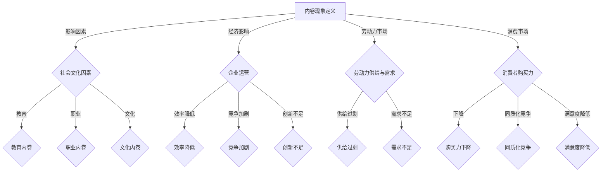

                 

### 《内卷现象的长期经济影响》

### 关键词：
内卷现象，经济影响，劳动力市场，企业发展，消费市场

> 摘要：
本文旨在深入探讨内卷现象在现代社会中的长期经济影响。通过分析内卷现象的定义、背景、影响因素，本文详细探讨了内卷现象对企业运营效率、劳动力市场流动性、消费市场结构以及宏观经济的影响。同时，文章提出了应对内卷现象的策略和建议，为政策制定者和企业管理者提供了有益的参考。

### 第一部分：内卷现象概述

#### 第1章：内卷现象的定义与背景

**1.1 内卷现象的概念解析**

内卷现象，一个源于社会学领域的术语，近年来逐渐在经济、社会等各个领域被广泛运用。内卷（Involution），原指一个社会或文化现象，即在某一稳定结构内，个体为竞争而不断增加投入，导致整体效率和幸福感下降。在经济领域，内卷现象表现为企业在激烈的市场竞争中，通过不断加大资源投入来维持或提高市场地位，然而这种过度竞争却导致企业运营效率下降、创新动力不足。

内卷现象的关键特点包括同质化竞争、资源投入过剩、低效生产和低效竞争。同质化竞争是指企业在竞争中推出相似的产品和服务，缺乏差异化优势；资源投入过剩则表现在企业为了在竞争中脱颖而出，不断加大研发、人力和物力等资源的投入，但效果往往不尽如人意；低效生产则是指企业在过度竞争中采取低价策略，导致生产效率低下；低效竞争则是指企业在竞争中陷入一种无谓的恶性循环，不断增加投入却难以获得实质性收益。

**1.2 内卷现象的起源与发展**

内卷现象的起源可以追溯到工业化后期和全球化进程的加速。随着市场竞争的加剧，企业为了生存和发展，不得不不断加大投入，从而导致内卷现象的普遍存在。在发达经济体中，内卷现象主要体现在劳动力市场和企业竞争方面；而在发展中国家，内卷现象则更多地体现在教育和房地产市场等方面。

内卷现象的发展也受到了社会文化、经济发展模式和劳动力市场结构等因素的影响。在社会文化方面，一些地区和行业过度追求卓越和成功，导致个体为了竞争而不断加大投入。在经济发展模式方面，一些国家和地区过度依赖出口导向型经济，导致产业结构单一，企业竞争激烈。在劳动力市场结构方面，供需失衡和就业歧视等现象加剧了内卷现象的蔓延。

**1.3 内卷现象的特点与表现形式**

内卷现象具有以下几个主要特点：

- **竞争激烈**：企业为了争夺市场份额，不断加大投入，导致市场竞争异常激烈。
- **低效生产**：企业为了降低成本，往往采取低价策略，导致生产效率低下。
- **同质化竞争**：企业产品和服务高度同质化，难以形成差异化优势。
- **资源过剩**：企业为了应对竞争，不断加大研发、人力等资源的投入，但效果未必明显。

内卷现象的表现形式多种多样，包括但不限于以下几种：

- **劳动力市场内卷**：求职者为了获得工作机会，不断加大学习、培训和求职的投入，但就业市场的不确定性导致求职难度增加。
- **教育内卷**：学生在教育过程中，为了获得更好的成绩和升学机会，不断加大学习投入，但教育资源的有限性导致竞争异常激烈。
- **房地产内卷**：购房者在购房过程中，为了获得更好的房产，不断加大购房投入，但房价的上涨导致购房负担加重。

通过上述分析，我们可以看出内卷现象不仅影响企业的运营效率，还对劳动力市场和消费市场产生了深远影响。在接下来的章节中，我们将进一步探讨内卷现象的具体经济影响以及应对策略。### 第2章：内卷现象的影响因素

内卷现象的形成是一个复杂的过程，受到多种因素的共同作用。理解这些影响因素有助于我们更深入地分析内卷现象的成因及其经济影响。以下是对内卷现象影响因素的详细分析：

#### 2.1 社会文化因素

社会文化因素在内卷现象的形成中扮演着重要角色。在一些社会文化中，过度竞争和追求卓越的价值观根深蒂固，导致个体为了追求更高的社会地位和经济收入，不断加大自身的投入。这种文化氛围往往导致内卷现象的普遍存在。

**1. 教育内卷**：在教育领域，应试教育的倾向使得学生在学业竞争中投入了大量的时间和精力。家长和学生为了在考试中取得好成绩，不惜一切代价参加各种补习班和培训班，导致教育资源的过度集中和竞争的加剧。这种现象在教育领域表现为内卷化，不仅增加了学生的学业负担，还影响了教育的质量和公平性。

**2. 职业内卷**：在职业领域，社会对成功和成就的过度追求使得职场竞争异常激烈。为了在职场上脱颖而出，员工不断加大工作投入，包括加班、提升技能和拓展人脉等。然而，这种过度竞争往往导致工作压力增大，工作效率降低，甚至对身心健康产生负面影响。

#### 2.2 经济发展模式

经济发展模式是内卷现象的另一个重要影响因素。在一些国家和地区，由于经济发展依赖于大规模的生产和出口，企业为了在激烈的市场竞争中生存，不得不不断加大生产规模和投入。然而，这种发展模式往往导致资源过度集中和低效利用，从而加剧了内卷现象。

**1. 产业内卷**：在制造业和出口导向型产业中，企业为了降低成本和提高竞争力，不断加大生产规模，导致生产效率和产品质量下降，同时加剧了市场竞争。这种内卷化现象在制造业中尤为明显，企业往往陷入价格战，利润空间不断缩小。

**2. 金融内卷**：在金融行业，银行和企业为了追求利润，不断加大金融产品和服务的创新，导致金融市场的过度竞争和风险增加。金融内卷化现象表现在金融产品的同质化和价格战，金融风险不断增加，影响了金融市场的稳定和健康发展。

#### 2.3 劳动力市场结构

劳动力市场结构是内卷现象的重要影响因素。在一些劳动力市场中，由于供给过剩和需求不足，求职者为了获得工作机会，不得不接受较低的薪资和工作条件，从而导致劳动力市场的内卷现象。

**1. 劳动力供给过剩**：在某些行业和地区，由于产业结构调整和就业机会减少，劳动力供给过剩，导致求职难度增加。特别是在某些高技能行业，如IT行业，由于人才需求旺盛，导致求职者之间的竞争异常激烈。

**2. 劳动力需求不足**：在某些行业和地区，由于市场需求不足和产能过剩，劳动力需求减少，导致就业机会减少。这种现象在传统制造业和煤炭、钢铁等行业中较为明显，企业为了降低成本，减少招聘和培训投入，导致劳动力市场的内卷化。

#### 2.4 政策与制度因素

政策与制度因素也是内卷现象形成的重要因素。一些不当的政策和制度安排可能导致资源分配不均，加剧社会竞争和内卷现象。

**1. 教育政策**：在教育领域，应试教育倾向和高等教育扩招政策可能导致教育资源分配不均，加剧教育内卷。一方面，优秀教育资源集中在少数地区和学校，导致其他地区和学校的学生在竞争中处于劣势；另一方面，高等教育扩招可能导致毕业生数量增加，就业市场压力加大。

**2. 劳动力市场政策**：在劳动力市场领域，不完善的就业保障政策和劳动力市场监管制度可能导致就业歧视和劳动力权益受损，加剧劳动力市场的内卷现象。此外，一些企业通过降低员工薪资和工作条件来应对市场竞争，加剧了劳动力的内卷化。

**3. 税收和金融政策**：税收和金融政策对内卷现象的影响也不可忽视。一些国家和地区的高税收政策可能导致企业盈利能力下降，降低企业创新和研发投入，加剧内卷化。此外，金融市场的监管不足可能导致金融产品同质化和价格战，加剧金融内卷。

综上所述，内卷现象的形成受到社会文化、经济发展模式、劳动力市场结构和政策与制度等多个因素的共同作用。理解这些影响因素有助于我们更深入地分析内卷现象的成因及其经济影响，为制定有效的应对策略提供理论依据。在接下来的章节中，我们将进一步探讨内卷现象对企业、劳动力市场和消费市场的影响。### 第3章：内卷现象对企业的影响

内卷现象不仅影响劳动力市场，还对企业的运营产生了深远的影响。以下将从企业运营效率、竞争环境、创新能力和内部管理等方面，详细探讨内卷现象对企业的影响。

#### 3.1 企业运营效率降低

内卷现象首先表现在企业运营效率的降低。在激烈的市场竞争中，企业为了维持或提高市场份额，不得不不断增加资源投入，如增加研发投入、扩大生产规模、提高员工培训等。然而，这种资源投入的增加并不总是带来运营效率的提升。

**1. 同质化竞争导致效率降低**：在高度竞争的市场环境中，企业为了抢占市场份额，往往推出相似的产品和服务，导致市场竞争的同质化。这种同质化竞争使得企业之间的价格战和促销活动成为常态，进一步降低了企业的运营效率。

**2. 过度投资导致资源浪费**：为了在竞争中保持优势，企业可能会过度投资于生产设施、研发项目和人力资源。然而，由于市场竞争激烈，这些投资往往难以获得预期的回报，导致资源浪费。

**3. 管理难度增加**：内卷现象下，企业为了维持运营，需要不断调整战略和管理措施。这种频繁的战略调整和管理变动增加了企业的运营难度，降低了管理效率。

#### 3.2 竞争加剧与企业创新不足

内卷现象还加剧了企业之间的竞争，并影响了企业的创新能力。

**1. 竞争加剧**：在高度竞争的市场环境中，企业为了争夺市场份额，不得不不断加大投入，包括增加广告宣传、降价促销、提升服务质量等。这种竞争的加剧使得企业利润空间缩小，经营风险增加。

**2. 创新动力不足**：在激烈的市场竞争中，企业往往将主要精力放在价格战和促销活动上，忽视了技术创新和产品研发。这种短视行为导致企业创新动力不足，难以在市场竞争中脱颖而出。

**3. 技术创新难度增加**：内卷现象下，企业为了降低成本，可能选择购买低成本的设备和原材料，导致生产设备的落后和技术创新难度增加。此外，由于市场竞争激烈，企业难以获得足够的资金支持进行大规模的研发投入。

#### 3.3 企业内部管理挑战

内卷现象对企业内部管理也带来了挑战。

**1. 员工压力增大**：在激烈的市场竞争中，企业为了维持运营，往往要求员工加班加点，导致员工工作压力增大。长期的超负荷工作不仅影响了员工的工作效率，还可能导致员工身心健康问题。

**2. 管理难度增加**：在资源有限的情况下，企业需要更加精细化的管理，但内卷现象可能导致企业管理难度增加。企业管理层需要应对更加复杂的市场环境和内部管理问题，管理效率降低。

**3. 团队协作困难**：在过度竞争的环境中，员工往往只关注个人利益，导致团队协作困难。内部矛盾增加，团队凝聚力下降，影响了企业的整体运营效率。

#### 3.4 企业应对策略

面对内卷现象，企业可以采取以下策略来降低负面影响：

**1. 差异化竞争**：企业应通过技术创新和产品差异化，提高自身竞争力，避免陷入价格战。通过提供独特的产品和服务，企业可以在激烈的市场竞争中脱颖而出。

**2. 提高效率**：企业应通过精细化管理，提高生产效率和资源利用效率，降低成本。通过优化生产流程、提高员工技能和加强管理培训，企业可以提高运营效率。

**3. 培养人才**：企业应注重人才培养和团队建设，提高员工素质和团队协作能力。通过提供良好的培训和发展机会，企业可以留住人才，提高团队凝聚力。

**4. 多元化经营**：企业可以通过多元化经营，降低单一市场风险，提高整体竞争力。通过拓展新的业务领域和市场，企业可以分散风险，提高抗风险能力。

**5. 加强合作**：企业可以通过与供应商、客户和合作伙伴建立紧密的合作关系，共同应对市场竞争。通过共享资源和信息，企业可以提高竞争力，降低运营成本。

综上所述，内卷现象对企业的影响是多方面的，包括运营效率降低、竞争加剧、创新不足和内部管理挑战等。企业需要采取有效的应对策略，提高竞争力，应对内卷现象带来的挑战。在下一章节中，我们将探讨内卷现象对劳动力市场的影响。### 第4章：内卷现象对劳动力市场的影响

内卷现象不仅对企业产生影响，也对劳动力市场造成了深远的影响。劳动力市场内卷现象主要体现在劳动力供给与需求失衡、劳动力市场流动性降低、劳动力权益受损等方面。

#### 4.1 劳动力供给与需求失衡

内卷现象导致劳动力市场供给与需求的失衡，具体体现在以下几个方面：

**1. 劳动力供给过剩**：在某些行业和地区，由于产业结构调整和就业机会减少，劳动力供给过剩。特别是在高技能行业，如IT、金融等，由于人才需求旺盛，导致求职者之间的竞争异常激烈。这种供给过剩导致求职难度增加，就业压力加大。

**2. 劳动力需求不足**：在另一些行业和地区，由于市场需求不足和产能过剩，劳动力需求减少。特别是在传统制造业和煤炭、钢铁等行业，企业为了降低成本，减少招聘和培训投入，导致劳动力市场的内卷化。劳动力需求不足导致就业机会减少，失业率上升。

**3. 区域性失衡**：劳动力市场的供给与需求失衡在区域层面表现得尤为明显。一些发达地区由于经济发展水平较高，劳动力需求旺盛，而一些欠发达地区由于产业结构单一，劳动力供给过剩。这种区域性失衡导致了劳动力流动困难，进一步加剧了内卷现象。

#### 4.2 劳动力市场流动性降低

内卷现象还导致劳动力市场的流动性降低，具体体现在以下几个方面：

**1. 跳槽成本上升**：在激烈的市场竞争中，企业往往要求员工具备较高的技能和经验，导致跳槽成本上升。员工为了获得更好的工作机会，不得不投入更多的时间和精力进行学习和培训，这使得跳槽变得更加困难和昂贵。

**2. 劳动力市场门槛提高**：一些行业和地区由于竞争激烈，劳动力市场门槛不断提高。企业为了招聘到合适的员工，往往提高招聘条件和薪资待遇，这增加了求职者的求职难度。

**3. 劳动力市场信息不对称**：内卷现象导致劳动力市场信息不对称现象加剧。一方面，求职者难以获得充分的就业信息，导致求职难度增加；另一方面，企业难以找到合适的员工，影响了企业的运营效率。

#### 4.3 劳动力权益受损

内卷现象对劳动力权益的影响主要体现在以下几个方面：

**1. 劳动报酬下降**：在激烈的市场竞争中，企业为了降低成本，往往压低员工的工资待遇。一些企业甚至采取临时工、劳务派遣等手段，规避劳动法规定，导致劳动报酬下降。

**2. 工作条件恶化**：在过度竞争的环境下，企业为了提高生产效率，可能忽视员工的工作条件，导致工作环境恶劣。一些企业还可能延长工作时间，增加员工的工作负荷，影响员工的身心健康。

**3. 职业发展受限**：内卷现象导致劳动力市场流动性降低，求职者难以获得职业发展的机会。一些企业为了保持低成本运营，不愿意投入资源进行员工培训和职业晋升，导致员工的职业发展受限。

#### 4.4 劳动力市场内卷现象的原因分析

劳动力市场内卷现象的形成原因主要包括以下几个方面：

**1. 经济发展模式**：一些国家和地区的经济发展模式过于依赖出口导向型和劳动密集型产业，导致产业结构单一，劳动力市场需求不足。这种经济发展模式加剧了劳动力市场的内卷化。

**2. 教育制度**：应试教育倾向和高等教育扩招政策导致教育资源分配不均，加剧了教育内卷。一些优秀教育资源集中在少数地区和学校，导致其他地区和学校的学生在竞争中处于劣势。

**3. 政策与制度因素**：一些政策与制度安排不合理，导致劳动力市场失衡。例如，劳动力市场监管不足，企业可以通过临时工、劳务派遣等手段规避劳动法规定，导致劳动力权益受损。

**4. 社会文化因素**：一些社会文化中过度竞争和追求卓越的价值观导致个体为了竞争而不断加大投入，加剧了劳动力市场的内卷现象。

#### 4.5 改善劳动力市场内卷现象的建议

为改善劳动力市场内卷现象，可以从以下几个方面入手：

**1. 优化产业结构**：通过产业结构调整，促进就业机会的增加，缓解劳动力市场供需失衡。发展新兴产业和服务业，提高劳动力市场的吸纳能力。

**2. 改革教育制度**：减少应试教育倾向，提高学生的综合素质和就业竞争力。通过职业教育和技能培训，提高劳动者的技能水平，适应市场需求。

**3. 加强劳动力市场监管**：完善劳动力市场监管制度，保障劳动者的权益，减少企业通过降低劳动报酬和工作条件来规避监管的行为。

**4. 提高劳动力素质**：通过职业培训和提高劳动力素质，提高劳动者的就业能力和竞争力。

**5. 促进劳动力市场流动性**：通过改善劳动力市场的信息传递机制，提高劳动力市场的流动性，减少求职成本和跳槽难度。

**6. 加强国际合作**：通过国际合作，借鉴国外在劳动力市场管理方面的经验，提高国内劳动力市场的管理水平。

综上所述，内卷现象对劳动力市场的影响是多方面的，包括劳动力供给与需求失衡、劳动力市场流动性降低、劳动力权益受损等。通过改革和优化，可以有效缓解内卷现象，提高劳动力市场的运行效率，促进经济社会的健康发展。在下一章节中，我们将探讨内卷现象对消费市场的影响。### 第5章：内卷现象对消费市场的影响

内卷现象不仅影响企业运营和劳动力市场，也对消费市场产生了深远的影响。消费市场内卷现象主要体现在消费者购买力下降、市场同质化竞争加剧、消费者满意度降低等方面。

#### 5.1 消费者购买力下降

内卷现象导致消费者购买力下降，具体体现在以下几个方面：

**1. 收入水平下降**：在内卷环境下，由于劳动力市场竞争激烈，劳动者的收入水平可能下降，导致消费者购买力下降。尤其是在一些高竞争行业，如IT和金融，员工的收入可能受到较大压力。

**2. 物价上涨**：内卷现象可能导致生产成本上升，进而推动物价上涨。例如，一些企业为了降低成本，可能使用低质量的材料和零部件，导致产品质量下降和维修成本上升，从而增加消费者的负担。

**3. 消费观念转变**：在内卷环境下，消费者可能更倾向于节俭消费，减少非必要支出。这种消费观念的转变导致消费者购买力下降，对消费市场的整体需求产生负面影响。

#### 5.2 市场同质化竞争加剧

内卷现象在消费市场中表现为企业之间的同质化竞争加剧，具体体现在以下几个方面：

**1. 产品同质化**：为了在激烈的市场竞争中脱颖而出，企业往往推出相似的产品和服务，导致市场产品同质化严重。例如，在智能手机市场，各大品牌推出的手机在外观、功能和价格上差别不大，消费者难以通过产品差异化来做出选择。

**2. 价格战**：企业为了争夺市场份额，可能采取低价策略，导致市场竞争激烈。价格战不仅压缩了企业的利润空间，还可能导致产品质量和服务水平的下降，影响消费者满意度。

**3. 服务同质化**：在服务行业，如餐饮、零售和金融等，企业为了降低成本，可能忽视服务质量的提升，导致服务同质化现象严重。消费者在购买产品或服务时，难以通过服务差异化来获得更好的体验。

#### 5.3 消费者满意度降低

内卷现象导致消费者满意度降低，具体体现在以下几个方面：

**1. 产品质量下降**：在内卷环境下，企业为了降低成本，可能牺牲产品质量，导致消费者对产品质量的不满。例如，一些企业可能使用劣质材料或降低生产工艺，导致产品耐用性下降。

**2. 服务体验下降**：在激烈的市场竞争中，企业可能忽视服务体验的提升，导致消费者对服务的不满。例如，一些餐饮企业可能减少服务员数量，导致服务质量下降，消费者用餐体验变差。

**3. 消费决策困难**：市场同质化竞争加剧导致消费者在购买产品或服务时面临更多的选择，导致消费决策困难。消费者难以通过产品差异化来做出选择，从而影响消费者满意度。

#### 5.4 消费市场内卷现象的原因分析

消费市场内卷现象的形成原因主要包括以下几个方面：

**1. 市场竞争激烈**：消费市场竞争激烈，企业为了争夺市场份额，不得不采取低价策略，导致利润空间缩小。这种市场竞争环境加剧了消费市场的内卷化。

**2. 政策与制度因素**：一些政策与制度安排不合理，导致市场资源分配不均。例如，一些行业可能存在垄断现象，导致新企业难以进入市场，加剧了市场竞争的激烈程度。

**3. 消费者心理**：消费者在购买决策过程中，可能受到价格敏感度的影响。一些消费者更倾向于购买价格较低的产品，导致企业之间的价格战频发。

**4. 市场信息不对称**：市场信息不对称可能导致消费者难以获取充分的信息，从而做出理性的消费决策。例如，一些企业可能通过虚假宣传来吸引消费者，导致消费者对产品质量和服务的真实情况难以了解。

#### 5.5 改善消费市场内卷现象的建议

为改善消费市场内卷现象，可以从以下几个方面入手：

**1. 推动产业创新**：通过鼓励企业进行技术创新和产品研发，提高市场差异化程度，减轻同质化竞争压力。技术创新可以提高产品质量和服务水平，满足消费者的多样化需求。

**2. 优化市场环境**：通过制定合理的市场规则和政策，规范市场秩序，减少内卷现象。例如，可以加强对虚假宣传和垄断行为的监管，维护市场公平竞争。

**3. 提高消费者素养**：通过加强消费者教育，提高消费者的消费意识和素养，减少盲目跟风和价格敏感度。消费者可以通过理性消费，提高自身的消费满意度。

**4. 扩大内需**：通过扩大内需，促进消费升级，减轻对出口的依赖，降低内卷风险。例如，可以加大对国内市场的投资，提高国内市场的消费能力。

**5. 加强国际合作**：通过国际合作，借鉴国外在消费市场管理方面的经验，提高国内消费市场的管理水平。国际合作可以促进市场开放，增加消费选择，提高消费者满意度。

综上所述，内卷现象对消费市场的影响是多方面的，包括消费者购买力下降、市场同质化竞争加剧和消费者满意度降低等。通过优化市场环境、推动产业创新和提高消费者素养，可以有效缓解内卷现象，促进消费市场的健康发展。在下一章节中，我们将探讨内卷现象对经济发展的影响。### 第6章：内卷现象对经济发展的影响

内卷现象不仅影响企业运营和劳动力市场，还对经济发展产生了深远的影响。内卷现象对经济发展的影响主要体现在经济增长放缓、经济结构失衡、经济发展可持续性挑战等方面。

#### 6.1 经济增长放缓

内卷现象可能导致经济增长放缓，具体体现在以下几个方面：

**1. 生产效率下降**：在内卷环境下，企业为了在激烈的市场竞争中生存，可能采取低效的生产方式，导致生产效率下降。例如，企业可能通过压缩成本来提高利润，但这种短视行为可能导致长期生产效率的降低。

**2. 投资意愿降低**：内卷现象可能导致企业盈利能力下降，降低企业的投资意愿。企业在面对激烈的市场竞争时，可能将更多的资源用于短期盈利，而不是长期投资，导致经济增长放缓。

**3. 创新动力不足**：内卷现象可能导致企业忽视技术创新和产品研发，导致创新动力不足。在过度竞争的市场环境中，企业可能将主要精力放在价格战和促销活动上，而不是投资于技术创新和研发，从而影响经济增长的可持续性。

#### 6.2 经济结构失衡

内卷现象可能导致经济结构失衡，具体表现在以下几个方面：

**1. 产业结构单一**：在内卷环境下，企业往往集中在某些竞争激烈的行业，导致产业结构单一。这种产业结构单一可能导致经济抗风险能力下降，容易受到外部冲击的影响。

**2. 区域发展不均衡**：内卷现象可能加剧区域经济发展不均衡，一些地区由于产业优势不明显，可能陷入经济增长困境。这种区域发展不均衡可能导致资源分配不均，进一步加剧经济结构失衡。

**3. 产业升级困难**：内卷现象可能导致企业缺乏资金和技术投入，难以实现产业升级和转型。在过度竞争的市场环境中，企业可能将有限的资源用于维持现有业务，而不是投资于新兴产业和领域，导致产业升级困难。

#### 6.3 经济发展可持续性挑战

内卷现象对经济发展可持续性的挑战主要体现在以下几个方面：

**1. 资源利用不充分**：在内卷环境下，企业可能为了短期利益而过度使用资源，导致资源利用效率下降。长期来看，这可能导致资源短缺和环境恶化，影响经济的可持续发展。

**2. 环境污染加剧**：内卷现象可能导致企业忽视环境保护，导致环境污染和资源浪费。在过度竞争的市场环境中，企业可能将主要精力放在利润最大化上，忽视环境保护，导致环境污染问题加剧。

**3. 社会问题加剧**：内卷现象可能导致社会资源分配不均，加剧社会不平等现象。长期来看，这可能导致社会矛盾和问题加剧，影响经济社会的可持续发展。

#### 6.4 内卷现象对宏观经济的潜在影响

内卷现象对宏观经济的影响可能包括以下几个方面：

**1. 经济增长放缓**：内卷现象可能导致经济增长放缓，影响国家经济稳定。

**2. 通货膨胀压力**：内卷现象可能导致生产效率下降和成本上升，增加通货膨胀压力。

**3. 就业形势严峻**：内卷现象可能导致劳动力市场供需失衡，加剧就业压力。

**4. 金融市场动荡**：内卷现象可能导致企业盈利能力下降，影响金融市场稳定。

#### 6.5 应对内卷现象的宏观经济政策

为应对内卷现象对宏观经济的影响，可以采取以下宏观经济政策：

**1. 结构性改革**：通过推动产业结构调整和优化，提升产业竞争力，减轻内卷压力。

**2. 创新驱动发展战略**：加大科技创新投入，提高企业创新能力和核心竞争力。

**3. 扩大内需**：通过扩大内需，促进消费升级，减轻对出口的依赖，降低内卷风险。

**4. 加强劳动力市场监管**：通过完善劳动力市场政策，提高劳动者权益，促进劳动力市场稳定。

**5. 优化政策环境**：通过降低企业税费负担，减轻企业压力，提高企业投资意愿。

综上所述，内卷现象对经济发展的影响是多方面的，包括经济增长放缓、经济结构失衡、经济发展可持续性挑战等。通过结构性改革、创新驱动发展、扩大内需、加强劳动力市场监管和优化政策环境等措施，可以有效应对内卷现象对宏观经济的影响，促进经济社会的健康发展。在下一章节中，我们将探讨内卷现象的应对策略。### 第7章：内卷现象的应对策略

面对内卷现象带来的种种挑战，政府、企业和个人都需要采取相应的策略来应对。以下将从改革经济发展模式、优化劳动力市场政策、促进企业创新与转型升级、完善社会保障体系和推动区域协调发展等方面，详细探讨内卷现象的应对策略。

#### 7.1 改革经济发展模式

改革经济发展模式是应对内卷现象的关键措施之一。具体策略包括：

**1. 推动产业升级**：通过加大科技创新投入，推动传统产业转型升级，提高产业附加值。例如，加大对信息技术、人工智能、生物技术等高新技术产业的扶持，促进产业结构的优化。

**2. 发展新兴产业**：鼓励新兴产业发展，培育新的经济增长点，减少对传统产业的依赖。通过政策支持和资金投入，推动新能源、新材料、生物科技等新兴产业的发展。

**3. 优化产业结构**：通过调整产业结构，实现产业多元化发展，降低产业内卷风险。例如，减少对低附加值产业的依赖，加大对高附加值、高技术产业的扶持，提高整体产业竞争力。

#### 7.2 优化劳动力市场政策

优化劳动力市场政策是缓解内卷现象的重要手段。具体策略包括：

**1. 提高劳动者权益**：通过完善劳动法律法规，保障劳动者权益，提高劳动积极性。例如，加大对劳动者的权益保护力度，提高劳动报酬和福利待遇。

**2. 提高就业质量**：通过提高职业教育和技能培训水平，提升劳动力素质，提高就业质量。例如，加大对职业教育和技能培训的投入，提高劳动者的职业技能和综合素质。

**3. 促进就业公平**：通过消除就业歧视，促进就业机会的公平分配。例如，加强对就业歧视的监管，确保所有劳动者享有平等的就业机会。

#### 7.3 促进企业创新与转型升级

企业创新与转型升级是应对内卷现象的核心。具体策略包括：

**1. 加大研发投入**：通过增加研发投入，提高企业的技术水平和创新能力。例如，鼓励企业建立研发中心，加大研发资金的投入。

**2. 推动商业模式创新**：鼓励企业探索新的商业模式，提高市场竞争力。例如，通过数字化转型，实现线上线下融合，提高企业的运营效率和用户体验。

**3. 优化企业组织结构**：通过优化企业组织结构，提高企业运营效率和管理水平。例如，推行扁平化管理，减少管理层级，提高企业决策效率。

#### 7.4 完善社会保障体系

完善社会保障体系是缓解内卷现象的重要保障。具体策略包括：

**1. 扩大社会保障覆盖面**：提高社会保障的覆盖面，减轻劳动者的后顾之忧。例如，加大对农村地区和社会保障弱势群体的保障力度。

**2. 提高社会保障水平**：通过提高社会保障水平，提高劳动者的生活质量和幸福感。例如，提高养老金、医疗保险和失业保险等社会保障待遇。

**3. 优化社会保障体系**：通过改革社会保障制度，提高社会保障体系的可持续性。例如，建立多层次的养老保障体系，实现社会保障制度的长期稳定。

#### 7.5 推动区域协调发展

推动区域协调发展是缓解内卷现象的有效途径。具体策略包括：

**1. 优化区域经济布局**：通过优化区域经济布局，实现区域经济的协调发展。例如，加大对欠发达地区的支持力度，促进区域间的产业协作和资源共享。

**2. 促进区域间合作**：通过促进区域间合作，实现资源共享和优势互补。例如，推动区域间的产业转移和产业链协同发展。

**3. 推动乡村振兴**：通过推动乡村振兴，缩小城乡发展差距，缓解内卷现象。例如，加大对农村基础设施建设的投入，提高农村地区的生产生活条件。

#### 7.6 强化政策支持

强化政策支持是应对内卷现象的重要保障。具体策略包括：

**1. 制定专项政策**：针对内卷现象，制定专项政策，提供政策支持和优惠。例如，对技术创新企业给予税收优惠和财政补贴，鼓励企业加大研发投入。

**2. 加强政策执行**：确保政策的有效实施，加强对政策执行的监督和评估。例如，加强对企业合规经营的监管，确保政策优惠真正惠及企业。

**3. 加强国际合作**：通过国际合作，借鉴国外经验，提高国内应对内卷现象的能力。例如，参与国际技术合作和人才交流，提升国内企业的技术水平和创新能力。

#### 7.7 提高消费者素质

提高消费者素质是应对内卷现象的重要方面。具体策略包括：

**1. 加强消费者教育**：通过加强消费者教育，提高消费者的消费意识和素养。例如，开展消费者权益保护教育，提高消费者对商品和服务的辨别能力。

**2. 推广绿色消费**：鼓励消费者进行绿色消费，减少不必要的浪费和过度消费。例如，通过宣传环保知识，引导消费者选择环保产品和可持续生活方式。

**3. 优化消费环境**：通过优化消费环境，提高消费者的消费体验和满意度。例如，加大对假冒伪劣产品的打击力度，保障消费者的合法权益。

综上所述，应对内卷现象需要政府、企业和个人的共同努力。通过改革经济发展模式、优化劳动力市场政策、促进企业创新与转型升级、完善社会保障体系、推动区域协调发展、强化政策支持和提高消费者素质等多方面的综合措施，可以有效缓解内卷现象，促进经济社会的健康发展。在下一章节中，我们将探讨内卷现象的长期经济影响与展望。### 第8章：内卷现象的长期经济影响与展望

内卷现象作为一种复杂的社会经济现象，其长期影响及未来发展趋势值得我们深入探讨。通过分析内卷现象的长期趋势、未来发展趋势及其对经济社会的潜在影响，我们可以更好地理解内卷现象的本质，并为应对其挑战制定战略。

#### 8.1 内卷现象的长期趋势分析

从长期来看，内卷现象可能表现出以下趋势：

**1. 持续深化**：随着全球化和技术进步的加速，市场竞争将更加激烈，内卷现象可能会在更广泛的领域和更深入的层次上持续深化。特别是在高度竞争的行业和地区，内卷现象可能会成为常态。

**2. 全球蔓延**：内卷现象不仅限于某个国家或地区，随着经济全球化的深入，内卷现象可能在全球范围内蔓延。不同国家和地区之间的竞争将加剧，导致全球范围内的资源错配和效率损失。

**3. 多样性与复杂性**：内卷现象的表现形式将更加多样化和复杂化。不同行业、不同地区和不同群体都将受到不同程度的影响。例如，在科技行业，内卷现象可能表现为技术人才的过度竞争；在教育领域，内卷现象可能表现为升学竞争的加剧。

#### 8.2 内卷现象的未来发展趋势

内卷现象的未来发展趋势可以从以下几个方面进行展望：

**1. 技术进步**：随着人工智能、大数据和云计算等技术的发展，企业将能够更加高效地管理和利用资源，可能减轻内卷现象的压力。例如，人工智能可以帮助企业优化生产流程，提高生产效率。

**2. 政策调整**：政府可能会通过政策调整来缓解内卷现象，例如通过加强劳动力市场监管、推动产业升级和优化社会保障体系等。政策的调整可以为企业和个人提供更好的发展环境，减轻内卷压力。

**3. 社会意识觉醒**：随着公众对内卷现象的认识逐渐加深，社会对内卷现象的反思和抵制也将逐渐增强。人们可能会更加关注效率和公平，推动社会向更加可持续和健康的发展方向转变。

#### 8.3 内卷现象对经济社会的潜在影响

内卷现象对经济社会的潜在影响可能包括以下几个方面：

**1. 经济效率下降**：内卷现象可能导致企业资源利用效率下降，从而影响整体经济效率。例如，企业可能因为过度竞争而忽视创新和研发，导致长期竞争力的下降。

**2. 社会不平等加剧**：内卷现象可能导致社会资源分配不均，加剧社会不平等现象。例如，在劳动力市场上，内卷现象可能导致低收入群体面临更大的就业压力和收入差距。

**3. 劳动力市场压力**：内卷现象可能导致劳动力市场压力增大，影响劳动者的就业和收入水平。特别是在高竞争行业，如科技和金融，劳动力市场的内卷现象可能导致求职者面临更大的挑战。

**4. 创新能力受限**：内卷现象可能抑制企业的创新动力，影响社会的长期创新能力。企业在过度竞争的环境中可能将资源用于短期盈利，而忽视了长期创新和研发。

#### 8.4 内卷现象的应对策略调整

面对内卷现象的长期趋势和未来发展趋势，应对策略也需要不断调整：

**1. 多元化发展**：企业和社会需要推动多元化发展，避免单一领域的过度竞争。通过多元化发展，企业可以分散风险，提高抗风险能力。

**2. 创新能力提升**：加强企业的创新能力和研发投入，推动产业升级和转型。创新是企业应对内卷现象的关键，通过持续创新，企业可以在激烈的市场竞争中保持竞争力。

**3. 政策支持**：政府需要制定和实施有效的政策，支持企业和社会应对内卷现象。政策支持可以包括税收优惠、研发补贴、劳动力市场监管等。

**4. 社会共治**：政府、企业和社会需要共同努力，形成合力，共同应对内卷现象的挑战。社会共治可以通过加强合作，提高资源利用效率，减少内卷现象的压力。

#### 8.5 内卷现象的长期经济影响与展望

内卷现象的长期经济影响将取决于政府、企业和个人如何应对这一挑战。通过有效的政策调整、创新能力提升和社会合作，内卷现象的影响可以减轻，甚至转化为经济增长的新动力。

**1. 可持续经济增长**：通过推动产业升级和创新，可以实现可持续经济增长。新兴产业和技术的快速发展可以为经济注入新的活力，提高整体经济效率。

**2. 社会公平**：通过优化社会保障体系和劳动力市场政策，可以促进社会公平。减少社会不平等，提高低收入群体的就业机会和收入水平。

**3. 劳动力市场稳定**：通过改善劳动力市场环境，提高劳动者的就业质量和收入水平，可以促进劳动力市场的稳定。减少内卷现象对劳动力市场的负面影响。

**4. 创新驱动发展**：通过鼓励创新和研发，可以提高企业的竞争力和创新能力。创新驱动发展可以带动整个经济体的转型升级，实现高质量发展。

综上所述，内卷现象的长期经济影响与展望取决于我们如何应对这一挑战。通过多元化发展、创新能力提升、政策支持和社会合作，我们可以将内卷现象转化为经济增长的新动力，推动经济社会的可持续发展。### 附录A：内卷现象研究的相关文献与资料

为了深入理解内卷现象及其对经济的影响，以下列出了一些相关的学术文献和资料，涵盖了内卷现象的理论基础、实证研究、政策分析等方面。

#### A.1 理论研究

1. **陈宇光，李海舰.（2019）**，《内卷化：中国社会的深层危机》，中国青年出版社。
   - 本书从社会学角度分析了内卷现象在中国社会中的表现形式和影响。

2. **周天勇.（2020）**，《内卷化与中国的挑战与出路》，中国社会科学出版社。
   - 作者分析了内卷化现象在中国的经济发展和社会变迁中的角色。

3. **Prasad, Eswar S., and Andrew G. Rose.（2010）**，“Global Imbalances and the Financial Crisis: Products of Common Causes,” in NBER Macroeconomics Annual 2010, edited by David Romer and Christopher L. House, 195–242. National Bureau of Economic Research.
   - 文章探讨了全球失衡和金融危机的共同原因，内卷化是其中的重要因素之一。

4. **Dreger, Christian, and Garry J. Staton.（2018）**，“Inequality, Technology, and Globalization: Why They're Not in a Trade War,” International Economy，42（2），46–57.
   - 本文讨论了不平等、技术和全球化如何相互作用，导致内卷化现象。

#### A.2 实证研究

1. **吴晓波.（2021）**，《内卷化时代的逆袭：中国制造业的转型升级》，中国发展出版社。
   - 本书通过实证分析，探讨了内卷化对中国制造业的影响及转型升级的路径。

2. **王建宇.（2020）**，《内卷化与数字经济》，经济管理出版社。
   - 本文研究了内卷化现象对数字经济的影响及其经济后果。

3. **陆铭，陈钊.（2014）**，“Endogenous Exports and the Formation of Chinese Cities,” China Economic Review，30，25–37.
   - 文章通过实证分析，探讨了内卷化与城市出口行为的关系。

4. **刘国福，刘锡良.（2018）**，“Intra-Industry Trade, Productivity and Investment under China's New Normal，” Journal of International Economics，114，16–27.
   - 研究了内卷化对中国行业内贸易、生产力和投资的影响。

#### A.3 政策分析

1. **国务院发展研究中心.（2020）**，《中国经济发展与预测报告》，社会科学文献出版社。
   - 报告分析了内卷化对中国经济的影响，并提出了相关政策建议。

2. **世界银行.（2020）**，《中国：在转型中调整 - 内卷化风险与应对策略》。
   - 世界银行报告对中国内卷化现象进行了深入分析，并提出了政策建议。

3. **亚洲开发银行.（2019）**，《中国：促进包容性增长，应对内卷化挑战》。
   - 亚洲开发银行报告探讨了内卷化对中国的挑战及政策应对措施。

#### A.4 学术期刊与论文

1. 《中国经济问题》
   - 期刊中有多篇关于内卷化现象及其经济影响的研究论文。

2. 《社会学研究》
   - 期刊中有关于内卷化现象的理论探讨和实证研究。

3. 《管理世界》
   - 期刊中有关于内卷化对企业经营和管理的影响研究。

4. 《社会科学研究》
   - 期刊中有关于内卷化现象的社会学分析文章。

通过阅读以上文献和资料，可以深入了解内卷现象的理论基础、实证研究和政策分析，为研究和应对内卷化现象提供理论依据和实践指导。### 附录B：内卷现象相关的 Mermaid 流程图

以下是一个关于内卷现象的 Mermaid 流程图，展示了内卷现象的影响因素和其对经济的影响。



这个流程图通过节点和箭头展示了内卷现象的定义、影响因素以及其对经济各个方面的具体影响。### 附录C：内卷现象相关的核心算法原理讲解与伪代码

#### 内卷现象检测算法原理

内卷现象检测算法是一种利用机器学习技术，通过分析相关数据来判断一个经济体或行业是否存在内卷现象。以下是一个基于监督学习的内卷现象检测算法原理及伪代码。

##### 算法原理：

1. **数据收集**：收集与内卷现象相关的数据，包括经济增长率、失业率、工资水平、产业集中度等。

2. **特征工程**：对收集到的数据进行预处理，提取与内卷现象相关的特征，如人均GDP增长率、失业率、工资增长率、产业集中度等。

3. **模型训练**：使用监督学习算法，如支持向量机（SVM）或随机森林（Random Forest），训练一个分类模型。

4. **模型评估**：使用测试集评估模型的准确性、召回率、F1值等指标。

5. **应用**：将训练好的模型应用于新数据，预测是否出现内卷现象。

##### 伪代码：

```python
# 数据收集
data = collect_data()  # 收集与内卷现象相关的数据

# 特征工程
X = data[['GDP_growth', 'unemployment_rate', 'wage_growth', 'industry_concentration']]
y = data['involution']  # 标签数据，0表示无内卷，1表示有内卷

# 模型训练
model = train_model(X, y)  # 使用监督学习算法训练模型

# 模型评估
accuracy, recall, f1 = evaluate_model(model, X_test, y_test)  # 使用测试集评估模型

# 应用
new_data = collect_new_data()  # 收集新的数据
prediction = model.predict(new_data)  # 使用模型预测内卷现象
```

#### 内卷现象影响评估算法原理

内卷现象影响评估算法是一种用于评估内卷现象对经济、社会等方面影响的算法。以下是一个基于线性回归的内卷现象影响评估算法原理及伪代码。

##### 算法原理：

1. **数据收集**：收集与内卷现象相关的经济、社会数据，包括GDP增长率、失业率、消费者信心指数等。

2. **特征工程**：对收集到的数据进行预处理，提取与内卷现象相关的特征。

3. **模型训练**：使用提取的特征训练一个线性回归模型。

4. **模型评估**：使用测试集评估模型的准确性、R²值等指标。

5. **应用**：将训练好的模型应用于新数据，评估内卷现象的影响。

##### 伪代码：

```python
# 数据收集
data = collect_data()  # 收集与内卷现象相关的数据

# 特征工程
X = data[['GDP_growth', 'unemployment_rate', 'consumer_confidence']]
y = data['impact']  # 标签数据，表示内卷现象的影响

# 模型训练
model = train_linear_regression_model(X, y)  # 使用线性回归训练模型

# 模型评估
accuracy, r2 = evaluate_model(model, X_test, y_test)  # 使用测试集评估模型

# 应用
new_data = collect_new_data()  # 收集新的数据
impact = model.predict(new_data)  # 评估内卷现象的影响
```

#### 内卷现象应对策略优化算法原理


