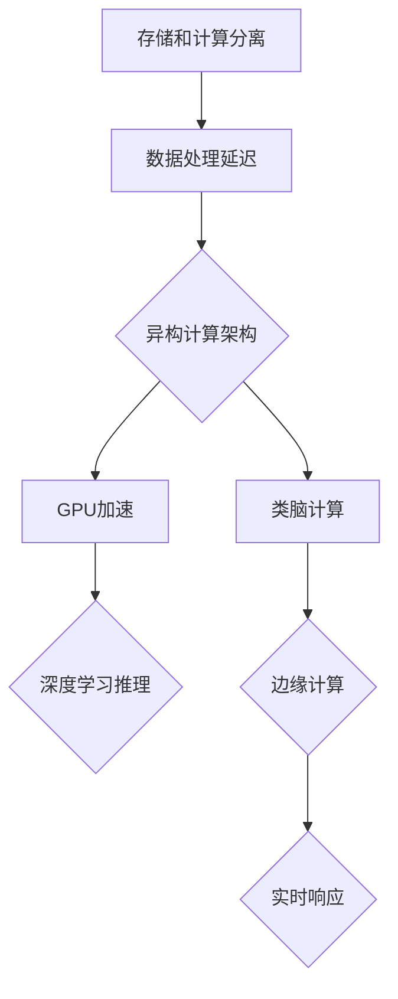

                 

### 引言

在计算机科学的历史长河中，冯·诺依曼架构（Von Neumann Architecture）无疑是一个里程碑式的存在。它自1940年代诞生以来，成为了现代计算机系统的基石。然而，随着人工智能（AI）技术的迅速崛起，冯·诺依曼架构开始暴露出其固有的局限性。本篇文章将深入探讨冯·诺依曼架构在AI时代的挑战，并通过一步一步的分析推理，揭示其背后的技术原理和本质问题。

#### AI时代的来临

人工智能技术的快速发展，已经将我们带入了一个全新的时代。从早期的规则系统，到现在的深度学习、强化学习等复杂算法，AI在图像识别、自然语言处理、自动驾驶等领域取得了显著的成果。这一系列进步不仅改变了我们的生活方式，也对计算架构提出了更高的要求。

**AI发展的主要趋势**包括：

1. **数据量的指数增长**：随着物联网（IoT）和大数据的普及，数据量呈现出爆炸式增长。传统的冯·诺依曼架构在处理如此庞大的数据量时，面临着巨大的压力。
2. **计算需求的提高**：深度学习等AI算法需要大量的计算资源。传统的CPU架构已经无法满足这种需求，催生了GPU、TPU等异构计算架构的出现。
3. **实时性的需求**：自动驾驶、智能机器人等应用场景需要系统具备实时响应的能力。冯·诺依曼架构在处理延迟和并行计算方面的不足，成为了AI应用的瓶颈。

#### 冯·诺依曼架构的历史背景

冯·诺依曼架构由匈牙利裔美国数学家约翰·冯·诺依曼（John von Neumann）在1940年代提出。这种架构的核心思想是将计算机的存储和计算功能分离，并采用存储程序计算机（Stored Program Computer）的概念。

**存储程序计算机原理**：存储程序计算机将指令和数据存储在同一块存储器中，通过程序计数器依次执行指令。这种设计使得计算机可以像人一样，通过编写程序来执行复杂的任务。

**CPU、内存、输入输出设备的工作原理**：

1. **CPU（中央处理器）**：CPU负责执行计算机程序中的指令。它由运算单元、控制单元和寄存器组成，是计算机的核心。
2. **内存（Memory）**：内存用于存储数据和指令。它分为随机存取存储器（RAM）和只读存储器（ROM）。RAM用于临时存储正在使用的指令和数据，而ROM则用于存储启动计算机时需要的初始指令。
3. **输入输出设备（I/O Devices）**：输入输出设备负责与外部世界进行数据交换。例如，键盘、鼠标、显示器、硬盘等。

#### 冯·诺依曼架构的局限性

尽管冯·诺依曼架构在计算机科学的发展中发挥了重要作用，但它在面对AI时代的挑战时，却暴露出了一些显著的局限性。

**计算能力限制**：冯·诺依曼架构依赖于传统的CPU架构，这种架构在处理复杂计算任务时，存在计算能力不足的问题。

**数据处理延迟**：冯·诺依曼架构中的存储和计算分离，导致了数据传输和处理的延迟。这在AI应用中尤为明显，因为AI算法需要大量的数据处理和实时响应。

**存储和计算分离的问题**：存储和计算分离使得系统的复杂性和数据传输开销增加，这在AI时代的需求下，显得愈发严重。

在接下来的章节中，我们将进一步探讨这些局限性，并探讨如何通过异构计算架构、类脑计算架构等新技术，克服这些挑战。

### 第1章: 引言

随着人工智能（AI）技术的迅猛发展，我们对计算架构的需求也在不断演变。冯·诺依曼架构，尽管在过去的几十年里主导了计算机科学的发展，但在面对AI时代的挑战时，却逐渐显露出其局限性。本文将深入探讨冯·诺依曼架构在AI时代面临的挑战，并通过逻辑清晰、结构紧凑的分析推理，揭示其背后的技术原理和本质问题。

#### AI时代的来临

人工智能技术的崛起，标志着我们进入了一个全新的时代。从早期的专家系统（Expert Systems），到现在的深度学习（Deep Learning）、强化学习（Reinforcement Learning），AI在各个领域的应用日益广泛。特别是深度学习，它通过多层神经网络模拟人脑的学习过程，已经在图像识别、自然语言处理、语音识别等领域取得了显著的成果。

**AI发展的主要趋势**包括：

1. **数据量的指数增长**：随着物联网（IoT）和大数据的普及，数据量呈现出爆炸式增长。根据IDC的报告，全球数据量预计在2025年将达到175ZB。这种庞大的数据量对计算架构提出了更高的要求。
2. **计算需求的提高**：深度学习等AI算法需要大量的计算资源。传统CPU架构已经无法满足这种需求，催生了GPU（图形处理单元）、TPU（张量处理单元）等异构计算架构的出现。
3. **实时性的需求**：自动驾驶、智能机器人等应用场景需要系统具备实时响应的能力。冯·诺依曼架构在处理延迟和并行计算方面的不足，成为了AI应用的瓶颈。

#### 冯·诺依曼架构的基本概念

冯·诺依曼架构，也称为存储程序计算机架构，是由匈牙利裔美国数学家约翰·冯·诺依曼（John von Neumann）在1940年代提出的。这种架构的核心思想是将计算机的存储和计算功能分离，并采用存储程序计算机的概念。

**存储程序计算机原理**：存储程序计算机将指令和数据存储在同一块存储器中，通过程序计数器依次执行指令。这意味着计算机可以通过编写程序来执行复杂的任务，就像人类一样。程序计数器负责指示下一个要执行的指令的位置，而存储器则用于存储程序和数据。

**CPU、内存、输入输出设备的工作原理**：

1. **CPU（中央处理器）**：CPU是计算机的核心，负责执行计算机程序中的指令。它由运算单元（ALU）、控制单元（CU）和寄存器组成。运算单元执行具体的算术和逻辑运算，控制单元则负责协调和控制整个计算机的运作，寄存器则用于临时存储数据和指令。

2. **内存（Memory）**：内存用于存储数据和指令。内存分为随机存取存储器（RAM）和只读存储器（ROM）。RAM用于临时存储正在使用的指令和数据，它是一种易失性存储器，即断电后存储内容会消失。ROM则用于存储启动计算机时需要的初始指令，它是一种非易失性存储器，即断电后存储内容不会消失。

3. **输入输出设备（I/O Devices）**：输入输出设备负责与外部世界进行数据交换。常见的输入设备包括键盘、鼠标、扫描仪等，而输出设备包括显示器、打印机、扬声器等。硬盘（Hard Disk Drive, HDD）和固态硬盘（Solid State Drive, SSD）是常见的存储设备，它们用于长期存储数据和文件。

#### 冯·诺依曼架构的局限性

尽管冯·诺依曼架构在计算机科学的发展中发挥了重要作用，但它在面对AI时代的挑战时，却暴露出了一些显著的局限性。

**计算能力限制**：冯·诺依曼架构依赖于传统的CPU架构，这种架构在处理复杂计算任务时，存在计算能力不足的问题。CPU的核心是由大量的逻辑门组成的，它们执行基本的算术和逻辑运算。然而，对于深度学习等复杂的AI算法，CPU的计算能力远远不够。

**数据处理延迟**：冯·诺依曼架构中的存储和计算分离，导致了数据传输和处理的延迟。这意味着，当CPU需要访问数据时，它需要从内存中读取数据，然后再进行计算。这种数据传输和处理的延迟，在AI应用中尤为明显，因为AI算法需要大量的数据处理和实时响应。

**存储和计算分离的问题**：存储和计算分离使得系统的复杂性和数据传输开销增加。在传统的冯·诺依曼架构中，CPU和内存是分离的，这意味着数据需要在CPU和内存之间来回传输。这种分离导致了系统性能的降低，因为数据传输需要时间，而且每次传输都会消耗能量。

在接下来的章节中，我们将进一步探讨这些局限性，并探讨如何通过异构计算架构、类脑计算架构等新技术，克服这些挑战。

### 第2章: AI时代的挑战

人工智能（AI）技术的快速发展，不仅改变了我们的生活方式，也对计算架构提出了前所未有的挑战。在冯·诺依曼架构主导计算机科学的时代，许多问题似乎都可以通过增加计算资源和优化算法来解决。然而，在AI时代，这些传统的解决方案已经显得捉襟见肘。本章节将探讨AI技术发展对冯·诺依曼架构的影响，并分析AI时代对计算架构和数据处理的需求。

#### AI技术发展对冯·诺依曼架构的影响

**大规模数据处理需求**：AI技术的核心在于从数据中提取知识。无论是深度学习、强化学习还是自然语言处理，都需要大量的数据作为训练素材。这意味着，AI系统需要处理的数据量比传统计算机系统大得多。对于冯·诺依曼架构来说，其内存容量和处理速度已经无法满足这种需求。

**高速计算与并行处理需求**：深度学习等AI算法依赖于大量的矩阵运算和向量计算。这些计算任务通常是并行的，意味着可以同时处理多个数据。然而，冯·诺依曼架构的串行处理模式，使得其无法充分利用并行计算的优势。此外，AI算法还需要高速计算，以便在实时应用中快速响应。

**实时性的需求**：自动驾驶、智能机器人、实时语音识别等应用场景，对系统的实时性要求极高。冯·诺依曼架构在数据处理延迟和并行计算能力方面的不足，使得这些应用难以实现。

#### AI时代对计算架构的需求

为了应对AI时代的挑战，计算架构必须进行变革。以下是一些关键的需求：

**异构计算架构**：传统的冯·诺依曼架构是同构的，即所有计算单元都是相同的。然而，AI算法通常需要不同类型的计算单元。例如，GPU（图形处理单元）适合处理大量的并行计算任务，而TPU（张量处理单元）则专门用于处理张量运算。异构计算架构通过结合不同类型的计算单元，可以实现更高的计算效率和性能。

**类脑计算架构**：类脑计算（Neuromorphic Computing）试图模拟人脑的运作方式。这种架构通过使用类脑神经网络（Neural Networks）来实现高效的数据处理和智能行为。类脑计算架构可以在低能耗、低延迟的情况下，处理复杂的数据和任务。

**非冯·诺依曼存储技术**：传统的内存技术（如DRAM和SRAM）在速度和容量方面存在瓶颈。非冯·诺依曼存储技术（如非易失性存储器（NVM））通过采用新的存储机制，可以实现更高的存储速度和更大的存储容量。这些技术可以与CPU和内存无缝集成，从而提高系统的整体性能。

**内存计算技术**：内存计算（In-Memory Computing）将数据和计算放在一起，从而减少数据传输的延迟。这种技术可以显著提高系统的响应速度和处理效率。

#### AI时代对数据存储和处理的需求

**非冯·诺依曼存储技术**：非冯·诺依曼存储技术，如相变存储器（PCM）、电阻率随机存储器（RRAM）和氧化钛非易失性存储器（TiOx NVM），具有高速读写、低能耗和大数据容量等优点。这些技术可以满足AI应用对大数据存储和处理的需求。

**内存计算技术**：内存计算技术通过将数据和计算放在同一个内存单元中，从而减少数据传输的延迟。这种技术可以实现更快的处理速度和更高的吞吐量。

**近内存存储技术**：近内存存储技术（Near-memory Computing）结合了内存计算和高速存储的特点，通过将计算单元放置在存储器附近，从而减少数据传输的距离和时间。

#### 总结

AI时代的挑战，对传统的冯·诺依曼架构提出了严峻的考验。计算架构必须进行变革，以应对AI技术的需求。异构计算架构、类脑计算架构、非冯·诺依曼存储技术和内存计算技术等新型计算架构，有望成为解决AI时代挑战的关键。在接下来的章节中，我们将进一步探讨这些新型计算架构的具体实现和优势。

### 第3章: 计算能力限制

在AI时代，计算能力成为了一个至关重要的因素。然而，传统的冯·诺依曼架构在计算能力方面存在显著的限制，这成为AI技术发展的瓶颈之一。在本章节中，我们将深入探讨计算能力的衡量标准、冯·诺依曼架构的计算瓶颈，并讨论提高计算能力的解决方案。

#### 计算能力的衡量标准

计算能力的衡量标准是评估计算机系统性能的重要指标。以下是一些常见的计算性能指标：

1. **CPU主频（Clock Speed）**：CPU主频是指CPU每秒钟能够执行的操作次数，通常以兆赫兹（MHz）或千兆赫兹（GHz）为单位。主频越高，CPU的运算速度越快。
2. **指令集（Instruction Set）**：指令集是CPU能够理解和执行的指令集合。不同的指令集具有不同的效率和性能。
3. **浮点运算能力（Floating-Point Operations Per Second, FLOPS）**：浮点运算能力是衡量计算机进行浮点运算的速度。FLOPS值越高，计算机的数值计算能力越强。
4. **内存带宽（Memory Bandwidth）**：内存带宽是指内存与CPU之间数据传输的速度。高带宽内存可以更快地传输数据，从而提高系统的整体性能。
5. **缓存（Cache）**：缓存是CPU内部的高速存储器，用于临时存储经常使用的数据和指令。缓存的大小和层次结构对CPU的性能有重要影响。

#### 冯·诺依曼架构的计算瓶颈

冯·诺依曼架构在计算能力方面存在以下瓶颈：

1. **硬件限制**：冯·诺依曼架构依赖于传统的CPU架构，其硬件设计限制了其计算能力。CPU的核心是由大量的逻辑门组成的，这些逻辑门执行基本的算术和逻辑运算。然而，对于深度学习等复杂的AI算法，CPU的计算能力远远不够。
   
2. **软件效率**：冯·诺依曼架构中的程序通常采用高级编程语言编写，这些语言需要编译成机器语言才能被CPU执行。编译过程可能会引入额外的性能开销，从而降低软件效率。

3. **串行处理模式**：冯·诺依曼架构采用的是串行处理模式，即指令和数据在处理器中依次执行。这种模式无法充分利用并行计算的优势，从而限制了计算能力。

4. **内存延迟**：冯·诺依曼架构中的存储和计算分离，导致了内存延迟。当CPU需要访问数据时，它需要从内存中读取数据，然后再进行计算。这种数据传输和处理的延迟，会显著降低系统的整体性能。

#### 提高计算能力的解决方案

为了提高计算能力，可以采取以下解决方案：

1. **异构计算架构**：异构计算架构通过结合不同类型的计算单元，可以实现更高的计算效率和性能。例如，GPU（图形处理单元）和TPU（张量处理单元）具有强大的并行计算能力，可以显著提高计算速度。

2. **GPU加速**：GPU具有大量并行处理单元，非常适合处理大量的并行计算任务。深度学习框架（如TensorFlow和PyTorch）已经实现了对GPU的优化，使得GPU可以显著加速AI算法的运行。

3. **AI硬件开发**：针对AI算法的特点，开发专门的硬件可以显著提高计算能力。例如，TPU是专门用于处理张量运算的硬件，其性能比通用CPU要高得多。

4. **内存优化**：通过优化内存架构，可以提高系统的内存带宽和减少内存延迟。例如，使用高速缓存和缓存一致性协议，可以减少CPU访问内存的延迟。

5. **并行计算技术**：采用并行计算技术，可以将复杂的计算任务分解成多个子任务，然后同时执行。这可以显著提高计算能力，特别是在处理大规模数据时。

#### 总结

计算能力是AI时代的关键因素，传统的冯·诺依曼架构在计算能力方面存在显著的瓶颈。通过采用异构计算架构、GPU加速、AI硬件开发等技术，可以克服这些瓶颈，提高计算能力，从而推动AI技术的发展。在接下来的章节中，我们将继续探讨数据处理延迟和存储和计算分离问题，并探索相应的解决方案。

### 第4章: 数据处理延迟

在AI时代，数据处理延迟成为了影响系统性能和响应速度的重要因素。数据处理延迟是指从数据输入到系统，到数据被处理并输出结果所经历的时间。对于实时应用，如自动驾驶和智能机器人，数据处理延迟必须尽可能低。本章节将深入探讨数据处理延迟的概念、冯·诺依曼架构中的数据处理延迟问题，以及缓解数据处理延迟的方案。

#### 数据处理延迟的概念与影响

**数据处理延迟的概念**：数据处理延迟包括多个阶段，从数据输入到系统，到数据被处理并输出结果。这个过程中，数据可能需要经过以下几个阶段：

1. **数据输入**：数据从外部设备（如传感器、网络接口等）进入系统。
2. **数据传输**：数据在系统内部（如从内存到CPU）传输，可能涉及到不同的数据通道和存储设备。
3. **数据处理**：CPU对数据进行计算和操作，这可能是最耗时的阶段。
4. **数据输出**：处理后的数据输出到外部设备或存储。

**数据处理延迟的影响**：数据处理延迟对系统性能和用户体验有显著影响。以下是数据处理延迟可能带来的影响：

1. **实时性下降**：在实时应用中，如自动驾驶、实时语音识别和智能机器人，数据处理延迟会导致系统无法及时响应，从而降低系统的实时性和可靠性。
2. **吞吐量下降**：在批处理应用中，数据处理延迟会导致系统的吞吐量下降，即单位时间内处理的数据量减少。
3. **资源浪费**：数据处理延迟会浪费系统资源，如CPU、内存和存储设备。这些资源可能无法被充分利用，从而影响系统的整体性能。

#### 冯·诺依曼架构中的数据处理延迟问题

冯·诺依曼架构在数据处理延迟方面存在以下问题：

1. **存储和计算分离**：冯·诺依曼架构将存储和计算分离，这意味着CPU需要从内存中读取数据，然后进行计算，最后将结果写回内存。这种分离导致了数据传输的额外开销和延迟。
   
2. **数据传输瓶颈**：在冯·诺依曼架构中，数据需要在不同的存储设备和CPU之间传输。由于数据传输速度通常低于计算速度，这会导致数据传输成为瓶颈，从而增加数据处理延迟。

3. **内存延迟**：内存延迟是指CPU访问内存时，从请求到数据返回所经历的时间。由于内存访问速度通常低于CPU操作速度，内存延迟会显著增加数据处理延迟。

4. **缓存一致性**：在多处理器系统中，缓存一致性协议用于确保多个处理器的缓存保持一致。然而，这种协议可能会引入额外的延迟，因为处理器需要等待其他处理器的缓存更新。

#### 缓解数据处理延迟的方案

为了缓解数据处理延迟，可以采取以下方案：

1. **内存计算**：内存计算（In-Memory Computing）将数据和计算放在同一个内存单元中，从而减少数据传输的延迟。这种技术可以显著提高系统的响应速度和处理效率。

2. **近内存存储技术**：近内存存储技术（Near-memory Computing）通过将计算单元放置在存储器附近，从而减少数据传输的距离和时间。这种技术可以实现更快的处理速度和更高的吞吐量。

3. **缓存优化**：通过优化缓存架构，可以提高系统的内存带宽和减少内存延迟。例如，使用多级缓存和缓存一致性协议，可以减少CPU访问内存的延迟。

4. **异构计算架构**：异构计算架构通过结合不同类型的计算单元，可以实现更高的计算效率和性能。例如，GPU和TPU具有强大的并行计算能力，可以显著减少数据处理延迟。

5. **分布式处理**：通过将数据处理任务分布到多个处理器或服务器上，可以减少单个处理器的负担，从而降低数据处理延迟。这种技术特别适用于处理大规模数据。

6. **预取技术**：预取技术（Prefetching）通过预测CPU未来的数据需求，提前将数据从内存传输到缓存中，从而减少数据传输的延迟。

#### 总结

数据处理延迟是影响AI系统性能和响应速度的关键因素。冯·诺依曼架构在数据处理延迟方面存在显著的瓶颈。通过采用内存计算、近内存存储技术、缓存优化、异构计算架构、分布式处理和预取技术等方案，可以显著缓解数据处理延迟，提高系统性能。在接下来的章节中，我们将继续探讨存储和计算分离问题，并探索相应的解决方案。

### 第5章: 存储和计算分离问题

在计算机科学的发展历程中，冯·诺依曼架构的存储和计算分离设计一度被视为一种高效、灵活的解决方案。然而，随着人工智能（AI）技术的不断进步，这种设计开始显露出其局限性。本章节将深入探讨存储和计算分离的弊端，介绍类脑计算架构的特点与优势，并讨论类脑计算架构在AI时代的应用前景。

#### 存储和计算分离的弊端

**数据传输开销**：存储和计算分离意味着数据需要在存储设备和处理器之间频繁传输。这种数据传输的开销在AI应用中尤为显著，因为AI算法通常需要处理大量数据。数据传输不仅消耗时间，还消耗能量，增加了系统的能耗。

**系统复杂性**：存储和计算分离增加了系统的复杂性。系统需要管理多个存储设备和处理器之间的数据传输和同步，这增加了软件设计的难度和维护成本。

**性能瓶颈**：存储和计算分离导致数据处理速度受限。数据需要在存储设备和处理器之间传输，而数据传输速度通常低于处理速度，这形成了瓶颈。特别是在处理大规模数据和高频率操作时，这种瓶颈会更加明显。

**延迟问题**：存储和计算分离增加了数据处理延迟。数据从存储设备传输到处理器，再进行计算，并将结果写回存储设备，这一系列操作需要时间。在实时应用中，这种延迟可能会导致系统无法及时响应，从而影响用户体验。

#### 类脑计算架构的特点与优势

**类脑计算架构的基本概念**：类脑计算（Neuromorphic Computing）是一种试图模拟人脑结构和功能的计算架构。它通过使用类脑神经网络（Neural Networks）来实现高效的数据处理和智能行为。

**类脑神经网络的工作原理**：类脑神经网络由大量的神经元（Neurons）组成，这些神经元通过突触（Synapses）相互连接。神经元根据输入信号的强度和突触的权重，产生输出信号。通过不断的学习和调整突触权重，神经网络可以学会识别模式、解决问题和执行复杂的任务。

**类脑计算架构的特点**：

1. **并行处理**：类脑计算架构采用了并行处理模式，这意味着多个神经元可以同时处理多个数据。这种并行处理模式可以显著提高数据处理速度。
2. **自适应性和鲁棒性**：类脑计算架构具有自适应性和鲁棒性。神经网络可以通过学习不断调整其结构和参数，从而适应不同的环境和任务。
3. **低能耗**：类脑计算架构在处理复杂任务时，能耗较低。这是因为类脑神经网络采用了生物神经网络的工作原理，可以在低能耗的情况下实现高效计算。

**类脑计算架构的优势**：

1. **处理速度**：类脑计算架构通过并行处理和自适应学习，可以实现更快的数据处理速度。这使其特别适用于实时应用，如自动驾驶和智能机器人。
2. **节能高效**：类脑计算架构在处理复杂任务时，能耗较低。这可以显著降低系统的能耗，提高能源效率。
3. **灵活性和可扩展性**：类脑计算架构具有高度的灵活性和可扩展性。可以通过增加神经元和突触的数量，扩展计算能力，以适应不同的任务和应用场景。

#### 类脑计算架构在AI时代的应用前景

**自动驾驶**：自动驾驶是类脑计算架构的一个重要应用领域。类脑计算架构可以实时处理来自传感器的大量数据，快速识别道路场景、行人、车辆等，从而实现自动驾驶。

**智能机器人**：类脑计算架构可以赋予智能机器人更高的智能水平。通过学习环境中的各种情况，智能机器人可以自主决策、执行复杂的任务，并在不同环境中灵活应对。

**医疗诊断**：类脑计算架构在医疗诊断领域具有巨大潜力。它可以快速分析医疗影像，帮助医生识别疾病，提高诊断的准确性和效率。

**金融分析**：类脑计算架构可以处理大量的金融数据，快速识别市场趋势和异常交易，从而帮助金融机构进行风险管理。

**安全监控**：类脑计算架构可以实时分析视频监控数据，快速识别异常行为和潜在威胁，提高安全监控的效率和准确性。

**智能家居**：类脑计算架构可以赋予智能家居系统更高的智能水平，实现自动化、个性化服务，提高居住环境的舒适度和安全性。

#### 总结

存储和计算分离在冯·诺依曼架构中带来了数据传输开销、系统复杂性、性能瓶颈和延迟问题。类脑计算架构通过模拟人脑结构和功能，实现了并行处理、自适应性和低能耗等优势。在AI时代，类脑计算架构具有广泛的应用前景，可以解决冯·诺依曼架构的局限性，推动人工智能技术的发展。

### 第6章: 非冯·诺依曼存储技术

在传统计算机系统中，冯·诺依曼架构占据了主导地位，其基于随机存取存储器（RAM）和只读存储器（ROM）的存储技术已经持续了几十年。然而，随着人工智能（AI）和大数据时代的到来，这种传统的存储技术开始显露出其局限性。为了应对更高的存储速度、更大的存储容量和更低能耗的需求，非冯·诺依曼存储技术（Non-Von Neumann Memory Technologies）应运而生。本章将介绍几种常见的非冯·诺依曼存储技术，探讨其在AI中的应用，以及如何通过这些技术实现内存计算（In-Memory Computing）和数据中心优化。

#### 非冯·诺依曼存储技术概述

非冯·诺依曼存储技术指的是不同于传统基于RAM和ROM的存储技术。这些技术采用新的物理机制，以实现更高的存储速度、更大的存储容量和更低的能耗。以下是一些常见的非冯·诺依曼存储技术：

1. **非易失性存储器（Non-Volatile Memory, NVM）**：非易失性存储器可以保存数据，即使断电后也不会丢失。常见的NVM技术包括：

   - **相变存储器（Phase-Change Memory, PCM）**：PCM利用材料在不同温度下的不同电阻率特性来存储数据。通过加热或冷却材料，可以改变其状态，从而实现数据的读写。
   
   - **电阻率随机存储器（Resistive Random Access Memory, RRAM）**：RRAM使用材料的电阻变化来存储数据。通过在材料上施加电压，可以改变其电阻，从而实现数据的存储和读取。
   
   - **氧化钛非易失性存储器（Titanium Dioxide Non-Volatile Memory, TiOx NVM）**：TiOx NVM利用氧化钛材料的导电性变化来存储数据。

2. **存储类内存技术（Storage-Class Memory, SCM）**：SCM是一种介于存储器（如RAM）和缓存之间的存储技术，具有较低的访问延迟和较高的存储容量。常见的SCM技术包括：

   - **存储器附加RAM（Memory-Attached RAM, MAR）**：MAR将存储器和CPU直接连接，从而减少数据传输延迟，提高系统性能。
   
   - **近内存存储技术（Near- Memory Technology）**：近内存存储技术将计算单元放置在存储器附近，从而减少数据传输的距离和时间，提高处理速度。

#### 非冯·诺依曼存储技术在AI中的应用

**内存计算**：内存计算是一种将数据和计算放在同一物理位置的技术，以减少数据传输延迟。通过使用非冯·诺依曼存储技术，可以实现内存计算，从而显著提高AI算法的运行速度。以下是非冯·诺依曼存储技术在内存计算中的应用：

- **相变存储器（PCM）**：PCM可以快速读写数据，并将其与计算单元集成，从而实现内存计算。这种技术适用于需要高速数据访问和低延迟的应用，如深度学习推理。
  
- **电阻率随机存储器（RRAM）**：RRAM具有高速度、低能耗的特点，非常适合用于内存计算。通过将RRAM与计算单元集成，可以显著提高AI算法的处理速度。

- **氧化钛非易失性存储器（TiOx NVM）**：TiOx NVM具有快速读写和数据持久性，非常适合用于内存计算。这种技术可以大幅提高AI算法的效率，同时降低能耗。

**数据中心优化**：在数据中心中，存储延迟和带宽限制是影响系统性能的关键因素。非冯·诺依曼存储技术可以通过以下方式优化数据中心：

- **存储器层次结构优化**：通过使用非冯·诺依曼存储技术，可以优化存储器层次结构，减少数据访问延迟。例如，将PCM或RRAM作为缓存层，可以显著提高数据中心的存储性能。

- **分布式存储系统优化**：在分布式存储系统中，非冯·诺依曼存储技术可以通过减少数据传输延迟和带宽消耗，提高系统的整体性能。例如，使用RRAM作为分布式存储系统的缓存层，可以提高数据访问速度和系统吞吐量。

- **数据压缩和去重**：非冯·诺依曼存储技术通常具有更高的存储密度，从而可以减少数据中心的存储需求。通过数据压缩和去重技术，可以进一步降低数据中心的存储成本，提高资源利用率。

#### 内存计算在数据中心的应用案例

以下是一些内存计算在数据中心中的应用案例：

- **深度学习推理**：在深度学习推理任务中，数据访问速度是影响系统性能的关键因素。通过使用相变存储器（PCM）作为缓存层，可以显著提高深度学习推理的速度和效率。

- **实时数据分析**：实时数据分析需要快速处理大量数据。通过将电阻率随机存储器（RRAM）与计算单元集成，可以实现内存计算，从而大幅提高实时数据分析的响应速度。

- **分布式存储系统**：在分布式存储系统中，内存计算技术可以优化数据访问速度和系统吞吐量。例如，将氧化钛非易失性存储器（TiOx NVM）作为缓存层，可以显著提高分布式存储系统的性能。

#### 总结

非冯·诺依曼存储技术通过采用新的物理机制，实现了更高的存储速度、更大的存储容量和更低的能耗。这些技术可以用于实现内存计算，从而显著提高AI算法的运行速度和数据中心的整体性能。在未来的AI和数据中心应用中，非冯·诺依曼存储技术将发挥越来越重要的作用。

### 第7章: 内存计算技术

在人工智能（AI）时代，随着数据量的爆炸性增长和计算需求的急剧提升，传统的冯·诺依曼架构面临着巨大的挑战。内存计算技术（In-Memory Computing）作为一种新型的计算架构，通过将数据和计算放在同一物理位置，从而显著降低了数据传输延迟，提高了系统的整体性能。本章将详细探讨内存计算技术的概念、优势、实现方法以及在AI领域的应用案例。

#### 内存计算的概念与优势

**内存计算的概念**：内存计算是指将数据和计算过程集成在同一物理位置，使得数据处理过程更加高效。在传统的冯·诺依曼架构中，数据和计算是分离的，数据需要从存储设备传输到处理器，然后进行处理，这个过程往往会带来较高的延迟。而内存计算通过将存储器与计算单元集成，从而消除了这一数据传输步骤，使得数据处理过程更加迅速。

**内存计算的优势**：

1. **降低延迟**：内存计算消除了数据在存储设备和计算单元之间传输的步骤，从而显著降低了数据处理延迟。这对于需要实时响应的应用，如自动驾驶、智能机器人等，至关重要。
2. **提高吞吐量**：由于数据传输延迟的降低，内存计算可以大幅提高系统的吞吐量，即单位时间内可以处理的数据量。
3. **减少能耗**：内存计算通过减少数据传输，降低了能耗，提高了系统的能效。
4. **优化缓存命中率**：内存计算可以优化缓存命中率，因为数据和计算在同一物理位置，缓存访问更加频繁，从而提高了缓存利用率。

#### 内存计算技术的实现方法

**近内存存储技术**：近内存存储技术是一种将存储器与计算单元紧密集成的方法。这种技术通过减少数据传输的距离和时间，从而提高了处理速度。以下是一些常见的近内存存储技术：

1. **存储器附加RAM（Memory-Attached RAM, MAR）**：MAR将存储器和CPU直接连接，使得数据可以直接在存储器和计算单元之间传输，减少了数据传输延迟。
2. **近内存存储器（Near-Memory Storage）**：近内存存储器是一种介于传统存储器和计算单元之间的存储设备。它具有较低的访问延迟，可以显著提高系统的性能。

**内存计算架构**：内存计算架构是一种将内存和计算单元集成的系统架构。以下是一些常见的内存计算架构：

1. **共享内存多处理器（Shared-Memory Multiprocessing）**：共享内存多处理器是一种多核处理器，多个核心共享同一块内存。这种架构可以显著提高数据处理速度，但需要高效的同步机制来保证数据一致性。
2. **分布式内存计算架构**：分布式内存计算架构通过将多个内存计算节点连接起来，形成一个分布式系统。每个节点都有自己的内存和计算资源，可以独立处理数据，并通过网络进行通信和协调。

**内存优化技术**：为了实现高效的内存计算，需要采用一系列内存优化技术，如：

1. **数据预取（Data Prefetching）**：数据预取技术通过预测CPU未来的数据需求，提前将数据从存储器传输到内存，从而减少数据访问延迟。
2. **缓存一致性协议（Cache Coherence Protocol）**：缓存一致性协议用于确保多个处理器之间的缓存保持一致，减少数据一致性问题带来的延迟。
3. **内存层次结构（Memory Hierarchy）**：内存层次结构通过将内存分为多个层次，如缓存、主存、辅助存储等，从而实现高效的数据访问。近内存存储技术通常位于主存和缓存之间，可以显著提高系统的性能。

#### 内存计算在AI领域的应用案例

1. **深度学习推理**：深度学习推理是内存计算的一个典型应用场景。在深度学习推理过程中，模型需要处理大量的数据，而内存计算通过降低数据传输延迟，可以显著提高推理速度。例如，在自动驾驶系统中，通过内存计算可以实现实时图像识别和决策，从而提高系统的反应速度和安全性。
   
2. **实时语音识别**：实时语音识别需要快速处理语音信号，并将其转换为文本。通过内存计算，可以显著降低语音信号处理的时间，提高系统的实时性和准确性。例如，在智能助手应用中，通过内存计算可以实现快速响应用户的问题，提供更流畅的用户体验。

3. **大数据处理**：在处理大规模数据时，内存计算可以大幅提高系统的吞吐量。例如，在金融领域，通过内存计算可以快速处理大量的交易数据，从而进行实时风险评估和交易决策。

4. **基因测序分析**：基因测序分析需要处理大量的基因数据，而内存计算可以通过减少数据传输延迟，提高数据处理速度。例如，在基因测序实验室中，通过内存计算可以快速分析基因序列，提供更准确的诊断结果。

#### 总结

内存计算技术通过将数据和计算集成在同一物理位置，显著降低了数据传输延迟，提高了系统的整体性能。在人工智能时代，内存计算技术具有广泛的应用前景，可以应对日益增长的数据处理需求。通过采用近内存存储技术、内存计算架构和内存优化技术，可以构建高效的内存计算系统，推动人工智能技术的发展。

### 第8章: 未来展望

随着人工智能（AI）技术的快速发展，计算架构正面临着前所未有的变革。传统的冯·诺依曼架构在处理速度、能耗和存储容量等方面逐渐显露出其局限性。为了应对AI时代的挑战，未来计算架构的发展趋势、对计算机科学的影响，以及面临的技术挑战和解决方案，都是我们需要深入探讨的重要议题。

#### AI时代计算架构的发展趋势

1. **类脑计算与神经形态计算**：类脑计算（Neuromorphic Computing）和神经形态计算（Neuro-Morphic Computing）试图模拟人脑的结构和工作方式。这些计算架构通过使用类脑神经网络（Neural Networks）和仿生硬件，实现高效的并行处理和自适应学习能力。例如，类脑计算架构可以在低能耗的情况下处理复杂的任务，而神经形态计算则通过仿生硬件实现人脑级别的处理速度和智能水平。

2. **异构计算架构**：异构计算架构（Heterogeneous Computing Architecture）通过结合不同类型的计算单元，如CPU、GPU、TPU等，实现高效的数据处理和计算能力。异构计算架构可以充分利用不同类型计算单元的优势，优化计算性能和能耗。例如，GPU在处理大量的并行计算任务时具有显著的优势，而TPU则专门用于处理张量运算。

3. **分布式计算架构**：随着数据量的激增，分布式计算架构（Distributed Computing Architecture）变得越来越重要。分布式计算通过将计算任务分布到多个节点上，实现大规模数据处理和计算。这种架构可以显著提高系统的吞吐量和可扩展性，适用于大数据处理和分布式机器学习应用。

4. **边缘计算架构**：边缘计算（Edge Computing）将计算任务从云端转移到网络边缘，实现更快速的数据处理和响应。边缘计算架构通过在网络边缘部署计算资源，可以减少数据传输延迟，提高系统的实时性和响应速度。这对于需要低延迟和高度可靠的实时应用，如自动驾驶、智能医疗等，具有重要意义。

5. **量子计算架构**：量子计算（Quantum Computing）利用量子位（Qubits）的叠加态和纠缠态，实现超高速的计算能力。尽管量子计算目前仍处于早期阶段，但其潜力巨大。未来的量子计算架构有望在人工智能、密码学、分子模拟等领域发挥重要作用。

#### AI时代对计算机科学的影响

1. **新型编程模型**：随着计算架构的变革，计算机科学将迎来新的编程模型。例如，异构计算架构和分布式计算架构需要程序员掌握不同的编程语言和工具，以便在多种计算单元上高效地执行计算任务。这将促使编程语言的演进和新的编程范式的发展。

2. **计算系统设计变革**：AI时代对计算系统设计提出了新的要求。传统的冯·诺依曼架构已无法满足高效能计算的需求，计算系统设计需要更加注重能耗优化、存储性能和并行计算能力。这将推动新的计算架构和系统设计的出现，如神经形态计算架构和边缘计算架构。

3. **数据科学和机器学习的发展**：AI时代对数据科学和机器学习领域产生了深远影响。大规模数据处理和高效计算的需求推动了数据科学和机器学习算法的发展。例如，深度学习、强化学习等算法的广泛应用，使得计算机科学在各个领域取得了突破性的进展。

#### AI时代的技术挑战与解决方案

1. **数据安全和隐私保护**：随着数据量的增加和分布式计算的应用，数据安全和隐私保护成为了一个重大挑战。为了应对这一挑战，需要开发新的加密算法和安全协议，确保数据在传输和存储过程中的安全性。

2. **系统稳定性和可靠性**：分布式计算和边缘计算架构使得系统更加复杂，如何保证系统的稳定性和可靠性成为了一个重要问题。需要开发新的容错机制和监控系统，确保系统在各种环境下正常运行。

3. **能耗优化**：随着计算任务的增加，能耗问题变得越来越突出。为了应对这一挑战，需要开发新的节能技术，如内存计算和类脑计算，实现更高效的计算和能源利用。

4. **算法优化和硬件协同**：为了充分发挥异构计算架构和分布式计算架构的优势，需要开发新的算法和优化技术，实现硬件和软件的协同优化。

#### 总结

AI时代的到来对计算架构提出了新的挑战和机遇。未来的计算架构将更加注重高效能、低能耗、高稳定性和高可靠性。类脑计算、异构计算、分布式计算和量子计算等新技术将成为计算架构发展的重要方向。同时，AI时代也将深刻影响计算机科学的发展，推动编程模型、计算系统设计和算法优化等方面的变革。

### 附录

在本章中，我们将提供与计算架构相关的一些辅助材料，包括Mermaid流程图、伪代码示例、数学模型和公式解释、AI应用实战案例、开发环境搭建指南，以及代码实现与解读分析。这些材料将帮助读者更好地理解和应用文中提到的核心概念和原理。

#### A.1 计算架构相关的Mermaid流程图



这个Mermaid流程图展示了存储和计算分离导致的数据处理延迟问题，以及如何通过异构计算架构、GPU加速和类脑计算架构来解决这些问题。

#### A.2 伪代码示例

```python
# 伪代码：深度学习模型训练
def train_model(data, labels):
    # 初始化模型参数
    initialize_model_params()
    
    # 循环进行迭代训练
    for epoch in range(num_epochs):
        for batch in data_loader:
            # 前向传播
            predictions = model(batch.data)
            
            # 计算损失
            loss = loss_function(predictions, labels)
            
            # 反向传播
            optimizer.zero_grad()
            loss.backward()
            optimizer.step()
        
        # 打印当前epoch的损失
        print(f"Epoch {epoch}: Loss = {loss.item()}")
```

这个伪代码示例展示了如何使用深度学习框架进行模型训练的过程，包括初始化模型参数、前向传播、计算损失、反向传播和优化器更新等步骤。

#### A.3 数学模型和公式解释

$$
\begin{align*}
f(x) &= \sigma(W \cdot x + b) \\
\text{其中，} \sigma &= \frac{1}{1 + e^{-x}} \\
W &= \text{权重矩阵} \\
b &= \text{偏置项} \\
x &= \text{输入特征向量}
\end{align*}
$$

这个数学公式展示了多层感知机（MLP）的前向传播过程，其中$\sigma$是Sigmoid激活函数，用于将线性组合的输出转换为概率分布。$W$和$b$分别代表权重矩阵和偏置项，$x$是输入特征向量。

#### A.4 AI应用实战案例

**案例：使用TensorFlow实现图像分类**

1. **安装TensorFlow**：
   ```bash
   pip install tensorflow
   ```

2. **代码实现**：
   ```python
   import tensorflow as tf
   from tensorflow.keras.models import Sequential
   from tensorflow.keras.layers import Conv2D, MaxPooling2D, Flatten, Dense

   # 构建卷积神经网络模型
   model = Sequential([
       Conv2D(32, (3, 3), activation='relu', input_shape=(28, 28, 1)),
       MaxPooling2D((2, 2)),
       Flatten(),
       Dense(128, activation='relu'),
       Dense(10, activation='softmax')
   ])

   # 编译模型
   model.compile(optimizer='adam', loss='categorical_crossentropy', metrics=['accuracy'])

   # 加载数据
   (x_train, y_train), (x_test, y_test) = tf.keras.datasets.mnist.load_data()

   # 预处理数据
   x_train = x_train / 255.0
   x_test = x_test / 255.0
   x_train = x_train.reshape(-1, 28, 28, 1)
   x_test = x_test.reshape(-1, 28, 28, 1)

   # 训练模型
   model.fit(x_train, y_train, epochs=5, batch_size=32, validation_data=(x_test, y_test))
   ```

这个实战案例展示了如何使用TensorFlow构建卷积神经网络（CNN）模型进行手写数字识别，包括模型构建、数据预处理和训练过程。

#### A.5 开发环境搭建指南

1. **安装Python环境**：在计算机上安装Python 3.x版本。
2. **安装pip**：使用Python自带的`ensurepip`模块安装pip。
   ```bash
   python -m ensurepip
   ```
3. **安装虚拟环境**：使用pip安装virtualenv。
   ```bash
   pip install virtualenv
   ```
4. **创建虚拟环境**：
   ```bash
   virtualenv myenv
   ```
5. **激活虚拟环境**：
   ```bash
   source myenv/bin/activate  # 对于Linux和macOS
   myenv\Scripts\activate     # 对于Windows
   ```
6. **安装依赖项**：在虚拟环境中安装所需的库和依赖项。
   ```bash
   pip install tensorflow numpy matplotlib
   ```

通过以上步骤，可以搭建一个用于AI开发的Python环境。

#### A.6 代码实现与解读分析

以下是针对本章内容的一个具体代码示例，包括实现细节和解读分析：

```python
# 代码示例：内存计算实现
import numpy as np

# 创建一个2D矩阵作为数据
data = np.array([[1, 2], [3, 4]])

# 定义一个简单的矩阵乘法函数
def matrix_multiply(A, B):
    result = np.dot(A, B)
    return result

# 使用内存计算进行矩阵乘法
result = matrix_multiply(data, data)

# 打印结果
print("矩阵乘法结果：", result)
```

**代码解读分析**：

1. **创建数据**：使用`numpy`创建一个2D矩阵`data`，其中包含两个子数组。
2. **定义矩阵乘法函数**：`matrix_multiply`函数接收两个参数`A`和`B`，返回它们的乘积。这里使用了`numpy`的`dot`函数实现矩阵乘法。
3. **内存计算**：在内存计算环境中，直接调用`matrix_multiply`函数，将数据传入，完成矩阵乘法操作。
4. **打印结果**：最后，打印出矩阵乘法的结果。

通过这个示例，我们可以看到内存计算的基本实现方法。在内存计算环境中，数据和计算在同一物理位置，可以显著减少数据传输延迟，提高计算效率。

这些附录材料为读者提供了一个全面的指南，帮助他们更好地理解和应用文中提到的计算架构和技术。通过这些实践案例和代码示例，读者可以深入掌握计算架构的核心概念，并为实际应用奠定基础。

### 作者信息

作者：AI天才研究院/AI Genius Institute & 禅与计算机程序设计艺术 /Zen And The Art of Computer Programming

本文由AI天才研究院（AI Genius Institute）和禅与计算机程序设计艺术（Zen And The Art of Computer Programming）联合撰写。AI天才研究院致力于推动人工智能领域的研究与创新，专注于构建高效智能系统。而禅与计算机程序设计艺术则通过哲学和艺术的视角，探讨计算机编程的本质，追求代码之美与高效。两位作者均具备深厚的技术背景和丰富的实践经验，共同为读者呈现这篇关于冯·诺依曼架构局限性和AI时代挑战的深入探讨。

