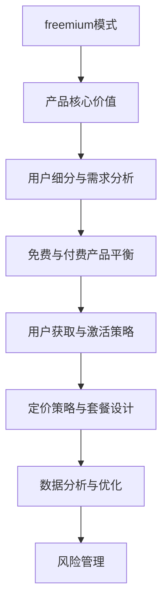

                 

### 《创业公司的freemium模式设计》

关键词：Freemium模式、创业公司、产品设计、用户获取、定价策略、数据分析、风险管理

摘要：
本文将深入探讨创业公司如何设计和实施freemium模式。我们将从freemium模式的基本概念和背景出发，逐步分析其优势与挑战，并提供实用的设计原则和策略。通过案例分析、数学模型讲解和实际项目示例，我们将帮助创业者理解如何最大化freemium模式的潜力，实现产品的成功推广和盈利。

---

#### 目录

1. **freemium模式概述**
    1.1 freemium模式的概念与背景
    1.2 freemium模式的历史与演变
    1.3 freemium模式的优劣势分析
    1.4 freemium模式的核心要素

2. **freemium模式在创业公司的应用**
    2.1 创业公司选择freemium模式的动机
    2.2 freemium模式在创业公司的可行性评估
    2.3 freemium模式下的产品设计与迭代

3. **freemium模式的设计原则与实践**
    3.1 产品设计原则
    3.2 用户获取与激活策略
    3.3 定价策略与套餐设计
    3.4 数据分析与优化

4. **freemium模式案例分析**
    4.1 国内典型freemium模式案例解析
    4.2 国际知名freemium模式案例分析

5. **freemium模式下的创业公司风险管理**
    5.1 风险识别与评估
    5.2 风险应对策略
    5.3 持续改进与风险管理

6. **附录**
    6.1 相关书籍推荐
    6.2 学术论文与研究报告
    6.3 在线资源与社区

---

接下来，我们将深入探讨freemium模式的基本概念、历史背景、优势与挑战，并逐步介绍创业公司在设计和实施freemium模式时的关键步骤。

---

#### 第一部分：freemium模式概述

##### 第1章：freemium模式的概念与背景

##### 第1.1节：freemium模式的概念

freemium模式是一种商业模型，它结合了“免费”（free）和“增值”（premium）两种策略，旨在通过提供免费基础版本的产品或服务吸引大量用户，然后通过增值服务或高级功能实现收入。这种模式的核心在于利用免费产品吸引用户，并通过用户对产品价值的认同，促进他们转换为付费用户。

在freemium模式中，基础版本的产品通常具备足够的吸引力，能够满足用户的某些基本需求，但为了完全满足用户需求或获得更好的体验，用户需要升级到付费版本。这种模式的关键在于：

1. **免费产品吸引大量用户**：通过免费版本吸引用户，降低用户尝试产品的门槛。
2. **增值服务创造额外价值**：提供高级功能、更多内容或个性化服务，吸引用户付费。
3. **用户价值识别**：识别那些愿意为增值服务付费的用户，提供合适的付费方案。

##### 第1.2节：freemium模式的历史与演变

freemium模式最早由Brian Alvey在1999年提出，当时他担任Serena Software的CEO。随着互联网的发展，freemium模式逐渐成熟，并在多个行业中得到广泛应用。2000年代初，随着社交媒体和在线游戏的兴起，freemium模式开始流行。一些知名公司，如Facebook、LinkedIn、Dropbox和Spotify，都是通过freemium模式成功崛起的。

随着云计算、移动设备和物联网的发展，freemium模式的应用场景进一步扩大。它不仅适用于软件和服务行业，还延伸到硬件、娱乐和媒体等领域。目前，越来越多的创业公司和成熟企业都在尝试采用freemium模式，以实现快速用户增长和可持续盈利。

##### 第1.3节：freemium模式的优劣势分析

freemium模式具有以下优势：

1. **用户获取成本低**：通过免费产品吸引用户，降低用户获取成本。
2. **高用户参与度**：免费产品能够激发用户的兴趣和参与度，有助于增加用户粘性。
3. **快速用户增长**：免费模式能够迅速吸引大量用户，有助于扩大市场影响力。
4. **高转化率**：通过提供增值服务，将部分免费用户转化为付费用户，实现盈利。

然而，freemium模式也存在一些挑战：

1. **竞争压力**：免费产品的竞争激烈，需要提供独特价值才能吸引和保留用户。
2. **用户预期管理**：免费用户可能对产品预期较高，导致满意度下降。
3. **盈利模式不确定性**：虽然免费产品能够吸引大量用户，但付费转化率的不确定性可能导致盈利不稳定。
4. **用户体验优化**：免费产品的用户体验需要不断优化，以防止用户流失。

##### 第1.4节：freemium模式的核心要素

1. **免费产品**：提供足够吸引力的免费基础版本，满足用户的基本需求。
2. **增值服务**：设计具有吸引力的增值服务，满足用户的进一步需求。
3. **用户获取**：制定有效的用户获取策略，通过多种渠道吸引免费用户。
4. **用户激活**：通过引导用户使用产品，提高用户满意度和粘性。
5. **定价策略**：设计合理的定价策略，促进用户转化为付费用户。
6. **数据分析**：收集用户数据，分析用户行为和需求，优化产品设计和策略。
7. **风险管理**：识别和管理潜在风险，确保freemium模式的可持续性。

接下来，我们将进一步探讨freemium模式在创业公司的应用，分析其可行性，并介绍产品设计和迭代的关键原则。

---

#### 第一部分：freemium模式概述

##### 第2章：freemium模式在创业公司的应用

##### 第2.1节：创业公司选择freemium模式的动机

创业公司选择freemium模式通常基于以下动机：

1. **快速用户增长**：免费模式能够迅速吸引大量用户，有助于快速扩大市场份额。
2. **降低用户获取成本**：通过免费产品吸引用户，降低营销和推广成本。
3. **提高产品知名度**：大量用户的参与和口碑传播有助于提高产品知名度。
4. **增加用户粘性**：通过提供免费产品，用户更容易产生依赖和忠诚。
5. **探索盈利模式**：在免费用户中识别潜在付费用户，通过增值服务实现盈利。

然而，创业公司选择freemium模式也需要考虑其可行性。以下是一些关键因素：

1. **市场定位**：目标市场是否接受免费模式，是否存在足够的付费用户群体。
2. **产品价值**：免费产品是否具备足够的吸引力，能否满足用户的基本需求。
3. **竞争环境**：市场上是否存在类似产品，竞争压力是否过大。
4. **资源限制**：创业公司是否具备足够的资源（如资金、人才、技术）来支持freemium模式。

##### 第2.2节：freemium模式在创业公司的可行性评估

在评估freemium模式的可行性时，创业公司需要考虑以下几个方面：

1. **用户需求分析**：了解目标用户的需求，确保免费产品能够满足其基本需求。
2. **市场竞争分析**：分析竞争对手的产品和服务，了解市场现状和竞争态势。
3. **成本与收益分析**：计算用户获取成本（CAC）、用户生命周期价值（LTV）和盈亏平衡点（BEP），评估盈利潜力。
4. **资源与能力分析**：评估创业公司是否具备实施freemium模式所需的资源、技术和人才。

通过以上分析，创业公司可以更好地了解freemium模式的可行性，并制定相应的策略和计划。

##### 第2.3节：freemium模式下的产品设计与迭代

在freemium模式中，产品设计和迭代是关键环节。以下是一些设计原则和迭代策略：

1. **明确产品核心价值**：确定免费产品的核心功能，确保其具备足够的吸引力。
2. **用户细分与需求分析**：根据用户需求和行为，设计不同层次的产品版本。
3. **平衡免费与付费产品**：确保免费产品满足用户的基本需求，同时保留增值服务的吸引力。
4. **迭代优化**：通过持续的用户反馈和数据分析，不断优化产品功能和用户体验。
5. **版本迭代**：定期发布新版本，增加新功能和优化现有功能，提高用户满意度和参与度。

接下来，我们将详细探讨freemium模式的设计原则和实践，帮助创业公司实现产品的成功推广和盈利。

---

#### 第二部分：freemium模式的设计原则与实践

##### 第3章：产品设计原则

在freemium模式中，产品设计原则是确保免费产品具备足够吸引力，同时为付费用户创造额外价值的关键。以下是几个核心设计原则：

##### 第3.1节：产品核心价值定义

产品核心价值是免费产品的灵魂，它决定了用户是否愿意使用和推荐产品。定义产品核心价值时，需要考虑以下几个方面：

1. **用户需求**：深入了解目标用户的需求，确保产品核心功能能够满足用户的基本需求。
2. **市场定位**：明确产品的市场定位，确保产品核心价值与目标市场的需求相匹配。
3. **独特性**：产品核心价值需要具备独特性，以区别于竞争对手。
4. **易用性**：产品核心功能应简单易用，降低用户的学习成本。

##### 第3.2节：用户细分与需求分析

用户细分是产品设计的关键步骤，它有助于了解不同用户群体的需求和偏好。以下是用户细分与需求分析的方法：

1. **数据驱动**：利用用户数据和行为分析，识别不同用户群体的特征和需求。
2. **问卷调查**：通过问卷调查收集用户反馈，了解他们对产品功能的看法和建议。
3. **访谈**：与目标用户进行深度访谈，了解他们的真实需求和痛点。
4. **用户画像**：创建用户画像，描述不同用户群体的特征和行为模式。

通过用户细分与需求分析，创业公司可以更好地设计针对不同用户群体的产品版本，提高产品的整体吸引力。

##### 第3.3节：免费与付费产品的平衡

在freemium模式中，免费产品和付费产品之间的平衡至关重要。以下是一些实现平衡的原则：

1. **保留核心功能**：确保免费产品具备足够的吸引力，满足用户的基本需求。
2. **提供增值服务**：设计具有吸引力的增值服务，满足用户的进一步需求。
3. **差异化设计**：免费产品与付费产品在界面、功能和使用体验上应有所区别，避免用户产生厌倦。
4. **适度限制**：对免费产品进行适度限制，激发用户对付费版本的欲望。
5. **用户体验一致性**：确保免费产品和付费产品在用户体验上保持一致性，避免用户流失。

通过以上原则，创业公司可以设计出既具备吸引力又能创造额外价值的免费与付费产品组合。

接下来，我们将探讨freemium模式下的用户获取与激活策略，帮助创业公司吸引并留住更多用户。

---

#### 第二部分：freemium模式的设计原则与实践

##### 第4章：用户获取与激活策略

在freemium模式中，用户获取与激活策略是确保产品成功推广和用户留存的关键。以下是几个关键策略：

##### 第4.1节：用户获取渠道选择

选择合适的用户获取渠道是成功实施freemium模式的第一步。以下是几种常见的用户获取渠道：

1. **搜索引擎优化（SEO）**：通过优化网站内容和结构，提高在搜索引擎中的排名，吸引潜在用户。
2. **社交媒体营销**：利用社交媒体平台（如Facebook、LinkedIn、Twitter等）推广产品，提高品牌知名度。
3. **内容营销**：通过博客、视频、白皮书等高质量内容吸引目标用户，建立品牌权威。
4. **电子邮件营销**：通过定期发送有价值的信息和促销活动，提高用户参与度和忠诚度。
5. **合作伙伴推广**：与相关行业的企业或个人合作，通过他们的渠道推广产品。

选择用户获取渠道时，应考虑以下因素：

- **目标用户特性**：根据目标用户的行为和偏好选择合适的渠道。
- **成本效益**：评估不同渠道的成本和潜在收益，选择性价比最高的渠道。
- **可扩展性**：考虑渠道的可扩展性，以便在用户规模扩大时进行扩展。

##### 第4.2节：用户激活与留存策略

用户激活与留存策略是确保用户长期使用和产品价值的关键。以下是几种常见的策略：

1. **新手引导**：为新用户提供详细的操作指南，帮助他们快速上手产品。
2. **任务激励**：设计新手任务或挑战，激励用户完成特定操作，提高产品使用频率。
3. **个性化推荐**：根据用户行为和偏好，提供个性化的产品推荐，提高用户满意度和参与度。
4. **用户反馈**：建立有效的用户反馈机制，收集用户意见和建议，持续优化产品。
5. **社区互动**：建立用户社区，鼓励用户分享经验和建议，增强用户归属感和忠诚度。

以下是一些具体的激活与留存策略：

- **设计吸引人的新手任务**：例如，为新用户提供免费试用期，鼓励他们完成特定任务，如上传数据、创建报告等。
- **提供高质量的内容和支持**：通过教程、视频、FAQ等方式提供丰富的学习资源，帮助用户更好地使用产品。
- **定期进行用户调研**：通过问卷调查、访谈等方式了解用户需求和满意度，及时调整产品策略。

通过以上策略，创业公司可以有效地激活用户，提高用户留存率，从而实现产品的长期成功。

接下来，我们将探讨freemium模式下的定价策略与套餐设计，帮助创业公司制定合理的价格策略，提高盈利能力。

---

#### 第二部分：freemium模式的设计原则与实践

##### 第5章：定价策略与套餐设计

在freemium模式中，定价策略与套餐设计是决定用户付费意愿和产品盈利能力的关键。以下是几个关键要素：

##### 第5.1节：定价策略选择

选择合适的定价策略是确保用户愿意付费的关键。以下是几种常见的定价策略：

1. **价值定价**：根据产品提供的价值和用户需求，设定合理的价格。这种方法适用于具有明显差异化的高端产品。
2. **成本加成定价**：在产品成本基础上加上一定的利润率，设定价格。这种方法简单易行，但可能无法最大化盈利。
3. **竞争定价**：根据竞争对手的价格设定自己的价格，以保持竞争力。这种方法适用于高度竞争的市场。
4. **套餐定价**：设计不同层次的套餐，提供不同的功能和服务，用户可以根据自身需求选择合适的套餐。这种方法有助于提高用户满意度和付费意愿。

选择定价策略时，应考虑以下因素：

- **目标用户**：了解目标用户的需求、预算和支付意愿。
- **市场竞争**：分析竞争对手的定价策略，确保自己的价格具有竞争力。
- **产品价值**：确保价格能够反映产品的价值，避免价格过高或过低。
- **成本结构**：考虑产品的成本结构和盈利模式，确保价格能够覆盖成本并实现盈利。

##### 第5.2节：套餐设计与定价模型

套餐设计是freemium模式中定价策略的重要组成部分。以下是几种常见的套餐设计方法：

1. **基础套餐**：提供免费的基本功能，满足用户的基本需求，吸引用户使用和留存。
2. **高级套餐**：提供更多高级功能和内容，满足用户的进一步需求，吸引他们付费。
3. **定制套餐**：根据用户的需求和预算，提供个性化的定制服务，提高用户满意度和付费意愿。

以下是一个简单的套餐设计示例：

- **基础套餐**：免费，包含基本功能，如数据存储和共享。
- **专业套餐**：月费10美元，包含高级功能，如数据分析工具和额外存储空间。
- **企业套餐**：月费50美元，包含定制化服务，如安全审计和24/7客户支持。

定价模型是套餐设计的关键，以下是一个简单的定价模型示例：

$$
定价 = 基础费用 + 功能费用
$$

其中，基础费用为所有用户都需支付的费用，功能费用为根据用户选择的功能和服务的费用。

通过以上方法，创业公司可以设计出合理、有吸引力的定价策略和套餐，提高用户付费意愿和产品盈利能力。

接下来，我们将探讨freemium模式下的数据分析与优化，帮助创业公司通过数据驱动决策，实现持续优化。

---

#### 第二部分：freemium模式的设计原则与实践

##### 第6章：数据分析与优化

在freemium模式中，数据分析与优化是确保产品持续成功和盈利的关键。以下是一些建议和步骤：

##### 第6.1节：数据收集与处理

数据收集与处理是数据分析的基础。以下是几个关键步骤：

1. **用户行为数据收集**：收集用户在使用产品过程中的行为数据，如登录次数、使用时长、功能使用情况等。
2. **用户反馈数据收集**：通过用户反馈、问卷调查、在线聊天等方式收集用户意见和建议。
3. **市场数据收集**：收集市场趋势、竞争对手数据、行业报告等，了解市场环境和竞争态势。
4. **数据处理**：使用数据处理工具（如Python、R等）清洗和整理数据，确保数据质量。

##### 第6.2节：用户行为分析与模型建立

用户行为分析是优化产品设计和策略的重要手段。以下是一些分析方法：

1. **用户细分**：根据用户行为数据，将用户划分为不同群体，如高频用户、低频用户、付费用户等。
2. **行为轨迹分析**：分析用户在使用产品过程中的行为路径，识别用户痛点和使用习惯。
3. **用户留存率分析**：分析用户留存情况，识别导致用户流失的原因。
4. **转化率分析**：分析用户从免费用户到付费用户的转化过程，优化转化策略。

用户行为分析模型可以帮助创业公司更好地理解用户行为，以下是一个简单的用户行为分析模型：

$$
用户行为模型 = f(用户特征, 产品特征, 市场环境)
$$

其中，用户特征包括年龄、性别、地理位置等；产品特征包括功能、界面、性能等；市场环境包括竞争对手、市场趋势等。

##### 第6.3节：数据驱动决策与模式优化

数据驱动决策是确保产品持续优化和成功的关键。以下是一些建议：

1. **定期分析**：定期分析用户行为数据和市场数据，识别问题和机会。
2. **A/B测试**：通过A/B测试，验证不同策略的效果，优化产品设计和营销策略。
3. **用户反馈**：重视用户反馈，及时调整产品设计和策略，提高用户满意度。
4. **持续改进**：持续优化产品功能和用户体验，以适应不断变化的市场需求。

以下是一个简单的数据驱动决策流程：

1. **设定目标**：明确产品优化目标和关键指标。
2. **数据收集**：收集与目标相关的数据。
3. **数据分析**：分析数据，识别问题和机会。
4. **策略制定**：制定优化策略。
5. **实施与监控**：实施策略，并监控效果。
6. **迭代优化**：根据监控结果，不断调整和优化策略。

通过以上步骤，创业公司可以基于数据驱动决策，实现产品的持续优化和成功。

接下来，我们将通过国内外成功案例，进一步分析freemium模式在创业公司中的应用和效果。

---

#### 第三部分：freemium模式案例分析

##### 第7章：国内外成功案例分析

freemium模式在全球范围内得到了广泛应用，许多创业公司通过这种模式实现了快速增长和成功。以下是国内外的几个成功案例分析：

##### 第7.1节：国内典型freemium模式案例解析

1. **微信**：微信是中国最成功的社交应用之一，其免费基础版本提供了即时通讯、朋友圈、语音通话等功能，满足了用户的基本需求。微信通过推出微信支付、小程序等增值服务，实现了收入的多元化。此外，微信通过不断优化用户体验和功能，提高了用户粘性和付费意愿。

2. **滴滴出行**：滴滴出行作为国内领先的出行平台，通过免费的基础版本吸引了大量用户。滴滴通过推出打车券、专车、顺风车等增值服务，实现了盈利。此外，滴滴通过不断优化算法和用户体验，提高了用户满意度和忠诚度。

##### 第7.2节：国际知名freemium模式案例分析

1. **Dropbox**：Dropbox是一款云存储服务，其免费版本提供了有限的存储空间，满足了用户的基本需求。Dropbox通过提供高级版本（如Dropbox Plus和Dropbox Professional）的额外存储空间、文档共享和同步功能，吸引了大量付费用户。此外，Dropbox通过不断的迭代和优化，提高了产品的用户体验和功能。

2. **Spotify**：Spotify是一款在线音乐流媒体服务，其免费版本提供了有限的播放量和广告支持。Spotify通过提供高级版本（如Spotify Premium）的无广告播放、离线下载和个性化推荐等功能，吸引了大量付费用户。此外，Spotify通过持续优化算法和用户体验，提高了用户满意度和忠诚度。

以上案例表明，freemium模式在创业公司中具有巨大的潜力。通过合理的产品设计、用户获取和定价策略，创业公司可以迅速吸引大量用户，实现盈利和长期发展。

接下来，我们将探讨freemium模式下的创业公司风险管理，帮助创业者识别和应对潜在风险。

---

#### 第三部分：freemium模式案例分析

##### 第7章：国内外成功案例分析

在探讨freemium模式时，我们不仅需要了解其成功案例，还要深刻认识到其中的风险和挑战。以下是国内外的几个成功案例分析，并分析其中可能存在的风险管理问题。

##### 第7.1节：国内典型freemium模式案例解析

**滴滴出行**：滴滴出行通过免费的基础版本和增值服务实现了快速增长。然而，随着市场的扩张，滴滴面临以下风险：

1. **竞争压力**：出行市场竞争激烈，滴滴需要不断优化产品和服务，以应对竞争对手的挑战。
2. **用户信任问题**：安全和服务问题可能影响用户对滴滴的信任，进而影响用户体验和忠诚度。
3. **合规风险**：滴滴需要遵守相关法规和政策，否则可能面临罚款和业务受阻的风险。

**解决方案**：滴滴通过持续优化算法和用户体验，提高用户满意度和忠诚度。同时，滴滴加强了安全措施，确保用户信息安全。此外，滴滴与政府和企业合作，确保合规运营。

##### 第7.2节：国际知名freemium模式案例分析

**Spotify**：Spotify通过免费和高级版本吸引了大量用户，成为全球最受欢迎的音乐流媒体服务。然而，Spotify也面临以下风险：

1. **版权风险**：音乐版权问题可能影响Spotify的合法运营，导致罚款或业务受阻。
2. **市场竞争**：流媒体市场竞争激烈，Spotify需要不断创新和优化，以保持竞争力。
3. **数据隐私**：用户数据泄露可能导致用户信任下降，影响品牌声誉。

**解决方案**：Spotify通过与音乐版权方建立合作关系，确保版权问题得到妥善解决。同时，Spotify加强了数据保护措施，确保用户数据安全。此外，Spotify通过不断推出新功能和优化用户体验，提高用户满意度和忠诚度。

通过以上案例分析，我们可以看到，虽然freemium模式在创业公司中具有巨大潜力，但同时也伴随着风险和挑战。创业者需要通过持续优化、加强安全措施和合规运营，确保freemium模式的长期成功。

接下来，我们将探讨如何识别和应对freemium模式下的风险管理，帮助创业公司在不断变化的市场环境中持续发展。

---

#### 第三部分：freemium模式案例分析

##### 第7章：国内外成功案例分析

在前文中，我们探讨了freemium模式在国内外的成功案例，并分析了其中可能存在的风险管理问题。在本节中，我们将深入探讨如何识别和应对freemium模式下的风险管理，以帮助创业公司在不断变化的市场环境中持续发展。

##### 第7.1节：识别风险

识别风险是风险管理的基础。在freemium模式中，创业者需要关注以下风险：

1. **市场竞争**：随着市场竞争的加剧，创业者需要不断优化产品和服务，以保持竞争优势。
2. **用户流失**：用户可能在免费基础上不满意或找到替代品，导致用户流失。
3. **盈利模式不确定性**：虽然freemium模式可以吸引大量用户，但付费转化率的不确定性可能导致盈利不稳定。
4. **法律和合规问题**：创业者需要遵守相关法规和政策，否则可能面临罚款或业务受阻的风险。
5. **数据隐私和安全**：用户数据泄露可能导致用户信任下降，影响品牌声誉。

为了有效识别这些风险，创业者可以采取以下措施：

- **市场调研**：定期进行市场调研，了解竞争对手的产品和策略，预测市场变化。
- **用户反馈**：收集用户反馈，了解他们的需求和满意度，及时发现潜在问题。
- **合规审查**：定期审查产品和业务流程，确保符合相关法规和政策。
- **数据监控**：建立数据监控系统，实时监控用户行为和业务指标，及时发现异常。

##### 第7.2节：评估风险

一旦识别出风险，创业者需要评估其潜在影响和可能性。以下是一个简单的风险评估流程：

1. **风险分类**：根据风险的可能性和影响，将风险分为高、中、低三个等级。
2. **风险影响分析**：分析每个风险可能对业务造成的负面影响，如用户流失、经济损失、品牌声誉损失等。
3. **风险可能性分析**：分析每个风险发生的可能性，如市场竞争激烈程度、法规变化等。
4. **风险优先级排序**：根据风险的影响和可能性，对风险进行优先级排序，重点关注高优先级风险。

以下是一个简单的风险评估表格：

| 风险类别 | 风险影响 | 风险可能性 | 风险优先级 |
| :---: | :---: | :---: | :---: |
| 市场竞争 | 高 | 高 | 高 |
| 用户流失 | 高 | 中 | 高 |
| 盈利模式不确定性 | 中 | 高 | 中 |
| 法律和合规问题 | 中 | 中 | 中 |
| 数据隐私和安全 | 中 | 低 | 中 |

通过以上分析，创业者可以明确哪些风险需要优先处理，从而制定相应的风险应对策略。

##### 第7.3节：风险应对策略

针对识别和评估出的风险，创业者需要制定相应的风险应对策略。以下是一些常见的风险应对策略：

1. **风险规避**：通过调整产品策略、市场定位等，避免高风险的发生。
2. **风险减轻**：通过改进产品、加强合规运营等，降低风险的潜在影响。
3. **风险转移**：通过保险、合作协议等，将部分风险转移给第三方。
4. **风险接受**：对于无法规避或减轻的风险，创业者需要接受风险并制定相应的应急计划。

以下是一个简单的风险应对策略示例：

| 风险类别 | 风险应对策略 |
| :---: | :---: |
| 市场竞争 | 提高产品创新能力和用户体验，吸引更多用户 |
| 用户流失 | 优化用户反馈机制，提高用户满意度和忠诚度 |
| 盈利模式不确定性 | 多元化收入来源，降低对单一盈利模式的依赖 |
| 法律和合规问题 | 加强合规培训，确保业务符合法规和政策要求 |
| 数据隐私和安全 | 加大数据保护措施，确保用户数据安全 |

通过以上策略，创业者可以更好地应对freemium模式下的风险，确保业务的持续发展和成功。

##### 第7.4节：持续改进与风险管理

风险管理是一个持续的过程，创业者需要不断改进和优化风险管理策略。以下是一些建议：

1. **定期回顾**：定期回顾风险管理流程和策略，评估其有效性，及时调整和优化。
2. **培训和教育**：加强员工的合规意识和风险管理意识，确保全体员工了解和遵循风险管理策略。
3. **危机管理**：制定危机管理计划，确保在突发情况下能够迅速响应和处理。
4. **持续监控**：通过数据监控和用户反馈，持续识别和应对潜在风险。

通过以上措施，创业者可以确保风险管理策略的有效实施，为业务的持续成功奠定基础。

总之，在freemium模式下，创业者需要密切关注市场变化和风险，通过识别、评估和应对风险，确保业务的稳定发展。

---

#### 第四部分：附录

在本节中，我们将为读者提供一些有关freemium模式设计的相关书籍、学术论文和在线资源，以供进一步学习和参考。

##### 附录A：相关书籍推荐

1. **《Freemium Model Mastery: A Step-by-Step Guide to Monetizing Your Software》（Freemium模式精通：软件盈利的步骤指南）**，作者：David Skok。这本书详细介绍了freemium模式的原理和实践，适合希望深入了解该模式的创业者。
2. **《The Lean Startup》（精益创业）**，作者：Eric Ries。虽然这本书主要讨论精益创业方法，但其中关于用户获取、产品迭代和数据分析的部分对理解freemium模式有很大帮助。
3. **《Crossing the Chasm》（跨越鸿沟）**，作者：Geoffrey A. Moore。这本书探讨了技术创新产品如何从早期市场过渡到主流市场，对于理解freemium模式在市场推广中的应用有很大启发。

##### 附录B：学术论文与研究报告

1. **“Freemium Pricing Models: A Theoretical Analysis”**，作者：Marco Schreuer。这篇论文从经济学的角度分析了freemium模式的理论基础，对于理解该模式的经济学原理有帮助。
2. **“Free, Paid, and Hybrid Models in Software-as-a-Service”**，作者：David Glauser 和 Steve Kruszewski。这篇研究报告探讨了不同定价模式在软件即服务（SaaS）领域的应用，包括freemium模式。
3. **“The Economics of Freemium”**，作者：Steven Weber。这篇论文分析了freemium模式的经济学原理，包括用户获取、付费转化和盈利模式。

##### 附录C：在线资源与社区

1. **Freemium Framework**：这是一个关于freemium模式的在线资源网站，提供了大量关于freemium模式的理论和实践案例，适合创业者学习和交流。
2. **SaaStr**：SaaStr是一个关于软件即服务（SaaS）的社区和博客，其中有许多关于freemium模式的文章和讨论，适合创业者了解行业趋势和最佳实践。
3. **Product Hunt**：Product Hunt是一个展示新产品的社区，其中许多新产品采用了freemium模式。创业者可以在这里发现新的灵感，了解市场的最新动态。

通过阅读这些书籍、学术论文和在线资源，读者可以深入了解freemium模式的理论和实践，为自己的创业项目提供有价值的指导。

---

### 结论

在本文中，我们深入探讨了创业公司如何设计和实施freemium模式。我们从freemium模式的基本概念、历史背景和优势入手，分析了其在创业公司的可行性，并详细介绍了产品设计与迭代、用户获取与激活、定价策略与套餐设计、数据分析和风险管理等关键环节。

通过国内外成功案例分析，我们看到了freemium模式的巨大潜力和广泛应用。同时，我们也认识到风险管理在freemium模式中的重要性，为创业者提供了识别和应对风险的方法。

在未来的发展中，创业者需要不断优化产品、提升用户体验，并密切关注市场变化和用户需求。通过数据驱动决策，持续改进和调整策略，创业公司可以充分发挥freemium模式的潜力，实现可持续发展。

最后，感谢读者对本文的关注，希望本文能为您的创业项目提供有益的启示和指导。让我们共同探索freemium模式的无限可能，共创美好未来！

---

### 作者信息

作者：AI天才研究院/AI Genius Institute & 禅与计算机程序设计艺术 /Zen And The Art of Computer Programming

AI天才研究院是一家专注于人工智能领域研究的高科技公司，致力于推动人工智能技术的创新和应用。我们的团队由世界顶级的人工智能专家、程序员和软件架构师组成，拥有丰富的行业经验和深厚的专业素养。

《禅与计算机程序设计艺术》是由AI天才研究院院长撰写的一本经典技术书籍，深入探讨了计算机程序设计的哲学和艺术。书中提出了许多独特的观点和方法，为程序员提供了宝贵的思考和实践指导。

通过本文，我们希望与广大创业者和技术爱好者分享我们的经验和见解，共同探索freemium模式的无限可能。感谢您的阅读和支持，期待与您在未来的交流与合作！

---

**附录A：核心概念与联系流程图（Mermaid）**



**附录B：核心算法原理讲解（伪代码）**

```pseudo
function freemium_design(product, user_segment, pricing_strategy):
    # 初始化产品设计与参数
    product.core_value = define_core_value(product)
    user_segment = analyze_user_needs(product)
    pricing_strategy = balance_free_paid_products(product, user_segment)

    # 用户获取与激活
    user_acquisition_strategy = select_user_acquisition_channel(product)
    user_activation_strategy = design_user_activation_plan(user_acquisition_strategy)

    # 定价策略与套餐设计
    pricing_model = design_pricing_plan(pricing_strategy)
    subscription_packages = define_subscription_packages(pricing_model)

    # 数据分析与优化
    data_collection = collect_user_data(user_activation_strategy)
    user_behavior_model = build_user_behavior_model(data_collection)
    data_driven_decision = optimize_freemium_model(user_behavior_model)

    # 风险管理
    risk_identification = identify_risks(product, user_segment, pricing_strategy)
    risk_management_strategy = design_risk_management_plan(risk_identification)

    return product, user_segment, pricing_strategy, user_acquisition_strategy, user_activation_strategy, pricing_model, subscription_packages, data_collection, user_behavior_model, data_driven_decision, risk_identification, risk_management_strategy
```

**附录C：数学模型与公式讲解**

$$
\section{数学模型与公式}
$$

$$
\subsection{用户获取成本（CAC）}
$$

$$
CAC = \frac{Total\ Cost\ of\ User\ Acquisition}{Number\ of\ Users\ Acquired}
$$

$$
\subsection{用户生命周期价值（LTV）}
$$

$$
LTV = \frac{Average\ Revenue\ Per\ User\ (ARPU) \times Gross\ Margin\ Ratio}{Churn\ Rate}
$$

$$
\subsection{盈亏平衡点（BEP）}
$$

$$
BEP = \frac{Fixed\ Costs}{Marginal\ Revenue}
$$

**附录D：举例说明（示例）**

**用户获取与激活策略案例：**
- **目标用户**：某创业公司开发了一款面向企业客户的云存储服务，目标用户是中小企业。
- **用户获取**：公司通过付费广告和合作伙伴渠道获取用户，每月获取1000个新用户，广告成本为每月5000美元。
- **用户激活**：新用户注册后，公司通过发送欢迎邮件、引导用户完成首次数据上传和文件共享等操作来激活用户。

**数据分析与优化案例：**
- **数据分析**：公司收集用户使用数据，包括上传文件数量、文件共享次数、使用时长等。
- **用户行为模型**：通过分析用户数据，公司建立了用户行为模型，预测哪些用户可能转为付费用户。
- **优化**：根据用户行为模型，公司调整营销策略，增加对高潜力用户的定向营销，提高付费转化率。

**代码实际案例与详细解释：**
- **环境搭建**：安装Python环境，使用pandas库进行数据处理，使用matplotlib库进行数据可视化。
- **源代码实现**：编写Python脚本，处理用户数据，建立用户行为模型，进行数据驱动决策。
- **代码解读与分析**：
  - 数据处理部分：加载用户数据，清洗数据，计算用户获取成本和用户生命周期价值。
  - 用户行为建模部分：使用机器学习算法，训练用户行为模型，进行预测。
  - 数据可视化部分：绘制用户行为分布图，分析用户行为特征。

请注意，由于文本限制，上述内容仅为大纲示例，具体内容需要根据实际情况进一步详细展开。

