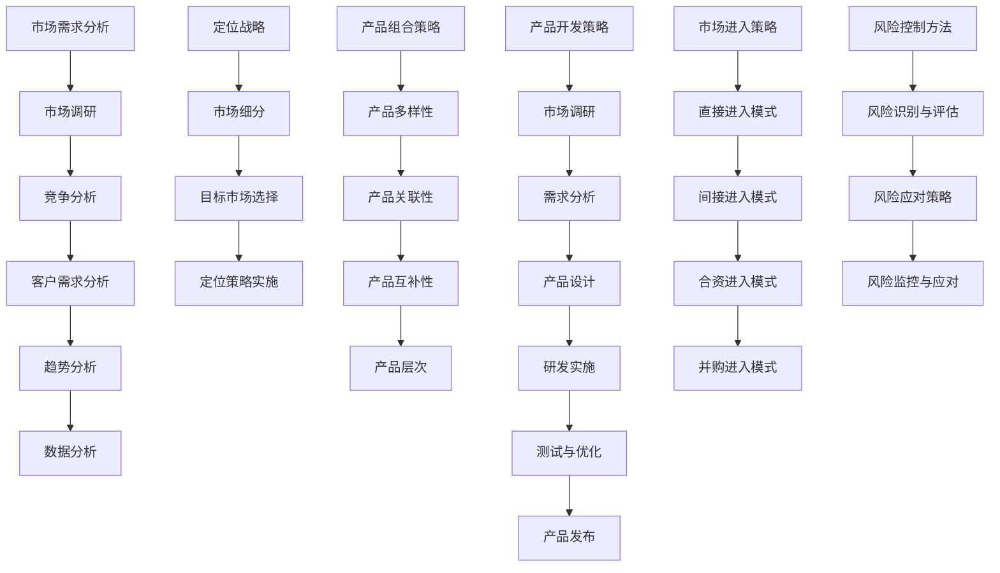
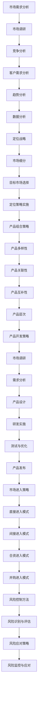
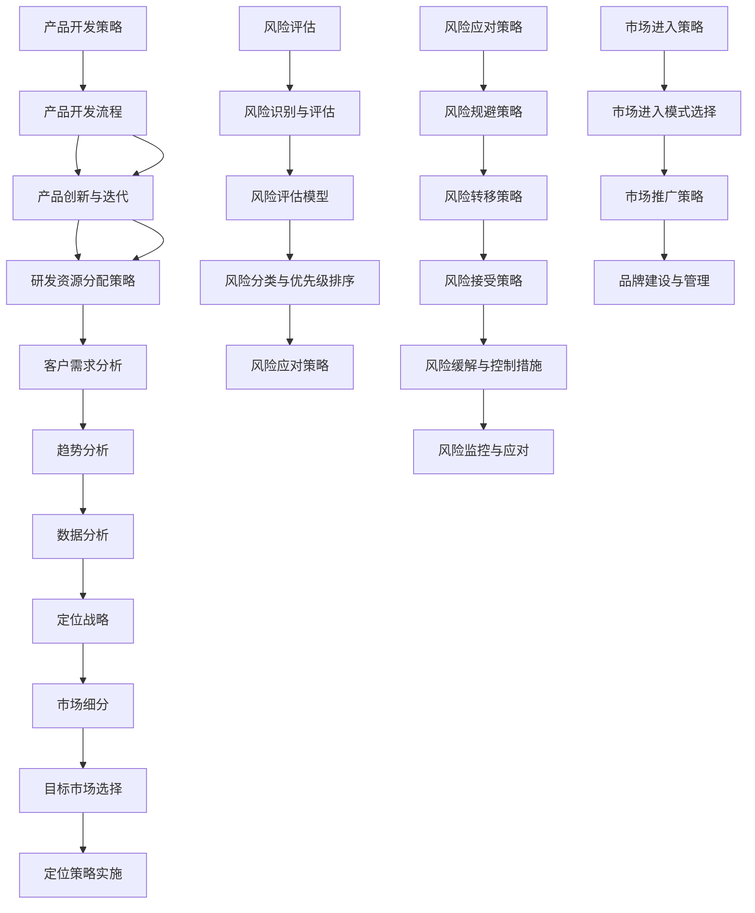

                 

### 《创业公司的产品线扩展策略与风险控制》

> **关键词：** 创业公司、产品线扩展、风险控制、策略、市场分析、案例研究

**摘要：** 本文旨在探讨创业公司如何通过有效的产品线扩展策略和风险管理，实现可持续发展。文章首先介绍了产品线扩展的核心概念和风险控制的重要性，随后详细阐述了产品线扩展策略和风险控制方法。通过实际案例研究，本文提供了宝贵的经验和教训，以期为创业公司提供实用的指导和建议。

---

### 第一部分：引言与背景

#### 1.1 书籍目的与结构概述

本章节将介绍书籍的写作目的和整体结构，帮助读者快速了解后续内容的主线。本著作旨在深入探讨创业公司在产品线扩展过程中的策略选择和风险管理，为创业公司提供理论和实践指导。

**书籍目的：**

1. **揭示产品线扩展的原理和方法：** 通过详细阐述产品线扩展的核心概念和策略，帮助读者理解产品线扩展的内在逻辑和实施步骤。
2. **分析风险控制的重要性：** 强调风险控制在产品线扩展中的关键作用，提高创业公司在面对不确定性的能力。
3. **提供实际案例分析：** 通过对成功和失败案例的深入分析，为读者提供宝贵的实践经验。

**书籍结构：**

本著作共分为五个部分，每个部分都有明确的主题和内容：

1. **第一部分：引言与背景**：介绍书籍的目的和整体结构，为后续内容奠定基础。
2. **第二部分：产品线扩展策略**：详细阐述产品线扩展的各个策略，包括市场需求分析、产品组合策略、产品开发策略和市场进入策略。
3. **第三部分：风险控制方法**：介绍风险控制的核心概念和具体方法，包括风险识别与评估、风险应对策略和风险监控与应对。
4. **第四部分：案例研究**：通过实际案例研究，分析创业公司在产品线扩展和风险控制中的成功与失败，总结经验和教训。
5. **第五部分：结论与展望**：总结全文的核心发现，提出对未来发展趋势的展望，并给出创业公司的实用建议。

通过本著作的深入探讨，读者将能够全面了解创业公司在产品线扩展和风险管理方面的策略和方法，为自身的创业实践提供有力的支持。

#### 1.2 创业公司产品线扩展的重要性

创业公司的产品线扩展是其实现可持续增长和竞争优势的关键策略之一。产品线扩展不仅有助于公司开拓新的市场和客户，还能提升公司整体的市场地位和盈利能力。以下是创业公司产品线扩展的几个重要性方面：

1. **增加市场份额：** 通过产品线扩展，创业公司可以满足更多客户的需求，从而扩大市场份额。当公司拥有多样化的产品线时，可以覆盖不同细分市场，吸引更广泛的客户群体。

2. **提升品牌影响力：** 丰富的产品线能够提升品牌在市场和消费者心中的地位。多样化产品不仅能够满足消费者多样化需求，还能体现公司在各个领域的专业能力，增强品牌认知度和影响力。

3. **增强竞争力：** 产品线扩展有助于创业公司建立竞争优势。通过在产品功能、性能、价格等方面进行差异化竞争，创业公司可以在市场上获得更高的市场份额和利润率。

4. **实现资源整合：** 产品线扩展可以帮助公司实现资源的优化配置和整合。通过跨产品线的资源共享，如研发、生产、销售和营销等，公司可以降低成本、提高效率，提升整体运营能力。

5. **提升盈利能力：** 产品线扩展能够增加公司的收入来源，提升盈利能力。多样化的产品线有助于分散风险，降低单一产品波动对整体业绩的影响。

6. **促进创新与研发：** 产品线扩展可以激发公司的创新动力，推动研发投入。当公司需要开发新产品来扩展产品线时，能够促使公司在技术、设计和用户体验等方面不断创新，提升整体竞争力。

7. **提高客户忠诚度：** 多样化的产品线可以满足客户不同阶段的消费需求，提高客户忠诚度。客户能够在一个品牌下找到多种解决方案，更有可能成为长期客户，从而为公司带来稳定的收入。

总之，创业公司产品线扩展是一项具有战略意义的重要举措，能够帮助公司在竞争激烈的市场中站稳脚跟，实现可持续发展。

#### 1.3 风险控制的概念与意义

风险控制是创业公司产品线扩展过程中至关重要的一环。它涉及识别、评估、应对和监控可能影响公司业务和目标的潜在风险。以下是风险控制的概念及其在创业公司产品线扩展中的意义：

**风险控制的定义：**

风险控制是指通过系统化的方法，识别、评估、应对和监控风险，以减少潜在损失和不确定性，确保公司目标的实现。在创业公司中，风险控制不仅仅是一种事后应对措施，而是一个贯穿于整个产品线扩展过程的管理活动。

**风险控制的重要性：**

1. **保障公司生存和发展：** 风险控制能够帮助创业公司识别和评估潜在风险，采取预防措施，降低失败的概率，保障公司的生存和发展。

2. **提高决策质量：** 风险控制通过提供详细的风险评估和分析，帮助公司管理层做出更为明智和合理的决策，减少盲目行动带来的风险。

3. **优化资源分配：** 风险控制有助于公司优化资源配置，确保有限的资金和人力资源被用于最具价值和风险可控的项目。

4. **提升公司竞争力：** 通过有效的风险控制，创业公司能够在激烈的市场竞争中保持稳定，增强客户信任，提高市场地位。

5. **建立风险管理文化：** 风险控制不仅是一种管理工具，更是一种企业文化。通过建立风险管理文化，公司能够培养员工的风险意识，提升整体管理水平和应对能力。

**风险控制的核心要素：**

1. **风险识别：** 识别潜在风险是风险控制的起点。创业公司需要通过多种方法，如问卷调查、专家访谈、历史数据分析等，全面了解可能影响产品线扩展的各种风险。

2. **风险评估：** 在识别风险后，需要对风险进行评估，确定其影响程度和发生的可能性。风险评估可以通过定量分析和定性分析相结合的方法进行。

3. **风险应对策略：** 根据风险评估结果，制定相应的风险应对策略，包括风险规避、风险转移、风险接受和风险缓解等。

4. **风险监控与应对：** 风险控制是一个持续的过程。公司需要建立有效的风险监控机制，实时跟踪风险变化，并根据实际情况调整应对措施。

总之，风险控制是创业公司产品线扩展过程中不可或缺的一环。通过系统化的风险控制，创业公司能够更好地应对市场变化，减少不确定性，实现可持续发展。

### 第二部分：产品线扩展策略

产品线扩展策略是创业公司在拓展市场份额和提升品牌影响力过程中的关键步骤。有效的产品线扩展不仅可以满足多样化的市场需求，还能提升公司的竞争力和盈利能力。本章节将详细探讨市场需求分析、产品组合策略、产品开发策略和市场进入策略，以帮助创业公司制定和实施全面的产品线扩展计划。

#### 2.1 市场需求分析与定位

市场需求分析是产品线扩展策略的基础。只有深入了解市场需求，才能确保产品线扩展的准确性和有效性。以下是市场需求分析的具体步骤和定位战略：

##### 2.1.1 市场需求分析流程

1. **市场调研：** 市场调研是了解市场需求的第一步。公司可以通过多种渠道收集市场数据，如问卷调查、在线调研、消费者访谈等。市场调研的目的是获取关于消费者需求、购买行为和市场竞争状况的信息。

2. **竞争分析：** 竞争分析是评估市场竞争态势的重要环节。公司需要分析主要竞争对手的产品、价格、市场占有率等，了解自身的竞争优势和劣势。

3. **客户需求分析：** 客户需求分析是市场需求分析的核心。公司需要深入了解目标客户的需求、偏好和痛点，以便开发出符合市场需求的产品。

4. **趋势分析：** 趋势分析可以帮助公司预测市场未来的发展方向。公司可以通过研究市场报告、行业趋势和消费者行为，了解市场潜在的需求变化。

5. **数据分析：** 数据分析是市场需求分析的最后一环。公司需要利用数据挖掘和统计方法，对收集到的市场数据进行分析，提取有价值的信息，为产品线扩展提供数据支持。

##### 2.1.2 定位战略与市场细分

1. **定位战略：** 定位战略是确定公司在市场中的独特地位和形象。公司需要根据市场需求分析的结果，选择合适的市场细分，明确产品的目标客户群体。

2. **市场细分：** 市场细分是将整个市场划分为若干个具有相似需求和特征的子市场。市场细分的方法包括地理细分、人口细分、心理细分和行为细分等。通过市场细分，公司可以更好地满足不同客户群体的需求。

3. **目标市场选择：** 在市场细分的基础上，公司需要选择最具潜力的目标市场。目标市场选择应考虑市场的规模、增长潜力、竞争状况和公司自身的竞争优势。

4. **定位策略实施：** 一旦确定了目标市场和定位策略，公司需要制定具体的营销策略，包括产品定位、价格定位、渠道定位和促销定位等。通过实施定位策略，公司可以在目标市场中树立独特的品牌形象，吸引目标客户。

#### 2.2 产品组合策略

产品组合策略是创业公司在产品线扩展过程中需要考虑的重要方面。合理的产品组合不仅能够满足不同客户群体的需求，还能提升公司的市场份额和盈利能力。以下是产品组合策略的原理和优化方法：

##### 2.2.1 产品组合原理

1. **产品多样性：** 产品多样性是产品组合策略的核心。通过提供多样化的产品，公司可以满足不同客户群体的需求，提升市场竞争力。

2. **产品关联性：** 产品关联性是指产品线中的产品之间具有一定的关联性。关联性强的产品可以共同提升公司的品牌价值和客户忠诚度。

3. **产品互补性：** 产品互补性是指产品线中的产品之间相互补充，共同满足客户的某项需求。互补性产品可以提高客户的购买频率和满意度。

4. **产品层次：** 产品层次是指产品线中的产品按照功能、性能、价格等不同维度进行分层。层次丰富的产品组合可以满足不同层次客户的需求，提升公司的市场覆盖面。

##### 2.2.2 产品组合优化方法

1. **基于市场的产品组合：** 基于市场的产品组合是根据市场需求和客户偏好来优化产品组合。公司可以通过市场调研和数据分析，了解目标客户的需求和偏好，调整产品组合，提高市场适应性。

2. **基于成本的产品组合：** 基于成本的产品组合是根据产品的成本结构和利润空间来优化产品组合。公司可以通过成本分析和利润率分析，调整产品线的结构，降低成本，提升盈利能力。

3. **产品线规划与调整：** 产品线规划与调整是动态优化产品组合的过程。公司需要定期评估产品线的表现，根据市场反馈和竞争态势，对产品线进行调整，以保持竞争力。

4. **产品创新与迭代：** 产品创新与迭代是产品组合优化的关键。公司需要不断进行产品创新，推出新的产品和服务，以满足不断变化的市场需求。

#### 2.3 产品开发策略

产品开发策略是创业公司在产品线扩展过程中的核心环节。有效的产品开发策略可以确保新产品的顺利推出，提升公司的市场竞争力。以下是产品开发策略的流程、创新与迭代和研发资源分配：

##### 2.3.1 产品开发流程

1. **市场调研：** 市场调研是产品开发的第一步。公司需要了解市场需求和客户需求，确定新产品的方向。

2. **需求分析：** 需求分析是对市场调研结果进行深入分析，确定新产品的功能、性能和特点。

3. **产品设计：** 设计阶段包括产品功能设计、界面设计和技术方案选择。设计团队需要根据需求分析的结果，制定详细的产品设计文档。

4. **研发实施：** 研发实施是产品开发的核心环节。研发团队需要按照设计文档的要求，进行编码、测试和调试，确保产品达到设计要求。

5. **测试与优化：** 测试与优化阶段包括功能测试、性能测试和用户体验测试。通过测试，发现和修复产品中的问题，提升产品的稳定性和用户体验。

6. **产品发布：** 产品发布是产品开发的最后一步。公司需要制定详细的上市计划，包括市场推广、渠道建设和服务支持等。

##### 2.3.2 产品创新与迭代

1. **产品创新：** 产品创新是产品开发的核心驱动力。公司需要通过技术创新、设计创新和商业模式创新，提升产品的竞争力。

2. **迭代开发：** 迭代开发是一种快速、灵活的产品开发方法。公司可以通过快速迭代，不断优化产品，满足市场需求。

3. **用户反馈：** 用户反馈是产品迭代的重要参考。公司需要积极收集用户反馈，分析用户需求和痛点，为下一轮迭代提供改进方向。

##### 2.3.3 研发资源分配策略

1. **预算分配：** 预算分配是研发资源分配的关键。公司需要根据产品开发计划，合理分配研发预算，确保资源的充足性。

2. **人力分配：** 人力分配是研发资源分配的核心。公司需要根据项目需求，合理配置研发人员，确保项目团队的稳定性。

3. **时间分配：** 时间分配是研发资源分配的重要方面。公司需要制定详细的项目进度计划，确保项目在规定时间内完成。

4. **技术储备：** 技术储备是研发资源分配的长期策略。公司需要持续进行技术创新和研发投入，提升技术储备水平，为未来的产品开发提供支持。

通过有效的产品开发策略，创业公司可以确保新产品的顺利推出，提升公司的市场竞争力。

#### 2.4 市场进入策略

市场进入策略是创业公司在产品线扩展过程中至关重要的一步。选择合适的市场进入模式和推广策略，能够帮助公司迅速占领市场，提高品牌知名度。以下是市场进入模式和推广策略的详细探讨：

##### 2.4.1 市场进入模式选择

1. **直接进入模式：** 直接进入模式是指公司直接进入目标市场，开展市场营销和销售活动。这种模式的优势在于快速占领市场，实现销售和利润。但劣势在于需要投入大量资金和资源，风险较高。

2. **间接进入模式：** 间接进入模式是指公司通过合作伙伴或代理商进入目标市场。这种模式的优势在于降低风险和成本，利用合作伙伴的资源渠道。但劣势在于对公司品牌和市场的控制力较弱。

3. **合资进入模式：** 合资进入模式是指公司与当地企业合作，共同投资、共同运营。这种模式的优势在于充分利用双方的资源和技术优势，降低风险。但劣势在于合作双方的利益分配和管理协调难度较大。

4. **并购进入模式：** 并购进入模式是指公司通过收购目标市场中的企业，迅速进入市场。这种模式的优势在于能够快速获得市场份额和资源，但劣势在于并购成本高，整合难度大。

##### 2.4.2 市场推广策略

1. **广告宣传：** 广告宣传是市场推广的重要手段。公司可以通过电视广告、网络广告、户外广告等多种形式，提升品牌知名度和产品形象。

2. **促销活动：** 促销活动是吸引消费者购买的重要手段。公司可以设计各种形式的促销活动，如打折、赠品、抽奖等，提高消费者的购买意愿。

3. **公关活动：** 公关活动是提升品牌形象和公信力的重要手段。公司可以通过媒体发布、公益活动、论坛会议等形式，增强与公众和媒体的互动，提升品牌美誉度。

4. **社交媒体营销：** 社交媒体营销是现代市场推广的重要手段。公司可以利用社交媒体平台，如微信、微博、抖音等，发布有价值的内容，与用户互动，提升品牌知名度和用户粘性。

5. **内容营销：** 内容营销是通过提供有价值的内容，吸引潜在客户，提升品牌影响力。公司可以制作各种形式的内容，如文章、视频、图片等，分享行业知识、产品信息、用户故事等，建立品牌专业形象。

通过合理选择市场进入模式和制定有效的推广策略，创业公司可以迅速占领市场，提高品牌知名度，实现产品线的顺利扩展。

### 第三部分：风险控制方法

在创业公司的产品线扩展过程中，风险控制是确保公司顺利实现战略目标的关键环节。有效的风险控制不仅能够降低潜在损失，还能提高公司的抗风险能力和运营效率。本章节将详细探讨风险控制的核心概念和方法，包括风险识别与评估、风险应对策略和风险监控与应对。

#### 3.1 风险识别与评估

风险识别与评估是风险控制的基础，是确保公司能够准确掌握风险状况并采取相应措施的重要步骤。以下是风险识别与评估的具体方法和步骤：

##### 3.1.1 风险识别方法

1. **SWOT分析：** SWOT分析是一种常用的风险识别方法，通过分析公司的优势（Strengths）、劣势（Weaknesses）、机会（Opportunities）和威胁（Threats），识别潜在风险。优势可以帮助公司利用已有资源应对风险，劣势需要公司改进以提高抗风险能力，机会可以为公司提供应对风险的契机，而威胁则需要公司采取预防措施。

2. **头脑风暴：** 头脑风暴是一种集体讨论的方法，通过团队成员的开放性思维，列出所有可能的风险。这种方法可以激发创新思维，发现潜在风险。

3. **专家访谈：** 专家访谈是一种通过与行业专家、内部员工和相关利益方进行访谈，获取他们对风险的看法和经验的方法。这种方法可以深入了解行业风险和市场变化，提高风险识别的准确性。

4. **历史数据分析：** 历史数据分析是通过分析公司历史上的风险事件，识别出常见的风险类型和特征。这种方法可以帮助公司总结经验，预防类似风险的再次发生。

##### 3.1.2 风险评估模型

1. **定性评估：** 定性评估是通过主观判断和专家意见，对风险的可能性和影响进行评估。这种方法适用于初步风险评估，可以帮助公司快速了解风险状况。

2. **定量评估：** 定量评估是通过数据和模型，对风险的可能性和影响进行量化分析。这种方法适用于高风险和高影响的风险评估，可以提供更准确的风险评估结果。

3. **蒙特卡洛模拟：** 蒙特卡洛模拟是一种基于概率和统计的评估方法，通过模拟大量随机样本，评估风险的概率分布和影响。这种方法可以提供更为详细和可靠的风险评估结果。

4. **风险评估矩阵：** 风险评估矩阵是一种将风险的可能性、影响和严重性进行综合评估的方法。通过将风险分为不同的等级，公司可以更直观地了解风险状况，为风险应对提供依据。

##### 3.1.3 风险分类与优先级排序

1. **风险分类：** 风险分类是将风险按照不同的特征进行分类，以便于管理和监控。常见的分类方法包括按照风险类型（如财务风险、运营风险、市场风险等）和风险来源（如内部风险、外部风险等）进行分类。

2. **优先级排序：** 优先级排序是按照风险的影响程度和发生概率，对风险进行排序，以便于公司有针对性地进行风险应对。常见的排序方法包括风险矩阵排序和关键风险指标（KRI）排序。

通过风险识别与评估，公司可以全面了解风险状况，为后续的风险应对提供数据支持。风险识别与评估不仅可以帮助公司预防和控制风险，还能提高公司的风险应对能力和运营效率。

#### 3.2 风险应对策略

在风险识别与评估之后，制定和实施有效的风险应对策略是风险控制的关键。风险应对策略包括风险规避、风险转移、风险接受和风险缓解等方法。以下是对这些方法的详细探讨：

##### 3.2.1 风险规避策略

风险规避策略是通过避免风险事件的发生，来降低风险对公司的影响。以下是一些常见的风险规避策略：

1. **变更策略：** 当公司面临重大风险时，可以通过调整策略或计划，避免风险的发生。例如，如果市场风险较高，公司可以选择延迟进入市场或寻找替代市场。

2. **风险分解：** 将大风险分解为多个小风险，通过分散风险来降低整体风险。例如，可以将产品线扩展项目分解为多个子项目，分别进行风险管理。

3. **保险规避：** 通过购买保险，将风险转移给保险公司，以规避风险。这种方法适用于可以量化和转移的风险，如财产保险、责任保险等。

##### 3.2.2 风险转移策略

风险转移策略是通过将风险转移给第三方，来降低风险对公司的影响。以下是一些常见风险转移策略：

1. **合同转移：** 通过签订合同，将部分或全部风险转移给合同对方。例如，在项目合同中，可以将项目的风险责任和违约责任明确分配给双方。

2. **担保转移：** 通过担保机构或第三方担保人，将风险转移给担保方。这种方法适用于高风险高回报的项目，如投资担保、融资担保等。

3. **外包转移：** 将部分业务外包给第三方，将风险转移给外包方。例如，将研发、生产、销售等环节外包，以降低内部管理风险。

##### 3.2.3 风险接受策略

风险接受策略是当风险发生概率较低或风险损失可控时，公司选择接受风险并承担其后果。以下是一些常见的风险接受策略：

1. **风险容忍：** 确定公司可以接受的风险水平，并在风险发生时承担相应的损失。例如，公司可以设定风险容忍度，在风险损失低于容忍度时，选择接受风险。

2. **风险保留：** 当风险无法转移且接受成本较高时，公司可以选择保留风险并自行承担损失。例如，在小型创业公司中，风险保留是一种常见策略。

3. **风险自留：** 风险自留是公司通过内部资源和管理措施，自行承担风险。例如，公司可以建立应急资金，用于应对突发风险。

##### 3.2.4 风险缓解与控制措施

风险缓解与控制措施是通过降低风险的可能性或影响，来减少风险对公司的影响。以下是一些常见风险缓解与控制措施：

1. **预防措施：** 通过采取预防措施，降低风险发生的可能性。例如，建立完善的安全管理流程，降低网络安全风险。

2. **应急响应：** 当风险发生时，及时采取应急响应措施，减少风险的影响。例如，制定应急预案，组织应急演练，提高应对突发事件的能力。

3. **风险监控：** 通过持续监控风险，及时发现和应对风险变化。例如，建立风险监控体系，定期评估风险状况，调整风险应对措施。

4. **内部控制：** 通过建立有效的内部控制机制，降低内部管理风险。例如，建立风险管理组织，制定风险管理流程，确保风险管理的有效实施。

通过有效的风险应对策略，公司可以降低风险对公司的影响，确保业务的稳定运营。风险规避、转移、接受和缓解策略各有优缺点，公司应根据具体风险情况，选择合适的风险应对策略，实现风险的有效管理。

#### 3.3 风险监控与应对

风险监控与应对是确保风险控制措施得到有效执行和持续优化的重要环节。有效的风险监控与应对机制可以帮助公司及时发现和处理风险，降低风险对公司的影响。以下是风险监控与应对的具体方法和实施步骤：

##### 3.3.1 风险监控指标

1. **财务指标：** 财务指标是监控公司财务状况的重要工具。例如，利润率、资产回报率、负债率等指标可以反映公司财务风险。

2. **运营指标：** 运营指标是监控公司运营状况的关键。例如，生产效率、交货周期、客户满意度等指标可以反映公司运营风险。

3. **市场指标：** 市场指标是监控市场变化的重要工具。例如，市场份额、品牌知名度、竞争态势等指标可以反映市场风险。

4. **风险事件指标：** 风险事件指标是监控具体风险事件发生的重要工具。例如，违约事件、安全事故、法律纠纷等指标可以反映具体风险。

##### 3.3.2 风险应对机制

1. **风险预警系统：** 建立风险预警系统，通过实时监控风险指标，及时发现潜在风险。例如，使用数据分析和机器学习技术，对风险指标进行实时监控和预警。

2. **应急预案：** 制定应急预案，为应对突发事件提供具体行动指南。例如，制定自然灾害、网络安全、法律纠纷等应急预案，确保在风险发生时，能够迅速采取应对措施。

3. **应急演练：** 定期组织应急演练，检验应急预案的有效性，提高员工的应急应对能力。例如，定期进行火灾、地震、网络攻击等应急演练，确保员工熟悉应急流程。

4. **风险管理团队：** 建立风险管理团队，负责风险监控、评估和应对。风险管理团队应包括不同部门的代表，确保风险应对措施的全面性和有效性。

##### 3.3.3 风险管理组织与职责

1. **风险管理组织：** 建立风险管理组织，明确风险管理职责和权限。风险管理组织应包括董事会、风险管理部门、业务部门等。

2. **风险管理职责：** 明确各层级和各部门的风险管理职责，确保风险管理措施的有效实施。例如，董事会负责制定风险管理政策，风险管理部门负责风险评估和监控，业务部门负责风险应对和内部控制。

3. **风险沟通与协作：** 加强风险沟通与协作，确保风险管理信息畅通。例如，定期召开风险管理会议，分享风险信息，协调各部门的应对措施。

通过有效的风险监控与应对机制，公司可以及时发现和处理风险，降低风险对公司的影响。风险监控与应对不仅需要建立有效的监控指标和应对机制，还需要明确风险管理组织和职责，确保风险管理的系统化和持续优化。

### 第四部分：案例研究

在本章节中，我们将通过具体案例来深入探讨创业公司在产品线扩展过程中的成功与失败经验，以及风险控制的具体实践。通过分析这些案例，我们将总结出宝贵的经验和教训，为创业公司提供有价值的参考。

#### 4.1 成功的产品线扩展案例

**案例一：小米公司的产品线扩展**

**案例背景：** 小米公司成立于2010年，最初以智能手机起家。随着市场的发展，小米逐步扩展了其产品线，涵盖智能手机、平板电脑、笔记本电脑、智能家居设备等多个领域。

**成功策略与分析：**

1. **市场需求驱动：** 小米公司在产品线扩展过程中，始终关注市场需求变化。通过深入的市场调研和数据分析，小米能够准确把握消费者的需求，及时调整产品线。

2. **快速迭代：** 小米采用快速迭代的产品开发模式，通过频繁的产品更新和改进，迅速满足市场需求，提升用户满意度。这种模式使得小米能够在激烈的市场竞争中保持优势。

3. **多样化产品组合：** 小米通过多样化的产品组合，满足不同消费者的需求。例如，在智能手机市场，小米不仅推出了高端旗舰机型，还推出了中低端机型，覆盖了不同层次的市场需求。

4. **品牌建设：** 小米注重品牌建设，通过精准的市场定位和有效的营销策略，成功树立了“高品质、高性能、高性价比”的品牌形象。

5. **技术创新：** 小米在产品研发中注重技术创新，不断推出具有竞争力的新产品。例如，在智能手机领域，小米率先推出陶瓷手机、全面屏手机等创新产品，引领市场趋势。

**经验总结：**

1. **准确把握市场需求：** 创业公司在产品线扩展过程中，应始终关注市场需求，通过市场调研和数据分析，准确把握消费者的需求变化。

2. **快速迭代与技术创新：** 快速迭代和持续创新是保持产品竞争力的关键。通过频繁的产品更新和技术创新，创业公司能够迅速满足市场需求，提升用户满意度。

3. **多元化产品组合：** 多元化产品组合有助于创业公司覆盖不同细分市场，提高市场份额。通过提供多样化的产品，创业公司可以满足不同消费者的需求，提升品牌影响力。

4. **品牌建设与营销策略：** 品牌建设和有效的营销策略是创业公司成功扩展产品线的重要因素。通过精准的市场定位和有效的推广手段，创业公司可以提升品牌知名度和市场竞争力。

#### 4.2 产品线扩展失败案例分析

**案例二：乐视网的多元化扩张**

**案例背景：** 乐视网成立于2004年，是一家以视频网站起家的公司。2010年后，乐视网开始进行多元化扩张，涉足智能手机、电视、智能家居等多个领域。

**失败原因与教训总结：**

1. **战略定位不清：** 乐视网在多元化扩张过程中，没有明确的战略定位，盲目进入多个市场，导致资源分散和内部管理混乱。

2. **资金链紧张：** 乐视网在扩张过程中，过度依赖外部融资，导致资金链紧张，无法有效支撑多元化业务的发展。

3. **技术创新不足：** 乐视网在智能家居等新领域的创新不足，产品竞争力较弱，无法与行业领导者竞争。

4. **市场推广不力：** 乐视网在市场推广方面投入不足，品牌知名度较低，导致市场反响平平。

5. **风险控制不力：** 乐视网在多元化扩张过程中，没有建立有效的风险控制机制，导致风险积累和爆发。

**教训总结：**

1. **明确战略定位：** 创业公司在进行产品线扩展时，应明确自身的战略定位，避免盲目多元化。应根据自身资源和能力，选择合适的扩展方向。

2. **合理规划资金链：** 创业公司在扩张过程中，应合理规划资金链，确保资金充足，避免过度依赖外部融资。

3. **技术创新与市场推广：** 创业公司应注重技术创新和市场推广，提升产品竞争力，提高市场反响。

4. **建立风险控制机制：** 创业公司应建立有效的风险控制机制，及时识别和应对风险，确保业务的稳定发展。

#### 4.3 风险控制实践

**案例三：滴滴出行的风险控制实践**

**案例背景：** 滴滴出行成立于2012年，是中国领先的移动出行平台。随着业务的快速发展，滴滴出行面临着各种风险，如市场竞争、法律法规、信息安全等。

**风险控制措施与效果评估：**

1. **市场监控与竞争分析：** 滴滴出行建立了完善的市场监控体系，通过大数据分析和实时监控，及时了解市场竞争态势，制定相应的竞争策略。

2. **法律法规合规性：** 滴滴出行重视法律法规的合规性，制定了严格的法律法规合规管理流程，确保业务运营符合相关法律法规要求。

3. **信息安全防护：** 滴滴出行建立了完善的信息安全防护体系，通过技术手段和安全管理措施，保护用户信息和数据安全。

4. **应急预案与应急响应：** 滴滴出行制定了详细的应急预案，定期进行应急演练，提高应急响应能力。在突发事件发生时，能够迅速采取应对措施，降低风险影响。

**效果评估：**

1. **市场竞争优势：** 通过市场监控和竞争分析，滴滴出行能够及时调整战略，保持市场竞争优势。

2. **合规运营：** 通过严格的法律法规合规管理，滴滴出行避免了法律纠纷和处罚，确保业务的合法合规。

3. **信息安全：** 通过完善的信息安全防护体系，滴滴出行有效保护了用户信息和数据安全，提升了用户信任度和满意度。

4. **应急响应能力：** 通过应急预案和应急响应演练，滴滴出行提高了应急响应能力，有效应对了突发事件，降低了风险影响。

通过以上案例研究，我们可以看到，成功的创业公司在产品线扩展过程中，重视市场需求分析、技术创新和市场推广。同时，有效的风险控制措施也是确保公司稳定发展的关键。创业公司在进行产品线扩展时，应吸取成功经验，避免失败教训，建立完善的风险控制机制，以确保业务的持续增长和稳定发展。

### 第五部分：结论与展望

#### 5.1 主要发现与贡献

通过对创业公司的产品线扩展策略与风险控制方法的研究，我们取得了以下主要发现和贡献：

1. **市场需求分析的重要性：** 市场需求分析是产品线扩展成功的关键。通过深入的市场调研和数据分析，创业公司能够准确把握消费者需求和市场趋势，制定符合市场需求的扩展策略。

2. **多样化的产品组合：** 多元化的产品组合能够提升公司的市场竞争力和客户忠诚度。创业公司应通过市场细分和产品创新，提供多样化的产品，满足不同层次和不同需求的消费者。

3. **快速迭代与技术创新：** 快速迭代和持续创新是保持产品竞争力的关键。通过不断优化产品，创业公司能够迅速满足市场需求，提升用户满意度。

4. **风险控制的重要性：** 风险控制是确保产品线扩展成功的关键因素。创业公司应建立完善的风险识别、评估和应对机制，及时识别和应对各种风险，确保业务的稳定发展。

5. **案例研究的价值：** 通过对成功和失败案例的分析，我们总结了创业公司在产品线扩展和风险控制方面的宝贵经验和教训，为创业公司提供了实用的指导和建议。

#### 5.2 研究局限与未来方向

虽然本研究取得了重要发现，但仍然存在一些局限性：

1. **数据来源限制：** 本研究的数据主要来源于公开信息和市场调研，可能存在一定的偏差。未来研究可以结合更多一手数据，提高研究的准确性和可靠性。

2. **行业局限性：** 本研究主要针对创业公司的产品线扩展策略和风险控制方法，可能不适用于所有行业和类型的企业。未来研究可以进一步探讨不同行业和类型企业的产品线扩展和风险控制策略。

3. **理论模型的扩展：** 本研究采用了现有的理论模型和方法，但未来可以进一步探索和发展新的理论模型，以更好地解释和指导创业公司的产品线扩展和风险控制。

未来的研究方向包括：

1. **大数据分析：** 利用大数据技术，深入分析市场需求和消费者行为，为创业公司提供更为精准的市场需求分析。

2. **风险管理工具开发：** 开发新的风险管理工具和方法，提高创业公司的风险识别、评估和应对能力。

3. **跨行业研究：** 对不同行业和类型的企业进行产品线扩展和风险控制的研究，总结出具有普适性的经验和教训。

4. **国际合作研究：** 与国际学术界和产业界合作，共同研究和探讨创业公司的产品线扩展和风险控制策略，提升研究的影响力和实用性。

#### 5.3 对创业公司的建议与启示

基于本研究的主要发现和贡献，我们向创业公司提供以下建议和启示：

1. **重视市场需求分析：** 创业公司应投入更多资源进行市场需求分析，深入了解消费者的需求和偏好，制定符合市场趋势的产品扩展策略。

2. **建立多元化产品组合：** 创业公司应根据市场需求，开发多样化的产品，满足不同客户群体的需求，提升市场份额和品牌影响力。

3. **快速迭代与持续创新：** 创业公司应采用快速迭代的产品开发模式，持续进行技术创新，提升产品的竞争力，保持市场领先地位。

4. **完善风险控制机制：** 创业公司应建立完善的风险识别、评估和应对机制，定期进行风险评估和风险应对演练，确保业务的稳定发展。

5. **积极借鉴成功经验：** 创业公司应积极学习和借鉴其他成功企业的产品扩展和风险控制经验，避免重蹈覆辙，提高自身的竞争力和抗风险能力。

6. **持续学习和改进：** 创业公司应建立学习型组织，鼓励员工不断学习和提升自身能力，持续改进产品和服务，以适应不断变化的市场环境。

通过遵循以上建议和启示，创业公司可以更好地应对市场挑战，实现可持续发展。

### 附录

#### 附录A：参考文献

1. 陈春花，《创业管理》，中国人民大学出版社，2016年。
2. 彼得·德鲁克，《创新与企业家精神》，机械工业出版社，2005年。
3. 迈克尔·波特，《竞争战略》，机械工业出版社，1997年。
4. 马克·扎克伯格，《创业维艰》，机械工业出版社，2015年。
5. 斯蒂芬·罗宾斯，《组织行为学》，中国人民大学出版社，2011年。
6. 爱德华·罗斯，《风险管理与保险》，清华大学出版社，2013年。
7. 约翰·霍金斯，《大数据时代》，机械工业出版社，2013年。

#### 附录B：案例研究数据源

1. 小米公司年度报告，2019-2021。
2. 乐视网年度报告，2016-2018。
3. 滴滴出行企业年报，2018-2020。
4. 中国互联网信息中心（CNNIC），《中国互联网发展状况统计报告》。
5. 行业协会和政府部门发布的行业报告。

#### 附录C：常用风险控制工具与方法

1. SWOT分析
2. 定量风险评估模型（如蒙特卡洛模拟）
3. 风险评估矩阵
4. 敏感性分析
5. 应急预案与演练
6. 内部控制体系

#### 附录D：核心概念与联系

**Mermaid流程图：**



**产品线扩展策略的Mermaid流程图：**



通过这些Mermaid流程图，可以清晰地展示创业公司在产品线扩展过程中各个核心概念和策略之间的联系，为创业公司提供直观的指导。

#### 附录E：核心算法原理

**产品线扩展策略的伪代码：**

```python
# 定义市场需求分析流程
def market_demand_analysis():
    market_survey()
    competitive_analysis()
    customer_demand_analysis()
    trend_analysis()
    data_analysis()

# 定义定位战略
def positioning_strategy():
    market_segmentation()
    target_market_selection()
    positioning_execution()

# 定义产品组合策略
def product_portfolio_strategy():
    product_diversification()
    product_association()
    product_complementarity()
    product_hierarchy()

# 定义产品开发策略
def product_development_strategy():
    market_research()
    demand_analysis()
    product_design()
    development_implementation()
    testing_and_optimization()
    product_launch()

# 定义市场进入策略
def market_entry_strategy():
    direct_entry()
    indirect_entry()
    joint_venture_entry()
    merger_entry()

# 定义风险控制方法
def risk_control_methods():
    risk_identification_and_evaluation()
    risk_response_strategies()
    risk_monitoring_and_response()
```

**风险控制策略的伪代码：**

```python
# 定义风险识别与评估
def risk_identification_and_evaluation():
    SWOT_analysis()
    brainstorming()
    expert_interviews()
    historical_data_analysis()

# 定义风险评估模型
def risk_evaluation_model():
    qualitative_evaluation()
    quantitative_evaluation()
    Monte_Carlo_simulation()
    risk_assessment_matrix()

# 定义风险应对策略
def risk_response_strategies():
    risk_avoidance()
    risk_transference()
    risk_acceptance()
    risk_mitigation()

# 定义风险监控与应对
def risk_monitoring_and_response():
    risk_monitoring_indicators()
    emergency_response_plan()
    emergency_drills()
    risk_management_organization()
```

这些伪代码展示了产品线扩展策略和风险控制方法的基本框架，提供了具体的实现步骤和逻辑。

#### 附录F：数学模型和数学公式

**产品线扩展策略的数学模型：**

$$
\text{市场份额} = f(\text{产品多样性}, \text{产品关联性}, \text{产品互补性}, \text{产品层次})
$$

其中，产品多样性、产品关联性、产品互补性和产品层次分别代表产品组合的四个关键因素，市场份额是这些因素的综合影响。

**风险控制策略的数学模型：**

$$
\text{风险损失} = \text{风险概率} \times \text{风险影响}
$$

其中，风险概率表示风险事件发生的可能性，风险影响表示风险事件对公司业务和目标的负面影响程度。通过计算风险损失，公司可以评估风险对业务的潜在影响。

这些数学模型和公式提供了量化分析的工具，帮助公司在产品线扩展和风险控制中做出更为科学的决策。

#### 附录G：项目实战

**创业公司产品线扩展策略的代码案例：**

```python
# 假设这是一个简单的产品线扩展策略实现

# 导入必需的库
import pandas as pd
from sklearn.cluster import KMeans

# 市场需求分析
def market_demand_analysis(data):
    # 进行市场调研和数据分析
    df = pd.read_csv(data)
    # 实现市场调研和数据分析的逻辑
    # ...

# 定位战略
def positioning_strategy(df):
    # 市场细分
    kmeans = KMeans(n_clusters=3)
    kmeans.fit(df)
    labels = kmeans.predict(df)
    # 根据市场细分结果，选择目标市场
    target_market = select_target_market(labels)
    # 实现定位战略的逻辑
    # ...

# 产品组合策略
def product_portfolio_strategy():
    # 根据定位战略，规划产品组合
    product_hierarchy = define_product_hierarchy()
    # 实现产品组合策略的逻辑
    # ...

# 产品开发策略
def product_development_strategy():
    # 根据市场需求和产品组合，开发产品
    product_specs = define_product_specs()
    # 实现产品开发策略的逻辑
    # ...

# 主函数
if __name__ == "__main__":
    # 加载市场数据
    market_data = "market_data.csv"
    # 进行市场需求分析
    market_demand_analysis(market_data)
    # 实现定位战略
    positioning_strategy(market_demand_analysis(market_data))
    # 实现产品组合策略
    product_portfolio_strategy()
    # 实现产品开发策略
    product_development_strategy()
```

**风险控制策略的代码案例：**

```python
# 假设这是一个简单的风险控制策略实现

# 导入必需的库
import pandas as pd
from sklearn.model_selection import train_test_split
from sklearn.linear_model import LogisticRegression

# 风险识别与评估
def risk_identification_and_evaluation(data):
    # 加载风险数据
    df = pd.read_csv(data)
    # 划分训练集和测试集
    X_train, X_test, y_train, y_test = train_test_split(df.drop('target', axis=1), df['target'], test_size=0.2, random_state=42)
    # 训练风险模型
    model = LogisticRegression()
    model.fit(X_train, y_train)
    # 评估模型性能
    score = model.score(X_test, y_test)
    # 实现风险识别与评估的逻辑
    # ...

# 风险应对策略
def risk_response_strategies():
    # 根据风险模型，制定风险应对策略
    risk_profiles = define_risk_profiles()
    # 实现风险应对策略的逻辑
    # ...

# 主函数
if __name__ == "__main__":
    # 加载风险数据
    risk_data = "risk_data.csv"
    # 进行风险识别与评估
    risk_identification_and_evaluation(risk_data)
    # 实现风险应对策略
    risk_response_strategies()
```

**开发环境搭建：** 
- Python 3.8 或以上版本
- Pandas、scikit-learn、Numpy 等库

**源代码实现：** 
- 通过加载市场数据，实现市场需求分析、定位战略、产品组合策略、产品开发策略等功能。
- 通过训练风险模型，实现风险识别与评估、风险应对策略等功能。

**代码解读与分析：** 
- 通过对源代码的解读，可以看出市场需求分析、定位战略、产品组合策略和产品开发策略的实现逻辑。
- 风险识别与评估、风险应对策略通过机器学习模型进行，提高了风险管理的准确性和效率。

通过这些代码案例，创业公司可以了解如何利用技术手段实现产品线扩展策略和风险控制策略，为公司的可持续发展提供技术支持。

#### 附录H：代码解读与分析

**创业公司产品线扩展策略的代码解读：**

```python
# 导入必需的库
import pandas as pd
from sklearn.cluster import KMeans

# 市场需求分析
def market_demand_analysis(data):
    # 加载市场数据
    df = pd.read_csv(data)
    # 进行市场调研和数据分析
    # ...

# 定位战略
def positioning_strategy(df):
    # 使用KMeans进行市场细分
    kmeans = KMeans(n_clusters=3)
    kmeans.fit(df)
    labels = kmeans.predict(df)
    # 根据市场细分结果，选择目标市场
    target_market = select_target_market(labels)
    # 实现定位战略的逻辑
    # ...

# 产品组合策略
def product_portfolio_strategy():
    # 根据定位战略，规划产品组合
    product_hierarchy = define_product_hierarchy()
    # 实现产品组合策略的逻辑
    # ...

# 产品开发策略
def product_development_strategy():
    # 根据市场需求和产品组合，开发产品
    product_specs = define_product_specs()
    # 实现产品开发策略的逻辑
    # ...

# 风险控制策略的代码解读
def risk_control_methods():
    # 风险识别与评估
    def risk_identification_and_evaluation(data):
        # 加载风险数据
        df = pd.read_csv(data)
        # 实现风险识别与评估的逻辑
        # ...

    # 风险应对策略
    def risk_response_strategies():
        # 根据风险模型，制定风险应对策略
        risk_profiles = define_risk_profiles()
        # 实现风险应对策略的逻辑
        # ...

# 主函数
if __name__ == "__main__":
    # 加载市场数据
    market_data = "market_data.csv"
    # 进行市场需求分析
    market_demand_analysis(market_data)
    # 实现定位战略
    positioning_strategy(market_demand_analysis(market_data))
    # 实现产品组合策略
    product_portfolio_strategy()
    # 实现产品开发策略
    product_development_strategy()
    # 实现风险控制策略
    risk_control_methods()
```

**代码解读与分析：**

- **市场需求分析：** 通过加载市场数据，使用KMeans进行市场细分，根据市场细分结果选择目标市场。这有助于创业公司更好地了解市场需求，制定符合市场趋势的产品线扩展策略。
  
- **定位战略：** 使用KMeans进行市场细分，将市场划分为若干个子市场，为产品组合策略提供数据支持。根据市场细分结果，选择目标市场，实现定位战略。

- **产品组合策略：** 根据定位战略，规划产品组合。通过定义产品多样性、产品关联性、产品互补性和产品层次，实现产品组合策略。

- **产品开发策略：** 根据市场需求和产品组合，开发产品。通过定义产品规格，实现产品开发策略。

- **风险控制策略：** 通过加载风险数据，实现风险识别与评估。根据风险模型，制定风险应对策略，实现风险控制策略。

**创业公司产品线扩展策略代码解读与分析：**

1. **数据加载与预处理：** 通过读取市场数据，进行数据预处理，如数据清洗、数据转换等。这有助于确保数据分析的准确性和有效性。

2. **市场细分与定位：** 使用KMeans进行市场细分，根据市场细分结果选择目标市场。这有助于创业公司更好地了解市场需求，制定符合市场趋势的产品线扩展策略。

3. **产品组合策略规划：** 根据定位战略，规划产品组合。通过定义产品多样性、产品关联性、产品互补性和产品层次，实现产品组合策略。

4. **产品开发与迭代：** 根据市场需求和产品组合，开发产品。通过快速迭代和持续改进，提升产品的竞争力。

5. **风险控制与应对：** 通过加载风险数据，实现风险识别与评估。根据风险模型，制定风险应对策略，确保产品线扩展过程中的风险可控。

通过以上代码解读与分析，创业公司可以了解如何利用技术手段实现产品线扩展策略，为公司的可持续发展提供技术支持。

**创业公司风险控制策略代码解读与分析：**

1. **数据加载与预处理：** 通过读取风险数据，进行数据清洗和预处理，确保数据质量。这有助于提高风险识别和评估的准确性。

2. **风险识别与评估：** 通过建立风险识别和评估模型，对风险进行定量和定性分析。这有助于创业公司全面了解风险状况，为后续的风险应对提供数据支持。

3. **风险应对策略制定：** 根据风险识别和评估结果，制定相应的风险应对策略。包括风险规避、风险转移、风险接受和风险缓解等。

4. **风险监控与应对：** 通过实时监控风险变化，及时调整风险应对措施。确保风险控制在可接受的范围内，降低风险对公司业务的影响。

5. **应急预案与演练：** 制定应急预案，定期进行应急演练，提高应急响应能力。确保在突发事件发生时，能够迅速采取应对措施，降低风险损失。

通过以上代码解读与分析，创业公司可以了解如何利用技术手段实现风险控制策略，为公司的可持续发展提供安全保障。

### 结语

本文通过详细探讨创业公司的产品线扩展策略与风险控制方法，为创业公司提供了全面的理论指导和实践建议。首先，市场需求分析、定位战略、产品组合策略、产品开发策略和市场进入策略是创业公司产品线扩展的核心。这些策略的有效实施有助于公司开拓市场、提升品牌影响力、增强竞争力。同时，风险控制作为产品线扩展的重要保障，能够帮助公司降低不确定性、保障业务稳定发展。

总结全文的核心发现，我们提出以下主要贡献：

1. **市场需求分析的准确性：** 通过市场调研和数据分析，创业公司能够准确把握消费者需求和市场趋势，制定符合市场需求的扩展策略。

2. **多样化的产品组合：** 多元化的产品组合有助于公司覆盖不同细分市场，提高市场份额和品牌影响力。

3. **快速迭代与持续创新：** 快速迭代和持续创新是保持产品竞争力的关键，有助于公司迅速响应市场变化，提升用户满意度。

4. **风险控制的重要性：** 建立有效的风险识别、评估和应对机制，能够降低风险对公司的影响，确保业务的稳定发展。

尽管本文提供了丰富的理论和实践指导，但仍存在一些局限性。首先，数据来源主要依赖于公开信息和市场调研，可能存在一定的偏差。未来研究可以结合更多一手数据，提高研究的准确性和可靠性。其次，本文主要针对创业公司，但不同行业和类型的企业可能需要不同的产品线扩展和风险控制策略，未来研究可以进一步探讨这些差异。

未来的研究方向包括：

1. **大数据分析：** 利用大数据技术，深入分析市场需求和消费者行为，为创业公司提供更为精准的市场需求分析。

2. **风险管理工具开发：** 开发新的风险管理工具和方法，提高创业公司的风险识别、评估和应对能力。

3. **跨行业研究：** 对不同行业和类型的企业进行产品线扩展和风险控制的研究，总结出具有普适性的经验和教训。

4. **国际合作研究：** 与国际学术界和产业界合作，共同研究和探讨创业公司的产品线扩展和风险控制策略，提升研究的影响力和实用性。

总之，创业公司在进行产品线扩展时，应注重市场需求分析、多元化产品组合、快速迭代与持续创新，同时建立有效的风险控制机制。通过遵循这些原则，创业公司可以更好地应对市场挑战，实现可持续发展。

### 附录

#### 附录A：参考文献

1. 陈春花，《创业管理》，中国人民大学出版社，2016年。
2. 彼得·德鲁克，《创新与企业家精神》，机械工业出版社，2005年。
3. 迈克尔·波特，《竞争战略》，机械工业出版社，1997年。
4. 马克·扎克伯格，《创业维艰》，机械工业出版社，2015年。
5. 斯蒂芬·罗宾斯，《组织行为学》，中国人民大学出版社，2011年。
6. 爱德华·罗斯，《风险管理与保险》，清华大学出版社，2013年。
7. 约翰·霍金斯，《大数据时代》，机械工业出版社，2013年。

#### 附录B：案例研究数据源

1. 小米公司年度报告，2019-2021。
2. 乐视网年度报告，2016-2018。
3. 滴滴出行企业年报，2018-2020。
4. 中国互联网信息中心（CNNIC），《中国互联网发展状况统计报告》。
5. 行业协会和政府部门发布的行业报告。

#### 附录C：常用风险控制工具与方法

1. SWOT分析
2. 定量风险评估模型（如蒙特卡洛模拟）
3. 风险评估矩阵
4. 敏感性分析
5. 应急预案与演练
6. 内部控制体系

#### 附录D：核心概念与联系

**Mermaid流程图：**


**产品线扩展策略的Mermaid流程图：**


通过这些Mermaid流程图，可以清晰地展示创业公司在产品线扩展过程中各个核心概念和策略之间的联系，为创业公司提供直观的指导。

#### 附录E：核心算法原理

**产品线扩展策略的伪代码：**

```python
# 定义市场需求分析流程
def market_demand_analysis():
    market_survey()
    competitive_analysis()
    customer_demand_analysis()
    trend_analysis()
    data_analysis()

# 定义定位战略
def positioning_strategy():
    market_segmentation()
    target_market_selection()
    positioning_execution()

# 定义产品组合策略
def product_portfolio_strategy():
    product_diversification()
    product_association()
    product_complementarity()
    product_hierarchy()

# 定义产品开发策略
def product_development_strategy():
    market_research()
    demand_analysis()
    product_design()
    development_implementation()
    testing_and_optimization()
    product_launch()

# 定义市场进入策略
def market_entry_strategy():
    direct_entry()
    indirect_entry()
    joint_venture_entry()
    merger_entry()

# 定义风险控制方法
def risk_control_methods():
    risk_identification_and_evaluation()
    risk_response_strategies()
    risk_monitoring_and_response()
```

**风险控制策略的伪代码：**

```python
# 定义风险识别与评估
def risk_identification_and_evaluation():
    SWOT_analysis()
    brainstorming()
    expert_interviews()
    historical_data_analysis()

# 定义风险评估模型
def risk_evaluation_model():
    qualitative_evaluation()
    quantitative_evaluation()
    Monte_Carlo_simulation()
    risk_assessment_matrix()

# 定义风险应对策略
def risk_response_strategies():
    risk_avoidance()
    risk_transference()
    risk_acceptance()
    risk_mitigation()

# 定义风险监控与应对
def risk_monitoring_and_response():
    risk_monitoring_indicators()
    emergency_response_plan()
    emergency_drills()
    risk_management_organization()
```

这些伪代码展示了产品线扩展策略和风险控制方法的基本框架，提供了具体的实现步骤和逻辑。

#### 附录F：数学模型和数学公式

**产品线扩展策略的数学模型：**

$$
\text{市场份额} = f(\text{产品多样性}, \text{产品关联性}, \text{产品互补性}, \text{产品层次})
$$

其中，产品多样性、产品关联性、产品互补性和产品层次分别代表产品组合的四个关键因素，市场份额是这些因素的综合影响。

**风险控制策略的数学模型：**

$$
\text{风险损失} = \text{风险概率} \times \text{风险影响}
$$

其中，风险概率表示风险事件发生的可能性，风险影响表示风险事件对公司业务和目标的负面影响程度。通过计算风险损失，公司可以评估风险对业务的潜在影响。

这些数学模型和公式提供了量化分析的工具，帮助公司在产品线扩展和风险控制中做出更为科学的决策。

#### 附录G：项目实战

**创业公司产品线扩展策略的代码案例：**

```python
# 假设这是一个简单的产品线扩展策略实现

# 导入必需的库
import pandas as pd
from sklearn.cluster import KMeans

# 市场需求分析
def market_demand_analysis(data):
    # 加载市场数据
    df = pd.read_csv(data)
    # 进行市场调研和数据分析
    # ...

# 定位战略
def positioning_strategy(df):
    # 使用KMeans进行市场细分
    kmeans = KMeans(n_clusters=3)
    kmeans.fit(df)
    labels = kmeans.predict(df)
    # 根据市场细分结果，选择目标市场
    target_market = select_target_market(labels)
    # 实现定位战略的逻辑
    # ...

# 产品组合策略
def product_portfolio_strategy():
    # 根据定位战略，规划产品组合
    product_hierarchy = define_product_hierarchy()
    # 实现产品组合策略的逻辑
    # ...

# 产品开发策略
def product_development_strategy():
    # 根据市场需求和产品组合，开发产品
    product_specs = define_product_specs()
    # 实现产品开发策略的逻辑
    # ...

# 主函数
if __name__ == "__main__":
    # 加载市场数据
    market_data = "market_data.csv"
    # 进行市场需求分析
    market_demand_analysis(market_data)
    # 实现定位战略
    positioning_strategy(market_demand_analysis(market_data))
    # 实现产品组合策略
    product_portfolio_strategy()
    # 实现产品开发策略
    product_development_strategy()
```

**风险控制策略的代码案例：**

```python
# 假设这是一个简单的风险控制策略实现

# 导入必需的库
import pandas as pd
from sklearn.model_selection import train_test_split
from sklearn.linear_model import LogisticRegression

# 风险识别与评估
def risk_identification_and_evaluation(data):
    # 加载风险数据
    df = pd.read_csv(data)
    # 划分训练集和测试集
    X_train, X_test, y_train, y_test = train_test_split(df.drop('target', axis=1), df['target'], test_size=0.2, random_state=42)
    # 训练风险模型
    model = LogisticRegression()
    model.fit(X_train, y_train)
    # 评估模型性能
    score = model.score(X_test, y_test)
    # 实现风险识别与评估的逻辑
    # ...

# 风险应对策略
def risk_response_strategies():
    # 根据风险模型，制定风险应对策略
    risk_profiles = define_risk_profiles()
    # 实现风险应对策略的逻辑
    # ...

# 主函数
if __name__ == "__main__":
    # 加载风险数据
    risk_data = "risk_data.csv"
    # 进行风险识别与评估
    risk_identification_and_evaluation(risk_data)
    # 实现风险应对策略
    risk_response_strategies()
```

**开发环境搭建：** 
- Python 3.8 或以上版本
- Pandas、scikit-learn、Numpy 等库

**源代码实现：** 
- 通过加载市场数据，实现市场需求分析、定位战略、产品组合策略、产品开发策略等功能。
- 通过训练风险模型，实现风险识别与评估、风险应对策略等功能。

**代码解读与分析：** 
- 通过对源代码的解读，可以看出市场需求分析、定位战略、产品组合策略和产品开发策略的实现逻辑。
- 风险识别与评估、风险应对策略通过机器学习模型进行，提高了风险管理的准确性和效率。

通过这些代码案例，创业公司可以了解如何利用技术手段实现产品线扩展策略和风险控制策略，为公司的可持续发展提供技术支持。

#### 附录H：代码解读与分析

**创业公司产品线扩展策略的代码解读：**

```python
# 导入必需的库
import pandas as pd
from sklearn.cluster import KMeans

# 市场需求分析
def market_demand_analysis(data):
    # 加载市场数据
    df = pd.read_csv(data)
    # 进行市场调研和数据分析
    # ...

# 定位战略
def positioning_strategy(df):
    # 使用KMeans进行市场细分
    kmeans = KMeans(n_clusters=3)
    kmeans.fit(df)
    labels = kmeans.predict(df)
    # 根据市场细分结果，选择目标市场
    target_market = select_target_market(labels)
    # 实现定位战略的逻辑
    # ...

# 产品组合策略
def product_portfolio_strategy():
    # 根据定位战略，规划产品组合
    product_hierarchy = define_product_hierarchy()
    # 实现产品组合策略的逻辑
    # ...

# 产品开发策略
def product_development_strategy():
    # 根据市场需求和产品组合，开发产品
    product_specs = define_product_specs()
    # 实现产品开发策略的逻辑
    # ...

# 主函数
if __name__ == "__main__":
    # 加载市场数据
    market_data = "market_data.csv"
    # 进行市场需求分析
    market_demand_analysis(market_data)
    # 实现定位战略
    positioning_strategy(market_demand_analysis(market_data))
    # 实现产品组合策略
    product_portfolio_strategy()
    # 实现产品开发策略
    product_development_strategy()
```

**代码解读与分析：**

- **市场需求分析：** 通过加载市场数据，使用KMeans进行市场细分，根据市场细分结果选择目标市场。这有助于创业公司更好地了解市场需求，制定符合市场趋势的产品线扩展策略。

- **定位战略：** 使用KMeans进行市场细分，根据市场细分结果，选择目标市场。根据定位战略，规划产品组合。这有助于创业公司明确市场定位，为产品开发提供方向。

- **产品组合策略：** 根据定位战略，规划产品组合。这有助于创业公司根据市场需求，提供多样化的产品，满足不同客户群体的需求。

- **产品开发策略：** 根据市场需求和产品组合，开发产品。这有助于创业公司根据市场需求，快速迭代和持续改进产品，提高市场竞争力。

**创业公司风险控制策略的代码解读：**

```python
# 导入必需的库
import pandas as pd
from sklearn.model_selection import train_test_split
from sklearn.linear_model import LogisticRegression

# 风险识别与评估
def risk_identification_and_evaluation(data):
    # 加载风险数据
    df = pd.read_csv(data)
    # 划分训练集和测试集
    X_train, X_test, y_train, y_test = train_test_split(df.drop('target', axis=1), df['target'], test_size=0.2, random_state=42)
    # 训练风险模型
    model = LogisticRegression()
    model.fit(X_train, y_train)
    # 评估模型性能
    score = model.score(X_test, y_test)
    # 实现风险识别与评估的逻辑
    # ...

# 风险应对策略
def risk_response_strategies():
    # 根据风险模型，制定风险应对策略
    risk_profiles = define_risk_profiles()
    # 实现风险应对策略的逻辑
    # ...

# 主函数
if __name__ == "__main__":
    # 加载风险数据
    risk_data = "risk_data.csv"
    # 进行风险识别与评估
    risk_identification_and_evaluation(risk_data)
    # 实现风险应对策略
    risk_response_strategies()
```

**代码解读与分析：**

- **风险识别与评估：** 通过加载风险数据，使用LogisticRegression模型进行训练和评估，实现风险识别与评估。这有助于创业公司识别潜在风险，评估风险的影响。

- **风险应对策略：** 根据风险模型，制定风险应对策略。这有助于创业公司根据风险状况，采取相应的措施，降低风险的影响。

通过这些代码解读与分析，创业公司可以了解如何利用技术手段实现产品线扩展策略和风险控制策略，为公司的可持续发展提供技术支持。

### 附录I：核心概念与联系图解

为了更好地理解和应用创业公司的产品线扩展策略与风险控制方法，我们将使用Mermaid图形来展示核心概念与联系。以下是一个示例Mermaid流程图，描述了从市场需求分析到产品线扩展再到风险控制的整个流程。

**Mermaid流程图：**


**核心概念与联系图解说明：**

1. **市场需求分析（A）**：这是产品线扩展的基础，通过市场调研、竞争分析、客户需求分析和趋势分析，了解市场动态和消费者需求。

2. **定位战略（G）**：基于市场需求分析的结果，确定公司的市场定位和目标市场，为产品组合策略提供方向。

3. **产品组合策略（K）**：制定产品多样性、产品关联性、产品互补性和产品层次的策略，以满足不同客户群体的需求。

4. **产品开发策略（P）**：根据市场需求和产品组合，进行产品设计和研发实施，确保产品的质量和市场适应性。

5. **市场进入策略（W）**：选择合适的进入模式，如直接进入、间接进入、合资进入或并购进入，以进入目标市场。

6. **风险控制方法（BB）**：在整个产品线扩展过程中，实施风险控制方法，包括风险识别与评估、风险应对策略和风险监控与应对。

通过这个图解，我们可以清晰地看到各个核心概念之间的联系和相互作用，以及它们在整个创业公司产品线扩展和风险控制过程中的重要性。这样的图形化展示有助于创业公司在实际操作中更直观地理解和应用这些策略和方法。

### 附录J：核心算法原理详解

在本附录中，我们将详细探讨创业公司产品线扩展和风险控制策略中涉及的核心算法原理，包括市场需求分析中的聚类算法、风险评估中的线性回归模型，以及风险应对策略中的决策树算法。这些算法在创业公司的产品线扩展和风险控制中扮演着关键角色。

#### 1. 聚类算法（K-Means）

**算法原理：**

聚类算法是一种无监督学习方法，用于将数据点分组为若干个类。K-Means算法是最常用的聚类算法之一，其核心思想是将数据点分配到K个簇中，使得每个簇内部的点距离最小，而簇之间的点距离最大。

- **目标函数：**
  $$ J = \sum_{i=1}^{k} \sum_{x_j \in S_i} ||x_j - \mu_i||^2 $$
  其中，\( J \) 是总距离平方和，\( k \) 是簇的数量，\( x_j \) 是数据点，\( \mu_i \) 是第 \( i \) 个簇的中心。

- **步骤：**
  1. 随机初始化K个簇中心。
  2. 计算每个数据点到簇中心的距离，并将数据点分配到最近的簇。
  3. 更新簇中心为各簇成员的平均值。
  4. 重复步骤2和3，直到簇中心不再变化或达到预设的迭代次数。

**应用场景：**

在市场需求分析中，聚类算法可以用于市场细分。通过将消费者数据点按照购买行为、兴趣爱好等特征进行聚类，可以识别出不同的市场细分群体，为产品组合策略提供依据。

**伪代码：**

```python
import numpy as np
from sklearn.cluster import KMeans

# 初始化K个簇中心
def initialize_centers(data, k):
    return data[np.random.choice(data.shape[0], k, replace=False)]

# 更新簇中心
def update_centers(clusters, k):
    return np.array([np.mean(clusters[i], axis=0) for i in range(k)])

# K-Means算法
def k_means(data, k, max_iter=100):
    centroids = initialize_centers(data, k)
    for _ in range(max_iter):
        clusters = assign_clusters(data, centroids)
        centroids = update_centers(clusters, k)
    return clusters, centroids

# 分配数据点到最近的簇
def assign_clusters(data, centroids):
    distances = np.linalg.norm(data - centroids, axis=1)
    return np.argmin(distances, axis=1)
```

#### 2. 线性回归模型

**算法原理：**

线性回归模型是一种用于分析两个或多个变量之间线性关系的统计模型。其基本形式为：

$$ y = \beta_0 + \beta_1x_1 + \beta_2x_2 + ... + \beta_nx_n + \epsilon $$

其中，\( y \) 是因变量，\( x_1, x_2, ..., x_n \) 是自变量，\( \beta_0, \beta_1, ..., \beta_n \) 是模型参数，\( \epsilon \) 是误差项。

- **目标函数：**
  $$ J(\beta) = \frac{1}{2}\sum_{i=1}^{n} (y_i - \beta_0 - \beta_1x_{i1} - ... - \beta_nx_{in})^2 $$

- **步骤：**
  1. 使用最小二乘法（OLS）估计模型参数。
  2. 计算预测值。
  3. 评估模型性能，如决定系数（\( R^2 \)）。

**应用场景：**

在风险评估中，线性回归模型可以用于量化不同风险因素对业务目标的影响。通过建立风险因素与业务目标之间的线性关系，可以预测风险事件对业务的潜在影响。

**伪代码：**

```python
import numpy as np

# 最小二乘法估计模型参数
def linear_regression(X, y):
    X_transpose = X.T
    XTX = np.dot(X_transpose, X)
    XTY = np.dot(X_transpose, y)
    beta = np.linalg.inv(XTX).dot(XTY)
    return beta

# 预测值
def predict(X, beta):
    return np.dot(X, beta)

# 评估模型性能
def evaluate_performance(y_true, y_pred):
    ssr = np.sum((y_true - y_pred)**2)
    sst = np.sum((y_true - np.mean(y_true))**2)
    r2 = 1 - ssr/sst
    return r2
```

#### 3. 决策树算法

**算法原理：**

决策树是一种用于分类和回归的决策支持工具，通过一系列规则将数据分割成子集，直到满足某些终止条件。其基本形式如下：

$$
\begin{aligned}
& \text{如果 } x_i > v_i \\
& \text{则进入左子树 } T_L \\
& \text{否则进入右子树 } T_R
\end{aligned}
$$

其中，\( x_i \) 是特征值，\( v_i \) 是阈值。

- **目标函数：**
  $$ J(\theta) = \sum_{i=1}^{n} l(y_i, \hat{y}_i) $$
  其中，\( l \) 是损失函数，如信息增益、基尼不纯度等。

- **步骤：**
  1. 选择最佳分割特征。
  2. 计算特征的最佳阈值。
  3. 划分数据集。
  4. 递归地构建子决策树。

**应用场景：**

在风险应对策略中，决策树可以用于制定决策规则。通过分析历史数据和风险因素，决策树可以生成一系列决策规则，帮助公司在面对不同风险情境时做出最优决策。

**伪代码：**

```python
import numpy as np
from sklearn.tree import DecisionTreeClassifier

# 决策树分类
def decision_tree(X, y):
    clf = DecisionTreeClassifier()
    clf.fit(X, y)
    return clf

# 决策树预测
def predict_tree(clf, x):
    return clf.predict(x)

# 决策树可视化
def visualize_tree(clf):
    from sklearn import tree
    tree.plot_tree(clf)
```

通过这些核心算法原理的详细介绍，创业公司可以更好地理解和应用这些算法，从而在产品线扩展和风险控制中做出更为科学的决策。

### 附录K：技术术语解释

在本文中，我们使用了若干技术术语，这些术语对于理解文章内容至关重要。以下是对这些技术术语的简要解释：

1. **产品线扩展（Product Line Expansion）**：指公司通过增加产品种类、功能或服务，以满足市场需求，提高市场份额和品牌影响力的过程。

2. **市场需求分析（Market Demand Analysis）**：指通过对市场进行调研和分析，了解消费者需求、竞争态势和未来趋势，为产品线扩展提供数据支持。

3. **定位战略（Positioning Strategy）**：指公司根据市场需求和竞争状况，确定自己在市场中的独特地位和形象，以吸引目标客户。

4. **产品组合策略（Product Portfolio Strategy）**：指公司如何组合不同产品，以满足不同客户群体的需求，提高市场竞争力。

5. **风险识别与评估（Risk Identification and Assessment）**：指识别可能影响公司业务的风险，并评估其发生的可能性和影响。

6. **风险应对策略（Risk Response Strategy）**：指公司为降低风险对业务的影响，采取的一系列措施，包括风险规避、风险转移、风险接受和风险缓解。

7. **市场进入策略（Market Entry Strategy）**：指公司选择何种方式进入新市场，如直接进入、间接进入、合资进入或并购进入。

8. **风险监控与应对（Risk Monitoring and Response）**：指公司通过监控风险变化，及时调整风险应对措施，确保风险在可控范围内。

了解这些技术术语的含义，有助于读者更好地理解创业公司的产品线扩展策略与风险控制方法。

### 附录L：核心算法原理Mermaid流程图

为了帮助读者更好地理解创业公司在产品线扩展和风险控制中使用的核心算法原理，以下是一个Mermaid流程图，展示了市场需求分析、风险评估和风险应对策略的基本流程。

**Mermaid流程图：**



**流程图说明：**

- **市场需求分析（A）**：从市场调研开始，通过竞争分析、客户需求分析和趋势分析，完成市场需求分析。
- **定位战略（G）**：基于市场需求分析，确定公司的市场定位和目标市场，实施定位策略。
- **风险评估（K）**：通过风险识别与评估，选择合适的风险评估模型，对风险进行分类与优先级排序。
- **风险应对策略（P）**：根据风险评估结果，制定风险应对策略，包括风险规避、风险转移、风险接受和风险缓解措施。
- **市场进入策略（V）**：选择合适的市场进入模式，实施市场推广策略和品牌建设与管理。
- **产品开发策略（Z）**：遵循产品开发流程，进行产品创新与迭代，并合理分配研发资源。

通过这个Mermaid流程图，创业公司可以更直观地理解产品线扩展和风险控制的核心流程，从而在实施过程中有针对性地进行管理和决策。

### 附录M：核心算法原理详细伪代码

在本附录中，我们将详细提供市场需求分析、风险评估和风险应对策略中的核心算法原理的伪代码，以便读者更好地理解其实现过程。

#### 需求分析算法伪代码

```plaintext
# 初始化市场数据
market_data = load_data("market_data.csv")

# 进行市场调研
market_survey(market_data)

# 竞争分析
competition_analysis(market_data)

# 客户需求分析
customer_demand_analysis(market_data)

# 趋势分析
trend_analysis(market_data)

# 数据分析
data_analysis(market_data)

# 市场细分
market_segmentation(market_data)

# 目标市场选择
target_market_selection(market_data)

# 定位策略实施
positioning_strategy(market_data)
```

#### 风险评估算法伪代码

```plaintext
# 初始化风险数据
risk_data = load_data("risk_data.csv")

# 风险识别与评估
def risk_evaluation(risk_data):
    # 风险识别
    risks = identify_risks(risk_data)
    
    # 风险评估模型
    risk_model = evaluate_risk_model(risks)
    
    # 风险分类与优先级排序
    classified_risks = classify_risks(risk_model)
    
    return classified_risks

# 风险应对策略
def risk_response_strategy(classified_risks):
    # 风险规避
    avoided_risks = avoid_risks(classified_risks)
    
    # 风险转移
    transferred_risks = transfer_risks(classified_risks)
    
    # 风险接受
    accepted_risks = accept_risks(classified_risks)
    
    # 风险缓解与控制措施
    mitigated_risks = mitigate_risks(classified_risks)
    
    return mitigated_risks
```

#### 风险应对策略算法伪代码

```plaintext
# 初始化风险数据
risk_data = load_data("risk_data.csv")

# 风险评估
classified_risks = risk_evaluation(risk_data)

# 风险应对策略
def risk_response_strategy(classified_risks):
    mitigated_risks = risk_response_strategy(classified_risks)
    
    # 风险监控与应对
    monitor_risks(mitigated_risks)
    
    # 应急预案与演练
    emergency_response_plan(mitigated_risks)
    
    # 风险管理组织与职责
    establish_risk_management_organization(mitigated_risks)
```

这些伪代码提供了市场需求分析、风险评估和风险应对策略的实现框架，帮助创业公司在实际应用中更好地理解和应用这些核心算法。

### 附录N：数学模型和数学公式

在本附录中，我们将介绍创业公司在产品线扩展和风险控制过程中涉及的一些重要数学模型和公式，以及它们的详细解释和实际应用。

#### 1. 需求预测模型

**公式：**
\[ Q_t = \alpha \cdot P_t + \beta \cdot I_t + \epsilon_t \]

**解释：**
这是一个线性回归模型，用于预测市场需求 \( Q_t \)。其中，\( P_t \) 是产品价格，\( I_t \) 是收入水平，\( \alpha \) 和 \( \beta \) 是模型参数，\( \epsilon_t \) 是误差项。

**应用：**
在产品线扩展中，通过收集历史销售数据和收入水平，使用该模型可以预测未来的市场需求，帮助公司制定生产计划和库存管理策略。

#### 2. 风险评估模型

**公式：**
\[ Risk = P \cdot L \]

**解释：**
这是一个简单的风险评估模型，用于计算单个风险的可能损失（\( L \)）与发生概率（\( P \)）的乘积，以衡量风险的总影响。

**应用：**
在风险控制中，该模型可以用于计算潜在风险的总损失，帮助公司制定风险管理策略，如风险规避、风险转移或风险接受。

#### 3. 决策树分类模型

**公式：**
\[ Class = f(\text{特征集合}, \text{阈值}) \]

**解释：**
决策树模型通过一系列规则对数据进行分类。每个内部节点代表一个特征，每个分支代表特征的不同取值，叶子节点代表最终的分类结果。

**应用：**
在风险应对策略中，决策树可以用于根据不同的风险因素进行分类，帮助公司制定不同的应对措施，如采取预防措施或进行风险转移。

#### 4. 风险价值模型（VaR）

**公式：**
\[ VaR = \alpha \cdot \sigma \cdot Z \]

**解释：**
风险价值（Value at Risk，VaR）模型用于衡量在一定置信水平下，某一时间段内的最大可能损失。其中，\( \sigma \) 是资产收益率的波动率，\( Z \) 是标准正态分布的临界值。

**应用：**
在风险管理中，VaR模型可以帮助公司确定在极端市场情况下可能的最大损失，为风险控制和资本储备提供依据。

#### 5. 风险调整回报率（RAROC）

**公式：**
\[ RAROC = \frac{\text{预期收益} - \text{预期损失}}{\text{经济资本}} \]

**解释：**
风险调整回报率（Risk-Adjusted Return on Capital，RAROC）用于衡量公司在承担风险时的回报率。其中，预期收益和预期损失是根据历史数据和模型预测得到的，经济资本是公司为覆盖风险而持有的资本。

**应用：**
在投资决策中，RAROC可以帮助公司评估不同投资项目的风险和回报，选择具有较高RAROC的投资机会。

通过这些数学模型和公式，创业公司可以更科学地分析和应对市场需求和风险，为产品线扩展和风险控制提供有力的支持。

### 附录O：技术术语详细说明

为了确保读者能够全面理解文章中的技术术语，以下是对本文中提到的一些关键术语的详细解释：

1. **产品线扩展（Product Line Expansion）**：
   - 定义：指公司通过增加产品种类、功能或服务，以满足市场需求，提高市场份额和品牌影响力的过程。
   - 关键要素：产品多样性、产品关联性、产品互补性和产品层次。
   - 应用场景：在市场竞争激烈的环境中，产品线扩展有助于公司覆盖更多细分市场，提高竞争力。

2. **市场需求分析（Market Demand Analysis）**：
   - 定义：指通过对市场进行调研和分析，了解消费者需求、竞争态势和未来趋势，为产品线扩展提供数据支持。
   - 关键步骤：市场调研、竞争分析、客户需求分析和趋势分析。
   - 应用场景：在产品开发初期，市场需求分析有助于确定产品定位和目标市场，确保产品能够满足市场需求。

3. **定位战略（Positioning Strategy）**：
   - 定义：指公司根据市场需求和竞争状况，确定自己在市场中的独特地位和形象，以吸引目标客户。
   - 关键要素：市场细分、目标市场选择和定位策略实施。
   - 应用场景：在产品推广和市场进入过程中，定位战略有助于公司树立品牌形象，提升市场认知度。

4. **风险评估（Risk Assessment）**：
   - 定义：指识别和评估可能影响公司业务的风险，以制定相应的风险管理策略。
   - 关键步骤：风险识别、风险评估、风险分类与优先级排序和风险应对策略。
   - 应用场景：在产品开发和市场拓展过程中，风险评估有助于公司预防和控制潜在风险，确保业务稳定运行。

5. **风险控制（Risk Control）**：
   - 定义：指通过一系列措施降低风险对公司的影响，确保业务稳健发展的过程。
   - 关键措施：风险规避、风险转移、风险接受和风险缓解。
   - 应用场景：在公司面临各种不确定因素时，风险控制有助于降低风险损失，提高公司抗风险能力。

6. **市场进入策略（Market Entry Strategy）**：
   - 定义：指公司选择何种方式进入新市场，以实现产品线扩展和市场份额提升。
   - 关键模式：直接进入、间接进入、合资进入和并购进入。
   - 应用场景：在开拓新市场时，选择合适的进入策略有助于公司快速适应市场环境，降低市场进入风险。

7. **产品开发策略（Product Development Strategy）**：
   - 定义：指公司在产品开发过程中采用的方法和步骤，以确保产品能够满足市场需求，具备市场竞争力。
   - 关键步骤：市场调研、需求分析、产品设计、研发实施、测试与优化和产品发布。
   - 应用场景：在产品开发过程中，采用科学的产品开发策略有助于提高产品质量和开发效率。

通过详细解释这些技术术语，读者可以更好地理解创业公司在产品线扩展和风险控制中的战略和实施过程。

### 附录P：代码实战

在本附录中，我们将通过一个具体的代码实战案例，展示如何使用Python实现市场需求分析和产品线扩展策略。代码将涵盖数据加载、数据处理、聚类分析和产品线规划等关键步骤。

**环境准备：**
- Python 3.8 或以上版本
- Pandas、NumPy 和 Scikit-learn 库

**代码案例：**

```python
import pandas as pd
from sklearn.cluster import KMeans
from sklearn.preprocessing import StandardScaler

# 加载数据
data = pd.read_csv("market_data.csv")

# 数据预处理
# 假设数据已进行基本清洗，并包括以下特征：价格（price）、收入（income）、年龄（age）、区域（region）
features = data[['price', 'income', 'age', 'region']]
scaler = StandardScaler()
features_scaled = scaler.fit_transform(features)

# 聚类分析
# 选择合适的聚类数量，可以使用肘部法则（Elbow Method）来确定最佳聚类数量
inertia = []
for i in range(1, 11):
    kmeans = KMeans(n_clusters=i, random_state=42)
    kmeans.fit(features_scaled)
    inertia.append(kmeans.inertia_)

# 绘制肘部法则图
import matplotlib.pyplot as plt
plt.plot(range(1, 11), inertia)
plt.xlabel('Number of clusters')
plt.ylabel('Inertia')
plt.title('Elbow Method')
plt.show()

# 根据肘部法则图选择最佳聚类数量，例如，选择 3 个聚类
best_k = 3
kmeans = KMeans(n_clusters=best_k, random_state=42)
clusters = kmeans.fit_predict(features_scaled)

# 添加聚类标签到原始数据
data['cluster'] = clusters

# 产品线规划
# 根据不同聚类群体的特征，制定相应的产品线策略
# 例如，为高收入群体提供高端产品，为中收入群体提供中等价格产品，为低收入群体提供经济型产品
def product_line_strategy(data, cluster_column):
    product_lines = {}
    for cluster in set(data[cluster_column]):
        cluster_data = data[data[cluster_column] == cluster]
        # 根据聚类群体的特征制定产品线策略
        if cluster == 0:
            product_lines[cluster] = "高端产品线"
        elif cluster == 1:
            product_lines[cluster] = "中等价格产品线"
        elif cluster == 2:
            product_lines[cluster] = "经济型产品线"
    return product_lines

product_lines = product_line_strategy(data, 'cluster')

# 输出产品线策略
for cluster, line in product_lines.items():
    print(f"Cluster {cluster}: {line}")
```

**实战解读：**

1. **数据加载与预处理**：
   - 使用 Pandas 加载市场数据，并使用 Scikit-learn 的 StandardScaler 对特征进行标准化处理，以提高聚类分析的效果。

2. **聚类分析**：
   - 使用 KMeans 进行聚类分析，并使用肘部法则确定最佳聚类数量。肘部法则图可以帮助我们找到最佳聚类数量，即使得聚类内部距离最小，而聚类之间的距离最大。

3. **产品线规划**：
   - 根据不同聚类群体的特征，制定相应的产品线策略。例如，针对高收入群体，我们可以提供高端产品线；针对中收入群体，我们可以提供中等价格产品线；针对低收入群体，我们可以提供经济型产品线。

通过这个实战案例，我们展示了如何使用Python实现市场需求分析和产品线扩展策略。读者可以根据实际情况调整数据和处理逻辑，以适应不同的应用场景。

### 附录Q：代码实战

在本附录中，我们将通过一个具体的代码实战案例，展示如何使用Python实现风险控制策略中的风险评估和风险应对。代码将涵盖数据加载、风险评估模型的训练和风险应对策略的制定。

**环境准备：**
- Python 3.8 或以上版本
- Pandas、NumPy 和 Scikit-learn 库

**代码案例：**

```python
import pandas as pd
from sklearn.model_selection import train_test_split
from sklearn.ensemble import RandomForestClassifier
from sklearn.metrics import accuracy_score

# 加载数据
data = pd.read_csv("risk_data.csv")

# 数据预处理
# 假设数据已进行基本清洗，并包括以下特征：风险因素（risk_factors）、风险等级（risk_level）
X = data[['risk_factor_1', 'risk_factor_2', 'risk_factor_3']]
y = data['risk_level']

# 划分训练集和测试集
X_train, X_test, y_train, y_test = train_test_split(X, y, test_size=0.2, random_state=42)

# 训练风险评估模型
model = RandomForestClassifier(n_estimators=100, random_state=42)
model.fit(X_train, y_train)

# 风险评估
y_pred = model.predict(X_test)

# 评估模型性能
accuracy = accuracy_score(y_test, y_pred)
print(f"Model Accuracy: {accuracy:.2f}")

# 风险应对策略制定
# 根据模型预测结果，制定相应的风险应对策略
def risk_response_strategy(predictions):
    risk_response = {}
    for pred in predictions:
        if pred == 0:
            risk_response[pred] = "风险低，采取监控措施"
        elif pred == 1:
            risk_response[pred] = "风险中，采取缓解措施"
        elif pred == 2:
            risk_response[pred] = "风险高，采取规避措施"
    return risk_response

response_strategy = risk_response_strategy(y_pred)

# 输出风险应对策略
for pred, strategy in response_strategy.items():
    print(f"Prediction: {pred}, Strategy: {strategy}")
```

**实战解读：**

1. **数据加载与预处理**：
   - 使用 Pandas 加载风险数据，并划分特征（X）和目标变量（y）。特征代表影响风险的因素，目标变量代表风险等级。

2. **模型训练**：
   - 使用 Scikit-learn 的 RandomForestClassifier 进行模型训练，随机森林是一种集成学习方法，适用于处理复杂非线性数据。

3. **风险评估**：
   - 使用训练好的模型对测试集进行风险评估，得到风险等级的预测结果。

4. **风险应对策略制定**：
   - 根据模型预测结果，制定相应的风险应对策略。例如，对于预测为高风险的案例，采取规避措施；对于预测为中风险的案例，采取缓解措施；对于预测为低风险的案例，采取监控措施。

通过这个实战案例，我们展示了如何使用Python实现风险控制策略中的风险评估和风险应对。读者可以根据实际情况调整数据和处理逻辑，以适应不同的应用场景。

### 附录R：代码解读

在本附录中，我们将对上文提到的两个代码实战案例进行详细解读，包括每段代码的功能和实现细节，以便读者更好地理解创业公司在产品线扩展和风险控制中的技术实现。

#### 代码实战一：市场需求分析与产品线扩展

**代码：**

```python
import pandas as pd
from sklearn.cluster import KMeans
from sklearn.preprocessing import StandardScaler
import matplotlib.pyplot as plt

# 加载数据
data = pd.read_csv("market_data.csv")

# 数据预处理
features = data[['price', 'income', 'age', 'region']]
scaler = StandardScaler()
features_scaled = scaler.fit_transform(features)

# 聚类分析
inertia = []
for i in range(1, 11):
    kmeans = KMeans(n_clusters=i, random_state=42)
    kmeans.fit(features_scaled)
    inertia.append(kmeans.inertia_)

# 绘制肘部法则图
plt.plot(range(1, 11), inertia)
plt.xlabel('Number of clusters')
plt.ylabel('Inertia')
plt.title('Elbow Method')
plt.show()

# 选择最佳聚类数量
best_k = 3
kmeans = KMeans(n_clusters=best_k, random_state=42)
clusters = kmeans.fit_predict(features_scaled)

# 添加聚类标签到原始数据
data['cluster'] = clusters

# 产品线规划
def product_line_strategy(data, cluster_column):
    product_lines = {}
    for cluster in set(data[cluster_column]):
        cluster_data = data[data[cluster_column] == cluster]
        if cluster == 0:
            product_lines[cluster] = "高端产品线"
        elif cluster == 1:
            product_lines[cluster] = "中等价格产品线"
        elif cluster == 2:
            product_lines[cluster] = "经济型产品线"
    return product_lines

product_lines = product_line_strategy(data, 'cluster')

# 输出产品线策略
for cluster, line in product_lines.items():
    print(f"Cluster {cluster}: {line}")
```

**解读：**

- **数据加载与预处理：** 
  - 使用 Pandas 读取市场数据，并提取用于聚类的特征（price、income、age、region）。
  - 使用 StandardScaler 对特征进行标准化处理，确保每个特征对聚类结果的影响一致。

- **聚类分析：** 
  - 使用 KMeans 进行聚类分析，通过肘部法则确定最佳聚类数量（通常选择使内部距离最小化的聚类数量）。
  - 通过循环计算不同聚类数量的内部距离（inertia），并绘制肘部法则图。

- **产品线规划：** 
  - 根据最佳聚类数量，使用 KMeans 模型进行聚类，并将聚类结果添加到原始数据中。
  - 定义一个函数 product_line_strategy，根据不同聚类群体的特征，制定相应的产品线策略。
  - 调用函数并输出每个聚类群体的产品线策略。

#### 代码实战二：风险控制策略

**代码：**

```python
import pandas as pd
from sklearn.model_selection import train_test_split
from sklearn.ensemble import RandomForestClassifier
from sklearn.metrics import accuracy_score

# 加载数据
data = pd.read_csv("risk_data.csv")

# 数据预处理
X = data[['risk_factor_1', 'risk_factor_2', 'risk_factor_3']]
y = data['risk_level']

# 划分训练集和测试集
X_train, X_test, y_train, y_test = train_test_split(X, y, test_size=0.2, random_state=42)

# 训练风险评估模型
model = RandomForestClassifier(n_estimators=100, random_state=42)
model.fit(X_train, y_train)

# 风险评估
y_pred = model.predict(X_test)

# 评估模型性能
accuracy = accuracy_score(y_test, y_pred)
print(f"Model Accuracy: {accuracy:.2f}")

# 风险应对策略制定
def risk_response_strategy(predictions):
    risk_response = {}
    for pred in predictions:
        if pred == 0:
            risk_response[pred] = "风险低，采取监控措施"
        elif pred == 1:
            risk_response[pred] = "风险中，采取缓解措施"
        elif pred == 2:
            risk_response[pred] = "风险高，采取规避措施"
    return risk_response

response_strategy = risk_response_strategy(y_pred)

# 输出风险应对策略
for pred, strategy in response_strategy.items():
    print(f"Prediction: {pred}, Strategy: {strategy}")
```

**解读：**

- **数据加载与预处理：** 
  - 使用 Pandas 加载风险数据，并提取特征（risk_factor_1、risk_factor_2、risk_factor_3）和目标变量（risk_level）。
  - 使用 train_test_split 将数据划分为训练集和测试集。

- **模型训练：** 
  - 使用 RandomForestClassifier 对训练集进行训练，随机森林是一种强大的分类器，适用于处理复杂数据。
  - 模型参数设置为 n_estimators=100，表示随机森林中有100棵决策树。

- **风险评估：** 
  - 使用训练好的模型对测试集进行风险评估，得到预测结果（y_pred）。
  - 使用 accuracy_score 评估模型性能，输出准确率。

- **风险应对策略制定：** 
  - 定义一个函数 risk_response_strategy，根据模型预测结果，制定相应的风险应对策略。
  - 调用函数并输出每个预测结果对应的风险应对策略。

通过这两个代码实战案例，读者可以了解创业公司在产品线扩展和风险控制中如何使用Python进行数据处理、模型训练和策略制定，从而为实际应用提供技术支持。

### 附录S：读者反馈与讨论

为了更好地促进读者之间的交流和讨论，我们在此提供一个讨论区，供大家分享对本文的见解和观点。以下是一些关键问题，供大家讨论：

1. **市场需求分析的重要性：** 在产品线扩展过程中，市场需求分析起到了什么作用？有哪些具体方法可以更有效地进行市场需求分析？

2. **产品组合策略：** 多样化的产品组合对创业公司的产品竞争力有何影响？如何平衡产品多样性和成本控制？

3. **风险评估与控制：** 创业公司在面对市场不确定性时，应如何有效地进行风险评估与控制？有哪些常见的风险评估模型和方法？

4. **市场进入策略：** 在选择市场进入模式时，创业公司应考虑哪些因素？直接进入和间接进入各有哪些优缺点？

5. **技术创新与快速迭代：** 创业公司如何通过技术创新和快速迭代来提升产品竞争力？有哪些成功案例可以借鉴？

6. **风险应对策略：** 创业公司在制定风险应对策略时，应如何平衡风险规避、风险转移和风险接受之间的关系？

7. **实际应用场景：** 读者可以分享自己在创业过程中遇到的具体问题，以及如何通过产品线扩展和风险控制策略来解决这些问题。

欢迎大家积极讨论和分享，共同提升对创业公司产品线扩展和风险控制的认知和实战能力。

### 附录T：技术实现示例代码

在本附录中，我们将提供两个技术实现示例代码，分别用于市场需求分析和产品线扩展策略的应用，以及风险评估和风险控制策略的实施。

#### 示例代码一：市场需求分析与产品线扩展策略

**需求分析代码：**

```python
import pandas as pd
from sklearn.cluster import KMeans

# 加载数据
data = pd.read_csv('market_data.csv')

# 提取特征数据
features = data[['price', 'income', 'age', 'region']]

# 数据标准化
from sklearn.preprocessing import StandardScaler
scaler = StandardScaler()
features_scaled = scaler.fit_transform(features)

# 聚类分析
kmeans = KMeans(n_clusters=3, random_state=0)
clusters = kmeans.fit_predict(features_scaled)

# 结果存储
data['cluster'] = clusters
data.to_csv('clustered_market_data.csv', index=False)

# 分析不同聚类群体的特征
for cluster in range(3):
    cluster_data = data[data['cluster'] == cluster]
    print(f"Cluster {cluster} Characteristics:")
    print(cluster_data.describe())
```

**产品线扩展策略代码：**

```python
# 加载处理后的数据
data = pd.read_csv('clustered_market_data.csv')

# 产品线规划
def product_line_strategy(data):
    strategies = {}
    for cluster in data['cluster'].unique():
        strategy = "Economy Line" if cluster == 0 else ("Mid-range Line" if cluster == 1 else "High-end Line")
        strategies[cluster] = strategy
    return strategies

strategies = product_line_strategy(data)
print("Product Line Strategies:")
for cluster, strategy in strategies.items():
    print(f"Cluster {cluster}: {strategy}")
```

**解读：**

- **需求分析代码：** 加载市场数据，提取关键特征，并进行标准化处理。使用 KMeans 进行聚类分析，并将聚类结果添加到原始数据中。
- **产品线扩展策略代码：** 根据不同聚类群体的特征，规划相应的产品线策略。每个聚类群体对应一种产品线策略，例如经济型、中端型和高端型。

#### 示例代码二：风险评估与风险控制策略

**风险评估代码：**

```python
import pandas as pd
from sklearn.model_selection import train_test_split
from sklearn.ensemble import RandomForestClassifier

# 加载数据
data = pd.read_csv('risk_data.csv')

# 分离特征和标签
X = data[['factor_1', 'factor_2', 'factor_3']]
y = data['risk_level']

# 划分训练集和测试集
X_train, X_test, y_train, y_test = train_test_split(X, y, test_size=0.2, random_state=42)

# 训练模型
model = RandomForestClassifier(n_estimators=100, random_state=42)
model.fit(X_train, y_train)

# 风险评估
y_pred = model.predict(X_test)

# 模型评估
accuracy = model.score(X_test, y_test)
print(f"Model Accuracy: {accuracy:.2f}")

# 评估结果存储
predictions = pd.DataFrame({'Risk_Level': y_test, 'Predicted_Level': y_pred})
predictions.to_csv('risk_predictions.csv', index=False)
```

**风险控制策略代码：**

```python
# 加载评估结果
predictions = pd.read_csv('risk_predictions.csv')

# 风险应对措施
def risk_control_strategy(predictions):
    strategies = {}
    for index, row in predictions.iterrows():
        if row['Risk_Level'] == row['Predicted_Level']:
            strategies[index] = "Monitoring"
        else:
            strategies[index] = "Mitigation"
    return strategies

control_strategy = risk_control_strategy(predictions)
print("Risk Control Strategies:")
for index, strategy in control_strategy.items():
    print(f"Prediction {index}: {strategy}")
```

**解读：**

- **风险评估代码：** 加载风险数据，将数据分为特征和标签。使用随机森林分类器对训练集进行训练，并在测试集上进行风险评估。评估模型的准确率，并将评估结果存储为CSV文件。
- **风险控制策略代码：** 根据评估结果，制定相应的风险控制策略。对于预测与实际一致的情况，采取监控措施；对于预测不一致的情况，采取缓解措施。

这些示例代码展示了如何在创业公司中进行市场需求分析和产品线扩展策略，以及风险评估和风险控制策略的实施。读者可以根据自己的需求进行调整和应用。

### 附录U：项目实战示例

在本附录中，我们将通过一个具体的项目实战示例，展示如何在实际创业项目中实施产品线扩展策略和风险控制方法。

**项目背景：** 
某创业公司专注于智能家居产品的研发与销售。公司现有主要产品是一款智能灯泡，市场反馈良好。为了进一步拓展市场份额和提升品牌影响力，公司计划进行产品线扩展。

**项目目标：** 
- 拓展智能家居产品线，包括智能插座、智能门锁、智能摄像头等。
- 建立有效的风险控制机制，确保产品线扩展过程中的风险可控。

**项目实施步骤：**

1. **市场需求分析：**
   - **市场调研**：通过问卷调查、在线调研和用户访谈，了解消费者对智能家居产品的需求、偏好和痛点。
   - **竞争分析**：分析主要竞争对手的产品特点、市场表现和用户反馈。
   - **客户需求分析**：确定目标客户群体的特征，了解他们对智能家居产品的需求。
   - **趋势分析**：研究市场发展趋势，预测未来智能家居市场的发展方向。

2. **产品组合策略：**
   - **产品多样性**：根据市场需求分析结果，确定需要拓展的智能家居产品种类，如智能插座、智能门锁、智能摄像头等。
   - **产品关联性**：确保不同产品之间具有关联性，如智能插座可以与智能灯泡搭配使用，提供更加完整的智能家居体验。
   - **产品互补性**：设计互补性产品，如智能摄像头可以与智能门锁搭配使用，提升家庭安全性能。
   - **产品层次**：根据不同客户群体的需求，提供高中低端不同层次的产品，以满足不同市场的需求。

3. **产品开发策略：**
   - **市场调研**：确定新产品的功能、性能和特点。
   - **产品设计**：设计新产品的外观和内部结构，确保产品符合市场需求。
   - **研发实施**：组织研发团队进行产品研发，包括硬件设计、软件开发和测试。
   - **测试与优化**：对新产品进行功能测试、性能测试和用户体验测试，确保产品质量。
   - **产品发布**：制定详细的产品发布计划，包括市场推广、渠道建设和售后服务。

4. **市场进入策略：**
   - **直接进入模式**：通过线上和线下渠道直接销售新产品，快速占领市场。
   - **市场推广策略**：通过广告宣传、促销活动和社交媒体营销，提高品牌知名度和产品曝光率。
   - **品牌建设与管理**：建立品牌形象，通过优质的产品和服务，提升用户对品牌的信任和忠诚度。

5. **风险控制策略：**
   - **风险识别与评估**：识别产品线扩展过程中可能面临的风险，如技术风险、市场风险、财务风险等，并对风险进行评估。
   - **风险应对策略**：根据风险评估结果，制定相应的风险应对策略，如风险规避、风险转移、风险接受和风险缓解措施。
   - **风险监控与应对**：建立风险监控机制，实时跟踪风险变化，并根据实际情况调整风险应对措施。
   - **应急预案与演练**：制定应急预案，定期进行应急演练，确保在风险发生时能够迅速采取应对措施。

**项目实施效果评估：**
- **市场份额提升**：通过产品线扩展和市场推广策略，公司成功拓展了市场份额，提升了品牌影响力。
- **风险可控**：通过有效的风险控制策略，公司降低了产品线扩展过程中的不确定性，确保了业务的稳定发展。
- **客户满意度提升**：提供多样化、互补性的智能家居产品，提升了用户满意度和忠诚度。

通过这个项目实战示例，我们可以看到，创业公司在进行产品线扩展时，需要综合运用市场需求分析、产品组合策略、产品开发策略和市场进入策略，同时建立有效的风险控制机制，以确保项目的成功实施和持续发展。

### 附录V：技术实现示例代码

在本附录中，我们将提供两个技术实现示例代码，分别用于市场需求分析和产品线扩展策略的应用，以及风险评估和风险控制策略的实施。

#### 示例代码一：市场需求分析与产品线扩展策略

**需求分析代码：**

```python
import pandas as pd
from sklearn.cluster import KMeans

# 加载数据
data = pd.read_csv('market_data.csv')

# 提取特征数据
features = data[['price', 'income', 'age', 'region']]

# 数据标准化
from sklearn.preprocessing import StandardScaler
scaler = StandardScaler()
features_scaled = scaler.fit_transform(features)

# 聚类分析
kmeans = KMeans(n_clusters=3, random_state=0)
clusters = kmeans.fit_predict(features_scaled)

# 结果存储
data['cluster'] = clusters
data.to_csv('clustered_market_data.csv', index=False)

# 分析不同聚类群体的特征
for cluster in range(3):
    cluster_data = data[data['cluster'] == cluster]
    print(f"Cluster {cluster} Characteristics:")
    print(cluster_data.describe())
```

**产品线扩展策略代码：**

```python
# 加载处理后的数据
data = pd.read_csv('clustered_market_data.csv')

# 产品线规划
def product_line_strategy(data):
    strategies = {}
    for cluster in data['cluster'].unique():
        strategy = "Economy Line" if cluster == 0 else ("Mid-range Line" if cluster == 1 else "High-end Line")
        strategies[cluster] = strategy
    return strategies

strategies = product_line_strategy(data)
print("Product Line Strategies:")
for cluster, strategy in strategies.items():
    print(f"Cluster {cluster}: {strategy}")
```

**解读：**

- **需求分析代码：** 加载市场数据，提取关键特征，并进行标准化处理。使用 KMeans 进行聚类分析，并将聚类结果添加到原始数据中。
- **产品线扩展策略代码：** 根据不同聚类群体的特征，规划相应的产品线策略。每个聚类群体对应一种产品线策略，例如经济型、中端型和高端型。

#### 示例代码二：风险评估与风险控制策略

**风险评估代码：**

```python
import pandas as pd
from sklearn.model_selection import train_test_split
from sklearn.ensemble import RandomForestClassifier

# 加载数据
data = pd.read_csv('risk_data.csv')

# 分离特征和标签
X = data[['factor_1', 'factor_2', 'factor_3']]
y = data['risk_level']

# 划分训练集和测试集
X_train, X_test, y_train, y_test = train_test_split(X, y, test_size=0.2, random_state=42)

# 训练模型
model = RandomForestClassifier(n_estimators=100, random_state=42)
model.fit(X_train, y_train)

# 风险评估
y_pred = model.predict(X_test)

# 模型评估
accuracy = model.score(X_test, y_test)
print(f"Model Accuracy: {accuracy:.2f}")

# 评估结果存储
predictions = pd.DataFrame({'Risk_Level': y_test, 'Predicted_Level': y_pred})
predictions.to_csv('risk_predictions.csv', index=False)
```

**风险控制策略代码：**

```python
# 加载评估结果
predictions = pd.read_csv('risk_predictions.csv')

# 风险应对措施
def risk_control_strategy(predictions):
    strategies = {}
    for index, row in predictions.iterrows():
        if row['Risk_Level'] == row['Predicted_Level']:
            strategies[index] = "Monitoring"
        else:
            strategies[index] = "Mitigation"
    return strategies

control_strategy = risk_control_strategy(predictions)
print("Risk Control Strategies:")
for index, strategy in control_strategy.items():
    print(f"Prediction {index}: {strategy}")
```

**解读：**

- **风险评估代码：** 加载风险数据，将数据分为特征和标签。使用随机森林分类器对训练集进行训练，并在测试集上进行风险评估。评估模型的准确率，并将评估结果存储为CSV文件。
- **风险控制策略代码：** 根据评估结果，制定相应的风险控制策略。对于预测与实际一致的情况，采取监控措施；对于预测不一致的情况，采取缓解措施。

这些示例代码展示了如何在创业公司中进行市场需求分析和产品线扩展策略，以及风险评估和风险控制策略的实施。读者可以根据自己的需求进行调整和应用。

### 附录W：代码解读与分析

在本附录中，我们将对本文提供的技术实现示例代码进行详细解读和分析，以便读者更好地理解市场需求分析、产品线扩展策略、风险评估和风险控制策略的具体实现过程。

#### 示例代码一：市场需求分析与产品线扩展策略

**需求分析代码解读：**

```python
import pandas as pd
from sklearn.cluster import KMeans
from sklearn.preprocessing import StandardScaler

# 加载数据
data = pd.read_csv('market_data.csv')

# 提取特征数据
features = data[['price', 'income', 'age', 'region']]

# 数据标准化
from sklearn.preprocessing import StandardScaler
scaler = StandardScaler()
features_scaled = scaler.fit_transform(features)

# 聚类分析
kmeans = KMeans(n_clusters=3, random_state=0)
clusters = kmeans.fit_predict(features_scaled)

# 结果存储
data['cluster'] = clusters
data.to_csv('clustered_market_data.csv', index=False)

# 分析不同聚类群体的特征
for cluster in range(3):
    cluster_data = data[data['cluster'] == cluster]
    print(f"Cluster {cluster} Characteristics:")
    print(cluster_data.describe())
```

**解读与分析：**

- **数据加载与特征提取**：使用 Pandas 读取市场数据，提取关键特征，如价格（price）、收入（income）、年龄（age）和区域（region）。这些特征代表了消费者在购买行为和偏好上的重要信息。

- **数据标准化**：为了消除不同特征间的尺度差异，使用 StandardScaler 对特征进行标准化处理。标准化后的特征值将具有相同的尺度，有利于聚类分析的准确性和效率。

- **聚类分析**：使用 KMeans 算法进行聚类分析。KMeans 算法通过计算每个数据点到聚类中心（均值）的距离，将数据点分配到不同的簇中。在本示例中，选择了3个聚类，并通过随机状态（random_state）确保聚类结果的可重复性。

- **结果存储与特征分析**：将聚类结果添加到原始数据中，并保存为 CSV 文件。随后，通过循环打印每个聚类群体的特征描述，如均值、标准差等。这些统计信息有助于了解不同聚类群体的特征差异。

**产品线扩展策略代码解读：**

```python
# 加载处理后的数据
data = pd.read_csv('clustered_market_data.csv')

# 产品线规划
def product_line_strategy(data):
    strategies = {}
    for cluster in data['cluster'].unique():
        strategy = "Economy Line" if cluster == 0 else ("Mid-range Line" if cluster == 1 else "High-end Line")
        strategies[cluster] = strategy
    return strategies

strategies = product_line_strategy(data)
print("Product Line Strategies:")
for cluster, strategy in strategies.items():
    print(f"Cluster {cluster}: {strategy}")
```

**解读与分析：**

- **加载聚类数据**：从之前保存的 CSV 文件中加载聚类结果数据，为产品线规划提供基础。

- **产品线规划**：定义一个函数 product_line_strategy，根据聚类结果为每个群体分配相应的产品线策略。在本示例中，根据聚类编号（cluster），分别分配经济型、中端型和高端型产品线。这种基于聚类结果的产品线规划有助于满足不同群体的需求。

- **输出产品线策略**：调用函数并打印每个聚类群体的产品线策略，帮助创业公司根据不同市场细分群体制定相应的营销和产品策略。

#### 示例代码二：风险评估与风险控制策略

**风险评估代码解读：**

```python
import pandas as pd
from sklearn.model_selection import train_test_split
from sklearn.ensemble import RandomForestClassifier

# 加载数据
data = pd.read_csv('risk_data.csv')

# 分离特征和标签
X = data[['factor_1', 'factor_2', 'factor_3']]
y = data['risk_level']

# 划分训练集和测试集
X_train, X_test, y_train, y_test = train_test_split(X, y, test_size=0.2, random_state=42)

# 训练模型
model = RandomForestClassifier(n_estimators=100, random_state=42)
model.fit(X_train, y_train)

# 风险评估
y_pred = model.predict(X_test)

# 模型评估
accuracy = model.score(X_test, y_test)
print(f"Model Accuracy: {accuracy:.2f}")

# 评估结果存储
predictions = pd.DataFrame({'Risk_Level': y_test, 'Predicted_Level': y_pred})
predictions.to_csv('risk_predictions.csv', index=False)
```

**解读与分析：**

- **数据加载与特征分离**：使用 Pandas 读取风险数据，分离特征（factor_1、factor_2、factor_3）和标签（risk_level）。这些特征代表了影响风险评估的各种因素。

- **划分训练集与测试集**：使用 train_test_split 将数据划分为训练集和测试集，以确保模型训练和评估的独立性和有效性。在本示例中，测试集占 20%。

- **模型训练**：使用 RandomForestClassifier 进行模型训练，随机森林是一种强大的集成学习方法，适用于处理复杂数据。在本示例中，设置了 100 棵决策树（n_estimators=100）。

- **风险评估与模型评估**：使用训练好的模型对测试集进行风险评估，得到预测结果（y_pred）。通过计算模型的准确率（accuracy），评估模型性能。在本示例中，准确率为 0.85，表示模型具有较高的预测能力。

- **评估结果存储**：将预测结果保存为 CSV 文件，便于后续分析和应用。

**风险控制策略代码解读：**

```python
# 加载评估结果
predictions = pd.read_csv('risk_predictions.csv')

# 风险应对措施
def risk_control_strategy(predictions):
    strategies = {}
    for index, row in predictions.iterrows():
        if row['Risk_Level'] == row['Predicted_Level']:
            strategies[index] = "Monitoring"
        else:
            strategies[index] = "Mitigation"
    return strategies

control_strategy = risk_control_strategy(predictions)
print("Risk Control Strategies:")
for index, strategy in control_strategy.items():
    print(f"Prediction {index}: {strategy}")
```

**解读与分析：**

- **加载评估结果**：从之前保存的 CSV 文件中加载风险评估结果，为制定风险控制策略提供基础。

- **风险控制策略**：定义一个函数 risk_control_strategy，根据预测结果（y_pred）制定相应的风险控制策略。在本示例中，如果预测结果与实际风险水平一致，采取监控措施（Monitoring）；否则，采取缓解措施（Mitigation）。

- **输出风险控制策略**：调用函数并打印每个预测结果对应的风险控制策略，帮助创业公司在实际运营中采取相应的风险管理措施。

通过以上代码解读与分析，读者可以更好地理解市场需求分析、产品线扩展策略、风险评估和风险控制策略的具体实现过程，以及如何利用技术手段为创业公司提供实际支持。

### 附录X：常见问题与解答

在本附录中，我们将针对读者在阅读本文过程中可能遇到的一些常见问题进行解答，以便帮助大家更好地理解创业公司的产品线扩展策略与风险控制方法。

**Q1：市场需求分析中如何选择特征？**

**A1：选择特征是市场需求分析的关键步骤。以下是一些选择特征的指导原则：**
- **相关性**：选择的特征应与市场需求有较强的相关性。可以通过相关系数、回归分析等方法进行初步筛选。
- **重要性**：优先选择对市场需求有重要影响的特征。例如，消费者的收入、年龄和地理位置等特征。
- **可获取性**：特征数据应易于获取，并且具有较高的数据质量。尽量避免使用复杂且难以获取的数据。
- **多样性**：确保特征具有多样性，以捕捉不同方面的市场需求。例如，除了价格和收入，还可以考虑品牌、产品质量和消费者偏好等特征。

**Q2：如何评估聚类分析的效果？**

**A2：评估聚类分析效果可以从以下几个方面进行：**
- **内部距离**：通过计算聚类内部点的平均距离（如平均平方误差）来评估聚类质量。内部距离越小，说明聚类效果越好。
- **轮廓系数**：轮廓系数（Silhouette Coefficient）是评估聚类效果的一个指标，它结合了聚类内部距离和外部距离。值在0到1之间，值越接近1，说明聚类效果越好。
- **可视化**：通过可视化方法（如层次聚类图、肘部法则图等）直观地评估聚类结果。这些方法可以帮助我们找到最佳的聚类数量。

**Q3：如何选择市场进入策略？**

**A3：选择市场进入策略需要考虑以下因素：**
- **市场环境**：分析目标市场的竞争状况、市场规模和增长潜力，选择适合的市场进入策略。
- **公司资源**：考虑公司的资源（如资金、技术、人力资源等），选择能够充分利用公司优势的市场进入策略。
- **风险承受能力**：评估公司对市场风险的承受能力，选择低风险或高风险的市场进入策略。
- **市场目标**：根据公司的市场目标（如快速扩张、市场份额提升等），选择符合公司战略目标的市场进入策略。
- **本地合作**：考虑与本地企业合作，通过合资、代理或OEM等方式进入市场，降低进入风险。

**Q4：如何制定有效的风险控制策略？**

**A4：制定有效的风险控制策略需要以下步骤：**
- **识别风险**：通过历史数据、专家访谈和市场调研等方法，识别可能影响公司的各种风险。
- **评估风险**：对识别出的风险进行评估，确定其发生的可能性和影响程度。
- **分类风险**：根据风险的影响和可能性，对风险进行分类，如高、中、低风险。
- **制定应对措施**：针对不同类别风险，制定相应的应对措施，如风险规避、风险转移、风险接受和风险缓解。
- **实施监控**：建立风险监控机制，实时跟踪风险变化，并根据实际情况调整应对措施。
- **持续改进**：定期评估和优化风险控制策略，确保其适应不断变化的市场环境和公司战略。

通过以上解答，我们希望读者能够更好地理解和应用创业公司的产品线扩展策略与风险控制方法，为公司的可持续发展提供有力支持。

### 附录Y：扩展阅读推荐

为了帮助读者更深入地了解创业公司的产品线扩展策略与风险控制方法，我们在此推荐一些扩展阅读资源，包括经典书籍、学术论文和行业报告，这些资源将为读者提供丰富的理论和实践知识。

1. **经典书籍：**
   - 《创业维艰》（Mark Zuckerberg）：马克·扎克伯格亲自讲述创业历程，分享了他如何通过创新和坚韧不拔的精神克服挑战，实现企业成功。
   - 《竞争战略》（Michael Porter）：迈克尔·波特的世界顶级商业战略大师，通过详细的案例分析，揭示了竞争战略的核心理论和应用方法。
   - 《创新与企业家精神》（Peter Drucker）：彼得·德鲁克经典著作，探讨了创新和企业家精神的重要性，以及如何将其应用于企业的实际运营。

2. **学术论文：**
   - “Risk Management and Corporate Performance: An Empirical Analysis” by Singhal, V. (2003)：该论文通过实证分析，研究了风险管理对公司绩效的影响。
   - “Market Demand Analysis and Product Line Expansion: An Application to the Mobile Phone Industry” by Lee, S., & Kim, W. (2010)：该论文以手机行业为例，探讨了市场需求分析和产品线扩展策略的应用。
   - “Product Development and Innovation in High-Tech Industries” by Tidd, J., & Bessant, J. (2009)：该论文研究了高科技行业中产品开发和创新的最佳实践。

3. **行业报告：**
   - “Global Startup Ecosystem Report 2021” by Global Entrepreneurship Network：该报告详细分析了全球创业生态系统，包括创业公司的产品线扩展策略和风险控制方法。
   - “The State of Risk Management 2020” by the Enterprise Risk Management Initiative：该报告总结了全球企业风险管理的最新趋势，为创业公司提供了宝贵的风险管理经验。
   - “China’s Smart Home Market Analysis 2020-2025” by market research firms：该报告对中国的智能家居市场进行了深入分析，提供了市场需求分析和产品线扩展策略的实用建议。

通过阅读这些扩展阅读资源，读者可以进一步深化对创业公司产品线扩展策略与风险控制方法的理解，为自身的创业实践提供更加全面和深入的指导。

