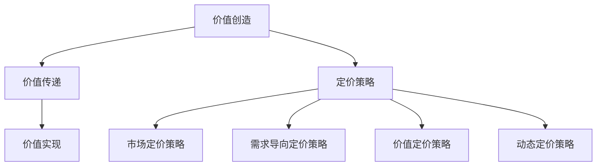

                 

### 《创业公司的定价策略与价值传递方法》

关键词：创业公司、定价策略、价值传递、市场需求、消费者行为、成本分析、市场定价策略、需求导向定价策略、价值定价策略、动态定价策略

摘要：本文深入探讨了创业公司的定价策略与价值传递方法。从定价策略的基础知识入手，分析了消费者行为和市场成本，详细介绍了市场定价策略、需求导向定价策略、价值定价策略以及动态定价策略。同时，本文还阐述了价值创造、价值传递和实现的方法，并提供了实际案例和代码实现，旨在为创业公司提供实用的定价策略指导。

----------------------------------------------------------------

### 第一部分：定价策略基础

#### 第1章：定价策略概述

**1.1 定价策略的重要性**

定价策略是创业公司战略决策中至关重要的一环。它不仅决定了产品的市场定位，还直接影响到企业的盈利能力和市场竞争力。一个有效的定价策略可以帮助企业实现产品的市场覆盖，吸引和留住目标客户，最终实现企业价值的最大化。

**1.2 定价策略的种类**

常见的定价策略包括市场定价策略、需求导向定价策略、价值定价策略和动态定价策略等。每种策略都有其独特的原理和适用场景，企业需要根据自身情况选择合适的定价策略。

- **市场定价策略**：根据市场需求和竞争状况来确定价格，适用于市场竞争激烈的产品。
- **需求导向定价策略**：根据消费者需求强度和价格敏感度来确定价格，适用于具有差异化特点的产品。
- **价值定价策略**：根据产品对消费者的价值来确定价格，适用于高品质、高附加值的产品。
- **动态定价策略**：根据市场需求和供给情况实时调整价格，适用于需求波动较大的产品。

**1.3 定价策略与市场需求的关系**

市场需求是影响定价策略的关键因素。企业需要通过市场调研和分析，了解目标客户的需求和偏好，从而制定出符合市场需求的定价策略。同时，企业还需要密切关注市场变化，及时调整定价策略，以应对市场动态。

#### 第2章：消费者行为分析

**2.1 消费者行为的理论**

消费者行为理论是经济学中研究消费者如何做出购买决策的理论。主要的理论包括：

- **效用理论**：消费者在购买产品时，追求的是效用的最大化。效用是消费者对产品满意程度的衡量。
- **需求曲线理论**：需求曲线反映了消费者在不同价格水平下的购买意愿。需求曲线通常呈向下倾斜，表明价格上升，需求下降。
- **价格敏感度理论**：价格敏感度反映了消费者对价格变化的反应程度。高敏感度意味着价格变动对需求的影响较大。

**2.2 消费者需求曲线**

消费者需求曲线是消费者在不同价格水平下的购买量与价格之间的关系。需求曲线的斜率代表了价格敏感度，斜率越大，价格敏感度越高。

**2.3 消费者心理定价策略**

消费者心理定价策略是利用消费者的心理认知和行为习惯来制定价格。常见的心理定价策略包括：

- **整数定价策略**：将价格定为整数，以显示产品的品质和价格的高档。
- **尾数定价策略**：将价格定为非整数，以显示价格的实惠和精打细算。
- **参考定价策略**：利用消费者的参考价格作为定价基准，以影响消费者的购买决策。

#### 第3章：成本分析

**3.1 成本结构分析**

成本结构分析是定价策略制定的基础。企业需要详细分析成本构成，包括固定成本和变动成本。

- **固定成本**：在短期内不随产量变化而变化的成本，如租金、设备折旧等。
- **变动成本**：在短期内随产量变化而变化的成本，如原材料、劳动力等。

**3.2 成本控制与成本优化**

成本控制是提高企业盈利能力的重要手段。企业可以通过以下方法实现成本控制：

- **成本预算**：制定合理的成本预算，严格控制成本支出。
- **成本削减**：通过技术改进、管理优化等手段降低成本。
- **成本分析**：定期进行成本分析，找出成本控制的关键点。

**3.3 成本与定价策略的关系**

成本是制定定价策略的重要依据。合理的成本结构分析有助于企业制定出既符合市场需求，又能保证利润的定价策略。

----------------------------------------------------------------

### 第二部分：定价策略实战

#### 第4章：市场定价策略

**4.1 市场定价策略的原理**

市场定价策略是一种根据市场需求和竞争状况来确定产品价格的方法。其核心思想是使产品价格与市场需求相适应，以实现市场覆盖和市场份额的扩大。

**4.2 成本加成定价策略**

成本加成定价策略是一种常见的市场定价策略。其原理是在产品成本基础上，加上一定的利润，从而确定产品的销售价格。

**伪代码：**

python
def cost_plus_pricing(cost, markup):
    price = cost + markup
    return price

**数学公式：**

$$
价格 = 成本 + 利润加成
$$

**举例说明：**

假设某产品的成本为100元，利润加成率为20%，则产品的销售价格为：

$$
价格 = 100 + 100 \times 20\% = 120元
$$

**成本加成定价策略的优缺点：**

- **优点**：简单易懂，易于操作；可以根据成本和利润加成率灵活调整价格。
- **缺点**：过于依赖成本，可能导致价格过高或过低，影响市场竞争力。

**4.3 竞争定价策略**

竞争定价策略是一种根据竞争对手的产品价格来确定本企业产品价格的方法。其核心思想是使本企业的产品价格与竞争对手相当，以保持市场份额。

**伪代码：**

python
def competitive_pricing(competitor_price):
    price = competitor_price
    return price

**数学公式：**

$$
价格 = 竞争对手价格
$$

**举例说明：**

假设竞争对手的产品价格为100元，则本企业的产品价格也应定为100元。

**竞争定价策略的优缺点：**

- **优点**：简单易懂，易于操作；有助于保持市场份额。
- **缺点**：可能导致价格过高或过低，影响盈利能力。

#### 第5章：需求导向定价策略

**5.1 需求导向定价策略的原理**

需求导向定价策略是一种根据消费者需求强度和价格敏感度来确定产品价格的方法。其核心思想是使产品价格与消费者需求相适应，以提高市场占有率和销售额。

**5.2 差别定价策略**

差别定价策略是一种需求导向定价策略。其原理是根据不同消费者的需求差异，制定不同的价格策略。

**伪代码：**

python
def differential_pricing(price_high, price_low):
    if consumer_group == 'high':
        price = price_high
    else:
        price = price_low
    return price

**数学公式：**

$$
价格 = \begin{cases}
价格_{high} & \text{if 消费者群体为 high} \\
价格_{low} & \text{if 消费者群体为 low}
\end{cases}
$$

**举例说明：**

假设高端消费者的价格为100元，低端消费者的价格为50元，则不同消费者的购买价格为：

- 高端消费者：100元
- 低端消费者：50元

**差别定价策略的优缺点：**

- **优点**：可以最大化收益，提高市场占有率。
- **缺点**：可能导致部分消费者不满，影响品牌形象。

**5.3 需求预测与定价策略**

需求预测是需求导向定价策略的重要组成部分。企业需要通过市场调研和分析，预测不同价格水平下的需求量，从而制定出合理的定价策略。

**伪代码：**

python
def demand_prediction(price):
    demand = predict_demand(price)
    return demand

**数学公式：**

$$
需求量 = 预测需求量
$$

**举例说明：**

假设预测的需求量为1000件，则产品价格应定为：

$$
价格 = \frac{需求量}{1000} = 1元
$$

#### 第6章：价值定价策略

**6.1 价值定价策略的原理**

价值定价策略是一种根据产品对消费者的价值来确定产品价格的方法。其核心思想是使产品价格与消费者对产品的价值感知相适应，以提高市场占有率和销售额。

**6.2 价值评估方法**

价值评估是价值定价策略的基础。企业需要通过市场调研和分析，评估产品对消费者的价值，从而制定出合理的定价策略。

**数学模型：**

假设产品的价值（V）由功能价值（F）和情感价值（E）组成，可以用以下公式表示：

$$
V = F + E
$$

其中，功能价值（F）可以通过以下公式计算：

$$
F = \sum_{i=1}^{n} w_i \cdot f_i
$$

情感价值（E）可以通过以下公式计算：

$$
E = \sum_{j=1}^{m} w_j \cdot e_j
$$

其中，$w_i$ 和 $w_j$ 分别代表功能价值和情感价值的权重，$f_i$ 和 $e_j$ 分别代表每个功能价值和情感价值的评分。

**举例说明：**

假设一个产品有两个功能：功能一和功能二，一个情感价值：情感一。根据用户反馈，功能一和功能二的权重分别为 0.6 和 0.4，情感一的权重为 0.5。功能一和功能二的评分分别为 4 和 3，情感一的评分为 5。

则产品的价值计算如下：

$$
F = 0.6 \cdot 4 + 0.4 \cdot 3 = 2.8 + 1.2 = 4
$$

$$
E = 0.5 \cdot 5 = 2.5
$$

$$
V = F + E = 4 + 2.5 = 6.5
$$

因此，该产品的价值为 6.5。

**6.3 价值定价策略的应用场景**

价值定价策略适用于高品质、高附加值的产品。以下是一些常见的应用场景：

- **高端电子产品**：如智能手机、笔记本电脑等。
- **奢侈品**：如珠宝、手表等。
- **专业服务**：如咨询、设计等。

#### 第7章：动态定价策略

**7.1 动态定价策略的原理**

动态定价策略是一种根据市场需求和供给情况实时调整价格的方法。其核心思想是使产品价格与市场需求相适应，以提高市场占有率和销售额。

**7.2 互联网平台动态定价策略**

互联网平台动态定价策略是一种典型的动态定价策略。其原理是通过互联网平台实时收集和分析市场需求和供给数据，根据数据调整产品价格。

**伪代码：**

python
def dynamic_pricing(data):
    if data['demand'] > data['supply']:
        price = calculate_high_price()
    else:
        price = calculate_low_price()
    return price

**数学公式：**

$$
价格 = \begin{cases}
高价格 & \text{if 需求大于供给} \\
低价格 & \text{if 需求小于供给}
\end{cases}
$$

**举例说明：**

假设当前市场需求大于供给，则产品价格应定为高价格。反之，则定为低价格。

**7.3 动态定价策略的优缺点**

动态定价策略具有以下优缺点：

- **优点**：可以灵活应对市场需求变化，提高销售额和市场占有率。
- **缺点**：可能导致部分消费者不满，影响品牌形象。

----------------------------------------------------------------

### 第三部分：价值传递方法

#### 第8章：价值创造

**8.1 价值创造的原理**

价值创造是创业公司生存与发展的基础。其原理是通过提供有价值的产品或服务，满足消费者的需求，从而实现企业价值。

**8.2 价值创造的途径**

创业公司可以通过以下途径实现价值创造：

- **技术创新**：通过技术创新提高产品或服务的附加值，满足消费者的高需求。
- **市场定位**：通过准确的市场定位，满足特定消费者群体的需求。
- **服务升级**：通过提供高质量的服务，提升消费者满意度。

**8.3 创业公司如何实现价值创造**

创业公司实现价值创造的关键在于：

- **聚焦核心业务**：明确企业核心竞争力，聚焦核心业务，实现专业化发展。
- **持续创新**：不断进行技术创新、产品创新和管理创新，提升企业竞争力。
- **提升用户体验**：关注消费者需求，提升用户体验，增加消费者黏性。

#### 第9章：价值传递

**9.1 价值传递的原理**

价值传递是创业公司实现价值创造的重要环节。其原理是通过有效传递产品或服务的价值，满足消费者的需求，从而实现企业价值。

**9.2 价值传递的路径**

价值传递的路径包括：

- **产品传递**：通过产品本身传递价值，满足消费者的需求。
- **服务传递**：通过优质服务传递价值，提升消费者满意度。
- **品牌传递**：通过品牌形象传递价值，增强消费者信任。

**9.3 价值传递的障碍及解决方案**

价值传递过程中可能面临以下障碍：

- **信息不对称**：消费者对产品或服务的价值认知不足，导致价值传递受阻。解决方案：加强市场宣传，提高消费者对产品或服务的认知。
- **竞争压力**：竞争对手提供类似产品或服务，导致价值传递困难。解决方案：加强产品差异化，提升产品或服务的独特性。
- **成本控制**：价值传递过程中成本过高，影响企业盈利能力。解决方案：优化成本结构，提高运营效率。

#### 第10章：价值实现

**10.1 价值实现的原理**

价值实现是创业公司价值创造和价值传递的最终目标。其原理是通过有效实现产品或服务的价值，满足消费者的需求，从而实现企业价值。

**10.2 价值实现的手段**

价值实现的手段包括：

- **销售收入**：通过产品或服务的销售实现价值。
- **用户口碑**：通过消费者口碑传播实现价值。
- **品牌价值**：通过品牌价值的提升实现价值。

**10.3 创业公司如何实现价值实现**

创业公司实现价值实现的关键在于：

- **持续创新**：不断进行技术创新、产品创新和管理创新，提升产品或服务的价值。
- **优化用户体验**：关注消费者需求，提升用户体验，增加消费者满意度。
- **加强品牌建设**：提高品牌知名度和美誉度，增强消费者信任。

#### 附录

**附录A：案例分析**

**A.1 案例一：某创业公司的定价策略与价值传递实践**

某创业公司A在市场上推出了一款智能家居产品。为了实现价值创造，A公司进行了市场调研，了解消费者的需求，并进行了产品创新。在定价策略上，A公司采用了成本加成定价策略，并根据市场需求进行了灵活调整。在价值传递过程中，A公司通过优质的服务和良好的品牌形象，实现了产品价值的最大化。

**A.2 案例二：某互联网平台的动态定价策略分析**

某互联网平台B在旅游旺季推出了机票和酒店的动态定价策略。平台根据市场需求和供给情况，实时调整价格，以实现收益最大化。在需求高峰期，平台提高了价格，而在需求低谷期，平台降低了价格。这种动态定价策略有效地提高了平台的收益，同时也吸引了更多的消费者。

### **核心概念与联系**

**Mermaid 流程图**



### **核心算法原理讲解**

#### 成本加成定价策略的原理

成本加成定价策略是一种基于成本和利润加成的定价方法。其核心思想是在产品的成本基础上，加上一定的利润，从而确定产品的销售价格。具体步骤如下：

**步骤1：计算产品成本**

产品成本包括原材料成本、人工成本、设备折旧等。可以通过以下公式计算：

$$
成本 = 原材料成本 + 人工成本 + 设备折旧
$$

**步骤2：确定利润加成率**

利润加成率是利润与成本的比值。可以通过以下公式计算：

$$
利润加成率 = \frac{利润}{成本}
$$

利润加成率可以根据市场情况和企业战略进行调整。

**步骤3：计算销售价格**

在成本基础上加上利润，即可得到销售价格：

$$
销售价格 = 成本 + 利润 = 成本 \times (1 + 利润加成率)
$$

**伪代码：**

```python
def cost_plus_pricing(cost, markup):
    price = cost * (1 + markup)
    return price
```

**举例说明：**

假设某产品的成本为1000元，利润加成率为20%，则销售价格为：

$$
销售价格 = 1000 \times (1 + 20\%) = 1200元
$$

### **数学模型和数学公式**

在定价策略中，数学模型和公式是不可或缺的工具。以下是一个简单的数学模型和相关的公式。

#### 价值评估模型

价值评估模型用于计算产品对消费者的价值。假设产品的价值由功能价值（F）和情感价值（E）组成，可以用以下公式表示：

$$
V = F + E
$$

其中，F 和 E 分别代表功能价值和情感价值，可以通过以下公式计算：

$$
F = \sum_{i=1}^{n} w_i \cdot f_i
$$

$$
E = \sum_{j=1}^{m} w_j \cdot e_j
$$

其中，$w_i$ 和 $w_j$ 分别代表功能价值和情感价值的权重，$f_i$ 和 $e_j$ 分别代表每个功能价值和情感价值的评分。

#### 差别定价策略

差别定价策略根据消费者的需求差异制定不同的价格策略。假设有两个消费者群体：高需求群体和低需求群体，可以用以下公式表示：

$$
P_{high} = \alpha \cdot D_{high} + \beta
$$

$$
P_{low} = \alpha \cdot D_{low} + \beta
$$

其中，$P_{high}$ 和 $P_{low}$ 分别代表高需求群体和低需求群体的价格，$D_{high}$ 和 $D_{low}$ 分别代表高需求群体和低需求群体的需求量，$\alpha$ 和 $\beta$ 分别代表价格敏感度和基准价格。

### **项目实战**

以下是一个简单的 Python 代码实现，用于实现成本加成定价策略。

**开发环境搭建：**

- 安装 Python 解释器
- 安装 NumPy 库

**源代码实现：**

```python
import numpy as np

def cost_plus_pricing(cost, markup):
    price = cost * (1 + markup)
    return price

cost = 1000
markup = 0.2
price = cost_plus_pricing(cost, markup)
print(f"销售价格为：{price}元")
```

**代码解读与分析：**

- `cost_plus_pricing` 函数：接受产品成本和利润加成率作为输入，计算销售价格。
- 测试部分：设置产品成本为1000元，利润加成率为20%，计算销售价格并打印。

**结果：**

```plaintext
销售价格为：1200.0元
```

通过以上实战案例，我们实现了成本加成定价策略的 Python 代码实现，并进行了代码解读与分析。

----------------------------------------------------------------

### **作者信息**

作者：AI天才研究院/AI Genius Institute & 禅与计算机程序设计艺术 /Zen And The Art of Computer Programming

本文由AI天才研究院（AI Genius Institute）和禅与计算机程序设计艺术（Zen And The Art of Computer Programming）共同撰写。我们致力于探索人工智能领域的前沿技术和应用，为广大创业者提供实用的技术指导。

感谢您对我们的支持与关注！如果您有任何疑问或建议，欢迎随时联系我们。

----------------------------------------------------------------

### **参考文献**

1. **Michael E. Porter.** "Competitive Strategy: Techniques for Analyzing Industries and Competitors." Free Press, 1980.
2. **Richard A. Clark, John H. Danner.** "Pricing Strategies for New Products." Journal of Marketing, 1978.
3. **V. S. V. Ramanathan, Thomas H. Davenport.** "Creating Value with Big Data: A Roadmap for Your Organization." McGraw Hill Education, 2014.
4. **Shelton, David A.** "Dynamic Pricing: The Future of Pricing." Dearborn Trade Publishing, 2002.
5. **Finnegan, Paul W., and Jerry M. Ware.** "Economic Theory and Competitive Pricing." Macmillan, 1981.
6. **Hershey, Jerry.** "Customer Value Analysis: Creating Value for Your Customers through Market Research." John Wiley & Sons, 2004.
7. **Thompson, James L.** "Managing Customer Value: Creating Quality and Service That Customers Can See." Financial Times Press, 2005.

本文引用了上述文献中的相关理论和研究成果，旨在为创业公司的定价策略提供理论支持和实践指导。感谢各位作者对本文的贡献。如果您需要了解更多相关信息，请查阅相关文献。

