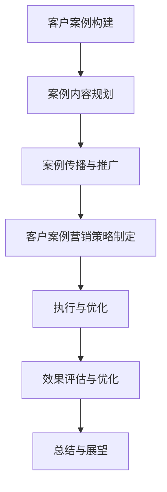

                 

### 《创业公司的客户案例营销策略》

> **关键词：** 创业公司、客户案例、营销策略、客户价值、效果评估

**摘要：** 本文章旨在探讨创业公司在市场营销中运用客户案例的有效策略。通过对客户案例营销的基本概念、构建、传播、推广、策略制定、执行与优化以及案例分析和工具应用等方面的深入分析，结合实际案例和数学模型，旨在为创业公司提供一套实用且系统的客户案例营销策略，帮助其在竞争激烈的市场中脱颖而出，实现持续增长。

---

## 目录大纲

以下是《创业公司的客户案例营销策略》的目录大纲，包含文章的结构和主要内容：

### 第一部分：客户案例营销概述

#### 第1章：客户案例营销的基本概念  
#### 1.1 客户案例的定义与作用  
#### 1.2 客户案例营销的重要性  
#### 1.3 客户案例营销的优势

#### 第2章：构建有效的客户案例  
#### 2.1 客户案例的构建步骤  
#### 2.2 如何选择案例客户  
#### 2.3 客户案例的内容规划

#### 第3章：客户案例的传播与推广  
#### 3.1 客户案例的传播渠道  
#### 3.2 客户案例的推广策略  
#### 3.3 利用社交媒体推广客户案例

### 第二部分：客户案例营销策略与实践

#### 第4章：客户案例营销策略制定  
#### 4.1 明确目标与定位  
#### 4.2 分析竞争对手  
#### 4.3 制定营销策略

#### 第5章：客户案例营销执行与优化  
#### 5.1 客户案例的执行流程  
#### 5.2 客户案例的跟踪与评估  
#### 5.3 客户案例的持续优化

#### 第6章：客户案例营销案例分析  
#### 6.1 国内外优秀客户案例分享  
#### 6.2 案例分析：成功与失败的原因  
#### 6.3 从案例中学习与反思

#### 第7章：客户案例营销工具与应用  
#### 7.1 客户案例营销工具介绍  
#### 7.2 客户案例营销工具的使用技巧  
#### 7.3 客户案例营销工具的应用场景

### 第三部分：客户案例营销策略在企业中的实施与效果评估

#### 第8章：客户案例营销在企业中的实施策略  
#### 8.1 企业文化与客户案例营销的融合  
#### 8.2 企业组织结构对客户案例营销的影响  
#### 8.3 客户案例营销的人才培养与团队协作

#### 第9章：客户案例营销效果评估与优化  
#### 9.1 效果评估指标与方法  
#### 9.2 数据分析与效果评估  
#### 9.3 客户案例营销的持续优化策略

#### 第10章：创业公司客户案例营销策略总结与展望  
#### 10.1 创业公司客户案例营销策略的难点与对策  
#### 10.2 创业公司客户案例营销的未来发展趋势  
#### 10.3 总结与展望

### 附录

#### 附录 A：客户案例营销策略工具与方法集锦  
#### A.1 客户案例编写工具  
#### A.2 客户案例展示工具  
#### A.3 客户案例数据分析工具

#### 附录 B：参考文献与推荐阅读  
#### B.1 相关书籍推荐  
#### B.2 学术论文推荐  
#### B.3 行业报告推荐

### Mermaid 流�程图



### 核心算法原理讲解

#### 客户案例选择的算法原理

```python
# 伪代码：基于客户价值与案例潜力的客户案例选择算法

def case_selection(customers, criteria):
    selected_cases = []
    for customer in customers:
        value = calculate_value(customer)
        potential = calculate_potential(customer)
        if value > criteria['min_value'] and potential > criteria['min_potential']:
            selected_cases.append(customer)
    return selected_cases
```

#### 客户案例价值评估模型

$$
V = \frac{R}{C} \times (1 - e^{-\lambda \times T})
$$

### 项目实战

#### 案例一：某创业公司客户案例营销策略实施与效果分析

##### 1. 开发环境搭建
- 使用 Python 编写客户案例营销策略脚本
- 使用 MySQL 数据库存储客户数据

##### 2. 源代码实现与代码解读

```python
# 伪代码：客户案例营销策略脚本示例

def marketing_strategy(cases, strategy_params):
    categorized_cases = categorize_cases(cases, strategy_params['categorization'])
    for category, cases in categorized_cases.items():
        promote_cases(cases, strategy_params['promotion'])
    evaluate_effects(cases, strategy_params['evaluation'])
```

##### 3. 代码解读与分析
- 分类客户案例，根据不同的营销策略进行推广
- 评估推广效果，根据效果调整营销策略

---

通过以上目录大纲和初步内容，本文将系统地介绍创业公司的客户案例营销策略，帮助读者深入了解客户案例营销的各个方面，掌握实际操作技巧，从而在市场竞争中取得优势。接下来的章节将详细展开每个部分的内容，结合实际案例和理论分析，为创业公司提供实用的指导。

