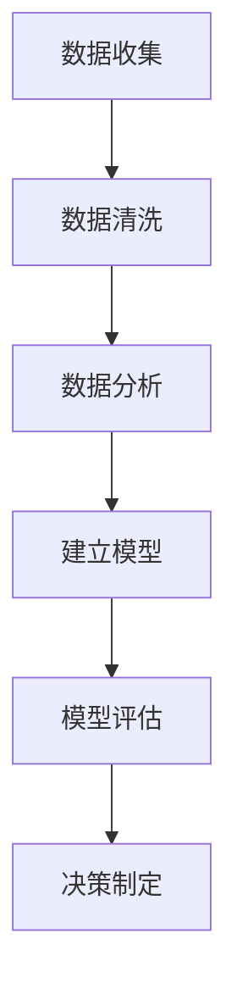

                 

# 《创业公司的用户体验度量指标》

> 关键词：用户体验、度量指标、用户行为分析、用户满意度、用户忠诚度

> 摘要：本文将深入探讨创业公司在提升用户体验方面的关键度量指标，包括用户行为分析、用户满意度调查和用户忠诚度分析。通过对这些指标的定义、分类、应用和实践的详细解读，旨在帮助创业公司优化产品设计和服务，实现持续的用户满意度和市场竞争力。

## 目录大纲

- **第一部分：用户体验度量指标概述**
  - 第1章：用户体验度量指标的定义和重要性
  - 第2章：用户体验度量指标的分类
  - 第3章：用户体验度量指标的评估方法

- **第二部分：用户体验度量指标的应用**
  - 第4章：用户行为分析
  - 第5章：用户满意度调查
  - 第6章：用户忠诚度分析

- **第三部分：用户体验度量指标的实践与优化**
  - 第7章：用户体验度量指标的实践
  - 第8章：用户体验度量指标的优化
  - 第9章：用户体验度量指标的未来趋势

- **附录**
  - 附录A：用户体验度量指标相关工具和资源

### 第一部分：用户体验度量指标概述

#### 第1章：用户体验度量指标的定义和重要性

用户体验（User Experience, UX）是一个多维度的概念，涵盖了用户在使用产品或服务过程中的感受、行为和满意度。在创业公司中，用户体验度量指标是衡量产品和服务质量的关键工具，有助于公司了解用户需求、优化产品设计、提高用户满意度和忠诚度。

**1.1 用户体验度量指标的定义**

用户体验度量指标是用于量化用户在使用产品或服务过程中各种行为和感受的指标。这些指标可以分为量化指标和定性指标，以及行为指标和态度指标。

- **量化指标**：如页面浏览量、点击率、转化率等，这些指标可以客观地衡量用户行为。
- **定性指标**：如用户满意度评分、用户反馈等，这些指标更侧重于用户的感受和主观体验。
- **行为指标**：如用户留存率、用户流失率等，这些指标反映了用户的使用行为。
- **态度指标**：如用户满意度评分、用户忠诚度等，这些指标反映了用户对产品和服务的态度。

**1.2 用户体验度量指标的重要性**

用户体验度量指标对于创业公司至关重要，原因如下：

- **了解用户需求**：度量指标可以帮助公司了解用户的行为和需求，从而更好地定位市场。
- **优化产品设计**：通过分析用户体验度量指标，公司可以找出产品设计中的不足，进行优化和改进。
- **提高用户满意度**：用户体验度量指标直接反映了用户的满意度，公司可以根据这些数据提升用户满意度。
- **增强市场竞争力**：良好的用户体验可以提升品牌形象，增加用户忠诚度，从而增强市场竞争力。

#### 第2章：用户体验度量指标的分类

用户体验度量指标的分类有助于我们更清晰地理解和使用这些指标。常见的分类方法包括量化指标与定性指标、行为指标与态度指标。

**2.1 量化指标与定性指标**

- **量化指标**：这类指标通常使用数值来表示，如页面浏览量、点击率、转化率等。它们可以提供客观的数据支持，帮助公司了解用户行为和趋势。
- **定性指标**：这类指标通常使用文字描述来表示，如用户满意度评分、用户反馈等。它们反映了用户的感受和主观体验，有助于公司理解用户的真实需求。

**2.2 行为指标与态度指标**

- **行为指标**：这类指标反映了用户在使用产品或服务过程中的行为，如用户留存率、用户流失率、转化率等。它们有助于公司了解用户的行为模式和偏好。
- **态度指标**：这类指标反映了用户对产品或服务的态度，如用户满意度评分、用户忠诚度等。它们有助于公司评估用户对产品或服务的整体感受和忠诚度。

**2.3 用户体验度量指标的评估方法**

用户体验度量指标的评估方法主要包括数据收集、数据分析、评估模型等。

- **数据收集**：通过用户行为追踪、问卷调查、用户访谈等方式收集用户体验数据。
- **数据分析**：对收集到的数据进行统计分析和数据挖掘，提取有用的信息和洞察。
- **评估模型**：基于分析结果，建立评估模型，如用户满意度模型、用户忠诚度模型等，对用户体验进行量化评估。

#### 第3章：用户体验度量指标的评估方法

用户体验度量指标的评估方法对于创业公司来说至关重要。以下是一些常用的评估方法：

- **用户行为分析**：通过用户行为数据，分析用户的浏览路径、点击行为等，了解用户的使用习惯和偏好。
- **用户满意度调查**：通过问卷调查、用户访谈等方式，收集用户的满意度数据，了解用户的整体感受。
- **用户忠诚度分析**：通过用户留存率、用户流失率等指标，分析用户的忠诚度，了解用户的长期价值。

**3.1 用户行为分析**

用户行为分析是一种常用的用户体验度量方法，通过分析用户在产品或服务中的行为数据，了解用户的使用习惯和偏好。

- **数据收集**：通过页面点击流、浏览器插件、用户日志等方式收集用户行为数据。
- **数据分析**：对收集到的数据进行分析，提取用户的行为模式、偏好等信息。
- **评估模型**：基于分析结果，建立用户行为分析模型，对用户体验进行量化评估。

**3.2 用户满意度调查**

用户满意度调查是一种通过问卷、访谈等方式收集用户对产品或服务满意度数据的方法。

- **调查方法**：通过在线问卷、电话访谈、面对面访谈等方式收集用户满意度数据。
- **数据分析**：对收集到的数据进行分析，提取用户满意度得分、用户反馈等信息。
- **评估模型**：基于分析结果，建立用户满意度模型，对用户体验进行量化评估。

**3.3 用户忠诚度分析**

用户忠诚度分析是一种通过用户留存率、用户流失率等指标，分析用户忠诚度的方法。

- **数据收集**：通过用户注册数据、登录数据等，收集用户留存率和流失率数据。
- **数据分析**：对收集到的数据进行分析，提取用户留存率、流失率等信息。
- **评估模型**：基于分析结果，建立用户忠诚度模型，对用户体验进行量化评估。

### 总结

用户体验度量指标是创业公司在提升用户体验、优化产品设计和服务过程中不可或缺的工具。通过对用户体验度量指标的定义、分类、应用和实践的深入探讨，创业公司可以更好地了解用户需求，优化产品设计，提高用户满意度和忠诚度，从而在激烈的市场竞争中脱颖而出。本文将逐步深入这些主题，帮助创业公司实现这一目标。

## 第二部分：用户体验度量指标的应用

### 第4章：用户行为分析

用户行为分析是用户体验度量指标的核心之一，它通过分析用户在产品或服务中的行为，帮助创业公司了解用户的需求和偏好，从而优化产品设计和服务。

#### 4.1 用户行为分析的概念

用户行为分析（User Behavior Analysis）是指对用户在产品或服务中的行为进行系统性的观察、记录、分析和解读。这些行为数据包括用户的浏览路径、点击行为、使用频率、停留时间等。

**用户行为分析的关键概念**：

- **用户浏览路径**：用户在产品中的访问路径，反映了用户的使用习惯和兴趣点。
- **点击行为**：用户在产品中的点击动作，包括页面点击、按钮点击等，反映了用户的兴趣和需求。
- **使用频率**：用户在产品中的活跃度，反映了用户的依赖程度。
- **停留时间**：用户在产品中的停留时间，反映了用户的兴趣和满意度。

#### 4.2 用户行为分析的方法

用户行为分析的方法主要包括以下几种：

- **日志分析**：通过收集和分析用户行为日志，提取用户的行为数据。
- **点击流分析**：通过跟踪用户的鼠标点击和键盘操作，分析用户的行为模式。
- **热图分析**：通过可视化用户在页面上的行为，帮助理解用户的使用习惯和偏好。
- **A/B测试**：通过对比不同版本的页面或功能，分析用户对不同版本的接受程度。

**用户行为分析的具体方法**：

1. **数据收集**：

   - **日志文件**：通过服务器日志记录用户的访问行为。
   - **跟踪代码**：在网页或应用程序中嵌入跟踪代码，记录用户的行为数据。
   - **用户行为追踪器**：使用专门的工具跟踪用户的行为，如Google Analytics。

2. **数据分析**：

   - **数据预处理**：清洗、过滤和转换原始数据，使其适合分析。
   - **数据可视化**：使用图表、热图等可视化工具，直观展示用户行为数据。
   - **统计分析**：使用统计方法分析用户行为数据，提取有用的信息和模式。

3. **评估模型**：

   - **用户行为模型**：基于数据分析结果，建立用户行为模型，预测用户的行为。
   - **用户画像**：基于用户行为数据，构建用户画像，了解不同类型用户的特点。

#### 4.3 用户行为分析的应用案例

用户行为分析在创业公司中有着广泛的应用，以下是一些典型的应用案例：

- **社交媒体分析**：

  - **案例**：某创业公司通过用户行为分析，发现大部分用户在社交媒体上倾向于使用移动设备，因此优化了移动端的应用界面，提高了用户体验。
  - **效果**：移动端用户活跃度显著提升，用户满意度提高。

- **网站用户行为分析**：

  - **案例**：某创业公司通过点击流分析和热图分析，发现用户在购买流程中的几个关键页面存在较高的跳出率，因此对这些问题页面进行了优化。
  - **效果**：购买转化率显著提升，销售额增加。

- **产品迭代**：

  - **案例**：某创业公司通过用户行为分析，发现用户对某个新功能的使用频率较低，因此决定对该功能进行改进或删除。
  - **效果**：优化了产品功能，提高了用户体验。

### 第5章：用户满意度调查

用户满意度调查是另一个重要的用户体验度量方法，它通过直接收集用户的满意度数据，帮助创业公司了解用户对产品或服务的整体感受，从而进行改进。

#### 5.1 用户满意度调查的方法

用户满意度调查的方法主要包括以下几种：

- **问卷调查**：通过在线问卷、纸质问卷等方式，收集用户对产品或服务的满意度评分和反馈。
- **电话访谈**：通过电话与用户进行一对一的访谈，收集详细的满意度数据和用户意见。
- **面对面访谈**：与用户面对面交流，深入了解用户的满意度和需求。

**用户满意度调查的具体步骤**：

1. **设计问卷**：根据调查目的，设计合理的问卷，包括满意度评分、开放性问题等。
2. **数据收集**：通过问卷、电话或面对面访谈等方式，收集用户满意度数据。
3. **数据分析**：对收集到的数据进行分析，提取满意度得分、用户反馈等。
4. **评估模型**：基于分析结果，建立用户满意度模型，评估用户满意度。

#### 5.2 用户满意度调查的应用案例

用户满意度调查在创业公司中的应用案例非常丰富，以下是一些具体的例子：

- **产品改进**：

  - **案例**：某创业公司通过用户满意度调查，发现用户对产品的一个功能模块评价较低，因此决定对该模块进行改进。
  - **效果**：改进后，用户满意度显著提升，产品评价增加。

- **服务优化**：

  - **案例**：某创业公司通过用户满意度调查，发现用户对客服服务的满意度较低，因此增加了客服人员培训，改进了客服流程。
  - **效果**：客服满意度显著提升，用户满意度增加。

- **市场推广**：

  - **案例**：某创业公司通过用户满意度调查，发现用户对产品品牌的满意度较高，因此加大了市场推广力度，提高了品牌知名度。
  - **效果**：市场占有率提升，销售额增加。

### 第6章：用户忠诚度分析

用户忠诚度分析是衡量用户对产品或服务的长期价值的重要指标，它通过分析用户的留存率、流失率等数据，帮助创业公司了解用户的忠诚度，制定相应的策略。

#### 5.1 用户忠诚度的定义

用户忠诚度（User Loyalty）是指用户对产品或服务的持续使用和忠诚度。一个高忠诚度的用户不仅会重复使用产品或服务，还可能会推荐给其他潜在用户。

**用户忠诚度的关键概念**：

- **留存率**：用户在一定时间内持续使用产品的比例，反映了用户的持续使用意愿。
- **流失率**：用户在一定时间内停止使用产品的比例，反映了用户的流失情况。
- **重复购买率**：用户在一定时间内重复购买产品的比例，反映了用户的购买意愿。

#### 5.2 用户忠诚度的度量指标

用户忠诚度的度量指标主要包括以下几种：

- **用户留存率**：用户在一段时间内持续使用产品的比例。
- **用户流失率**：用户在一段时间内停止使用产品的比例。
- **重复购买率**：用户在一段时间内重复购买产品的比例。

**用户忠诚度的评估模型**：

- **RFM模型**：基于用户的最近购买时间（Recency）、购买频率（Frequency）和购买金额（Monetary）评估用户的忠诚度。
- **Loyalty Score模型**：综合多个指标，如留存率、流失率、重复购买率等，评估用户的忠诚度。

#### 5.3 用户忠诚度的提升策略

提升用户忠诚度是创业公司的重要目标，以下是一些有效的策略：

- **个性化服务**：根据用户的行为数据和偏好，提供个性化的产品和服务，提高用户的满意度和忠诚度。
- **用户关怀**：定期与用户互动，了解用户的需求和反馈，及时解决用户的问题，提高用户的忠诚度。
- **奖励机制**：通过积分、优惠券等奖励机制，鼓励用户持续使用产品或服务，提高用户的忠诚度。
- **社区建设**：建立用户社区，促进用户之间的交流和互动，增强用户的归属感和忠诚度。

### 总结

用户体验度量指标在创业公司中起着至关重要的作用。通过用户行为分析、用户满意度调查和用户忠诚度分析，创业公司可以深入了解用户的需求和偏好，优化产品设计和服务，提高用户满意度和忠诚度。本文对用户体验度量指标的应用进行了详细的探讨，为创业公司提供了实用的方法和策略。在下一部分，我们将深入探讨用户体验度量指标的实践与优化。

### 第三部分：用户体验度量指标的实践与优化

#### 第7章：用户体验度量指标的实践

用户体验度量指标的实践是创业公司提升产品和服务质量的关键步骤。通过科学的方法和实践流程，创业公司可以有效地收集和分析用户体验数据，从而指导产品优化和决策制定。

#### 7.1 用户体验度量指标的实践流程

用户体验度量指标的实践流程通常包括以下几个关键步骤：

**1. 确定目标与指标**：

- **目标设定**：明确用户体验度量指标的应用目标，如提升用户满意度、降低用户流失率等。
- **指标选择**：根据目标选择合适的用户体验度量指标，如用户行为指标、满意度指标、忠诚度指标等。

**2. 数据收集**：

- **数据来源**：确定数据的来源，如用户行为日志、问卷调查结果、用户反馈等。
- **数据收集方法**：采用适当的工具和技术进行数据收集，如使用跟踪代码、问卷调查工具、用户访谈等。

**3. 数据处理与分析**：

- **数据清洗**：去除无效和错误的数据，确保数据的准确性和完整性。
- **数据分析**：使用统计分析和数据挖掘方法，提取用户行为模式和趋势，形成洞察。

**4. 模型构建与评估**：

- **构建模型**：基于分析结果，建立用户行为模型、满意度模型、忠诚度模型等。
- **评估与优化**：通过验证和迭代，优化模型，提高预测准确性和决策支持能力。

**5. 决策制定与实施**：

- **决策制定**：根据分析结果和模型预测，制定相应的产品优化策略和服务改进方案。
- **实施与监控**：执行优化措施，并持续监控用户体验数据，评估效果。

#### 7.2 用户体验度量指标的实践案例

以下是一些用户体验度量指标的实践案例：

**案例一：创业公司A的用户行为分析实践**

- **目标**：提高用户留存率和用户活跃度。
- **指标**：用户留存率、用户活跃度、页面浏览量。
- **数据收集**：通过用户行为日志和页面点击流数据收集用户行为数据。
- **数据处理**：使用日志文件处理工具（如ELK Stack）清洗和存储数据。
- **分析**：使用Python和R等数据分析工具进行数据分析，提取用户行为模式。
- **模型构建**：构建用户留存率和活跃度预测模型。
- **决策**：基于模型预测结果，优化产品功能和用户体验。
- **效果**：用户留存率和活跃度显著提升。

**案例二：创业公司B的用户满意度调查实践**

- **目标**：提高用户满意度和产品口碑。
- **指标**：用户满意度评分、用户反馈。
- **数据收集**：通过在线问卷和用户访谈收集用户满意度数据。
- **数据处理**：使用问卷调查分析工具（如SurveyMonkey）对数据进行分析。
- **模型构建**：建立用户满意度评分模型。
- **决策**：根据用户反馈，优化产品功能和用户界面。
- **效果**：用户满意度评分提升，产品口碑改善。

#### 第8章：用户体验度量指标的优化

用户体验度量指标的优化是提升用户体验和产品服务质量的重要环节。通过不断优化度量指标，创业公司可以更准确地评估用户体验，并制定更有效的产品优化策略。

#### 8.1 用户体验度量指标的优化方法

用户体验度量指标的优化方法主要包括以下几个方面：

**1. 指标选择与优化**：

- **指标筛选**：根据业务目标，选择最相关和最有价值的用户体验度量指标。
- **指标优化**：对现有指标进行优化，如调整指标的计算方法、增加新的指标等。

**2. 数据处理与分析**：

- **数据处理**：优化数据收集、存储和处理流程，确保数据的准确性和及时性。
- **数据分析**：采用先进的数据分析技术和方法，提高数据分析的深度和广度。

**3. 模型构建与评估**：

- **模型改进**：优化用户行为模型、满意度模型、忠诚度模型等，提高预测准确性和决策支持能力。
- **模型评估**：定期评估和验证模型效果，确保模型的有效性和可靠性。

**4. 用户体验改进**：

- **用户体验测试**：通过A/B测试、多变量测试等，验证和优化用户体验改进方案。
- **用户反馈收集**：持续收集用户反馈，了解用户需求和偏好，指导用户体验改进。

#### 8.2 用户体验度量指标的优化案例

以下是一些用户体验度量指标的优化案例：

**案例一：创业公司C的用户忠诚度优化实践**

- **目标**：提高用户忠诚度和重复购买率。
- **指标**：用户留存率、流失率、重复购买率。
- **数据收集**：通过用户注册数据和交易数据收集忠诚度指标数据。
- **数据处理**：使用数据仓库技术（如Hadoop）进行大数据处理。
- **分析**：使用机器学习算法（如聚类分析、回归分析）进行用户行为分析。
- **模型构建**：建立用户忠诚度预测模型和流失预测模型。
- **决策**：基于模型预测，制定用户忠诚度提升策略，如个性化推荐、优惠券等。
- **效果**：用户忠诚度显著提升，重复购买率增加。

**案例二：创业公司D的用户满意度优化实践**

- **目标**：提高用户满意度和市场占有率。
- **指标**：用户满意度评分、用户反馈。
- **数据收集**：通过在线问卷和社交媒体监测收集用户满意度数据。
- **数据处理**：使用自然语言处理技术（如文本挖掘）分析用户反馈。
- **模型构建**：建立用户满意度评分模型和反馈分析模型。
- **决策**：根据用户反馈，优化产品功能和用户界面。
- **效果**：用户满意度评分提升，市场占有率增加。

### 总结

用户体验度量指标的实践与优化是创业公司提升产品和服务质量的关键环节。通过科学的方法和实践流程，创业公司可以更准确地评估用户体验，并制定更有效的产品优化策略。本文通过具体的案例，详细阐述了用户体验度量指标的实践和优化方法，为创业公司提供了实用的指导。在下一部分，我们将探讨用户体验度量指标的未来趋势。

#### 第9章：用户体验度量指标的未来趋势

随着技术的不断进步和用户需求的多样化，用户体验度量指标也在不断发展。未来，用户体验度量指标将更加智能化、个性化，同时面临一系列新的挑战。

#### 9.1 用户体验度量指标的发展趋势

**1. 数据驱动的用户体验优化**

未来，用户体验度量指标将更加依赖于数据分析和人工智能技术。通过大数据分析和机器学习算法，创业公司可以更深入地了解用户行为和需求，实现数据驱动的用户体验优化。

- **预测分析**：利用预测分析技术，提前识别用户流失风险和潜在的用户需求，采取预防性措施。
- **个性化推荐**：基于用户行为数据，实现个性化推荐，提高用户体验和满意度。

**2. 用户体验的全面性**

未来的用户体验度量指标将不仅关注用户的行为和满意度，还会关注用户的情感体验和心理状态。

- **情感分析**：通过情感分析技术，了解用户的情感状态，如快乐、愤怒、失望等，为产品优化提供依据。
- **心理测量**：结合心理测量学方法，评估用户的心理状态，如焦虑、压力等，帮助创业公司改善用户体验。

**3. 用户体验的可视化**

用户体验度量指标的未来将更加注重数据的可视化和交互性。通过可视化工具，创业公司可以更直观地了解用户体验数据，发现问题和机会。

- **交互式图表**：提供交互式图表和仪表盘，帮助团队成员实时监控用户体验数据。
- **可视化分析**：通过可视化分析，深入挖掘用户体验数据，发现隐藏的模式和趋势。

#### 9.2 用户体验度量指标的未来挑战

**1. 数据隐私保护**

随着用户体验度量指标的精细化，用户隐私保护成为一个重要挑战。创业公司需要确保在数据收集和分析过程中遵守相关法律法规，保护用户隐私。

- **隐私保护政策**：制定明确的隐私保护政策，告知用户数据收集和使用的目的。
- **数据加密**：采用数据加密技术，确保用户数据在传输和存储过程中的安全性。

**2. 技术复杂性**

用户体验度量指标的未来将面临技术复杂性增加的挑战。随着数据分析、机器学习等技术的应用，创业公司需要具备相应的技术能力和专业知识。

- **技术培训**：为团队成员提供技术培训，提升团队的技术水平。
- **技术合作**：与技术合作伙伴建立合作关系，共同解决技术难题。

**3. 用户行为变化**

随着社会和技术的不断发展，用户行为也在不断变化。创业公司需要不断调整用户体验度量指标，以适应用户行为的新变化。

- **用户研究**：定期进行用户研究，了解用户行为和需求的变化。
- **敏捷开发**：采用敏捷开发方法，快速响应用户需求和市场变化。

### 总结

用户体验度量指标在创业公司中扮演着至关重要的角色。随着技术的进步和用户需求的多样化，用户体验度量指标将朝着智能化、个性化、全面化的方向发展。同时，创业公司也面临着数据隐私保护、技术复杂性、用户行为变化等新的挑战。通过不断创新和优化，创业公司可以更好地利用用户体验度量指标，提升产品和服务质量，满足用户的多样化需求。

## 附录

#### 附录A：用户体验度量指标相关工具和资源

在用户体验度量指标的研究和实践过程中，有许多工具和资源可供选择。以下是一些常用的工具和资源：

#### A.1 常用用户体验度量工具

1. **Google Analytics**：
   - 描述：Google提供的免费网站分析工具，可用于跟踪用户行为、流量来源等。
   - 链接：[Google Analytics](https://analytics.google.com/)

2. **Hotjar**：
   - 描述：提供热图、点击流分析和用户反馈功能的用户体验分析工具。
   - 链接：[Hotjar](https://www.hotjar.com/)

3. **Mixpanel**：
   - 描述：专注于用户行为分析的实时数据分析平台，可用于跟踪用户行为、用户流失等。
   - 链接：[Mixpanel](https://mixpanel.com/)

4. **Kissmetrics**：
   - 描述：用于跟踪用户生命周期、用户行为和转化率的营销分析工具。
   - 链接：[Kissmetrics](https://kissmetrics.com/)

#### A.2 用户体验度量指标资源链接

1. **UXPA国际协会**：
   - 描述：用户体验专业人士的国际协会，提供丰富的用户体验资源和知识。
   - 链接：[UXPA International](https://uxpa.org/)

2. **UserZoom**：
   - 描述：用户体验研究和测试平台，提供在线问卷、用户测试等服务。
   - 链接：[UserZoom](https://www.userzoom.com/)

3. **Nielsen Norman Group**：
   - 描述：专注于用户体验研究的咨询公司，提供丰富的用户体验报告和文章。
   - 链接：[Nielsen Norman Group](https://www.nngroup.com/)

#### A.3 用户行为分析流程图

以下是一个用户行为分析的基本流程图：



#### A.4 用户满意度调查模板

以下是一个简单的用户满意度调查模板：

```
1. 请对您的整体体验进行评分（1-5分）。
2. 您对产品的功能满意度如何？（1-5分）
3. 您对服务的满意度如何？（1-5分）
4. 您对产品的易用性满意度如何？（1-5分）
5. 您是否会推荐这款产品给朋友或同事？是/否
6. 请提出您对产品的建议或改进意见。
```

#### A.5 用户忠诚度分析模型

以下是一个简单的用户忠诚度分析模型：

$$
Loyalty Score = \frac{R + F + M}{3}
$$

- **R**：用户留存率（Retention Rate）
- **F**：用户频率（Frequency of Use）
- **M**：用户贡献（Monetary Value）

这个模型通过综合用户的留存率、使用频率和贡献来评估用户的忠诚度。分数越高，表示用户忠诚度越高。

## 作者信息

- **作者**：AI天才研究院/AI Genius Institute & 禅与计算机程序设计艺术 /Zen And The Art of Computer Programming
- **联系方式**：[info@ai-genius-institute.com](mailto:info@ai-genius-institute.com)

本文由AI天才研究院撰写，旨在为创业公司提供关于用户体验度量指标的深入指导和实用策略。希望本文能够帮助您在提升用户体验的道路上取得更好的成果。如果您有任何问题或建议，欢迎联系我们。

