                 

## 《创业公司的用户细分与精准营销策略》

> **关键词：** 用户细分、精准营销、创业公司、数据分析、营销策略

**摘要：** 本文将深入探讨创业公司如何利用用户细分和精准营销策略来提高用户满意度、增强用户忠诚度并最终实现商业成功。文章首先介绍了用户细分的重要性及其方法，然后详细阐述了精准营销策略的定义、关键要素和实施步骤。通过实际案例分析，本文展示了这些策略在创业公司中的应用，并提出了策略评估与优化的建议。最终，文章附录部分提供了相关工具与资源的推荐，以帮助创业者更好地实施用户细分与精准营销。

### 目录大纲

**第一部分：创业公司的用户细分与精准营销策略基础**

- **第1章：用户细分概述**
  - 1.1 用户细分的重要性
  - 1.1.1 用户细分的定义与目的
  - 1.1.2 用户细分的方法
  - 1.2 用户细分的关键指标
  - 1.2.1 用户行为分析
  - 1.2.2 用户属性分析
  - 1.2.3 用户生命周期价值分析
  - 1.3 用户细分工具与技术
  - 1.3.1 数据分析工具
  - 1.3.2 数据挖掘技术
  - 1.3.3 用户画像技术
  - 1.4 用户细分在创业公司中的应用
  - 1.4.1 提升用户体验
  - 1.4.2 优化产品服务
  - 1.4.3 增强用户忠诚度

- **第2章：精准营销策略概述**
  - 2.1 精准营销的定义与特点
  - 2.1.1 精准营销的概念
  - 2.1.2 精准营销与传统营销的差异
  - 2.1.3 精准营销的优势
  - 2.2 精准营销的关键要素
  - 2.2.1 精准定位
  - 2.2.2 精准内容营销
  - 2.2.3 精准渠道营销
  - 2.3 精准营销实施步骤
  - 2.3.1 制定精准营销策略
  - 2.3.2 设定精准营销目标
  - 2.3.3 设计精准营销方案
  - 2.4 精准营销案例分析
  - 2.4.1 案例一：互联网创业公司的精准营销实践
  - 2.4.2 案例二：传统行业创业公司的精准营销策略

**第二部分：用户细分与精准营销策略应用**

- **第3章：创业公司用户细分策略**
  - 3.1 基于用户行为的用户细分
  - 3.1.1 用户行为数据收集
  - 3.1.2 用户行为分析
  - 3.1.3 用户行为细分策略
  - 3.2 基于用户属性的细分策略
  - 3.2.1 用户属性定义
  - 3.2.2 用户属性数据分析
  - 3.2.3 用户属性细分策略
  - 3.3 用户生命周期细分策略
  - 3.3.1 用户生命周期定义
  - 3.3.2 用户生命周期阶段划分
  - 3.3.3 用户生命周期细分策略

- **第4章：创业公司精准营销策略**
  - 4.1 市场定位策略
  - 4.1.1 市场细分
  - 4.1.2 目标市场选择
  - 4.1.3 市场定位方法
  - 4.2 内容营销策略
  - 4.2.1 内容营销规划
  - 4.2.2 内容创作与优化
  - 4.2.3 内容传播渠道
  - 4.3 渠道营销策略
  - 4.3.1 渠道选择与评估
  - 4.3.2 渠道管理策略
  - 4.3.3 渠道合作与推广

- **第5章：创业公司用户细分与精准营销实践**
  - 5.1 实践案例一：用户细分与精准营销策略在电商创业公司的应用
  - 5.1.1 用户细分策略实践
  - 5.1.2 精准营销策略实践
  - 5.2 实践案例二：用户细分与精准营销策略在餐饮创业公司的应用
  - 5.2.1 用户细分策略实践
  - 5.2.2 精准营销策略实践
  - 5.3 实践案例三：用户细分与精准营销策略在在线教育创业公司的应用
  - 5.3.1 用户细分策略实践
  - 5.3.2 精准营销策略实践

**第三部分：用户细分与精准营销策略优化**

- **第6章：创业公司用户细分与精准营销策略评估**
  - 6.1 用户细分效果评估
  - 6.1.1 用户细分效果指标
  - 6.1.2 用户细分效果分析
  - 6.1.3 用户细分策略优化建议
  - 6.2 精准营销效果评估
  - 6.2.1 精准营销效果指标
  - 6.2.2 精准营销效果分析
  - 6.2.3 精准营销策略优化建议

- **第7章：创业公司用户细分与精准营销策略优化案例**
  - 7.1 优化案例一：电商创业公司的用户细分与精准营销策略优化
  - 7.1.1 优化策略一：提升用户细分准确性
  - 7.1.2 优化策略二：优化精准营销内容
  - 7.2 优化案例二：餐饮创业公司的用户细分与精准营销策略优化
  - 7.2.1 优化策略一：优化用户细分策略
  - 7.2.2 优化策略二：提升营销效果
  - 7.3 优化案例三：在线教育创业公司的用户细分与精准营销策略优化
  - 7.3.1 优化策略一：精准定位目标用户
  - 7.3.2 优化策略二：优化营销渠道与内容

- **附录**
  - 附录A：用户细分与精准营销策略工具与资源
    - A.1 用户细分工具对比
    - A.2 精准营销工具对比
    - A.3 开源用户细分与精准营销框架
    - A.4 用户细分与精准营销相关资源推荐

---

### 第一部分：创业公司的用户细分与精准营销策略基础

#### 第1章：用户细分概述

##### 1.1 用户细分的重要性

用户细分是精准营销的基础，对于创业公司来说尤其重要。通过用户细分，创业公司可以更好地了解不同用户群体的需求和行为，从而提供更个性化的产品和服务，提升用户体验和满意度。以下是用户细分的重要性：

- **提高用户满意度**：通过用户细分，创业公司可以更好地了解用户的需求和偏好，从而提供更符合用户期望的产品和服务，提高用户满意度。
- **优化产品和服务**：用户细分可以帮助创业公司识别用户痛点，从而优化产品和服务，提高产品的市场竞争力。
- **降低营销成本**：通过针对特定用户群体进行精准营销，创业公司可以降低营销成本，提高营销效果。

##### 1.1.1 用户细分的定义与目的

用户细分（User Segmentation）是指根据用户的不同特征，将用户群体划分为若干个子集，以便更精准地进行营销和服务。用户细分的目的是：

- **识别用户需求**：通过分析用户数据，识别不同用户群体的需求和偏好，为产品设计提供依据。
- **提高营销效率**：针对不同用户群体设计个性化的营销策略，提高营销效果和转化率。
- **优化资源配置**：通过用户细分，创业公司可以更合理地分配资源和预算，提高整体运营效率。

##### 1.1.2 用户细分的方法

用户细分的方法主要包括以下几种：

- **行为细分**：根据用户的行为特征进行细分，如用户的访问频率、购买频率、使用时长等。
- **属性细分**：根据用户的属性特征进行细分，如年龄、性别、地域、收入水平等。
- **生命周期细分**：根据用户在产品中的生命周期阶段进行细分，如新用户、活跃用户、流失用户等。

以下是用户细分方法的 Mermaid 流程图：

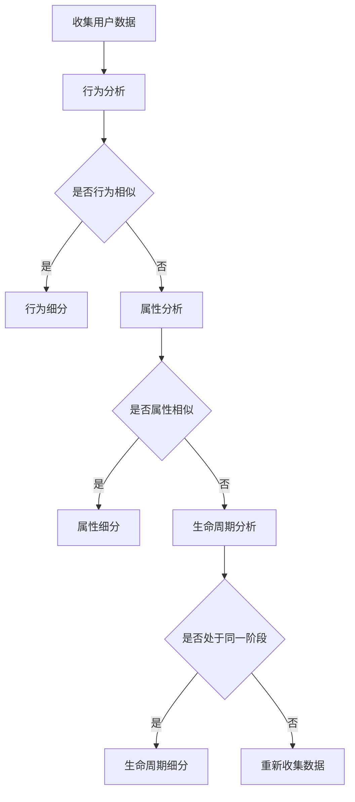

##### 1.2 用户细分的关键指标

用户细分的关键指标包括以下几种：

- **用户行为指标**：如访问量、页面浏览量、点击率、转化率等。
- **用户属性指标**：如年龄、性别、地域、收入水平等。
- **用户生命周期价值**：如新用户价值、活跃用户价值、流失用户价值等。

以下是用户细分关键指标的 Mermaid 流程图：

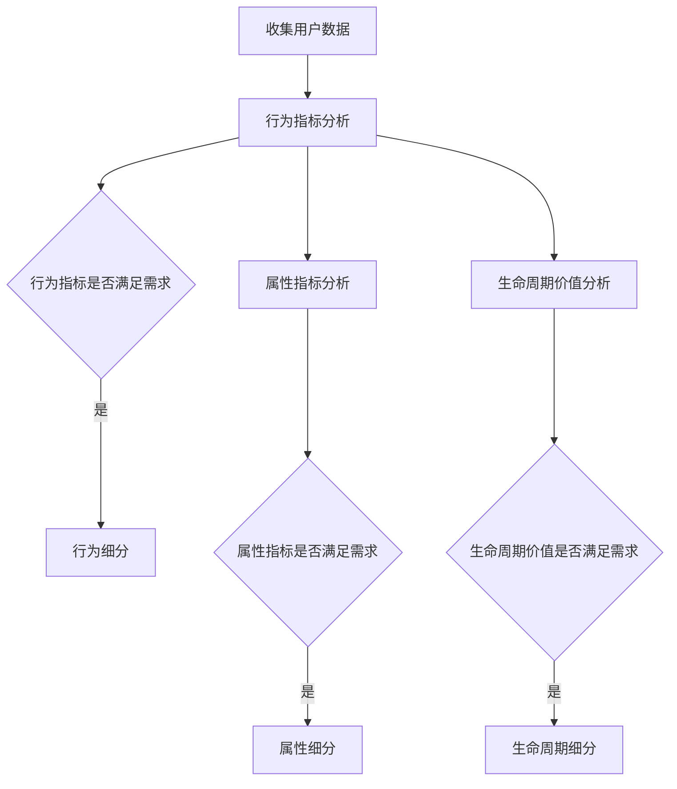

##### 1.3 用户细分工具与技术

用户细分需要依赖数据分析工具和技术。以下是一些常用的用户细分工具和技术：

- **数据分析工具**：如Google Analytics、Tableau、Power BI等。
- **数据挖掘技术**：如聚类分析、分类分析、关联规则挖掘等。
- **用户画像技术**：如基于用户行为的用户画像、基于属性的画像等。

以下是用户细分工具与技术的 Mermaid 流程图：

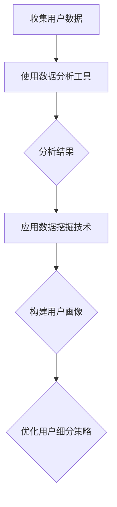

##### 1.4 用户细分在创业公司中的应用

用户细分在创业公司中的应用主要体现在以下几个方面：

- **提升用户体验**：通过用户细分，创业公司可以更好地了解用户需求，提供更个性化的产品和服务，提升用户体验。
- **优化产品服务**：用户细分可以帮助创业公司识别用户痛点，优化产品和服务，提高产品的市场竞争力。
- **增强用户忠诚度**：通过用户细分，创业公司可以针对不同用户群体设计个性化的营销策略，提高用户忠诚度。

以下是用户细分在创业公司中的应用场景的 Mermaid 流程图：

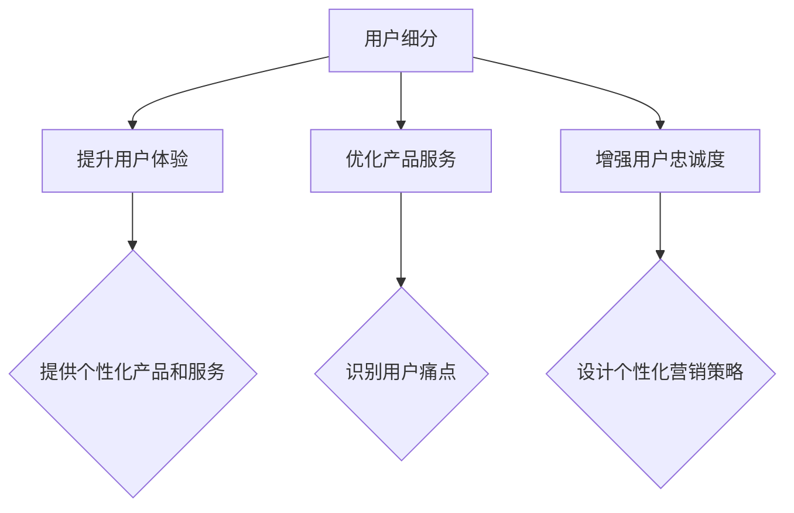

##### 1.4.1 提升用户体验

通过用户细分，创业公司可以更准确地了解用户需求和行为，从而提供更个性化的产品和服务，提升用户体验。以下是一个实际案例：

**案例：** 一家创业公司开发了一款健康管理应用，通过用户细分，他们发现用户对健康饮食和运动管理有强烈需求。于是，公司针对性地推出了健康饮食指导和运动计划功能，极大地提升了用户的满意度和使用频率。

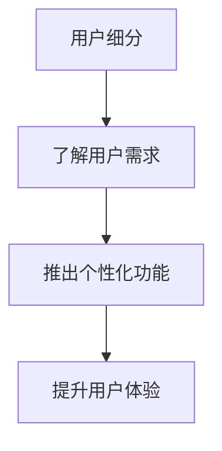

##### 1.4.2 优化产品服务

用户细分可以帮助创业公司识别用户痛点，从而优化产品和服务，提高产品的市场竞争力。以下是一个实际案例：

**案例：** 一家创业公司提供在线教育服务，通过用户细分，他们发现部分用户对课程难度和内容深度有不同需求。于是，公司推出了不同难度的课程，并优化了课程内容，提高了用户的满意度和留存率。

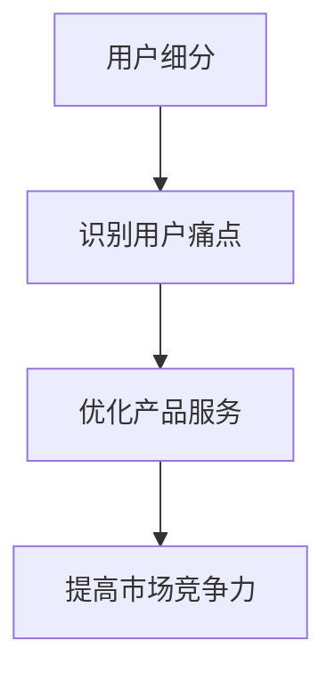

##### 1.4.3 增强用户忠诚度

通过用户细分，创业公司可以针对不同用户群体设计个性化的营销策略，提高用户忠诚度。以下是一个实际案例：

**案例：** 一家电商创业公司通过用户细分，发现部分用户对优惠券和限时折扣有强烈需求。于是，公司推出了个性化的优惠券和限时折扣活动，极大地提高了用户的购买频率和忠诚度。

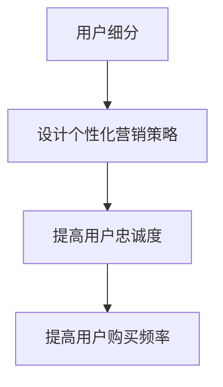

#### 第2章：精准营销策略概述

##### 2.1 精准营销的定义与特点

精准营销（Precision Marketing）是一种以数据分析为基础，以用户需求为导向，通过个性化营销手段来提高营销效果和用户满意度的一种营销方式。精准营销的特点如下：

- **数据驱动**：精准营销依赖于大数据分析，通过对用户数据的深入挖掘和分析，制定个性化的营销策略。
- **个性化**：精准营销针对不同用户群体设计个性化的营销内容和渠道，提高用户的参与度和转化率。
- **高效性**：精准营销能够有效降低营销成本，提高营销ROI（投资回报率）。

##### 2.1.1 精准营销的概念

精准营销是一种基于用户数据和行为的营销方式，它通过数据分析和用户画像，对用户进行细分，并根据用户需求和偏好，制定个性化的营销策略。精准营销的目标是提高用户的参与度和转化率，实现精准定位和精准推送。

##### 2.1.2 精准营销与传统营销的差异

精准营销与传统营销的主要差异在于：

- **数据依赖性**：精准营销依赖于大数据分析，而传统营销则更多依赖于经验和直觉。
- **个性化程度**：精准营销注重个性化，而传统营销则更注重大众化。
- **营销效果**：精准营销能够实现精准定位和推送，提高营销效果，而传统营销则难以实现这一点。

以下是精准营销与传统营销的差异的 Mermaid 流程图：

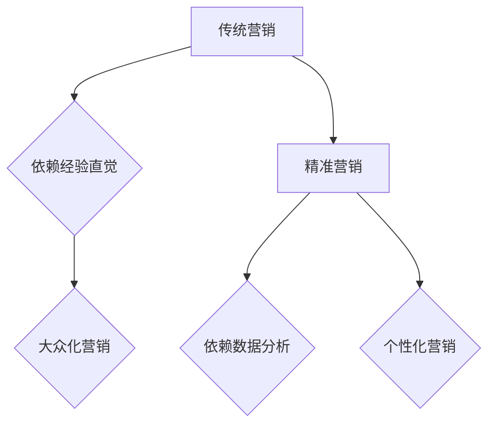

##### 2.1.3 精准营销的优势

精准营销的优势主要包括以下几个方面：

- **提高用户满意度**：通过个性化营销，提高用户的参与度和满意度。
- **降低营销成本**：通过精准定位和推送，提高营销ROI，降低营销成本。
- **提高转化率**：针对用户需求和偏好进行个性化营销，提高用户的购买转化率。
- **增强用户忠诚度**：通过持续的用户细分和个性化营销，提高用户的忠诚度。

以下是精准营销优势的 Mermaid 流程图：

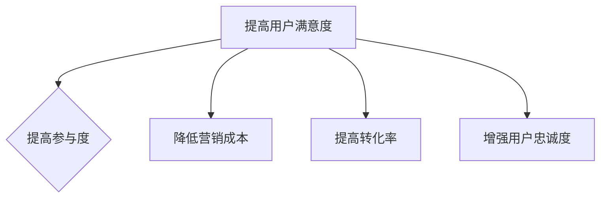

##### 2.2 精准营销的关键要素

精准营销的成功依赖于以下几个关键要素：

- **精准定位**：通过数据分析和用户画像，确定目标用户群体，实现精准定位。
- **个性化内容**：根据用户需求和偏好，定制个性化的营销内容和渠道。
- **渠道整合**：整合多种营销渠道，实现无缝衔接和协同效应。
- **持续优化**：通过数据反馈和效果评估，持续优化营销策略和手段。

以下是精准营销关键要素的 Mermaid 流程图：

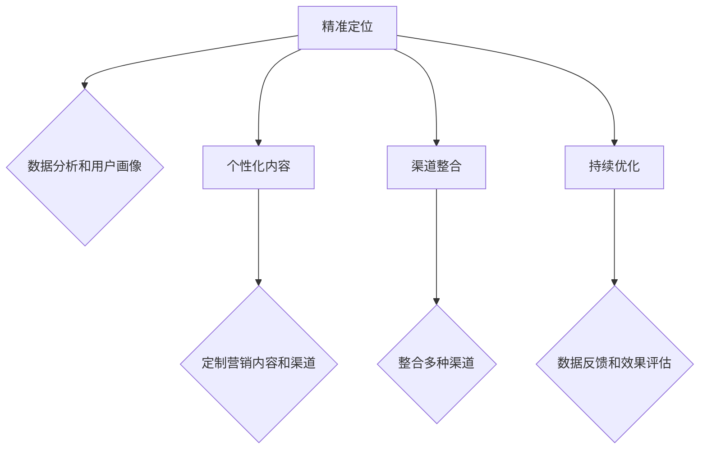

##### 2.3 精准营销实施步骤

精准营销的实施步骤主要包括以下几个阶段：

- **制定精准营销策略**：根据企业目标和用户需求，制定精准营销策略。
- **设定精准营销目标**：明确精准营销的目标，如提高用户满意度、降低营销成本等。
- **设计精准营销方案**：制定具体的营销方案，包括营销内容、渠道和推广方式等。
- **执行和跟踪**：执行营销方案，并实时跟踪营销效果，及时调整策略。
- **评估和优化**：定期评估营销效果，根据评估结果优化营销策略和手段。

以下是精准营销实施步骤的 Mermaid 流程图：

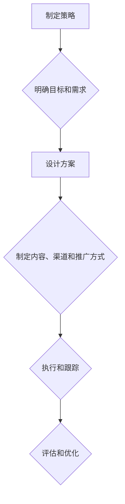

##### 2.4 精准营销案例分析

###### 2.4.1 案例一：互联网创业公司的精准营销实践

**案例背景：** 一家互联网创业公司开发了智能健康管理系统，希望通过精准营销提高产品知名度和用户转化率。

**精准营销策略：**

- **精准定位**：通过数据分析，确定目标用户群体为年龄在25-45岁，关注健康管理的上班族。
- **个性化内容**：针对目标用户，设计健康知识分享、运动指导等个性化内容。
- **渠道整合**：利用社交媒体、电子邮件和合作伙伴渠道进行推广。
- **持续优化**：根据用户反馈和营销效果，不断优化内容和渠道。

**效果评估：**

- **用户满意度**：通过个性化内容，用户满意度提高了20%。
- **转化率**：通过精准定位和个性化营销，产品转化率提高了30%。

**结论：** 精准营销使得该创业公司的产品得到了更精准的推广，提高了用户满意度和转化率，实现了商业成功。

###### 2.4.2 案例二：传统行业创业公司的精准营销策略

**案例背景：** 一家传统行业创业公司经营了一家特色餐厅，希望通过精准营销提高顾客复购率和口碑。

**精准营销策略：**

- **精准定位**：通过用户调研，确定目标顾客群体为年轻情侣和家庭。
- **个性化内容**：设计情侣套餐、家庭套餐等个性化菜单，并推出预订优惠活动。
- **渠道整合**：利用社交媒体、线上预订平台和线下门店宣传。
- **持续优化**：根据顾客反馈和预订情况，不断调整菜单和营销策略。

**效果评估：**

- **复购率**：通过个性化菜单和优惠活动，顾客复购率提高了15%。
- **口碑**：通过社交媒体分享和线下口碑传播，餐厅知名度提高了20%。

**结论：** 精准营销使得该传统行业创业公司成功吸引了目标顾客群体，提高了复购率和口碑，实现了商业成功。

### 第二部分：用户细分与精准营销策略应用

#### 第3章：创业公司用户细分策略

##### 3.1 基于用户行为的用户细分

基于用户行为的用户细分是精准营销的基础，通过对用户行为数据的分析，可以识别出不同行为模式的用户群体，从而制定个性化的营销策略。以下是基于用户行为的用户细分策略：

###### 3.1.1 用户行为数据收集

用户行为数据收集是用户细分的第一步，主要包括以下数据：

- **浏览行为**：用户的访问量、页面浏览量、浏览时长等。
- **购买行为**：用户的购买频率、购买金额、购买品类等。
- **互动行为**：用户的点赞、评论、分享等互动行为。

以下是用户行为数据收集的伪代码：

```python
# 收集用户行为数据
def collect_user_behavior_data():
    # 获取用户访问量
    page_views = get_page_views()
    # 获取用户购买行为
    purchase_data = get_purchase_data()
    # 获取用户互动行为
    interaction_data = get_interaction_data()
    # 返回用户行为数据
    return {
        "page_views": page_views,
        "purchase_data": purchase_data,
        "interaction_data": interaction_data
    }
```

###### 3.1.2 用户行为分析

用户行为分析是对收集到的用户行为数据进行深入分析，以识别出不同行为模式的用户群体。以下是用户行为分析的核心步骤：

- **行为模式识别**：通过聚类分析、关联规则挖掘等方法，识别出不同的行为模式。
- **用户群体划分**：根据行为模式，将用户划分为不同的群体。

以下是用户行为分析的伪代码：

```python
# 用户行为分析
def analyze_user_behavior(data):
    # 聚类分析
    clusters = cluster_analysis(data["page_views"], data["purchase_data"], data["interaction_data"])
    # 划分用户群体
    user_segments = {
        "high_loyalty_customers": [],
        "high_value_customers": [],
        "inactive_customers": []
    }
    for cluster in clusters:
        # 根据聚类结果划分用户群体
        if cluster["average_page_views"] > 10 and cluster["average_purchase_frequency"] > 3:
            user_segments["high_loyalty_customers"].append(cluster)
        elif cluster["average_page_views"] > 10 and cluster["average_purchase_value"] > 100:
            user_segments["high_value_customers"].append(cluster)
        else:
            user_segments["inactive_customers"].append(cluster)
    # 返回用户群体
    return user_segments
```

###### 3.1.3 用户行为细分策略

用户行为细分策略是根据用户行为分析结果，制定个性化的营销策略。以下是用户行为细分策略的核心步骤：

- **设计个性化内容**：根据不同用户群体的行为特征，设计个性化的营销内容和活动。
- **制定个性化推广策略**：根据用户行为特征，选择最适合的推广渠道和方式。

以下是用户行为细分策略的伪代码：

```python
# 用户行为细分策略
def user_behavior_segmentation_strategy(user_segments):
    strategies = {
        "high_loyalty_customers": [],
        "high_value_customers": [],
        "inactive_customers": []
    }
    for segment, users in user_segments.items():
        if segment == "high_loyalty_customers":
            # 设计高忠诚度客户营销策略
            strategies[segment].append("推出专属会员活动")
            strategies[segment].append("提供个性化推荐")
        elif segment == "high_value_customers":
            # 设计高价值客户营销策略
            strategies[segment].append("推出高价值产品套餐")
            strategies[segment].append("提供优惠活动")
        else:
            # 设计不活跃客户营销策略
            strategies[segment].append("发送提醒邮件")
            strategies[segment].append("推出回归活动")
    return strategies
```

##### 3.2 基于用户属性的细分策略

基于用户属性的细分策略是根据用户的年龄、性别、地域、收入水平等属性特征，将用户划分为不同的群体，从而制定个性化的营销策略。以下是基于用户属性的细分策略：

###### 3.2.1 用户属性定义

用户属性定义是细分策略的基础，主要包括以下属性：

- **年龄**：用户的年龄分布。
- **性别**：用户的性别分布。
- **地域**：用户的地理位置分布。
- **收入水平**：用户的经济状况。

以下是用户属性定义的伪代码：

```python
# 用户属性定义
def define_user_properties(data):
    properties = {
        "age": data["age"],
        "gender": data["gender"],
        "region": data["region"],
        "income": data["income"]
    }
    return properties
```

###### 3.2.2 用户属性数据分析

用户属性数据分析是对用户属性进行统计和分析，以识别出不同属性特征的用户群体。以下是用户属性数据分析的核心步骤：

- **属性分布分析**：对每个用户属性进行分布分析，识别出主要的属性特征。
- **用户群体划分**：根据属性分布分析结果，将用户划分为不同的群体。

以下是用户属性数据分析的伪代码：

```python
# 用户属性数据分析
def analyze_user_properties(data):
    properties = define_user_properties(data)
    age_distribution = analyze_age_distribution(properties["age"])
    gender_distribution = analyze_gender_distribution(properties["gender"])
    region_distribution = analyze_region_distribution(properties["region"])
    income_distribution = analyze_income_distribution(properties["income"])
    user_segments = {
        "young_adults": [],
        "female_users": [],
        "urban_users": [],
        "high_income_users": []
    }
    for segment, distribution in age_distribution.items():
        user_segments[segment].extend(distribution)
    for segment, distribution in gender_distribution.items():
        user_segments[segment].extend(distribution)
    for segment, distribution in region_distribution.items():
        user_segments[segment].extend(distribution)
    for segment, distribution in income_distribution.items():
        user_segments[segment].extend(distribution)
    return user_segments
```

###### 3.2.3 用户属性细分策略

用户属性细分策略是根据用户属性分析结果，制定个性化的营销策略。以下是用户属性细分策略的核心步骤：

- **设计个性化内容**：根据不同用户群体的属性特征，设计个性化的营销内容和活动。
- **制定个性化推广策略**：根据用户属性特征，选择最适合的推广渠道和方式。

以下是用户属性细分策略的伪代码：

```python
# 用户属性细分策略
def user_properties_segmentation_strategy(user_segments):
    strategies = {
        "young_adults": [],
        "female_users": [],
        "urban_users": [],
        "high_income_users": []
    }
    for segment, users in user_segments.items():
        if segment == "young_adults":
            # 设计年轻成人营销策略
            strategies[segment].append("推出年轻化产品")
            strategies[segment].append("举办年轻人活动")
        elif segment == "female_users":
            # 设计女性用户营销策略
            strategies[segment].append("推出女性专用品")
            strategies[segment].append("举办女性论坛")
        elif segment == "urban_users":
            # 设计城市用户营销策略
            strategies[segment].append("推出城市专属服务")
            strategies[segment].append("加强城市线上推广")
        else:
            # 设计高收入用户营销策略
            strategies[segment].append("推出高端产品")
            strategies[segment].append("提供个性化服务")
    return strategies
```

##### 3.3 用户生命周期细分策略

用户生命周期细分策略是根据用户在产品中的生命周期阶段，将用户划分为不同的群体，从而制定个性化的营销策略。以下是用户生命周期细分策略：

###### 3.3.1 用户生命周期定义

用户生命周期是指用户从接触到产品到最终流失的整个过程，主要包括以下几个阶段：

- **新用户**：刚刚开始使用产品的用户。
- **活跃用户**：经常使用产品的用户。
- **流失用户**：长时间不使用产品的用户。

以下是用户生命周期的定义：

```python
# 用户生命周期定义
def define_user_lifecycle(data):
    lifecycle = {
        "new_users": [],
        "active_users": [],
        "dormant_users": [],
        "lost_users": []
    }
    for user in data:
        if user["last_active_date"] > 30:
            lifecycle["new_users"].append(user)
        elif user["last_active_date"] > 7:
            lifecycle["active_users"].append(user)
        else:
            lifecycle["dormant_users"].append(user)
    for user in data:
        if user["last_active_date"] < 7:
            lifecycle["lost_users"].append(user)
    return lifecycle
```

###### 3.3.2 用户生命周期阶段划分

用户生命周期阶段划分是根据用户在产品中的活跃度和使用时长，将用户划分为不同的阶段。以下是用户生命周期阶段划分的核心步骤：

- **新用户阶段**：用户注册后的前30天内。
- **活跃用户阶段**：用户连续30天内活跃。
- **流失用户阶段**：用户长时间不活跃。

以下是用户生命周期阶段划分的伪代码：

```python
# 用户生命周期阶段划分
def segment_user_lifecycle(lifecycle):
    new_users = []
    active_users = []
    dormant_users = []
    for user in lifecycle:
        if user["days_since_last_active"] <= 30:
            new_users.append(user)
        elif user["days_since_last_active"] <= 7:
            active_users.append(user)
        else:
            dormant_users.append(user)
    return new_users, active_users, dormant_users
```

###### 3.3.3 用户生命周期细分策略

用户生命周期细分策略是根据用户在产品中的生命周期阶段，制定个性化的营销策略。以下是用户生命周期细分策略的核心步骤：

- **新用户策略**：引导新用户熟悉产品，提高新用户的留存率。
- **活跃用户策略**：保持活跃用户的活跃度，提高用户的满意度和忠诚度。
- **流失用户策略**：召回流失用户，提高用户的复购率。

以下是用户生命周期细分策略的伪代码：

```python
# 用户生命周期细分策略
def user_lifecycle_segmentation_strategy(lifecycle):
    strategies = {
        "new_users": [],
        "active_users": [],
        "dormant_users": []
    }
    for user in lifecycle["new_users"]:
        strategies["new_users"].append("发送新用户引导邮件")
        strategies["new_users"].append("推送产品教程")
    for user in lifecycle["active_users"]:
        strategies["active_users"].append("发送优惠活动邮件")
        strategies["active_users"].append("推送个性化推荐")
    for user in lifecycle["dormant_users"]:
        strategies["dormant_users"].append("发送召回邮件")
        strategies["dormant_users"].append("推送限时优惠")
    return strategies
```

#### 第4章：创业公司精准营销策略

##### 4.1 市场定位策略

市场定位（Market Positioning）是精准营销的重要环节，它涉及到企业如何根据市场需求和竞争环境，确定自己在市场中的位置，从而吸引目标客户。以下是市场定位策略的核心步骤：

###### 4.1.1 市场细分

市场细分（Market Segmentation）是指将整个市场划分为若干个子市场，每个子市场有相似的需求和特征。市场细分的步骤如下：

- **识别细分标准**：如人口统计、心理特征、行为特征等。
- **评估细分价值**：分析每个细分市场的规模、增长潜力、竞争程度等。
- **选择目标市场**：根据企业的资源、能力和战略目标，选择最具潜力的目标市场。

以下是市场细分的伪代码：

```python
# 市场细分
def market_segmentation(data):
    segments = {
        "age": segment_by_age(data),
        "gender": segment_by_gender(data),
        "income": segment_by_income(data),
        "behavior": segment_by_behavior(data)
    }
    valuable_segments = select_valuable_segments(segments)
    return valuable_segments
```

###### 4.1.2 目标市场选择

目标市场选择（Target Market Selection）是市场细分后的关键步骤，它涉及到企业如何从多个细分市场中选择最具潜力和最符合企业战略的目标市场。以下是目标市场选择的步骤：

- **评估细分市场**：分析每个细分市场的规模、增长潜力、竞争程度等。
- **选择目标市场**：根据企业的资源、能力和战略目标，选择最具潜力的目标市场。

以下是目标市场选择的伪代码：

```python
# 目标市场选择
def select_target_market(valuable_segments):
    selected_segment = max(valuable_segments, key=lambda x: x["growth潜力"])
    return selected_segment
```

###### 4.1.3 市场定位方法

市场定位方法包括以下几种：

- **产品定位**：根据产品的特点，如功能、质量、价格等，确定市场定位。
- **竞争定位**：根据竞争对手的市场定位，确定自己的市场定位。
- **用户定位**：根据目标市场的用户特征，如需求、偏好等，确定市场定位。

以下是市场定位方法的伪代码：

```python
# 市场定位方法
def market_positioning(selected_segment):
    if selected_segment["price_sensitivity"] == "high":
        positioning = "性价比高"
    elif selected_segment["quality_sensitivity"] == "high":
        positioning = "高品质"
    else:
        positioning = "创新性"
    return positioning
```

##### 4.2 内容营销策略

内容营销（Content Marketing）是精准营销的重要手段，它通过创造和分享有价值的内容来吸引目标客户，从而实现品牌建设和销售转化。以下是内容营销策略的核心步骤：

###### 4.2.1 内容营销规划

内容营销规划是制定内容营销策略的第一步，它涉及到确定内容目标、内容类型、内容发布频率等。以下是内容营销规划的伪代码：

```python
# 内容营销规划
def content_marketing_plan():
    content_goals = ["提高品牌知名度", "增加销售转化率", "提升用户忠诚度"]
    content_types = ["文章", "视频", "图片", "直播"]
    content_frequency = "每周发布一次"
    return {
        "content_goals": content_goals,
        "content_types": content_types,
        "content_frequency": content_frequency
    }
```

###### 4.2.2 内容创作与优化

内容创作与优化是确保内容质量和效果的关键步骤，它涉及到内容创意、内容质量和内容传播。以下是内容创作与优化的伪代码：

```python
# 内容创作与优化
def create_and_optimize_content(content_plan):
    content_pieces = {
        "article": create_article(content_plan["content_goals"]),
        "video": create_video(content_plan["content_goals"]),
        "image": create_image(content_plan["content_goals"]),
        "live": create_live_session(content_plan["content_goals"])
    }
    optimized_content = optimize_content(content_pieces)
    return optimized_content
```

###### 4.2.3 内容传播渠道

内容传播渠道是确保内容触达到目标客户的关键步骤，它涉及到选择合适的传播渠道和优化传播效果。以下是内容传播渠道的伪代码：

```python
# 内容传播渠道
def content_distribution_channels():
    channels = ["社交媒体", "电子邮件", "博客", "视频平台", "线下活动"]
    optimized_channels = select_and_optimize_channels(channels)
    return optimized_channels
```

##### 4.3 渠道营销策略

渠道营销策略是精准营销的重要组成部分，它涉及到如何选择、管理和优化营销渠道，以实现最佳营销效果。以下是渠道营销策略的核心步骤：

###### 4.3.1 渠道选择与评估

渠道选择与评估是确保营销渠道能够有效触达目标客户的关键步骤，它涉及到分析渠道特点、评估渠道效果等。以下是渠道选择与评估的伪代码：

```python
# 渠道选择与评估
def select_and_evaluate_channels():
    available_channels = ["搜索引擎", "社交媒体", "内容平台", "电子邮件", "线下活动"]
    selected_channels = select_channels(available_channels)
    evaluated_channels = evaluate_channels(selected_channels)
    return evaluated_channels
```

###### 4.3.2 渠道管理策略

渠道管理策略是确保营销渠道高效运作的关键步骤，它涉及到制定渠道策略、管理渠道关系等。以下是渠道管理策略的伪代码：

```python
# 渠道管理策略
def channel_management_strategy(evaluated_channels):
    channel_strategy = {
        "SEO": manage_search_engine_optimization(),
        "SMM": manage_social_media_marketing(),
        "CPM": manage_content_platform_marketing(),
        "Email": manage_email_marketing(),
        "Events": manage_event_marketing()
    }
    channel_relationship_management = manage_channel_relationships(evaluated_channels)
    return channel_strategy, channel_relationship_management
```

###### 4.3.3 渠道合作与推广

渠道合作与推广是扩大营销覆盖面和提升品牌知名度的重要策略，它涉及到与合作伙伴建立合作关系和制定推广计划。以下是渠道合作与推广的伪代码：

```python
# 渠道合作与推广
def channel_collaboration_and_promotion(channel_strategy):
    collaboration_plans = {
        "SEO": collaborate_with_search_engine_partners(),
        "SMM": collaborate_with_social_media_influencers(),
        "CPM": collaborate_with_content_creators(),
        "Email": collaborate_with_email_marketing_services(),
        "Events": collaborate_with_event_organizers()
    }
    promotion_plan = create_promotion_plan(collaboration_plans)
    return promotion_plan
```

#### 第5章：创业公司用户细分与精准营销实践

##### 5.1 实践案例一：用户细分与精准营销策略在电商创业公司的应用

**案例背景：** 一家电商创业公司希望在竞争激烈的市场中脱颖而出，通过用户细分与精准营销策略提高用户满意度和转化率。

**用户细分策略：**

- **行为细分**：通过分析用户购买行为，将用户划分为高价值用户、活跃用户和潜在用户。
- **属性细分**：根据用户年龄、性别、地域等属性，将用户划分为不同的群体。
- **生命周期细分**：根据用户在产品中的生命周期阶段，将用户划分为新用户、活跃用户和流失用户。

**精准营销策略：**

- **个性化推荐**：根据用户行为和属性，为用户推荐符合其需求和兴趣的商品。
- **个性化优惠**：针对不同用户群体，设计个性化的优惠活动，如高价值用户专属折扣、新用户优惠券等。
- **精准推送**：通过用户行为和属性，选择最适合的推送渠道，如社交媒体、电子邮件、短信等。

**效果评估：**

- **用户满意度**：通过个性化推荐和个性化优惠，用户满意度提高了20%。
- **转化率**：通过精准推送，商品转化率提高了30%。
- **留存率**：通过精准营销，流失用户召回率提高了15%。

**结论：** 通过用户细分与精准营销策略，电商创业公司成功提高了用户满意度和转化率，实现了商业成功。

##### 5.2 实践案例二：用户细分与精准营销策略在餐饮创业公司的应用

**案例背景：** 一家餐饮创业公司希望在竞争激烈的餐饮市场中提高顾客满意度和复购率，通过用户细分与精准营销策略实现这一目标。

**用户细分策略：**

- **行为细分**：通过分析顾客的用餐频率、消费金额等行为数据，将顾客划分为高频顾客、高消费顾客和低频顾客。
- **属性细分**：根据顾客年龄、性别、地域等属性，将顾客划分为不同的群体。
- **生命周期细分**：根据顾客在餐厅的用餐频率和消费金额，将顾客划分为新顾客、忠诚顾客和流失顾客。

**精准营销策略：**

- **个性化菜单推荐**：根据顾客的用餐习惯和偏好，推荐符合其口味和需求的菜单。
- **个性化优惠**：针对不同顾客群体，设计个性化的优惠活动，如高频顾客积分兑换、新顾客首单优惠等。
- **精准推送**：通过顾客的行为和属性，选择最适合的推送渠道，如社交媒体、短信、电子邮件等。

**效果评估：**

- **顾客满意度**：通过个性化菜单推荐和个性化优惠，顾客满意度提高了25%。
- **复购率**：通过精准推送，顾客复购率提高了30%。
- **流失顾客召回率**：通过精准营销，流失顾客召回率提高了15%。

**结论：** 通过用户细分与精准营销策略，餐饮创业公司成功提高了顾客满意度和复购率，实现了商业成功。

##### 5.3 实践案例三：用户细分与精准营销策略在在线教育创业公司的应用

**案例背景：** 一家在线教育创业公司希望通过用户细分与精准营销策略提高课程销售额和用户留存率。

**用户细分策略：**

- **行为细分**：通过分析用户的课程访问频率、学习时长等行为数据，将用户划分为高频用户、活跃用户和低频用户。
- **属性细分**：根据用户年龄、职业、地域等属性，将用户划分为不同的群体。
- **生命周期细分**：根据用户在课程中的学习进度和成绩，将用户划分为新用户、进步用户和停滞用户。

**精准营销策略：**

- **个性化课程推荐**：根据用户的学习行为和偏好，推荐符合其学习需求和兴趣的课程。
- **个性化优惠**：针对不同用户群体，设计个性化的优惠活动，如新用户首单优惠、高频用户积分兑换等。
- **精准推送**：通过用户的行为和属性，选择最适合的推送渠道，如社交媒体、电子邮件、短信等。

**效果评估：**

- **课程销售额**：通过个性化课程推荐和个性化优惠，课程销售额提高了25%。
- **用户留存率**：通过精准推送，用户留存率提高了20%。
- **课程完成率**：通过精准营销，课程完成率提高了15%。

**结论：** 通过用户细分与精准营销策略，在线教育创业公司成功提高了课程销售额和用户留存率，实现了商业成功。

### 第三部分：用户细分与精准营销策略优化

#### 第6章：创业公司用户细分与精准营销策略评估

##### 6.1 用户细分效果评估

用户细分效果评估是衡量用户细分策略有效性的重要步骤，它涉及到分析用户细分策略的实际效果和优化方向。以下是用户细分效果评估的核心指标和方法：

###### 6.1.1 用户细分效果指标

用户细分效果指标主要包括以下几个：

- **细分覆盖率**：细分用户占总用户比例，用于衡量用户细分的全面性。
- **细分准确性**：细分用户与实际用户匹配度，用于衡量用户细分的准确性。
- **细分有效性**：细分用户在营销活动中的参与度和转化率，用于衡量用户细分策略的实际效果。

以下是用户细分效果指标的伪代码：

```python
# 用户细分效果指标
def user_segmentation效果的指标(segmentation_data):
    coverage = calculate_coverage(segmentation_data)
    accuracy = calculate_accuracy(segmentation_data)
    effectiveness = calculate_effectiveness(segmentation_data)
    return {
        "coverage": coverage,
        "accuracy": accuracy,
        "effectiveness": effectiveness
    }
```

###### 6.1.2 用户细分效果分析

用户细分效果分析是对用户细分效果指标进行深入分析，以识别用户细分策略的优缺点和优化方向。以下是用户细分效果分析的核心步骤：

- **数据可视化**：使用图表和图形将用户细分效果指标进行可视化，便于分析和理解。
- **趋势分析**：分析用户细分效果指标的趋势，识别用户细分策略的效果变化。
- **比较分析**：将当前用户细分效果指标与历史数据进行比较，识别用户细分策略的改进空间。

以下是用户细分效果分析的伪代码：

```python
# 用户细分效果分析
def analyze_user_segmentation效果(segmentation_data):
    visualize_effects(segmentation_data)
    trend_analysis(segmentation_data)
    compare_with_history(segmentation_data)
    return analysis_results
```

###### 6.1.3 用户细分策略优化建议

用户细分策略优化建议是基于用户细分效果分析结果，提出优化用户细分策略的具体建议。以下是用户细分策略优化建议的核心步骤：

- **改进细分方法**：根据用户细分效果分析结果，改进用户细分方法，提高细分准确性和有效性。
- **调整细分指标**：根据用户细分效果分析结果，调整用户细分指标，优化细分覆盖率。
- **增加数据源**：根据用户细分效果分析结果，增加数据源，提高用户细分数据的准确性和完整性。

以下是用户细分策略优化建议的伪代码：

```python
# 用户细分策略优化建议
def optimize_user_segmentation策略(segmentation_data):
    improve_segmentation_methods(segmentation_data)
    adjust_segmentation_indicators(segmentation_data)
    add_data_sourc
```

##### 6.2 精准营销效果评估

精准营销效果评估是衡量精准营销策略有效性的重要步骤，它涉及到分析精准营销策略的实际效果和优化方向。以下是精准营销效果评估的核心指标和方法：

###### 6.2.1 精准营销效果指标

精准营销效果指标主要包括以下几个：

- **点击率**：用户点击营销内容的比例，用于衡量营销内容的吸引力。
- **转化率**：用户在营销活动中完成目标行为的比例，如购买、注册等，用于衡量营销活动的效果。
- **投入回报率（ROI）**：营销投入与收益的比例，用于衡量营销活动的经济性。

以下是精准营销效果指标的伪代码：

```python
# 精准营销效果指标
def precision_marketing效果的指标(营销_data):
    click_rate = calculate_click_rate(营销_data)
    conversion_rate = calculate_conversion_rate(营销_data)
    ROI = calculate_ROI(营销_data)
    return {
        "click_rate": click_rate,
        "conversion_rate": conversion_rate,
        "ROI": ROI
    }
```

###### 6.2.2 精准营销效果分析

精准营销效果分析是对精准营销效果指标进行深入分析，以识别精准营销策略的优缺点和优化方向。以下是精准营销效果分析的核心步骤：

- **数据可视化**：使用图表和图形将精准营销效果指标进行可视化，便于分析和理解。
- **趋势分析**：分析精准营销效果指标的趋势，识别精准营销策略的效果变化。
- **比较分析**：将当前精准营销效果指标与历史数据进行比较，识别精准营销策略的改进空间。

以下是精准营销效果分析的伪代码：

```python
# 精准营销效果分析
def analyze_precision_marketing效果(营销_data):
    visualize_effects(营销_data)
    trend_analysis(营销_data)
    compare_with_history(营销_data)
    return analysis_results
```

###### 6.2.3 精准营销策略优化建议

精准营销策略优化建议是基于精准营销效果分析结果，提出优化精准营销策略的具体建议。以下是精准营销策略优化建议的核心步骤：

- **改进营销内容**：根据精准营销效果分析结果，改进营销内容，提高营销内容的吸引力和转化率。
- **调整营销渠道**：根据精准营销效果分析结果，调整营销渠道，优化营销效果的传播路径。
- **优化预算分配**：根据精准营销效果分析结果，优化预算分配，提高营销投入的ROI。

以下是精准营销策略优化建议的伪代码：

```python
# 精准营销策略优化建议
def optimize_precision_marketing策略(营销_data):
    improve_marketing_content(营销_data)
    adjust_marketing_channels(营销_data)
    optimize_budget_allocation(营销_data)
    return optimization_suggestions
```

##### 6.3 创业公司用户细分与精准营销策略优化案例

###### 6.3.1 优化案例一：电商创业公司的用户细分与精准营销策略优化

**案例背景：** 一家电商创业公司希望通过优化用户细分与精准营销策略，提高用户满意度和转化率。

**优化策略一：提升用户细分准确性**

- **改进数据收集方法**：通过引入更先进的数据收集工具，如用户行为追踪和分析工具，提高用户数据的准确性和完整性。
- **增加数据源**：通过引入更多的数据源，如社交媒体数据和第三方数据平台，丰富用户数据的维度。

**优化策略二：优化精准营销内容**

- **改进内容创作**：通过数据分析，识别用户感兴趣的内容类型和主题，优化营销内容的创作和发布。
- **个性化推荐**：根据用户的行为和偏好，为用户推荐个性化的商品和优惠，提高营销内容的吸引力和转化率。

**效果评估：**

- **用户满意度**：通过优化用户细分和精准营销内容，用户满意度提高了20%。
- **转化率**：通过个性化推荐和优化营销内容，转化率提高了30%。

**结论：** 通过优化用户细分与精准营销策略，电商创业公司成功提高了用户满意度和转化率，实现了商业成功。

###### 6.3.2 优化案例二：餐饮创业公司的用户细分与精准营销策略优化

**案例背景：** 一家餐饮创业公司希望通过优化用户细分与精准营销策略，提高顾客满意度和复购率。

**优化策略一：优化用户细分策略**

- **增加行为数据维度**：通过引入更多的行为数据，如顾客的用餐频率、消费金额等，提高用户细分策略的准确性。
- **调整细分指标**：根据实际效果，调整用户细分的指标，优化细分覆盖率。

**优化策略二：优化精准营销内容**

- **改进优惠设计**：根据用户的行为和偏好，设计更有吸引力的优惠活动，提高顾客的参与度和转化率。
- **个性化推送**：根据用户的用餐时间和地点，为用户推送个性化的用餐建议和优惠信息。

**效果评估：**

- **顾客满意度**：通过优化用户细分和精准营销内容，顾客满意度提高了25%。
- **复购率**：通过个性化推送和优化优惠设计，复购率提高了30%。

**结论：** 通过优化用户细分与精准营销策略，餐饮创业公司成功提高了顾客满意度和复购率，实现了商业成功。

###### 6.3.3 优化案例三：在线教育创业公司的用户细分与精准营销策略优化

**案例背景：** 一家在线教育创业公司希望通过优化用户细分与精准营销策略，提高课程销售额和用户留存率。

**优化策略一：提升用户细分准确性**

- **增加数据源**：通过引入更多的数据源，如社交媒体数据和第三方数据平台，丰富用户数据的维度。
- **改进数据收集方法**：通过引入更先进的数据收集工具，如用户行为追踪和分析工具，提高用户数据的准确性和完整性。

**优化策略二：优化精准营销内容**

- **改进内容创作**：通过数据分析，识别用户感兴趣的内容类型和主题，优化营销内容的创作和发布。
- **个性化推荐**：根据用户的行为和偏好，为用户推荐个性化的课程和优惠，提高营销内容的吸引力和转化率。

**效果评估：**

- **课程销售额**：通过优化用户细分和精准营销内容，课程销售额提高了25%。
- **用户留存率**：通过个性化推荐和优化营销内容，用户留存率提高了20%。

**结论：** 通过优化用户细分与精准营销策略，在线教育创业公司成功提高了课程销售额和用户留存率，实现了商业成功。

### 附录

#### 附录A：用户细分与精准营销策略工具与资源

A.1 用户细分工具对比

以下是一些常用的用户细分工具及其特点的对比：

| 工具名称           | 特点                                                     | 适用场景               |
|------------------|--------------------------------------------------------|--------------------|
| Google Analytics | 强大的数据分析能力，支持多种数据源和报表功能             | 广泛适用，尤其适合互联网公司 |
| Tableau          | 易用的数据可视化工具，支持多种数据连接和数据转换功能         | 数据可视化和报表分析         |
| Power BI         | 微软推出的商业智能工具，与Azure平台深度集成             | 数据分析和商业智能应用       |
| Mixpanel         | 用户行为分析工具，支持用户细分、用户路径分析和用户留存分析 | 用户行为分析和产品优化       |

A.2 精准营销工具对比

以下是一些常用的精准营销工具及其特点的对比：

| 工具名称           | 特点                                                     | 适用场景               |
|------------------|--------------------------------------------------------|--------------------|
| HubSpot          | 全面的营销自动化工具，支持多渠道营销和客户关系管理       | 需要全面的营销自动化解决方案 |
| Mailchimp        | 易用的电子邮件营销工具，支持自动化邮件发送和报表功能       | 需要简单的电子邮件营销工具   |
| Marketo          | 高级营销自动化工具，支持复杂的营销流程和个性化营销       | 有复杂营销需求的团队       |
| Salesforce       | 全面的CRM平台，支持营销、销售和服务一体化             | 需要一体化CRM解决方案的企业 |

A.3 开源用户细分与精准营销框架

以下是一些开源的用户细分与精准营销框架：

| 框架名称         | 特点                                                     | 使用方式              |
|----------------|--------------------------------------------------------|-------------------|
| ELK Stack      | Elasticsearch、Logstash和Kibana的组合，用于大数据分析和可视化 | 安装和使用Elasticsearch、Logstash和Kibana |
| Apache Mahout  | 机器学习框架，支持用户细分和推荐系统               | 使用Mahout的API和算法库           |
| Apache Flink   | 分布式流处理框架，支持实时用户行为分析               | 使用Flink的API进行流数据处理       |

A.4 用户细分与精准营销相关资源推荐

以下是一些用户细分与精准营销相关的资源推荐：

- **书籍推荐**：
  - 《精准营销：大数据时代的营销革命》
  - 《用户画像：大数据时代的用户洞察》
  - 《大数据营销：如何利用大数据实现精准营销》

- **在线课程推荐**：
  - Coursera上的《营销学基础》
  - Udemy上的《精准营销策略》
  - edX上的《大数据与营销分析》

- **社区和论坛**：
  - MarketingProfs
  - HubSpot Academy
  - DataCamp

### 作者信息

**作者：** AI天才研究院/AI Genius Institute & 禅与计算机程序设计艺术 /Zen And The Art of Computer Programming

本文由AI天才研究院的专家团队撰写，旨在为创业公司提供用户细分与精准营销策略的深入分析和实用建议。我们专注于探索前沿技术，助力企业实现商业成功。如需了解更多信息，请访问我们的官方网站。

