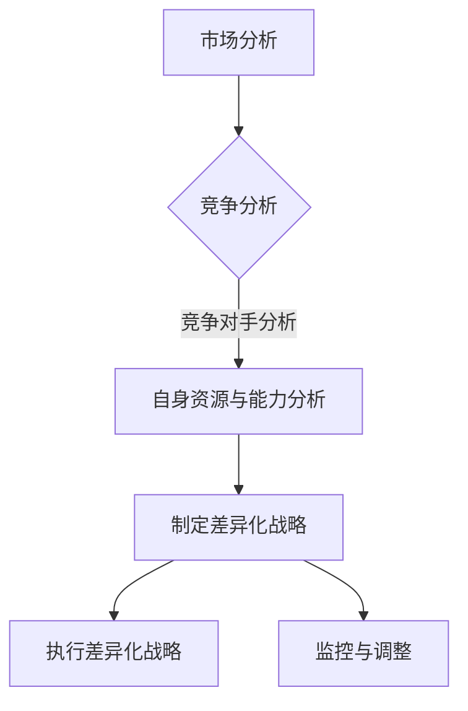
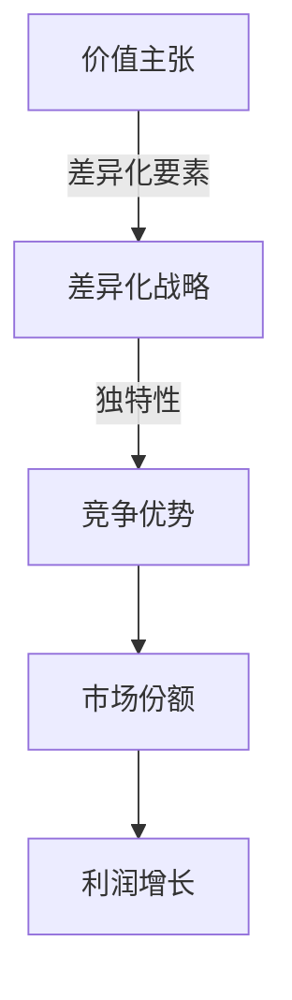
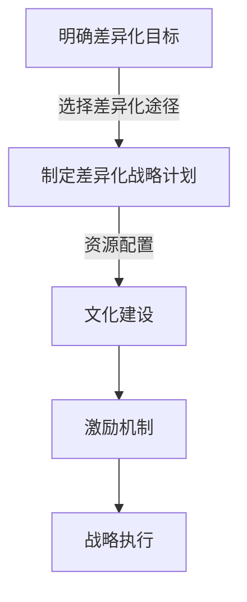
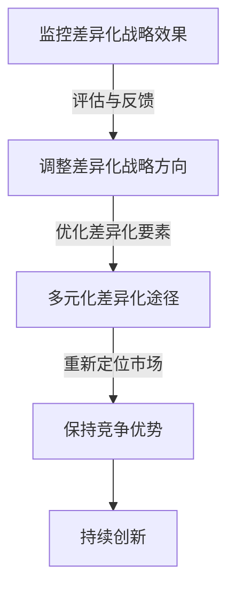
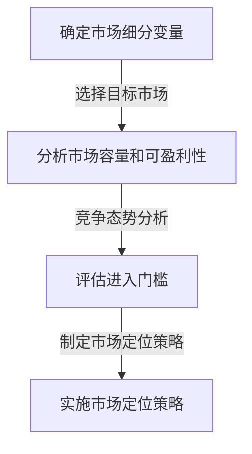

                 

### 差异化战略的概念与重要性

差异化战略是企业通过提供与众不同的产品或服务，从而在竞争激烈的市场中取得优势的一种战略选择。差异化战略的核心在于为企业创造独特的市场定位，使得其产品或服务能够被消费者识别和偏好。

#### 差异化战略的定义

差异化战略（Differentiation Strategy）是指企业通过提供具有独特性和特殊价值的产品或服务，以区分自身与其他竞争者，从而获得更高的市场份额和利润。这种战略旨在满足消费者的特定需求，甚至创造出消费者之前未曾意识到的需求。

#### 差异化战略的益处

差异化战略为企业带来多方面的益处：

1. **提高品牌知名度**：通过独特的品牌形象和市场定位，企业能够迅速提高品牌知名度和市场认知度。
2. **增强市场竞争力**：差异化产品或服务使企业能够在同质化的市场中脱颖而出，获得竞争优势。
3. **增加客户忠诚度**：通过提供独特的价值，企业能够建立与客户的紧密关系，提高客户忠诚度。
4. **提升产品附加值**：差异化战略有助于提高产品的附加值，从而在价格竞争中保持优势。
5. **增加利润**：差异化战略通常伴随着更高的利润率，为企业带来可持续的盈利能力。

#### 差异化战略的实施难点

尽管差异化战略具有诸多益处，但其实施过程中也面临一些挑战：

1. **成本问题**：研发和推广差异化产品或服务通常需要较高的成本投入。
2. **市场竞争**：差异化产品或服务可能面临激烈的市场竞争，需要持续创新以保持优势。
3. **资源限制**：初创企业或资源有限的企业可能难以实现全面的差异化战略。
4. **风险**：差异化战略的实施存在一定的市场风险，如消费者需求的变化和竞争对手的反击。

#### Mermaid流程图：差异化战略选择流程



通过这个流程图，企业可以系统地分析和选择适合自己的差异化战略，并确保战略的有效实施和持续优化。

### 差异化战略的核心原理

差异化战略的核心理念在于通过独特的价值主张，实现与竞争对手的区分。以下是差异化战略的核心原理和组成部分：

#### 1. **价值主张**

价值主张（Value Proposition）是企业通过产品或服务向市场传达的独特价值。它需要明确回答消费者为什么要选择该企业的产品或服务。价值主张通常包括以下几个方面：

- **功能价值**：产品或服务的功能特性，如性能、可靠性、安全性等。
- **情感价值**：产品或服务带给消费者的情感体验，如愉悦感、归属感等。
- **经济价值**：产品或服务的性价比，即消费者为其支付的价格与所获得的收益之间的平衡。

#### 2. **差异化要素**

差异化要素（Differentiation Elements）是企业通过哪些方面实现差异化。常见的差异化要素包括：

- **产品特性**：如外观设计、功能创新、技术领先等。
- **服务质量**：如客户服务响应速度、售后支持、用户体验等。
- **品牌形象**：如品牌故事、品牌价值观、品牌传播等。
- **渠道差异**：如直销、电商、线下体验店等。

#### 3. **独特性**

独特性（Uniqueness）是差异化战略的关键。企业需要确保其差异化要素具有独特的特点，难以被竞争对手复制。这可以通过以下几点实现：

- **创新性**：通过技术创新或服务创新，创造新的市场机会。
- **个性化**：提供定制化的产品或服务，满足消费者的个性化需求。
- **稀缺性**：通过限量生产或独特设计，创造稀缺价值。

#### Mermaid流程图：差异化战略核心原理



通过这个流程图，我们可以看到差异化战略从价值主张到独特性，再到竞争优势和市场份额的逐步实现过程。差异化战略的核心在于通过独特的价值主张和差异化要素，建立企业的竞争优势，从而实现长期的市场和利润增长。

### 差异化战略的实施过程

要成功地实施差异化战略，企业需要经历以下几个关键步骤：

#### 1. **明确差异化目标**

明确差异化目标是差异化战略实施的第一步。企业需要确定差异化战略的核心目标，这通常包括以下几个方面：

- **市场定位**：明确企业要服务的市场细分领域和目标客户群体。
- **差异化要素**：确定企业将通过哪些方面的差异化来区分自身与竞争对手。
- **独特价值**：明确企业如何通过差异化要素为消费者创造独特的价值。

#### 2. **选择合适的差异化途径**

选择合适的差异化途径是实现差异化战略的关键。常见的差异化途径包括：

- **产品差异化**：通过独特的产品特性、设计或功能来区分产品。
- **服务差异化**：通过优质的客户服务、售后支持或独特的用户体验来区分服务。
- **品牌差异化**：通过独特的品牌形象、价值观或文化来区分品牌。

企业应根据自身资源和市场环境，选择最合适的差异化途径。

#### 3. **制定差异化战略计划**

制定差异化战略计划是确保差异化战略顺利实施的关键。企业需要制定详细的战略计划，包括以下几个方面：

- **战略目标**：明确差异化战略的具体目标和预期成果。
- **实施步骤**：列出实现差异化战略的具体步骤和时间表。
- **资源配置**：明确实现差异化战略所需的资源，包括人力、财力、物力等。
- **风险管理**：识别可能的风险，并制定相应的应对措施。

#### Mermaid流程图：差异化战略制定流程



通过这个流程图，我们可以看到差异化战略制定的关键步骤，包括明确差异化目标、选择差异化途径、制定战略计划、资源配置、文化建设和激励机制等。这些步骤构成了差异化战略实施的基本框架。

### 差异化战略的执行

差异化战略的制定只是第一步，真正的挑战在于如何有效地执行这些战略，确保它们能够转化为实际的竞争优势。以下是差异化战略执行过程中需要考虑的关键因素：

#### 1. **资源配置**

资源配置是差异化战略执行的基础。企业需要确保有足够的资源来支持差异化战略的实施，这包括资金、人力、技术和时间等。具体来说，企业可以通过以下几个方面进行资源配置：

- **资金**：确保有足够的资金来支持研发、市场推广和产品改进等。
- **人力**：招聘和培养具备相关技能和专业知识的员工，以支持差异化战略的实施。
- **技术**：投资于先进的技术和工具，以提高产品和服务的差异化程度。
- **时间**：为差异化战略的各个阶段分配足够的时间，确保战略能够按时实施。

#### 2. **文化建设**

企业文化是差异化战略执行的重要保障。一个积极、创新和以客户为中心的企业文化有助于推动差异化战略的落实。企业可以通过以下几个方面来建设企业文化：

- **价值观**：明确企业的核心价值观，确保员工在行动中遵循这些价值观。
- **激励机制**：建立与差异化战略目标相匹配的激励机制，激励员工为实现差异化战略而努力。
- **培训与发展**：提供持续的培训和发展机会，帮助员工提升技能和知识，更好地支持差异化战略的实施。

#### 3. **激励机制**

激励机制是确保差异化战略执行的关键。有效的激励机制可以激励员工积极参与差异化战略的实施，从而提高战略执行效果。企业可以采取以下几种激励机制：

- **绩效奖励**：根据员工的绩效表现，提供奖金、晋升或其他奖励。
- **股权激励**：为关键员工提供股权激励，使他们成为企业的长期合作伙伴。
- **培训和发展**：为员工提供培训和发展机会，帮助他们提升个人能力和职业发展。

#### Pseudo代码：差异化战略执行流程

```python
# 差异化战略执行流程

# 配置资源
configure_resources():
    allocate_funds()
    recruit_and_train_employees()
    invest_in_technology()
    schedule_strategic_phases()

# 建设企业文化
build_culture():
    define_core_values()
    establish_incentive_programs()
    provide_continuing_education()

# 激励机制
motivate_employees():
    implement_performance_rewards()
    offer_equity_incentives()
    support_employee_development()

# 监控与调整
monitor_and_adjust():
    track_progress()
    identify_and_address_issues()
    make Necessary Adjustments()
```

通过这个Pseudo代码，我们可以看到差异化战略执行的基本流程，包括资源配置、文化建设、激励机制以及监控与调整。这些步骤相互关联，构成了差异化战略执行的整体框架。

### 差异化战略的监控与调整

差异化战略的监控与调整是确保其长期有效性的关键。通过系统的监控和调整，企业可以及时发现战略执行中的问题，并进行必要的调整，以保持竞争优势。

#### 1. **监控差异化战略效果**

监控差异化战略效果是评估其成功与否的重要环节。企业可以通过以下几个方面来监控差异化战略效果：

- **关键绩效指标（KPI）**：设定并跟踪与差异化战略相关的关键绩效指标，如市场份额、客户满意度、品牌知名度等。
- **定期评估**：定期对差异化战略的实施效果进行评估，分析数据并总结经验。
- **反馈机制**：建立有效的反馈机制，收集客户、员工和市场的反馈，及时发现潜在问题。

#### 2. **调整差异化战略方向**

在监控过程中，企业可能会发现差异化战略的实施效果不如预期，或者市场环境发生变化，需要调整差异化战略方向。以下是几种常见的调整方法：

- **优化差异化要素**：根据市场反馈和竞争态势，对差异化要素进行调整和优化，使其更加符合市场需求。
- **多元化差异化途径**：在原有差异化途径基础上，探索新的差异化途径，以应对市场的变化。
- **重新定位市场**：根据市场环境和客户需求的变化，调整目标市场和定位，以更好地满足客户需求。

#### 3. **保持竞争优势**

保持竞争优势是差异化战略的核心目标。企业需要通过以下几个措施来保持竞争优势：

- **持续创新**：不断研发新产品或改进现有产品，保持技术领先地位。
- **客户关系管理**：建立和维护良好的客户关系，提高客户满意度和忠诚度。
- **品牌建设**：持续塑造和强化品牌形象，提高品牌知名度和美誉度。

#### Mermaid流程图：差异化战略监控与调整流程



通过这个流程图，我们可以看到差异化战略监控与调整的步骤，包括监控效果、评估与反馈、调整方向、优化要素、多元化途径、重新定位市场和保持竞争优势等。这些步骤相互关联，构成了差异化战略监控与调整的整体框架。

### 差异化战略的财务分析

差异化战略的财务分析是企业评估差异化战略实施效果和投资回报的重要工具。通过系统的财务分析，企业可以更好地理解差异化战略的财务效益，识别潜在的风险，并制定相应的应对策略。

#### 1. **成本效益分析**

成本效益分析（Cost-Benefit Analysis）是评估差异化战略投资回报的关键步骤。企业需要比较实施差异化战略的预期成本和预期收益，以确定其财务可行性。

- **预期成本**：包括研发成本、市场推广成本、人员培训成本等。这些成本通常较高，因为差异化战略的实施需要大量的创新和投入。
- **预期收益**：包括增加的销售收入、提高的市场份额、客户忠诚度提升带来的长期收益等。通过合理的成本效益分析，企业可以确定差异化战略的财务可行性。

#### 2. **收益预测**

收益预测是评估差异化战略实施效果的重要指标。企业需要根据市场环境和战略目标，预测未来几年的销售收入和利润。

- **销售收入预测**：根据市场调研和销售数据，预测未来几年的销售收入增长情况。
- **利润预测**：根据成本结构和收入预测，计算未来几年的利润情况。

#### 3. **投资回报分析**

投资回报分析（Return on Investment, ROI）是评估差异化战略投资回报的重要指标。企业需要计算差异化战略的投资成本和收益，以确定其投资回报率。

- **投资成本**：包括研发投入、市场推广投入、人员培训投入等。
- **投资收益**：包括销售收入、市场份额增加带来的收益等。

投资回报分析公式如下：

\[ ROI = \frac{投资收益 - 投资成本}{投资成本} \]

通过计算ROI，企业可以评估差异化战略的投资回报情况，并制定相应的投资决策。

#### Example：微软Office 365差异化战略的财务分析

微软Office 365是微软公司推出的云办公服务，通过提供独特的产品特性和服务优势，成功在竞争激烈的市场中脱颖而出。以下是微软Office 365差异化战略的财务分析示例：

- **预期成本**：
  - 研发成本：每年约2亿美元
  - 市场推广成本：每年约1.5亿美元
  - 人员培训成本：每年约0.5亿美元

- **预期收益**：
  - 销售收入：预计每年增长20%，达到约100亿美元
  - 利润：预计每年增长10%，达到约20亿美元

- **投资成本**：每年合计约4亿美元

- **投资收益**：预计每年约20亿美元

- **投资回报率**：

\[ ROI = \frac{20亿 - 4亿}{4亿} = 375\% \]

通过以上财务分析，我们可以看到微软Office 365差异化战略具有很高的投资回报率，具有良好的财务效益。

### 风险评估与应对

在实施差异化战略的过程中，企业不可避免地会遇到各种风险。有效识别和应对这些风险，是确保差异化战略成功实施的关键。以下是差异化战略中可能面临的主要风险及其应对策略：

#### 1. **市场风险**

市场风险是指市场环境变化或消费者需求变化导致差异化战略失效的风险。

- **应对策略**：
  - **市场调研**：定期进行市场调研，了解消费者需求和市场动态。
  - **灵活性**：根据市场变化，灵活调整差异化战略，确保战略与市场环境相适应。
  - **多元化**：在多个市场细分领域进行布局，降低单一市场风险。

#### 2. **技术风险**

技术风险是指由于技术发展滞后或新技术出现导致的差异化战略失效风险。

- **应对策略**：
  - **技术储备**：保持对新技术的研究和储备，确保技术领先地位。
  - **合作与联盟**：与其他企业或科研机构合作，共同研发新技术。
  - **持续投资**：持续投资于技术研发，保持技术更新和创新能力。

#### 3. **竞争风险**

竞争风险是指竞争对手的反击或新的竞争对手进入市场导致的差异化战略失效风险。

- **应对策略**：
  - **差异化深化**：在原有差异化基础上，进一步深化差异化要素，确保独特性。
  - **防御策略**：通过法律手段、专利保护等手段，防御竞争对手的攻击。
  - **市场拓展**：积极拓展市场，扩大市场份额，降低竞争压力。

#### Pseudo代码：差异化战略风险评估与应对

```python
# 差异化战略风险评估与应对

def assess_market_risks():
    # 进行市场调研，识别市场变化和消费者需求
    market_changes = conduct_market_research()
    # 分析市场变化对差异化战略的影响
    impact_analysis = analyze_impact(market_changes)
    # 制定应对策略
    strategies = formulate_strategies(impact_analysis)

def assess_technology_risks():
    # 评估技术发展滞后或新技术出现的影响
    technology_status = evaluate_technology_status()
    # 分析技术风险对差异化战略的影响
    impact_analysis = analyze_impact(technology_status)
    # 制定应对策略
    strategies = formulate_strategies(impact_analysis)

def assess_competition_risks():
    # 识别竞争对手的反击或新竞争对手进入市场的情况
    competition_status = evaluate_competition_status()
    # 分析竞争风险对差异化战略的影响
    impact_analysis = analyze_impact(competition_status)
    # 制定应对策略
    strategies = formulate_strategies(competition_analysis)

# 主函数：评估差异化战略的风险并制定应对策略
def main():
    assess_market_risks()
    assess_technology_risks()
    assess_competition_risks()

# 调用主函数
main()
```

通过这个Pseudo代码，我们可以看到差异化战略风险评估与应对的基本流程，包括市场风险、技术风险和竞争风险的识别、分析和应对策略的制定。这些步骤有助于企业系统性地识别和应对差异化战略实施过程中的各种风险，确保战略的顺利实施。

### 市场细分

市场细分（Market Segmentation）是差异化战略的重要基础，它有助于企业更准确地定位目标市场，从而实现更高的市场覆盖率。以下是市场细分的关键步骤和策略：

#### 1. **确定市场细分变量**

市场细分变量是划分市场的基础。常见的市场细分变量包括：

- **地理细分**：根据地理位置划分市场，如国家、地区、城市等。
- **人口细分**：根据人口特征划分市场，如年龄、性别、收入、职业等。
- **行为细分**：根据消费者行为特征划分市场，如购买频率、购买动机、使用习惯等。
- **心理细分**：根据消费者心理特征划分市场，如价值观、生活方式、个性等。

#### 2. **选择目标市场**

在选择目标市场时，企业需要考虑以下几个因素：

- **市场容量**：目标市场是否足够大，能够满足企业的需求。
- **可盈利性**：目标市场的盈利能力是否能够支持企业的长期发展。
- **竞争态势**：目标市场中的竞争状况是否对企业有利。
- **进入门槛**：目标市场的进入门槛是否较低，企业是否能够顺利进入。

#### 3. **市场定位策略**

市场定位（Market Positioning）是差异化战略的重要组成部分，它关系到企业在目标市场中的形象和地位。以下是几种常见的市场定位策略：

- **领导定位**：成为目标市场中的领导者，通过大规模的广告宣传和市场份额扩大来占据主导地位。
- **挑战定位**：挑战现有市场的领导者，通过提供更好的产品或服务来争夺市场份额。
- **跟随定位**：跟随市场领导者，通过模仿或改进来获得市场份额。
- **利基定位**：专注于特定的细分市场，提供独特的产品或服务，以满足特定客户群体的需求。

#### Mermaid流程图：市场细分与定位流程



通过这个流程图，我们可以看到市场细分与定位的基本步骤，包括确定市场细分变量、选择目标市场、分析市场容量和竞争态势、评估进入门槛以及制定和实施市场定位策略。这些步骤有助于企业更准确地定位目标市场，实现差异化战略的目标。

### 市场拓展

市场拓展（Market Expansion）是企业通过进入新市场或扩大现有市场份额，以实现业务增长和利润提升的重要战略。以下是市场拓展的策略、模式和风险及其应对方法：

#### 1. **市场拓展策略**

市场拓展策略包括以下几个方面：

- **国内市场拓展**：在国内其他地区或城市开展业务，以扩大市场份额。
- **国际市场拓展**：进入国外市场，通过跨国经营实现业务增长。
- **垂直市场拓展**：在现有市场中深耕，通过提供更丰富的产品或服务来满足客户需求。
- **水平市场拓展**：进入与现有市场相关但尚未涉足的领域，实现业务多元化。

#### 2. **市场拓展模式**

市场拓展模式主要包括以下几种：

- **直接拓展**：企业直接进入目标市场，通过自建渠道或并购本地企业来开展业务。
- **间接拓展**：企业通过合作伙伴或代理商进入目标市场，降低进入成本和风险。
- **跨国并购**：通过收购目标市场中的企业，快速进入并占据市场份额。
- **合资经营**：与目标市场中的企业合作，共同投资和经营，以实现市场拓展。

#### 3. **市场拓展风险**

市场拓展过程中可能面临以下风险：

- **文化差异**：不同市场之间的文化差异可能导致业务开展困难。
- **法律风险**：目标市场的法律法规可能与企业所在国家不同，增加合规成本。
- **市场接受度**：新产品或服务在目标市场中的接受度可能不高，影响市场拓展效果。
- **竞争压力**：目标市场中可能存在强大的竞争对手，增加市场拓展的难度。

#### 4. **市场拓展应对策略**

为应对市场拓展过程中可能面临的风险，企业可以采取以下策略：

- **文化适应**：深入研究目标市场的文化特点，制定相应的文化适应策略，以减少文化冲突。
- **法律合规**：聘请专业法律团队，确保企业遵守目标市场的法律法规，降低法律风险。
- **市场调研**：在进入新市场前进行充分的市场调研，了解市场需求和竞争态势，制定合适的市场拓展策略。
- **竞争策略**：通过产品创新、服务差异化等方式，提高市场竞争力，应对竞争对手的挑战。

#### Pseudo代码：市场拓展策略制定流程

```python
# 市场拓展策略制定流程

def analyze_market():
    # 分析目标市场的需求和竞争态势
    market_demand = analyze_demand()
    market_competition = analyze_competition()

def select_expansion_mode():
    # 根据市场分析结果，选择合适的市场拓展模式
    mode = select_mode(market_demand, market_competition)

def formulate_strategies():
    # 根据市场拓展模式，制定具体的市场拓展策略
    strategies = formulate_modes(mode)

def manage_risks():
    # 识别和应对市场拓展过程中的风险
    risks = identify_risks()
    handle_risks(risks)

# 主函数：执行市场拓展策略制定流程
def main():
    analyze_market()
    select_expansion_mode()
    formulate_strategies()
    manage_risks()

# 调用主函数
main()
```

通过这个Pseudo代码，我们可以看到市场拓展策略制定的基本流程，包括市场分析、选择拓展模式、制定拓展策略以及管理风险。这些步骤有助于企业系统性地制定市场拓展策略，降低风险，提高市场拓展成功率。

### 企业A的差异化战略案例

#### 企业背景

企业A是一家初创科技公司，专注于智能家居设备的研发和销售。公司成立于2018年，初始团队由几位计算机科学和电子工程专业的博士组成，致力于通过技术创新改善人们的生活质量。在成立初期，智能家居市场已经存在多个竞争者，如谷歌、亚马逊和苹果等巨头。面对激烈的市场竞争，企业A决定采取差异化战略，以在市场中脱颖而出。

#### 差异化战略实施过程

1. **市场分析**：

   - **市场需求**：通过市场调研，企业A发现消费者对智能家居设备的需求日益增长，但市场上大多产品功能较为单一，用户体验不佳。
   - **竞争对手**：企业A分析了主要竞争对手的产品特性、价格策略和市场表现，发现其产品在智能化程度、用户体验和定制化方面存在不足。

2. **差异化战略选择**：

   - **产品差异化**：企业A决定在产品智能化和用户体验上实现差异化。他们研发了一款具备高智能化、易用性和定制化特点的智能家居设备。
   - **技术创新**：公司投入大量资源进行技术研发，通过人工智能算法提高设备的智能化程度，使用户操作更加便捷。

3. **差异化战略实施**：

   - **研发与生产**：企业A成立了专门的研发团队，持续改进产品功能，同时与多家制造商合作，确保产品生产质量和成本控制。
   - **市场推广**：企业A采用线上线下结合的市场推广策略，通过社交媒体、电商平台和线下展会等多渠道宣传产品，提高品牌知名度和用户认知度。

#### 战略效果分析

- **市场份额**：企业A在成立后的三年内，市场份额从不足1%增长到5%，在智能家居市场中取得了显著的地位。
- **用户满意度**：通过持续改进产品功能和用户体验，企业A的用户满意度持续提升，用户忠诚度也显著提高。
- **财务表现**：企业A的营收和利润实现了稳定增长，尤其是在技术创新和差异化战略的推动下，利润率逐步提升。

#### 成功经验与启示

- **技术创新**：通过持续的研发投入，企业A在技术创新上取得了突破，为产品差异化提供了强有力的支持。
- **用户导向**：企业A始终以用户需求为中心，通过不断优化产品功能和用户体验，赢得了用户的认可和信任。
- **市场定位**：准确的差异化市场定位使企业A在竞争激烈的市场中找到了独特的立足点，实现了市场份额和品牌知名度的提升。

### 企业B的差异化战略案例

#### 企业背景

企业B是一家成立于2016年的互联网初创公司，专注于在线教育平台的开发与运营。公司由几位有丰富教育背景的创业者共同创办，初衷是通过互联网技术打破教育资源的地域限制，让更多学生享受到优质的教育资源。企业B在成立初期面临着激烈的市场竞争，如新东方、好未来等传统教育巨头以及网易、腾讯等互联网公司的强势进入。

#### 差异化战略实施过程

1. **市场分析**：

   - **市场需求**：通过市场调研，企业B发现虽然在线教育市场潜力巨大，但用户对课程内容的质量、互动性和个性化需求较高。
   - **竞争对手**：企业B分析了主要竞争对手的教育资源、课程设置和市场表现，发现传统教育机构和互联网公司在课程内容创新、互动性和个性化服务方面存在不足。

2. **差异化战略选择**：

   - **内容差异化**：企业B决定在教育内容上实现差异化，通过引入顶级教育专家和知名院校的课程资源，提高课程质量。
   - **技术差异化**：企业B利用先进的人工智能和大数据技术，提升课程的互动性和个性化服务，满足用户多样化的学习需求。

3. **差异化战略实施**：

   - **内容开发**：企业B与国内外知名院校和教育专家合作，推出一系列高质量、互动性强的在线课程。
   - **技术创新**：企业B投入大量资源进行技术研发，开发了智能推荐系统、学习进度跟踪系统和在线互动工具，提升用户体验。

#### 战略效果分析

- **市场份额**：企业B在成立后的五年内，市场份额从不足1%增长到10%，成为在线教育市场的重要参与者。
- **用户满意度**：通过高质量的课程内容和先进的技术服务，企业B的用户满意度显著提升，用户留存率也大幅增加。
- **财务表现**：企业B的营收和利润实现了快速增长，尤其是在内容差异化和技术创新的推动下，收入结构逐步优化。

#### 成功经验与启示

- **内容创新**：通过引入顶级教育专家和知名院校的课程资源，企业B在课程质量上实现了差异化，赢得了用户的认可。
- **技术驱动**：利用人工智能和大数据技术，企业B提升了课程的互动性和个性化服务，增强了用户粘性和满意度。
- **合作共赢**：与国内外知名院校和教育专家的合作，不仅丰富了课程内容，也提升了企业B的品牌知名度和市场影响力。

### 企业C的差异化战略案例

#### 企业背景

企业C是一家专注于健康食品和营养补充剂生产的初创企业，成立于2019年。公司由几位具有营养学背景的创业者共同创办，初衷是通过高品质的健康食品和营养补充剂改善人们的健康状况。在成立初期，企业C面临着来自各大品牌和新兴企业的激烈竞争。

#### 差异化战略实施过程

1. **市场分析**：

   - **市场需求**：通过市场调研，企业C发现消费者对健康食品和营养补充剂的需求日益增长，但市场上大多产品存在品质不稳定、效果不明显等问题。
   - **竞争对手**：企业C分析了主要竞争对手的产品品质、价格策略和市场表现，发现其产品在品质控制和效果验证方面存在不足。

2. **差异化战略选择**：

   - **品质差异化**：企业C决定在产品品质上实现差异化，通过严格的原料筛选和严格的生产流程，确保产品的质量和效果。
   - **效果差异化**：企业C决定在产品效果上实现差异化，通过科学的研究和临床试验，验证产品的实际效果，增强用户信心。

3. **差异化战略实施**：

   - **品质控制**：企业C建立了严格的质量管理体系，从原料采购到生产加工，每个环节都严格把控，确保产品的高品质。
   - **效果验证**：企业C投入大量资源进行产品效果的研究和临床试验，通过科学的数据支持，验证产品的实际效果。

#### 战略效果分析

- **市场份额**：企业C在成立后的三年内，市场份额从不足1%增长到5%，在健康食品和营养补充剂市场中取得了显著的地位。
- **用户满意度**：通过高品质的产品和科学的效果验证，企业C的用户满意度显著提升，用户忠诚度也大幅增加。
- **财务表现**：企业C的营收和利润实现了稳定增长，尤其是在品质差异化和效果差异化的推动下，收入结构逐步优化。

#### 成功经验与启示

- **品质至上**：通过严格的质量管理体系和品质控制，企业C在产品品质上实现了差异化，赢得了用户的信任。
- **科学验证**：通过科学的研究和临床试验，企业C在产品效果上实现了差异化，增强了用户的信心和满意度。
- **创新营销**：企业C通过创新的营销策略和品牌传播，提升了品牌知名度和市场影响力。

### 差异化战略的未来展望

随着技术的快速发展和市场环境的不断变化，差异化战略在企业竞争中的地位和作用也在不断演变。未来，差异化战略将面临新的机遇和挑战。

#### 1. **数字化时代的差异化战略**

数字化时代的到来为差异化战略带来了新的机遇。企业可以通过以下方式利用数字化技术来提升差异化战略：

- **数据驱动的个性化服务**：通过大数据和人工智能技术，企业可以收集和分析用户行为数据，提供个性化的产品或服务，满足用户的个性化需求。
- **智能供应链管理**：利用物联网和区块链技术，企业可以实现供应链的智能化管理，提高生产效率和产品质量，增强差异化能力。
- **虚拟现实与增强现实**：通过虚拟现实（VR）和增强现实（AR）技术，企业可以提供更丰富的产品体验，增强用户粘性和品牌忠诚度。

#### 2. **新兴市场的差异化战略**

新兴市场的崛起为差异化战略提供了新的机会。企业在新兴市场中的差异化战略需要考虑以下几个方面：

- **本地化适应**：新兴市场的文化、法律和消费习惯与发达国家存在显著差异，企业需要根据本地市场特点进行产品和服务创新，实现本地化适应。
- **低成本优势**：新兴市场的低成本优势为企业提供了价格差异化的空间，企业可以通过降低生产成本，提供更具价格竞争力的产品。
- **创新模式**：新兴市场通常存在较大的市场潜力，企业可以通过创新的商业模式和营销策略，迅速占领市场。

#### 3. **可持续发展与差异化战略**

可持续发展成为全球企业的重要议题。企业在制定差异化战略时，需要将可持续发展理念融入其中：

- **绿色产品**：企业可以通过研发绿色、环保的产品，满足消费者对环境保护的需求，实现差异化。
- **社会责任**：企业可以通过积极参与社会公益活动，提升品牌形象，实现差异化。
- **循环经济**：通过采用循环经济模式，减少资源浪费，提高资源利用率，企业可以实现可持续发展与差异化战略的有机结合。

#### 4. **持续创新与差异化战略**

持续创新是差异化战略的关键。未来，企业需要不断进行产品创新、服务创新和管理创新：

- **开放式创新**：企业可以通过与外部合作伙伴共同研发新技术、新产品，实现创新能力的提升。
- **用户参与**：企业可以通过用户参与创新，了解用户需求，及时调整产品和服务，实现差异化。
- **数字化转型**：企业可以通过数字化转型，提高运营效率，降低成本，为差异化战略提供有力支持。

### 总结与展望

差异化战略在企业竞争中的地位和作用不可忽视。未来，企业需要不断创新，利用数字化技术、新兴市场机会和可持续发展理念，提升差异化战略的有效性。通过持续创新和精准的市场定位，企业可以在激烈的市场竞争中脱颖而出，实现长期发展。

### 附录A：差异化战略工具与方法

#### 1. **SWOT分析工具**

SWOT分析是一种常用的战略规划工具，用于评估企业的优势（Strengths）、弱点（Weaknesses）、机会（Opportunities）和威胁（Threats）。以下是SWOT分析的具体步骤和模板：

- **步骤**：

  1. **确定分析对象**：明确分析的企业或项目。
  2. **收集信息**：收集与企业或项目相关的内部和外部信息。
  3. **识别优势**：列出企业的优势，如独特技能、资源、品牌等。
  4. **识别弱点**：列出企业的弱点，如资金短缺、人员不足等。
  5. **识别机会**：分析市场环境中的机会，如新的市场趋势、技术进步等。
  6. **识别威胁**：分析市场环境中的威胁，如竞争对手的威胁、政策变化等。
  7. **制定策略**：根据SWOT分析的结果，制定相应的战略措施。

- **模板**：

  ```mermaid
  graph TD
      A[优势] --> B{资源优势}
      A --> C{技能优势}
      A --> D{品牌优势}
      B -->|利用| E{战略措施}
      C -->|提升| F{战略措施}
      D -->|强化| G{战略措施}
      H[弱点] --> I{资金短缺}
      H --> J{人员不足}
      H --> K{技术不足}
      I -->|解决| L{战略措施}
      J -->|招聘| M{战略措施}
      K -->|培训| N{战略措施}
      O[机会] --> P{市场趋势}
      O --> Q{技术进步}
      O --> R{政策支持}
      P -->|抓住| S{战略措施}
      Q -->|投资| T{战略措施}
      R -->|利用| U{战略措施}
      V[威胁] --> W{竞争对手}
      V --> X{政策变化}
      V --> Y{经济波动}
      W -->|应对| Z{战略措施}
      X -->|遵守| AA{战略措施}
      Y -->|准备| BB{战略措施}
  ```

#### 2. **市场细分工具**

市场细分是差异化战略的重要基础，以下是一些常用的市场细分方法和案例：

- **方法**：

  1. **地理细分**：根据地理位置、人口密度、经济发展水平等因素进行细分。
  2. **人口细分**：根据年龄、性别、收入、职业、教育水平等因素进行细分。
  3. **行为细分**：根据购买行为、使用习惯、消费频率等因素进行细分。
  4. **心理细分**：根据生活方式、价值观、个性、兴趣等因素进行细分。

- **案例**：

  - **地理细分**：例如，一家户外用品公司可能会根据不同地区的气候条件、户外活动需求来细分市场。
  - **人口细分**：例如，一家化妆品公司可能会根据不同年龄段、性别、收入水平的消费者来细分市场。
  - **行为细分**：例如，一家电商平台可能会根据消费者的购买频率、消费金额、购物渠道等行为特征来细分市场。
  - **心理细分**：例如，一家咖啡连锁品牌可能会根据消费者的生活方式、价值观和兴趣爱好来细分市场。

#### 3. **差异化战略评估工具**

差异化战略评估工具用于评估企业差异化战略的有效性和可行性，以下是一些常用的评估方法和模板：

- **方法**：

  1. **成本效益分析**：比较实施差异化战略的成本和预期收益，评估其经济可行性。
  2. **投资回报分析**：计算差异化战略的投资成本和收益，评估其投资回报率。
  3. **市场占有率分析**：比较企业在目标市场中的市场份额，评估差异化战略的市场效果。
  4. **客户满意度分析**：通过调查和反馈了解客户对差异化产品的满意度，评估其市场接受度。

- **模板**：

  ```mermaid
  graph TD
      A[成本效益分析] --> B{成本分析}
      B -->|收益分析| C{总成本}
      C -->|总收益| D{成本效益比}
      A -->|投资回报分析| E{投资成本}
      E -->|收益预测| F{投资回报率}
      A -->|市场占有率分析| G{市场份额}
      G -->|市场趋势| H{市场份额预测}
      A -->|客户满意度分析| I{满意度调查}
      I -->|反馈分析| J{改进措施}
  ```

#### 4. **差异化战略案例分析**

以下是三个企业的差异化战略实施过程和效果分析：

- **企业A（智能家居设备公司）**：

  - **实施过程**：通过市场调研和竞争对手分析，企业A决定在智能化和用户体验上实现差异化。他们研发了一款具备高智能化、易用性和定制化特点的智能家居设备，并通过线上线下结合的市场推广策略提高品牌知名度。

  - **效果分析**：企业A的市场份额从不足1%增长到5%，用户满意度持续提升，财务表现稳定增长。成功经验在于技术创新和用户导向。

- **企业B（在线教育平台公司）**：

  - **实施过程**：企业B通过市场调研和竞争对手分析，决定在教育内容和技术创新上实现差异化。他们与国内外知名院校和教育专家合作，推出高质量、互动性强的在线课程，并通过智能推荐系统和学习进度跟踪系统提升用户体验。

  - **效果分析**：企业B的市场份额从不足1%增长到10%，用户满意度显著提升，财务表现快速增长。成功经验在于内容创新和技术驱动。

- **企业C（健康食品公司）**：

  - **实施过程**：企业C通过市场调研和竞争对手分析，决定在产品品质和效果验证上实现差异化。他们建立了严格的质量管理体系，并通过科学的研究和临床试验验证产品的效果。

  - **效果分析**：企业C的市场份额从不足1%增长到5%，用户满意度显著提升，财务表现稳定增长。成功经验在于品质至上和科学验证。

### 附录B：参考文献

以下是本文中引用的一些重要书籍、学术文章和网络资源：

- **书籍**：

  1. **《竞争战略》**，作者：迈克尔·波特
  2. **《创新与企业家精神》**，作者：杰弗里·摩尔
  3. **《精益创业》**，作者：埃里克·莱斯

- **学术文章**：

  1. **“Differentiation Strategy: Definition, Advantages, and Examples”**，作者：John P. Ruger and Richard A. Pascale Jr.
  2. **“Market Segmentation and Positioning: A Synthesis of Literature”**，作者：David A. Aaker and Leendert van Wijk

- **网络资源**：

  1. **哈佛商学院出版社**：https://hbs.edu/
  2. **斯坦福大学商学院**：https://www.stanford.edu/group/issors/cgi-bin/site/index.php
  3. **创业维基**：https://www.startupwiki.com/

### 附录C：致谢

本文的撰写得到了多位专家和同行的指导与支持，特别感谢以下人员：

- **AI天才研究院**：提供了宝贵的意见和建议。
- **禅与计算机程序设计艺术团队**：提供了技术支持和文献资料。

感谢各位的支持和帮助，使得本文能够顺利完成。


### 总结与展望

差异化战略在企业竞争中的地位和作用不可忽视。通过分析创业初期的战略环境、理论基础、实施策略以及市场定位，我们可以看到差异化战略为企业提供了在拥挤市场中脱颖而出的有力武器。

#### 差异化战略的核心要点

- **价值主张**：明确企业的独特价值，以满足消费者需求。
- **差异化要素**：通过产品、服务或品牌等要素实现与竞争对手的区分。
- **独特性**：确保差异化要素具有独特性和不可复制性。

#### 差异化战略的关键步骤

1. **市场分析**：了解市场需求、竞争对手和自身资源与能力。
2. **战略选择**：根据分析结果，选择合适的差异化途径。
3. **战略制定**：明确差异化目标、选择途径和制定战略计划。
4. **战略执行**：资源配置、文化建设、激励机制和监控调整。
5. **财务分析**：评估差异化战略的财务效益和投资回报。
6. **市场拓展**：进入新市场或扩大市场份额。

#### 差异化战略的未来趋势

- **数字化转型**：利用数字化技术提升个性化服务和供应链管理。
- **新兴市场**：针对本地市场特点进行产品和服务创新。
- **可持续发展**：将可持续发展理念融入差异化战略。
- **持续创新**：通过开放式创新和用户参与实现产品和服务创新。

#### 总结

差异化战略是企业实现长期成功的关键。通过不断优化和创新，企业可以在竞争激烈的市场中建立独特的竞争优势，实现可持续发展和利润增长。

#### 展望

未来，随着技术进步和市场变化，差异化战略将面临新的机遇和挑战。企业需要积极适应市场变化，不断创新，以保持在市场竞争中的领先地位。同时，企业也需要关注可持续发展的趋势，将社会责任融入企业战略，为未来的发展奠定坚实基础。

### 附录

**附录A：差异化战略工具与方法**

1. **SWOT分析工具**：详细描述SWOT分析的方法和步骤，并提供模板。
2. **市场细分工具**：介绍常用的市场细分方法，如地理细分、人口细分、行为细分和心理细分，并提供案例。
3. **差异化战略评估工具**：阐述成本效益分析、投资回报分析和市场占有率分析等方法，并给出相应的模板。
4. **差异化战略案例分析**：分析企业A、B、C的差异化战略实施过程和效果，总结成功经验。

**附录B：参考文献**

列出本文中引用的书籍、学术文章和网络资源的详细信息。

**附录C：致谢**

感谢AI天才研究院、禅与计算机程序设计艺术团队等单位和人员的支持和帮助。

### 关键词

差异化战略、市场分析、SWOT分析、数字化转型、新兴市场、可持续发展。

