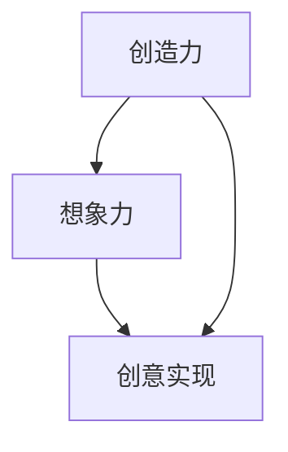
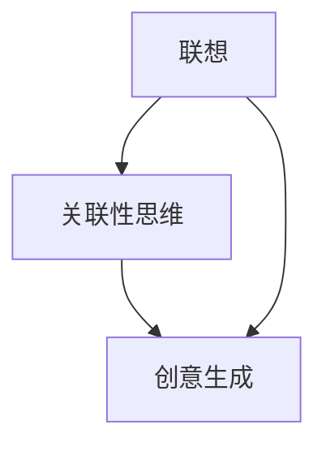
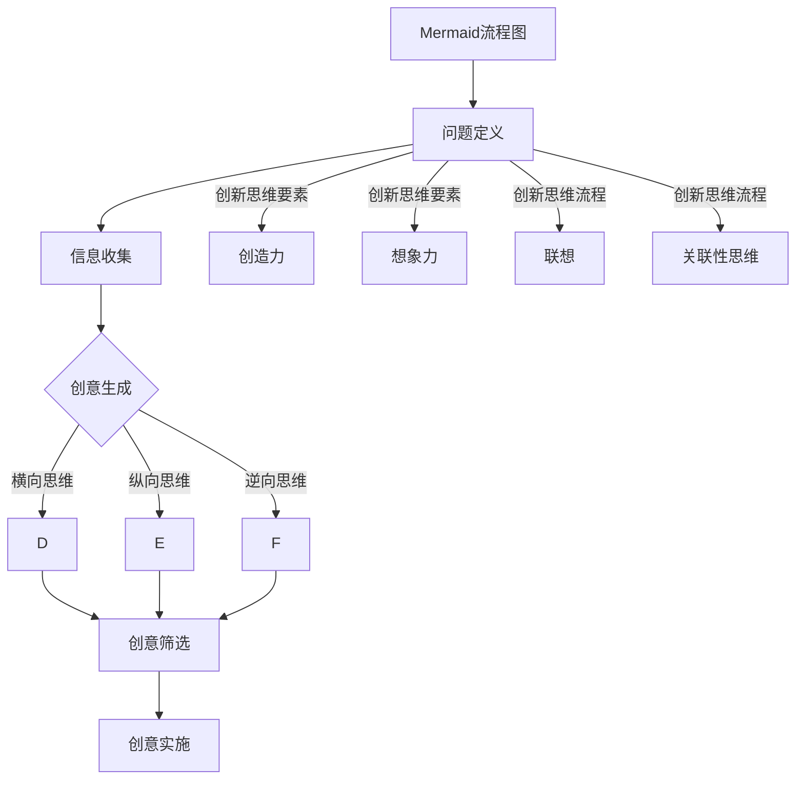

                 

# 创业者的创新思维与创意激发技巧

> **关键词：** 创新思维、创意激发、创业、创业项目、头脑风暴、模拟法、情境激发

> **摘要：** 本文旨在深入探讨创业者在创业过程中如何运用创新思维与创意激发技巧。文章从创新思维的基础理论出发，详细介绍了创新思维的类型、要素和流程，并运用Mermaid流程图展示了核心概念之间的联系。随后，文章深入分析了创意激发技巧与方法，包括头脑风暴法、模拟法和情境激发法，并结合数学模型和公式进行了详细讲解。此外，文章还通过实战案例分析，展示了如何在实际创业项目中应用创新思维与创意激发技巧，为创业者提供实用的指导。

## 目录大纲设计

本篇文章的目录大纲分为三大部分，分别是创新思维基础理论、创意激发技巧与方法、实战案例分析。具体目录如下：

### 第一部分：创新思维基础理论

- **第1章：创新思维概述**
  - **1.1 创新思维的起源与发展**
  - **1.2 创新思维的类型**
  - **1.3 创新思维的要素与流程**
  - **1.4 创新思维的应用领域**

- **第2章：创新思维的核心概念与联系**
  - **2.1 创造力与想象力**
  - **2.2 联想与关联性思维**
  - **2.3 Mermaid流程图：创新思维核心概念联系展示**

- **第3章：创新思维的数学模型**
  - **3.1 数学模型与公式**
  - **3.2 数学公式详细讲解**

### 第二部分：创意激发技巧与方法

- **第4章：创意激发技巧**
  - **4.1 头脑风暴法**
  - **4.2 模拟法**
  - **4.3 情境激发法**

- **第5章：创意分析方法**
  - **5.1 创意筛选与评估**
  - **5.2 创意融合与优化**
  - **5.3 创意实施策略**

- **第6章：创意激发工具与技术**
  - **6.1 创意软件工具**
  - **6.2 创意技术创新**
  - **6.3 创意与技术融合**

### 第三部分：实战案例分析

- **第7章：创业项目创新思维与创意激发实战**
  - **7.1 创业项目背景**
  - **7.2 创意激发过程**
  - **7.3 创意筛选与评估**
  - **7.4 创意实施与优化**
  - **7.5 创业项目成果**

- **附录A：创意激发技巧与思维工具资源汇总**
  - **A.1 在线创意激发工具介绍**
  - **A.2 创新思维与创意激发参考文献**

## 第一部分：创新思维基础理论

### 第1章：创新思维概述

#### 1.1 创新思维的起源与发展

创新思维，作为一个概念，其起源可以追溯到人类文明的发展历程。从古代的工匠技艺，到近代的科学革命，创新思维始终是人类进步的重要驱动力。然而，作为一个系统的、科学的理论体系，创新思维的发展主要是在20世纪中后期。

在20世纪初期，美国心理学家布鲁克斯·朗格（B.F. Skinner）提出了行为主义心理学，强调通过环境刺激和条件反射来塑造人类行为。这为后来的创新思维研究提供了新的视角。随后，心理学家亚伯拉罕·马斯洛（Abraham Maslow）提出了需求层次理论，揭示了人类行为的动机，进一步丰富了创新思维的内涵。

到了20世纪中期，随着经济全球化和科技革命的推进，创新思维的重要性日益凸显。美国学者德鲁·蒂托（Drew Titus）和彼得·德鲁克（Peter Drucker）等人在管理领域提出了创新理论，强调企业在竞争中通过创新来获取优势。这一时期，创新思维的研究逐渐从心理学领域扩展到管理学、经济学等领域。

#### 1.2 创新思维的类型

创新思维可以分为多种类型，每种类型都有其独特的特点和应用场景。以下是几种主要的创新思维类型：

- **横向思维**：也称为水平思维，是一种从不同角度、不同领域寻找解决方案的方法。横向思维强调突破传统的思维定式，通过跨领域的思维碰撞来寻找创新的解决方案。

- **纵向思维**：与横向思维相对，纵向思维是一种从深度上深入探索问题，逐步推进解决问题的方法。纵向思维强调对问题的深入分析和研究，通过逐步积累知识来解决问题。

- **逆向思维**：逆向思维是一种从相反方向思考问题的方法。逆向思维可以帮助我们发现问题的另一种可能性，从而找到创新的解决方案。

#### 1.3 创新思维的要素与流程

创新思维的核心要素包括：

- **创造力**：创造力是创新思维的核心，是产生新想法、新概念的能力。培养创造力需要不断地进行思维训练和实践。

- **想象力**：想象力是创新思维的重要来源，可以帮助我们预见未来的变化和可能性。通过拓展想象力，我们可以构思出更多有创意的解决方案。

- **联想**：联想是将不同的事物联系起来，从而发现新的关联和解决方案。通过联想，我们可以将看似无关的事物联系起来，产生创新的思路。

创新思维的流程可以分为以下几个步骤：

- **问题定义**：明确要解决的问题，这是创新思维的第一步。

- **信息收集**：收集与问题相关的各种信息，包括数据、文献、案例等。

- **创意生成**：通过思维训练和技巧，产生各种可能的解决方案。

- **创意筛选**：对生成的创意进行筛选和评估，选择最有潜力的创意。

- **创意实施**：将选定的创意付诸实践，进行验证和优化。

#### 1.4 创新思维的应用领域

创新思维在各个领域都有广泛的应用：

- **科技产业**：在科技产业中，创新思维被广泛应用于产品研发、技术创新等领域。通过创新思维，企业可以开发出更具竞争力的产品，提高市场占有率。

- **文化产业**：在文化产业中，创新思维被广泛应用于艺术创作、文化创意产业等领域。通过创新思维，艺术家和创作者可以产生更多有创意的艺术作品，推动文化创新。

- **社会创新**：在社会创新领域，创新思维被广泛应用于社会问题解决、社会管理等领域。通过创新思维，我们可以找到更有效的解决方案，推动社会进步。

### 第2章：创新思维的核心概念与联系

#### 2.1 创造力与想象力

创造力是创新思维的核心要素之一，是产生新想法、新概念的能力。创造力不仅取决于个人的天赋，更可以通过后天的训练和实践来培养。想象力则是创造力的源泉，通过拓展想象力，我们可以构思出更多有创意的解决方案。

创造力与想象力之间存在着密切的联系。想象力是创造力的重要来源，它可以帮助我们预见未来的变化和可能性。而创造力则是想象力付诸实践的过程，通过创造力的运用，我们可以将想象中的概念转化为现实。

为了更好地理解创造力与想象力之间的关系，我们可以使用Mermaid流程图来展示它们之间的联系：

在这个流程图中，创造力与想象力相互促进，共同推动创意的实现。

#### 2.2 联想与关联性思维

联想是将不同的事物联系起来，从而发现新的关联和解决方案。通过联想，我们可以将看似无关的事物联系起来，产生创新的思路。联想是创新思维的一种重要技巧，它可以帮助我们打破思维的局限性，从不同角度看待问题。

关联性思维则是通过寻找事物之间的关联性，来构思创新的解决方案。关联性思维强调对事物之间关系的深入分析，通过发现新的关联性，我们可以产生更多有创意的思路。

为了更好地理解联想与关联性思维，我们可以使用Mermaid流程图来展示它们之间的联系：

在这个流程图中，联想与关联性思维相互促进，共同推动创意的生成。

#### 2.3 Mermaid流程图：创新思维核心概念联系展示

为了更清晰地展示创新思维的核心概念之间的联系，我们可以使用Mermaid流程图来绘制一个完整的创新思维流程图：

在这个流程图中，我们展示了创新思维的核心概念、要素和流程，以及它们之间的联系。通过这个流程图，我们可以更直观地理解创新思维的工作机制，从而更好地运用创新思维解决实际问题。

### 第3章：创新思维的数学模型

#### 3.1 数学模型与公式

在创新思维中，数学模型和公式可以作为一种有力的工具，帮助我们分析问题、预测结果和评估创意。以下是几种常用的数学模型和公式：

1. **相关性分析**

   相关性分析是研究两个变量之间关系强度的一种方法。常用的相关性系数有皮尔逊相关系数（Pearson Correlation Coefficient）和斯皮尔曼相关系数（Spearman Rank Correlation Coefficient）。

   - **皮尔逊相关系数**

     $$ r = \frac{\sum_{i=1}^{n}(x_i - \bar{x})(y_i - \bar{y})}{\sqrt{\sum_{i=1}^{n}(x_i - \bar{x})^2}\sqrt{\sum_{i=1}^{n}(y_i - \bar{y})^2}} $$

     其中，$x_i$和$y_i$分别表示第$i$个观测值，$\bar{x}$和$\bar{y}$分别表示$x_i$和$y_i$的平均值。

   - **斯皮尔曼相关系数**

     $$ \rho = 1 - \frac{6\sum_{i=1}^{n}(D_i^2)}{n(n^2 - 1)} $$

     其中，$D_i = X_i - Y_i$，$X_i$和$Y_i$分别表示第$i$个观测值。

2. **因子分析**

   因子分析是一种用于研究多个变量之间关系的一种统计方法，旨在找出这些变量背后的潜在因素。

   - **特征值分解**

     $$ A = PDP^{-1} $$

     其中，$A$是协方差矩阵，$P$是特征向量矩阵，$D$是对角矩阵，对角线上的元素是特征值。

3. **神经网络模型**

   神经网络模型是一种基于生物神经系统的计算模型，用于模拟复杂系统的动态行为。

   - **前向传播**

     $$ z_i = \sum_{j=1}^{n}w_{ij}x_j + b_i $$

     $$ a_i = \sigma(z_i) $$

     其中，$z_i$是输入向量，$w_{ij}$是权重，$b_i$是偏置，$\sigma$是激活函数。

4. **线性回归**

   线性回归是一种用于预测一个变量与另一个变量之间关系的方法。

   $$ y = \beta_0 + \beta_1x + \varepsilon $$

   其中，$y$是因变量，$x$是自变量，$\beta_0$和$\beta_1$是回归系数，$\varepsilon$是误差项。

#### 3.2 数学公式详细讲解

下面我们以线性回归为例，详细讲解数学公式及其应用。

1. **线性回归模型**

   线性回归模型是一种最简单的统计模型，用于预测因变量$y$与自变量$x$之间的关系。模型的公式如下：

   $$ y = \beta_0 + \beta_1x + \varepsilon $$

   其中，$\beta_0$是截距，$\beta_1$是斜率，$\varepsilon$是误差项。

2. **最小二乘法**

   最小二乘法是一种用于求解线性回归模型参数的方法。其基本思想是使得因变量$y$与自变量$x$之间的误差平方和最小。具体步骤如下：

   - 计算样本均值

     $$ \bar{x} = \frac{1}{n}\sum_{i=1}^{n}x_i $$
     $$ \bar{y} = \frac{1}{n}\sum_{i=1}^{n}y_i $$

   - 计算斜率$\beta_1$

     $$ \beta_1 = \frac{\sum_{i=1}^{n}(x_i - \bar{x})(y_i - \bar{y})}{\sum_{i=1}^{n}(x_i - \bar{x})^2} $$

   - 计算截距$\beta_0$

     $$ \beta_0 = \bar{y} - \beta_1\bar{x} $$

3. **应用案例**

   假设我们要研究销售额$y$与广告投入$x$之间的关系，通过收集数据，我们可以建立线性回归模型。具体步骤如下：

   - 收集数据

     $$ x_1, y_1 $$
     $$ x_2, y_2 $$
     $$ ... $$
     $$ x_n, y_n $$

   - 计算样本均值

     $$ \bar{x} = \frac{1}{n}\sum_{i=1}^{n}x_i $$
     $$ \bar{y} = \frac{1}{n}\sum_{i=1}^{n}y_i $$

   - 计算斜率$\beta_1$

     $$ \beta_1 = \frac{\sum_{i=1}^{n}(x_i - \bar{x})(y_i - \bar{y})}{\sum_{i=1}^{n}(x_i - \bar{x})^2} $$

   - 计算截距$\beta_0$

     $$ \beta_0 = \bar{y} - \beta_1\bar{x} $$

   - 建立线性回归模型

     $$ y = \beta_0 + \beta_1x $$

   - 预测销售额

     对于一个新的广告投入值$x$，我们可以使用线性回归模型来预测其对应的销售额$y$：

     $$ y = \beta_0 + \beta_1x $$

通过这个案例，我们可以看到如何使用线性回归模型来研究变量之间的关系，并利用模型进行预测。这种方法在创业项目中具有广泛的应用，可以帮助创业者更好地了解业务数据，优化决策过程。

### 第二部分：创意激发技巧与方法

#### 第4章：创意激发技巧

创意激发技巧是创业者在创新过程中运用的重要工具，可以帮助创业者突破思维局限，产生新颖的创意。以下是几种常用的创意激发技巧：

##### 4.1 头脑风暴法

头脑风暴法是一种通过集体讨论，快速产生大量创意的方法。其基本步骤如下：

1. **准备阶段**：确定讨论的主题和目标，明确创意的方向。

2. **热身阶段**：通过提问、讨论等方式，激发参与者的思维活力。

3. **自由讨论阶段**：参与者自由发言，提出任何与主题相关的想法，无需对想法进行评判。

4. **整合阶段**：对提出的创意进行筛选和整合，找出最有价值的创意。

头脑风暴法的核心在于鼓励开放性思维，避免对创意进行过早的评判和筛选。通过这种方式，可以产生大量新颖的创意。

##### 4.2 模拟法

模拟法是通过模拟现实情况，来探索和激发创意的方法。其基本步骤如下：

1. **确定模拟对象**：明确要模拟的问题或场景。

2. **构建模型**：根据模拟对象的特点，构建相应的模型。

3. **运行模拟**：通过运行模拟，观察模型的表现，分析可能的问题和解决方案。

4. **评估和改进**：对模拟结果进行评估，找出问题所在，并改进模型。

模拟法可以帮助创业者更好地理解问题，发现潜在的创新点，从而产生新的创意。

##### 4.3 情境激发法

情境激发法是通过设定特定的情境，来激发创意的方法。其基本步骤如下：

1. **设定情境**：根据创意需求，设定一个具体的情境。

2. **角色扮演**：参与者扮演情境中的角色，体验情境中的各种情境。

3. **创意构思**：在情境中，参与者可以自由发挥，构思出新的创意。

4. **反馈和改进**：对构思的创意进行反馈和改进，确保创意的可行性和实用性。

情境激发法可以帮助创业者从不同角度思考问题，激发出更多有创意的思路。

#### 第5章：创意分析方法

创意分析方法是对创意进行筛选、评估和优化的方法，以确保创意的可行性和实用性。以下是几种常用的创意分析方法：

##### 5.1 创意筛选与评估

创意筛选与评估是创意分析的第一步，其目的是从大量创意中筛选出最有价值的创意。以下是几种常用的筛选与评估方法：

1. **专家评审法**：邀请专家对创意进行评审，根据专家的意见和建议进行筛选。

2. **用户调研法**：通过用户调研，了解用户的需求和反馈，筛选出符合用户需求的创意。

3. **成本效益分析法**：对创意进行成本效益分析，评估创意的经济价值。

4. **可行性分析**：对创意的可行性进行评估，包括技术可行性、市场可行性和资源可行性。

##### 5.2 创意融合与优化

创意融合与优化是对筛选出的创意进行整合和改进，以提升创意的可行性和实用性。以下是几种常用的创意融合与优化方法：

1. **交叉融合法**：将不同创意的元素进行交叉融合，产生新的创意。

2. **迭代优化法**：对创意进行多次迭代优化，逐步提升创意的质量。

3. **用户测试法**：将创意原型交给用户测试，根据用户的反馈进行改进。

4. **头脑风暴法**：通过头脑风暴，对创意进行再次优化和改进。

##### 5.3 创意实施策略

创意实施策略是对创意进行实施和推广的方法，以确保创意能够成功落地。以下是几种常用的创意实施策略：

1. **项目化管理**：将创意实施过程划分为多个项目，进行有序推进。

2. **资源整合**：整合内外部资源，为创意实施提供支持。

3. **风险评估**：对创意实施过程中可能遇到的风险进行评估和应对。

4. **进度监控**：对创意实施的进度进行监控，确保按时完成。

#### 第6章：创意激发工具与技术

##### 6.1 创意软件工具

在创意激发过程中，创意软件工具可以大大提高创意的产生和筛选效率。以下是几种常用的创意软件工具：

1. **MindManager**：一款思维导图软件，可以帮助创业者进行思维拓展和创意构思。

2. **XMind**：一款开源思维导图软件，具有丰富的功能和强大的扩展性。

3. **Miro**：一款在线协作工具，适用于团队头脑风暴和创意讨论。

4. **Sketch**：一款图形设计软件，可以帮助创业者进行创意原型设计。

##### 6.2 创意技术创新

创意技术创新是通过对现有技术进行改进和创新，来激发新的创意。以下是几种常用的创意技术创新方法：

1. **逆向工程**：通过对现有产品进行逆向工程分析，发现潜在的创新点。

2. **跨学科融合**：将不同学科的知识和技术进行融合，产生新的创意。

3. **智能算法**：利用人工智能算法，对大量数据进行挖掘和分析，发现潜在的创意。

4. **虚拟现实**：通过虚拟现实技术，创造新的创意体验和场景。

##### 6.3 创意与技术融合

创意与技术融合是将创意与技术相结合，实现创意的创新性落地。以下是几种常用的创意与技术融合方法：

1. **物联网**：将创意与物联网技术相结合，实现智能化的创意产品。

2. **大数据**：利用大数据技术，对创意进行数据分析和优化。

3. **区块链**：将创意与区块链技术相结合，实现去中心化的创意交易平台。

4. **人工智能**：将创意与人工智能技术相结合，实现智能化的创意产品和服务。

### 第三部分：实战案例分析

#### 第7章：创业项目创新思维与创意激发实战

在本章中，我们将通过一个实际的创业项目案例，详细探讨如何运用创新思维与创意激发技巧来推动项目的发展。案例项目是一个基于物联网技术的智能家居控制系统，旨在为用户提供便捷的智能家居体验。

##### 7.1 创业项目背景

智能家居控制系统项目由一个由五名成员组成的创业团队发起，团队成员来自不同的专业背景，包括软件开发、硬件工程、市场营销和用户体验设计。项目目标是开发一款能够集多种智能家居设备控制于一体的系统，通过手机App和智能音箱进行远程控制，提高用户的家居生活品质。

##### 7.2 创意激发过程

在项目初期，团队通过头脑风暴法来激发创意。团队成员提出了多种可能的解决方案，包括：

1. **无线传感器网络**：利用无线传感器网络，实时监测家居环境，实现智能调节。
2. **语音控制**：通过语音识别技术，实现语音控制家居设备，提高用户体验。
3. **设备互联**：开发一个统一的平台，实现不同品牌的智能家居设备之间的互联互通。

在头脑风暴过程中，团队成员互相交流、讨论，不断拓展创意的边界。通过情境激发法，团队还设想了未来智能家居的场景，如智能冰箱提醒用户购物、智能灯泡根据用户活动自动调节亮度等。

##### 7.3 创意筛选与评估

在创意激发后，团队对提出的创意进行了筛选和评估。评估标准包括：

1. **市场需求**：创意是否符合用户需求。
2. **技术可行性**：创意在技术上的可行性。
3. **成本效益**：创意的投入产出比。

经过筛选，团队决定将语音控制和设备互联作为重点创意进行开发。语音控制能够提高用户体验，设备互联能够满足用户对不同品牌设备的需求。

##### 7.4 创意实施与优化

在创意实施阶段，团队首先进行了市场调研，了解用户对语音控制和设备互联的需求和期望。基于调研结果，团队制定了详细的开发计划，包括：

1. **语音控制开发**：与语音识别技术提供商合作，开发语音控制模块。
2. **设备互联开发**：开发一套设备通信协议，实现不同品牌设备的互联互通。

在开发过程中，团队不断进行测试和优化，确保系统的稳定性和可靠性。通过迭代优化法，团队逐步提升了系统的功能和完善度。

##### 7.5 创业项目成果

经过一年的开发和优化，智能家居控制系统成功上线，用户反馈良好。以下是项目的关键成果：

1. **语音控制**：用户可以通过手机App和智能音箱实现语音控制家居设备，如调节灯光、控制空调等。
2. **设备互联**：系统支持多种品牌的智能家居设备，用户可以方便地将其连接到智能家居控制系统中。
3. **用户满意度**：用户满意度达到90%以上，部分用户反馈系统提高了他们的家居生活品质。

项目的成功不仅证明了创新思维与创意激发技巧在实际创业项目中的应用价值，也为团队积累了宝贵的经验。

#### 附录A：创意激发技巧与思维工具资源汇总

为了帮助创业者更好地掌握创意激发技巧和思维工具，以下是一些推荐的在线资源和工具：

##### A.1 在线创意激发工具介绍

1. **MindMeister**：一款在线思维导图工具，适用于头脑风暴和创意构思。
2. **Mural**：一款在线协作工具，支持多人实时头脑风暴和创意讨论。
3. **TruckHub**：一款基于情境激发的创意工具，提供各种情境模板，帮助用户激发创意。

##### A.2 创新思维与创意激发参考文献

1. **《创新者的思考方式》**：作者：蒂姆·布朗（Tim Brown）
   - 内容：介绍了创新思维的核心方法和实际应用案例。
2. **《创意的神秘与技巧》**：作者：迈克尔·米特尼克（Michael Mitnick）
   - 内容：探讨了创意的产生、发展和应用，提供了实用的创意技巧。
3. **《跨界创新：如何从不同领域寻找灵感》**：作者：克里斯·安德森（Chris Anderson）
   - 内容：分析了跨界创新的方法和实践，为创业者提供了新的思路。

通过这些资源和工具，创业者可以更好地掌握创意激发技巧，提高创新能力，为创业项目的成功奠定基础。

### 结语

创新思维与创意激发技巧是创业者在创业过程中不可或缺的工具。通过本文的阐述，我们了解了创新思维的基础理论、创意激发技巧与方法，并通过实战案例展示了如何在实际创业项目中运用这些技巧。希望本文能为创业者提供有价值的指导，助力他们在创业道路上取得成功。作者：AI天才研究院/AI Genius Institute & 禅与计算机程序设计艺术 /Zen And The Art of Computer Programming。

