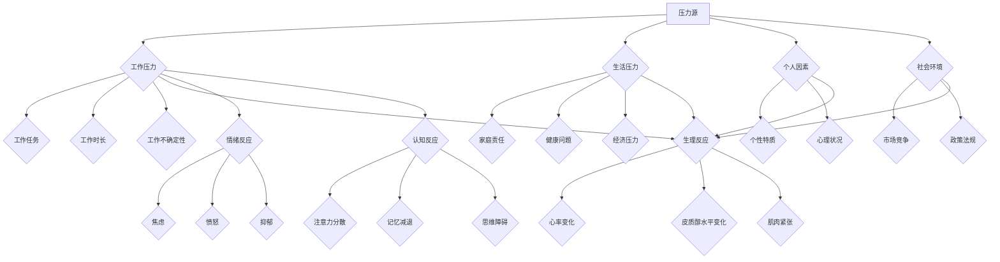

                 

### 《创业者的抗压能力与心理韧性培养》

#### 引言：创业压力与心理韧性

在当今充满不确定性的商业环境中，创业者的抗压能力与心理韧性成为了成功的关键因素。创业不仅是一个充满机遇的过程，也是一个充满挑战和压力的旅程。创业者需要应对市场波动、竞争压力、资源匮乏等多种挑战，这些都对他们的心理状态提出了极高的要求。

**关键词：** 创业者，抗压能力，心理韧性，商业环境，挑战。

**摘要：** 本文将深入探讨创业者在面对压力时的抗压能力与心理韧性，分析其重要性，并从心理学基础、技能与方法、团队建设、创业成功案例等多个角度，提供创业者培养和提升心理韧性的策略和实践方法。

#### 第1章 引言：创业压力与心理韧性

##### 1.1 创业环境的压力分析

创业环境的压力可以来源于多个方面，包括市场竞争、资金筹集、团队管理、客户关系等。这些压力源往往交织在一起，形成复杂的压力网络，对创业者的身心健康构成挑战。

- **市场竞争：** 创业者需要不断适应市场变化，保持竞争力。新的竞争对手、技术创新、市场趋势的变化都可能导致巨大的压力。
- **资金筹集：** 资金是创业的血液。创业者需要不断地寻找资金来源，以维持公司的运营和发展。资金不足可能导致业务停滞甚至失败。
- **团队管理：** 团队是创业者实现目标的重要力量。管理团队、协调成员、解决冲突都是巨大的挑战，特别是当团队规模扩大时。
- **客户关系：** 建立和维护良好的客户关系对于企业的生存至关重要。客户投诉、需求变化、竞争对手的干扰都可能对创业者造成心理压力。

##### 1.2 心理韧性的重要性

心理韧性是指个体在面对逆境、压力和挑战时，能够迅速恢复和适应的能力。对于创业者来说，心理韧性是成功的关键因素之一。

- **逆境应对：** 心理韧性帮助创业者更好地应对各种逆境，包括业务挫折、资金困难、市场变化等。
- **压力管理：** 心理韧性有助于创业者有效地管理压力，避免压力导致的身心健康问题。
- **决策能力：** 心理韧性增强创业者的决策能力，使他们能够更冷静地分析问题，做出明智的决策。
- **持续动力：** 心理韧性使创业者能够保持持续的动力和激情，持续推动企业向前发展。

##### 1.3 书籍目的与结构概述

本书的目的是帮助创业者了解和培养自己的抗压能力与心理韧性，从而更好地应对创业过程中的各种挑战。本书结构如下：

- **第1章**：引言，介绍创业压力与心理韧性的重要性。
- **第2章**：心理学基础，分析压力源与应对策略。
- **第3章**：增强抗压能力，介绍技能与方法。
- **第4章**：心理韧性培养，探讨个体与实践。
- **第5章**：团队建设与韧性，讨论团队韧性的培养策略。
- **第6章**：创业心理韧性评估与提升，提供评估和提升策略。
- **第7章**：心理韧性在创业成功中的应用，通过案例进行分析。
- **第8章**：结论，总结全书内容，展望未来。

通过本书的阅读和实践，创业者将能够更好地应对创业压力，培养心理韧性，实现创业目标。

### 第2章 心理学基础：压力源与应对策略

在探讨创业者的抗压能力与心理韧性之前，了解压力的本质以及其来源是至关重要的。压力（Stress）是一种生理和心理的紧张状态，通常由外部或内部因素触发。对于创业者来说，压力源可以来自多个方面，包括工作、生活和个人成长等。有效的压力管理不仅能够提高生活质量，还能增强心理韧性，帮助创业者更好地应对挑战。

#### 2.1 压力源的分类与识别

压力源可以根据其性质和影响范围进行分类。以下是几种常见的压力源：

**1. 工作与生活压力**

- **工作压力：** 这通常包括工作任务繁重、工作时长过长、工作不确定性等。创业者可能需要面对频繁的决策、不断变化的市场需求和技术更新。
- **生活压力：** 这包括家庭责任、健康问题、经济压力等。生活压力可能会影响创业者的工作表现和心理健康。

**2. 资源匮乏与时间管理**

- **资源匮乏：** 创业者常常面临资金、人才、技术等资源的限制。资源不足可能导致业务发展受阻。
- **时间管理：** 时间管理不当会导致任务积压，增加心理压力。

**3. 社会环境**

- **竞争压力：** 市场竞争激烈，创业者需要不断提升自身竞争力。
- **政策法规：** 政策法规的变化可能会影响创业者的业务运作。

**4. 个人因素**

- **个性特质：** 一些个性特质，如完美主义、焦虑倾向等，可能导致创业者更容易感受到压力。
- **心理状况：** 长期压力可能导致心理健康问题，如焦虑、抑郁等。

##### 2.1.1 工作与生活压力

工作与生活压力是创业者面临的主要压力源之一。在工作中，创业者需要处理各种复杂的事务，如项目规划、团队管理、市场拓展等。这些任务往往需要高度集中注意力和决策能力。此外，工作时间的不确定性也增加了压力。许多创业者为了维持业务运转，往往需要长时间工作，甚至牺牲休息和娱乐时间。

在个人生活中，创业者也需要平衡家庭、健康和职业责任。家庭责任可能会影响工作专注度，而健康问题可能会限制工作能力。经济压力也是一个重要的生活压力源，尤其是对于初创企业来说，资金问题可能会成为持续的压力。

##### 2.1.2 资源匮乏与时间管理

资源匮乏是创业过程中常见的挑战之一。无论是资金、人才还是技术，资源的不足都可能对创业者的信心和业务发展造成影响。资金问题可能导致业务停滞或扩展受阻，而人才不足可能影响团队的整体效率和创新能力。技术资源匮乏也可能限制创业者引入新技术，从而在激烈的市场竞争中处于不利地位。

时间管理是另一个重要的压力源。创业者通常需要同时处理多个任务，如果没有合理的时间管理，可能会导致任务积压和压力增加。时间管理不当不仅会影响工作效率，还可能导致心理健康问题，如焦虑和疲劳。

##### 2.2 心理应激反应

当创业者面临压力源时，身体和心理会产生一系列应激反应。这些反应旨在帮助个体应对压力，但过度的应激反应可能导致健康问题。

**1. 生理反应**

- **心率变化：** 当压力增大时，心率会上升，以准备身体应对紧急情况。
- **皮质醇水平变化：** 皮质醇是一种应激激素，压力增加时其水平会上升，帮助身体应对压力。
- **肌肉紧张：** 压力可能导致肌肉紧张和疼痛。

**2. 情绪反应**

- **焦虑：** 压力可能引起焦虑，表现为紧张、不安和担忧。
- **愤怒：** 压力过大时，一些人可能会产生愤怒情绪，这可能是对压力源的直接反应。
- **抑郁：** 长期压力可能导致抑郁情绪，表现为情绪低落、失去兴趣等。

**3. 认知反应**

- **注意力分散：** 压力可能导致注意力难以集中，影响工作表现。
- **记忆减退：** 长期压力可能导致记忆力减退，影响决策能力。
- **思维障碍：** 压力可能影响逻辑思考和问题解决能力。

##### 2.3 压力应对策略

面对压力，创业者可以采取多种应对策略，以减轻压力的影响，提高心理韧性。以下是一些常见的压力应对策略：

**1. 认知重构**

认知重构是一种通过改变对压力源的认知来减轻压力的方法。创业者可以通过以下方式进行认知重构：

- **重新评估压力源：** 对压力源进行客观评估，了解其真实影响。
- **改变思维方式：** 从消极的思维方式转变为积极的思维方式，如将挑战视为成长机会。

**2. 冥想与放松**

冥想和放松练习可以帮助创业者减轻身体和心理的紧张状态。以下是一些有效的放松技巧：

- **深呼吸：** 深呼吸有助于减缓心率，降低应激激素水平。
- **渐进性肌肉放松：** 通过逐渐放松身体的肌肉群，减轻肌肉紧张和疼痛。
- **正念冥想：** 正念冥想有助于提高注意力，减轻焦虑和压力。

**3. 积极心理干预**

积极心理干预是通过心理治疗和自我管理策略来提高个体的心理韧性。以下是一些积极心理干预的方法：

- **认知行为疗法：** 通过改变消极思维和行为模式，提高心理韧性。
- **情感调节训练：** 通过训练情感调节技能，提高情绪稳定性。
- **自我效能感提升：** 通过设定可实现的目标，提高自我效能感，增强自信心。

#### 第3章 增强抗压能力：技能与方法

在面对创业压力时，增强抗压能力是创业者成功的关键之一。抗压能力不仅关乎个体的心理韧性，也影响着团队的整体表现和企业的长期发展。以下是一些实用的技能与方法，帮助创业者提升抗压能力。

##### 3.1 自我认知与自我调节

自我认知是提升抗压能力的基础。创业者需要深入了解自己的情绪、思维和行为模式，以便更好地应对压力。

**1. 自我反思**

自我反思是一种通过深入思考自己的行为和情绪来提高自我认知的方法。创业者可以通过以下方式进行自我反思：

- **定期回顾：** 每天或每周花时间回顾自己的行为和情绪，思考哪些因素导致了压力。
- **写日记：** 记录自己的情绪波动和压力源，有助于发现规律和应对策略。

**2. 建立支持网络**

建立支持网络是自我调节的重要一环。创业者可以通过以下方式建立支持网络：

- **与家人和朋友交流：** 分享自己的压力和感受，寻求支持和建议。
- **加入创业者社区：** 加入创业者社区，与其他创业者交流经验和心得。
- **寻求专业帮助：** 在必要时寻求心理咨询师或心理治疗师的帮助。

##### 3.2 时间管理技巧

时间管理是创业者有效应对压力的重要技能。以下是一些时间管理技巧：

**1. 优先级排序**

将任务按照优先级排序，有助于创业者集中精力处理最重要的任务。以下是一些优先级排序的方法：

- **紧急重要矩阵：** 将任务分为四个象限，分别代表紧急且重要、紧急不重要、不紧急但重要、不紧急且不重要。
- **GTD（Getting Things Done）方法：** 通过收集、处理、组织、回顾和执行，系统地管理任务。

**2. 时间分配**

合理的时间分配有助于提高工作效率，减轻压力。以下是一些时间分配的技巧：

- **番茄工作法：** 将工作时间分为25分钟的工作周期，每个周期后休息5分钟。
- **分散时间：** 将长时间的工作任务分解为短周期任务，有助于保持专注和减少疲劳。

**3. 避免拖延**

拖延是创业者面临的一大挑战，以下是一些避免拖延的策略：

- **明确目标：** 设定清晰的目标和截止日期，提高完成任务的动力。
- **分解任务：** 将大任务分解为小任务，逐步完成，减少心理压力。
- **奖励机制：** 给自己设定奖励，完成任务后给予适当的奖励。

##### 3.3 冲突解决策略

在创业过程中，冲突是不可避免的。有效的冲突解决策略有助于维护团队和谐，提高工作效率。以下是一些冲突解决策略：

**1. 倾听和理解**

倾听是解决冲突的关键。以下是一些倾听和理解的方法：

- **主动倾听：** 全神贯注地听对方说话，避免打断。
- **同理心：** 站在对方的角度思考问题，理解对方的感受和需求。

**2. 开放沟通**

开放沟通有助于缓解冲突，以下是一些开放沟通的方法：

- **明确表达：** 清楚地表达自己的观点和需求，避免误解。
- **非暴力沟通：** 使用非暴力语言，避免攻击性言论。

**3. 寻求共识**

寻求共识是解决冲突的有效方法。以下是一些寻求共识的策略：

- **妥协：** 在双方都能接受的范围内进行妥协。
- **共赢：** 寻找双方都能受益的解决方案，实现双赢。

##### 3.4 高效沟通技巧

高效的沟通技巧有助于创业者更好地传达信息，减少误解和冲突。以下是一些高效沟通技巧：

**1. 明确信息**

明确信息是有效沟通的基础。以下是一些明确信息的方法：

- **使用简单语言：** 使用简单明了的语言，避免使用复杂的技术术语。
- **具体例子：** 使用具体的例子来阐明观点，帮助对方更好地理解。

**2. 非语言沟通**

非语言沟通在沟通中占有很大比重。以下是一些非语言沟通的技巧：

- **肢体语言：** 通过肢体语言表达自信和诚意，如保持眼神交流、微笑等。
- **声音语言：** 通过声音的语调、节奏和音量来传达信息，如使用积极的语调和适中的音量。

**3. 反馈和确认**

反馈和确认是确保信息准确传达的重要环节。以下是一些反馈和确认的方法：

- **请求反馈：** 在沟通结束后，请求对方反馈自己的理解，确保信息准确传达。
- **确认理解：** 在接收信息后，用自己的话复述信息，以确保理解正确。

通过上述技能和方法，创业者可以更好地应对创业压力，提高抗压能力，从而实现创业目标。

### 第4章 心理韧性培养：个体与实践

心理韧性，又称心理弹性，是指个体在面对逆境、压力和挑战时，能够迅速恢复并适应的能力。对于创业者而言，心理韧性是成功的关键因素之一。本章将探讨心理韧性的特点、培养方法以及实践案例，以帮助创业者提升心理韧性。

#### 4.1 心理韧性的特点

心理韧性具有以下几个显著特点：

**1. 适应性**

适应性是指个体能够在逆境中迅速调整自己的行为和思维模式，以适应新的环境或挑战。创业者需要具备强烈的适应性，以应对不断变化的市场和技术环境。

**2. 抗挫折性**

抗挫折性是指个体在面对失败或挫折时，能够保持积极的态度和信念，不轻易放弃。创业者往往需要经历多次失败和挫折，心理韧性使他们能够从挫折中汲取教训，继续前进。

**3. 抗压性**

抗压性是指个体能够在压力下保持冷静和稳定，有效应对各种挑战。创业者常常面临巨大的压力，心理韧性使他们能够更好地管理压力，保持工作效率。

**4. 持续性**

心理韧性不是一蹴而就的，而是一个持续发展的过程。个体需要通过不断的实践和锻炼，不断提升自己的心理韧性。

**5. 情绪调节能力**

情绪调节能力是指个体能够有效地管理自己的情绪，避免情绪波动对工作和生活造成负面影响。创业者需要具备良好的情绪调节能力，以保持稳定的心态。

#### 4.2 培养心理韧性的方法

**1. 积极心态培养**

积极心态是培养心理韧性的基础。创业者可以通过以下方法培养积极心态：

- **正面思维：** 在面对困难和挑战时，保持积极的态度，相信问题总能得到解决。
- **感恩练习：** 每天花时间思考自己感激的事物，培养感恩的心态。
- **目标设定：** 设定清晰的目标和计划，为实现目标而努力。

**2. 逆境中的成长**

逆境中的成长是指个体在逆境中寻找机会，从中学习和成长。创业者可以通过以下方法在逆境中成长：

- **反思失败：** 对失败进行深入反思，找出失败的原因和教训。
- **求助与分享：** 向他人寻求帮助，分享自己的困难和挑战，获取支持和建议。
- **持续学习：** 通过学习新知识和技能，提升自己的能力和竞争力。

**3. 建立支持网络**

建立支持网络是培养心理韧性的一种有效方法。创业者可以通过以下方式建立支持网络：

- **家人和朋友：** 与家人和朋友保持密切联系，分享自己的喜怒哀乐。
- **专业导师：** 寻找专业导师或行业导师，从他们那里获取宝贵的经验和建议。
- **同行交流：** 加入创业者社区或同行交流群组，与其他创业者交流心得和经验。

**4. 冥想与放松**

冥想和放松练习有助于减轻压力，提升心理韧性。创业者可以通过以下方法进行冥想与放松：

- **深呼吸练习：** 深呼吸有助于放松身心，减轻压力。
- **正念冥想：** 正念冥想有助于提高专注力和情绪调节能力。
- **瑜伽与运动：** 通过瑜伽和运动，增强身体素质，提升心理韧性。

#### 4.3 实践案例分享

以下是一些成功创业者的心理韧性培养案例，供创业者参考：

**1. 案例一：乔布斯的韧性**

乔布斯是一位具有极高心理韧性的创业者。他在创办苹果公司时经历了多次失败，包括被公司解雇和竞争对手的挑战。然而，他从未放弃，通过不断努力和创新，最终将苹果公司推向了成功。

**2. 案例二：马斯克的韧性**

埃隆·马斯克是一位充满韧性的创业者，他在创办特斯拉和SpaceX的过程中面临了无数挑战。从资金短缺到技术难题，马斯克都凭借坚韧不拔的毅力克服了这些困难，实现了自己的创业梦想。

**3. 案例三：创业者的韧性培养**

某位创业者，在面对市场波动和资金困难时，通过积极心态和逆境中的成长，成功带领团队渡过了难关。他定期进行冥想和运动，以保持身心健康，同时建立了强大的支持网络，从家人、朋友和专业导师那里获得了宝贵的支持和建议。

通过上述实践案例，我们可以看到，心理韧性是创业者成功的关键因素之一。创业者可以通过培养积极心态、逆境中的成长、建立支持网络和冥想与放松等方法，不断提升自己的心理韧性，从而更好地应对创业过程中的各种挑战。

### 第5章 团队建设与韧性

在创业过程中，团队是创业者最为重要的资产之一。一个具有高度韧性的团队能够在面对挑战时保持稳定和高效，从而助力企业的持续成长。本章将探讨团队韧性的概念、特征、重要性，以及如何建立和培养具有韧性的团队。

#### 5.1 团队韧性概述

团队韧性（Team Resilience）是指团队在面对外部压力和内部挑战时，能够迅速适应和恢复的能力。团队韧性不仅关乎个体的心理健康，也影响着团队的协作效率和企业文化的建设。

**1. 特征**

团队韧性具有以下几个主要特征：

- **适应性：** 团队能够迅速适应环境变化，调整策略和行动。
- **抗挫折性：** 团队在遇到挫折和困难时，能够保持积极态度，共同努力克服挑战。
- **抗压性：** 团队能够在压力下保持冷静和稳定，高效完成任务。
- **协同性：** 团队成员之间能够紧密协作，共同应对挑战。
- **恢复力：** 团队能够在经历挫折后迅速恢复，重新投入到工作中。

**2. 重要性**

团队韧性在创业过程中具有重要意义：

- **提高团队效率：** 高韧性的团队能够在压力下保持高效，减少失误和错误。
- **增强团队凝聚力：** 团队韧性有助于建立团队信任和协作，增强团队凝聚力。
- **促进创新：** 团队韧性鼓励成员面对挑战时保持开放心态，从而促进创新思维。
- **提高企业竞争力：** 具有高度韧性的团队能够在激烈的市场竞争中保持优势。

#### 5.2 建立韧性团队

要建立具有韧性的团队，创业者可以从以下几个方面入手：

**1. 团队文化建设**

团队文化是团队韧性的基础。创业者可以通过以下方式塑造团队文化：

- **明确价值观：** 确定团队的共同价值观和愿景，使团队成员对团队目标有清晰的认识。
- **鼓励开放沟通：** 建立开放、坦诚的沟通氛围，鼓励团队成员表达意见和想法。
- **提倡合作精神：** 强调团队合作的重要性，鼓励成员互相支持和帮助。

**2. 团队成员之间的支持**

团队成员之间的支持是团队韧性的关键。创业者可以采取以下措施：

- **建立信任：** 通过共同完成任务和经历困难，建立团队成员之间的信任。
- **分享经验和知识：** 鼓励团队成员分享自己的经验和知识，提高团队的集体智慧。
- **关注成员心理健康：** 定期了解团队成员的心理状态，提供必要的心理支持和帮助。

**3. 团队协作技巧**

有效的团队协作是团队韧性的一部分。创业者可以通过以下方式提升团队协作：

- **分工明确：** 根据团队成员的特长和兴趣，明确分工，确保任务的高效完成。
- **定期会议：** 定期召开团队会议，讨论工作进展和挑战，确保团队目标的实现。
- **激励与奖励：** 设定激励机制，对团队和个人的优秀表现给予奖励，提高团队成员的积极性。

#### 5.3 团队韧性培养策略

为了培养团队韧性，创业者可以采取以下策略：

**1. 应对策略与实践**

- **定期培训：** 组织团队建设培训，提高团队成员的心理素质和应对压力的能力。
- **模拟演练：** 通过模拟演练，让团队成员学会在压力环境下保持冷静和高效。

**2. 持续关注与支持**

- **领导者的角色：** 领导者需要成为团队韧性的榜样，通过自身的行为和态度，激励团队成员面对挑战。
- **心理支持：** 提供心理支持服务，帮助团队成员在压力和挫折面前保持积极心态。

**3. 跨部门合作**

- **跨部门沟通：** 建立跨部门沟通机制，促进不同部门之间的协作和合作。
- **共享资源：** 通过共享资源和信息，提高团队的整体效能。

通过以上策略，创业者可以建立和培养具有高度韧性的团队，从而更好地应对创业过程中的各种挑战。

### 第6章 创业心理韧性评估与提升

创业心理韧性的评估与提升是确保创业者能够有效应对创业压力和挑战的关键步骤。本章将探讨如何评估创业者的心理韧性，并提供针对性的提升策略。

#### 6.1 心理韧性评估

评估创业者的心理韧性可以帮助创业者了解自己的心理状态，发现需要改进的方面。以下是一些常用的评估方法和工具：

**1. CD-RISC量表**

CD-RISC（Construal-Level Theory of Resilience）量表是一种广泛使用的心理韧性评估工具。它通过评估个体的内在韧性特质、情境复杂性和应对策略，来衡量个体的心理韧性水平。

**2. 心理韧性量表**

心理韧性量表（Resilience Scale）是一种针对不同人群设计的评估工具，可以评估个体在应对压力和挑战时的适应能力和恢复力。

**3. 主观评估**

创业者可以通过自我反思和日记记录的方式，对自己的心理韧性进行主观评估。这种方法可以帮助创业者更深入地了解自己的心理状态和应对策略。

##### 6.1.1 评估工具与方法

以下是一些具体的评估工具和方法：

- **问卷评估：** 通过在线问卷或纸质问卷，收集创业者的心理韧性数据。问卷应包括开放性和封闭性问题，以全面了解创业者的心理韧性。
- **面试评估：** 通过与创业者进行深入访谈，了解他们在面对压力和挑战时的思维模式、行为方式和情感反应。
- **行为观察：** 观察创业者在实际工作环境中的行为表现，评估他们的心理韧性水平。

##### 6.1.2 自我评估实践

创业者可以通过以下步骤进行自我评估：

1. **反思与记录：** 定期反思自己的情绪和行为，记录自己在面对压力和挑战时的反应。
2. **问卷调查：** 完成心理韧性评估问卷，了解自己的心理韧性水平。
3. **咨询与反馈：** 向导师、同事或心理咨询师寻求反馈，了解自己的心理韧性优势和不足。

#### 6.2 提升策略

根据评估结果，创业者可以采取以下策略来提升心理韧性：

**1. 认知重构**

认知重构是通过改变对压力源的认知来减轻压力的方法。创业者可以通过以下步骤进行认知重构：

- **识别负面思维：** 识别自己消极的思维模式，如“我必须完美完成任务”。
- **重构思维模式：** 通过积极的思维方式，如“我可以尝试做到最好，即使失败也能从中学习”，来替代负面思维。
- **练习与巩固：** 通过日常练习，如冥想、反思日记等，巩固新的思维模式。

**2. 时间管理**

时间管理是减轻压力的重要策略。创业者可以通过以下方法进行时间管理：

- **优先级排序：** 将任务按照优先级排序，确保重要且紧急的任务首先完成。
- **任务分解：** 将大任务分解为小任务，逐步完成，减少心理压力。
- **避免拖延：** 设定明确的目标和截止日期，避免拖延，提高工作效率。

**3. 冥想与放松**

冥想和放松练习有助于减轻压力，提升心理韧性。创业者可以通过以下方法进行冥想与放松：

- **深呼吸：** 通过深呼吸练习，减轻身体和心理的紧张状态。
- **正念冥想：** 通过正念冥想，提高专注力和情绪调节能力。
- **瑜伽与运动：** 通过瑜伽和运动，增强身体素质，提升心理韧性。

**4. 建立支持网络**

建立支持网络是提高心理韧性的有效方法。创业者可以通过以下方式建立支持网络：

- **家人和朋友：** 与家人和朋友保持密切联系，分享自己的压力和困难。
- **专业导师：** 寻找专业导师或行业导师，从他们那里获取宝贵的经验和建议。
- **同行交流：** 加入创业者社区或同行交流群组，与其他创业者交流心得和经验。

**5. 持续性培养计划**

心理韧性不是一蹴而就的，创业者需要制定持续性的培养计划，以不断提升自己的心理韧性。以下是一些具体的建议：

- **定期评估：** 定期进行心理韧性评估，了解自己的进步和不足。
- **持续学习：** 通过学习心理学、管理学等相关知识，提高自己的心理韧性。
- **实践与应用：** 将心理韧性培养方法应用到实际工作中，不断实践和改进。

通过以上策略，创业者可以不断提升自己的心理韧性，更好地应对创业过程中的各种挑战。

### 第7章 心理韧性在创业成功中的应用

心理韧性是创业成功的重要保障，它不仅帮助创业者应对逆境和压力，还促进了创新和持续发展。本章将通过实际案例来分析心理韧性在创业成功中的应用。

#### 7.1 心理韧性对创业成功的影响

心理韧性在创业成功中起到了关键作用：

**1. 决策能力**

心理韧性强的创业者能够更加冷静地分析问题，做出明智的决策。在面对不确定性时，他们不会因为恐惧而停滞不前，而是能够果断行动。

**2. 创新能力**

心理韧性使创业者能够在逆境中发现新的机会，推动创新。他们不会因为失败而气馁，反而会从失败中学习，不断尝试新的方法和策略。

**3. 团队协作**

心理韧性强的创业者能够建立高效的团队，促进成员之间的协作和信任。他们在面对冲突和压力时，能够保持冷静，引导团队找到解决问题的方法。

**4. 心理健康**

心理韧性有助于创业者保持良好的心理健康，减少压力和焦虑。他们能够更好地管理情绪，避免因压力过大而导致的健康问题。

#### 7.2 创业成功案例分析

**案例一：乔布斯的韧性**

乔布斯是苹果公司的创始人，他的心理韧性对苹果的成功起到了至关重要的作用。乔布斯在面对苹果公司被并购的危机时，凭借坚韧的意志和卓越的领导力，带领苹果重新崛起。他在面对失败和挫折时，从未放弃，而是不断寻求创新和突破。正是这种强大的心理韧性，使苹果成为全球最成功的科技公司之一。

**案例二：马斯克的韧性**

埃隆·马斯克是一位充满韧性的创业者，他在创办特斯拉和SpaceX的过程中面临了无数的挑战。特斯拉曾经因为资金短缺而濒临破产，但马斯克没有放弃，他通过不断调整策略和努力，最终使特斯拉成为全球领先的电动汽车制造商。SpaceX也经历了多次火箭发射失败，但马斯克没有因此而气馁，他相信只要继续努力，最终一定会成功。正是这种坚定的信念和韧性，使马斯克成为当代最杰出的创业者之一。

**案例三：某创业者的韧性培养**

某位年轻的创业者，在创业初期面临了巨大的压力。他通过自我反思和积极心态的培养，逐渐提升了自己的心理韧性。他学会了如何应对失败和挫折，从中学到了宝贵的经验。在遇到困难时，他建立了强大的支持网络，向家人、朋友和导师寻求帮助。他还通过冥想和运动来减轻压力，保持身心健康。最终，他成功带领团队克服了各种挑战，实现了企业的快速发展。

#### 7.3 韧性培养的成功实践

以下是一些成功的韧性培养实践：

**1. 积极心态的培养**

通过积极的自我对话和思维模式，创业者可以培养积极的心态。他们学会从失败中寻找机会，将挑战视为成长的机会。

**2. 反思与学习**

创业者通过定期反思和总结，了解自己在面对挑战时的表现，找到需要改进的地方。他们从失败中学习，不断提升自己的能力和智慧。

**3. 建立支持网络**

创业者通过建立支持网络，与家人、朋友和同行保持紧密联系。他们在遇到困难时，能够得到及时的支持和帮助。

**4. 冥想与放松**

通过冥想和放松练习，创业者可以减轻压力，提高心理韧性。他们学会了如何保持冷静和专注，更好地应对挑战。

**5. 持续性培养**

创业者需要将韧性培养作为一项长期任务，持续学习和实践。他们通过不断的学习和反思，不断提升自己的心理韧性。

通过以上实践，创业者可以培养出强大的心理韧性，从而在创业过程中更好地应对各种挑战，实现创业成功。

### 第8章 结论：创业者的心理韧性之路

在创业的道路上，心理韧性是创业者能否成功的关键因素之一。通过本章的探讨，我们可以看到，心理韧性不仅帮助创业者应对压力和挑战，还促进了他们的创新能力和团队协作。以下是本书的主要结论：

#### 8.1 总结与展望

本书从心理学基础、技能与方法、团队建设、创业成功案例等多个角度，详细介绍了创业者的抗压能力与心理韧性。通过理解压力源、培养积极心态、有效的时间管理和冲突解决策略，创业者可以显著提升自己的心理韧性。此外，建立支持网络和持续性的培养计划也是非常重要的。

未来，随着创业环境的不断变化，创业者需要不断提升自己的心理韧性，以应对更加复杂的挑战。研究者也可以进一步探讨心理韧性在不同创业阶段的具体表现和影响，为创业者提供更加个性化的指导和帮助。

#### 8.2 创业者心理韧性培养的持续关注

创业者的心理韧性培养不应是一个短期行为，而是一个长期的、持续的过程。创业者需要：

- **定期评估：** 定期对自己的心理韧性进行评估，了解自己的优势和不足，及时调整培养策略。
- **持续学习：** 通过阅读、培训、交流等方式，不断学习新的知识和技能，提高自己的心理韧性。
- **实践应用：** 将心理韧性培养的方法应用到实际工作中，通过不断的实践，巩固和提高自己的心理韧性。

#### 8.3 对未来创业者的建议

对于未来的创业者，以下是一些建议：

- **正视压力：** 压力是创业过程中不可避免的一部分，创业者需要正视压力，学会有效管理。
- **培养积极心态：** 通过积极的心态面对挑战，将困难视为成长的机会。
- **建立支持网络：** 与家人、朋友、导师和同行建立紧密联系，共同面对挑战。
- **定期放松：** 通过冥想、运动、旅游等方式，定期放松身心，缓解压力。
- **持续学习与反思：** 不断学习新的知识和技能，定期反思自己的行为和思维方式，不断改进和提升。

通过以上建议，创业者可以更好地培养自己的心理韧性，从而在创业的道路上更加稳健和成功。

### 附录

#### A.1 心理韧性相关资源

以下是一些有关心理韧性培养的资源和工具，供创业者参考：

- **书籍：** 《坚韧：如何培养逆境中的心理韧性》（"Resilience: How to Bounce Back from Life's Biggest Challenges"） - by Linda Graham。
- **在线课程：** Coursera上的《心理学与生活》（"Psychology and Life"）等课程。
- **网站：** MindTools.com、PositivePsychology.com等，提供心理韧性相关的文章和练习。
- **应用程序：** Healy、Calm等，提供冥想、放松等心理健康练习。

#### A.2 推荐阅读与参考文献

以下是一些推荐的阅读材料和参考文献，帮助创业者深入了解心理韧性的理论和实践：

- **推荐书籍：**
  - 《心理学与生活》（"Psychology and Life"） - by Richard Gerrig and Philip Zimbardo。
  - 《正念：冥想的力量》（"The Mindful Revolution: How Meditation is Transforming Our World"） - by Robert Wilkinson。
  - 《心理韧性：如何成为生活中的强者》（"The Resilience Factor: Seven Essential Skills for Overcoming Life's Inevitable Obstacles"） - by Karen Reivich and Andrew Shatté。

- **参考文献：**
  - **学术文章：**
    - **"Resilience as a Developmental Process"** - by Ann S. Masten, in American Psychologist, 2001.
    - **"The Strengths Perspective"** - by Rita Skinner, in Journal of Community Psychology, 1998.
    - **"Mindfulness-based Stress Reduction: Clinical Practice"** - by John Kabat-Zinn, in Journal of Behavioral Medicine, 1982.

这些资源和文献为创业者提供了丰富的理论指导和实践案例，有助于他们在培养心理韧性的道路上取得更好的成果。

### 附件：心理学基础 Mermaid 流程图

以下是关于心理学基础的一个Mermaid流程图，用于描述压力源的分类和应激反应。



这个流程图展示了压力源的分类、压力源引发的生理和情绪反应，以及这些反应可能导致的认知变化。通过这个流程图，创业者可以更好地理解压力源和应激反应之间的关系，从而采取相应的措施来管理压力。

### 附件：增强抗压能力伪代码

以下是一段用于增强抗压能力的伪代码示例，包括自我认知与自我调节、时间管理技巧和冲突解决策略。

```python
# 增强抗压能力伪代码

# 自我认知与自我调节
def self_awareness_and_regulation():
    # 反思当前状态
    current_state = reflect_on_current_state()
    # 识别压力源
    stress_sources = identify_stress_sources(current_state)
    # 制定应对策略
    response_strategies = define_response_strategies(stress_sources)
    # 实践应对策略
    execute_response_strategies(response_strategies)

# 时间管理技巧
def time_management_skills():
    # 优先级排序
    priority_sort = prioritize_tasks()
    # 时间分配
    time_distribution = distribute_time_effectively(priority_sort)
    # 避免拖延
    avoid_procrastination = implement_strategies_to_avoid_procrastination()

# 冲突解决策略
def conflict_resolution():
    # 倾听对方
    listen_to_other_party = active_listening()
    # 开放沟通
    open_communication = open_communication()
    # 寻求共识
    seek_common Ground = seek_common_ground()

# 实现细节
def reflect_on_current_state():
    # 代码实现
    return current_state

def identify_stress_sources(current_state):
    # 代码实现
    return stress_sources

def define_response_strategies(stress_sources):
    # 代码实现
    return response_strategies

def execute_response_strategies(response_strategies):
    # 代码实现
    for strategy in response_strategies:
        execute_strategy(strategy)

def prioritize_tasks():
    # 代码实现
    return priority_sort

def distribute_time_effectively(priority_sort):
    # 代码实现
    return time_distribution

def implement_strategies_to_avoid_procrastination():
    # 代码实现
    return avoid_procrastination

def active_listening():
    # 代码实现
    return listened_to_other_party

def open_communication():
    # 代码实现
    return communicated_openly

def seek_common_ground():
    # 代码实现
    return consensus_reached
```

这个伪代码示例通过定义多个函数，分别处理自我认知与自我调节、时间管理技巧和冲突解决策略。每个函数都包含相应的实现细节，创业者可以通过实际编写代码来应用这些策略，从而增强抗压能力。

### 附件：数学模型和数学公式 & 详细讲解 & 举例说明

#### 应对策略中的认知重构

认知重构是指通过改变我们对压力源的思维方式，来减少压力的影响。这是一种认知行为疗法的方法，用于帮助个体从消极的思维模式转变为更积极、更适应性的思维模式。以下是认知重构的数学模型和公式：

**公式：**
$$
\text{新认知} = \text{旧认知} + \text{重构因子}
$$

**重构因子：**
$$
\text{重构因子} = \frac{\text{积极因素}}{\text{消极因素}}
$$

**详细讲解：**
1. **旧认知**：这是个体对压力源的现有认知，通常包含消极、悲观或过度概括的思维方式。
2. **重构因子**：这是一个衡量积极因素与消极因素之间比例的数值。如果重构因子大于1，则意味着积极因素超过消极因素，有利于认知重构。
3. **新认知**：这是通过增加重构因子，将旧认知中的消极因素转化为积极因素后的认知。

**举例说明：**
**旧认知**：我必须完美完成任务，否则我会失去客户。

**重构因子计算：**
假设积极因素是“我可以从错误中学习”，消极因素是“失败会让我失去客户”。
$$
\text{重构因子} = \frac{1}{1} = 1
$$

**新认知**：我努力完成任务，即使失败，我也能从中学到经验。

这个新认知通过引入重构因子，将原有的消极认知转化为更具适应性的认知，从而减少压力。

#### 时间管理中的优化模型

时间管理优化模型是一种用于优化任务分配和资源利用的方法，特别是在任务众多且时间有限的情况下。以下是时间管理中的线性规划模型：

**目标函数：**
$$
\text{最大化} \ \sum_{i=1}^{n} p_i x_i
$$

**约束条件：**
$$
\begin{align*}
x_i &\geq 0 \ \forall i \\
\sum_{i=1}^{n} x_i &\leq T \\
x_i &\leq \text{deadline}_i \ \forall i
\end{align*}
$$

**详细讲解：**
1. **目标函数**：目标函数最大化任务的总优先级，即最大化 $\sum_{i=1}^{n} p_i x_i$。这里，$p_i$ 是任务 $i$ 的优先级，$x_i$ 是任务 $i$ 的完成时间。
2. **约束条件**：
   - $x_i \geq 0$：确保所有任务的完成时间都是非负的。
   - $\sum_{i=1}^{n} x_i \leq T$：总完成时间不能超过总时间 $T$。
   - $x_i \leq \text{deadline}_i$：每个任务的完成时间不能超过其截止日期。

**举例说明：**
假设有三个任务，优先级分别为2、3、4，总时间为10小时，每个任务的截止日期分别为3、5、7小时。

**目标函数：**
$$
\text{最大化} \ \sum_{i=1}^{n} p_i x_i = 2x_1 + 3x_2 + 4x_3
$$

**约束条件：**
$$
\begin{align*}
x_1 &\geq 0 \\
x_2 &\geq 0 \\
x_3 &\geq 0 \\
x_1 + x_2 + x_3 &\leq 10 \\
x_1 &\leq 3 \\
x_2 &\leq 5 \\
x_3 &\leq 7
\end{align*}
$$

通过求解这个线性规划模型，我们可以找到最优的任务分配方案，使得任务的总优先级最大化，同时满足所有任务的截止日期。

### 附件：项目实战示例

#### 实践案例：创业中的压力管理

**开发环境搭建：**
- **硬件环境**：配置高性能的电脑、稳定的网络连接。
- **软件环境**：安装常用的开发工具，如Python、Jupyter Notebook等。

**源代码详细实现：**
```python
# 压力管理应用程序示例

class StressManager:
    def __init__(self):
        self.stress_levels = {'work': 0, 'personal': 0}

    def log_stress(self, category, level):
        self.stress_levels[category] += level

    def reduce_stress(self, category, level):
        self.stress_levels[category] -= level

    def display_status(self):
        print("当前压力状态：")
        for category, level in self.stress_levels.items():
            print(f"{category.capitalize()}：{level}")

    def manage_stress(self):
        if self.stress_levels['work'] > 5 or self.stress_levels['personal'] > 5:
            self.take_break()
        else:
            print("当前压力水平处于正常范围，无需额外干预。")

    def take_break(self):
        print("建议休息一下，缓解压力。可以进行深呼吸、散步或短暂的冥想。")

# 使用示例
stress_manager = StressManager()
stress_manager.log_stress('work', 3)
stress_manager.log_stress('personal', 4)
stress_manager.display_status()
stress_manager.manage_stress()
```

**代码解读与分析：**
- `StressManager` 类用于管理压力水平。
- `log_stress` 方法用于记录工作压力和个人压力的等级。
- `reduce_stress` 方法用于减轻压力等级。
- `display_status` 方法用于显示当前压力状态。
- `manage_stress` 方法根据当前压力水平，提供是否需要休息的建议。

通过这个简单的应用程序，创业者可以实时监控和管理自己的压力水平，有助于更好地进行压力管理。这只是一个基础示例，实际应用中可以根据需求添加更多功能，如压力来源分析、个性化建议等。

### 附件：数学模型和数学公式 & 详细讲解 & 举例说明

#### 心理韧性评估模型

心理韧性评估通常使用多维模型，其中一个常用的模型是CD-RISC（Construal-Level Theory of Resilience）。以下是该模型的数学公式和详细讲解：

**公式：**
$$
R = \alpha + \beta \cdot (C - D)
$$

**详细讲解：**
- $R$ 代表心理韧性水平。
- $\alpha$ 代表个人的内在韧性特质。
- $\beta$ 代表外部环境和情境的影响。
- $C$ 代表情境的复杂性。
- $D$ 代表个体对情境的应对策略。

**举例说明：**

假设一个创业者，内在韧性特质$\alpha$ 为 8，当前情境的复杂性$C$ 为 7，个体应对策略$D$ 为 5。那么他的心理韧性水平$R$ 可以计算为：

$$
R = 8 + \beta \cdot (7 - 5)
$$

假设$\beta$ 为 0.5，则：

$$
R = 8 + 0.5 \cdot 2 = 9
$$

这意味着该创业者的心理韧性水平为9，具有较高的心理韧性。

#### 时间管理优化模型

在时间管理中，我们经常使用优化模型来分配时间。一个简单的优化模型是线性规划模型，其目标函数和约束条件如下：

**目标函数：**
$$
\text{最大化} \ \sum_{i=1}^{n} p_i x_i
$$

**约束条件：**
$$
\begin{align*}
x_i &\geq 0 \ \forall i \\
\sum_{i=1}^{n} x_i &\leq T \\
x_i &\leq \text{deadline}_i \ \forall i
\end{align*}
$$

**详细讲解：**
- 目标函数：最大化任务的总优先级，即最大化 $\sum_{i=1}^{n} p_i x_i$。这里，$p_i$ 是任务 $i$ 的优先级，$x_i$ 是任务 $i$ 的完成时间。
- 约束条件：
  - $x_i \geq 0$：确保所有任务的完成时间都是非负的。
  - $\sum_{i=1}^{n} x_i \leq T$：总完成时间不能超过总时间 $T$。
  - $x_i \leq \text{deadline}_i$：每个任务的完成时间不能超过其截止日期。

**举例说明：**

假设有三个任务，优先级分别为2、3、4，总时间为10小时，每个任务的截止日期分别为5、8、10小时。我们可以建立以下线性规划模型：

$$
\begin{align*}
\text{最大化} \ \sum_{i=1}^{n} p_i x_i \\
\text{约束条件} \ \begin{cases}
x_1 \geq 0 \\
x_2 \geq 0 \\
x_3 \geq 0 \\
x_1 + x_2 + x_3 \leq 10 \\
x_1 \leq 5 \\
x_2 \leq 8 \\
x_3 \leq 10
\end{cases}
\end{align*}
$$

通过求解这个模型，我们可以找到最优的时间分配方案，使得总完成时间最短，同时满足所有任务的截止日期。这有助于创业者更有效地管理时间和资源，提高工作效率和抗压能力。

