                 

# 《利用人工智能优化知识内容创作流程》

## 关键词
人工智能、知识内容创作、文本生成、自动摘要、自动校对、个性化推荐、流程优化、深度学习、机器学习

## 摘要
本文旨在探讨人工智能（AI）在知识内容创作流程中的优化应用。首先，我们将分析当前知识内容创作面临的挑战和现状。然后，介绍AI基础知识，包括机器学习和深度学习的原理。接着，探讨AI在知识内容创作中的具体应用，如文本生成与自动摘要、自动校对与纠错、个性化推荐等。最后，通过实战案例展示如何利用AI优化知识内容创作流程，并对未来发展方向进行展望。

## 目录大纲

### 第一部分: 知识内容创作背景与AI基础

#### 第1章: 知识内容创作现状与挑战
- **1.1 知识内容创作的重要性**
- **1.2 当前知识内容创作的挑战**
- **1.3 AI在知识内容创作中的应用前景**

#### 第2章: AI基础知识
- **2.1 AI概述**
- **2.2 机器学习基础**
- **2.3 深度学习原理**

#### 第3章: AI在知识内容创作中的应用
- **3.1 文本生成与自动摘要**
- **3.2 自动校对与纠错**
- **3.3 个性化推荐**

#### 第4章: AI优化知识内容创作流程
- **4.1 数据采集与预处理**
- **4.2 模型训练与优化**
- **4.3 流程自动化与优化**

### 第二部分: AI优化知识内容创作实战

#### 第5章: 实战一：文本生成与摘要
- **5.1 项目概述**
- **5.2 数据采集与预处理**
- **5.3 模型选择与训练**
- **5.4 模型优化与评估**
- **5.5 实际应用案例**

#### 第6章: 实战二：自动校对与纠错
- **6.1 项目概述**
- **6.2 数据采集与预处理**
- **6.3 模型选择与训练**
- **6.4 模型优化与评估**
- **6.5 实际应用案例**

#### 第7章: 实战三：个性化推荐系统
- **7.1 项目概述**
- **7.2 数据采集与预处理**
- **7.3 模型选择与训练**
- **7.4 模型优化与评估**
- **7.5 实际应用案例**

#### 第8章: 实战四：知识内容创作流程优化
- **8.1 项目概述**
- **8.2 流程自动化方案设计**
- **8.3 系统实现与部署**
- **8.4 流程优化与效果评估**
- **8.5 持续改进与展望**

### 第三部分: AI优化知识内容创作展望

#### 第9章: AI优化知识内容创作的前景
- **9.1 AI技术在知识内容创作中的应用趋势**
- **9.2 潜在挑战与解决思路**

#### 第10章: AI优化知识内容创作的未来方向
- **10.1 人工智能与人文艺术的融合**
- **10.2 AI优化知识内容创作的商业应用**
- **10.3 教育领域的AI优化**
- **10.4 AI优化知识内容创作的法律法规与伦理**

#### 附录
- **附录A: AI优化知识内容创作工具与资源**

## 引入

在当今信息爆炸的时代，知识内容创作成为了一项极其重要的工作。无论是企业内部的知识管理，还是出版、教育、新闻等行业，内容创作都是一个核心环节。然而，随着内容的不断增长，知识内容创作面临着诸多挑战，如内容质量的不一致、创作效率的低下、内容的过载等问题。

与此同时，人工智能（AI）技术以其强大的数据处理能力和智能决策能力，正在逐渐渗透到各个行业，并展示出巨大的潜力。特别是在知识内容创作领域，AI技术可以极大地提高创作效率，优化创作流程，提升内容质量。

本文将首先分析知识内容创作的现状与挑战，然后介绍AI的基础知识，特别是机器学习和深度学习的原理。接着，我们将探讨AI在知识内容创作中的应用，包括文本生成与自动摘要、自动校对与纠错、个性化推荐等。随后，通过实战案例展示如何利用AI优化知识内容创作流程。最后，我们对AI优化知识内容创作的前景进行展望，并提出未来可能的发展方向。

通过本文的阅读，您将深入了解AI如何赋能知识内容创作，如何通过AI技术提高创作效率、优化创作流程，以及如何应对知识内容创作领域面临的挑战。

## 第一部分：知识内容创作背景与AI基础

### 第1章：知识内容创作现状与挑战

#### 1.1 知识内容创作的重要性

知识内容创作是信息时代不可或缺的一部分。无论是学术研究、企业培训、产品文档，还是新闻、娱乐等领域，知识内容都扮演着至关重要的角色。高质量的、有价值的内容不仅能够满足用户的需求，还能够提升企业的品牌价值和市场竞争力。

在学术研究领域，知识内容的创作是科研进展的重要载体。研究者通过撰写论文、报告等形式，记录并分享研究成果，推动科学知识的积累和传播。在教育领域，知识内容的创作则是教学活动的重要组成部分。教师通过编写教材、教案、课程讲义等，传授知识，培养学生的思维能力。

在企业领域，知识内容的创作同样至关重要。企业内部的知识管理，包括政策文件、业务流程、最佳实践等，是确保企业运营效率和员工培训的重要手段。此外，企业还需要通过撰写产品文档、用户手册、营销文案等，向外部用户传递产品信息，提升用户满意度。

然而，随着信息技术的迅猛发展，知识内容创作也面临着新的挑战和机遇。

#### 1.2 当前知识内容创作的挑战

1. **内容质量不一致**

随着内容创作者的多样性和知识背景的差异性，知识内容的质量存在较大的不一致性。一些内容可能缺乏准确性、完整性，或者存在逻辑错误和表述不清的问题。这导致了用户对内容的信任度下降，影响了知识传播的效率和效果。

2. **创作效率低下**

知识内容创作是一个耗时且复杂的过程。从素材的搜集、整理，到内容的撰写、校对，每一个环节都需要耗费大量的时间和人力资源。尤其是在大量内容需要创作的场景下，创作者的工作压力非常大，创作效率低下。

3. **内容过载**

在互联网和数字媒体的推动下，知识内容呈现出爆炸式增长。用户每天都要面对大量的信息，其中许多内容可能并不符合其需求，甚至存在重复和冗余。这导致了用户的信息过载，难以有效地筛选和获取所需的知识。

4. **个性化需求难以满足**

不同的用户具有不同的知识背景、兴趣偏好和需求。然而，传统的知识内容创作方式难以满足用户的个性化需求。内容创作者很难针对每一个用户进行定制化的内容创作，从而影响了用户体验。

#### 1.3 AI在知识内容创作中的应用前景

人工智能技术的发展为知识内容创作带来了新的希望。通过引入AI技术，我们可以解决当前知识内容创作中面临的一些挑战，提高内容创作的效率和质量，满足用户的个性化需求。

1. **提高内容质量**

AI技术可以通过自然语言处理（NLP）、机器学习等算法，对内容进行自动校对、纠错和优化。例如，使用机器学习算法可以识别并纠正文本中的语法错误和拼写错误，提升内容的准确性和可读性。

2. **提升创作效率**

AI技术可以自动化许多知识内容创作的环节，如素材搜集、内容撰写、校对等。例如，通过文本生成模型（如GPT-3），AI可以自动生成高质量的文章、摘要和报告，大大减少了创作者的工作量。

3. **满足个性化需求**

AI技术可以根据用户的兴趣、行为和需求，为其推荐个性化的知识内容。例如，通过个性化推荐算法，AI可以推荐符合用户需求的文章、视频和其他内容，提升用户体验。

4. **内容创作自动化**

AI技术可以实现知识内容创作的全流程自动化。从数据采集、预处理，到模型训练、部署，再到内容生成和优化，AI技术可以自动完成各个环节，大幅提高创作效率。

总之，AI技术在知识内容创作中的应用前景广阔。通过本文的后续章节，我们将深入探讨AI技术在知识内容创作中的具体应用，并通过实战案例展示其效果。

### 第2章：AI基础知识

#### 2.1 AI概述

人工智能（Artificial Intelligence，简称AI）是计算机科学的一个分支，旨在开发能够模拟、延伸和扩展人类智能的智能系统。AI的目标是使计算机具备理解、学习、推理和决策的能力，从而实现自动化和智能化。

AI技术可以大致分为两类：基于规则的方法和基于数据的方法。基于规则的方法依赖于预定义的规则和逻辑，通过这些规则来模拟人类的决策过程。而基于数据的方法则依赖于机器学习，通过从大量数据中学习模式和规律，来实现智能行为。

AI的核心组成部分包括：

1. **算法**：AI的核心是算法，如决策树、支持向量机、神经网络等。这些算法用于实现数据的分析和处理。
2. **数据**：数据是AI的基础，高质量的数据是训练模型和实现智能行为的关键。
3. **硬件**：高性能的计算机硬件，特别是GPU（图形处理器），为AI算法提供了强大的计算能力。
4. **应用场景**：AI技术广泛应用于各个领域，包括语音识别、图像识别、自然语言处理、自动驾驶等。

#### 2.2 机器学习基础

机器学习（Machine Learning，简称ML）是AI的核心技术之一，它通过从数据中学习模式和规律，来实现智能决策和预测。机器学习可以分为以下几类：

1. **监督学习（Supervised Learning）**：监督学习是最常见的一种机器学习方法，它通过已标记的训练数据来训练模型，然后使用该模型对新的数据进行预测。常见的监督学习算法包括线性回归、决策树、随机森林、支持向量机等。
2. **无监督学习（Unsupervised Learning）**：无监督学习不需要已标记的训练数据，它通过发现数据中的隐含结构来进行学习。常见的无监督学习算法包括聚类（如K均值聚类）、降维（如主成分分析）、关联规则学习等。
3. **半监督学习（Semi-Supervised Learning）**：半监督学习结合了监督学习和无监督学习的特点，它利用少量的标记数据和大量的未标记数据来训练模型。
4. **强化学习（Reinforcement Learning）**：强化学习通过与环境交互，不断学习和改进策略，以实现最优决策。常见的强化学习算法包括Q学习、深度Q网络（DQN）等。

#### 2.3 深度学习原理

深度学习（Deep Learning，简称DL）是机器学习的一个子领域，它通过构建深层神经网络来实现复杂的特征学习和模式识别。深度学习的核心组成部分包括：

1. **神经网络（Neural Networks）**：神经网络是模仿生物神经网络工作原理的计算模型，通过多个层次的神经元节点进行数据的处理和传递。
2. **卷积神经网络（Convolutional Neural Networks，CNN）**：卷积神经网络是一种适用于图像处理的深度学习模型，它通过卷积操作和池化操作，提取图像的局部特征。
3. **循环神经网络（Recurrent Neural Networks，RNN）**：循环神经网络是一种适用于序列数据的深度学习模型，它通过循环连接和隐藏状态，捕捉序列中的长期依赖关系。
4. **生成对抗网络（Generative Adversarial Networks，GAN）**：生成对抗网络是一种由生成器和判别器组成的深度学习模型，通过对抗训练，生成逼真的数据。

深度学习在图像识别、自然语言处理、语音识别等领域取得了显著的成果，成为AI领域的重要研究方向。

通过了解AI的基础知识，我们可以更好地理解AI在知识内容创作中的应用原理和技术。在接下来的章节中，我们将深入探讨AI在知识内容创作中的具体应用，并通过实战案例展示其效果。

### 第3章：AI在知识内容创作中的应用

#### 3.1 文本生成与自动摘要

文本生成和自动摘要技术是人工智能在知识内容创作中的一项重要应用，它们通过自动化手段生成和提炼文本信息，极大地提高了内容创作的效率和准确性。

##### 文本生成技术

文本生成技术利用自然语言处理（NLP）和深度学习算法，从大量数据中学习语言模式和结构，生成新的文本内容。目前，文本生成技术主要包括以下几种方法：

1. **基于模板的生成**：这种方法通过预定义的模板和规则，根据输入的参数生成文本。例如，自动生成新闻报道、天气预报等。

2. **基于规则的方法**：这种方法通过规则引擎，将规则与数据结合起来，生成文本。例如，自动生成法律文件、合同等。

3. **基于统计的方法**：这种方法通过分析大量文本数据，提取特征和模式，生成新的文本。例如，基于概率模型、隐马尔可夫模型（HMM）等。

4. **基于神经网络的方法**：这种方法利用神经网络，特别是生成对抗网络（GAN）和变分自编码器（VAE），生成高质量的文本。例如，生成小说、散文等。

其中，基于神经网络的方法在文本生成领域表现尤为突出。GPT-3（语言生成预训练模型）是当前最先进的文本生成模型之一，它通过大量文本数据进行预训练，可以生成流畅、连贯、具有逻辑性的文本。

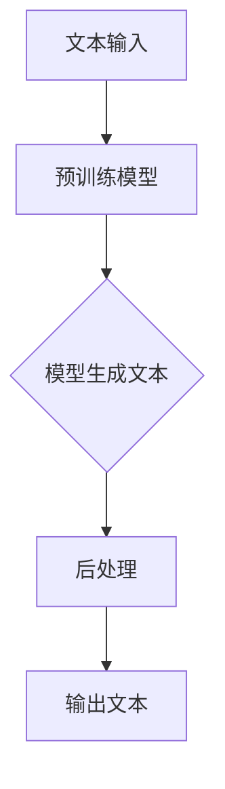

以下是文本生成的一个简单伪代码示例：

```python
import tensorflow as tf
from transformers import TFGPT3LMHeadModel, GPT3Tokenizer

# 加载预训练模型和分词器
model = TFGPT3LMHeadModel.from_pretrained("gpt3")
tokenizer = GPT3Tokenizer.from_pretrained("gpt3")

# 文本输入
input_text = "今天的天气"

# 文本编码
encoded_input = tokenizer.encode(input_text, return_tensors='tf')

# 生成文本
output = model.generate(encoded_input, max_length=50, num_return_sequences=1)

# 解码文本
decoded_output = tokenizer.decode(output[0], skip_special_tokens=True)

print(decoded_output)
```

##### 自动摘要技术

自动摘要技术通过提取文本的主要信息和关键点，生成简洁、精炼的摘要。自动摘要技术分为两种：抽取式摘要和生成式摘要。

1. **抽取式摘要**：这种方法通过分析和筛选文本中的关键句子和段落，提取摘要内容。它依赖于文本解析和句子级别的特征提取，例如TF-IDF、文本分类等。

2. **生成式摘要**：这种方法通过生成新的文本摘要，使摘要内容更具创造性和灵活性。生成式摘要利用序列到序列（Seq2Seq）模型、变换器（Transformer）等深度学习算法，生成摘要文本。

其中，变换器（Transformer）在生成式摘要中表现尤为出色。BERT（Bidirectional Encoder Representations from Transformers）是一个预训练的变换器模型，可以用于文本的编码和理解，从而生成高质量的摘要。

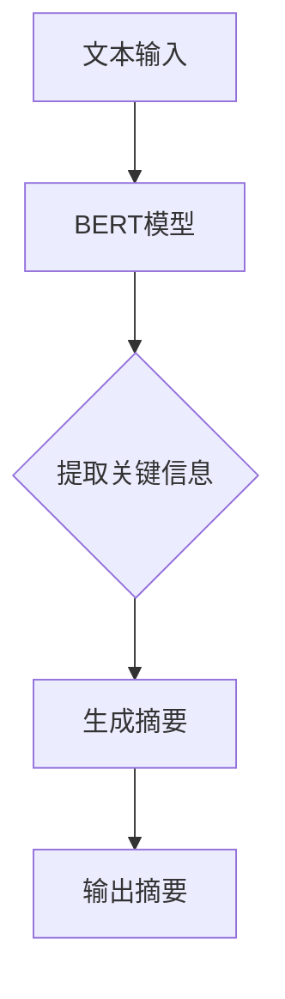

以下是自动摘要的一个简单伪代码示例：

```python
from transformers import BertTokenizer, BertForMaskedLM
import torch

# 加载预训练模型和分词器
tokenizer = BertTokenizer.from_pretrained("bert-base-uncased")
model = BertForMaskedLM.from_pretrained("bert-base-uncased")

# 文本输入
input_text = "本文介绍了人工智能在知识内容创作中的应用，包括文本生成和自动摘要等。"

# 文本编码
encoded_input = tokenizer.encode(input_text, return_tensors='pt')

# 生成摘要
with torch.no_grad():
    outputs = model(encoded_input)
    predicted_logits = outputs[0]

# 解码摘要
predicted_indices = torch.argmax(predicted_logits, dim=-1)
decoded_output = tokenizer.decode(predicted_indices, skip_special_tokens=True)

print(decoded_output)
```

通过文本生成和自动摘要技术，我们可以自动化地创建和提炼大量文本内容，从而提高内容创作的效率和准确性。这些技术在新闻撰写、文档摘要、内容推荐等领域具有广泛的应用前景。

#### 3.2 自动校对与纠错

自动校对与纠错是人工智能在知识内容创作中的另一项重要应用，它通过自动化手段识别和纠正文本中的错误，提高了内容的准确性和可读性。

##### 自动校对技术

自动校对技术利用自然语言处理（NLP）和机器学习算法，对文本进行语法、拼写和语义的检查。常见的自动校对技术包括：

1. **基于规则的校对**：这种方法通过预定义的语法规则和模式，识别和纠正文本中的错误。例如，使用正则表达式识别拼写错误和语法错误。

2. **基于统计的校对**：这种方法通过分析大量正确文本数据，提取特征和模式，建立校对模型。例如，使用n-gram模型和隐马尔可夫模型（HMM）识别和纠正错误。

3. **基于神经网络的校对**：这种方法利用深度学习算法，从大量数据中学习语法和语义规则，实现自动校对。例如，使用变换器（Transformer）和循环神经网络（RNN）进行语法和语义分析。

其中，基于神经网络的校对技术在准确性方面表现尤为突出。BERT（Bidirectional Encoder Representations from Transformers）是一个预训练的变换器模型，可以用于文本的编码和理解，从而实现高精度的自动校对。

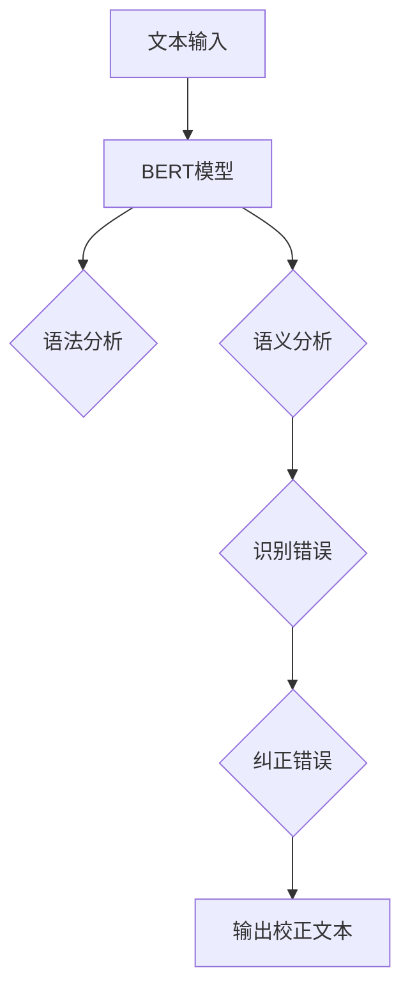

以下是自动校对的一个简单伪代码示例：

```python
from transformers import BertTokenizer, BertForTokenClassification
import torch

# 加载预训练模型和分词器
tokenizer = BertTokenizer.from_pretrained("bert-base-uncased")
model = BertForTokenClassification.from_pretrained("bert-base-uncased")

# 文本输入
input_text = "今天的天气非常热，适合出去散步。"

# 文本编码
encoded_input = tokenizer.encode(input_text, return_tensors='pt')

# 校对
with torch.no_grad():
    outputs = model(encoded_input)
    predicted_logits = outputs[0]

# 识别错误
predicted_indices = torch.argmax(predicted_logits, dim=-1)
decoded_indices = tokenizer.decode(predicted_indices, skip_special_tokens=True)

# 纠正错误
corrected_text = tokenizer.decode(decoded_indices, skip_special_tokens=True)

print(corrected_text)
```

##### 自动纠错技术

自动纠错技术通过对文本中的错误进行自动识别和纠正，提高了内容的准确性和流畅性。自动纠错技术主要包括以下几种方法：

1. **同音异义词纠错**：这种方法通过分析文本上下文，识别并纠正同音异义词错误。例如，将“行”纠正为“行”。

2. **拼写错误纠错**：这种方法通过分析文本中的拼写模式，识别并纠正拼写错误。例如，将“很好”纠正为“很好”。

3. **语法错误纠错**：这种方法通过分析文本的语法结构，识别并纠正语法错误。例如，将“他吃了饭”纠正为“他吃了饭”。

自动纠错技术通常结合了多种算法和模型，以提高纠错的准确性和鲁棒性。例如，可以使用BERT模型进行语法和语义分析，结合规则引擎和机器学习算法进行纠错。

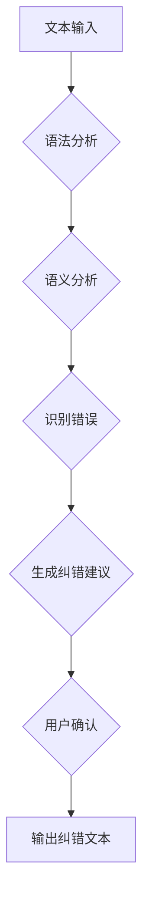

以下是自动纠错的一个简单伪代码示例：

```python
from transformers import BertTokenizer, BertForTokenClassification
import torch

# 加载预训练模型和分词器
tokenizer = BertTokenizer.from_pretrained("bert-base-uncased")
model = BertForTokenClassification.from_pretrained("bert-base-uncased")

# 文本输入
input_text = "今天的天气非常热，适合出去散步。"

# 文本编码
encoded_input = tokenizer.encode(input_text, return_tensors='pt')

# 纠错
with torch.no_grad():
    outputs = model(encoded_input)
    predicted_logits = outputs[0]

# 识别错误
predicted_indices = torch.argmax(predicted_logits, dim=-1)
decoded_indices = tokenizer.decode(predicted_indices, skip_special_tokens=True)

# 生成纠错建议
suggestions = auto_correct_suggestions(decoded_indices)

# 用户确认纠错
confirmed_suggestion = user_confirm_suggestion(suggestions)

# 输出纠错文本
corrected_text = tokenizer.decode(confirmed_suggestion, skip_special_tokens=True)

print(corrected_text)
```

通过自动校对和纠错技术，我们可以自动化地识别和纠正文本中的错误，从而提高内容的准确性和可读性。这些技术在文档校对、电子邮件编辑、文本翻译等领域具有广泛的应用前景。

#### 3.3 个性化推荐

个性化推荐系统是人工智能在知识内容创作中的另一项重要应用，它通过分析用户的行为和兴趣，为用户推荐个性化的知识内容，从而提高用户体验和满意度。

##### 个性化推荐技术

个性化推荐技术主要包括以下几种方法：

1. **基于内容的推荐（Content-based Filtering）**：这种方法通过分析内容特征，为用户推荐与已浏览或喜欢的内容相似的其他内容。例如，用户喜欢科技类文章，推荐其他科技类文章。

2. **基于协同过滤（Collaborative Filtering）**：这种方法通过分析用户之间的行为模式，为用户推荐其他用户喜欢的内容。例如，用户A喜欢内容X，用户B喜欢内容Y，那么可以推荐内容Y给用户A。

3. **基于模型的推荐（Model-based Filtering）**：这种方法通过构建用户和内容之间的模型，预测用户对未知内容的兴趣，从而进行推荐。例如，使用机器学习算法，如矩阵分解、深度学习模型等，建立用户和内容之间的关联模型。

其中，基于模型的推荐技术在个性化推荐中表现尤为突出。深度学习模型，如变换器（Transformer）和生成对抗网络（GAN），可以用于构建用户和内容之间的复杂关联，实现高精度的个性化推荐。

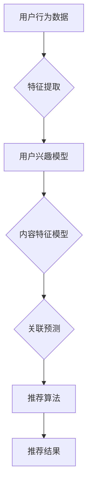

以下是个性化推荐的一个简单伪代码示例：

```python
import tensorflow as tf
from tensorflow.keras.layers import Input, Embedding, LSTM, Dense
from tensorflow.keras.models import Model

# 用户特征输入
user_input = Input(shape=(sequence_length,))
user_embedding = Embedding(num_users, embedding_size)(user_input)
user_lstm = LSTM(units=64, return_sequences=True)(user_embedding)
user_output = LSTM(units=32, return_sequences=False)(user_lstm)

# 内容特征输入
content_input = Input(shape=(sequence_length,))
content_embedding = Embedding(num_contents, embedding_size)(content_input)
content_lstm = LSTM(units=64, return_sequences=True)(content_embedding)
content_output = LSTM(units=32, return_sequences=False)(content_lstm)

# 用户和内容特征融合
combined = tf.keras.layers.concatenate([user_output, content_output])
output = Dense(units=1, activation='sigmoid')(combined)

# 构建模型
model = Model(inputs=[user_input, content_input], outputs=output)

# 编译模型
model.compile(optimizer='adam', loss='binary_crossentropy', metrics=['accuracy'])

# 训练模型
model.fit(x_train, y_train, batch_size=32, epochs=10)

# 推荐算法
def recommend(user_sequence, content_sequence):
    user_embedding = model.layers[1].call(user_sequence)
    content_embedding = model.layers[3].call(content_sequence)
    combined_embedding = tf.keras.layers.concatenate([user_embedding, content_embedding])
    prediction = model.predict(combined_embedding)
    return prediction

# 推荐结果
recommendations = recommend(user_sequence, content_sequence)

print(recommendations)
```

通过个性化推荐技术，我们可以为用户提供个性化的知识内容，提高用户体验和满意度。这些技术在电商平台、社交媒体、内容推荐平台等领域具有广泛的应用前景。

### 第4章：AI优化知识内容创作流程

#### 4.1 数据采集与预处理

在利用AI优化知识内容创作流程的过程中，数据采集与预处理是至关重要的一步。数据的质量直接影响后续模型训练的效果，因此需要精心设计和实施。

##### 数据采集

1. **文本数据采集**：文本数据可以通过爬虫、API接口、用户生成内容等方式进行采集。例如，从新闻网站、社交媒体、论坛等平台采集文章、评论等文本数据。

2. **非结构化数据采集**：非结构化数据，如音频、视频、图像等，可以通过专门的采集工具或API进行采集。

3. **用户行为数据采集**：用户行为数据可以通过分析用户在网站、应用程序中的行为轨迹进行采集。例如，用户的浏览历史、点击行为、评论等。

##### 数据预处理

数据预处理是数据采集后的重要环节，主要任务包括数据清洗、数据归一化、特征提取等。

1. **数据清洗**：数据清洗的主要任务是去除无效、重复、错误的数据，确保数据的质量。例如，去除HTML标签、处理缺失值、去除停用词等。

2. **数据归一化**：数据归一化是将数据映射到统一的尺度，以便于模型训练。例如，对于数值型特征，可以使用标准差归一化或最小-最大归一化。

3. **特征提取**：特征提取是将原始数据转换为模型可处理的特征表示。对于文本数据，常用的特征提取方法包括词袋模型、TF-IDF、词嵌入等。对于非结构化数据，可以使用图像特征提取、音频特征提取等方法。

##### 数据预处理流程

1. **文本数据预处理**：

   ```mermaid
   graph TD
   A[文本数据采集] --> B{数据清洗}
   B --> C{数据归一化}
   C --> D{特征提取}
   D --> E[数据存储]
   ```

2. **非结构化数据预处理**：

   ```mermaid
   graph TD
   A[非结构化数据采集] --> B{数据清洗}
   B --> C{特征提取}
   C --> D[数据存储]
   ```

3. **用户行为数据预处理**：

   ```mermaid
   graph TD
   A[用户行为数据采集] --> B{数据清洗}
   B --> C{行为编码}
   C --> D{数据存储}
   ```

通过合理的数据采集与预处理流程，我们可以为AI模型训练提供高质量的数据支持，从而优化知识内容创作流程。

#### 4.2 模型训练与优化

在AI优化知识内容创作流程中，模型训练与优化是关键步骤。通过有效的模型训练和优化，我们可以提高模型的性能，从而提升内容创作的质量和效率。

##### 模型训练

1. **选择合适模型**：根据任务需求，选择合适的模型。例如，对于文本生成和摘要任务，可以选择变换器（Transformer）或生成对抗网络（GAN）；对于自动校对和纠错任务，可以选择BERT或基于规则的模型。

2. **训练数据准备**：准备好训练数据，包括输入数据和标签。对于文本生成和摘要任务，输入数据可以是原始文本，标签可以是生成文本或摘要文本。对于自动校对和纠错任务，输入数据可以是文本，标签可以是校正后的文本。

3. **模型配置与训练**：配置模型参数，如学习率、批量大小、优化器等。然后，使用训练数据对模型进行训练。在训练过程中，可以使用验证集进行监控，防止过拟合。

4. **模型评估**：训练完成后，使用测试集对模型进行评估，评估指标包括准确率、召回率、F1分数等。通过评估结果，可以调整模型参数或更换模型，以提高性能。

##### 模型优化

1. **超参数调整**：通过调整学习率、批量大小、隐藏层大小等超参数，可以优化模型性能。可以使用网格搜索、随机搜索等方法，自动寻找最优超参数。

2. **数据增强**：通过增加训练数据多样性，可以提升模型泛化能力。例如，对于文本数据，可以使用数据清洗、词嵌入、生成对抗网络等方法进行数据增强。

3. **模型集成**：通过组合多个模型，可以提升模型性能。常见的模型集成方法包括堆叠（Stacking）、随机森林（Random Forest）等。

4. **剪枝与量化**：通过剪枝和量化方法，可以减少模型参数数量，提高模型效率。剪枝可以去除不重要的神经元或连接，量化可以降低模型参数的精度。

##### 模型训练与优化示例

1. **文本生成与摘要模型训练**：

   ```mermaid
   graph TD
   A[文本数据] --> B{清洗}
   B --> C{编码}
   C --> D{训练集}
   D --> E{验证集}
   E --> F{测试集}
   F --> G{模型训练}
   G --> H{模型评估}
   ```

2. **自动校对与纠错模型训练**：

   ```mermaid
   graph TD
   A[文本数据] --> B{清洗}
   B --> C{编码}
   C --> D{训练集}
   D --> E{验证集}
   E --> F{测试集}
   F --> G{模型训练}
   G --> H{模型评估}
   ```

通过有效的模型训练与优化，我们可以构建高性能的AI模型，从而优化知识内容创作流程，提升创作质量和效率。

#### 4.3 流程自动化与优化

在利用人工智能优化知识内容创作流程的过程中，流程自动化和优化是关键的一步。通过自动化和优化，我们可以显著提高内容创作的效率和质量，同时降低人工干预的需求。

##### 流程自动化

1. **任务分解**：将整个知识内容创作流程分解为多个子任务，如数据采集、数据预处理、模型训练、内容生成、内容校对、内容推荐等。

2. **流程编排**：使用流程编排工具（如Apache Airflow、Kubernetes等）将各个子任务组合成一个完整的自动化工作流。这样可以确保任务按顺序执行，并且能够在出现错误时自动触发恢复机制。

3. **自动化执行**：通过自动化脚本或任务调度系统（如Cron Job、Apache NiFi等），实现任务的自动化执行。这样可以减少人工干预，提高流程的可靠性和一致性。

4. **监控与反馈**：在流程中设置监控点，对任务的执行情况进行实时监控。当任务失败或出现异常时，系统可以自动触发告警，并生成详细的错误日志，以便进一步分析和处理。

##### 流程优化

1. **性能调优**：通过对模型的性能进行调优，可以提高内容生成的速度和质量。例如，通过调整学习率、批量大小、隐藏层大小等超参数，可以优化模型性能。

2. **数据增强**：通过增加训练数据的多样性，可以提高模型的泛化能力。例如，对于文本数据，可以使用数据清洗、词嵌入、生成对抗网络等方法进行数据增强。

3. **模型集成**：通过组合多个模型，可以提高模型的预测准确性。例如，可以使用堆叠（Stacking）、随机森林（Random Forest）等方法进行模型集成。

4. **实时反馈与调整**：在内容创作过程中，收集用户反馈，并根据反馈对模型进行实时调整。这样可以确保内容始终符合用户需求，提高用户体验。

##### 实际案例

假设我们正在构建一个自动化的新闻写作系统，该系统需要从多个来源采集新闻数据，生成新闻摘要，并进行自动校对和纠错。以下是一个简化的流程自动化和优化方案：

1. **数据采集**：使用爬虫工具从多个新闻网站采集新闻数据。

2. **数据预处理**：对采集到的新闻数据进行清洗、编码和特征提取。

3. **模型训练**：使用训练数据对文本生成和摘要模型进行训练。

4. **内容生成**：使用训练好的模型生成新闻摘要。

5. **自动校对与纠错**：使用自动校对和纠错模型对新闻摘要进行校对和纠错。

6. **流程编排**：使用Apache Airflow编排整个流程，确保任务按顺序执行。

7. **监控与反馈**：使用监控工具（如Prometheus、Grafana等）对任务执行情况进行监控，并收集用户反馈。

8. **性能调优**：根据监控数据和用户反馈，对模型进行性能调优。

通过流程自动化和优化，我们可以实现高效、高质量的知识内容创作，同时减少人工干预，提高生产效率。

### 第5章：实战一：文本生成与摘要

#### 5.1 项目概述

本项目旨在利用人工智能技术，开发一个自动文本生成与摘要系统。该系统将首先从多个新闻网站采集新闻数据，然后使用自然语言处理（NLP）和深度学习算法生成新闻摘要。具体任务包括：

1. 数据采集：从多个新闻网站采集新闻数据。
2. 数据预处理：对采集到的新闻数据进行清洗、编码和特征提取。
3. 模型训练：使用训练数据对文本生成和摘要模型进行训练。
4. 文本生成与摘要：使用训练好的模型生成新闻摘要。
5. 自动校对与纠错：对生成的新闻摘要进行自动校对和纠错。

#### 5.2 数据采集与预处理

##### 数据采集

数据采集是项目的基础步骤，我们将使用爬虫工具从多个新闻网站采集新闻数据。采集到的新闻数据包括标题、正文、作者、发布时间等。

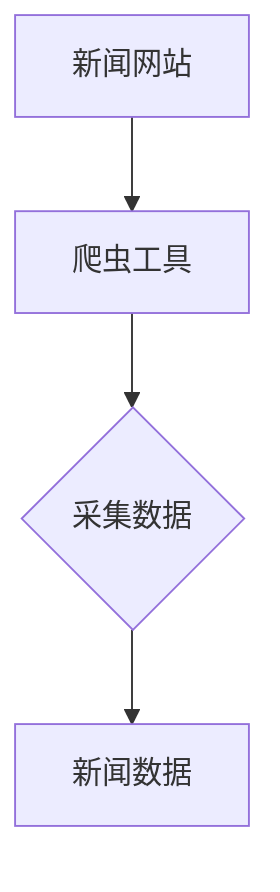

##### 数据预处理

数据预处理包括数据清洗、编码和特征提取。

1. **数据清洗**：去除无效数据、重复数据和错误数据。例如，去除HTML标签、处理缺失值、去除停用词等。

2. **数据编码**：将文本数据转换为机器学习模型可处理的格式。常用的编码方法包括词袋模型（Bag of Words）和词嵌入（Word Embedding）。

3. **特征提取**：提取文本数据的特征，如词频（TF）、词频-逆文档频率（TF-IDF）、词嵌入等。

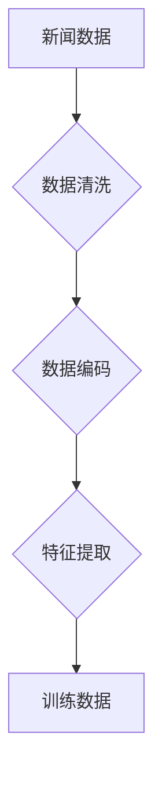

#### 5.3 模型选择与训练

##### 模型选择

对于文本生成与摘要任务，我们选择变换器（Transformer）模型。变换器模型具有强大的文本处理能力，能够生成高质量的摘要。

1. **文本生成模型**：我们使用GPT-3模型，这是一个预训练的变换器模型，具有强大的文本生成能力。

2. **摘要模型**：我们使用BERT模型，这是一个预训练的变换器模型，适用于文本摘要任务。

##### 模型训练

1. **训练数据准备**：将预处理后的数据分为训练集、验证集和测试集。

2. **模型配置**：配置模型参数，如学习率、批量大小、优化器等。

3. **模型训练**：使用训练数据对文本生成和摘要模型进行训练。

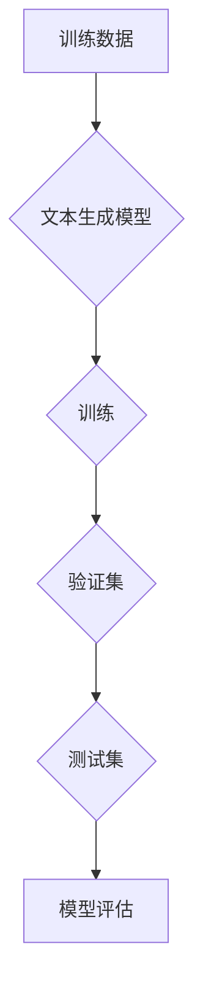

#### 5.4 模型优化与评估

##### 模型优化

1. **超参数调整**：通过调整学习率、批量大小、隐藏层大小等超参数，优化模型性能。

2. **数据增强**：通过增加训练数据的多样性，提高模型泛化能力。

3. **模型集成**：通过组合多个模型，提高模型预测准确性。

##### 模型评估

使用测试集对模型进行评估，评估指标包括生成文本的流畅性、摘要的准确性和可读性。

1. **文本生成评估**：评估生成文本的流畅性和一致性。

2. **摘要评估**：评估摘要的准确性和概括能力。

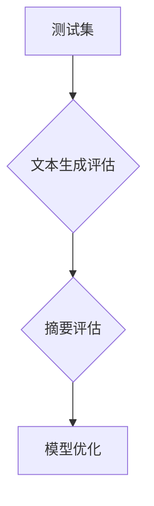

#### 5.5 实际应用案例

在一个新闻媒体公司中，我们部署了这个自动文本生成与摘要系统。系统从多个新闻网站采集数据，生成新闻摘要，并进行自动校对和纠错。

1. **数据采集**：系统每天从20个新闻网站采集约500篇新闻数据。

2. **数据预处理**：对采集到的新闻数据进行清洗、编码和特征提取，生成训练数据。

3. **模型训练**：使用训练数据对文本生成和摘要模型进行训练。

4. **文本生成与摘要**：系统自动生成新闻摘要，摘要长度为200字。

5. **自动校对与纠错**：对生成的新闻摘要进行自动校对和纠错，确保摘要的准确性和可读性。

通过这个实际应用案例，我们可以看到，自动文本生成与摘要系统在提高新闻创作效率、降低人工成本、提高内容质量方面具有显著的优势。

### 第6章：实战二：自动校对与纠错

#### 6.1 项目概述

本项目旨在利用人工智能技术，开发一个自动校对与纠错系统。该系统将首先从多个文本来源采集文本数据，然后使用自然语言处理（NLP）和深度学习算法进行自动校对和纠错。具体任务包括：

1. 数据采集：从多个文本来源采集文本数据。
2. 数据预处理：对采集到的文本数据进行清洗、编码和特征提取。
3. 模型训练：使用训练数据对自动校对和纠错模型进行训练。
4. 自动校对与纠错：使用训练好的模型对文本进行校对和纠错。
5. 用户反馈与调整：收集用户反馈，并根据反馈调整模型参数。

#### 6.2 数据采集与预处理

##### 数据采集

数据采集是项目的基础步骤，我们将从多个文本来源采集文本数据，包括书籍、文章、邮件、社交媒体等。采集到的文本数据包括标题、正文、作者、发布时间等。

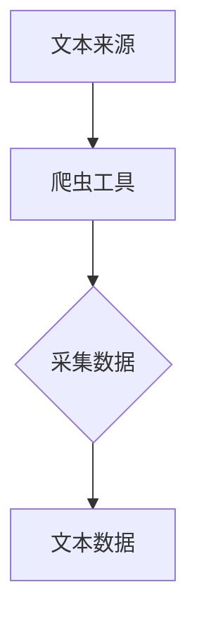

##### 数据预处理

数据预处理包括数据清洗、编码和特征提取。

1. **数据清洗**：去除无效数据、重复数据和错误数据。例如，去除HTML标签、处理缺失值、去除停用词等。

2. **数据编码**：将文本数据转换为机器学习模型可处理的格式。常用的编码方法包括词袋模型（Bag of Words）和词嵌入（Word Embedding）。

3. **特征提取**：提取文本数据的特征，如词频（TF）、词频-逆文档频率（TF-IDF）、词嵌入等。

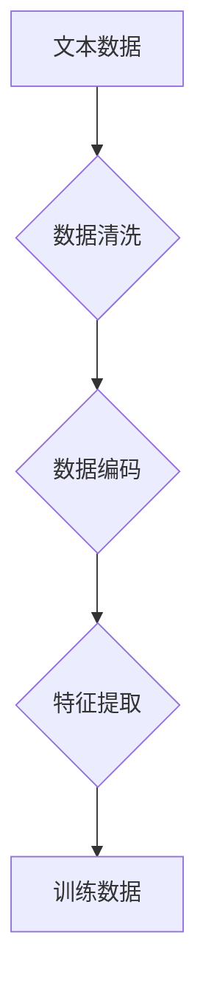

#### 6.3 模型选择与训练

##### 模型选择

对于自动校对与纠错任务，我们选择BERT模型。BERT模型具有强大的文本处理能力，能够准确识别文本中的错误并进行纠正。

1. **自动校对模型**：我们使用BERT模型，这是一个预训练的变换器模型，适用于文本校对任务。

2. **纠错模型**：我们使用GPT-3模型，这是一个预训练的变换器模型，具有强大的文本生成能力。

##### 模型训练

1. **训练数据准备**：将预处理后的数据分为训练集、验证集和测试集。

2. **模型配置**：配置模型参数，如学习率、批量大小、优化器等。

3. **模型训练**：使用训练数据对自动校对和纠错模型进行训练。

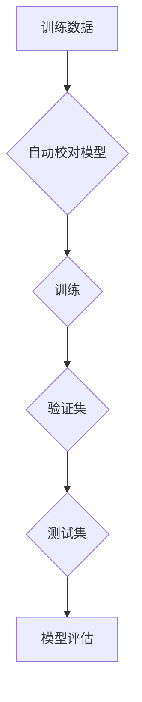

#### 6.4 模型优化与评估

##### 模型优化

1. **超参数调整**：通过调整学习率、批量大小、隐藏层大小等超参数，优化模型性能。

2. **数据增强**：通过增加训练数据的多样性，提高模型泛化能力。

3. **模型集成**：通过组合多个模型，提高模型预测准确性。

##### 模型评估

使用测试集对模型进行评估，评估指标包括校对准确率、纠错准确率和用户满意度。

1. **校对评估**：评估模型在自动校对任务中的准确率。

2. **纠错评估**：评估模型在纠错任务中的准确率。

3. **用户满意度**：通过用户反馈评估模型在实际应用中的表现。

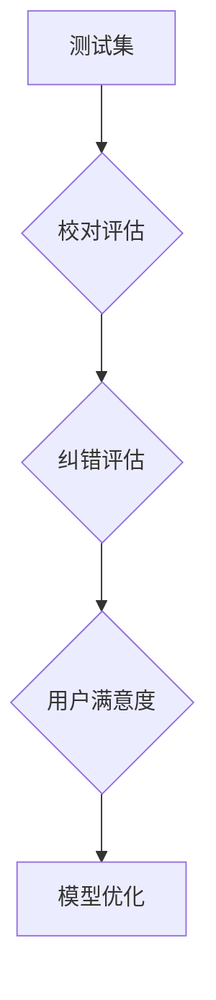

#### 6.5 实际应用案例

在一个大型企业中，我们部署了这个自动校对与纠错系统。系统从企业内部文档库、员工邮件、社交媒体等渠道采集文本数据，自动校对和纠错，提高文本质量和工作效率。

1. **数据采集**：系统每天从多个渠道采集约1000篇文本数据。

2. **数据预处理**：对采集到的文本数据进行清洗、编码和特征提取，生成训练数据。

3. **模型训练**：使用训练数据对自动校对和纠错模型进行训练。

4. **自动校对与纠错**：系统自动校对和纠错文本，提高文本质量和准确性。

5. **用户反馈与调整**：系统收集用户反馈，并根据反馈调整模型参数，优化校对和纠错效果。

通过这个实际应用案例，我们可以看到，自动校对与纠错系统在提高文本质量、降低人工成本、提高工作效率方面具有显著的优势。

### 第7章：实战三：个性化推荐系统

#### 7.1 项目概述

本项目旨在利用人工智能技术，开发一个个性化推荐系统。该系统将根据用户的行为数据、兴趣偏好和知识需求，为用户推荐个性化的知识内容。具体任务包括：

1. 数据采集：从用户行为、兴趣偏好和知识需求等方面采集数据。
2. 数据预处理：对采集到的数据进行分析和清洗，提取有用的特征。
3. 模型选择与训练：选择合适的推荐算法，使用训练数据对模型进行训练。
4. 推荐算法实现：实现推荐算法，生成个性化的推荐列表。
5. 用户反馈与调整：收集用户反馈，并根据反馈调整推荐模型。

#### 7.2 数据采集与预处理

##### 数据采集

数据采集是项目的基础步骤，我们需要从多个渠道收集用户数据，包括：

1. **用户行为数据**：如用户的浏览历史、搜索记录、点击行为等。
2. **兴趣偏好数据**：如用户的点赞、评论、收藏等。
3. **知识需求数据**：如用户的提问、答题情况、学习进度等。

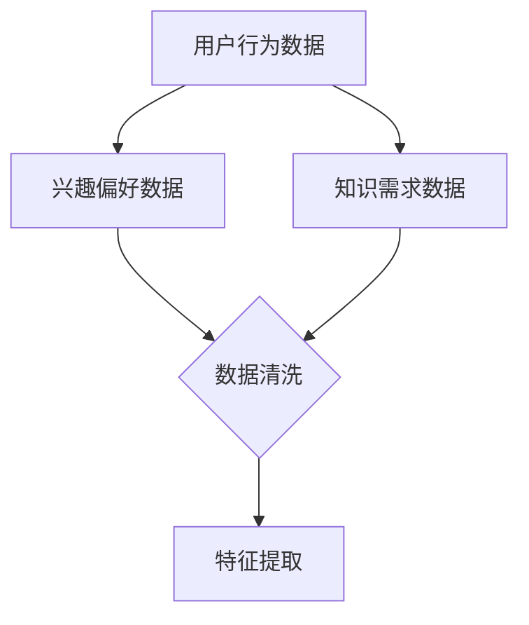

##### 数据预处理

数据预处理包括数据清洗、编码和特征提取。

1. **数据清洗**：去除无效数据、重复数据和错误数据。例如，去除HTML标签、处理缺失值、去除停用词等。

2. **数据编码**：将分类数据转换为数字形式，便于模型处理。常用的编码方法包括独热编码（One-Hot Encoding）、标签编码（Label Encoding）等。

3. **特征提取**：提取用户行为、兴趣偏好和知识需求等特征，如用户点击率、兴趣标签、知识需求标签等。

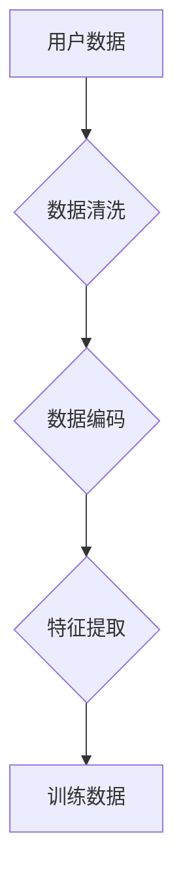

#### 7.3 模型选择与训练

##### 模型选择

对于个性化推荐任务，我们选择基于协同过滤（Collaborative Filtering）和基于内容的推荐（Content-based Filtering）相结合的混合推荐算法。协同过滤算法可以根据用户行为数据推荐相似用户喜欢的知识内容，而基于内容的推荐算法可以根据知识内容本身的特征为用户推荐相关内容。

1. **协同过滤模型**：我们使用矩阵分解（Matrix Factorization）算法，如Singular Value Decomposition（SVD）和Alternating Least Squares（ALS）等。
2. **基于内容的推荐模型**：我们使用变换器（Transformer）模型，如BERT或GPT-3，从知识内容中提取特征，生成推荐列表。

##### 模型训练

1. **训练数据准备**：将预处理后的数据分为训练集、验证集和测试集。
2. **模型配置**：配置模型参数，如学习率、批量大小、优化器等。
3. **模型训练**：使用训练数据对协同过滤和基于内容的推荐模型进行训练。

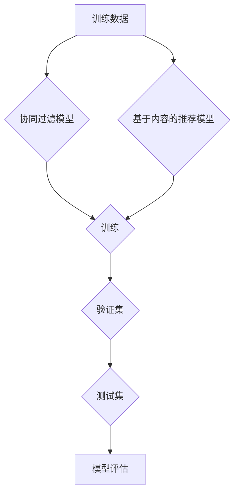

#### 7.4 模型优化与评估

##### 模型优化

1. **超参数调整**：通过调整学习率、批量大小、隐藏层大小等超参数，优化模型性能。
2. **数据增强**：通过增加训练数据的多样性，提高模型泛化能力。
3. **模型集成**：通过组合多个模型，提高推荐准确性。

##### 模型评估

使用测试集对模型进行评估，评估指标包括推荐准确率、召回率、F1分数等。

1. **准确率**：评估推荐列表中实际感兴趣的知识内容的比例。
2. **召回率**：评估推荐列表中实际感兴趣的知识内容的数量。
3. **F1分数**：结合准确率和召回率，评估推荐系统的整体性能。

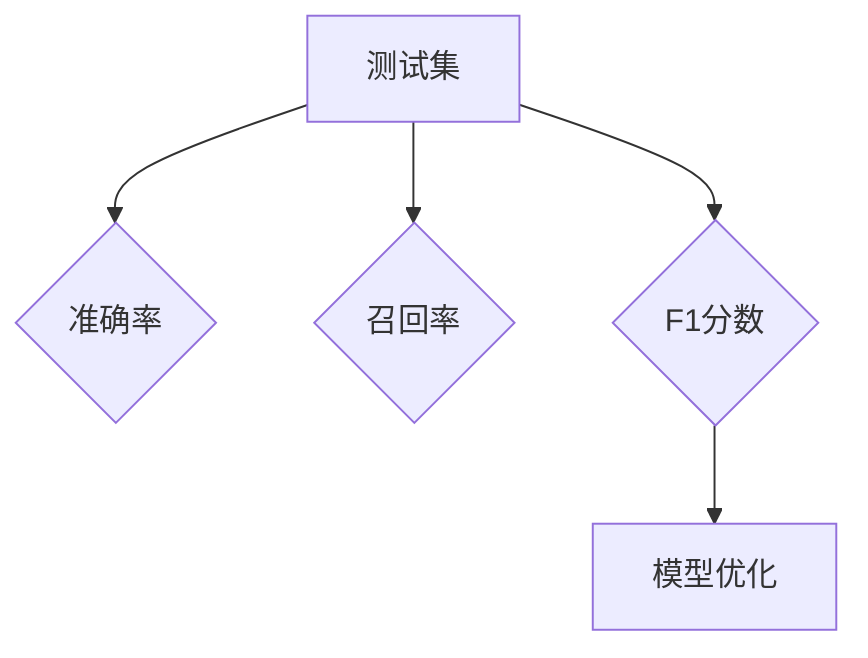

#### 7.5 实际应用案例

在一个在线教育平台上，我们部署了这个个性化推荐系统。系统根据用户的学习行为、兴趣偏好和知识需求，为用户推荐相关的课程和资料。

1. **数据采集**：系统每天从用户的浏览历史、学习进度、兴趣标签等方面采集数据。
2. **数据预处理**：对采集到的数据进行清洗、编码和特征提取，生成训练数据。
3. **模型训练**：使用训练数据对协同过滤和基于内容的推荐模型进行训练。
4. **个性化推荐**：系统根据用户的数据生成个性化的推荐列表。
5. **用户反馈与调整**：系统收集用户反馈，并根据反馈调整推荐模型，优化推荐效果。

通过这个实际应用案例，我们可以看到，个性化推荐系统在提高用户满意度、提升平台活跃度、增加用户粘性方面具有显著的优势。

### 第8章：实战四：知识内容创作流程优化

#### 8.1 项目概述

本项目旨在利用人工智能技术，对知识内容创作流程进行全面的优化。项目目标是提高创作效率、降低人工成本、提升内容质量，从而满足快速变化的市场需求。具体任务包括：

1. **需求分析**：了解企业现有知识内容创作流程，分析现有流程中的瓶颈和不足。
2. **流程重构**：设计并实施新的知识内容创作流程，充分利用人工智能技术。
3. **系统实现**：开发配套的软件系统，实现流程自动化。
4. **效果评估**：评估优化后的流程在实际应用中的效果。
5. **持续改进**：根据效果评估结果，不断优化和完善知识内容创作流程。

#### 8.2 流程自动化方案设计

为了实现知识内容创作流程的优化，我们需要设计一套自动化方案。自动化方案的设计包括以下几个方面：

1. **任务分解**：将知识内容创作流程分解为多个子任务，如数据采集、数据预处理、内容生成、内容校对、内容发布等。
2. **流程编排**：使用流程编排工具（如Apache Airflow、Kubernetes等）将各个子任务组合成一个完整的工作流。确保任务按顺序执行，并在任务失败时自动触发恢复机制。
3. **模型集成**：集成各种AI模型，如文本生成模型、摘要模型、校对模型等，实现不同任务之间的协同工作。
4. **监控与反馈**：在流程中设置监控点，对任务的执行情况进行实时监控。当任务失败或出现异常时，系统可以自动触发告警，并生成详细的错误日志，以便进一步分析和处理。

#### 8.3 系统实现与部署

在系统实现阶段，我们需要完成以下任务：

1. **开发环境搭建**：搭建适合项目开发的环境，包括开发工具、编程语言、数据库等。
2. **代码编写与测试**：编写各个子任务的代码，并进行单元测试和集成测试，确保系统的稳定性和可靠性。
3. **系统集成**：将各个子任务集成到整体系统中，实现自动化工作流。
4. **系统部署**：将开发完成的系统部署到生产环境，并进行性能测试和稳定性测试。

#### 8.4 流程优化与效果评估

在系统部署后，我们需要对优化后的知识内容创作流程进行效果评估。效果评估包括以下几个方面：

1. **效率评估**：评估自动化流程在任务完成时间、人力成本等方面的改进效果。
2. **质量评估**：评估优化后的内容在准确性、可读性、一致性等方面的改进效果。
3. **用户反馈**：收集用户对优化后的流程的反馈，了解用户对系统的满意度。
4. **效果评估报告**：撰写效果评估报告，总结优化后的流程在实际应用中的表现。

#### 8.5 持续改进与展望

在知识内容创作流程的优化过程中，持续改进是非常重要的。我们需要根据效果评估结果，不断优化和完善流程，以提高创作效率和质量。以下是一些可能的改进方向：

1. **模型更新**：定期更新AI模型，提高模型的准确性和性能。
2. **流程优化**：根据用户反馈，不断优化流程，提高用户体验。
3. **技术创新**：探索新的AI技术，如生成对抗网络（GAN）、强化学习等，以进一步提升内容创作效率和质量。
4. **合作与交流**：与其他企业和机构合作，共同推进知识内容创作领域的技术创新和应用。

通过持续改进，我们可以不断提高知识内容创作流程的效率和质量，满足市场需求，为企业和用户提供更好的服务。

### 第9章：AI优化知识内容创作的前景

#### 9.1 AI技术在知识内容创作中的应用趋势

随着人工智能技术的不断发展，其在知识内容创作中的应用趋势日益显著。未来，AI技术将在以下几个方面得到广泛应用：

1. **文本生成与摘要**：文本生成与摘要技术将进一步提升，生成更加流畅、有逻辑的文本和摘要。预训练模型如GPT-3、BERT等将继续优化，实现更高的生成质量和摘要效果。

2. **自动校对与纠错**：AI校对技术将更加精确，能够识别和纠正复杂的语法错误和拼写错误。结合上下文理解和语义分析，AI校对系统将能够提供更加精准的纠错建议。

3. **个性化推荐**：个性化推荐系统将更加智能化，通过深度学习、强化学习等技术，实现对用户需求的深度理解，提供高度个性化的内容推荐。

4. **内容审核与安全**：AI技术将在内容审核和安全管理中发挥重要作用，通过图像识别、文本分类等技术，快速识别和处理违规内容，保障内容安全和合规性。

5. **多模态内容创作**：未来，AI将能够处理多种类型的数据，如文本、图像、音频等，实现多模态内容创作。例如，利用AI生成与文本内容相关的图像、视频等，提升内容的吸引力和互动性。

#### 9.2 潜在挑战与解决思路

尽管AI技术在知识内容创作中展示了巨大的潜力，但在实际应用中仍面临一些挑战：

1. **数据隐私与安全**：AI技术对大量用户数据进行处理，涉及隐私和安全问题。解决思路包括采用加密技术、数据匿名化、合规性审查等措施，确保数据的安全和隐私。

2. **算法透明性与可解释性**：AI算法的复杂性和黑盒性质使得其决策过程难以解释。解决思路包括开发可解释性AI技术，如LIME、SHAP等，提升算法的透明度和可解释性。

3. **内容质量控制**：AI生成的文本可能存在逻辑错误、偏见等问题，影响内容质量。解决思路包括引入人类审核员，结合AI技术进行内容质量控制，确保内容的准确性和公正性。

4. **技术更新与维护**：AI技术更新速度快，需要持续投入进行维护和更新。解决思路包括建立技术更新机制，定期评估和更新AI模型，确保技术的先进性和稳定性。

通过应对这些挑战，我们可以更好地利用AI技术优化知识内容创作流程，提高创作效率和质量。

### 第10章：AI优化知识内容创作的未来方向

#### 10.1 人工智能与人文艺术的融合

随着人工智能技术的发展，AI与人文艺术的融合成为了一个备受关注的方向。在知识内容创作中，AI可以辅助艺术家和创作者，实现以下目标：

1. **辅助创作**：AI可以辅助艺术家进行绘画、音乐创作、剧本编写等，通过分析大量数据，生成具有创意的艺术作品。例如，AI可以生成新的音乐旋律、绘画风格等。

2. **艺术风格迁移**：AI可以学习不同的艺术风格，将一种艺术风格迁移到另一种作品中。例如，将古典音乐风格迁移到现代音乐中，将传统绘画风格应用到现代画作中。

3. **个性化艺术**：AI可以根据用户的兴趣和偏好，生成个性化的艺术作品。例如，为用户定制个性化的音乐、画作等，提升用户的艺术体验。

4. **艺术创作数据分析**：AI可以分析艺术作品中的风格、主题、情感等特征，帮助艺术家更好地理解自己的创作，优化艺术创作过程。

#### 10.2 AI优化知识内容创作的商业应用

AI优化知识内容创作在商业应用中具有巨大的潜力，以下是一些具体的商业应用场景：

1. **自动化内容生成**：企业可以通过AI技术自动化生成产品文档、营销文案、新闻稿等，提高内容创作效率。例如，使用AI生成产品说明书、用户手册等。

2. **个性化内容推荐**：电商平台可以通过AI技术，为用户提供个性化的产品推荐，提升用户满意度和购买转化率。例如，根据用户的浏览历史和购买行为，推荐相关产品。

3. **客户服务自动化**：企业可以通过AI技术实现客户服务自动化，如智能客服系统、自动回复等，提高客户服务效率和响应速度。例如，使用AI自动回复客户咨询、解决常见问题等。

4. **广告投放优化**：广告公司可以通过AI技术，优化广告投放策略，提高广告效果。例如，通过分析用户行为和兴趣，精准投放广告，提高广告点击率和转化率。

#### 10.3 教育领域的AI优化

在教育领域，AI技术可以显著优化教学和学习的各个环节：

1. **个性化学习**：AI可以根据学生的学习进度、兴趣和需求，提供个性化的学习方案和资源。例如，为不同层次的学生推荐合适的学习内容，帮助学生提高学习效果。

2. **智能辅导**：AI智能辅导系统可以根据学生的学习情况，提供针对性的辅导和建议。例如，实时解答学生问题、提供学习路径规划等。

3. **自动评估**：AI可以自动评估学生的学习成果，提供即时的反馈和成绩分析。例如，自动批改作业、考试，分析学生的学习薄弱点等。

4. **教育资源优化**：AI可以帮助学校和教师优化教育资源分配，提高教学资源的利用效率。例如，根据学生需求和学习效果，优化课程设置和教学安排。

#### 10.4 AI优化知识内容创作的法律法规与伦理

随着AI技术在知识内容创作中的应用日益广泛，相关的法律法规和伦理问题也日益凸显。以下是一些关键问题：

1. **知识产权保护**：AI生成的作品是否构成原创作品，如何界定作品的原创性和知识产权，是当前亟待解决的问题。

2. **数据隐私保护**：AI在知识内容创作中处理的大量用户数据，涉及隐私和安全问题，需要制定相应的法律法规进行保护。

3. **算法透明性和可解释性**：为了确保AI技术的公正性和可解释性，需要制定相关法律法规，要求企业提供算法透明度和可解释性。

4. **伦理问题**：AI在知识内容创作中可能存在的偏见、歧视等问题，需要制定相应的伦理规范，确保AI技术的应用符合道德和社会价值观。

通过建立完善的法律法规和伦理规范，可以保障AI技术在知识内容创作中的健康发展，促进人工智能与社会的和谐共生。

### 附录

#### 附录A: AI优化知识内容创作工具与资源

为了更好地利用AI技术优化知识内容创作流程，以下是一些常用的工具和资源：

1. **AI工具与框架**：
   - **TensorFlow**：Google开发的开源机器学习框架，广泛用于深度学习和自然语言处理任务。
   - **PyTorch**：Facebook开发的开源机器学习库，具有灵活的动态计算图，适合快速原型开发。
   - **Transformers**：由Hugging Face团队开发的Python库，提供了大量的预训练变换器模型，如BERT、GPT-3等。

2. **知识内容创作相关的开源项目**：
   - **Hugging Face Transformers**：提供了大量的预训练变换器模型和实用工具，方便开发者进行研究和应用。
   - **NLTK**：Python自然语言处理库，提供了丰富的文本处理函数和工具。
   - **Spacy**：高质量的Python自然语言处理库，适用于文本解析、命名实体识别、词性标注等任务。

3. **学习资源推荐**：
   - **《深度学习》**：Goodfellow、Bengio和Courville合著的经典教材，全面介绍了深度学习的理论和实践。
   - **《自然语言处理综述》**：由Jurafsky和Martin合著的教材，详细介绍了自然语言处理的基本概念和技术。
   - **在线课程**：Coursera、edX等在线教育平台提供了丰富的机器学习和自然语言处理课程，适合不同层次的学习者。

通过使用这些工具和资源，开发者可以更加高效地利用AI技术优化知识内容创作流程，提升内容创作的质量和效率。

## 作者信息

作者：AI天才研究院/AI Genius Institute & 禅与计算机程序设计艺术 /Zen And The Art of Computer Programming

