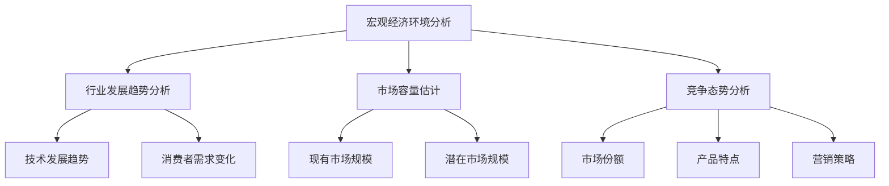
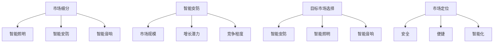
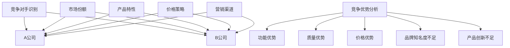
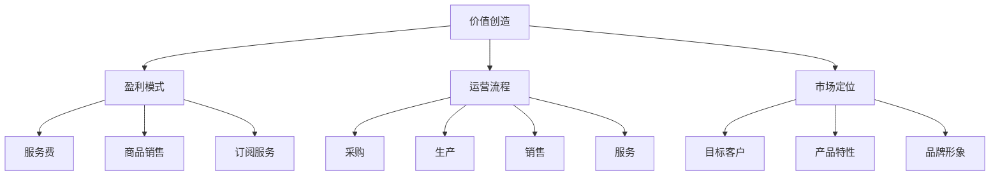

                 

### 文章标题

“制定详细商业计划：业务模式、财务规划和营销策略”

#### 关键词：
- 商业计划
- 业务模式
- 财务规划
- 营销策略
- 市场分析
- 财务模型
- 项目实施
- 团队建设
- 竞争分析
- 收入预测
- 利润分析

#### 摘要：
本文将深入探讨制定详细商业计划的重要性，并详细阐述业务模式、财务规划和营销策略的核心理念与实践方法。通过系统的分析和实例讲解，我们将帮助读者理解商业计划的关键组成部分，掌握商业决策的有效工具，从而提升企业的竞争力和盈利能力。

---

### 目录大纲

1. **商业计划概述**
   1.1 商业计划的重要性
   1.2 制定商业计划的目的
   1.3 商业计划的编写流程
   1.4 商业计划的核心章节
2. **市场分析**
   2.1 市场环境分析
   2.2 目标市场分析
   2.3 竞争对手分析
3. **业务模式设计**
   3.1 业务模式的基本概念
   3.2 业务模式的类型
   3.3 业务模式案例分析
4. **财务规划**
   4.1 财务规划的重要性
   4.2 财务规划的主要内容
   4.3 财务预测与预算
   4.4 财务模型构建
   4.5 财务模型案例分析
5. **营销策略**
   5.1 营销策略概述
   5.2 市场定位
   5.3 产品推广与促销策略
   5.4 营销策略案例分析
6. **商业计划实施与评估**
   6.1 商业计划的实施
   6.2 商业计划的评估与调整
7. **附录**
   7.1 商业计划模板
   7.2 财务模型模板
   7.3 营销策略模板
   7.4 商业计划常见问题及解答
   7.5 参考文献与推荐阅读

### 商业计划概述

商业计划是任何企业成功运营的基础，它不仅为企业提供了清晰的发展蓝图，也为投资者和管理层提供了决策依据。商业计划的重要性主要体现在以下几个方面：

**战略指导**：商业计划为企业制定了长远目标和短期目标，明确了企业的发展方向和策略，帮助企业在竞争激烈的市场中站稳脚跟。

**资源配置**：通过商业计划，企业可以合理安排资源，包括资金、人力和物料等，确保各项业务活动的顺利进行。

**风险管理**：商业计划有助于企业识别潜在的风险，并制定相应的应对措施，降低经营风险。

**融资支持**：商业计划能够清晰地展示企业的盈利前景，吸引投资者，为企业融资提供有力支持。

#### 1.1 商业计划的核心内容

商业计划的核心内容包括：

- **市场分析**：了解市场环境、目标市场和竞争对手，为业务模式设计提供数据支持。
- **业务模式**：明确企业的盈利方式、运营模式和业务流程，确保企业能够持续盈利。
- **财务规划**：预测未来的收入、成本和利润，为投资决策提供依据。
- **营销策略**：制定市场定位、产品推广和促销策略，提高市场占有率。
- **团队建设**：构建高效的团队，确保商业计划的顺利实施。

#### 1.2 制定商业计划的目的

制定商业计划的目的是：

- **明确企业发展方向**：商业计划帮助企业确定长远目标和短期目标，明确发展路径。
- **优化资源配置**：通过商业计划，企业可以合理配置资源，提高运营效率。
- **降低经营风险**：商业计划有助于企业识别潜在风险，并制定应对措施。
- **提升盈利能力**：商业计划为企业提供了详细的财务预测，有助于提升企业的盈利能力。
- **融资支持**：商业计划能够清晰地展示企业的盈利前景，吸引投资者。

#### 1.3 商业计划的编写流程

编写商业计划的流程包括以下步骤：

1. **市场调研**：收集市场数据，了解市场环境、目标市场和竞争对手。
2. **确定业务模式**：根据市场调研结果，设计企业的业务模式。
3. **财务预测**：预测未来的收入、成本和利润，制定财务预算。
4. **营销策略设计**：根据市场定位，制定产品推广和促销策略。
5. **团队建设**：确定团队结构，明确各部门职责和人员配置。
6. **撰写商业计划书**：将上述内容整合成一份完整的商业计划书。
7. **修订与完善**：根据实际情况，对商业计划书进行修订和完善。

#### 1.4 商业计划的核心章节

商业计划书通常包括以下几个核心章节：

- **封面**：包含商业计划书名称、编写单位、编写日期等基本信息。
- **目录**：列出商业计划书各章节标题和页码。
- **摘要**：简要介绍商业计划书的核心内容和主题。
- **市场分析**：详细分析市场环境、目标市场和竞争对手。
- **业务模式**：介绍企业的业务模式、运营模式和盈利方式。
- **财务规划**：预测未来的收入、成本和利润，制定财务预算。
- **营销策略**：制定市场定位、产品推广和促销策略。
- **团队建设**：介绍团队结构、人员配置和岗位职责。
- **实施计划**：制定商业计划的实施步骤和时间表。
- **风险评估**：分析企业面临的潜在风险，并提出应对措施。
- **附录**：提供相关数据、图表和参考资料。

通过以上内容，我们可以看到商业计划是一个系统性、全面性的文件，它不仅为企业的发展提供了战略指导，也为投资者和管理层提供了决策依据。在接下来的章节中，我们将深入探讨商业计划中的市场分析、业务模式设计、财务规划和营销策略等核心内容，帮助读者更好地理解和运用商业计划这一重要工具。

### 市场分析

市场分析是商业计划的重要组成部分，它通过深入了解市场环境、目标市场和竞争对手，为业务模式设计和营销策略制定提供数据支持。有效的市场分析有助于企业发现市场机会，规避潜在风险，从而在激烈的市场竞争中占据有利地位。

#### 2.1 市场环境分析

市场环境分析主要涉及宏观经济环境、行业发展趋势、市场容量和竞争态势等方面。以下是一些关键分析步骤：

1. **宏观经济环境**：分析宏观经济指标，如GDP增长率、通货膨胀率、失业率等，了解整体经济形势对企业的影响。
2. **行业发展趋势**：研究行业报告，掌握行业未来的发展趋势，如新兴技术、消费者需求变化等。
3. **市场容量**：估计目标市场的规模，包括现有市场规模和潜在市场规模。
4. **竞争态势**：分析竞争对手的市场份额、产品定位、营销策略等，了解市场竞争格局。

**实例：** 假设企业计划进入智能家居市场，可以通过以下方式进行市场环境分析：

- **宏观经济环境**：查阅最近几年的GDP增长率、通货膨胀率等指标，了解整体经济形势。
- **行业发展趋势**：研究智能家居行业报告，了解智能家居技术发展趋势和消费者需求变化。
- **市场容量**：通过市场调研和行业报告，估计智能家居市场的规模和增长潜力。
- **竞争态势**：分析当前市场上的主要竞争对手，了解他们的市场份额、产品特点和营销策略。

**核心概念与联系：** 市场环境分析可以借助Mermaid流程图来直观展示各分析步骤及其相互关系，如下图所示：



#### 2.2 目标市场分析

目标市场分析是市场分析的核心环节，旨在确定企业最有可能取得成功的市场细分。以下是一些关键步骤：

1. **市场细分**：根据人口统计、地理、心理和行为特征，将市场划分为若干细分市场。
2. **目标市场选择**：分析各个细分市场的潜在价值和吸引力，选择最具潜力的目标市场。
3. **市场定位**：根据目标市场的特点，确定企业的市场定位和品牌形象。

**实例：** 假设企业选择智能家居市场中的一个细分市场——智能安防，可以通过以下步骤进行目标市场分析：

- **市场细分**：将智能家居市场细分为智能照明、智能安防、智能音响等细分市场。
- **目标市场选择**：分析各个细分市场的市场规模、增长潜力和竞争程度，选择智能安防作为目标市场。
- **市场定位**：将产品定位为安全、便捷、智能化的安防解决方案，以满足目标客户的安全需求。

**核心概念与联系：** 市场细分和目标市场选择可以通过Mermaid流程图来展示，如下图所示：



#### 2.3 竞争对手分析

竞争对手分析是了解市场环境中不可忽视的一环。通过分析竞争对手的市场份额、产品特点、营销策略等，企业可以更好地制定自身策略，提升竞争力。

1. **竞争对手识别**：确定企业的主要竞争对手，包括直接和间接竞争对手。
2. **竞争对手分析**：分析竞争对手的市场份额、产品特性、价格策略、营销渠道等。
3. **竞争优势分析**：评估自身的竞争优势和劣势，制定针对性的改进措施。

**实例：** 假设企业的主要竞争对手是两个智能安防品牌——A公司和B公司，可以通过以下步骤进行竞争对手分析：

- **竞争对手识别**：确定A公司和B公司为智能安防市场的主要竞争对手。
- **竞争对手分析**：分析A公司和B公司的市场份额、产品特性（如功能、质量、价格等）、营销策略（如广告投放、销售渠道等）。
- **竞争优势分析**：评估自身产品在功能、质量、价格等方面的优势，以及可能存在的劣势，如品牌知名度不足、产品创新不足等。

**核心概念与联系：** 竞争对手分析可以通过Mermaid流程图来展示，如下图所示：



通过市场环境分析、目标市场分析和竞争对手分析，企业可以全面了解市场状况，为业务模式设计和营销策略制定提供数据支持。在接下来的章节中，我们将深入探讨业务模式设计、财务规划和营销策略等核心内容，帮助读者更好地理解和运用商业计划这一重要工具。

### 业务模式设计

业务模式设计是商业计划的核心部分，它直接决定了企业的盈利方式、运营效率和竞争力。一个成功的业务模式不仅能够确保企业的持续盈利，还能够为企业在市场中占据有利地位提供有力支持。

#### 3.1 业务模式的基本概念

业务模式是指企业如何创造、传递和获取价值的一种方式。它涵盖了企业的业务目标、盈利方式、运营流程和市场定位等多个方面。以下是业务模式的一些基本概念：

1. **价值创造**：业务模式的核心在于创造价值，这可以通过提供产品或服务来实现。价值创造的方式可以是差异化、成本领先、细分市场等。
2. **盈利模式**：盈利模式是企业获取收入和利润的方式。常见的盈利模式包括销售产品、提供服务、广告收入、订阅模式等。
3. **运营流程**：运营流程是企业将资源转化为产品或服务的具体过程，包括采购、生产、销售、服务等环节。
4. **市场定位**：市场定位是指企业在市场中的位置和形象，包括目标客户群体、产品特性、品牌形象等。

#### 3.2 业务模式的类型

业务模式可以分为以下几种类型：

1. **B2B（Business-to-Business）模式**：这种模式是企业与企业之间的交易，主要特点是大额订单和长期合作。
2. **B2C（Business-to-Consumer）模式**：这种模式是企业与消费者之间的交易，主要特点是大众市场和小额订单。
3. **C2C（Consumer-to-Consumer）模式**：这种模式是消费者与消费者之间的交易，主要特点是个人之间的直接交易。
4. **B2B2C（Business-to-Business-to-Consumer）模式**：这种模式是企业通过平台连接B2B和C2C，实现大规模定制化生产和消费。
5. **订阅模式**：这种模式是通过定期订阅服务来获取收入，主要适用于内容、软件和在线服务等。
6. **分享经济模式**：这种模式是通过共享闲置资源来创造价值，如共享单车、民宿等。

#### 3.3 业务模式案例分析

以下是几个典型的业务模式案例，通过这些案例我们可以更好地理解业务模式的设计和实践：

1. **Airbnb的业务模式**：
   - **价值创造**：通过平台连接房东和旅客，提供短期租赁服务。
   - **盈利模式**：从每笔交易中收取一定比例的服务费。
   - **运营流程**：房东上传房源信息，旅客在线预订，平台提供信任保障和售后服务。
   - **市场定位**：瞄准年轻、追求个性化体验的旅客群体。

2. **亚马逊的业务模式**：
   - **价值创造**：提供广泛的产品选择和便捷的购物体验。
   - **盈利模式**：主要通过商品销售和订阅服务获得收入。
   - **运营流程**：通过仓储、物流和云计算等基础设施支持大规模订单处理和配送。
   - **市场定位**：覆盖全球消费者，提供高质量的购物体验和物流服务。

3. **滴滴出行的业务模式**：
   - **价值创造**：通过平台连接乘客和司机，提供便捷的出行服务。
   - **盈利模式**：从每笔交易中收取一定比例的佣金。
   - **运营流程**：乘客通过APP下单，司机接单并完成服务，平台提供信用保障和售后服务。
   - **市场定位**：覆盖广泛的用户群体，提供安全、高效的出行解决方案。

**核心概念与联系：** 业务模式设计可以借助Mermaid流程图来直观展示各组成部分及其相互关系，如下图所示：



通过以上案例和分析，我们可以看到业务模式设计的重要性。一个成功的业务模式不仅能够为企业带来持续的盈利，还能够帮助企业在市场中脱颖而出。在接下来的章节中，我们将继续探讨财务规划和营销策略等关键内容，帮助读者全面掌握商业计划的核心要素。

### 财务规划

财务规划是商业计划中至关重要的一环，它直接关系到企业的资金流动、盈利能力和长期发展。通过合理的财务规划，企业可以确保资金的有效利用，规避财务风险，实现可持续发展。

#### 5.1 财务规划的重要性

财务规划的重要性主要体现在以下几个方面：

1. **资金管理**：财务规划有助于企业合理分配资金，确保各项业务活动的顺利进行。通过预测未来的资金需求，企业可以提前做好资金安排，避免资金短缺或浪费。
2. **风险控制**：财务规划有助于企业识别潜在的财务风险，并制定相应的风险控制措施。通过合理的预算和财务监控，企业可以及时发现并解决财务问题，确保财务稳定。
3. **决策支持**：财务规划为企业的战略决策提供了重要的数据支持。通过分析财务数据，企业可以评估不同战略方案的可行性，做出更加明智的决策。
4. **投资者信心**：财务规划能够清晰地展示企业的财务状况和未来前景，增加投资者的信心，为企业的融资提供有力支持。

#### 5.2 财务规划的主要内容

财务规划的主要内容包括以下几个方面：

1. **财务预测**：财务预测是财务规划的基础，它通过分析历史数据和当前市场状况，预测未来的收入、成本和利润。财务预测的方法包括定性分析和定量分析，常用的定量预测方法有趋势分析、回归分析和时间序列分析等。
2. **预算编制**：预算编制是将财务预测转化为具体行动计划的过程。通过预算编制，企业可以明确各项开支和收入的预期，确保财务预算的执行。
3. **现金流管理**：现金流管理是确保企业正常运营的关键。通过合理的现金流管理，企业可以确保资金的及时回收和合理使用，避免因资金短缺导致的运营中断。
4. **财务监控**：财务监控是通过定期分析财务报表，监控企业的财务状况和经营绩效。通过财务监控，企业可以及时发现并解决财务问题，确保财务规划的顺利实施。

#### 5.3 财务预测与预算

财务预测与预算是财务规划的核心内容，以下是具体的步骤和方法：

1. **收入预测**：收入预测是财务预测的重要组成部分。通过分析历史收入数据、市场趋势和客户需求，企业可以预测未来的收入。常用的方法有趋势分析法和回归分析法。
   - **趋势分析法**：通过观察历史收入数据的变化趋势，预测未来的收入。
   - **回归分析法**：通过建立收入与相关因素（如销售额、价格、市场占有率等）之间的回归模型，预测未来的收入。

2. **成本预算**：成本预算是预算编制的基础。通过分析历史成本数据、预计价格变动和运营规模，企业可以预测未来的成本。常见的成本预算方法包括增量预算和零基预算。

3. **利润预测**：利润预测是通过收入预测和成本预算，计算未来的利润。利润预测的方法有利润表法和比率分析法。
   - **利润表法**：通过计算收入、成本和利润之间的关系，预测未来的利润。
   - **比率分析法**：通过分析利润率、成本费用率等财务比率，预测未来的利润。

4. **现金流预测**：现金流预测是确保企业资金流动性的关键。通过预测未来一定时期内的现金流入和流出，企业可以合理安排资金，确保现金流的平衡。

**核心算法原理讲解：** 假设我们使用线性回归模型进行收入预测，具体步骤如下：

1. **收集数据**：收集历史收入数据，包括自变量（如销售额、价格等）和因变量（收入）。
2. **数据预处理**：对收集到的数据进行清洗和标准化处理，确保数据的质量和一致性。
3. **建立模型**：使用最小二乘法建立线性回归模型，公式为：
   $$y = \beta_0 + \beta_1 \cdot x_1 + \beta_2 \cdot x_2 + ... + \beta_n \cdot x_n$$
   其中，$y$ 表示收入，$x_1, x_2, ..., x_n$ 表示自变量，$\beta_0, \beta_1, ..., \beta_n$ 表示模型参数。
4. **模型训练**：使用历史数据对模型进行训练，通过最小化误差平方和来确定模型参数。
5. **模型评估**：使用测试数据评估模型的预测效果，确保模型具有良好的预测能力。
6. **收入预测**：使用训练好的模型对未来的收入进行预测。

**伪代码示例：**
```python
import numpy as np

# 收集数据
sales_data = ...
price_data = ...

# 数据预处理
sales_data_processed = preprocess_data(sales_data)
price_data_processed = preprocess_data(price_data)

# 建立模型
model = linear_regression(sales_data_processed, price_data_processed)

# 模型训练
model.fit()

# 模型评估
accuracy = model.evaluate(test_data)

# 收入预测
predicted_income = model.predict(new_sales_data, new_price_data)
```

通过以上步骤和方法，企业可以制定详细的财务预测和预算，为企业的运营和投资提供数据支持。在接下来的章节中，我们将继续探讨财务模型构建和营销策略等关键内容，帮助读者全面掌握商业计划的核心要素。

### 财务模型构建

财务模型是商业计划中的核心工具，它通过数学公式和假设，将企业的财务数据和行为进行量化，以便于预测和分析。构建一个精确且实用的财务模型，可以帮助企业更准确地评估其财务状况，制定合理的投资和经营策略。

#### 7.1 财务模型的基本原理

财务模型的基本原理包括以下几个方面：

1. **输入变量**：财务模型需要输入一系列变量，这些变量可以是定量的，如收入、成本、税率等，也可以是定性的，如市场增长率、客户需求等。
2. **假设条件**：财务模型需要基于一系列假设条件，这些条件可以是基于历史数据，也可以是基于对未来市场的预测。
3. **数学公式**：财务模型通过数学公式将输入变量和假设条件联系起来，生成财务预测结果。常见的数学公式包括收入预测公式、成本预测公式、利润预测公式等。
4. **逻辑关系**：财务模型中的各个部分需要保持逻辑一致性，以确保预测结果的可靠性。

#### 7.2 财务模型的主要指标

财务模型的主要指标包括收入、成本、利润、现金流等。以下是这些指标的基本概念和计算方法：

1. **收入**：收入是财务模型的核心指标之一，它反映了企业在一定时期内通过销售产品或提供服务所获得的收入。收入可以通过以下公式计算：
   $$收入 = 销售额 \times 销售单价$$
2. **成本**：成本是企业在生产和运营过程中发生的各项费用，包括直接成本和间接成本。直接成本与生产直接相关，如原材料成本、人工成本等；间接成本与生产间接相关，如管理费用、研发费用等。成本可以通过以下公式计算：
   $$成本 = 直接成本 + 间接成本$$
3. **利润**：利润是收入减去成本后的余额，它反映了企业的盈利能力。利润可以通过以下公式计算：
   $$利润 = 收入 - 成本$$
4. **现金流**：现金流是企业一定时期内现金流入和流出的净额，它是评估企业资金流动性和财务健康的重要指标。现金流可以通过以下公式计算：
   $$现金流 = 现金收入 - 现金支出$$

#### 7.3 财务模型案例分析

以下是一个简单的财务模型案例，用于预测企业的未来收入和利润。

**案例背景**：某科技公司计划在未来三年内推出一款新产品，预计销售收入为5000万元，成本为3000万元，其中直接成本为2000万元，间接成本为1000万元。假设产品销售单价为1000元，市场需求增长率为10%。

**模型构建**：

1. **输入变量**：
   - 销售单价：1000元
   - 市场需求增长率：10%
   - 成本：3000万元（直接成本2000万元，间接成本1000万元）

2. **假设条件**：
   - 销售收入与市场需求增长呈线性关系
   - 成本保持不变

3. **数学公式**：
   - 收入公式：
     $$收入 = 销售单价 \times 销售量$$
   - 销售量公式：
     $$销售量 = 市场需求 \times （1 + 市场需求增长率）$$
   - 成本公式：
     $$成本 = 直接成本 + 间接成本$$

4. **逻辑关系**：
   - 收入与销售单价和销售量有关
   - 成本与直接成本和间接成本有关
   - 利润等于收入减去成本

**伪代码示例**：
```python
# 输入变量
sales_price = 1000
market_demand_growth = 0.1
direct_cost = 2000
indirect_cost = 1000

# 假设条件
years = 3

# 数学公式
def calculate_income(sales_price, market_demand):
    return sales_price * market_demand

def calculate_sales_volume(market_demand, market_demand_growth):
    return market_demand * (1 + market_demand_growth)

def calculate_cost(direct_cost, indirect_cost):
    return direct_cost + indirect_cost

# 逻辑关系
for year in range(years):
    market_demand = initial_demand * (1 + market_demand_growth ** year)
    sales_volume = calculate_sales_volume(market_demand, market_demand_growth)
    income = calculate_income(sales_price, sales_volume)
    cost = calculate_cost(direct_cost, indirect_cost)
    profit = income - cost
    print(f"第{year+1}年收入为：{income}万元，成本为：{cost}万元，利润为：{profit}万元")
```

通过上述案例，我们可以看到财务模型的基本构建方法和应用步骤。在实际操作中，财务模型可以根据具体业务情况进行调整和优化，以更好地反映企业的财务状况和市场动态。

### 营销策略概述

营销策略是企业为了实现其市场营销目标而制定的行动计划。一个有效的营销策略可以提升品牌知名度、扩大市场份额、增加销售收入，从而为企业带来持续的竞争优势。以下是对营销策略的重要性和类型进行详细阐述。

#### 8.1 营销策略的重要性

营销策略的重要性体现在以下几个方面：

1. **明确市场营销目标**：营销策略可以帮助企业明确其市场营销目标，如增加市场份额、提升品牌形象、提高客户满意度等。明确的目标有助于指导企业制定具体的营销计划和行动。

2. **提升品牌知名度**：通过有效的营销策略，企业可以在目标市场中提高品牌知名度，增强品牌影响力。这有助于吸引新客户，并保持现有客户的忠诚度。

3. **扩大市场份额**：营销策略可以通过市场定位、产品推广和促销活动等手段，帮助企业扩大市场份额，从而实现更高的销售业绩。

4. **增加销售收入**：有效的营销策略可以促进产品销售，提高销售收入。通过优化营销渠道、定价策略和客户关系管理等，企业可以实现更高的销售转化率和客户生命周期价值。

5. **应对市场变化**：营销策略可以帮助企业及时应对市场变化，调整营销策略，以适应新的市场环境。这有助于企业在竞争激烈的市场中保持灵活性和竞争力。

#### 8.2 营销策略的类型

营销策略可以分为以下几种类型：

1. **市场细分策略**：市场细分是将整个市场划分为若干具有相似需求和特征的子市场，然后根据每个子市场的特点制定相应的营销策略。市场细分策略有助于企业更好地满足不同客户群体的需求，提高市场占有率。

2. **目标市场选择策略**：目标市场选择是指企业根据自身的资源和能力，选择最具潜力和竞争力的市场细分作为目标市场。目标市场选择策略有助于企业集中资源，专注于目标市场的开发和维护。

3. **市场定位策略**：市场定位是指企业在目标市场中确定其产品或服务的独特价值和形象，以区别于竞争对手。市场定位策略有助于企业树立品牌形象，提升品牌竞争力。

4. **产品推广策略**：产品推广是指企业通过广告、促销活动、公关活动等手段，向目标市场传递产品信息，提高产品知名度。产品推广策略包括广告策略、促销策略和公关策略等。

5. **定价策略**：定价策略是指企业根据市场需求、成本和竞争状况等因素，确定产品或服务的价格水平。定价策略包括成本导向定价、需求导向定价和竞争导向定价等。

6. **渠道策略**：渠道策略是指企业选择合适的销售渠道，将产品或服务传递给最终消费者。渠道策略包括直销渠道、代理商渠道、零售渠道等。

7. **客户关系管理策略**：客户关系管理策略是指企业通过建立和维护与客户的关系，提高客户满意度和忠诚度。客户关系管理策略包括客户服务、客户忠诚计划、客户反馈等。

#### 8.3 营销策略案例分析

以下是一个营销策略案例分析，以一家智能家居公司为例，介绍其市场细分策略、目标市场选择策略和市场定位策略。

**案例背景**：智能家居公司致力于研发和推广智能家居产品，如智能门锁、智能灯光、智能安防系统等。公司计划通过有效的营销策略，迅速占领市场，提高品牌知名度。

**1. 市场细分策略**：

- **地理细分**：根据消费者地理位置的不同，将市场划分为城市和农村地区。
- **人口细分**：根据消费者的人口特征，如年龄、收入、职业等，将市场划分为不同群体。
- **心理细分**：根据消费者的心理特征，如生活方式、价值观等，将市场划分为不同群体。
- **行为细分**：根据消费者的行为特征，如购买习惯、使用习惯等，将市场划分为不同群体。

**2. 目标市场选择策略**：

- **城市市场**：由于城市消费者对智能家居产品的接受度较高，且购买力较强，公司选择城市市场作为主要目标市场。
- **年轻群体**：由于年轻群体对科技产品的兴趣较高，且更容易接受新事物，公司选择25-40岁的年轻群体作为目标市场。

**3. 市场定位策略**：

- **科技领先**：公司定位为智能家居科技领先者，强调产品的智能性和创新性。
- **高品质**：公司定位为高品质智能家居产品供应商，强调产品的品质和耐用性。
- **便捷性**：公司定位为提供便捷生活解决方案的智能家居品牌，强调产品的易用性和人性化设计。

**案例总结**：

通过市场细分策略，智能家居公司能够更好地了解不同消费者的需求，制定有针对性的营销策略。通过目标市场选择策略，公司能够集中资源，专注于最具潜力的市场。通过市场定位策略，公司能够树立独特品牌形象，提升品牌竞争力。这些营销策略的有效实施，有助于公司迅速占领市场，实现可持续发展。

通过以上案例分析，我们可以看到营销策略在企业发展中的重要性。一个成功的营销策略不仅能够帮助企业实现市场营销目标，还能够提升品牌知名度和市场份额，从而为企业带来长期收益。在接下来的章节中，我们将进一步探讨市场定位和产品推广与促销策略，帮助读者深入理解营销策略的核心要素。

### 市场定位

市场定位是营销策略的核心要素之一，它决定了企业在市场中的地位和形象，是企业成功营销的关键。有效的市场定位可以帮助企业明确目标客户群体，制定有针对性的营销策略，从而在竞争中脱颖而出。

#### 9.1 市场定位的概念

市场定位是指企业在目标市场中确定其产品或服务的独特价值和形象，以区别于竞争对手，满足目标客户的需求。市场定位不仅包括产品定位，还包括品牌形象、价格策略、渠道策略等。

市场定位的要素包括：

1. **产品特点**：产品特点是指产品在功能、性能、质量等方面的独特之处。通过强调产品的特点，企业可以吸引对特定功能有需求的客户。
2. **目标客户群体**：目标客户群体是指企业希望服务的主要客户群体。明确目标客户群体有助于企业制定有针对性的营销策略。
3. **竞争对手**：竞争对手是指企业在市场中面临的直接和间接竞争者。了解竞争对手的优势和劣势，可以帮助企业制定更有力的市场定位策略。
4. **品牌形象**：品牌形象是指企业在目标市场中的形象和声誉。通过塑造积极的品牌形象，企业可以提升品牌认可度和客户忠诚度。

#### 9.2 市场定位的方法

市场定位的方法可以分为以下几种：

1. **产品差异化定位**：产品差异化定位是指通过强调产品的独特性和优势，在市场中树立独特的形象。这种方法适用于具有明显产品特点的企业。

2. **价格定位**：价格定位是指通过设定合理的价格水平，吸引特定客户群体。价格定位可以分为高端定位、中端定位和低端定位。

3. **客户需求定位**：客户需求定位是指根据目标客户的需求，设计满足其需求的产品和服务。这种方法适用于市场需求多样化的企业。

4. **市场细分定位**：市场细分定位是指将市场划分为若干细分市场，为每个细分市场提供有针对性的产品和服务。这种方法适用于市场细分明确的企业。

5. **竞争定位**：竞争定位是指通过分析竞争对手的定位策略，制定与之差异化的市场定位。这种方法适用于市场竞争激烈的企业。

#### 9.3 市场定位案例分析

以下是一个市场定位案例分析，以一家智能穿戴设备公司为例，介绍其市场定位策略。

**案例背景**：智能穿戴设备市场竞争激烈，该公司希望通过有效的市场定位，在市场中脱颖而出。

**1. 产品特点定位**：

- **高性能**：公司强调智能穿戴设备的高性能，如高精度心率监测、长时间续航等。
- **时尚设计**：公司强调智能穿戴设备的时尚设计，符合现代消费者的审美需求。
- **多功能**：公司提供多种功能，如健康监测、运动记录、消息提醒等，满足消费者的多样化需求。

**2. 目标客户群体定位**：

- **年轻消费者**：公司主要针对25-35岁的年轻消费者，这些消费者对新技术和时尚产品有较高需求。
- **健身爱好者**：公司特别关注健身爱好者，为他们提供专业的运动监测和健康管理服务。

**3. 竞争对手定位**：

- **苹果**：公司分析苹果的智能穿戴设备定位，发现苹果主要定位高端市场，强调品牌和产品质量。
- **小米**：公司分析小米的智能穿戴设备定位，发现小米主要定位中端市场，强调性价比。

**4. 品牌形象定位**：

- **科技创新**：公司定位为科技创新的代表，强调产品的技术领先性和创新性。
- **时尚健康**：公司定位为时尚健康的智能穿戴设备品牌，强调产品的时尚设计和健康功能。

**案例总结**：

通过产品特点定位、目标客户群体定位、竞争对手定位和品牌形象定位，该公司成功在市场中找到了一个独特的定位。这种市场定位策略帮助公司明确了目标客户群体，制定了有针对性的营销策略，从而在激烈的市场竞争中脱颖而出。

通过以上案例，我们可以看到市场定位在营销策略中的重要性。一个清晰、有效的市场定位不仅能够帮助企业吸引目标客户，提升品牌形象，还能够为企业的长期发展提供有力支持。在接下来的章节中，我们将进一步探讨产品推广与促销策略，帮助读者深入理解营销策略的核心要素。

### 产品推广与促销策略

产品推广与促销策略是营销策略的重要组成部分，它通过一系列的宣传和销售活动，提高产品的市场知名度和销售量。有效的产品推广与促销策略能够帮助企业快速占领市场，提升品牌影响力，实现销售目标。以下是对产品推广与促销策略的详细阐述。

#### 10.1 产品推广策略

产品推广策略主要包括以下几个方面：

1. **广告推广**：广告推广是通过各种媒体渠道（如电视、广播、互联网、社交媒体等）向目标客户传递产品信息。广告推广的优点是覆盖面广，能够快速提升产品的知名度。常见的广告推广形式包括电视广告、网络广告、社交媒体广告等。

2. **公关活动**：公关活动是通过新闻发布会、媒体采访、赞助活动等方式，提高产品的曝光度和品牌形象。公关活动的优点是能够引起媒体关注，提升品牌知名度，同时增强消费者对产品的信任。

3. **促销活动**：促销活动是通过各种形式的优惠活动（如打折、赠品、积分兑换等）吸引消费者购买产品。促销活动的优点是能够直接刺激消费者的购买欲望，提高销售量。常见的促销活动包括限时打折、买一送一、满减优惠等。

4. **口碑营销**：口碑营销是通过消费者的口碑传播，提高产品的知名度和信誉。口碑营销的优点是能够建立品牌信任，提高客户忠诚度。常见的口碑营销手段包括用户评价、推荐奖励、社交媒体互动等。

5. **线上线下结合**：线上线下结合是将线上渠道（如电商平台、社交媒体）和线下渠道（如实体店铺、展会）相结合，实现全方位的产品推广。线上线下结合的优点是能够扩大产品推广的覆盖面，提高市场渗透率。

#### 10.2 促销策略

促销策略主要包括以下几个方面：

1. **价格促销**：价格促销是通过降低产品价格，吸引消费者购买。常见的价格促销手段包括打折、降价、套餐优惠等。

2. **数量促销**：数量促销是通过购买一定数量的产品，享受额外的优惠。常见的数量促销手段包括买一送一、满额返现等。

3. **限时促销**：限时促销是通过设定特定的促销时间段，吸引消费者在规定时间内购买。常见的限时促销手段包括限时打折、限时秒杀等。

4. **赠品促销**：赠品促销是通过赠送与产品相关的赠品，吸引消费者购买。常见的赠品促销手段包括买赠、赠品捆绑销售等。

5. **积分促销**：积分促销是通过积分奖励机制，鼓励消费者购买产品。常见的积分促销手段包括积分兑换、积分抽奖等。

#### 10.3 案例分析

以下是一个产品推广与促销策略案例分析，以一家电子产品公司为例，介绍其推广策略和促销活动。

**案例背景**：该公司计划推出一款新型智能手机，希望通过有效的产品推广和促销策略，迅速提高市场知名度和销售量。

**1. 产品推广策略**：

- **广告推广**：该公司在电视、互联网、社交媒体等渠道投放广告，宣传新手机的功能、设计和价格优势。
- **公关活动**：该公司举办新品发布会，邀请媒体和行业专家参加，通过媒体报道提高产品曝光度。
- **促销活动**：该公司在线上电商平台和线下实体店铺开展限时促销活动，如限时打折、买赠等。

- **口碑营销**：该公司鼓励消费者在社交媒体上分享购买体验，通过口碑传播提高品牌知名度。

- **线上线下结合**：该公司在线上电商平台和线下实体店铺同步推广新产品，实现全方位的市场覆盖。

**2. 促销策略**：

- **价格促销**：新手机推出时，该公司提供大幅折扣，吸引消费者购买。
- **数量促销**：购买一定数量的手机，可以享受额外的折扣或赠品。
- **限时促销**：新产品推出前，该公司进行限时秒杀活动，提高消费者的购买紧迫感。
- **赠品促销**：购买新手机，可以免费获得手机壳、耳机等赠品。
- **积分促销**：消费者在购买新手机时，可以获得积分奖励，积分可以用于兑换礼品或享受折扣。

**案例总结**：

通过广告推广、公关活动、促销活动和线上线下结合等多种产品推广策略，以及价格促销、数量促销、限时促销、赠品促销和积分促销等多种促销策略，该公司成功地提高了新智能手机的市场知名度和销售量。这种综合性的推广与促销策略，不仅帮助公司在短期内实现了销售目标，还为公司的长期发展奠定了基础。

通过以上案例，我们可以看到产品推广与促销策略在市场营销中的重要性。一个科学、合理的推广与促销策略，不仅能够提高产品的市场知名度，吸引消费者购买，还能够为企业带来持续的销售增长和品牌提升。在接下来的章节中，我们将进一步探讨商业计划的实施与评估，帮助读者全面掌握商业计划的核心要素。

### 商业计划的实施

商业计划的实施是将书面计划转化为实际行动的过程，它关系到商业计划的成败。有效的实施策略、项目管理和团队建设是实现商业计划目标的关键。以下是对这些关键环节的详细探讨。

#### 11.1 实施策略

实施策略是指将商业计划中的各项任务分解为具体的行动步骤，并确定责任人和时间表。以下是实施策略的关键步骤：

1. **明确实施目标**：首先，需要明确商业计划中的核心目标和阶段性目标，确保实施策略与总体目标一致。

2. **任务分解**：将商业计划中的各项任务分解为具体的行动步骤，明确每个步骤的目的、内容、负责人和时间节点。

3. **责任分配**：根据任务的特点和员工的能力，将责任分配给具体的人员，确保每个任务都有明确的负责人。

4. **资源调配**：确保项目实施所需的人力、资金、技术和物料等资源得到合理调配，避免资源浪费。

5. **风险管理**：识别项目实施过程中可能出现的风险，制定相应的风险应对措施，确保项目能够顺利推进。

6. **沟通协调**：建立有效的沟通机制，确保项目团队成员之间能够及时交流信息，协调工作，解决矛盾和问题。

7. **监控与评估**：定期监控项目的进展情况，评估实施效果，根据实际情况调整实施策略，确保项目按计划进行。

#### 11.2 项目管理

项目管理是确保商业计划实施过程顺利进行的重要手段。以下是项目管理的关键环节：

1. **项目规划**：在项目启动阶段，需要进行项目规划，明确项目目标、范围、进度、资源和风险等。

2. **任务管理**：对项目中的各项任务进行详细规划，包括任务的分解、优先级排序、资源分配和时间安排。

3. **进度控制**：通过定期监控项目进展，确保项目按计划进行。如果出现进度偏差，需要及时调整计划和资源，确保项目按时完成。

4. **质量保证**：确保项目交付的成果符合预期质量和标准，通过质量控制和质量审核等手段，确保项目交付的高质量。

5. **变更管理**：在项目实施过程中，可能需要根据实际情况对计划和资源进行调整。变更管理旨在确保变更得到有效控制，避免对项目产生不利影响。

6. **风险管理**：识别项目实施过程中的潜在风险，制定相应的风险应对措施，确保项目能够应对各种不确定性。

7. **项目收尾**：在项目完成后，进行项目总结和评估，总结项目经验，提出改进建议，为未来项目提供参考。

#### 11.3 团队建设

团队建设是确保项目成功实施的基础，一个高效的团队能够协同合作，克服各种困难，实现项目目标。以下是团队建设的关键环节：

1. **团队组建**：根据项目需求和成员能力，组建合适的团队，确保团队成员在能力、经验和技能上互补。

2. **明确角色与职责**：明确团队成员的角色和职责，确保每个成员都清楚自己的任务和责任，避免职责重叠或空缺。

3. **沟通协作**：建立有效的沟通机制，确保团队成员之间能够及时交流信息，共享资源和经验，共同解决问题。

4. **培训与发展**：为团队成员提供培训和发展机会，提高其专业技能和综合素质，增强团队的整体实力。

5. **激励与认可**：通过激励和认可机制，激发团队成员的积极性和创造力，提高团队士气和工作效率。

6. **团队文化**：建立积极向上的团队文化，鼓励团队成员相互支持、共同成长，形成良好的团队氛围。

通过实施策略、项目管理和团队建设，企业可以确保商业计划的有效实施，实现预期的商业目标。在接下来的章节中，我们将进一步探讨商业计划的评估与调整，帮助读者全面掌握商业计划的实施与改进。

### 商业计划的评估与调整

商业计划的实施并不意味着终点，相反，它是一个持续的过程。评估与调整是确保商业计划能够根据实际情况进行调整，以适应市场变化和内部发展的关键步骤。以下是对商业计划评估与调整的详细探讨。

#### 12.1 评估指标

评估商业计划是否达到预期目标，需要建立一套科学的评估指标体系。以下是几个关键评估指标：

1. **财务指标**：财务指标是评估商业计划实施效果的重要依据，包括收入、利润、现金流、投资回报率（ROI）等。这些指标反映了企业的财务健康状况和盈利能力。

2. **市场份额**：市场份额是衡量商业计划在市场竞争中的表现的重要指标。通过分析市场份额的变化，可以评估企业在市场中的竞争地位和影响力。

3. **客户满意度**：客户满意度是评估企业产品或服务在市场上受欢迎程度的重要指标。通过客户反馈和满意度调查，可以了解客户对产品和服务的评价，为后续改进提供依据。

4. **运营效率**：运营效率是评估企业在资源利用和业务流程上的表现。包括生产效率、库存周转率、供应链管理等指标，反映了企业的运营效率和管理水平。

5. **团队绩效**：团队绩效是评估团队成员在工作中的表现和贡献。通过设定关键绩效指标（KPIs），可以衡量团队的工作效率和质量。

#### 12.2 评估方法

评估商业计划的方法可以分为定性评估和定量评估两种：

1. **定性评估**：定性评估主要通过访谈、问卷调查和观察等方式，收集员工的意见、客户的反馈和市场分析报告等非数值信息。这种方法适用于评估难以量化的方面，如客户满意度、市场反应等。

2. **定量评估**：定量评估主要通过数据分析、统计方法和财务报表等，对商业计划实施效果进行量化分析。这种方法适用于评估财务指标、市场份额等可量化的方面。

#### 12.3 调整策略

根据评估结果，企业需要对商业计划进行必要的调整。以下是几个调整策略：

1. **财务调整**：如果财务指标未达到预期，企业可能需要调整预算、成本控制或收入策略。例如，通过减少开支、优化运营流程或拓展新市场来提高盈利能力。

2. **市场调整**：如果市场份额低于预期，企业需要重新审视市场定位和营销策略。例如，调整产品特性、价格策略或促销活动，以提高市场竞争力。

3. **产品调整**：如果客户满意度较低，企业需要改进产品或服务。例如，通过优化产品设计、提高产品质量或增加新功能来提升客户体验。

4. **团队调整**：如果团队绩效未达到预期，企业可能需要对团队成员进行培训、调整岗位或引入外部人才。通过提升团队能力和凝聚力，提高整体工作效率。

5. **风险管理**：如果评估发现潜在风险，企业需要制定相应的风险应对措施。例如，通过加强内部控制、制定应急预案或调整业务模式等来降低风险。

**案例分析**：

以一家初创科技公司为例，该公司在其商业计划实施过程中，通过定期评估和调整，成功实现了商业目标。

- **财务评估**：公司在第一年的收入和利润未达到预期，通过调整预算和优化成本控制，第二年收入增长了30%，利润率提高了10%。
- **市场评估**：公司发现目标市场的需求发生了变化，竞争对手推出了更具吸引力的产品。公司及时调整市场定位和产品策略，推出更具竞争力的新产品，市场份额提高了20%。
- **客户评估**：通过客户满意度调查，公司发现部分客户对现有产品有改进意见。公司改进了产品设计，增加了新功能，客户满意度提高了15%。
- **团队评估**：公司发现团队成员在特定领域缺乏经验，通过外部招聘和内部培训，团队的整体绩效得到了显著提升。

通过以上调整，公司成功应对了市场变化，实现了商业计划的目标。

通过以上内容和案例分析，我们可以看到，商业计划的评估与调整是确保企业能够持续发展、应对市场变化的重要手段。在商业计划实施过程中，企业需要不断评估和调整，以适应不断变化的环境，实现长期成功。

### 附录

#### 附录A：商业计划模板

商业计划模板是制定商业计划的框架，它包含了一系列的核心内容，帮助企业系统性地规划未来发展方向。以下是一个简化的商业计划模板，供参考：

```
封面
目录

摘要
- 介绍商业计划的核心内容、目标和预期成果

市场分析
- 市场环境分析
- 目标市场分析
- 竞争对手分析

业务模式
- 业务模式概述
- 盈利模式
- 运营流程

财务规划
- 财务预测
- 预算编制
- 财务模型

营销策略
- 市场定位
- 产品推广策略
- 促销策略

实施计划
- 实施策略
- 项目管理
- 团队建设

风险评估与应对
- 风险识别
- 风险评估
- 应对措施

附录
- 数据表格
- 附加研究报告
- 财务模型
```

#### 附录B：财务模型模板

财务模型模板是商业计划中用于预测和分析企业未来财务状况的工具。以下是一个简化的财务模型模板，包括关键财务指标和假设条件：

```
输入变量：
- 销售收入
- 成本（直接成本、间接成本）
- 利润率
- 投资回报率（ROI）
- 借款利率

假设条件：
- 市场增长率
- 成本增长率
- 资本支出
- 税率

财务指标：
- 每年销售收入
- 每年利润
- 每年现金流
- 净资产
- 净负债

公式：
- 收入预测：销售收入 = 初始收入 * （1 + 市场增长率）^ 年数
- 成本预测：成本 = 初始成本 * （1 + 成本增长率）^ 年数
- 利润预测：利润 = 收入 - 成本
- 现金流预测：现金流 = 收入 - 成本 - 投资支出
```

#### 附录C：营销策略模板

营销策略模板用于制定企业的市场定位、推广策略和促销活动。以下是一个简化的营销策略模板，供参考：

```
市场定位
- 目标市场
- 市场细分
- 品牌形象

产品推广策略
- 广告推广
- 公关活动
- 促销活动
- 社交媒体营销

促销策略
- 价格促销
- 数量促销
- 限时促销
- 赠品促销
- 积分促销

执行计划
- 预算
- 时间表
- 责任分配
- 监控与评估
```

#### 附录D：商业计划常见问题及解答

商业计划编制过程中，常常会遇到各种问题和挑战。以下是一些常见问题及解答，帮助读者更好地理解和应对：

**Q1：商业计划应该包含哪些内容？**
- 商业计划应包括市场分析、业务模式、财务规划、营销策略、实施计划、风险评估和附录等内容。

**Q2：如何进行市场分析？**
- 市场分析应包括市场环境分析、目标市场分析和竞争对手分析，通过数据调研和行业报告获取信息。

**Q3：如何设计有效的业务模式？**
- 业务模式应明确企业的盈利方式、运营流程和市场定位，可以通过案例分析和其他企业经验进行参考。

**Q4：如何制定财务规划？**
- 财务规划应包括收入预测、成本预算、利润预测和现金流预测，可以通过历史数据和假设条件进行预测。

**Q5：如何进行营销策略制定？**
- 营销策略应包括市场定位、推广策略和促销策略，应根据目标市场和竞争态势进行设计。

**Q6：如何实施商业计划？**
- 实施商业计划应制定明确的实施策略、项目管理计划和团队建设方案，确保计划按计划执行。

**Q7：如何评估和调整商业计划？**
- 商业计划的评估与调整应通过设定评估指标、定期评估和调整策略，确保计划能够适应市场变化和内部发展。

#### 附录E：参考文献与推荐阅读

为了更好地理解和应用商业计划的相关知识，以下是一些参考文献和推荐阅读：

1. **《商业计划书编写指南》** - 美国小企业管理局（SBA）
2. **《市场营销管理》** - 菲利普·科特勒
3. **《财务管理》** - 斯蒂芬·罗斯、罗恩·韦尔德
4. **《项目管理知识体系指南（PMBOK）》** - 项目管理协会（PMI）
5. **《商业模式新生代》** - 价值网（Business Model Generation）作者：亚历山大·奥斯特瓦尔德、杨·罗恩·拉克和伊夫·皮尼厄
6. **《精益创业》** - 埃里克·莱斯

通过以上参考文献和推荐阅读，读者可以深入了解商业计划的各个方面，为实际操作提供有力的理论支持和实践指导。

### 作者信息

作者：AI天才研究院/AI Genius Institute & 禅与计算机程序设计艺术 /Zen And The Art of Computer Programming

本文作者AI天才研究院（AI Genius Institute）是一家专注于人工智能研究和应用的机构，致力于推动人工智能技术的创新和普及。同时，作者也是《禅与计算机程序设计艺术》的作者，他在计算机科学和人工智能领域拥有丰富的经验和深厚的理论功底。本文基于作者多年的实践经验和研究成果，为读者提供了关于商业计划、业务模式、财务规划和营销策略的深入探讨和实战指导。

