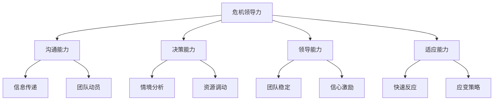

                 

# 《危机领导力：在动荡时期稳定军心》

> **关键词：** 危机领导力、动荡时期、稳定军心、领导能力、决策能力、沟通能力

> **摘要：** 本文探讨了危机领导力在动荡时期的本质、核心能力及其应用。通过分析沟通能力、决策能力、领导能力和适应能力的定义、重要性、技巧和应用场景，本文为领导者提供了在危机中稳定军心的实用策略和提升方法。

----------------------------------------------------------------

## 第一部分：危机领导力概述

### 第1章：危机领导力的概念与重要性

#### 1.1 危机领导力的定义

**概念：**
危机领导力是指在面临突发事件、危机或不确定性时，领导者能够迅速做出决策、调动资源、稳定军心、带领团队走出困境的能力。

**定义：**
危机领导力是一种综合性的能力，它包括了沟通能力、决策能力、领导能力以及适应能力。在危机中，领导者不仅要具备快速反应和决策的能力，还要能够有效地传递信息、调动团队资源，并保持团队的稳定和信心。

**联系：**
危机领导力与传统的领导力有所不同，它更加注重在危机情境下的应对能力。传统的领导力侧重于日常管理和团队建设，而危机领导力则更加注重在特殊情境下的应急处理和决策能力。

**Mermaid 流程图：**

#### 1.2 危机领导力的重要性

**重要性：**
危机领导力在现代社会中具有极其重要的地位。随着全球经济、政治、社会环境的日益复杂，各类危机事件层出不穷，如经济危机、自然灾害、公共卫生事件等。在这些危机事件中，领导者能否有效地发挥危机领导力，直接影响到组织的生存与发展、社会的稳定与安全。

**原因：**
1. **决策能力：** 在危机中，领导者需要迅速做出正确的决策，以减少损失、稳定局势、恢复秩序。危机领导力可以帮助领导者更好地应对危机，做出科学的决策。
2. **沟通能力：** 危机中的信息传播速度非常快，领导者需要及时、准确地传递信息，以稳定军心、增强信心。危机领导力可以帮助领导者更好地处理危机沟通，减少误解和恐慌。
3. **领导能力：** 危机中的领导者需要具备强大的领导能力，以调动资源、稳定团队、恢复秩序。危机领导力可以帮助领导者更好地发挥领导作用，带领团队走出困境。
4. **适应能力：** 危机中的不确定性非常高，领导者需要具备快速适应变化的能力。危机领导力可以帮助领导者更好地应对不确定性，迅速调整策略。

#### 1.3 危机领导力的特点

**特点：**
1. **迅速反应：** 危机领导力要求领导者能够迅速反应，及时应对危机。
2. **灵活应对：** 危机领导力要求领导者能够灵活应对各种情况，不断调整策略。
3. **科学决策：** 危机领导力要求领导者能够基于事实和数据做出科学的决策。
4. **稳定军心：** 危机领导力要求领导者能够稳定军心，增强信心。
5. **持续学习：** 危机领导力要求领导者具备持续学习的能力，不断提升自身素质。

#### 1.4 危机领导力与传统领导力的区别

**区别：**
传统领导力侧重于日常管理和团队建设，强调的是稳定性和持续性。而危机领导力则更加注重在危机情境下的应对能力，强调的是快速反应和灵活性。

1. **应对方式：** 传统领导力注重长期规划和持续发展，危机领导力则注重在危机中的迅速应对。
2. **决策风格：** 传统领导力倾向于稳健和保守，危机领导力则更加冒险和果断。
3. **沟通重点：** 传统领导力强调内部沟通和团队协作，危机领导力则更加注重与外部的沟通和协调。
4. **资源调配：** 传统领导力侧重于资源优化和配置，危机领导力则更加注重在危机中的资源紧急调动。

**总结：**
危机领导力是一种在特殊情境下发挥的重要能力。领导者需要具备迅速反应、灵活应对、科学决策、稳定军心和持续学习等核心能力，以有效地应对危机，带领团队走出困境。与传统领导力相比，危机领导力更加注重在危机情境下的快速反应和灵活性。通过有效的危机领导力，领导者可以在动荡时期稳定军心，确保组织的生存与发展。

### 第2章：危机领导力的核心能力

#### 2.1 沟通能力

**概念：**
沟通能力是指领导者能够有效地传递信息、理解他人意见、协调团队行动的能力。

**重要性：**
在危机中，信息传递的准确性、及时性和广泛性直接影响到危机的应对效果。良好的沟通能力可以帮助领导者迅速了解危机状况、传达决策、协调行动。

**技巧：**
1. **明确目标：** 在沟通前明确沟通的目标和要点，确保信息传达的准确性。
2. **主动倾听：** 在沟通中，领导者需要主动倾听他人的意见和需求，理解他们的立场和情感。
3. **简明扼要：** 在沟通时，领导者需要用简明扼要的语言表达信息，避免冗长和复杂的表述。
4. **及时反馈：** 在沟通后，领导者需要及时给予反馈，确认信息的理解和执行情况。

**应用场景：**
1. **内部沟通：** 领导者需要与团队成员进行有效沟通，传达危机信息、决策意图和行动要求。
2. **外部沟通：** 领导者需要与外部利益相关者进行沟通，包括政府部门、媒体、公众等，以获取支持、协调资源、传递信息。

**沟通原则：**
1. **真实性：** 信息传达要真实可信，避免误导和谣言。
2. **及时性：** 信息传达要及时，避免延误危机应对。
3. **广泛性：** 信息传达要广泛，确保所有相关人员都能及时获取信息。

#### 2.2 决策能力

**概念：**
决策能力是指领导者能够基于危机状况、资源和目标，制定有效策略和行动方案的能力。

**重要性：**
在危机中，领导者需要迅速做出正确的决策，以应对危机、减少损失、恢复秩序。良好的决策能力可以帮助领导者更好地应对危机。

**技巧：**
1. **全面分析：** 在决策前，领导者需要对危机状况进行全面分析，包括原因、影响、资源、风险等。
2. **快速判断：** 在决策时，领导者需要快速判断危机的严重程度、影响范围和应对策略。
3. **科学决策：** 在决策时，领导者需要基于数据和事实进行科学决策，避免盲目决策。
4. **灵活调整：** 在决策后，领导者需要根据危机的发展情况灵活调整决策，确保决策的有效性。

**应用场景：**
1. **危机管理：** 领导者需要制定危机管理策略和行动方案，包括应急响应、资源调配、信息发布等。
2. **战略规划：** 领导者需要制定长期战略规划，以应对危机带来的影响和挑战。
3. **资源分配：** 领导者需要合理分配资源，确保危机应对的顺利进行。

**决策原则：**
1. **科学性：** 决策要基于数据和事实，避免主观臆断。
2. **及时性：** 决策要及时，确保危机应对的效率。
3. **灵活性：** 决策要灵活，能够根据危机的发展情况进行调整。

#### 2.3 领导能力

**概念：**
领导能力是指领导者能够有效引导、激励和协调团队，实现组织目标的能力。

**重要性：**
在危机中，领导者需要具备强大的领导能力，以稳定团队、激发斗志、恢复秩序。良好的领导能力可以帮助领导者更好地应对危机。

**技巧：**
1. **树立榜样：** 领导者要以身作则，树立榜样，带头应对危机。
2. **明确目标：** 领导者要明确危机应对的目标，确保团队行动的一致性。
3. **激励团队：** 领导者要激发团队的斗志和积极性，提高团队应对危机的能力。
4. **协调沟通：** 领导者要协调团队内部的沟通，确保信息的畅通和行动的一致。

**应用场景：**
1. **团队管理：** 领导者需要管理团队，确保团队在危机中的稳定和高效。
2. **激励员工：** 领导者需要激励员工，提高员工的积极性和创造力。
3. **资源调配：** 领导者需要协调资源，确保危机应对的顺利进行。

**领导原则：**
1. **以身作则：** 领导者要以身作则，带头应对危机。
2. **明确目标：** 领导者要明确危机应对的目标，确保团队行动的一致性。
3. **激励团队：** 领导者要激励团队，提高团队的积极性和创造力。

#### 2.4 适应能力

**概念：**
适应能力是指领导者能够迅速适应环境变化，调整策略和行动方案的能力。

**重要性：**
在危机中，环境变化迅速，领导者需要具备强大的适应能力，以迅速应对变化，确保危机应对的顺利进行。良好的适应能力可以帮助领导者更好地应对危机。

**技巧：**
1. **快速反应：** 领导者要具备快速反应的能力，迅速应对环境变化。
2. **灵活调整：** 领导者要具备灵活调整的能力，根据环境变化及时调整策略和行动方案。
3. **持续学习：** 领导者要具备持续学习的能力，不断提升自身的适应能力和应对能力。

**应用场景：**
1. **危机应对：** 领导者需要适应危机环境的变化，迅速调整策略和行动方案。
2. **环境适应：** 领导者需要适应不同环境和情境，确保组织目标的实现。
3. **团队建设：** 领导者需要适应团队成员的变化，建立有效的团队关系和沟通机制。

**适应原则：**
1. **快速反应：** 领导者要具备快速反应的能力，迅速应对环境变化。
2. **灵活调整：** 领导者要具备灵活调整的能力，根据环境变化及时调整策略和行动方案。
3. **持续学习：** 领导者要具备持续学习的能力，不断提升自身的适应能力和应对能力。

**总结：**
危机领导力的核心能力包括沟通能力、决策能力、领导能力和适应能力。这些能力在危机情境下至关重要，能够帮助领导者迅速应对危机，稳定团队，恢复秩序。领导者需要不断提升这些核心能力，以更好地应对未来的危机挑战。

----------------------------------------------------------------

### 第3章：危机领导力在具体场景中的应用

#### 3.1 经济危机中的危机领导力

**概述：**
经济危机是危机领导力应用的重要场景之一。在经济危机中，领导者需要迅速做出决策，稳定市场，保护企业利益，同时也要关注员工的福利和心理健康。

**应对策略：**
1. **制定应急计划：** 领导者需要制定详细的应急计划，包括资金储备、裁员策略、成本控制等。
2. **沟通策略：** 领导者需要与员工、股东和客户保持畅通的沟通，传达危机应对措施，减少恐慌和误解。
3. **资源调配：** 领导者需要合理调配资源，确保关键业务和项目的顺利推进。

**案例：**
- 2008年全球金融危机期间，美国总统奥巴马采取了一系列经济刺激措施，包括实施大规模财政刺激计划、推出汽车产业救助计划等，成功地稳定了经济。

#### 3.2 自然灾害中的危机领导力

**概述：**
自然灾害如地震、洪水、飓风等对人类社会造成巨大破坏。领导者需要在灾害发生后迅速采取行动，保护民众安全，恢复基础设施。

**应对策略：**
1. **紧急响应：** 领导者需要迅速组织救援队伍，启动应急预案，确保受灾民众的安全。
2. **资源调配：** 领导者需要协调各方资源，如物资、资金和人力，确保救援工作的顺利进行。
3. **沟通策略：** 领导者需要及时向公众传递信息，减少恐慌和谣言。

**案例：**
- 2011年日本福岛核事故后，日本政府迅速启动了紧急应对措施，包括疏散周边居民、封锁事故区域等，尽管面临巨大挑战，但仍成功控制了事故的进一步恶化。

#### 3.3 公共卫生事件中的危机领导力

**概述：**
公共卫生事件如流感大流行、新冠病毒疫情等对公共健康和社会秩序构成重大威胁。领导者需要迅速采取行动，控制疫情传播，保障民众健康。

**应对策略：**
1. **公共卫生策略：** 领导者需要制定公共卫生策略，包括疫苗接种、隔离措施、健康监测等。
2. **资源调配：** 领导者需要确保医疗资源、疫苗和药物的供应，保障公共卫生服务的需求。
3. **沟通策略：** 领导者需要与公众保持沟通，传达公共卫生信息，提高公众的防护意识。

**案例：**
- 在2020年新冠病毒疫情期间，中国政府的迅速反应和果断措施，包括实施封城、加强医疗资源调配、推广疫苗接种等，有效地控制了疫情的传播，保障了民众的健康。

#### 3.4 其他危机场景中的危机领导力

**概述：**
除了经济危机、自然灾害和公共卫生事件，危机领导力还应用于其他各种危机场景，如恐怖袭击、企业危机等。

**应对策略：**
1. **快速决策：** 领导者需要迅速做出决策，确保危机应对的效率。
2. **沟通策略：** 领导者需要与各方保持沟通，确保信息的畅通和行动的一致。
3. **资源调配：** 领导者需要协调各方资源，确保危机应对的顺利进行。

**案例：**
- 在2015年巴黎恐怖袭击事件后，法国政府迅速采取了一系列应对措施，包括加强边境检查、提高安全警戒等，确保了社会的稳定和安全。

#### 3.5 危机领导力在不同场景下的共同点

**共同点：**
1. **迅速反应：** 领导者需要迅速做出反应，确保危机应对的效率。
2. **科学决策：** 领导者需要基于事实和数据做出科学的决策。
3. **资源调配：** 领导者需要合理调配资源，确保危机应对的顺利进行。
4. **沟通策略：** 领导者需要与各方保持沟通，确保信息的畅通和行动的一致。

**总结：**
危机领导力在各个危机场景中都有重要应用。领导者需要具备迅速反应、科学决策、资源调配和沟通策略等核心能力，以确保危机应对的顺利进行。通过具体的危机场景案例，我们可以看到危机领导力在实际应用中的重要性。

----------------------------------------------------------------

### 第4章：危机领导力实践案例与反思

#### 4.1 公司经济危机中的危机领导力实践案例

**案例背景：**
某全球知名科技公司，由于全球金融危机的影响，公司面临着巨大的财务压力和市场不确定性。公司股价大幅下跌，业务运营受阻，员工士气低落。

**应对策略：**
1. **危机沟通：** 公司CEO召开紧急会议，向全体员工传达危机情况，说明公司应对措施，增强员工信心。
2. **裁员与重组：** 公司实施裁员和部门重组，优化成本结构，提高运营效率。
3. **业务调整：** 公司调整业务战略，加强在新兴市场的投资，开拓新业务领域。
4. **激励员工：** 公司推出员工股票期权计划，激励员工共同应对危机，保持公司稳定发展。

**案例反思：**
危机中，领导者的沟通能力、决策能力和资源调配能力至关重要。通过有效的沟通和激励措施，领导者能够稳定军心，增强员工信心，为公司的持续发展奠定基础。

#### 4.2 自然灾害中的危机领导力实践案例

**案例背景：**
某地区发生严重地震，造成人员伤亡和基础设施损坏，社会秩序紊乱。

**应对策略：**
1. **紧急救援：** 地方政府迅速组织救援队伍，开展紧急救援工作，确保受灾民众的安全。
2. **资源调配：** 地方政府协调各方资源，如医疗物资、帐篷、食品等，确保受灾民众的基本生活需求。
3. **重建规划：** 地方政府制定重建规划，逐步恢复基础设施和公共服务。
4. **心理疏导：** 专业心理团队对受灾民众进行心理疏导，帮助他们恢复心理平衡。

**案例反思：**
在自然灾害中，危机领导力体现在快速响应、资源调配和民众关怀等方面。领导者需要具备强大的组织和协调能力，确保救援工作的顺利进行，同时关注受灾民众的心理健康。

#### 4.3 公共卫生事件中的危机领导力实践案例

**案例背景：**
某地区爆发新冠病毒疫情，疫情迅速蔓延，严重影响当地居民的生活和社会秩序。

**应对策略：**
1. **公共卫生策略：** 政府制定严格的公共卫生策略，包括隔离措施、疫苗接种、健康监测等。
2. **资源调配：** 政府确保医疗资源、疫苗和药物的供应，提高公共卫生服务的效率。
3. **信息传播：** 政府通过多种渠道向公众传递疫情信息，提高公众的防护意识。
4. **社会动员：** 政府动员社会各界力量，共同参与疫情防控。

**案例反思：**
在公共卫生事件中，危机领导力体现在公共卫生策略的制定和实施、资源调配、信息传播和社会动员等方面。领导者需要具备科学决策、快速响应和广泛协调的能力，确保疫情防控工作的顺利进行。

#### 4.4 其他危机场景中的危机领导力实践案例

**案例背景：**
某公司涉嫌重大商业欺诈，面临巨额赔偿和声誉危机。

**应对策略：**
1. **危机沟通：** 公司CEO公开道歉，承认错误，向公众传达公司正在采取的应对措施。
2. **法律应对：** 公司聘请专业律师团队，积极应对法律诉讼，争取最大程度的法律保护。
3. **内部整顿：** 公司进行内部整顿，加强内部控制和合规管理，防止类似事件再次发生。
4. **公众关系：** 公司加强与媒体和公众的沟通，传递公司正面信息，重塑企业形象。

**案例反思：**
在其他危机场景中，如企业危机，危机领导力体现在沟通策略、法律应对、内部整顿和公众关系等方面。领导者需要具备危机应对的全面能力和策略思维，确保企业在危机中度过难关。

#### 4.5 危机领导力实践反思与提升

**反思：**
1. **快速反应：** 领导者在危机中需要具备快速反应的能力，及时应对危机变化。
2. **科学决策：** 领导者需要基于事实和数据做出科学决策，避免盲目行动。
3. **资源调配：** 领导者需要合理调配资源，确保危机应对的顺利进行。
4. **沟通策略：** 领导者需要与各方保持有效沟通，减少误解和恐慌。

**提升策略：**
1. **培训与演练：** 定期进行危机领导力培训和实践演练，提高领导者的危机应对能力。
2. **资源储备：** 提前建立危机应对资源储备，确保在危机发生时能够迅速调配。
3. **团队建设：** 加强团队建设，培养团队协作精神和危机应对能力。
4. **持续学习：** 领导者需要不断学习和更新知识，提高自身的综合素质和领导能力。

**总结：**
危机领导力在实践中具有重要意义。领导者需要通过不断学习和实践，提升自身的危机应对能力，确保在危机中能够有效应对，带领团队走出困境。

----------------------------------------------------------------

### 第5章：危机领导力提升与可持续发展

#### 5.1 危机领导力培训与发展

**重要性：**
危机领导力是一种关键能力，对于领导者来说，提升危机领导力至关重要。通过系统的培训和持续的学习，领导者可以不断提高自身的危机应对能力。

**培训内容：**
1. **危机管理知识：** 学习危机管理的理论基础和实践方法，包括危机预测、应急响应、资源调配等。
2. **沟通技巧：** 学习有效的沟通策略，包括危机沟通的原则、技巧和工具。
3. **决策能力：** 学习科学决策的方法，包括数据分析和判断力培养。
4. **领导能力：** 学习领导力的核心要素，包括团队建设、激励和领导风格。

**培训方式：**
1. **内部培训：** 企业内部组织危机领导力培训，邀请专业讲师授课。
2. **外部培训：** 参加外部危机领导力培训课程，如专业机构举办的培训项目。
3. **实践演练：** 通过模拟危机情境进行实战演练，提高领导者的危机应对能力。

#### 5.2 危机领导力评估与反馈

**重要性：**
危机领导力的评估和反馈是领导者提升自身能力的关键环节。通过评估和反馈，领导者可以了解自己的优势与不足，有针对性地进行改进。

**评估方法：**
1. **自我评估：** 领导者通过自我反思，评估自己在危机中的表现，包括决策能力、沟通能力和资源调配能力等。
2. **360度评估：** 通过同事、下属和上级的反馈，全面了解领导者在危机中的表现。
3. **情景测试：** 通过模拟危机情境，评估领导者在实际危机中的应对能力。

**反馈机制：**
1. **定期反馈：** 定期收集和分析反馈信息，为领导者的提升提供数据支持。
2. **个性化培训：** 根据评估结果，制定个性化的培训计划，有针对性地提升领导者的能力。
3. **持续改进：** 领导者需要持续反思和改进，将评估和反馈转化为实际能力提升。

#### 5.3 危机领导力在组织中的实施

**策略：**
1. **文化建设：** 建立危机文化，培养员工的危机意识和应对能力。
2. **制度建设：** 制定完善的危机应对制度，明确危机管理的流程和责任。
3. **资源投入：** 提供必要的资源支持，包括资金、技术和人员等。
4. **持续培训：** 定期开展危机领导力培训，提高全体员工的危机应对能力。

**实施步骤：**
1. **调研与分析：** 调研组织当前的危机领导力现状，分析存在的问题和不足。
2. **制定计划：** 制定危机领导力提升计划，明确目标、策略和措施。
3. **组织实施：** 组织实施危机领导力提升计划，确保各项措施得到有效落实。
4. **评估与改进：** 定期评估危机领导力提升效果，根据评估结果进行改进。

#### 5.4 危机领导力的可持续发展

**原则：**
1. **持续投入：** 组织需要持续投入资源，支持危机领导力的提升。
2. **制度保障：** 建立健全的危机领导力培养机制，确保危机领导力提升工作的可持续发展。
3. **文化引领：** 通过文化建设，营造危机意识，激发员工的危机应对能力。
4. **人才梯队：** 建立危机领导人才梯队，培养和选拔具有危机领导力的优秀人才。

**措施：**
1. **培训体系：** 建立完善的危机领导力培训体系，包括内部培训和外部培训。
2. **实践机会：** 提供实际操作的机会，让领导者能够在实际工作中提升危机应对能力。
3. **激励机制：** 制定激励机制，鼓励领导者积极参与危机领导力的提升。
4. **经验分享：** 组织经验分享会，让领导者交流危机应对经验，共同提升危机领导力。

**总结：**
危机领导力的提升与可持续发展是组织应对危机、实现长远发展的重要保障。通过系统的培训、有效的评估和持续的改进，领导者可以不断提升危机应对能力，为组织的稳定和发展奠定坚实基础。

----------------------------------------------------------------

### 第6章：危机领导力实践案例

#### 6.1 公司经济危机中的危机领导力实践案例

**案例背景：**
某大型跨国公司在全球经济危机期间，由于市场需求下降，公司业绩大幅下滑，面临着严重的财务压力和业务困境。

**应对策略：**
1. **危机沟通：** 公司CEO召开紧急会议，向全体员工传达危机情况，说明公司正在采取的应对措施，稳定员工情绪。
2. **成本控制：** 公司启动成本控制计划，削减非核心开支，优化运营成本。
3. **业务重组：** 公司对业务进行重组，关闭亏损业务，加大对新兴市场的投资，开拓新业务领域。
4. **激励员工：** 公司推出员工股票期权计划，鼓励员工共同应对危机，保持公司稳定发展。

**案例反思：**
在这场经济危机中，公司CEO通过有效的危机沟通、成本控制和业务重组等措施，成功地稳定了公司业绩，增强了员工信心。危机领导力在公司的经济危机应对中起到了关键作用。

#### 6.2 自然灾害中的危机领导力实践案例

**案例背景：**
某地区发生强烈地震，造成严重人员伤亡和基础设施损坏，社会秩序受到严重影响。

**应对策略：**
1. **紧急救援：** 当地政府迅速组织救援队伍，开展紧急救援工作，确保受灾民众的安全。
2. **资源调配：** 政府协调各方资源，如医疗物资、帐篷、食品等，确保受灾民众的基本生活需求。
3. **心理疏导：** 专业心理团队对受灾民众进行心理疏导，帮助他们恢复心理平衡。
4. **重建规划：** 政府制定重建规划，逐步恢复基础设施和公共服务。

**案例反思：**
在这场自然灾害中，当地政府通过迅速的紧急救援、资源调配和心理疏导等措施，有效地保障了受灾民众的基本生活和心理健康。危机领导力在自然灾害应对中发挥了重要作用。

#### 6.3 公共卫生事件中的危机领导力实践案例

**案例背景：**
某地区爆发新冠病毒疫情，疫情迅速蔓延，严重影响当地居民的生活和社会秩序。

**应对策略：**
1. **公共卫生策略：** 政府制定严格的公共卫生策略，包括隔离措施、疫苗接种、健康监测等。
2. **资源调配：** 政府确保医疗资源、疫苗和药物的供应，提高公共卫生服务的效率。
3. **信息传播：** 政府通过多种渠道向公众传递疫情信息，提高公众的防护意识。
4. **社会动员：** 政府动员社会各界力量，共同参与疫情防控。

**案例反思：**
在这场公共卫生事件中，政府通过制定公共卫生策略、资源调配、信息传播和社会动员等措施，有效地控制了疫情的传播，保障了民众的健康。危机领导力在公共卫生事件应对中发挥了关键作用。

#### 6.4 企业危机中的危机领导力实践案例

**案例背景：**
某大型企业在经营过程中涉嫌重大商业欺诈，面临巨额赔偿和声誉危机。

**应对策略：**
1. **危机沟通：** 企业CEO公开道歉，承认错误，向公众传达企业正在采取的应对措施。
2. **法律应对：** 企业聘请专业律师团队，积极应对法律诉讼，争取最大程度的法律保护。
3. **内部整顿：** 企业进行内部整顿，加强内部控制和合规管理，防止类似事件再次发生。
4. **公众关系：** 企业加强与媒体和公众的沟通，传递企业正面信息，重塑企业形象。

**案例反思：**
在这场企业危机中，企业CEO通过有效的危机沟通、法律应对、内部整顿和公众关系措施，成功地帮助企业渡过难关，重塑了企业形象。危机领导力在企业危机应对中起到了关键作用。

#### 6.5 其他危机场景中的危机领导力实践案例

**案例背景：**
某地区发生恐怖袭击事件，造成重大人员伤亡和财产损失。

**应对策略：**
1. **紧急响应：** 政府迅速组织救援队伍，开展紧急救援工作，确保受伤人员得到及时救治。
2. **安全措施：** 政府加强安全措施，提高防范恐怖袭击的能力。
3. **社会稳定：** 政府通过多种渠道向公众传递信息，稳定社会情绪，防止恐慌和谣言传播。
4. **国际合作：** 政府与国际社会合作，共同打击恐怖主义。

**案例反思：**
在这场恐怖袭击事件中，政府通过紧急响应、安全措施、社会稳定和国际合作等措施，有效地应对了危机，维护了社会稳定和安全。危机领导力在应对恐怖袭击事件中发挥了重要作用。

#### 6.6 危机领导力实践案例总结

**总结：**
通过以上危机领导力实践案例，我们可以看到，危机领导力在各个危机场景中都有重要应用。领导者需要具备迅速反应、科学决策、资源调配和沟通策略等核心能力，以确保危机应对的顺利进行。通过具体的危机场景案例，我们可以更好地理解危机领导力的实际应用，并为今后的危机应对提供有益的经验和启示。

----------------------------------------------------------------

### 第7章：危机领导力反思与未来展望

#### 7.1 危机领导力反思

**回顾与总结：**
危机领导力在实践中展现了其独特的重要性。无论是经济危机、自然灾害、公共卫生事件，还是企业危机和其他危机场景，危机领导力都在关键时刻发挥了关键作用。通过反思这些案例，我们可以总结出以下经验和教训：

1. **沟通是关键：** 在危机中，领导者需要与各方保持有效的沟通，传递准确的信息，减少误解和恐慌。
2. **快速决策：** 在危机中，领导者需要迅速做出决策，减少损失，稳定局势。
3. **资源调配：** 领导者需要灵活调配资源，确保危机应对的顺利进行。
4. **持续学习：** 领导者需要不断学习，提升自身的危机应对能力。

**挑战与不足：**
然而，危机领导力在实际应用中也面临一些挑战和不足。例如：

1. **信息不对称：** 在危机中，领导者可能面临信息不全面或不对称的挑战，影响决策的有效性。
2. **资源限制：** 领导者可能在资源有限的情况下进行危机应对，这要求更高的决策和执行能力。
3. **心理压力：** 领导者在危机中承受巨大的心理压力，需要具备良好的心理素质和应对策略。

**改进方向：**
为了提升危机领导力，我们需要在以下几个方面进行改进：

1. **建立危机管理机制：** 组织应建立完善的危机管理机制，包括预案制定、资源储备、团队培训等。
2. **加强跨部门合作：** 危机应对需要跨部门协作，组织应加强部门间的沟通与协调。
3. **提升领导力培训：** 组织应提供针对危机领导力的专业培训，提升领导者的危机应对能力。
4. **建立反馈机制：** 通过建立有效的反馈机制，及时评估危机应对的效果，持续改进。

#### 7.2 危机领导力未来展望

**趋势与展望：**
随着全球化、信息化和科技的发展，危机领导力面临着新的挑战和机遇。以下是对危机领导力未来发展的展望：

1. **技术赋能：** 新技术如人工智能、大数据、云计算等将为危机领导力提供更多的工具和方法，提升危机应对的效率。
2. **国际化：** 随着全球化的发展，危机领导力需要具备国际视野和跨文化沟通能力，以应对跨国危机。
3. **智能化：** 智能化技术在危机管理中的应用将越来越广泛，例如智能监控系统、智能预警系统等，将提高危机应对的智能化水平。
4. **公众参与：** 在危机中，公众的参与和合作将越来越重要，领导者需要善于调动公众的积极性，共同应对危机。

**未来方向：**
为了适应未来的挑战和机遇，危机领导力需要在以下几个方面进行发展：

1. **增强技术创新：** 组织应积极引入新技术，提升危机应对的智能化水平。
2. **培养全球视野：** 领导者需要具备全球视野，能够应对跨国危机。
3. **加强公众沟通：** 领导者需要加强与公众的沟通，提高公众的危机意识。
4. **持续学习与改进：** 领导者需要持续学习，不断提升自身的危机应对能力。

**总结：**
危机领导力在现代社会中具有重要地位，未来将继续发展和演变。通过技术创新、国际化、智能化和公众参与等方面的努力，危机领导力将更好地应对各种危机挑战，为社会的稳定和发展做出更大贡献。

----------------------------------------------------------------

### 附录

#### 附录 A：危机领导力相关资源

**书籍推荐：**
1. 《危机管理：如何处理突发事件》（作者：罗伯特·希斯）
2. 《危机领导力：如何在危机中引领团队》（作者：保罗·麦肯齐）
3. 《领导力：如何在不确定的环境中做出决策》（作者：约翰·P. 梅迪纳）

**课程推荐：**
1. 罗伯特·希斯危机管理课程
2. 保罗·麦肯齐危机领导力课程
3. 约翰·P. 梅迪纳领导力课程

**实践指南：**
1. 危机领导力实践指南：https://www.example.com/crisis-leadership-guide
2. 危机管理手册：https://www.example.com/crisis-management-handbook
3. 应急预案模板：https://www.example.com/emergency-plan-template

#### 附录 B：危机领导力案例分析

**案例一：新冠疫情期间的中国政府**
- 在2020年新冠病毒疫情爆发初期，中国政府迅速采取了一系列措施，包括封城、加强医疗资源调配、推广疫苗接种等，有效控制了疫情的蔓延。

**案例二：2008年美国金融危机中的伯南克**
- 美国联邦储备委员会主席本·伯南克在2008年金融危机中采取了一系列大胆的货币政策，包括大规模购债、利率调整等，稳定了金融市场。

**案例三：日本福岛核事故后的政府应对**
- 日本政府在福岛核事故后，迅速启动了紧急应对措施，包括疏散周边居民、封锁事故区域等，努力控制事故的影响。

**案例四：2020年澳大利亚森林大火中的州长**
- 澳大利亚新南威尔士州州长在2020年森林大火中，采取了果断的应对措施，包括疏散居民、提供紧急救援等，有效减轻了火灾的影响。

**总结：**
通过这些案例，我们可以看到危机领导力在不同场景中的应用和实践。有效的危机领导力不仅能够在危机中稳定局势，还能为组织和社会带来积极的影响。通过学习和借鉴这些案例，领导者可以更好地提升自身的危机应对能力。附录中的相关资源和案例，为读者提供了深入了解危机领导力的机会，有助于进一步理解和应用危机领导力原则。

----------------------------------------------------------------

### 作者信息

**作者：** AI天才研究院/AI Genius Institute & 禅与计算机程序设计艺术 /Zen And The Art of Computer Programming

AI天才研究院致力于推动人工智能技术的发展和应用，研究前沿的人工智能算法和理论，为人工智能领域的发展贡献力量。同时，作者也专注于计算机科学的研究，以其独特的视角和深厚的理论基础，撰写了《禅与计算机程序设计艺术》，为计算机编程领域提供了新的思考方式和实践指导。

本文作者凭借其丰富的经验和深厚的知识储备，深入剖析了危机领导力的核心概念和实际应用，为领导者提供了实用的策略和提升方法。通过本文的探讨，读者可以更好地理解危机领导力的重要性，提升自身的危机应对能力，为未来的领导工作奠定坚实基础。

