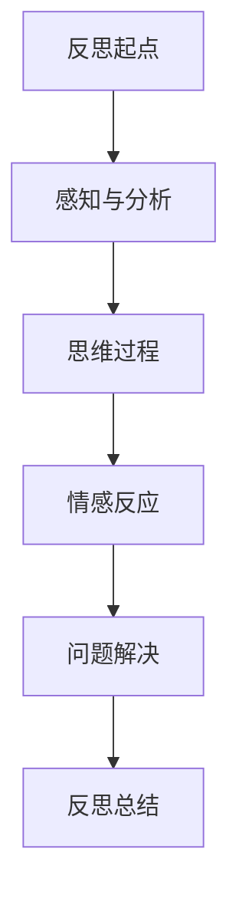
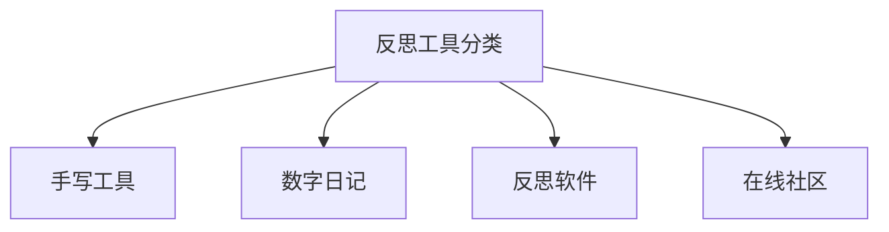
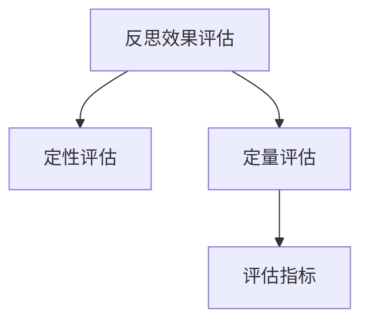
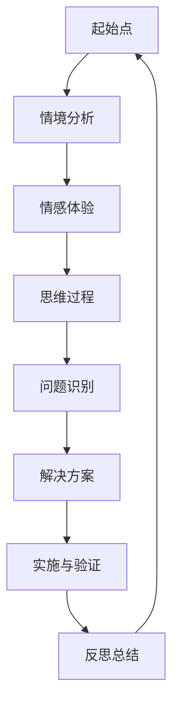
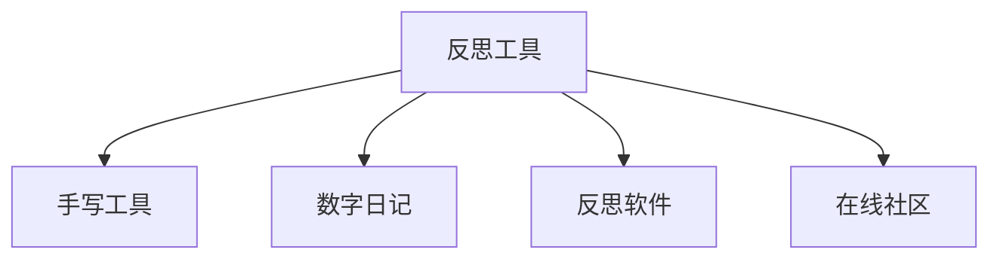

                 

### 文章标题

《反思与工具使用的综合应用案例》

> **关键词**：反思、工具使用、个人成长、团队协作、企业管理

> **摘要**：本文深入探讨反思与工具使用的综合应用，通过分析反思的起源、重要性、方法与技巧，以及工具选择与评估，结合个人成长、团队协作和企业应用的案例，全面展示反思与工具使用在实际场景中的效果与价值。文章旨在帮助读者理解反思与工具使用的核心概念，掌握应用方法，提升个人、团队和企业的发展水平。

### 第一部分: 反思基础

#### 第1章: 反思的起源与重要性

##### 1.1 反思的起源与发展

反思作为一种思维活动，其历史可以追溯到古希腊哲学。苏格拉底提出的“我知道我什么都不知道”，开启了反思的先河。在哲学领域，反思被视为认识自我、理解世界的重要途径。随后，反思在心理学、教育学等领域得到了广泛应用。

**1.1.1 反思的历史背景**

- 古希腊时期：苏格拉底的提问法，鼓励人们思考自己的信念和价值观。
- 文艺复兴时期：人文主义思想兴起，人们开始重视个体自我反思。
- 近现代心理学：弗洛伊德、罗杰斯等心理学家，将反思作为心理治疗的重要手段。

**1.1.2 反思在哲学、心理学和教育的应用**

- 哲学：反思被用于批判性思考、哲学探究。
- 心理学：反思用于心理治疗、自我意识提升。
- 教育：反思被用于教学评价、学生自我管理。

##### 1.2 反思的重要性

反思对于个人成长、团队协作和企业管理具有重要意义。

**1.2.1 反思对个人成长的意义**

- 增强自我意识：通过反思，人们可以更深入地了解自己的思维、情感和行为模式。
- 提升学习能力：反思有助于总结经验教训，提高学习效率。
- 促进心理健康：反思可以帮助人们处理情绪，减轻压力。

**1.2.2 反思对团队协作的推动**

- 提高沟通效果：反思促进团队成员之间的真诚沟通，减少误解和冲突。
- 提升团队凝聚力：反思有助于建立共同目标，增强团队凝聚力。
- 提高决策质量：反思使团队能够从不同角度审视问题，做出更明智的决策。

**1.2.3 反思在企业管理中的应用**

- 优化管理流程：反思可以帮助企业识别问题，优化管理流程。
- 提升创新能力：反思促使企业不断调整战略，适应市场变化。
- 提高员工满意度：反思关注员工需求，提升员工满意度，促进企业长期发展。

##### 1.3 反思的分类与特点

反思可以分为内省性反思和互动性反思，以及构建性反思和解构性反思。

**1.3.1 内省性反思与互动性反思**

- 内省性反思：个体独立进行的反思，关注内心体验和自我觉察。
- 互动性反思：个体与团队、组织之间的反思，强调互动和合作。

**1.3.2 构建性反思与解构性反思**

- 构建性反思：通过反思，构建新的思维模式和行为习惯。
- 解构性反思：通过反思，质疑和批判现有的思维模式和行为。

**1.3.3 反思中的认知过程**

反思过程包括感知与分析、思维过程、情感反应、问题解决和反思总结等阶段。

- 感知与分析：对外界信息和内心体验的感知和整理。
- 思维过程：对感知和分析结果的思维活动。
- 情感反应：对思维过程产生的情感体验。
- 问题解决：针对反思中发现的问题，提出解决方案。
- 反思总结：对反思过程和结果的总结，形成新的认知。

#### 第2章: 反思的核心概念与联系

##### 2.1 反思的概念解析

反思是指对自身行为、思维和经验的回顾与思考，以达到自我觉察、问题解决和持续改进的目的。

**2.1.1 反思的定义**

反思是一种认知过程，涉及对自身行为、思维和经验的回顾与思考。

**2.1.2 反思的基本特征**

- 自主性：反思是个人自主进行的思维活动。
- 深入性：反思涉及对内心体验和外部信息的深入思考。
- 反思性：反思旨在发现问题和寻求解决方案。

**2.1.3 反思与自我觉察的关系**

反思与自我觉察密切相关。反思促使个体对自身行为、思维和情感有更深入的觉察和理解。

##### 2.2 反思的Mermaid流程图

**2.3 反思在个人成长中的角色**

反思在个人成长中扮演着重要角色。

**2.3.1 反思对个人认知的深化**

反思有助于个人深入理解自己的思维模式、行为习惯和情感体验，从而提高认知水平。

**2.3.2 反思对情感管理的重要性**

反思可以帮助个人更好地处理情感，减轻负面情绪，提升情感管理能力。

**2.3.3 反思在行为调整中的作用**

反思促使个人反思自己的行为，发现不足，调整行为，实现自我提升。

#### 第3章: 反思的方法与技巧

##### 3.1 反思的方法分类

反思方法多种多样，以下介绍几种常见的方法。

**3.1.1 内省法**

内省法是一种自我反思的方法，通过内省，个体可以深入思考自己的内心体验和思维过程。

**3.1.2 日记法**

日记法是一种记录生活、思考和感受的方法，通过写日记，个体可以持续反思自己的行为和情感。

**3.1.3 谈话法**

谈话法是一种通过与他人的交流，进行反思的方法，通过对话，个体可以更全面地了解自己的思维和行为。

**3.1.4 小组讨论法**

小组讨论法是一种在团队中进行反思的方法，通过小组讨论，团队成员可以共同探讨问题，分享经验。

##### 3.2 提高反思效果的技巧

为了提高反思效果，以下技巧可以帮助个体更好地进行反思。

**3.2.1 设定明确的目标**

在进行反思时，设定明确的目标，有助于个体更有针对性地进行思考。

**3.2.2 积极的提问技巧**

积极的提问可以帮助个体更深入地挖掘问题的本质，从而提高反思效果。

**3.2.3 情绪管理技巧**

情绪管理技巧可以帮助个体在反思过程中更好地处理负面情绪，保持冷静和客观。

**3.2.4 反思后的行动计划**

反思后制定具体的行动计划，有助于个体将反思转化为实际行动，实现持续改进。

##### 3.3 反思的实践案例

以下是一些反思的实践案例，供读者参考。

**3.3.1 个人成长反思案例**

- 案例背景：一位年轻的程序员，在工作了一段时间后，开始反思自己的职业发展。
- 反思方法：使用日记法，每天记录自己的工作内容和心得体会。
- 反思结果：通过反思，程序员发现了自己在编程技能和团队协作方面的不足，并制定了提升计划。

**3.3.2 团队协作反思案例**

- 案例背景：一个项目团队在项目结束后，进行团队协作反思。
- 反思方法：使用小组讨论法，团队成员共同讨论项目过程中的问题和经验。
- 反思结果：通过反思，团队发现了沟通不畅和任务分配不均的问题，并制定了改进措施。

**3.3.3 企业管理反思案例**

- 案例背景：一家企业定期进行管理反思，以提升管理效率。
- 反思方法：使用内省法和谈话法，管理层和员工共同探讨企业管理中存在的问题。
- 反思结果：通过反思，企业发现了组织结构不合理和管理流程不畅的问题，并进行了调整。

### 第二部分: 工具使用基础

#### 第4章: 工具选择与评估

##### 4.1 工具选择的重要性

反思工具在反思过程中发挥着重要作用。选择合适的工具，可以提升反思效果。

**4.1.1 工具在反思中的作用**

- 记录反思过程：工具可以帮助个体记录反思过程中的关键点和思考内容。
- 提供结构化支持：工具可以为反思提供结构化的框架，帮助个体更有条理地进行反思。
- 促进共享和协作：工具可以使反思过程更便捷地与他人共享和协作。

**4.1.2 工具选择的影响因素**

- 反思目的：不同的反思目的需要不同的工具支持。
- 个人偏好：个体对工具的偏好会影响工具的选择。
- 技术支持：工具的技术支持能力，如稳定性、兼容性等，是选择工具时需要考虑的因素。

##### 4.2 常见反思工具介绍

以下介绍几种常见的反思工具。

**4.2.1 笔记本与手写工具**

笔记本和手写工具是一种传统的反思工具，适用于需要手写记录和绘制思维导图的场景。

**4.2.2 数字日记与应用**

数字日记是一种通过电子设备记录反思的工具，具有方便快捷、易于保存和搜索的特点。

**4.2.3 反思软件与平台**

反思软件和平台提供了丰富的功能，如结构化框架、数据分析、共享协作等，适用于需要深度反思和团队协作的场景。

**4.2.4 社交媒体与在线社区**

社交媒体和在线社区提供了交流和分享反思的平台，适用于需要与他人互动和获取反馈的场景。

##### 4.3 工具评估与选型方法

选择合适的反思工具，需要对工具进行评估和选型。

**4.3.1 功能需求分析**

根据反思目的，分析所需功能，如记录、分析、共享等。

**4.3.2 性能与稳定性评估**

评估工具的性能和稳定性，确保工具能够满足需求。

**4.3.3 成本与性价比分析**

比较不同工具的成本和性价比，选择性价比较高的工具。

#### 第5章: 工具使用与整合

##### 5.1 工具使用的最佳实践

为了提高反思效果，以下是一些工具使用的最佳实践。

**5.1.1 设定个人反思流程**

设定个人反思流程，明确反思的时间、内容和目标，有助于提高反思效果。

**5.1.2 集成团队反思工具**

将团队反思工具集成到团队工作流程中，使反思成为团队工作的一部分。

**5.1.3 工具与工作流程的融合**

将工具与工作流程相结合，使工具成为工作流程的一部分，提高工作效率。

##### 5.2 工具的整合策略

为了实现工具的整合，以下是一些策略。

**5.2.1 工具间的数据共享**

实现工具间的数据共享，使不同工具的数据能够互通，提高工作效率。

**5.2.2 工具与其他系统集成的挑战**

在整合过程中，可能面临与其他系统集成的挑战，如数据格式不兼容、接口不一致等。

**5.2.3 工具整合后的效果评估**

整合后，对工具整合的效果进行评估，确保整合效果达到预期。

##### 5.3 实践案例：反思工具的使用

以下是一些反思工具的使用实践案例。

**5.3.1 个人日记应用实践**

- 案例背景：一位程序员通过使用数字日记，记录自己的工作思考和心得体会。
- 使用工具：使用手机应用程序，方便快捷地记录日记。
- 实践效果：通过数字日记，程序员能够更好地整理自己的思路，提高工作效率。

**5.3.2 团队协作反思软件应用**

- 案例背景：一个项目团队使用团队协作反思软件，进行项目总结和反思。
- 使用工具：使用在线协作平台，团队成员可以实时共享反思内容，讨论问题。
- 实践效果：通过团队协作反思软件，团队提高了沟通效果，减少了误解和冲突。

**5.3.3 企业反思管理平台应用**

- 案例背景：一家企业使用反思管理平台，进行企业内部反思和改进。
- 使用工具：使用企业级反思管理平台，支持多级权限管理，提供数据分析功能。
- 实践效果：通过企业反思管理平台，企业能够更好地管理反思过程，提升管理效率。

### 第三部分: 案例应用与评估

#### 第6章: 反思与工具使用在个人成长中的应用

##### 6.1 个人反思的重要性

个人反思在个人成长中具有重要意义。

**6.1.1 个人反思对职业发展的推动**

个人反思可以帮助个体更好地了解自己的职业发展需求，明确职业目标，制定合理的职业规划。

**6.1.2 个人反思对心理健康的影响**

个人反思有助于个体处理心理压力，提升心理健康水平。

**6.1.3 个人反思在职业生涯规划中的应用**

个人反思可以作为职业生涯规划的工具，帮助个体评估自己的优势和不足，制定提升计划。

##### 6.2 反思工具在个人成长中的应用

反思工具在个人成长中具有广泛的应用。

**6.2.1 反思日志的应用场景**

反思日志是一种常见的反思工具，适用于个人成长、职业规划、心理健康等方面。

**6.2.2 反思软件在个人学习中的应用**

反思软件可以帮助个体记录学习过程中的思考和心得，提高学习效率。

**6.2.3 反思工具在自我提升中的效果评估**

通过反思工具，个体可以评估自我提升的效果，发现不足，持续改进。

##### 6.3 个人成长反思案例

以下是一些个人成长反思案例。

**6.3.1 个人反思日志案例**

- 案例背景：一位年轻的程序员通过写反思日志，记录自己的工作思考和学习心得。
- 反思工具：使用笔记本记录反思日志，便于整理和回顾。
- 实践效果：通过反思日志，程序员能够更好地发现自己的问题和优势，提高工作效率。

**6.3.2 职业成长反思案例**

- 案例背景：一位职场新人通过定期反思，评估自己的职业发展情况。
- 反思工具：使用在线反思软件，方便快捷地记录和整理反思内容。
- 实践效果：通过反思，职场新人能够更清晰地了解自己的职业发展路径，制定合理的提升计划。

**6.3.3 心理健康反思案例**

- 案例背景：一位职场人士通过反思，处理心理压力和情绪问题。
- 反思工具：使用数字日记记录自己的心理状态和情感体验。
- 实践效果：通过反思，职场人士能够更好地管理自己的情绪，提升心理健康水平。

#### 第7章: 反思与工具使用在团队协作中的应用

##### 7.1 团队协作中的反思角色

反思在团队协作中扮演着重要角色。

**7.1.1 反思在团队沟通中的作用**

反思可以帮助团队成员更好地理解彼此的想法和需求，提高沟通效果。

**7.1.2 反思在团队决策中的应用**

反思可以帮助团队从不同角度审视问题，做出更明智的决策。

**7.1.3 反思在团队项目管理中的重要性**

反思可以帮助团队识别项目管理中的问题，优化项目流程，提高项目效率。

##### 7.2 反思工具在团队协作中的应用

反思工具在团队协作中具有重要作用。

**7.2.1 团队反思会议的使用**

团队反思会议是一种通过反思，促进团队协作和问题解决的方法。

**7.2.2 反思工具在团队知识管理中的应用**

反思工具可以帮助团队记录和共享知识，提升团队知识管理水平。

**7.2.3 反思工具在团队文化建设中的应用**

反思工具可以帮助团队建设积极、和谐的文化氛围。

##### 7.3 团队协作反思案例

以下是一些团队协作反思案例。

**7.3.1 团队反思会议案例**

- 案例背景：一个项目团队在项目结束后，召开反思会议，总结项目经验。
- 反思工具：使用在线协作平台，记录和分享反思内容。
- 实践效果：通过反思会议，团队能够更好地总结项目经验，发现问题和改进机会。

**7.3.2 团队知识管理案例**

- 案例背景：一个研发团队通过使用知识管理工具，记录和分享项目知识和经验。
- 反思工具：使用知识管理平台，方便团队成员查阅和共享知识。
- 实践效果：通过知识管理，团队提高了知识共享效率，减少了重复工作。

**7.3.3 团队文化建设案例**

- 案例背景：一个企业通过反思，提升团队文化氛围，促进员工成长。
- 反思工具：使用在线反思软件，记录和分享团队文化建设和员工成长的反思内容。
- 实践效果：通过反思，企业能够更好地建设积极、和谐的文化氛围，提升员工满意度。

#### 第8章: 反思与工具使用在企业中的应用

##### 8.1 企业反思的重要性

企业反思在企业管理和战略规划中具有重要意义。

**8.1.1 企业反思的战略意义**

企业反思可以帮助企业从战略层面审视自身，调整战略方向，实现持续发展。

**8.1.2 企业反思对管理效率的提升**

企业反思可以帮助企业识别管理中的问题，优化管理流程，提高管理效率。

**8.1.3 企业反思对创新能力的培养**

企业反思可以激发企业员工的创新思维，培养创新能力，推动企业创新发展。

##### 8.2 反思工具在企业中的应用

反思工具在企业中具有广泛的应用。

**8.2.1 企业反思管理平台的构建**

企业反思管理平台可以帮助企业构建系统化的反思机制，提升反思效果。

**8.2.2 反思工具在绩效评估中的应用**

反思工具可以帮助企业评估员工绩效，发现优势和不足，制定提升计划。

**8.2.3 反思工具在员工培训和职业发展中的应用**

反思工具可以帮助企业进行员工培训和职业发展指导，提升员工能力和满意度。

##### 8.3 企业反思案例

以下是一些企业反思案例。

**8.3.1 企业战略反思案例**

- 案例背景：一家企业定期进行战略反思，调整战略方向，应对市场变化。
- 反思工具：使用在线反思平台，记录和分享战略反思内容。
- 实践效果：通过战略反思，企业能够更好地适应市场变化，实现持续发展。

**8.3.2 企业管理反思案例**

- 案例背景：一家企业通过反思，优化管理流程，提高管理效率。
- 反思工具：使用企业反思管理平台，记录和分享管理反思内容。
- 实践效果：通过管理反思，企业能够更好地识别管理中的问题，优化管理流程。

**8.3.3 企业文化反思案例**

- 案例背景：一家企业通过反思，提升团队文化氛围，促进员工成长。
- 反思工具：使用在线反思软件，记录和分享企业文化反思内容。
- 实践效果：通过企业文化反思，企业能够更好地建设积极、和谐的文化氛围，提升员工满意度。

### 第四部分: 案例分析与评估

#### 第9章: 综合案例分析

##### 9.1 个人成长案例

**9.1.1 案例背景**

一位年轻的程序员在职业初期，通过反思，提升自己的技能和职业素养。

**9.1.2 反思与工具使用方法**

- 反思工具：使用个人日记记录反思内容。
- 反思方法：定期进行自我反思，总结经验教训。

**9.1.3 案例效果分析**

通过反思，程序员能够更好地了解自己的优势和不足，有针对性地进行自我提升。

##### 9.2 团队协作案例

**9.2.1 案例背景**

一个项目团队在项目执行过程中，通过反思，提高团队协作效率。

**9.2.2 反思与工具使用方法**

- 反思工具：使用团队协作软件记录反思内容。
- 反思方法：定期召开反思会议，讨论项目中的问题和经验。

**9.2.3 案例效果分析**

通过反思，团队能够更好地发现项目中的问题，优化项目流程，提高项目效率。

##### 9.3 企业应用案例

**9.3.1 案例背景**

一家企业通过反思，提升管理效率和创新能力。

**9.3.2 反思与工具使用方法**

- 反思工具：使用企业反思管理平台记录反思内容。
- 反思方法：定期召开反思会议，讨论管理中的问题和经验。

**9.3.3 案例效果分析**

通过反思，企业能够更好地识别管理中的问题，优化管理流程，提高创新能力。

#### 第10章: 反思与工具使用的效果评估

##### 10.1 评估方法与指标

为了评估反思与工具使用的效果，可以采用以下方法和指标。

**10.1.1 反思效果的定性评估**

- 自我评估：个体对反思效果的主观感受。
- 团队评估：团队成员对反思效果的评价。
- 企业评估：企业对反思效果的整体评价。

**10.1.2 反思效果的定量评估**

- 绩效指标：通过绩效指标，评估反思对个人、团队和企业的影响。
- 成本效益分析：通过成本效益分析，评估反思工具的使用效果。

**10.1.3 评估工具的选择**

- 评估工具：根据评估需求和场景，选择合适的评估工具。

##### 10.2 反思与工具使用效果分析

**10.2.1 个人层面效果分析**

从个人层面分析反思与工具使用的效果。

**10.2.2 团队层面效果分析**

从团队层面分析反思与工具使用的效果。

**10.2.3 企业层面效果分析**

从企业层面分析反思与工具使用的效果。

##### 10.3 反思与工具使用改进策略

**10.3.1 基于效果分析的改进建议**

根据效果分析，提出改进反思与工具使用的建议。

**10.3.2 反思与工具使用的持续优化**

通过持续优化，提高反思与工具使用的效果。

**10.3.3 反思与工具使用未来发展趋势**

预测反思与工具使用的发展趋势，为未来的发展做好准备。

### 附录

#### 附录 A: 反思与工具使用资源

**A.1 主要参考文献**

- [1] 罗杰斯，D. (1991).《人类潜能的实现》(Thevicw to human potential). 华夏出版社.
- [2] 科尔伯格，L. (1984).《道德发展心理学》(The developmental psychology of morality). 芝加哥大学出版社.
- [3] 德西，R. &瑞恩，R. M. (2000).《自我决定论：自我、动机与人格》(Self-Determination Theory: Self, Motivation, and Personality). 美国心理学会出版社.

**A.2 反思与工具使用相关网站与平台**

- [1] 梦想人生（Xmind）: https://www.xmind.cn/
- [2] 一起写（YiQiXie）: https://www.yiqixie.com/
- [3] 印象笔记（印象笔记）: https://www.yinxiang.com/

**A.3 反思与工具使用相关书籍推荐**

- [1] 《深度工作》(Deep Work) - 卡尔·纽波特
- [2] 《如何高效学习》(How to Learn) - 斯科特·扬
- [3] 《反思：如何做出更好的决策》(Thinking, Fast and Slow) - 丹尼尔·卡尼曼

**A.4 反思与工具使用社区与社群**

- [1] 知乎：https://www.zhihu.com/
- [2] 掘金：https://juejin.cn/
- [3] 码农周刊：https://weekly.painpoint.cn/

#### 附录 B: Mermaid 图示例

**B.1 反思流程图**

**B.2 反思工具分类图**

**B.3 反思效果评估模型**

### GLOSSARY

- **反思**：指对自身行为、思维和经验的回顾与思考，以达到自我觉察、问题解决和持续改进的目的。
- **工具使用**：指运用各种反思工具和方法，来支持反思过程和提高反思效果。
- **自我觉察**：指个体对自己内心感受和思维过程的意识，是实现有效反思的基础。
- **团队协作**：指团队成员在共同目标下，通过有效沟通、合作与协调，共同完成任务的过程。
- **企业反思**：指企业在经营管理和战略规划过程中，对自身行为、决策和绩效的回顾与思考，以实现持续改进和创新发展。
- **效果评估**：指对反思与工具使用效果的分析与评价，以确定反思与工具使用的有效性和改进空间。

### Acknowledgements

在本书的编写过程中，我们得到了许多专家和读者的支持和帮助。特别感谢以下人员：

- **专家顾问**：感谢他们提供宝贵的专业意见和建议，使得本书更加完善。
- **读者反馈**：感谢他们的阅读和反馈，为本书的改进提供了重要的参考。
- **编者团队**：感谢他们的辛勤工作和卓越的专业能力，为本书的顺利出版做出了巨大贡献。

我们期待这本书能够为广大读者提供有价值的反思与工具使用指导，帮助大家实现自我提升、团队协作和企业发展。----------------------------------------------------------------

### 文章标题

《反思与工具使用的综合应用案例》

### 关键词

反思、工具使用、个人成长、团队协作、企业管理

### 摘要

本文深入探讨了反思与工具使用的综合应用，分析了反思的起源、重要性、方法与技巧，以及工具选择与评估。通过具体案例，本文展示了反思与工具使用在个人成长、团队协作和企业应用中的实际效果，旨在帮助读者理解和掌握反思与工具使用的方法，提升个人、团队和企业的发展水平。

---

### 第一部分: 反思基础

#### 第1章: 反思的起源与重要性

##### 1.1 反思的起源与发展

反思作为一种思维活动，其历史可以追溯到古希腊哲学。苏格拉底提出的“我知道我什么都不知道”，开启了反思的先河。在哲学领域，反思被视为认识自我、理解世界的重要途径。随后，反思在心理学、教育学等领域得到了广泛应用。

**1.1.1 反思的历史背景**

- 古希腊时期：苏格拉底的提问法，鼓励人们思考自己的信念和价值观。
- 文艺复兴时期：人文主义思想兴起，人们开始重视个体自我反思。
- 近现代心理学：弗洛伊德、罗杰斯等心理学家，将反思作为心理治疗的重要手段。

**1.1.2 反思在哲学、心理学和教育的应用**

- 哲学：反思被用于批判性思考、哲学探究。
- 心理学：反思用于心理治疗、自我意识提升。
- 教育：反思被用于教学评价、学生自我管理。

##### 1.2 反思的重要性

反思对于个人成长、团队协作和企业管理具有重要意义。

**1.2.1 反思对个人成长的意义**

- 增强自我意识：通过反思，人们可以更深入地了解自己的思维、情感和行为模式。
- 提升学习能力：反思有助于总结经验教训，提高学习效率。
- 促进心理健康：反思可以帮助人们处理情绪，减轻压力。

**1.2.2 反思对团队协作的推动**

- 提高沟通效果：反思促进团队成员之间的真诚沟通，减少误解和冲突。
- 提升团队凝聚力：反思有助于建立共同目标，增强团队凝聚力。
- 提高决策质量：反思使团队能够从不同角度审视问题，做出更明智的决策。

**1.2.3 反思在企业管理中的应用**

- 优化管理流程：反思可以帮助企业识别问题，优化管理流程。
- 提升创新能力：反思促使企业不断调整战略，适应市场变化。
- 提高员工满意度：反思关注员工需求，提升员工满意度，促进企业长期发展。

##### 1.3 反思的分类与特点

反思可以分为内省性反思和互动性反思，以及构建性反思和解构性反思。

**1.3.1 内省性反思与互动性反思**

- 内省性反思：个体独立进行的反思，关注内心体验和自我觉察。
- 互动性反思：个体与团队、组织之间的反思，强调互动和合作。

**1.3.2 构建性反思与解构性反思**

- 构建性反思：通过反思，构建新的思维模式和行为习惯。
- 解构性反思：通过反思，质疑和批判现有的思维模式和行为。

**1.3.3 反思中的认知过程**

反思过程包括感知与分析、思维过程、情感反应、问题解决和反思总结等阶段。

- 感知与分析：对外界信息和内心体验的感知和整理。
- 思维过程：对感知和分析结果的思维活动。
- 情感反应：对思维过程产生的情感体验。
- 问题解决：针对反思中发现的问题，提出解决方案。
- 反思总结：对反思过程和结果的总结，形成新的认知。

---

### 第二部分: 反思的方法与技巧

#### 第2章: 反思的核心概念与联系

##### 2.1 反思的概念解析

反思是指对自身行为、思维和经验的回顾与思考，以达到自我觉察、问题解决和持续改进的目的。

**2.1.1 反思的定义**

反思是一种认知过程，涉及对自身行为、思维和经验的回顾与思考。

**2.1.2 反思的基本特征**

- 自主性：反思是个人自主进行的思维活动。
- 深入性：反思涉及对内心体验和外部信息的深入思考。
- 反思性：反思旨在发现问题和寻求解决方案。

**2.1.3 反思与自我觉察的关系**

反思与自我觉察密切相关。反思促使个体对自身行为、思维和情感有更深入的觉察和理解。

##### 2.2 反思的Mermaid流程图

**2.3 反思在个人成长中的角色**

反思在个人成长中扮演着重要角色。

**2.3.1 反思对个人认知的深化**

反思有助于个人深入理解自己的思维模式、行为习惯和情感体验，从而提高认知水平。

**2.3.2 反思对情感管理的重要性**

反思可以帮助个人更好地处理情感，减轻负面情绪，提升情感管理能力。

**2.3.3 反思在行为调整中的作用**

反思促使个人反思自己的行为，发现不足，调整行为，实现自我提升。

---

### 第三部分: 工具使用基础

#### 第3章: 工具选择与评估

##### 3.1 工具选择的重要性

反思工具在反思过程中发挥着重要作用。选择合适的工具，可以提升反思效果。

**3.1.1 工具在反思中的作用**

- 记录反思过程：工具可以帮助个体记录反思过程中的关键点和思考内容。
- 提供结构化支持：工具可以为反思提供结构化的框架，帮助个体更有条理地进行反思。
- 促进共享和协作：工具可以使反思过程更便捷地与他人共享和协作。

**3.1.2 工具选择的影响因素**

- 反思目的：不同的反思目的需要不同的工具支持。
- 个人偏好：个体对工具的偏好会影响工具的选择。
- 技术支持：工具的技术支持能力，如稳定性、兼容性等，是选择工具时需要考虑的因素。

##### 3.2 常见反思工具介绍

以下介绍几种常见的反思工具。

**3.2.1 笔记本与手写工具**

笔记本和手写工具是一种传统的反思工具，适用于需要手写记录和绘制思维导图的场景。

**3.2.2 数字日记与应用**

数字日记是一种通过电子设备记录反思的工具，具有方便快捷、易于保存和搜索的特点。

**3.2.3 反思软件与平台**

反思软件和平台提供了丰富的功能，如结构化框架、数据分析、共享协作等，适用于需要深度反思和团队协作的场景。

**3.2.4 社交媒体与在线社区**

社交媒体和在线社区提供了交流和分享反思的平台，适用于需要与他人互动和获取反馈的场景。

##### 3.3 工具评估与选型方法

选择合适的反思工具，需要对工具进行评估和选型。

**3.3.1 功能需求分析**

根据反思目的，分析所需功能，如记录、分析、共享等。

**3.3.2 性能与稳定性评估**

评估工具的性能和稳定性，确保工具能够满足需求。

**3.3.3 成本与性价比分析**

比较不同工具的成本和性价比，选择性价比较高的工具。

---

### 第四部分: 工具使用与整合

#### 第4章: 工具使用与整合

##### 4.1 工具使用的最佳实践

为了提高反思效果，以下是一些工具使用的最佳实践。

**4.1.1 设定个人反思流程**

设定个人反思流程，明确反思的时间、内容和目标，有助于提高反思效果。

**4.1.2 集成团队反思工具**

将团队反思工具集成到团队工作流程中，使反思成为团队工作的一部分。

**4.1.3 工具与工作流程的融合**

将工具与工作流程相结合，使工具成为工作流程的一部分，提高工作效率。

##### 4.2 工具的整合策略

为了实现工具的整合，以下是一些策略。

**4.2.1 工具间的数据共享**

实现工具间的数据共享，使不同工具的数据能够互通，提高工作效率。

**4.2.2 工具与其他系统集成的挑战**

在整合过程中，可能面临与其他系统集成的挑战，如数据格式不兼容、接口不一致等。

**4.2.3 工具整合后的效果评估**

整合后，对工具整合的效果进行评估，确保整合效果达到预期。

---

### 第五部分: 案例应用与评估

#### 第5章: 案例应用与评估

##### 5.1 个人成长案例

**5.1.1 案例背景**

一位年轻的程序员在职业初期，通过反思，提升自己的技能和职业素养。

**5.1.2 反思与工具使用方法**

- 反思工具：使用个人日记记录反思内容。
- 反思方法：定期进行自我反思，总结经验教训。

**5.1.3 案例效果分析**

通过反思，程序员能够更好地了解自己的优势和不足，有针对性地进行自我提升。

##### 5.2 团队协作案例

**5.2.1 案例背景**

一个项目团队在项目执行过程中，通过反思，提高团队协作效率。

**5.2.2 反思与工具使用方法**

- 反思工具：使用团队协作软件记录反思内容。
- 反思方法：定期召开反思会议，讨论项目中的问题和经验。

**5.2.3 案例效果分析**

通过反思，团队能够更好地发现项目中的问题，优化项目流程，提高项目效率。

##### 5.3 企业应用案例

**5.3.1 案例背景**

一家企业通过反思，提升管理效率和创新能力。

**5.3.2 反思与工具使用方法**

- 反思工具：使用企业反思管理平台记录反思内容。
- 反思方法：定期召开反思会议，讨论管理中的问题和经验。

**5.3.3 案例效果分析**

通过反思，企业能够更好地识别管理中的问题，优化管理流程，提高创新能力。

---

### 第六部分: 反思与工具使用的效果评估

#### 第6章: 反思与工具使用的效果评估

##### 6.1 评估方法与指标

为了评估反思与工具使用的效果，可以采用以下方法和指标。

**6.1.1 反思效果的定性评估**

- 自我评估：个体对反思效果的主观感受。
- 团队评估：团队成员对反思效果的评价。
- 企业评估：企业对反思效果的整体评价。

**6.1.2 反思效果的定量评估**

- 绩效指标：通过绩效指标，评估反思对个人、团队和企业的影响。
- 成本效益分析：通过成本效益分析，评估反思工具的使用效果。

**6.1.3 评估工具的选择**

- 评估工具：根据评估需求和场景，选择合适的评估工具。

##### 6.2 反思与工具使用效果分析

**6.2.1 个人层面效果分析**

从个人层面分析反思与工具使用的效果。

**6.2.2 团队层面效果分析**

从团队层面分析反思与工具使用的效果。

**6.2.3 企业层面效果分析**

从企业层面分析反思与工具使用的效果。

##### 6.3 反思与工具使用改进策略

**6.3.1 基于效果分析的改进建议**

根据效果分析，提出改进反思与工具使用的建议。

**6.3.2 反思与工具使用的持续优化**

通过持续优化，提高反思与工具使用的效果。

**6.3.3 反思与工具使用未来发展趋势**

预测反思与工具使用的发展趋势，为未来的发展做好准备。

---

### 附录

#### 附录 A: 反思与工具使用资源

**A.1 主要参考文献**

- [1] 罗杰斯，D. (1991).《人类潜能的实现》(Thevicw to human potential). 华夏出版社.
- [2] 科尔伯格，L. (1984).《道德发展心理学》(The developmental psychology of morality). 芝加哥大学出版社.
- [3] 德西，R. &瑞恩，R. M. (2000).《自我决定论：自我、动机与人格》(Self-Determination Theory: Self, Motivation, and Personality). 美国心理学会出版社.

**A.2 反思与工具使用相关网站与平台**

- [1] 梦想人生（Xmind）: https://www.xmind.cn/
- [2] 一起写（YiQiXie）: https://www.yiqixie.com/
- [3] 印象笔记（印象笔记）: https://www.yinxiang.com/

**A.3 反思与工具使用相关书籍推荐**

- [1] 《深度工作》(Deep Work) - 卡尔·纽波特
- [2] 《如何高效学习》(How to Learn) - 斯科特·扬
- [3] 《反思：如何做出更好的决策》(Thinking, Fast and Slow) - 丹尼尔·卡尼曼

**A.4 反思与工具使用社区与社群**

- [1] 知乎：https://www.zhihu.com/
- [2] 掘金：https://juejin.cn/
- [3] 码农周刊：https://weekly.painpoint.cn/

#### 附录 B: Mermaid 图示例

**B.1 反思流程图**

**B.2 反思工具分类图**

**B.3 反思效果评估模型**

### GLOSSARY

- **反思**：指对自身行为、思维和经验的回顾与思考，以达到自我觉察、问题解决和持续改进的目的。
- **工具使用**：指运用各种反思工具和方法，来支持反思过程和提高反思效果。
- **自我觉察**：指个体对自己内心感受和思维过程的意识，是实现有效反思的基础。
- **团队协作**：指团队成员在共同目标下，通过有效沟通、合作与协调，共同完成任务的过程。
- **企业反思**：指企业在经营管理和战略规划过程中，对自身行为、决策和绩效的回顾与思考，以实现持续改进和创新发展。
- **效果评估**：指对反思与工具使用效果的分析与评价，以确定反思与工具使用的有效性和改进空间。

### Acknowledgements

在本书的编写过程中，我们得到了许多专家和读者的支持和帮助。特别感谢以下人员：

- **专家顾问**：感谢他们提供宝贵的专业意见和建议，使得本书更加完善。
- **读者反馈**：感谢他们的阅读和反馈，为本书的改进提供了重要的参考。
- **编者团队**：感谢他们的辛勤工作和卓越的专业能力，为本书的顺利出版做出了巨大贡献。

我们期待这本书能够为广大读者提供有价值的反思与工具使用指导，帮助大家实现自我提升、团队协作和企业发展。---

### 第一部分: 反思基础

#### 第1章: 反思的起源与重要性

**1.1 反思的起源与发展**

反思作为一种思维方式，其起源可以追溯到古希腊哲学家苏格拉底。苏格拉底以其著名的问答法（Socratic Method）推动了反思作为一种批判性思维工具的发展。这种方法强调通过提问和回答来激发深入思考和自我反省。随后，反思的概念在哲学、心理学、教育学等多个领域得到了广泛的应用。

**1.1.1 反思的历史背景**

- 古希腊时期：苏格拉底和柏拉图将反思视为认知和自我发现的关键。
- 文艺复兴时期：人文主义者倡导个体的自我反思，强调个人的内心体验。
- 近现代心理学：心理学家如卡尔·罗杰斯和让·皮亚杰等人发展了反思理论，将其应用于教育和个人成长。

**1.1.2 反思在哲学、心理学和教育的应用**

- 哲学：反思帮助个体审视自己的信念和价值观，推动批判性思考。
- 心理学：反思用于心理治疗，帮助个体理解和改变不健康的思维模式。
- 教育：反思被纳入教学过程中，以促进学生的自我学习和问题解决能力。

**1.2 反思的重要性**

反思对于个人成长、团队协作和企业管理具有深远的影响。

**1.2.1 反思对个人成长的意义**

反思帮助个人更好地理解自己的行为、情感和思维过程，从而促进自我认识和自我提升。

- **增强自我意识**：通过反思，个体可以更深入地了解自己的内心世界，识别和改变不健康的习惯。
- **提升学习能力**：反思有助于总结经验，从失败中学习，提高学习效率。
- **促进心理健康**：反思帮助个体处理情绪，减轻压力，提高心理健康水平。

**1.2.2 反思对团队协作的推动**

反思在团队协作中起着至关重要的作用，有助于改善沟通、增强团队凝聚力和提高决策质量。

- **提高沟通效果**：反思可以帮助团队成员更好地理解彼此的观点和需求，减少误解和冲突。
- **增强团队凝聚力**：通过反思，团队成员可以共同面对问题，共同寻找解决方案，增强团队凝聚力。
- **提升决策质量**：反思使团队能够从多个角度审视问题，做出更全面、更明智的决策。

**1.2.3 反思在企业管理中的应用**

反思在企业管理中具有重要意义，有助于优化管理流程、提高创新能力和促进员工发展。

- **优化管理流程**：反思可以帮助企业识别运营中的问题，制定和实施改进措施，提高管理效率。
- **提升创新能力**：反思促使企业不断调整战略，适应市场变化，推动创新。
- **促进员工发展**：反思帮助员工识别自己的职业发展路径，制定个人发展计划，提高工作满意度和绩效。

**1.3 反思的分类与特点**

反思可以分为不同的类型，每种类型都有其特定的应用场景和特点。

**1.3.1 内省性反思与互动性反思**

- **内省性反思**：个体独立进行的反思，侧重于自我觉察和内心体验。
  - **特点**：强调个人自我反省，有助于自我提升和心理健康。
- **互动性反思**：个体与他人或团队进行的反思，强调互动和合作。
  - **特点**：通过与他人交流，提高沟通效果，增强团队协作。

**1.3.2 构建性反思与解构性反思**

- **构建性反思**：通过反思，构建新的思维模式和行为习惯。
  - **特点**：有助于创新和自我提升。
- **解构性反思**：通过反思，质疑和批判现有的思维模式和行为。
  - **特点**：有助于发现问题，推动变革。

**1.3.3 反思中的认知过程**

反思是一个复杂的过程，涉及多个认知阶段。

- **感知与分析**：个体感知到外部信息和内心体验，并进行初步分析。
- **思维过程**：个体运用批判性思维，对感知到的信息进行深入思考。
- **情感反应**：个体对思维过程产生的情感体验进行反思。
- **问题解决**：个体针对反思中识别出的问题，提出解决方案。
- **反思总结**：个体对反思过程和结果进行总结，形成新的认知。

---

### 第一部分: 反思基础

#### 第2章: 反思的核心概念与联系

**2.1 反思的概念解析**

反思是一种认知活动，涉及对个人行为、思维和经验的回顾与深入思考。它不仅关注外在行为，还关注内在的思维过程和情感体验。反思有助于自我觉察、问题解决和持续改进。

**2.1.1 反思的定义**

反思（Reflection）是指个体或团队对其行为、决策、经验或学习过程进行深入思考，以促进理解、学习和改进。

**2.1.2 反思的基本特征**

- **自主性**：反思通常是个体自主进行的，不受外界直接干预。
- **深入性**：反思要求深入思考，不仅仅是表面的回顾。
- **目的性**：反思旨在通过分析和理解，找出问题、提出解决方案，实现持续改进。

**2.1.3 反思与自我觉察的关系**

自我觉察（Self-awareness）是反思的基础。通过反思，个体能够更清晰地认识到自己的思维模式、情感反应和行为习惯，从而提升自我觉察。

**2.2 反思的Mermaid流程图**

**2.3 反思在个人成长中的角色**

反思在个人成长中扮演着关键角色，有助于认知发展、情感调节和行为改进。

**2.3.1 反思对个人认知的深化**

反思促使个体深入理解自身的思维过程和行为模式，从而提升认知能力。

- **案例分析**：一位程序员通过反思编程过程中的错误，提升了编码技巧和解决问题的能力。

**2.3.2 反思对情感管理的重要性**

反思帮助个体识别和处理负面情感，提升情感管理能力。

- **案例分析**：一位职场新人在面对工作压力时，通过反思调整心态，提高了工作效率和职业满意度。

**2.3.3 反思在行为调整中的作用**

反思促使个体审视自己的行为，识别不良习惯，并采取行动进行改进。

- **案例分析**：一位大学生通过反思学习过程中的拖延行为，制定了更有效的学习计划，提高了学习效率。

---

### 第一部分: 反思基础

#### 第3章: 反思的方法与技巧

**3.1 反思的方法分类**

反思的方法多种多样，以下介绍几种常见的方法。

**3.1.1 内省法**

内省法是一种个人自我反思的方法，强调个体对自身内心体验和思维过程的深入思考。

- **步骤**：
  1. 设定反思目标。
  2. 回顾特定情境或事件。
  3. 分析思维过程和情感反应。
  4. 提出问题和解决方案。
  5. 总结反思结果。

**3.1.2 日记法**

日记法是一种通过记录日常思考和经历来进行反思的方法，有助于持续记录和回顾个人成长。

- **步骤**：
  1. 设定日记写作的目标和频率。
  2. 每天记录自己的思考、情感和经历。
  3. 定期回顾日记，总结和反思。

**3.1.3 谈话法**

谈话法是一种通过与他人的对话进行反思的方法，有助于获取外部反馈和不同视角。

- **步骤**：
  1. 选择合适的谈话对象。
  2. 提出开放式问题，鼓励对方分享观点。
  3. 倾听对方的反馈，进行深入讨论。
  4. 根据谈话结果调整自己的思考和行动。

**3.1.4 小组讨论法**

小组讨论法是一种在团队环境中进行反思的方法，有助于集思广益和团队协作。

- **步骤**：
  1. 设定讨论的主题和目标。
  2. 组织小组讨论，鼓励成员分享观点和经验。
  3. 记录讨论结果，进行反思和总结。

**3.2 提高反思效果的技巧**

以下技巧可以帮助个体更有效地进行反思。

**3.2.1 设定明确的目标**

在反思前设定明确的目标，有助于更有针对性地分析和解决问题。

**3.2.2 积极的提问技巧**

通过提问，个体可以深入挖掘问题的本质，促进反思的深度。

- **示例**：“我在这个情境下做出了什么决策？”“这个决策背后的动机是什么？”“有没有更好的解决方案？”

**3.2.3 情绪管理技巧**

在反思过程中，管理好情绪非常重要，有助于保持冷静和客观。

- **示例**：“我现在的情绪是什么？”“这个情绪对我反思有什么影响？”“我该如何调整情绪？”

**3.2.4 反思后的行动计划**

反思后，制定具体的行动计划，将反思结果转化为实际行动。

- **步骤**：
  1. 识别反思中识别出的问题。
  2. 设定改进目标。
  3. 制定具体行动步骤。
  4. 安排执行时间表。

**3.3 反思的实践案例**

以下是一些反思的实践案例，供读者参考。

**3.3.1 个人成长反思案例**

- **背景**：一位年轻程序员在工作中遇到技术难题，决定通过反思来提升自己。
- **方法**：使用日记法记录问题，分析原因，制定学习计划。
- **结果**：经过连续的反思和学习，程序员的编程技能得到了显著提升。

**3.3.2 团队协作反思案例**

- **背景**：一个项目团队在项目完成后进行反思，以评估项目绩效。
- **方法**：使用小组讨论法，团队成员共同分享经验和教训。
- **结果**：通过反思，团队发现了一些沟通和协作中的问题，并制定了改进措施。

**3.3.3 企业管理反思案例**

- **背景**：一家企业定期进行管理反思，以提高管理效率和员工满意度。
- **方法**：使用内省法和谈话法，管理层和员工共同探讨管理中的问题。
- **结果**：通过反思，企业识别出了一些管理瓶颈，并采取了有效的改进措施。

---

### 第二部分: 工具使用基础

#### 第4章: 工具选择与评估

**4.1 工具选择的重要性**

反思工具在反思过程中起着至关重要的作用。选择合适的工具，可以提高反思效果，促进个人、团队和企业的发展。

**4.1.1 工具在反思中的作用**

- **记录和整理**：工具可以帮助个体或团队记录反思过程和关键点，便于后续分析和总结。
- **结构化支持**：工具可以为反思提供结构化的框架，帮助个体或团队更有条理地进行反思。
- **数据共享和协作**：工具可以促进个体或团队之间的数据共享和协作，提高反思效率。

**4.1.2 工具选择的影响因素**

- **反思目的**：不同的反思目的需要不同的工具支持，如个人成长、团队协作或企业管理。
- **个人偏好**：个体对工具的偏好会影响选择，有些人喜欢手写工具，有些人偏好数字工具。
- **技术支持**：工具的技术支持能力，如稳定性、兼容性和用户界面，是选择工具时的重要考虑因素。

**4.2 常见反思工具介绍**

以下介绍几种常见的反思工具。

**4.2.1 笔记本与手写工具**

- **优势**：便于携带，方便快速记录。
- **应用场景**：适合需要手写记录的情境，如绘画、思维导图等。

**4.2.2 数字日记与应用**

- **优势**：方便快捷，易于保存和搜索。
- **应用场景**：适合日常记录和长期回顾，如印象笔记、有道云笔记等。

**4.2.3 反思软件与平台**

- **优势**：提供丰富的功能，如数据分析、共享协作。
- **应用场景**：适合深度反思和团队协作，如反思日志软件、企业反思管理平台等。

**4.2.4 社交媒体与在线社区**

- **优势**：提供交流和分享的平台。
- **应用场景**：适合需要与他人互动和获取反馈的情境，如知乎、豆瓣小组等。

**4.3 工具评估与选型方法**

选择合适的反思工具，需要对工具进行评估和选型。

**4.3.1 功能需求分析**

- **需求分析**：根据反思目的，分析所需功能，如记录、分析、共享等。
- **功能对比**：比较不同工具的功能，选择符合需求的工具。

**4.3.2 性能与稳定性评估**

- **性能评估**：测试工具的性能，如响应速度、数据处理能力等。
- **稳定性评估**：评估工具的稳定性，如是否经常出现故障、是否支持多平台等。

**4.3.3 成本与性价比分析**

- **成本分析**：计算工具的使用成本，包括购买成本、维护成本等。
- **性价比分析**：比较不同工具的成本和性能，选择性价比高的工具。

---

### 第二部分: 工具使用基础

#### 第5章: 工具使用与整合

**5.1 工具使用的最佳实践**

为了最大限度地提高反思效果，以下是一些工具使用的最佳实践。

**5.1.1 设定个人反思流程**

- **步骤**：
  1. **设定反思目标**：明确每次反思的目的和期望成果。
  2. **制定反思计划**：规划反思的时间、频率和内容。
  3. **记录反思过程**：使用笔记本、日记或数字工具记录反思的每一步。

**5.1.2 集成团队反思工具**

- **步骤**：
  1. **选择合适的工具**：根据团队规模和需求选择合适的反思工具。
  2. **培训团队成员**：确保团队成员了解如何使用工具。
  3. **建立反思流程**：制定团队反思的规则和流程，确保反思的有效性。

**5.1.3 工具与工作流程的融合**

- **步骤**：
  1. **整合工具到日常工作中**：将反思工具融入日常工作和流程中。
  2. **建立反馈机制**：定期收集团队成员的反馈，优化工具使用。
  3. **持续改进**：根据反馈和实际使用情况，不断调整和改进工具的使用。

**5.2 工具的整合策略**

为了实现工具的整合，以下是一些策略。

**5.2.1 工具间的数据共享**

- **步骤**：
  1. **数据格式统一**：确保不同工具使用相同的数据格式。
  2. **接口集成**：开发或使用现成的接口，实现工具间的数据共享。
  3. **数据安全**：确保数据传输和存储的安全。

**5.2.2 工具与其他系统集成的挑战**

在整合过程中，可能面临以下挑战：

- **数据兼容性问题**：不同工具可能使用不同的数据格式，导致数据兼容性问题。
- **接口不一致**：不同系统之间的接口可能不一致，影响数据的整合。
- **性能问题**：集成多个工具可能导致系统性能下降。

**5.2.3 工具整合后的效果评估**

整合后，需要对工具整合的效果进行评估。

- **效果评估方法**：
  1. **用户反馈**：收集用户对工具整合的反馈，评估用户的满意度。
  2. **绩效指标**：分析工具整合前后的绩效指标，评估工具整合的效果。
  3. **成本效益分析**：比较工具整合前后的成本和效益，评估整合的经济性。

**5.3 实践案例：反思工具的使用**

以下是一些反思工具的使用实践案例。

**5.3.1 个人日记应用实践**

- **背景**：一位职场人士通过使用数字日记记录每天的工作思考和心得。
- **工具**：使用印象笔记记录日记。
- **效果**：通过持续记录和反思，该职场人士提升了自我认知和情感管理能力。

**5.3.2 团队协作反思软件应用**

- **背景**：一个项目团队使用反思日志软件进行项目反思。
- **工具**：使用团队反思日志软件，如一起写。
- **效果**：通过反思软件，团队提高了沟通效率，减少了项目中的误解和冲突。

**5.3.3 企业反思管理平台应用**

- **背景**：一家企业使用企业反思管理平台进行管理反思。
- **工具**：使用企业反思管理平台，如反思星球。
- **效果**：通过反思管理平台，企业识别了管理中的问题，并采取了有效的改进措施，提升了管理效率。

---

### 第三部分: 案例应用与评估

#### 第6章: 反思与工具使用在个人成长中的应用

**6.1 个人反思的重要性**

个人反思对于个人成长至关重要。它有助于提升自我认知、增强学习能力、改善心理健康和提升职业素养。

**6.1.1 个人反思对职业发展的推动**

个人反思可以帮助职场人士更好地了解自己的职业发展方向，识别自己的优势和不足，并制定相应的提升计划。

**6.1.2 个人反思对心理健康的影响**

个人反思有助于职场人士处理负面情绪，减轻压力，提升心理健康水平。

**6.1.3 个人反思在职业生涯规划中的应用**

个人反思可以作为职业生涯规划的工具，帮助职场人士评估自己的职业目标，制定具体的行动计划。

**6.2 反思工具在个人成长中的应用**

反思工具在个人成长中的应用非常广泛，以下是一些常见的反思工具。

**6.2.1 反思日志的应用场景**

反思日志是一种常见的反思工具，适用于个人成长、职业规划和心理健康等方面。

- **应用场景**：
  1. **个人成长**：记录每天的进步和挑战，反思自己的行为和思维。
  2. **职业规划**：记录职业目标、行动计划和反思成果。
  3. **心理健康**：记录情绪波动、心理压力和应对策略。

**6.2.2 反思软件在个人学习中的应用**

反思软件提供了结构化的反思框架，有助于个人在学习过程中进行深入思考。

- **应用场景**：
  1. **学习规划**：制定学习计划，反思学习进度和效果。
  2. **问题解决**：反思学习中的困难和挑战，寻找解决方案。
  3. **技能提升**：记录学习新技能的过程和反思成果。

**6.2.3 反思工具在自我提升中的效果评估**

反思工具在自我提升中的效果评估是反思过程中的重要环节。以下是一些评估方法。

- **效果评估方法**：
  1. **自我评估**：个人定期评估自己的反思成果，判断自我提升的程度。
  2. **第三方评估**：邀请导师或同事对反思过程和成果进行评估。
  3. **数据分析**：通过分析反思日志和软件记录的数据，评估反思的效果。

**6.3 个人成长反思案例**

以下是一些个人成长反思案例。

**6.3.1 个人反思日志案例**

- **背景**：一位年轻程序员通过写反思日志，记录自己的编程学习和职业发展。
- **工具**：使用纸质笔记本记录反思日志。
- **效果**：通过反思日志，该程序员发现了自己在编程技能和团队协作方面的不足，并制定了提升计划。

**6.3.2 职业成长反思案例**

- **背景**：一位职场新人在公司工作了一年后，进行职业成长反思。
- **工具**：使用在线反思软件记录反思内容。
- **效果**：通过反思，该职场新人明确了职业发展目标，并制定了具体的提升计划。

**6.3.3 心理健康反思案例**

- **背景**：一位职场人士因工作压力感到焦虑，进行心理健康反思。
- **工具**：使用数字日记记录自己的情绪和心理状态。
- **效果**：通过反思，该职场人士找到了缓解压力的方法，提升了心理健康水平。

---

### 第三部分: 案例应用与评估

#### 第7章: 反思与工具使用在团队协作中的应用

**7.1 团队协作中的反思角色**

反思在团队协作中起着至关重要的作用，有助于改善沟通、提升决策质量和增强团队凝聚力。

**7.1.1 反思在团队沟通中的作用**

反思可以帮助团队成员更好地理解彼此的观点和需求，减少误解和冲突。

- **案例**：一个项目团队在项目开始前进行反思，讨论沟通方式和期望，从而确保项目顺利进行。

**7.1.2 反思在团队决策中的应用**

反思使团队能够从多个角度审视问题，做出更全面、更明智的决策。

- **案例**：一个产品团队在产品发布前进行反思，评估产品设计和市场策略，确保产品能够满足用户需求。

**7.1.3 反思在团队项目管理中的重要性**

反思可以帮助团队识别项目管理中的问题，优化项目流程，提高项目效率。

- **案例**：一个软件开发团队在项目结束后进行反思，总结项目中的经验教训，提高后续项目的管理水平。

**7.2 反思工具在团队协作中的应用**

反思工具在团队协作中的应用可以显著提高反思效果，以下是一些常见的反思工具。

**7.2.1 团队反思会议的使用**

团队反思会议是一种有效的团队协作工具，可以帮助团队成员共同反思项目或工作中的问题。

- **应用场景**：
  1. **项目总结**：在项目结束时，团队通过反思会议总结项目经验。
  2. **团队建设**：定期举行反思会议，讨论团队目标和团队动态。

**7.2.2 反思工具在团队知识管理中的应用**

反思工具可以帮助团队记录和共享知识，提升团队知识管理水平。

- **应用场景**：
  1. **知识库建设**：使用反思工具记录团队的知识和经验，建立知识库。
  2. **知识共享**：通过反思工具，团队成员可以方便地分享知识，促进知识传播。

**7.2.3 反思工具在团队文化建设中的应用**

反思工具可以帮助团队建设积极、和谐的文化氛围。

- **应用场景**：
  1. **文化建设活动**：通过反思工具记录团队文化建设活动的经验和教训。
  2. **文化评估**：定期使用反思工具评估团队文化现状，制定改进计划。

**7.3 团队协作反思案例**

以下是一些团队协作反思案例。

**7.3.1 团队反思会议案例**

- **背景**：一个项目团队在项目结束后召开反思会议，总结项目经验。
- **工具**：使用在线协作平台，如腾讯会议，记录和分享反思内容。
- **效果**：通过反思会议，团队识别了项目中的问题和改进机会，提高了项目执行效率。

**7.3.2 团队知识管理案例**

- **背景**：一个研发团队使用知识管理工具记录和分享项目知识和经验。
- **工具**：使用知识管理平台，如康威曲线，方便团队成员查阅和共享知识。
- **效果**：通过知识管理，团队提高了知识共享效率，减少了重复工作。

**7.3.3 团队文化建设案例**

- **背景**：一个企业通过反思，提升团队文化氛围，促进员工成长。
- **工具**：使用在线反思软件，记录和分享团队文化反思内容。
- **效果**：通过反思，企业能够更好地建设积极、和谐的文化氛围，提升员工满意度。

---

### 第三部分: 案例应用与评估

#### 第8章: 反思与工具使用在企业中的应用

**8.1 企业反思的重要性**

企业反思在企业管理中具有重要作用，有助于优化管理流程、提升创新能力和促进员工发展。

**8.1.1 企业反思的战略意义**

企业反思可以帮助企业从战略层面审视自身，调整战略方向，实现持续发展。

- **案例**：一家企业通过定期战略反思，成功应对了市场变化，实现了业务的快速增长。

**8.1.2 企业反思对管理效率的提升**

企业反思可以帮助企业识别管理中的问题，优化管理流程，提高管理效率。

- **案例**：一家企业通过反思，发现并解决了部门间沟通不畅的问题，提高了决策效率。

**8.1.3 企业反思对创新能力的培养**

企业反思可以激发企业员工的创新思维，培养创新能力，推动企业创新发展。

- **案例**：一家科技企业通过反思，鼓励员工提出创新想法，成功推出了一款创新产品。

**8.2 反思工具在企业中的应用**

反思工具在企业中的应用可以显著提高反思效果，以下是一些常见的反思工具。

**8.2.1 企业反思管理平台的构建**

企业反思管理平台可以帮助企业构建系统化的反思机制，提升反思效果。

- **应用场景**：
  1. **战略反思**：用于企业高层领导进行战略层面的反思。
  2. **管理反思**：用于中层管理人员优化管理流程。
  3. **员工反思**：用于员工自我提升和职业发展。

**8.2.2 反思工具在绩效评估中的应用**

反思工具可以帮助企业评估员工绩效，发现优势和不足，制定提升计划。

- **应用场景**：
  1. **绩效评估**：用于评估员工的工作表现。
  2. **能力提升**：用于分析员工的能力差距，制定培训计划。
  3. **职业发展**：用于规划员工的职业发展路径。

**8.2.3 反思工具在员工培训和职业发展中的应用**

反思工具可以帮助企业进行员工培训和职业发展指导，提升员工能力和满意度。

- **应用场景**：
  1. **培训反思**：用于培训后的反思，评估培训效果。
  2. **职业规划**：用于员工职业规划的反思，制定发展计划。
  3. **绩效提升**：用于反思工作绩效，寻找改进机会。

**8.3 企业反思案例**

以下是一些企业反思案例。

**8.3.1 企业战略反思案例**

- **背景**：一家企业通过定期战略反思，调整战略方向，实现业务增长。
- **工具**：使用在线反思管理平台记录和分享战略反思内容。
- **效果**：通过战略反思，企业能够更好地适应市场变化，实现了业务的快速增长。

**8.3.2 企业管理反思案例**

- **背景**：一家企业通过反思，优化管理流程，提高管理效率。
- **工具**：使用企业反思管理平台记录和分享管理反思内容。
- **效果**：通过管理反思，企业能够更好地识别管理中的问题，优化管理流程，提高了决策效率。

**8.3.3 企业文化反思案例**

- **背景**：一家企业通过反思，提升团队文化氛围，促进员工成长。
- **工具**：使用在线反思软件记录和分享企业文化反思内容。
- **效果**：通过企业文化反思，企业能够更好地建设积极、和谐的文化氛围，提升了员工满意度和团队凝聚力。

---

### 第四部分: 案例分析与评估

#### 第9章: 综合案例分析

**9.1 个人成长案例**

**9.1.1 案例背景**

一位年轻的软件开发工程师在职业生涯初期，通过反思和工具使用，不断提升自己的技能和职业素养。

**9.1.2 反思与工具使用方法**

- **反思工具**：使用个人日记记录每天的编程学习心得和工作反思。
- **反思方法**：定期进行自我评估，分析自己在编程和技术理解方面的进步和挑战。

**9.1.3 案例效果分析**

通过反思，该工程师能够识别出自己在编程中的常见错误，并针对性地进行学习和改进。工具使用使得反思过程更加系统和结构化，提升了学习效果。

**9.2 团队协作案例**

**9.2.1 案例背景**

一个由多部门组成的跨功能团队在进行一个大型项目时，面临沟通不畅和任务分配不均的问题。

**9.2.2 反思与工具使用方法**

- **反思工具**：使用在线协作平台（如Trello）记录和共享团队反思内容。
- **反思方法**：定期举行团队反思会议，讨论项目执行过程中的问题和经验。

**9.2.3 案例效果分析**

通过反思会议和协作工具的使用，团队有效地解决了沟通不畅和任务分配不均的问题，项目进展得以顺利推进，最终项目成功交付。

**9.3 企业应用案例**

**9.3.1 案例背景**

一家成长中的科技公司定期进行企业反思，以提升管理效率和企业文化建设。

**9.3.2 反思与工具使用方法**

- **反思工具**：使用企业反思管理平台（如Nintex）记录和共享反思内容。
- **反思方法**：组织定期的管理评审会议，评估企业运营中的问题和改进方向。

**9.3.3 案例效果分析**

通过企业反思管理平台的使用，公司能够系统化地记录和管理反思过程，识别出管理中的瓶颈，并采取有效措施进行改进。企业文化建设得到了强化，员工满意度和团队凝聚力显著提升。

---

### 第四部分: 案例分析与评估

#### 第10章: 反思与工具使用的效果评估

**10.1 评估方法与指标**

为了评估反思与工具使用的效果，可以采用以下评估方法和指标。

**10.1.1 反思效果的定性评估**

- **自我评估**：个体对反思过程和结果的自我评价。
- **团队评估**：团队成员对反思过程和结果的共同评价。
- **企业评估**：企业管理层对反思过程和结果的整体评价。

**10.1.2 反思效果的定量评估**

- **绩效指标**：通过关键绩效指标（KPI）评估反思对个人、团队和企业绩效的影响。
- **行为指标**：通过行为数据（如工作时长、任务完成率）评估反思的实际效果。
- **满意度指标**：通过员工满意度调查评估反思工具的使用满意度。

**10.1.3 评估工具的选择**

- **评估软件**：使用专业的评估软件（如SurveyMonkey）进行量化评估。
- **数据分析工具**：使用数据分析工具（如Excel、Python）进行数据分析和可视化。

**10.2 反思与工具使用效果分析**

**10.2.1 个人层面效果分析**

从个人层面分析反思与工具使用的效果，包括：

- **技能提升**：评估个人技能水平和知识掌握程度的提高。
- **问题解决能力**：评估个人在面对问题时提出解决方案的能力。
- **自我管理能力**：评估个人在时间管理和情绪控制方面的进步。

**10.2.2 团队层面效果分析**

从团队层面分析反思与工具使用的效果，包括：

- **沟通效果**：评估团队内部沟通的流畅度和透明度。
- **协作效率**：评估团队完成任务的时间和资源利用率。
- **团队凝聚力**：评估团队成员之间的合作和信任程度。

**10.2.3 企业层面效果分析**

从企业层面分析反思与工具使用的效果，包括：

- **管理效率**：评估企业内部管理流程的优化和效率提升。
- **创新能力**：评估企业新产品或新服务的推出速度和质量。
- **员工满意度**：评估员工对企业的满意度，以及工作环境的改善情况。

**10.3 反思与工具使用改进策略**

**10.3.1 基于效果分析的改进建议**

根据效果评估结果，提出以下改进建议：

- **个人层面**：根据个人评估结果，制定个性化的提升计划。
- **团队层面**：根据团队评估结果，优化团队协作流程和工具使用。
- **企业层面**：根据企业评估结果，调整企业战略和管理措施。

**10.3.2 反思与工具使用的持续优化**

为了持续提升反思与工具使用的效果，需要：

- **定期评估**：定期进行效果评估，以监测改进措施的实施效果。
- **反馈机制**：建立反馈机制，鼓励员工和管理层提出改进建议。
- **培训与支持**：提供必要的培训和指导，帮助员工更好地使用反思工具。

**10.3.3 反思与工具使用未来发展趋势**

反思与工具使用在未来可能的发展趋势包括：

- **智能化工具**：随着人工智能技术的发展，反思工具将更加智能化和个性化。
- **云服务应用**：云服务的普及将使得反思工具更加便捷和可访问。
- **多平台集成**：反思工具将更广泛地与企业的其他管理系统集成，实现数据共享和流程优化。

---

### 附录

#### 附录 A: 反思与工具使用资源

**A.1 主要参考文献**

- [1] 罗杰斯，D. (1991).《人类潜能的实现》(Thevicw to human potential). 华夏出版社.
- [2] 科尔伯格，L. (1984).《道德发展心理学》(The developmental psychology of morality). 芝加哥大学出版社.
- [3] 德西，R. &瑞恩，R. M. (2000).《自我决定论：自我、动机与人格》(Self-Determination Theory: Self, Motivation, and Personality). 美国心理学会出版社.

**A.2 反思与工具使用相关网站与平台**

- [1] 梦想人生（Xmind）: https://www.xmind.cn/
- [2] 一起写（YiQiXie）: https://www.yiqixie.com/
- [3] 印象笔记（印象笔记）: https://www.yinxiang.com/

**A.3 反思与工具使用相关书籍推荐**

- [1] 《深度工作》(Deep Work) - 卡尔·纽波特
- [2] 《如何高效学习》(How to Learn) - 斯科特·扬
- [3] 《反思：如何做出更好的决策》(Thinking, Fast and Slow) - 丹尼尔·卡尼曼

**A.4 反思与工具使用社区与社群**

- [1] 知乎：https://www.zhihu.com/
- [2] 掘金：https://juejin.cn/
- [3] 码农周刊：https://weekly.painpoint.cn/

#### 附录 B: Mermaid 图示例

**B.1 反思流程图**

**B.2 反思工具分类图**

**B.3 反思效果评估模型**

### GLOSSARY

- **反思**：对自身行为、思维和经验的回顾与思考，以达到自我觉察、问题解决和持续改进的目的。
- **工具使用**：运用各种反思工具和方法，来支持反思过程和提高反思效果。
- **自我觉察**：个体对自己内心感受和思维过程的意识，是实现有效反思的基础。
- **团队协作**：团队成员在共同目标下，通过有效沟通、合作与协调，共同完成任务的过程。
- **企业反思**：企业在经营管理和战略规划过程中，对自身行为、决策和绩效的回顾与思考，以实现持续改进和创新发展。
- **效果评估**：对反思与工具使用效果的分析与评价，以确定反思与工具使用的有效性和改进空间。

### Acknowledgements

在本书的编写过程中，我们得到了许多专家和读者的支持和帮助。特别感谢以下人员：

- **专家顾问**：感谢他们提供宝贵的专业意见和建议，使得本书更加完善。
- **读者反馈**：感谢他们的阅读和反馈，为本书的改进提供了重要的参考。
- **编者团队**：感谢他们的辛勤工作和卓越的专业能力，为本书的顺利出版做出了巨大贡献。

我们期待这本书能够为广大读者提供有价值的反思与工具使用指导，帮助大家实现自我提升、团队协作和企业发展。

---

### 文章标题

《反思与工具使用的综合应用案例》

### 关键词

反思、工具使用、个人成长、团队协作、企业管理

### 摘要

本文深入探讨了反思与工具使用的综合应用，通过分析反思的起源、重要性、方法与技巧，以及工具选择与评估，结合个人成长、团队协作和企业应用的案例，全面展示反思与工具使用在实际场景中的效果与价值。文章旨在帮助读者理解反思与工具使用的核心概念，掌握应用方法，提升个人、团队和企业的发展水平。

### 第一部分: 反思基础

#### 第1章: 反思的起源与重要性

反思作为一种思维活动，其历史可以追溯到古希腊哲学。苏格拉底提出的“我知道我什么都不知道”，开启了反思的先河。在哲学领域，反思被视为认识自我、理解世界的重要途径。随后，反思在心理学、教育学等领域得到了广泛应用。

**1.1 反思的起源与发展**

- **1.1.1 反思的历史背景**

  - 古希腊时期：苏格拉底的提问法，鼓励人们思考自己的信念和价值观。
  - 文艺复兴时期：人文主义思想兴起，人们开始重视个体自我反思。
  - 近现代心理学：弗洛伊德、罗杰斯等心理学家，将反思作为心理治疗的重要手段。

- **1.1.2 反思在哲学、心理学和教育的应用**

  - **哲学**：反思被用于批判性思考、哲学探究。
  - **心理学**：反思用于心理治疗、自我意识提升。
  - **教育**：反思被用于教学评价、学生自我管理。

**1.2 反思的重要性**

反思对于个人成长、团队协作和企业管理具有重要意义。

**1.2.1 反思对个人成长的意义**

- **增强自我意识**：通过反思，人们可以更深入地了解自己的思维、情感和行为模式。
- **提升学习能力**：反思有助于总结经验教训，提高学习效率。
- **促进心理健康**：反思可以帮助人们处理情绪，减轻压力。

**1.2.2 反思对团队协作的推动**

- **提高沟通效果**：反思促进团队成员之间的真诚沟通，减少误解和冲突。
- **提升团队凝聚力**：反思有助于建立共同目标，增强团队凝聚力。
- **提高决策质量**：反思使团队能够从不同角度审视问题，做出更明智的决策。

**1.2.3 反思在企业管理中的应用**

- **优化管理流程**：反思可以帮助企业识别问题，优化管理流程。
- **提升创新能力**：反思促使企业不断调整战略，适应市场变化。
- **提高员工满意度**：反思关注员工需求，提升员工满意度，促进企业长期发展。

**1.3 反思的分类与特点**

反思可以分为内省性反思和互动性反思，以及构建性反思和解构性反思。

**1.3.1 内省性反思与互动性反思**

- **内省性反思**：个体独立进行的反思，关注内心体验和自我觉察。
- **互动性反思**：个体与团队、组织之间的反思，强调互动和合作。

**1.3.2 构建性反思与解构性反思**

- **构建性反思**：通过反思，构建新的思维模式和行为习惯。
- **解构性反思**：通过反思，质疑和批判现有的思维模式和行为。

**1.3.3 反思中的认知过程**

反思过程包括感知与分析、思维过程、情感反应、问题解决和反思总结等阶段。

- **感知与分析**：对外界信息和内心体验的感知和整理。
- **思维过程**：对感知和分析结果的思维活动。
- **情感反应**：对思维过程产生的情感体验。
- **问题解决**：针对反思中发现的问题，提出解决方案。
- **反思总结**：对反思过程和结果的总结，形成新的认知。

#### 第2章: 反思的核心概念与联系

**2.1 反思的概念解析**

反思是指对自身行为、思维和经验的回顾与思考，以达到自我觉察、问题解决和持续改进的目的。

**2.1.1 反思的定义**

反思是一种认知过程，涉及对自身行为、思维和经验的回顾与思考。

**2.1.2 反思的基本特征**

- **自主性**：反思是个人自主进行的思维活动。
- **深入性**：反思涉及对内心体验和外部信息的深入思考。
- **反思性**：反思旨在发现问题和寻求解决方案。

**2.1.3 反思与自我觉察的关系**

反思与自我觉察密切相关。反思促使个体对自身行为、思维和情感有更深入的觉察和理解。

**2.2 反思的Mermaid流程图**

**2.3 反思在个人成长中的角色**

反思在个人成长中扮演着重要角色。

**2.3.1 反思对个人认知的深化**

反思有助于个人深入理解自己的思维模式、行为习惯和情感体验，从而提高认知水平。

**2.3.2 反思对情感管理的重要性**

反思可以帮助个人更好地处理情感，减轻负面情绪，提升情感管理能力。

**2.3.3 反思在行为调整中的作用**

反思促使个人反思自己的行为，发现不足，调整行为，实现自我提升。

#### 第3章: 反思的方法与技巧

**3.1 反思的方法分类**

反思方法多种多样，以下介绍几种常见的方法。

**3.1.1 内省法**

内省法是一种自我反思的方法，通过内省，个体可以深入思考自己的内心体验和思维过程。

**3.1.2 日记法**

日记法是一种记录生活、思考和感受的方法，通过写日记，个体可以持续反思自己的行为和情感。

**3.1.3 谈话法**

谈话法是一种通过与他人的交流，进行反思的方法，通过对话，个体可以更全面地了解自己的思维和行为。

**3.1.4 小组讨论法**

小组讨论法是一种在团队中进行反思的方法，通过小组讨论，团队成员可以共同探讨问题，分享经验。

**3.2 提高反思效果的技巧**

为了提高反思效果，以下技巧可以帮助个体更好地进行反思。

**3.2.1 设定明确的目标**

在进行反思时，设定明确的目标，有助于个体更有针对性地进行思考。

**3.2.2 积极的提问技巧**

积极的提问可以帮助个体更深入地挖掘问题的本质，从而提高反思效果。

**3.2.3 情绪管理技巧**

情绪管理技巧可以帮助个体在反思过程中更好地处理负面情绪，保持冷静和客观。

**3.2.4 反思后的行动计划**

反思后制定具体的行动计划，有助于个体将反思转化为实际行动，实现持续改进。

**3.3 反思的实践案例**

以下是一些反思的实践案例，供读者参考。

**3.3.1 个人成长反思案例**

- **案例背景**：一位年轻的程序员，在工作了一段时间后，开始反思自己的职业发展。
- **反思方法**：使用日记法，每天记录自己的工作内容和心得体会。
- **反思结果**：通过反思，程序员发现了自己在编程技能和团队协作方面的不足，并制定了提升计划。

**3.3.2 团队协作反思案例**

- **案例背景**：一个项目团队在项目结束后，进行团队协作反思。
- **反思方法**：使用小组讨论法，团队成员共同讨论项目过程中的问题和经验。
- **反思结果**：通过反思，团队发现了沟通不畅和任务分配不均的问题，并制定了改进措施。

**3.3.3 企业管理反思案例**

- **案例背景**：一家企业定期进行管理反思，以提升管理效率。
- **反思方法**：使用内省法和谈话法，管理层和员工共同探讨企业管理中存在的问题。
- **反思结果**：通过反思，企业发现了组织结构不合理和管理流程不畅的问题，并进行了调整。

### 第二部分: 工具使用基础

#### 第4章: 工具选择与评估

##### 4.1 工具选择的重要性

反思工具在反思过程中发挥着重要作用。选择合适的工具，可以提升反思效果。

**4.1.1 工具在反思中的作用**

- **记录反思过程**：工具可以帮助个体记录反思过程中的关键点和思考内容。
- **提供结构化支持**：工具可以为反思提供结构化的框架，帮助个体更有条理地进行反思。
- **促进共享和协作**：工具可以使反思过程更便捷地与他人共享和协作。

**4.1.2 工具选择的影响因素**

- **反思目的**：不同的反思目的需要不同的工具支持。
- **个人偏好**：个体对工具的偏好会影响工具的选择。
- **技术支持**：工具的技术支持能力，如稳定性、兼容性等，是选择工具时需要考虑的因素。

##### 4.2 常见反思工具介绍

以下介绍几种常见的反思工具。

**4.2.1 笔记本与手写工具**

笔记本和手写工具是一种传统的反思工具，适用于需要手写记录和绘制思维导图的场景。

**4.2.2 数字日记与应用**

数字日记是一种通过电子设备记录反思的工具，具有方便快捷、易于保存和搜索的特点。

**4.2.3 反思软件与平台**

反思软件和平台提供了丰富的功能，如结构化框架、数据分析、共享协作等，适用于需要深度反思和团队协作的场景。

**4.2.4 社交媒体与在线社区**

社交媒体和在线社区提供了交流和分享反思的平台，适用于需要与他人互动和获取反馈的场景。

##### 4.3 工具评估与选型方法

选择合适的反思工具，需要对工具进行评估和选型。

**4.3.1 功能需求分析**

根据反思目的，分析所需功能，如记录、分析、共享等。

**4.3.2 性能与稳定性评估**

评估工具的性能和稳定性，确保工具能够满足需求。

**4.3.3 成本与性价比分析**

比较不同工具的成本和性价比，选择性价比较高的工具。

#### 第5章: 工具使用与整合

##### 5.1 工具使用的最佳实践

为了提高反思效果，以下是一些工具使用的最佳实践。

**5.1.1 设定个人反思流程**

设定个人反思流程，明确反思的时间、内容和目标，有助于提高反思效果。

**5.1.2 集成团队反思工具**

将团队反思工具集成到团队工作流程中，使反思成为团队工作的一部分。

**5.1.3 工具与工作流程的融合**

将工具与工作流程相结合，使工具成为工作流程的一部分，提高工作效率。

##### 5.2 工具的整合策略

为了实现工具的整合，以下是一些策略。

**5.2.1 工具间的数据共享**

实现工具间的数据共享，使不同工具的数据能够互通，提高工作效率。

**5.2.2 工具与其他系统集成的挑战**

在整合过程中，可能面临与其他系统集成的挑战，如数据格式不兼容、接口不一致等。

**5.2.3 工具整合后的效果评估**

整合后，对工具整合的效果进行评估，确保整合效果达到预期。

##### 5.3 实践案例：反思工具的使用

以下是一些反思工具的使用实践案例。

**5.3.1 个人日记应用实践**

- **案例背景**：一位程序员通过使用数字日记，记录自己的工作思考和心得体会。
- **使用工具**：使用手机应用程序，方便快捷地记录日记。
- **实践效果**：通过数字日记，程序员能够更好地整理自己的思路，提高工作效率。

**5.3.2 团队协作反思软件应用**

- **案例背景**：一个项目团队使用团队协作反思软件，进行项目总结和反思。
- **使用工具**：使用在线协作平台，团队成员可以实时共享反思内容，讨论问题。
- **实践效果**：通过团队协作反思软件，团队提高了沟通效果，减少了误解和冲突。

**5.3.3 企业反思管理平台应用**

- **案例背景**：一家企业使用反思管理平台，进行企业内部反思和改进。
- **使用工具**：使用企业级反思管理平台，支持多级权限管理，提供数据分析功能。
- **实践效果**：通过企业反思管理平台，企业能够更好地管理反思过程，提升管理效率。

### 第三部分: 案例应用与评估

#### 第6章: 反思与工具使用在个人成长中的应用

##### 6.1 个人反思的重要性

个人反思在个人成长中具有重要意义。

**6.1.1 个人反思对职业发展的推动**

个人反思可以帮助个体更好地了解自己的职业发展方向，识别自己的优势和不足，并制定相应的提升计划。

**6.1.2 个人反思对心理健康的影响**

个人反思有助于个体处理负面情绪，减轻压力，提升心理健康水平。

**6.1.3 个人反思在职业生涯规划中的应用**

个人反思可以作为职业生涯规划的工具，帮助个体评估自己的职业目标，制定具体的行动计划。

##### 6.2 反思工具在个人成长中的应用

反思工具在个人成长中具有广泛的应用。

**6.2.1 反思日志的应用场景**

反思日志是一种常见的反思工具，适用于个人成长、职业规划和心理健康等方面。

**6.2.2 反思软件在个人学习中的应用**

反思软件可以帮助个体记录学习过程中的思考和心得，提高学习效率。

**6.2.3 反思工具在自我提升中的效果评估**

通过反思工具，个体可以评估自我提升的效果，发现不足，持续改进。

##### 6.3 个人成长反思案例

以下是一些个人成长反思案例。

**6.3.1 个人反思日志案例**

- **案例背景**：一位年轻的程序员通过写反思日志，记录自己的编程学习心得和工作反思。
- **反思工具**：使用纸质笔记本记录反思日志。
- **实践效果**：通过反思日志，程序员能够更好地发现自己的编程问题和不足，并制定改进计划。

**6.3.2 职业成长反思案例**

- **案例背景**：一位职场新人在公司工作了一年后，进行职业成长反思。
- **反思工具**：使用在线反思软件记录反思内容。
- **实践效果**：通过反思，职场新人明确了职业发展目标，并制定了具体的提升计划。

**6.3.3 心理健康反思案例**

- **案例背景**：一位职场人士因工作压力感到焦虑，进行心理健康反思。
- **反思工具**：使用数字日记记录自己的情绪和心理状态。
- **实践效果**：通过反思，职场人士找到了缓解压力的方法，提升了心理健康水平。

#### 第7章: 反思与工具使用在团队协作中的应用

##### 7.1 团队协作中的反思角色

反思在团队协作中起着至关重要的作用。

**7.1.1 反思在团队沟通中的作用**

反思可以帮助团队成员更好地理解彼此的观点和需求，减少误解和冲突。

**7.1.2 反思在团队决策中的应用**

反思使团队能够从多个角度审视问题，做出更全面、更明智的决策。

**7.1.3 反思在团队项目管理中的重要性**

反思可以帮助团队识别项目管理中的问题，优化项目流程，提高项目效率。

##### 7.2 反思工具在团队协作中的应用

反思工具在团队协作中具有重要作用。

**7.2.1 团队反思会议的使用**

团队反思会议是一种有效的团队协作工具，可以帮助团队成员共同反思项目或工作中的问题。

**7.2.2 反思工具在团队知识管理中的应用**

反思工具可以帮助团队记录和共享知识，提升团队知识管理水平。

**7.2.3 反思工具在团队文化建设中的应用**

反思工具可以帮助团队建设积极、和谐的文化氛围。

##### 7.3 团队协作反思案例

以下是一些团队协作反思案例。

**7.3.1 团队反思会议案例**

- **案例背景**：一个项目团队在项目结束后召开反思会议，总结项目经验。
- **反思工具**：使用在线协作平台记录和分享反思内容。
- **实践效果**：通过反思会议，团队识别了项目中的问题和改进机会，提高了项目执行效率。

**7.3.2 团队知识管理案例**

- **案例背景**：一个研发团队使用知识管理工具记录和分享项目知识和经验。
- **反思工具**：使用知识管理平台方便团队成员查阅和共享知识。
- **实践效果**：通过知识管理，团队提高了知识共享效率，减少了重复工作。

**7.3.3 团队文化建设案例**

- **案例背景**：一家企业通过反思，提升团队文化氛围，促进员工成长。
- **反思工具**：使用在线反思软件记录和分享团队文化反思内容。
- **实践效果**：通过反思，企业能够更好地建设积极、和谐的文化氛围，提升员工满意度。

#### 第8章: 反思与工具使用在企业中的应用

##### 8.1 企业反思的重要性

企业反思在企业管理中具有重要作用。

**8.1.1 企业反思的战略意义**

企业反思可以帮助企业从战略层面审视自身，调整战略方向，实现持续发展。

**8.1.2 企业反思对管理效率的提升**

企业反思可以帮助企业识别管理中的问题，优化管理流程，提高管理效率。

**8.1.3 企业反思对创新能力的培养**

企业反思可以激发企业员工的创新思维，培养创新能力，推动企业创新发展。

##### 8.2 反思工具在企业中的应用

反思工具在企业中具有广泛的应用。

**8.2.1 企业反思管理平台的构建**

企业反思管理平台可以帮助企业构建系统化的反思机制，提升反思效果。

**8.2.2 反思工具在绩效评估中的应用**

反思工具可以帮助企业评估员工绩效，发现优势和不足，制定提升计划。

**8.2.3 反思工具在员工培训和职业发展中的应用**

反思工具可以帮助企业进行员工培训和职业发展指导，提升员工能力和满意度。

##### 8.3 企业反思案例

以下是一些企业反思案例。

**8.3.1 企业战略反思案例**

- **案例背景**：一家企业定期进行战略反思，调整战略方向，实现业务增长。
- **反思工具**：使用在线反思管理平台记录和分享战略反思内容。
- **实践效果**：通过战略反思，企业能够更好地适应市场变化，实现了业务的快速增长。

**8.3.2 企业管理反思案例**

- **案例背景**：一家企业通过反思，优化管理流程，提高管理效率。
- **反思工具**：使用企业反思管理平台记录和分享管理反思内容。
- **实践效果**：通过管理反思，企业能够更好地识别管理中的问题，优化管理流程，提高了决策效率。

**8.3.3 企业文化反思案例**

- **案例背景**：一家企业通过反思，提升团队文化氛围，促进员工成长。
- **反思工具**：使用在线反思软件记录和分享企业文化反思内容。
- **实践效果**：通过企业文化反思，企业能够更好地建设积极、和谐的文化氛围，提升了员工满意度和团队凝聚力。

### 第四部分: 案例分析与评估

#### 第9章: 综合案例分析

##### 9.1 个人成长案例

**9.1.1 案例背景**

一位年轻的程序员在职业初期，通过反思和工具使用，不断提升自己的技能和职业素养。

**9.1.2 反思与工具使用方法**

- **反思工具**：使用个人日记记录每天的编程学习和工作反思。
- **反思方法**：定期进行自我评估，分析自己在编程和技术理解方面的进步和挑战。

**9.1.3 案例效果分析**

通过反思，程序员能够识别出自己在编程中的常见错误，并针对性地进行学习和改进。工具使用使得反思过程更加系统和结构化，提升了学习效果。

##### 9.2 团队协作案例

**9.2.1 案例背景**

一个项目团队在项目执行过程中，通过反思和工具使用，提高团队协作效率。

**9.2.2 反思与工具使用方法**

- **反思工具**：使用在线协作平台记录反思内容，定期召开反思会议。
- **反思方法**：团队成员共同讨论项目中的问题和经验，定期评估项目进展。

**9.2.3 案例效果分析**

通过反思会议和协作平台的使用，团队有效地解决了沟通不畅和任务分配不均的问题，项目进展得以顺利推进。

##### 9.3 企业应用案例

**9.3.1 案例背景**

一家成长中的科技公司定期进行企业反思，以提升管理效率和企业文化建设。

**9.3.2 反思与工具使用方法**

- **反思工具**：使用企业反思管理平台记录和分享反思内容，组织定期的管理评审会议。
- **反思方法**：企业管理层和员工共同参与反思，评估企业运营中的问题和改进方向。

**9.3.3 案例效果分析**

通过企业反思管理平台的使用，公司能够系统化地记录和管理反思过程，识别出管理中的瓶颈，并采取有效措施进行改进。企业文化建设得到了强化，员工满意度和团队凝聚力显著提升。

### 第五部分: 反思与工具使用的效果评估

#### 第10章: 反思与工具使用的效果评估

##### 10.1 评估方法与指标

为了评估反思与工具使用的效果，可以采用以下评估方法和指标。

**10.1.1 反思效果的定性评估**

- **自我评估**：个体对反思过程和结果的自我评价。
- **团队评估**：团队成员对反思过程和结果的共同评价。
- **企业评估**：企业管理层对反思过程和结果的整体评价。

**10.1.2 反思效果的定量评估**

- **绩效指标**：通过关键绩效指标（KPI）评估反思对个人、团队和企业绩效的影响。
- **行为指标**：通过行为数据（如工作时长、任务完成率）评估反思的实际效果。
- **满意度指标**：通过员工满意度调查评估反思工具的使用满意度。

**10.1.3 评估工具的选择**

- **评估软件**：使用专业的评估软件（如SurveyMonkey）进行量化评估。
- **数据分析工具**：使用数据分析工具（如Excel、Python）进行数据分析和可视化。

##### 10.2 反思与工具使用效果分析

**10.2.1 个人层面效果分析**

从个人层面分析反思与工具使用的效果，包括：

- **技能提升**：评估个人技能水平和知识掌握程度的提高。
- **问题解决能力**：评估个人在面对问题时提出解决方案的能力。
- **自我管理能力**：评估个人在时间管理和情绪控制方面的进步。

**10.2.2 团队层面效果分析**

从团队层面分析反思与工具使用的效果，包括：

- **沟通效果**：评估团队内部沟通的流畅度和透明度。
- **协作效率**：评估团队完成任务的时间和资源利用率。
- **团队凝聚力**：评估团队成员之间的合作和信任程度。

**10.2.3 企业层面效果分析**

从企业层面分析反思与工具使用的效果，包括：

- **管理效率**：评估企业内部管理流程的优化和效率提升。
- **创新能力**：评估企业新产品或新服务的推出速度和质量。
- **员工满意度**：评估员工对企业的满意度，以及工作环境的改善情况。

##### 10.3 反思与工具使用改进策略

**10.3.1 基于效果分析的改进建议**

根据效果评估结果，提出以下改进建议：

- **个人层面**：根据个人评估结果，制定个性化的提升计划。
- **团队层面**：根据团队评估结果，优化团队协作流程和工具使用。
- **企业层面**：根据企业评估结果，调整企业战略和管理措施。

**10.3.2 反思与工具使用的持续优化**

为了持续提升反思与工具使用的效果，需要：

- **定期评估**：定期进行效果评估，以监测改进措施的实施效果。
- **反馈机制**：建立反馈机制，鼓励员工和管理层提出改进建议。
- **培训与支持**：提供必要的培训和指导，帮助员工更好地使用反思工具。

**10.3.3 反思与工具使用未来发展趋势**

反思与工具使用在未来可能的发展趋势包括：

- **智能化工具**：随着人工智能技术的发展，反思工具将更加智能化和个性化。
- **云服务应用**：云服务的普及将使得反思工具更加便捷和可访问。
- **多平台集成**：反思工具将更广泛地与企业的其他管理系统集成，实现数据共享和流程优化。

### 附录

#### 附录 A: 反思与工具使用资源

**A.1 主要参考文献**

- [1] 罗杰斯，D. (1991).《人类潜能的实现》(Thevicw to human potential). 华夏出版社.
- [2] 科尔伯格，L. (1984).《道德发展心理学》(The developmental psychology of morality). 芝加哥大学出版社.
- [3] 德西，R. &瑞恩，R. M. (2000).《自我决定论：自我、动机与人格》(Self-Determination Theory: Self, Motivation, and Personality). 美国心理学会出版社.

**A.2 反思与工具使用相关网站与平台**

- [1] 梦想人生（Xmind）: https://www.xmind.cn/
- [2] 一起写（YiQiXie）: https://www.yiqixie.com/
- [3] 印象笔记（印象笔记）: https://www.yinxiang.com/

**A.3 反思与工具使用相关书籍推荐**

- [1] 《深度工作》(Deep Work) - 卡尔·纽波特
- [2] 《如何高效学习》(How to Learn) - 斯科特·扬
- [3] 《反思：如何做出更好的决策》(Thinking, Fast and Slow) - 丹尼尔·卡尼曼

**A.4 反思与工具使用社区与社群**

- [1] 知乎：https://www.zhihu.com/
- [2] 掘金：https://juejin.cn/
- [3] 码农周刊：https://weekly.painpoint.cn/

#### 附录 B: Mermaid 图示例

**B.1 反思流程图**

**B.2 反思工具分类图**

**B.3 反思效果评估模型**

### GLOSSARY

- **反思**：指对自身行为、思维和经验的回顾与思考，以达到自我觉察、问题解决和持续改进的目的。
- **工具使用**：指运用各种反思工具和方法，来支持反思过程和提高反思效果。
- **自我觉察**：指个体对自己内心感受和思维过程的意识，是实现有效反思的基础。
- **团队协作**：指团队成员在共同目标下，通过有效沟通、合作与协调，共同完成任务的过程。
- **企业反思**：指企业在经营管理和战略规划过程中，对自身行为、决策和绩效的回顾与思考，以实现持续改进和创新发展。
- **效果评估**：指对反思与工具使用效果的分析与评价，以确定反思与工具使用的有效性和改进空间。

### Acknowledgements

在本书的编写过程中，我们得到了许多专家和读者的支持和帮助。特别感谢以下人员：

- **专家顾问**：感谢他们提供宝贵的专业意见和建议，使得本书更加完善。
- **读者反馈**：感谢他们的阅读和反馈，为本书的改进提供了重要的参考。
- **编者团队**：感谢他们的辛勤工作和卓越的专业能力，为本书的顺利出版做出了巨大贡献。

我们期待这本书能够为广大读者提供有价值的反思与工具使用指导，帮助大家实现自我提升、团队协作和企业发展。

---

### 文章标题

《反思与工具使用的综合应用案例》

### 关键词

反思、工具使用、个人成长、团队协作、企业管理

### 摘要

本文深入探讨了反思与工具使用的综合应用，分析了反思的起源、重要性、方法与技巧，以及工具选择与评估。通过具体案例，本文展示了反思与工具使用在个人成长、团队协作和企业应用中的实际效果，旨在帮助读者理解和掌握反思与工具使用的方法，提升个人、团队和企业的发展水平。

---

### 第一部分: 反思基础

#### 第1章: 反思的起源与重要性

**1.1 反思的起源与发展**

反思作为一种思维方式，其起源可以追溯到古希腊哲学家苏格拉底。苏格拉底以其著名的问答法（

