                 

# 员工培训计划：LLM 定制学习课程

## 关键词：
- 员工培训计划
- LLM定制学习
- 培训设计
- 学习效果评估
- 培训师管理

## 摘要：
本文围绕员工培训计划，尤其是基于语言学习模型（LLM）的定制学习课程展开。文章首先探讨了员工培训计划的设计与实施基础，包括培训计划的重要性、培训需求分析、培训内容规划等。随后，详细介绍了培训实施策略，如培训方式与方法、培训师与师资管理、培训过程管理等。最后，文章讨论了培训项目评估与反馈机制，以及常用培训工具与资源，为企业和组织提供了一套全面的培训解决方案。

## 目录

### 第一部分：员工培训计划设计与实施基础

#### 第1章：员工培训计划概述

##### 1.1 培训计划的重要性

- **核心概念与联系**：培训计划与企业发展、员工职业发展之间的Mermaid流程图

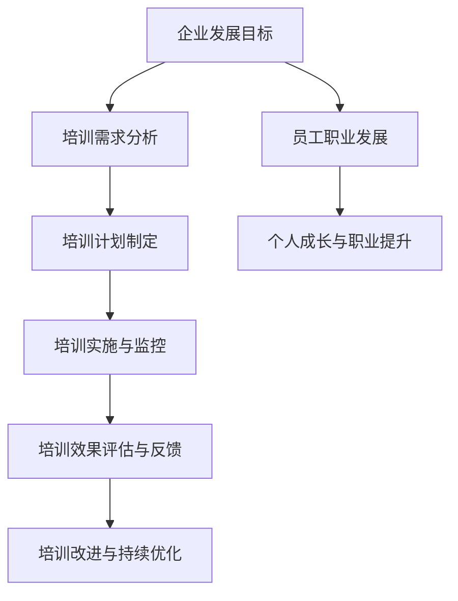

- **文章内容**：
    - 培训计划的意义与目标
    - 培训计划的分类与类型
    - 培训计划的设计原则

##### 1.2 培训需求分析

- **核心概念与联系**：培训需求分析方法与工具的Mermaid流程图

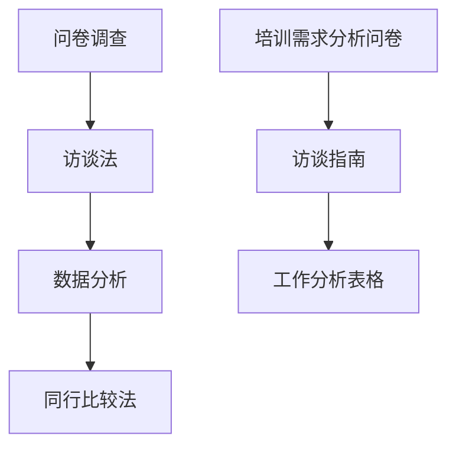

- **文章内容**：
    - 培训需求分析的意义与目的
    - 培训需求分析的方法与工具
    - 培训需求分析的结果与应用

##### 1.3 培训内容规划

- **核心概念与联系**：培训内容设计与规划的Mermaid流程图

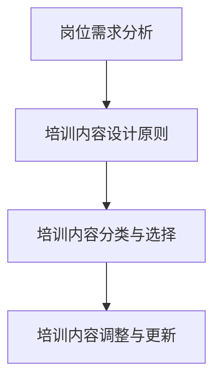

- **文章内容**：
    - 培训内容设计原则
    - 培训内容分类与选择
    - 培训内容调整与更新

#### 第2章：培训需求分析

##### 2.1 培训需求分析的方法

- **核心算法原理讲解**：问卷调查的伪代码

```python
# 伪代码：问卷调查方法
class Survey:
    def __init__(self, questions):
        self.questions = questions
    
    def display_survey(self):
        for question in self.questions:
            print(question)
    
    def collect_answers(self):
        answers = []
        for question in self.questions:
            answer = input(question + " ")
            answers.append(answer)
        return answers

# 使用示例
questions = ["您最希望提升哪方面的技能？", "您对当前培训内容的满意度如何？"]
survey = Survey(questions)
survey.display_survey()
answers = survey.collect_answers()
```

- **文章内容**：
    - 问卷调查法
    - 访谈法
    - 数据分析法
    - 同行比较法

##### 2.2 培训需求分析的工具

- **文章内容**：
    - 培训需求分析问卷模板
    - 培训需求访谈指南
    - 绩效分析工具

##### 2.3 培训需求分析的结果与应用

- **文章内容**：
    - 编制《培训需求分析报告》
    - 制定《培训计划》
    - 制定《培训项目清单》
    - 制定《培训资源分配方案》

### 第二部分：培训计划实施策略

#### 第3章：培训内容规划

##### 3.1 培训内容设计原则

- **核心算法原理讲解**：培训内容设计原则的伪代码

```python
# 伪代码：培训内容设计原则
class TrainingContent:
    def __init__(self, job_requirements):
        self.job_requirements = job_requirements
    
    def design_content(self):
        content = {}
        for requirement in self.job_requirements:
            content[requirement] = self.create_course(requirement)
        return content

    def create_course(self, requirement):
        # 创建培训课程的逻辑
        course = {}
        course['title'] = requirement
        course['description'] = "本课程旨在提高学员的" + requirement + "能力"
        course['duration'] = 40  # 培训时长为40小时
        return course

# 使用示例
job_requirements = ["软件开发技能", "项目管理能力", "团队协作技巧"]
training_content = TrainingContent(job_requirements)
training_content.design_content()
```

- **文章内容**：
    - 符合岗位需求
    - 技能与素质并重
    - 适应发展需求
    - 注重实践应用

##### 3.2 培训内容的分类与选择

- **文章内容**：
    - 专业技能培训
    - 管理技能培训
    - 综合素质培训
    - 企业文化培训

##### 3.3 培训内容的调整与更新

- **文章内容**：
    - 定期评估培训效果
    - 跟进行业动态
    - 重视员工反馈

#### 第4章：培训方式与方法

##### 4.1 培训方式的种类

- **文章内容**：
    - 面授培训
    - 在线培训
    - 在职培训
    - 培训旅行

##### 4.2 面授培训

- **文章内容**：
    - 面授培训的优势
    - 面授培训的注意事项
    - 面授培训的常见问题及解决方案

##### 4.3 在线培训

- **文章内容**：
    - 在线培训的优势
    - 在线培训的常见问题及解决方案
    - 在线培训的技术支持

#### 第5章：培训师与师资管理

##### 5.1 培训师的角色与职责

- **核心概念与联系**：培训师职责与能力的Mermaid流程图

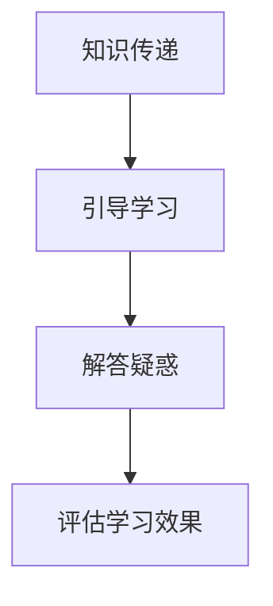

- **文章内容**：
    - 培训师的职责
    - 培训师的能力要求
    - 培训师的职业道德

##### 5.2 培训师的选拔与培训

- **文章内容**：
    - 培训师的选拔标准
    - 培训师的培养方法
    - 培训师的激励措施

##### 5.3 培训师的绩效评估

- **核心算法原理讲解**：培训师绩效评估的伪代码

```python
# 伪代码：培训师绩效评估
class TrainerPerformance:
    def __init__(self, trainer):
        self.trainer = trainer
    
    def assess_performance(self):
        # 评估培训师绩效的逻辑
        performance = {}
        performance['student_satisfaction'] = self.calculate_satisfaction()
        performance['course_effectiveness'] = self.calculate_effectiveness()
        return performance

    def calculate_satisfaction(self):
        # 计算学员满意度
        satisfaction = 0
        for review in self.trainer.reviews:
            satisfaction += review['rating']
        return satisfaction / len(self.trainer.reviews)

    def calculate_effectiveness(self):
        # 计算课程有效性
        effectiveness = 0
        for course in self.trainer.courses:
            effectiveness += course['evaluation_score']
        return effectiveness / len(self.trainer.courses)

# 使用示例
trainer = Trainer("张三")
trainer_performance = TrainerPerformance(trainer)
trainer_performance.assess_performance()
```

- **文章内容**：
    - 培训师绩效评估的目的
    - 培训师绩效评估的方法
    - 培训师绩效评估的结果与应用

#### 第6章：培训过程管理

##### 6.1 培训计划的执行与监控

- **核心算法原理讲解**：培训计划执行的伪代码

```python
# 伪代码：培训计划执行
class TrainingPlanExecution:
    def __init__(self, plan):
        self.plan = plan
    
    def execute_plan(self):
        # 执行培训计划的逻辑
        for activity in self.plan['activities']:
            self.perform_activity(activity)

    def perform_activity(self, activity):
        # 执行单个活动的逻辑
        print("执行活动：" + activity['name'])
        if activity['type'] == "讲座":
            self.give_lecture(activity['details'])
        elif activity['type'] == "演练":
            self.perform_drill(activity['details'])

    def give_lecture(self, details):
        # 讲座的逻辑
        print("进行讲座：" + details['topic'])

    def perform_drill(self, details):
        # 演练的逻辑
        print("进行演练：" + details['scenario'])
```

- **文章内容**：
    - 培训计划的执行流程
    - 培训过程的监控方法
    - 培训计划的调整与优化

##### 6.2 培训效果的评估

- **核心算法原理讲解**：培训效果评估的伪代码

```python
# 伪代码：培训效果评估
class TrainingEffectivenessEvaluation:
    def __init__(self, trainees, training_plan):
        self.trainees = trainees
        self.training_plan = training_plan
    
    def evaluate_effectiveness(self):
        # 评估培训效果的逻辑
        effectiveness_scores = []
        for trainee in self.trainees:
            score = self.calculate_score(trainee)
            effectiveness_scores.append(score)
        return sum(effectiveness_scores) / len(effectiveness_scores)

    def calculate_score(self, trainee):
        # 计算单个学员的培训效果得分
        score = 0
        for assessment in trainee['assessments']:
            score += assessment['score']
        return score / len(trainee['assessments'])

# 使用示例
trainees = [{'name': '李四', 'assessments': [{'score': 80}, {'score': 90}]}, {'name': '王五', 'assessments': [{'score': 85}, {'score': 88}]}]
training_plan = {'name': '软件开发技能培训', 'duration': 40}
evaluation = TrainingEffectivenessEvaluation(trainees, training_plan)
evaluation.evaluate_effectiveness()
```

- **文章内容**：
    - 培训效果评估的目的
    - 培训效果评估的方法
    - 培训效果评估的工具

##### 6.3 培训反馈与改进

- **文章内容**：
    - 培训反馈的渠道
    - 培训反馈的处理
    - 培训改进的措施

### 第三部分：培训项目评估与反馈

#### 第7章：培训项目评估

##### 7.1 培训项目评估的意义

- **核心概念与联系**：培训项目评估与培训质量提升的Mermaid流程图

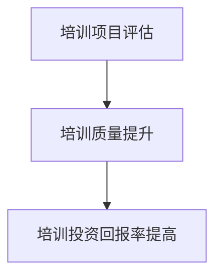

- **文章内容**：
    - 确保培训项目的有效性和合理性
    - 提高培训项目的管理水平和质量

##### 7.2 培训项目评估的方法

- **核心算法原理讲解**：培训项目评估方法的伪代码

```python
# 伪代码：培训项目评估方法
class TrainingProjectEvaluation:
    def __init__(self, project):
        self.project = project
    
    def quantitative_evaluation(self):
        # 定量评估的逻辑
        scores = []
        for metric in self.project['metrics']:
            score = self.calculate_metric_score(metric)
            scores.append(score)
        return sum(scores) / len(scores)

    def calculate_metric_score(self, metric):
        # 计算某个指标得分的逻辑
        score = 0
        if metric['type'] == "考试":
            score = metric['score']
        elif metric['type'] == "问卷调查":
            score = metric['responses']['satisfied'] / metric['responses']['total']
        return score

    def qualitative_evaluation(self):
        # 定性评估的逻辑
        evaluations = []
        for review in self.project['reviews']:
            evaluation = self.calculate_review_score(review)
            evaluations.append(evaluation)
        return sum(evaluations) / len(evaluations)

    def calculate_review_score(self, review):
        # 计算单个评价得分的逻辑
        score = 0
        if review['rating'] == "优秀":
            score = 4
        elif review['rating'] == "良好":
            score = 3
        elif review['rating'] == "一般":
            score = 2
        elif review['rating'] == "差":
            score = 1
        return score

# 使用示例
project = {'name': '软件开发技能培训', 'metrics': [{'type': '考试', 'score': 90}, {'type': '问卷调查', 'responses': {'satisfied': 30, 'total': 40}}], 'reviews': [{'rating': '优秀'}, {'rating': '良好'}, {'rating': '一般'}, {'rating': '差'}]}
evaluation = TrainingProjectEvaluation(project)
evaluation.quantitative_evaluation()
evaluation.qualitative_evaluation()
```

- **文章内容**：
    - 定量评估
    - 定性评估

##### 7.3 培训项目评估的指标

- **文章内容**：
    - 培训项目目标的达成度
    - 培训内容的有效性
    - 培训方式与方法的适用性
    - 培训资源的利用率
    - 培训效果对员工工作的影响

##### 7.4 培训项目评估的报告撰写

- **核心概念与联系**：培训项目评估报告撰写的Mermaid流程图

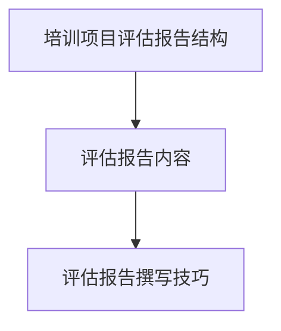

- **文章内容**：
    - 评估报告的结构
    - 评估报告的内容
    - 评估报告的撰写技巧

#### 第8章：培训反馈机制

##### 8.1 培训反馈的重要性

- **核心概念与联系**：培训反馈机制与培训质量提升的Mermaid流程图

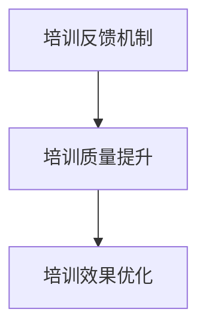

- **文章内容**：
    - 培训反馈是提高培训质量的重要手段
    - 有助于发现培训中的问题和不足

##### 8.2 培训反馈的方式与方法

- **文章内容**：
    - 培训反馈的渠道
    - 培训反馈的内容
    - 培训反馈的处理

##### 8.3 培训反馈的处理与改进

- **核心算法原理讲解**：培训反馈处理的伪代码

```python
# 伪代码：培训反馈处理
class TrainingFeedbackProcessing:
    def __init__(self, feedback):
        self.feedback = feedback
    
    def process_feedback(self):
        # 处理反馈的逻辑
        for item in self.feedback:
            if item['type'] == "问题":
                self.handle_issue(item)
            elif item['type'] == "建议":
                self.handle_suggestion(item)

    def handle_issue(self, issue):
        # 处理问题的逻辑
        print("处理问题：" + issue['description'])

    def handle_suggestion(self, suggestion):
        # 处理建议的逻辑
        print("处理建议：" + suggestion['description'])

# 使用示例
feedback = [{'type': '问题', 'description': '培训内容过于理论，缺乏实践案例'}, {'type': '建议', 'description': '增加互动环节，提高学习参与度'}]
processing = TrainingFeedbackProcessing(feedback)
processing.process_feedback()
```

- **文章内容**：
    - 及时响应培训反馈
    - 定期分析培训反馈
    - 制定改进措施并实施
    - 持续优化培训过程

### 附录

#### 附录A：常用培训工具与资源

- **文章内容**：
    - 培训管理软件推荐
    - 培训资源库建设
    - 培训相关书籍推荐

#### 附录B：培训计划模板

- **文章内容**：
    - 培训计划模板的结构
    - 培训计划模板的内容
    - 培训计划模板的填写说明

#### 附录C：培训需求分析问卷模板

- **文章内容**：
    - 培训需求分析问卷的结构
    - 培训需求分析问卷的内容
    - 培训需求分析问卷的填写说明

#### 附录D：培训效果评估指标库

- **文章内容**：
    - 培训效果评估指标的定义
    - 培训效果评估指标的分类
    - 培训效果评估指标的示例

#### 附录E：培训反馈表模板

- **文章内容**：
    - 培训反馈表的结构
    - 培训反馈表的内容
    - 培训反馈表的填写说明

#### 附录F：培训师培训资源

- **文章内容**：
    - 培训师授课技巧培训
    - 培训师教学设计培训
    - 培训师职业发展培训

#### 附录G：员工培训计划实施流程

- **文章内容**：
    - 培训计划制定流程
    - 培训活动组织流程
    - 培训效果评估流程
    - 培训反馈处理流程

#### 附录H：员工培训计划案例分析

- **文章内容**：
    - 案例一：某企业员工培训计划实施与评估
    - 案例二：某企业员工培训计划优化与创新
    - 案例三：某企业员工培训计划与企业发展协同

#### 附录I：员工培训计划法律法规

- **文章内容**：
    - 企业员工培训相关法律法规
    - 员工培训合同范本
    - 培训管理制度范本

#### 附录J：员工培训计划常见问题解答

- **文章内容**：
    - 员工培训计划制定常见问题解答
    - 员工培训实施常见问题解答
    - 员工培训评估常见问题解答
    - 员工培训反馈处理常见问题解答

## 作者信息：

作者：AI天才研究院/AI Genius Institute & 禅与计算机程序设计艺术 /Zen And The Art of Computer Programming

---

文章标题：员工培训计划：LLM定制学习课程

关键词：员工培训计划、LLM定制学习、培训设计、学习效果评估、培训师管理

摘要：本文围绕员工培训计划，尤其是基于语言学习模型（LLM）的定制学习课程展开。文章首先探讨了员工培训计划的设计与实施基础，包括培训计划的重要性、培训需求分析、培训内容规划等。随后，详细介绍了培训实施策略，如培训方式与方法、培训师与师资管理、培训过程管理等。最后，文章讨论了培训项目评估与反馈机制，以及常用培训工具与资源，为企业和组织提供了一套全面的培训解决方案。

### 第一部分：员工培训计划设计与实施基础

#### 第1章：员工培训计划概述

##### 1.1 培训计划的重要性

**核心概念与联系**：培训计划在企业发展和员工职业发展中的作用

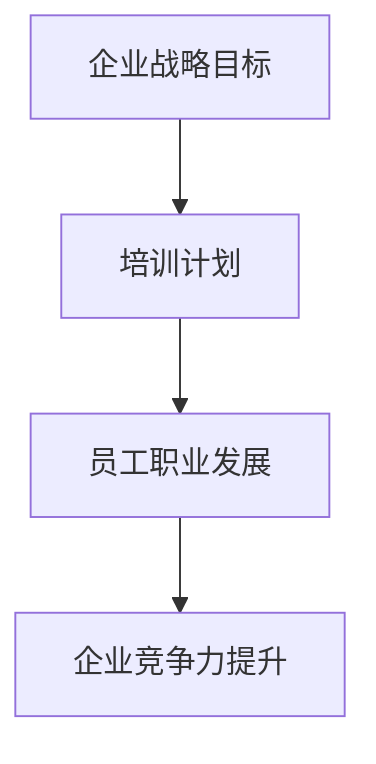

**文章内容**：

- **培训计划的意义与目标**：
  - 培训是提高员工能力、促进个人成长，提升企业竞争力的重要手段。
  - 培训计划的目标是明确培训目的、制定合理的培训策略、提高培训效果。

- **培训计划的分类**：
  - 根据培训内容：专业技能培训、综合素质培训。
  - 根据培训对象：新员工培训、在职员工培训。
  - 根据培训形式：内部培训、外部培训。

- **培训计划的设计原则**：
  - 明确目标：设定清晰、可衡量的培训目标。
  - 因地制宜：根据企业实际情况和员工需求设计培训内容。
  - 系统化：确保培训内容的连贯性和系统性。
  - 可操作性：培训计划要易于执行和评估。

##### 1.2 培训需求分析

**核心概念与联系**：培训需求分析与培训计划制定的关系

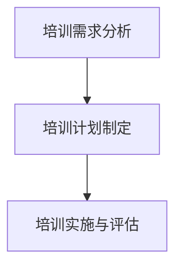

**文章内容**：

- **培训需求分析的意义与目的**：
  - 确定培训的必要性和优先级。
  - 有助于提高培训的效果和效益。

- **培训需求分析的方法**：
  - 问卷调查法：通过问卷收集员工和部门对培训的需求和期望。
  - 访谈法：与员工和相关部门进行深入访谈，了解培训需求。
  - 数据分析法：分析员工的工作表现和绩效数据，发现培训需求。
  - 同行比较法：分析同行业其他企业的培训计划，借鉴优秀做法。

- **培训需求分析的工具**：
  - 培训需求分析问卷模板。
  - 培训需求分析访谈指南。
  - 绩效分析工具：如KPI分析、行为事件访谈法等。

- **培训需求分析的结果与应用**：
  - 编制《培训需求分析报告》。
  - 制定《培训计划》。
  - 制定《培训项目清单》。
  - 制定《培训资源分配方案》。

##### 1.3 培训内容规划

**核心概念与联系**：培训内容设计原则与培训效果的关联

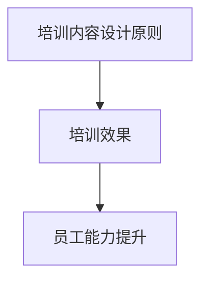

**文章内容**：

- **培训内容设计原则**：
  - 符合岗位需求：确保培训内容与员工岗位需求相符。
  - 技能与素质并重：平衡培训的技术性内容和实践能力培养。
  - 适应发展需求：关注行业趋势和公司战略，设计前瞻性培训内容。
  - 注重实践应用：强调培训内容的实际应用性，提高员工工作效果。

- **培训内容的分类与选择**：
  - 专业技能培训：如软件技能、硬件技能、项目管理等。
  - 综合素质培训：如沟通技巧、领导力、团队合作等。
  - 行业知识培训：如行业趋势、法律法规、市场分析等。
  - 企业文化培训：如企业文化、价值观、团队精神等。

- **培训内容的调整与更新**：
  - 定期评估培训效果，调整培训内容。
  - 跟进行业动态，更新培训内容。
  - 重视员工反馈，调整培训内容。

### 第二部分：培训计划实施策略

#### 第2章：培训内容规划

**核心概念与联系**：培训内容规划与员工能力提升的关系

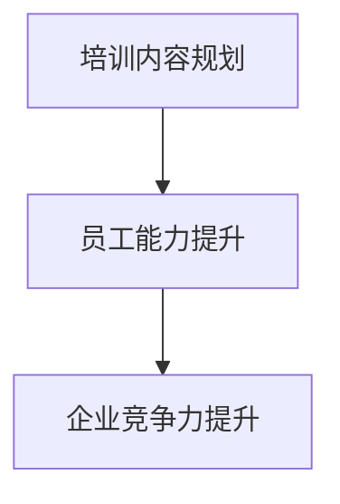

**文章内容**：

- **培训内容设计原则**：
  - **符合岗位需求**：
    - 根据员工岗位描述和工作职责，明确培训的重点内容。
    - 设计培训课程，确保培训内容与员工工作紧密结合。
    - 定期更新培训内容，以适应岗位需求的变化。

  - **技能与素质并重**：
    - 在培训课程中，平衡技术技能和综合素质的培养。
    - 通过案例分析、小组讨论等方式，提高员工的综合素质。
    - 定期评估员工的学习成果，确保培训效果。

  - **适应发展需求**：
    - 结合企业战略目标和行业发展趋势，规划培训内容。
    - 引入新兴技术和热门领域的内容，提升员工的专业素养。
    - 定期组织外部专家讲座，分享行业最新动态。

  - **注重实践应用**：
    - 设计实践性强的培训项目，如工作坊、实际操作演练等。
    - 安排员工参与实际项目，将所学知识应用于工作。
    - 提供定期的实战案例分享，促进员工经验交流。

- **培训内容的分类与选择**：
  - **专业技能培训**：
    - 设计针对特定技能的培训课程，如编程语言、数据库管理、数据分析等。
    - 根据员工的技能水平和工作需求，选择合适的培训内容。
    - 定期评估员工的技能掌握情况，调整培训计划。

  - **综合素质培训**：
    - 提供领导力、沟通技巧、时间管理等综合素质培训。
    - 通过角色扮演、团队建设等活动，提升员工的综合素质。
    - 鼓励员工参加外部培训，拓宽视野和技能。

  - **行业知识培训**：
    - 组织行业趋势、市场分析、法规政策等培训课程。
    - 定期邀请行业专家进行讲座，分享行业最新动态。
    - 通过案例分析，帮助员工理解行业的发展和变化。

  - **企业文化培训**：
    - 传递企业核心价值观、使命和愿景。
    - 增强员工的归属感和团队意识。
    - 通过企业文化活动，促进员工之间的交流与合作。

- **培训内容的调整与更新**：
  - **定期评估**：
    - 通过调查问卷、访谈、绩效评估等方式，了解员工的培训需求。
    - 定期回顾培训效果，分析培训内容的适用性和效果。
    - 根据评估结果，调整和优化培训内容。

  - **跟进行业动态**：
    - 关注行业发展趋势和新技术，及时更新培训内容。
    - 定期分析行业报告和专家观点，为培训内容提供参考。
    - 适时引入新兴技术和创新实践，提升员工的专业素养。

  - **重视员工反馈**：
    - 建立员工反馈机制，收集员工对培训内容的意见和建议。
    - 及时回应员工的反馈，优化培训内容和教学方法。
    - 鼓励员工积极参与培训，提高培训的针对性和实用性。

#### 第3章：培训方式与方法

**核心概念与联系**：培训方式与方法与培训效果的关系

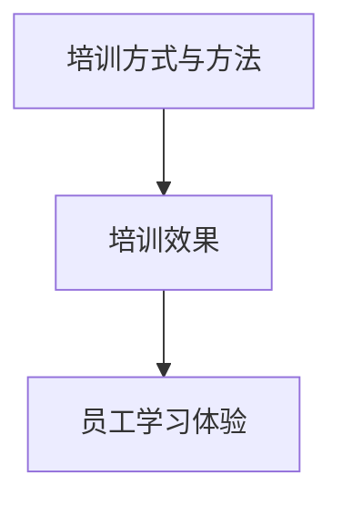

**文章内容**：

- **培训方式的种类**：
  - **面授培训**：
    - 面授培训是一种传统的培训方式，适用于知识传递、技能训练和互动讨论。
    - 通过讲师的讲解、案例分析、角色扮演等方式，提高员工的参与度和学习效果。
    - 面授培训的优势在于实时互动和现场反馈，有助于解决员工的疑惑。

  - **在线培训**：
    - 在线培训是一种灵活的培训方式，适用于自主学习、知识更新和远程培训。
    - 通过在线课程、直播、录播等形式，员工可以根据自己的时间和节奏进行学习。
    - 在线培训的优势在于方便快捷，可以节省时间和成本。

  - **在职培训**：
    - 在职培训是员工在工作过程中进行的培训，适用于实际操作和技能提升。
    - 通过工作坊、实习、项目参与等形式，员工可以在实际工作中学习和应用所学知识。
    - 在职培训的优势在于理论与实践相结合，有助于提高员工的实际工作能力。

  - **培训旅行**：
    - 培训旅行是一种结合学习和旅游的培训方式，适用于团队建设和领导力培训。
    - 通过户外拓展、实地考察、团队合作等活动，提升员工的团队合作精神和领导能力。
    - 培训旅行的优势在于增强团队凝聚力和创造力。

- **面授培训**：
  - **优势**：
    - 实时互动：讲师与学员可以实时交流和讨论，提高学习效果。
    - 现场反馈：讲师可以根据学员的反应和问题进行现场调整，确保培训内容的适用性。
    - 专业性：面授培训通常由专业讲师进行，能够提供高质量的知识和技能传授。

  - **注意事项**：
    - 时间安排：确保培训时间与员工工作安排相符，避免影响日常工作。
    - 场地选择：选择适合培训的场地，确保培训环境舒适、设备齐全。
    - 教学方法：采用多样化的教学方法，如案例分析、小组讨论、角色扮演等，提高学员的参与度。

  - **常见问题及解决方案**：
    - **学员参与度不高**：
      - 通过互动环节、小组讨论等方式，提高学员的参与度。
      - 定期收集学员反馈，及时调整培训内容和教学方法。

    - **培训效果不明显**：
      - 加强培训后的实践应用，确保学员能够将所学知识应用到实际工作中。
      - 定期进行培训效果评估，发现和解决培训中的问题。

- **在线培训**：
  - **优势**：
    - 灵活性：学员可以根据自己的时间进行学习，不受地域限制。
    - 成本效益：节省了培训场地和交通费用，降低培训成本。
    - 可持续性：通过在线培训，可以持续更新培训内容，适应快速变化的市场需求。

  - **常见问题及解决方案**：
    - **技术问题**：
      - 提供必要的技术支持，确保学员能够顺利参与在线培训。
      - 提前测试网络和设备，避免培训过程中出现技术问题。

    - **学习效果不佳**：
      - 设计互动性强的在线课程，提高学员的学习兴趣和参与度。
      - 定期进行在线培训效果评估，及时调整课程内容和教学方法。

- **在职培训**：
  - **优势**：
    - 实践性：员工可以在实际工作中学习和应用所学知识，提高实际工作能力。
    - 持续性：在职培训可以贯穿员工整个职业生涯，帮助其不断成长。
    - 适应性：根据员工的岗位需求和公司战略，灵活调整培训内容和形式。

  - **常见问题及解决方案**：
    - **工作与培训冲突**：
      - 合理安排培训时间和工作安排，确保员工有足够的时间参与培训。
      - 通过灵活的培训方式，如在线培训，减少对员工工作的影响。

    - **培训效果难以评估**：
      - 设计具体的培训目标和评估指标，定期对培训效果进行评估。
      - 通过员工的绩效评估和工作表现，验证培训效果。

- **培训方式与方法的评估**：
  - 定期评估不同培训方式和方法的效果，根据评估结果调整培训策略。
  - 通过问卷调查、访谈、反馈表等方式，收集学员对培训方式和方法的意见和建议。
  - 结合员工的绩效提升和工作表现，评估培训方式和方法的有效性。

#### 第4章：培训师与师资管理

**核心概念与联系**：培训师在培训过程中的角色与培训效果的关系

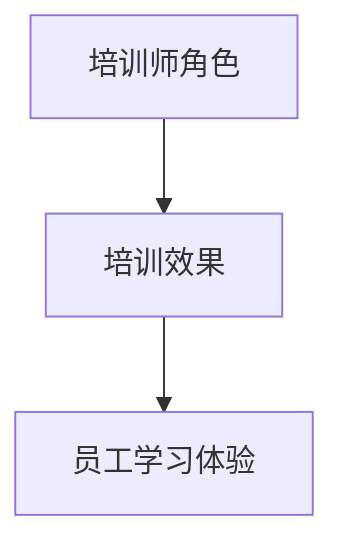

**文章内容**：

- **培训师的角色与职责**：
  - **角色**：
    - 培训师是培训过程中的核心人物，负责课程的设计、实施和评估。
    - 培训师不仅是知识的传授者，更是学习引导者和问题解决者。

  - **职责**：
    - 设计培训课程：根据培训目标和学员需求，设计合适的培训课程。
    - 实施培训课程：以专业、生动的方式传授知识，激发学员的学习兴趣。
    - 评估培训效果：通过考核、反馈等方式，评估学员的学习成果和培训效果。

- **培训师的选拔与培养**：
  - **选拔标准**：
    - 专业知识：具备扎实的专业知识和丰富的行业经验。
    - 教学能力：具备良好的教学能力和沟通技巧，能够有效地传授知识。
    - 持续学习：具备持续学习和自我提升的能力，能够不断更新知识和教学方法。

  - **培养方法**：
    - 内部培训：通过内部培训和交流，提高培训师的专业素质和教学能力。
    - 外部培训：参加外部专业培训，学习最新的教学方法和行业动态。
    - 导师指导：由资深培训师进行指导，帮助新晋培训师快速成长。

- **培训师的绩效评估与激励**：
  - **绩效评估**：
    - 设定明确的绩效评估指标，如学员满意度、培训效果、教学创新等。
    - 通过问卷调查、访谈、反馈等方式，收集学员和同事对培训师的评估。
    - 定期进行绩效评估，为培训师的职业发展提供依据。

  - **激励措施**：
    - 金钱激励：提供奖金、补贴等物质奖励，提高培训师的积极性。
    - 职业发展：提供晋升机会、培训机会等，激励培训师不断提升自己。
    - 荣誉奖励：设立优秀培训师奖项，表彰优秀培训师的贡献。

#### 第5章：培训过程管理

**核心概念与联系**：培训过程管理对培训效果的影响

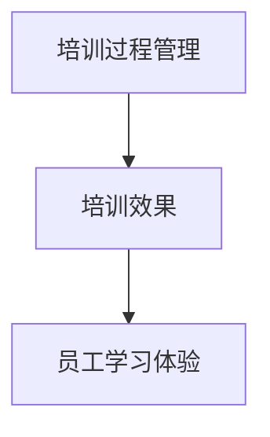

**文章内容**：

- **培训计划的执行与监控**：
  - **执行流程**：
    - 制定详细的培训计划，明确培训目标、内容、时间、地点和责任人。
    - 按照培训计划，组织培训活动，确保培训内容的实施。
    - 跟踪培训进度，及时调整计划，确保培训目标的达成。

  - **监控方法**：
    - 通过培训记录、考核评估、反馈机制，监控培训过程的各个环节。
    - 定期检查培训课程的实施情况，确保培训内容的正确传达。
    - 收集学员的反馈意见，及时处理培训过程中出现的问题。

- **培训效果的评估**：
  - **评估目的**：
    - 了解培训效果，验证培训目标的达成情况。
    - 评估培训计划的有效性，为后续培训提供参考。

  - **评估方法**：
    - 定量评估：通过考试成绩、技能测试等量化指标，评估学员的学习成果。
    - 定性评估：通过访谈、观察、案例分析等定性方法，评估学员的学习体验和培训效果。

  - **评估工具**：
    - 培训效果评估问卷：收集学员对培训内容和培训师的满意度。
    - 绩效评估工具：如KPI分析、行为事件访谈法等，评估学员在培训后的工作表现。

- **培训反馈与改进**：
  - **反馈渠道**：
    - 设立培训反馈机制，提供学员反馈的渠道，如问卷调查、面对面交流等。
    - 鼓励学员积极参与反馈，提供真实、详细的意见和建议。

  - **反馈处理**：
    - 及时响应学员的反馈，解决问题，改进培训内容和教学方法。
    - 定期分析反馈结果，总结培训过程中的优点和不足，为后续培训提供改进方向。

  - **改进措施**：
    - 根据反馈结果，调整培训计划，优化培训内容和方法。
    - 加强培训师的专业素质和教学能力，提高培训质量。
    - 提供定期的培训和辅导，帮助学员更好地应用所学知识。

### 第三部分：培训项目评估与反馈

#### 第6章：培训项目评估

**核心概念与联系**：培训项目评估与培训持续改进的关系

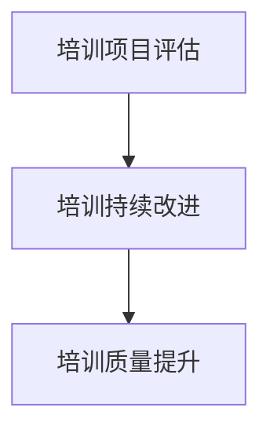

**文章内容**：

- **培训项目评估的意义与目的**：
  - **意义**：
    - 确保培训项目的有效性和合理性，提高培训投资回报率。
    - 为后续培训项目提供参考，优化培训资源配置。
  - **目的**：
    - 评估培训项目的效果，验证培训目标的达成情况。
    - 发现培训项目中的问题和不足，提出改进建议。

- **培训项目评估的方法**：
  - **定量评估**：
    - 通过考试成绩、技能测试等量化指标，评估学员的学习成果。
    - 分析学员的培训前后的绩效变化，评估培训效果。
  - **定性评估**：
    - 通过访谈、观察、案例分析等定性方法，评估学员的学习体验和培训效果。
    - 分析学员对培训内容和培训师的满意度，评估培训质量。

- **培训项目评估的指标**：
  - **培训目标达成度**：
    - 评估培训项目是否达到预定的培训目标。
    - 分析学员在培训后的工作表现和技能提升情况。
  - **学员满意度**：
    - 评估学员对培训内容和培训师的满意度。
    - 收集学员的反馈意见，为后续培训提供改进方向。
  - **培训效果转化率**：
    - 评估培训效果对员工工作绩效的影响。
    - 分析学员在培训后在实际工作中的应用情况。

- **培训项目评估的结果分析**：
  - **结果分析**：
    - 综合定量和定性评估结果，评估培训项目的整体效果。
    - 分析培训项目中的优点和不足，为后续培训提供改进建议。
  - **改进建议**：
    - 根据评估结果，调整培训计划，优化培训内容和方法。
    - 加强培训师的培训和指导，提高培训质量。
    - 提供定期的培训和辅导，帮助学员更好地应用所学知识。

#### 第7章：培训反馈机制

**核心概念与联系**：培训反馈机制与培训质量提升的关系

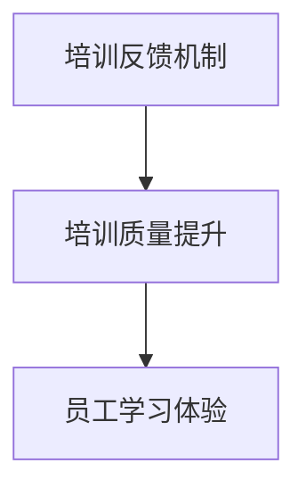

**文章内容**：

- **培训反馈的重要性**：
  - **重要性**：
    - 培训反馈是提高培训质量的重要手段。
    - 通过培训反馈，可以及时发现培训中的问题和不足，优化培训过程。
  - **作用**：
    - 促进学员学习，提升学习效果。
    - 为培训师提供改进教学的机会，提高培训质量。

- **培训反馈的方式与方法**：
  - **问卷调查**：
    - 通过问卷调查，收集学员对培训内容和培训师的反馈。
    - 设计针对性的问卷，确保反馈信息的全面性和准确性。
  - **访谈**：
    - 与学员进行面对面访谈，深入了解学员的学习体验和培训需求。
    - 访谈过程中注重倾听，确保反馈信息的真实性。
  - **在线反馈**：
    - 提供在线反馈渠道，方便学员随时随地进行反馈。
    - 设立在线反馈平台，确保反馈信息的及时性和便捷性。

- **培训反馈的处理与改进**：
  - **处理**：
    - 及时响应培训反馈，解决学员提出的问题。
    - 分析反馈结果，总结培训过程中的优点和不足。
  - **改进**：
    - 根据反馈结果，调整培训计划，优化培训内容和方法。
    - 加强培训师的培训和指导，提高培训质量。
    - 提供定期的培训和辅导，帮助学员更好地应用所学知识。

### 附录

#### 附录A：常用培训工具与资源

- **文章内容**：
  - **培训管理软件推荐**：
    - 介绍几种常见的培训管理软件，如Moodle、Canvas等，以及它们的功能和特点。
  - **培训资源库建设**：
    - 讨论如何建立和管理培训资源库，包括资源分类、存储和检索方法。
  - **培训相关书籍推荐**：
    - 推荐一些优秀的培训相关书籍，如《培训体系建设》、《员工培训管理实务》等。

#### 附录B：培训计划模板

- **文章内容**：
  - **培训计划模板的结构**：
    - 提供一个典型的培训计划模板，包括培训目标、培训内容、培训时间、培训方式等。
  - **培训计划模板的内容**：
    - 详细说明培训计划模板中的各个部分，以及如何填写和运用。
  - **培训计划模板的填写说明**：
    - 指导如何根据实际情况填写培训计划模板，以及如何根据培训计划模板进行培训组织和管理。

#### 附录C：培训需求分析问卷模板

- **文章内容**：
  - **培训需求分析问卷的结构**：
    - 提供一个典型的培训需求分析问卷模板，包括问卷目的、问卷内容、问卷填写说明等。
  - **培训需求分析问卷的内容**：
    - 详细说明培训需求分析问卷中的各个部分，以及如何设计问卷问题。
  - **培训需求分析问卷的填写说明**：
    - 指导如何根据实际情况填写培训需求分析问卷，以及如何根据问卷结果进行分析和制定培训计划。

#### 附录D：培训效果评估指标库

- **文章内容**：
  - **培训效果评估指标的定义**：
    - 解释常见的培训效果评估指标，如学员满意度、学习成果、工作绩效等。
  - **培训效果评估指标的分类**：
    - 根据指标的性质和用途，对培训效果评估指标进行分类。
  - **培训效果评估指标的示例**：
    - 提供一些具体的培训效果评估指标示例，以及如何计算和运用这些指标。

#### 附录E：培训反馈表模板

- **文章内容**：
  - **培训反馈表的结构**：
    - 提供一个典型的培训反馈表模板，包括反馈内容、反馈渠道、反馈处理等。
  - **培训反馈表的内容**：
    - 详细说明培训反馈表中的各个部分，以及如何填写和运用。
  - **培训反馈表的填写说明**：
    - 指导如何根据实际情况填写培训反馈表，以及如何根据反馈表结果进行分析和改进。

#### 附录F：培训师培训资源

- **文章内容**：
  - **培训师授课技巧培训**：
    - 提供培训师授课技巧的培训资源和指导，如教学设计、课堂管理、互动教学等。
  - **培训师教学设计培训**：
    - 提供培训师教学设计的培训资源和指导，如课程内容设计、教学方法选择、教学评估等。
  - **培训师职业发展培训**：
    - 提供培训师职业发展的培训资源和指导，如职业规划、领导力培养、沟通技巧等。

#### 附录G：员工培训计划实施流程

- **文章内容**：
  - **培训计划制定流程**：
    - 详细描述员工培训计划制定的步骤和注意事项，包括培训需求分析、培训目标设定、培训内容设计等。
  - **培训活动组织流程**：
    - 详细描述培训活动组织的步骤和注意事项，包括培训时间安排、培训场地选择、培训师选拔等。
  - **培训效果评估流程**：
    - 详细描述培训效果评估的步骤和注意事项，包括培训效果评估方法、评估指标设定、评估结果分析等。
  - **培训反馈处理流程**：
    - 详细描述培训反馈处理的步骤和注意事项，包括反馈收集、反馈分析、反馈处理等。

#### 附录H：员工培训计划案例分析

- **文章内容**：
  - **案例一：某企业员工培训计划实施与评估**：
    - 分析某企业员工培训计划的实施过程和效果评估，包括培训需求分析、培训内容设计、培训活动组织、培训效果评估等。
  - **案例二：某企业员工培训计划优化与创新**：
    - 分析某企业员工培训计划的优化和创新过程，包括培训方式创新、培训内容调整、培训反馈处理等。
  - **案例三：某企业员工培训计划与企业发展协同**：
    - 分析某企业员工培训计划与企业发展战略的协同关系，包括培训目标与企业目标的一致性、培训资源与企业资源整合等。

#### 附录I：员工培训计划法律法规

- **文章内容**：
  - **企业员工培训相关法律法规**：
    - 介绍与企业员工培训相关的法律法规，如劳动法、职业教育法等。
  - **员工培训合同范本**：
    - 提供员工培训合同的范本，包括培训内容、培训期限、培训待遇等条款。
  - **培训管理制度范本**：
    - 提供企业培训管理制度的范本，包括培训计划制定、培训组织管理、培训效果评估等制度。

#### 附录J：员工培训计划常见问题解答

- **文章内容**：
  - **员工培训计划制定常见问题解答**：
    - 回答员工培训计划制定过程中常见的问题，如培训目标如何设定、培训内容如何选择等。
  - **员工培训实施常见问题解答**：
    - 回答员工培训实施过程中常见的问题，如培训时间安排、培训场地选择等。
  - **员工培训评估常见问题解答**：
    - 回答员工培训评估过程中常见的问题，如评估方法选择、评估指标设定等。
  - **员工培训反馈处理常见问题解答**：
    - 回答员工培训反馈处理过程中常见的问题，如反馈渠道选择、反馈处理方法等。

