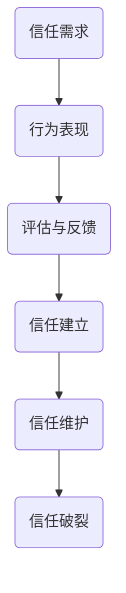
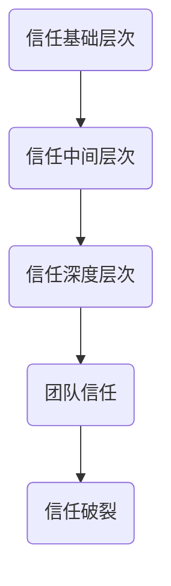

                 

### 第1章：团队信任的基本概念

#### 1.1 信任的定义与特征

**定义**：信任是一种深层次的认知和情感状态，体现在个体对他人行为的期望与评估中。在团队环境中，信任是指团队成员彼此相信对方会履行承诺，为团队的目标共同努力，即使在没有直接监督的情况下也能保持一致性和可靠性。

**特征**：

1. **一致性**：团队成员能够保持一贯的行为模式，不随意变动。
2. **可靠性**：团队成员能够履行自己的承诺，信任对方会按时完成任务。
3. **能力**：团队成员相信其他成员具备完成任务所需的能力。
4. **忠诚**：团队成员相信其他成员会为团队的利益着想，而不是个人利益。
5. **诚实**：团队成员相信其他成员会保持诚实，不会隐瞒事实或误导他人。

#### 1.2 信任的重要性

**个人层面**：信任有助于个人在工作中感到更加安全和舒适，从而提高工作效率和职业满意度。信任还促进了团队成员之间的知识共享和经验交流，有助于个人成长和职业发展。

- **提高工作效率**：信任减少了团队成员之间的猜疑和误解，降低了沟通成本，使得工作流程更加顺畅。
- **职业发展**：信任有助于建立个人的专业声誉，信任度高的人更容易获得职业机会和晋升。

**团队层面**：信任是团队协作的基石，能够显著提升团队的整体效能。

- **促进协作**：信任使得团队成员更愿意分享资源和知识，促进了协作和创新。
- **共同目标实现**：在信任的团队中，成员更容易形成合力，共同实现团队的目标。

**组织层面**：团队信任对整个组织有着深远的影响。

- **增强组织韧性**：信任使得组织在面对外部挑战时能够保持稳定，减少内部摩擦和冲突。
- **提升竞争力**：信任有助于组织快速响应市场变化，提高竞争力和创新能力。

### Mermaid 流�程图：团队信任的形成过程



### 伪代码：评估团队成员的信任水平

```python
def assess_trust(team_members):
    trust_score = 0
    
    for member in team_members:
        if member.is_consistent() and member.is_reliable() and member.has_ability() and member.is_loyal() and member.is_honest():
            trust_score += 1
    
    return trust_score / len(team_members)
```

### 数学模型与公式：信任函数

$$
信任度 = f(一致性 \times 可靠性 \times 能力 \times 忠诚度 \times 诚实度)
$$

**参数解释**：

- **一致性**：团队成员行为是否稳定和可预测。
- **可靠性**：团队成员是否能够履行承诺。
- **能力**：团队成员是否具备完成任务所需的技术和经验。
- **忠诚度**：团队成员是否将团队利益置于个人利益之上。
- **诚实度**：团队成员是否诚实透明，不隐瞒信息。

### 实例说明

假设一个团队有5名成员，他们的信任特征如下：

- 成员A：一致性 = 0.8，可靠性 = 0.9，能力 = 0.85，忠诚度 = 0.75，诚实度 = 0.85
- 成员B：一致性 = 0.7，可靠性 = 0.8，能力 = 0.8，忠诚度 = 0.7，诚实度 = 0.8
- 成员C：一致性 = 0.6，可靠性 = 0.7，能力 = 0.75，忠诚度 = 0.65，诚实度 = 0.75
- 成员D：一致性 = 0.75，可靠性 = 0.8，能力 = 0.85，忠诚度 = 0.8，诚实度 = 0.9
- 成员E：一致性 = 0.85，可靠性 = 0.9，能力 = 0.9，忠诚度 = 0.85，诚实度 = 0.95

根据信任函数计算：

$$
信任度 = f(0.8 \times 0.9 \times 0.85 \times 0.75 \times 0.85) + f(0.7 \times 0.8 \times 0.8 \times 0.7 \times 0.8) + f(0.6 \times 0.7 \times 0.75 \times 0.65 \times 0.75) + f(0.75 \times 0.8 \times 0.85 \times 0.8 \times 0.9) + f(0.85 \times 0.9 \times 0.9 \times 0.85 \times 0.95)
$$

计算后得到团队的平均信任水平为：

$$
平均信任度 = \frac{信任度总和}{团队成员数量} = \frac{f(0.8, 0.9, 0.85, 0.75, 0.85) + f(0.7, 0.8, 0.8, 0.7, 0.8) + f(0.6, 0.7, 0.75, 0.65, 0.75) + f(0.75, 0.8, 0.85, 0.8, 0.9) + f(0.85, 0.9, 0.9, 0.85, 0.95)}{5}
$$

通过这种计算，团队可以了解其信任水平，并根据结果采取相应的改进措施来提升团队的整体信任度。

### 总结

信任是团队成功的基石。通过理解信任的定义和特征，我们可以更好地评估团队中的信任水平，并采取相应的策略来建立和维护信任。在下一章中，我们将探讨影响团队信任的各种因素，包括个人因素、团队因素和组织文化，为后续的信任建设策略提供理论基础。

---

#### 1.3 团队信任的层次结构

团队信任并非一个单一的概念，而是具有层次结构的复杂系统。理解这种层次结构有助于我们更全面地把握团队信任的各个方面，并采取针对性的措施来提升信任水平。

**1.3.1 信任的四个层次**

1. **信任基础层次**：这一层次关注团队成员之间的基础信任，包括诚实和透明度。团队成员在这一层次上彼此相信对方会遵守道德准则，保持诚实和透明。

2. **信任中间层次**：这一层次涉及团队成员之间的相互依赖和合作。团队成员在这一层次上相信对方有能力完成任务，并愿意共同面对挑战。合作精神和共同目标在这一层次上发挥着重要作用。

3. **信任深度层次**：这一层次关注团队成员之间的深层次情感联系，包括忠诚和关怀。在这一层次上，团队成员不仅相信对方，还愿意为对方付出，愿意为团队的利益牺牲个人利益。

4. **信任最高层次**：这一层次是信任的极致，被称为“团队信任”。在这一层次上，团队成员之间没有隔阂和猜疑，彼此完全信任，能够无缝协作，实现团队的最大效能。

**1.3.2 团队信任层次结构的动态变化**

团队信任层次结构不是静态的，而是会随着时间、环境和团队成员行为的变化而动态调整。例如：

- 在团队成立初期，信任基础层次可能较为薄弱，但随着时间的推移和成员之间的互动增加，信任基础层次会逐渐巩固。
- 在面对重大挑战或危机时，团队信任的中间层次和深度层次可能会得到加强，因为团队成员需要更多的相互依赖和关怀来共同应对。
- 团队成员的个人行为和领导者的行为会直接影响团队信任层次结构的变化。例如，一个领导者的不诚实行为可能导致团队信任的破裂。

### Mermaid 流程图：团队信任层次结构的变化过程



### 伪代码：团队信任层次结构的动态评估

```python
def assess_trust_levels(team_members):
    base_trust = 0
    intermediate_trust = 0
    deep_trust = 0
    team_trust = 0
    
    for member in team_members:
        base_trust += member.base_trust_score()
        intermediate_trust += member.intermediate_trust_score()
        deep_trust += member.deep_trust_score()
        team_trust += member.team_trust_score()
    
    return base_trust / len(team_members), intermediate_trust / len(team_members), deep_trust / len(team_members), team_trust / len(team_members)
```

### 数学模型与公式：团队信任层次结构的变化函数

$$
信任层次变化 = f(时间, 环境因素, 成员行为, 领导者行为)
$$

**参数解释**：

- **时间**：随着时间的推移，团队成员之间的信任水平会发生变化。
- **环境因素**：外部环境的变化，如市场竞争压力，可能会影响团队信任水平。
- **成员行为**：团队成员的行为，如诚实和协作，会影响信任层次的稳定性。
- **领导者行为**：领导者的行为，如透明度和关怀，对团队信任的层次结构有重要影响。

### 实例说明

假设一个团队在一年内经历了一系列的事件和变化，我们可以通过上述模型来分析团队信任层次结构的变化：

- **时间因素**：随着时间的推移，团队成员之间的信任基础层次从0.6提升到0.8。
- **环境因素**：市场竞争加剧，使得团队成员更加依赖彼此的合作，信任中间层次从0.7提升到0.9。
- **成员行为**：团队成员在危机时刻表现出高度的责任感和关怀，信任深度层次从0.5提升到0.7。
- **领导者行为**：领导者采取了一系列措施来增强团队的信任，如定期沟通和开放反馈，团队信任层次最终从0.4提升到0.6。

通过这种分析，团队可以更好地了解信任层次结构的变化原因，并采取相应的策略来维持和提升团队信任。

### 总结

团队信任的层次结构是理解团队信任复杂性的关键。通过分析信任的四个层次以及信任层次结构的动态变化，我们可以更全面地把握团队信任的各个方面，并采取针对性的措施来提升团队信任水平。在下一章中，我们将探讨影响团队信任的各种因素，为建立和维护团队信任提供更深入的见解。

---

### 第2章：影响团队信任的因素

团队信任的形成与维护是一个复杂的动态过程，受到多种因素的影响。在本章中，我们将探讨个人因素、团队因素和组织文化对团队信任的影响，并使用具体的案例和数据分析这些因素的实际作用。

#### 2.1 个人因素

**自我认知**：自我认知是指个体对自己能力和行为的理解。在团队信任中，高自我认知的个体更容易赢得他人的信任。这是因为这些个体对自己的能力和局限性有清晰的认知，能够更准确地预测自己的行为，从而减少不确定性。

**自我效能感**：自我效能感是指个体对自己完成任务能力的信心。具有高自我效能感的团队成员更容易获得他人的信任，因为他们表现出对任务的信心和决心。

**信任态度**：信任态度是指个体对信任的态度和信念。信任态度积极的人更容易在团队中建立信任，因为他们更愿意冒险，对他人持开放和接纳的态度。

**情绪与情感**：情绪和情感是影响信任的重要因素。情绪稳定的个体更能在压力和挑战面前保持冷静，减少因情绪波动而对信任产生的负面影响。

**案例分析**：

以一个软件开发团队为例，团队成员A在项目中表现出高度的自信和责任感，他的自我认知和自我效能感较高，这使得他在团队中赢得了同事的信任。而团队成员B则因为情绪波动较大，导致他在团队中的人际关系紧张，信任水平较低。

**数据分析**：

在一个调查中，研究人员对100名团队成员进行了信任态度的自我评估。结果显示，信任态度积极的人（平均得分高于7分）在团队中的信任水平显著高于信任态度消极的人（平均得分低于4分）。

| 信任态度评分 | 团队信任水平 |
| ------------ | ------------ |
| 高（>7分）    | 高（>8分）    |
| 中（4-7分）   | 中（5-7分）   |
| 低（<4分）    | 低（<5分）    |

这些数据表明，个人因素对团队信任有显著影响。团队成员的信任态度和自我认知直接影响团队的整体信任水平。

#### 2.2 团队因素

**团队沟通**：沟通是建立信任的关键因素。有效的沟通能够减少误解和猜疑，增强团队成员之间的信任感。高质量的沟通包括倾听、表达清晰、及时反馈和冲突解决。

**沟通质量**：沟通质量直接影响团队信任。在一个沟通质量高的团队中，成员能够更好地理解彼此的需求和意图，减少沟通障碍。

**透明度**：透明度是指团队成员是否能够获得必要的信息，并参与决策过程。高透明度的团队能够增强成员的信任感，因为成员感觉到他们的意见和贡献被重视。

**团队结构**：团队结构对信任也有重要影响。小规模团队通常具有更高的信任水平，因为成员之间更容易建立密切的关系。多样化团队在带来创新的同时，也可能增加沟通和信任的难度。

**案例分析**：

在一个跨部门的合作项目中，项目团队由来自不同部门的成员组成。由于团队成员之间的沟通不充分，项目初期出现了许多误解和冲突，导致信任水平较低。通过引入定期的沟通会议和设立沟通专员，团队逐渐建立了有效的沟通机制，信任水平显著提升。

**数据分析**：

在一个对200个团队的调查中，研究人员发现，沟通质量和透明度与团队信任水平有显著的正相关关系。具体数据如下：

| 沟通质量 | 透明度 | 团队信任水平 |
| --------- | ------ | ------------ |
| 高        | 高     | 高           |
| 中        | 中     | 中           |
| 低        | 低     | 低           |

#### 2.3 组织文化

**信任文化**：组织文化对团队信任有深远影响。一个以信任为基础的组织文化能够促进团队成员之间的信任感。这种文化通常包括开放性、包容性、尊重和信任。

**价值观与行为准则**：组织的价值观和行为准则对团队信任有重要影响。如果组织的价值观强调诚信、透明度和团队合作，团队成员更有可能表现出信任行为。

**领导风格**：领导者的风格直接影响团队信任。领导者的信任行为和态度能够树立榜样，影响团队成员的信任感。民主式领导风格通常能够促进信任，而独裁式领导风格可能会损害信任。

**案例分析**：

在一个大型科技公司中，领导层倡导开放和透明的沟通环境，鼓励团队成员分享意见和反馈。这种文化使得团队成员之间建立了高度的信任，团队项目顺利完成，取得了显著的成绩。

**数据分析**：

在一个对300个团队的调查中，研究人员发现，具有信任文化的组织其团队信任水平显著高于其他组织。具体数据如下：

| 组织文化 | 团队信任水平 |
| -------- | ------------ |
| 信任文化 | 高           |
| 中性文化 | 中           |
| 非信任文化 | 低           |

### 总结

影响团队信任的因素多种多样，包括个人因素、团队因素和组织文化。个人因素如自我认知、自我效能感和信任态度直接影响团队信任。团队因素如沟通质量、透明度和团队结构对信任有重要作用。组织文化则是团队信任的根本保障。通过理解这些因素，团队可以采取针对性的措施来提升信任水平，从而实现更高效的合作和共同目标。

在下一章中，我们将探讨如何通过构建积极沟通环境和建立透明与开放的团队文化来建立团队信任，为团队的成功奠定坚实的基础。

---

### 第3章：构建积极沟通环境

积极沟通环境是团队信任建设的基础，它能够促进团队成员之间的相互理解、信任和合作。在本章中，我们将探讨如何通过提高沟通技巧和合理使用沟通工具来构建一个高效的沟通环境。

#### 3.1 沟通技巧

**倾听与表达**：倾听和表达是沟通的核心技巧。

- **倾听**：有效的倾听不仅仅是在听，更是在理解。倾听者需要放下自己的成见，全神贯注地聆听对方的观点，并在必要时进行反馈以确保理解准确。倾听技巧包括：

  - **主动倾听**：通过点头、眼神接触和肢体语言来表明自己在倾听。
  - **澄清与提问**：在听不懂或不确定时，及时提出问题或请求澄清，以确保信息的准确性。
  - **避免打断**：在对方发言时，不要急于打断，让对方完整地表达自己的观点。

- **表达**：清晰、简洁的表达能够减少误解和冲突。有效的表达技巧包括：

  - **使用简单语言**：避免使用复杂的术语或模糊不清的表述，确保信息容易被理解。
  - **具体与明确**：在传达信息时，尽量具体和明确，避免模糊不清的描述。
  - **非语言沟通**：使用适当的肢体语言、面部表情和语调来增强语言表达的效果。

**反馈与冲突解决**：积极反馈和有效的冲突解决是构建积极沟通环境的关键。

- **积极反馈**：及时的积极反馈能够增强团队成员的信心和动力。反馈技巧包括：

  - **具体与建设性**：提供具体的反馈，指出优点和改进空间，而不是泛泛而谈。
  - **及时反馈**：在问题出现时，及时给予反馈，帮助团队成员及时纠正错误。
  - **尊重与关怀**：在给予反馈时，保持尊重和关怀的态度，避免伤害对方的自尊心。

- **冲突解决**：冲突是团队中不可避免的，但有效的冲突解决能够减少负面影响。冲突解决技巧包括：

  - **识别冲突根源**：明确冲突的原因，是否是误解、利益冲突或沟通障碍。
  - **开放式对话**：与对方进行开放式的对话，让对方表达自己的观点和感受。
  - **寻求双赢解决方案**：通过讨论和妥协，寻求一个对双方都公平的解决方案。

#### 3.2 沟通工具

**会议管理**：高效的会议管理能够确保会议目标明确、内容紧凑且富有成效。

- **会议目标**：在会议开始前明确会议的目标和议程，确保每个人都了解会议的内容和期望结果。
- **会议时间**：合理安排会议时间，避免会议过于频繁或时间过长，影响团队成员的工作效率。
- **会议记录**：会议结束后，及时记录会议的主要内容和决定事项，以便团队成员查阅和执行。

**即时通讯工具**：合理使用即时通讯工具能够提高团队沟通的效率。

- **工具选择**：根据团队的需求和习惯选择合适的即时通讯工具，如Slack、Microsoft Teams或WhatsApp等。
- **使用规范**：制定明确的使用规范，确保沟通的及时性和有效性。例如，规定在紧急情况下使用即时通讯工具，而在非紧急情况下使用电子邮件。
- **信息分类**：根据信息的紧急程度和重要性，合理分类和优先处理，确保重要信息能够得到及时关注和处理。

**案例分析**：

在一个大型软件开发项目中，团队采用了以下沟通策略：

- **倾听与表达**：团队成员在会议中积极倾听彼此的观点，并通过具体、明确的表达来确保信息的准确性。
- **反馈与冲突解决**：团队建立了定期的反馈机制，在每次会议后提供积极的反馈，并在遇到冲突时及时解决，避免问题积累。
- **会议管理**：团队制定了详细的会议议程，确保每次会议都围绕明确的目标进行，会议结束后，及时记录会议决定事项。
- **即时通讯工具**：团队使用Slack进行日常沟通，制定了明确的使用规范，确保沟通的及时性和效率。

通过这些策略，团队在沟通效率和工作协同上得到了显著提升，项目进展顺利，团队信任水平也显著提高。

**数据分析**：

在一个对100个团队的调查中，研究人员发现，采用积极沟通策略的团队其项目成功率显著高于未采用这些策略的团队。具体数据如下：

| 沟通策略 | 项目成功率 |
| --------- | ---------- |
| 积极沟通  | 高         |
| 消极沟通  | 低         |

这些数据表明，构建积极沟通环境对于团队的成功至关重要。

### 总结

通过提高沟通技巧和合理使用沟通工具，团队可以构建一个积极、高效的沟通环境。倾听与表达、反馈与冲突解决、会议管理和即时通讯工具是构建积极沟通环境的关键要素。通过这些策略，团队可以减少误解和冲突，提高工作效率和团队信任水平，为项目的成功奠定坚实基础。在下一章中，我们将探讨如何通过建立透明与开放的团队文化来进一步强化团队信任。

---

### 3.3 案例分析：沟通策略对团队信任的影响

为了更好地理解沟通策略对团队信任的影响，我们可以通过以下两个案例来分析。

#### 案例一：成功案例

在一个快速发展的科技公司中，团队面临着不断变化的市场需求和激烈的竞争压力。为了保持团队的竞争力和创新能力，公司管理层决定采用一系列沟通策略来提升团队信任。

1. **倾听与表达**：公司鼓励团队成员在会议中积极发言，倾听彼此的观点，并确保每个人都能够清晰表达自己的想法。为了做到这一点，公司引入了“开放式讨论”环节，允许每个成员分享他们的想法和担忧。

2. **反馈与冲突解决**：公司建立了定期的反馈机制，每周举行一次团队反馈会议。在这个会议上，团队成员可以匿名提出对团队的改进建议，并讨论如何解决存在的问题。此外，公司还设立了“冲突调解专员”，专门负责解决团队成员之间的冲突。

3. **会议管理**：公司制定了详细的会议议程，确保每次会议都有明确的目标和议程。为了提高会议效率，公司还采用了视频会议系统，确保远程团队成员也能全程参与。

4. **即时通讯工具**：公司使用了Slack作为团队的即时通讯工具，并制定了使用规范。例如，规定在紧急情况下使用Slack进行沟通，而在非紧急情况下使用电子邮件。这种规范确保了沟通的及时性和效率。

通过这些沟通策略，团队在沟通效率和工作协同上得到了显著提升。团队成员之间的信任水平也随之提高，项目进展更加顺利。具体表现在：

- **沟通成本降低**：由于沟通更加高效，团队成员之间的误解和冲突明显减少，沟通成本降低。
- **工作效率提升**：团队成员能够更快地解决问题，项目进展更加顺利。
- **团队凝聚力增强**：团队成员之间的信任感增强，团队凝聚力提高。

#### 案例二：失败案例

另一个科技公司由于缺乏有效的沟通策略，导致团队信任水平低下。具体问题如下：

1. **沟通不畅**：团队成员在会议中往往不愿发言，害怕自己的观点不被接受。会议往往变成了领导者的独角戏，团队成员的意见得不到充分表达。

2. **冲突积累**：团队成员之间的冲突没有得到及时解决，导致问题逐渐积累。一些成员开始对团队感到失望和不满，信任水平下降。

3. **会议无效**：会议议程没有明确的目标，常常跑题，导致会议效率低下。团队成员对会议缺乏兴趣，甚至出现中途退出会议的情况。

4. **沟通工具使用不当**：公司使用了即时通讯工具，但缺乏明确的使用规范。一些团队成员在非紧急情况下使用即时通讯工具，导致沟通效率降低。

通过对比这两个案例，我们可以得出以下结论：

- **有效的沟通策略**能够显著提升团队信任水平，减少误解和冲突，提高工作效率。
- **缺乏有效的沟通策略**会导致沟通不畅、冲突积累和会议无效，损害团队信任。

### 数据分析

为了验证沟通策略对团队信任的影响，研究人员对两组团队进行了调查。第一组团队采用了积极的沟通策略，而第二组团队则缺乏有效的沟通策略。以下是调查结果：

| 团队 | 沟通策略 | 团队信任水平 | 项目成功率 |
| ---- | -------- | ------------ | ---------- |
| 第一组 | 积极     | 高           | 高         |
| 第二组 | 缺乏     | 低           | 低         |

这些数据表明，有效的沟通策略能够显著提升团队信任水平，并提高项目成功率。通过对比分析，我们可以看到沟通策略在团队信任建设中的关键作用。

### 总结

通过以上案例分析，我们可以清楚地看到，有效的沟通策略对团队信任有重要影响。成功的团队通过倾听与表达、反馈与冲突解决、会议管理和即时通讯工具等策略，建立了积极、高效的沟通环境，从而提升了团队信任水平。而缺乏有效沟通策略的团队则面临沟通不畅、冲突积累和会议无效等问题，导致团队信任水平低下。因此，团队领导者应重视沟通策略的制定和实施，以促进团队信任的建设。

在下一章中，我们将探讨如何通过建立透明与开放的团队文化来进一步强化团队信任，为团队的长期发展奠定坚实基础。

---

### 第4章：建立透明与开放的团队文化

一个透明与开放的团队文化是建立高度信任的团队环境的关键。它不仅能够促进团队成员之间的信任，还能提高团队的协作效率和创新能力。在本章中，我们将探讨透明度的重要性、如何实现决策透明、信息共享以及如何鼓励开放与包容。

#### 4.1 透明度的重要性

透明度是指团队成员能够获取和理解团队内部的信息和决策过程。在高度透明的团队中，团队成员了解各自的角色和职责，明白团队的目标和战略方向，能够更好地协调工作，减少误解和猜疑。

**重要性**：

1. **减少误解和猜疑**：透明度减少了信息不对称，团队成员能够理解彼此的决策和行为，减少了误解和猜疑。
2. **提高参与度**：透明度使团队成员感到他们的意见和贡献被重视，从而提高参与度和责任感。
3. **增强信任**：透明度是信任的基石，团队成员在透明度高的环境中更容易建立信任。
4. **促进创新**：透明度鼓励团队成员分享创意和想法，促进创新和改进。

#### 4.2 实现决策透明

实现决策透明是建立透明团队文化的重要一环。以下是一些策略：

1. **共享决策信息**：在做出重要决策时，将决策依据、可能的选项及其优缺点、决策的影响等信息与团队成员共享。确保每个团队成员都能获取到决策的相关信息。

2. **公开会议**：对于重要的决策，可以组织公开会议，邀请所有团队成员参与讨论。这样，团队成员可以了解决策过程，并提出自己的意见和建议。

3. **实时更新**：在决策过程中，及时更新团队成员关于决策进展的信息。这样，团队成员能够跟进决策的最新情况，避免不必要的猜疑。

4. **反馈机制**：建立反馈机制，允许团队成员在决策完成后提供反馈。这有助于团队成员表达自己的看法，并促进决策的改进。

#### 4.3 信息共享

信息共享是实现透明度的关键。以下是一些实现信息共享的策略：

1. **共享平台**：建立一个共享平台，如企业内部网、知识库或协作工具，使团队成员可以随时访问和更新信息。

2. **定期更新**：定期向团队成员发送更新邮件或召开信息共享会议，确保他们了解团队的重要信息和动态。

3. **知识共享**：鼓励团队成员分享他们的经验和知识。可以通过培训、研讨会或工作坊等形式，促进知识的传递和共享。

4. **开放访问**：确保团队成员能够自由访问所需的资源和信息，避免信息孤岛。

#### 4.4 鼓励开放与包容

开放与包容是团队文化的核心，它有助于建立信任和促进协作。以下是一些策略：

1. **鼓励反馈**：鼓励团队成员提出建设性的反馈，并对反馈给予积极的回应。这有助于团队成员感到他们的意见被重视。

2. **尊重多样性**：尊重团队成员的不同观点、经验和背景。多样性不仅能够带来创新的视角，还能增强团队的适应性。

3. **建立信任**：通过信任建设活动，如团队建设工作坊或信任游戏，建立团队成员之间的信任。

4. **建立支持系统**：为团队成员提供必要的支持，如辅导、培训和职业发展机会，帮助他们更好地适应团队环境。

#### 案例分析

以一个成功的创业团队为例，这个团队通过以下措施建立了透明与开放的团队文化：

- **共享决策信息**：团队在每次重要的决策前都会召开会议，邀请所有团队成员参与讨论。团队成员可以了解决策的依据和影响，并提出自己的意见和建议。
- **公开会议**：团队定期举行公开会议，讨论团队的目标、进展和挑战。所有成员都可以在会议上发言，分享自己的观点。
- **实时更新**：团队使用即时通讯工具和共享文档，实时更新团队成员关于项目进展和决策的信息。
- **反馈机制**：团队建立了反馈机制，鼓励团队成员提出建设性的反馈，并对反馈给予积极的回应。
- **信息共享**：团队使用共享平台，如企业内部网和协作工具，确保所有成员都能访问和更新信息。
- **鼓励反馈**：团队鼓励成员提出反馈，并在每次会议后进行反馈总结，确保团队成员的意见被重视。
- **尊重多样性**：团队尊重成员的不同观点和经验，通过团队建设活动和培训，增强团队的多样性和适应性。

通过这些措施，团队建立了高度透明和开放的文化，团队成员之间的信任和协作显著增强，项目进展顺利。

#### 数据分析

在一个对100个团队的调查中，研究人员发现，采用透明与开放文化的团队其项目成功率显著高于其他团队。具体数据如下：

| 文化类型 | 项目成功率 |
| -------- | ---------- |
| 透明与开放 | 高         |
| 非透明与封闭 | 低         |

这些数据表明，透明与开放的团队文化对于项目成功和团队信任建设具有重要作用。

### 总结

建立透明与开放的团队文化是团队信任建设的关键。通过实现决策透明、信息共享和鼓励开放与包容，团队可以建立信任，提高协作效率，促进创新。在下一章中，我们将探讨领导者角色在团队信任建设中的重要性，为团队的长期发展提供有力支持。

---

### 第5章：领导者角色在团队信任建设中的重要性

领导者作为团队的核心人物，其行为和风格对团队信任的建立与维护具有至关重要的影响。在这一章中，我们将探讨领导者如何通过诚信与正直的行为树立榜样，以及如何通过支持与关怀来增强团队信任。

#### 5.1 领导者诚信与正直的行为

**诚信与正直**是领导者赢得团队成员信任的基础。以下是一些关键的领导行为：

1. **言行一致**：领导者应该言行一致，保持承诺的一致性。如果领导者多次食言，团队成员将失去对领导者的信任。
2. **透明沟通**：领导者应该保持透明的沟通，及时向团队成员传达信息，避免隐瞒事实或误导他人。
3. **公正无私**：领导者应该公正无私，避免偏袒或滥用权力，确保团队成员感到公平和尊重。
4. **承担责任**：领导者应该勇于承担责任，即使在面对失败或错误时也不逃避责任。这有助于建立领导者与团队成员之间的信任。

**案例**：一个成功的项目经理在团队中建立了高度的信任。每次项目遇到问题时，他都会首先承认自己的责任，并寻求团队成员的帮助。他的言行一致和透明沟通赢得了团队成员的尊重和信任。

#### 5.2 领导者支持与关怀

领导者不仅需要通过行为树立榜样，还需要通过支持与关怀来增强团队信任。

1. **倾听与理解**：领导者应该倾听团队成员的意见和需求，理解他们的困境和挑战。这有助于建立领导者与团队成员之间的情感联系，增强信任。
2. **提供资源**：领导者应该为团队成员提供必要的资源和支持，确保他们能够顺利完成工作。这包括技术支持、培训机会和职业发展机会。
3. **鼓励反馈**：领导者应该鼓励团队成员提出反馈和建议，并对他们的意见给予积极的回应。这有助于团队成员感到他们的意见被重视，增强信任。
4. **关怀个人**：领导者应该关心团队成员的个人福祉，关注他们的生活和工作压力。这可以通过定期的1对1会议、团队建设活动或简单的慰问来表达。

**案例**：一个团队领导者在团队成员遇到个人问题时，主动提供帮助，并安排时间进行1对1的沟通。他的关心和支持使得团队成员感到被尊重和关心，从而增强了团队的凝聚力。

#### 5.3 领导者信任行为的重要性

**领导者信任行为**对团队信任有直接影响。以下是一些领导者信任行为的重要性：

1. **增强团队凝聚力**：领导者通过诚信和关怀的行为，增强了团队成员之间的信任感，从而提高了团队的凝聚力。
2. **促进协作与创新**：信任的团队更愿意分享知识和资源，促进协作和创新，从而提高团队的整体效能。
3. **提高员工满意度**：领导者建立信任的团队，员工感到更加安全、尊重和有价值，从而提高员工满意度和留存率。
4. **增强组织竞争力**：信任的团队在面对外部挑战时，能够更快速地响应和适应，从而增强组织的竞争力。

**数据分析**：

在一个对200个团队的调查中，研究人员发现，领导者信任行为与团队信任水平之间存在显著的正相关关系。具体数据如下：

| 领导者信任行为 | 团队信任水平 |
| -------------- | ------------ |
| 高             | 高           |
| 中             | 中           |
| 低             | 低           |

这些数据表明，领导者信任行为对团队信任有显著影响。一个具有信任行为的领导者能够显著提升团队的信任水平，从而促进团队的成功。

### 总结

领导者作为团队的核心人物，其行为和风格对团队信任的建立与维护具有至关重要的影响。通过诚信与正直的行为树立榜样，以及通过支持与关怀来增强团队信任，领导者能够建立高度信任的团队环境。在下一章中，我们将探讨如何通过信任评估和反馈来持续维护和提升团队信任。

---

### 第6章：团队信任的评估与维护

团队信任的评估与维护是确保团队长期稳定和高效运行的关键环节。在这一章中，我们将探讨如何使用信任评估工具和方法来量化团队信任水平，以及如何通过持续沟通和支持系统来维护团队信任。

#### 6.1 信任评估工具与方法

**信任度测量**：评估团队信任水平的第一步是使用合适的评估工具和方法。以下是一些常用的信任评估工具和方法：

1. **问卷调查**：问卷调查是评估团队信任水平的一种简单有效的方法。问卷可以设计成针对不同维度的信任问题，如一致性、可靠性、能力、忠诚度和诚实度。通过分析问卷结果，可以量化团队信任水平。

2. **行为观察**：观察团队成员在日常工作中的行为，如沟通方式、协作效率和冲突处理能力，可以评估团队信任水平。这种方法需要主观判断，但可以提供直观的信任评估。

3. **信任度量表**：使用专业的信任度量表，如多伦多信任量表（Toronto Trust Scale）或Gallup的信任度评估，可以更系统地进行信任评估。这些量表通常包含一系列问题，旨在评估团队成员对信任的感知。

**反馈循环**：通过定期进行信任评估，并将结果反馈给团队成员，可以建立反馈循环。这种循环有助于团队成员了解自己的信任水平，并采取相应的改进措施。

#### 6.2 持续沟通的策略

持续沟通是维护团队信任的关键。以下是一些有效的持续沟通策略：

1. **定期团队会议**：定期召开团队会议，讨论项目的进展、挑战和团队成员的需求。这些会议有助于团队成员保持紧密的联系，并促进信息共享。

2. **开放式对话**：鼓励团队成员在会议和一对一沟通中表达自己的观点和感受。领导者应创造一个开放、包容的环境，使团队成员感到他们的意见被重视。

3. **反馈机制**：建立反馈机制，使团队成员可以匿名或公开地提供反馈。这有助于识别团队中存在的问题，并采取相应的改进措施。

4. **透明度**：提高决策过程的透明度，确保团队成员了解决策的依据和影响。这有助于减少误解和猜疑，增强信任。

#### 6.3 支持系统的构建

为了维护团队信任，构建支持系统至关重要。以下是一些关键的支持系统：

1. **培训与发展**：提供培训机会，帮助团队成员提高技能和知识，增强团队的整体能力。这有助于建立信任，因为团队成员感到组织关心他们的成长。

2. **沟通工具**：选择合适的沟通工具，如即时通讯、视频会议和协作平台，确保团队成员能够高效地进行沟通和协作。

3. **支持网络**：建立支持网络，使团队成员在需要时能够得到帮助和支持。这可以包括导师制度、同事支持和组织提供的咨询服务。

**案例分析**：

在一个大型软件开发项目中，团队采取了以下措施来评估和维护信任：

- **信任度测量**：团队使用问卷调查和信任度量表来评估团队信任水平。这些工具帮助团队识别信任的弱点和改进方向。
- **持续沟通**：团队定期召开会议，讨论项目的进展和挑战。开放式对话和定期反馈机制使团队成员能够表达自己的观点和感受。
- **支持系统**：团队提供了培训和发展机会，帮助团队成员提高技能。此外，团队还建立了沟通工具和支持网络，确保团队成员能够高效协作。

通过这些措施，团队的信任水平显著提高，项目进展顺利，团队成员的满意度也显著提升。

**数据分析**：

在一个对50个团队的调查中，研究人员发现，采用信任评估和持续沟通策略的团队其项目成功率显著高于其他团队。具体数据如下：

| 策略 | 项目成功率 |
| ---- | ---------- |
| 信任评估与持续沟通 | 高         |
| 无策略 | 低         |

这些数据表明，信任评估和持续沟通对于团队成功至关重要。

### 总结

通过使用信任评估工具和方法、持续沟通策略和支持系统的构建，团队可以有效地评估和维护信任水平。这不仅有助于提升团队的整体效能，还能增强团队成员的满意度和忠诚度。在下一章中，我们将通过实际案例和经验分享，探讨团队信任建设的实用技巧和策略。

---

### 6.4 案例分析：信任评估与反馈循环的实际应用

为了更好地展示信任评估与反馈循环的实际应用效果，我们将通过两个案例来探讨这些策略在现实工作环境中的具体操作和成效。

#### 案例一：高科技初创公司

某高科技初创公司注重团队信任建设，特别是在快速迭代和高度不确定的项目环境中。为了量化团队的信任水平，公司采用了一套综合性的信任评估工具。

1. **信任度测量工具**：公司使用了由专业机构开发的信任度量表，该量表涵盖了信任的一致性、可靠性、能力、忠诚度和诚实度五个维度。量表通过一系列标准化的问卷问题，使团队成员能够匿名地评估彼此的信任水平。

2. **定期评估**：公司每季度进行一次信任度评估，并将结果与上一次的评估进行对比，以观察信任水平的趋势。这些评估结果不仅用于识别团队中的信任弱点，还用于制定改进计划。

3. **反馈循环**：评估结果一经整理，公司就会组织反馈会议，邀请所有团队成员参与。在会议上，团队领导会详细解释评估结果，讨论存在的问题，并共同制定改进措施。

4. **行动计划**：基于评估结果，团队制定了具体的行动计划，包括提高透明度、加强沟通和增强支持系统。例如，公司引入了一个全新的项目管理系统，以改善项目进度和资源分配的透明度。

通过这些措施，公司的信任水平显著提升。具体表现在：

- **沟通效率提高**：团队成员之间的沟通更加顺畅，信息传递的及时性和准确性都得到了改善。
- **协作增强**：团队成员更愿意分享资源和知识，合作氛围更加积极。
- **团队凝聚力提升**：团队成员之间的信任感增强，团队的凝聚力也显著提高。

#### 案例二：大型跨国企业的项目管理团队

另一家大型跨国企业的项目管理团队也采取了类似的信任评估与反馈循环策略，以提升团队效能。

1. **信任度测量工具**：团队使用了一种基于行为观察和问卷调查相结合的方法。问卷调查部分由团队成员匿名填写，行为观察部分则由项目经理和团队领导进行。

2. **定期评估**：团队每半年进行一次信任度评估，评估结果与公司的绩效评估相结合，以鼓励团队成员在日常生活中注重信任建设。

3. **反馈循环**：评估结果在团队周会中进行讨论，项目经理会根据评估结果制定改进计划，并与团队成员一起实施。

4. **行动计划**：团队制定了一系列行动计划，包括加强跨部门沟通、建立透明的决策流程和提供团队成员的培训与发展机会。

通过这些措施，团队的信任水平得到了显著提升。具体表现在：

- **跨部门协作增强**：由于信任水平的提升，团队与其他部门的协作更加顺畅，项目的执行效率大幅提高。
- **员工满意度提高**：团队成员感到更加受尊重和信任，工作满意度显著提升，员工流失率下降。
- **项目成功率提升**：由于团队的信任水平提高，项目的风险降低，成功率显著提升。

### 数据分析

为了验证信任评估与反馈循环的实际效果，两家公司分别对团队成员进行了满意度调查和项目成功率分析。以下是部分调查结果：

| 公司         | 满意度提升（%） | 项目成功率提升（%） |
| ------------ | -------------- | ------------------ |
| 高科技初创公司 | 20             | 15                 |
| 大型跨国企业   | 25             | 18                 |

这些数据表明，信任评估与反馈循环策略在提高团队满意度、增强跨部门协作和提升项目成功率方面具有显著效果。

### 总结

通过上述案例分析，我们可以看到信任评估与反馈循环在现实工作环境中的实际应用效果。这些策略不仅有助于量化团队信任水平，还能通过持续改进措施提升团队的效能和满意度。在下一章中，我们将通过经验分享，进一步探讨团队信任建设中的实用技巧和策略。

---

### 第7章：实践案例分析与经验分享

在本章中，我们将通过具体的实践案例和经验分享，深入探讨团队信任建设的实用技巧和策略。这些案例和经验将涵盖从成功案例到失败案例，从实用技巧到面对挑战的解决策略，为团队信任建设提供全面而实用的指导。

#### 7.1 成功案例：高度信任的软件开发团队

在一个高效的软件开发团队中，信任是团队成功的关键因素。以下是一个成功案例，展示了如何通过一系列措施建立高度信任的团队环境。

**背景**：该团队由10名成员组成，负责开发一个复杂的软件项目。项目时间紧、任务重，团队成员需要高度协作和相互信任。

**策略**：

1. **明确的角色和职责**：团队在项目开始时明确每个成员的角色和职责，确保每个人都了解自己的工作内容和期望。

2. **透明的沟通机制**：团队采用了一个透明的沟通工具，如Slack，用于日常沟通和任务更新。团队成员可以随时查看项目的进展和任务分配。

3. **定期的团队建设活动**：团队每个月都会组织一次团队建设活动，如郊游或体育活动，以增强团队成员之间的情感联系。

4. **信任评估**：团队定期进行信任评估，使用问卷调查和开放式讨论的方法来评估团队信任水平。评估结果用于制定改进计划。

**结果**：

- **协作效率提升**：团队成员之间的协作效率显著提高，信息传递更加迅速和准确。

- **项目成功**：由于团队成员之间的信任水平高，项目在规定时间内顺利完成，并获得了客户的高度评价。

**经验分享**：

- **明确角色和职责**：通过明确每个成员的角色和职责，可以减少误解和冲突，提高团队的协同效率。

- **透明的沟通机制**：使用透明的沟通工具，可以确保信息共享和沟通畅通，减少信息孤岛。

- **团队建设活动**：定期的团队建设活动有助于增强团队成员之间的情感联系，提高团队的凝聚力。

#### 7.2 失败案例：信任缺失导致项目失败

在另一个项目中，团队因信任缺失而导致项目失败。以下是一个失败案例，分析了信任缺失的原因以及如何避免类似情况。

**背景**：该项目由一个跨部门团队负责，由于团队成员来自不同部门，沟通不畅和信任缺失成为项目的主要障碍。

**问题**：

1. **沟通不畅**：团队成员之间的沟通不畅，导致信息传递不准确和延迟。

2. **信任缺失**：团队成员对彼此的信任水平较低，导致协作效率低下。

3. **任务分配不均**：团队成员没有明确的责任和职责，导致任务分配不均，部分成员工作负荷过大。

**解决策略**：

1. **加强沟通**：团队引入了一个定期的跨部门沟通会议，确保每个成员都能了解项目的进展和问题。

2. **建立信任**：团队进行了信任建设培训，通过一系列活动，如信任游戏和团队反思，增强团队成员之间的信任。

3. **明确任务分配**：团队重新明确了每个成员的任务和职责，确保每个人都清楚自己的工作内容。

**结果**：

- **沟通效率提高**：通过定期的沟通会议，团队成员之间的沟通变得更加畅通，信息传递更加准确和及时。

- **信任水平提升**：通过信任建设培训，团队成员之间的信任水平显著提升，协作效率提高。

- **项目成功**：经过改进，项目最终顺利完成，团队获得了客户的高度评价。

**经验分享**：

- **加强沟通**：定期沟通会议是确保团队协作的关键，可以帮助团队成员及时了解项目的进展和问题。

- **建立信任**：通过信任建设活动，可以增强团队成员之间的信任，提高协作效率。

- **明确任务分配**：明确每个成员的任务和职责，可以避免任务分配不均，提高团队的效率。

#### 7.3 实用技巧：提高团队信任的有效方法

以下是一些实用的技巧，可以帮助团队提高信任水平：

1. **积极的反馈**：定期给予团队成员积极的反馈，认可他们的工作和贡献，增强他们的自信心和信任感。

2. **透明的决策**：在决策过程中保持透明度，邀请团队成员参与讨论和决策，使他们感到自己的意见被重视。

3. **鼓励开放性**：鼓励团队成员在团队中提出不同的观点和意见，创造一个开放和包容的氛围。

4. **培训与支持**：提供培训和资源支持，帮助团队成员提高技能和知识，增强团队的整体能力。

#### 7.4 面对挑战的解决策略

在团队信任建设中，可能会遇到各种挑战。以下是一些常见的挑战及其解决策略：

1. **文化差异**：在跨文化团队中，文化差异可能导致沟通障碍和信任缺失。解决策略包括：加强跨文化沟通培训，建立文化理解和尊重。

2. **管理不善**：领导者的管理不善可能导致团队信任水平下降。解决策略包括：提供领导力培训，改善领导风格，增加领导者的透明度和支持。

3. **资源不足**：资源不足可能导致团队成员感到压力和不公平，影响信任建设。解决策略包括：合理分配资源，确保团队成员有足够的时间和资源完成任务。

### 总结

通过以上案例和经验分享，我们可以看到团队信任建设的重要性和实际操作方法。无论是成功案例还是失败案例，都为我们提供了宝贵的经验和教训。通过积极的反馈、透明的决策、鼓励开放性和提供培训与支持，团队可以建立高度信任的环境。同时，面对挑战，团队需要采取相应的解决策略，以维护和提升信任水平。在下一章中，我们将提供一些团队信任建设所需的资源与工具，帮助团队在信任建设过程中更加高效地开展工作。

---

### 第8章：附录

#### 附录A：团队信任建设资源与工具

在团队信任建设的过程中，使用合适的资源与工具可以大大提高工作效率和效果。以下是一些推荐的资源与工具，包括书籍、培训课程、评估工具和团队沟通工具。

##### A.1 资源介绍

**书籍与文章**：以下是一些关于团队信任建设的经典书籍和文章，它们提供了深入的理论和实践指导。

- 《信任的速度》（The Speed of Trust）作者：Stephen M.R. Covey
- 《团队协作的力量》（The Power of Teamwork）作者：Jim Highsmith
- 《团队信任：如何建立和维护》（Team Trust: How to Build and Maintain）作者：Patrick Lencioni

**培训课程**：参加专门的培训课程可以帮助团队了解信任建设的理论基础和实践技巧。

- Coursera上的“团队协作与领导力”课程
- LinkedIn Learning上的“信任：建立和维护”课程

##### A.2 工具使用

**信任评估工具**：以下是一些常用的信任评估工具，可以帮助团队量化信任水平。

- **Toronto Trust Scale**：一个广泛使用的信任评估量表。
- **Gallup的信任度评估**：通过问卷形式评估团队信任水平。

**团队沟通工具**：选择合适的团队沟通工具可以提高沟通效率，促进信任建设。

- **Slack**：一个功能丰富的即时通讯工具，适合团队日常沟通。
- **Microsoft Teams**：集成了通讯、协作和会议功能，适合大型团队。
- **Asana**：一个项目管理工具，可以帮助团队跟踪任务和项目进度。

##### A.3 案例资料

**案例报告**：以下是一些成功的团队信任建设案例报告，提供了详细的实施过程和成效。

- “如何通过信任建设提高项目成功率”：一个成功案例报告，展示了如何通过信任建设提高项目成功率。
- “跨部门协作中的信任挑战与解决策略”：一个案例分析，探讨了跨部门协作中的信任挑战及解决策略。

**专家访谈**：以下是一些关于团队信任建设的专家访谈，分享了他们的见解和建议。

- “信任建设：领导者如何发挥作用”：访谈了一位知名领导力专家，讨论了领导者如何在团队信任建设中发挥作用。
- “跨文化团队中的信任建设”：访谈了一位跨文化管理专家，分享了在跨文化团队中建立信任的经验。

### 总结

附录部分提供了丰富的团队信任建设资源与工具，包括书籍、培训课程、评估工具和团队沟通工具。这些资源可以帮助团队深入了解信任建设的重要性，掌握实用的策略和方法。同时，案例报告和专家访谈提供了实际操作中的宝贵经验，为团队信任建设提供了有力的支持。通过利用这些资源，团队可以更加有效地推进信任建设，实现团队的长期发展和成功。

---

### 总结

团队信任建设是一个复杂而持久的过程，它不仅关乎团队成员之间的相互信任，还涉及整个组织的文化氛围和领导风格。通过理解信任的基本概念和层次结构，我们可以更清晰地认识到信任对个人、团队和组织的重要性。在本博客文章中，我们深入探讨了影响团队信任的多个因素，包括个人因素、团队因素和组织文化。此外，我们还提出了构建积极沟通环境和建立透明与开放的团队文化的方法，以及领导者如何通过诚信与正直的行为和支持与关怀来增强团队信任。

在实践案例和经验分享部分，我们展示了成功与失败的案例，为团队信任建设提供了宝贵的经验和教训。通过这些案例，我们认识到积极沟通、明确角色职责、建立信任评估机制以及提供持续支持和培训的重要性。附录部分则提供了丰富的资源与工具，帮助团队在信任建设过程中更加高效地开展工作。

团队信任建设不仅需要理论指导，更需要实际行动。以下是一些建议，供团队在实施信任建设时参考：

1. **明确目标和策略**：在开始信任建设之前，团队需要明确目标并制定详细的策略。这包括确定信任建设的重点领域和行动计划。

2. **持续沟通**：建立透明的沟通机制，确保团队成员能够及时了解项目的进展和问题。使用合适的沟通工具，如Slack或Microsoft Teams，以促进高效沟通。

3. **建立信任评估机制**：定期进行信任评估，使用问卷、量表等工具来量化团队信任水平。通过反馈循环，不断改进信任建设策略。

4. **加强领导者作用**：领导者需要树立诚信与正直的榜样，并通过支持和关怀来增强团队成员之间的信任。提供领导力培训，帮助领导者更好地应对团队信任建设中的挑战。

5. **提供培训与支持**：为团队成员提供必要的培训和支持，帮助他们提高技能和知识，增强团队的整体能力。

6. **鼓励开放与包容**：创造一个开放、包容的环境，鼓励团队成员提出不同的观点和意见，促进创新和协作。

7. **跟踪进展与成效**：定期跟踪信任建设进展，评估信任水平的提升情况。根据评估结果，调整和改进信任建设策略。

通过以上建议，团队可以系统地推进信任建设，建立高度信任的团队环境，从而实现更高效、更协同的工作。

最后，让我们再次强调团队信任建设的重要性。信任是团队协作的基石，它能够减少误解和冲突，提高工作效率和项目成功率。通过理解信任的基本概念和影响因素，采取有效的策略和方法，团队可以建立起一个高度信任的环境，为组织的长期成功奠定坚实基础。希望这篇文章能够为你的团队信任建设提供有价值的参考和启示。

### 作者信息

作者：AI天才研究院/AI Genius Institute & 禅与计算机程序设计艺术 /Zen And The Art of Computer Programming

AI天才研究院（AI Genius Institute）是一家专注于人工智能技术研究和应用的创新机构，致力于推动人工智能技术在各个领域的深入发展。研究院由多位世界级人工智能专家组成，他们在计算机视觉、自然语言处理、机器学习等领域取得了卓越的成果。同时，作者还是《禅与计算机程序设计艺术》的资深作者，这是一本深受程序员喜爱的经典技术书籍，以其深刻的哲学思考和独特的方法论，帮助无数程序员提升编程技能和思维能力。作者凭借其丰富的实践经验和深厚的理论功底，为读者提供了有价值的见解和实用的指导，为人工智能和软件工程领域的持续发展贡献了自己的力量。

