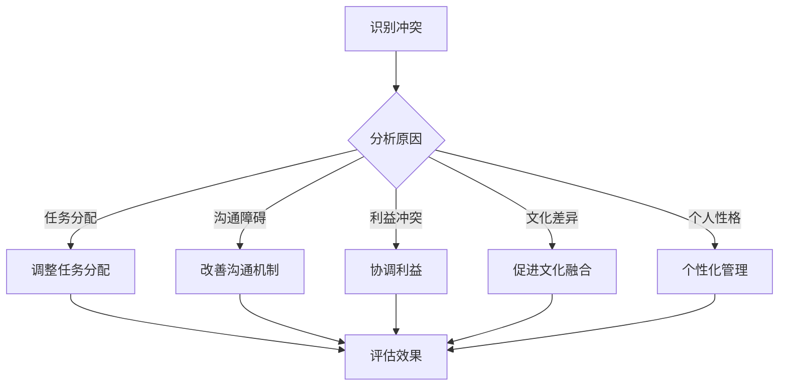

                 

## 文章标题

在当今快速变化的技术领域，团队冲突已成为阻碍项目进展和创新的常见问题。然而，通过恰当的管理，这些冲突可以转化为推动团队进步和创新的重要动力。本文以《团队冲突管理：将分歧转化为创新动力》为标题，旨在深入探讨团队冲突管理的重要性，以及如何通过科学的冲突管理策略，将冲突转化为团队创新的驱动力。

## 关键词

- **团队冲突管理**
- **冲突类型**
- **冲突原因**
- **冲突应对策略**
- **沟通机制**
- **利益协调**
- **文化差异**
- **冲突预防与解决**

## 摘要

本文首先介绍了冲突管理的基本理论和重要性，随后详细分析了团队冲突的具体表现形式和原因。接着，提出了建立有效的沟通机制、协调利益冲突以及尊重文化差异等冲突应对策略。在此基础上，介绍了冲突管理的工具和方法，并通过实际案例展示了冲突管理的实战技巧。最后，探讨了冲突管理的未来趋势，为读者提供了全面的团队冲突管理指南。

# 《团队冲突管理：将分歧转化为创新动力》目录大纲

## 第一部分：冲突管理的基本理论

### 第1章：冲突管理概述

#### 1.1 冲突的概念与类型

#### 1.2 冲突的原因与影响因素

#### 1.3 冲突管理的重要性

### 第2章：冲突管理的理论基础

#### 2.1 冲突管理理论的发展

#### 2.2 冲突管理的模型

#### 2.3 冲突管理的基本原则

## 第二部分：团队冲突的具体表现与应对策略

### 第3章：团队冲突的表现形式

#### 3.1 交流障碍

#### 3.2 利益冲突

#### 3.3 文化差异

### 第4章：冲突应对策略

#### 4.1 建立有效的沟通机制

#### 4.2 利益协调与平衡

#### 4.3 尊重文化差异，促进文化融合

### 第5章：冲突管理的工具与方法

#### 5.1 冲突调查与分析

#### 5.2 冲突调解与仲裁

#### 5.3 冲突预防与解决策略

## 第三部分：冲突管理实践

### 第6章：团队冲突管理实战案例

#### 6.1 案例一：跨部门合作中的冲突管理

#### 6.2 案例二：团队成员个人矛盾的处理

#### 6.3 案例三：项目管理中的冲突管理

### 第7章：冲突管理技能提升

#### 7.1 冲突管理能力的自我评估

#### 7.2 冲突管理技能的培训与培养

#### 7.3 提升冲突管理效果的方法与技巧

## 第四部分：冲突管理的未来趋势

### 第8章：冲突管理的挑战与机遇

#### 8.1 数字化时代冲突管理的新趋势

#### 8.2 冲突管理与团队创新的关系

#### 8.3 未来冲突管理的发展方向

## 附录

### 附录A：冲突管理常用工具与技术

#### A.1 冲突管理工具介绍

#### A.2 冲突管理技术在实践中的应用

### 附录B：参考文献与推荐阅读

#### B.1 经典冲突管理理论著作

#### B.2 最新冲突管理研究成果

### 附录C：团队冲突管理流程图

#### C.1 团队冲突管理流程概述

#### C.2 冲突管理的具体实施步骤

### 附录D：常见冲突管理算法与模型

#### D.1 冲突管理算法概述

#### D.2 常见的冲突管理模型解析

---

接下来，我们将逐步深入探讨团队冲突管理的各个方面，帮助读者理解冲突的本质，掌握有效的冲突管理策略，从而将分歧转化为推动团队创新的动力。

---

## 第一部分：冲突管理的基本理论

### 第1章：冲突管理概述

#### 1.1 冲突的概念与类型

冲突是一种普遍存在于团队和组织的现象。根据不同的划分标准，冲突可以有不同的类型。从冲突的性质来看，可以分为建设性冲突（也称为功能冲突）和破坏性冲突（也称为破坏性冲突）。建设性冲突通常表现为团队成员之间对问题有不同看法，这种分歧可以激发团队的创造力，推动项目进展。而破坏性冲突则可能由于误解、不满、利益冲突等原因导致，常常破坏团队的士气和合作氛围。

根据冲突的来源，可以将其分为任务冲突、过程冲突和关系冲突。任务冲突主要源于对工作任务的分配和执行的不同看法；过程冲突则涉及团队决策和执行过程中的方法选择；关系冲突则是由于个人关系或文化背景的差异引起的。

#### 1.2 冲突的原因与影响因素

冲突的原因复杂多样，主要包括以下几点：

1. **任务分配不均**：当团队成员认为自己在工作中承担了过多的责任或任务时，容易产生不满和冲突。
2. **沟通障碍**：信息传递不畅、误解和沟通方式不当都是导致冲突的常见原因。
3. **利益冲突**：当团队成员在资源分配、绩效评估等方面存在利益上的冲突时，容易引发争议。
4. **文化差异**：团队成员来自不同的文化背景，可能在价值观、工作习惯等方面存在差异，这种差异容易导致冲突。
5. **个人性格和背景**：个人的性格特点、教育背景、工作经验等也会影响团队内部的冲突。

影响冲突的因素还包括组织的结构、管理风格、团队凝聚力等。一个开放、透明、包容的组织文化有助于减少冲突，而僵化的组织结构和管理方式则可能加剧冲突。

#### 1.3 冲突管理的重要性

冲突管理在团队和组织的运作中具有重要意义。首先，有效的冲突管理可以提升团队的士气和合作氛围，增强团队凝聚力。其次，通过解决冲突，团队可以更好地理解和尊重彼此的差异，从而创造出更加创新的工作环境。此外，冲突管理还可以提高决策的质量和效率，减少因冲突导致的资源浪费。

对于组织而言，冲突管理也是实现可持续发展的重要保障。一个能有效管理冲突的组织，能够更好地应对外部环境的变化，保持竞争力。同时，通过冲突管理，组织可以培养员工的沟通能力和解决问题的能力，提升整体执行力。

### Mermaid 流程图：冲突管理流程概述



通过以上流程，我们可以看到，冲突管理的核心在于识别冲突、分析原因并采取相应的措施。接下来，我们将进一步探讨冲突管理的理论基础，以便更好地理解和应用冲突管理策略。

### 第2章：冲突管理的理论基础

#### 2.1 冲突管理理论的发展

冲突管理理论经历了多个发展阶段。最早的理论可以追溯到20世纪30年代，行为学家和管理学家开始关注冲突在组织中的作用，提出了冲突的自然观。这种观点认为冲突是不可避免的，甚至是必要的，因为冲突可以激发创新和改进。

随着研究的深入，20世纪60年代出现了人际关系学派，强调冲突的破坏性，提出了“零和冲突”的概念。这一阶段的研究主要集中在如何减少冲突，避免其负面影响。

20世纪80年代，随着组织行为学的发展，冲突管理理论开始关注冲突的双面性。学者们提出了建设性冲突和破坏性冲突的概念，认为冲突并非全是消极的，合理的冲突可以促进团队进步。

进入21世纪，冲突管理理论进一步发展，开始关注冲突的过程性和动态性。研究者提出了多种冲突管理模型，如互动模型、过程模型等，强调了冲突管理中的动态调整和策略选择。

#### 2.2 冲突管理的模型

冲突管理模型是理解和实践冲突管理的重要工具。以下是几种常见的冲突管理模型：

1. **互动模型**：互动模型强调冲突管理是一个动态的过程，涉及个人、团队和组织层面的互动。该模型认为，冲突管理的关键在于建立有效的沟通机制和共识。

   - **步骤**：
     1. 识别冲突
     2. 分析原因
     3. 采取行动
     4. 评估效果

2. **过程模型**：过程模型关注冲突管理的全过程，从冲突的发生、发展到解决，强调每个阶段的重要性。

   - **步骤**：
     1. 冲突识别
     2. 冲突分析
     3. 冲突解决
     4. 冲突评估

3. **多层面模型**：多层面模型将冲突管理分为三个层面：个人层面、团队层面和组织层面。每个层面都有其特定的冲突管理策略和方法。

   - **个人层面**：提升个人冲突解决能力，如沟通技巧、情绪管理等。
   - **团队层面**：建立团队规范和共识，提高团队协作能力。
   - **组织层面**：制定组织政策和流程，为冲突管理提供制度保障。

#### 2.3 冲突管理的基本原则

有效的冲突管理需要遵循一系列基本原则，以下是其中几个关键原则：

1. **及时性**：及时识别和应对冲突，避免冲突的积压和扩大。

2. **透明性**：冲突管理过程应保持透明，让所有相关方了解冲突的进展和解决方案。

3. **合作性**：冲突管理是一个合作的过程，需要各方共同参与和努力。

4. **公正性**：冲突管理应公正无私，确保每个相关方的权益得到尊重和保护。

5. **灵活性**：冲突管理应具备灵活性，根据实际情况动态调整管理策略。

### 冲突管理核心算法原理讲解

冲突管理算法的核心在于如何识别冲突、分析原因并采取适当的措施。以下是一个简化的冲突管理算法原理：

```python
def conflict_management(conflict_type, conflict_details):
    if conflict_type == "communication":
        return improve_communication(conflict_details)
    elif conflict_type == "interest":
        return balance_interests(conflict_details)
    elif conflict_type == "culture":
        return promote_culture_integration(conflict_details)
    else:
        return "Conflict type not recognized."

def improve_communication(details):
    # 根据具体情况，采取不同的沟通改善措施
    # 如：组织沟通培训、改善沟通渠道等
    return "Communication improved."

def balance_interests(details):
    # 协调不同利益方的需求和期望
    # 如：资源调配、利益分配等
    return "Interests balanced."

def promote_culture_integration(details):
    # 促进文化融合，减少文化差异引发的冲突
    # 如：开展文化融合活动、推广共同价值观等
    return "Cultures integrated."
```

通过以上算法，我们可以根据冲突的不同类型采取相应的策略。例如，当冲突源于沟通障碍时，采取改善沟通机制的措施；当冲突源于利益冲突时，进行利益协调；当冲突源于文化差异时，采取促进文化融合的策略。

### 数学模型和公式

冲突管理中，一些数学模型和公式可以帮助我们更精确地评估和解决冲突。以下是一个简化的冲突评估模型：

$$
ConflictScore = w_1 \times CommunicationScore + w_2 \times InterestScore + w_3 \times CultureScore
$$

其中，$w_1$、$w_2$ 和 $w_3$ 分别代表沟通、利益和文化三个维度的权重。$CommunicationScore$、$InterestScore$ 和 $CultureScore$ 分别表示这三个维度的评估得分。

通过这个模型，我们可以量化冲突的程度，并据此制定相应的解决方案。例如，如果评估结果显示沟通是冲突的主要来源，那么我们可以重点改进沟通机制，提高$CommunicationScore$，从而降低整体的$ConflictScore$。

### 举例说明

假设在一个团队项目中，冲突主要源于团队成员之间的沟通障碍。通过上述模型，我们可以进行以下分析：

- **沟通障碍得分**：假设通过问卷调查，得到沟通障碍得分为60分（满分100分）。
- **利益冲突得分**：利益冲突得分为80分。
- **文化差异得分**：文化差异得分为70分。

根据权重设定，假设沟通、利益和文化三个维度的权重分别为0.3、0.4和0.3，则：

$$
ConflictScore = 0.3 \times 60 + 0.4 \times 80 + 0.3 \times 70 = 18 + 32 + 21 = 71
$$

通过这个计算，我们得知当前团队的整体冲突得分为71分。为了降低冲突得分，我们可以采取以下措施：

1. **改善沟通机制**：通过组织沟通培训、建立定期会议机制等方式，提高沟通得分。
2. **协调利益冲突**：通过资源调配、绩效评估调整等方式，平衡利益得分。
3. **促进文化融合**：通过开展团队建设活动、推广共同价值观等方式，提升文化得分。

通过这些措施，逐步降低团队的ConflictScore，从而改善团队氛围，提高项目进展效率。

### 总结

冲突管理是团队和组织中不可或缺的一部分。通过了解冲突的基本概念、类型和原因，我们可以更好地识别和应对冲突。冲突管理的基本原则为我们提供了指导方针，而冲突管理的模型和算法则为我们提供了具体的操作工具。在实际应用中，通过科学的方法和策略，我们可以将冲突转化为团队创新的动力，推动项目成功。

在接下来的章节中，我们将进一步探讨团队冲突的具体表现形式和应对策略，帮助读者在实际工作中有效管理冲突，提升团队绩效。同时，我们还将通过实战案例分享冲突管理的经验和技巧，为读者提供实用的指导。

---

在本文的第一部分，我们介绍了冲突管理的基本理论，从冲突的概念与类型、冲突的原因与影响因素，到冲突管理的重要性、理论基础和基本原则，帮助读者建立对冲突管理的全面认识。通过Mermaid流程图、核心算法原理讲解和数学模型，我们进一步展示了冲突管理的具体方法和工具。

接下来，我们将进入第二部分，深入探讨团队冲突的具体表现形式和应对策略。通过分析交流障碍、利益冲突和文化差异等具体问题，并提供相应的解决方案，帮助读者在实际工作中有效管理冲突。敬请期待！

