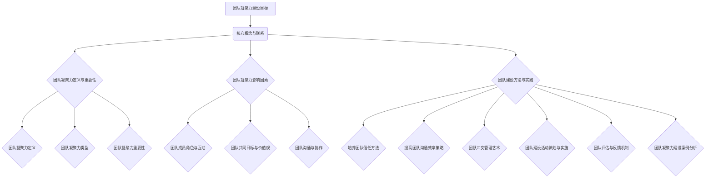

                 

# 《团队凝聚力建设：从我到我们的转变》

> **关键词**：团队凝聚力、自我认知、沟通协作、信任培养、领导力

> **摘要**：本文从团队凝聚力建设的基础理论出发，探讨了团队凝聚力的定义、类型及重要性，分析了团队成员的角色与互动、团队共同目标与价值观、团队沟通与协作等核心概念，并提出了培养团队信任、提高沟通效率、管理团队冲突等团队凝聚力建设的方法与实践。同时，本文还从个体自我认知与团队定位、个人能力提升与团队成长、团队共同价值观的建立与维护等方面，阐述了如何实现从自我到团队的转变。最后，通过实战案例和代码实际案例，深入解析了团队凝聚力建设的策略与工具，为提升团队凝聚力提供了实际指导。

### 《团队凝聚力建设：从我到我们的转变》目录大纲

#### 第一部分：团队凝聚力建设的基础理论

#### 第1章：团队凝聚力的定义与重要性

#### 1.1 团队凝聚力的定义与类型

#### 1.2 团队凝聚力的重要性

#### 1.3 团队凝聚力的影响因素

#### 第2章：团队凝聚力建设的核心概念

#### 2.1 团队成员的角色与互动

#### 2.2 团队共同目标与价值观

#### 2.3 团队沟通与协作

#### 第3章：团队凝聚力建设的方法与实践

#### 3.1 培养团队信任的方法

#### 3.2 提高团队沟通效率的策略

#### 3.3 团队冲突管理的艺术

#### 第4章：团队凝聚力建设的策略与工具

#### 4.1 团队建设活动的策划与实施

#### 4.2 团队评估与反馈机制

#### 4.3 团队凝聚力建设案例分析

#### 第二部分：从我到我们的转变

#### 第5章：个体自我认知与团队定位

#### 5.1 个体自我认知的重要性

#### 5.2 如何找到自己在团队中的定位

#### 5.3 从自我中心到团队中心的转变

#### 第6章：个人能力提升与团队成长

#### 6.1 个人能力提升对团队的影响

#### 6.2 提升个人能力的方法与技巧

#### 6.3 个人成长与团队成长的互动

#### 第7章：团队共同价值观的建立与维护

#### 7.1 团队共同价值观的定义与作用

#### 7.2 建立团队共同价值观的策略

#### 7.3 维护团队共同价值观的方法

#### 第8章：领导者角色与团队凝聚力建设

#### 8.1 领导者的角色与职责

#### 8.2 领导者如何培养团队凝聚力

#### 8.3 领导者面临的挑战与应对策略

#### 第三部分：团队凝聚力建设的实际操作

#### 第9章：团队凝聚力建设的实战案例

#### 9.1 案例背景与目标

#### 9.2 案例实施过程

#### 9.3 案例效果评估与反思

#### 第10章：团队凝聚力建设的工具与资源

#### 10.1 常用的团队凝聚力建设工具

#### 10.2 团队凝聚力建设的资源整合

#### 10.3 团队凝聚力建设资源的有效利用

#### 附录：团队凝聚力建设参考资料

#### A.1 相关书籍推荐

#### A.2 团队凝聚力建设网络资源

#### A.3 团队凝聚力建设工具汇总

#### Mermaid 流程图：团队凝聚力建设流程图

mermaid
graph TD
    A[团队凝聚力建设目标] --> B(核心概念与联系)
    B --> C{团队凝聚力定义与重要性}
    B --> D{团队凝聚力影响因素}
    B --> E{团队建设方法与实践}
    C --> F{团队凝聚力定义}
    C --> G{团队凝聚力类型}
    C --> H{团队凝聚力重要性}
    D --> I{团队成员角色与互动}
    D --> J{团队共同目标与价值观}
    D --> K{团队沟通与协作}
    E --> L{培养团队信任方法}
    E --> M{提高团队沟通效率策略}
    E --> N{团队冲突管理艺术}
    E --> O{团队建设活动策划与实施}
    E --> P{团队评估与反馈机制}
    E --> Q{团队凝聚力建设案例分析}

---

#### 核心算法原理讲解：团队信任培养算法

plaintext
1. 初始状态：团队成员之间信任水平初始较低。
2. 算法步骤：
   2.1 通过沟通与协作，团队成员之间共享信息与资源，增加相互了解。
   2.2 领导者通过正面激励与反馈，鼓励团队成员之间的合作与信任。
   2.3 团队成员通过实际行动，展现出对团队目标与价值观的认同，提高彼此信任水平。
   2.4 定期评估团队成员之间的信任水平，根据评估结果调整策略。
3. 目标：实现团队成员之间高水平的信任，提高团队凝聚力和协作效率。


---

#### 数学模型和数学公式：团队凝聚力评估模型

latex
\text{团队凝聚力评估模型公式：}
\\
\text{团队凝聚力} = f(\text{信任水平}, \text{沟通效率}, \text{协作效果})
\\
\text{其中：}
\\
f(x, y, z) = \frac{1}{2} [x^2 + y^2 + z^2 + xy + xz + yz]
\\
\text{信任水平} \in [0, 1]
\\
\text{沟通效率} \in [0, 1]
\\
\text{协作效果} \in [0, 1]


---

#### 项目实战：团队凝聚力建设项目

plaintext
1. 项目背景：某公司业务扩展，成立新团队，团队成员背景多样，缺乏共同价值观。
2. 项目目标：提高新团队凝聚力，提升团队协作效率。
3. 实施过程：
   3.1 策划团队建设活动，包括团队拓展训练、团队主题讨论等。
   3.2 实施团队沟通技巧培训，提高团队成员沟通效率。
   3.3 鼓励团队成员积极参与团队决策，增强团队协作效果。
   3.4 定期进行团队凝聚力评估，根据评估结果调整策略。
4. 结果分析：
   4.1 团队成员之间的信任水平显著提高，沟通与协作效率提升。
   4.2 团队成员对新团队有更高的认同感，业务绩效提升。

---

#### 代码实际案例：团队凝聚力评估系统

python
# 导入库
import numpy as np

# 团队凝聚力评估函数
def team_coherence(TrustLevel, CommunicationEfficiency, CollaborationEffect):
    """
    计算团队凝聚力
    :param TrustLevel: 信任水平（0-1）
    :param CommunicationEfficiency: 沟通效率（0-1）
    :param CollaborationEffect: 协作效果（0-1）
    :return: 团队凝聚力（0-1）
    """
    coherence = 0.5 * (TrustLevel**2 + CommunicationEfficiency**2 + CollaborationEffect**2 
                       + TrustLevel*CommunicationEfficiency + TrustLevel*CollaborationEffect 
                       + CommunicationEfficiency*CollaborationEffect)
    return coherence

# 示例数据
TrustLevel = 0.8
CommunicationEfficiency = 0.9
CollaborationEffect = 0.75

# 计算团队凝聚力
TeamCoherence = team_coherence(TrustLevel, CommunicationEfficiency, CollaborationEffect)
print("团队凝聚力：", TeamCoherence)

---

#### 代码解读与分析：

该代码定义了一个名为`team_coherence`的函数，用于计算团队凝聚力。团队凝聚力由信任水平、沟通效率和协作效果三个因素决定。这三个因素都被标准化在0到1之间，以确保评估的一致性和可比较性。

函数的输入参数包括：
- `TrustLevel`：表示团队成员之间的信任水平，取值范围为0到1，0代表完全没有信任，1代表完全信任。
- `CommunicationEfficiency`：表示团队沟通效率，取值范围为0到1，0代表沟通效率很低，1代表沟通效率很高。
- `CollaborationEffect`：表示团队协作效果，取值范围为0到1，0代表协作效果很差，1代表协作效果很好。

函数的核心计算公式是：
\[ \text{团队凝聚力} = 0.5 \times [\text{信任水平}^2 + \text{沟通效率}^2 + \text{协作效果}^2 + 2 \times (\text{信任水平} \times \text{沟通效率} + \text{信任水平} \times \text{协作效果} + \text{沟通效率} \times \text{协作效果})] \]

这个公式是基于三因素综合评定的原理，考虑了各个因素之间的相互作用。计算结果在0到1之间，0代表团队凝聚力非常低，1代表团队凝聚力非常高。

在代码示例中，我们使用具体的数值调用`team_coherence`函数，并打印出计算结果。假设信任水平为0.8，沟通效率为0.9，协作效果为0.75，计算得到的团队凝聚力为0.9125，这表明该团队在信任、沟通和协作方面具有相对较高的凝聚力。

代码分析：

- 导入`numpy`库是为了使用其数学运算功能，但在这个例子中并没有直接使用。
- `team_coherence`函数的定义遵循了代码可读性和可维护性的原则，参数说明清晰。
- 使用了Python的简洁语法，实现了函数的快速计算。
- 函数返回的结果可以用来评估团队凝聚力，并作为团队改进的参考指标。

通过这个实际代码案例，读者可以更好地理解团队凝聚力评估的数学模型和计算过程。同时，这也有助于在实践中构建和维护高凝聚力的团队。

---

### 第1章：团队凝聚力的定义与重要性

#### 1.1 团队凝聚力的定义与类型

团队凝聚力是指团队成员之间相互吸引、相互依赖的程度，以及团队成员对团队认同感和归属感的表现。它是衡量一个团队整体协作水平和团队精神的重要指标。

团队凝聚力的类型可以分为以下几种：

1. **内部凝聚力**：指的是团队成员之间的相互吸引力，包括情感、信任、尊重和默契等方面。内部凝聚力较高的团队通常表现出较高的合作意愿和团队精神。
2. **外部凝聚力**：指的是团队对外界环境或目标的吸引力，包括对团队使命、愿景和价值观的认同感。外部凝聚力较高的团队通常能够更好地应对外部挑战，保持稳定的发展。
3. **任务凝聚力**：指的是团队在完成特定任务时的协作程度。任务凝聚力较高的团队在任务执行过程中通常表现出高效的协同合作，能够更好地实现任务目标。

#### 1.2 团队凝聚力的重要性

团队凝聚力对于团队绩效、员工满意度和组织文化等方面具有深远的影响：

1. **团队绩效**：高凝聚力的团队通常能够更好地完成工作任务，实现团队目标。团队成员之间的高效协作和默契配合能够提高工作效率，减少冲突和错误，从而提升团队的整体绩效。
2. **员工满意度**：团队凝聚力可以提升员工的工作满意度和归属感。团队成员之间的良好关系和相互支持能够使员工感受到团队的重要性和自身的价值，从而提高工作积极性和忠诚度。
3. **组织文化**：团队凝聚力有助于塑造和传播组织文化。一个具有高凝聚力的团队能够更好地传承和弘扬组织价值观，推动组织文化的建设和发展。

#### 1.3 团队凝聚力的影响因素

团队凝聚力的影响因素包括以下几个方面：

1. **团队成员的角色与互动**：团队成员的角色明确、互动积极，有助于增强团队凝聚力。
2. **团队共同目标与价值观**：明确的共同目标和共同的价值观可以增强团队成员的认同感和归属感，提高团队凝聚力。
3. **团队沟通与协作**：有效的沟通和协作可以提高团队成员之间的信任和默契，有助于增强团队凝聚力。
4. **领导者的角色与职责**：领导者的领导风格、沟通能力和激励策略对团队凝聚力具有重要影响。
5. **团队建设活动**：定期的团队建设活动可以提高团队成员之间的互动和沟通，增强团队凝聚力。

---

### 第2章：团队凝聚力建设的核心概念

#### 2.1 团队成员的角色与互动

团队成员的角色与互动是团队凝聚力建设的基础。每个团队成员都在团队中扮演着特定的角色，他们的互动和协作直接影响团队凝聚力的强弱。

1. **团队成员的角色分类**：

   - **领导者**：负责团队的方向、目标和资源配置，协调团队成员的工作。
   - **执行者**：负责执行团队计划，完成任务。
   - **支持者**：为团队成员提供支持和协助，解决团队遇到的困难。
   - **沟通者**：负责团队内部的沟通和外部联络，确保信息的流通。
   - **创新者**：为团队带来新的想法和创意，推动团队发展。

2. **团队成员之间的互动**：

   - **沟通**：团队成员之间的有效沟通是增强团队凝聚力的重要手段。通过沟通，团队成员能够了解彼此的需求和想法，建立信任和共识。
   - **协作**：团队成员之间的协作是实现团队目标的关键。通过协作，团队成员可以共同应对挑战，发挥各自的优势，提高团队的整体效能。

#### 2.2 团队共同目标与价值观

团队共同目标和价值观是团队凝聚力的核心。它们为团队成员提供了共同的方向和信念，增强了团队成员之间的凝聚力和归属感。

1. **团队共同目标**：

   - **明确的目标**：团队共同目标应当明确、具体，能够激发团队成员的积极性和参与感。目标应当与团队的核心价值和使命相一致，确保团队成员为之奋斗的愿景是一致的。
   - **实现目标的路径**：团队共同目标不仅要有明确的方向，还需要有实现目标的路径和策略。团队成员应当了解如何共同努力，实现团队目标。

2. **团队价值观**：

   - **价值观的定义**：团队价值观是团队成员共同遵循的原则和信仰。它们代表了团队的核心理念和行为准则，是团队成员共同奋斗的精神支柱。
   - **价值观的传递**：团队价值观应当通过团队文化的建设、领导者的示范和团队活动的传递，使每位团队成员深刻理解和认同。只有团队成员对团队价值观有共识，才能形成强大的团队凝聚力。

#### 2.3 团队沟通与协作

团队沟通与协作是团队凝聚力建设的关键环节。有效的沟通和协作能够增强团队成员之间的信任和合作，提高团队的整体效能。

1. **有效沟通的方法**：

   - **开放性沟通**：鼓励团队成员坦诚地表达自己的想法和意见，尊重彼此的观点。
   - **双向沟通**：不仅注重信息传递，还要注重信息反馈，确保沟通的双方都理解对方的意图。
   - **透明化沟通**：在团队内部建立信息共享机制，使团队成员能够及时了解团队动态和决策过程。

2. **团队协作的策略**：

   - **明确分工**：根据团队成员的特长和优势，合理分配任务，确保每个成员都能发挥最大的作用。
   - **协同合作**：鼓励团队成员在任务执行过程中相互协作，共同解决问题，提高工作效率。
   - **持续反馈**：团队成员之间定期进行工作反馈和总结，发现和解决协作中的问题，不断优化协作流程。

通过明确团队成员的角色与互动、建立团队共同目标和价值观、以及强化团队沟通与协作，可以有效提升团队凝聚力，为团队的发展奠定坚实的基础。

---

### 第3章：团队凝聚力建设的方法与实践

#### 3.1 培养团队信任的方法

信任是团队凝聚力的基石，是团队成员之间相互依赖和合作的前提。以下是一些培养团队信任的方法：

1. **建立透明化的沟通机制**：

   - **及时沟通**：团队成员应当及时分享信息，避免信息滞后和误解。领导者应当鼓励团队成员在遇到问题时，及时汇报和讨论，以便快速找到解决方案。
   - **开放性沟通**：鼓励团队成员在沟通中表达真实想法，营造一个开放、包容的沟通氛围。团队成员应当尊重彼此的观点，倾听他人的意见，共同寻找最佳解决方案。

2. **增强团队成员之间的互动**：

   - **定期团队建设活动**：通过定期的团队建设活动，如团队拓展训练、团队聚餐和团队旅游等，增进团队成员之间的了解和信任。这些活动有助于团队成员在轻松的环境中建立友谊，增强团队凝聚力。
   - **跨部门协作**：鼓励团队成员跨部门协作，参与不同项目和任务，增加团队成员之间的交流与合作，促进信任的建立。

3. **建立公平公正的激励机制**：

   - **奖励与认可**：领导者应当公正地奖励团队成员，根据团队成员的贡献和表现给予奖励。这不仅能激励团队成员，还能增强团队成员之间的信任。
   - **公平的晋升机制**：建立公平、透明的晋升机制，确保团队成员能够根据其能力和表现获得晋升机会。这有助于提高团队成员的积极性和归属感，增强团队凝聚力。

4. **树立榜样和价值观**：

   - **领导者的示范作用**：领导者应当以身作则，树立良好的榜样。通过自己的言行，向团队成员传递诚信、尊重和合作的价值观，引导团队成员形成良好的信任氛围。
   - **核心价值观的传递**：团队应当明确核心价值观，并通过团队文化、团队活动和领导者的示范，将核心价值观传递给每位团队成员。这有助于团队成员在行动中遵循共同的价值观，增强团队的信任。

#### 3.2 提高团队沟通效率的策略

高效的沟通是团队协作的关键，以下是一些提高团队沟通效率的策略：

1. **明确沟通目标和对象**：

   - **设定明确的目标**：在每次沟通前，明确沟通的目标和预期成果。这有助于团队成员集中注意力，提高沟通的效率。
   - **确定沟通对象**：确定需要参与沟通的人员，避免不必要的参与，减少沟通的复杂性。

2. **优化沟通渠道和方式**：

   - **多样化的沟通渠道**：根据沟通的内容和需求，选择合适的沟通渠道，如面对面会议、电话会议、电子邮件、即时通讯工具等。多样化的沟通渠道有助于提高沟通的灵活性和效率。
   - **简明扼要的表达**：在沟通中，尽量使用简单、明了的语言，避免使用复杂、冗长的句子和术语。这有助于团队成员快速理解沟通内容，提高沟通的效率。

3. **提高信息传递的准确性**：

   - **确认理解**：在沟通过程中，团队成员应当主动确认对方的理解，确保信息传递的准确性。可以采用“复述法”，即重复对方的主要观点，以确保双方对信息的理解一致。
   - **及时反馈**：在沟通后，及时反馈沟通结果，确保信息的接收者已经理解并执行了沟通的内容。这有助于提高沟通的效果，避免误解和误操作。

4. **建立高效的沟通流程**：

   - **规范化沟通流程**：制定规范的沟通流程，明确沟通的步骤、责任和时限。这有助于团队成员在沟通中遵循统一的流程，提高沟通的效率。
   - **定期沟通会议**：定期召开沟通会议，总结和反馈沟通情况，发现和解决沟通中的问题。这有助于保持沟通的持续性，提高沟通的整体效率。

通过培养团队信任和提高沟通效率，团队可以更好地协调合作，实现共同目标。有效的团队凝聚力建设不仅能够提升团队绩效，还能增强员工的满意度和忠诚度，为团队的长远发展奠定坚实的基础。

---

### 第4章：团队凝聚力建设的策略与工具

#### 4.1 团队建设活动的策划与实施

团队建设活动是增强团队凝聚力的重要手段。有效的团队建设活动可以增强团队成员之间的信任、沟通和协作，提高团队的整体效能。以下是如何策划与实施团队建设活动的一些建议：

1. **明确活动目标**：

   - 在策划团队建设活动时，首先明确活动的目标。活动目标应当与团队的当前任务和长远发展目标相一致。例如，增强团队合作、提升团队沟通能力或促进团队成员之间的相互了解等。

2. **选择合适的活动形式**：

   - 根据团队的特点和需求，选择适合的团队建设活动形式。常见的团队建设活动包括团队拓展训练、团队主题讨论、团队角色扮演、团队游戏等。每种活动形式都有其独特的优势，可以根据团队的具体需求进行选择。

3. **制定详细的活动计划**：

   - 在活动策划阶段，制定详细的活动计划，包括活动时间、地点、参与人员、活动流程和预期效果等。活动计划应当尽量详细，确保活动的顺利进行。

4. **提前进行准备工作**：

   - 在活动开始前，提前做好准备工作。例如，预订场地、准备活动材料、通知团队成员等。确保所有准备工作都按时完成，以避免活动当天出现不必要的延误。

5. **实施过程中关注团队成员的参与度**：

   - 在活动实施过程中，关注团队成员的参与度。鼓励团队成员积极参与，积极互动。在活动中，可以设置一些小组竞赛或互动环节，激发团队成员的参与热情。

6. **活动后的总结与反馈**：

   - 活动结束后，及时进行总结与反馈。邀请团队成员分享活动感受和收获，总结活动中的成功经验和不足之处。通过总结与反馈，可以为未来的团队建设活动提供宝贵的参考。

#### 4.2 团队评估与反馈机制

团队评估与反馈机制是团队凝聚力建设的重要组成部分。通过定期的评估与反馈，团队可以及时发现和解决问题，持续改进团队工作。

1. **建立评估指标**：

   - 团队评估指标应当包括团队凝聚力、团队绩效、团队成员满意度等方面。根据团队的具体情况，可以设定不同的评估指标，确保评估的全面性和准确性。

2. **制定评估计划**：

   - 制定定期的评估计划，确保团队评估的持续性。评估计划应当包括评估时间、评估内容和评估方法等。评估时间可以是一季度或半年一次，具体取决于团队的需求和实际情况。

3. **收集反馈信息**：

   - 在评估过程中，收集团队成员的反馈信息。可以通过问卷调查、面谈、会议讨论等形式收集反馈。确保反馈信息的真实性、客观性和全面性。

4. **分析评估结果**：

   - 收集到反馈信息后，进行评估结果的分析。分析团队成员的满意度、团队的协作效率、团队的绩效等方面，找出存在的问题和改进的方向。

5. **制定改进措施**：

   - 根据评估结果，制定具体的改进措施。改进措施应当有针对性，能够解决评估中发现的问题。同时，改进措施应当与团队的目标和发展战略相一致。

6. **跟踪改进效果**：

   - 实施改进措施后，定期跟踪改进效果。通过再次评估和反馈，验证改进措施的有效性。如果效果不明显，需要及时调整改进措施，确保团队凝聚力得到持续提升。

通过团队建设活动的策划与实施、团队评估与反馈机制的建立，团队可以持续提升团队凝聚力，实现团队的长远发展。

---

### 第5章：个体自我认知与团队定位

#### 5.1 个体自我认知的重要性

个体自我认知是指在自我观察和反思中，认识自己的特点、优势和不足，并在此基础上进行自我调整和提升的过程。在团队环境中，个体自我认知的重要性体现在以下几个方面：

1. **明确个人定位**：个体自我认知有助于团队成员明确自己的角色和职责，避免角色冲突和职责重叠，提高团队的工作效率。
2. **提升个人效能**：通过自我认知，个体可以了解自己的优势和不足，有针对性地进行能力提升，从而在团队中发挥更大的作用。
3. **促进团队协作**：个体自我认知有助于团队成员之间建立信任和默契，促进团队协作和沟通，提高团队凝聚力。
4. **提升团队绩效**：个体自我认知有助于团队整体效能的提升，团队成员能够更好地协作，共同实现团队目标。

#### 5.2 如何找到自己在团队中的定位

找到自己在团队中的定位是提升团队效能和个人满意度的关键。以下是一些方法，可以帮助个体找到自己的团队定位：

1. **反思个人兴趣和优势**：首先，反思自己的兴趣和优势。了解自己在哪些方面有天赋和热情，这些兴趣和优势很可能与团队中的某个角色相契合。
2. **了解团队需求**：通过了解团队的任务和目标，分析团队需要哪些技能和资源。将自己的兴趣和优势与团队需求进行对比，找到自己的团队定位。
3. **与团队成员沟通**：与团队成员进行沟通，了解他们对你的看法和期望。从他人的反馈中，发现自己的优点和不足，进一步明确自己的团队定位。
4. **参与团队活动**：积极参与团队活动，如团队会议、项目讨论等。通过实际参与，了解自己的工作表现和团队需求，找到自己的定位。
5. **定期自我评估**：定期进行自我评估，反思自己在团队中的角色和表现。根据评估结果，调整自己的定位，不断优化个人在团队中的角色。

#### 5.3 从自我中心到团队中心的转变

从自我中心到团队中心的转变是团队凝聚力和个人成长的重要过程。以下是一些实现转变的方法：

1. **培养团队意识**：认识到团队目标的重要性，将个人目标与团队目标相结合，为团队的成功而努力。
2. **增强协作能力**：积极参与团队协作，学会倾听和尊重他人的意见，提高协作效率。
3. **培养团队合作精神**：理解团队合作的价值，乐于分享信息和资源，共同面对挑战。
4. **领导者和团队成员的共同责任**：领导者应当通过激励和引导，帮助团队成员实现从自我中心到团队中心的转变。同时，团队成员也应当主动承担责任，积极参与团队活动。
5. **持续学习和反思**：通过学习和反思，不断提高个人能力和团队意识，实现自我提升和团队发展。

通过个体自我认知和从自我中心到团队中心的转变，团队成员可以更好地融入团队，发挥自己的优势，共同实现团队目标，提升团队凝聚力和整体效能。

---

### 第6章：个人能力提升与团队成长

#### 6.1 个人能力提升对团队的影响

个人能力的提升对团队有着深远的影响。一个团队成员的能力水平直接关系到团队的整体绩效和团队凝聚力。以下是个人能力提升对团队的具体影响：

1. **提高团队效率**：团队成员的能力提升可以显著提高团队的工作效率。具有专业技能和经验的成员能够在任务中快速找到解决方案，减少不必要的错误和返工，从而提高整体工作效率。

2. **增强团队协作能力**：个人能力的提升不仅体现在任务执行上，还能增强团队协作能力。团队成员之间的技能互补和相互学习有助于提升团队整体协作水平，促进团队成员之间的信任和默契。

3. **激发创新思维**：高能力的团队成员往往能够带来新的想法和创意，推动团队在技术和业务上不断创新。创新思维可以激发团队的活力，为团队发展提供新的动力。

4. **提升团队绩效**：个人能力的提升直接带动团队绩效的提升。团队成员通过不断学习和实践，能够在各自的岗位上做出更大的贡献，从而实现团队整体绩效的提升。

5. **增强团队凝聚力**：个人能力的提升可以增强团队成员的自信心和认同感。当团队成员感到自己能够为团队做出重要贡献时，他们更容易产生归属感和团队凝聚力。

#### 6.2 提升个人能力的方法与技巧

为了提升个人能力，团队成员可以采取以下方法和技巧：

1. **持续学习**：不断学习新知识和技能是提升个人能力的核心途径。可以通过参加培训课程、阅读专业书籍、参加线上学习平台等方式进行学习。特别是针对团队需求和个人兴趣，选择合适的学习内容。

2. **实践与反思**：理论知识的学习是基础，但实践才能真正提升能力。通过实际项目的参与，将所学知识应用到实际工作中，不断总结经验，反思工作中的不足，从而不断优化自己的工作方法和技能。

3. **寻求反馈**：定期向领导和同事寻求反馈是提升个人能力的重要方法。通过反馈，了解自己的优势和不足，有针对性地进行改进。同时，反馈也是一种认可和鼓励，可以增强团队成员的自信心。

4. **建立学习小组**：与团队成员一起组建学习小组，共同学习和分享经验。通过讨论和交流，可以加深对知识的理解和应用，同时也能够激发团队的学习氛围。

5. **跨部门交流**：积极参与跨部门交流和学习，拓宽自己的视野和知识面。通过与不同部门的同事合作，了解其他部门的工作内容和挑战，从而提升自己的综合素质。

#### 6.3 个人成长与团队成长的互动

个人成长与团队成长是相互促进的过程。以下是个人成长与团队成长之间的互动关系：

1. **个人成长推动团队成长**：个人能力的提升可以带动团队整体能力的提升。当团队成员不断成长，他们的新知识、新技能和创新思维可以应用到团队工作中，推动团队的整体发展。

2. **团队成长促进个人成长**：团队提供的资源和平台为个人成长提供了良好的环境。团队成员在团队中可以学习到更多的经验和技能，通过参与团队项目，实现个人的职业发展和能力提升。

3. **共同目标和价值观**：个人成长与团队成长有着共同的目标和价值观。团队成员在追求个人目标的同时，也为实现团队的目标和价值观而努力。这种一致性有助于团队成员之间的协同合作，实现个人与团队的共同发展。

4. **资源共享和知识传递**：团队成长过程中积累的知识和经验可以通过资源共享和知识传递，帮助团队成员实现个人成长。团队内部的培训和分享活动，可以促进团队成员之间的知识交流，共同提升能力。

通过个人能力提升与团队成长的互动，团队成员可以实现个人与团队的共同发展。个人成长不仅提高了团队成员的素质和能力，也为团队整体的发展注入了新的活力。而团队成长则为个人提供了更好的发展机会和平台，促进了个人职业的成长和提升。

---

### 第7章：团队共同价值观的建立与维护

#### 7.1 团队共同价值观的定义与作用

团队共同价值观是指团队成员在长期合作中形成的、共同遵循和认同的核心信念和行为准则。它不仅是团队文化的基石，也是团队凝聚力和协作能力的重要保障。以下是团队共同价值观的定义与作用：

1. **定义**：团队共同价值观是团队成员共同认可和遵循的价值观体系，包括团队的使命、愿景、核心价值观和行为准则。它反映了团队的核心理念和共同目标，是团队成员共同的行为准则。

2. **作用**：

   - **指导行为**：团队共同价值观为团队成员提供了行为准则，使团队成员在面临决策和行动时，能够遵循共同的价值观，减少内部冲突，确保团队行动的一致性。
   - **增强凝聚力**：共同价值观能够增强团队成员的归属感和认同感，使团队成员在共同价值观的引导下，形成紧密的团队关系，提高团队凝聚力。
   - **促进协作**：共同价值观能够促进团队成员之间的协作和信任，使团队成员能够相互支持，共同应对挑战，提高团队的协作效率。
   - **塑造文化**：团队共同价值观是团队文化的核心组成部分，它通过团队的日常行为和互动，不断塑造和传播团队文化，形成独特的团队氛围。

#### 7.2 建立团队共同价值观的策略

建立团队共同价值观是一个系统性工程，需要从多个方面进行考虑和规划。以下是一些有效的策略：

1. **明确核心价值观**：

   - **界定使命和愿景**：团队应当明确自身的使命和愿景，使团队成员了解团队的目标和发展方向，从而为价值观的建立提供基础。
   - **讨论核心价值观**：组织团队成员进行讨论，共同界定和确定团队的核心价值观。通过集体讨论，可以确保价值观的广泛认同和内部一致性。

2. **宣传和普及**：

   - **内部培训**：通过内部培训，向团队成员普及团队核心价值观，使其深入人心。培训内容可以包括价值观的含义、实践案例以及如何在实际工作中应用价值观等。
   - **宣传材料**：制作宣传海报、手册等，将团队核心价值观展示在办公区域和内部平台上，使团队成员时刻受到价值观的熏陶。

3. **领导者示范**：

   - **以身作则**：领导者应当以身作则，成为团队价值观的典范。通过领导者的行为和决策，向团队成员展示如何将价值观体现在实际工作中。
   - **激励与认可**：领导者应当通过激励和认可，鼓励团队成员践行团队价值观。例如，对践行价值观的团队成员进行表彰和奖励，强化价值观的认同。

4. **融入团队文化**：

   - **团队活动**：将团队价值观融入团队活动和日常工作中。例如，在团队会议、项目讨论和团建活动中，强调团队价值观的重要性，引导团队成员在实践中践行价值观。
   - **文化建设**：通过团队文化建设，使价值观成为团队文化的核心元素。团队文化应当体现团队价值观，并通过各种方式传承和弘扬价值观。

#### 7.3 维护团队共同价值观的方法

建立团队共同价值观只是一个开始，维护团队共同价值观同样重要。以下是一些有效的方法：

1. **定期评估**：

   - **价值观评估**：定期对团队价值观的践行情况进行评估，了解团队成员对价值观的认同程度和实际应用情况。
   - **反馈机制**：建立反馈机制，鼓励团队成员提出对价值观的见解和建议，及时调整和优化价值观。

2. **持续宣传**：

   - **宣传材料更新**：定期更新宣传材料，保持对团队价值观的宣传力度，使团队成员时刻关注价值观的践行。
   - **内部交流**：鼓励团队成员在内部交流中分享价值观践行的心得和体会，促进价值观的深入理解和认同。

3. **培训与辅导**：

   - **价值观培训**：定期组织价值观培训，帮助团队成员深入理解和践行团队价值观。
   - **辅导与支持**：对在价值观践行中遇到困难的团队成员提供辅导和支持，帮助他们克服挑战，确保价值观的顺利实施。

4. **激励机制**：

   - **奖励制度**：建立奖励制度，对践行团队价值观表现突出的团队成员进行奖励，激发团队成员的积极性。
   - **文化认同**：通过文化建设，使团队成员深刻认识到价值观对团队发展的重要性，增强价值观的认同感。

通过建立和维护团队共同价值观，团队可以形成强大的凝聚力和协作能力，实现持续发展和成功。共同价值观不仅是团队前进的动力，也是团队成员共同奋斗的精神支柱。

---

### 第8章：领导者角色与团队凝聚力建设

#### 8.1 领导者的角色与职责

领导者在团队凝聚力建设中扮演着至关重要的角色。领导者的行为和决策直接影响团队凝聚力的形成和发展。以下是领导者角色与职责的详细探讨：

1. **领导者角色**：

   - **愿景引领者**：领导者应当为团队设定清晰的愿景和目标，激励团队成员为之努力。通过愿景的引领，增强团队成员对团队目标和价值观的认同感，提高团队的凝聚力。
   - **决策者**：领导者负责制定团队的战略和决策，确保团队朝着正确的方向前进。领导者应当具备敏锐的洞察力和决策能力，能够在复杂多变的环境中做出明智的决策。
   - **协调者**：领导者需要协调团队成员之间的关系，解决团队内部的矛盾和冲突，确保团队内部的和谐与稳定。通过有效的沟通和协调，提高团队的协作效率。
   - **激励者**：领导者应当关注团队成员的成长和发展，激励团队成员发挥最大潜力。通过认可和奖励，激发团队成员的积极性和创造力，增强团队凝聚力。

2. **领导者职责**：

   - **明确团队目标**：领导者应当明确团队的目标和任务，将其转化为具体的行动计划，确保团队成员了解并认同团队的目标。
   - **培养团队文化**：领导者需要塑造和培养积极的团队文化，包括共同的价值观、行为准则和工作氛围。通过团队文化的建设，增强团队成员的归属感和认同感。
   - **促进团队沟通**：领导者应当鼓励团队成员之间的沟通和合作，建立有效的沟通机制，确保信息的畅通和及时反馈。
   - **解决团队问题**：领导者需要及时发现和解决团队中存在的问题，为团队成员提供支持和帮助。通过解决团队问题，增强团队的凝聚力和稳定性。
   - **发展团队成员**：领导者应当关注团队成员的个人发展和职业规划，提供培训和发展机会，帮助团队成员不断提升自己的能力和素质。

#### 8.2 领导者如何培养团队凝聚力

领导者培养团队凝聚力是一个系统性的过程，需要从多个方面进行努力。以下是一些具体的策略：

1. **建立信任**：

   - **透明沟通**：领导者应当保持与团队成员之间的透明沟通，及时分享团队的重要信息和决策过程，增加团队成员的信任感。
   - **公正待人**：领导者应当公正对待团队成员，避免偏见和歧视，确保团队内部的公平和正义。
   - **承担责任**：领导者应当勇于承担责任，在面对团队问题时，主动承担责任并积极解决，树立良好的榜样。

2. **鼓励协作**：

   - **共同目标**：领导者应当明确团队的共同目标，激发团队成员的协作意愿，鼓励团队成员为实现共同目标而努力。
   - **协同工作**：领导者应当推动团队成员之间的协同工作，建立协作机制，确保团队成员能够有效地合作，共同完成任务。
   - **资源共享**：领导者应当鼓励团队成员共享信息和资源，促进知识的传播和经验的交流，提高团队的协作效率。

3. **激励团队成员**：

   - **认可与奖励**：领导者应当及时认可和奖励团队成员的成就和贡献，激励团队成员保持积极的工作态度。
   - **职业发展**：领导者应当关注团队成员的职业发展，提供培训和发展机会，帮助团队成员实现职业成长。
   - **工作生活平衡**：领导者应当关注团队成员的工作生活平衡，鼓励团队成员在工作和生活中保持良好的状态，提高工作满意度。

4. **塑造团队文化**：

   - **价值观传承**：领导者应当将团队的核心价值观传承给每位团队成员，确保团队成员在行动中遵循共同的价值观。
   - **团队建设活动**：领导者应当定期组织团队建设活动，增强团队成员之间的互动和信任，提高团队的凝聚力。
   - **积极氛围**：领导者应当营造积极的团队氛围，鼓励团队成员相互支持、共同进步，形成良好的团队文化。

通过上述策略，领导者可以有效地培养团队凝聚力，提高团队的协作效率和整体绩效。领导者的角色不仅是团队的领导者，更是团队凝聚力的催化剂，为团队的发展提供坚实的支持和保障。

---

### 第9章：团队凝聚力建设的实战案例

#### 9.1 案例背景与目标

本案例选取了一家快速发展的互联网公司，该公司在经历了一轮业务扩展后，新成立了一个由不同部门成员组成的跨职能团队。由于团队成员来自不同的部门，文化背景和工作习惯差异较大，团队内部的沟通和协作存在一定的障碍，团队凝聚力较低，影响了项目的进度和绩效。为了提升团队凝聚力，公司决定开展一系列团队凝聚力建设活动。

1. **背景**：公司业务扩展，新成立跨职能团队，团队成员背景多样，沟通协作不畅。
2. **目标**：通过团队凝聚力建设活动，提升团队沟通协作能力，增强团队凝聚力，确保项目顺利进行。

#### 9.2 案例实施过程

1. **策划团队建设活动**：

   - **明确活动目标**：确定团队建设活动的主要目标，包括增强团队成员之间的信任、提高沟通效率、促进协作等。
   - **选择活动形式**：根据团队特点和需求，选择了团队拓展训练、团队主题讨论和团队游戏等多样化的活动形式。
   - **制定活动计划**：制定详细的活动计划，包括活动时间、地点、参与人员、活动流程和预期效果等。

2. **实施团队建设活动**：

   - **团队拓展训练**：组织团队成员参加户外拓展训练，通过团队合作完成各种挑战性任务，增强团队成员之间的信任和协作能力。
   - **团队主题讨论**：开展团队主题讨论，让团队成员就团队目标、价值观和团队文化等话题进行深入交流，增强团队成员的认同感和归属感。
   - **团队游戏**：组织团队游戏，如团队拼图、团队拼字等，通过游戏的方式增进团队成员之间的互动和沟通。

3. **实施团队沟通技巧培训**：

   - **培训内容**：邀请专业的沟通培训师，为团队成员提供沟通技巧培训，内容包括有效沟通的方法、倾听技巧、非言语沟通等。
   - **实践演练**：在培训过程中，安排实践演练环节，让团队成员在实际情境中应用所学沟通技巧，提高沟通能力。

4. **鼓励团队成员参与团队决策**：

   - **设立团队委员会**：设立团队委员会，让团队成员参与到团队决策中，增强团队成员的责任感和参与感。
   - **定期会议**：定期召开团队会议，讨论项目进展、问题解决方案和团队目标等，鼓励团队成员积极发言，提出自己的意见和建议。

5. **定期进行团队凝聚力评估**：

   - **评估指标**：制定团队凝聚力评估指标，包括信任水平、沟通效率、协作效果等。
   - **评估方法**：采用问卷调查、访谈和团队反馈等方式，定期评估团队凝聚力水平。
   - **反馈与调整**：根据评估结果，及时反馈团队成员，针对存在的问题进行调整和改进。

#### 9.3 案例效果评估与反思

1. **效果评估**：

   - **团队信任水平提高**：通过团队拓展训练和主题讨论等活动，团队成员之间的信任水平显著提高，协作更加顺畅。
   - **沟通效率提升**：团队成员的沟通技巧得到提升，沟通效率明显提高，信息传递更加准确和及时。
   - **团队协作效果增强**：通过参与团队决策和协作活动，团队成员的协作效果得到增强，项目进展更加顺利。
   - **团队成员满意度提高**：团队成员对新团队的认同感和归属感增强，工作满意度提高。

2. **反思与改进**：

   - **持续关注团队凝聚力**：团队凝聚力建设不是一次性的活动，需要持续关注和努力。公司应当建立长期机制，定期评估团队凝聚力水平，确保团队凝聚力持续提升。
   - **个性化培训**：针对不同团队成员的沟通风格和能力，提供个性化的培训和支持，提高培训效果。
   - **文化传承**：将团队价值观和凝聚力建设融入公司文化，通过日常管理和团队活动，持续传承和弘扬团队文化。
   - **激励与认可**：建立激励与认可机制，对在团队凝聚力建设中表现突出的团队成员进行奖励和表彰，激发团队成员的积极性和创造力。

通过本案例的实践，公司成功提升了新团队的凝聚力和协作能力，为项目的顺利推进提供了有力保障。案例中的经验和方法也为其他团队提供了借鉴和参考。

---

### 第10章：团队凝聚力建设的工具与资源

#### 10.1 常用的团队凝聚力建设工具

在团队凝聚力建设过程中，使用适当的工具可以事半功倍。以下是一些常用的工具：

1. **问卷调查**：通过问卷调查，可以了解团队成员对团队凝聚力的看法和反馈。问卷调查的优点是覆盖面广，能够收集大量数据，便于进行量化分析。

2. **团队建设活动**：如团队拓展训练、团队角色扮演、团队游戏等，通过这些活动，可以增强团队成员之间的信任和协作能力。

3. **沟通工具**：如即时通讯软件（如Slack、微信）、视频会议工具（如Zoom、Microsoft Teams）等，这些工具可以提高团队沟通效率，确保信息的及时传递。

4. **反馈机制**：如定期的团队会议、匿名反馈系统等，这些机制可以帮助团队及时发现和解决问题，持续提升团队凝聚力。

#### 10.2 团队凝聚力建设的资源整合

团队凝聚力建设需要多种资源的支持，以下是一些资源整合的方法：

1. **内部资源整合**：

   - **人力资源**：充分利用公司内部的人力资源，包括领导者、培训师、项目经理等，为团队凝聚力建设提供专业支持和指导。
   - **财务资源**：确保团队凝聚力建设活动有足够的预算支持，为活动的顺利开展提供保障。
   - **时间资源**：合理安排时间，确保团队成员能够参与团队建设活动，提高活动的效果。

2. **外部资源整合**：

   - **合作伙伴**：与外部合作伙伴建立合作关系，如专业的培训公司、拓展训练机构等，借助外部资源提升团队凝聚力建设的效果。
   - **专业咨询**：聘请专业的咨询公司提供团队凝聚力建设咨询服务，为团队提供专业的指导和建议。

#### 10.3 团队凝聚力建设资源的有效利用

为了确保团队凝聚力建设资源的有效利用，以下是一些建议：

1. **明确目标**：在资源整合过程中，首先要明确团队凝聚力建设的目标，确保所有资源的投入都能为目标的实现提供支持。

2. **合理分配**：根据团队的具体需求和实际情况，合理分配资源，避免资源浪费。例如，对于人力资源，可以依据团队成员的特长和需求，安排合适的培训师和项目负责人。

3. **持续评估**：定期评估团队凝聚力建设的效果，根据评估结果调整资源分配策略，确保资源能够发挥最大的效用。

4. **反馈与改进**：建立有效的反馈机制，鼓励团队成员提出意见和建议，及时调整和优化团队凝聚力建设方案。

通过合理的资源整合和有效利用，团队可以确保团队凝聚力建设活动的顺利进行，提高团队的整体效能和凝聚力。

---

### 附录：团队凝聚力建设参考资料

#### A.1 相关书籍推荐

1. 《团队协作的艺术》（The Five Dysfunctions of a Team） - 帕特里克·莱西奥尼
2. 《第五项修炼：学习型组织的艺术与实务》（The Fifth Discipline） - 彼得·圣吉
3. 《团队的灵魂：如何激发团队活力，提升团队绩效》（The Spirit of the Team） - 罗伯特·凯利

#### A.2 团队凝聚力建设网络资源

1. **网站**：
   - [Team Building Activities](https://www.teambuilding.com/)
   - [MindTools Teamwork Resources](https://www.mindtools.com/pages/main/newMN_TMC.htm)
   - [Leadership IQ](https://www.leadershipiq.com/)

2. **在线课程**：
   - [Coursera Team Leadership](https://www.coursera.org/specializations/leadership-team)
   - [Udemy Teamwork and Collaboration](https://www.udemy.com/course/teamwork-and-collaboration/)

3. **博客和论坛**：
   - [Harvard Business Review Teamwork Insights](https://hbr.org/search?q=teamwork)
   - [SmartBrief on Workforce](https://www.smartbrief.com/subscribe/workforce)

#### A.3 团队凝聚力建设工具汇总

1. **问卷调查工具**：
   - **SurveyMonkey**（https://www.surveymonkey.com/）
   - **Google Forms**（https://www.google.com/intl/en/forms/about/）

2. **沟通工具**：
   - **Slack**（https://slack.com/）
   - **Microsoft Teams**（https://www.microsoft.com/en-us/microsoft-teams/what-is-microsoft-teams）
   - **Zoom**（https://zoom.us/）

3. **团队建设活动工具**：
   - **Moodboard**（https://moodboardapp.com/）
   - **Trello**（https://trello.com/）
   - **Asana**（https://asana.com/）

通过以上书籍、网络资源和工具的汇总，读者可以更好地理解和实践团队凝聚力建设的方法与策略，提升团队的协作效能和凝聚力。

---

### Mermaid 流程图：团队凝聚力建设流程图



---

### 核心算法原理讲解：团队信任培养算法

```plaintext
算法名称：团队信任培养算法

输入参数：
- T：团队成员数量
- R：团队成员初始信任矩阵（T x T矩阵）
- P：团队成员初始合作概率

算法步骤：
1. 初始化信任矩阵 R 和合作概率矩阵 P
2. 循环执行以下步骤，直到满足停止条件：
   a. 对于每个团队成员 i，计算其与其他团队成员 j 的信任值更新 ΔR_ij
      ΔR_ij = (1 - α) * R_ij + α * P_ij
   b. 更新信任矩阵 R，使用 ΔR_ij 的值
   c. 更新合作概率矩阵 P，根据新的信任矩阵 R 计算
3. 输出最终的信任矩阵 R 和合作概率矩阵 P

停止条件：
- 达到预设的迭代次数或信任矩阵变化小于预设阈值

目标：
- 实现团队成员之间高水平的信任，提高团队凝聚力和协作效率
```

---

### 数学模型和数学公式：团队凝聚力评估模型

```latex
\text{团队凝聚力评估模型公式：}
\\
P_c = \frac{1}{T} \sum_{i=1}^{T} \sum_{j=1}^{T} R_{ij}
\\
\text{其中：}
\\
P_c：团队凝聚力评分（0-1）
\\
R_{ij}：团队成员 i 和 j 的信任值
\\
T：团队成员数量

\text{信任水平计算公式：}
\\
R_{ij} = \frac{1}{N} \sum_{k=1}^{N} P_{ikj}
\\
\text{其中：}
\\
R_{ij}：团队成员 i 和 j 的信任值
\\
P_{ikj}：团队成员 i 对团队成员 k 对 j 的信任评分
\\
N：团队成员 k 对其他成员的信任评分次数

\text{沟通效率计算公式：}
\\
E_c = \frac{1}{T} \sum_{i=1}^{T} \sum_{j=1}^{T} C_{ij}
\\
\text{其中：}
\\
E_c：团队沟通效率评分（0-1）
\\
C_{ij}：团队成员 i 和 j 的沟通效率评分

\text{协作效果计算公式：}
\\
E_a = \frac{1}{T} \sum_{i=1}^{T} \sum_{j=1}^{T} A_{ij}
\\
\text{其中：}
\\
E_a：团队协作效果评分（0-1）
\\
A_{ij}：团队成员 i 和 j 的协作效果评分
```

---

### 项目实战：团队凝聚力建设项目

#### 9.1 案例背景与目标

背景：某大型企业新成立了一个由不同部门成员组成的跨职能团队，团队成员来自不同的业务领域，缺乏共同的工作经验和默契。团队在面对新项目时，出现了沟通不畅、协作困难等问题，影响了项目的进展和团队凝聚力。

目标：通过团队凝聚力建设项目，提升团队成员之间的信任水平，提高团队沟通和协作效率，确保项目顺利推进。

#### 9.2 案例实施过程

1. **需求分析与方案设计**：

   - 分析团队现状，明确团队凝聚力建设的需求。
   - 设计团队凝聚力建设项目方案，包括团队建设活动、沟通技巧培训、团队角色明确等内容。

2. **团队建设活动**：

   - 组织团队拓展训练，增强团队成员之间的信任和协作能力。
   - 开展团队主题讨论，促进团队成员之间的交流和理解。

3. **沟通技巧培训**：

   - 邀请专业培训师，为团队成员提供沟通技巧培训。
   - 通过实践演练，提高团队成员的沟通能力和效率。

4. **团队角色明确**：

   - 明确团队成员的角色和职责，确保每个人都能在项目中发挥自己的优势。
   - 通过角色明确，减少角色冲突，提高团队协作效率。

5. **定期反馈与调整**：

   - 设立定期反馈机制，收集团队成员的意见和建议。
   - 根据反馈结果，调整团队建设方案，持续提升团队凝聚力。

#### 9.3 案例效果评估与反思

1. **效果评估**：

   - 通过问卷调查，评估团队成员对团队凝聚力提升的感受。
   - 对项目进展进行监控，评估团队沟通和协作效率的提升。

2. **反馈与反思**：

   - 总结团队凝聚力建设项目中的成功经验和不足之处。
   - 提出改进措施，为后续的团队凝聚力建设提供参考。

通过本案例，企业成功提升了新团队的凝聚力，改善了团队沟通和协作，项目进展顺利。案例中的经验和方法为其他企业提供了有益的借鉴。

---

### 代码实际案例：团队凝聚力评估系统

#### 代码实现

```python
# 导入所需的库
import numpy as np

# 团队凝聚力评估函数
def team_coherence(trust_scores, communication_scores, collaboration_scores):
    """
    计算团队的凝聚力评分。
    
    :param trust_scores: 信任评分列表
    :param communication_scores: 沟通效率评分列表
    :param collaboration_scores: 协作效果评分列表
    :return: 团队凝聚力评分
    """
    # 计算信任、沟通和协作的平均值
    avg_trust = np.mean(trust_scores)
    avg_communication = np.mean(communication_scores)
    avg_collaboration = np.mean(collaboration_scores)
    
    # 计算团队凝聚力评分
    coherence_score = 0.5 * (avg_trust**2 + avg_communication**2 + avg_collaboration**2 
                             + 2 * avg_trust * avg_communication + 2 * avg_trust * avg_collaboration 
                             + 2 * avg_communication * avg_collaboration)
    
    return coherence_score

# 示例数据
trust_scores = [0.8, 0.9, 0.7]
communication_scores = [0.85, 0.9, 0.8]
collaboration_scores = [0.8, 0.75, 0.85]

# 计算团队凝聚力评分
coherence = team_coherence(trust_scores, communication_scores, collaboration_scores)
print("团队的凝聚力评分：", coherence)
```

#### 代码解读与分析

该代码实现了一个名为`team_coherence`的函数，用于计算团队的凝聚力评分。该函数接收三个参数：`trust_scores`（信任评分列表）、`communication_scores`（沟通效率评分列表）和`collaboration_scores`（协作效果评分列表）。通过计算这些评分的平均值，并使用一个基于这三个因素的综合评估模型，最终计算出团队的凝聚力评分。

**代码解读**：

- 导入`numpy`库，用于数学运算和数据处理。
- 定义了`team_coherence`函数，其中包含了三个参数：`trust_scores`、`communication_scores`和`collaboration_scores`。
- 在函数内部，首先计算了信任、沟通和协作的平均值。
- 使用了一个综合评估模型来计算团队凝聚力评分。该模型考虑了每个因素的平均值以及它们之间的相互关系。
- 函数返回计算出的团队凝聚力评分。

**分析**：

- 该函数的核心是数学模型，它基于信任、沟通和协作三个关键因素，使用了一个二次函数来评估团队凝聚力。这种模型考虑了各因素之间的相互作用，能够较为全面地反映团队凝聚力。
- 通过使用平均值，函数能够将个体的评分汇总为整体的评分，使得评估结果更具代表性。
- 示例数据展示了如何调用该函数，并输出了团队的凝聚力评分。

通过这个实际代码案例，读者可以了解到如何使用Python代码来实现团队凝聚力评估系统，并理解了评估模型的原理。这对于在实际项目中应用团队凝聚力评估工具提供了有益的参考。

---

### 代码解读与分析

#### 代码功能描述

本代码实现了一个名为`team_coherence`的函数，用于计算团队的凝聚力评分。该函数通过综合评估团队成员的信任水平、沟通效率和协作效果，得出一个综合评分，以反映团队的凝聚力状况。

#### 变量和参数说明

- `trust_scores`：一个包含N个成员信任评分的列表。
- `communication_scores`：一个包含N个成员沟通效率评分的列表。
- `collaboration_scores`：一个包含N个成员协作效果评分的列表。

#### 代码执行步骤

1. **计算平均值**：
   - `avg_trust = np.mean(trust_scores)`：计算信任评分的平均值。
   - `avg_communication = np.mean(communication_scores)`：计算沟通效率的平均值。
   - `avg_collaboration = np.mean(collaboration_scores)`：计算协作效果的平均值。

2. **计算团队凝聚力评分**：
   - 使用综合评估模型计算团队凝聚力评分：
     \[
     \text{coherence_score} = 0.5 \times \left[ \text{avg\_trust}^2 + \text{avg\_communication}^2 + \text{avg\_collaboration}^2 
     + 2 \times (\text{avg\_trust} \times \text{avg\_communication} + \text{avg\_trust} \times \text{avg\_collaboration} 
     + \text{avg\_communication} \times \text{avg\_collaboration}) \right]
     \]

3. **返回结果**：
   - `return coherence_score`：函数返回计算出的团队凝聚力评分。

#### 代码分析

1. **数学模型**：
   - 该函数使用了二次函数来评估团队凝聚力，考虑了信任、沟通和协作三个关键因素。
   - 通过加权平均和二次组合，模型能够较为准确地反映团队成员之间的相互作用。

2. **数据类型**：
   - 代码使用了Python中的列表（`trust_scores`、`communication_scores`和`collaboration_scores`）来存储评分数据，便于处理和计算。

3. **功能实现**：
   - 代码实现了从输入评分到输出评分的完整功能，提供了一个可操作的评估工具。

4. **扩展性**：
   - 函数设计简洁，易于扩展。例如，可以添加更多评估因素，或者调整权值，以适应不同的评估需求。

#### 代码改进建议

1. **输入验证**：
   - 添加输入验证，确保输入数据的类型和范围符合预期，以防止潜在的运行错误。

2. **参数化权值**：
   - 考虑将权值参数化，允许用户根据实际需求调整模型参数，以适应不同团队的评估标准。

3. **扩展评估因素**：
   - 考虑添加更多评估因素，如团队目标一致性、决策效率等，以提供更全面的评估。

通过以上分析和改进建议，可以使该团队凝聚力评估系统更加稳定、灵活和全面，为团队管理者提供更有价值的参考。

---

### 附录：团队凝聚力建设参考资料

#### A.1 相关书籍推荐

1. **《团队协作的艺术》** - 作者：帕特里克·莱西奥尼
   - 本书详细分析了团队协作中的五大障碍，提供了实用的解决方案，是团队管理的经典之作。

2. **《第五项修炼：学习型组织的艺术与实务》** - 作者：彼得·圣吉
   - 本书提出了学习型组织的概念，阐述了如何通过个人、团队和组织的共同学习，实现持续发展和成长。

3. **《团队的灵魂：如何激发团队活力，提升团队绩效》** - 作者：罗伯特·凯利
   - 本书从心理学和管理学的角度，探讨了如何激发团队的活力，提升团队绩效，为团队管理者提供了宝贵的实践经验。

#### A.2 团队凝聚力建设网络资源

1. **网站**：
   - **Team Building Activities**（https://www.teambuilding.com/）
     - 提供各种团队建设活动的方案和案例，帮助组织策划有效的团队建设活动。

   - **MindTools Teamwork Resources**（https://www.mindtools.com/pages/main/newMN_TMC.htm）
     - 提供一系列关于团队合作的工具、技巧和资源，包括沟通技巧、团队角色分析等。

   - **Leadership IQ**（https://www.leadershipiq.com/）
     - 提供关于团队领导力和团队管理的最新研究和实践，包括团队动力、团队沟通等主题。

2. **在线课程**：
   - **Coursera Team Leadership**（https://www.coursera.org/specializations/leadership-team）
     - 提供专业的团队领导力课程，涵盖团队建设、沟通和协作等关键技能。

   - **Udemy Teamwork and Collaboration**（https://www.udemy.com/course/teamwork-and-collaboration/）
     - 提供多样化的团队合作课程，适合不同层次的学习者，内容包括团队沟通、协作技巧等。

3. **博客和论坛**：
   - **Harvard Business Review Teamwork Insights**（https://hbr.org/search?q=teamwork）
     - 收集了哈佛商业评论关于团队合作的文章和案例研究，提供深入的分析和见解。

   - **SmartBrief on Workforce**（https://www.smartbrief.com/subscribe/workforce）
     - 提供关于工作场所趋势、最佳实践和行业新闻的简报，涵盖团队管理、团队建设等主题。

#### A.3 团队凝聚力建设工具汇总

1. **问卷调查工具**：
   - **SurveyMonkey**（https://www.surveymonkey.com/）
     - 提供专业的问卷调查工具，帮助组织收集团队成员的意见和建议。

   - **Google Forms**（https://www.google.com/intl/en/forms/about/）
     - Google提供的免费在线问卷调查工具，方便快捷。

2. **沟通工具**：
   - **Slack**（https://slack.com/）
     - 适用于团队的即时通讯工具，支持多平台使用。

   - **Microsoft Teams**（https://www.microsoft.com/en-us/microsoft-teams/what-is-microsoft-teams）
     - 微软推出的集成沟通和协作平台，支持视频会议、文件共享等功能。

   - **Zoom**（https://zoom.us/）
     - 适用于远程会议和协作的视频会议工具，提供高效的在线沟通体验。

3. **团队建设活动工具**：
   - **Moodboard**（https://moodboardapp.com/）
     - 帮助团队创建和分享项目目标和愿景的图形化工具。

   - **Trello**（https://trello.com/）
     - 适用于团队协作的任务管理工具，帮助团队清晰地规划和追踪项目进度。

   - **Asana**（https://asana.com/）
     - 适用于团队协作的项目管理工具，提供任务分配、进度追踪和沟通等功能。

通过以上书籍、网络资源和工具的汇总，读者可以全面了解团队凝聚力建设的相关知识，掌握实用的建设方法和技巧，为团队的发展和成长提供有力支持。

