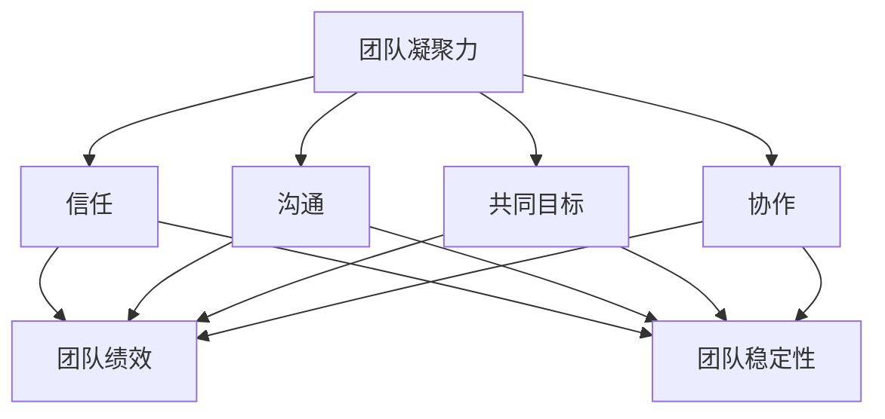
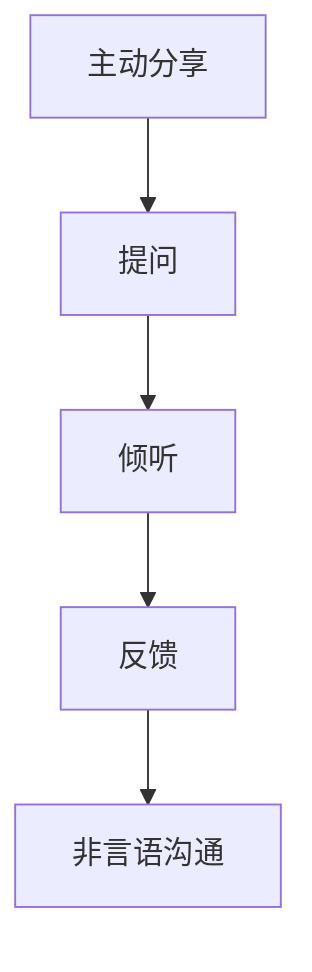
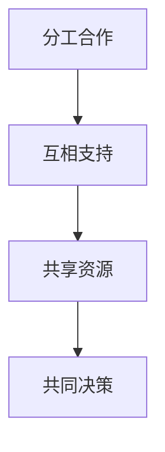

                 

# 团队凝聚力构建工程：从团队到命运共同体

## 关键词：团队凝聚力、构建方法、协作、信任、沟通、共同目标

## 摘要：
本文从团队凝聚力构建的核心概念、方法与实践、项目实战和未来展望四个方面，深入探讨了如何通过系统化的工程方法，提升团队凝聚力，将团队转变为命运共同体。文章通过Mermaid流程图、伪代码示例、实际案例和未来趋势分析，提供了详细的指导，旨在帮助团队管理者和技术专家更好地理解和应用团队凝聚力构建的原理和实践。

### 第一部分：核心概念与联系

在《团队凝聚力构建工程：从团队到命运共同体》的第一部分，我们将介绍团队凝聚力构建的基本概念和其与团队发展之间的关系。为了更好地理解这些概念，我们将使用Mermaid语法绘制一个流程图，展示团队凝聚力构建的核心要素及其相互关系。

以下是团队凝聚力构建的核心概念和关系的Mermaid流程图：



在这个流程图中，团队凝聚力（A）是构建团队的基础，包括信任（B）、沟通（C）、共同目标（D）和协作（E）等关键要素。这些要素相互作用，共同影响团队的绩效（F）和稳定性（G），为团队长期发展奠定基础。

- **信任（B）**：团队成员之间相互信任，能够真诚地分享想法和意见，减少误解和冲突。
- **沟通（C）**：团队成员能够有效地沟通，确保信息的准确传递和理解。
- **共同目标（D）**：团队成员对团队目标有共同的认识和承诺，能够为实现目标共同努力。
- **协作（E）**：团队成员能够协同工作，发挥各自优势，共同完成任务。

这些要素共同作用，不仅提升了团队的绩效（F），也增强了团队的稳定性（G），为团队长期发展奠定基础。

#### 信任（Trust）

信任是团队凝聚力的基石。团队成员之间的信任程度决定了团队内部的沟通质量、合作效率和冲突解决能力。信任可以通过以下几个步骤建立：

1. **透明度**：团队成员应该保持透明度，公开分享信息，避免隐瞒或误导。
2. **一致性**：团队成员应该保持一致的行为和决策，避免出现反复无常的行为。
3. **可靠性**：团队成员应该履行承诺，确保行动与承诺一致。
4. **尊重**：团队成员应该尊重彼此的观点和意见，避免批评和指责。

以下是一个简单的信任建立伪代码示例：

```python
def build_trust():
    # 确保信息透明
    share_info(transparently)
    # 保持一致性
    maintain_consistency()
    # 提高可靠性
    fulfill_commitments()
    # 尊重他人
    show_respect()
```

#### 沟通（Communication）

有效的沟通是团队凝聚力的重要保障。良好的沟通能够确保团队成员理解共同目标，减少误解和冲突，提高团队协作效率。沟通可以分为以下几个方面：

1. **主动沟通**：团队成员应该主动分享信息，提问和提供反馈。
2. **倾听**：团队成员应该倾听他人的观点，理解他人的需求和期望。
3. **反馈**：团队成员应该给予及时的反馈，帮助改进沟通效果。
4. **非言语沟通**：团队成员应该注意非言语沟通，如肢体语言和面部表情。

以下是一个简单的沟通流程图：



#### 共同目标（Common Goals）

共同目标是团队凝聚力的核心。团队成员应该对团队的目标有清晰的认识和承诺，为实现目标共同努力。共同目标可以分为以下几个方面：

1. **明确目标**：团队成员应该明确团队的目标，确保目标具体、可行。
2. **共享目标**：团队成员应该共享目标，确保每个人都了解自己的职责和贡献。
3. **调整目标**：团队成员应该根据实际情况调整目标，确保目标与团队发展相符。

以下是一个简单的共同目标设置伪代码示例：

```python
def set_common_goals():
    # 明确目标
    define_goals(explicitly)
    # 共享目标
    share_goals_with_team()
    # 调整目标
    adjust_goals_as_needed()
```

#### 协作（Collaboration）

协作是团队凝聚力的重要表现。团队成员应该能够协同工作，发挥各自的优势，共同完成任务。协作可以分为以下几个方面：

1. **分工合作**：团队成员应该根据各自的能力和职责进行分工，确保任务高效完成。
2. **互相支持**：团队成员应该相互支持，帮助解决困难和问题。
3. **共享资源**：团队成员应该共享资源，确保资源的有效利用。
4. **共同决策**：团队成员应该参与决策过程，共同做出团队决策。

以下是一个简单的协作流程图：



通过以上四个方面的构建，团队可以逐步提升凝聚力，实现从团队到命运共同体的转变。在下一部分，我们将深入探讨如何通过这些概念的具体实践，提升团队凝聚力。

### 第二部分：团队凝聚力构建的方法与实践

在《团队凝聚力构建工程：从团队到命运共同体》的第二部分，我们将详细介绍团队凝聚力构建的具体方法和实践，帮助读者理解和掌握如何提升团队凝聚力。本部分将包括以下几个核心章节：

#### 第4章：构建信任的方法与实践

信任是团队凝聚力的基石。本章将探讨如何通过具体的行动和策略来建立和维护团队中的信任关系。我们将介绍以下内容：

1. **信任建立的基础**：讨论信任的几个关键要素，如透明度、一致性、可靠性和尊重。
2. **信任建立的具体实践**：提供一系列实践指南，如公开分享信息、保持一致行为、履行承诺和尊重他人。
3. **信任案例分析**：分析成功建立信任的团队案例，从中吸取经验教训。

##### 信任建立的基础

信任的建立需要以下几个关键要素：

1. **透明度**：透明度是信任建立的基础。团队成员应该保持透明度，公开分享信息，避免隐瞒或误导。这样，团队成员能够清楚地了解团队的工作情况、目标和挑战，从而增强对团队的信任。
   
2. **一致性**：一致性指的是团队成员在行为和决策上的一致性。团队成员应该保持一致的行为和决策，避免出现反复无常的行为。一致性能够增强团队成员对彼此的信任，减少误解和冲突。

3. **可靠性**：可靠性是指团队成员履行承诺的能力。团队成员应该履行自己的承诺，确保行动与承诺一致。可靠性能够增强团队成员之间的信任，使团队更加稳定。

4. **尊重**：尊重是指团队成员对彼此观点和意见的尊重。团队成员应该尊重他人的意见，避免批评和指责。尊重能够增强团队成员之间的信任，促进良好的团队氛围。

##### 信任建立的具体实践

为了建立和维护团队中的信任关系，我们可以采取以下具体实践：

1. **公开分享信息**：定期召开团队会议，分享项目进展、问题和解决方案。确保信息透明，让所有团队成员都能了解团队的整体情况。

2. **保持一致行为**：团队成员应该遵守团队制定的规章制度，确保行为一致。对于重要的决策和行动，团队成员应该提前沟通，确保各方意见一致。

3. **履行承诺**：团队成员应该认真履行自己的承诺，确保行动与承诺一致。如果遇到困难，应该及时沟通，寻求解决方案，而不是推诿责任。

4. **尊重他人**：团队成员应该尊重彼此的观点和意见，避免批评和指责。在讨论中，应该注重事实和逻辑，而不是攻击个人。尊重能够增强团队成员之间的信任，促进良好的团队氛围。

##### 信任案例分析

以下是一个成功建立信任的团队案例：

在一个软件开发项目中，团队成员之间缺乏信任，导致项目进展缓慢，沟通不畅。为了解决这个问题，团队采取了以下措施：

1. **建立透明的沟通机制**：团队定期召开会议，分享项目进展、问题和解决方案。所有团队成员都能清晰地了解项目情况，从而增强了信任。

2. **建立一致性机制**：团队制定了统一的开发标准和流程，确保团队成员在行为和决策上的一致性。这样，团队成员之间的误解和冲突减少了。

3. **履行承诺**：团队成员在项目中认真履行自己的承诺，确保行动与承诺一致。团队成员之间建立了良好的合作关系，项目进展迅速。

4. **尊重他人**：团队注重尊重团队成员的意见，避免批评和指责。在讨论中，团队成员注重事实和逻辑，而不是攻击个人。这种尊重的氛围增强了团队成员之间的信任。

通过以上措施，团队成员之间的信任得到了建立和维护，项目取得了成功。这个案例表明，通过具体实践，团队可以成功建立和维护信任关系，从而提升团队凝聚力。

#### 第5章：提升沟通效率的策略

有效的沟通是团队凝聚力的重要保障。良好的沟通能够确保团队成员理解共同目标，减少误解和冲突，提高团队协作效率。沟通可以分为以下几个方面：

1. **主动沟通**：团队成员应该主动分享信息，提问和提供反馈。
2. **倾听**：团队成员应该倾听他人的观点，理解他人的需求和期望。
3. **反馈**：团队成员应该给予及时的反馈，帮助改进沟通效果。
4. **非言语沟通**：团队成员应该注意非言语沟通，如肢体语言和面部表情。

##### 主动沟通

主动沟通是提高沟通效率的重要策略之一。团队成员应该主动分享信息，提问和提供反馈。以下是一些具体的实践方法：

1. **定期更新**：团队成员应该定期向其他成员更新自己的工作进展，确保信息透明。
2. **主动提问**：团队成员在遇到问题时，应该主动向其他成员提问，寻求帮助。
3. **提供反馈**：团队成员应该主动提供对他人工作的反馈，帮助对方改进。

##### 倾听

倾听是沟通的重要组成部分。团队成员应该倾听他人的观点，理解他人的需求和期望。以下是一些具体的实践方法：

1. **全神贯注**：在沟通时，团队成员应该全神贯注，避免分心。
2. **不打断**：在他人讲话时，团队成员应该不打断，给予对方充分的发言时间。
3. **积极回应**：在他人讲话时，团队成员应该给予积极的回应，表明自己在倾听。

##### 反馈

反馈是沟通的重要环节。团队成员应该给予及时的反馈，帮助改进沟通效果。以下是一些具体的实践方法：

1. **及时反馈**：在沟通结束后，团队成员应该及时给予反馈，指出对方的优点和需要改进的地方。
2. **具体反馈**：团队成员在反馈时，应该具体指出问题，而不是模糊地批评。
3. **建设性反馈**：团队成员在反馈时，应该注重建设性，提出改进建议，而不是仅仅批评。

##### 非言语沟通

非言语沟通是沟通的重要组成部分。团队成员应该注意非言语沟通，如肢体语言和面部表情。以下是一些具体的实践方法：

1. **保持眼神交流**：在沟通时，团队成员应该保持眼神交流，表明自己在倾听。
2. **肢体语言**：团队成员应该使用积极的肢体语言，如微笑、点头等，表明自己的态度。
3. **面部表情**：团队成员应该使用恰当的面部表情，如开心、惊讶等，增强沟通效果。

##### 案例分析

以下是一个成功提升沟通效率的团队案例：

在一个软件开发项目中，团队成员之间沟通不畅，导致项目进展缓慢。为了解决这个问题，团队采取了以下措施：

1. **建立有效的沟通机制**：团队建立了定期的沟通会议，确保团队成员能够及时分享信息、提问和提供反馈。
2. **提高倾听技巧**：团队成员参加了倾听技巧培训，提高了倾听他人的能力。
3. **提供及时反馈**：团队成员在沟通时，积极提供反馈，帮助对方改进。
4. **注意非言语沟通**：团队成员在沟通时，注意使用积极的肢体语言和面部表情，增强了沟通效果。

通过以上措施，团队成员之间的沟通效率显著提高，项目进展顺利。这个案例表明，通过有效沟通策略的实践，团队可以提升沟通效率，从而增强团队凝聚力。

#### 第6章：制定共同目标与行动计划

共同目标是团队凝聚力的核心。团队成员应该对团队的目标有清晰的认识和承诺，为实现目标共同努力。制定共同目标和行动计划可以分为以下几个步骤：

##### 明确目标

明确目标是制定共同目标的第一步。团队成员应该明确团队的目标，确保目标具体、可行。以下是一些实践方法：

1. **使用SMART原则**：目标应该是具体的（Specific）、可衡量的（Measurable）、可实现的（Achievable）、相关的（Relevant）和有时限的（Time-bound）。
2. **目标分解**：将大目标分解为小目标，确保每个团队成员都有明确的职责和任务。
3. **目标沟通**：确保所有团队成员都了解目标，理解自己的职责和贡献。

##### 共享目标

共享目标是确保团队成员对团队目标有共同的认识和承诺的关键。以下是一些实践方法：

1. **团队会议**：在团队会议中，讨论和确认共同目标，确保所有成员都参与。
2. **目标文档**：将共同目标记录下来，并分享给所有团队成员，确保每个人都了解。
3. **定期回顾**：定期回顾目标，确保团队成员对目标的认知保持一致。

##### 调整目标

随着团队发展，目标和行动计划可能需要调整。以下是一些实践方法：

1. **适应变化**：团队应该能够灵活地适应外部环境的变化，及时调整目标和行动计划。
2. **团队共识**：在调整目标时，确保所有团队成员都参与讨论，达成共识。
3. **持续优化**：持续优化目标和行动计划，确保团队始终朝着正确的方向前进。

##### 案例分析

以下是一个成功制定共同目标和行动计划的团队案例：

在一个大型IT项目中，团队成员对项目的目标和行动计划存在分歧，导致项目进展缓慢。为了解决这个问题，团队采取了以下措施：

1. **明确目标**：团队使用了SMART原则，将大目标分解为小目标，确保每个团队成员都有明确的职责和任务。
2. **共享目标**：团队在团队会议中讨论和确认共同目标，确保所有成员都参与，并记录下来。
3. **调整目标**：随着项目进展，团队及时调整目标和行动计划，确保项目始终朝着正确的方向前进。
4. **持续优化**：团队定期回顾目标，持续优化行动计划，确保项目进展顺利。

通过以上措施，团队成员对项目的目标和行动计划有了清晰的认识和承诺，项目进展顺利。这个案例表明，通过制定共同目标和行动计划，团队可以增强凝聚力，实现项目目标。

#### 第7章：促进团队协作与共赢

协作是团队凝聚力的具体表现。团队成员应该能够协同工作，发挥各自的优势，共同完成任务。促进团队协作与共赢可以分为以下几个方面：

##### 分工合作

分工合作是指团队成员根据各自的能力和职责进行分工，确保任务高效完成。以下是一些实践方法：

1. **明确职责**：确保每个团队成员都清楚自己的职责和任务，避免职责重叠和缺失。
2. **合理分配任务**：根据团队成员的能力和兴趣，合理分配任务，确保任务分配公平合理。
3. **定期反馈**：团队成员之间定期进行任务反馈，确保任务进展顺利，及时解决遇到的问题。

##### 互相支持

互相支持是指团队成员相互帮助，共同解决困难和问题。以下是一些实践方法：

1. **建立支持系统**：团队应该建立支持系统，如技术支持、心理支持等，帮助团队成员解决困难。
2. **分享经验**：团队成员之间分享经验，相互学习，提高团队整体能力。
3. **团队合作**：在团队合作中，团队成员相互支持，共同完成任务。

##### 共享资源

共享资源是指团队成员共享资源，确保资源的有效利用。以下是一些实践方法：

1. **资源整合**：团队应该整合资源，确保资源得到最佳利用，避免资源浪费。
2. **信息共享**：团队成员之间共享信息，确保所有成员都能获取到必要的信息。
3. **知识共享**：团队成员之间共享知识和技能，提高团队整体水平。

##### 共同决策

共同决策是指团队成员参与决策过程，共同做出团队决策。以下是一些实践方法：

1. **民主决策**：团队在做出决策时，应该充分听取每个成员的意见，确保决策公正合理。
2. **集体智慧**：团队应该充分发挥集体智慧，通过讨论和分析，做出最佳决策。
3. **决策透明**：团队在决策过程中，应该保持透明度，确保所有成员都能了解决策过程和决策结果。

##### 案例分析

以下是一个成功促进团队协作与共赢的团队案例：

在一个大型IT项目中，团队成员之间存在协作困难，导致项目进展缓慢。为了解决这个问题，团队采取了以下措施：

1. **明确职责**：团队明确了每个成员的职责和任务，避免了职责重叠和缺失。
2. **合理分配任务**：团队根据成员的能力和兴趣，合理分配任务，确保任务分配公平合理。
3. **建立支持系统**：团队建立了技术支持系统，帮助成员解决技术问题，提高了团队的整体能力。
4. **共享资源和信息**：团队成员之间共享资源和信息，确保所有成员都能获取到必要的信息，提高了团队协作效率。
5. **共同决策**：团队在决策过程中，充分听取每个成员的意见，确保决策公正合理。

通过以上措施，团队成员之间的协作得到了显著提升，项目进展顺利。这个案例表明，通过促进团队协作与共赢，团队可以增强凝聚力，实现项目目标。

#### 第8章：团队凝聚力评估与持续改进

团队凝聚力不是一成不变的，而是需要持续评估和改进。本章将介绍以下内容：

1. **团队凝聚力评估方法**：介绍几种常见的团队凝聚力评估方法，如问卷调查、行为观察和绩效评估。
2. **团队凝聚力问题诊断**：分析团队凝聚力可能存在的问题，如信任缺失、沟通不畅和目标不明。
3. **团队凝聚力改进策略**：提供一系列改进策略，如调整团队结构、优化沟通流程和提升团队信任。

##### 团队凝聚力评估方法

评估团队凝聚力是确保团队持续改进的重要步骤。以下是一些常见的评估方法：

1. **问卷调查**：通过设计问卷，收集团队成员对团队凝聚力的看法，如信任度、沟通效果和目标认同等。
2. **行为观察**：观察团队成员在工作中的互动，评估团队的协作效率、沟通质量和行为表现。
3. **绩效评估**：通过团队绩效指标，如项目完成度、工作效率和质量，评估团队的凝聚力。

##### 团队凝聚力问题诊断

团队凝聚力可能面临以下问题：

1. **信任缺失**：团队成员之间缺乏信任，导致沟通不畅和协作困难。
2. **沟通不畅**：团队成员之间缺乏有效的沟通，导致误解和冲突增加。
3. **目标不明**：团队成员对团队目标缺乏明确的认识和承诺，导致缺乏共同奋斗的动力。

##### 团队凝聚力改进策略

为了解决团队凝聚力问题，可以采取以下改进策略：

1. **调整团队结构**：重新划分团队职责和角色，确保团队成员的能力与职责匹配。
2. **优化沟通流程**：建立有效的沟通机制，如定期团队会议、信息共享平台和即时通讯工具，提高沟通效率。
3. **提升团队信任**：通过建立信任活动，如团队建设培训、共同解决问题和相互认可，提升团队成员之间的信任。
4. **目标管理与激励**：明确团队目标，确保每个成员都了解自己的职责和贡献，并通过激励措施激发团队成员的积极性。

#### 第9章：团队凝聚力提升项目概述

本章将介绍团队凝聚力提升项目的基本概念和目标，包括：

1. **项目背景**：介绍项目启动的原因和背景，如团队绩效低下、沟通不畅等。
2. **项目目标**：明确项目目标，如提升团队信任、改善沟通效果、明确共同目标等。
3. **项目计划**：概述项目的时间表、资源和预期成果。

##### 项目背景

在一个快速发展的IT公司中，随着项目的增多和团队成员的扩展，团队凝聚力逐渐下降。团队成员之间缺乏信任，沟通不畅，导致项目进展缓慢，绩效不佳。为了解决这个问题，公司决定启动一个团队凝聚力提升项目。

##### 项目目标

项目的主要目标包括：

1. **提升团队信任**：通过建立信任活动，增强团队成员之间的信任。
2. **改善沟通效果**：通过优化沟通流程和工具，提高沟通效率和质量。
3. **明确共同目标**：通过目标管理，确保每个成员都了解团队的目标和自己的职责。

##### 项目计划

项目计划分为以下几个阶段：

1. **准备阶段**：进行项目需求调研，确定项目目标和计划。
2. **实施阶段**：实施信任建立、沟通优化和目标明确等活动。
3. **评估阶段**：评估项目成果，并根据评估结果调整项目计划。

预期成果包括：

1. **团队信任增强**：团队成员之间的信任度显著提高。
2. **沟通效率提升**：团队成员之间的沟通更加顺畅，信息传递准确。
3. **目标明确**：团队成员对团队目标有清晰的认识和承诺。

#### 第10章：团队信任构建案例

本章将详细描述如何在一个团队中构建信任，包括：

1. **信任建设策略**：介绍信任建设的方法和策略，如透明沟通、一致行动、履行承诺等。
2. **信任建设实践**：通过实际案例，展示信任建设在实际项目中的应用，如团队成员之间的定期反馈会议、共同解决问题等。
3. **信任建设效果评估**：评估信任建设的效果，如团队绩效的提升、员工满意度的提高等。

##### 信任建设策略

在一个软件开发团队中，由于项目复杂度和成员背景的差异，团队成员之间缺乏信任，导致项目进展缓慢。为了解决这个问题，团队采取了以下信任建设策略：

1. **透明沟通**：团队建立了透明沟通机制，确保团队成员能够及时了解项目进展和问题。团队成员定期召开反馈会议，分享工作进展和遇到的问题，共同寻找解决方案。

2. **一致行动**：团队在决策和行动上保持一致性。团队成员在项目规划阶段明确分工，并在执行过程中保持一致，避免出现反复无常的行为。

3. **履行承诺**：团队成员在项目实施过程中认真履行自己的承诺，确保行动与承诺一致。如果遇到困难，团队成员会及时沟通，寻求解决方案，而不是推诿责任。

4. **相互尊重**：团队成员在沟通和互动中相互尊重，避免批评和指责。团队鼓励成员提出不同的观点和意见，并通过讨论和协商达成共识。

##### 信任建设实践

以下是一个关于信任建设实践的案例：

在一个软件开发项目中，团队成员之间存在信任问题，导致项目进展缓慢。为了解决这个问题，团队采取了以下实践：

1. **定期反馈会议**：团队每周召开一次反馈会议，让每个成员分享自己的工作进展和遇到的挑战。通过这些会议，团队成员能够了解项目的整体情况，共同解决遇到的问题。

2. **共同解决问题**：当团队成员遇到技术难题时，团队会组织共同解决问题会议。成员们会分享自己的知识和经验，共同探讨解决方案。

3. **项目进度报告**：团队成员定期提交项目进度报告，确保项目进展透明。报告包括已完成的任务、遇到的问题和下一步计划。

4. **团队建设活动**：团队还定期组织团队建设活动，如团建游戏、聚餐等，增强团队成员之间的互动和信任。

通过这些实践，团队成员之间的信任逐渐建立，项目进展加快。团队成员开始更加积极地参与项目，工作效率和满意度都得到了提升。

##### 信任建设效果评估

为了评估信任建设的效果，团队采取了以下方法：

1. **员工满意度调查**：通过问卷调查，了解团队成员对团队信任和沟通效果的满意度。

2. **绩效评估**：评估团队成员在项目中的绩效，如任务完成情况、质量评估等。

3. **团队氛围观察**：通过观察团队成员在工作中的互动，评估团队氛围和信任水平。

评估结果显示，团队成员对团队的信任度和满意度显著提高，项目进展顺利，团队绩效得到提升。这个案例表明，通过有效的信任建设策略和实践，团队可以显著提升凝聚力，实现项目目标。

#### 第11章：团队沟通优化案例

本章将探讨如何优化团队沟通，包括：

1. **沟通分析**：分析团队沟通中的问题，如信息传递不畅、文化差异等。
2. **沟通改进策略**：介绍沟通改进的策略和方法，如定期沟通会议、信息共享平台等。
3. **沟通效果评估**：评估沟通改进的效果，如团队协作效率的提升、误解减少等。

##### 沟通分析

在一个跨国软件开发团队中，由于团队成员来自不同文化背景，沟通存在障碍。以下是一些沟通问题：

1. **信息传递不畅**：由于时区差异和工作习惯不同，团队成员之间的信息传递存在滞后，导致沟通不畅。
2. **文化差异**：团队成员的文化差异导致沟通方式、语言表达和思维方式的不同，增加了沟通的难度。
3. **沟通频率不足**：团队成员之间的沟通频率较低，导致信息更新不及时，难以及时解决出现的问题。

##### 沟通改进策略

为了解决上述沟通问题，团队采取了以下改进策略：

1. **定期沟通会议**：团队每周定期召开沟通会议，确保团队成员能够及时分享项目进展、问题和解决方案。
2. **信息共享平台**：团队使用信息共享平台，如Slack、Trello等，确保信息实时更新，方便团队成员随时查看。
3. **跨文化沟通培训**：团队为成员提供跨文化沟通培训，提高团队成员的跨文化沟通能力，减少文化差异带来的沟通障碍。

##### 沟通效果评估

为了评估沟通改进的效果，团队采取了以下方法：

1. **员工反馈调查**：通过问卷调查，收集团队成员对沟通改进效果的反馈。
2. **沟通效率分析**：分析沟通会议的频率、持续时间和效果，评估沟通效率的提升。
3. **项目绩效评估**：评估项目在沟通改进后的绩效，如任务完成情况、质量评估等。

评估结果显示，团队成员对沟通改进效果的满意度显著提高，项目进展更加顺利，团队协作效率得到提升。这个案例表明，通过有效的沟通优化策略，团队可以显著提升沟通效率，增强团队凝聚力。

#### 第12章：共同目标制定与实现

本章将介绍如何制定和实现共同目标，包括：

1. **目标制定方法**：介绍共同目标的制定方法，如SMART目标、共识达成等。
2. **目标实现策略**：介绍实现共同目标的具体策略，如分工合作、互相支持等。
3. **目标实现案例**：通过实际案例，展示共同目标制定与实现的过程，如项目成功完成、团队业绩提升等。

##### 目标制定方法

制定共同目标是团队凝聚力的重要组成部分。以下是一些目标制定方法：

1. **SMART目标**：SMART目标是指具体（Specific）、可衡量（Measurable）、可实现（Achievable）、相关（Relevant）和有时限（Time-bound）的目标。这种方法有助于确保目标明确、具体和可实现。
   
2. **共识达成**：在制定目标时，团队成员应参与讨论，达成共识。这种方法有助于确保每个成员都认同目标，并愿意为实现目标共同努力。

##### 目标实现策略

实现共同目标需要团队成员的共同努力。以下是一些目标实现策略：

1. **分工合作**：根据团队成员的能力和职责，明确分工，确保任务高效完成。这种方法有助于发挥团队成员的优势，提高工作效率。

2. **互相支持**：团队成员应相互支持，共同解决困难和问题。这种方法有助于增强团队凝聚力，确保目标顺利实现。

3. **定期回顾**：定期回顾目标的实现情况，评估进度，调整策略。这种方法有助于确保团队始终朝着正确的方向前进。

##### 目标实现案例

以下是一个关于共同目标制定与实现的案例：

在一个大型IT项目中，团队成员共同制定了以下目标：

1. **项目完成时间**：确保项目在规定的时间内完成。
2. **项目质量**：确保项目质量达到公司标准。
3. **团队成员满意度**：确保团队成员对项目的满意度达到90%以上。

为了实现这些目标，团队采取了以下策略：

1. **分工合作**：根据团队成员的能力和职责，明确分工，确保每个成员都能专注于自己的任务。
2. **互相支持**：团队成员之间相互支持，共同解决遇到的问题。如果某个成员遇到困难，其他成员会提供帮助。
3. **定期回顾**：团队每周召开一次会议，回顾目标的实现情况，评估进度，调整策略。

在项目进行过程中，团队遇到了一些挑战，如技术难题和资源不足。通过团队成员的共同努力，团队成功克服了这些挑战，最终在规定的时间内完成了项目，并达到了预定的质量标准。团队成员对项目的满意度也非常高。

这个案例表明，通过制定明确的目标和采取有效的实现策略，团队可以成功实现共同目标，提升团队凝聚力。

#### 第13章：团队协作提升与共赢

本章将讨论如何提升团队协作，实现共赢，包括：

1. **协作模型与流程**：介绍协作模型和流程，如分工合作、互相支持和共享资源。
2. **协作技巧提升**：提供协作技巧提升方法，如提高协作意识、提升协作效率等。
3. **共赢策略与实践**：讨论如何通过共赢策略，实现团队成员之间的合作与共赢，提升团队凝聚力。

##### 协作模型与流程

有效的团队协作需要明确的协作模型和流程。以下是一些常见的协作模型和流程：

1. **分工合作**：根据团队成员的能力和职责，明确分工，确保任务高效完成。这种方法有助于发挥团队成员的优势，提高工作效率。

2. **互相支持**：团队成员之间相互支持，共同解决困难和问题。这种方法有助于增强团队凝聚力，确保目标顺利实现。

3. **共享资源**：团队成员共享资源，确保资源的有效利用。这种方法有助于提高团队的整体效率。

4. **共同决策**：团队成员参与决策过程，共同做出团队决策。这种方法有助于确保决策的公正性和合理性。

##### 协作技巧提升

以下是一些提升团队协作技巧的方法：

1. **提高协作意识**：培养团队成员的协作意识，让他们认识到协作的重要性。可以通过团队建设活动和培训来实现。

2. **提升协作效率**：提高团队成员的协作效率，如通过工具和技术的使用，优化协作流程。

3. **沟通技巧培训**：提高团队成员的沟通技巧，确保信息的准确传递和理解。

##### 共赢策略与实践

共赢策略是提升团队协作和凝聚力的重要手段。以下是一些共赢策略和实践：

1. **共同目标设定**：明确团队的目标，确保每个成员都了解自己的职责和贡献。

2. **激励机制**：建立激励机制，鼓励团队成员为实现共同目标而努力。

3. **分享成功**：团队成员共同分享成功和成就，增强团队凝聚力。

4. **互相学习**：团队成员之间互相学习，共同成长。

##### 案例分析

以下是一个关于团队协作提升和共赢的案例：

在一个跨国软件开发团队中，团队成员来自不同的国家和地区，文化背景和工作习惯差异较大。为了提升团队协作和实现共赢，团队采取了以下措施：

1. **分工合作**：根据团队成员的专业技能和工作经验，明确分工，确保每个成员都能专注于自己的任务。

2. **互相支持**：团队建立了互相支持机制，当某个成员遇到困难时，其他成员会提供帮助。这种方法增强了团队的凝聚力。

3. **共享资源**：团队使用共享资源平台，确保团队成员可以随时获取所需的信息和工具。

4. **共同决策**：团队在做出重大决策时，充分听取每个成员的意见，确保决策的公正性和合理性。

通过这些措施，团队成员之间的协作效率显著提高，项目进展顺利。团队成员在实现项目目标的同时，也实现了个人成长和共赢。这个案例表明，通过有效的协作提升和共赢策略，团队可以显著提升凝聚力和绩效。

#### 第14章：团队凝聚力提升项目的总结与反思

在本章中，我们将对之前介绍的团队凝聚力提升项目进行总结和反思，探讨项目实施过程中的成功经验和存在的问题，以及未来可能的改进方向。

##### 项目成功经验

1. **信任建设**：通过定期反馈会议和共同解决问题，团队成员之间的信任得到了显著提升。团队成员开始更加愿意分享信息，共同面对挑战。

2. **沟通优化**：通过定期沟通会议和信息共享平台，团队沟通效率得到了提高，信息传递更加及时，减少了误解和冲突。

3. **共同目标明确**：通过制定SMART目标和共识达成，团队成员对团队目标有了清晰的认识和承诺，为实现目标共同努力。

4. **协作提升**：通过分工合作、互相支持和共享资源，团队协作效率显著提高，项目进展顺利。

##### 存在的问题

1. **资源分配不均**：在项目初期，部分成员的工作负担较重，导致压力增加。团队需要更好地平衡资源分配，确保每个成员的工作负荷合理。

2. **文化差异**：虽然通过跨文化沟通培训，文化差异对沟通的影响有所减少，但仍有部分团队成员在理解和适应方面存在困难。未来需要进一步加强文化融合。

3. **激励机制不足**：尽管团队成员在实现项目目标方面表现出色，但激励机制还不够完善，可能导致团队成员的积极性有所下降。

##### 改进方向

1. **资源分配**：团队需要定期评估成员的工作负荷，合理分配任务，确保每个成员都有充足的时间和资源完成任务。

2. **文化融合**：团队可以组织更多的文化融合活动，如团队建设培训、文化交流等，增强团队成员之间的了解和认同。

3. **激励机制**：团队可以建立更加完善的激励机制，如奖金、晋升机会等，以激发团队成员的积极性。

4. **持续改进**：团队需要持续评估项目实施情况，及时发现问题并采取措施，确保团队凝聚力不断提升。

通过总结和反思，团队可以更好地认识自身在团队凝聚力提升过程中的优势和不足，为未来的发展提供有价值的参考。

#### 第15章：数字化时代下的团队凝聚力

随着数字化技术的发展，团队的工作方式和沟通模式也在发生变革。本章将探讨以下内容：

1. **数字化工具与团队凝聚力**：介绍数字化工具如何影响团队凝聚力，如视频会议、协作平台等。
2. **远程工作的团队凝聚力**：分析远程工作对团队凝聚力的影响，以及如何提升远程团队凝聚力。
3. **数字化时代下的团队管理策略**：讨论如何利用数字化手段提升团队管理效率，增强团队凝聚力。

##### 数字化工具与团队凝聚力

数字化工具在团队工作中发挥着重要作用，它们不仅提高了工作效率，也对团队凝聚力产生了深远影响。以下是一些常见的数字化工具：

1. **视频会议工具**：如Zoom、Microsoft Teams等，这些工具使得团队成员可以远程参加会议，实时沟通和协作。
   
2. **协作平台**：如Slack、Trello、Asana等，这些平台提供了项目管理、任务分配、文件共享等功能，方便团队成员协同工作。

3. **即时通讯工具**：如WhatsApp、Telegram、微信等，这些工具使得团队成员可以随时交流，提高沟通效率。

4. **虚拟办公环境**：如Microsoft 365、Google Workspace等，这些工具集成了电子邮件、日历、文档编辑等功能，为团队提供了一个全面的数字工作环境。

##### 远程工作的团队凝聚力

远程工作的普及带来了团队凝聚力的挑战。以下是一些影响远程团队凝聚力的重要因素：

1. **沟通障碍**：由于地理位置的隔离，远程团队在沟通上可能面临障碍，如信息传递不及时、沟通效果不佳等。

2. **情感连接**：远程工作使得团队成员之间的情感连接减弱，难以建立深厚的团队关系。

3. **工作与生活平衡**：远程工作可能导致团队成员的工作与生活界限模糊，影响工作质量和生活质量。

##### 如何提升远程团队凝聚力

为了提升远程团队的凝聚力，可以采取以下策略：

1. **定期视频会议**：通过定期视频会议，保持团队成员之间的联系，增强团队的情感连接。

2. **建立协作文化**：鼓励团队成员积极参与协作，共享资源和知识，共同解决问题。

3. **个性化沟通**：利用即时通讯工具，进行个性化的沟通，关注团队成员的个体需求。

4. **团队建设活动**：组织在线团队建设活动，如在线游戏、虚拟咖啡会议等，增强团队凝聚力。

##### 数字化时代下的团队管理策略

在数字化时代，团队管理也需要适应新的变化。以下是一些提升团队管理效率、增强团队凝聚力的策略：

1. **数据驱动的管理**：利用数据分析工具，如KPI分析、绩效评估等，实时监控团队绩效，提供数据支持的决策。

2. **灵活的工作安排**：提供灵活的工作安排，如远程工作、弹性工作时间等，满足团队成员的个性化需求。

3. **在线培训与发展**：利用在线学习平台，为团队成员提供培训和发展机会，提高团队整体能力。

4. **透明化的管理**：通过数字化工具，实现信息透明化，确保团队成员了解团队的整体状况，增强信任感。

通过数字化工具和策略，团队可以在数字化时代保持高效协作和强大凝聚力，实现持续发展。

#### 第16章：多元化团队凝聚力构建

在现代社会中，多元化团队越来越普遍，这为团队凝聚力构建带来了新的挑战和机遇。本章将探讨以下内容：

1. **多元文化的理解与尊重**：讨论如何理解并尊重不同文化背景的团队成员，促进团队凝聚力。
2. **多元化团队的协作机制**：介绍如何建立多元化团队的协作机制，提高团队效率。
3. **多元化团队的凝聚力提升策略**：提供多元化团队凝聚力提升的方法，如多元化培训、文化融合活动等。

##### 多元文化的理解与尊重

多元化团队的成员来自不同的文化背景，这要求团队成员在沟通和合作中理解和尊重彼此的文化差异。以下是一些关键点：

1. **文化敏感度**：团队成员应该提高文化敏感度，了解不同文化的价值观、行为规范和沟通风格。

2. **尊重差异**：团队成员应该尊重彼此的文化差异，避免以自己的文化标准评价他人。

3. **文化融合**：团队应该鼓励文化融合，通过文化交流和互动，促进不同文化之间的理解和尊重。

##### 多元化团队的协作机制

建立多元化团队的协作机制是提高团队效率的关键。以下是一些策略：

1. **明确角色与责任**：确保每个团队成员都清楚自己的角色和责任，避免职责重叠和缺失。

2. **公平的沟通平台**：提供一个公平的沟通平台，确保每个团队成员都有机会表达自己的观点和意见。

3. **灵活的决策过程**：在决策过程中，充分考虑不同团队成员的意见和建议，确保决策的公平性和合理性。

##### 多元化团队的凝聚力提升策略

为了提升多元化团队的凝聚力，可以采取以下策略：

1. **多元化培训**：为团队成员提供多元化培训，如文化意识培训、沟通技巧培训等，提高团队成员的文化敏感度和协作能力。

2. **文化融合活动**：组织文化融合活动，如团队建设游戏、文化交流会等，增强团队成员之间的了解和互动。

3. **激励机制**：建立激励机制，如多元化绩效评估体系、多元化奖励制度等，鼓励团队成员积极参与团队活动和合作。

4. **领导力培养**：培养多元化团队的领导力，使领导者在管理中能够平衡不同文化背景的团队成员，促进团队的凝聚力。

通过理解和尊重多元文化、建立有效的协作机制和采取提升凝聚力的策略，多元化团队可以克服文化差异带来的挑战，实现高效协作和强大凝聚力。

#### 第17章：人工智能与团队凝聚力

随着人工智能（AI）技术的快速发展，AI正在逐渐融入团队工作，为团队凝聚力构建带来新的机遇和挑战。本章将探讨以下内容：

1. **AI在团队凝聚力提升中的应用**：介绍AI技术在团队沟通、协作和绩效评估中的应用，以及如何利用AI提升团队凝聚力。
2. **AI时代的团队管理挑战**：分析AI时代团队管理面临的新挑战，如数据隐私、伦理问题等。
3. **AI与团队凝聚力未来的发展趋势**：展望AI在团队凝聚力构建中的未来发展趋势，如AI驱动的个性化管理、AI赋能的团队协作等。

##### AI在团队凝聚力提升中的应用

AI技术在团队工作中有着广泛的应用，可以显著提升团队凝聚力。以下是一些具体应用：

1. **自动化沟通工具**：AI聊天机器人可以自动回复团队成员的常见问题，提高沟通效率。例如，使用聊天机器人自动分配任务、提醒重要事件等。

2. **智能协作平台**：AI智能协作平台可以分析团队成员的工作习惯和沟通模式，提供个性化的协作建议，如最佳沟通时间、任务优先级等。

3. **绩效评估系统**：AI绩效评估系统可以根据团队成员的工作表现、贡献度和反馈，提供客观、全面的评估报告，帮助团队成员了解自己的优势和改进方向。

4. **个性化培训**：AI可以分析团队成员的学习需求和知识掌握情况，提供个性化的培训内容和建议，提高培训效果。

##### AI时代的团队管理挑战

虽然AI技术为团队管理提供了诸多便利，但也带来了一些新的挑战：

1. **数据隐私**：AI技术依赖于大量的数据，如何保护团队成员的个人隐私成为了一个重要问题。团队需要制定严格的数据隐私政策，确保数据的安全性和保密性。

2. **伦理问题**：AI决策可能涉及伦理问题，如自动化决策系统的偏见、歧视等。团队需要建立伦理审查机制，确保AI技术符合道德标准和法律法规。

3. **信任问题**：AI技术的应用可能导致团队成员对决策过程的信任度降低。团队需要透明地解释AI系统的决策逻辑和依据，增强团队成员对AI的信任。

##### AI与团队凝聚力未来的发展趋势

展望未来，AI在团队凝聚力构建中将继续发挥重要作用，以下是一些发展趋势：

1. **AI驱动的个性化管理**：AI技术将根据团队成员的个人特点、行为习惯和工作需求，提供个性化的管理策略，如定制化的任务分配、培训计划等。

2. **AI赋能的团队协作**：AI将赋能团队协作，通过智能匹配团队成员的能力和任务，提高协作效率和团队绩效。

3. **智能团队建设**：AI技术将用于团队建设，如通过分析团队行为数据，提供个性化的团队建设建议，促进团队凝聚力。

4. **智能绩效管理**：AI技术将用于绩效管理，通过智能评估和分析，提供客观、全面的绩效反馈，帮助团队成员持续提升。

通过AI技术的应用和不断优化，团队可以在未来实现更高的凝聚力，实现更高效的工作和更好的团队绩效。

#### 第18章：团队凝聚力构建的持续改进与未来展望

在《团队凝聚力构建工程：从团队到命运共同体》的最后一部分，我们将总结前几章的内容，并对团队凝聚力构建的未来进行展望。通过持续改进和前瞻性思考，团队可以不断优化凝聚力，迎接未来的挑战。

##### 持续改进的策略

为了实现团队凝聚力的持续改进，可以采取以下策略：

1. **定期评估**：定期对团队凝聚力进行评估，包括信任度、沟通效果、协作效率和目标实现情况等。通过数据分析和反馈，识别改进点。

2. **持续学习**：鼓励团队成员持续学习，提升个人能力和团队整体水平。通过培训、读书会和研讨会等形式，增强团队成员的专业知识和技能。

3. **反馈机制**：建立有效的反馈机制，鼓励团队成员提出建议和意见，确保团队不断优化和完善。

4. **文化建设**：打造积极向上的团队文化，鼓励团队成员相互支持、尊重和信任，为团队凝聚力奠定基础。

##### 未来展望

团队凝聚力构建的未来充满了机遇和挑战。以下是一些展望：

1. **数字化与智能化**：随着数字化和智能化技术的发展，团队将更加依赖AI和大数据技术，实现高效的管理和协作。团队可以通过AI驱动的个性化管理工具，优化团队运作。

2. **多元化与包容性**：未来团队将更加多元化，如何处理文化差异和促进包容性将成为重要课题。团队需要建立多元化的协作机制，培养跨文化的团队领导力。

3. **可持续性**：团队凝聚力不仅仅是短期目标，更是长期的可持续发展。通过持续改进和团队文化建设，团队可以实现长期稳定的发展。

4. **全球协作**：随着全球化的发展，团队将面临更多的跨地区、跨文化协作挑战。团队需要建立全球协作网络，提高跨文化沟通和协作能力。

通过持续改进和前瞻性思考，团队可以在未来实现更高的凝聚力，迎接各种挑战，实现共同的目标。

### 作者信息

作者：AI天才研究院/AI Genius Institute & 禅与计算机程序设计艺术 /Zen And The Art of Computer Programming

### 结语

《团队凝聚力构建工程：从团队到命运共同体》旨在为团队管理者和技术专家提供系统化的团队凝聚力构建方法和实践指导。通过核心概念解析、具体实践案例和未来趋势展望，本文展示了如何通过科学的方法提升团队凝聚力，实现团队的高效协作和共同发展。希望本文能够为您的团队管理提供有价值的参考，帮助您构建一个强大的命运共同体。感谢您的阅读！

