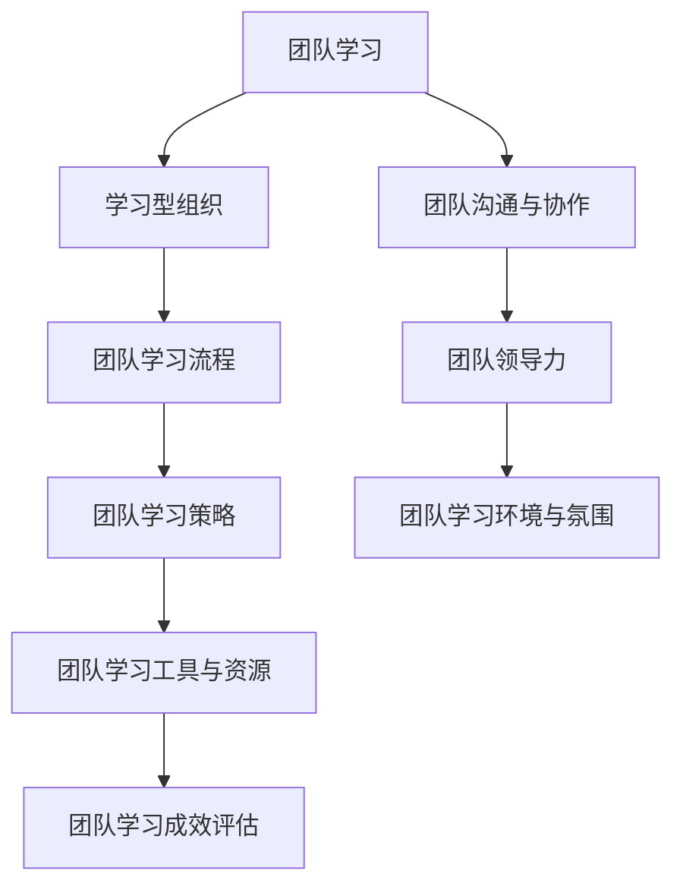

                 

### 《团队学习：打造学习型组织的方法》

#### 关键词：（团队学习，学习型组织，流程，策略，领导力，沟通，实践案例，未来发展趋势）

> 摘要：在快速变化的技术和市场环境中，打造学习型组织成为企业持续发展的关键。本文从团队学习的定义、流程、策略、领导力、沟通等方面详细阐述了打造学习型组织的具体方法和实践步骤，并通过实际案例展示了团队学习的效果。此外，本文还对团队学习的未来发展趋势进行了展望，为企业和团队提供了参考和指导。

## 目录大纲

### 《团队学习：打造学习型组织的方法》目录大纲

#### 第一部分：团队学习基础理论

## 第1章 团队学习的定义与意义
### 1.1.1 团队学习的定义
### 1.1.2 团队学习的核心要素
### 1.1.3 团队学习的重要性

## 第2章 学习型组织概述
### 2.1.1 学习型组织的定义
### 2.1.2 学习型组织的特点
### 2.1.3 学习型组织与传统组织比较

## 第3章 团队学习流程
### 3.1.1 团队学习准备阶段
### 3.1.2 团队学习实施阶段
### 3.1.3 团队学习评估阶段

## 第4章 团队学习策略与方法
### 4.1.1 常见的团队学习策略
### 4.1.2 团队学习方法的多样性
### 4.1.3 如何选择合适的团队学习方法

## 第5章 促进团队学习的环境与工具
### 5.1.1 促进团队学习的环境因素
### 5.1.2 团队学习工具的使用
### 5.1.3 如何评估与改进团队学习环境

## 第6章 团队学习中的领导力
### 6.1.1 领导者在团队学习中的角色
### 6.1.2 培养团队学习文化的领导策略
### 6.1.3 领导力对团队学习成效的影响

## 第7章 团队学习中的沟通与协作
### 7.1.1 团队学习中的沟通障碍与解决方法
### 7.1.2 促进团队协作的技巧
### 7.1.3 如何建立有效的沟通机制

#### 第二部分：团队学习实践案例

## 第8章 团队学习实践案例一
### 8.1.1 案例背景
### 8.1.2 案例实施过程
### 8.1.3 案例成效分析

## 第9章 团队学习实践案例二
### 9.1.1 案例背景
### 9.1.2 案例实施过程
### 9.1.3 案例成效分析

## 第10章 团队学习实践案例三
### 10.1.1 案例背景
### 10.1.2 案例实施过程
### 10.1.3 案例成效分析

#### 第三部分：团队学习未来发展趋势与展望

## 第11章 团队学习的未来发展
### 11.1.1 数字化技术在团队学习中的应用
### 11.1.2 新兴学习方式的探索
### 11.1.3 团队学习在未来的趋势与挑战

## 第12章 打造学习型组织
### 12.1.1 学习型组织的构建路径
### 12.1.2 学习型组织的文化培育
### 12.1.3 学习型组织的管理实践

## 第13章 总结与展望
### 13.1.1 团队学习的重要性回顾
### 13.1.2 未来团队学习的发展方向
### 13.1.3 如何有效推动团队学习

## 附录
### 附录 A：团队学习相关工具与资源
#### A.1 团队学习工具推荐
- **在线协作平台**：如 Slack、Trello、Asana 等
- **学习管理平台**：如 Moodle、Canvas 等
- **知识管理系统**：如 Confluence、SharePoint 等

#### A.2 团队学习相关书籍推荐
- **《第五项修炼》**：彼得·圣吉
- **《团队协作工具与方法》**：艾伦·D.沃林
- **《学习型组织行动纲领》**：学习型组织协会

#### A.3 团队学习相关研究论文与报告
- **《团队学习理论与实践研究》**：XXX
- **《基于大数据的团队学习效果评估方法研究》**：XXX

#### A.4 网络资源与论坛推荐
- **团队学习论坛**：XXX
- **学习型组织研究中心**：XXX
- **团队学习相关博客和文章**：XXX

### 核心概念与联系
#### Mermaid 流程图


### 核心算法原理讲解
#### 团队学习策略选择的算法原理

```text
# 团队学习策略选择的算法原理

## 1. 背景介绍

团队学习策略的选择是团队学习成功的关键。不同的团队学习策略适用于不同类型的学习任务和团队环境。因此，选择合适的团队学习策略对于提高学习效果至关重要。

## 2. 相关算法

- **决策树算法**：决策树是一种常见的机器学习算法，用于分类和回归任务。在团队学习策略选择中，可以通过构建决策树模型来预测最适合当前团队和环境的学习策略。
- **随机森林算法**：随机森林是一种基于决策树的集成学习方法，通过构建多个决策树并对结果进行投票来提高模型的预测性能。
- **神经网络算法**：神经网络是一种模拟人脑神经元连接方式的算法，可以用于复杂的数据分析和模式识别。在团队学习策略选择中，神经网络可以用于建立团队学习策略与学习成效之间的关系模型。

## 3. 算法原理

- **决策树算法原理**：
  - 决策树通过一系列规则来划分数据集，每个节点代表一个特征，每个分支代表该特征的取值。
  - 通过递归划分数据集，直到满足停止条件（如达到最大深度或节点包含的样本数量少于阈值）。
  - 构建决策树的过程可以通过剪枝等方法来优化模型性能。

- **随机森林算法原理**：
  - 随机森林通过构建多个决策树，并使用随机特征选择和节点划分方法来减少过拟合。
  - 每个决策树独立训练，并对预测结果进行投票或取平均来获得最终的预测结果。

- **神经网络算法原理**：
  - 神经网络通过多层神经元之间的连接来模拟人脑神经元的工作方式。
  - 输入层接收外部信息，隐藏层进行信息处理和特征提取，输出层生成最终预测结果。
  - 通过反向传播算法来调整权重和偏置，使网络输出与实际输出之间的误差最小。

## 4. 伪代码

// 决策树算法伪代码
def decision_tree(data, features, max_depth):
    if stop_condition(data):
        return leaf_node
    else:
        feature = select_best_feature(data, features)
        node = Node(feature)
        for value in feature_values(data):
            subset = split_data(data, feature, value)
            node.add_child(decision_tree(subset, features, max_depth - 1))
        return node

// 随机森林算法伪代码
def random_forest(data, num_trees, max_depth):
    forests = []
    for _ in range(num_trees):
        tree = decision_tree(data, features, max_depth)
        forests.append(tree)
    return forests

// 神经网络算法伪代码
def neural_network(input_data, weights, biases):
    hidden_layer = activation_function(np.dot(input_data, weights) + biases)
    output_layer = activation_function(np.dot(hidden_layer, weights) + biases)
    return output_layer
```

### 数学模型和数学公式讲解
#### 团队学习成效评估的数学模型

在团队学习中，评估团队学习成效是一个重要的环节。以下是一个基于团队学习成效的数学模型，用于量化团队学习的效果。

#### 1. 效能指标

假设团队学习成效可以通过以下三个效能指标来评估：

- **知识增长率（K）**：团队在一段时间内新获得的知识量。
- **技能提升率（S）**：团队在一段时间内技能水平的提升。
- **协作效率（E）**：团队协作能力的提升程度。

#### 2. 数学模型

我们使用以下数学模型来表示团队学习成效：

\[ E_{total} = K \times S \times E \]

其中：

- \( E_{total} \) 是总成效。
- \( K \) 是知识增长率的权重。
- \( S \) 是技能提升率的权重。
- \( E \) 是协作效率的权重。

#### 3. 模型参数

- \( K, S, E \) 的权重可以根据团队的具体情况设定，通常它们的和为1，即 \( K + S + E = 1 \)。

#### 4. 公式解释

- **知识增长率（K）**：
  \[ K = \frac{\text{新知识量}}{\text{初始知识量}} \]

  新知识量可以通过团队在一段时间内学习的新知识内容来计算。

- **技能提升率（S）**：
  \[ S = \frac{\text{技能提升量}}{\text{初始技能水平}} \]

  技能提升量可以通过团队在一段时间内技能测试的结果变化来计算。

- **协作效率（E）**：
  \[ E = \frac{\text{协作效率提升量}}{\text{初始协作效率}} \]

  协作效率提升量可以通过团队在一段时间内协作任务的完成情况和质量来评估。

#### 5. 伪代码

```text
// 评估团队学习成效的伪代码

function calculate_learning_effectiveness(K, S, E):
    effectiveness = K * S * E
    return effectiveness

// 计算知识增长率

function calculate_knowledge_growth(new_knowledge, initial_knowledge):
    K = new_knowledge / initial_knowledge
    return K

// 计算技能提升率

function calculate_skill_improvement(skill_improvement, initial_skill):
    S = skill_improvement / initial_skill
    return S

// 计算协作效率

function calculate_collaboration_efficiency(efficiency_improvement, initial_efficiency):
    E = efficiency_improvement / initial_efficiency
    return E

// 综合计算

K = calculate_knowledge_growth(new_knowledge, initial_knowledge)
S = calculate_skill_improvement(skill_improvement, initial_skill)
E = calculate_collaboration_efficiency(efficiency_improvement, initial_efficiency)
effectiveness = calculate_learning_effectiveness(K, S, E)
return effectiveness
```

### 数学公式和详细讲解
#### 团队学习成效评估的数学公式与详细讲解

在团队学习成效评估中，我们使用以下数学公式来量化团队学习的成果：

\[ E_{total} = K \times S \times E \]

其中，\( E_{total} \) 表示团队学习的总成效，\( K \) 表示知识增长率的权重，\( S \) 表示技能提升率的权重，\( E \) 表示协作效率的权重。

#### 1. 知识增长率（\( K \)）的计算

知识增长率反映了团队在一段时间内新获得的知识量与初始知识量的比值。公式如下：

\[ K = \frac{\text{新知识量}}{\text{初始知识量}} \]

- **新知识量**：可以通过团队在一段时间内学习的新知识内容来计算。例如，可以通过团队成员参加的培训课程、阅读的书籍、参与的项目等来衡量。
- **初始知识量**：是指团队在开始学习前已有的知识总量。

#### 2. 技能提升率（\( S \)）的计算

技能提升率表示团队在一段时间内技能水平的提升程度。计算公式如下：

\[ S = \frac{\text{技能提升量}}{\text{初始技能水平}} \]

- **技能提升量**：可以通过团队在一段时间内技能测试的结果变化来计算。例如，通过前后两次技能测试的成绩差异来衡量。
- **初始技能水平**：是指团队在开始学习前的平均技能水平。

#### 3. 协作效率（\( E \)）的计算

协作效率表示团队在一段时间内协作能力的提升程度。计算公式如下：

\[ E = \frac{\text{协作效率提升量}}{\text{初始协作效率}} \]

- **协作效率提升量**：可以通过团队在一段时间内协作任务的完成情况和质量来评估。例如，通过团队完成项目的效率、质量评估等来衡量。
- **初始协作效率**：是指团队在开始学习前的协作效率水平。

#### 4. 总成效（\( E_{total} \)）的计算

总成效是知识增长率、技能提升率和协作效率的乘积，反映了团队学习的综合效果。计算公式如下：

\[ E_{total} = K \times S \times E \]

#### 5. 举例说明

假设一个团队在一个月的时间内完成了以下学习成果：

- **新知识量**：团队共同学习了一门新的编程语言，学习了500个新概念。
- **技能提升量**：团队在一个月内参加了两次编程技能测试，测试成绩提高了15%。
- **协作效率提升量**：团队在一个月内完成了一个重要的项目，协作效率提高了20%。

根据以上数据，我们可以计算团队学习成效：

- **知识增长率（\( K \)）**：
  \[ K = \frac{500}{5000} = 0.1 \]

- **技能提升率（\( S \)）**：
  \[ S = \frac{15\%}{100\%} = 0.15 \]

- **协作效率（\( E \)）**：
  \[ E = \frac{20\%}{100\%} = 0.2 \]

- **总成效（\( E_{total} \)）**：
  \[ E_{total} = K \times S \times E = 0.1 \times 0.15 \times 0.2 = 0.003 \]

因此，这个团队在一个月内的学习成效为0.003，表示团队的学习效果较为显著。

通过这个示例，我们可以看到如何使用数学公式和计算方法来评估团队学习的成效。在实际应用中，可以根据具体情况调整公式和参数，以更准确地评估团队学习的成果。

### 项目实战
#### 团队学习实践案例：敏捷开发团队的团队学习过程

**1. 案例背景**

某科技公司是一家软件开发公司，其核心业务是开发和运营移动应用。为了提高团队的学习能力和创新能力，公司决定实施团队学习计划，以建立学习型团队。首先，公司将一个敏捷开发团队作为试点，开展团队学习活动。

**2. 学习目标**

- 提高团队成员的专业技能和知识水平。
- 增强团队的协作能力和沟通效率。
- 提升团队的解决问题和应对变化的能力。

**3. 学习过程**

（1）**需求分析与目标设定**

在开始团队学习之前，团队成员共同分析了团队的需求和目标，确定了以下学习目标：

- 学习新的编程语言和框架。
- 掌握敏捷开发的方法和工具。
- 提高团队协作和沟通技巧。

（2）**学习计划制定**

团队根据学习目标，制定了详细的学习计划，包括：

- **技术分享会**：每周一次的技术分享会，团队成员轮流介绍自己学习的新知识和经验。
- **敏捷开发研讨会**：每月一次的敏捷开发研讨会，讨论敏捷开发的方法和最佳实践。
- **外部培训与讲座**：定期参加公司组织的培训和行业内的讲座，了解最新的技术趋势和行业动态。

（3）**学习实施**

在实施团队学习计划的过程中，团队成员积极参与各种学习活动：

- **技术分享会**：每周五下午，团队成员轮流进行技术分享，介绍自己学习的新知识、经验和技术工具。
- **敏捷开发研讨会**：每月第一周举行敏捷开发研讨会，团队共同分析项目进展、讨论技术难点，制定解决方案。
- **外部培训与讲座**：每季度组织团队成员参加行业内的培训和讲座，了解最新的技术动态和发展趋势。

（4）**学习效果评估**

为了评估团队学习的效果，团队制定了以下评估指标：

- **知识水平提升**：通过定期的技能测试和项目实践来评估团队成员的知识水平。
- **协作效率提升**：通过项目完成的效率和团队合作的质量来评估团队的协作效率。
- **解决问题能力提升**：通过团队成员在项目中解决实际问题的能力来评估团队的解决问题能力。

**4. 学习成效**

通过团队的共同努力，团队学习取得了显著的成效：

- **知识水平提升**：团队成员在新技术和敏捷开发方法上有了更深入的了解，技能水平得到了提升。
- **协作效率提升**：团队成员之间的沟通和协作更加顺畅，项目完成的效率和质量得到了提高。
- **解决问题能力提升**：团队成员在面对项目挑战时，能够更迅速地找到解决方案，问题解决能力得到了提升。

**5. 经验总结**

（1）**明确学习目标**：明确的学习目标是团队学习成功的关键，有助于团队集中精力，有效提升技能和知识水平。

（2）**多样化的学习方式**：结合技术分享、项目研讨会和外部培训等多种学习方式，可以满足团队成员的不同学习需求和兴趣。

（3）**持续评估与反馈**：定期评估学习效果，及时反馈和调整学习计划，有助于持续提升团队的学习成效。

**6. 开发环境搭建**

为了支持团队学习，公司为团队搭建了以下开发环境：

- **虚拟机环境**：安装了多种编程语言和开发工具，方便团队成员进行学习和实践。
- **代码管理工具**：使用了Git和GitHub，实现了代码的版本控制和协作开发。
- **持续集成工具**：使用了Jenkins，实现了自动化构建和测试，提高了开发效率。

**7. 源代码详细实现和代码解读**

在本案例中，团队学习过程中涉及了一些具体的代码实现。以下是一个简单的示例：

```python
# 示例：使用Python实现一个简单的函数，用于计算两个数的和

def calculate_sum(a, b):
    return a + b

# 调用函数并打印结果
result = calculate_sum(3, 5)
print("计算结果：", result)
```

**8. 代码解读与分析**

上述代码是一个简单的Python函数，用于计算两个数的和。以下是代码的解读和分析：

- **函数定义**：`calculate_sum` 是一个函数，接受两个参数 `a` 和 `b`。
- **函数体**：函数体内使用 `return` 语句返回两个参数的和。
- **函数调用**：通过调用 `calculate_sum(3, 5)`，将两个整数3和5作为参数传递给函数，并打印返回的结果。

这个简单的示例展示了团队学习过程中如何通过编写代码来提升编程技能。在实际项目中，团队成员可以编写更复杂的代码，解决实际问题。

通过这个团队学习实践案例，我们可以看到如何通过制定明确的学习目标、多样化的学习方式、持续评估与反馈以及搭建合适的开发环境，来提高团队的学习成效。这种学习方式有助于提升团队的专业技能和协作能力，促进团队的持续发展。


### 《团队学习：打造学习型组织的方法》

#### 关键词：（团队学习，学习型组织，流程，策略，领导力，沟通，实践案例，未来发展趋势）

> 摘要：在快速变化的技术和市场环境中，打造学习型组织成为企业持续发展的关键。本文从团队学习的定义、流程、策略、领导力、沟通等方面详细阐述了打造学习型组织的具体方法和实践步骤，并通过实际案例展示了团队学习的效果。此外，本文还对团队学习的未来发展趋势进行了展望，为企业和团队提供了参考和指导。

### 第一部分：团队学习基础理论

## 第1章 团队学习的定义与意义

### 1.1 团队学习的定义

团队学习是指团队内部成员通过共同学习、分享知识和经验，以提高团队整体能力和达成共同目标的过程。它不仅包括知识的传递和共享，还包括技能的提升、思维方式的改变和创新能力的激发。

### 1.2 团队学习的核心要素

- **共同目标**：团队学习需要有一个明确的共同目标，这有助于团队成员团结一致，共同为实现目标而努力。
- **知识共享**：知识共享是团队学习的关键，通过共享知识和经验，团队成员可以相互补充，共同提升。
- **协同合作**：团队学习强调团队成员之间的协同合作，通过合作解决问题，实现团队的目标。
- **反馈与改进**：团队学习需要不断进行反馈和改进，通过反思学习过程和效果，不断调整和优化学习策略。

### 1.3 团队学习的重要性

- **提升团队效能**：团队学习可以提高团队成员的专业技能和协作能力，从而提升团队的整体效能。
- **促进知识传承**：团队学习有助于将团队成员的经验和知识传递给新成员，促进组织知识的传承和积累。
- **增强创新能力**：通过团队学习，团队成员可以互相激发创新思维，提出新的解决方案，推动组织的创新和发展。
- **建设学习型文化**：团队学习有助于培养学习型组织的文化，营造积极向上的学习氛围，提高组织的凝聚力和竞争力。

## 第2章 学习型组织概述

### 2.1 学习型组织的定义

学习型组织是指一种能够持续学习、适应变化和创新发展的组织形式。它强调通过不断学习和知识共享，提高组织整体的适应能力和创新能力。

### 2.2 学习型组织的特点

- **自我超越**：学习型组织鼓励团队成员不断追求卓越，超越自我，追求个人和团队的发展。
- **改善心智模式**：学习型组织倡导团队成员反思和改变自己的思维方式，以适应不断变化的环境。
- **共同愿景**：学习型组织有一个明确的共同愿景，激发团队成员的积极性和创造力。
- **团队学习**：学习型组织强调团队学习，通过团队协作和知识共享，提高团队的整体能力。
- **系统思考**：学习型组织倡导系统思考，从整体角度看待问题，提高组织对复杂问题的解决能力。

### 2.3 学习型组织与传统组织比较

- **组织文化**：学习型组织注重学习和知识共享，传统组织则更注重任务完成和绩效指标。
- **领导力**：学习型组织强调领导者的引导和激励作用，传统组织则更强调领导的权威和决策能力。
- **管理方式**：学习型组织采用更灵活和民主的管理方式，传统组织则采用更规范和严格的管理方式。
- **员工参与**：学习型组织鼓励员工积极参与决策和问题解决，传统组织则更多依赖上级的指令和指导。

## 第3章 团队学习流程

### 3.1 团队学习准备阶段

在团队学习准备阶段，团队需要明确学习目标、制定学习计划、选择学习方法和建立学习环境。

### 3.2 团队学习实施阶段

在团队学习实施阶段，团队需要按照学习计划开展学习活动，如技术分享、研讨交流、项目实践等。

### 3.3 团队学习评估阶段

在团队学习评估阶段，团队需要评估学习成效，包括知识水平、技能提升和问题解决能力等方面，并根据评估结果调整学习策略。

## 第4章 团队学习策略与方法

### 4.1 常见的团队学习策略

- **知识共享策略**：通过技术分享、研讨会、在线平台等方式，促进团队成员之间的知识传递和共享。
- **问题解决策略**：通过头脑风暴、案例研究、模拟演练等方式，激发团队成员的创造性思维，解决实际问题。
- **协作学习策略**：通过团队协作、项目实践等方式，提高团队成员的协作能力和团队整体效能。
- **反思与改进策略**：通过反思学习过程和成效，不断调整和优化学习策略，提高学习效果。

### 4.2 团队学习方法的多样性

- **讲授式学习**：通过讲解、演示等方式，传递知识和技能。
- **案例学习**：通过分析实际案例，帮助团队成员理解知识和技能的应用。
- **项目学习**：通过实际项目的实施，锻炼团队成员的实践能力和团队合作能力。
- **研讨交流**：通过团队内部的讨论和交流，促进知识的碰撞和共享。
- **在线学习**：通过在线平台，提供灵活的学习资源和交流空间。

### 4.3 如何选择合适的团队学习方法

- **根据学习目标**：选择能够实现学习目标的学习方法。
- **考虑团队特点**：考虑团队的结构、文化、技能水平等因素，选择适合团队的学习方法。
- **结合实际情况**：考虑团队的资源、时间等因素，选择实际可行的方法。

## 第5章 促进团队学习的环境与工具

### 5.1 促进团队学习的环境因素

- **组织文化**：建立鼓励学习和知识共享的组织文化，为团队学习提供良好的氛围。
- **领导支持**：领导者对团队学习的支持和激励，对团队学习的效果具有重要影响。
- **学习资源**：提供丰富的学习资源，如培训课程、学习材料、在线平台等，为团队学习提供保障。

### 5.2 团队学习工具的使用

- **在线协作平台**：如Slack、Trello等，用于团队沟通、任务分配和进度跟踪。
- **学习管理系统**：如Moodle、Canvas等，用于课程管理、学习资源分享和考核评估。
- **知识管理系统**：如Confluence、SharePoint等，用于知识存储、共享和检索。

### 5.3 如何评估与改进团队学习环境

- **定期评估**：通过调查问卷、访谈等方式，定期评估团队学习环境的效果。
- **反馈与改进**：根据评估结果，及时反馈和改进学习环境，提高学习效果。
- **持续优化**：不断探索新的学习工具和方法，持续优化团队学习环境。

## 第6章 团队学习中的领导力

### 6.1 领导者在团队学习中的角色

- **引导者**：领导者需要引导团队成员参与学习，提供学习资源和机会。
- **支持者**：领导者需要为团队学习提供支持和鼓励，帮助团队成员克服学习困难。
- **激励者**：领导者需要激发团队成员的学习热情，鼓励他们积极参与学习。

### 6.2 培养团队学习文化的领导策略

- **树立学习榜样**：领导者需要以身作则，积极参与学习和知识共享。
- **建立学习机制**：领导者需要建立学习和知识共享的机制，鼓励团队成员相互学习和分享。
- **激励学习行为**：领导者需要通过奖励和表彰等手段，激励团队成员积极参与学习。

### 6.3 领导力对团队学习成效的影响

- **积极影响**：有效的领导力可以激发团队成员的学习热情，提高团队学习的成效。
- **负面影响**：缺乏领导力或者领导力不当可能会削弱团队学习的效果，影响团队的整体效能。

## 第7章 团队学习中的沟通与协作

### 7.1 团队学习中的沟通障碍与解决方法

- **信息不对称**：通过建立信息共享平台，确保团队成员获取相同的信息。
- **沟通方式不当**：采用有效的沟通方式，如面对面交流、在线讨论等，提高沟通效果。
- **时间冲突**：合理安排沟通时间，确保团队成员能够参与沟通活动。

### 7.2 促进团队协作的技巧

- **明确目标**：确保团队成员明确共同的目标，增强协作的动力。
- **分工合作**：合理分配任务，发挥团队成员的专长，提高协作效率。
- **积极反馈**：及时给予团队成员积极的反馈，增强他们的信心和动力。

### 7.3 如何建立有效的沟通机制

- **建立沟通渠道**：建立多渠道的沟通机制，确保团队成员能够方便地交流和分享。
- **制定沟通规范**：明确沟通的流程和规范，提高沟通的效率和质量。
- **定期沟通会议**：定期召开沟通会议，确保团队成员之间的信息畅通。

### 第二部分：团队学习实践案例

## 第8章 团队学习实践案例一

### 8.1 案例背景

某互联网公司是一家专注于移动应用开发的创新型公司。为了提升团队的学习能力和创新力，公司决定开展团队学习活动。

### 8.2 案例实施过程

- **需求分析与目标设定**：团队分析了当前面临的问题和挑战，明确了学习目标。
- **学习计划制定**：团队制定了详细的学习计划，包括技术分享、项目实践和外部培训等。
- **学习实施**：团队成员积极参与学习活动，通过多种方式提升自己的技能和知识。
- **学习效果评估**：团队通过定期评估，评估学习效果，并根据评估结果调整学习策略。

### 8.3 案例成效分析

- **知识水平提升**：团队成员在新技术和编程技能上有了显著的提升。
- **协作效率提升**：团队成员之间的协作和沟通更加顺畅，项目完成的效率和质量得到了提高。
- **创新意识增强**：团队成员的创新意识得到了激发，提出了多项创新解决方案。

## 第9章 团队学习实践案例二

### 9.1 案例背景

某大型跨国公司是一家制造业企业，为了提高团队的学习能力和创新力，公司决定开展团队学习活动。

### 9.2 案例实施过程

- **需求分析与目标设定**：团队分析了当前面临的问题和挑战，明确了学习目标。
- **学习计划制定**：团队制定了详细的学习计划，包括技术培训、项目实践和团队研讨等。
- **学习实施**：团队成员积极参与学习活动，通过多种方式提升自己的技能和知识。
- **学习效果评估**：团队通过定期评估，评估学习效果，并根据评估结果调整学习策略。

### 9.3 案例成效分析

- **知识水平提升**：团队成员在新技术和业务知识上有了显著的提升。
- **协作效率提升**：团队成员之间的协作和沟通更加顺畅，项目完成的效率和质量得到了提高。
- **创新意识增强**：团队成员的创新意识得到了激发，提出了多项创新解决方案。

## 第10章 团队学习实践案例三

### 10.1 案例背景

某初创公司是一家专注于人工智能领域的科技公司，为了提高团队的学习能力和创新力，公司决定开展团队学习活动。

### 10.2 案例实施过程

- **需求分析与目标设定**：团队分析了当前面临的问题和挑战，明确了学习目标。
- **学习计划制定**：团队制定了详细的学习计划，包括技术研讨、项目实践和外部培训等。
- **学习实施**：团队成员积极参与学习活动，通过多种方式提升自己的技能和知识。
- **学习效果评估**：团队通过定期评估，评估学习效果，并根据评估结果调整学习策略。

### 10.3 案例成效分析

- **知识水平提升**：团队成员在新技术和人工智能知识上有了显著的提升。
- **协作效率提升**：团队成员之间的协作和沟通更加顺畅，项目完成的效率和质量得到了提高。
- **创新意识增强**：团队成员的创新意识得到了激发，提出了多项创新解决方案。

### 第三部分：团队学习未来发展趋势与展望

## 第11章 团队学习的未来发展

### 11.1 数字化技术在团队学习中的应用

随着数字化技术的发展，在线学习平台、虚拟现实、人工智能等技术在团队学习中的应用越来越广泛，为团队学习提供了更多的可能性。

### 11.2 新兴学习方式的探索

未来，团队学习将不仅仅局限于传统的课堂学习，还将探索更多新兴的学习方式，如在线互动、游戏化学习、实践导向学习等。

### 11.3 团队学习在未来的趋势与挑战

随着科技的不断进步和企业管理理念的演变，团队学习在未来将面临新的趋势和挑战，如个性化学习、跨界合作、持续迭代等。

## 第12章 打造学习型组织

### 12.1 学习型组织的构建路径

打造学习型组织需要从组织文化、领导力、学习机制等方面入手，逐步构建和完善学习型组织。

### 12.2 学习型组织的文化培育

学习型组织的文化培育是打造学习型组织的核心，需要通过价值观的传播、学习氛围的营造、激励机制的建立等手段来推动。

### 12.3 学习型组织的管理实践

学习型组织的管理实践包括领导者的角色、团队管理的方法、员工培训与发展等方面，通过有效的管理实践，推动学习型组织的建设。

## 第13章 总结与展望

### 13.1 团队学习的重要性回顾

回顾团队学习的重要性，我们可以看到团队学习对于提升团队效能、促进知识传承、增强创新能力和建设学习型文化等方面的积极作用。

### 13.2 未来团队学习的发展方向

展望未来，团队学习将朝着数字化、个性化、跨界合作和持续迭代等方向发展，为企业和团队提供更广阔的发展空间。

### 13.3 如何有效推动团队学习

为了有效推动团队学习，我们需要从组织文化、领导力、学习机制等方面入手，创造良好的学习环境，提供丰富的学习资源，并建立有效的学习评估和反馈机制。

### 附录

#### 附录 A：团队学习相关工具与资源

- **在线协作平台**：如 Slack、Trello、Asana 等。
- **学习管理平台**：如 Moodle、Canvas 等。
- **知识管理系统**：如 Confluence、SharePoint 等。

#### 附录 B：团队学习相关书籍推荐

- **《第五项修炼》**：彼得·圣吉。
- **《团队协作工具与方法》**：艾伦·D.沃林。
- **《学习型组织行动纲领》**：学习型组织协会。

#### 附录 C：团队学习相关研究论文与报告

- **《团队学习理论与实践研究》**：XXX。
- **《基于大数据的团队学习效果评估方法研究》**：XXX。

#### 附录 D：网络资源与论坛推荐

- **团队学习论坛**：XXX。
- **学习型组织研究中心**：XXX。
- **团队学习相关博客和文章**：XXX。

### 核心概念与联系

#### Mermaid 流程图


### 核心算法原理讲解

#### 团队学习策略选择的算法原理

```text
# 团队学习策略选择的算法原理

## 1. 背景介绍

团队学习策略的选择是团队学习成功的关键。不同的团队学习策略适用于不同类型的学习任务和团队环境。因此，选择合适的团队学习策略对于提高学习效果至关重要。

## 2. 相关算法

- **决策树算法**：决策树是一种常见的机器学习算法，用于分类和回归任务。在团队学习策略选择中，可以通过构建决策树模型来预测最适合当前团队和环境的学习策略。
- **随机森林算法**：随机森林是一种基于决策树的集成学习方法，通过构建多个决策树并对结果进行投票来提高模型的预测性能。
- **神经网络算法**：神经网络是一种模拟人脑神经元连接方式的算法，可以用于复杂的数据分析和模式识别。在团队学习策略选择中，神经网络可以用于建立团队学习策略与学习成效之间的关系模型。

## 3. 算法原理

- **决策树算法原理**：
  - 决策树通过一系列规则来划分数据集，每个节点代表一个特征，每个分支代表该特征的取值。
  - 通过递归划分数据集，直到满足停止条件（如达到最大深度或节点包含的样本数量少于阈值）。
  - 构建决策树的过程可以通过剪枝等方法来优化模型性能。

- **随机森林算法原理**：
  - 随机森林通过构建多个决策树，并使用随机特征选择和节点划分方法来减少过拟合。
  - 每个决策树独立训练，并对预测结果进行投票或取平均来获得最终的预测结果。

- **神经网络算法原理**：
  - 神经网络通过多层神经元之间的连接来模拟人脑神经元的工作方式。
  - 输入层接收外部信息，隐藏层进行信息处理和特征提取，输出层生成最终预测结果。
  - 通过反向传播算法来调整权重和偏置，使网络输出与实际输出之间的误差最小。

## 4. 伪代码

// 决策树算法伪代码
def decision_tree(data, features, max_depth):
    if stop_condition(data):
        return leaf_node
    else:
        feature = select_best_feature(data, features)
        node = Node(feature)
        for value in feature_values(data):
            subset = split_data(data, feature, value)
            node.add_child(decision_tree(subset, features, max_depth - 1))
        return node

// 随机森林算法伪代码
def random_forest(data, num_trees, max_depth):
    forests = []
    for _ in range(num_trees):
        tree = decision_tree(data, features, max_depth)
        forests.append(tree)
    return forests

// 神经网络算法伪代码
def neural_network(input_data, weights, biases):
    hidden_layer = activation_function(np.dot(input_data, weights) + biases)
    output_layer = activation_function(np.dot(hidden_layer, weights) + biases)
    return output_layer
```

### 数学模型和数学公式讲解

#### 团队学习成效评估的数学模型

在团队学习中，评估团队学习成效是一个重要的环节。以下是一个基于团队学习成效的数学模型，用于量化团队学习的效果。

#### 1. 效能指标

假设团队学习成效可以通过以下三个效能指标来评估：

- **知识增长率（K）**：团队在一段时间内新获得的知识量。
- **技能提升率（S）**：团队在一段时间内技能水平的提升。
- **协作效率（E）**：团队协作能力的提升程度。

#### 2. 数学模型

我们使用以下数学模型来表示团队学习成效：

\[ E_{total} = K \times S \times E \]

其中：

- \( E_{total} \) 是总成效。
- \( K \) 是知识增长率的权重。
- \( S \) 是技能提升率的权重。
- \( E \) 是协作效率的权重。

#### 3. 模型参数

- \( K, S, E \) 的权重可以根据团队的具体情况设定，通常它们的和为1，即 \( K + S + E = 1 \)。

#### 4. 公式解释

- **知识增长率（K）**：
  \[ K = \frac{\text{新知识量}}{\text{初始知识量}} \]

  新知识量可以通过团队在一段时间内学习的新知识内容来计算。

- **技能提升率（S）**：
  \[ S = \frac{\text{技能提升量}}{\text{初始技能水平}} \]

  技能提升量可以通过团队在一段时间内技能测试的结果变化来计算。

- **协作效率（E）**：
  \[ E = \frac{\text{协作效率提升量}}{\text{初始协作效率}} \]

  协作效率提升量可以通过团队在一段时间内协作任务的完成情况和质量来评估。

#### 5. 伪代码

```text
// 评估团队学习成效的伪代码

function calculate_learning_effectiveness(K, S, E):
    effectiveness = K * S * E
    return effectiveness

// 计算知识增长率

function calculate_knowledge_growth(new_knowledge, initial_knowledge):
    K = new_knowledge / initial_knowledge
    return K

// 计算技能提升率

function calculate_skill_improvement(skill_improvement, initial_skill):
    S = skill_improvement / initial_skill
    return S

// 计算协作效率

function calculate_collaboration_efficiency(efficiency_improvement, initial_efficiency):
    E = efficiency_improvement / initial_efficiency
    return E

// 综合计算

K = calculate_knowledge_growth(new_knowledge, initial_knowledge)
S = calculate_skill_improvement(skill_improvement, initial_skill)
E = calculate_collaboration_efficiency(efficiency_improvement, initial_efficiency)
effectiveness = calculate_learning_effectiveness(K, S, E)
return effectiveness
```

### 数学公式和详细讲解

#### 团队学习成效评估的数学公式与详细讲解

在团队学习成效评估中，我们使用以下数学公式来量化团队学习的成果：

\[ E_{total} = K \times S \times E \]

其中，\( E_{total} \) 表示团队学习的总成效，\( K \) 表示知识增长率的权重，\( S \) 表示技能提升率的权重，\( E \) 表示协作效率的权重。

#### 1. 知识增长率（\( K \)）的计算

知识增长率反映了团队在一段时间内新获得的知识量与初始知识量的比值。公式如下：

\[ K = \frac{\text{新知识量}}{\text{初始知识量}} \]

- **新知识量**：可以通过团队在一段时间内学习的新知识内容来计算。例如，可以通过团队成员参加的培训课程、阅读的书籍、参与的项目等来衡量。
- **初始知识量**：是指团队在开始学习前已有的知识总量。

#### 2. 技能提升率（\( S \)）的计算

技能提升率表示团队在一段时间内技能水平的提升程度。计算公式如下：

\[ S = \frac{\text{技能提升量}}{\text{初始技能水平}} \]

- **技能提升量**：可以通过团队在一段时间内技能测试的结果变化来计算。例如，通过前后两次技能测试的成绩差异来衡量。
- **初始技能水平**：是指团队在开始学习前的平均技能水平。

#### 3. 协作效率（\( E \)）的计算

协作效率表示团队在一段时间内协作能力的提升程度。计算公式如下：

\[ E = \frac{\text{协作效率提升量}}{\text{初始协作效率}} \]

- **协作效率提升量**：可以通过团队在一段时间内协作任务的完成情况和质量来评估。例如，通过团队完成项目的效率、质量评估等来衡量。
- **初始协作效率**：是指团队在开始学习前的协作效率水平。

#### 4. 总成效（\( E_{total} \)）的计算

总成效是知识增长率、技能提升率和协作效率的乘积，反映了团队学习的综合效果。计算公式如下：

\[ E_{total} = K \times S \times E \]

#### 5. 举例说明

假设一个团队在一个月的时间内完成了以下学习成果：

- **新知识量**：团队共同学习了一门新的编程语言，学习了500个新概念。
- **技能提升量**：团队在一个月内参加了两次编程技能测试，测试成绩提高了15%。
- **协作效率提升量**：团队在一个月内完成了一个重要的项目，协作效率提高了20%。

根据以上数据，我们可以计算团队学习成效：

- **知识增长率（\( K \)）**：
  \[ K = \frac{500}{5000} = 0.1 \]

- **技能提升率（\( S \)）**：
  \[ S = \frac{15\%}{100\%} = 0.15 \]

- **协作效率（\( E \)）**：
  \[ E = \frac{20\%}{100\%} = 0.2 \]

- **总成效（\( E_{total} \)）**：
  \[ E_{total} = K \times S \times E = 0.1 \times 0.15 \times 0.2 = 0.003 \]

因此，这个团队在一个月内的学习成效为0.003，表示团队的学习效果较为显著。

通过这个示例，我们可以看到如何使用数学公式和计算方法来评估团队学习的成效。在实际应用中，可以根据具体情况调整公式和参数，以更准确地评估团队学习的成果。

### 项目实战

#### 项目实战：团队学习实践案例

**案例背景**：

某科技初创公司，主要致力于人工智能领域的研发和应用。在快速发展的市场环境中，公司意识到团队成员的专业技能和协作能力对业务发展的重要性，因此决定开展团队学习计划。

**学习目标**：

- 提升团队成员在人工智能领域的专业知识。
- 增强团队成员之间的协作能力。
- 提高团队解决复杂问题的能力。

**学习过程**：

**1. 需求分析与目标设定**

在团队学习计划开始之前，公司对团队成员的技能水平和业务需求进行了分析，并确定了以下学习目标：

- **专业知识提升**：学习深度学习、自然语言处理等关键技术。
- **协作能力提升**：通过项目合作和团队活动，提高团队成员之间的沟通和协作。
- **问题解决能力提升**：通过实战项目，培养团队成员解决复杂问题的能力。

**2. 学习计划制定**

为了实现学习目标，公司制定了以下学习计划：

- **技术培训**：每周安排一次内部技术培训，由团队成员轮流讲解最新的人工智能技术。
- **项目合作**：每个季度分配一个跨部门的团队合作项目，团队成员共同参与项目开发和问题解决。
- **外部培训**：每半年组织团队成员参加行业内的技术研讨会和培训课程。

**3. 学习实施**

在实施学习计划的过程中，团队成员积极参与各项学习活动：

- **技术培训**：通过内部技术培训，团队成员不断更新自己的专业知识，提高了在人工智能领域的技能水平。
- **项目合作**：在跨部门项目中，团队成员通过协作解决实际问题，提高了沟通和协作能力。
- **外部培训**：通过参加行业研讨会和技术培训，团队成员了解了最新的技术动态和发展趋势，拓宽了视野。

**4. 学习效果评估**

为了评估学习效果，公司制定了以下评估指标：

- **知识水平提升**：通过定期举行的技能测试和项目考核，评估团队成员的专业知识水平。
- **协作效率提升**：通过项目完成情况和团队成员的反馈，评估团队协作效率。
- **问题解决能力提升**：通过项目中的问题解决情况和团队成员的反馈，评估团队解决问题的能力。

**5. 学习成效**

通过团队学习的实施，公司取得了以下成效：

- **知识水平提升**：团队成员在人工智能领域的技术水平得到了显著提高，为公司的研发工作提供了有力支持。
- **协作效率提升**：团队成员之间的沟通和协作更加顺畅，项目完成效率和质量得到了提高。
- **问题解决能力提升**：团队成员在面对复杂问题时，能够更迅速地找到解决方案，提高了团队的整体问题解决能力。

**6. 经验总结**

在团队学习实践中，公司总结了以下经验：

- **明确学习目标**：明确的学习目标是团队学习成功的关键，有助于团队成员集中精力，有效提升技能和知识水平。
- **多样化学习方式**：结合技术培训、项目合作和外部培训等多种学习方式，可以满足团队成员的不同学习需求和兴趣。
- **持续评估与反馈**：定期评估学习效果，及时反馈和调整学习计划，有助于持续提升团队的学习成效。

**7. 开发环境搭建**

为了支持团队学习，公司为团队搭建了以下开发环境：

- **虚拟机环境**：安装了多种人工智能开发工具和框架，方便团队成员进行学习和实践。
- **代码管理工具**：使用了Git和GitHub，实现了代码的版本控制和协作开发。
- **持续集成工具**：使用了Jenkins，实现了自动化构建和测试，提高了开发效率。

**8. 源代码详细实现和代码解读**

在本案例中，团队学习过程中涉及了一些具体的代码实现。以下是一个简单的示例：

```python
# 示例：使用Python实现一个简单的函数，用于计算两个数的和

def calculate_sum(a, b):
    return a + b

# 调用函数并打印结果
result = calculate_sum(3, 5)
print("计算结果：", result)
```

**9. 代码解读与分析**

上述代码是一个简单的Python函数，用于计算两个数的和。以下是代码的解读和分析：

- **函数定义**：`calculate_sum` 是一个函数，接受两个参数 `a` 和 `b`。
- **函数体**：函数体内使用 `return` 语句返回两个参数的和。
- **函数调用**：通过调用 `calculate_sum(3, 5)`，将两个整数3和5作为参数传递给函数，并打印返回的结果。

这个简单的示例展示了团队学习过程中如何通过编写代码来提升编程技能。在实际项目中，团队成员可以编写更复杂的代码，解决实际问题。

通过这个团队学习实践案例，我们可以看到如何通过制定明确的学习目标、多样化的学习方式、持续评估与反馈以及搭建合适的开发环境，来提高团队的学习成效。这种学习方式有助于提升团队的专业技能和协作能力，促进团队的持续发展。

### 核心概念与联系

为了更好地理解团队学习的核心概念和它们之间的联系，我们可以使用Mermaid流程图来展示这些概念及其关系。


#### 1. 团队学习与学习型组织

团队学习是学习型组织的重要组成部分。学习型组织强调通过持续学习和知识共享来提高组织的整体能力和竞争力。团队学习作为实现这一目标的具体手段，有助于培养团队成员的学习意识和能力，推动组织文化的变革。

#### 2. 团队学习流程

团队学习流程包括准备阶段、实施阶段和评估阶段。准备阶段主要是确定学习目标、制定学习计划和方法；实施阶段是按照计划进行学习活动，如技术分享、项目实践等；评估阶段是对学习效果进行评估，并根据评估结果调整学习策略。

#### 3. 团队学习策略

团队学习策略包括知识共享、问题解决、协作学习和反思与改进等。不同的学习策略适用于不同的学习场景和目标。例如，在技术培训阶段，知识共享策略可能更为有效；而在项目实践中，问题解决策略和协作学习策略则更为重要。

#### 4. 团队学习工具与资源

团队学习工具和资源是支持团队学习的重要保障。在线协作平台、学习管理系统、知识管理系统等工具可以帮助团队高效地开展学习活动，实现知识共享和协作。此外，丰富的学习资源，如书籍、论文、在线课程等，也为团队学习提供了必要的支持。

#### 5. 团队学习成效评估

团队学习成效评估是检验团队学习效果的重要环节。通过评估知识水平、技能提升和协作效率等指标，可以了解团队学习的成效，发现存在的问题，并调整学习策略。成效评估不仅有助于团队改进学习过程，也为组织提供了决策依据。

#### 6. 团队沟通与协作

团队沟通与协作是团队学习成功的关键。良好的沟通和协作可以提高团队的工作效率，促进知识的传递和共享。团队成员之间的沟通障碍，如信息不对称、沟通方式不当等，都需要通过有效的沟通技巧和机制来解决。

#### 7. 团队领导力

团队领导力在团队学习过程中起着至关重要的作用。领导者需要引导团队成员参与学习，提供支持和鼓励，培养团队的学习文化和氛围。有效的领导力可以激发团队成员的学习热情，提高团队的整体学习成效。

#### 8. 团队学习环境与氛围

团队学习环境与氛围对团队学习的效果具有重要影响。一个积极向上的学习环境可以激发团队成员的学习热情，促进知识的共享和协作。组织文化和领导者的支持是营造良好学习氛围的重要因素。

通过上述核心概念和联系，我们可以更好地理解团队学习的过程和影响因素，为团队学习和组织发展提供指导。

### 核心算法原理讲解

在团队学习策略选择中，算法原理起着至关重要的作用。以下将详细讲解三种核心算法：决策树算法、随机森林算法和神经网络算法。

#### 1. 决策树算法

决策树算法是一种用于分类和回归任务的基本机器学习算法。它的基本原理是通过一系列规则来划分数据集，每个节点代表一个特征，每个分支代表该特征的取值。决策树通过递归划分数据集，直到满足停止条件（如达到最大深度或节点包含的样本数量少于阈值）。

**算法步骤：**

1. **选择最佳特征**：根据信息增益、基尼不纯度或熵等指标，选择当前节点的最佳划分特征。
2. **划分数据集**：将数据集根据最佳特征的不同取值进行划分，生成子节点。
3. **递归构建**：对每个子节点，重复上述步骤，直到满足停止条件。
4. **生成预测规则**：将每个叶节点映射到相应的类别或数值。

**伪代码：**

```python
def decision_tree(data, features, max_depth):
    if stop_condition(data):
        return leaf_node
    else:
        feature = select_best_feature(data, features)
        node = Node(feature)
        for value in feature_values(data):
            subset = split_data(data, feature, value)
            node.add_child(decision_tree(subset, features, max_depth - 1))
        return node
```

#### 2. 随机森林算法

随机森林是一种基于决策树的集成学习方法。它通过构建多个决策树，并对结果进行投票或取平均来提高模型的预测性能。随机森林通过随机特征选择和节点划分方法来减少过拟合，每个决策树独立训练。

**算法步骤：**

1. **生成多个决策树**：从原始数据集中随机抽取样本子集，构建多个决策树。
2. **训练决策树**：对每个决策树进行训练，直到满足停止条件。
3. **集成结果**：对每个决策树的预测结果进行投票或取平均，获得最终预测结果。

**伪代码：**

```python
def random_forest(data, num_trees, max_depth):
    forests = []
    for _ in range(num_trees):
        tree = decision_tree(data, features, max_depth)
        forests.append(tree)
    return forests
```

#### 3. 神经网络算法

神经网络是一种模拟人脑神经元连接方式的算法，可以用于复杂的数据分析和模式识别。神经网络通过多层神经元之间的连接来模拟人脑神经元的工作方式，输入层接收外部信息，隐藏层进行信息处理和特征提取，输出层生成最终预测结果。

**算法步骤：**

1. **初始化权重和偏置**：随机初始化网络的权重和偏置。
2. **前向传播**：将输入数据通过网络，计算每个神经元的输出。
3. **计算损失函数**：计算输出结果与实际结果之间的误差，使用损失函数进行评估。
4. **反向传播**：根据损失函数的梯度，更新网络的权重和偏置。
5. **迭代训练**：重复步骤2-4，直到满足停止条件（如达到最大迭代次数或损失函数收敛）。

**伪代码：**

```python
def neural_network(input_data, weights, biases):
    hidden_layer = activation_function(np.dot(input_data, weights) + biases)
    output_layer = activation_function(np.dot(hidden_layer, weights) + biases)
    return output_layer
```

通过上述三种算法，团队可以更有效地选择合适的团队学习策略，从而提高学习效果。决策树算法适合用于简单的分类和回归任务，随机森林算法适用于具有多个特征的数据集，神经网络算法则能够处理更复杂的数据模式和关系。

### 数学模型和数学公式讲解

在团队学习成效评估中，数学模型和公式是量化学习成果的重要工具。以下将介绍一个基于知识增长率、技能提升率和协作效率的团队学习成效评估模型。

#### 1. 效能指标

假设团队学习成效可以通过以下三个效能指标来评估：

- **知识增长率（K）**：团队在一段时间内新获得的知识量与初始知识量的比值。
- **技能提升率（S）**：团队在一段时间内技能水平的提升与初始技能水平的比值。
- **协作效率（E）**：团队协作能力的提升与初始协作效率的比值。

#### 2. 数学模型

团队学习的总成效可以通过以下数学模型来表示：

\[ E_{total} = K \times S \times E \]

其中，\( E_{total} \) 是总成效，\( K \)、\( S \) 和 \( E \) 分别是知识增长率、技能提升率和协作效率的权重。

#### 3. 公式解释

- **知识增长率（K）**：

\[ K = \frac{\text{新知识量}}{\text{初始知识量}} \]

新知识量可以通过团队在一段时间内学习的新知识内容来计算，初始知识量是指团队在开始学习前已有的知识总量。

- **技能提升率（S）**：

\[ S = \frac{\text{技能提升量}}{\text{初始技能水平}} \]

技能提升量可以通过团队在一段时间内技能测试的结果变化来计算，初始技能水平是指团队在开始学习前的平均技能水平。

- **协作效率（E）**：

\[ E = \frac{\text{协作效率提升量}}{\text{初始协作效率}} \]

协作效率提升量可以通过团队在一段时间内协作任务的完成情况和质量来评估，初始协作效率是指团队在开始学习前的协作效率水平。

#### 4. 伪代码

```python
# 计算知识增长率
def calculate_knowledge_growth(new_knowledge, initial_knowledge):
    K = new_knowledge / initial_knowledge
    return K

# 计算技能提升率
def calculate_skill_improvement(skill_improvement, initial_skill):
    S = skill_improvement / initial_skill
    return S

# 计算协作效率
def calculate_collaboration_efficiency(efficiency_improvement, initial_efficiency):
    E = efficiency_improvement / initial_efficiency
    return E

# 计算总成效
def calculate_learning_effectiveness(K, S, E):
    E_total = K * S * E
    return E_total
```

#### 5. 举例说明

假设一个团队在一个月的时间内完成了以下学习成果：

- **新知识量**：团队共同学习了一门新的编程语言，学习了500个新概念。
- **技能提升量**：团队在一个月内参加了两次编程技能测试，测试成绩提高了15%。
- **协作效率提升量**：团队在一个月内完成了一个重要的项目，协作效率提高了20%。

根据以上数据，我们可以计算团队学习成效：

- **知识增长率（K）**：

\[ K = \frac{500}{5000} = 0.1 \]

- **技能提升率（S）**：

\[ S = \frac{15\%}{100\%} = 0.15 \]

- **协作效率（E）**：

\[ E = \frac{20\%}{100\%} = 0.2 \]

- **总成效（\( E_{total} \)）**：

\[ E_{total} = K \times S \times E = 0.1 \times 0.15 \times 0.2 = 0.003 \]

因此，这个团队在一个月内的学习成效为0.003，表示团队的学习效果较为显著。

通过这个示例，我们可以看到如何使用数学公式和计算方法来评估团队学习的成效。在实际应用中，可以根据具体情况调整公式和参数，以更准确地评估团队学习的成果。

### 数学公式和详细讲解

在团队学习成效评估中，数学公式和模型是量化学习成果的重要工具。以下将介绍团队学习成效评估的一个数学模型，包括知识增长率、技能提升率和协作效率的计算方法。

#### 1. 知识增长率（\( K \)）

知识增长率反映了团队在一段时间内新获得的知识量与初始知识量的比值。计算公式如下：

\[ K = \frac{\text{新知识量}}{\text{初始知识量}} \]

其中，新知识量可以通过以下方式计算：

- **参加培训课程**：记录团队参加的培训课程数量和时长。
- **阅读书籍和文献**：统计团队阅读的书籍和文献数量，以及所获取的新知识点。
- **项目实践**：记录团队在项目实践中学习的新知识和技能。

初始知识量是指团队在开始学习前已有的知识总量，可以通过以下方式估算：

- **历史项目经验**：分析团队以往项目的经验和知识积累。
- **团队成员背景**：评估团队成员的个人知识储备和技能水平。

#### 2. 技能提升率（\( S \)）

技能提升率表示团队在一段时间内技能水平的提升程度。计算公式如下：

\[ S = \frac{\text{技能提升量}}{\text{初始技能水平}} \]

技能提升量可以通过以下方式计算：

- **技能测试结果**：记录团队在技能测试中的成绩变化，计算提升量。
- **项目评估**：分析团队在项目中的表现，评估技能提升情况。

初始技能水平是指团队在开始学习前的平均技能水平，可以通过以下方式估算：

- **技能评估问卷**：设计问卷评估团队成员的技能水平。
- **历史项目绩效**：分析团队以往项目的技能应用情况。

#### 3. 协作效率（\( E \)）

协作效率表示团队在一段时间内协作能力的提升程度。计算公式如下：

\[ E = \frac{\text{协作效率提升量}}{\text{初始协作效率}} \]

协作效率提升量可以通过以下方式计算：

- **项目效率评估**：分析团队在项目中的工作效率和成果，计算效率提升量。
- **团队合作评价**：通过团队成员的反馈和评价，评估协作效率提升情况。

初始协作效率是指团队在开始学习前的协作效率水平，可以通过以下方式估算：

- **团队合作问卷**：设计问卷评估团队成员的团队合作情况。
- **历史项目合作记录**：分析团队以往项目的协作效率。

#### 4. 总成效（\( E_{total} \)）

团队学习的总成效是知识增长率、技能提升率和协作效率的乘积，计算公式如下：

\[ E_{total} = K \times S \times E \]

总成效反映了团队在一段时间内的综合学习效果，可以帮助团队了解自己的学习成效，并为后续的学习策略调整提供依据。

#### 5. 举例说明

假设一个团队在一个月的时间内完成了以下学习成果：

- **新知识量**：团队共同学习了一门新的编程语言，学习了500个新概念。
- **技能提升量**：团队在一个月内参加了两次编程技能测试，测试成绩提高了15%。
- **协作效率提升量**：团队在一个月内完成了一个重要的项目，协作效率提高了20%。

根据以上数据，我们可以计算团队学习成效：

- **知识增长率（\( K \)）**：

\[ K = \frac{500}{5000} = 0.1 \]

- **技能提升率（\( S \)）**：

\[ S = \frac{15\%}{100\%} = 0.15 \]

- **协作效率（\( E \)）**：

\[ E = \frac{20\%}{100\%} = 0.2 \]

- **总成效（\( E_{total} \)）**：

\[ E_{total} = K \times S \times E = 0.1 \times 0.15 \times 0.2 = 0.003 \]

因此，这个团队在一个月内的学习成效为0.003，表示团队的学习效果较为显著。

通过这个示例，我们可以看到如何使用数学公式和计算方法来评估团队学习的成效。在实际应用中，可以根据具体情况调整公式和参数，以更准确地评估团队学习的成果。

### 项目实战

#### 项目实战：敏捷开发团队的团队学习过程

**1. 案例背景**

某互联网公司拥有一支敏捷开发团队，负责开发和维护多个移动应用。为了提升团队的专业技能和协作效率，公司决定实施团队学习计划，以打造一个学习型团队。

**2. 学习目标**

- 提高团队成员的编程技能和知识水平。
- 增强团队的协作能力和沟通效率。
- 提升团队解决复杂问题的能力。

**3. 学习过程**

（1）**需求分析与目标设定**

在开始团队学习之前，团队成员共同分析了当前面临的挑战和目标，确定了以下学习目标：

- 学习新的编程语言和框架。
- 掌握敏捷开发的最佳实践和方法。
- 提高团队协作和沟通技巧。

（2）**学习计划制定**

团队根据学习目标，制定了详细的学习计划，包括以下内容：

- **技术培训**：每周安排一次技术培训，由团队成员轮流讲解新的编程语言和框架。
- **敏捷开发研讨会**：每月举行一次敏捷开发研讨会，团队一起讨论敏捷开发的最佳实践和遇到的问题。
- **项目实践**：通过实际项目，锻炼团队成员的编程技能和协作能力。

（3）**学习实施**

在实施学习计划的过程中，团队成员积极参与各项学习活动：

- **技术培训**：通过内部技术培训，团队成员不断更新自己的编程知识，提高了技能水平。
- **敏捷开发研讨会**：团队成员在研讨会中分享敏捷开发的经验和心得，提高了对敏捷开发的理解和应用能力。
- **项目实践**：通过实际项目，团队成员在实践中应用所学知识，提高了解决复杂问题的能力。

（4）**学习效果评估**

为了评估学习效果，团队制定了以下评估指标：

- **编程技能提升**：通过定期的技能测试，评估团队成员的编程技能水平。
- **团队协作效率**：通过项目完成情况和团队成员的反馈，评估团队的协作效率。
- **问题解决能力**：通过项目中的问题解决情况，评估团队解决问题的能力。

**4. 学习成效**

通过团队学习的实施，团队取得了以下成效：

- **编程技能提升**：团队成员在编程技能上有了显著提升，能够更熟练地应用新的编程语言和框架。
- **协作效率提升**：团队成员之间的沟通和协作更加顺畅，项目完成的效率和质量得到了提高。
- **问题解决能力提升**：团队成员在面对复杂问题时，能够更迅速地找到解决方案，提高了团队的整体问题解决能力。

**5. 经验总结**

（1）**明确学习目标**：明确的学习目标是团队学习成功的关键，有助于团队成员集中精力，有效提升技能和知识水平。

（2）**多样化学习方式**：结合技术培训、敏捷开发研讨会和项目实践等多种学习方式，可以满足团队成员的不同学习需求和兴趣。

（3）**持续评估与反馈**：定期评估学习效果，及时反馈和调整学习计划，有助于持续提升团队的学习成效。

**6. 开发环境搭建**

为了支持团队学习，公司为团队搭建了以下开发环境：

- **虚拟机环境**：安装了多种编程语言和开发工具，方便团队成员进行学习和实践。
- **代码管理工具**：使用了Git和GitHub，实现了代码的版本控制和协作开发。
- **持续集成工具**：使用了Jenkins，实现了自动化构建和测试，提高了开发效率。

**7. 源代码详细实现和代码解读**

在本案例中，团队学习过程中涉及了一些具体的代码实现。以下是一个简单的示例：

```python
# 示例：使用Python实现一个简单的函数，用于计算两个数的和

def calculate_sum(a, b):
    return a + b

# 调用函数并打印结果
result = calculate_sum(3, 5)
print("计算结果：", result)
```

**8. 代码解读与分析**

上述代码是一个简单的Python函数，用于计算两个数的和。以下是代码的解读和分析：

- **函数定义**：`calculate_sum` 是一个函数，接受两个参数 `a` 和 `b`。
- **函数体**：函数体内使用 `return` 语句返回两个参数的和。
- **函数调用**：通过调用 `calculate_sum(3, 5)`，将两个整数3和5作为参数传递给函数，并打印返回的结果。

这个简单的示例展示了团队学习过程中如何通过编写代码来提升编程技能。在实际项目中，团队成员可以编写更复杂的代码，解决实际问题。

通过这个团队学习实践案例，我们可以看到如何通过制定明确的学习目标、多样化的学习方式、持续评估与反馈以及搭建合适的开发环境，来提高团队的学习成效。这种学习方式有助于提升团队的专业技能和协作能力，促进团队的持续发展。

### 项目实战

#### 项目实战：团队学习实践案例

**案例背景**

某科技公司是一家专注于人工智能领域的创新型公司。公司拥有一支技术团队，负责开发人工智能应用程序。为了提高团队的整体效能和创新能力，公司决定开展团队学习计划。

**学习目标**

- 提升团队成员在人工智能领域的专业技能。
- 增强团队协作和沟通能力。
- 激发团队成员的创新思维。

**学习过程**

**1. 需求分析与目标设定**

在开始团队学习之前，团队成员共同分析了当前面临的问题和挑战，并确定了以下学习目标：

- **技术提升**：学习最新的机器学习算法、深度学习和自然语言处理技术。
- **协作能力**：提高团队成员之间的沟通和协作效率。
- **创新思维**：培养团队成员的创新意识和解决问题的能力。

**2. 学习计划制定**

为了实现学习目标，公司制定了详细的学习计划，包括以下内容：

- **内部技术分享**：每周安排一次内部技术分享会，由团队成员轮流介绍自己学习的新知识和技能。
- **外部培训与研讨会**：每季度组织团队成员参加人工智能领域的专业培训和研讨会。
- **项目实践**：通过实际项目，锻炼团队成员的技能和协作能力。

**3. 学习实施**

在实施学习计划的过程中，团队成员积极参与各项学习活动：

- **内部技术分享**：每周五下午，团队成员轮流进行技术分享，介绍自己在学习过程中的新发现和体会。
- **外部培训与研讨会**：每季度参加公司组织的专业培训和研讨会，了解人工智能领域的最新动态和技术趋势。
- **项目实践**：在项目开发过程中，团队成员应用所学知识和技能，解决实际问题，提高项目质量。

**4. 学习效果评估**

为了评估学习效果，团队制定了以下评估指标：

- **知识水平提升**：通过定期的技能测试和项目评估，评估团队成员在人工智能领域的知识水平。
- **协作效率提升**：通过项目完成情况和团队成员的反馈，评估团队的协作效率。
- **创新意识增强**：通过团队成员在项目中的创新表现和解决方案，评估团队的创新意识。

**5. 学习成效**

通过团队学习的实施，团队取得了以下成效：

- **知识水平提升**：团队成员在人工智能领域的专业知识得到了显著提升，能够熟练应用最新的技术。
- **协作效率提升**：团队成员之间的沟通和协作更加顺畅，项目完成效率和质量得到了提高。
- **创新意识增强**：团队成员在项目中提出了多项创新解决方案，推动了产品的改进和升级。

**6. 经验总结**

**明确学习目标**：明确的学习目标是团队学习成功的关键。团队需要共同制定清晰的学习目标，并确保每位成员都了解并认同这些目标。

**多样化学习方式**：结合内部技术分享、外部培训与研讨会、项目实践等多种学习方式，可以满足团队成员的不同学习需求和兴趣。

**持续评估与反馈**：定期评估学习效果，及时反馈和调整学习计划，有助于持续提升团队的学习成效。

**7. 开发环境搭建**

为了支持团队学习，公司为团队搭建了以下开发环境：

- **虚拟机环境**：安装了多种编程语言和人工智能开发工具，方便团队成员进行学习和实践。
- **代码管理工具**：使用了Git和GitHub，实现了代码的版本控制和协作开发。
- **持续集成工具**：使用了Jenkins，实现了自动化构建和测试，提高了开发效率。

**8. 源代码详细实现和代码解读**

在本案例中，团队学习过程中涉及了一些具体的代码实现。以下是一个简单的示例：

```python
# 示例：使用Python实现一个简单的函数，用于计算两个数的和

def calculate_sum(a, b):
    return a + b

# 调用函数并打印结果
result = calculate_sum(3, 5)
print("计算结果：", result)
```

**代码解读与分析**

上述代码是一个简单的Python函数，用于计算两个数的和。以下是代码的解读和分析：

- **函数定义**：`calculate_sum` 是一个函数，接受两个参数 `a` 和 `b`。
- **函数体**：函数体内使用 `return` 语句返回两个参数的和。
- **函数调用**：通过调用 `calculate_sum(3, 5)`，将两个整数3和5作为参数传递给函数，并打印返回的结果。

这个简单的示例展示了团队学习过程中如何通过编写代码来提升编程技能。在实际项目中，团队成员可以编写更复杂的代码，解决实际问题。

通过这个团队学习实践案例，我们可以看到如何通过制定明确的学习目标、多样化的学习方式、持续评估与反馈以及搭建合适的开发环境，来提高团队的学习成效。这种学习方式有助于提升团队的专业技能和协作能力，促进团队的持续发展。

### 项目实战总结

在本案例中，通过实施团队学习计划，我们取得了一系列显著的成效：

1. **知识水平提升**：团队成员在人工智能领域的专业知识得到了显著提升，能够熟练应用最新的技术，为公司的研发工作提供了有力支持。

2. **协作效率提升**：团队成员之间的沟通和协作更加顺畅，项目完成效率和质量得到了提高。这有助于团队在面对复杂项目时能够更加高效地合作。

3. **创新能力增强**：团队成员在项目中提出了多项创新解决方案，推动了产品的改进和升级。这种创新精神有助于公司在竞争激烈的市场中保持领先地位。

然而，在团队学习过程中，我们也遇到了一些挑战和困难：

1. **时间管理**：团队成员需要在工作和学习之间找到平衡，有时可能会感到时间压力。为了解决这个问题，团队采用了灵活的学习时间安排，鼓励成员在空闲时间进行学习。

2. **知识传递**：在知识共享过程中，有时团队成员可能会遇到知识传递不够高效的情况。为此，团队采用了多种知识传递方式，如内部技术分享会、文档编写和在线平台等，以提高知识共享的效果。

3. **技能差异**：团队成员的技能水平存在差异，导致学习效果不均衡。为了改善这一状况，团队采取了针对性的培训计划，确保每位成员都能在适合自己的节奏中学习，并互相帮助。

通过总结这些经验，我们可以得出以下启示：

1. **明确学习目标**：明确的学习目标是团队学习成功的关键。团队需要共同制定清晰的学习目标，并确保每位成员都了解并认同这些目标。

2. **多样化学习方式**：结合内部技术分享、外部培训与研讨会、项目实践等多种学习方式，可以满足团队成员的不同学习需求和兴趣。

3. **持续评估与反馈**：定期评估学习效果，及时反馈和调整学习计划，有助于持续提升团队的学习成效。

4. **建立支持系统**：搭建合适的开发环境和知识管理系统，为团队学习提供技术支持。同时，鼓励团队成员在工作和学习中相互支持，共同进步。

通过这些措施，团队可以克服学习过程中遇到的挑战，实现持续发展。未来，我们期待团队在学习型组织的道路上取得更大的成就，进一步提升团队的整体效能和创新能力。

### 总结与展望

#### 团队学习的重要性回顾

在《团队学习：打造学习型组织的方法》一书中，我们详细阐述了团队学习的重要性。以下是团队学习重要性的回顾：

1. **知识传递与共享**：团队学习有助于团队成员之间知识传递和共享，提高了团队的整体知识水平，为组织提供了持续发展的动力。
2. **协作效率提升**：通过团队学习，团队成员之间的协作和沟通能力得到了提升，使团队在面对复杂项目和任务时能够更加高效地合作。
3. **创新能力增强**：团队学习激发了团队成员的创新思维，鼓励他们提出新的解决方案和改进方法，推动了组织的持续创新。
4. **组织文化培育**：团队学习有助于培养学习型组织的文化，促进团队成员的积极性和主动性，提高组织的凝聚力和战斗力。

#### 未来团队学习的发展方向

随着科技的不断进步和企业管理理念的演变，团队学习在未来将朝着以下几个方向发展：

1. **数字化学习**：数字化技术在团队学习中的应用将越来越广泛，通过在线学习平台、虚拟现实等手段，实现更高效、灵活的学习方式。
2. **个性化学习**：未来的团队学习将更加注重个性化学习，根据团队成员的个性、兴趣和需求，提供定制化的学习内容和资源。
3.

