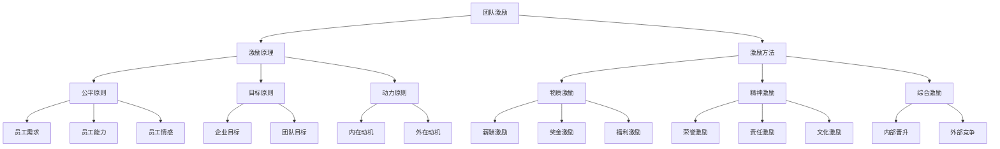

                 

### 《团队激励的艺术：激发员工积极性》

在当今快速发展的商业环境中，团队激励成为了企业竞争力和员工满意度的关键因素。本文旨在深入探讨团队激励的原理、方法、实践以及评估，帮助读者理解和掌握如何有效地激发员工积极性，从而实现团队的卓越表现和企业的长远发展。

### 关键词

- 团队激励
- 员工积极性
- 激励原理
- 激励方法
- 实践案例
- 激励评估

### 摘要

本文将围绕团队激励这一主题，通过系统的理论阐述和实际案例解析，探讨如何激发员工积极性。文章首先介绍了团队激励的基本原理和核心原则，然后分析了物质激励与精神激励的类型和方法，接着探讨了激发员工积极性的核心因素和策略。在此基础上，通过实际案例展示了团队激励的具体实施过程，并提出了持续优化团队激励的实施和评估方法。最终，本文总结了团队激励的重要性和实际应用价值，为企业提供了一套实用的团队激励框架。

### 第一部分：团队激励概述

团队激励是提升团队整体表现和员工个人积极性的一种有效手段。本部分将首先介绍团队激励的基本概念和原理，然后讨论团队激励的核心原则，最后回顾团队激励的理论基础。

#### 第1章：团队激励的原理与意义

##### 1.1 团队激励的基本概念

团队激励是指通过一系列的激励措施，激发团队成员的积极性、主动性和创造力，以达到提升团队绩效和企业目标的目的。团队激励不仅仅局限于物质层面的奖励，还包括精神层面的认可和激励。

- **定义**：团队激励是企业为了激励员工，提升团队绩效和实现组织目标而采取的各种激励措施的总称。
- **作用**：团队激励能够提高员工的满意度和归属感，增强团队凝聚力，激发员工的工作热情和创新能力。

##### 1.2 团队激励的核心原则

团队激励的有效实施需要遵循一些核心原则，这些原则是保证激励措施公平、合理和有效的重要保障。

- **公平原则**：公平原则要求企业为所有员工提供平等的机会和资源，避免因歧视和不公而导致的员工消极情绪。
- **目标原则**：目标原则强调激励措施应与企业的整体目标保持一致，确保团队成员的个人目标与团队目标相统一。
- **动力原则**：动力原则关注如何通过激励措施激发员工的工作动力和积极性，使其在工作中保持高效率和高质量。

##### 1.3 团队激励的理论基础

团队激励的理论基础包括多种心理学和管理学理论，这些理论为团队激励的实践提供了科学依据。

- **马斯洛需求层次理论**：该理论指出人的需求可以分为五个层次，从生理需求到自我实现需求。团队激励应关注满足员工的多种需求，特别是高层次需求。
- **双因素理论**：赫茨伯格的双因素理论认为，激励因素（如成就感、认可等）和保健因素（如工作条件、薪酬等）共同影响员工的工作满意度。团队激励应兼顾两者。
- **动机-激励-行为理论**：该理论认为人的行为是由动机激发的，动机来源于满足需求的激励。团队激励的核心在于找到并激发员工的内在动机。

#### 第2章：团队激励的类型与方法

团队激励的类型和方法多种多样，主要包括物质激励、精神激励和综合激励。每种激励方法都有其独特的优势和适用场景。

##### 2.1 物质激励

物质激励是指通过提供金钱、奖金、福利等物质形式的奖励来激发员工的积极性。物质激励的优点在于直接、快速地提高员工的工作动力，但过度依赖物质激励可能导致员工的功利主义倾向。

- **薪酬激励**：通过提高员工的工资和福利待遇，激励员工提高工作质量和效率。
- **奖金激励**：针对员工在特定项目或任务中的卓越表现，提供额外的奖金奖励。
- **福利激励**：为员工提供健康保险、退休金计划、员工旅游等福利，提高员工的生活质量。

##### 2.2 精神激励

精神激励是指通过表彰、认可、培训等非物质形式的奖励来激发员工的积极性和创造力。精神激励的优点在于能够提高员工的内在动机，增强员工的归属感和自豪感。

- **荣誉激励**：通过颁发荣誉证书、表彰大会等形式，对员工的突出贡献进行公开表彰。
- **责任激励**：赋予员工更多的责任和挑战，激发其责任感和成就感。
- **文化激励**：通过企业文化的建设，营造积极向上的工作氛围，激发员工的内在动力。

##### 2.3 综合激励

综合激励是将物质激励和精神激励有机结合的一种激励方法，旨在通过多种手段全面提升员工的工作动力和绩效。综合激励的优点在于能够兼顾员工的物质和精神需求，实现激励效果的最大化。

- **物质与精神激励的有机结合**：在物质激励的基础上，增加精神激励的成分，如为员工提供职业发展机会、培训计划等。
- **内部晋升激励**：为员工提供清晰的晋升路径和发展机会，激励其积极工作。
- **外部竞争激励**：通过设置外部竞争机制，激发员工之间的良性竞争，提高整体绩效。

### 第二部分：员工积极性的激发

员工积极性是团队绩效和创新能力的重要保障。本部分将探讨如何通过核心因素和策略来激发员工的积极性，以提高团队的整体表现。

#### 第3章：激发员工积极性的核心因素

激发员工积极性的关键在于了解和满足员工的需求，挖掘其内在的动机。以下是从员工需求、能力和情感三个方面探讨激发员工积极性的核心因素。

##### 3.1 员工需求与动机分析

员工需求是激励的基础，了解员工的需求是激发积极性的第一步。

- **员工需求的分类**：员工需求可以分为物质需求和精神需求。物质需求包括工资、福利、工作条件等；精神需求包括成就感、认可、发展机会等。
- **员工动机的类型**：员工动机可以分为内在动机和外在动机。内在动机源于对工作的热爱和兴趣；外在动机则来自外部奖励和压力。

##### 3.2 员工能力与潜力挖掘

员工的能力和潜力是决定其工作绩效的重要因素。企业应注重员工能力的评估和潜力的挖掘。

- **员工能力的评估**：通过定期评估和反馈，了解员工的能力水平和工作表现，为激励措施的制定提供依据。
- **员工潜力的激发**：为员工提供培训和晋升机会，激发其潜能，提高其综合素质和工作能力。

##### 3.3 员工情感与心理管理

员工的情感和心理状态直接影响其工作积极性和绩效。企业应关注员工情感和心理管理。

- **员工情感状态的影响**：积极乐观的情感状态有助于提高员工的工作效率和创新力；消极压抑的情感状态则可能导致工作懈怠和创造力下降。
- **员工心理健康的维护**：通过心理健康培训、心理咨询等方式，帮助员工缓解压力，保持良好的心理状态。

#### 第4章：激发员工积极性的策略与实践

激发员工积极性需要结合实际情境和员工特点，制定合理的激励策略和实施措施。以下是一些有效的激励策略和实践方法。

##### 4.1 明确目标与期望

明确的目标和期望是激发员工积极性的重要前提。企业应与员工共同制定合理的目标和期望，确保个人目标与团队目标的一致性。

- **企业目标与员工目标的统一**：通过明确企业的战略目标和员工的发展目标，确保两者相互支持、相互促进。
- **明确员工期望与期望管理**：了解员工的期望，并提供明确的职业发展路径和晋升机会，满足其成长和发展的需求。

##### 4.2 提供挑战性与成长空间

挑战性的任务和成长空间是激发员工积极性的重要因素。企业应创造条件，为员工提供具有挑战性的工作内容和成长空间。

- **设定具有挑战性的任务**：通过设定具有挑战性的项目和任务，激发员工的潜能和创新能力。
- **提供成长与发展机会**：为员工提供培训、职业规划和发展指导，帮助其提升能力和实现职业目标。

##### 4.3 建立有效的沟通机制

有效的沟通机制有助于增强员工的参与感和归属感，提高团队协作效率。企业应建立多样化的沟通渠道和机制。

- **沟通渠道的多样化**：通过会议、邮件、即时通讯工具等多种渠道，确保信息的及时传递和有效沟通。
- **沟通效果的评估与优化**：定期评估沟通效果，优化沟通流程，确保信息传递的准确性和及时性。

##### 4.4 强化团队协作与凝聚力

团队协作和凝聚力是提升团队绩效和员工积极性的重要因素。企业应采取多种措施，强化团队协作和凝聚力。

- **团队建设的策略**：通过团队建设活动、培训和工作坊，增强团队成员之间的信任和合作。
- **团队协作的工具与方法**：利用协作工具和项目管理软件，提高团队协作效率和成果。

### 第三部分：团队激励的实际案例与技巧

本部分将通过具体案例，展示团队激励在实际工作中的应用和技巧，为企业提供实用的参考和借鉴。

#### 第5章：成功团队激励案例分析

本章节将通过两个典型案例，分析成功实施团队激励的关键要素和策略。

##### 5.1 案例一：谷歌的员工激励机制

谷歌以其创新的员工激励机制而闻名，成为全球企业的学习典范。以下是谷歌员工激励机制的主要特点：

- **物质激励**：谷歌为员工提供具有竞争力的薪酬和福利，包括股票期权、健康保险、免费餐饮等。
- **精神激励**：谷歌注重员工的成就感和创新精神，通过荣誉表彰、公开认可等方式激发员工的积极性。
- **综合激励**：谷歌将物质激励和精神激励有机结合，提供丰富的职业发展机会和培训资源。

##### 5.2 案例二：苹果公司的团队激励策略

苹果公司以其卓越的团队协作和创新能力，成为全球科技行业的领导者。以下是苹果公司团队激励策略的关键要素：

- **薪酬激励**：苹果公司为员工提供具有吸引力的薪酬和福利，激励其追求卓越。
- **荣誉激励**：苹果公司通过年度表彰大会和荣誉奖项，表彰员工的突出贡献和卓越成就。
- **团队合作**：苹果公司强调团队合作和协作精神，通过项目协作和团队建设活动，增强员工的归属感和凝聚力。

#### 第6章：团队激励技巧与艺术

团队激励不仅需要科学的理论和方法，还需要灵活运用技巧和艺术，以适应不同的情境和员工特点。以下是一些团队激励的技巧和艺术：

##### 6.1 激励技巧的运用

- **个性化激励**：针对不同员工的兴趣和需求，提供个性化的激励措施，提高激励效果。
- **情境激励**：根据工作环境和任务特点，灵活运用激励措施，激发员工的工作热情。
- **持续激励**：通过定期评估和反馈，保持激励的持续性，避免员工产生懈怠情绪。

##### 6.2 激励艺术的提升

- **领导力的塑造**：领导者的激励艺术和领导力对团队激励具有重要影响。领导者应注重自身领导力的提升，以更好地激发员工的积极性。
- **组织文化的建设**：组织文化是团队激励的重要基础。企业应通过文化建设，营造积极向上的氛围，激发员工的内在动力。
- **激励效果的评估与反馈**：定期评估激励效果，收集员工的反馈意见，及时调整和优化激励措施，提高激励效果。

### 第四部分：团队激励的实施与评估

团队激励的实施和评估是确保激励措施有效性的关键环节。本部分将讨论团队激励的实施步骤、流程和评估方法，以及如何进行持续优化。

#### 第7章：团队激励的实施步骤与流程

团队激励的实施需要系统的规划和科学的步骤，以下是一些关键的实施步骤和流程：

##### 7.1 制定激励计划

制定激励计划是团队激励实施的第一步，主要包括以下内容：

- **确定激励目标**：明确团队激励的目标，如提高绩效、增强团队凝聚力等。
- **分析员工需求**：了解员工的需求和期望，为制定合理的激励措施提供依据。
- **制定激励策略**：根据企业目标和员工需求，选择合适的激励类型和方式。

##### 7.2 实施激励措施

实施激励措施是团队激励的核心环节，主要包括以下内容：

- **落实激励方案**：将激励计划转化为具体的激励措施，确保激励措施的有效执行。
- **跟踪激励效果**：对激励措施的实施过程进行监控，及时发现和解决问题，确保激励效果。

##### 7.3 评估激励效果

评估激励效果是团队激励实施的重要环节，主要包括以下内容：

- **量化评估**：通过数据分析和绩效评估，量化激励措施的效果，如提高的绩效指标、员工满意度等。
- **定性评估**：通过员工反馈和观察，定性评估激励措施的实际效果，如员工的工作状态、团队氛围等。

#### 第8章：团队激励的持续优化

团队激励是一个动态的过程，需要根据实际情况进行持续优化。以下是一些优化团队激励的方法：

##### 8.1 反馈机制的建设

建立有效的反馈机制是持续优化团队激励的关键。以下是一些反馈机制的建设方法：

- **员工反馈的收集**：通过定期调查、面谈、匿名反馈等方式，收集员工的反馈意见，了解激励措施的实际效果。
- **反馈信息的分析与利用**：对收集到的反馈信息进行分析，识别激励措施的优缺点，为优化激励措施提供依据。

##### 8.2 激励政策的调整与优化

根据反馈信息和企业发展需求，及时调整和优化激励政策。以下是一些调整和优化的方法：

- **前瞻性**：在制定激励政策时，充分考虑未来的发展需求和员工的期望，确保激励政策的长期有效性。
- **适应性**：根据企业内外部环境的变化，及时调整激励政策，以适应新的挑战和机遇。

##### 8.3 激励文化与氛围的营造

激励文化是团队激励的重要基础，以下是一些营造激励文化和氛围的方法：

- **激励文化的内涵**：通过企业价值观的传播和文化的建设，营造积极向上、团结协作的企业文化。
- **激励氛围的营造策略**：通过团队建设活动、企业文化活动等方式，营造良好的工作氛围，激发员工的积极性。

### 附录：团队激励的工具与方法

附录部分将介绍一些常用的团队激励工具和方法，以帮助读者更好地理解和应用团队激励。

#### 附录A：团队激励工具简介

- **绩效评估工具**：通过绩效评估工具，对员工的工作绩效进行评估，为激励措施的制定提供依据。
- **员工反馈工具**：通过员工反馈工具，收集员工的反馈意见，了解激励措施的实际效果。
- **激励方案设计工具**：通过激励方案设计工具，制定合理的激励方案，确保激励措施的有效执行。

#### 附录B：团队激励案例分析报告

案例分析报告是团队激励研究的重要成果之一，以下是一些案例分析报告的结构和撰写技巧：

- **案例背景**：介绍案例的背景和目的，明确案例研究的意义。
- **案例分析**：对案例进行深入分析，探讨案例中的激励措施和策略。
- **案例分析结果**：总结案例分析的结论和发现，提出优化建议。

### 核心概念与联系

为了更好地理解团队激励，我们需要将其核心概念和联系进行梳理。以下是一个简单的Mermaid流程图，展示了团队激励的核心概念和相互关系：



### 核心算法原理讲解

团队激励的核心算法原理涉及到如何根据员工需求和激励资源，设计出有效的激励措施。以下是一个简化的伪代码，用于说明团队激励算法的基本流程：

```plaintext
// 团队激励算法伪代码
function TeamIncentiveAlgorithm(EmployeeDemands, IncentiveResources)
    1. Analyze EmployeeDemands to identify their primary needs
    2. Select appropriate IncentiveMethods based on EmployeeDemands
        a. If EmployeeDemands are primarily Material, select MaterialIncentiveMethods
        b. If EmployeeDemands are primarily Spiritual, select SpiritualIncentiveMethods
        c. If EmployeeDemands are Mixed, select CombinedIncentiveMethods
    3. Allocate IncentiveResources based on selected IncentiveMethods
    4. Implement IncentivePlans and track their effectiveness
    5. Evaluate the impact of Incentives on EmployeePerformance and TeamMorale
    6. Adjust and optimize IncentivePlans based on feedback and performance metrics
end function
```

### 数学模型和数学公式

在团队激励中，数学模型和公式可以帮助我们量化激励措施的效果。以下是一个简单的数学模型，用于计算激励力度：

$$
激励力度 = \frac{激励资源}{需求强度}
$$

其中，激励资源是企业在一定时期内用于激励的总量，需求强度是员工对激励资源的需求程度。

### 激励效果的评估

为了评估激励效果，我们可以使用以下数学公式：

$$
激励效果评分 = \frac{激励后绩效 - 激励前绩效}{激励前绩效}
$$

其中，激励后绩效是实施激励措施后的员工绩效，激励前绩效是实施激励措施前的员工绩效。激励效果评分越高，说明激励效果越好。

### 项目实战

在本部分，我们将通过两个具体的案例，展示如何在实际项目中实施团队激励。

#### 案例一：员工绩效奖金激励

##### 实践场景

某科技公司为了提高研发团队的创新能力，决定实施员工绩效奖金激励制度。

##### 实践步骤

1. **制定激励计划**

   - 确定绩效奖金的目标：提高研发项目的创新度和成功率。
   - 制定绩效奖金的分配规则：根据项目的重要性和完成情况，分配不同的奖金比例。

2. **实施激励措施**

   - 每个研发项目完成后，评估项目的创新度和成功率。
   - 根据评估结果，发放相应的绩效奖金。

3. **评估激励效果**

   - 通过对比激励前后的研发项目数量、质量和成功率，评估激励效果。
   - 收集员工的反馈意见，了解激励措施的实际效果。

##### 代码解读与分析

以下是绩效评估和奖金计算的伪代码：

```plaintext
// 绩效评估函数
function assess_performance(project成果, 基准值):
    innovation_score = (project成果 - 基准值) / 基准值
    success_rate = project成果 / project总数
    performance_score = innovation_score * success_rate
    return performance_score

// 绩效奖金计算函数
function calculate_bonus(performance_score, 基准奖金):
    if performance_score >= 1.2:
        bonus = 基准奖金 * 1.5
    elif performance_score >= 1.0:
        bonus = 基准奖金
    else:
        bonus = 基准奖金 * 0.8
    return bonus
```

#### 案例二：员工荣誉激励

##### 实践场景

某电子商务公司为了提升客服团队的服务质量，决定实施员工荣誉激励制度。

##### 实践步骤

1. **制定激励计划**

   - 设定荣誉激励的目标：提高客服团队的服务满意度和用户忠诚度。
   - 制定荣誉激励的评选标准：根据客服人员的服务态度、解决问题能力和用户评价等指标进行评选。

2. **实施激励措施**

   - 每月对客服人员进行评选，根据评选结果，颁发荣誉证书和奖金。

3. **评估激励效果**

   - 通过对比实施荣誉激励前后的客服服务质量、用户满意度等指标，评估激励效果。
   - 收集员工的反馈意见，了解荣誉激励的实际效果。

##### 代码解读与分析

以下是荣誉评选和奖金发放的伪代码：

```plaintext
// 荣誉评选函数
function select_honors(customers, criteria):
    honors_list = []
    for customer in customers:
        if customer['满意度'] >= 4.5 and customer['问题解决率'] >= 0.9:
            honors_list.append(customer['姓名'])
    return honors_list

// 荣誉激励发放函数
function award_honors(honors_list, bonus):
    for name in honors_list:
        print(f"恭喜{name}获得本月荣誉激励，奖金：{bonus}元")
```

### 总结

通过以上两个实际案例，我们可以看到团队激励在提高员工积极性和促进团队发展方面的重要作用。通过制定明确的激励计划、实施有效的激励措施和持续评估激励效果，企业可以有效地激发员工的潜能，提高整体绩效。

- **代码解读与分析**：通过解读激励算法的伪代码和实际代码，我们可以了解到团队激励的核心原理和实施方法。
- **实践场景**：通过具体的案例，我们可以看到团队激励在现实工作中的应用场景和实施步骤。
- **源代码实现与解读**：通过源代码的实现和解读，我们可以更深入地理解团队激励系统的构建和运作机制。

在未来的工作中，企业应根据自身特点和实际情况，灵活运用团队激励的方法和策略，不断提升员工的积极性和工作热情，实现企业的长期发展目标。

### 作者信息

**作者：** AI天才研究院 / AI Genius Institute & 《禅与计算机程序设计艺术》作者 / 《团队激励的艺术：激发员工积极性》作者

### 附录

#### 附录A：团队激励工具简介

- **绩效评估工具**：用于评估员工工作绩效，为激励措施的制定提供数据支持。
- **员工反馈工具**：用于收集员工对激励措施的意见和建议，帮助优化激励方案。
- **激励方案设计工具**：用于设计和管理激励方案，确保激励措施的有效性和公平性。

#### 附录B：团队激励案例分析报告

- **案例背景**：介绍案例的背景和目的，明确案例分析的意义。
- **案例分析**：对案例中的激励措施和策略进行深入分析，探讨其有效性和局限性。
- **案例分析结果**：总结案例分析的结论和发现，提出改进建议和优化方案。

### 结语

团队激励是提升企业竞争力和员工满意度的关键因素。通过系统的理论阐述、实际案例分析和策略实践，本文为读者提供了一套实用的团队激励框架。希望读者能够结合自身实际情况，灵活运用团队激励的方法和策略，激发员工的积极性和创造力，实现企业的长期发展目标。在未来的工作中，让我们共同探索团队激励的艺术，开启企业发展的新篇章。

