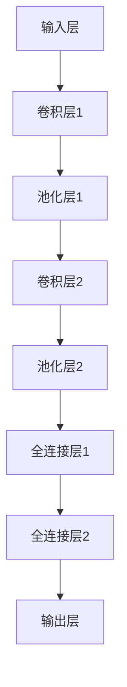

                 

# 《图像搜索技术在电商领域的应用：发展趋势与未来》

## 摘要

图像搜索技术作为人工智能领域的重要分支，正逐渐渗透到电商行业，改变着消费者的购物体验和零售商的业务模式。本文将从引言入手，概述图像搜索技术的发展历程及应用现状，深入分析图像识别与匹配算法的核心技术，探讨其在电商领域中的具体应用场景，包括商品搜索和商品推荐系统。此外，本文还将展望图像搜索技术的未来发展趋势，探讨其面临的挑战及应对策略，为电商行业的数字化转型提供新思路。

## 第一部分：引言

图像搜索技术，又称视觉搜索，是利用计算机视觉技术对图像内容进行自动分析和识别，从而在图像库中找到相似或相关图像的一种搜索方式。近年来，随着计算机性能的提升、算法的进步以及大数据和人工智能技术的快速发展，图像搜索技术在各个领域的应用日益广泛，尤其在电商行业表现出巨大的潜力和市场价值。

### 1.1 图像搜索技术的发展历程

图像搜索技术的发展可以追溯到20世纪80年代，当时主要是基于图像内容的特征提取和匹配算法。这些算法主要包括基于颜色的直方图匹配、纹理特征的SIFT和SURF等。随着计算机性能的提升和算法的优化，图像搜索技术在21世纪初取得了显著的进展。2006年，深度学习算法的提出为图像搜索技术带来了新的契机，尤其是卷积神经网络（CNN）的应用，使得图像识别的准确率大幅提升。

### 1.2 图像搜索技术在电商领域的应用现状

当前，图像搜索技术在电商领域的应用主要包括商品搜索和商品推荐。在商品搜索方面，用户可以通过上传或拍摄商品图片，快速找到相似的商品。例如，亚马逊和eBay等电商平台已经实现了基于图像搜索的商品检索功能。在商品推荐方面，图像搜索技术可以辅助推荐系统，通过用户上传或浏览的图片分析用户的偏好，提供个性化的商品推荐。

### 1.3 图像搜索技术的发展趋势

随着人工智能技术的不断进步，图像搜索技术在未来有望实现更高的准确性、更高的效率和更广泛的应用。首先，深度学习技术的进一步发展将提高图像识别的准确性和效率。其次，多模态数据的融合将使得图像搜索技术更加智能和灵活。此外，云计算和边缘计算的发展将为图像搜索技术提供更强大的计算能力和更低的延迟。

## 第二部分：核心技术

### 2.1 图像识别与匹配算法

图像识别与匹配是图像搜索技术的核心。在这一节中，我们将详细探讨图像识别算法和图像匹配算法，以及如何优化这些算法以提高搜索效率。

### 2.1.1 图像识别算法

图像识别算法可以分为传统的特征提取算法和基于深度学习的算法。传统的特征提取算法主要包括直方图匹配、边缘检测、纹理分析等。而基于深度学习的算法，如卷积神经网络（CNN），是目前图像识别的主流方法。

#### 2.1.1.1 卷积神经网络（CNN）

卷积神经网络是一种前馈神经网络，它通过多个卷积层、池化层和全连接层对图像进行特征提取和分类。其基本结构如下：



#### 2.1.1.2 深度学习在图像识别中的应用

深度学习在图像识别中的应用取得了巨大的成功。以ImageNet图像识别大赛为例，深度学习算法的准确率从2012年的26.4%提升到2017年的97.5%，大大超过了传统算法。

### 2.2 图像匹配算法

图像匹配算法主要用于确定两张图像之间的相似度，是图像搜索技术中关键的一环。常见的图像匹配算法包括最近邻算法、基于特征的匹配算法等。

#### 2.2.1 相似度度量方法

相似度度量方法用于计算两张图像之间的相似度。常见的相似度度量方法包括余弦相似度、欧氏距离、曼哈顿距离等。

#### 2.2.2 最近邻算法

最近邻算法是一种简单的图像匹配算法，其基本思想是找到与查询图像最相似的图像。其步骤如下：

```markdown
1. 对图像库中的每张图像进行特征提取。
2. 计算查询图像与每张图像的特征向量之间的相似度。
3. 选择相似度最高的图像作为匹配结果。
```

### 2.3 图像识别与匹配算法的优化策略

为了提高图像搜索的效率和准确性，可以对图像识别与匹配算法进行优化。常见的优化策略包括：

- **数据增强**：通过旋转、缩放、翻转等操作增加训练数据量，提高模型的泛化能力。
- **特征融合**：将多种特征提取方法结合，提高特征表示的鲁棒性。
- **模型压缩**：使用模型压缩技术减小模型大小，降低计算复杂度。

## 第三部分：应用场景

### 3.1 商品搜索

商品搜索是图像搜索技术在电商领域最典型的应用之一。用户可以通过上传或拍摄商品图片，快速找到相似的商品。

#### 3.1.1 商品搜索的基本流程

商品搜索的基本流程包括以下几个步骤：

1. **用户输入**：用户上传或拍摄商品图片。
2. **图像识别**：对用户上传的图片进行特征提取和分类，识别出商品类别。
3. **图像匹配**：将识别结果与数据库中的商品图片进行匹配，找出相似的商品。
4. **搜索结果排序**：根据相似度对搜索结果进行排序，展示给用户。

#### 3.1.2 商品搜索的优化策略

为了提高商品搜索的效率和准确性，可以采用以下优化策略：

- **个性化推荐**：根据用户的购买历史和浏览记录，提供个性化的商品推荐。
- **搜索结果多样性**：通过引入随机化算法，提高搜索结果的多样性，防止结果过于集中。

### 3.2 商品推荐

商品推荐是另一个重要的应用场景，它可以通过分析用户上传或浏览的图片，提供个性化的商品推荐。

#### 3.2.1 商品推荐的基本概念

商品推荐系统可以分为基于内容的推荐和基于协同过滤的推荐两种类型。

- **基于内容的推荐**：根据用户上传或浏览的图片内容，推荐与之相关的商品。
- **基于协同过滤的推荐**：根据用户的兴趣和行为，推荐用户可能感兴趣的商品。

#### 3.2.2 基于内容的推荐算法

基于内容的推荐算法的核心是计算商品和用户之间的相似度。其基本步骤如下：

1. **特征提取**：对用户上传的图片和商品图片进行特征提取。
2. **相似度计算**：计算用户上传的图片与商品图片之间的相似度。
3. **推荐生成**：根据相似度计算结果，生成推荐列表。

#### 3.2.3 基于协同过滤的推荐算法

基于协同过滤的推荐算法通过计算用户之间的相似度和商品之间的相似度，生成推荐列表。其基本步骤如下：

1. **用户相似度计算**：计算用户之间的相似度。
2. **商品相似度计算**：计算商品之间的相似度。
3. **推荐生成**：根据用户相似度和商品相似度，生成推荐列表。

#### 3.2.4 混合推荐系统

混合推荐系统结合了基于内容的推荐和基于协同过滤的推荐，通过融合多种推荐策略，提高推荐的准确性和多样性。

## 第四部分：发展趋势与未来

### 4.1 图像搜索技术的未来发展趋势

随着人工智能技术的不断发展，图像搜索技术在未来有望实现更高的准确性、更高的效率和更广泛的应用。以下是图像搜索技术的未来发展趋势：

- **深度学习技术的进一步发展**：随着深度学习技术的进步，图像识别的准确率和效率将进一步提高。
- **多模态数据的融合**：通过融合文本、图像、声音等多种数据，提高图像搜索的智能化水平。
- **云计算和边缘计算的发展**：云计算和边缘计算将为图像搜索技术提供更强大的计算能力和更低的延迟。

### 4.2 图像搜索技术在电商领域的新应用

图像搜索技术在电商领域的新应用将进一步提升消费者的购物体验和零售商的业务效率。以下是图像搜索技术在电商领域的潜在新应用：

- **虚拟试衣**：通过图像搜索技术，用户可以在线试穿衣物，提高购买决策的准确性。
- **产品可视化**：通过图像搜索技术，用户可以快速找到与商品图片相似的产品，提高购物效率。
- **商品溯源**：通过图像搜索技术，用户可以追溯商品的来源和品质，提高消费信心。

### 4.3 图像搜索技术面临的挑战与应对策略

尽管图像搜索技术在电商领域具有巨大的潜力，但同时也面临着一些挑战。以下是图像搜索技术面临的挑战及应对策略：

- **数据隐私和安全**：图像搜索技术涉及用户数据的处理和存储，需要加强数据隐私和安全保护。
- **计算资源消耗**：深度学习算法对计算资源的需求较高，需要优化算法以提高计算效率。
- **算法公平性和透明性**：需要确保算法的公平性和透明性，避免歧视和偏见。

## 结论

图像搜索技术在电商领域的应用已经展现出巨大的潜力，它不仅改变了消费者的购物方式，也为零售商提供了新的业务模式。随着人工智能技术的不断发展，图像搜索技术将在电商领域发挥越来越重要的作用。本文从核心技术、应用场景和发展趋势等方面对图像搜索技术在电商领域的应用进行了全面分析，为电商行业的数字化转型提供了新思路。

## 附录

### 附录A：常用图像处理工具和算法

#### A.1 OpenCV

OpenCV是一个开源的计算机视觉库，提供了丰富的图像处理算法和API，适用于多种操作系统。OpenCV的安装和使用方法可以参考其官方网站。

#### A.2 TensorFlow

TensorFlow是一个开源的深度学习框架，支持多种深度学习算法和模型。TensorFlow的安装和使用方法可以参考其官方网站。

#### A.3 PyTorch

PyTorch是一个开源的深度学习框架，以其灵活性和易用性而闻名。PyTorch的安装和使用方法可以参考其官方网站。

### 附录B：图像搜索技术相关论文与资源

#### B.1 学术期刊与会议

- **IEEE Transactions on Pattern Analysis and Machine Intelligence (TPAMI)**：计算机视觉领域的顶级期刊。
- **International Conference on Computer Vision (ICCV)**：计算机视觉领域的顶级会议。

#### B.2 开源代码与数据集

- **ImageNet**：一个包含大量图像和标注的数据集，用于图像识别算法的测试和评估。
- **COCO数据集**：一个多类别、分割和边框标注的数据集，适用于多种计算机视觉任务。

#### B.3 相关网站与论坛

- **Stack Overflow**：一个技术问答社区，涵盖了计算机视觉和深度学习等多个领域。
- **Reddit**：一个讨论论坛，可以找到图像搜索技术相关的讨论和资源。

## 作者

作者：AI天才研究院/AI Genius Institute & 禅与计算机程序设计艺术 /Zen And The Art of Computer Programming

[返回目录](#目录大纲)

