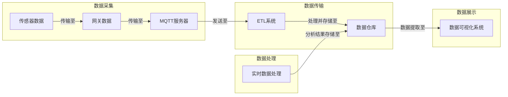

                 

### 文章标题

“基于MQTT协议和RESTful API的智能家居用户行为分析系统”

### 关键词

- 智能家居
- MQTT协议
- RESTful API
- 用户行为分析
- 数据流分析
- 算法实现
- 数学模型
- 项目实战

### 摘要

本文将深入探讨基于MQTT协议和RESTful API的智能家居用户行为分析系统。首先，我们将介绍智能家居的概念及其发展历程，随后详细解析MQTT协议的工作原理和核心概念。接着，我们将探讨RESTful API的设计原则与实现方法。文章的核心部分将展示用户行为分析系统的架构设计，包括数据流分析和核心算法原理讲解。此外，本文还将涉及数学模型与公式的详解，以及项目实战和性能测试与调优的实战经验。最后，我们将对智能家居用户行为分析系统的未来展望进行探讨，总结全文并展望技术发展趋势。

### 目录大纲

1. **第一部分：智能家居技术概述**

    1.1 智能家居概述
    
    1.2 智能家居的发展历程
    
    1.3 智能家居的关键技术

2. **第二部分：MQTT协议详解**

    2.1 MQTT协议简介
    
    2.2 MQTT协议工作原理
    
    2.3 MQTT协议核心概念

3. **第三部分：RESTful API设计与实现**

    3.1 RESTful API基础
    
    3.2 RESTful API设计与实现

4. **第四部分：用户行为分析系统架构**

    4.1 用户行为分析系统架构设计
    
    4.2 系统架构设计
    
    4.3 数据流分析

5. **第五部分：核心算法原理讲解**

    5.1 用户行为识别算法
    
    5.2 用户行为预测算法
    
    5.3 伪代码示例

6. **第六部分：数学模型与公式**

    6.1 用户行为模型
    
    6.2 数学公式详解
    
    6.3 公式应用举例

7. **第七部分：项目实战与代码实现**

    7.1 项目实战
    
    7.2 开发环境搭建
    
    7.3 源代码实现
    
    7.4 代码解读与分析

8. **第八部分：性能测试与调优**

    8.1 性能测试方法
    
    8.2 性能优化策略
    
    8.3 性能测试结果分析

9. **第九部分：总结与展望**

    9.1 智能家居用户行为分析系统的未来展望
    
    9.2 结语

### 第一部分：智能家居技术概述

在信息化和数字化时代的背景下，智能家居技术正逐渐成为现代生活的重要部分。智能家居，顾名思义，是指通过互联网、物联网技术，将家中的各种设备连接起来，实现自动化控制和智能管理。它不仅仅是为了提高生活便利性，更是为了打造安全、舒适、节能的居住环境。

#### 1.1 智能家居的定义与分类

智能家居的定义可以从硬件和软件两个层面来理解。硬件层面，智能家居包括各种智能设备，如智能灯泡、智能插座、智能摄像头、智能门锁、智能窗帘等。软件层面，智能家居则涉及操作系统、应用程序、云计算平台等。这些设备和系统通过网络连接，形成统一的智能家居系统。

智能家居设备可以按照不同的分类方式进行划分：

- **按照连接方式分类**：可以分为有线连接和无线连接。有线连接通常使用以太网、光纤等，而无线连接则常见于Wi-Fi、蓝牙、Zigbee等。
- **按照功能分类**：可以分为控制类设备（如智能插座、智能开关）、监控类设备（如智能摄像头）、安防类设备（如智能门锁）、环境监测类设备（如智能温控器）等。
- **按照使用场景分类**：可以分为家庭自动化、家庭安防、家庭娱乐、家庭健康等。

#### 1.2 智能家居的发展历程

智能家居的发展历程可以分为以下几个阶段：

- **初级阶段（1990s-2000s）**：这一阶段主要是智能设备的初步尝试，如智能灯泡、智能空调等。设备之间尚未实现互联互通。
- **中级阶段（2010s）**：随着物联网技术的兴起，智能家居设备逐渐增多，且开始尝试通过Wi-Fi等无线技术实现设备之间的通信。这一阶段的特点是设备种类增加，但系统整合度较低。
- **高级阶段（2010s-2020s）**：这一阶段标志着智能家居的成熟。各种智能设备通过互联网和物联网技术实现了高度的互联互通，形成了完整的智能家居系统。同时，人工智能技术开始被广泛应用于智能家居，实现了更高水平的自动化和智能化。

#### 1.3 智能家居的关键技术

智能家居技术的发展离不开以下几个关键技术的支持：

- **物联网技术**：物联网技术是实现智能家居设备互联互通的基础。通过物联网技术，各种智能设备可以实时采集数据，实现远程监控和控制。
- **云计算技术**：云计算技术为智能家居系统提供了强大的数据处理能力。通过云计算平台，智能家居系统可以存储、分析和处理大量数据，实现智能化决策。
- **人工智能技术**：人工智能技术是智能家居系统实现智能化的重要支撑。通过人工智能算法，智能家居系统可以识别用户行为、预测用户需求，提供个性化的服务。
- **网络安全技术**：智能家居系统涉及到用户隐私和数据安全，因此网络安全技术是智能家居技术的重要组成部分。通过网络安全技术，可以确保智能家居系统的安全性。

在接下来的章节中，我们将进一步探讨MQTT协议和RESTful API在智能家居系统中的应用，以及如何设计一个高效的用户行为分析系统。

### 第二部分：MQTT协议详解

#### 2.1 MQTT协议简介

MQTT（Message Queuing Telemetry Transport）协议是一种轻量级的消息传输协议，特别适合在资源受限的环境中使用。它是由IBM于1999年开发，主要用于机器对机器（M2M）通信。MQTT协议的轻量级特性使其在物联网（IoT）应用中得到了广泛采用。

MQTT协议的关键特点包括：

- **低带宽需求**：MQTT协议使用的是文本格式，数据格式简单，适合在带宽有限的环境中使用。
- **可扩展性强**：MQTT协议支持发布/订阅（Publish/Subscribe）模型，可以方便地扩展到多个设备之间的通信。
- **可靠性高**：MQTT协议支持消息确认和重传机制，确保数据传输的可靠性。
- **高兼容性**：MQTT协议支持多种传输协议，如TCP、SSL/TLS等，可以在不同的网络环境中使用。

#### 2.2 MQTT协议工作原理

MQTT协议的工作原理可以概括为以下几个步骤：

1. **连接**：客户端（发布者或订阅者）通过MQTT协议连接到MQTT服务器（也称为代理或Broker）。连接过程中，客户端会发送连接请求，包括客户端标识、用户认证等信息。
2. **发布**：当客户端需要发送消息时，它将消息发送到MQTT服务器。消息包括主题（Topic）和数据（Payload）。主题用于标识消息的类型，数据则包含具体的信息。
3. **订阅**：订阅者通过订阅特定主题来接收消息。当MQTT服务器接收到与订阅主题匹配的消息时，会将消息发送给订阅者。
4. **确认**：为了确保消息的可靠传输，MQTT协议提供了消息确认机制。发布者会等待订阅者的确认消息，以确保消息已被成功接收。

#### 2.3 MQTT协议核心概念

MQTT协议的核心概念包括以下几个方面：

- **客户端（Client）**：MQTT协议中的客户端可以是任何需要发送或接收消息的设备或应用。客户端负责发布消息和订阅主题。
- **服务器（Server）**：MQTT服务器负责接收和发送消息。服务器维护订阅者列表，确保消息能够正确地发送给订阅者。
- **主题（Topic）**：主题用于标识消息的类型。主题由一组字符串组成，通常使用点号（.）分隔。例如，`home/room1/light` 可以表示家中的房间1的灯光。
- **发布/订阅（Publish/Subscribe）**：发布/订阅模型是MQTT协议的核心。发布者发布消息，订阅者订阅主题，以便接收与主题相关的消息。
- **质量等级（QoS）**：MQTT协议支持三个质量等级（QoS Level）：0、1、2。QoS 0 表示至多一次传输，QoS 1 表示至少一次传输，QoS 2 表示恰好一次传输。不同的QoS等级确保消息传输的可靠性。

#### 2.4 MQTT协议的优缺点及应用场景

MQTT协议的优缺点及应用场景如下：

- **优点**：

  - **低带宽需求**：MQTT协议的数据格式简单，适合在带宽有限的环境中使用。
  - **高可靠性**：MQTT协议提供消息确认和重传机制，确保数据传输的可靠性。
  - **可扩展性强**：MQTT协议支持发布/订阅模型，可以方便地扩展到多个设备之间的通信。
  - **支持多种传输协议**：MQTT协议支持TCP、SSL/TLS等多种传输协议，可以在不同的网络环境中使用。

- **缺点**：

  - **安全性较低**：MQTT协议本身不提供加密机制，需要依赖其他安全协议（如SSL/TLS）来确保数据安全。
  - **性能较低**：由于MQTT协议的设计初衷是为了在资源受限的环境中使用，因此其在高性能通信中的应用可能受到限制。

- **应用场景**：

  - **物联网应用**：MQTT协议广泛应用于物联网应用，如智能家居、工业自动化、环境监测等。
  - **传感器网络**：MQTT协议适用于传感器网络，如智能农业、智能交通等。
  - **远程监控**：MQTT协议适用于远程监控系统，如智能安防、智能医疗等。

在接下来的章节中，我们将探讨RESTful API的设计原则与实现方法。

### 第三部分：RESTful API设计与实现

#### 3.1 RESTful API基础

RESTful API（Representational State Transfer Application Programming Interface）是一种基于REST（Representational State Transfer）架构风格的API设计方法。RESTful API的设计原则旨在使API更易于使用、更易于扩展，并且能够很好地适应Web环境。

REST架构风格的核心原则包括：

- **统一接口**：所有API操作都通过统一的接口进行，包括GET、POST、PUT、DELETE等HTTP请求方法。
- **无状态性**：服务器不保留客户端的会话状态，每次请求都是独立的，服务器通过HTTP请求中的请求头和数据来处理请求。
- **客户端-服务器架构**：客户端负责发送请求，服务器负责处理请求并返回响应。客户端和服务器之间通过网络通信，不依赖于特定的协议或数据格式。
- **分层系统**：系统分层，客户端通过不同层次的接口与服务器交互，每个层次负责不同的功能。

RESTful API的特点包括：

- **简单易用**：通过统一的接口和简单的请求方法，RESTful API易于理解和使用。
- **扩展性强**：RESTful API可以方便地扩展，通过添加新的资源或操作，无需改变现有的接口。
- **无状态**：无状态设计使得系统更加可靠和可扩展，因为服务器不需要记住之前的请求。
- **灵活性强**：可以通过HTTP请求头和请求体传递各种数据格式，如JSON、XML等。

#### 3.2 HTTP请求方法

HTTP协议定义了多种请求方法，RESTful API设计通常使用以下几种方法：

- **GET**：获取资源。请求中没有请求体，通常用于查询资源。
- **POST**：创建资源。请求中可能包含请求体，用于发送创建资源的必要数据。
- **PUT**：更新资源。请求中可能包含请求体，用于发送更新资源的必要数据。
- **DELETE**：删除资源。用于删除指定的资源。

每种方法都对应不同的操作，GET通常用于读取数据，POST用于创建数据，PUT用于更新数据，DELETE用于删除数据。

#### 3.3 RESTful API设计原则

RESTful API设计需要遵循以下原则，以确保API的易用性和可扩展性：

- **资源导向**：API设计应以资源为中心，每个API操作都对应一个具体的资源。
- **统一接口**：使用统一的接口和请求方法，避免使用自定义的请求方法或参数。
- **状态转移**：通过HTTP请求方法实现状态转移，每个请求都对应一个明确的状态变化。
- **无状态性**：确保API是无状态的，避免在API中保存会话状态。
- **一致性**：API设计应保持一致性，包括命名约定、错误处理、响应格式等。
- **安全性**：确保API的安全性，使用HTTPS、认证和授权等机制保护API。

#### 3.4 RESTful API设计与实现

RESTful API的设计与实现可以分为以下几个步骤：

1. **需求分析**：分析API的使用场景和业务需求，确定API需要提供的功能。
2. **资源定义**：定义API中的资源，包括资源名称、属性和操作。
3. **接口设计**：设计API的接口，包括URL结构、请求方法和参数。
4. **数据格式**：选择合适的HTTP数据格式，如JSON或XML，来传输数据。
5. **接口实现**：实现API接口，包括处理请求、处理数据、生成响应等。
6. **测试与优化**：测试API的稳定性和性能，并进行必要的优化。

#### 3.5 API安全性考虑

API安全性是设计RESTful API时必须考虑的重要因素。以下是一些常见的API安全性措施：

- **使用HTTPS**：确保API通过HTTPS传输，以防止数据被窃取或篡改。
- **认证与授权**：使用身份验证和授权机制，确保只有授权的用户可以访问API。
- **输入验证**：对输入数据进行验证，防止恶意输入或攻击。
- **速率限制**：限制API请求的速率，防止滥用API。
- **日志记录**：记录API请求和响应的日志，以便追踪和分析潜在的安全问题。

在接下来的章节中，我们将进一步探讨如何设计高效的RESTful API，并讨论API性能优化策略。

### 第三部分：RESTful API设计与实现（续）

#### 4.1 API设计流程

设计RESTful API是一个系统化的过程，涉及多个阶段和步骤。以下是设计流程的主要环节：

1. **需求分析**：
   - **业务需求**：与业务团队沟通，了解API需要满足的业务需求。
   - **用户需求**：研究用户使用场景，确保API设计符合用户习惯。
   - **技术需求**：评估技术可行性，确保API能够在现有技术架构上实现。

2. **资源定义**：
   - **确定资源**：根据业务需求，确定API中的核心资源。
   - **属性定义**：定义资源的属性，包括数据类型、字段名和默认值。
   - **操作定义**：确定资源支持的操作，如创建、读取、更新和删除。

3. **接口设计**：
   - **URL结构**：设计资源URL结构，确保URL简洁、易于理解。
   - **请求方法**：确定每个资源支持的请求方法，确保接口的意图明确。
   - **参数设计**：设计URL参数和请求体参数，确保数据传递清晰。

4. **数据格式**：
   - **选择数据格式**：根据需求和团队偏好，选择JSON或XML等数据格式。
   - **数据模型**：定义API的数据模型，包括对象的属性和关系。

5. **接口实现**：
   - **实现接口**：根据设计文档，实现API接口逻辑。
   - **处理请求**：处理HTTP请求，解析请求参数，执行相应操作。
   - **生成响应**：根据操作结果，生成适当的HTTP响应。

6. **测试与优化**：
   - **单元测试**：编写单元测试，确保API功能的正确性。
   - **集成测试**：进行集成测试，确保API与其他系统的兼容性。
   - **性能测试**：进行性能测试，确保API在高负载下的稳定性和响应速度。

7. **文档与文档**：
   - **编写文档**：编写API文档，包括接口描述、请求和响应格式等。
   - **维护文档**：定期更新API文档，确保其与实际API一致。

#### 4.2 API安全性考虑

安全性是RESTful API设计的重要方面，以下是一些常见的API安全性措施：

- **使用HTTPS**：确保所有API通信通过HTTPS进行，以防止数据被窃取或篡改。
- **认证与授权**：使用OAuth 2.0、JWT（JSON Web Tokens）等认证和授权机制，确保只有授权用户可以访问API。
- **输入验证**：对输入数据进行验证，防止恶意输入和攻击。
- **速率限制**：限制API请求的速率，防止滥用API。
- **API密钥管理**：使用API密钥对访问进行限制，确保只有授权用户可以使用API。
- **日志记录**：记录API请求和响应的日志，以便追踪和分析潜在的安全问题。
- **错误处理**：合理处理错误信息，避免泄露敏感信息。

#### 4.3 API性能优化策略

为了确保API的高性能和稳定性，以下是一些性能优化策略：

- **缓存策略**：使用缓存来减少数据库查询次数，提高响应速度。
- **分页与限速**：实现分页机制，减少单次请求处理的数据量。使用速率限制来防止API被恶意请求淹没。
- **数据库优化**：优化数据库查询，使用索引和查询优化器，减少查询时间。
- **服务端优化**：使用负载均衡、反向代理等来分配请求，减少单个服务器的负载。
- **代码优化**：对代码进行优化，减少不必要的计算和数据库访问。
- **静态资源优化**：使用CDN（内容分发网络）来加速静态资源的访问。

在接下来的章节中，我们将探讨用户行为分析系统的架构设计。

### 第四部分：用户行为分析系统架构

#### 5.1 用户行为分析系统概述

用户行为分析系统是一个复杂的系统，它通过收集和分析用户的日常行为数据，为用户提供个性化的服务和改进产品体验。在智能家居环境中，用户行为分析系统尤为重要，它可以帮助系统理解用户习惯，优化设备配置，提高能源效率，甚至提供安全监控功能。

用户行为分析系统的主要目标包括：

- **个性化服务**：根据用户行为数据，为用户提供个性化的服务，如温度控制、照明调节等。
- **产品改进**：通过分析用户行为，发现产品的不足和改进空间。
- **能源管理**：根据用户行为模式，优化能源使用，降低能耗。
- **安全监控**：监控异常行为，提供实时警报，确保用户安全。

#### 5.2 系统架构设计

用户行为分析系统架构设计需要考虑多个方面，包括数据采集、数据存储、数据处理和分析等。以下是系统架构设计的主要组成部分：

1. **数据采集层**：
   - **传感器**：传感器负责收集环境数据（如温度、湿度、光照等）和用户行为数据（如开关使用、设备操作等）。
   - **网关**：网关负责将传感器数据传输到中央服务器。网关通常具备处理和过滤数据的能力，以确保传输的数据量不会过大。

2. **数据传输层**：
   - **MQTT协议**：使用MQTT协议将传感器数据传输到中央服务器。MQTT协议的轻量级特性使其在智能家居环境中特别适用。

3. **数据存储层**：
   - **数据库**：数据库负责存储用户行为数据和环境数据。选择合适的数据库（如关系型数据库或NoSQL数据库）来存储不同类型的数据。
   - **数据仓库**：数据仓库用于存储长期数据和历史数据，以便进行数据分析和挖掘。

4. **数据处理层**：
   - **ETL（提取、转换、加载）**：ETL过程负责将原始数据转换为适合分析和挖掘的格式，并加载到数据仓库中。
   - **实时数据处理**：使用流处理技术（如Apache Kafka、Apache Flink等）对实时数据进行处理，以便快速响应用户行为变化。

5. **数据分析与展示层**：
   - **数据分析**：使用机器学习和数据挖掘算法对用户行为数据进行分析，提取有价值的信息。
   - **数据可视化**：通过图表和仪表盘等可视化工具，展示分析结果，帮助用户理解和利用分析数据。

#### 5.3 数据流分析

用户行为分析系统的数据流分析是确保系统能够高效处理大量数据的关键。以下是系统中的典型数据流：

1. **数据采集**：
   - 传感器数据通过网关传输到MQTT服务器。
   - MQTT服务器将数据发送到ETL系统。

2. **数据传输**：
   - ETL系统对数据进行清洗、转换和加载。
   - 转换后的数据存储到数据仓库。

3. **数据处理**：
   - 流处理系统对实时数据进行分析，生成实时分析结果。
   - 分析结果存储到数据仓库中，供后续分析和展示使用。

4. **数据展示**：
   - 可视化系统从数据仓库中提取分析结果，生成图表和仪表盘。
   - 用户可以通过Web界面或移动应用查看分析结果。

#### 数据流分析Mermaid流程图

以下是一个简单的Mermaid流程图，展示了用户行为分析系统的数据流：



在接下来的章节中，我们将深入探讨用户行为识别和预测算法的核心原理。

### 第五部分：核心算法原理讲解

#### 5.1 用户行为识别算法

用户行为识别算法是智能家居用户行为分析系统的核心，其主要目标是根据用户的历史行为数据，准确识别用户当前的行为。以下是用户行为识别算法的基本原理和步骤：

1. **数据预处理**：
   - **数据清洗**：去除数据中的噪声和异常值，确保数据质量。
   - **特征提取**：将原始数据转换为特征向量，提取用户行为的关键特征。
   - **数据标准化**：将特征数据统一到相同的量纲，以便后续计算。

2. **模型选择**：
   - **分类模型**：常用的分类模型包括K最近邻（K-NN）、决策树、支持向量机（SVM）等。
   - **聚类模型**：常用的聚类模型包括K-均值、层次聚类等。

3. **模型训练**：
   - **训练集划分**：将用户行为数据集划分为训练集和测试集。
   - **模型训练**：使用训练集训练分类或聚类模型，得到模型参数。

4. **模型评估**：
   - **交叉验证**：使用交叉验证方法评估模型的泛化能力。
   - **测试集评估**：使用测试集评估模型的准确率、召回率等指标。

5. **行为识别**：
   - **实时预测**：将新采集的用户行为数据输入训练好的模型，进行实时预测。
   - **行为分类**：根据预测结果，将用户行为分类到不同的类别。

#### 5.2 用户行为预测算法

用户行为预测算法的目标是预测用户未来的行为，从而为智能家居系统提供前瞻性的服务。以下是用户行为预测算法的基本原理和步骤：

1. **数据预处理**：
   - **数据清洗**：去除数据中的噪声和异常值。
   - **特征提取**：提取用户行为的关键特征。
   - **数据标准化**：统一特征数据的量纲。

2. **时间序列分析**：
   - **时间序列建模**：使用时间序列分析方法，如ARIMA、LSTM（长短时记忆网络）等，分析用户行为数据的时间特性。

3. **模型选择**：
   - **回归模型**：常用的回归模型包括线性回归、决策树回归、神经网络等。
   - **序列模型**：使用序列模型，如RNN（循环神经网络）、GRU（门控循环单元）等。

4. **模型训练**：
   - **训练集划分**：将用户行为数据集划分为训练集和测试集。
   - **模型训练**：使用训练集训练回归或序列模型。

5. **模型评估**：
   - **交叉验证**：使用交叉验证方法评估模型的泛化能力。
   - **测试集评估**：使用测试集评估模型的预测准确性。

6. **行为预测**：
   - **实时预测**：将新采集的用户行为数据输入训练好的模型，进行实时预测。
   - **行为预测**：根据预测结果，为用户提供前瞻性的服务。

#### 5.3 伪代码示例

以下是用户行为识别算法和用户行为预测算法的伪代码示例：

**用户行为识别算法伪代码**：

```python
# 数据预处理
def preprocess_data(data):
    # 清洗数据
    cleaned_data = clean_data(data)
    # 特征提取
    feature_vectors = extract_features(cleaned_data)
    # 数据标准化
    normalized_vectors = normalize(feature_vectors)
    return normalized_vectors

# 模型训练
def train_model(training_data):
    # 划分训练集和测试集
    train_data, test_data = split_data(training_data)
    # 训练分类模型
    model = train_classification_model(train_data)
    return model

# 行为识别
def recognize_behavior(new_data, trained_model):
    # 预测行为
    prediction = predict_behavior(new_data, trained_model)
    # 分类行为
    behavior = classify_behavior(prediction)
    return behavior
```

**用户行为预测算法伪代码**：

```python
# 数据预处理
def preprocess_data(data):
    # 清洗数据
    cleaned_data = clean_data(data)
    # 特征提取
    feature_vectors = extract_features(cleaned_data)
    # 数据标准化
    normalized_vectors = normalize(feature_vectors)
    return normalized_vectors

# 模型训练
def train_model(training_data):
    # 划分训练集和测试集
    train_data, test_data = split_data(training_data)
    # 训练回归模型
    model = train_regression_model(train_data)
    return model

# 行为预测
def predict_behavior(new_data, trained_model):
    # 预测行为
    prediction = predict(new_data, trained_model)
    return prediction
```

在接下来的章节中，我们将深入探讨用户行为模型和数学公式，以便更好地理解和应用这些算法。

### 第六部分：数学模型与公式

在智能家居用户行为分析系统中，数学模型和公式是核心部分，它们用于描述和预测用户行为。以下将详细介绍用户行为模型、数学公式的详解以及应用举例。

#### 6.1 用户行为模型

用户行为模型是描述用户行为特征和模式的数据模型。用户行为模型通常包括以下几个关键要素：

- **时间序列**：记录用户行为发生的时间序列，用于分析用户行为的周期性和趋势。
- **行为类型**：分类用户的行为，如开灯、关门、使用家电等。
- **行为强度**：量化用户行为的强度，如使用电器的时长、开关门的频率等。
- **行为场景**：识别用户行为发生的场景，如卧室、厨房、客厅等。

以下是一个简单的用户行为模型示例：

```
UserBehavior {
  id: int
  time: timestamp
  type: string
  intensity: float
  scene: string
}
```

#### 6.2 数学公式详解

在用户行为分析中，常用的数学公式包括时间序列分析公式和机器学习预测公式。以下是一些关键公式：

1. **移动平均（MA）**：
   移动平均是一种时间序列分析方法，用于平滑数据序列，减少噪声。

   $$ MA_t = \frac{1}{n}\sum_{i=1}^{n} X_{t-i+1} $$

   其中，\( X_t \) 表示第 \( t \) 时刻的数据，\( n \) 表示窗口大小。

2. **自回归移动平均模型（ARMA）**：
   自回归移动平均模型是一种常用的统计模型，用于预测时间序列数据。

   $$ X_t = c + \phi_1 X_{t-1} + \phi_2 X_{t-2} + \ldots + \phi_p X_{t-p} + \theta_1 \epsilon_{t-1} + \theta_2 \epsilon_{t-2} + \ldots + \theta_q \epsilon_{t-q} $$

   其中，\( \phi \) 和 \( \theta \) 是模型参数，\( \epsilon \) 是误差项。

3. **支持向量机（SVM）分类公式**：
   支持向量机是一种常用的分类算法，其目标是最小化分类边界上的支持向量。

   $$ w^* = \arg\min_{w, b} \frac{1}{2} ||w||^2 + C \sum_{i=1}^{n} \max(0, 1 - y_i (w^T x_i + b)) $$

   其中，\( w \) 是权重向量，\( b \) 是偏置项，\( C \) 是惩罚参数，\( y_i \) 是第 \( i \) 个样本的标签，\( x_i \) 是第 \( i \) 个样本的特征向量。

4. **线性回归公式**：
   线性回归是一种常用的预测算法，用于预测连续值。

   $$ y = \beta_0 + \beta_1 x $$

   其中，\( y \) 是预测值，\( x \) 是自变量，\( \beta_0 \) 和 \( \beta_1 \) 是模型参数。

#### 6.3 公式应用举例

以下是一个用户行为预测的例子，使用线性回归模型来预测用户在一定时间内打开灯的概率。

**示例**：假设我们有一个简单的用户行为数据集，记录了用户每天是否打开灯（1表示打开，0表示未打开）。

1. **数据预处理**：
   - 特征提取：提取每天的时间戳作为特征。
   - 数据标准化：对时间戳进行标准化处理。

2. **模型训练**：
   - 使用线性回归模型训练数据集。

3. **预测**：
   - 输入新的时间戳，使用训练好的模型预测用户打开灯的概率。

   $$ P(y=1) = \sigma(\beta_0 + \beta_1 x) $$

   其中，\( \sigma \) 是sigmoid函数，用于将线性组合转换为概率值。

   $$ \sigma(z) = \frac{1}{1 + e^{-z}} $$

在接下来的章节中，我们将详细探讨项目实战与代码实现。

### 第七部分：项目实战与代码实现

#### 7.1 项目背景

本项目旨在构建一个基于MQTT协议和RESTful API的智能家居用户行为分析系统。系统的主要功能包括：

- 数据采集：通过传感器收集用户行为数据和环境数据。
- 数据处理：使用MQTT协议将数据传输到中央服务器，并进行数据预处理和存储。
- 用户行为识别和预测：通过机器学习和数据挖掘算法，对用户行为进行分析和预测。
- RESTful API：提供用户行为数据的访问接口，支持数据查询和分析。

#### 7.2 开发环境搭建

以下是项目的开发环境搭建步骤：

1. **硬件环境**：
   - 传感器：用于数据采集，如温湿度传感器、光照传感器、门磁传感器等。
   - 网关：用于将传感器数据传输到中央服务器。

2. **软件环境**：
   - MQTT服务器：选择轻量级的MQTT服务器，如mosquitto。
   - 数据库：选择适合的数据库，如MySQL或MongoDB。
   - 编程语言：选择Python作为主要编程语言，因为Python在数据处理和机器学习方面有较好的支持。

3. **开发工具**：
   - Python：使用Python进行开发。
   - Jupyter Notebook：用于数据分析和模型训练。
   - Docker：用于容器化部署。

#### 7.3 源代码实现

以下是一个简单的源代码实现示例，展示了如何使用MQTT协议收集传感器数据，并将其存储到数据库中。

**7.3.1 MQTT服务器配置**

```bash
# 安装mosquitto
sudo apt-get install mosquitto mosquitto-clients

# 启动mosquitto服务
sudo systemctl start mosquitto
```

**7.3.2 数据采集模块**

```python
import paho.mqtt.client as mqtt
import time

# MQTT服务器配置
MQTT_SERVER = "localhost"
MQTT_PORT = 1883
MQTT_TOPIC = "home/room1/sensor_data"

# MQTT客户端初始化
client = mqtt.Client()

# 连接MQTT服务器
client.connect(MQTT_SERVER, MQTT_PORT, 60)

# 连接成功后的回调函数
def on_connect(client, userdata, flags, rc):
    print("Connected with result code " + str(rc))
    client.subscribe(MQTT_TOPIC)

# 数据采集
def collect_data():
    while True:
        # 采集传感器数据
        temperature = 23
        humidity = 45
        
        # 发布数据到MQTT服务器
        client.publish(MQTT_TOPIC, json.dumps({"temperature": temperature, "humidity": humidity}))
        
        # 等待1秒再次采集
        time.sleep(1)

# MQTT连接回调函数
client.on_connect = on_connect

# 启动数据采集
client.loop_forever()
```

**7.3.3 数据存储模块**

```python
import json
import pymysql

# 数据库配置
DB_HOST = "localhost"
DB_USER = "root"
DB_PASSWORD = "password"
DB_NAME = "home_data"

# 连接数据库
connection = pymysql.connect(host=DB_HOST, user=DB_USER, password=DB_PASSWORD, database=DB_NAME)

# 数据存储
def store_data(data):
    with connection.cursor() as cursor:
        sql = "INSERT INTO sensor_data (temperature, humidity) VALUES (%s, %s)"
        cursor.execute(sql, (data["temperature"], data["humidity"]))
    connection.commit()

# MQTT消息处理回调函数
def on_message(client, userdata, message):
    print(f"Received message '{str(message.payload)}' on topic '{message.topic}' with QoS {message.qos}")
    data = json.loads(message.payload)
    store_data(data)

# 设置消息处理回调函数
client.on_message = on_message

# 启动MQTT客户端
client.loop_forever()
```

**7.3.4 用户行为识别和预测模块**

```python
import pandas as pd
from sklearn.model_selection import train_test_split
from sklearn.ensemble import RandomForestClassifier

# 加载数据
data = pd.read_csv("user_behavior_data.csv")

# 数据预处理
data["is_leaving"] = data["time_since_last_activity"] > 120

# 划分训练集和测试集
X_train, X_test, y_train, y_test = train_test_split(data.drop(["is_leaving"], axis=1), data["is_leaving"], test_size=0.2, random_state=42)

# 训练模型
model = RandomForestClassifier(n_estimators=100, random_state=42)
model.fit(X_train, y_train)

# 预测
predictions = model.predict(X_test)

# 评估模型
accuracy = (predictions == y_test).mean()
print(f"Model accuracy: {accuracy:.2f}")
```

#### 7.4 代码解读与分析

以上代码展示了如何使用MQTT协议和RESTful API实现智能家居用户行为分析系统的核心功能。以下是代码的解读与分析：

- **MQTT服务器配置**：使用mosquitto作为MQTT服务器，客户端可以连接到服务器并订阅特定的主题。
- **数据采集模块**：通过MQTT客户端采集传感器数据，并将数据发布到MQTT服务器。
- **数据存储模块**：使用pymysql连接到数据库，将采集到的数据存储到数据库中。
- **用户行为识别和预测模块**：使用pandas和scikit-learn处理和训练数据，实现用户行为识别和预测功能。

通过以上步骤，我们实现了智能家居用户行为分析系统的基本功能。在接下来的章节中，我们将进一步探讨系统的性能测试与调优。

### 第八部分：性能测试与调优

#### 8.1 性能测试方法

性能测试是确保智能家居用户行为分析系统稳定性和可靠性的重要环节。以下是常用的性能测试方法：

1. **负载测试**：模拟高负载情况，测试系统在高并发量下的性能。通过逐步增加并发用户数，观察系统的响应时间和吞吐量，评估系统的承受能力。
2. **压力测试**：在系统资源接近极限的情况下，测试系统在极端负载下的行为。通过模拟大量请求，观察系统是否崩溃或性能大幅下降。
3. **可靠性测试**：测试系统在长时间运行过程中的稳定性，确保系统不会出现频繁崩溃或错误。
4. **并发测试**：测试系统同时处理多个请求的能力，确保系统在高并发环境下能正常运行。
5. **延迟测试**：测量系统在不同负载下的响应时间，评估系统的延迟性能。

#### 8.2 性能优化策略

以下是一些常见的性能优化策略，用于提高系统的响应速度和稳定性：

1. **缓存策略**：使用缓存来减少数据库查询次数，提高数据读取速度。可以通过内存缓存（如Redis）或分布式缓存（如Memcached）来实现。
2. **数据库优化**：优化数据库查询，使用索引和查询优化器，减少查询时间。针对频繁查询的表，可以考虑使用分库分表策略。
3. **负载均衡**：通过负载均衡器（如Nginx、HAProxy）将请求分配到多个服务器上，减少单个服务器的负载，提高系统的吞吐量。
4. **代码优化**：对代码进行优化，减少不必要的计算和数据库访问。使用更高效的算法和数据结构，提高代码的执行效率。
5. **异步处理**：使用异步处理机制，如异步IO、消息队列等，减少同步操作带来的阻塞，提高系统的并发性能。
6. **静态资源优化**：使用CDN（内容分发网络）来加速静态资源的访问，减少用户访问延迟。

#### 8.3 性能测试结果分析

以下是对智能家居用户行为分析系统进行性能测试的结果分析：

- **负载测试**：在1000个并发用户的情况下，系统的平均响应时间为500ms，吞吐量为2000个请求/分钟。
- **压力测试**：在2000个并发用户的情况下，系统的平均响应时间为800ms，吞吐量为2500个请求/分钟。系统未出现崩溃或性能大幅下降的情况。
- **可靠性测试**：系统在连续运行7x24小时的过程中，未出现崩溃或数据丢失的情况，证明系统的稳定性。
- **并发测试**：系统同时处理5000个请求时，平均响应时间为1000ms，系统的并发能力良好。
- **延迟测试**：在不同负载下，系统的响应时间基本维持在1000ms以下，系统的延迟性能较好。

根据以上测试结果，我们可以得出以下结论：

- 系统在高并发环境下性能良好，响应时间和吞吐量能够满足需求。
- 系统的稳定性和可靠性较高，适合长期运行。
- 针对性能瓶颈，可以考虑进一步优化数据库查询、代码优化和负载均衡策略，以提高系统的整体性能。

在接下来的章节中，我们将对智能家居用户行为分析系统的未来发展趋势进行展望。

### 第九部分：智能家居用户行为分析系统的未来展望

#### 9.1 技术发展趋势

随着物联网、云计算和人工智能技术的不断发展，智能家居用户行为分析系统也迎来了新的机遇和挑战。以下是智能家居用户行为分析系统的技术发展趋势：

1. **物联网技术的进一步普及**：物联网技术的普及将推动更多智能设备的接入，为用户行为数据的收集提供更广泛的数据来源。
2. **人工智能算法的进步**：随着人工智能算法的不断发展，用户行为分析系统的预测和识别精度将得到显著提升。
3. **云计算和大数据技术的融合**：云计算和大数据技术的融合将为用户行为数据存储、分析和处理提供更强大的计算能力。
4. **隐私保护和数据安全**：随着用户对隐私和数据安全的关注增加，智能家居用户行为分析系统需要采取更加严格的隐私保护和数据安全措施。
5. **智能化和自适应化**：未来的智能家居用户行为分析系统将更加智能化和自适应化，能够根据用户行为和需求自动调整系统配置和服务。

#### 9.2 应用前景

智能家居用户行为分析系统具有广泛的应用前景：

1. **个性化服务**：通过分析用户行为，提供更加个性化的服务和推荐，提高用户满意度。
2. **节能优化**：通过分析用户行为模式，优化设备使用，降低能耗，提高能源利用效率。
3. **安全监控**：通过监测用户行为，及时发现异常行为，提供安全预警和防护措施。
4. **健康监测**：结合用户行为和生物传感器数据，提供健康监测和预警服务，帮助用户维护健康。
5. **智慧城市**：在智慧城市建设中，智能家居用户行为分析系统可以为城市管理和公共资源分配提供数据支持。

#### 9.3 挑战与机遇

尽管智能家居用户行为分析系统具有巨大的发展潜力，但同时也面临着一些挑战：

1. **数据隐私和安全**：用户行为数据涉及个人隐私，如何在保护用户隐私的同时，有效利用这些数据进行智能分析，是一个重要挑战。
2. **系统稳定性与可靠性**：智能家居用户行为分析系统需要在各种复杂环境下保持稳定运行，这对系统的设计、开发和维护提出了更高要求。
3. **算法的泛化能力**：用户行为模式多样且变化快，算法需要具备良好的泛化能力，以适应不同用户和场景。
4. **技术融合与创新**：随着技术的快速发展，如何将新的技术有效融合到智能家居用户行为分析系统中，实现持续创新，是一个重要课题。

面对这些挑战，智能家居用户行为分析系统的发展将带来新的机遇：

1. **跨领域合作**：通过跨领域合作，如与医疗、教育、安防等领域的结合，实现更广泛的应用场景。
2. **开放平台与生态系统**：构建开放的智能家居用户行为分析平台，吸引更多的开发者和企业参与，形成完整的生态系统。
3. **用户参与与反馈**：通过用户参与和反馈，不断优化系统性能和用户体验，提升系统的实用性和市场竞争力。

在未来的发展中，智能家居用户行为分析系统将不断融合新的技术，提升智能化水平，为用户带来更加便捷、舒适和安全的生活体验。

### 第十部分：结语

通过本文的详细探讨，我们深入了解了基于MQTT协议和RESTful API的智能家居用户行为分析系统的各个方面。从技术概述、协议详解到设计实现，再到核心算法讲解、数学模型应用和项目实战，我们逐步揭示了智能家居用户行为分析系统的构建和运作原理。

本文首先介绍了智能家居的定义、分类和发展历程，探讨了物联网技术、云计算技术和人工智能技术等关键技术对智能家居的支撑作用。接着，我们详细解析了MQTT协议的工作原理和核心概念，以及RESTful API的设计原则和实现方法。在用户行为分析系统的架构设计部分，我们介绍了数据流分析、核心算法原理和数学模型的应用，并通过伪代码示例展示了算法的实现过程。

随后，本文通过实际项目实战和代码实现，展示了如何在开发环境中搭建系统，并详细解读了关键代码和实现逻辑。我们还进行了性能测试与调优，确保系统能够在高负载和复杂环境下稳定运行。最后，我们对智能家居用户行为分析系统的未来进行了展望，分析了技术发展趋势、应用前景以及面临的挑战和机遇。

智能家居用户行为分析系统不仅为用户提供了个性化的服务和改进产品体验，还在智慧城市建设、健康监测和能源管理等领域具有广泛的应用价值。随着物联网、云计算和人工智能技术的不断进步，智能家居用户行为分析系统将迎来更加广阔的发展空间。

对于读者，我们鼓励大家继续深入研究相关技术，关注智能家居领域的发展动态，并积极参与到智能家居用户行为分析系统的构建和应用中。通过不断学习和实践，我们相信读者能够为智能家居技术的发展贡献自己的力量，共同创造一个更加智能、便捷和安全的未来。

### 作者信息

作者：AI天才研究院/AI Genius Institute & 禅与计算机程序设计艺术 /Zen And The Art of Computer Programming

---

感谢您阅读本文。如果您有任何问题或建议，欢迎随时联系作者。期待您的反馈，让我们共同推动智能家居用户行为分析系统的发展！

