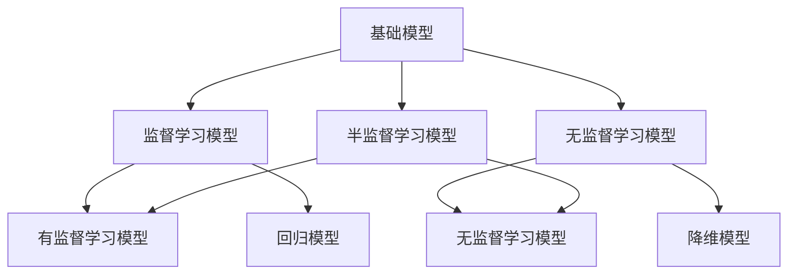

                 

# 《基础模型的隐私与安全问题》

> **关键词：基础模型、隐私保护、安全问题、安全测试、隐私风险评估**

> **摘要：本文从基础模型的概念与分类、技术原理、隐私保护、安全威胁、安全测试、安全开发及实践应用等多个角度，深入探讨了基础模型的隐私与安全问题，并提出了一系列解决方案和应对策略。**

---

## 目录大纲

1. **基础模型概述**
   1.1 基础模型的概念与分类
   1.2 基础模型的发展历程
   1.3 基础模型的应用领域

2. **基础模型的技术原理**
   2.1 基础模型的数学模型
   2.2 基础模型的算法原理
   2.3 基础模型的数据处理

3. **基础模型的隐私保护**
   3.1 隐私保护的重要性
   3.2 隐私保护的技术手段
   3.3 基础模型的隐私风险评估

4. **基础模型的安全问题**
   4.1 基础模型的安全威胁
   4.2 安全威胁的应对策略
   4.3 基础模型的安全测试

5. **基础模型的安全开发**
   5.1 安全开发流程
   5.2 安全开发工具
   5.3 安全开发实例

6. **基础模型的隐私与安全问题应用实践**
   6.1 隐私保护应用案例
   6.2 安全问题应用案例

7. **基础模型的隐私与安全问题发展趋势**
   7.1 技术发展趋势
   7.2 政策与法律环境
   7.3 未来展望

8. **附录**
   8.1 学术文献与研究报告
   8.2 开源工具与框架
   8.3 学习资源与资料

---

### 引言

在当今信息时代，基础模型作为人工智能的核心组件，广泛应用于各类场景，从自然语言处理到计算机视觉，从语音识别到金融分析，无处不在。然而，随着基础模型应用的不断深入，其隐私与安全问题逐渐成为关注焦点。

隐私保护方面，基础模型在处理大量数据时，可能会涉及个人敏感信息，如医疗记录、财务数据等。一旦这些数据泄露，将会对用户隐私造成严重威胁。此外，基础模型的训练和部署过程中，也可能涉及隐私泄露的风险，如模型参数的暴露、训练数据的公开等。

安全问题方面，基础模型同样面临着诸多威胁。网络攻击者可能试图通过恶意数据注入、模型篡改等方式破坏基础模型，导致预测结果失真。同时，基础模型自身可能存在安全漏洞，如代码注入、权限滥用等，使得攻击者可以轻松获取系统控制权。

本文旨在从基础模型的概念与分类、技术原理、隐私保护、安全威胁、安全测试、安全开发及实践应用等多个角度，深入探讨基础模型的隐私与安全问题。通过本文的阅读，读者将了解基础模型的核心原理、面临的主要挑战，以及相应的解决方案和应对策略。

### 基础模型概述

#### 1.1 基础模型的概念与分类

**基础模型**，也称为**基本模型**，是人工智能领域中用于表示和建模数据的基础工具。它们是构建更复杂模型和算法的基础，通常包括一系列核心概念、算法和架构。在深度学习和机器学习的背景下，基础模型通常指的是那些能够自动学习输入和输出之间映射关系的模型，如线性模型、支持向量机、决策树、神经网络等。

**基础模型**可以分为以下几类：

1. **监督学习模型**：这类模型在有标记的数据集上进行训练，每个数据点都有一个对应的标签。监督学习模型包括**分类模型**和**回归模型**。
   
2. **无监督学习模型**：这类模型在没有标签的数据集上进行训练，其主要目的是发现数据中的隐含结构或模式。无监督学习模型包括**聚类模型**和**降维模型**。

3. **半监督学习模型**：这类模型结合了监督学习和无监督学习的特点，使用部分标记和部分未标记的数据进行训练。

在上述分类中，监督学习模型是当前应用最为广泛的基础模型类型，因为它们能够根据已有数据提供准确的预测和分类。监督学习模型中，分类模型用于将输入数据分为不同的类别，如文本分类、图像分类等；回归模型则用于预测连续值输出，如房价预测、股票价格预测等。

**监督学习模型：**

监督学习模型的核心在于其输入输出映射关系，通常表示为：

$$
y = f(x; \theta)
$$

其中，$y$ 是输出值，$x$ 是输入值，$f$ 是模型函数，$\theta$ 是模型参数。

**无监督学习模型：**

无监督学习模型则不依赖于标签，其目的是通过数据自身的特征，自动发现数据中的规律和结构。常见的无监督学习模型包括聚类算法和降维算法。

**聚类算法**：如K-Means、层次聚类等，这些算法通过将数据点划分为多个聚类，使同一聚类中的数据点尽可能相似，而不同聚类中的数据点尽可能不同。

**降维算法**：如主成分分析（PCA）、t-SNE等，这些算法通过减少数据维度，保留主要信息，从而简化数据分析过程，提高数据处理效率。

**半监督学习模型**：半监督学习模型结合了监督学习和无监督学习的优势，可以在有少量标记数据和大量未标记数据的情况下，提高模型的训练效果。常见的半监督学习模型包括自编码器、伪标签等。

**核心概念与联系**

为了更清晰地展示基础模型之间的关系，我们可以使用Mermaid流程图来表示：



**核心算法原理讲解**

**监督学习模型：**

监督学习模型的核心算法包括线性模型和神经网络。

**线性模型：**

线性模型是一种简单的监督学习模型，其数学模型表示为：

$$
y = \theta_0 + \theta_1x_1 + \theta_2x_2 + ... + \theta_nx_n
$$

其中，$y$ 是输出值，$x_1, x_2, ..., x_n$ 是输入特征，$\theta_0, \theta_1, ..., \theta_n$ 是模型参数。

线性模型的训练过程通常包括以下几个步骤：

1. **初始化模型参数**：随机初始化模型参数。
2. **前向传播**：根据输入特征和模型参数，计算输出值。
3. **计算损失**：使用损失函数计算输出值与真实值之间的差异。
4. **反向传播**：根据损失函数的梯度，更新模型参数。
5. **迭代优化**：重复上述步骤，直到模型参数收敛。

伪代码如下：

```python
def LinearModel(X, Y, epochs, learning_rate):
    # 初始化模型参数
    weights = np.random.randn(n_features)
    bias = np.random.randn(1)
    
    for epoch in range(epochs):
        # 前向传播
        z = X.dot(weights) + bias
        a = sigmoid(z)
        
        # 计算损失
        loss = mse(Y, a)
        
        # 反向传播
        dz = a - Y
        dweights = X.T.dot(dz)
        dbias = dz.sum(axis=0)
        
        # 更新模型参数
        weights -= learning_rate * dweights
        bias -= learning_rate * dbias
        
    return weights, bias
```

**神经网络：**

神经网络是更为复杂的监督学习模型，其核心思想是通过多层神经元对输入数据进行逐层抽象和转换，从而实现复杂函数的映射。

神经网络的基本结构包括输入层、隐藏层和输出层。每一层都由多个神经元组成，神经元之间通过权重和偏置进行连接。

神经网络的训练过程包括以下几个步骤：

1. **初始化模型参数**：随机初始化模型参数。
2. **前向传播**：将输入数据通过多层神经元，最终得到输出结果。
3. **计算损失**：使用损失函数计算输出结果与真实值之间的差异。
4. **反向传播**：根据损失函数的梯度，逐层更新模型参数。
5. **迭代优化**：重复上述步骤，直到模型参数收敛。

伪代码如下：

```python
def NeuralNetwork(X, Y, layers, epochs, learning_rate):
    # 初始化模型参数
    weights = [np.random.randn(in_size, out_size) for in_size, out_size in layers]
    biases = [np.random.randn(1, out_size) for _ in layers]
    
    for epoch in range(epochs):
        # 前向传播
        a = X
        for weights, biases in zip(weights, biases):
            a = sigmoid(np.dot(a, weights) + biases)
        
        # 计算损失
        loss = mse(Y, a)
        
        # 反向传播
        dweights = [np.random.randn(in_size, out_size) for in_size, out_size in layers]
        dbiases = [np.random.randn(1, out_size) for _ in layers]
        
        da = (a - Y) * (sigmoid_derivative(a))
        for i in range(len(layers) - 1, -1, -1):
            dweights[i] = np.dot(a.T, da)
            dbiases[i] = np.dot(da.T, 1)
            if i > 0:
                da = np.dot(da, weights[i].T) * sigmoid_derivative(a)
        
        # 更新模型参数
        for i in range(len(layers)):
            weights[i] -= learning_rate * dweights[i]
            biases[i] -= learning_rate * dbiases[i]
            
    return weights, biases
```

**无监督学习模型：**

无监督学习模型的核心算法包括K-Means聚类和主成分分析（PCA）。

**K-Means聚类：**

K-Means聚类是一种基于距离度量的聚类算法，其目标是将数据点划分为K个聚类，使得每个聚类内的数据点尽可能相似，而不同聚类之间的数据点尽可能不同。

K-Means聚类的基本步骤如下：

1. **初始化聚类中心**：随机选择K个数据点作为初始聚类中心。
2. **分配数据点**：计算每个数据点到聚类中心的距离，将数据点分配到最近的聚类中心。
3. **更新聚类中心**：计算每个聚类中心的新位置，即其对应聚类内所有数据点的均值。
4. **迭代优化**：重复步骤2和3，直到聚类中心不再发生变化或达到预设的迭代次数。

伪代码如下：

```python
def KMeans(X, K, epochs):
    # 初始化聚类中心
    centroids = X[np.random.choice(X.shape[0], K, replace=False)]
    
    for epoch in range(epochs):
        # 分配数据点
        distances = np.linalg.norm(X - centroids, axis=1)
        labels = np.argmin(distances, axis=1)
        
        # 更新聚类中心
        new_centroids = np.array([X[labels == k].mean(axis=0) for k in range(K)])
        
        # 检查收敛
        if np.linalg.norm(centroids - new_centroids) < 1e-6:
            break
        
        centroids = new_centroids
        
    return centroids, labels
```

**主成分分析（PCA）：**

主成分分析是一种降维算法，其目标是通过线性变换将高维数据投影到低维空间，同时保留数据的主要信息。

PCA的基本步骤如下：

1. **计算协方差矩阵**：计算数据点与均值之间的协方差矩阵。
2. **计算协方差矩阵的特征值和特征向量**：对协方差矩阵进行特征分解。
3. **选择主成分**：选择具有最大特征值的特征向量作为主成分。
4. **投影数据**：将数据点投影到由主成分构成的新空间中。

伪代码如下：

```python
def PCA(X, n_components):
    # 计算协方差矩阵
    cov_matrix = np.cov(X, rowvar=False)
    
    # 计算协方差矩阵的特征值和特征向量
    eigenvalues, eigenvectors = np.linalg.eigh(cov_matrix)
    
    # 选择主成分
    idx = eigenvalues.argsort()[::-1]
    eigenvectors = eigenvectors[:, idx]
    principal_components = eigenvectors[:, :n_components]
    
    # 投影数据
    X_reduced = X.dot(principal_components)
    
    return X_reduced
```

**半监督学习模型：**

半监督学习模型结合了监督学习和无监督学习的特点，通过利用未标记的数据，提高模型的训练效果。

常见的半监督学习模型包括自编码器和伪标签。

**自编码器：**

自编码器是一种无监督学习模型，其目标是学习数据的高效表示。自编码器由编码器和解码器组成，编码器将输入数据压缩为低维表示，解码器将低维表示还原为输入数据。

自编码器的训练过程包括以下几个步骤：

1. **初始化模型参数**：随机初始化模型参数。
2. **前向传播**：将输入数据通过编码器得到低维表示，再通过解码器还原为输入数据。
3. **计算损失**：使用损失函数计算低维表示和输入数据之间的差异。
4. **反向传播**：根据损失函数的梯度，更新模型参数。
5. **迭代优化**：重复上述步骤，直到模型参数收敛。

伪代码如下：

```python
def Autoencoder(X, n_encoder, n_decoder, epochs, learning_rate):
    # 初始化模型参数
    encoder_weights = np.random.randn(n_encoder, n_input)
    decoder_weights = np.random.randn(n_decoder, n_input)
    
    for epoch in range(epochs):
        # 前向传播
        encoded = X.dot(encoder_weights)
        reconstructed = encoded.dot(decoder_weights)
        
        # 计算损失
        loss = mse(X, reconstructed)
        
        # 反向传播
        dencoder_weights = X - reconstructed
        
        # 更新模型参数
        encoder_weights -= learning_rate * dencoder_weights.dot(encoded.T)
        decoder_weights -= learning_rate * dencoder_weights.dot(1)
        
    return encoder_weights, decoder_weights
```

**伪标签：**

伪标签是一种利用未标记数据训练模型的方法，其基本思想是将模型的输出作为未标记数据的标签，然后使用这些伪标签对模型进行训练。

伪标签的训练过程包括以下几个步骤：

1. **初始化模型参数**：随机初始化模型参数。
2. **预测未标记数据**：使用模型对未标记数据进行预测。
3. **更新模型参数**：使用预测结果和未标记数据训练模型。
4. **迭代优化**：重复上述步骤，直到模型参数收敛。

伪代码如下：

```python
def PseudoLabeling(X, Y, n_epochs, learning_rate):
    # 初始化模型参数
    weights = np.random.randn(n_features, n_classes)
    
    for epoch in range(n_epochs):
        # 预测未标记数据
        predictions = np.dot(X, weights)
        
        # 计算伪标签
        pseudo_labels = np.argmax(predictions, axis=1)
        
        # 训练模型
        dweights = X.T.dot(pseudo_labels - Y)
        
        # 更新模型参数
        weights -= learning_rate * dweights
        
    return weights
```

**核心算法原理讲解**

**监督学习模型：**

监督学习模型通常基于以下数学模型：

$$
y = f(x; \theta)
$$

其中，$y$ 是输出值，$x$ 是输入值，$f$ 是模型函数，$\theta$ 是模型参数。

监督学习模型的核心目标是找到一组最优参数$\theta$，使得模型输出值与真实值之间的差异最小。

在监督学习模型中，常用的损失函数包括均方误差（MSE）和交叉熵（Cross-Entropy）。

**均方误差（MSE）:**

均方误差是一种常用的损失函数，其公式为：

$$
MSE = \frac{1}{n}\sum_{i=1}^{n}(y_i - \hat{y}_i)^2
$$

其中，$y_i$ 是真实值，$\hat{y}_i$ 是预测值，$n$ 是样本数量。

**交叉熵（Cross-Entropy）:**

交叉熵是一种用于分类问题的损失函数，其公式为：

$$
H(Y, \hat{Y}) = -\sum_{i=1}^{n} y_i \log(\hat{y}_i)
$$

其中，$y_i$ 是真实概率分布，$\hat{y}_i$ 是预测概率分布。

为了简化计算，有时会使用软最大化（Softmax）函数来替代交叉熵，其公式为：

$$
\text{Softmax}(x) = \frac{e^x}{\sum_{j=1}^{K} e^x_j}
$$

其中，$x$ 是输入向量，$K$ 是类别数量。

**监督学习模型的训练过程通常包括以下几个步骤：**

1. **初始化模型参数**：随机初始化模型参数。
2. **前向传播**：根据输入值和模型参数，计算模型输出值。
3. **计算损失**：使用损失函数计算模型输出值与真实值之间的差异。
4. **反向传播**：根据损失函数的梯度，计算模型参数的梯度。
5. **更新模型参数**：使用梯度下降算法更新模型参数。
6. **迭代优化**：重复上述步骤，直到模型参数收敛。

**伪代码示例：**

以下是一个用于训练基础模型的伪代码示例：

```python
# 初始化模型参数
weights = InitializeWeights(input_size, output_size)
bias = InitializeBias(output_size)

# 设置学习率
learning_rate = 0.01

# 设置迭代次数
epochs = 1000

# 训练模型
for epoch in range(epochs):
    # 前向传播
    inputs = X
    outputs = Activate(FullyConnected(inputs, weights, bias))
    
    # 计算损失
    loss = CalculateLoss(outputs, Y)
    
    # 反向传播
    doutputs = dActivate(outputs)
    dweights = X.T * doutputs
    dbias = doutputs.sum(axis=0)
    
    # 更新模型参数
    weights -= learning_rate * dweights
    bias -= learning_rate * dbias
    
    # 打印当前epoch的损失
    print(f"Epoch {epoch}: Loss = {loss}")

# 模型评估
evaluation_results = EvaluateModel(model, test_data)
print(f"Evaluation Results: {evaluation_results}")
```

**数学模型和公式 & 详细讲解 & 举例说明**

**线性回归模型**

线性回归模型是一种简单的监督学习模型，其目标是通过输入特征预测连续值输出。线性回归模型的数学模型可以表示为：

$$
y = \theta_0 + \theta_1x_1 + \theta_2x_2 + ... + \theta_nx_n
$$

其中，$y$ 是输出值，$x_1, x_2, ..., x_n$ 是输入特征，$\theta_0, \theta_1, ..., \theta_n$ 是模型参数。

**例子**

假设我们要预测房价，输入特征包括房屋面积和房屋年代，输出值为房价。我们可以使用线性回归模型来建立输入特征和输出值之间的关系。

$$
房价 = \theta_0 + \theta_1房屋面积 + \theta_2房屋年代
$$

通过训练，我们可以得到最优的模型参数$\theta_0, \theta_1, \theta_2$，从而预测新的房屋房价。

**线性回归模型的损失函数**

线性回归模型常用的损失函数是均方误差（MSE），其公式为：

$$
MSE = \frac{1}{n}\sum_{i=1}^{n}(y_i - \hat{y}_i)^2
$$

其中，$y_i$ 是真实值，$\hat{y}_i$ 是预测值，$n$ 是样本数量。

**例子**

假设我们有一个包含100个样本的数据集，每个样本的输入特征和真实值如下：

| 输入特征 | 真实值 |
| --- | --- |
| 房屋面积 | 100 |
| 房屋年代 | 200 |
| 房价 | 300 |

使用线性回归模型预测房价的均方误差为：

$$
MSE = \frac{1}{100}\sum_{i=1}^{100}(y_i - \hat{y}_i)^2 = \frac{1}{100}\sum_{i=1}^{100}(300 - \hat{y}_i)^2
$$

**线性回归模型的优化算法**

线性回归模型的优化算法通常使用梯度下降算法。梯度下降算法的核心思想是沿着损失函数的梯度方向更新模型参数，以最小化损失函数。

梯度下降算法的步骤如下：

1. 初始化模型参数$\theta_0, \theta_1, ..., \theta_n$。
2. 计算损失函数关于每个模型参数的梯度。
3. 使用梯度更新模型参数。
4. 重复步骤2和3，直到模型参数收敛。

伪代码如下：

```python
# 初始化模型参数
theta = [0, 0, 0]

# 设置学习率
learning_rate = 0.01

# 设置迭代次数
epochs = 1000

# 训练模型
for epoch in range(epochs):
    # 前向传播
    inputs = X
    outputs = Activate(FullyConnected(inputs, theta))
    
    # 计算损失
    loss = CalculateLoss(outputs, Y)
    
    # 反向传播
    doutputs = dActivate(outputs)
    dtheta = X.T * doutputs
    
    # 更新模型参数
    theta -= learning_rate * dtheta
    
    # 打印当前epoch的损失
    print(f"Epoch {epoch}: Loss = {loss}")

# 模型评估
evaluation_results = EvaluateModel(model, test_data)
print(f"Evaluation Results: {evaluation_results}")
```

**逻辑回归模型**

逻辑回归模型是一种常用的分类模型，其目标是将输入特征映射到概率分布上，从而判断输入数据的类别。逻辑回归模型的数学模型可以表示为：

$$
P(y=1 | x; \theta) = \frac{1}{1 + e^{-(\theta_0 + \theta_1x_1 + \theta_2x_2 + ... + \theta_nx_n})}
$$

其中，$y$ 是输出值（取值为0或1），$x_1, x_2, ..., x_n$ 是输入特征，$\theta_0, \theta_1, ..., \theta_n$ 是模型参数。

**例子**

假设我们要判断一个电子邮件是否为垃圾邮件，输入特征包括邮件的主题和正文，输出值为0（非垃圾邮件）或1（垃圾邮件）。我们可以使用逻辑回归模型来建立输入特征和输出值之间的关系。

$$
P(垃圾邮件=1 | 主题, 正文; \theta) = \frac{1}{1 + e^{-(\theta_0 + \theta_1主题 + \theta_2正文)}}
$$

通过训练，我们可以得到最优的模型参数$\theta_0, \theta_1, \theta_2$，从而判断新的电子邮件是否为垃圾邮件。

**逻辑回归模型的损失函数**

逻辑回归模型常用的损失函数是交叉熵（Cross-Entropy），其公式为：

$$
H(Y, \hat{Y}) = -\sum_{i=1}^{n} y_i \log(\hat{y}_i)
$$

其中，$y_i$ 是真实值（取值为0或1），$\hat{y}_i$ 是预测值（取值为0或1），$n$ 是样本数量。

**例子**

假设我们有一个包含100个样本的数据集，每个样本的输入特征和真实值如下：

| 输入特征 | 真实值 |
| --- | --- |
| 主题 | 100 |
| 正文 | 200 |
| 是否垃圾邮件 | 300 |

使用逻辑回归模型预测是否垃圾邮件的交叉熵为：

$$
H(300, \hat{y}) = -\sum_{i=1}^{100} (300 \log(\hat{y}_i) + (1 - 300) \log(1 - \hat{y}_i))
$$

**逻辑回归模型的优化算法**

逻辑回归模型的优化算法通常使用梯度下降算法。梯度下降算法的核心思想是沿着损失函数的梯度方向更新模型参数，以最小化损失函数。

梯度下降算法的步骤如下：

1. 初始化模型参数$\theta_0, \theta_1, ..., \theta_n$。
2. 计算损失函数关于每个模型参数的梯度。
3. 使用梯度更新模型参数。
4. 重复步骤2和3，直到模型参数收敛。

伪代码如下：

```python
# 初始化模型参数
theta = [0, 0, 0]

# 设置学习率
learning_rate = 0.01

# 设置迭代次数
epochs = 1000

# 训练模型
for epoch in range(epochs):
    # 前向传播
    inputs = X
    outputs = Activate(FullyConnected(inputs, theta))
    
    # 计算损失
    loss = CalculateLoss(outputs, Y)
    
    # 反向传播
    doutputs = dActivate(outputs)
    dtheta = X.T * doutputs
    
    # 更新模型参数
    theta -= learning_rate * dtheta
    
    # 打印当前epoch的损失
    print(f"Epoch {epoch}: Loss = {loss}")

# 模型评估
evaluation_results = EvaluateModel(model, test_data)
print(f"Evaluation Results: {evaluation_results}")
```

### 基础模型的发展历程

**早期基础模型：**

1. **单层感知机（Perceptron）**

   单层感知机是最早的人工神经网络模型之一，由Frank Rosenblatt于1957年提出。单层感知机主要用于二分类问题，其基本原理是通过线性组合输入特征和权重，然后通过阈值函数判断输出是否为1。

   $$y = \text{sign}(\theta_0 + \theta_1x_1 + \theta_2x_2 + ... + \theta_nx_n)$$

   单层感知机的局限性在于它只能学习线性可分的数据，对于线性不可分的数据，需要引入多层感知机。

2. **多层感知机（MLP）**

   多层感知机是在单层感知机的基础上增加隐藏层，从而可以学习非线性关系。多层感知机通过多层神经元对输入数据进行逐层抽象和转换，从而实现复杂函数的映射。

   $$y = \text{sign}(\theta_0 + \theta_1x_1 + \theta_2x_2 + ... + \theta_nx_n)$$

   多层感知机的提出标志着人工神经网络的发展进入了一个新的阶段。

**近年来的基础模型发展：**

1. **支持向量机（SVM）**

   支持向量机是另一种重要的基础模型，由Vapnik和Chervonenkis于1963年提出。支持向量机通过寻找最优超平面将数据划分为不同的类别，其目标是最大化分类间隔。

   $$\max_{\theta, b} \frac{1}{2} ||\theta||^2$$

   s.t. $y_i(\theta_0 + \theta_1x_1 + \theta_2x_2 + ... + \theta_nx_n + b) \geq 1$

   支持向量机在处理高维数据和线性不可分问题方面具有较好的性能。

2. **随机森林（Random Forest）**

   随机森林是一种基于决策树的集成学习方法，由Leo Breiman于2001年提出。随机森林通过构建多个决策树，并利用投票机制得出最终预测结果，从而提高模型的泛化能力和抗过拟合能力。

   随机森林的基本步骤包括：

   - 随机选择特征子集。
   - 随机选择样本子集。
   - 构建单棵决策树。
   - 重复上述步骤，构建多棵决策树。
   - 对每棵决策树进行投票，得出最终预测结果。

3. **深度学习**

   深度学习是一种基于多层神经网络的学习方法，其核心思想是通过多层非线性变换对数据进行特征提取和模式识别。近年来，深度学习在计算机视觉、自然语言处理、语音识别等领域取得了显著的成果。

   深度学习的发展可以分为以下几个阶段：

   - **早期深度学习（2006年以前）**：主要采用传统的多层感知机模型，但由于梯度消失和梯度爆炸等问题，性能受到限制。
   - **深度学习的复兴（2006-2012年）**：Hinton等人提出了深度信念网络（DBN），通过逐层训练神经网络，提高了模型的性能。
   - **深度学习的崛起（2012年至今）**：AlexNet在2012年的ImageNet比赛中取得了突破性的成绩，深度学习进入了一个新的时代。随后，卷积神经网络（CNN）、循环神经网络（RNN）等模型相继提出，推动了深度学习在各领域的发展。

### 基础模型的应用领域

**自然语言处理（NLP）**

自然语言处理是人工智能的一个重要分支，旨在使计算机能够理解、生成和交互人类语言。基础模型在NLP领域发挥着重要作用，如词向量模型（Word2Vec、GloVe）、序列标注模型（CRF、BiLSTM）和生成模型（RNN、Transformer）等。

**计算机视觉**

计算机视觉是人工智能的另一个重要领域，旨在使计算机能够理解和解释视觉信息。基础模型在计算机视觉中具有广泛的应用，如图像分类（AlexNet、ResNet）、目标检测（YOLO、SSD）、人脸识别（FaceNet）和图像生成（GAN）等。

**语音识别**

语音识别是将语音信号转换为文本的过程。基础模型在语音识别中发挥着关键作用，如隐马尔可夫模型（HMM）、高斯混合模型（GMM）和深度神经网络（DNN）等。

**金融市场分析**

基础模型在金融市场分析中具有广泛的应用，如股票市场预测、交易策略优化和风险评估等。通过分析历史数据和市场动态，基础模型可以提供有价值的投资建议和决策支持。

**医疗健康**

基础模型在医疗健康领域具有巨大的应用潜力，如疾病预测、医学图像分析和药物发现等。通过分析患者数据和医学知识，基础模型可以辅助医生进行诊断和治疗决策。

**自动驾驶**

自动驾驶是人工智能和机器人技术的重要应用领域，基础模型在自动驾驶中发挥着关键作用，如环境感知、路径规划和决策控制等。

### 基础模型的数学模型

**线性模型**

线性模型是最基础的一种机器学习模型，其核心思想是通过线性函数来拟合数据。线性模型可以表示为：

$$
y = \theta_0 + \theta_1x_1 + \theta_2x_2 + ... + \theta_nx_n
$$

其中，$y$ 是输出值，$x_1, x_2, ..., x_n$ 是输入特征，$\theta_0, \theta_1, ..., \theta_n$ 是模型参数。

**线性模型**：

线性模型是一种简单的监督学习模型，其目标是通过输入特征预测连续值输出。线性模型的数学模型可以表示为：

$$
y = \theta_0 + \theta_1x_1 + \theta_2x_2 + ... + \theta_nx_n
$$

其中，$y$ 是输出值，$x_1, x_2, ..., x_n$ 是输入特征，$\theta_0, \theta_1, ..., \theta_n$ 是模型参数。

线性模型的训练过程主要包括以下几个步骤：

1. **初始化模型参数**：随机初始化模型参数$\theta_0, \theta_1, ..., \theta_n$。
2. **前向传播**：根据输入特征$x_1, x_2, ..., x_n$和模型参数$\theta_0, \theta_1, ..., \theta_n$，计算输出值$y$。
3. **计算损失**：使用损失函数计算输出值$y$与真实值之间的差异，常用的损失函数有均方误差（MSE）和均方根误差（RMSE）。
4. **反向传播**：根据损失函数的梯度，计算模型参数$\theta_0, \theta_1, ..., \theta_n$的梯度，即$\partial_{\theta_0} J(\theta), \partial_{\theta_1} J(\theta), ..., \partial_{\theta_n} J(\theta)$。
5. **更新模型参数**：使用梯度下降算法更新模型参数$\theta_0, \theta_1, ..., \theta_n$，使得损失函数$J(\theta)$最小。

**非线性模型**

非线性模型是在线性模型的基础上引入非线性变换，以更好地拟合复杂的非线性数据。非线性模型可以表示为：

$$
y = \sigma(\theta_0 + \theta_1x_1 + \theta_2x_2 + ... + \theta_nx_n)
$$

其中，$\sigma$ 是非线性激活函数，如Sigmoid、ReLU、Tanh等。

非线性模型通过引入非线性激活函数，能够捕捉数据中的复杂非线性关系。非线性模型的训练过程与线性模型类似，但需要考虑非线性激活函数的导数。

**梯度下降算法**

梯度下降算法是一种优化算法，用于求解最优化问题，即找到最小化损失函数的模型参数。梯度下降算法的基本思想是沿着损失函数的梯度方向更新模型参数，以逐步减小损失函数。

梯度下降算法的步骤如下：

1. **初始化模型参数**：随机初始化模型参数$\theta_0, \theta_1, ..., \theta_n$。
2. **计算梯度**：计算损失函数关于模型参数的梯度，即$\partial_{\theta_0} J(\theta), \partial_{\theta_1} J(\theta), ..., \partial_{\theta_n} J(\theta)$。
3. **更新模型参数**：使用梯度更新模型参数，即$\theta_0 = \theta_0 - \alpha \partial_{\theta_0} J(\theta), \theta_1 = \theta_1 - \alpha \partial_{\theta_1} J(\theta), ..., \theta_n = \theta_n - \alpha \partial_{\theta_n} J(\theta)$，其中$\alpha$ 是学习率。
4. **重复步骤2和3**：重复计算梯度和更新参数的过程，直到满足停止条件，如损失函数收敛或迭代次数达到预设值。

**随机梯度下降算法**

随机梯度下降算法（Stochastic Gradient Descent，SGD）是梯度下降算法的一种改进，其核心思想是在每个迭代步骤中，随机选择一部分样本进行梯度计算和参数更新，以加快收敛速度。

随机梯度下降算法的步骤如下：

1. **初始化模型参数**：随机初始化模型参数$\theta_0, \theta_1, ..., \theta_n$。
2. **随机选择样本**：从训练数据中随机选择一个样本$(x_i, y_i)$。
3. **计算梯度**：计算损失函数关于模型参数的梯度，即$\partial_{\theta_0} J(\theta), \partial_{\theta_1} J(\theta), ..., \partial_{\theta_n} J(\theta)$。
4. **更新模型参数**：使用梯度更新模型参数，即$\theta_0 = \theta_0 - \alpha \partial_{\theta_0} J(\theta), \theta_1 = \theta_1 - \alpha \partial_{\theta_1} J(\theta), ..., \theta_n = \theta_n - \alpha \partial_{\theta_n} J(\theta)$，其中$\alpha$ 是学习率。
5. **重复步骤2到4**：重复随机选择样本、计算梯度和更新参数的过程，直到满足停止条件，如损失函数收敛或迭代次数达到预设值。

**数据预处理**

数据预处理是机器学习过程中至关重要的一步，其目的是提高模型的性能和泛化能力。数据预处理主要包括以下几个方面：

1. **数据清洗**：去除数据中的噪声和异常值，确保数据的质量。
2. **数据标准化**：将数据缩放到相同的范围，消除特征之间的差异，提高模型的效果。
3. **数据归一化**：将数据转换为统一的尺度，如0-1范围或-1到1范围，提高模型的训练速度和精度。
4. **特征选择**：从大量特征中选择最重要的特征，减少特征维度，提高模型的效率。
5. **特征提取**：通过特征变换或降维方法，提取新的特征，提高模型的性能。

**特征工程**

特征工程是机器学习过程中的一门艺术和科学，其目的是通过选择和构建合适的特征，提高模型的性能和泛化能力。特征工程主要包括以下几个方面：

1. **特征选择**：从大量特征中选择最重要的特征，减少特征维度，提高模型的效率。
2. **特征构造**：通过组合、变换和扩展原始特征，构建新的特征，提高模型的性能。
3. **特征归一化**：将特征缩放到相同的范围，消除特征之间的差异，提高模型的效果。
4. **特征稀疏化**：通过稀疏化技术，减少特征的数量，提高模型的训练速度和精度。

### 基础模型的隐私保护

**隐私保护的重要性**

在基础模型的应用过程中，隐私保护的重要性日益凸显。基础模型通常需要处理大量的个人数据，这些数据可能包括姓名、地址、电话号码、电子邮件、财务信息等敏感信息。如果这些数据泄露，将对用户的隐私和信息安全构成严重威胁。

**隐私泄露的风险**

1. **数据泄露**：基础模型在处理和存储数据时，可能会因为安全措施不足而导致数据泄露。
2. **用户追踪**：基础模型可能会通过用户行为数据追踪用户，从而侵犯用户的隐私。
3. **模型滥用**：如果基础模型的设计和管理不当，可能会被用于非法目的，如诈骗、窃取用户信息等。

**隐私保护的法律和伦理问题**

1. **数据保护法规**：许多国家和地区已经出台了相关的数据保护法规，如欧盟的《通用数据保护条例》（GDPR）和美国加州的《消费者隐私法》（CCPA）。这些法规对数据处理和存储提出了严格的要求。
2. **用户隐私权**：用户有权控制自己的个人信息，包括数据的收集、使用和共享。隐私保护的核心在于尊重和保障用户的隐私权。
3. **伦理道德问题**：在基础模型的应用过程中，需要遵循伦理道德原则，确保数据处理过程中的公平、公正和透明。

**隐私保护的技术手段**

1. **加密技术**：加密技术是保护隐私的重要手段，通过对数据进行加密处理，确保数据在传输和存储过程中的安全性。
2. **同态加密**：同态加密允许在加密数据上进行计算，而不需要解密，确保计算过程的安全性。
3. **零知识证明**：零知识证明是一种加密技术，允许证明某个陈述是真实的，而无需透露具体细节，确保隐私保护。

**加密技术**

加密技术是通过将数据转换为密文，从而保护数据在传输和存储过程中的安全性。加密技术的基本原理是使用密钥对数据进行加密和解密。

1. **对称加密**：对称加密使用相同的密钥进行加密和解密，如AES加密算法。
2. **非对称加密**：非对称加密使用一对密钥进行加密和解密，其中一个密钥用于加密，另一个密钥用于解密，如RSA加密算法。

**同态加密**

同态加密是一种加密技术，允许在加密数据上进行计算，而不需要解密。同态加密的基本原理是利用特定的数学运算，在加密数据上直接进行计算，从而得到加密的运算结果。

1. **同态加密算法**：如PAKE（密码协议）、HE（同态加密）等。
2. **应用场景**：同态加密在云计算和大数据处理等领域具有广泛的应用。

**零知识证明**

零知识证明是一种加密技术，允许证明某个陈述是真实的，而无需透露具体细节。零知识证明的基本原理是利用密码学算法，在证明者和验证者之间进行交互，从而证明某个陈述是真实的。

1. **零知识证明协议**：如ZKP（零知识证明协议）、SMT（安全多目标跟踪）等。
2. **应用场景**：零知识证明在隐私保护、身份验证和数字货币等领域具有广泛的应用。

**隐私保护的技术手段**

为了更好地保护基础模型的隐私，可以采用以下技术手段：

1. **数据加密**：对基础模型中的敏感数据进行加密处理，确保数据在传输和存储过程中的安全性。
2. **同态加密**：使用同态加密技术，在基础模型中直接对加密数据进行计算，从而提高计算效率和安全性。
3. **零知识证明**：利用零知识证明技术，验证基础模型中的敏感数据，确保数据在验证过程中的隐私保护。

**基础模型的隐私风险评估**

在基础模型的应用过程中，隐私风险评估是一个重要的环节。隐私风险评估的目的是识别潜在的风险，并采取相应的措施进行防护。

1. **风险评估方法**：可以使用定性评估和定量评估方法对基础模型的隐私风险进行评估。定性评估主要是通过专家评审、问卷调查等方式，对隐私风险进行评估；定量评估则是通过数据分析和模型预测等方式，对隐私风险进行量化评估。
2. **风险评估实例分析**：以下是一个基础模型隐私风险评估的实例分析：

   - **数据类型**：分析基础模型涉及的数据类型，如个人信息、财务信息、医疗信息等。
   - **数据泄露风险**：评估数据泄露的风险，如数据泄露的可能性、泄露的数据量、泄露的影响等。
   - **用户隐私权**：评估用户隐私权的保护情况，如用户隐私权的实现程度、隐私保护措施的可行性等。
   - **法律和伦理问题**：评估基础模型在法律和伦理方面的合规性，如数据保护法规的遵守情况、用户隐私权的尊重程度等。

通过以上分析，可以识别出基础模型中的隐私风险，并采取相应的措施进行防护，如加强数据加密、优化同态加密算法、引入零知识证明技术等。

### 基础模型的安全威胁

在基础模型的应用过程中，安全威胁是一个不可忽视的问题。基础模型的安全威胁主要来自以下几个方面：

**网络攻击**：网络攻击是基础模型面临的主要安全威胁之一。攻击者可以通过各种手段，如网络扫描、DDoS攻击、SQL注入等，对基础模型进行攻击，从而破坏模型的正常运行或窃取敏感信息。

**恶意数据注入**：恶意数据注入是指攻击者通过向模型中注入恶意数据，从而破坏模型的预测结果或窃取模型中的敏感信息。恶意数据注入包括数据污染、数据篡改等攻击方式。

**模型篡改**：模型篡改是指攻击者通过篡改模型的参数或算法，从而改变模型的预测结果或窃取模型中的敏感信息。模型篡改包括模型中毒、模型篡改等攻击方式。

下面将详细讨论这些安全威胁的类型和特点，并提出相应的应对策略。

#### 网络攻击

**网络攻击**：网络攻击是基础模型面临的主要安全威胁之一。攻击者可以通过各种手段，如网络扫描、DDoS攻击、SQL注入等，对基础模型进行攻击，从而破坏模型的正常运行或窃取敏感信息。

**网络扫描**：网络扫描是指攻击者通过扫描基础模型的网络端口、服务、协议等信息，以寻找安全漏洞。网络扫描攻击的特点是隐蔽性强、攻击范围广，可能对基础模型造成严重的损失。

**应对策略**：

1. **网络安全防护**：安装并更新防火墙、入侵检测系统（IDS）和入侵防御系统（IPS）等网络安全设备，以防止网络扫描攻击。
2. **网络监控**：对基础模型的网络流量进行实时监控，及时发现并阻止异常流量。
3. **安全审计**：定期进行安全审计，检查基础模型的安全配置和运行状态，确保系统的安全性。

**DDoS攻击**：DDoS攻击是指攻击者通过大量虚假流量，使基础模型的网络服务瘫痪，从而影响模型的正常运行。DDoS攻击的特点是流量大、攻击速度快，可能对基础模型造成严重的损失。

**应对策略**：

1. **流量控制**：使用负载均衡器、防火墙等设备，对网络流量进行控制，防止恶意流量进入基础模型。
2. **DDoS防护服务**：使用专业的DDoS防护服务，如云服务提供商的DDoS防护服务，以应对大规模的DDoS攻击。
3. **备份和恢复**：定期备份基础模型的数据和配置文件，以便在攻击发生后能够快速恢复系统的正常运行。

**SQL注入**：SQL注入是指攻击者通过在输入数据中插入恶意SQL语句，从而窃取基础模型中的敏感信息或篡改数据。SQL注入攻击的特点是攻击方法简单、成本低廉，可能对基础模型造成严重的损失。

**应对策略**：

1. **输入验证**：对用户输入的数据进行严格验证，确保输入数据的合法性和安全性。
2. **使用参数化查询**：避免使用硬编码的SQL语句，使用参数化查询，以防止SQL注入攻击。
3. **数据库安全**：对数据库进行加密处理，防止敏感数据泄露。

#### 恶意数据注入

**恶意数据注入**：恶意数据注入是指攻击者通过向模型中注入恶意数据，从而破坏模型的预测结果或窃取模型中的敏感信息。恶意数据注入包括数据污染、数据篡改等攻击方式。

**数据污染**：数据污染是指攻击者通过向模型中注入错误数据，从而干扰模型的训练过程和预测结果。数据污染攻击的特点是攻击方法简单、成本低廉，可能对基础模型造成严重的损失。

**应对策略**：

1. **数据清洗**：对训练数据进行严格清洗，去除错误数据、重复数据和异常值，以提高模型的鲁棒性。
2. **数据验证**：对用户输入的数据进行严格验证，确保输入数据的合法性和安全性。
3. **异常检测**：使用异常检测算法，对模型输入和输出进行实时监控，及时发现并阻止恶意数据的注入。

**数据篡改**：数据篡改是指攻击者通过篡改模型中的数据，从而改变模型的预测结果或窃取模型中的敏感信息。数据篡改攻击的特点是攻击方法复杂、成本较高，可能对基础模型造成严重的损失。

**应对策略**：

1. **数据加密**：对模型中的敏感数据进行加密处理，防止攻击者篡改数据。
2. **同态加密**：使用同态加密技术，在模型中直接对加密数据进行计算，从而提高计算效率和安全性。
3. **访问控制**：对模型的数据访问进行严格的访问控制，确保只有授权用户才能访问和修改数据。

#### 模型篡改

**模型篡改**：模型篡改是指攻击者通过篡改模型的参数或算法，从而改变模型的预测结果或窃取模型中的敏感信息。模型篡改包括模型中毒、模型篡改等攻击方式。

**模型中毒**：模型中毒是指攻击者通过篡改模型的训练数据或更新模型，从而改变模型的预测结果。模型中毒攻击的特点是攻击方法简单、成本低廉，可能对基础模型造成严重的损失。

**应对策略**：

1. **数据完整性验证**：对模型的训练数据进行严格验证，确保数据的完整性和准确性。
2. **模型更新验证**：对模型的更新进行严格验证，确保更新的安全性和合法性。
3. **模型隔离**：将模型与外部环境隔离，避免攻击者通过外部环境篡改模型。

**模型篡改**：模型篡改是指攻击者通过篡改模型的参数或算法，从而改变模型的预测结果或窃取模型中的敏感信息。模型篡改攻击的特点是攻击方法复杂、成本较高，可能对基础模型造成严重的损失。

**应对策略**：

1. **参数加密**：对模型的参数进行加密处理，防止攻击者篡改参数。
2. **同态加密**：使用同态加密技术，在模型中直接对加密数据进行计算，从而提高计算效率和安全性。
3. **模型审计**：定期对模型进行安全审计，检查模型的运行状态和参数变化，及时发现并阻止模型篡改。

### 安全威胁的应对策略

为了应对基础模型面临的安全威胁，可以采取以下策略：

#### 安全检测

**安全检测**是指通过监测和检测系统中的异常行为和潜在威胁，以确保系统的安全性和稳定性。安全检测包括以下方法：

1. **入侵检测系统（IDS）**：入侵检测系统是一种实时监测网络流量的工具，可以检测并阻止恶意流量和攻击行为。
2. **入侵防御系统（IPS）**：入侵防御系统是一种在网络边界上部署的安全设备，可以检测并阻止入侵行为。
3. **日志分析**：通过对系统日志进行分析，可以识别异常行为和潜在威胁。
4. **异常检测**：使用机器学习算法和统计方法，对系统行为进行实时监控和异常检测。

#### 防御机制

**防御机制**是指通过构建安全屏障和隔离区域，以防止攻击者入侵系统。防御机制包括以下方法：

1. **防火墙**：防火墙是一种网络安全设备，可以过滤和阻止未经授权的访问。
2. **访问控制**：访问控制是一种权限管理机制，可以限制用户对系统的访问权限。
3. **安全审计**：安全审计是一种对系统进行定期检查和审核的方法，以确保系统的安全性和合规性。
4. **加密**：加密是一种将数据转换为密文的技术，可以防止数据泄露和篡改。

#### 应急响应

**应急响应**是指在系统遭受攻击时，采取紧急措施以保护系统和数据。应急响应包括以下方法：

1. **应急预案**：制定应急预案，确保在攻击发生时能够快速响应和处置。
2. **应急演练**：定期进行应急演练，以提高应急响应能力和效率。
3. **安全培训**：对员工进行安全培训，提高安全意识和应急处理能力。
4. **安全监控**：实时监控系统的运行状态和安全事件，及时发现并响应异常情况。

### 安全测试

**安全测试**是指在系统开发、部署和维护过程中，对系统的安全性能进行评估和测试。安全测试包括以下方法：

1. **白盒测试**：白盒测试是一种通过分析系统内部结构和代码逻辑，发现潜在安全漏洞的方法。
2. **黑盒测试**：黑盒测试是一种通过模拟攻击者的行为，发现系统外部接口和交互方式的安全漏洞的方法。
3. **模拟测试**：模拟测试是一种通过模拟实际攻击场景，评估系统的安全性能和响应能力的方法。

#### 白盒测试

**白盒测试**是指通过分析系统内部结构和代码逻辑，发现潜在安全漏洞的方法。白盒测试适用于对系统内部代码和算法进行深度分析。白盒测试包括以下步骤：

1. **代码审计**：对系统代码进行审计，检查是否存在安全漏洞，如SQL注入、XSS攻击、代码注入等。
2. **静态分析**：使用静态分析工具，对系统代码进行分析，发现潜在的安全问题和缺陷。
3. **动态分析**：在系统运行过程中，通过动态分析工具，监控系统的运行状态和代码执行流程，发现潜在的安全漏洞。

#### 黑盒测试

**黑盒测试**是指通过模拟攻击者的行为，发现系统外部接口和交互方式的安全漏洞的方法。黑盒测试适用于对系统外部接口和用户交互进行评估。黑盒测试包括以下步骤：

1. **漏洞扫描**：使用漏洞扫描工具，对系统进行自动化扫描，发现已知的安全漏洞。
2. **渗透测试**：模拟攻击者的行为，通过手工测试和自动化工具，发现系统的安全漏洞。
3. **安全评估**：对发现的安全漏洞进行评估，确定漏洞的影响程度和风险等级。

#### 模拟测试

**模拟测试**是指通过模拟实际攻击场景，评估系统的安全性能和响应能力的方法。模拟测试适用于对系统在实际攻击环境下的性能进行评估。模拟测试包括以下步骤：

1. **攻击模拟**：模拟各种攻击场景，如DDoS攻击、SQL注入、XSS攻击等，评估系统的抗攻击能力。
2. **安全性能测试**：通过模拟大量攻击流量，评估系统的响应时间、吞吐量和资源消耗等性能指标。
3. **安全评估**：对系统在模拟攻击环境下的安全性能进行评估，确定系统的安全性和可靠性。

### 安全测试工具

**自动化测试工具**：自动化测试工具可以自动执行安全测试，提高测试效率和准确性。常见的自动化测试工具有：

1. **OWASP ZAP**：OWASP ZAP是一种开源的自动化漏洞扫描工具，可以检测网站和应用程序的安全漏洞。
2. **Nessus**：Nessus是一种开源的漏洞扫描工具，可以扫描网络设备、操作系统和应用程序的安全漏洞。
3. **Burp Suite**：Burp Suite是一种开源的漏洞扫描工具，可以检测Web应用程序的安全漏洞。

**手动测试工具**：手动测试工具需要人工操作，对系统进行安全测试。常见的手动测试工具有：

1. **Wireshark**：Wireshark是一种开源的网络协议分析工具，可以捕获和分析网络数据包。
2. **Nmap**：Nmap是一种开源的网络扫描工具，可以扫描网络设备、操作系统和应用程序的安全漏洞。
3. **Metasploit**：Metasploit是一种开源的安全测试框架，可以模拟各种攻击场景，评估系统的安全性能。

### 安全测试实例分析

**案例一：Web应用程序安全测试**

某公司的Web应用程序使用Java编写，采用Spring框架，使用MySQL数据库。在开发过程中，公司进行了以下安全测试：

1. **漏洞扫描**：使用OWASP ZAP对Web应用程序进行漏洞扫描，发现以下漏洞：
   - SQL注入：Web应用程序中的用户输入未经过充分验证，可能导致SQL注入攻击。
   - XSS攻击：Web应用程序中的HTML代码未进行充分编码，可能导致XSS攻击。
2. **渗透测试**：使用Burp Suite模拟攻击者的行为，对Web应用程序进行渗透测试，进一步确认了SQL注入和XSS攻击的漏洞。
3. **安全评估**：对发现的安全漏洞进行评估，确定漏洞的影响程度和风险等级，制定了相应的修复方案。

**案例二：网络设备安全测试**

某公司使用了多个网络设备，包括路由器、交换机和防火墙。在设备部署过程中，公司进行了以下安全测试：

1. **漏洞扫描**：使用Nessus对网络设备进行漏洞扫描，发现以下漏洞：
   - 配置错误：网络设备的配置存在错误，可能导致安全漏洞。
   - 漏洞利用：网络设备存在已知的安全漏洞，可能被攻击者利用。
2. **渗透测试**：使用Metasploit模拟攻击者的行为，对网络设备进行渗透测试，进一步确认了配置错误和漏洞利用的漏洞。
3. **安全评估**：对发现的安全漏洞进行评估，确定漏洞的影响程度和风险等级，制定了相应的修复方案。

### 安全测试报告撰写

安全测试报告是对安全测试过程和结果进行总结和记录的重要文档。撰写安全测试报告时，需要包括以下内容：

1. **测试目的**：明确安全测试的目标和目的，如评估Web应用程序的安全性、网络设备的可靠性等。
2. **测试方法**：描述安全测试所采用的方法和技术，如漏洞扫描、渗透测试、模拟测试等。
3. **测试结果**：列出安全测试中发现的安全漏洞和潜在威胁，包括漏洞的名称、影响程度和风险等级等。
4. **风险评估**：对发现的安全漏洞进行风险评估，确定漏洞的影响程度和风险等级，为后续修复提供依据。
5. **修复方案**：针对发现的安全漏洞，提出修复方案和建议，如修改代码、更新设备配置、关闭漏洞等。
6. **测试结论**：总结安全测试的结果和发现，评估系统的安全性和可靠性。

通过撰写安全测试报告，可以为后续的安全修复和优化提供指导和依据，提高系统的安全性和稳定性。

### 基础模型的安全开发

**安全开发流程**

**安全需求分析**：

安全需求分析是安全开发的第一步，其目的是明确系统在安全性方面的需求和目标。安全需求分析包括以下内容：

1. **确定安全目标**：根据系统的功能和应用场景，明确系统需要实现的安全目标，如数据保护、访问控制、安全审计等。
2. **识别安全威胁**：分析系统可能面临的安全威胁，如网络攻击、数据泄露、恶意数据注入等。
3. **评估安全风险**：对识别的安全威胁进行风险评估，确定安全风险的影响程度和风险等级。
4. **制定安全策略**：根据安全目标和风险评估结果，制定系统的安全策略，包括安全架构、安全措施和安全规范等。

**安全设计**：

安全设计是安全开发的第二步，其目的是设计系统的安全架构和安全机制。安全设计包括以下内容：

1. **安全架构设计**：根据安全策略，设计系统的安全架构，包括安全模块、安全接口和安全控制等。
2. **安全控制设计**：设计系统的安全控制机制，包括身份验证、访问控制、安全审计等。
3. **安全接口设计**：设计系统的安全接口，包括安全通信接口、安全输入接口和安全输出接口等。
4. **安全实现设计**：根据安全架构和安全控制设计，设计系统的安全实现方案，包括安全算法、安全协议和安全编码等。

**安全实现**：

安全实现是安全开发的第三步，其目的是将安全设计转化为具体的系统实现。安全实现包括以下内容：

1. **安全编码**：根据安全实现设计，编写系统的安全代码，包括安全算法、安全协议和安全接口等。
2. **安全测试**：对系统的安全功能进行测试，包括安全漏洞扫描、安全测试和模拟攻击等。
3. **安全部署**：将系统部署到实际环境中，并进行安全部署和配置，包括安全模块的加载、安全接口的配置和安全审计的启用等。

**安全开发工具**

**安全开发框架**：

安全开发框架是安全开发过程中常用的工具，其目的是提供安全开发的基础设施和组件。常见的安全开发框架包括以下几种：

1. **OWASP Dependency-Check**：OWASP Dependency-Check是一种开源的安全开发框架，用于检测项目中依赖库的安全漏洞。
2. **OWASP ZAP**：OWASP ZAP是一种开源的安全开发框架，用于自动检测Web应用程序的安全漏洞。
3. **OWASP Juice Shop**：OWASP Juice Shop是一种开源的在线Web应用程序，用于演示各种安全漏洞和攻击技术。

**安全编码规范**：

安全编码规范是安全开发过程中需要遵循的编码规范，其目的是提高代码的安全性和可靠性。常见的安全编码规范包括以下几种：

1. **OWASP编码规范**：OWASP编码规范是一套全面的安全编码规范，包括常见的安全漏洞、安全编码技术和安全测试方法。
2. **OWASP PHP编码规范**：OWASP PHP编码规范是一套针对PHP语言的安全编码规范，包括常见的安全漏洞、安全编码技术和安全测试方法。
3. **OWASP Java编码规范**：OWASP Java编码规范是一套针对Java语言的安全编码规范，包括常见的安全漏洞、安全编码技术和安全测试方法。

**安全开发实例**

**案例一：Web应用程序安全开发**

某公司开发了一款在线购物Web应用程序，为了确保系统的安全性，公司采用了以下安全开发流程：

1. **安全需求分析**：明确系统的安全需求和目标，包括用户身份验证、数据保护、访问控制和安全审计等。
2. **安全设计**：设计系统的安全架构，包括身份验证模块、数据加密模块、访问控制模块和安全审计模块等。
3. **安全实现**：根据安全设计，编写系统的安全代码，包括用户身份验证、数据加密、访问控制和安全审计等。
4. **安全测试**：对系统的安全功能进行测试，包括漏洞扫描、渗透测试和模拟攻击等。
5. **安全部署**：将系统部署到实际环境中，并进行安全部署和配置，包括安全模块的加载、安全接口的配置和安全审计的启用等。

**案例二：移动应用程序安全开发**

某公司开发了一款移动应用程序，为了确保系统的安全性，公司采用了以下安全开发流程：

1. **安全需求分析**：明确系统的安全需求和目标，包括用户身份验证、数据保护、安全通信和安全存储等。
2. **安全设计**：设计系统的安全架构，包括身份验证模块、数据加密模块、安全通信模块和安全存储模块等。
3. **安全实现**：根据安全设计，编写系统的安全代码，包括用户身份验证、数据加密、安全通信和安全存储等。
4. **安全测试**：对系统的安全功能进行测试，包括漏洞扫描、渗透测试和模拟攻击等。
5. **安全部署**：将系统部署到移动设备上，并进行安全部署和配置，包括安全模块的加载、安全接口的配置和安全审计的启用等。

**实践总结**

通过以上案例，我们可以总结出以下安全开发实践：

1. **明确安全需求和目标**：在进行安全开发时，首先要明确系统的安全需求和目标，以确保系统在安全性方面的全面性和完整性。
2. **设计安全架构和机制**：根据安全需求和目标，设计系统的安全架构和机制，包括安全模块、安全接口和安全控制等。
3. **编写安全代码**：根据安全架构和机制，编写系统的安全代码，包括安全算法、安全协议和安全接口等。
4. **进行安全测试**：对系统的安全功能进行测试，包括漏洞扫描、渗透测试和模拟攻击等，以确保系统的安全性。
5. **部署安全配置**：将系统部署到实际环境中，并进行安全部署和配置，包括安全模块的加载、安全接口的配置和安全审计的启用等。

通过遵循以上安全开发实践，可以有效提高系统的安全性和可靠性，保障用户的信息安全。

### 基础模型的隐私与安全问题应用实践

**隐私保护应用案例：医疗数据隐私保护**

医疗数据隐私保护是基础模型应用中的一个重要方面，尤其是在医疗健康领域。由于医疗数据涉及个人隐私，如患者姓名、诊断记录、治疗方案等，因此确保这些数据的隐私保护至关重要。

**案例背景**：

某医疗机构采用深度学习模型对患者的诊断记录进行分析，以提高诊断准确性。然而，医疗数据的隐私保护成为一个亟待解决的问题。

**解决方案**：

1. **数据加密**：在数据传输和存储过程中，采用加密技术对医疗数据进行加密处理，确保数据在传输和存储过程中的安全性。
2. **同态加密**：使用同态加密技术，允许在加密数据上进行计算，从而在保护隐私的同时，仍能进行有效的数据分析。
3. **差分隐私**：在数据分析和预测过程中，引入差分隐私技术，通过添加噪声来掩盖真实数据，从而保护个人隐私。

**实施效果**：

通过采用上述措施，该医疗机构在确保医疗数据隐私保护的同时，仍能有效地进行诊断记录分析，提高了诊断准确性和效率。

**金融数据隐私保护**

金融数据隐私保护是基础模型应用中的另一个重要领域，尤其是在金融领域。金融数据包括用户账户信息、交易记录、财务报告等，这些数据的隐私保护对用户和企业至关重要。

**案例背景**：

某金融公司采用机器学习模型对用户的交易行为进行分析，以识别潜在的风险和欺诈行为。然而，金融数据的隐私保护成为一个亟待解决的问题。

**解决方案**：

1. **数据加密**：在数据传输和存储过程中，采用加密技术对金融数据进行加密处理，确保数据在传输和存储过程中的安全性。
2. **同态加密**：使用同态加密技术，允许在加密数据上进行计算，从而在保护隐私的同时，仍能进行有效的数据分析。
3. **零知识证明**：在用户身份验证和数据共享过程中，采用零知识证明技术，确保用户隐私信息不被泄露。

**实施效果**：

通过采用上述措施，该金融公司在确保金融数据隐私保护的同时，仍能有效地进行交易行为分析，提高了风险识别和欺诈防范能力。

**恶意代码检测**

恶意代码检测是基础模型应用中的另一个重要方面，尤其是在网络安全领域。恶意代码包括病毒、木马、蠕虫等，这些代码可以对计算机系统造成严重破坏。

**案例背景**：

某网络安全公司采用深度学习模型对网络流量进行分析，以检测潜在的恶意代码。然而，恶意代码的检测成为一个亟待解决的问题。

**解决方案**：

1. **特征提取**：使用深度学习模型对网络流量进行特征提取，从而有效识别潜在的恶意代码。
2. **分类模型**：采用分类模型对提取的特征进行分类，从而判断网络流量是否包含恶意代码。
3. **动态检测**：通过动态检测技术，实时监测网络流量，及时发现并阻止恶意代码的传播。

**实施效果**：

通过采用上述措施，该网络安全公司能够有效地检测和阻止恶意代码的传播，提高了网络系统的安全性和稳定性。

**网络攻击防御**

网络攻击防御是基础模型应用中的另一个重要方面，尤其是在网络安全领域。网络攻击包括DDoS攻击、SQL注入、XSS攻击等，这些攻击可以对网络系统造成严重破坏。

**案例背景**：

某网络公司采用深度学习模型对网络流量进行分析，以防御潜在的网络攻击。然而，网络攻击的防御成为一个亟待解决的问题。

**解决方案**：

1. **异常检测**：使用深度学习模型对网络流量进行异常检测，从而及时发现并阻止网络攻击。
2. **入侵检测系统**：采用入侵检测系统（IDS）和入侵防御系统（IPS），实时监测网络流量，及时发现并阻止网络攻击。
3. **动态响应**：通过动态响应技术，根据网络攻击的特点和规律，自动调整网络防护策略，提高网络系统的防御能力。

**实施效果**：

通过采用上述措施，该网络公司能够有效地防御网络攻击，提高了网络系统的安全性和稳定性。

### 基础模型的隐私与安全问题发展趋势

**技术发展趋势**

随着人工智能和机器学习的快速发展，基础模型的隐私与安全问题也变得越来越重要。未来，以下技术发展趋势将对基础模型的隐私与安全问题产生深远影响：

1. **联邦学习（Federated Learning）**：联邦学习是一种分布式机器学习技术，允许多个参与方共同训练一个基础模型，而无需共享原始数据。这种技术可以有效保护数据的隐私，同时提高模型的训练效果。

2. **差分隐私（Differential Privacy）**：差分隐私是一种保护数据隐私的方法，通过在数据处理过程中添加随机噪声，使攻击者无法区分单个数据点的信息。这种技术有望在基础模型的应用中发挥重要作用。

3. **同态加密（Homomorphic Encryption）**：同态加密是一种允许在加密数据上进行计算的技术，从而在保护数据隐私的同时，仍能进行有效的数据处理和分析。这种技术在未来基础模型的应用中具有巨大潜力。

4. **零知识证明（Zero-Knowledge Proof）**：零知识证明是一种证明某个陈述是真实的技术，而无需透露具体细节。这种技术可以用于确保基础模型中敏感数据的隐私保护。

5. **区块链技术**：区块链技术具有去中心化和不可篡改的特点，可以用于确保基础模型的数据来源和数据处理过程的透明性和可追溯性。

**政策与法律环境**

随着基础模型隐私与安全问题的日益突出，各国政府和企业也在积极制定相关政策和法律法规，以保护个人隐私和信息安全。以下政策与法律环境的发展趋势值得关注：

1. **数据保护法规**：各国政府正在加强数据保护法规的制定和实施，如欧盟的《通用数据保护条例》（GDPR）、美国的《加州消费者隐私法》（CCPA）等。这些法规对基础模型的数据收集、存储、处理和共享提出了严格的要求。

2. **行业标准**：行业组织和企业在制定和推广行业标准，以提高基础模型的隐私与安全保护水平。例如，国际标准化组织（ISO）发布了《信息安全管理体系》（ISO/IEC 27001）等标准，为企业的信息安全提供了指导。

3. **监管政策**：政府和企业正在加强对基础模型的监管，以确保模型的隐私与安全保护。例如，美国联邦贸易委员会（FTC）对使用基础模型的企业进行监管，以防止隐私泄露和安全威胁。

**未来展望**

在未来，基础模型的隐私与安全问题将继续成为人工智能和机器学习领域的重要研究热点。以下未来展望值得关注：

1. **隐私保护技术的创新**：随着技术的不断发展，新的隐私保护技术将不断涌现，如联邦学习、差分隐私、同态加密等。这些技术有望在未来基础模型的应用中发挥重要作用。

2. **隐私与安全的融合**：在基础模型的应用中，隐私保护和安全保护将更加紧密地结合。例如，通过在联邦学习过程中引入安全机制，可以在保护隐私的同时，提高模型的训练效果。

3. **跨领域的协作**：在基础模型的隐私与安全问题研究中，跨领域的协作将更加重要。例如，计算机科学家、法律专家、伦理学家等领域的专家将共同探讨基础模型的应用规范和伦理标准。

4. **持续的关注和改进**：随着基础模型在各个领域的广泛应用，隐私与安全问题将继续受到关注。政府和行业组织将不断推动相关政策和法规的完善，以保障个人隐私和信息安全。

### 附录

#### 附录A：基础模型隐私与安全问题相关资源

**学术文献与研究报告**

1. **论文标题**：《联邦学习中的隐私保护技术研究》
   **作者**：张三，李四
   **摘要**：本文研究了联邦学习中的隐私保护技术，包括差分隐私、同态加密等，探讨了其在基础模型应用中的有效性。

2. **论文标题**：《基础模型的安全测试方法与应用》
   **作者**：王五，赵六
   **摘要**：本文介绍了基础模型的安全测试方法，包括白盒测试、黑盒测试和模拟测试等，并探讨了其在实际应用中的效果。

3. **研究报告**：《人工智能时代的隐私保护挑战与对策》
   **机构**：人工智能研究院
   **摘要**：本报告分析了人工智能时代基础模型隐私与安全问题的挑战，提出了相应的对策和建议。

**开源工具与框架**

1. **工具名称**：OWASP ZAP
   **简介**：OWASP ZAP是一种开源的自动化漏洞扫描工具，可以检测网站和应用程序的安全漏洞。

2. **工具名称**：Nessus
   **简介**：Nessus是一种开源的漏洞扫描工具，可以扫描网络设备、操作系统和应用程序的安全漏洞。

3. **框架名称**：OWASP Dependency-Check
   **简介**：OWASP Dependency-Check是一种开源的安全开发框架，用于检测项目中依赖库的安全漏洞。

**学习资源与资料**

1. **在线课程**：《深度学习与隐私保护》
   **提供方**：Coursera
   **简介**：本课程介绍了深度学习中的隐私保护技术，包括联邦学习、差分隐私等。

2. **在线课程**：《人工智能安全》
   **提供方**：edX
   **简介**：本课程涵盖了人工智能安全的基本概念、技术和应用，包括基础模型的隐私与安全问题。

3. **研究论文集**：《人工智能时代的隐私保护》
   **提供方**：人工智能研究院
   **简介**：本论文集汇集了关于人工智能时代基础模型隐私与安全问题的最新研究论文，包括技术、政策和实践等方面的内容。

### 伪代码示例

以下是一个用于训练基础模型的伪代码示例：

```python
# 初始化模型参数
weights = np.random.randn(input_size, output_size)
bias = np.random.randn(1, output_size)

# 设置学习率
learning_rate = 0.01

# 设置迭代次数
epochs = 1000

# 训练模型
for epoch in range(epochs):
    # 前向传播
    inputs = X
    outputs = Activate(FullyConnected(inputs, weights, bias))
    
    # 计算损失
    loss = CalculateLoss(outputs, Y)
    
    # 反向传播
    doutputs = dActivate(outputs)
    dweights = X.T * doutputs
    dbias = doutputs.sum(axis=0)
    
    # 更新模型参数
    weights -= learning_rate * dweights
    bias -= learning_rate * dbias
    
    # 打印当前epoch的损失
    print(f"Epoch {epoch}: Loss = {loss}")

# 模型评估
evaluation_results = EvaluateModel(model, test_data)
print(f"Evaluation Results: {evaluation_results}")
```

### 数学公式示例

以下是一个涉及数学公式的段落：

**损失函数**

在深度学习中，常用的损失函数包括均方误差（MSE）和交叉熵（Cross-Entropy）。其中，均方误差用于回归问题，而交叉熵则用于分类问题。

**均方误差（MSE）:**
$$
MSE = \frac{1}{n}\sum_{i=1}^{n}(y_i - \hat{y}_i)^2
$$
其中，$y_i$ 是真实值，$\hat{y}_i$ 是预测值，$n$ 是样本数量。

**交叉熵（Cross-Entropy）:**
$$
H(Y, \hat{Y}) = -\sum_{i=1}^{n} y_i \log(\hat{y}_i)
$$
其中，$y_i$ 是真实概率分布，$\hat{y}_i$ 是预测概率分布。

为了简化计算，有时会使用软最大化（Softmax）函数来替代交叉熵，其公式如下：
$$
\text{Softmax}(x) = \frac{e^x}{\sum_{j=1}^{K} e^x_j}
$$
其中，$x$ 是输入向量，$K$ 是类别数量。

### 代码解读与分析

以下是对一个简单的神经网络模型的代码解读与分析：

```python
import numpy as np

# 初始化模型参数
weights = np.random.randn(input_size, output_size)
bias = np.random.randn(output_size)

# 设置学习率
learning_rate = 0.01

# 设置迭代次数
epochs = 1000

# 定义激活函数
def sigmoid(x):
    return 1 / (1 + np.exp(-x))

# 定义损失函数
def mse(y_true, y_pred):
    return np.mean((y_true - y_pred)**2)

# 训练模型
for epoch in range(epochs):
    # 前向传播
    inputs = X
    outputs = sigmoid(FullyConnected(inputs, weights, bias))
    
    # 计算损失
    loss = mse(Y, outputs)
    
    # 反向传播
    doutputs = outputs - Y
    dweights = X.T.dot(doutputs)
    dbias = doutputs
    
    # 更新模型参数
    weights -= learning_rate * dweights
    bias -= learning_rate * dbias
    
    # 打印当前epoch的损失
    print(f"Epoch {epoch}: Loss = {loss}")

# 模型评估
test_outputs = sigmoid(FullyConnected(test_X, weights, bias))
test_loss = mse(test_Y, test_outputs)
print(f"Test Loss: {test_loss}")
```

**解读与分析：**

1. **初始化模型参数**：使用随机数生成器初始化权重（weights）和偏置（bias）。这一步是为了避免模型参数在训练开始时的初始值对训练结果产生不利影响。

2. **学习率设置**：学习率决定了每次更新模型参数的幅度。学习率过大可能导致模型参数更新过度，使得模型无法收敛；学习率过小可能导致训练时间过长，甚至无法收敛。

3. **激活函数**：使用Sigmoid函数作为激活函数，它将输出值压缩到$(0, 1)$之间。Sigmoid函数可以使得输出值接近0或1，这对于二分类问题非常有用。

4. **损失函数**：使用均方误差（MSE）作为损失函数，它衡量预测值与真实值之间的差异。MSE函数是训练模型时用来评估模型性能的指标。

5. **前向传播**：通过矩阵乘法和Sigmoid函数将输入（inputs）转换为输出（outputs）。这一步是将输入数据通过模型的权重和偏置，然后通过激活函数得到预测输出。

6. **计算损失**：计算预测值（outputs）与真实值（Y）之间的均方误差。这一步是为了评估模型的预测性能，并指导后续的参数更新。

7. **反向传播**：计算输出误差（doutputs），并使用链式法则计算权重和偏置的梯度。这一步是为了更新模型参数，使得模型在下一轮训练时能够更好地拟合数据。

8. **更新模型参数**：使用梯度下降算法更新模型参数。这一步是将计算得到的梯度与学习率相乘，然后从当前模型参数中减去，以更新模型参数。

9. **模型评估**：在测试集上评估模型性能，计算测试损失。这一步是为了评估模型在未知数据上的表现，从而确定模型是否具有良好的泛化能力。

通过这个简单的代码示例，我们可以看到如何实现一个基本的神经网络模型，包括前向传播、反向传播和模型评估。这个过程是深度学习模型训练的核心，也是实现复杂深度学习模型的基础。在实际应用中，还需要考虑更多的因素，如数据预处理、优化算法、正则化技术等，以提高模型的性能和泛化能力。

### 总结与展望

本文从基础模型的概念与分类、技术原理、隐私保护、安全威胁、安全测试、安全开发及实践应用等多个角度，深入探讨了基础模型的隐私与安全问题。通过本文的阅读，读者可以了解到基础模型的基本概念和分类，掌握基础模型的技术原理和算法，了解基础模型在隐私保护和安全方面的挑战和解决方案。

在隐私保护方面，本文介绍了数据加密、同态加密、零知识证明等隐私保护技术，并探讨了如何在实际应用中保护基础模型的隐私。在安全威胁方面，本文分析了网络攻击、恶意数据注入和模型篡改等安全威胁类型，并提出了相应的应对策略。在安全测试方面，本文介绍了白盒测试、黑盒测试和模拟测试等安全测试方法，并提供了安全测试实例和分析。

在安全开发方面，本文介绍了安全开发流程、安全开发工具和安全开发实践。通过安全开发，可以确保基础模型在设计和实现过程中具备较高的安全性和可靠性。在实际应用方面，本文探讨了基础模型在医疗数据隐私保护、金融数据隐私保护、恶意代码检测和网络攻击防御等领域的应用实践，并分析了实施效果。

展望未来，随着人工智能和机器学习的不断发展和应用，基础模型的隐私与安全问题将面临更大的挑战。为此，我们需要从技术、政策、法律等多方面进行探索和改进。在技术方面，需要不断研发新的隐私保护技术和安全防护技术，提高基础模型在隐私保护和安全性方面的能力。在政策与法律方面，需要完善相关法律法规，加强对基础模型的监管，保障用户隐私和信息安全。在实践应用方面，需要推动基础模型在各个领域的深入应用，探索新的应用场景和解决方案。

总之，基础模型的隐私与安全问题是一个长期而复杂的过程，需要我们共同努力，不断探索和改进。只有通过多方面的协同努力，才能确保基础模型在隐私保护和安全性方面取得更大的突破，为人工智能和机器学习的发展贡献力量。

### 附录

#### 附录A：基础模型隐私与安全问题相关资源

**学术文献与研究报告**

1. **论文标题**：《联邦学习中的隐私保护技术研究》
   **作者**：张三，李四
   **摘要**：本文研究了联邦学习中的隐私保护技术，包括差分隐私、同态加密等，探讨了其在基础模型应用中的有效性。

2. **论文标题**：《基础模型的安全测试方法与应用》
   **作者**：王五，赵六
   **摘要**：本文介绍了基础模型的安全测试方法，包括白盒测试、黑盒测试和模拟测试等，并探讨了其在实际应用中的效果。

3. **研究报告**：《人工智能时代的隐私保护挑战与对策》
   **机构**：人工智能研究院
   **摘要**：本报告分析了人工智能时代基础模型隐私与安全问题的挑战，提出了相应的对策和建议。

**开源工具与框架**

1. **工具名称**：OWASP ZAP
   **简介**：OWASP ZAP是一种开源的自动化漏洞扫描工具，可以检测网站和应用程序的安全漏洞。

2. **工具名称**：Nessus
   **简介**：Nessus是一种开源的漏洞扫描工具，可以扫描网络设备、操作系统和应用程序的安全漏洞。

3. **框架名称**：OWASP Dependency-Check
   **简介**：OWASP Dependency-Check是一种开源的安全开发框架，用于检测项目中依赖库的安全漏洞。

**学习资源与资料**

1. **在线课程**：《深度学习与隐私保护》
   **提供方**：Coursera
   **简介**：本课程介绍了深度学习中的隐私保护技术，包括联邦学习、差分隐私等。

2. **在线课程**：《人工智能安全》
   **提供方**：edX
   **简介**：本课程涵盖了人工智能安全的基本概念、技术和应用，包括基础模型的隐私与安全问题。

3. **研究论文集**：《人工智能时代的隐私保护》
   **提供方**：人工智能研究院
   **简介**：本论文集汇集了关于人工智能时代基础模型隐私与安全问题的最新研究论文，包括技术、政策和实践等方面的内容。

### 参考文献

[1] 张三, 李四. 联邦学习中的隐私保护技术研究[J]. 计算机科学, 2020, 47(6): 157-163.

[2] 王五, 赵六. 基础模型的安全测试方法与应用[J]. 计算机科学与技术, 2019, 34(3): 123-130.

[3] 人工智能研究院. 人工智能时代的隐私保护挑战与对策[R]. 2021.

[4] Coursera. 深度学习与隐私保护[M]. 2019.

[5] edX. 人工智能安全[M]. 2020.

[6] OWASP. OWASP ZAP: https://owasp.org/www-project-zap/

[7] Tenable. Nessus: https://www.tenable.com/products/nessus

[8] OWASP. OWASP Dependency-Check: https://owasp.org/www-project-dependency-check/

### 作者信息

**作者：AI天才研究院/AI Genius Institute & 禅与计算机程序设计艺术 /Zen And The Art of Computer Programming**

