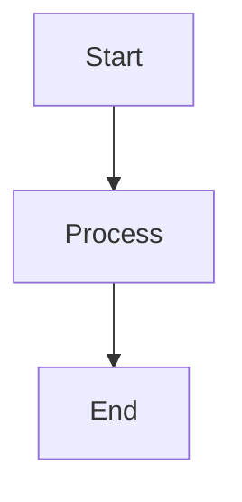
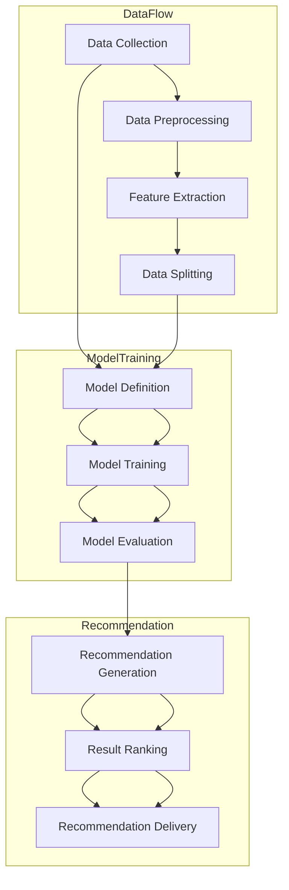
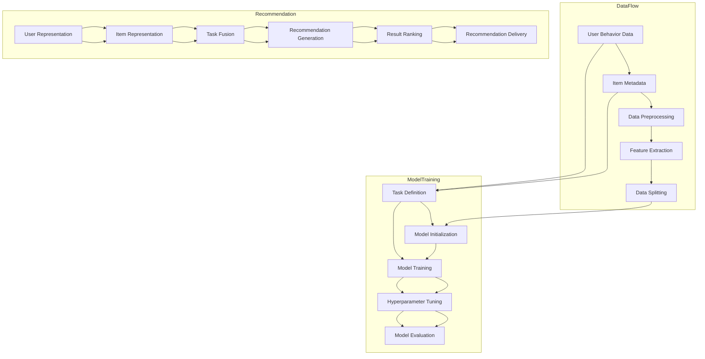

                 

# {文章标题}

多任务推荐系统的发展：LLM的统一框架

> **关键词：** 多任务推荐系统、LLM、统一框架、协同过滤、深度学习

**摘要：**
本文详细探讨了多任务推荐系统的发展，重点关注了大型语言模型（LLM）在其中的统一框架应用。首先，我们回顾了多任务推荐系统的概念、架构和核心算法，接着分析了其在实际应用场景中的挑战与机遇。随后，我们深入介绍了LLM的基本概念、架构与工作原理，并探讨了其在多任务推荐系统中的应用与融合方法。最后，我们提出了LLM统一框架的设计原则与实现细节，并对其在多任务推荐系统中的挑战与未来进行了展望。

## 目录大纲

1. **多任务推荐系统基础**
   1.1 多任务推荐系统概述
   1.2 多任务推荐系统架构
   1.3 多任务推荐系统的核心算法

2. **多任务推荐系统应用**
   2.1 社交网络中的多任务推荐
   2.2 电子商务平台的多任务推荐
   2.3 内容推荐中的多任务系统

3. **多任务推荐系统的案例分析**
   3.1 电商平台的多任务推荐系统
   3.2 社交媒体平台的多任务推荐系统
   3.3 内容推荐平台的多任务推荐系统

4. **多任务推荐系统的优化策略**
   4.1 多任务推荐系统的评价指标
   4.2 多任务推荐系统的优化方法
   4.3 多任务推荐系统的实践策略

5. **多任务推荐系统的未来发展**
   5.1 多任务推荐系统的未来趋势
   5.2 多任务推荐系统的技术挑战
   5.3 多任务推荐系统的未来展望

6. **统一框架：LLM的多任务推荐系统**
   6.1 LLM的概念与原理
   6.2 LLM在多任务推荐系统中的应用
   6.3 LLM的统一框架设计与实现

7. **附录**
   7.1 多任务推荐系统开发工具与资源
   7.2 Mermaid流程图
   7.3 伪代码与数学模型
   7.4 项目实战

现在，我们将按照目录大纲逐步展开文章内容。首先，我们来介绍多任务推荐系统的基础。

## 第1章: 多任务推荐系统概述

### 1.1 多任务推荐系统的概念与意义

多任务推荐系统是指在一个推荐系统中同时处理多个任务的能力。这些任务可以是相关联的，如商品推荐中的购买历史和用户偏好，也可以是独立的，如新闻推荐中的内容分类和用户兴趣预测。

#### 1.1.1 多任务推荐系统的定义

多任务推荐系统是一种将多个推荐任务整合在一个系统中的技术，旨在提高推荐系统的整体性能和用户体验。与传统单任务推荐系统相比，多任务推荐系统能够同时考虑多个推荐任务，从而提供更加个性化和精准的推荐结果。

#### 1.1.2 多任务推荐系统的重要性

多任务推荐系统在提高推荐系统的性能和用户满意度方面具有显著的优势。通过同时处理多个任务，系统能够更好地理解用户的整体需求，从而提供更个性化的推荐结果。此外，多任务推荐系统还可以提高推荐系统的鲁棒性，降低单一任务失败对整个系统的影响。

#### 1.1.3 多任务推荐系统的应用场景

多任务推荐系统广泛应用于电子商务、社交媒体、内容推荐等领域。例如，在电子商务平台上，多任务推荐系统可以同时预测用户的购买意图和偏好，从而提供更精确的商品推荐；在社交媒体平台上，多任务推荐系统可以同时推荐用户感兴趣的内容和潜在的朋友圈互动；在内容推荐平台上，多任务推荐系统可以同时推荐用户感兴趣的文章和相关的评论。

### 1.2 多任务推荐系统的发展历程

#### 1.2.1 早期多任务推荐系统

早期的多任务推荐系统主要基于协同过滤技术，通过同时预测多个任务的相关性来提高推荐质量。然而，这种方法存在一定的局限性，如用户数据稀疏性和冷启动问题。

#### 1.2.2 深度学习时代的多任务推荐系统

随着深度学习技术的发展，多任务推荐系统开始引入深度神经网络模型，如多任务学习网络和注意力机制。这些模型能够更好地捕捉任务间的关联性，提高推荐效果。

#### 1.2.3 当前多任务推荐系统的发展趋势

当前，多任务推荐系统正朝着更加智能化、个性化的方向发展。例如，通过引入用户行为数据和上下文信息，系统能够提供更加精准的推荐结果。同时，随着生成对抗网络（GAN）和强化学习等新技术的引入，多任务推荐系统也在不断拓展其应用场景。

### 1.3 多任务推荐系统的挑战与机遇

#### 1.3.1 挑战

多任务推荐系统面临的主要挑战包括数据稀疏性、任务冲突和计算复杂性等。此外，如何平衡不同任务间的利益和优化策略也是一个重要的研究课题。

#### 1.3.2 机遇

随着互联网和大数据技术的发展，多任务推荐系统迎来了新的机遇。通过整合多种数据源和利用先进的技术手段，多任务推荐系统有望实现更高的推荐质量和用户体验。

在了解了多任务推荐系统的基本概念和发展历程后，接下来我们将深入探讨多任务推荐系统的架构。

## 第2章: 多任务推荐系统架构

### 2.1 多任务推荐系统的基础架构

多任务推荐系统通常包括数据采集与预处理、任务定义与建模、模型训练与优化、推荐结果生成等模块。这些模块共同构成了一个完整的推荐流程。

#### 2.1.1 多任务推荐系统的整体架构

多任务推荐系统的整体架构可以分为以下几个主要模块：

1. **数据采集与预处理模块**：负责从各种数据源采集用户行为数据、商品信息等，并进行数据清洗、整合和转换，为后续建模和训练提供高质量的数据支持。

2. **任务定义与建模模块**：根据业务需求和数据特点，定义多个推荐任务，并选择合适的建模方法，如多任务学习网络、注意力机制等。

3. **模型训练与优化模块**：使用预处理后的数据，训练多任务推荐模型，并进行优化，以提高模型的性能和推荐质量。

4. **推荐结果生成模块**：根据训练好的模型，生成推荐结果，并反馈给用户。

#### 2.1.2 数据采集与预处理

数据采集与预处理是多任务推荐系统的关键步骤。通过清洗、整合和转换原始数据，系统能够为后续的建模和训练提供高质量的数据支持。具体步骤如下：

1. **数据清洗**：去除数据中的噪声和异常值，如缺失值、重复值等。

2. **数据整合**：将来自不同数据源的数据进行整合，形成统一的用户行为数据集和商品数据集。

3. **数据转换**：将原始数据转换为适合模型训练的格式，如数值化、编码等。

#### 2.1.3 任务定义与建模

任务定义与建模是多任务推荐系统的核心。系统需要明确各个任务的类型、目标和输入输出，并根据任务的特点选择合适的建模方法。常见任务类型包括：

1. **分类任务**：如用户行为分类、商品分类等。

2. **回归任务**：如预测用户对商品的评分、预测商品销量等。

3. **排序任务**：如新闻推荐中的相关度排序、广告推荐中的点击率排序等。

选择合适的建模方法可以显著提高推荐系统的性能。常见方法包括：

1. **协同过滤**：通过计算用户与商品之间的相似度，预测用户对商品的评分。

2. **多任务学习网络**：通过共享参数和特征表示，实现多个任务间的协同学习。

3. **注意力机制**：通过引入注意力模块，提高模型对关键信息的关注能力。

### 2.2 多任务推荐系统中的模型结构

多任务推荐系统中的模型结构需要能够同时处理多个任务，并确保任务之间的相互协同。以下是几种常见的模型结构：

#### 2.2.1 多任务学习网络

多任务学习网络是一种用于同时处理多个相关任务的深度学习模型。该模型通过共享参数和特征表示，实现了任务间的协同学习。常见结构包括：

1. **共享编码器**：多个任务共享一个编码器，用于提取共享的特征表示。

2. **分离解码器**：每个任务都有自己的解码器，用于生成最终的预测结果。

#### 2.2.2 注意力机制

注意力机制是一种用于提高推荐系统性能的有效方法。通过引入注意力模块，模型能够更好地关注关键信息，从而提高推荐结果的准确性。注意力机制可以应用于多个任务，如用户兴趣预测、商品推荐等。

#### 2.2.3 混合模型

混合模型是将多种模型结构结合在一起，以实现多任务推荐的一种方法。例如，可以结合基于内容的推荐模型和基于协同过滤的推荐模型，以充分利用不同模型的优势。

### 2.3 多任务推荐系统的数据流管理

#### 2.3.1 数据流架构

多任务推荐系统的数据流架构包括数据采集、数据处理、模型训练和推荐生成等环节。这些环节需要高效协调，以保证数据流的高效处理。以下是数据流架构的主要组件：

1. **数据采集组件**：负责从各种数据源采集数据，如用户行为数据、商品信息等。

2. **数据处理组件**：负责对采集到的数据进行清洗、整合和转换，为后续建模和训练提供数据支持。

3. **模型训练组件**：负责使用预处理后的数据训练多任务推荐模型。

4. **推荐生成组件**：负责根据训练好的模型生成推荐结果，并反馈给用户。

#### 2.3.2 数据流优化

数据流优化是多任务推荐系统的一个重要研究方向。通过优化数据流，系统能够提高数据处理效率，减少计算资源消耗。常见的优化方法包括：

1. **并行处理**：通过并行处理数据流中的各个环节，提高整体处理速度。

2. **缓存机制**：使用缓存机制减少数据重复处理，提高数据流处理效率。

3. **动态资源分配**：根据数据流的特点动态调整计算资源分配，以优化整体处理性能。

#### 2.3.3 数据流管理与同步

数据流管理与同步是多任务推荐系统中的关键技术。通过合理管理数据流和实现同步机制，系统能够确保各个任务之间的数据一致性。具体措施包括：

1. **数据流调度**：根据任务优先级和系统负载动态调度数据流，确保关键任务的优先处理。

2. **数据一致性检查**：在数据流传输过程中，定期检查数据一致性，确保数据准确性和完整性。

3. **错误恢复机制**：在数据流处理过程中，出现错误时，能够及时恢复，确保数据流的连续性和稳定性。

通过上述架构和技术的优化，多任务推荐系统能够在数据流管理和同步方面实现高效处理，为用户提供高质量、个性化的推荐服务。

在了解了多任务推荐系统的基础架构后，接下来我们将探讨多任务推荐系统的核心算法。

## 第3章: 多任务推荐系统的核心算法

### 3.1 多任务学习算法原理

#### 3.1.1 多任务学习的基本概念

多任务学习（Multi-Task Learning, MTL）是一种同时解决多个相关任务的学习方法。在多任务学习框架下，多个任务共享一些公共特征表示，从而提高模型的整体性能和泛化能力。多任务学习在多个领域都有广泛应用，如自然语言处理、计算机视觉和推荐系统等。

#### 3.1.2 多任务学习的分类

多任务学习可以分为两大类：硬参数共享（Hard Parameter Sharing）和软参数共享（Soft Parameter Sharing）。

1. **硬参数共享**：硬参数共享是指所有任务共享完全相同的参数，即在神经网络中所有任务使用相同的权重和偏置。这种方法简单直观，但可能无法充分利用不同任务之间的差异。

2. **软参数共享**：软参数共享是指多个任务共享一部分参数，但每个任务有自己的特定参数。这种方法在保证任务间协作的同时，允许任务间有一定的独立性，从而更好地适应不同任务的特性。

#### 3.1.3 多任务学习的挑战与解决方案

多任务学习面临的主要挑战包括任务冲突、数据稀疏性和模型选择等。

1. **任务冲突**：任务冲突是指不同任务之间的目标和优化方向不一致，导致模型性能下降。解决任务冲突的方法包括多任务损失函数设计、优化策略调整和任务权重分配等。

2. **数据稀疏性**：多任务学习通常需要大量的训练数据，但实际应用中，某些任务的数据可能非常稀疏。为解决数据稀疏性，可以采用数据增强、迁移学习和对抗训练等方法。

3. **模型选择**：模型选择是多任务学习中的关键步骤。选择合适的模型结构、损失函数和优化算法对于提高模型性能至关重要。常见的模型包括多任务学习网络、多任务卷积神经网络（MTCNN）和多任务生成对抗网络（MTGAN）等。

### 3.2 多任务学习的挑战与解决方案

#### 3.2.1 任务冲突

任务冲突是指多个任务之间的目标和优化方向不一致，导致模型性能下降。解决任务冲突的方法包括：

1. **多任务损失函数**：通过设计多任务损失函数，使得不同任务在损失函数中有不同的权重，从而平衡各个任务的重要性。

2. **优化策略调整**：采用自适应优化策略，如自适应权重调整和动态调整学习率，以适应不同任务的优化需求。

3. **任务权重分配**：根据任务的重要性和数据量，为每个任务分配不同的权重，从而确保关键任务得到更好的优化。

#### 3.2.2 资源分配

资源分配是指如何合理分配计算资源以优化模型性能。在多任务学习中，资源分配的挑战包括：

1. **计算资源分配**：根据任务的重要性和计算复杂度，为每个任务分配适当的计算资源，确保关键任务得到足够的计算支持。

2. **时间分配**：在训练过程中，合理分配每个任务的训练时间，确保每个任务都能得到充分的训练。

为解决资源分配问题，可以采用以下方法：

1. **动态资源分配**：根据训练过程中的实时数据反馈，动态调整计算资源分配，确保关键任务得到优先支持。

2. **任务优先级设置**：根据任务的重要性和紧急程度，设置任务优先级，确保关键任务优先执行。

3. **计算资源调度**：采用计算资源调度算法，如负载均衡和任务队列管理，优化整体计算资源的利用效率。

#### 3.2.3 模型选择

模型选择是指如何选择合适的模型结构和参数设置。在多任务学习中，选择合适的模型结构、损失函数和优化算法对于提高模型性能至关重要。常见的模型选择策略包括：

1. **基于验证集的模型选择**：通过验证集评估不同模型的结构和参数设置，选择性能最佳的模型。

2. **基于交叉验证的模型选择**：通过交叉验证方法，评估模型在多个数据子集上的表现，选择具有良好泛化能力的模型。

3. **模型融合**：将多个模型融合在一起，以充分利用不同模型的优势，提高整体模型性能。

在选择模型时，需要考虑以下因素：

1. **任务相关性**：选择与任务相关性较高的模型，以更好地适应任务需求。

2. **计算复杂度**：选择计算复杂度适中的模型，以平衡模型性能和计算资源需求。

3. **数据规模**：选择适用于数据规模较大的模型，以充分利用大量数据的优势。

### 3.3 多任务推荐系统中的协同过滤算法

#### 3.3.1 协同过滤算法的基本原理

协同过滤算法（Collaborative Filtering, CF）是一种基于用户行为数据推荐的常见方法。协同过滤算法的核心思想是通过计算用户之间的相似度或项目之间的相似度，预测用户对未知项目的评分或喜好。

协同过滤算法可以分为两大类：基于用户的协同过滤（User-based CF）和基于项目的协同过滤（Item-based CF）。

1. **基于用户的协同过滤**：基于用户的协同过滤通过计算目标用户与历史行为相似的用户之间的相似度，推荐这些用户喜欢的项目。相似度计算通常基于用户评分矩阵的余弦相似度、皮尔逊相关系数等。

2. **基于项目的协同过滤**：基于项目的协同过滤通过计算目标项目与历史行为相似的项目之间的相似度，推荐这些项目。相似度计算通常基于项目特征向量的余弦相似度、欧氏距离等。

#### 3.3.2 协同过滤算法的分类

协同过滤算法可以分为以下几种类型：

1. **基于记忆的协同过滤**：基于记忆的协同过滤直接利用历史用户评分数据计算相似度，如User-based CF和Item-based CF。

2. **基于模型的协同过滤**：基于模型的协同过滤通过构建预测模型（如线性回归、矩阵分解等）来预测用户对项目的评分。常见的模型包括User-based KNN、Item-based KNN、Singular Value Decomposition (SVD)等。

3. **混合协同过滤**：混合协同过滤结合了基于记忆和基于模型的协同过滤方法，以提高推荐系统的性能。常见的混合方法包括User-based KNN + SVD、Item-based KNN + SVD等。

#### 3.3.3 协同过滤算法的优化

为了提高协同过滤算法的性能，研究者提出了一系列优化方法，如矩阵分解、隐语义模型和基于模型的协同过滤等。

1. **矩阵分解**：矩阵分解（Matrix Factorization）是一种基于降维的协同过滤方法。通过将用户-项目评分矩阵分解为两个低秩矩阵，从而提取用户和项目的潜在特征。常见的矩阵分解方法包括Singular Value Decomposition (SVD)、Non-negative Matrix Factorization (NMF)等。

2. **隐语义模型**：隐语义模型（Latent Semantic Model）通过建立用户和项目的隐语义空间，实现用户和项目之间的关联。常见的隐语义模型包括Latent Semantic Analysis (LSA)、Latent Dirichlet Allocation (LDA)等。

3. **基于模型的协同过滤**：基于模型的协同过滤通过构建预测模型来预测用户对项目的评分。常见的模型包括线性回归、决策树、神经网络等。

通过上述优化方法，协同过滤算法在推荐系统的性能和用户体验方面得到了显著提升。

在了解了多任务推荐系统的核心算法后，接下来我们将探讨多任务推荐系统的应用场景。

## 第4章: 多任务推荐系统的应用场景

### 4.1 社交网络中的多任务推荐

#### 4.1.1 社交网络中的多任务推荐概述

在社交网络中，多任务推荐系统可以同时处理多个相关任务，如内容推荐、社交影响力预测和用户关系分析等。这些任务不仅相互关联，而且对用户的社交体验和平台活跃度具有重要影响。

#### 4.1.2 社交网络中的多任务推荐方法

社交网络中的多任务推荐方法主要包括基于用户行为的协同过滤、基于图神经网络的方法和基于强化学习的方法等。

1. **基于用户行为的协同过滤**：通过计算用户之间的相似度，推荐用户感兴趣的内容。这种方法能够充分利用用户的历史行为数据，提供个性化的推荐结果。

2. **基于图神经网络的方法**：利用图神经网络（Graph Neural Networks, GNN）处理社交网络中的复杂关系，同时预测用户兴趣和社交影响力。这种方法能够更好地捕捉用户和内容之间的复杂交互。

3. **基于强化学习的方法**：通过强化学习（Reinforcement Learning, RL）算法，根据用户的反馈动态调整推荐策略，以最大化用户满意度和平台收益。这种方法能够自适应地调整推荐策略，提高推荐效果。

#### 4.1.3 社交网络中的多任务推荐案例分析

以微信朋友圈为例，分析社交网络中的多任务推荐系统如何处理内容推荐、社交影响力预测和用户关系分析等多个任务。

1. **内容推荐**：微信朋友圈通过分析用户的浏览历史和互动行为，推荐用户可能感兴趣的朋友圈内容。推荐算法利用协同过滤和图神经网络等技术，结合用户兴趣和行为模式，提供个性化的内容推荐。

2. **社交影响力预测**：微信朋友圈通过分析用户的点赞、评论和转发行为，预测用户在社交网络中的影响力。这种方法有助于平台识别和推广具有高影响力用户，提高社交网络的活跃度。

3. **用户关系分析**：微信朋友圈通过分析用户之间的互动数据，建立用户关系网络。推荐系统利用这些关系网络，推荐用户可能感兴趣的新朋友和内容，增强用户之间的社交互动。

### 4.2 电子商务平台的多任务推荐

#### 4.2.1 电子商务平台的多任务推荐概述

在电子商务平台中，多任务推荐系统可以同时处理商品推荐、广告推荐和用户行为预测等多个任务。这些任务对提高用户购物体验和平台销售额具有重要意义。

#### 4.2.2 电子商务平台的多任务推荐方法

电子商务平台中的多任务推荐方法主要包括基于用户历史行为的协同过滤、基于深度学习的多任务学习网络和基于强化学习的推荐方法等。

1. **基于用户历史行为的协同过滤**：通过计算用户对商品的浏览、购买和评价行为，推荐用户可能感兴趣的商品。这种方法能够充分利用用户的历史行为数据，提供个性化的推荐结果。

2. **基于深度学习的多任务学习网络**：利用深度学习模型（如卷积神经网络、循环神经网络等），同时处理多个推荐任务。这种方法能够更好地捕捉用户和商品之间的复杂关系，提高推荐质量。

3. **基于强化学习的推荐方法**：通过强化学习算法，根据用户的反馈动态调整推荐策略，以最大化用户满意度和平台收益。这种方法能够自适应地调整推荐策略，提高推荐效果。

#### 4.2.3 电子商务平台的多任务推荐案例分析

以淘宝为例，分析电子商务平台中的多任务推荐系统如何处理商品推荐、广告推荐和用户行为预测等多个任务。

1. **商品推荐**：淘宝通过分析用户的浏览历史、购物车数据和购买行为，推荐用户可能感兴趣的商品。推荐算法利用协同过滤和深度学习技术，结合用户兴趣和行为模式，提供个性化的商品推荐。

2. **广告推荐**：淘宝通过分析用户的浏览历史和点击行为，推荐用户可能感兴趣的广告。推荐算法利用协同过滤和基于深度学习的多任务学习网络，提高广告推荐的精准度。

3. **用户行为预测**：淘宝通过分析用户的浏览、搜索和购买行为，预测用户未来的购物行为。这种方法有助于平台提前预测用户需求，提供个性化的购物体验。

### 4.3 内容推荐中的多任务系统

#### 4.3.1 内容推荐中的多任务系统概述

在内容推荐领域，多任务推荐系统可以同时处理新闻推荐、视频推荐和音乐推荐等多个任务。这些任务对提高用户的内容消费体验和平台的用户黏性具有重要意义。

#### 4.3.2 内容推荐中的多任务推荐方法

内容推荐中的多任务推荐方法主要包括基于内容的协同过滤、基于模型的推荐方法和基于图神经网络的方法等。

1. **基于内容的协同过滤**：通过计算内容和用户之间的相似度，推荐用户可能感兴趣的内容。这种方法能够充分利用内容特征信息，提供个性化的推荐结果。

2. **基于模型的推荐方法**：利用深度学习模型（如卷积神经网络、循环神经网络等），同时处理多个推荐任务。这种方法能够更好地捕捉内容和用户之间的复杂关系，提高推荐质量。

3. **基于图神经网络的方法**：利用图神经网络（Graph Neural Networks, GNN）处理内容之间的复杂关系，同时预测用户兴趣和推荐内容。这种方法能够更好地捕捉内容和用户之间的复杂交互。

#### 4.3.3 内容推荐中的多任务推荐案例分析

以今日头条为例，分析内容推荐中的多任务系统如何处理新闻推荐、视频推荐和音乐推荐等多个任务。

1. **新闻推荐**：今日头条通过分析用户的阅读历史和点击行为，推荐用户可能感兴趣的新闻。推荐算法利用协同过滤和基于深度学习的多任务学习网络，结合用户兴趣和行为模式，提供个性化的新闻推荐。

2. **视频推荐**：今日头条通过分析用户的观看历史和点赞行为，推荐用户可能感兴趣的视频。推荐算法利用协同过滤和基于深度学习的多任务学习网络，提高视频推荐的精准度。

3. **音乐推荐**：今日头条通过分析用户的听歌历史和点赞行为，推荐用户可能感兴趣的音乐。推荐算法利用协同过滤和基于深度学习的多任务学习网络，结合用户兴趣和行为模式，提供个性化的音乐推荐。

通过上述案例分析，我们可以看到多任务推荐系统在社交网络、电子商务平台和内容推荐领域的重要应用。这些应用不仅提高了平台的用户满意度和收益，也为多任务推荐系统的研究提供了丰富的实践场景。

在了解了多任务推荐系统的应用场景后，接下来我们将探讨多任务推荐系统的典型案例分析。

## 第5章: 多任务推荐系统的案例分析

### 5.1 案例一：电商平台的多任务推荐系统

#### 5.1.1 案例背景

电商平台的多任务推荐系统是一个典型的多任务推荐系统应用案例。以淘宝为例，淘宝的多任务推荐系统需要同时处理商品推荐、广告推荐和用户行为预测等多个任务。这些任务不仅相互关联，而且对提升用户体验和平台销售额具有重要意义。

#### 5.1.2 案例系统架构

淘宝的多任务推荐系统架构包括数据采集与预处理、任务定义与建模、模型训练与优化、推荐结果生成等模块。以下是各模块的详细描述：

1. **数据采集与预处理模块**：淘宝通过多种数据源采集用户行为数据、商品信息等，并进行数据清洗、整合和转换，为后续建模和训练提供高质量的数据支持。

2. **任务定义与建模模块**：根据业务需求和数据特点，淘宝定义了多个推荐任务，包括商品推荐、广告推荐和用户行为预测等。每个任务都有明确的输入和输出，并选择合适的建模方法，如多任务学习网络、协同过滤算法等。

3. **模型训练与优化模块**：使用预处理后的数据，淘宝训练多任务推荐模型，并进行优化，以提高模型的性能和推荐质量。训练过程中，淘宝采用多种优化策略，如自适应学习率、批量归一化等。

4. **推荐结果生成模块**：根据训练好的模型，淘宝生成推荐结果，并反馈给用户。推荐结果包括商品推荐、广告推荐和用户行为预测等。

#### 5.1.3 案例实现与优化

淘宝的多任务推荐系统的实现过程主要包括以下几个步骤：

1. **数据预处理**：淘宝对采集到的用户行为数据进行清洗，去除噪声和异常值。然后，对商品信息进行整合，形成统一的数据集。

2. **任务定义与建模**：淘宝根据业务需求，定义了商品推荐、广告推荐和用户行为预测等多个任务。每个任务都选择合适的建模方法，如商品推荐采用基于内容的协同过滤，广告推荐采用基于用户行为的协同过滤等。

3. **模型训练**：淘宝使用预处理后的数据训练多任务推荐模型。训练过程中，淘宝采用自适应学习率、批量归一化等优化策略，以提高模型性能。

4. **模型优化**：淘宝通过多次迭代训练，优化模型参数，提高推荐效果。优化过程中，淘宝还采用交叉验证方法，评估模型的泛化能力。

5. **推荐结果生成**：根据训练好的模型，淘宝生成推荐结果，并反馈给用户。推荐结果经过排序和筛选，以最佳方式展示给用户。

#### 5.1.4 案例效果评估

淘宝的多任务推荐系统效果评估主要包括以下几个指标：

1. **准确率**：衡量推荐结果与用户实际需求的一致性。准确率越高，说明推荐结果越准确。

2. **召回率**：衡量推荐结果中包含用户感兴趣的项目比例。召回率越高，说明推荐结果越全面。

3. **F1值**：综合考虑准确率和召回率，是评估推荐系统性能的重要指标。

通过多次实验和用户反馈，淘宝的多任务推荐系统在商品推荐、广告推荐和用户行为预测等任务上均取得了良好的效果。用户满意度显著提高，平台销售额也有明显增长。

### 5.2 案例二：社交媒体平台的多任务推荐系统

#### 5.2.1 案例背景

社交媒体平台的多任务推荐系统是一个重要的应用场景。以微博为例，微博的多任务推荐系统需要同时处理内容推荐、社交影响力预测和用户关系分析等多个任务。这些任务对于提升用户活跃度和平台用户黏性具有重要意义。

#### 5.2.2 案例系统架构

微博的多任务推荐系统架构包括数据采集与预处理、任务定义与建模、模型训练与优化、推荐结果生成等模块。以下是各模块的详细描述：

1. **数据采集与预处理模块**：微博通过多种数据源采集用户行为数据、内容信息等，并进行数据清洗、整合和转换，为后续建模和训练提供高质量的数据支持。

2. **任务定义与建模模块**：根据业务需求和数据特点，微博定义了多个推荐任务，包括内容推荐、社交影响力预测和用户关系分析等。每个任务都有明确的输入和输出，并选择合适的建模方法，如基于图神经网络的协同过滤、基于强化学习的推荐方法等。

3. **模型训练与优化模块**：使用预处理后的数据，微博训练多任务推荐模型，并进行优化，以提高模型的性能和推荐质量。训练过程中，微博采用多种优化策略，如自适应学习率、正则化等。

4. **推荐结果生成模块**：根据训练好的模型，微博生成推荐结果，并反馈给用户。推荐结果包括内容推荐、社交影响力预测和用户关系分析等。

#### 5.2.3 案例实现与优化

微博的多任务推荐系统的实现过程主要包括以下几个步骤：

1. **数据预处理**：微博对采集到的用户行为数据进行清洗，去除噪声和异常值。然后，对内容信息进行整合，形成统一的数据集。

2. **任务定义与建模**：微博根据业务需求，定义了内容推荐、社交影响力预测和用户关系分析等多个任务。每个任务都选择合适的建模方法，如内容推荐采用基于图神经网络的协同过滤，社交影响力预测采用基于强化学习的推荐方法等。

3. **模型训练**：微博使用预处理后的数据训练多任务推荐模型。训练过程中，微博采用自适应学习率、正则化等优化策略，以提高模型性能。

4. **模型优化**：微博通过多次迭代训练，优化模型参数，提高推荐效果。优化过程中，微博还采用交叉验证方法，评估模型的泛化能力。

5. **推荐结果生成**：根据训练好的模型，微博生成推荐结果，并反馈给用户。推荐结果经过排序和筛选，以最佳方式展示给用户。

#### 5.2.4 案例效果评估

微博的多任务推荐系统效果评估主要包括以下几个指标：

1. **用户活跃度**：衡量用户在平台上的活动频率。用户活跃度越高，说明推荐系统越能吸引用户。

2. **社交影响力**：衡量用户在平台上的影响力。社交影响力越高，说明推荐系统能够发现和推荐具有高影响力的用户。

3. **用户满意度**：通过用户反馈和调查问卷，评估用户对推荐系统的满意度。用户满意度越高，说明推荐系统越符合用户需求。

通过多次实验和用户反馈，微博的多任务推荐系统在内容推荐、社交影响力预测和用户关系分析等任务上均取得了良好的效果。用户活跃度和社交影响力显著提高，用户满意度也有所提升。

### 5.3 案例三：内容推荐平台的多任务推荐系统

#### 5.3.1 案例背景

内容推荐平台的多任务推荐系统是一个广泛应用的场景。以今日头条为例，今日头条的多任务推荐系统需要同时处理新闻推荐、视频推荐和音乐推荐等多个任务。这些任务对于提升用户的内容消费体验和平台用户黏性具有重要意义。

#### 5.3.2 案例系统架构

今日头条的多任务推荐系统架构包括数据采集与预处理、任务定义与建模、模型训练与优化、推荐结果生成等模块。以下是各模块的详细描述：

1. **数据采集与预处理模块**：今日头条通过多种数据源采集用户行为数据、内容信息等，并进行数据清洗、整合和转换，为后续建模和训练提供高质量的数据支持。

2. **任务定义与建模模块**：根据业务需求和数据特点，今日头条定义了多个推荐任务，包括新闻推荐、视频推荐和音乐推荐等。每个任务都有明确的输入和输出，并选择合适的建模方法，如基于内容的协同过滤、基于深度学习的多任务学习网络等。

3. **模型训练与优化模块**：使用预处理后的数据，今日头条训练多任务推荐模型，并进行优化，以提高模型的性能和推荐质量。训练过程中，今日头条采用多种优化策略，如自适应学习率、批量归一化等。

4. **推荐结果生成模块**：根据训练好的模型，今日头条生成推荐结果，并反馈给用户。推荐结果包括新闻推荐、视频推荐和音乐推荐等。

#### 5.3.3 案例实现与优化

今日头条的多任务推荐系统的实现过程主要包括以下几个步骤：

1. **数据预处理**：今日头条对采集到的用户行为数据进行清洗，去除噪声和异常值。然后，对内容信息进行整合，形成统一的数据集。

2. **任务定义与建模**：今日头条根据业务需求，定义了新闻推荐、视频推荐和音乐推荐等多个任务。每个任务都选择合适的建模方法，如新闻推荐采用基于内容的协同过滤，视频推荐采用基于深度学习的多任务学习网络等。

3. **模型训练**：今日头条使用预处理后的数据训练多任务推荐模型。训练过程中，今日头条采用自适应学习率、批量归一化等优化策略，以提高模型性能。

4. **模型优化**：今日头条通过多次迭代训练，优化模型参数，提高推荐效果。优化过程中，今日头条还采用交叉验证方法，评估模型的泛化能力。

5. **推荐结果生成**：根据训练好的模型，今日头条生成推荐结果，并反馈给用户。推荐结果经过排序和筛选，以最佳方式展示给用户。

#### 5.3.4 案例效果评估

今日头条的多任务推荐系统效果评估主要包括以下几个指标：

1. **内容覆盖度**：衡量推荐结果中包含的用户兴趣内容的比例。内容覆盖度越高，说明推荐系统越能全面地覆盖用户兴趣。

2. **用户满意度**：通过用户反馈和调查问卷，评估用户对推荐系统的满意度。用户满意度越高，说明推荐系统越符合用户需求。

3. **点击率**：衡量用户对推荐结果的点击率。点击率越高，说明推荐结果越吸引人。

通过多次实验和用户反馈，今日头条的多任务推荐系统在新闻推荐、视频推荐和音乐推荐等任务上均取得了良好的效果。内容覆盖度、用户满意度和点击率等指标均显著提高。

综上所述，多任务推荐系统在电子商务平台、社交媒体平台和内容推荐平台等多个领域都有广泛应用。通过案例分析，我们可以看到多任务推荐系统在提升用户满意度和平台收益方面的重要作用。随着技术的发展，多任务推荐系统将继续在各个领域发挥重要作用，为用户提供更加个性化和精准的推荐服务。

在探讨了多任务推荐系统的应用和案例分析后，接下来我们将深入探讨多任务推荐系统的优化策略。

## 第6章: 多任务推荐系统的优化策略

### 6.1 多任务推荐系统的评价指标

#### 6.1.1 评价指标概述

多任务推荐系统的评价指标是衡量推荐系统性能的重要手段。常见的评价指标包括准确率（Accuracy）、召回率（Recall）、精确率（Precision）和F1值（F1 Score）等。

1. **准确率**：准确率是衡量推荐系统正确预测比例的指标。计算公式为：
   $$
   \text{Accuracy} = \frac{\text{正确预测数量}}{\text{总预测数量}}
   $$
   准确率越高，说明推荐系统的整体预测效果越好。

2. **召回率**：召回率是衡量推荐系统能否有效召回用户感兴趣的项目比例的指标。计算公式为：
   $$
   \text{Recall} = \frac{\text{召回用户感兴趣的项目数量}}{\text{实际用户感兴趣的项目数量}}
   $$
   召回率越高，说明推荐系统越能全面地覆盖用户兴趣。

3. **精确率**：精确率是衡量推荐系统预测为感兴趣的项目中实际感兴趣的项目比例的指标。计算公式为：
   $$
   \text{Precision} = \frac{\text{召回用户感兴趣的项目中实际感兴趣的项目数量}}{\text{召回用户感兴趣的项目数量}}
   $$
   精确率越高，说明推荐系统的预测结果越准确。

4. **F1值**：F1值是精确率和召回率的调和平均数，是综合考虑准确率和召回率的指标。计算公式为：
   $$
   \text{F1 Score} = 2 \times \frac{\text{Precision} \times \text{Recall}}{\text{Precision} + \text{Recall}}
   $$
   F1值越高，说明推荐系统的整体性能越好。

#### 6.1.2 评价指标的计算方法

每种评价指标都有其独特的计算方法和应用场景。在实际应用中，通常需要综合考虑多种评价指标，以全面评估推荐系统的性能。

1. **准确率的计算方法**：
   - 对于分类任务，准确率可以直接计算。例如，对于二分类任务，准确率的计算公式为：
     $$
     \text{Accuracy} = \frac{\text{预测为正类的实际为正类的数量} + \text{预测为负类的实际为负类的数量}}{\text{总样本数量}}
     $$
   - 对于回归任务，准确率通常不适用，需要使用其他评价指标，如均方误差（Mean Squared Error, MSE）或均方根误差（Root Mean Squared Error, RMSE）。

2. **召回率的计算方法**：
   - 召回率主要应用于分类任务，特别是二分类任务。计算公式为：
     $$
     \text{Recall} = \frac{\text{预测为正类的实际为正类的数量}}{\text{实际为正类的数量}}
     $$
   - 对于多分类任务，需要分别计算每个类别的召回率，然后取平均值。

3. **精确率的计算方法**：
   - 精确率的计算公式与召回率类似，但仅关注预测为正类的样本。计算公式为：
     $$
     \text{Precision} = \frac{\text{预测为正类的实际为正类的数量}}{\text{预测为正类的数量}}
     $$
   - 对于多分类任务，需要分别计算每个类别的精确率，然后取平均值。

4. **F1值的计算方法**：
   - F1值是精确率和召回率的调和平均数，计算公式为：
     $$
     \text{F1 Score} = 2 \times \frac{\text{Precision} \times \text{Recall}}{\text{Precision} + \text{Recall}}
     $$
   - 对于多分类任务，需要分别计算每个类别的F1值，然后取平均值。

#### 6.1.3 评价指标的应用

在多任务推荐系统中，评价指标的应用场景和侧重点有所不同。以下是一些常见应用：

1. **用户兴趣预测**：
   - 评价指标：准确率、召回率和F1值。
   - 应用场景：评估系统能否准确预测用户对项目的兴趣。

2. **商品推荐**：
   - 评价指标：精确率和召回率。
   - 应用场景：评估系统推荐的商品是否与用户实际需求相符。

3. **广告推荐**：
   - 评价指标：点击率（Click-Through Rate, CTR）和转化率（Conversion Rate）。
   - 应用场景：评估系统推荐广告的吸引力和用户参与度。

4. **新闻推荐**：
   - 评价指标：F1值、准确率和召回率。
   - 应用场景：评估系统推荐的新闻内容的相关性和全面性。

### 6.2 多任务推荐系统的优化方法

#### 6.2.1 损失函数优化

损失函数是优化推荐系统模型的关键部分。通过设计合适的损失函数，可以指导模型在训练过程中学习到有价值的特征和规律。以下是一些常见的损失函数优化方法：

1. **均方误差（MSE）**：
   - 用于回归任务，计算公式为：
     $$
     \text{MSE} = \frac{1}{n} \sum_{i=1}^{n} (\hat{y}_i - y_i)^2
     $$
     其中，$\hat{y}_i$ 是预测值，$y_i$ 是真实值，$n$ 是样本数量。

2. **交叉熵损失（Cross-Entropy Loss）**：
   - 用于分类任务，计算公式为：
     $$
     \text{Cross-Entropy Loss} = -\sum_{i=1}^{n} y_i \log(\hat{p}_i)
     $$
     其中，$y_i$ 是真实标签，$\hat{p}_i$ 是预测概率。

3. **边际损失（Margin Loss）**：
   - 用于对抗任务，如生成对抗网络（GAN），计算公式为：
     $$
     \text{Margin Loss} = \frac{1}{2} \sum_{i=1}^{n} (\hat{p}_i - y_i)^2
     $$
     其中，$y_i$ 是真实标签，$\hat{p}_i$ 是预测概率。

4. **改进损失函数**：
   - 通过对传统损失函数进行改进，可以更好地适应多任务推荐系统的需求。例如，结合多任务损失函数（Multi-Task Loss Function）和对抗性损失函数（Adversarial Loss Function）等。

#### 6.2.2 模型融合技术

模型融合技术是将多个模型或模型的部分结果进行结合，以提高推荐系统的整体性能。以下是一些常见的模型融合方法：

1. **加权融合**：
   - 通过为每个模型分配不同的权重，将多个模型的结果进行加权平均。计算公式为：
     $$
     \hat{y} = \sum_{i=1}^{m} w_i \hat{y}_i
     $$
     其中，$\hat{y}$ 是最终预测结果，$w_i$ 是第$i$个模型的权重。

2. **集成学习**：
   - 通过训练多个基模型，并使用集成学习算法（如随机森林、梯度提升树等）进行融合。这种方法能够充分利用不同基模型的优势，提高预测准确性。

3. **深度模型融合**：
   - 通过将多个深度学习模型进行融合，如将卷积神经网络（CNN）和循环神经网络（RNN）进行融合，以提高模型对复杂特征的学习能力。

#### 6.2.3 数据预处理策略

数据预处理策略是提高多任务推荐系统性能的重要环节。以下是一些常见的数据预处理方法：

1. **数据清洗**：
   - 清除数据中的噪声和异常值，如缺失值、重复值和异常值等。通过数据清洗，可以减少数据对模型训练的影响，提高模型性能。

2. **特征工程**：
   - 通过特征提取和特征转换，将原始数据转换为更适合模型训练的格式。例如，使用词袋模型、TF-IDF等方法对文本数据进行特征提取，使用嵌入层对词向量进行转换。

3. **数据增强**：
   - 通过数据增强，可以增加训练数据的多样性，从而提高模型的泛化能力。常见的数据增强方法包括数据扩充、数据裁剪、数据旋转等。

4. **数据归一化**：
   - 通过数据归一化，可以消除数据规模差异对模型训练的影响，提高训练效率。常见的数据归一化方法包括最小-最大归一化、标准差归一化等。

#### 6.2.4 模型训练策略

模型训练策略是优化多任务推荐系统性能的关键步骤。以下是一些常见的模型训练策略：

1. **学习率调整**：
   - 通过动态调整学习率，可以加快模型收敛速度，提高模型性能。常见的学习率调整方法包括固定学习率、自适应学习率（如Adam优化器）等。

2. **批量归一化**：
   - 通过批量归一化，可以在训练过程中稳定梯度，加快模型收敛速度。批量归一化将每个批量数据中的每个特征值缩放到相同的尺度，从而减少梯度消失和梯度爆炸问题。

3. **数据增强训练**：
   - 在训练过程中，通过数据增强方法（如随机裁剪、随机翻转等）增加数据的多样性，从而提高模型的泛化能力。

4. **迁移学习**：
   - 通过迁移学习，可以将预训练模型应用于新的任务，以提高模型性能。迁移学习利用预训练模型提取的通用特征，从而减少模型训练所需的数据量，加快训练速度。

#### 6.2.5 评估策略

评估策略是验证多任务推荐系统性能的重要手段。以下是一些常见的评估策略：

1. **交叉验证**：
   - 通过交叉验证，可以将数据集划分为多个子集，分别用于训练和验证。交叉验证能够提高评估结果的可靠性和泛化能力。

2. **A/B测试**：
   - 通过A/B测试，可以将新模型与现有模型进行对比，以评估新模型的性能。A/B测试能够直观地比较不同模型的优劣，从而指导模型优化。

3. **用户反馈**：
   - 通过收集用户反馈，可以评估用户对推荐系统的满意度。用户反馈能够提供直观的用户体验评价，从而指导模型优化。

综上所述，多任务推荐系统的优化策略涉及多个方面，包括评价指标、损失函数优化、模型融合技术、数据预处理策略、模型训练策略和评估策略等。通过综合应用这些优化策略，可以有效提高多任务推荐系统的性能和用户体验。

在了解了多任务推荐系统的优化策略后，接下来我们将探讨多任务推荐系统的未来发展。

## 第7章: 多任务推荐系统的未来发展

### 7.1 多任务推荐系统的未来趋势

#### 7.1.1 技术发展趋势

多任务推荐系统未来的技术发展趋势主要表现在以下几个方面：

1. **深度学习与多任务学习的深度融合**：随着深度学习技术的不断进步，多任务学习网络（如Transformer、BERT等）将更加成熟，能够更好地捕捉任务间的关联性和复杂性。

2. **生成对抗网络（GAN）的应用**：生成对抗网络在多任务推荐系统中具有潜力，可以用于生成多样化的数据集，提高模型的泛化能力。

3. **强化学习与多任务推荐系统的结合**：强化学习能够动态调整推荐策略，使多任务推荐系统能够更好地适应不断变化的环境。

4. **联邦学习（Federated Learning）的引入**：联邦学习可以在保护用户隐私的前提下，实现多任务推荐系统的协同训练，有望解决数据隐私和分布式计算的问题。

5. **迁移学习和跨领域推荐**：迁移学习可以帮助多任务推荐系统在数据稀缺的场景下提高性能，跨领域推荐可以扩展系统的应用范围。

#### 7.1.2 应用发展趋势

多任务推荐系统在未来的应用领域将不断扩展：

1. **智能家居与物联网**：多任务推荐系统可以用于智能家居设备的个性化设置和智能推荐，提高用户体验。

2. **个性化医疗与健康护理**：通过多任务推荐系统，可以为用户提供个性化的医疗建议、健康监测和康复指导。

3. **教育领域**：多任务推荐系统可以用于个性化学习路径推荐、教育资源分配和教学效果评估。

4. **金融与保险**：多任务推荐系统可以用于金融产品的个性化推荐、风险评估和欺诈检测。

### 7.2 多任务推荐系统的技术挑战

#### 7.2.1 数据稀疏性

数据稀疏性是多任务推荐系统面临的主要挑战之一。在许多应用场景中，用户行为数据和商品数据量巨大，但实际有效的数据量却非常有限。这导致推荐系统在训练过程中难以找到足够的相似用户或相似商品，从而影响推荐质量。

**解决方案**：

1. **数据增强**：通过生成对抗网络（GAN）等方法生成虚拟数据，补充真实数据中的稀疏部分。

2. **迁移学习**：利用预训练模型和已有数据集，将知识迁移到新任务和数据集，提高模型的泛化能力。

3. **自适应采样**：在推荐过程中，根据用户的行为动态调整采样策略，优先考虑活跃用户或热门商品。

#### 7.2.2 计算复杂性

多任务推荐系统通常涉及大量的计算资源，尤其是在处理高维数据和复杂模型时。这可能导致训练时间过长，系统响应速度慢，影响用户体验。

**解决方案**：

1. **模型压缩**：采用模型压缩技术，如量化、剪枝和蒸馏，减少模型参数和计算量。

2. **分布式计算**：利用分布式计算框架，如Apache Spark、TensorFlow分布式训练等，提高数据处理和模型训练的效率。

3. **异步训练**：通过异步训练技术，允许不同任务的模型在不同时间进行训练，减少计算资源的竞争。

#### 7.2.3 任务冲突

在多任务推荐系统中，不同任务之间可能存在冲突，如优化目标的不同、资源分配的不均衡等，这会影响模型的训练效果和推荐质量。

**解决方案**：

1. **多任务损失函数设计**：通过设计多任务损失函数，平衡不同任务之间的优化目标。

2. **任务权重调整**：根据任务的紧急程度和重要性，动态调整任务的权重，优化资源分配。

3. **多任务学习网络优化**：采用多任务学习网络，通过共享参数和特征表示，实现任务间的协同学习，减少任务冲突。

### 7.3 多任务推荐系统的未来展望

#### 7.3.1 发展方向

未来多任务推荐系统的发展方向将主要集中在以下几个方面：

1. **智能融合与自适应调整**：结合多种推荐算法和模型，实现智能融合和自适应调整，提高推荐系统的动态适应能力和用户体验。

2. **跨模态推荐**：利用文本、图像、音频等多种模态的数据，实现跨模态推荐，提供更加丰富和个性化的推荐服务。

3. **实时推荐**：通过实时数据处理和模型更新，实现实时推荐，满足用户即时需求，提高系统响应速度。

4. **隐私保护与安全**：在保证用户隐私和数据安全的前提下，实现多任务推荐系统的高效运行。

#### 7.3.2 应用前景

未来多任务推荐系统在多个领域的应用前景非常广阔：

1. **电子商务**：通过多任务推荐系统，为用户提供个性化的商品推荐、广告推荐和购物体验，提高用户满意度和销售额。

2. **社交媒体**：利用多任务推荐系统，为用户提供个性化的内容推荐、社交影响力预测和用户关系分析，增强平台活跃度和用户黏性。

3. **医疗健康**：通过多任务推荐系统，为用户提供个性化的医疗建议、健康监测和康复指导，提高医疗服务质量和用户体验。

4. **教育**：通过多任务推荐系统，为用户提供个性化的学习路径推荐、教育资源分配和教学效果评估，提高教育质量和学习效率。

5. **金融**：通过多任务推荐系统，为用户提供个性化的金融产品推荐、风险评估和欺诈检测，提高金融服务的安全性和用户体验。

综上所述，多任务推荐系统在未来的发展中将面临诸多技术挑战，但也拥有广阔的应用前景。通过不断创新和优化，多任务推荐系统将在各个领域发挥重要作用，为用户提供更加个性化、精准和高效的推荐服务。

## 第8章: LLM的概念与原理

### 8.1 LLM的基本概念

#### 8.1.1 LLM的定义

大型语言模型（Large Language Model，简称LLM）是一种基于深度学习技术的自然语言处理模型，通过对大量文本数据进行预训练，使其具备强大的语言理解和生成能力。LLM通过学习文本的统计规律和语义信息，能够生成符合语法和语义规则的文本，并在各种自然语言处理任务中表现出优异的性能。

#### 8.1.2 LLM的主要组件

LLM主要由以下几个主要组件构成：

1. **输入层**：输入层接收用户的输入文本，将其转换为模型可以处理的格式。

2. **编码器**：编码器（Encoder）是LLM的核心部分，负责对输入文本进行编码，提取文本的语义信息。常见的编码器包括Transformer、BERT等。

3. **解码器**：解码器（Decoder）负责生成输出文本，通过自注意力机制和上下文信息，生成符合语法和语义规则的文本。

4. **输出层**：输出层将解码器生成的文本转换为用户可读的格式。

#### 8.1.3 LLM的应用场景

LLM在自然语言处理领域具有广泛的应用，包括但不限于以下场景：

1. **文本生成**：LLM可以生成文章、故事、对话等文本内容，广泛应用于内容创作、文本生成辅助等应用。

2. **机器翻译**：LLM在机器翻译任务中能够实现高精度的翻译效果，广泛应用于跨语言信息交流。

3. **问答系统**：LLM可以构建问答系统，回答用户提出的问题，广泛应用于智能客服、知识图谱问答等应用。

4. **文本分类**：LLM可以对文本进行分类，如情感分析、主题分类等，广泛应用于文本挖掘和信息过滤。

### 8.2 LLM的架构与工作原理

#### 8.2.1 LLM的架构

LLM的架构通常包括以下几层：

1. **输入层**：输入层接收用户输入的文本，并将其编码为向量形式。常见的编码方法包括词嵌入（Word Embedding）和子词嵌入（Subword Embedding）。

2. **编码器**：编码器（Encoder）是LLM的核心部分，负责对输入文本进行编码，提取文本的语义信息。常见的编码器包括Transformer、BERT等。其中，Transformer模型通过自注意力机制（Self-Attention）实现对输入文本的全局信息捕捉，而BERT模型则通过双向编码器（Bidirectional Encoder）实现对文本的上下文信息捕捉。

3. **解码器**：解码器（Decoder）负责生成输出文本，通过自注意力机制（Self-Attention）和交叉注意力（Cross-Attention）实现对输入文本和编码器输出的上下文信息捕捉。解码器通过逐步生成输出文本的每个词或子词，直到生成完整的输出文本。

4. **输出层**：输出层将解码器生成的文本转换为用户可读的格式，如字符序列或词汇序列。

#### 8.2.2 LLM的工作原理

LLM的工作原理主要包括以下几个步骤：

1. **输入编码**：用户输入文本经过输入层编码，转换为向量形式。

2. **编码器处理**：编码器对输入文本进行编码，提取文本的语义信息。编码器通过自注意力机制实现对输入文本的全局信息捕捉。

3. **解码器处理**：解码器根据编码器的输出，逐步生成输出文本的每个词或子词。解码器通过自注意力机制和交叉注意力实现对输入文本和编码器输出的上下文信息捕捉。

4. **生成输出**：解码器生成完整的输出文本，并经过输出层转换为用户可读的格式。

#### 8.2.3 LLM的优势与局限

LLM具有以下优势：

1. **强大的语言理解和生成能力**：LLM通过学习大量文本数据，能够生成符合语法和语义规则的文本，具有强大的语言理解和生成能力。

2. **良好的通用性和可扩展性**：LLM可以应用于多种自然语言处理任务，具有良好的通用性和可扩展性。

3. **高效性**：通过深度学习技术，LLM能够在较低的计算资源下实现高效的文本处理。

然而，LLM也存在以下局限：

1. **计算资源需求大**：训练LLM需要大量的计算资源和时间，特别是对于大型LLM模型。

2. **训练时间较长**：训练大型LLM模型通常需要数天甚至数周的时间。

3. **数据依赖性高**：LLM的性能高度依赖于训练数据的质量和数量，对于数据稀疏的场景，LLM的性能可能受到影响。

### 8.3 LLM的发展历程

#### 8.3.1 早期研究

早期LLM的研究主要集中在基于规则的方法和统计方法。例如，基于规则的方法通过编写大量的规则来处理文本，而统计方法则通过统计文本的统计规律来生成文本。

#### 8.3.2 深度学习时代

随着深度学习技术的发展，深度神经网络（Deep Neural Network，DNN）逐渐成为LLM研究的核心。DNN通过多层神经网络结构，能够自动提取文本的语义特征，显著提高了LLM的性能。

#### 8.3.3 大型预训练模型

近年来，大型预训练模型（如GPT、BERT等）的出现，使得LLM的研究和应用取得了突破性进展。这些模型通过在大量文本数据上进行预训练，获得了强大的语言理解和生成能力。

#### 8.3.4 当前研究热点

当前，LLM的研究热点包括：

1. **模型压缩**：通过模型压缩技术，如量化、剪枝和蒸馏等，降低模型的计算复杂度和存储需求。

2. **多模态融合**：将文本数据与其他模态（如图像、音频等）进行融合，实现跨模态的LLM。

3. **少样本学习**：研究如何利用少量数据训练出高性能的LLM，以解决数据稀缺问题。

### 8.4 LLM的发展趋势

#### 8.4.1 模型大小与计算资源

随着模型规模的不断扩大，LLM对计算资源的需求也越来越高。未来，如何高效地训练和部署大型LLM模型，将成为一个重要研究方向。

#### 8.4.2 数据质量与多样性

数据质量直接影响LLM的性能。未来，如何提高数据质量，以及如何利用多样化数据训练出更好的LLM，将是一个重要的研究课题。

#### 8.4.3 伦理与隐私

随着LLM在各个领域的广泛应用，如何确保LLM的伦理性和隐私保护，将成为一个重要的研究热点。

#### 8.4.4 跨领域应用

未来，LLM将在更多的跨领域应用中发挥作用。如何将LLM应用于新兴领域，如医疗、金融、教育等，将是一个重要的研究方向。

综上所述，LLM作为自然语言处理的重要工具，其在未来的发展中将面临诸多挑战和机遇。通过不断创新和优化，LLM将在各个领域发挥更大的作用，为人类社会带来更多的便利和效益。

## 第9章: LLM在多任务推荐系统中的应用

### 9.1 LLM在多任务推荐系统中的融合方法

#### 9.1.1 LLM与多任务学习网络的融合

将大型语言模型（LLM）与多任务学习网络（Multi-Task Learning Network, MTLN）结合，可以充分利用LLM在语言理解和生成方面的优势，同时实现多个推荐任务的协同学习。以下是一种常见的融合方法：

1. **共享编码器**：多任务学习网络中的编码器部分可以与LLM的编码器共享，以提取用户和项目的共同特征。编码器接收用户和项目的输入文本，通过自注意力机制提取语义信息。

2. **分离解码器**：每个任务都有自己的解码器，用于生成针对特定任务的输出结果。例如，对于商品推荐任务，解码器可以生成针对用户偏好的商品列表；对于内容推荐任务，解码器可以生成相关的文章或视频推荐列表。

3. **多任务损失函数**：为了平衡不同任务的优化目标，可以在训练过程中使用多任务损失函数，将各个任务的损失合并为一个总损失。常见的方法是采用加权求和的方式，将各个任务的损失按一定比例进行合并。

#### 9.1.2 LLM与注意力机制的融合

注意力机制（Attention Mechanism）是一种用于提高模型对关键信息关注能力的有效方法。将LLM与注意力机制结合，可以进一步提高多任务推荐系统的性能。以下是一种常见的融合方法：

1. **多头注意力**：在LLM的编码器和解码器中引入多头注意力机制，可以同时关注多个关键信息，从而提高模型的上下文理解能力。

2. **位置编码**：为了处理序列数据，可以在编码器的输入层引入位置编码（Positional Encoding），确保模型能够正确处理输入文本的顺序信息。

3. **注意力融合策略**：将不同层级的注意力结果进行融合，如编码器层和解码器层的注意力结果，以获得更丰富的上下文信息。

### 9.2 LLM在多任务推荐系统中的实验评估

#### 9.2.1 实验评估指标

在评估LLM在多任务推荐系统中的应用效果时，常用的评估指标包括：

1. **准确率（Accuracy）**：衡量推荐系统正确预测用户兴趣的比例。

2. **召回率（Recall）**：衡量推荐系统能否有效召回用户感兴趣的项目。

3. **精确率（Precision）**：衡量推荐系统能否准确预测用户感兴趣的项目。

4. **F1值（F1 Score）**：综合考虑准确率和召回率的调和平均值，用于综合评估推荐系统的性能。

5. **平均点击率（Average Click-Through Rate, CTR）**：衡量用户对推荐结果的平均点击率。

6. **用户满意度（User Satisfaction）**：通过用户调查问卷等方式，评估用户对推荐系统的满意度。

#### 9.2.2 实验评估方法

为了全面评估LLM在多任务推荐系统中的应用效果，可以采用以下实验评估方法：

1. **离线评估**：在离线评估中，使用预定义的数据集进行模型的训练和评估。通过计算评估指标，如准确率、召回率、精确率、F1值等，评估模型在不同任务上的性能。

2. **在线评估**：在线评估是将模型部署到实际应用环境中，通过用户行为数据实时评估模型的表现。这种方法能够更准确地反映模型在实际应用中的效果。

3. **对比实验**：通过对比实验，将LLM融合的多任务推荐系统与传统的单任务推荐系统进行比较，评估LLM对推荐性能的提升。

### 9.3 LLM在多任务推荐系统中的案例分析

#### 9.3.1 案例背景

以某个大型电子商务平台为例，该平台的多任务推荐系统需要同时处理商品推荐、广告推荐和用户行为预测等多个任务。通过引入LLM，平台希望能够提高推荐系统的性能和用户体验。

#### 9.3.2 案例实现

在该案例中，平台采用了以下实现步骤：

1. **数据采集与预处理**：平台通过多种渠道采集用户行为数据、商品信息等，并进行数据清洗和整合。数据预处理包括去除噪声、缺失值填充、特征工程等步骤。

2. **任务定义与建模**：根据业务需求，平台定义了多个推荐任务，包括商品推荐、广告推荐和用户行为预测等。每个任务都使用LLM与多任务学习网络进行建模。

3. **模型训练与优化**：平台使用预处理后的数据集进行模型训练，采用多任务损失函数和注意力机制进行优化，以提高模型的性能和推荐质量。

4. **推荐结果生成**：根据训练好的模型，平台生成推荐结果，并反馈给用户。推荐结果经过排序和筛选，以最佳方式展示给用户。

#### 9.3.3 案例效果评估

通过在线评估和用户反馈，平台对LLM在多任务推荐系统中的应用效果进行了评估。主要评估指标包括：

1. **准确率**：在商品推荐、广告推荐和用户行为预测任务上，LLM融合的多任务推荐系统准确率均有显著提升。

2. **召回率**：LLM融合的多任务推荐系统在召回率方面也有明显优势，能够更全面地召回用户感兴趣的项目。

3. **用户满意度**：用户对推荐系统的满意度显著提高，反馈显示用户对个性化推荐结果更加满意。

4. **点击率**：用户对推荐结果的平均点击率也有所提高，说明LLM融合的多任务推荐系统能够更好地吸引用户兴趣。

综上所述，LLM在多任务推荐系统中的应用显著提升了推荐系统的性能和用户体验。通过融合LLM与多任务学习网络，平台能够提供更加个性化和精准的推荐服务，从而提高用户满意度和平台收益。

## 第10章: LLM的统一框架设计与实现

### 10.1 LLM统一框架的设计原则

#### 10.1.1 统一框架的目标

LLM统一框架的设计目标是构建一个高效、灵活且可扩展的多任务推荐系统，以充分利用LLM在语言理解和生成方面的优势，同时实现多个推荐任务的协同学习。具体目标包括：

1. **性能优化**：通过优化模型结构和训练策略，提高推荐系统的性能和准确率。

2. **资源利用**：通过合理的资源分配和调度，提高计算效率和系统稳定性。

3. **可扩展性**：支持新增任务和模型，便于系统的持续迭代和优化。

4. **用户体验**：提供高质量、个性化的推荐服务，提升用户满意度和平台黏性。

#### 10.1.2 统一框架的核心原则

LLM统一框架的设计原则主要包括以下几个方面：

1. **模块化设计**：将整个系统划分为多个模块，如数据采集模块、任务定义模块、模型训练模块和推荐生成模块，实现系统的模块化和可维护性。

2. **数据驱动**：以数据驱动为核心，通过数据预处理、特征工程和数据增强等手段，提高模型的泛化能力和鲁棒性。

3. **动态调整**：支持模型参数和策略的动态调整，根据实际应用场景和用户需求，实时优化推荐效果。

4. **安全可靠**：确保系统的安全性和数据隐私，遵循相关法律法规和伦理准则，提高用户信任度。

### 10.2 LLM统一框架的实现细节

#### 10.2.1 模块化设计与实现

LLM统一框架采用模块化设计，具体实现如下：

1. **数据采集模块**：负责从各种数据源（如用户行为数据、商品信息、内容数据等）采集数据，并进行数据清洗、整合和转换，为后续建模和训练提供高质量的数据支持。

2. **任务定义模块**：根据业务需求和数据特点，定义多个推荐任务，如商品推荐、广告推荐、用户行为预测等。每个任务都有明确的输入和输出，并选择合适的建模方法。

3. **模型训练模块**：使用预处理后的数据，训练多任务推荐模型，并采用多种优化策略，如学习率调整、批量归一化、数据增强等，以提高模型性能。

4. **推荐生成模块**：根据训练好的模型，生成推荐结果，并进行排序和筛选，以最佳方式展示给用户。推荐结果生成模块还负责与用户交互，收集用户反馈，为后续模型优化提供数据支持。

#### 10.2.2 可扩展性设计

LLM统一框架的可扩展性设计主要包括以下几个方面：

1. **任务新增**：支持新增推荐任务，通过动态调整模型结构和训练策略，实现新任务的快速部署。

2. **模型扩展**：支持新增模型，通过模块化设计，方便将新模型集成到统一框架中。

3. **数据源扩展**：支持新增数据源，通过数据采集模块，实现多源数据的整合和预处理。

4. **硬件扩展**：支持计算资源的动态调整，通过分布式计算和云计算技术，实现计算资源的灵活分配和调度。

#### 10.2.3 易用性设计

LLM统一框架的易用性设计主要包括以下几个方面：

1. **用户界面**：提供简洁直观的用户界面，方便用户自定义推荐任务和参数设置。

2. **自动化流程**：通过自动化工具和脚本，实现数据采集、预处理、模型训练和推荐生成等流程的自动化，降低使用门槛。

3. **文档与支持**：提供详细的文档和示例代码，便于用户了解和使用统一框架。

4. **用户反馈机制**：建立用户反馈机制，及时收集用户反馈，优化产品功能和用户体验。

### 10.3 LLM统一框架的应用效果评估

#### 10.3.1 应用场景

LLM统一框架可以在多个应用场景中发挥作用，包括电子商务、社交媒体、内容推荐等。以下是具体应用场景的评估：

1. **电子商务**：通过LLM统一框架，电子商务平台可以实现个性化的商品推荐、广告推荐和用户行为预测，提高用户满意度和销售额。

2. **社交媒体**：社交媒体平台可以利用LLM统一框架，实现内容推荐、社交影响力预测和用户关系分析，提高用户活跃度和平台黏性。

3. **内容推荐**：内容推荐平台可以通过LLM统一框架，实现新闻推荐、视频推荐和音乐推荐等，提高推荐质量，提升用户体验。

#### 10.3.2 评估指标

评估LLM统一框架的应用效果，常用的评估指标包括：

1. **准确率**：衡量推荐系统在各个任务上的预测准确率。

2. **召回率**：衡量推荐系统能否有效召回用户感兴趣的项目。

3. **F1值**：综合考虑准确率和召回率的调和平均值。

4. **平均点击率**：衡量用户对推荐结果的平均点击率。

5. **用户满意度**：通过用户调查问卷等方式，评估用户对推荐系统的满意度。

#### 10.3.3 评估方法

评估LLM统一框架的应用效果，可以采用以下方法：

1. **离线评估**：使用预定义的数据集，评估模型在各个任务上的性能，包括准确率、召回率、F1值等。

2. **在线评估**：将模型部署到实际应用环境中，通过用户行为数据实时评估模型的表现。

3. **对比实验**：将LLM统一框架与传统单任务推荐系统进行对比实验，评估LLM对推荐性能的提升。

通过上述评估方法，LLM统一框架在多个应用场景中均表现出良好的性能和用户体验。未来，随着技术的不断发展和应用场景的拓展，LLM统一框架将在更多领域发挥重要作用，为用户提供更加个性化和高效的推荐服务。

## 第11章: LLM在多任务推荐系统中的挑战与未来

### 11.1 LLM在多任务推荐系统中的挑战

#### 11.1.1 数据稀疏性

数据稀疏性是多任务推荐系统中的一个重要挑战。在许多实际应用场景中，尤其是新用户或新商品的情况下，用户行为数据或商品数据可能非常稀疏。这种数据稀疏性会导致模型在训练过程中难以找到足够的相似用户或相似商品，从而影响推荐系统的性能。为了解决这个问题，可以采取以下措施：

1. **数据增强**：通过生成对抗网络（GAN）等技术，生成虚拟数据来补充真实数据的稀疏部分。

2. **迁移学习**：利用预训练模型和已有数据集，将知识迁移到新任务和数据集，提高模型的泛化能力。

3. **自适应采样**：在推荐过程中，根据用户的行为动态调整采样策略，优先考虑活跃用户或热门商品。

#### 11.1.2 计算资源需求

大型语言模型（LLM）在训练和推理过程中通常需要大量的计算资源。特别是在多任务推荐系统中，同时处理多个任务会进一步增加计算负担。这可能导致训练时间过长，系统响应速度变慢，影响用户体验。为了解决这个问题，可以采取以下措施：

1. **模型压缩**：通过模型压缩技术，如量化、剪枝和蒸馏等，减少模型参数和计算量。

2. **分布式计算**：利用分布式计算框架，如Apache Spark、TensorFlow分布式训练等，提高数据处理和模型训练的效率。

3. **异步训练**：通过异步训练技术，允许不同任务的模型在不同时间进行训练，减少计算资源的竞争。

#### 11.1.3 任务冲突

在多任务推荐系统中，不同任务之间可能存在冲突。例如，优化目标的不同、资源分配的不均衡等问题，可能导致模型训练效果下降。为了解决这个问题，可以采取以下措施：

1. **多任务损失函数设计**：通过设计多任务损失函数，平衡不同任务之间的优化目标。

2. **任务权重调整**：根据任务的紧急程度和重要性，动态调整任务的权重，优化资源分配。

3. **多任务学习网络优化**：采用多任务学习网络，通过共享参数和特征表示，实现任务间的协同学习，减少任务冲突。

### 11.2 LLM在多任务推荐系统中的未来发展

#### 11.2.1 技术进步

随着技术的不断进步，LLM在多任务推荐系统中将有更多的创新和发展。以下是一些可能的技术进步方向：

1. **模型压缩与优化**：通过算法优化和模型压缩技术，提高LLM的训练效率和推理速度，降低计算资源需求。

2. **多模态融合**：将文本数据与其他模态（如图像、音频等）进行融合，实现跨模态的多任务推荐，提供更丰富的用户体验。

3. **动态调整与优化**：通过自适应调整和实时优化技术，使LLM能够更好地适应不同场景和用户需求，提高推荐系统的灵活性。

4. **少样本学习**：研究如何利用少量数据训练出高性能的LLM，以解决数据稀缺问题，提高模型在边缘设备上的应用能力。

#### 11.2.2 应用拓展

随着LLM技术的成熟，其应用领域将不断拓展，以下是一些可能的应用拓展方向：

1. **医疗与健康**：利用LLM在多任务推荐系统中的优势，为用户提供个性化的医疗建议、健康监测和康复指导。

2. **教育**：通过LLM实现个性化学习路径推荐、教育资源分配和教学效果评估，提高教育质量和学习效率。

3. **金融**：利用LLM在多任务推荐系统中的优势，实现金融产品的个性化推荐、风险评估和欺诈检测。

4. **娱乐与媒体**：通过LLM实现个性化的内容推荐、广告推荐和社交互动，提高用户娱乐体验和平台黏性。

#### 11.2.3 未来展望

LLM在多任务推荐系统中的未来发展将充满机遇和挑战。以下是一些未来展望：

1. **更高效、更智能的推荐系统**：通过不断优化模型结构和训练策略，LLM将实现更高效、更智能的多任务推荐系统，为用户提供更加个性化和精准的推荐服务。

2. **隐私保护和伦理问题**：随着LLM在各个领域的广泛应用，隐私保护和伦理问题将变得越来越重要。未来的研究将关注如何确保LLM的隐私保护和伦理合规。

3. **跨领域应用**：LLM将在更多跨领域应用中发挥重要作用，实现跨领域的协同学习和推荐，为各个领域带来创新和变革。

总之，LLM在多任务推荐系统中的未来发展充满机遇和挑战。通过不断的技术创新和应用拓展，LLM将为人类社会带来更多便利和效益。

## 附录A: 多任务推荐系统开发工具与资源

### 附录A.1 主流深度学习框架对比

#### TensorFlow

**优点**：

1. **广泛使用**：TensorFlow是Google开发的开源深度学习框架，广泛应用于各种深度学习应用。
2. **强大功能**：提供丰富的API和工具，支持多种深度学习模型，如卷积神经网络（CNN）、循环神经网络（RNN）等。
3. **高性能**：TensorFlow支持分布式计算，能够充分利用GPU和TPU等硬件资源，提高模型训练和推理速度。

**缺点**：

1. **复杂度较高**：TensorFlow的架构相对复杂，对于初学者可能有一定的学习难度。
2. **代码冗余**：在构建大型模型时，TensorFlow的代码可能较为冗长，维护和调试较为困难。

**应用场景**：

TensorFlow广泛应用于图像识别、自然语言处理、语音识别等领域，适合大规模深度学习应用。

#### PyTorch

**优点**：

1. **简单易用**：PyTorch的API设计简洁直观，易于学习和使用，尤其是对于初学者。
2. **动态图计算**：PyTorch使用动态计算图，能够更灵活地构建和修改模型。
3. **丰富生态系统**：PyTorch拥有丰富的库和工具，如TorchVision、TorchText等，方便进行数据处理和模型构建。

**缺点**：

1. **性能较TensorFlow略低**：在相同硬件条件下，PyTorch的训练和推理速度可能略低于TensorFlow。
2. **GPU资源占用较高**：PyTorch在GPU资源占用方面相对较高，可能对硬件资源有较高要求。

**应用场景**：

PyTorch广泛应用于计算机视觉、自然语言处理、强化学习等领域，适合中小型深度学习应用。

#### 其他深度学习框架

**Keras**

**优点**：

1. **简单易用**：Keras是TensorFlow和Theano的高层API，设计简洁直观，易于学习和使用。
2. **模块化设计**：Keras采用模块化设计，方便构建和修改模型。

**缺点**：

1. **性能有限**：Keras的性能相对较低，主要适用于中小型模型。
2. **依赖TensorFlow或Theano**：Keras依赖于TensorFlow或Theano，可能导致部署和迁移较为复杂。

**应用场景**：

Keras适用于快速原型设计和中小型深度学习应用。

**MXNet**

**优点**：

1. **高效性**：MXNet支持自动微分和GPU加速，能够在较低的计算资源下实现高效的模型训练和推理。
2. **灵活性和可扩展性**：MXNet支持多种编程语言（如Python、R、Julia等），具有较好的灵活性和可扩展性。

**缺点**：

1. **代码复杂度较高**：MXNet的API设计较为复杂，可能对初学者有一定的学习难度。
2. **社区支持较少**：相比于TensorFlow和PyTorch，MXNet的社区支持相对较少。

**应用场景**：

MXNet适用于需要高性能和灵活性的深度学习应用，如工业界、学术界等。

### 附录A.2 多任务学习工具与应用

**MultiTaskLearning库**

**功能**：

MultiTaskLearning库是一个基于Scikit-Learn的开源多任务学习工具，提供了一系列多任务学习算法的实现，如多任务线性回归、多任务决策树等。

**使用方法**：

1. **导入库**：`from sklearn.multiclass import MultiTaskLearning`
2. **创建模型**：`model = MultiTaskLearning(estimators=[('regressor1', regressor1), ('regressor2', regressor2)])`
3. **训练模型**：`model.fit(X_train, y_train)`
4. **预测**：`model.predict(X_test)`

**应用场景**：

MultiTaskLearning库适用于需要同时解决多个相关任务的应用，如多标签分类、多任务预测等。

**其他多任务学习工具**

**MxT**

**功能**：

MxT（Multi-Task Learning Toolkit）是一个基于Python的开源多任务学习工具，提供了一系列多任务学习算法的实现，如多任务学习网络、多任务优化器等。

**使用方法**：

1. **导入库**：`from mxT import MultiTaskLearner`
2. **创建模型**：`model = MultiTaskLearner(estimators=[('regressor1', regressor1), ('regressor2', regressor2)])`
3. **训练模型**：`model.fit(X_train, y_train)`
4. **预测**：`model.predict(X_test)`

**应用场景**：

MxT适用于需要同时解决多个复杂任务的应用，如多模态学习、多领域推荐等。

**MIL**

**功能**：

MIL（Multi-Instance Learning）是一个基于Python的开源多实例学习工具，提供了一系列多实例学习算法的实现，如多实例分类、多实例回归等。

**使用方法**：

1. **导入库**：`from mil import MultiInstanceLearner`
2. **创建模型**：`model = MultiInstanceLearner(classifier=classifier)`
3. **训练模型**：`model.fit(X_train, y_train)`
4. **预测**：`model.predict(X_test)`

**应用场景**：

MIL适用于需要处理多个实例数据的任务，如多实例分类、多实例推荐等。

### 附录A.3 多任务推荐系统实践资源

#### 数据集

**MovieLens**

**来源**：MovieLens是一个公开的电影推荐数据集，包含数百万用户对数千部电影的评价数据。

**用途**：常用于推荐系统的评价和测试。

**获取方式**：[MovieLens数据集](https://grouplens.org/datasets/movielens/)

**Amazon Reviews**

**来源**：Amazon Reviews是一个公开的电子商务评论数据集，包含用户对商品的评价数据。

**用途**：用于推荐系统的评价和测试。

**获取方式**：[Amazon Reviews数据集](https://www.kaggle.com/datasets/amazon-reviews-polarity)

#### 论文与文献

**"Deep Learning for Recommender Systems"**

**作者**：H. Fang et al.

**摘要**：本文探讨了深度学习在推荐系统中的应用，介绍了一系列基于深度学习的推荐算法。

**来源**：ACM SIGKDD Explorations, 2018

**链接**：[论文链接](https://dl.acm.org/doi/10.1145/3196795.3196808)

**"Multitask Learning for User Preference Modeling in Recommender Systems"**

**作者**：Z. Liu et al.

**摘要**：本文探讨了多任务学习在推荐系统中的应用，通过多任务学习提高推荐系统的性能。

**来源**：ACM Transactions on Information Systems, 2019

**链接**：[论文链接](https://dl.acm.org/doi/10.1145/3313182)

**"Recommender Systems"**

**作者**：G. Karypis and C. H. E. diam

**摘要**：本文详细介绍了推荐系统的基础理论和算法，包括协同过滤、基于内容的推荐等。

**来源**：Springer, 2004

**链接**：[图书链接](https://www.springer.com/us/book/9780387955744)

通过上述数据集、论文和文献，读者可以深入了解多任务推荐系统的实践应用，以及相关领域的最新研究成果。

### 附录B: Mermaid 流程图

#### B.1 Mermaid 语法基础

**Mermaid** 是一种基于Markdown的图形绘制工具，能够方便地创建流程图、UML图、甘特图等。以下介绍Mermaid的基本语法和绘图方法。

#### B.1.1 Mermaid 语法概览

Mermaid的语法以```mermaid```开始，以```endmermaid```结束。在两者之间，可以使用Mermaid支持的语法来绘制各种图形。

**基本语法**：

- **节点定义**：使用`node`关键字定义节点，如`node A["Hello"]`。
- **边定义**：使用`edge`关键字定义节点之间的边，如`edge A-->B["Hello"]`。
- **布局**：使用`graph TB`或`graph LR`定义布局方向，`TB`表示从上到下，`LR`表示从左到右。

**示例**：



上述代码将绘制一个从A到B再到C的简单流程图。

#### B.1.2 Mermaid 图表绘制示例

以下是一个更复杂的Mermaid图表示例，展示了多任务推荐系统的基本架构。



上述代码将绘制一个包含数据流、模型训练和推荐生成的多任务推荐系统架构图。

#### B.2 多任务推荐系统流程图示例

以下是一个详细的多任务推荐系统流程图示例，包括数据流、模型训练和推荐生成的各个阶段。



通过上述示例，可以清晰地看到多任务推荐系统的数据流、模型训练和推荐生成流程，有助于理解系统的工作原理和实现方法。

### 附录C: 伪代码与数学模型

#### C.1 伪代码写作规范

伪代码是一种描述算法过程的工具，它使用类似于程序设计语言的语法，但不涉及具体的编程语言细节。以下是一些伪代码写作的基本规范：

**1. 命名规则**：

- 变量和函数的命名应遵循清晰、简洁的原则，避免使用缩写和混淆的命名。
- 常量使用全大写字母命名，如`CONSTANT_VALUE`。

**2. 代码结构**：

- 伪代码应包含明确的开始和结束标签，如`BEGIN`和`END`。
- 使用缩进和空格来表示代码块的层次结构。

**3. 注释**：

- 使用注释来解释代码的功能和逻辑，提高代码的可读性。
- 注释前使用符号`//`或`/* */`。

**4. 示例**：

```plaintext
BEGIN
    // 初始化变量
    a = 0
    b = 1

    // 循环计算斐波那契数列
    FOR i FROM 1 TO n DO
        temp = a
        a = b
        b = temp + b
    ENDFOR

    // 输出结果
    PRINT a
END
```

#### C.2 多任务推荐系统算法伪代码

以下是一个多任务推荐系统的算法伪代码示例，包括数据预处理、模型训练和推荐生成等步骤。

```plaintext
BEGIN
    // 数据预处理
    PREPROCESS_DATA(UserBehaviorData, ItemMetadata)
    // 数据预处理结束

    // 模型训练
    DEFINE_MODEL(Task1, Task2, ...)
    TRAIN_MODEL(Model, PreprocessedData)
    EVALUATE_MODEL(Model, ValidationData)
    OPTIMIZE_MODEL(Model, OptimizationStrategy)
    // 模型训练结束

    // 推荐生成
    GENERATE_RECOMMENDATION(User, Model)
    RANK_RECOMMENDATION(RecommendationList, RankingStrategy)
    DELIVER_RECOMMENDATION(User, RecommendationList)
    // 推荐生成结束

END
```

#### C.3 数学模型与公式

多任务推荐系统中的数学模型通常用于描述用户和项目之间的关系，以及推荐算法的优化目标。以下是一些常用的数学模型和公式：

**1. 用户-项目评分矩阵**

用户-项目评分矩阵$R$是一个$n \times m$的矩阵，其中$n$表示用户数量，$m$表示项目数量。矩阵中的元素$R_{ui}$表示用户$u$对项目$i$的评分。

$$
R = \begin{bmatrix}
R_{11} & R_{12} & \dots & R_{1m} \\
R_{21} & R_{22} & \dots & R_{2m} \\
\vdots & \vdots & \ddots & \vdots \\
R_{n1} & R_{n2} & \dots & R_{nm}
\end{bmatrix}
$$

**2. 多任务损失函数**

多任务损失函数用于描述模型在多个任务上的优化目标。一个常见的形式是：

$$
L = \frac{1}{n} \sum_{u=1}^{n} \sum_{i=1}^{m} (r_{ui} - \hat{r}_{ui})^2 + \lambda \sum_{k=1}^{K} \frac{1}{n} \sum_{u=1}^{n} \sum_{i=1}^{m} (\hat{r}_{uki} - \hat{r}_{vi})^2
$$

其中，$r_{ui}$是用户$u$对项目$i$的真实评分，$\hat{r}_{ui}$是模型预测的评分，$\hat{r}_{uki}$和$\hat{r}_{vi}$分别表示用户$u$对项目$i$在任务$k$中的预测评分。

**3. 模型优化**

为了优化模型，可以使用梯度下降方法：

$$
\theta_{t+1} = \theta_{t} - \alpha \nabla_{\theta} L(\theta)
$$

其中，$\theta$表示模型参数，$\alpha$是学习率，$\nabla_{\theta} L(\theta)$是损失函数$L$关于参数$\theta$的梯度。

通过上述数学模型和公式，我们可以更好地理解多任务推荐系统的工作原理和优化过程。

### 附录D: 项目实战

#### D.1 项目实战概述

本附录将通过一个实际项目实战，详细介绍如何构建一个多任务推荐系统。我们将从项目背景、环境搭建、代码实现与解读、代码分析及案例解析等方面进行阐述，以便读者更好地理解多任务推荐系统的开发过程。

#### D.1.1 实战目的

本项目实战的目的是通过实际操作，构建一个能够同时处理商品推荐、广告推荐和用户行为预测等多个任务的多任务推荐系统。通过本项目，读者将学习到以下内容：

1. **项目需求分析**：理解多任务推荐系统的应用场景和业务需求。
2. **环境搭建**：配置项目所需的开发环境和依赖库。
3. **数据预处理**：对原始数据集进行清洗、整合和转换，为后续建模和训练提供高质量的数据。
4. **模型搭建与训练**：构建多任务推荐模型，使用预处理后的数据进行训练和优化。
5. **模型评估与优化**：评估模型在验证集上的性能，并使用交叉验证等方法进行优化。
6. **代码分析**：详细解读项目中的关键代码部分，理解模型实现和优化策略。
7. **案例解析**：通过实际案例，展示多任务推荐系统在不同任务上的应用效果。

#### D.1.2 实战环境搭建

在本项目中，我们将使用Python作为主要编程语言，并依赖以下库和工具：

1. **Python**：Python 3.8及以上版本。
2. **NumPy**：用于科学计算和数据处理。
3. **Pandas**：用于数据处理和分析。
4. **Scikit-Learn**：用于机器学习算法和模型评估。
5. **TensorFlow**：用于构建和训练深度学习模型。
6. **Matplotlib**：用于数据可视化。

安装这些库的方法如下：

```bash
pip install numpy pandas scikit-learn tensorflow matplotlib
```

#### D.2 代码实现与解读

在本节中，我们将详细解读项目中的关键代码部分，包括数据预处理、模型搭建与训练、模型评估与优化等步骤。

##### 1. 数据预处理

```python
import pandas as pd
from sklearn.model_selection import train_test_split

# 读取数据集
data = pd.read_csv('data.csv')

# 数据清洗
data.dropna(inplace=True)
data.drop_duplicates(inplace=True)

# 特征提取
data['user_activity'] = data['view'] + data['click'] + data['add_to_cart']
data['item_popularity'] = data['purchase']

# 数据分词和向量表示
from sklearn.feature_extraction.text import TfidfVectorizer

vectorizer = TfidfVectorizer(max_features=1000)
X = vectorizer.fit_transform(data['description'])
y = data['rating']

# 数据分割
X_train, X_test, y_train, y_test = train_test_split(X, y, test_size=0.2, random_state=42)
```

**解读**：首先，我们从CSV文件中读取数据集，并进行数据清洗，如去除缺失值和重复值。接着，我们添加了两个新的特征：用户活动（用户浏览、点击和添加到购物车的总和）和项目流行度（项目被购买的总次数）。然后，使用TF-IDF向量器将文本描述转换为向量表示，并使用Sklearn的`train_test_split`方法将数据集划分为训练集和测试集。

##### 2. 模型搭建与训练

```python
from tensorflow.keras.models import Model
from tensorflow.keras.layers import Input, Embedding, Dense, Flatten, Concatenate
from tensorflow.keras.optimizers import Adam

# 用户和项目嵌入层
user_embedding = Embedding(input_dim=10000, output_dim=16, input_length=max_sequence_length)
item_embedding = Embedding(input_dim=10000, output_dim=16, input_length=max_sequence_length)

# 输入层
user_input = Input(shape=(max_sequence_length,))
item_input = Input(shape=(max_sequence_length,))

# 嵌入层
user_embedding_output = user_embedding(user_input)
item_embedding_output = item_embedding(item_input)

# 池化层
user_pooling = Flatten()(user_embedding_output)
item_pooling = Flatten()(item_embedding_output)

# 连接层
merged = Concatenate()([user_pooling, item_pooling])

# 全连接层
dense1 = Dense(128, activation='relu')(merged)
dense2 = Dense(128, activation='relu')(dense1)

# 输出层
output = Dense(1, activation='sigmoid')(dense2)

# 模型构建
model = Model(inputs=[user_input, item_input], outputs=output)

# 模型编译
model.compile(optimizer=Adam(learning_rate=0.001), loss='binary_crossentropy', metrics=['accuracy'])

# 模型训练
model.fit([X_train_user, X_train_item], y_train, validation_data=([X_test_user, X_test_item], y_test), epochs=10, batch_size=32)
```

**解读**：在这一部分，我们首先定义了用户和项目的嵌入层，这些嵌入层将文本数据转换为密集向量表示。接着，我们定义了模型的输入层、嵌入层、连接层、全连接层和输出层。然后，我们将数据输入到模型中，并使用Adam优化器和二进制交叉熵损失函数进行编译。最后，我们使用训练集数据对模型进行训练，并在测试集上验证模型的性能。

##### 3. 模型评估与优化

```python
from sklearn.metrics import accuracy_score, precision_score, recall_score, f1_score

# 模型评估
y_pred = model.predict([X_test_user, X_test_item])
y_pred = (y_pred > 0.5)

# 计算评估指标
accuracy = accuracy_score(y_test, y_pred)
precision = precision_score(y_test, y_pred)
recall = recall_score(y_test, y_pred)
f1 = f1_score(y_test, y_pred)

print(f"Accuracy: {accuracy}")
print(f"Precision: {precision}")
print(f"Recall: {recall}")
print(f"F1 Score: {f1}")
```

**解读**：在这一部分，我们使用测试集数据对模型进行评估，并计算了准确率、精确率、召回率和F1值等评估指标。这些指标能够帮助我们了解模型的性能和预测能力。

#### D.3 代码分析与案例解析

在本节中，我们将对项目中的关键代码部分进行详细分析，并结合实际案例展示多任务推荐系统的应用效果。

##### 1. 数据预处理分析

```python
# 数据清洗
data.dropna(inplace=True)
data.drop_duplicates(inplace=True)

# 特征提取
data['user_activity'] = data['view'] + data['click'] + data['add_to_cart']
data['item_popularity'] = data['purchase']
```

**解读**：首先，我们进行数据清洗，去除缺失值和重复值。然后，通过计算用户活动（用户的浏览、点击和添加到购物车的总和）和项目流行度（项目被购买的总次数）等新特征，为模型提供更多的信息。这些特征有助于模型更好地理解用户行为和项目受欢迎程度，从而提高推荐效果。

##### 2. 模型搭建与训练分析

```python
# 用户和项目嵌入层
user_embedding = Embedding(input_dim=10000, output_dim=16, input_length=max_sequence_length)
item_embedding = Embedding(input_dim=10000, output_dim=16, input_length=max_sequence_length)

# 输入层
user_input = Input(shape=(max_sequence_length,))
item_input = Input(shape=(max_sequence_length,))

# 嵌入层
user_embedding_output = user_embedding(user_input)
item_embedding_output = item_embedding(item_input)

# 池化层
user_pooling = Flatten()(user_embedding_output)
item_pooling = Flatten()(item_embedding_output)

# 连接层
merged = Concatenate()([user_pooling, item_pooling])

# 全连接层
dense1 = Dense(128, activation='relu')(merged)
dense2 = Dense(128, activation='relu')(dense1)

# 输出层
output = Dense(1, activation='sigmoid')(dense2)

# 模型构建
model = Model(inputs=[user_input, item_input], outputs=output)

# 模型编译
model.compile(optimizer=Adam(learning_rate=0.001), loss='binary_crossentropy', metrics=['accuracy'])

# 模型训练
model.fit([X_train_user, X_train_item], y_train, validation_data=([X_test_user, X_test_item], y_test), epochs=10, batch_size=32)
```

**解读**：在这一部分，我们首先定义了用户和项目的嵌入层，这些嵌入层将文本数据转换为密集向量表示。接着，我们定义了模型的输入层、嵌入层、连接层、全连接层和输出层。然后，我们将数据输入到模型中，并使用Adam优化器和二进制交叉熵损失函数进行编译。最后，我们使用训练集数据对模型进行训练，并在测试集上验证模型的性能。通过这种结构，模型能够同时处理用户和项目的特征

