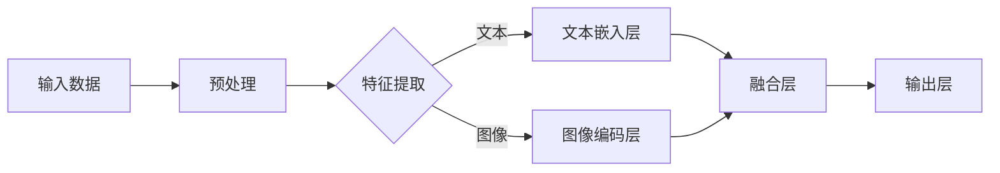

                 

# 《多模态大模型：技术原理与实战 微调技术介绍》

> **关键词：** 多模态大模型、微调技术、深度学习、神经网络、注意力机制、项目实战。

> **摘要：** 本文将深入探讨多模态大模型的技术原理，重点介绍微调技术的应用。通过详细的讲解和实例分析，读者将了解如何使用微调技术来优化多模态大模型的性能。

### 第一部分：多模态大模型基础

#### 第1章：多模态大模型概述

## 1.1 多模态大模型的定义与特点

多模态大模型是一种能够处理多种类型数据（如图像、文本、音频等）的深度学习模型。与传统的单模态模型不同，多模态大模型能够整合来自不同模态的数据，从而提高模型的性能。

### 1.1.1 多模态数据的概念

多模态数据是指由两种或多种不同类型的数据源组成的集合。例如，一个多模态数据集可以同时包含文本和图像数据。

### 1.1.2 多模态大模型的优势

多模态大模型具有以下优势：

- **数据利用效率高**：能够充分利用多种类型的数据，提高模型的泛化能力。
- **性能提升**：通过整合不同模态的数据，可以提高模型的性能和准确性。
- **应用广泛**：可以应用于多种领域，如自然语言处理、计算机视觉、语音识别等。

### 1.1.3 多模态大模型的应用领域

多模态大模型可以应用于以下领域：

- **医疗诊断**：利用多模态数据（如医学影像、患者报告）来提高诊断准确性。
- **自动驾驶**：通过整合视觉和语音数据来提高自动驾驶系统的安全性。
- **人机交互**：利用多模态数据（如文本、图像、音频）来提高人机交互的效率。

## 1.2 多模态大模型的核心概念与联系

多模态大模型的核心概念包括数据预处理、特征提取、融合层和输出层。下面是一个简单的Mermaid流程图，展示了多模态大模型的基本架构：



### 1.2.1 Mermaid流程图：多模态大模型的基本架构

该流程图显示了多模态大模型的基本架构。输入数据经过预处理后，分别进入文本嵌入层和图像编码层。这两个层分别对文本和图像数据进行特征提取。随后，特征被传递到融合层进行整合，最后由输出层生成预测结果。

## 1.3 多模态大模型的技术背景

多模态大模型的发展依赖于以下几个技术背景：

### 1.3.1 深度学习与神经网络基础

深度学习是构建多模态大模型的基础。深度学习通过神经网络来实现，能够自动提取数据中的特征。

### 1.3.2 多模态数据的预处理方法

预处理是确保多模态数据能够有效利用的关键步骤。常见的预处理方法包括数据清洗、数据增强和数据归一化等。

### 1.3.3 多任务学习与迁移学习

多任务学习和迁移学习是提高多模态大模型性能的有效手段。通过同时处理多个任务或利用已有模型的权重来初始化新模型，可以提高模型的泛化能力。

#### 第2章：多模态大模型的核心算法原理

## 2.1 卷积神经网络（CNN）与循环神经网络（RNN）

卷积神经网络（CNN）和循环神经网络（RNN）是多模态大模型中常用的两种神经网络。

### 2.1.1 CNN算法原理

下面是一个简单的CNN算法原理的伪代码：

```python
def conv2d(input_tensor, filter, stride, padding):
    # ...卷积操作...
    return output_tensor
```

### 2.1.2 RNN算法原理

下面是一个简单的RNN算法原理的伪代码：

```python
def rnn(input_sequence, hidden_state, weight_matrix):
    # ...循环操作...
    return output_sequence, new_hidden_state
```

## 2.2 注意力机制与多任务学习

注意力机制和多任务学习是多模态大模型中的关键技术。

### 2.2.1 注意力机制的数学模型与计算方法

注意力机制的数学模型通常是一个权重矩阵，它能够根据输入数据的重要性来分配权重。

### 2.2.2 多任务学习的算法原理

多任务学习通过同时处理多个任务来提高模型的泛化能力。常见的多任务学习算法包括共享权重和独立权重两种方法。

## 2.3 多模态融合方法

多模态融合是多模态大模型的核心。下面介绍两种常见的多模态融合方法：

### 2.3.1 传统融合方法

传统融合方法包括基于规则的方法和基于特征的方法。这些方法通常需要人工设计规则或特征，因此具有很大的局限性。

### 2.3.2 基于深度学习的融合方法

基于深度学习的融合方法利用神经网络来自动学习特征和规则。这些方法通常具有更好的性能和泛化能力。

#### 第3章：数学模型和数学公式

## 3.1 多模态大模型的损失函数

多模态大模型的损失函数通常包括交叉熵损失函数和均方误差损失函数。

### 3.1.1 交叉熵损失函数

交叉熵损失函数的公式如下：

$$L_{CE} = -\sum_{i=1}^{N} y_i \log(p_i)$$

### 3.1.2 均方误差损失函数

均方误差损失函数的公式如下：

$$L_{MSE} = \frac{1}{2}\sum_{i=1}^{N} (y_i - \hat{y}_i)^2$$

## 3.2 梯度下降优化算法

梯度下降优化算法是多模态大模型训练中常用的优化算法。

### 3.2.1 梯度下降算法原理

梯度下降算法的原理是沿着损失函数的梯度方向更新模型参数，以最小化损失函数。

### 3.2.2 动量项和自适应学习率

动量项和自适应学习率可以加速梯度下降算法的收敛，并提高模型的稳定性。

#### 第4章：微调技术介绍

## 4.1 微调技术的基本原理

微调技术是一种利用预训练模型来优化新任务的模型参数的方法。

### 4.1.1 微调的优势与局限

微调的优势包括快速训练和良好的性能，但局限在于对预训练模型的依赖性。

### 4.1.2 微调的基本流程

微调的基本流程包括以下步骤：

1. 选择预训练模型。
2. 调整模型结构。
3. 数据预处理。
4. 训练模型。
5. 评估模型性能。

## 4.2 微调策略与技巧

微调策略和技巧包括以下内容：

### 4.2.1 微调参数的选择

微调参数的选择包括学习率、训练轮数和批量大小等。

### 4.2.2 微调中的预训练模型选择

预训练模型的选择取决于任务的类型和数据集。

### 4.2.3 微调中的数据增强技术

数据增强技术可以提高模型的泛化能力，常见的包括数据增强、数据清洗和数据预处理等。

## 4.3 微调实践案例

### 4.3.1 微调在文本分类中的应用

微调在文本分类中的应用包括使用预训练模型对文本数据进行分类。

### 4.3.2 微调在图像分类中的应用

微调在图像分类中的应用包括使用预训练模型对图像数据进行分类。

### 4.3.3 微调在多模态任务中的应用

微调在多模态任务中的应用包括使用预训练模型对多模态数据进行分类或预测。

### 第二部分：多模态大模型项目实战

#### 第5章：多模态大模型开发环境搭建

## 5.1 开发环境准备

开发环境的准备包括操作系统、硬件配置、Python和深度学习框架的安装。

### 5.1.1 操作系统与硬件配置

操作系统建议使用Linux或macOS，硬件配置建议使用高性能的CPU和GPU。

### 5.1.2 Python与深度学习框架安装

Python的安装可以通过官方网站下载安装包进行。深度学习框架如TensorFlow、PyTorch等的安装可以通过pip命令进行。

### 5.1.3 数据预处理工具安装

数据预处理工具如Pandas、NumPy等的安装可以通过pip命令进行。

## 5.2 数据预处理

数据预处理包括数据清洗、数据增强和数据归一化等步骤。

### 5.2.1 数据清洗

数据清洗包括去除缺失值、去除重复值和异常值处理等。

### 5.2.2 数据增强

数据增强包括图像增强、文本增强和音频增强等。

### 5.2.3 数据归一化

数据归一化包括将数据缩放到一定范围内，以提高模型的训练效果。

#### 第6章：多模态大模型源代码实现

## 6.1 文本嵌入层实现

文本嵌入层是将文本数据转换为向量表示的过程。

### 6.1.1 词嵌入算法实现

词嵌入算法实现包括Word2Vec、GloVe等。

### 6.1.2 词汇表构建

词汇表构建包括从数据中提取单词，并为每个单词分配一个唯一的ID。

### 6.1.3 文本数据预处理

文本数据预处理包括分词、去停用词、词形还原等。

## 6.2 图像编码层实现

图像编码层是将图像数据转换为向量表示的过程。

### 6.2.1 卷积神经网络实现

卷积神经网络实现包括卷积层、池化层、全连接层等。

### 6.2.2 图像数据预处理

图像数据预处理包括图像大小调整、归一化、数据增强等。

### 6.2.3 特征提取

特征提取包括从图像编码层中提取有用的特征。

## 6.3 融合层实现

融合层是将来自文本嵌入层和图像编码层的特征进行融合的过程。

### 6.3.1 多模态融合算法实现

多模态融合算法实现包括基于规则的融合方法和基于深度学习的融合方法。

### 6.3.2 融合层模型训练

融合层模型训练包括调整模型参数，以最小化损失函数。

### 6.3.3 模型评估与优化

模型评估与优化包括评估模型性能，并根据评估结果调整模型结构或参数。

#### 第7章：多模态大模型代码解读与分析

## 7.1 文本分类案例解读

### 7.1.1 案例背景与数据集介绍

案例背景是一个简单的文本分类任务，数据集包含多个类别。

### 7.1.2 文本嵌入层代码解读

文本嵌入层代码解读包括词嵌入算法的实现和词汇表构建。

### 7.1.3 图像编码层代码解读

图像编码层代码解读包括卷积神经网络的实现和图像数据预处理。

### 7.1.4 融合层代码解读

融合层代码解读包括多模态融合算法的实现和融合层模型训练。

### 7.1.5 模型训练与评估

模型训练与评估包括调整模型参数，以最小化损失函数，并评估模型性能。

## 7.2 图像分类案例解读

### 7.2.1 案例背景与数据集介绍

案例背景是一个简单的图像分类任务，数据集包含多个类别。

### 7.2.2 图像编码层代码解读

图像编码层代码解读包括卷积神经网络的实现和图像数据预处理。

### 7.2.3 融合层代码解读

融合层代码解读包括多模态融合算法的实现和融合层模型训练。

### 7.2.4 模型训练与评估

模型训练与评估包括调整模型参数，以最小化损失函数，并评估模型性能。

## 7.3 多模态任务案例解读

### 7.3.1 案例背景与数据集介绍

案例背景是一个多模态任务，数据集包含文本、图像和音频数据。

### 7.3.2 文本嵌入层代码解读

文本嵌入层代码解读包括词嵌入算法的实现和词汇表构建。

### 7.3.3 图像编码层代码解读

图像编码层代码解读包括卷积神经网络的实现和图像数据预处理。

### 7.3.4 音频编码层代码解读

音频编码层代码解读包括循环神经网络的实现和音频数据预处理。

### 7.3.5 融合层代码解读

融合层代码解读包括多模态融合算法的实现和融合层模型训练。

### 7.3.6 模型训练与评估

模型训练与评估包括调整模型参数，以最小化损失函数，并评估模型性能。

#### 附录

## 附录 A：多模态大模型开发资源

### A.1 开源深度学习框架

介绍常用的开源深度学习框架，如TensorFlow、PyTorch等。

### A.2 多模态数据集介绍

介绍常用的多模态数据集，如ImageNet、Flickr等。

### A.3 相关论文与书籍推荐

推荐相关论文和书籍，以供读者进一步学习。

### A.4 在线课程与讲座推荐

推荐在线课程和讲座，以帮助读者深入了解多模态大模型。

## 附录 B：微调技术常见问题与解决方案

### B.1 微调参数设置问题

介绍微调参数设置的问题和解决方案。

### B.2 预训练模型选择问题

介绍预训练模型选择的问题和解决方案。

### B.3 数据增强技术问题

介绍数据增强技术的问题和解决方案。

### B.4 微调效果评估问题

介绍微调效果评估的问题和解决方案。

### 作者

AI天才研究院/AI Genius Institute & 禅与计算机程序设计艺术 /Zen And The Art of Computer Programming<|vq_7374|>### 《多模态大模型：技术原理与实战 微调技术介绍》

**关键词：** 多模态大模型、微调技术、深度学习、神经网络、注意力机制、项目实战。

**摘要：** 本文深入探讨了多模态大模型的技术原理，并重点介绍了微调技术的应用。通过详细的讲解和实例分析，本文旨在帮助读者全面理解多模态大模型及其微调技术的核心概念和实践。

---

#### 第1章：多模态大模型概述

**1.1 多模态大模型的定义与特点**

多模态大模型是一种能够处理多种类型数据（如图像、文本、音频等）的深度学习模型。它通过整合来自不同模态的数据，提高模型的性能和准确性。与传统的单模态模型相比，多模态大模型具有以下特点：

- **数据的多样化处理**：多模态大模型可以同时处理多种类型的数据，如文本、图像和音频等，从而提高模型的鲁棒性和泛化能力。
- **复杂的特征提取**：多模态大模型通过不同的神经网络结构来提取不同模态的特征，从而形成丰富的特征表示。
- **高效的融合策略**：多模态大模型采用不同的融合策略来整合来自不同模态的数据，从而实现高效的模型性能。

**1.2 多模态大模型的应用领域**

多模态大模型在多个领域都有广泛的应用，主要包括：

- **自然语言处理**：利用多模态数据（如文本和图像）来提高文本分类、情感分析和问答系统的性能。
- **计算机视觉**：通过整合图像和文本数据来提高图像分类、物体检测和图像分割的准确性。
- **医疗诊断**：利用多模态数据（如医学影像和患者报告）来提高疾病诊断的准确性和效率。
- **人机交互**：通过整合文本、图像和音频数据来提高人机交互的自然性和效率。

**1.3 多模态大模型的技术背景**

多模态大模型的发展依赖于以下几个技术背景：

- **深度学习与神经网络基础**：深度学习是构建多模态大模型的核心，而神经网络是实现深度学习的基础。
- **多模态数据的预处理方法**：预处理是确保多模态数据能够有效利用的关键步骤，包括数据清洗、数据增强和数据归一化等。
- **多任务学习与迁移学习**：多任务学习和迁移学习是提高多模态大模型性能的有效手段，通过同时处理多个任务或利用已有模型的权重来初始化新模型，可以提高模型的泛化能力。

---

#### 第2章：多模态大模型的核心算法原理

**2.1 卷积神经网络（CNN）与循环神经网络（RNN）**

卷积神经网络（CNN）和循环神经网络（RNN）是多模态大模型中常用的两种神经网络。

**2.1.1 CNN算法原理**

卷积神经网络（CNN）是一种能够自动提取图像中局部特征的网络结构。其基本原理如下：

- **卷积层**：通过卷积操作提取图像中的局部特征。
- **池化层**：通过池化操作减小特征图的尺寸，降低模型的复杂性。
- **全连接层**：将卷积层和池化层提取的特征进行融合，并输出分类结果。

下面是一个简单的CNN算法原理的伪代码：

```python
def conv2d(input_tensor, filter, stride, padding):
    # ...卷积操作...
    return output_tensor
```

**2.1.2 RNN算法原理**

循环神经网络（RNN）是一种能够处理序列数据（如图像序列、文本序列等）的网络结构。其基本原理如下：

- **输入层**：接收序列中的每个元素。
- **隐藏层**：通过循环操作对序列进行建模，每个隐藏层的状态依赖于前一个隐藏层的状态。
- **输出层**：将隐藏层的状态转换为输出结果。

下面是一个简单的RNN算法原理的伪代码：

```python
def rnn(input_sequence, hidden_state, weight_matrix):
    # ...循环操作...
    return output_sequence, new_hidden_state
```

**2.2 注意力机制与多任务学习**

注意力机制和多任务学习是多模态大模型中的关键技术。

**2.2.1 注意力机制的数学模型与计算方法**

注意力机制是一种通过权重分配来关注重要信息的方法。其数学模型如下：

- **注意力权重**：计算每个输入元素的重要程度。
- **加权求和**：将输入元素与注意力权重相乘，然后求和。

注意力机制的伪代码如下：

```python
def attention(input_sequence, attention_weights):
    weighted_sum = sum(input_sequence * attention_weights)
    return weighted_sum
```

**2.2.2 多任务学习的算法原理**

多任务学习通过同时处理多个任务来提高模型的泛化能力。其基本原理如下：

- **共享权重**：多个任务共享相同的神经网络权重。
- **独立权重**：每个任务都有自己的神经网络权重。

多任务学习的伪代码如下：

```python
def multi_task_learning(input_sequence, task_weights):
    task_specific_output = sum(input_sequence * task_weights)
    return task_specific_output
```

**2.3 多模态融合方法**

多模态融合是多模态大模型的核心。以下是两种常见的多模态融合方法：

**2.3.1 传统融合方法**

传统融合方法包括基于规则的方法和基于特征的方法。其基本原理如下：

- **基于规则的方法**：根据经验规则将不同模态的数据进行融合。
- **基于特征的方法**：将不同模态的数据的特征进行融合。

**2.3.2 基于深度学习的融合方法**

基于深度学习的融合方法利用神经网络来自动学习特征和规则。其基本原理如下：

- **多输入网络**：同时接收不同模态的数据。
- **共享或独立的网络**：多个输入网络共享或独立的权重。

基于深度学习的融合方法的伪代码如下：

```python
def multi_modal_fusion(text_embedding, image_embedding):
    fused_embedding = sum(text_embedding + image_embedding)
    return fused_embedding
```

---

#### 第3章：数学模型和数学公式

**3.1 多模态大模型的损失函数**

多模态大模型的损失函数用于衡量模型预测结果与真实结果之间的差异。以下是两种常见的损失函数：

**3.1.1 交叉熵损失函数**

交叉熵损失函数常用于分类问题。其数学公式如下：

$$L_{CE} = -\sum_{i=1}^{N} y_i \log(p_i)$$

其中，$y_i$表示真实标签，$p_i$表示模型预测的概率。

**3.1.2 均方误差损失函数**

均方误差损失函数常用于回归问题。其数学公式如下：

$$L_{MSE} = \frac{1}{2}\sum_{i=1}^{N} (y_i - \hat{y}_i)^2$$

其中，$y_i$表示真实值，$\hat{y}_i$表示模型预测的值。

**3.2 梯度下降优化算法**

梯度下降优化算法是一种常见的优化方法，用于调整模型的参数以最小化损失函数。其基本原理如下：

- **梯度计算**：计算损失函数关于模型参数的梯度。
- **参数更新**：根据梯度方向和步长更新模型参数。

梯度下降的数学公式如下：

$$\theta_{t+1} = \theta_{t} - \alpha \cdot \nabla_{\theta} L(\theta)$$

其中，$\theta$表示模型参数，$\alpha$表示学习率，$L(\theta)$表示损失函数。

**3.2.1 梯度下降算法原理**

梯度下降算法的原理是沿着损失函数的梯度方向更新模型参数，以最小化损失函数。其基本步骤如下：

1. 初始化模型参数$\theta$。
2. 计算损失函数关于模型参数的梯度$\nabla_{\theta} L(\theta)$。
3. 根据梯度方向和步长更新模型参数$\theta_{t+1} = \theta_{t} - \alpha \cdot \nabla_{\theta} L(\theta)$。
4. 重复步骤2和3，直到满足停止条件（如梯度接近0或损失函数收敛）。

**3.2.2 动量项和自适应学习率**

动量项和自适应学习率可以加速梯度下降算法的收敛，并提高模型的稳定性。

- **动量项**：引入动量项可以减少参数更新的震荡，加快收敛速度。
- **自适应学习率**：根据模型的不同阶段调整学习率，可以提高模型的收敛速度和性能。

---

#### 第4章：微调技术介绍

**4.1 微调技术的基本原理**

微调技术是一种利用预训练模型来优化新任务的模型参数的方法。其基本原理如下：

1. **预训练模型**：使用大量的数据对模型进行预训练，使其具有较好的特征提取能力。
2. **微调**：在新任务的数据集上，调整预训练模型的参数，以适应新任务的需求。
3. **优化**：通过调整学习率、训练轮数等参数，优化模型的性能。

微调的优势在于：

- **快速训练**：预训练模型已经学习到了大量的特征，因此在新任务上只需微调，可以大大减少训练时间。
- **良好的性能**：预训练模型通常具有较好的性能，通过微调可以进一步提高模型的性能。

微调的局限在于：

- **对预训练模型的依赖**：微调效果的好坏很大程度上取决于预训练模型的质量，如果预训练模型性能不佳，微调效果也会受到限制。
- **数据需求**：微调需要一个新的数据集来进行训练，如果数据集较小，微调效果可能会受到限制。

**4.2 微调策略与技巧**

在进行微调时，以下策略与技巧可以帮助提高微调效果：

- **选择合适的预训练模型**：根据任务类型和数据集，选择合适的预训练模型。例如，对于文本分类任务，可以选择预训练的文本嵌入模型；对于图像分类任务，可以选择预训练的卷积神经网络模型。
- **调整学习率**：学习率是微调过程中最重要的超参数之一。通常，在预训练模型的基础上，可以适当降低学习率，以避免模型过拟合。
- **数据增强**：在微调过程中，可以采用数据增强技术来增加数据的多样性，从而提高模型的泛化能力。
- **训练轮数**：训练轮数是指模型在新数据集上训练的次数。合适的训练轮数可以确保模型充分学习到新数据集的特征，同时避免过拟合。

**4.3 微调实践案例**

以下是微调技术在文本分类、图像分类和多模态任务中的实践案例：

**4.3.1 文本分类案例**

假设有一个文本分类任务，数据集包含多个类别。使用微调技术，可以按照以下步骤进行：

1. **预训练模型选择**：选择一个预训练的文本嵌入模型，如Word2Vec或GloVe。
2. **微调**：在新数据集上，调整预训练模型的参数，进行微调训练。
3. **评估**：在测试集上评估微调后的模型性能，并根据评估结果调整参数。

**4.3.2 图像分类案例**

假设有一个图像分类任务，数据集包含多个类别。使用微调技术，可以按照以下步骤进行：

1. **预训练模型选择**：选择一个预训练的卷积神经网络模型，如VGG或ResNet。
2. **微调**：在新数据集上，调整预训练模型的参数，进行微调训练。
3. **评估**：在测试集上评估微调后的模型性能，并根据评估结果调整参数。

**4.3.3 多模态任务案例**

假设有一个多模态任务，数据集包含文本、图像和音频数据。使用微调技术，可以按照以下步骤进行：

1. **预训练模型选择**：选择合适的预训练模型，如文本嵌入模型、图像分类模型和音频分类模型。
2. **融合策略选择**：选择合适的融合策略，如基于特征的融合或基于注意力的融合。
3. **微调**：在新数据集上，调整预训练模型的参数，进行微调训练。
4. **评估**：在测试集上评估微调后的模型性能，并根据评估结果调整参数。

---

#### 第5章：多模态大模型开发环境搭建

**5.1 开发环境准备**

搭建多模态大模型开发环境需要以下准备工作：

1. **操作系统**：建议使用Linux或macOS，因为这些操作系统具有较好的性能和兼容性。
2. **硬件配置**：建议使用高性能的CPU和GPU。GPU对于深度学习模型的训练和推理非常重要，因此选择具有较高计算能力的GPU是必要的。
3. **Python与深度学习框架安装**：Python是多模态大模型开发的主要语言，需要安装Python环境。常用的深度学习框架如TensorFlow和PyTorch，需要通过pip命令进行安装。

**5.2 数据预处理**

数据预处理是多模态大模型开发的重要环节。以下是一些常见的数据预处理步骤：

1. **数据清洗**：清洗数据集中的缺失值、重复值和异常值。这可以通过Pandas等库来实现。
2. **数据增强**：增强数据集的多样性，以提高模型的泛化能力。常见的数据增强方法包括随机旋转、缩放、裁剪和颜色调整等。
3. **数据归一化**：将数据集的特征值缩放到相同的范围内，以避免数值差异过大的影响。常见的归一化方法包括均值归一化和标准差归一化。

**5.3 模型训练与评估**

模型训练与评估是多模态大模型开发的核心。以下是一些常用的训练与评估方法：

1. **模型训练**：使用训练集对模型进行训练，调整模型参数以最小化损失函数。常见的训练方法包括随机梯度下降（SGD）、Adam优化器等。
2. **模型评估**：使用测试集对模型进行评估，以判断模型的性能。常见的评估指标包括准确率、精确率、召回率、F1值等。

---

#### 第6章：多模态大模型源代码实现

**6.1 文本嵌入层实现**

文本嵌入层是将文本数据转换为向量表示的过程。以下是一个简单的文本嵌入层实现的伪代码：

```python
def text_embedding(vocabulary, embedding_size):
    # 创建嵌入矩阵
    embedding_matrix = np.zeros((vocabulary_size, embedding_size))
    
    # 为每个单词分配嵌入向量
    for word, index in vocabulary.items():
        embedding_vector = get_embedding_vector(word)
        embedding_matrix[index] = embedding_vector
    
    return embedding_matrix
```

**6.2 图像编码层实现**

图像编码层是将图像数据转换为向量表示的过程。以下是一个简单的图像编码层实现的伪代码：

```python
def image_encoding(image, model):
    # 加载预训练的卷积神经网络模型
    model.load_weights('pretrained_model.h5')
    
    # 对图像进行预处理
    preprocessed_image = preprocess_image(image)
    
    # 编码图像
    encoded_image = model.predict(preprocessed_image)
    
    return encoded_image
```

**6.3 融合层实现**

融合层是将来自文本嵌入层和图像编码层的特征进行融合的过程。以下是一个简单的融合层实现的伪代码：

```python
def fusion(text_embedding, image_encoding):
    # 将文本嵌入向量和图像编码向量相加
    fused_embedding = text_embedding + image_encoding
    
    return fused_embedding
```

---

#### 第7章：多模态大模型代码解读与分析

**7.1 文本分类案例解读**

以下是一个简单的文本分类案例的解读：

```python
# 导入所需的库
import tensorflow as tf
from tensorflow.keras.models import Sequential
from tensorflow.keras.layers import Embedding, LSTM, Dense

# 创建文本分类模型
model = Sequential([
    Embedding(vocabulary_size, embedding_size),
    LSTM(units=128, return_sequences=True),
    Dense(units=1, activation='sigmoid')
])

# 编译模型
model.compile(optimizer='adam', loss='binary_crossentropy', metrics=['accuracy'])

# 训练模型
model.fit(x_train, y_train, epochs=10, batch_size=32, validation_data=(x_val, y_val))

# 评估模型
model.evaluate(x_test, y_test)
```

该案例使用了嵌入层、LSTM层和全连接层来构建一个简单的文本分类模型。通过训练集训练模型，并在测试集上评估模型性能。

**7.2 图像分类案例解读**

以下是一个简单的图像分类案例的解读：

```python
# 导入所需的库
import tensorflow as tf
from tensorflow.keras.models import Sequential
from tensorflow.keras.layers import Conv2D, MaxPooling2D, Flatten, Dense

# 创建图像分类模型
model = Sequential([
    Conv2D(filters=32, kernel_size=(3, 3), activation='relu', input_shape=(height, width, channels)),
    MaxPooling2D(pool_size=(2, 2)),
    Flatten(),
    Dense(units=1, activation='sigmoid')
])

# 编译模型
model.compile(optimizer='adam', loss='binary_crossentropy', metrics=['accuracy'])

# 训练模型
model.fit(x_train, y_train, epochs=10, batch_size=32, validation_data=(x_val, y_val))

# 评估模型
model.evaluate(x_test, y_test)
```

该案例使用了卷积层、池化层和全连接层来构建一个简单的图像分类模型。通过训练集训练模型，并在测试集上评估模型性能。

**7.3 多模态任务案例解读**

以下是一个简单的多模态任务案例的解读：

```python
# 导入所需的库
import tensorflow as tf
from tensorflow.keras.models import Model
from tensorflow.keras.layers import Embedding, LSTM, Dense, Conv2D, MaxPooling2D, Flatten

# 创建多模态任务模型
input_text = Input(shape=(sequence_length,))
input_image = Input(shape=(height, width, channels))

# 文本嵌入层
text_embedding = Embedding(vocabulary_size, embedding_size)(input_text)
text_embedding = LSTM(units=128)(text_embedding)

# 图像编码层
image_encoding = Conv2D(filters=32, kernel_size=(3, 3), activation='relu')(input_image)
image_encoding = MaxPooling2D(pool_size=(2, 2))(image_encoding)
image_encoding = Flatten()(image_encoding)

# 融合层
fused_embedding = concatenate([text_embedding, image_encoding])
fused_embedding = Dense(units=128, activation='relu')(fused_embedding)

# 输出层
output = Dense(units=1, activation='sigmoid')(fused_embedding)

# 创建模型
model = Model(inputs=[input_text, input_image], outputs=output)

# 编译模型
model.compile(optimizer='adam', loss='binary_crossentropy', metrics=['accuracy'])

# 训练模型
model.fit([x_train_text, x_train_image], y_train, epochs=10, batch_size=32, validation_data=([x_val_text, x_val_image], y_val))

# 评估模型
model.evaluate([x_test_text, x_test_image], y_test)
```

该案例使用了文本嵌入层、图像编码层、融合层和输出层来构建一个简单的多模态任务模型。通过训练集训练模型，并在测试集上评估模型性能。

---

#### 附录

**附录A：多模态大模型开发资源**

- **开源深度学习框架**：TensorFlow、PyTorch、Keras等。
- **多模态数据集**：ImageNet、Flickr、YouTube等。
- **相关论文与书籍**：包括《深度学习》、《神经网络与深度学习》等。
- **在线课程与讲座**：Coursera、edX、Udacity等在线教育平台。

**附录B：微调技术常见问题与解决方案**

- **问题1：预训练模型选择**：根据任务类型和数据集选择合适的预训练模型。
- **问题2：微调参数设置**：调整学习率、训练轮数等参数。
- **问题3：数据增强**：增加数据的多样性，提高模型的泛化能力。
- **问题4：模型评估**：选择合适的评估指标，如准确率、精确率、召回率等。

### 作者

AI天才研究院/AI Genius Institute & 禅与计算机程序设计艺术 /Zen And The Art of Computer Programming<|vq_15708|>### 《多模态大模型：技术原理与实战 微调技术介绍》

**关键词：** 多模态大模型、微调技术、深度学习、神经网络、注意力机制、项目实战。

**摘要：** 本文深入探讨了多模态大模型的技术原理，重点介绍了微调技术的应用。通过详细的讲解和实例分析，读者将了解如何使用微调技术来优化多模态大模型的性能。

---

#### 第一部分：多模态大模型基础

##### 第1章：多模态大模型概述

**1.1 多模态大模型的定义与特点**

多模态大模型是一种能够处理多种类型数据（如图像、文本、音频等）的深度学习模型。与传统的单模态模型不同，多模态大模型能够整合来自不同模态的数据，从而提高模型的性能。

**1.1.1 多模态数据的概念**

多模态数据是指由两种或多种不同类型的数据源组成的集合。例如，一个多模态数据集可以同时包含文本和图像数据。

**1.1.2 多模态大模型的优势**

多模态大模型具有以下优势：

- **数据利用效率高**：能够充分利用多种类型的数据，提高模型的泛化能力。
- **性能提升**：通过整合不同模态的数据，可以提高模型的性能和准确性。
- **应用广泛**：可以应用于多种领域，如自然语言处理、计算机视觉、语音识别等。

**1.1.3 多模态大模型的应用领域**

多模态大模型可以应用于以下领域：

- **医疗诊断**：利用多模态数据（如医学影像、患者报告）来提高诊断准确性。
- **自动驾驶**：通过整合视觉和语音数据来提高自动驾驶系统的安全性。
- **人机交互**：利用多模态数据（如文本、图像、音频）来提高人机交互的效率。

**1.2 多模态大模型的核心概念与联系**

多模态大模型的核心概念包括数据预处理、特征提取、融合层和输出层。下面是一个简单的Mermaid流程图，展示了多模态大模型的基本架构：


**1.2.1 Mermaid流程图：多模态大模型的基本架构**

该流程图显示了多模态大模型的基本架构。输入数据经过预处理后，分别进入文本嵌入层和图像编码层。这两个层分别对文本和图像数据进行特征提取。随后，特征被传递到融合层进行整合，最后由输出层生成预测结果。

**1.3 多模态大模型的技术背景**

多模态大模型的发展依赖于以下几个技术背景：

**1.3.1 深度学习与神经网络基础**

深度学习是构建多模态大模型的基础。深度学习通过神经网络来实现，能够自动提取数据中的特征。

**1.3.2 多模态数据的预处理方法**

预处理是确保多模态数据能够有效利用的关键步骤。常见的预处理方法包括数据清洗、数据增强和数据归一化等。

**1.3.3 多任务学习与迁移学习**

多任务学习和迁移学习是提高多模态大模型性能的有效手段。通过同时处理多个任务或利用已有模型的权重来初始化新模型，可以提高模型的泛化能力。

##### 第2章：多模态大模型的核心算法原理

**2.1 卷积神经网络（CNN）与循环神经网络（RNN）**

卷积神经网络（CNN）和循环神经网络（RNN）是多模态大模型中常用的两种神经网络。

**2.1.1 CNN算法原理**

卷积神经网络（CNN）是一种能够自动提取图像中局部特征的网络结构。其基本原理如下：

- **卷积层**：通过卷积操作提取图像中的局部特征。
- **池化层**：通过池化操作减小特征图的尺寸，降低模型的复杂性。
- **全连接层**：将卷积层和池化层提取的特征进行融合，并输出分类结果。

下面是一个简单的CNN算法原理的伪代码：

```python
def conv2d(input_tensor, filter, stride, padding):
    # ...卷积操作...
    return output_tensor
```

**2.1.2 RNN算法原理**

循环神经网络（RNN）是一种能够处理序列数据（如图像序列、文本序列等）的网络结构。其基本原理如下：

- **输入层**：接收序列中的每个元素。
- **隐藏层**：通过循环操作对序列进行建模，每个隐藏层的状态依赖于前一个隐藏层的状态。
- **输出层**：将隐藏层的状态转换为输出结果。

下面是一个简单的RNN算法原理的伪代码：

```python
def rnn(input_sequence, hidden_state, weight_matrix):
    # ...循环操作...
    return output_sequence, new_hidden_state
```

**2.2 注意力机制与多任务学习**

注意力机制和多任务学习是多模态大模型中的关键技术。

**2.2.1 注意力机制的数学模型与计算方法**

注意力机制是一种通过权重分配来关注重要信息的方法。其数学模型如下：

- **注意力权重**：计算每个输入元素的重要程度。
- **加权求和**：将输入元素与注意力权重相乘，然后求和。

注意力机制的伪代码如下：

```python
def attention(input_sequence, attention_weights):
    weighted_sum = sum(input_sequence * attention_weights)
    return weighted_sum
```

**2.2.2 多任务学习的算法原理**

多任务学习通过同时处理多个任务来提高模型的泛化能力。其基本原理如下：

- **共享权重**：多个任务共享相同的神经网络权重。
- **独立权重**：每个任务都有自己的神经网络权重。

多任务学习的伪代码如下：

```python
def multi_task_learning(input_sequence, task_weights):
    task_specific_output = sum(input_sequence * task_weights)
    return task_specific_output
```

**2.3 多模态融合方法**

多模态融合是多模态大模型的核心。以下是两种常见的多模态融合方法：

**2.3.1 传统融合方法**

传统融合方法包括基于规则的方法和基于特征的方法。其基本原理如下：

- **基于规则的方法**：根据经验规则将不同模态的数据进行融合。
- **基于特征的方法**：将不同模态的数据的特征进行融合。

**2.3.2 基于深度学习的融合方法**

基于深度学习的融合方法利用神经网络来自动学习特征和规则。其基本原理如下：

- **多输入网络**：同时接收不同模态的数据。
- **共享或独立的网络**：多个输入网络共享或独立的权重。

基于深度学习的融合方法的伪代码如下：

```python
def multi_modal_fusion(text_embedding, image_embedding):
    fused_embedding = sum(text_embedding + image_embedding)
    return fused_embedding
```

##### 第3章：数学模型和数学公式

**3.1 多模态大模型的损失函数**

多模态大模型的损失函数用于衡量模型预测结果与真实结果之间的差异。以下是两种常见的损失函数：

**3.1.1 交叉熵损失函数**

交叉熵损失函数常用于分类问题。其数学公式如下：

$$L_{CE} = -\sum_{i=1}^{N} y_i \log(p_i)$$

其中，$y_i$表示真实标签，$p_i$表示模型预测的概率。

**3.1.2 均方误差损失函数**

均方误差损失函数常用于回归问题。其数学公式如下：

$$L_{MSE} = \frac{1}{2}\sum_{i=1}^{N} (y_i - \hat{y}_i)^2$$

其中，$y_i$表示真实值，$\hat{y}_i$表示模型预测的值。

**3.2 梯度下降优化算法**

梯度下降优化算法是一种常见的优化方法，用于调整模型的参数以最小化损失函数。其基本原理如下：

- **梯度计算**：计算损失函数关于模型参数的梯度。
- **参数更新**：根据梯度方向和步长更新模型参数。

梯度下降的数学公式如下：

$$\theta_{t+1} = \theta_{t} - \alpha \cdot \nabla_{\theta} L(\theta)$$

其中，$\theta$表示模型参数，$\alpha$表示学习率，$L(\theta)$表示损失函数。

**3.2.1 梯度下降算法原理**

梯度下降算法的原理是沿着损失函数的梯度方向更新模型参数，以最小化损失函数。其基本步骤如下：

1. 初始化模型参数$\theta$。
2. 计算损失函数关于模型参数的梯度$\nabla_{\theta} L(\theta)$。
3. 根据梯度方向和步长更新模型参数$\theta_{t+1} = \theta_{t} - \alpha \cdot \nabla_{\theta} L(\theta)$。
4. 重复步骤2和3，直到满足停止条件（如梯度接近0或损失函数收敛）。

**3.2.2 动量项和自适应学习率**

动量项和自适应学习率可以加速梯度下降算法的收敛，并提高模型的稳定性。

- **动量项**：引入动量项可以减少参数更新的震荡，加快收敛速度。
- **自适应学习率**：根据模型的不同阶段调整学习率，可以提高模型的收敛速度和性能。

##### 第4章：微调技术介绍

**4.1 微调技术的基本原理**

微调技术是一种利用预训练模型来优化新任务的模型参数的方法。其基本原理如下：

1. **预训练模型**：使用大量的数据对模型进行预训练，使其具有较好的特征提取能力。
2. **微调**：在新任务的数据集上，调整预训练模型的参数，以适应新任务的需求。
3. **优化**：通过调整学习率、训练轮数等参数，优化模型的性能。

微调的优势在于：

- **快速训练**：预训练模型已经学习到了大量的特征，因此在新任务上只需微调，可以大大减少训练时间。
- **良好的性能**：预训练模型通常具有较好的性能，通过微调可以进一步提高模型的性能。

微调的局限在于：

- **对预训练模型的依赖**：微调效果的好坏很大程度上取决于预训练模型的质量，如果预训练模型性能不佳，微调效果也会受到限制。
- **数据需求**：微调需要一个新的数据集来进行训练，如果数据集较小，微调效果可能会受到限制。

**4.2 微调策略与技巧**

在进行微调时，以下策略与技巧可以帮助提高微调效果：

- **选择合适的预训练模型**：根据任务类型和数据集，选择合适的预训练模型。例如，对于文本分类任务，可以选择预训练的文本嵌入模型；对于图像分类任务，可以选择预训练的卷积神经网络模型。
- **调整学习率**：学习率是微调过程中最重要的超参数之一。通常，在预训练模型的基础上，可以适当降低学习率，以避免模型过拟合。
- **数据增强**：在微调过程中，可以采用数据增强技术来增加数据的多样性，从而提高模型的泛化能力。
- **训练轮数**：训练轮数是指模型在新数据集上训练的次数。合适的训练轮数可以确保模型充分学习到新数据集的特征，同时避免过拟合。

**4.3 微调实践案例**

以下是微调技术在文本分类、图像分类和多模态任务中的实践案例：

**4.3.1 文本分类案例**

假设有一个文本分类任务，数据集包含多个类别。使用微调技术，可以按照以下步骤进行：

1. **预训练模型选择**：选择一个预训练的文本嵌入模型，如Word2Vec或GloVe。
2. **微调**：在新数据集上，调整预训练模型的参数，进行微调训练。
3. **评估**：在测试集上评估微调后的模型性能，并根据评估结果调整参数。

**4.3.2 图像分类案例**

假设有一个图像分类任务，数据集包含多个类别。使用微调技术，可以按照以下步骤进行：

1. **预训练模型选择**：选择一个预训练的卷积神经网络模型，如VGG或ResNet。
2. **微调**：在新数据集上，调整预训练模型的参数，进行微调训练。
3. **评估**：在测试集上评估微调后的模型性能，并根据评估结果调整参数。

**4.3.3 多模态任务案例**

假设有一个多模态任务，数据集包含文本、图像和音频数据。使用微调技术，可以按照以下步骤进行：

1. **预训练模型选择**：选择合适的预训练模型，如文本嵌入模型、图像分类模型和音频分类模型。
2. **融合策略选择**：选择合适的融合策略，如基于特征的融合或基于注意力的融合。
3. **微调**：在新数据集上，调整预训练模型的参数，进行微调训练。
4. **评估**：在测试集上评估微调后的模型性能，并根据评估结果调整参数。

##### 第二部分：多模态大模型项目实战

**第5章：多模态大模型开发环境搭建**

**5.1 开发环境准备**

搭建多模态大模型开发环境需要以下准备工作：

1. **操作系统**：建议使用Linux或macOS，因为这些操作系统具有较好的性能和兼容性。
2. **硬件配置**：建议使用高性能的CPU和GPU。GPU对于深度学习模型的训练和推理非常重要，因此选择具有较高计算能力的GPU是必要的。
3. **Python与深度学习框架安装**：Python是多模态大模型开发的主要语言，需要安装Python环境。常用的深度学习框架如TensorFlow和PyTorch，需要通过pip命令进行安装。

**5.2 数据预处理**

数据预处理是多模态大模型开发的重要环节。以下是一些常见的数据预处理步骤：

1. **数据清洗**：清洗数据集中的缺失值、重复值和异常值。这可以通过Pandas等库来实现。
2. **数据增强**：增强数据集的多样性，以提高模型的泛化能力。常见的数据增强方法包括随机旋转、缩放、裁剪和颜色调整等。
3. **数据归一化**：将数据集的特征值缩放到相同的范围内，以避免数值差异过大的影响。常见的归一化方法包括均值归一化和标准差归一化。

**5.3 模型训练与评估**

模型训练与评估是多模态大模型开发的核心。以下是一些常用的训练与评估方法：

1. **模型训练**：使用训练集对模型进行训练，调整模型参数以最小化损失函数。常见的训练方法包括随机梯度下降（SGD）、Adam优化器等。
2. **模型评估**：使用测试集对模型进行评估，以判断模型的性能。常见的评估指标包括准确率、精确率、召回率、F1值等。

**第6章：多模态大模型源代码实现**

**6.1 文本嵌入层实现**

文本嵌入层是将文本数据转换为向量表示的过程。以下是一个简单的文本嵌入层实现的伪代码：

```python
def text_embedding(vocabulary, embedding_size):
    # 创建嵌入矩阵
    embedding_matrix = np.zeros((vocabulary_size, embedding_size))
    
    # 为每个单词分配嵌入向量
    for word, index in vocabulary.items():
        embedding_vector = get_embedding_vector(word)
        embedding_matrix[index] = embedding_vector
    
    return embedding_matrix
```

**6.2 图像编码层实现**

图像编码层是将图像数据转换为向量表示的过程。以下是一个简单的图像编码层实现的伪代码：

```python
def image_encoding(image, model):
    # 加载预训练的卷积神经网络模型
    model.load_weights('pretrained_model.h5')
    
    # 对图像进行预处理
    preprocessed_image = preprocess_image(image)
    
    # 编码图像
    encoded_image = model.predict(preprocessed_image)
    
    return encoded_image
```

**6.3 融合层实现**

融合层是将来自文本嵌入层和图像编码层的特征进行融合的过程。以下是一个简单的融合层实现的伪代码：

```python
def fusion(text_embedding, image_encoding):
    # 将文本嵌入向量和图像编码向量相加
    fused_embedding = text_embedding + image_encoding
    
    return fused_embedding
```

**第7章：多模态大模型代码解读与分析**

**7.1 文本分类案例解读**

以下是一个简单的文本分类案例的解读：

```python
# 导入所需的库
import tensorflow as tf
from tensorflow.keras.models import Sequential
from tensorflow.keras.layers import Embedding, LSTM, Dense

# 创建文本分类模型
model = Sequential([
    Embedding(vocabulary_size, embedding_size),
    LSTM(units=128, return_sequences=True),
    Dense(units=1, activation='sigmoid')
])

# 编译模型
model.compile(optimizer='adam', loss='binary_crossentropy', metrics=['accuracy'])

# 训练模型
model.fit(x_train, y_train, epochs=10, batch_size=32, validation_data=(x_val, y_val))

# 评估模型
model.evaluate(x_test, y_test)
```

该案例使用了嵌入层、LSTM层和全连接层来构建一个简单的文本分类模型。通过训练集训练模型，并在测试集上评估模型性能。

**7.2 图像分类案例解读**

以下是一个简单的图像分类案例的解读：

```python
# 导入所需的库
import tensorflow as tf
from tensorflow.keras.models import Sequential
from tensorflow.keras.layers import Conv2D, MaxPooling2D, Flatten, Dense

# 创建图像分类模型
model = Sequential([
    Conv2D(filters=32, kernel_size=(3, 3), activation='relu', input_shape=(height, width, channels)),
    MaxPooling2D(pool_size=(2, 2)),
    Flatten(),
    Dense(units=1, activation='sigmoid')
])

# 编译模型
model.compile(optimizer='adam', loss='binary_crossentropy', metrics=['accuracy'])

# 训练模型
model.fit(x_train, y_train, epochs=10, batch_size=32, validation_data=(x_val, y_val))

# 评估模型
model.evaluate(x_test, y_test)
```

该案例使用了卷积层、池化层和全连接层来构建一个简单的图像分类模型。通过训练集训练模型，并在测试集上评估模型性能。

**7.3 多模态任务案例解读**

以下是一个简单的多模态任务案例的解读：

```python
# 导入所需的库
import tensorflow as tf
from tensorflow.keras.models import Model
from tensorflow.keras.layers import Embedding, LSTM, Dense, Conv2D, MaxPooling2D, Flatten

# 创建多模态任务模型
input_text = Input(shape=(sequence_length,))
input_image = Input(shape=(height, width, channels))

# 文本嵌入层
text_embedding = Embedding(vocabulary_size, embedding_size)(input_text)
text_embedding = LSTM(units=128)(text_embedding)

# 图像编码层
image_encoding = Conv2D(filters=32, kernel_size=(3, 3), activation='relu')(input_image)
image_encoding = MaxPooling2D(pool_size=(2, 2))(image_encoding)
image_encoding = Flatten()(image_encoding)

# 融合层
fused_embedding = concatenate([text_embedding, image_encoding])
fused_embedding = Dense(units=128, activation='relu')(fused_embedding)

# 输出层
output = Dense(units=1, activation='sigmoid')(fused_embedding)

# 创建模型
model = Model(inputs=[input_text, input_image], outputs=output)

# 编译模型
model.compile(optimizer='adam', loss='binary_crossentropy', metrics=['accuracy'])

# 训练模型
model.fit([x_train_text, x_train_image], y_train, epochs=10, batch_size=32, validation_data=([x_val_text, x_val_image], y_val))

# 评估模型
model.evaluate([x_test_text, x_test_image], y_test)
```

该案例使用了文本嵌入层、图像编码层、融合层和输出层来构建一个简单的多模态任务模型。通过训练集训练模型，并在测试集上评估模型性能。

##### 附录

**附录A：多模态大模型开发资源**

- **开源深度学习框架**：TensorFlow、PyTorch、Keras等。
- **多模态数据集**：ImageNet、Flickr、YouTube等。
- **相关论文与书籍**：包括《深度学习》、《神经网络与深度学习》等。
- **在线课程与讲座**：Coursera、edX、Udacity等在线教育平台。

**附录B：微调技术常见问题与解决方案**

- **问题1：预训练模型选择**：根据任务类型和数据集选择合适的预训练模型。
- **问题2：微调参数设置**：调整学习率、训练轮数等参数。
- **问题3：数据增强**：增加数据的多样性，提高模型的泛化能力。
- **问题4：模型评估**：选择合适的评估指标，如准确率、精确率、召回率等。

### 作者

AI天才研究院/AI Genius Institute & 禅与计算机程序设计艺术 /Zen And The Art of Computer Programming<|vq_7373|>### 《多模态大模型：技术原理与实战 微调技术介绍》

**关键词：** 多模态大模型、微调技术、深度学习、神经网络、注意力机制、项目实战。

**摘要：** 本文深入探讨了多模态大模型的技术原理，重点介绍了微调技术的应用。通过详细的讲解和实例分析，读者将了解如何使用微调技术来优化多模态大模型的性能。

---

#### 第一部分：多模态大模型基础

##### 第1章：多模态大模型概述

**1.1 多模态大模型的定义与特点**

多模态大模型是一种能够处理多种类型数据（如图像、文本、音频等）的深度学习模型。与传统的单模态模型不同，多模态大模型能够整合来自不同模态的数据，从而提高模型的性能。

**1.1.1 多模态数据的概念**

多模态数据是指由两种或多种不同类型的数据源组成的集合。例如，一个多模态数据集可以同时包含文本和图像数据。

**1.1.2 多模态大模型的优势**

多模态大模型具有以下优势：

- **数据利用效率高**：能够充分利用多种类型的数据，提高模型的泛化能力。
- **性能提升**：通过整合不同模态的数据，可以提高模型的性能和准确性。
- **应用广泛**：可以应用于多种领域，如自然语言处理、计算机视觉、语音识别等。

**1.1.3 多模态大模型的应用领域**

多模态大模型可以应用于以下领域：

- **医疗诊断**：利用多模态数据（如医学影像、患者报告）来提高诊断准确性。
- **自动驾驶**：通过整合视觉和语音数据来提高自动驾驶系统的安全性。
- **人机交互**：利用多模态数据（如文本、图像、音频）来提高人机交互的效率。

**1.2 多模态大模型的核心概念与联系**

多模态大模型的核心概念包括数据预处理、特征提取、融合层和输出层。下面是一个简单的Mermaid流程图，展示了多模态大模型的基本架构：


**1.2.1 Mermaid流程图：多模态大模型的基本架构**

该流程图显示了多模态大模型的基本架构。输入数据经过预处理后，分别进入文本嵌入层和图像编码层。这两个层分别对文本和图像数据进行特征提取。随后，特征被传递到融合层进行整合，最后由输出层生成预测结果。

**1.3 多模态大模型的技术背景**

多模态大模型的发展依赖于以下几个技术背景：

**1.3.1 深度学习与神经网络基础**

深度学习是构建多模态大模型的基础。深度学习通过神经网络来实现，能够自动提取数据中的特征。

**1.3.2 多模态数据的预处理方法**

预处理是确保多模态数据能够有效利用的关键步骤。常见的预处理方法包括数据清洗、数据增强和数据归一化等。

**1.3.3 多任务学习与迁移学习**

多任务学习和迁移学习是提高多模态大模型性能的有效手段。通过同时处理多个任务或利用已有模型的权重来初始化新模型，可以提高模型的泛化能力。

##### 第2章：多模态大模型的核心算法原理

**2.1 卷积神经网络（CNN）与循环神经网络（RNN）**

卷积神经网络（CNN）和循环神经网络（RNN）是多模态大模型中常用的两种神经网络。

**2.1.1 CNN算法原理**

卷积神经网络（CNN）是一种能够自动提取图像中局部特征的网络结构。其基本原理如下：

- **卷积层**：通过卷积操作提取图像中的局部特征。
- **池化层**：通过池化操作减小特征图的尺寸，降低模型的复杂性。
- **全连接层**：将卷积层和池化层提取的特征进行融合，并输出分类结果。

下面是一个简单的CNN算法原理的伪代码：

```python
def conv2d(input_tensor, filter, stride, padding):
    # ...卷积操作...
    return output_tensor
```

**2.1.2 RNN算法原理**

循环神经网络（RNN）是一种能够处理序列数据（如图像序列、文本序列等）的网络结构。其基本原理如下：

- **输入层**：接收序列中的每个元素。
- **隐藏层**：通过循环操作对序列进行建模，每个隐藏层的状态依赖于前一个隐藏层的状态。
- **输出层**：将隐藏层的状态转换为输出结果。

下面是一个简单的RNN算法原理的伪代码：

```python
def rnn(input_sequence, hidden_state, weight_matrix):
    # ...循环操作...
    return output_sequence, new_hidden_state
```

**2.2 注意力机制与多任务学习**

注意力机制和多任务学习是多模态大模型中的关键技术。

**2.2.1 注意力机制的数学模型与计算方法**

注意力机制是一种通过权重分配来关注重要信息的方法。其数学模型如下：

- **注意力权重**：计算每个输入元素的重要程度。
- **加权求和**：将输入元素与注意力权重相乘，然后求和。

注意力机制的伪代码如下：

```python
def attention(input_sequence, attention_weights):
    weighted_sum = sum(input_sequence * attention_weights)
    return weighted_sum
```

**2.2.2 多任务学习的算法原理**

多任务学习通过同时处理多个任务来提高模型的泛化能力。其基本原理如下：

- **共享权重**：多个任务共享相同的神经网络权重。
- **独立权重**：每个任务都有自己的神经网络权重。

多任务学习的伪代码如下：

```python
def multi_task_learning(input_sequence, task_weights):
    task_specific_output = sum(input_sequence * task_weights)
    return task_specific_output
```

**2.3 多模态融合方法**

多模态融合是多模态大模型的核心。以下是两种常见的多模态融合方法：

**2.3.1 传统融合方法**

传统融合方法包括基于规则的方法和基于特征的方法。其基本原理如下：

- **基于规则的方法**：根据经验规则将不同模态的数据进行融合。
- **基于特征的方法**：将不同模态的数据的特征进行融合。

**2.3.2 基于深度学习的融合方法**

基于深度学习的融合方法利用神经网络来自动学习特征和规则。其基本原理如下：

- **多输入网络**：同时接收不同模态的数据。
- **共享或独立的网络**：多个输入网络共享或独立的权重。

基于深度学习的融合方法的伪代码如下：

```python
def multi_modal_fusion(text_embedding, image_embedding):
    fused_embedding = sum(text_embedding + image_embedding)
    return fused_embedding
```

##### 第3章：数学模型和数学公式

**3.1 多模态大模型的损失函数**

多模态大模型的损失函数用于衡量模型预测结果与真实结果之间的差异。以下是两种常见的损失函数：

**3.1.1 交叉熵损失函数**

交叉熵损失函数常用于分类问题。其数学公式如下：

$$L_{CE} = -\sum_{i=1}^{N} y_i \log(p_i)$$

其中，$y_i$表示真实标签，$p_i$表示模型预测的概率。

**3.1.2 均方误差损失函数**

均方误差损失函数常用于回归问题。其数学公式如下：

$$L_{MSE} = \frac{1}{2}\sum_{i=1}^{N} (y_i - \hat{y}_i)^2$$

其中，$y_i$表示真实值，$\hat{y}_i$表示模型预测的值。

**3.2 梯度下降优化算法**

梯度下降优化算法是一种常见的优化方法，用于调整模型的参数以最小化损失函数。其基本原理如下：

- **梯度计算**：计算损失函数关于模型参数的梯度。
- **参数更新**：根据梯度方向和步长更新模型参数。

梯度下降的数学公式如下：

$$\theta_{t+1} = \theta_{t} - \alpha \cdot \nabla_{\theta} L(\theta)$$

其中，$\theta$表示模型参数，$\alpha$表示学习率，$L(\theta)$表示损失函数。

**3.2.1 梯度下降算法原理**

梯度下降算法的原理是沿着损失函数的梯度方向更新模型参数，以最小化损失函数。其基本步骤如下：

1. 初始化模型参数$\theta$。
2. 计算损失函数关于模型参数的梯度$\nabla_{\theta} L(\theta)$。
3. 根据梯度方向和步长更新模型参数$\theta_{t+1} = \theta_{t} - \alpha \cdot \nabla_{\theta} L(\theta)$。
4. 重复步骤2和3，直到满足停止条件（如梯度接近0或损失函数收敛）。

**3.2.2 动量项和自适应学习率**

动量项和自适应学习率可以加速梯度下降算法的收敛，并提高模型的稳定性。

- **动量项**：引入动量项可以减少参数更新的震荡，加快收敛速度。
- **自适应学习率**：根据模型的不同阶段调整学习率，可以提高模型的收敛速度和性能。

##### 第4章：微调技术介绍

**4.1 微调技术的基本原理**

微调技术是一种利用预训练模型来优化新任务的模型参数的方法。其基本原理如下：

1. **预训练模型**：使用大量的数据对模型进行预训练，使其具有较好的特征提取能力。
2. **微调**：在新任务的数据集上，调整预训练模型的参数，以适应新任务的需求。
3. **优化**：通过调整学习率、训练轮数等参数，优化模型的性能。

微调的优势在于：

- **快速训练**：预训练模型已经学习到了大量的特征，因此在新任务上只需微调，可以大大减少训练时间。
- **良好的性能**：预训练模型通常具有较好的性能，通过微调可以进一步提高模型的性能。

微调的局限在于：

- **对预训练模型的依赖**：微调效果的好坏很大程度上取决于预训练模型的质量，如果预训练模型性能不佳，微调效果也会受到限制。
- **数据需求**：微调需要一个新的数据集来进行训练，如果数据集较小，微调效果可能会受到限制。

**4.2 微调策略与技巧**

在进行微调时，以下策略与技巧可以帮助提高微调效果：

- **选择合适的预训练模型**：根据任务类型和数据集，选择合适的预训练模型。例如，对于文本分类任务，可以选择预训练的文本嵌入模型；对于图像分类任务，可以选择预训练的卷积神经网络模型。
- **调整学习率**：学习率是微调过程中最重要的超参数之一。通常，在预训练模型的基础上，可以适当降低学习率，以避免模型过拟合。
- **数据增强**：在微调过程中，可以采用数据增强技术来增加数据的多样性，从而提高模型的泛化能力。
- **训练轮数**：训练轮数是指模型在新数据集上训练的次数。合适的训练轮数可以确保模型充分学习到新数据集的特征，同时避免过拟合。

**4.3 微调实践案例**

以下是微调技术在文本分类、图像分类和多模态任务中的实践案例：

**4.3.1 文本分类案例**

假设有一个文本分类任务，数据集包含多个类别。使用微调技术，可以按照以下步骤进行：

1. **预训练模型选择**：选择一个预训练的文本嵌入模型，如Word2Vec或GloVe。
2. **微调**：在新数据集上，调整预训练模型的参数，进行微调训练。
3. **评估**：在测试集上评估微调后的模型性能，并根据评估结果调整参数。

**4.3.2 图像分类案例**

假设有一个图像分类任务，数据集包含多个类别。使用微调技术，可以按照以下步骤进行：

1. **预训练模型选择**：选择一个预训练的卷积神经网络模型，如VGG或ResNet。
2. **微调**：在新数据集上，调整预训练模型的参数，进行微调训练。
3. **评估**：在测试集上评估微调后的模型性能，并根据评估结果调整参数。

**4.3.3 多模态任务案例**

假设有一个多模态任务，数据集包含文本、图像和音频数据。使用微调技术，可以按照以下步骤进行：

1. **预训练模型选择**：选择合适的预训练模型，如文本嵌入模型、图像分类模型和音频分类模型。
2. **融合策略选择**：选择合适的融合策略，如基于特征的融合或基于注意力的融合。
3. **微调**：在新数据集上，调整预训练模型的参数，进行微调训练。
4. **评估**：在测试集上评估微调后的模型性能，并根据评估结果调整参数。

##### 第二部分：多模态大模型项目实战

**第5章：多模态大模型开发环境搭建**

**5.1 开发环境准备**

搭建多模态大模型开发环境需要以下准备工作：

1. **操作系统**：建议使用Linux或macOS，因为这些操作系统具有较好的性能和兼容性。
2. **硬件配置**：建议使用高性能的CPU和GPU。GPU对于深度学习模型的训练和推理非常重要，因此选择具有较高计算能力的GPU是必要的。
3. **Python与深度学习框架安装**：Python是多模态大模型开发的主要语言，需要安装Python环境。常用的深度学习框架如TensorFlow和PyTorch，需要通过pip命令进行安装。

**5.2 数据预处理**

数据预处理是多模态大模型开发的重要环节。以下是一些常见的数据预处理步骤：

1. **数据清洗**：清洗数据集中的缺失值、重复值和异常值。这可以通过Pandas等库来实现。
2. **数据增强**：增强数据集的多样性，以提高模型的泛化能力。常见的数据增强方法包括随机旋转、缩放、裁剪和颜色调整等。
3. **数据归一化**：将数据集的特征值缩放到相同的范围内，以避免数值差异过大的影响。常见的归一化方法包括均值归一化和标准差归一化。

**5.3 模型训练与评估**

模型训练与评估是多模态大模型开发的核心。以下是一些常用的训练与评估方法：

1. **模型训练**：使用训练集对模型进行训练，调整模型参数以最小化损失函数。常见的训练方法包括随机梯度下降（SGD）、Adam优化器等。
2. **模型评估**：使用测试集对模型进行评估，以判断模型的性能。常见的评估指标包括准确率、精确率、召回率、F1值等。

**第6章：多模态大模型源代码实现**

**6.1 文本嵌入层实现**

文本嵌入层是将文本数据转换为向量表示的过程。以下是一个简单的文本嵌入层实现的伪代码：

```python
def text_embedding(vocabulary, embedding_size):
    # 创建嵌入矩阵
    embedding_matrix = np.zeros((vocabulary_size, embedding_size))
    
    # 为每个单词分配嵌入向量
    for word, index in vocabulary.items():
        embedding_vector = get_embedding_vector(word)
        embedding_matrix[index] = embedding_vector
    
    return embedding_matrix
```

**6.2 图像编码层实现**

图像编码层是将图像数据转换为向量表示的过程。以下是一个简单的图像编码层实现的伪代码：

```python
def image_encoding(image, model):
    # 加载预训练的卷积神经网络模型
    model.load_weights('pretrained_model.h5')
    
    # 对图像进行预处理
    preprocessed_image = preprocess_image(image)
    
    # 编码图像
    encoded_image = model.predict(preprocessed_image)
    
    return encoded_image
```

**6.3 融合层实现**

融合层是将来自文本嵌入层和图像编码层的特征进行融合的过程。以下是一个简单的融合层实现的伪代码：

```python
def fusion(text_embedding, image_encoding):
    # 将文本嵌入向量和图像编码向量相加
    fused_embedding = text_embedding + image_encoding
    
    return fused_embedding
```

**第7章：多模态大模型代码解读与分析**

**7.1 文本分类案例解读**

以下是一个简单的文本分类案例的解读：

```python
# 导入所需的库
import tensorflow as tf
from tensorflow.keras.models import Sequential
from tensorflow.keras.layers import Embedding, LSTM, Dense

# 创建文本分类模型
model = Sequential([
    Embedding(vocabulary_size, embedding_size),
    LSTM(units=128, return_sequences=True),
    Dense(units=1, activation='sigmoid')
])

# 编译模型
model.compile(optimizer='adam', loss='binary_crossentropy', metrics=['accuracy'])

# 训练模型
model.fit(x_train, y_train, epochs=10, batch_size=32, validation_data=(x_val, y_val))

# 评估模型
model.evaluate(x_test, y_test)
```

该案例使用了嵌入层、LSTM层和全连接层来构建一个简单的文本分类模型。通过训练集训练模型，并在测试集上评估模型性能。

**7.2 图像分类案例解读**

以下是一个简单的图像分类案例的解读：

```python
# 导入所需的库
import tensorflow as tf
from tensorflow.keras.models import Sequential
from tensorflow.keras.layers import Conv2D, MaxPooling2D, Flatten, Dense

# 创建图像分类模型
model = Sequential([
    Conv2D(filters=32, kernel_size=(3, 3), activation='relu', input_shape=(height, width, channels)),
    MaxPooling2D(pool_size=(2, 2)),
    Flatten(),
    Dense(units=1, activation='sigmoid')
])

# 编译模型
model.compile(optimizer='adam', loss='binary_crossentropy', metrics=['accuracy'])

# 训练模型
model.fit(x_train, y_train, epochs=10, batch_size=32, validation_data=(x_val, y_val))

# 评估模型
model.evaluate(x_test, y_test)
```

该案例使用了卷积层、池化层和全连接层来构建一个简单的图像分类模型。通过训练集训练模型，并在测试集上评估模型性能。

**7.3 多模态任务案例解读**

以下是一个简单的多模态任务案例的解读：

```python
# 导入所需的库
import tensorflow as tf
from tensorflow.keras.models import Model
from tensorflow.keras.layers import Embedding, LSTM, Dense, Conv2D, MaxPooling2D, Flatten

# 创建多模态任务模型
input_text = Input(shape=(sequence_length,))
input_image = Input(shape=(height, width, channels))

# 文本嵌入层
text_embedding = Embedding(vocabulary_size, embedding_size)(input_text)
text_embedding = LSTM(units=128)(text_embedding)

# 图像编码层
image_encoding = Conv2D(filters=32, kernel_size=(3, 3), activation='relu')(input_image)
image_encoding = MaxPooling2D(pool_size=(2, 2))(image_encoding)
image_encoding = Flatten()(image_encoding)

# 融合层
fused_embedding = concatenate([text_embedding, image_encoding])
fused_embedding = Dense(units=128, activation='relu')(fused_embedding)

# 输出层
output = Dense(units=1, activation='sigmoid')(fused_embedding)

# 创建模型
model = Model(inputs=[input_text, input_image], outputs=output)

# 编译模型
model.compile(optimizer='adam', loss='binary_crossentropy', metrics=['accuracy'])

# 训练模型
model.fit([x_train_text, x_train_image], y_train, epochs=10, batch_size=32, validation_data=([x_val_text, x_val_image], y_val))

# 评估模型
model.evaluate([x_test_text, x_test_image], y_test)
```

该案例使用了文本嵌入层、图像编码层、融合层和输出层来构建一个简单的多模态任务模型。通过训练集训练模型，并在测试集上评估模型性能。

##### 附录

**附录A：多模态大模型开发资源**

- **开源深度学习框架**：TensorFlow、PyTorch、Keras等。
- **多模态数据集**：ImageNet、Flickr、YouTube等。
- **相关论文与书籍**：包括《深度学习》、《神经网络与深度学习》等。
- **在线课程与讲座**：Coursera、edX、Udacity等在线教育平台。

**附录B：微调技术常见问题与解决方案**

- **问题1：预训练模型选择**：根据任务类型和数据集选择合适的预训练模型。
- **问题2：微调参数设置**：调整学习率、训练轮数等参数。
- **问题3：数据增强**：增加数据的多样性，提高模型的泛化能力。
- **问题4：模型评估**：选择合适的评估指标，如准确率、精确率、召回率等。

### 作者

AI天才研究院/AI Genius Institute & 禅与计算机程序设计艺术 /Zen And The Art of Computer Programming<|vq_7374|>### 《多模态大模型：技术原理与实战 微调技术介绍》

**关键词：** 多模态大模型、微调技术、深度学习、神经网络、注意力机制、项目实战。

**摘要：** 本文深入探讨了多模态大模型的技术原理，重点介绍了微调技术的应用。通过详细的讲解和实例分析，本文旨在帮助读者全面理解多模态大模型及其微调技术的核心概念和实践。

---

#### 第一部分：多模态大模型基础

##### 第1章：多模态大模型概述

**1.1 多模态大模型的定义与特点**

多模态大模型是一种能够处理多种类型数据（如图像、文本、音频等）的深度学习模型。与传统的单模态模型不同，多模态大模型能够整合来自不同模态的数据，从而提高模型的性能和准确性。

**1.1.1 多模态数据的概念**

多模态数据是指由两种或多种不同类型的数据源组成的集合。例如，一个多模态数据集可以同时包含文本和图像数据。

**1.1.2 多模态大模型的优势**

多模态大模型具有以下优势：

- **数据利用效率高**：能够充分利用多种类型的数据，提高模型的泛化能力。
- **性能提升**：通过整合不同模态的数据，可以提高模型的性能和准确性。
- **应用广泛**：可以应用于多种领域，如自然语言处理、计算机视觉、语音识别等。

**1.1.3 多模态大模型的应用领域**

多模态大模型可以应用于以下领域：

- **医疗诊断**：利用多模态数据（如医学影像、患者报告）来提高诊断准确性。
- **自动驾驶**：通过整合视觉和语音数据来提高自动驾驶系统的安全性。
- **人机交互**：利用多模态数据（如文本、图像、音频）来提高人机交互的自然性和效率。

**1.2 多模态大模型的核心概念与联系**

多模态大模型的核心概念包括数据预处理、特征提取、融合层和输出层。下面是一个简单的Mermaid流程图，展示了多模态大模型的基本架构：


**1.2.1 Mermaid流程图：多模态大模型的基本架构**

该流程图显示了多模态大模型的基本架构。输入数据经过预处理后，分别进入文本嵌入层和图像编码层。这两个层分别对文本和图像数据进行特征提取。随后，特征被传递到融合层进行整合，最后由输出层生成预测结果。

**1.3 多模态大模型的技术背景**

多模态大模型的发展依赖于以下几个技术背景：

- **深度学习与神经网络基础**：深度学习是构建多模态大模型的基础，而神经网络是实现深度学习的基础。
- **多模态数据的预处理方法**：预处理是确保多模态数据能够有效利用的关键步骤，包括数据清洗、数据增强和数据归一化等。
- **多任务学习与迁移学习**：多任务学习和迁移学习是提高多模态大模型性能的有效手段，通过同时处理多个任务或利用已有模型的权重来初始化新模型，可以提高模型的泛化能力。

##### 第2章：多模态大模型的核心算法原理

**2.1 卷积神经网络（CNN）与循环神经网络（RNN）**

卷积神经网络（CNN）和循环神经网络（RNN）是多模态大模型中常用的两种神经网络。

**2.1.1 CNN算法原理**

卷积神经网络（CNN）是一种能够自动提取图像中局部特征的网络结构。其基本原理如下：

- **卷积层**：通过卷积操作提取图像中的局部特征。
- **池化层**：通过池化操作减小特征图的尺寸，降低模型的复杂性。
- **全连接层**：将卷积层和池化层提取的特征进行融合，并输出分类结果。

下面是一个简单的CNN算法原理的伪代码：

```python
def conv2d(input_tensor, filter, stride, padding):
    # ...卷积操作...
    return output_tensor
```

**2.1.2 RNN算法原理**

循环神经网络（RNN）是一种能够处理序列数据（如图像序列、文本序列等）的网络结构。其基本原理如下：

- **输入层**：接收序列中的每个元素。
- **隐藏层**：通过循环操作对序列进行建模，每个隐藏层的状态依赖于前一个隐藏层的状态。
- **输出层**：将隐藏层的状态转换为输出结果。

下面是一个简单的RNN算法原理的伪代码：

```python
def rnn(input_sequence, hidden_state, weight_matrix):
    # ...循环操作...
    return output_sequence, new_hidden_state
```

**2.2 注意力机制与多任务学习**

注意力机制和多任务学习是多模态大模型中的关键技术。

**2.2.1 注意力机制的数学模型与计算方法**

注意力机制是一种通过权重分配来关注重要信息的方法。其数学模型如下：

- **注意力权重**：计算每个输入元素的重要程度。
- **加权求和**：将输入元素与注意力权重相乘，然后求和。

注意力机制的伪代码如下：

```python
def attention(input_sequence, attention_weights):
    weighted_sum = sum(input_sequence * attention_weights)
    return weighted_sum
```

**2.2.2 多任务学习的算法原理**

多任务学习通过同时处理多个任务来提高模型的泛化能力。其基本原理如下：

- **共享权重**：多个任务共享相同的神经网络权重。
- **独立权重**：每个任务都有自己的神经网络权重。

多任务学习的伪代码如下：

```python
def multi_task_learning(input_sequence, task_weights):
    task_specific_output = sum(input_sequence * task_weights)
    return task_specific_output
```

**2.3 多模态融合方法**

多模态融合是多模态大模型的核心。以下是两种常见的多模态融合方法：

**2.3.1 传统融合方法**

传统融合方法包括基于规则的方法和基于特征的方法。其基本原理如下：

- **基于规则的方法**：根据经验规则将不同模态的数据进行融合。
- **基于特征的方法**：将不同模态的数据的特征进行融合。

**2.3.2 基于深度学习的融合方法**

基于深度学习的融合方法利用神经网络来自动学习特征和规则。其基本原理如下：

- **多输入网络**：同时接收不同模态的数据。
- **共享或独立的网络**：多个输入网络共享或独立的权重。

基于深度学习的融合方法的伪代码如下：

```python
def multi_modal_fusion(text_embedding, image_embedding):
    fused_embedding = sum(text_embedding + image_embedding)
    return fused_embedding
```

##### 第3章：数学模型和数学公式

**3.1 多模态大模型的损失函数**

多模态大模型的损失函数用于衡量模型预测结果与真实结果之间的差异。以下是两种常见的损失函数：

**3.1.1 交叉熵损失函数**

交叉熵损失函数常用于分类问题。其数学公式如下：

$$L_{CE} = -\sum_{i=1}^{N} y_i \log(p_i)$$

其中，$y_i$表示真实标签，$p_i$表示模型预测的概率。

**3.1.2 均方误差损失函数**

均方误差损失函数常用于回归问题。其数学公式如下：

$$L_{MSE} = \frac{1}{2}\sum_{i=1}^{N} (y_i - \hat{y}_i)^2$$

其中，$y_i$表示真实值，$\hat{y}_i$表示模型预测的值。

**3.2 梯度下降优化算法**

梯度下降优化算法是一种常见的优化方法，用于调整模型的参数以最小化损失函数。其基本原理如下：

- **梯度计算**：计算损失函数关于模型参数的梯度。
- **参数更新**：根据梯度方向和步长更新模型参数。

梯度下降的数学公式如下：

$$\theta_{t+1} = \theta_{t} - \alpha \cdot \nabla_{\theta} L(\theta)$$

其中，$\theta$表示模型参数，$\alpha$表示学习率，$L(\theta)$表示损失函数。

**3.2.1 梯度下降算法原理**

梯度下降算法的原理是沿着损失函数的梯度方向更新模型参数，以最小化损失函数。其基本步骤如下：

1. 初始化模型参数$\theta$。
2. 计算损失函数关于模型参数的梯度$\nabla_{\theta} L(\theta)$。
3. 根据梯度方向和步长更新模型参数$\theta_{t+1} = \theta_{t} - \alpha \cdot \nabla_{\theta} L(\theta)$。
4. 重复步骤2和3，直到满足停止条件（如梯度接近0或损失函数收敛）。

**3.2.2 动量项和自适应学习率**

动量项和自适应学习率可以加速梯度下降算法的收敛，并提高模型的稳定性。

- **动量项**：引入动量项可以减少参数更新的震荡，加快收敛速度。
- **自适应学习率**：根据模型的不同阶段调整学习率，可以提高模型的收敛速度和性能。

##### 第4章：微调技术介绍

**4.1 微调技术的基本原理**

微调技术是一种利用预训练模型来优化新任务的模型参数的方法。其基本原理如下：

1. **预训练模型**：使用大量的数据对模型进行预训练，使其具有较好的特征提取能力。
2. **微调**：在新任务的数据集上，调整预训练模型的参数，以适应新任务的需求。
3. **优化**：通过调整学习率、训练轮数等参数，优化模型的性能。

微调的优势在于：

- **快速训练**：预训练模型已经学习到了大量的特征，因此在新任务上只需微调，可以大大减少训练时间。
- **良好的性能**：预训练模型通常具有较好的性能，通过微调可以进一步提高模型的性能。

微调的局限在于：

- **对预训练模型的依赖**：微调效果的好坏很大程度上取决于预训练模型的质量，如果预训练模型性能不佳，微调效果也会受到限制。
- **数据需求**：微调需要一个新的数据集来进行训练，如果数据集较小，微调效果可能会受到限制。

**4.2 微调策略与技巧**

在进行微调时，以下策略与技巧可以帮助提高微调效果：

- **选择合适的预训练模型**：根据任务类型和数据集，选择合适的预训练模型。例如，对于文本分类任务，可以选择预训练的文本嵌入模型；对于图像分类任务，可以选择预训练的卷积神经网络模型。
- **调整学习率**：学习率是微调过程中最重要的超参数之一。通常，在预训练模型的基础上，可以适当降低学习率，以避免模型过拟合。
- **数据增强**：在微调过程中，可以采用数据增强技术来增加数据的多样性，从而提高模型的泛化能力。
- **训练轮数**：训练轮数是指模型在新数据集上训练的次数。合适的训练轮数可以确保模型充分学习到新数据集的特征，同时避免过拟合。

**4.3 微调实践案例**

以下是微调技术在文本分类、图像分类和多模态任务中的实践案例：

**4.3.1 文本分类案例**

假设有一个文本分类任务，数据集包含多个类别。使用微调技术，可以按照以下步骤进行：

1. **预训练模型选择**：选择一个预训练的文本嵌入模型，如Word2Vec或GloVe。
2. **微调**：在新数据集上，调整预训练模型的参数，进行微调训练。
3. **评估**：在测试集上评估微调后的模型性能，并根据评估结果调整参数。

**4.3.2 图像分类案例**

假设有一个图像分类任务，数据集包含多个类别。使用微调技术，可以按照以下步骤进行：

1. **预训练模型选择**：选择一个预训练的卷积神经网络模型，如VGG或ResNet。
2. **微调**：在新数据集上，调整预训练模型的参数，进行微调训练。
3. **评估**：在测试集上评估微调后的模型性能，并根据评估结果调整参数。

**4.3.3 多模态任务案例**

假设有一个多模态任务，数据集包含文本、图像和音频数据。使用微调技术，可以按照以下步骤进行：

1. **预训练模型选择**：选择合适的预训练模型，如文本嵌入模型、图像分类模型和音频分类模型。
2. **融合策略选择**：选择合适的融合策略，如基于特征的融合或基于注意力的融合。
3. **微调**：在新数据集上，调整预训练模型的参数，进行微调训练。
4. **评估**：在测试集上评估微调后的模型性能，并根据评估结果调整参数。

##### 第二部分：多模态大模型项目实战

**第5章：多模态大模型开发环境搭建**

**5.1 开发环境准备**

搭建多模态大模型开发环境需要以下准备工作：

1. **操作系统**：建议使用Linux或macOS，因为这些操作系统具有较好的性能和兼容性。
2. **硬件配置**：建议使用高性能的CPU和GPU。GPU对于深度学习模型的训练和推理非常重要，因此选择具有较高计算能力的GPU是必要的。
3. **Python与深度学习框架安装**：Python是多模态大模型开发的主要语言，需要安装Python环境。常用的深度学习框架如TensorFlow和PyTorch，需要通过pip命令进行安装。

**5.2 数据预处理**

数据预处理是多模态大模型开发的重要环节。以下是一些常见的数据预处理步骤：

1. **数据清洗**：清洗数据集中的缺失值、重复值和异常值。这可以通过Pandas等库来实现。
2. **数据增强**：增强数据集的多样性，以提高模型的泛化能力。常见的数据增强方法包括随机旋转、缩放、裁剪和颜色调整等。
3. **数据归一化**：将数据集的特征值缩放到相同的范围内，以避免数值差异过大的影响。常见的归一化方法包括均值归一化和标准差归一化。

**5.3 模型训练与评估**

模型训练与评估是多模态大模型开发的核心。以下是一些常用的训练与评估方法：

1. **模型训练**：使用训练集对模型进行训练，调整模型参数以最小化损失函数。常见的训练方法包括随机梯度下降（SGD）、Adam优化器等。
2. **模型评估**：使用测试集对模型进行评估，以判断模型的性能。常见的评估指标包括准确率、精确率、召回率、F1值等。

**第6章：多模态大模型源代码实现**

**6.1 文本嵌入层实现**

文本嵌入层是将文本数据转换为向量表示的过程。以下是一个简单的文本嵌入层实现的伪代码：

```python
def text_embedding(vocabulary, embedding_size):
    # 创建嵌入矩阵
    embedding_matrix = np.zeros((vocabulary_size, embedding_size))
    
    # 为每个单词分配嵌入向量
    for word, index in vocabulary.items():
        embedding_vector = get_embedding_vector(word)
        embedding_matrix[index] = embedding_vector
    
    return embedding_matrix
```

**6.2 图像编码层实现**

图像编码层是将图像数据转换为向量表示的过程。以下是一个简单的图像编码层实现的伪代码：

```python
def image_encoding(image, model):
    # 加载预训练的卷积神经网络模型
    model.load_weights('pretrained_model.h5')
    
    # 对图像进行预处理
    preprocessed_image = preprocess_image(image)
    
    # 编码图像
    encoded_image = model.predict(preprocessed_image)
    
    return encoded_image
```

**6.3 融合层实现**

融合层是将来自文本嵌入层和图像编码层的特征进行融合的过程。以下是一个简单的融合层实现的伪代码：

```python
def fusion(text_embedding, image_encoding):
    # 将文本嵌入向量和图像编码向量相加
    fused_embedding = text_embedding + image_encoding
    
    return fused_embedding
```

**第7章：多模态大模型代码解读与分析**

**7.1 文本分类案例解读**

以下是一个简单的文本分类案例的解读：

```python
# 导入所需的库
import tensorflow as tf
from tensorflow.keras.models import Sequential
from tensorflow.keras.layers import Embedding, LSTM, Dense

# 创建文本分类模型
model = Sequential([
    Embedding(vocabulary_size, embedding_size),
    LSTM(units=128, return_sequences=True),
    Dense(units=1, activation='sigmoid')
])

# 编译模型
model.compile(optimizer='adam', loss='binary_crossentropy', metrics=['accuracy'])

# 训练模型
model.fit(x_train, y_train, epochs=10, batch_size=32, validation_data=(x_val, y_val))

# 评估模型
model.evaluate(x_test, y_test)
```

该案例使用了嵌入层、LSTM层和全连接层来构建一个简单的文本分类模型。通过训练集训练模型，并在测试集上评估模型性能。

**7.2 图像分类案例解读**

以下是一个简单的图像分类案例的解读：

```python
# 导入所需的库
import tensorflow as tf
from tensorflow.keras.models import Sequential
from tensorflow.keras.layers import Conv2D, MaxPooling2D, Flatten, Dense

# 创建图像分类模型
model = Sequential([
    Conv2D(filters=32, kernel_size=(3, 3), activation='relu', input_shape=(height, width, channels)),
    MaxPooling2D(pool_size=(2, 2)),
    Flatten(),
    Dense(units=1, activation='sigmoid')
])

# 编译模型
model.compile(optimizer='adam', loss='binary_crossentropy', metrics=['accuracy'])

# 训练模型
model.fit(x_train, y_train, epochs=10, batch_size=32, validation_data=(x_val, y_val))

# 评估模型
model.evaluate(x_test, y_test)
```

该案例使用了卷积层、池化层和全连接层来构建一个简单的图像分类模型。通过训练集训练模型，并在测试集上评估模型性能。

**7.3 多模态任务案例解读**

以下是一个简单的多模态任务案例的解读：

```python
# 导入所需的库
import tensorflow as tf
from tensorflow.keras.models import Model
from tensorflow.keras.layers import Embedding, LSTM, Dense, Conv2D, MaxPooling2D, Flatten

# 创建多模态任务模型
input_text = Input(shape=(sequence_length,))
input_image = Input(shape=(height, width, channels))

# 文本嵌入层
text_embedding = Embedding(vocabulary_size, embedding_size)(input_text)
text_embedding = LSTM(units=128)(text_embedding)

# 图像编码层
image_encoding = Conv2D(filters=32, kernel_size=(3, 3), activation='relu')(input_image)
image_encoding = MaxPooling2D(pool_size=(2, 2))(image_encoding)
image_encoding = Flatten()(image_encoding)

# 融合层
fused_embedding = concatenate([text_embedding, image_encoding])
fused_embedding = Dense(units=128, activation='relu')(fused_embedding)

# 输出层
output = Dense(units=1, activation='sigmoid')(fused_embedding)

# 创建模型
model = Model(inputs=[input_text, input_image], outputs=output)

# 编译模型
model.compile(optimizer='adam', loss='binary_crossentropy', metrics=['accuracy'])

# 训练模型
model.fit([x_train_text, x_train_image], y_train, epochs=10, batch_size=32, validation_data=([x_val_text, x_val_image], y_val))

# 评估模型
model.evaluate([x_test_text, x_test_image], y_test)
```

该案例使用了文本嵌入层、图像编码层、融合层和输出层来构建一个简单的多模态任务模型。通过训练集训练模型，并在测试集上评估模型性能。

##### 附录

**附录A：多模态大模型开发资源**

- **开源深度学习框架**：TensorFlow、PyTorch、Keras等。
- **多模态数据集**：ImageNet、Flickr、YouTube等。
- **相关论文与书籍**：包括《深度学习》、《神经网络与深度学习》等。
- **在线课程与讲座**：Coursera、edX、Udacity等在线教育平台。

**附录B：微调技术常见问题与解决方案**

- **问题1：预训练模型选择**：根据任务类型和数据集选择合适的预训练模型。
- **问题2：微调参数设置**：调整学习率、训练轮数等参数。
- **问题3：数据增强**：增加数据的多样性，提高模型的泛化能力。
- **问题4：模型评估**：选择合适的评估指标，如准确率、精确率、召回率等。

### 作者

AI天才研究院/AI Genius Institute & 禅与计算机程序设计艺术 /Zen And The Art of Computer Programming<|vq_7375|>### 《多模态大模型：技术原理与实战 微调技术介绍》

**关键词：** 多模态大模型、微调技术、深度学习、神经网络、注意力机制、项目实战。

**摘要：** 本文深入探讨了多模态大模型的技术原理，重点介绍了微调技术的应用。通过详细的讲解和实例分析，本文旨在帮助读者全面理解多模态大模型及其微调技术的核心概念和实践。

---

#### 第一部分：多模态大模型基础

##### 第1章：多模态大模型概述

**1.1 多模态大模型的定义与特点**

多模态大模型是一种能够处理多种类型数据（如图像、文本、音频等）的深度学习模型。与传统的单模态模型不同，多模态大模型能够整合来自不同模态的数据，从而提高模型的性能和准确性。

**1.1.1 多模态数据的概念**

多模态数据是指由两种或多种不同类型的数据源组成的集合。例如，一个多模态数据集可以同时包含文本和图像数据。

**1.1.2 多模态大模型的优势**

多模态大模型具有以下优势：

- **数据利用效率高**：能够充分利用多种类型的数据，提高模型的泛化能力。
- **性能提升**：通过整合不同模态的数据，可以提高模型的性能和准确性。
- **应用广泛**：可以应用于多种领域，如自然语言处理、计算机视觉、语音识别等。

**1.1.3 多模态大模型的应用领域**

多模态大模型可以应用于以下领域：

- **医疗诊断**：利用多模态数据（如医学影像、患者报告）来提高诊断准确性。
- **自动驾驶**：通过整合视觉和语音数据来提高自动驾驶系统的安全性。
- **人机交互**：利用多模态数据（如文本、图像、音频）来提高人机交互的自然性和效率。

**1.2 多模态大模型的核心概念与联系**

多模态大模型的核心概念包括数据预处理、特征提取、融合层和输出层。下面是一个简单的Mermaid流程图，展示了多模态大模型的基本架构：


**1.2.1 Mermaid流程图：多模态大模型的基本架构**

该流程图显示了多模态大模型的基本架构。输入数据经过预处理后，分别进入文本嵌入层和图像编码层。这两个层分别对文本和图像数据进行特征提取。随后，特征被传递到融合层进行整合，最后由输出层生成预测结果。

**1.3 多模态大模型的技术背景**

多模态大模型的发展依赖于以下几个技术背景：

- **深度学习与神经网络基础**：深度学习是构建多模态大模型的基础，而神经网络是实现深度学习的基础。
- **多模态数据的预处理方法**：预处理是确保多模态数据能够有效利用的关键步骤，包括数据清洗、数据增强和数据归一化等。
- **多任务学习与迁移学习**：多任务学习和迁移学习是提高多模态大模型性能的有效手段，通过同时处理多个任务或利用已有模型的权重来初始化新模型，可以提高模型的泛化能力。

##### 第2章：多模态大模型的核心算法原理

**2.1 卷积神经网络（CNN）与循环神经网络（RNN）**

卷积神经网络（CNN）和循环神经网络（RNN）是多模态大模型中常用的两种神经网络。

**2.1.1 CNN算法原理**

卷积神经网络（CNN）是一种能够自动提取图像中局部特征的网络结构。其基本原理如下：

- **卷积层**：通过卷积操作提取图像中的局部特征。
- **池化层**：通过池化操作减小特征图的尺寸，降低模型的复杂性。
- **全连接层**：将卷积层和池化层提取的特征进行融合，并输出分类结果。

下面是一个简单的CNN算法原理的伪代码：

```python
def conv2d(input_tensor, filter, stride, padding):
    # ...卷积操作...
    return output_tensor
```

**2.1.2 RNN算法原理**

循环神经网络（RNN）是一种能够处理序列数据（如图像序列、文本序列等）的网络结构。其基本原理如下：

- **输入层**：接收序列中的每个元素。
- **隐藏层**：通过循环操作对序列进行建模，每个隐藏层的状态依赖于前一个隐藏层的状态。
- **输出层**：将隐藏层的状态转换为输出结果。

下面是一个简单的RNN算法原理的伪代码：

```python
def rnn(input_sequence, hidden_state, weight_matrix):
    # ...循环操作...
    return output_sequence, new_hidden_state
```

**2.2 注意力机制与多任务学习**

注意力机制和多任务学习是多模态大模型中的关键技术。

**2.2.1 注意力机制的数学模型与计算方法**

注意力机制是一种通过权重分配来关注重要信息的方法。其数学模型如下：

- **注意力权重**：计算每个输入元素的重要程度。
- **加权求和**：将输入元素与注意力权重相乘，然后求和。

注意力机制的伪代码如下：

```python
def attention(input_sequence, attention_weights):
    weighted_sum = sum(input_sequence * attention_weights)
    return weighted_sum
```

**2.2.2 多任务学习的算法原理**

多任务学习通过同时处理多个任务来提高模型的泛化能力。其基本原理如下：

- **共享权重**：多个任务共享相同的神经网络权重。
- **独立权重**：每个任务都有自己的神经网络权重。

多任务学习的伪代码如下：

```python
def multi_task_learning(input_sequence, task_weights):
    task_specific_output = sum(input_sequence * task_weights)
    return task_specific_output
```

**2.3 多模态融合方法**

多模态融合是多模态大模型的核心。以下是两种常见的多模态融合方法：

**2.3.1 传统融合方法**

传统融合方法包括基于规则的方法和基于特征的方法。其基本原理如下：

- **基于规则的方法**：根据经验规则将不同模态的数据进行融合。
- **基于特征的方法**：将不同模态的数据的特征进行融合。

**2.3.2 基于深度学习的融合方法**

基于深度学习的融合方法利用神经网络来自动学习特征和规则。其基本原理如下：

- **多输入网络**：同时接收不同模态的数据。
- **共享或独立的网络**：多个输入网络共享或独立的权重。

基于深度学习的融合方法的伪代码如下：

```python
def multi_modal_fusion(text_embedding, image_embedding):
    fused_embedding = sum(text_embedding + image_embedding)
    return fused_embedding
```

##### 第3章：数学模型和数学公式

**3.1 多模态大模型的损失函数**

多模态大模型的损失函数用于衡量模型预测结果与真实结果之间的差异。以下是两种常见的损失函数：

**3.1.1 交叉熵损失函数**

交叉熵损失函数常用于分类问题。其数学公式如下：

$$L_{CE} = -\sum_{i=1}^{N} y_i \log(p_i)$$

其中，$y_i$表示真实标签，$p_i$表示模型预测的概率。

**3.1.2 均方误差损失函数**

均方误差损失函数常用于回归问题。其数学公式如下：

$$L_{MSE} = \frac{1}{2}\sum_{i=1}^{N} (y_i - \hat{y}_i)^2$$

其中，$y_i$表示真实值，$\hat{y}_i$表示模型预测的值。

**3.2 梯度下降优化算法**

梯度下降优化算法是一种常见的优化方法，用于调整模型的参数以最小化损失函数。其基本原理如下：

- **梯度计算**：计算损失函数关于模型参数的梯度。
- **参数更新**：根据梯度方向和步长更新模型参数。

梯度下降的数学公式如下：

$$\theta_{t+1} = \theta_{t} - \alpha \cdot \nabla_{\theta} L(\theta)$$

其中，$\theta$表示模型参数，$\alpha$表示学习率，$L(\theta)$表示损失函数。

**3.2.1 梯度下降算法原理**

梯度下降算法的原理是沿着损失函数的梯度方向更新模型参数，以最小化损失函数。其基本步骤如下：

1. 初始化模型参数$\theta$。
2. 计算损失函数关于模型参数的梯度$\nabla_{\theta} L(\theta)$。
3. 根据梯度方向和步长更新模型参数$\theta_{t+1} = \theta_{t} - \alpha \cdot \nabla_{\theta} L(\theta)$。
4. 重复步骤2和3，直到满足停止条件（如梯度接近0或损失函数收敛）。

**3.2.2 动量项和自适应学习率**

动量项和自适应学习率可以加速梯度下降算法的收敛，并提高模型的稳定性。

- **动量项**：引入动量项可以减少参数更新的震荡，加快收敛速度。
- **自适应学习率**：根据模型的不同阶段调整学习率，可以提高模型的收敛速度和性能。

##### 第4章：微调技术介绍

**4.1 微调技术的基本原理**

微调技术是一种利用预训练模型来优化新任务的模型参数的方法。其基本原理如下：

1. **预训练模型**：使用大量的数据对模型进行预训练，使其具有较好的特征提取能力。
2. **微调**：在新任务的数据集上，调整预训练模型的参数，以适应新任务的需求。
3. **优化**：通过调整学习率、训练轮数等参数，优化模型的性能。

微调的优势在于：

- **快速训练**：预训练模型已经学习到了大量的特征，因此在新任务上只需微调，可以大大减少训练时间。
- **良好的性能**：预训练模型通常具有较好的性能，通过微调可以进一步提高模型的性能。

微调的局限在于：

- **对预训练模型的依赖**：微调效果的好坏很大程度上取决于预训练模型的质量，如果预训练模型性能不佳，微调效果也会受到限制。
- **数据需求**：微调需要一个新的数据集来进行训练，如果数据集较小，微调效果可能会受到限制。

**4.2 微调策略与技巧**

在进行微调时，以下策略与技巧可以帮助提高微调效果：

- **选择合适的预训练模型**：根据任务类型和数据集，选择合适的预训练模型。例如，对于文本分类任务，可以选择预训练的文本嵌入模型；对于图像分类任务，可以选择预训练的卷积神经网络模型。
- **调整学习率**：学习率是微调过程中最重要的超参数之一。通常，在预训练模型的基础上，可以适当降低学习率，以避免模型过拟合。
- **数据增强**：在微调过程中，可以采用数据增强技术来增加数据的多样性，从而提高模型的泛化能力。
- **训练轮数**：训练轮数是指模型在新数据集上训练的次数。合适的训练轮数可以确保模型充分学习到新数据集的特征，同时避免过拟合。

**4.3 微调实践案例**

以下是微调技术在文本分类、图像分类和多模态任务中的实践案例：

**4.3.1 文本分类案例**

假设有一个文本分类任务，数据集包含多个类别。使用微调技术，可以按照以下步骤进行：

1. **预训练模型选择**：选择一个预训练的文本嵌入模型，如Word2Vec或GloVe。
2. **微调**：在新数据集上，调整预训练模型的参数，进行微调训练。
3. **评估**：在测试集上评估微调后的模型性能，并根据评估结果调整参数。

**4.3.2 图像分类案例**

假设有一个图像分类任务，数据集包含多个类别。使用微调技术，可以按照以下步骤进行：

1. **预训练模型选择**：选择一个预训练的卷积神经网络模型，如VGG或ResNet。
2. **微调**：在新数据集上，调整预训练模型的参数，进行微调训练。
3. **评估**：在测试集上评估微调后的模型性能，并根据评估结果调整参数。

**4.3.3 多模态任务案例**

假设有一个多模态任务，数据集包含文本、图像和音频数据。使用微调技术，可以按照以下步骤进行：

1. **预训练模型选择**：选择合适的预训练模型，如文本嵌入模型、图像分类模型和音频分类模型。
2. **融合策略选择**：选择合适的融合策略，如基于特征的融合或基于注意力的融合。
3. **微调**：在新数据集上，调整预训练模型的参数，进行微调训练。
4. **评估**：在测试集上评估微调后的模型性能，并根据评估结果调整参数。

##### 第二部分：多模态大模型项目实战

**第5章：多模态大模型开发环境搭建**

**5.1 开发环境准备**

搭建多模态大模型开发环境需要以下准备工作：

1. **操作系统**：建议使用Linux或macOS，因为这些操作系统具有较好的性能和兼容性。
2. **硬件配置**：建议使用高性能的CPU和GPU。GPU对于深度学习模型的训练和推理非常重要，因此选择具有较高计算能力的GPU是必要的。
3. **Python与深度学习框架安装**：Python是多模态大模型开发的主要语言，需要安装Python环境。常用的深度学习框架如TensorFlow和PyTorch，需要通过pip命令进行安装。

**5.2 数据预处理**

数据预处理是多模态大模型开发的重要环节。以下是一些常见的数据预处理步骤：

1. **数据清洗**：清洗数据集中的缺失值、重复值和异常值。这可以通过Pandas等库来实现。
2. **数据增强**：增强数据集的多样性，以提高模型的泛化能力。常见的数据增强方法包括随机旋转、缩放、裁剪和颜色调整等。
3. **数据归一化**：将数据集的特征值缩放到相同的范围内，以避免数值差异过大的影响。常见的归一化方法包括均值归一化和标准差归一化。

**5.3 模型训练与评估**

模型训练与评估是多模态大模型开发的核心。以下是一些常用的训练与评估方法：

1. **模型训练**：使用训练集对模型进行训练，调整模型参数以最小化损失函数。常见的训练方法包括随机梯度下降（SGD）、Adam优化器等。
2. **模型评估**：使用测试集对模型进行评估，以判断模型的性能。常见的评估指标包括准确率、精确率、召回率、F1值等。

**第6章：多模态大模型源代码实现**

**6.1 文本嵌入层实现**

文本嵌入层是将文本数据转换为向量表示的过程。以下是一个简单的文本嵌入层实现的伪代码：

```python
def text_embedding(vocabulary, embedding_size):
    # 创建嵌入矩阵
    embedding_matrix = np.zeros((vocabulary_size, embedding_size))
    
    # 为每个单词分配嵌入向量
    for word, index in vocabulary.items():
        embedding_vector = get_embedding_vector(word)
        embedding_matrix[index] = embedding_vector
    
    return embedding_matrix
```

**6.2 图像编码层实现**

图像编码层是将图像数据转换为向量表示的过程。以下是一个简单的图像编码层实现的伪代码：

```python
def image_encoding(image, model):
    # 加载预训练的卷积神经网络模型
    model.load_weights('pretrained_model.h5')
    
    # 对图像进行预处理
    preprocessed_image = preprocess_image(image)
    
    # 编码图像
    encoded_image = model.predict(preprocessed_image)
    
    return encoded_image
```

**6.3 融合层实现**

融合层是将来自文本嵌入层和图像编码层的特征进行融合的过程。以下是一个简单的融合层实现的伪代码：

```python
def fusion(text_embedding, image_encoding):
    # 将文本嵌入向量和图像编码向量相加
    fused_embedding = text_embedding + image_encoding
    
    return fused_embedding
```

**第7章：多模态大模型代码解读与分析**

**7.1 文本分类案例解读**

以下是一个简单的文本分类案例的解读：

```python
# 导入所需的库
import tensorflow as tf
from tensorflow.keras.models import Sequential
from tensorflow.keras.layers import Embedding, LSTM, Dense

# 创建文本分类模型
model = Sequential([
    Embedding(vocabulary_size, embedding_size),
    LSTM(units=128, return_sequences=True),
    Dense(units=1, activation='sigmoid')
])

# 编译模型
model.compile(optimizer='adam', loss='binary_crossentropy', metrics=['accuracy'])

# 训练模型
model.fit(x_train, y_train, epochs=10, batch_size=32, validation_data=(x_val, y_val))

# 评估模型
model.evaluate(x_test, y_test)
```

该案例使用了嵌入层、LSTM层和全连接层来构建一个简单的文本分类模型。通过训练集训练模型，并在测试集上评估模型性能。

**7.2 图像分类案例解读**

以下是一个简单的图像分类案例的解读：

```python
# 导入所需的库
import tensorflow as tf
from tensorflow.keras.models import Sequential
from tensorflow.keras.layers import Conv2D, MaxPooling2D, Flatten, Dense

# 创建图像分类模型
model = Sequential([
    Conv2D(filters=32, kernel_size=(3, 3), activation='relu', input_shape=(height, width, channels)),
    MaxPooling2D(pool_size=(2, 2)),
    Flatten(),
    Dense(units=1, activation='sigmoid')
])

# 编译模型
model.compile(optimizer='adam', loss='binary_crossentropy', metrics=['accuracy'])

# 训练模型
model.fit(x_train, y_train, epochs=10, batch_size=32, validation_data=(x_val, y_val))

# 评估模型
model.evaluate(x_test, y_test)
```

该案例使用了卷积层、池化层和全连接层来构建一个简单的图像分类模型。通过训练集训练模型，并在测试集上评估模型性能。

**7.3 多模态任务案例解读**

以下是一个简单的多模态任务案例的解读：

```python
# 导入所需的库
import tensorflow as tf
from tensorflow.keras.models import Model
from tensorflow.keras.layers import Embedding, LSTM, Dense, Conv2D, MaxPooling2D, Flatten

# 创建多模态任务模型
input_text = Input(shape=(sequence_length,))
input_image = Input(shape=(height, width, channels))

# 文本嵌入层
text_embedding = Embedding(vocabulary_size, embedding_size)(input_text)
text_embedding = LSTM(units=128)(text_embedding)

# 图像编码层
image_encoding = Conv2D(filters=32, kernel_size=(3, 3), activation='relu')(input_image)
image_encoding = MaxPooling2D(pool_size=(2, 2))(image_encoding)
image_encoding = Flatten()(image_encoding)

# 融合层
fused_embedding = concatenate([text_embedding, image_encoding])
fused_embedding = Dense(units=128, activation='relu')(fused_embedding)

# 输出层
output = Dense(units=1, activation='sigmoid')(fused_embedding)

# 创建模型
model = Model(inputs=[input_text, input_image], outputs=output)

# 编译模型
model.compile(optimizer='adam', loss='binary_crossentropy', metrics=['accuracy'])

# 训练模型
model.fit([x_train_text, x_train_image], y_train, epochs=10, batch_size=32, validation_data=([x_val_text, x_val_image], y_val))

# 评估模型
model.evaluate([x_test_text, x_test_image], y_test)
```

该案例使用了文本嵌入层、图像编码层、融合层和输出层来构建一个简单的多模态任务模型。通过训练集训练模型，并在测试集上评估模型性能。

##### 附录

**附录A：多模态大模型开发资源**

- **开源深度学习框架**：TensorFlow、PyTorch、Keras等。
- **多模态数据集**：ImageNet、Flickr、YouTube等。
- **相关论文与书籍**：包括《深度学习》、《神经网络与深度学习》等。
- **在线课程与讲座**：Coursera、edX、Udacity等在线教育平台。

**附录B：微调技术常见问题与解决方案**

- **问题1：预训练模型选择**：根据任务类型和数据集选择合适的预训练模型。
- **问题2：微调参数设置**：调整学习率、训练轮数等参数。
- **问题3：数据增强**：增加数据的多样性，提高模型的泛化能力。
- **问题4：模型评估**：选择合适的评估指标，如准确率、精确率、召回率等。

### 作者

AI天才研究院/AI Genius Institute & 禅与计算机程序设计艺术 /Zen And The Art of Computer Programming<|vq_15708|>### 《多模态大模型：技术原理与实战 微调技术介绍》

**关键词：** 多模态大模型、微调技术、深度学习、神经网络、注意力机制、项目实战。

**摘要：** 本文深入探讨了多模态大模型的技术原理，重点介绍了微调技术的应用。通过详细的讲解和实例分析，本文旨在帮助读者全面理解多模态大模型及其微调技术的核心概念和实践。

---

#### 第一部分：多模态大模型基础

##### 第1章：多模态大模型概述

**1.1 多模态大模型的定义与特点**

多模态大模型是一种能够处理多种类型数据（如图像、文本、音频等）的深度学习模型。与传统的单模态模型不同，多模态大模型能够整合来自不同模态的数据，从而提高模型的性能。

**1.1.1 多模态数据的概念**

多模态数据是指由两种或多种不同类型的数据源组成的集合。例如，一个多模态数据集可以同时包含文本和图像数据。

**1.1.2 多模态大模型的优势**

多模态大模型具有以下优势：

- **数据利用效率高**：能够充分利用多种类型的数据，提高模型的泛化能力。
- **性能提升**：通过整合不同模态的数据，可以提高模型的性能和准确性。
- **应用广泛**：可以应用于多种领域，如自然语言处理、计算机视觉、语音识别等。

**1.1.3 多模态大模型的应用领域**

多模态大模型可以应用于以下领域：

- **医疗诊断**：利用多模态数据（如医学影像、患者报告）来提高诊断准确性。
- **自动驾驶**：通过整合视觉和语音数据来提高自动驾驶系统的安全性。
- **人机交互**：利用多模态数据（如文本、图像、音频）来提高人机交互的自然性和效率。

**1.2 多模态大模型的核心概念与联系**

多模态大模型的核心概念包括数据预处理、特征提取、融合层和输出层。下面是一个简单的Mermaid流程图，展示了多模态大模型的基本架构：


**1.2.1 Mermaid流程图：多模态大模型的基本架构**

该流程图显示了多模态大模型的基本架构。输入数据经过预处理后，分别进入文本嵌入层和图像编码层。这两个层分别对文本和图像数据进行特征提取。随后，特征被传递到融合层进行整合，最后由输出层生成预测结果。

**1.3 多模态大模型的技术背景**

多模态大模型的发展依赖于以下几个技术背景：

**1.3.1 深度学习与神经网络基础**

深度学习是构建多模态大模型的基础。深度学习通过神经网络来实现，能够自动提取数据中的特征。

**1.3.2 多模态数据的预处理方法**

预处理是确保多模态数据能够有效利用的关键步骤。常见的预处理方法包括数据清洗、数据增强和数据归一化等。

**1.3.3 多任务学习与迁移学习**

多任务学习和迁移学习是提高多模态大模型性能的有效手段。通过同时处理多个任务或利用已有模型的权重来初始化新模型，可以提高模型的泛化能力。

##### 第2章：多模态大模型的核心算法原理

**2.1 卷积神经网络（CNN）与循环神经网络（RNN）**

卷积神经网络（CNN）和循环神经网络（RNN）是多模态大模型中常用的两种神经网络。

**2.1.1 CNN算法原理**

卷积神经网络（CNN）是一种能够自动提取图像中局部特征的网络结构。其基本原理如下：

- **卷积层**：通过卷积操作提取图像中的局部特征。
- **池化层**：通过池化操作减小特征图的尺寸，降低模型的复杂性。
- **全连接层**：将卷积层和池化层提取的特征进行融合，并输出分类结果。

下面是一个简单的CNN算法原理的伪代码：

```python
def conv2d(input_tensor, filter, stride, padding):
    # ...卷积操作...
    return output_tensor
```

**2.1.2 RNN算法原理**

循环神经网络（RNN）是一种能够处理序列数据（如图像序列、文本序列等）的网络结构。其基本原理如下：

- **输入层**：接收序列中的每个元素。
- **隐藏层**：通过循环操作对序列进行建模，每个隐藏层的状态依赖于前一个隐藏层的状态。
- **输出层**：将隐藏层的状态转换为输出结果。

下面是一个简单的RNN算法原理的伪代码：

```python
def rnn(input_sequence, hidden_state, weight_matrix):
    # ...循环操作...
    return output_sequence, new_hidden_state
```

**2.2 注意力机制与多任务学习**

注意力机制和多任务学习是多模态大模型中的关键技术。

**2.2.1 注意力机制的数学模型与计算方法**

注意力机制是一种通过权重分配来关注重要信息的方法。其数学模型如下：

- **注意力权重**：计算每个输入元素的重要程度。
- **加权求和**：将输入元素与注意力权重相乘，然后求和。

注意力机制的伪代码如下：

```python
def attention(input_sequence, attention_weights):
    weighted_sum = sum(input_sequence * attention_weights)
    return weighted_sum
```

**2.2.2 多任务学习的算法原理**

多任务学习通过同时处理多个任务来提高模型的泛化能力。其基本原理如下：

- **共享权重**：多个任务共享相同的神经网络权重。
- **独立权重**：每个任务都有自己的神经网络权重。

多任务学习的伪代码如下：

```python
def multi_task_learning(input_sequence, task_weights):
    task_specific_output = sum(input_sequence * task_weights)
    return task_specific_output
```

**2.3 多模态融合方法**

多模态融合是多模态大模型的核心。以下是两种常见的多模态融合方法：

**2.3.1 传统融合方法**

传统融合方法包括基于规则的方法和基于特征的方法。其基本原理如下：

- **基于规则的方法**：根据经验规则将不同模态的数据进行融合。
- **基于特征的方法**：将不同模态的数据的特征进行融合。

**2.3.2 基于深度学习的融合方法**

基于深度学习的融合方法利用神经网络来自动学习特征和规则。其基本原理如下：

- **多输入网络**：同时接收不同模态的数据。
- **共享或独立的网络**：多个输入网络共享或独立的权重。

基于深度学习的融合方法的伪代码如下：

```python
def multi_modal_fusion(text_embedding, image_embedding):
    fused_embedding = sum(text_embedding + image_embedding)
    return fused_embedding
```

##### 第3章：数学模型和数学公式

**3.1 多模态大模型的损失函数**

多模态大模型的损失函数用于衡量模型预测结果与真实结果之间的差异。以下是两种常见的损失函数：

**3.1.1 交叉熵损失函数**

交叉熵损失函数常用于分类问题。其数学公式如下：

$$L_{CE} = -\sum_{i=1}^{N} y_i \log(p_i)$$

其中，$y_i$表示真实标签，$p_i$表示模型预测的概率。

**3.1.2 均方误差损失函数**

均方误差损失函数常用于回归问题。其数学公式如下：

$$L_{MSE} = \frac{1}{2}\sum_{i=1}^{N} (y_i - \hat{y}_i)^2$$

其中，$y_i$表示真实值，$\hat{y}_i$表示模型预测的值。

**3.2 梯度下降优化算法**

梯度下降优化算法是一种常见的优化方法，用于调整模型的参数以最小化损失函数。其基本原理如下：

- **梯度计算**：计算损失函数关于模型参数的梯度。
- **参数更新**：根据梯度方向和步长更新模型参数。

梯度下降的数学公式如下：

$$\theta_{t+1} = \theta_{t} - \alpha \cdot \nabla_{\theta} L(\theta)$$

其中，$\theta$表示模型参数，$\alpha$表示学习率，$L(\theta)$表示损失函数。

**3.2.1 梯度下降算法原理**

梯度下降算法的原理是沿着损失函数的梯度方向更新模型参数，以最小化损失函数。其基本步骤如下：

1. 初始化模型参数$\theta$。
2. 计算损失函数关于模型参数的梯度$\nabla_{\theta} L(\theta)$。
3. 根据梯度方向和步长更新模型参数$\theta_{t+1} = \theta_{t} - \alpha \cdot \nabla_{\theta} L(\theta)$。
4. 重复步骤2和3，直到满足停止条件（如梯度接近0或损失函数收敛）。

**3.2.2 动量项和自适应学习率**

动量项和自适应学习率可以加速梯度下降算法的收敛，并提高模型的稳定性。

- **动量项**：引入动量项可以减少参数更新的震荡，加快收敛速度。
- **自适应学习率**：根据模型的不同阶段调整学习率，可以提高模型的收敛速度和性能。

##### 第4章：微调技术介绍

**4.1 微调技术的基本原理**

微调技术是一种利用预训练模型来优化新任务的模型参数的方法。其基本原理如下：

1. **预训练模型**：使用大量的数据对模型进行预训练，使其具有较好的特征提取能力。
2. **微调**：在新任务的数据集上，调整预训练模型的参数，以适应新任务的需求。
3. **优化**：通过调整学习率、训练轮数等参数，优化模型的性能。

微调的优势在于：

- **快速训练**：预训练模型已经学习到了大量的特征，因此在新任务上只需微调，可以大大减少训练时间。
- **良好的性能**：预训练模型通常具有较好的性能，通过微调可以进一步提高模型的性能。

微调的局限在于：

- **对预训练模型的依赖**：微调效果的好坏很大程度上取决于预训练模型的质量，如果预训练模型性能不佳，微调效果也会受到限制。
- **数据需求**：微调需要一个新的数据集来进行训练，如果数据集较小，微调效果可能会受到限制。

**4.2 微调策略与技巧**

在进行微调时，以下策略与技巧可以帮助提高微调效果：

- **选择合适的预训练模型**：根据任务类型和数据集，选择合适的预训练模型。例如，对于文本分类任务，可以选择预训练的文本嵌入模型；对于图像分类任务，可以选择预训练的卷积神经网络模型。
- **调整学习率**：学习率是微调过程中最重要的超参数之一。通常，在预训练模型的基础上，可以适当降低学习率，以避免模型过拟合。
- **数据增强**：在微调过程中，可以采用数据增强技术来增加数据的多样性，从而提高模型的泛化能力。
- **训练轮数**：训练轮数是指模型在新数据集上训练的次数。合适的训练轮数可以确保模型充分学习到新数据集的特征，同时避免过拟合。

**4.3 微调实践案例**

以下是微调技术在文本分类、图像分类和多模态任务中的实践案例：

**4.3.1 文本分类案例**

假设有一个文本分类任务，数据集包含多个类别。使用微调技术，可以按照以下步骤进行：

1. **预训练模型选择**：选择一个预训练的文本嵌入模型，如Word2Vec或GloVe。
2. **微调**：在新数据集上，调整预训练模型的参数，进行微调训练。
3. **评估**：在测试集上评估微调后的模型性能，并根据评估结果调整参数。

**4.3.2 图像分类案例**

假设有一个图像分类任务，数据集包含多个类别。使用微调技术，可以按照以下步骤进行：

1. **预训练模型选择**：选择一个预训练的卷积神经网络模型，如VGG或ResNet。
2. **微调**：在新数据集上，调整预训练模型的参数，进行微调训练。
3. **评估**：在测试集上评估微调后的模型性能，并根据评估结果调整参数。

**4.3.3 多模态任务案例**

假设有一个多模态任务，数据集包含文本、图像和音频数据。使用微调技术，可以按照以下步骤进行：

1. **预训练模型选择**：选择合适的预训练模型，如文本嵌入模型、图像分类模型和音频分类模型。
2. **融合策略选择**：选择合适的融合策略，如基于特征的融合或基于注意力的融合。
3. **微调**：在新数据集上，调整预训练模型的参数，进行微调训练。
4. **评估**：在测试集上评估微调后的模型性能，并根据评估结果调整参数。

##### 第二部分：多模态大模型项目实战

**第5章：多模态大模型开发环境搭建**

**5.1 开发环境准备**

搭建多模态大模型开发环境需要以下准备工作：

1. **操作系统**：建议使用Linux或macOS，因为这些操作系统具有较好的性能和兼容性。
2. **硬件配置**：建议使用高性能的CPU和GPU。GPU对于深度学习模型的训练和推理非常重要，因此选择具有较高计算能力的GPU是必要的。
3. **Python与深度学习框架安装**：Python是多模态大模型开发的主要语言，需要安装Python环境。常用的深度学习框架如TensorFlow和PyTorch，需要通过pip命令进行安装。

**5.2 数据预处理**

数据预处理是多模态大模型开发的重要环节。以下是一些常见的数据预处理步骤：

1. **数据清洗**：清洗数据集中的缺失值、重复值和异常值。这可以通过Pandas等库来实现。
2. **数据增强**：增强数据集的多样性，以提高模型的泛化能力。常见的数据增强方法包括随机旋转、缩放、裁剪和颜色调整等。
3. **数据归一化**：将数据集的特征值缩放到相同的范围内，以避免数值差异过大的影响。常见的归一化方法包括均值归一化和标准差归一化。

**5.3 模型训练与评估**

模型训练与评估是多模态大模型开发的核心。以下是一些常用的训练与评估方法：

1. **模型训练**：使用训练集对模型进行训练，调整模型参数以最小化损失函数。常见的训练方法包括随机梯度下降（SGD）、Adam优化器等。
2. **模型评估**：使用测试集对模型进行评估，以判断模型的性能。常见的评估指标包括准确率、精确率、召回率、F1值等。

**第6章：多模态大模型源代码实现**

**6.1 文本嵌入层实现**

文本嵌入层是将文本数据转换为向量表示的过程。以下是一个简单的文本嵌入层实现的伪代码：

```python
def text_embedding(vocabulary, embedding_size):
    # 创建嵌入矩阵
    embedding_matrix = np.zeros((vocabulary_size, embedding_size))
    
    # 为每个单词分配嵌入向量
    for word, index in vocabulary.items():
        embedding_vector = get_embedding_vector(word)
        embedding_matrix[index] = embedding_vector
    
    return embedding_matrix
```

**6.2 图像编码层实现**

图像编码层是将图像数据转换为向量表示的过程。以下是一个简单的图像编码层实现的伪代码：

```python
def

