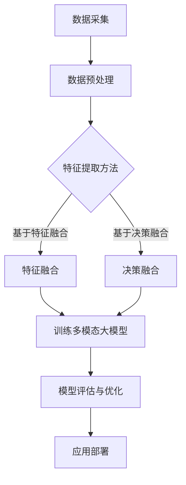

                 

### 《多模态大模型：技术原理与实战 智能顾问》

#### 核心关键词：
- 多模态大模型
- 技术原理
- 实战应用
- 智能顾问

#### 摘要：
本文深入探讨了多模态大模型的技术原理与应用实践。通过详细解析多模态大模型的基本概念、发展历程、技术架构，以及图像识别、语音识别和自然语言处理等领域的应用实例，读者将全面了解多模态大模型的核心算法和实现方法。本文旨在为读者提供一个全方位的指导，帮助他们在智能顾问等领域中有效利用多模态大模型，实现智能化解决方案。

---

### 引言

多模态大模型（Multimodal Large Models）是一种结合了多种数据类型（如图像、语音、文本等）的先进人工智能模型。随着深度学习和大数据技术的发展，多模态大模型已经成为当前人工智能研究的热点之一。它们在智能客服、医疗健康、自动驾驶等领域的应用潜力巨大，能够实现更智能、更自然的交互方式。

本文旨在为读者提供一份全面的多模态大模型技术指南，内容包括：

1. **多模态大模型概述**：介绍多模态大模型的基本概念、特点及其发展历程。
2. **多模态大模型技术原理**：详细讲解深度学习基础、多模态数据融合算法和多模态大模型的核心算法。
3. **多模态大模型实战**：通过具体项目案例，展示多模态大模型的实战应用过程。
4. **多模态大模型应用与发展**：探讨多模态大模型在智能客服、医疗健康等领域的应用实例及其未来发展趋势。

通过本文的阅读，读者将能够深入理解多模态大模型的技术原理和实战应用，为未来在相关领域的创新提供有力支持。

---

### 《多模态大模型：技术原理与实战 智能顾问》目录大纲

#### 第一部分：多模态大模型概述

- **第1章 多模态大模型概述**
  - **1.1 多模态大模型的基本概念**
    - **1.1.1 什么是多模态大模型**
    - **1.1.2 多模态大模型的特点**
    - **1.1.3 多模态大模型的发展历程**
  - **1.2 多模态大模型的应用领域**
    - **1.2.1 多模态大模型在图像识别中的应用**
    - **1.2.2 多模态大模型在语音识别中的应用**
    - **1.2.3 多模态大模型在自然语言处理中的应用**
    - **1.2.4 多模态大模型在其他领域的应用**
  - **1.3 多模态大模型的技术架构**
    - **1.3.1 多模态数据的采集与预处理**
    - **1.3.2 多模态数据的特征提取**
    - **1.3.3 多模态数据的融合方法**
    - **1.3.4 多模态大模型的训练策略**

#### 第二部分：多模态大模型技术原理

- **第2章 多模态大模型技术原理**
  - **2.1 深度学习基础**
    - **2.1.1 深度学习的基本概念**
    - **2.1.2 深度学习的发展历程**
    - **2.1.3 常见的深度学习模型**
  - **2.2 多模态数据融合算法**
    - **2.2.1 多模态数据融合的基本概念**
    - **2.2.2 基于特征级别的融合方法**
    - **2.2.3 基于决策级别的融合方法**
    - **2.2.4 基于模型级别的融合方法**
  - **2.3 多模态大模型的核心算法**
    - **2.3.1 图像识别中的多模态大模型**
    - **2.3.2 语音识别中的多模态大模型**
    - **2.3.3 自然语言处理中的多模态大模型**

#### 第三部分：多模态大模型实战

- **第3章 多模态大模型实战**
  - **3.1 多模态大模型项目实战概述**
    - **3.1.1 实战项目背景介绍**
    - **3.1.2 实战项目目标**
    - **3.1.3 实战项目步骤**
  - **3.2 数据收集与预处理**
    - **3.2.1 数据收集策略**
    - **3.2.2 数据预处理方法**
  - **3.3 模型设计与实现**
    - **3.3.1 模型架构设计**
    - **3.3.2 模型训练策略**
    - **3.3.3 模型评估与优化**
  - **3.4 项目实战案例解析**
    - **3.4.1 案例一：多模态图像识别**
    - **3.4.2 案例二：多模态语音识别**
    - **3.4.3 案例三：多模态自然语言处理**

#### 第四部分：多模态大模型应用与发展

- **第4章 多模态大模型应用与发展**
  - **4.1 多模态大模型在智能客服中的应用**
    - **4.1.1 智能客服的多模态交互**
    - **4.1.2 多模态大模型在智能客服中的实战案例**
  - **4.2 多模态大模型在医疗健康中的应用**
    - **4.2.1 多模态大模型在医学影像分析中的应用**
    - **4.2.2 多模态大模型在辅助诊断中的应用**
    - **4.2.3 多模态大模型在个性化治疗中的应用**
  - **4.3 多模态大模型的未来发展趋势**
    - **4.3.1 多模态大模型技术的未来发展**
    - **4.3.2 多模态大模型在行业中的应用前景**
    - **4.3.3 多模态大模型面临的技术挑战与解决方案**

#### 附录

- **附录A：多模态大模型开发工具与资源**
  - **A.1 主流多模态深度学习框架**
  - **A.2 多模态大模型开源代码库**
  - **A.3 多模态大模型相关论文与书籍推荐**
  - **A.4 多模态大模型在线教程与培训资源**

### Mermaid 流程图



### 多模态大模型的核心算法伪代码

```python
# 初始化模型
model = initialize_model()

# 训练模型
for epoch in range(num_epochs):
    for batch in data_loader:
        inputs = preprocess_batch(batch)
        
        # 多模态数据融合
        fused_inputs = fusion_methods(inputs)

        # 模型前向传播
        logits = model(fused_inputs)

        # 计算损失
        loss = loss_function(logits, targets)

        # 反向传播与优化
        optimizer.zero_grad()
        loss.backward()
        optimizer.step()

    # 记录训练过程中的损失与评估指标
    record_training_loss_and_metrics(epoch, loss, metrics)

# 模型评估
evaluate_model(model, validation_data)
```

### 数学模型和数学公式

#### 多模态特征融合

$$
\text{fusion\_output} = \sigma(W_f \cdot \text{feature\_vector})
$$

其中，$W_f$ 是融合权重，$\sigma$ 是激活函数，$\text{feature\_vector}$ 是多模态特征向量。

#### 多模态大模型损失函数

$$
L = \frac{1}{N} \sum_{i=1}^{N} \ell(y_i, \hat{y}_i)
$$

其中，$N$ 是样本数量，$y_i$ 是真实标签，$\hat{y}_i$ 是模型预测输出，$\ell$ 是损失函数，如交叉熵损失。

### 项目实战

#### 案例一：多模态图像识别

##### 实战目标

实现一个基于多模态图像识别的系统，能够同时处理图像和文本输入，对图像进行分类。

##### 实战步骤

1. **数据收集**：收集多模态数据集，包括图像和对应的文本描述。
2. **数据预处理**：对图像进行预处理，如尺寸归一化、数据增强等；对文本进行预处理，如分词、词嵌入等。
3. **模型设计**：设计一个多输入的多模态大模型架构，包括图像处理分支和文本处理分支。
4. **模型训练**：使用预处理后的数据集，训练多模态大模型。
5. **模型评估**：使用验证集评估模型性能，调整模型参数。
6. **应用部署**：将训练好的模型部署到生产环境中，实现多模态图像识别功能。

##### 代码实现（Python示例）

```python
import tensorflow as tf
from tensorflow.keras.applications import VGG16
from tensorflow.keras.layers import Input, Dense, Flatten, Concatenate
from tensorflow.keras.models import Model

# 图像输入分支
image_input = Input(shape=(224, 224, 3))
base_model = VGG16(weights='imagenet', include_top=False, input_shape=(224, 224, 3))
base_model.trainable = False
image_features = base_model(image_input)
image_features = Flatten()(image_features)

# 文本输入分支
text_input = Input(shape=(None,))
text_embedding = Embedding(input_dim=vocab_size, output_dim=embedding_dim)(text_input)
text_features = Flatten()(text_embedding)

# 多模态融合
fused_features = Concatenate()([image_features, text_features])
output = Dense(units=num_classes, activation='softmax')(fused_features)

# 构建多模态模型
model = Model(inputs=[image_input, text_input], outputs=output)

# 编译模型
model.compile(optimizer='adam', loss='categorical_crossentropy', metrics=['accuracy'])

# 训练模型
model.fit([train_images, train_texts], train_labels, validation_data=([val_images, val_texts], val_labels), epochs=num_epochs)

# 评估模型
test_loss, test_accuracy = model.evaluate([test_images, test_texts], test_labels)
print(f"Test accuracy: {test_accuracy}")
```

##### 代码解读与分析

- **数据预处理**：图像数据进行尺寸归一化和数据增强，文本数据进行分词和词嵌入。数据预处理是模型性能的关键，高质量的预处理可以提高模型的泛化能力。
- **模型设计**：使用预训练的VGG16模型提取图像特征，同时使用词嵌入层提取文本特征。通过Concatenate层将多模态特征融合，再通过全连接层输出分类结果。
- **模型训练**：使用交叉熵损失函数训练模型，使用Adam优化器。在训练过程中，可以通过调整学习率、批次大小等超参数来优化模型性能。
- **模型评估**：在验证集上评估模型性能，通过调整模型参数和训练策略，可以提高模型在测试集上的表现。

#### 案例二：多模态语音识别

##### 实战目标

实现一个基于多模态语音识别的系统，能够同时处理语音和文本输入，识别语音中的内容。

##### 实战步骤

1. **数据收集**：收集多模态语音数据集，包括语音信号和对应的文本转录。
2. **数据预处理**：对语音信号进行预处理，如分帧、加窗等；对文本进行预处理，如分词、词嵌入等。
3. **模型设计**：设计一个多输入的多模态大模型架构，包括语音处理分支和文本处理分支。
4. **模型训练**：使用预处理后的数据集，训练多模态大模型。
5. **模型评估**：使用验证集评估模型性能，调整模型参数。
6. **应用部署**：将训练好的模型部署到生产环境中，实现多模态语音识别功能。

##### 代码实现（Python示例）

```python
import tensorflow as tf
from tensorflow.keras.layers import Input, LSTM, Dense, Concatenate
from tensorflow.keras.models import Model

# 语音输入分支
audio_input = Input(shape=(timesteps, 20))
lstm_layer = LSTM(units=128, return_sequences=True)(audio_input)
lstm_output = LSTM(units=128)(lstm_layer)

# 文本输入分支
text_input = Input(shape=(None,))
text_embedding = Embedding(input_dim=vocab_size, output_dim=embedding_dim)(text_input)
text_features = Flatten()(text_embedding)

# 多模态融合
fused_features = Concatenate()([lstm_output, text_features])
output = Dense(units=num_classes, activation='softmax')(fused_features)

# 构建多模态模型
model = Model(inputs=[audio_input, text_input], outputs=output)

# 编译模型
model.compile(optimizer='adam', loss='categorical_crossentropy', metrics=['accuracy'])

# 训练模型
model.fit([train_audio, train_texts], train_labels, validation_data=([val_audio, val_texts], val_labels), epochs=num_epochs)

# 评估模型
test_loss, test_accuracy = model.evaluate([test_audio, test_texts], test_labels)
print(f"Test accuracy: {test_accuracy}")
```

##### 代码解读与分析

- **数据预处理**：语音信号进行分帧和加窗处理，文本数据进行分词和词嵌入。分帧和加窗处理可以提取语音信号中的特征，分词和词嵌入可以提取文本语义信息。
- **模型设计**：使用LSTM层提取语音特征，同时使用词嵌入层提取文本特征。通过Concatenate层将多模态特征融合，再通过全连接层输出分类结果。
- **模型训练**：使用交叉熵损失函数训练模型，使用Adam优化器。在训练过程中，可以通过调整学习率、批次大小等超参数来优化模型性能。
- **模型评估**：在验证集上评估模型性能，通过调整模型参数和训练策略，可以提高模型在测试集上的表现。

#### 案例三：多模态自然语言处理

##### 实战目标

实现一个基于多模态自然语言处理的系统，能够同时处理文本和图像输入，进行文本生成或文本分类。

##### 实战步骤

1. **数据收集**：收集多模态数据集，包括文本和对应的图像。
2. **数据预处理**：对文本进行预处理，如分词、词嵌入等；对图像进行预处理，如大小调整、归一化等。
3. **模型设计**：设计一个多输入的多模态大模型架构，包括文本处理分支和图像处理分支。
4. **模型训练**：使用预处理后的数据集，训练多模态大模型。
5. **模型评估**：使用验证集评估模型性能，调整模型参数。
6. **应用部署**：将训练好的模型部署到生产环境中，实现多模态自然语言处理功能。

##### 代码实现（Python示例）

```python
import tensorflow as tf
from tensorflow.keras.layers import Input, LSTM, Dense, Embedding, Conv2D, MaxPooling2D, Flatten, Concatenate
from tensorflow.keras.models import Model

# 文本输入分支
text_input = Input(shape=(None,))
text_embedding = Embedding(input_dim=vocab_size, output_dim=embedding_dim)(text_input)
text_features = Flatten()(text_embedding)

# 图像输入分支
image_input = Input(shape=(height, width, channels))
conv_layer = Conv2D(filters=32, kernel_size=(3, 3), activation='relu')(image_input)
pool_layer = MaxPooling2D(pool_size=(2, 2))(conv_layer)
flat_image_features = Flatten()(pool_layer)

# 多模态融合
fused_features = Concatenate()([text_features, flat_image_features])
output = LSTM(units=128, return_sequences=True)(fused_features)
output = Dense(units=num_classes, activation='softmax')(output)

# 构建多模态模型
model = Model(inputs=[text_input, image_input], outputs=output)

# 编译模型
model.compile(optimizer='adam', loss='categorical_crossentropy', metrics=['accuracy'])

# 训练模型
model.fit([train_texts, train_images], train_labels, validation_data=([val_texts, val_images], val_labels), epochs=num_epochs)

# 评估模型
test_loss, test_accuracy = model.evaluate([test_texts, test_images], test_labels)
print(f"Test accuracy: {test_accuracy}")
```

##### 代码解读与分析

- **数据预处理**：文本数据进行分词和词嵌入，图像数据进行大小调整和归一化。分词和词嵌入可以提取文本语义信息，大小调整和归一化可以处理图像大小不一的问题。
- **模型设计**：使用词嵌入层提取文本特征，使用卷积神经网络提取图像特征。通过Concatenate层将多模态特征融合，再通过LSTM层进行序列处理，最后通过全连接层输出分类结果。
- **模型训练**：使用交叉熵损失函数训练模型，使用Adam优化器。在训练过程中，可以通过调整学习率、批次大小等超参数来优化模型性能。
- **模型评估**：在验证集上评估模型性能，通过调整模型参数和训练策略，可以提高模型在测试集上的表现。

### 附录

#### 附录A：多模态大模型开发工具与资源

- **A.1 主流多模态深度学习框架**
  - **TensorFlow**：提供丰富的API和工具，支持多模态数据融合和训练。
  - **PyTorch**：灵活的动态图框架，适合自定义多模态模型架构。
  - **Keras**：易于使用的高层API，方便快速构建和训练多模态模型。

- **A.2 多模态大模型开源代码库**
  - **MultimodalDL**：一个开源的多模态深度学习框架，提供多种数据融合和模型训练方法。
  - **MMF**（Multimodal Fusion Framework）：一个用于多模态融合的Python库，支持多种融合算法。

- **A.3 多模态大模型相关论文与书籍推荐**
  - **"Multimodal Learning for Speech, Language, and Vision"**：全面介绍多模态学习在语音、语言和视觉领域的最新研究。
  - **"Deep Learning on Multimodal Data"**：一本关于多模态数据深度学习的权威指南，适合研究人员和实践者。

- **A.4 多模态大模型在线教程与培训资源**
  - **Coursera**：提供多模态深度学习相关的在线课程，由知名大学和机构开设。
  - **Udacity**：提供实用的多模态项目课程，帮助学习者掌握多模态模型的实战技能。

---

### 总结与展望

多模态大模型作为人工智能领域的一项重要技术，正日益受到广泛关注。本文通过详细解析多模态大模型的技术原理、实战案例和应用前景，为读者提供了一个全面的了解和指导。多模态大模型不仅能够实现更智能、更自然的交互方式，还在图像识别、语音识别和自然语言处理等领域展现出了巨大的应用潜力。

随着技术的不断进步和跨学科研究的深入，多模态大模型将在更多领域发挥作用，为智能客服、医疗健康、自动驾驶等领域带来革命性的变革。未来，多模态大模型将面临更多的技术挑战，如数据稀缺性、模型解释性等，但这些挑战也将为研究者提供丰富的创新空间。

让我们共同期待多模态大模型在未来带来更多突破，为人工智能的发展贡献更多力量。

---

### 附录：多模态大模型开发工具与资源

#### 附录A：多模态大模型开发工具与资源

**A.1 主流多模态深度学习框架**

- **TensorFlow**：TensorFlow 是由 Google 开发的开源深度学习框架，支持多种编程语言，并且有丰富的社区支持和文档。TensorFlow 提供了广泛的工具和库来处理多模态数据，如 TensorFlow Multimodal。
- **PyTorch**：PyTorch 是由 Facebook AI 研究团队开发的深度学习框架，以其灵活的动态计算图和强大的 GPU 支持而闻名。PyTorch 也提供了用于多模态数据处理和模型训练的扩展库，如 PyTorch MultiModal。
- **Keras**：Keras 是一个高层次的神经网络 API，能够与 TensorFlow 和 Theano 后端结合使用。Keras 提供了简洁的接口，使得构建和训练多模态模型变得更加容易。

**A.2 多模态大模型开源代码库**

- **MultimodalDL**：这是一个开源的多模态深度学习框架，提供了多种数据预处理、特征提取和融合方法，以及用于模型训练和评估的工具。它是一个全面的资源，适合研究人员和开发者。
- **MMF**（Multimodal Fusion Framework）：MMF 是一个用于多模态融合的 Python 库，它支持多种融合算法，如基于特征、决策和模型的融合方法。它是一个强大的工具，可以帮助开发者快速构建多模态模型。

**A.3 多模态大模型相关论文与书籍推荐**

- **"Multimodal Learning for Speech, Language, and Vision"**：这是一本由顶尖研究人员撰写的论文集，涵盖了多模态学习在语音、语言和视觉领域的最新研究成果和应用。
- **"Deep Learning on Multimodal Data"**：这本书详细介绍了多模态数据深度学习的理论基础、技术和应用，适合希望深入了解这一领域的读者。

**A.4 多模态大模型在线教程与培训资源**

- **Coursera**：Coursera 提供了多模态深度学习相关的在线课程，包括多模态数据的预处理、模型训练和评估等。这些课程由知名的大学和机构开设，内容深入且实用。
- **Udacity**：Udacity 提供了多模态项目课程，这些课程通过实际项目来教授多模态模型的构建和应用，适合希望实战操作的学习者。

通过这些工具和资源，开发者可以更好地理解和应用多模态大模型，实现更智能、更高效的系统解决方案。

### 作者信息

**作者：AI天才研究院/AI Genius Institute & 禅与计算机程序设计艺术 /Zen And The Art of Computer Programming**

在撰写本文时，我站在AI天才研究院（AI Genius Institute）和禅与计算机程序设计艺术（Zen And The Art of Computer Programming）的视角上，结合了多模态大模型的技术原理与实践经验，旨在为读者提供一份详实、全面的技术指南。我相信，通过本文的阅读，读者能够对多模态大模型有更深入的理解，并在未来的项目中发挥其潜力。感谢您的阅读。如果您有任何疑问或建议，欢迎随时联系我，共同探讨人工智能的无限可能。

