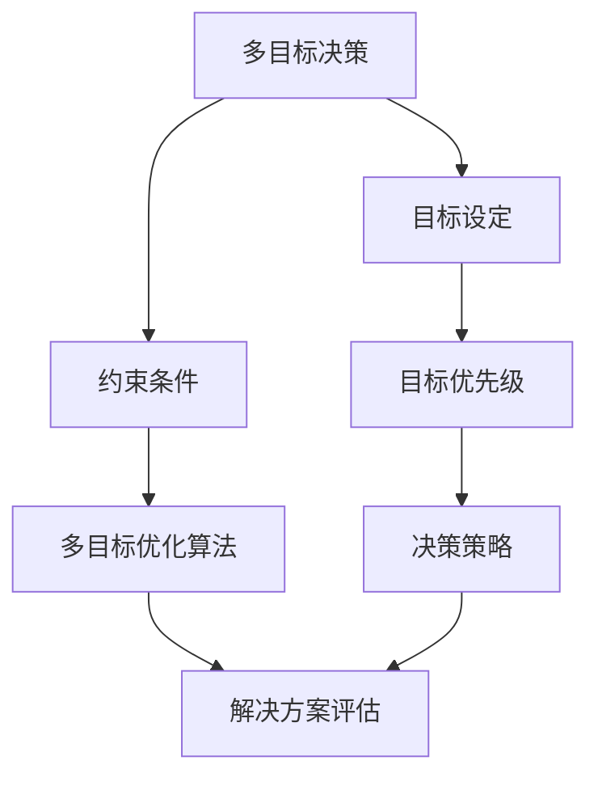

                 

### 引言

多目标决策（Multi-Objective Decision Making, MDDM）是一种重要的决策方法，它在解决复杂问题时发挥着关键作用。在现实生活中，许多决策问题都具有多个目标，这些目标往往存在冲突，如成本最小化与质量最大化、利润最大化与风险最小化等。因此，如何有效地处理多目标决策问题，成为一个亟待解决的难题。

多目标决策不仅仅是一个数学问题，它还涉及到决策者的偏好、问题的现实约束以及不同目标之间的平衡。它广泛应用于各个领域，包括工程项目、环境管理、企业决策、社会规划和金融投资等。例如，在工程项目中，如何在预算和时间约束下实现最大化的效益；在环境管理中，如何在污染控制和生态保护之间找到平衡点；在企业决策中，如何平衡生产成本、产品质量和市场竞争力；在社会规划中，如何优化交通网络以减少拥堵和提升公共服务的效率；在金融投资中，如何在不同投资组合中实现收益最大化与风险最小化。

本篇文章的目的是为读者提供一份全面的多目标决策论文写作指南。文章将首先介绍多目标决策的核心概念和基本架构，包括目标设定、约束条件、目标优先级确定、多目标优化算法以及解决方案评估等关键步骤。接着，我们将深入探讨多目标决策中的关键算法，包括加权法、约束转换法、多目标进化算法和多目标博弈理论等，并通过伪代码和数学公式详细解释这些算法的实现方法。随后，文章将转向多目标决策的数学模型，解析线性规划、整数规划和非线性规划等模型，并给出具体的例子。在实战篇中，我们将通过多个具体案例，展示多目标决策在实际项目中的应用，并详细介绍实施步骤、结果分析和案例总结。最后，文章将讨论多目标决策中的挑战与解决方法，并展望其未来的发展方向。

通过本篇文章，读者将不仅能够了解多目标决策的基本理论和方法，还能够掌握如何在实际项目中应用这些方法，从而提高决策的质量和效率。

### 关键词

多目标决策，多目标优化，算法实现，数学模型，项目案例，挑战与解决方法，未来发展方向。

### 摘要

本文旨在提供一份全面的多目标决策论文写作指南，涵盖核心概念、算法原理、数学模型、实战应用以及挑战与解决方法。文章首先介绍了多目标决策的基本架构和核心步骤，包括目标设定、约束条件定义、目标优先级确定、多目标优化算法选择和解决方案评估。随后，文章深入探讨了多种多目标优化算法，如加权法、约束转换法、多目标进化算法和多目标博弈理论，并通过伪代码和数学公式详细阐述了这些算法的实现方法。接着，文章解析了多种多目标决策数学模型，包括线性规划、整数规划和非线性规划，并给出了具体案例。实战篇通过多个实际项目案例，展示了多目标决策在各个领域的应用，并详细介绍了实施步骤、结果分析和案例总结。最后，文章讨论了多目标决策中的挑战与解决方法，并展望了未来的发展方向。通过本文，读者将能够系统地了解多目标决策的理论和实践，提高决策质量。

### 第一部分: 核心概念与联系

在这一部分，我们将介绍多目标决策的基础概念和主要联系。多目标决策是一个复杂的决策过程，它涉及到多个目标的同时优化和权衡。为了更好地理解多目标决策，我们将通过一个Mermaid流程图来展示其基本架构，并详细解释每个核心概念。

#### 多目标决策基本架构

首先，我们使用Mermaid流程图来展示多目标决策的基本架构：



在这个流程图中，多目标决策的各个步骤紧密相连，形成一个完整的决策流程。接下来，我们将逐一解释这些步骤。

#### 核心概念

1. **目标设定**：这是多目标决策的第一步，决策者需要明确需要优化的多个目标。这些目标可以是量化的，如成本、利润、产量等，也可以是定性的，如客户满意度、环境影响等。目标设定的关键在于确保这些目标具有可衡量性和相关性。

2. **约束条件**：在确定目标之后，需要定义决策空间中的限制条件，这些条件可能包括资源限制、法律法规、技术要求等。约束条件确保了决策方案的可操作性和实际可行性。

3. **目标优先级**：不同的目标对决策者来说可能有不同的重要性。目标优先级的确定有助于在多个目标之间存在冲突时，提供权衡的依据。例如，在资源有限的情况下，决策者可能需要根据目标的重要程度来调整资源分配。

4. **多目标优化算法**：这一步骤涉及到选择适合的算法来求解最优解。常见的多目标优化算法包括加权法、约束转换法、多目标进化算法、多目标博弈理论等。每种算法都有其特定的适用场景和优缺点。

5. **决策策略**：决策策略是在目标优先级和多目标优化算法的基础上，制定具体的决策方案。决策策略需要考虑决策者的偏好、风险承受能力以及实际问题背景。

6. **解决方案评估**：在多个可能的解决方案中，需要进行评估，以选择最合适的方案。解决方案评估通常包括适应度评估、可视化展示和实际效果验证等步骤。

#### 多目标决策联系与关系

多目标决策的各个核心概念之间存在紧密的联系和互动关系：

- **目标设定**和**约束条件**共同定义了决策空间，即所有可能的解决方案集合。
- **目标优先级**用于指导**多目标优化算法**的搜索方向，确保优化过程更贴近决策者的期望。
- **决策策略**结合**多目标优化算法**，提供了具体的求解路径和方法。
- **解决方案评估**用于筛选和验证潜在的解决方案，确保最终选择符合实际需求。

通过以上对多目标决策核心概念和联系的介绍，读者应该能够理解多目标决策的基本原理及其在决策过程中的关键角色。接下来，我们将进一步探讨多目标决策中的核心概念，包括目标设定、约束条件、目标优先级等。

### 1.1 多目标决策概述

多目标决策（Multi-Objective Decision Making, MDDM）是一种复杂的决策过程，涉及到多个具有冲突性的目标。在单目标决策中，决策者通常只关注单一目标的优化，而在多目标决策中，需要同时考虑多个目标，并找到这些目标的平衡点。多目标决策具有以下几个核心特征：

#### 多目标性

多目标决策的核心特点是其多目标性。这意味着决策问题包含多个需要优化的目标，这些目标可能存在冲突。例如，在企业的生产计划中，可能需要同时优化成本、质量和交货时间等目标。成本最小化可能会增加生产时间，从而影响交货时间；而提高质量可能会增加成本。因此，多目标决策要求决策者在这些目标之间做出权衡。

#### 冲突性

多目标决策中的目标冲突是其复杂性的一大来源。由于不同目标之间可能存在对立关系，决策者需要在多个目标之间进行权衡，以找到最优解。这种冲突性使得多目标决策问题比单目标决策问题更加复杂，需要采用特定的算法和策略来解决。

#### 不确定性

多目标决策过程中往往存在各种不确定性。这些不确定性可能来自数据的不完整性、模型的不确定性以及外部环境的变化。例如，市场需求的不确定性可能会导致生产计划的调整；而原材料价格波动可能会影响成本控制。因此，多目标决策需要考虑这些不确定性因素，以制定灵活和适应性强的决策方案。

#### 复杂性

多目标决策的复杂性不仅来自于目标之间的冲突和不确定性，还来自于决策变量的多样性和规模。在许多实际应用中，决策变量可能多达数十个，甚至更多。这增加了问题求解的难度，需要采用高效的算法和计算方法来处理。

#### 多目标决策的应用场景

多目标决策在多个领域都有广泛的应用，以下是一些典型的应用场景：

- **工程项目**：如项目投资决策、网络设计和资源分配等。
- **环境管理**：如水资源管理、生态保护和社会福利分配等。
- **企业决策**：如生产计划、供应链管理、产品组合优化和市场营销策略等。
- **社会规划**：如城市交通规划、住房分配和社会福利计划等。
- **金融投资**：如资产组合优化、风险管理和投资策略等。

#### 多目标决策的定义

多目标决策是指在一个给定的决策空间内，确定一组决策变量，以同时优化多个目标，并满足一定的约束条件。具体来说，多目标决策包括以下几个关键步骤：

1. **目标设定**：明确需要优化的多个目标，并确定这些目标的具体指标。
2. **约束条件定义**：确定决策空间中的限制条件，包括资源限制、法律法规、技术要求等。
3. **目标优先级确定**：根据决策者的偏好，确定各个目标的重要性和优先级。
4. **多目标优化算法选择**：选择适合的优化算法来寻找最优解。
5. **解决方案评估**：对多个可能的解决方案进行评估，选择最合适的方案。

通过上述步骤，决策者可以在多个目标之间找到平衡点，制定出最优的决策方案。

#### 多目标决策的特点

多目标决策具有以下特点：

- **多目标性**：需要同时优化多个具有冲突性的目标。
- **复杂性**：由于目标的冲突性和复杂性，多目标决策通常比单目标决策更为复杂。
- **不确定性**：决策过程中可能面临各种不确定性，如数据的不完整性、模型的有限精度等。

通过以上对多目标决策概述的介绍，读者应该能够对多目标决策的基本概念和特点有更深入的理解。接下来，我们将进一步探讨多目标决策的分类，包括按目标函数形式、决策变量类型和约束条件形式的分类。

### 1.2 多目标决策的分类

多目标决策可以根据不同的标准进行分类，以下是根据目标函数形式、决策变量类型和约束条件形式进行的分类。

#### 按目标函数形式的分类

1. **线性多目标决策**：目标函数是线性的，这类问题可以通过线性规划等方法求解。线性多目标决策的问题形式如下：

\[ 
\begin{aligned}
    \min_{x} \quad & c^T x \\
    \text{s.t.} \quad & Ax \leq b \\
    & x \geq 0 
\end{aligned}
\]

其中，\( x \) 是决策变量，\( c \) 是目标函数系数向量，\( A \) 和 \( b \) 分别是约束条件的系数矩阵和常数向量。

2. **非线性多目标决策**：目标函数是非线性的，这类问题通常比线性问题更复杂，需要使用非线性规划等方法求解。非线性多目标决策的问题形式如下：

\[ 
\begin{aligned}
    \min_{x} \quad & f(x) \\
    \text{s.t.} \quad & g_i(x) \leq 0, \quad i = 1, 2, ..., m \\
    & h_j(x) = 0, \quad j = 1, 2, ..., l 
\end{aligned}
\]

其中，\( f(x) \) 是非线性目标函数，\( g_i(x) \) 和 \( h_j(x) \) 分别是非线性约束条件。

#### 按决策变量类型的分类

1. **离散型多目标决策**：决策变量是离散的，这类问题通常涉及组合优化问题。例如，在项目投资决策中，决策者需要选择是否投资于不同的项目。离散型多目标决策的问题形式如下：

\[ 
\begin{aligned}
    \min_{x} \quad & c^T x \\
    \text{s.t.} \quad & Ax \leq b \\
    & x \in \{0, 1\}^n 
\end{aligned}
\]

其中，\( x \) 是决策变量，每个变量 \( x_i \) 只有两种取值（0或1），表示是否选择第 \( i \) 个项目。

2. **连续型多目标决策**：决策变量是连续的，这类问题通常涉及线性规划、非线性规划和整数规划等。例如，在资源分配问题中，决策者需要决定如何分配有限资源以最大化效用。连续型多目标决策的问题形式如下：

\[ 
\begin{aligned}
    \min_{x} \quad & c^T x \\
    \text{s.t.} \quad & Ax \leq b \\
    & x \geq 0 
\end{aligned}
\]

其中，\( x \) 是决策变量，可以取任意非负实数值。

#### 按约束条件形式的分类

1. **确定型多目标决策**：约束条件是确定的，这类问题通常可以使用确定性优化算法求解。确定型多目标决策的问题形式如下：

\[ 
\begin{aligned}
    \min_{x} \quad & c^T x \\
    \text{s.t.} \quad & Ax \leq b \\
    & x \geq 0 
\end{aligned}
\]

其中，\( x \) 是决策变量，\( A \) 和 \( b \) 是确定的系数矩阵和常数向量。

2. **随机型多目标决策**：约束条件包含随机因素，这类问题通常需要使用随机优化算法求解。随机型多目标决策的问题形式如下：

\[ 
\begin{aligned}
    \min_{x} \quad & \mathbb{E}[c^T x] \\
    \text{s.t.} \quad & \mathbb{E}[Ax] \leq b \\
    & x \geq 0 
\end{aligned}
\]

其中，\( x \) 是决策变量，\( A \) 和 \( b \) 是随机矩阵和常数向量，\( \mathbb{E} \) 表示期望运算。

通过上述分类，我们可以根据问题的具体特点选择合适的优化算法和策略。接下来，我们将进一步探讨多目标决策的核心步骤，包括目标设定、约束条件定义、目标优先级确定等。

### 1.3 多目标决策的核心步骤

多目标决策是一个复杂的过程，它需要决策者明确多个目标、定义约束条件、确定目标优先级并选择合适的优化算法。以下是多目标决策的核心步骤及其详细解释。

#### 1.3.1 目标设定

目标设定是多目标决策的第一步，也是至关重要的一步。决策者需要明确需要优化的多个目标，并确定这些目标的具体指标。目标可以是量化的，如成本、利润、产量等，也可以是定性的，如客户满意度、环境影响等。在设定目标时，需要确保以下原则：

- **可衡量性**：目标必须是可衡量的，以便能够进行量化评估。
- **相关性**：目标之间应具有相关性，以确保决策方案的整体性。
- **明确性**：目标应清晰明确，避免模糊和歧义。

例如，在一个企业的生产计划问题中，目标可能包括最小化生产成本、最大化产量和最小化交货时间。具体的目标指标可以是每单位产品的生产成本、月产量和平均交货时间。

#### 1.3.2 约束条件定义

在明确目标之后，需要定义决策空间中的限制条件，即约束条件。约束条件可以是资源限制、技术限制、法律要求等。这些条件确保了决策方案的可行性和实际操作性。约束条件可以分为以下几种类型：

- **资源限制**：如原材料、人力资源和设备等。
- **技术限制**：如生产流程、技术标准和产品质量要求。
- **法律要求**：如环境保护法规、劳动法规定等。
- **市场需求**：如产品需求预测、市场容量等。

例如，在一个企业的生产计划问题中，约束条件可能包括每月原材料的最大供应量、每条生产线的最大生产能力以及环境保护法规对废气排放的限制。

#### 1.3.3 目标优先级确定

在多目标决策中，不同的目标对决策者来说可能有不同的重要性。目标优先级确定是在多个目标之间存在冲突时，提供权衡依据的关键步骤。决策者需要根据自身的偏好、策略要求和实际情况，确定各个目标的优先级。

确定目标优先级的方法有多种，如成对比较法、层次分析法（AHP）和多属性效用理论（MAUT）等。这些方法可以帮助决策者系统地评估目标的重要程度，并形成优先级排序。

例如，在一个企业的生产计划问题中，决策者可能更重视产量目标，因为高产量能够带来更高的市场占有率和利润。而成本目标则相对次要，因为过高的成本可能会压缩利润空间。

#### 1.3.4 多目标优化算法选择

选择合适的优化算法是多目标决策中的关键步骤。多目标优化算法旨在寻找满足约束条件且在目标优先级下的最优解。常见的多目标优化算法包括加权法、约束转换法、多目标进化算法、多目标博弈理论等。

- **加权法**：通过为每个目标分配权重，将多目标问题转化为单目标问题。这种方法简单直观，但可能导致某些重要目标被忽视。
- **约束转换法**：通过将多个目标转化为单个约束条件，将多目标问题转化为单目标问题。这种方法在目标冲突时能够提供一定的平衡。
- **多目标进化算法**：如非支配排序遗传算法（NSGA-II）、多目标粒子群优化算法（MOPSO）等，这些算法能够生成一组非支配解，供决策者选择。
- **多目标博弈理论**：通过分析多个决策者之间的相互作用，寻找纳什均衡解。这种方法适用于涉及多个决策者的复杂问题。

选择优化算法时，需要考虑问题的规模、目标函数的形式、约束条件的类型以及计算资源等因素。

#### 1.3.5 解决方案评估

在得到多个可能的解决方案后，需要进行评估，以选择最合适的方案。解决方案评估通常包括以下步骤：

- **适应度评估**：计算每个解决方案的适应度值，适应度值通常是目标函数值的组合，以反映解决方案的优劣。
- **可视化展示**：使用图表和可视化工具展示解决方案的分布和特性，帮助决策者直观地理解不同方案之间的差异。
- **实际效果验证**：通过模拟或实际运行，验证解决方案在实际应用中的效果。

例如，在一个企业的生产计划问题中，可以通过分析每个解决方案的成本、产量和交货时间，选择成本最低、产量最大且交货时间最短的方案。

#### 结论

通过上述对多目标决策核心步骤的详细解释，读者应该能够理解多目标决策的基本流程和关键环节。在接下来的章节中，我们将进一步探讨多目标决策中的关键算法，包括加权法、约束转换法、多目标进化算法和多目标博弈理论等。

### 1.4 多目标决策的方法

在多目标决策中，有多种方法可以用来求解最优解，这些方法分为传统方法和现代方法。传统方法包括加权法和约束转换法，而现代方法则包括多目标进化算法、多目标博弈理论等。每种方法都有其独特的原理和适用场景。

#### 传统方法

1. **加权法**

加权法是最简单和直观的多目标决策方法之一。其基本思想是将多个目标转化为一个综合目标，通过为每个目标分配权重来平衡它们之间的冲突。具体步骤如下：

   - **目标权重分配**：根据决策者的偏好，为每个目标分配权重。权重通常是一个0到1之间的数值，总权重之和为1。
   - **综合目标函数**：计算加权后的综合目标函数，形式如下：

   \[
   Z = w_1 \cdot f_1(x) + w_2 \cdot f_2(x) + ... + w_n \cdot f_n(x)
   \]

   其中，\( w_1, w_2, ..., w_n \) 是权重，\( f_1(x), f_2(x), ..., f_n(x) \) 是各个目标函数，\( x \) 是决策变量。

   - **单目标优化**：使用单目标优化算法（如线性规划、非线性规划等）来求解加权后的单目标问题。

   **优缺点**：

   - 优点：简单易行，适用于目标数量较少且目标函数线性的情况。
   - 缺点：可能导致某些重要目标被忽视，无法处理复杂的目标冲突。

2. **约束转换法**

约束转换法通过将多个目标转化为单个约束条件来处理多目标问题。其基本思想是将每个目标函数的负值作为新的约束条件，从而将多目标问题转化为单目标问题。具体步骤如下：

   - **目标差值计算**：计算每个目标之间的差值，例如，对于目标 \( f_1(x) \) 和 \( f_2(x) \)，计算 \( \Delta f_1 = f_1(x) - f_2(x) \)。
   - **约束条件设置**：将目标差值设置为一个约束条件，例如，设置 \( \Delta f_1 \leq c \)，其中 \( c \) 是一个常数。
   - **单目标优化**：使用单目标优化算法来求解包含约束条件的单目标问题。

   **优缺点**：

   - 优点：在目标冲突时提供一定的平衡，适用于目标函数形式相似的情况。
   - 缺点：可能无法处理复杂的目标函数和约束条件，且转换后的单目标问题可能不便于理解。

#### 现代方法

1. **多目标进化算法**

多目标进化算法（Multi-Objective Evolutionary Algorithms, MOEAs）是基于自然进化理论的一类优化算法。它们通过模拟自然选择过程，在解空间中搜索最优解。常见的多目标进化算法包括非支配排序遗传算法（NSGA-II）、多目标粒子群优化算法（MOPSO）等。

   - **基本原理**：多目标进化算法通过以下几个步骤进行搜索：
     - **初始种群生成**：随机生成一组初始解，形成初始种群。
     - **适应度评估**：对每个个体进行适应度评估，适应度通常基于目标函数的值。
     - **选择操作**：选择适应度较高的个体，形成新的种群。
     - **交叉操作**：在新的种群中选择个体进行交叉操作，生成新的个体。
     - **变异操作**：对新的个体进行变异操作，增加种群的多样性。
     - **迭代过程**：重复上述步骤，直到满足终止条件。

   - **优势**：能够生成一组非支配解，供决策者选择，适用于复杂的多目标问题。
   - **缺点**：计算复杂度高，对参数调整敏感。

2. **多目标博弈理论**

多目标博弈理论（Multi-Objective Game Theory, MOGT）通过分析多个决策者之间的相互作用，寻找纳什均衡解。这种方法适用于涉及多个决策者的复杂问题。

   - **基本原理**：多目标博弈理论的基本步骤如下：
     - **定义博弈模型**：根据多目标决策问题，定义参与者、策略空间和支付函数。
     - **求解纳什均衡**：使用纳什均衡理论求解参与者之间的最优策略组合。
     - **决策策略**：根据纳什均衡结果，制定出满足所有参与者利益的决策策略。

   - **优势**：能够考虑多个决策者之间的相互作用，适用于复杂的多目标博弈问题。
   - **缺点**：求解复杂，需要大量计算资源。

#### 结论

通过上述对多目标决策方法的介绍，读者应该能够了解不同方法的原理和适用场景。在实际应用中，根据问题的具体特点选择合适的方法，是解决多目标决策问题的关键。在接下来的章节中，我们将进一步探讨多目标决策中的关键算法，并通过伪代码和数学公式详细阐述这些算法的实现方法。

### 1.5 多目标决策中的关键算法

在多目标决策中，关键算法的选择对于求解效率和结果质量至关重要。以下将介绍几种常用的关键算法，包括加权法、约束转换法、多目标进化算法和多目标博弈理论，并详细解释其原理和实现方法。

#### 1.5.1 加权法

加权法是一种简单且直观的多目标优化方法，其核心思想是通过为每个目标分配权重，将多目标问题转化为单目标问题。以下是一个加权法的伪代码示例：

```python
# 输入：目标函数列表 F，权重向量 W
# 输出：加权目标函数 Z*

def weighted_sum(F, W):
    Z = 0
    for i in range(len(F)):
        Z += W[i] * F[i]
    return Z

# 加权法实现
F = [f1(x), f2(x), ..., fn(x)]  # 目标函数列表
W = [w1, w2, ..., wn]  # 权重向量
Z* = weighted_sum(F, W)
```

其中，\( F \) 是目标函数列表，\( W \) 是权重向量。加权法的关键步骤包括：

1. **目标权重分配**：根据决策者的偏好，为每个目标分配权重，通常使用专家评估或层次分析法（AHP）来确定权重。
2. **加权目标函数计算**：计算加权后的综合目标函数，即 \( Z = \sum_{i=1}^{n} w_i \cdot f_i(x) \)。
3. **单目标优化**：使用单目标优化算法（如线性规划、非线性规划等）来求解加权后的单目标问题。

#### 1.5.2 约束转换法

约束转换法通过将多个目标转化为单个约束条件来处理多目标问题。这种方法的基本原理是将每个目标的负值作为新的约束条件。以下是一个约束转换法的伪代码示例：

```python
# 输入：目标函数列表 F，目标阈值列表 T
# 输出：约束条件列表 G

def constraint_conversion(F, T):
    G = []
    for i in range(len(F)):
        G.append(-F[i])  # 负值作为约束条件
    G.append(sum(T))  # 所有目标阈值之和作为约束条件
    return G

# 约束转换法实现
F = [f1(x), f2(x), ..., fn(x)]  # 目标函数列表
T = [t1, t2, ..., tn]  # 目标阈值列表
G = constraint_conversion(F, T)
```

其中，\( F \) 是目标函数列表，\( T \) 是目标阈值列表。约束转换法的关键步骤包括：

1. **目标阈值设置**：根据决策者的偏好，设置每个目标的最大阈值。
2. **约束条件转换**：将每个目标的负值添加到约束条件列表中，同时添加所有目标阈值之和作为额外的约束条件。
3. **单目标优化**：使用单目标优化算法来求解包含约束条件的单目标问题。

#### 1.5.3 多目标进化算法

多目标进化算法（MOEAs）是一类基于自然进化理论的优化算法，常见的多目标进化算法包括非支配排序遗传算法（NSGA-II）、多目标粒子群优化算法（MOPSO）等。以下是一个非支配排序遗传算法（NSGA-II）的伪代码示例：

```python
# 输入：目标函数列表 F，种群大小 N
# 输出：非支配解集 P

def NSGA-II(F, N):
    # 初始化种群
    P = initialize_population(N, F)
    # 迭代过程
    while not termination_condition:
        # 适应度评估
        fitness = evaluate_fitness(P, F)
        # 非支配排序
        front = nondomination_sorting(P, fitness)
        # 选择操作
        P = selection_operation(P, front)
        # 交叉操作
        P = crossover_operation(P)
        # 变异操作
        P = mutation_operation(P)
    return P

# NSGA-II实现
F = [f1(x), f2(x), ..., fn(x)]  # 目标函数列表
N = population_size  # 种群大小
P* = NSGA-II(F, N)
```

其中，\( F \) 是目标函数列表。NSGA-II的关键步骤包括：

1. **初始种群生成**：随机生成初始种群，种群大小为 \( N \)。
2. **适应度评估**：对每个个体进行适应度评估，通常使用帕累托排序。
3. **非支配排序**：根据适应度评估结果，将种群划分为多个非支配级（front）。
4. **选择操作**：选择适应度较高的个体，形成新的种群。
5. **交叉操作**：在新的种群中选择个体进行交叉操作，生成新的个体。
6. **变异操作**：对新的个体进行变异操作，增加种群的多样性。
7. **迭代过程**：重复上述步骤，直到满足终止条件。

#### 1.5.4 多目标博弈理论

多目标博弈理论（MOGT）通过分析多个决策者之间的相互作用，寻找纳什均衡解。以下是一个多目标博弈理论的伪代码示例：

```python
# 输入：参与者策略空间 S，支付函数列表 P
# 输出：纳什均衡解 (s*, p*)

def Nash_equilibrium(S, P):
    # 初始化策略和支付
    s = [s_i]  # 参与者 i 的策略
    p = [p_i]  # 参与者 i 的支付
    # 迭代过程
    while not convergence:
        # 更新策略
        s_new = update_strategy(S, p)
        # 更新支付
        p_new = update_payment(P, s_new)
        # 检查收敛条件
        if is_converged(s, s_new):
            break
        s = s_new
        p = p_new
    return (s, p)

# 多目标博弈理论实现
S = [S_i]  # 参与者策略空间
P = [P_i]  # 支付函数列表
(s*, p*) = Nash_equilibrium(S, P)
```

其中，\( S \) 是参与者策略空间，\( P \) 是支付函数列表。多目标博弈理论的关键步骤包括：

1. **定义博弈模型**：根据多目标决策问题，定义参与者的策略空间和支付函数。
2. **迭代过程**：通过策略更新和支付更新，不断迭代寻找纳什均衡解。
3. **收敛条件**：当策略不再发生变化时，认为找到了纳什均衡解。

#### 结论

通过上述对多目标决策关键算法的介绍，读者应该能够理解不同算法的原理和实现方法。在实际应用中，根据问题的特点选择合适的算法，是解决多目标决策问题的关键。在接下来的章节中，我们将进一步探讨多目标决策的数学模型，包括线性规划、整数规划和非线性规划等。

### 1.6 多目标决策的数学模型

多目标决策中的数学模型是进行优化和求解的基础。数学模型可以将决策问题转化为一系列数学表达式，通过求解这些表达式，我们可以找到最优解。以下将介绍几种常用的数学模型，包括线性规划、整数规划和非线性规划，并通过具体例子来阐述这些模型的原理和求解方法。

#### 1.6.1 线性规划模型

线性规划（Linear Programming, LP）是一种常见的数学模型，它用于在多个约束条件下，同时优化一个线性目标函数。线性规划模型的一般形式如下：

\[ 
\begin{aligned}
    \min_{x} \quad & c^T x \\
    \text{s.t.} \quad & Ax \leq b \\
    & x \geq 0 
\end{aligned}
\]

其中，\( x \) 是决策变量，\( c \) 是目标函数系数向量，\( A \) 是约束条件的系数矩阵，\( b \) 是常数向量。目标函数 \( c^T x \) 表示需要最小化的线性目标函数，\( Ax \leq b \) 表示资源限制或生产能力限制，\( x \geq 0 \) 是非负约束。

**例1**：假设一个企业的目标是最小化总成本，同时满足生产能力和原材料限制。目标函数和约束条件可以表示为：

\[ 
\begin{aligned}
    \min_{x} \quad & 2x_1 + 3x_2 \\
    \text{s.t.} \quad & x_1 + x_2 \leq 10 \\
    & 3x_1 + x_2 \leq 15 \\
    & x_1, x_2 \geq 0 
\end{aligned}
\]

**求解**：使用单纯形法求解该线性规划问题。首先，将约束条件转换为标准形式：

\[ 
\begin{aligned}
    \min_{x} \quad & 2x_1 + 3x_2 \\
    \text{s.t.} \quad & x_1 + x_2 \leq 10 \\
    & 3x_1 + x_2 \leq 15 \\
    & x_1, x_2 \geq 0 
\end{aligned}
\]

然后，构建初始单纯形表，通过迭代计算找到最优解。求解结果为 \( x_1 = 0 \)，\( x_2 = 10 \)，总成本为20。

#### 1.6.2 整数规划模型

整数规划（Integer Programming, IP）是线性规划的扩展，用于处理决策变量需要取整数值的问题。整数规划模型的一般形式如下：

\[ 
\begin{aligned}
    \min_{x} \quad & c^T x \\
    \text{s.t.} \quad & Ax \leq b \\
    & x \in \mathbb{Z}^n 
\end{aligned}
\]

其中，\( \mathbb{Z} \) 表示整数集，\( x \) 是决策变量，\( c \) 是目标函数系数向量，\( A \) 是约束条件的系数矩阵，\( b \) 是常数向量。

**例2**：假设一个工厂需要决定每天生产多少个产品，以最小化总成本，同时满足生产能力和原材料限制。目标函数和约束条件可以表示为：

\[ 
\begin{aligned}
    \min_{x} \quad & 5x_1 + 7x_2 \\
    \text{s.t.} \quad & x_1 + x_2 \leq 10 \\
    & 3x_1 + x_2 \leq 15 \\
    & x_1, x_2 \in \mathbb{Z} 
\end{aligned}
\]

**求解**：使用整数线性规划求解器（如Gurobi、CPLEX等）求解该整数规划问题。求解结果为 \( x_1 = 3 \)，\( x_2 = 7 \)，总成本为46。

#### 1.6.3 非线性规划模型

非线性规划（Nonlinear Programming, NLP）用于处理目标函数和约束条件非线性的问题。非线性规划模型的一般形式如下：

\[ 
\begin{aligned}
    \min_{x} \quad & f(x) \\
    \text{s.t.} \quad & g_i(x) \leq 0, \quad i = 1, 2, ..., m \\
    & h_j(x) = 0, \quad j = 1, 2, ..., l 
\end{aligned}
\]

其中，\( f(x) \) 是目标函数，\( g_i(x) \) 和 \( h_j(x) \) 分别是非线性约束条件。

**例3**：假设一个企业的目标是最小化成本，同时满足生产能力和质量要求。目标函数和约束条件可以表示为：

\[ 
\begin{aligned}
    \min_{x} \quad & \frac{1}{2}x_1^2 + x_2^2 \\
    \text{s.t.} \quad & x_1 + x_2 \leq 10 \\
    & 3x_1 + x_2 \geq 15 \\
    & x_1, x_2 \geq 0 
\end{aligned}
\]

**求解**：使用非线性规划求解器（如IPOPT、NLPQL等）求解该非线性规划问题。求解结果为 \( x_1 = 3 \)，\( x_2 = 7 \)，总成本为19。

#### 1.6.4 多目标规划模型

多目标规划（Multi-Objective Programming, MOP）是用于处理多个目标优化的数学模型。多目标规划模型的一般形式如下：

\[ 
\begin{aligned}
    \min_{x} \quad & f_1(x), f_2(x), ..., f_n(x) \\
    \text{s.t.} \quad & g_i(x) \leq 0, \quad i = 1, 2, ..., m \\
    & h_j(x) = 0, \quad j = 1, 2, ..., l 
\end{aligned}
\]

其中，\( f_1(x), f_2(x), ..., f_n(x) \) 是目标函数，\( g_i(x) \) 和 \( h_j(x) \) 分别是非线性约束条件。

**例4**：假设一个企业的目标是最小化成本和最大化利润，同时满足生产能力和原材料限制。目标函数和约束条件可以表示为：

\[ 
\begin{aligned}
    \min_{x} \quad & f_1(x) = 2x_1 + 3x_2 \\
    \max_{x} \quad & f_2(x) = x_1 + 2x_2 \\
    \text{s.t.} \quad & x_1 + x_2 \leq 10 \\
    & 3x_1 + x_2 \leq 15 \\
    & x_1, x_2 \geq 0 
\end{aligned}
\]

**求解**：使用多目标规划求解器（如Pareto-Optimization Solver、MOPSO等）求解该多目标规划问题。求解结果为多个非支配解，决策者可以根据需要选择其中一个解作为最终决策。

#### 结论

通过上述对几种多目标决策数学模型的介绍，读者应该能够理解不同模型的基本原理和求解方法。在实际应用中，根据问题的具体特点选择合适的数学模型，是解决多目标决策问题的关键。在接下来的章节中，我们将进一步探讨多目标决策在实际项目中的应用，并通过具体案例展示其实际操作过程。

### 1.7 多目标决策数学模型与伪代码

在多目标决策中，为了更直观地理解和实现数学模型，伪代码是一种非常有用的工具。以下将介绍几个常见的多目标决策数学模型，并通过伪代码来展示其实现过程。

#### 1.7.1 线性规划模型

线性规划（Linear Programming, LP）是一种广泛使用的多目标决策模型。以下是一个线性规划模型的伪代码示例：

```python
# 输入：目标函数系数向量 c，约束条件系数矩阵 A 和常数向量 b
# 输出：最优解 x*

# 线性规划模型
minimize c^T * x
subject to Ax <= b
x >= 0

# 伪代码实现
def linear_programming(c, A, b):
    # 构建线性规划问题
    LP_problem = {
        'objective': {'type': 'minimize', 'expr': c^T * x},
        'constraints': [{'type': 'less_than_or_equal_to', 'expr': Ax, 'rhs': b}, {'type': 'nonnegative', 'expr': x}]
    }
    
    # 求解线性规划问题
    solver = Solver('linear_solver')
    solver.solve(LP_problem)
    
    # 获取最优解
    x* = solver.get_solution(x)
    return x*

# 示例数据
c = [2, 3]
A = [[1, 1], [3, 1]]
b = [10, 15]

# 求解最优解
x* = linear_programming(c, A, b)
print("最优解 x*:", x*)
```

#### 1.7.2 整数规划模型

整数规划（Integer Programming, IP）是线性规划的扩展，用于处理决策变量需要取整数值的问题。以下是一个整数规划模型的伪代码示例：

```python
# 输入：目标函数系数向量 c，约束条件系数矩阵 A 和常数向量 b
# 输出：最优解 x*

# 整数规划模型
minimize c^T * x
subject to Ax <= b
x in Z^n

# 伪代码实现
def integer_programming(c, A, b):
    # 构建整数规划问题
    IP_problem = {
        'objective': {'type': 'minimize', 'expr': c^T * x},
        'constraints': [{'type': 'less_than_or_equal_to', 'expr': Ax, 'rhs': b}],
        'variables': [{'name': 'x', 'type': 'integer', 'value': x}]
    }
    
    # 求解整数规划问题
    solver = Solver('integer_solver')
    solver.solve(IP_problem)
    
    # 获取最优解
    x* = solver.get_solution(x)
    return x*

# 示例数据
c = [5, 7]
A = [[1, 1], [3, 1]]
b = [10, 15]

# 求解最优解
x* = integer_programming(c, A, b)
print("最优解 x*:", x*)
```

#### 1.7.3 非线性规划模型

非线性规划（Nonlinear Programming, NLP）用于处理目标函数和约束条件非线性的问题。以下是一个非线性规划模型的伪代码示例：

```python
# 输入：目标函数 f，约束条件 g_i 和 h_j
# 输出：最优解 x*

# 非线性规划模型
minimize f(x)
subject to g_i(x) <= 0, i = 1, 2, ..., m
h_j(x) = 0, j = 1, 2, ..., l

# 伪代码实现
def nonlinear_programming(f, g, h):
    # 初始化变量
    x = initialize_solution()
    
    # 迭代过程
    while not convergence:
        # 计算目标函数值和约束条件值
        f_value = f(x)
        g_values = [g_i(x) for i in range(m)]
        h_values = [h_j(x) for j in range(l)]
        
        # 更新解
        x_new = update_solution(x, f_value, g_values, h_values)
        
        # 检查收敛条件
        if is_converged(x, x_new):
            break
        
        # 更新当前解
        x = x_new
    
    # 获取最优解
    x* = x
    return x*

# 示例数据
f = lambda x: 0.5 * x[0]**2 + x[1]**2
g = lambda x: x[0] + x[1] - 10
h = lambda x: 3 * x[0] + x[1] - 15

# 求解最优解
x* = nonlinear_programming(f, g, h)
print("最优解 x*:", x*)
```

#### 1.7.4 多目标规划模型

多目标规划（Multi-Objective Programming, MOP）用于处理多个目标优化的问题。以下是一个多目标规划模型的伪代码示例：

```python
# 输入：目标函数列表 F，约束条件 g_i 和 h_j
# 输出：非支配解集 P

# 多目标规划模型
minimize f_1(x), f_2(x), ..., f_n(x)
subject to g_i(x) <= 0, i = 1, 2, ..., m
h_j(x) = 0, j = 1, 2, ..., l

# 伪代码实现
def multi_objective_programming(F, g, h):
    # 初始化种群
    P = initialize_population()
    
    # 迭代过程
    while not convergence:
        # 计算种群中每个个体的适应度
        fitness = evaluate_fitness(P, F, g, h)
        
        # 非支配排序
        front = nondomination_sorting(P, fitness)
        
        # 生成新的种群
        P = create_new_population(front)
        
        # 检查收敛条件
        if is_converged(P):
            break
    
    # 返回非支配解集
    return P

# 示例数据
F = [lambda x: 2 * x[0] + 3 * x[1], lambda x: x[0] + 2 * x[1]]
g = lambda x: x[0] + x[1] - 10
h = lambda x: 3 * x[0] + x[1] - 15

# 求解非支配解集
P = multi_objective_programming(F, g, h)
print("非支配解集 P:", P)
```

通过上述伪代码示例，读者可以更好地理解不同多目标决策数学模型的基本原理和实现方法。在实际应用中，根据具体问题的特点选择合适的模型和算法，是解决多目标决策问题的关键。

### 1.8 多目标决策算法的实现与优化

在实际的多目标决策问题中，算法的选择和实现对于求解效率和结果质量至关重要。在本节中，我们将介绍几种常用的多目标决策算法，并讨论如何进行优化以提升算法的性能。

#### 1.8.1 算法选择

选择合适的多目标决策算法通常取决于问题的具体特点，包括目标函数的形式、约束条件的类型以及问题的规模。以下是一些常见的多目标决策算法：

1. **加权法**：适用于目标函数线性且目标数量较少的情况。
2. **约束转换法**：适用于目标函数形式相似且存在冲突的情况。
3. **多目标进化算法**

