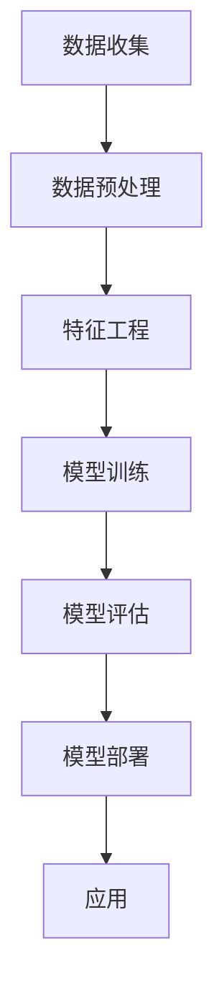

                 

### 第1章：大数据分析与客户终身价值（LTV）概述

#### 1.1 大数据分析的基本概念
- **概念定义**：大数据是指数据量巨大、类型多样且产生速度极快的海量数据。数据挖掘是从大量数据中提取有价值信息的过程。数据分析则是使用统计和数学方法对数据进行分析，以发现数据中的规律和趋势。
- **特点与挑战**：大数据的四个V特性，即Volume（数据量）、Velocity（数据速度）、Variety（数据多样性）和Veracity（数据真实性），使得数据分析面临数据存储、处理和分析的挑战。如何在保证数据质量的前提下，快速有效地从海量数据中提取有价值的信息，是大数据分析的核心问题。

#### 1.2 客户终身价值（LTV）的定义与重要性
- **LTV定义**：客户终身价值（Lifetime Value, LTV）是指一个客户在其整个生命周期内为公司带来的总收益。它是一个重要的商业指标，可以帮助企业了解客户的潜在价值和投资回报。
- **重要性分析**：LTV对于企业的营销决策、资源配置和业务战略具有指导意义。通过准确预测客户的LTV，企业可以优化营销策略，提高客户忠诚度，从而实现利润最大化。LTV还帮助企业识别高价值客户，制定个性化的服务和优惠策略，提升客户满意度和留存率。

#### 1.3 大数据分析在LTV预测中的应用
- **应用场景**：大数据分析在客户终身价值预测中的应用场景广泛，包括市场营销、客户关系管理、风险管理和战略规划等。通过大数据分析，企业可以深入了解客户的消费行为、偏好和需求，从而预测客户的LTV。
- **优势分析**：大数据分析能够处理大量异构数据，通过整合和分析，提供更为准确和全面的客户LTV预测。同时，大数据分析技术如机器学习和深度学习，能够从复杂的数据中发现潜在的模式和关联，提升预测的准确性和效率。

### 第2章：LTV预测模型的架构与流程

#### 2.1 LTV预测模型的总体架构
- **模块组成**：LTV预测模型通常包括数据收集、数据预处理、特征工程、模型训练、模型评估与部署等模块。
- **模型架构图**：下面是一个简化的LTV预测模型架构图，使用Mermaid语法表示。



#### 2.2 数据收集与预处理
- **数据来源**：数据收集可以从企业内部系统、第三方数据提供商和社交媒体等渠道获取。
  - **内部数据**：如客户交易记录、订单信息、客户反馈等。
  - **外部数据**：如人口统计信息、市场趋势、竞争情报等。
  - **社交媒体数据**：如社交媒体帖子、评论、点赞等。
- **数据预处理**：数据预处理是模型训练前的重要步骤，包括数据清洗、缺失值处理、数据整合和数据规范化等。

#### 2.3 特征工程
- **特征提取**：特征提取是指从原始数据中提取有助于预测模型训练的特征。
  - **行为特征**：如购买频率、购买金额、购买时长等。
  - **人口统计特征**：如年龄、性别、收入水平、职业等。
  - **交易特征**：如产品类别、地理位置、促销活动等。
- **特征选择**：特征选择是筛选出对预测目标最具影响力的特征，常用的方法有基于模型的特征选择和基于统计的特征选择。

#### 2.4 模型选择与训练
- **模型选择**：根据业务需求和数据特点选择合适的预测模型。
  - **传统统计方法**：如线性回归、决策树等。
  - **机器学习方法**：如随机森林、支持向量机、神经网络等。
  - **深度学习方法**：如卷积神经网络、循环神经网络等。
- **模型训练**：使用训练数据集对模型进行训练，通过调整模型参数以优化预测效果。

#### 2.5 模型评估与优化
- **评估指标**：常用的评估指标包括准确率、召回率、F1值、ROC曲线等。
- **模型优化**：通过超参数调优、交叉验证和模型融合等方法提升模型性能。

#### 2.6 模型部署与应用
- **部署方法**：模型部署可以选择批处理、实时处理和在线更新等方式。
- **应用实例**：个性化推荐、客户细分、营销活动优化等。

### 第3章：LTV预测的核心算法

#### 3.1 传统统计方法
##### 3.1.1 回归分析法
- **线性回归**：
  - **模型公式**：
    $$ y = \beta_0 + \beta_1x_1 + \beta_2x_2 + ... + \beta_nx_n $$
  - **参数估计**：最小二乘法。
  - **伪代码**：
    ```python
    # 最小二乘法求解回归系数
    def least_squares(X, y):
        # X为特征矩阵，y为标签向量
        theta = (X.T.dot(X)).inv().dot(X.T).dot(y)
        return theta
    ```

- **多元回归**：
  - **模型公式**：
    $$ y = \beta_0 + \beta_1x_1 + \beta_2x_2 + ... + \beta_nx_n + \epsilon $$
  - **多重共线性处理**：
    - **方差膨胀因子（VIF）**：
      $$ VIF_i = \frac{1}{1 - R_i^2} $$
    - **主成分分析（PCA）**：降维处理。

##### 3.1.2 时间序列分析法
- **ARIMA模型**：
  - **模型公式**：
    $$ y_t = \phi_1y_{t-1} + \phi_2y_{t-2} + ... + \phi_py_{t-p} + \theta_1\epsilon_{t-1} + \theta_2\epsilon_{t-2} + ... + \theta_q\epsilon_{t-q} + \epsilon_t $$
  - **参数估计**：最大似然估计。

- **Prophet模型**：
  - **模型公式**：
    $$ y_t = g(\tau_t) \cdot \alpha_t + \epsilon_t $$
  - **参数估计**：分段线性函数、趋势模型、季节性模型。

#### 3.2 机器学习方法
##### 3.2.1 决策树与随机森林
- **决策树**：
  - **分类与回归树**：
    - **CART模型**：
      - **决策规则**：使用信息增益或基尼系数划分特征。
      - **剪枝**：预剪枝和后剪枝。

- **随机森林**：
  - **集成学习**：通过随机抽样和特征选择训练多个决策树。
  - **模型公式**：
    $$ \hat{y} = \sum_{i=1}^{n} \hat{y}_i $$
    - **每个决策树**：预测结果加权平均。

##### 3.2.2 支持向量机（SVM）
- **SVM原理**：
  - **最大分类间隔**：
    $$ \min_{\beta, \beta_0} \frac{1}{2} ||\beta||^2 + C \sum_{i=1}^{n} \xi_i $$
  - **核函数选择**：
    - **线性核**：
      $$ K(x_i, x_j) = x_i \cdot x_j $$
    - **多项式核**：
      $$ K(x_i, x_j) = (x_i \cdot x_j + 1)^d $$
    - **径向基函数（RBF）核**：
      $$ K(x_i, x_j) = \exp(-\gamma ||x_i - x_j||^2) $$

##### 3.2.3 神经网络与深度学习
- **神经网络基本结构**：
  - **输入层**、**隐藏层**、**输出层**。
- **深度学习模型**：
  - **卷积神经网络（CNN）**：
    - **卷积层**、**池化层**、**全连接层**。
  - **循环神经网络（RNN）**：
    - **输入门**、**遗忘门**、**输出门**。
  - **生成对抗网络（GAN）**：
    - **生成器**、**判别器**。

### 第4章：LTV预测的数学模型

#### 4.1 回归模型
##### 4.1.1 线性回归
- **模型公式**：
  $$ y = \beta_0 + \beta_1x_1 + \beta_2x_2 + ... + \beta_nx_n $$
- **参数估计**：
  - **最小二乘法**：
    $$ \beta = (X^T X)^{-1} X^T y $$

##### 4.1.2 多元回归
- **模型公式**：
  $$ y = \beta_0 + \beta_1x_1 + \beta_2x_2 + ... + \beta_nx_n + \epsilon $$
- **多重共线性处理**：
  - **方差膨胀因子（VIF）**：
    $$ VIF_i = \frac{1}{1 - R_i^2} $$
  - **主成分分析（PCA）**：降维处理。

#### 4.2 时间序列模型
##### 4.2.1 ARIMA模型
- **模型公式**：
  $$ y_t = \phi_1y_{t-1} + \phi_2y_{t-2} + ... + \phi_py_{t-p} + \theta_1\epsilon_{t-1} + \theta_2\epsilon_{t-2} + ... + \theta_q\epsilon_{t-q} + \epsilon_t $$
- **参数估计**：
  - **最大似然估计**：
    $$ \theta = \arg\max_{\theta} \log L(\theta) $$

##### 4.2.2 Prophet模型
- **模型公式**：
  $$ y_t = g(\tau_t) \cdot \alpha_t + \epsilon_t $$
- **参数估计**：
  - **分段线性函数**：
    $$ g(\tau_t) = \begin{cases} 
    \alpha_0 + \beta_0(t - \tau_0) & \text{if } \tau_0 \leq t < \tau_1 \\
    \alpha_1 + \beta_1(t - \tau_1) & \text{if } \tau_1 \leq t < \tau_2 \\
    \vdots & \text{...} \\
    \alpha_m + \beta_m(t - \tau_m) & \text{if } \tau_m \leq t 
    \end{cases} $$
  - **趋势模型**：
    $$ g(\tau_t) = \alpha + \beta t $$
  - **季节性模型**：
    $$ g(\tau_t) = \alpha + \beta t + \sum_{i=1}^S \gamma_i \sin(\frac{2\pi i (t - \tau)}{S}) + \delta_i \cos(\frac{2\pi i (t - \tau)}{S}) $$

#### 4.3 深度学习模型
##### 4.3.1 卷积神经网络（CNN）
- **模型结构**：
  - **卷积层**：
    $$ (f(x; \theta))_{ij} = \sum_{k=1}^K w_{ik,j} \cdot x_{ik} + b_j $$
  - **池化层**：
    $$ p_{ij} = \max_{k=1,...,K} (f(x; \theta))_{ik,j} $$
  - **全连接层**：
    $$ z_j = \sum_{i=1}^{M} w_{ji} \cdot f(x; \theta))_{ij} + b_j $$

##### 4.3.2 循环神经网络（RNN）
- **模型结构**：
  - **输入门**：
    $$ i_t = \sigma(W_i [h_{t-1}, x_t] + b_i) $$
  - **遗忘门**：
    $$ f_t = \sigma(W_f [h_{t-1}, x_t] + b_f) $$
  - **输出门**：
    $$ o_t = \sigma(W_o [h_{t-1}, x_t] + b_o) $$
  - **隐藏状态**：
    $$ h_t = (1 - f_t) \cdot h_{t-1} + i_t \cdot \tanh(W_h [h_{t-1}, x_t] + b_h) $$

##### 4.3.3 生成对抗网络（GAN）
- **模型结构**：
  - **生成器**：
    $$ G(z) = \mathcal{N}(G(z; \theta_g), \mu, \sigma^2) $$
  - **判别器**：
    $$ D(x; \theta_d) = \sigma(W_d x + b_d) $$
    $$ D(G(z; \theta_g); \theta_d) = \sigma(W_g z + b_g) $$

### 第5章：大数据分析工具与平台

#### 5.1 常用大数据分析工具
##### 5.1.1 Hadoop生态系统
- **HDFS**：分布式文件系统，用于存储海量数据。
- **MapReduce**：数据处理框架，用于大规模数据处理。

##### 5.1.2 Spark与Spark SQL
- **Spark**：内存计算引擎，提供快速数据处理能力。
- **Spark SQL**：用于结构化数据查询和处理。

##### 5.1.3 Hive与HBase
- **Hive**：数据仓库工具，用于大数据查询和分析。
- **HBase**：分布式存储系统，用于存储和检索大量结构化数据。

#### 5.2 商业智能平台
##### 5.2.1 Tableau与Power BI
- **Tableau**：数据可视化工具，用于数据分析和报告。
- **Power BI**：微软推出的商业智能工具，用于数据可视化和分析。

##### 5.2.2 QlikView与MicroStrategy
- **QlikView**：自我服务BI工具，用于数据可视化和分析。
- **MicroStrategy**：企业级BI平台，提供全面的数据分析和报表功能。

### 第6章：LTV预测模型优化策略

#### 6.1 特征选择与优化
##### 6.1.1 特征重要性评估
- **方法**：
  - **基于模型的特征重要性评估**：
    - **随机森林**：特征的重要性通过其在决策树中的贡献度来评估。
    - **LASSO**：通过正则化项减少无关特征的影响。

##### 6.1.2 特征组合优化
- **方法**：
  - **网格搜索**：
    $$ \text{for } \theta_1 \in \{\theta_1^1, \theta_1^2, ..., \theta_1^m\} \\
    \text{for } \theta_2 \in \{\theta_2^1, \theta_2^2, ..., \theta_2^n\} \\
    \text{evaluate model with } (\theta_1, \theta_2) $$
  - **随机搜索**：
    $$ \theta \sim \text{random sample from } \Theta $$
    $$ \text{evaluate model with } \theta $$

##### 6.1.3 贝叶斯优化
- **原理**：
  $$ p(\theta | D) \propto p(D | \theta) p(\theta) $$
- **实现**：
  - **Python库**：`scikit-optimize`

#### 6.2 模型调参与超参数优化
##### 6.2.1 交叉验证方法
- **方法**：
  - **K折交叉验证**：
    $$ \text{for each } k \in \{1, 2, ..., K\} \\
    \text{train model on } \{X^k, y^k\} \\
    \text{validate model on } \{X^{(1)}, y^{(1)}\}, ..., \{X^{(K-1)}, y^{(K-1)}\} $$
  - **留一法交叉验证**：
    $$ \text{for each sample } x_i, y_i \in D \\
    \text{train model on } D \setminus \{x_i, y_i\} \\
    \text{validate model on } \{x_i, y_i\} $$

##### 6.2.2 贝叶斯优化
- **原理**：
  $$ \theta^* = \arg\max_\theta \sum_{i=1}^N p(D_i | \theta) p(\theta) $$
- **实现**：
  - **Python库**：`scikit-optimize`

#### 6.3 模型融合与集成学习
##### 6.3.1 Bagging与Boosting
- **Bagging**：
  - **原理**：
    $$ \hat{y} = \frac{1}{M} \sum_{m=1}^{M} f_m(x) $$
  - **实现**：
    - **随机森林**：多次随机抽样训练决策树。

- **Boosting**：
  - **原理**：
    $$ \hat{y} = \sum_{m=1}^{M} \alpha_m f_m(x) $$
  - **实现**：
    - **AdaBoost**：
      $$ \alpha_m = \frac{1}{L} \ln \frac{1 - error_m}{error_m} $$

##### 6.3.2 多层感知机（MLP）
- **原理**：
  - **全连接多层神经网络**：
    $$ z_i = \sum_{j=1}^{n} w_{ji} x_j + b_i $$
    $$ y_i = \sigma(z_i) $$
  - **实现**：
    - **激活函数**：ReLU、Sigmoid、Tanh。

### 第7章：项目实战：LTV预测模型的实现

#### 7.1 项目背景与需求分析
- **项目背景**：某电商平台需要预测客户的LTV，以便优化营销策略和资源配置。
- **需求分析**：准确预测客户LTV，提高客户留存率和利润。

#### 7.2 数据收集与预处理
- **数据来源**：
  - **内部数据**：客户交易记录、订单信息、退货记录等。
  - **外部数据**：客户人口统计信息、市场趋势数据等。
- **数据预处理**：
  - **数据清洗**：处理缺失值、异常值、重复数据等。
  - **数据整合**：合并不同数据源的信息。
  - **数据规范化**：标准化数值特征，编码分类特征。

#### 7.3 特征工程
- **特征提取**：
  - **行为特征**：购买频率、购买金额、购买时长等。
  - **人口统计特征**：年龄、性别、收入水平等。
  - **交易特征**：产品类别、促销活动参与情况等。
- **特征选择**：
  - **随机森林特征重要性评估**：
    $$ \text{import } \text{sklearn.ensemble.RandomForestClassifier \\
    \text{rf = RandomForestClassifier(n_estimators=100) \\
    \text{rf.fit(X_train, y_train) \\
    \text{import } \text{sklearn.inspection \\
    \text{importance = rf.feature_importances_ \\
    \text{plt.barh(range(len(importance)), importance) \\
    \text{plt.yticks(range(len(importance)), feature_names)) } $$

#### 7.4 模型选择与训练
- **模型选择**：
  - **线性回归**：
    $$ \text{from } \text{sklearn.linear_model import LinearRegression \\
    \text{model = LinearRegression() \\
    \text{model.fit(X_train, y_train) } $$
  - **随机森林**：
    $$ \text{from } \text{sklearn.ensemble import RandomForestRegressor \\
    \text{model = RandomForestRegressor(n_estimators=100) \\
    \text{model.fit(X_train, y_train) } $$
  - **XGBoost**：
    $$ \text{from } \text{xgboost import XGBRegressor \\
    \text{model = XGBRegressor(n_estimators=100) \\
    \text{model.fit(X_train, y_train) } $$

- **模型训练**：
  - **交叉验证**：
    $$ \text{from } \text{sklearn.model_selection import cross_val_score \\
    \text{scores = cross_val_score(model, X, y, cv=5) \\
    \text{print("Accuracy: {:.2f} \pm {:.2f}".format(scores.mean(), scores.std())) } $$

#### 7.5 模型评估与优化
- **评估指标**：
  - **均方误差（MSE）**：
    $$ \text{from } \text{sklearn.metrics import mean_squared_error \\
    \text{y_pred = model.predict(X_test) \\
    \text{mse = mean_squared_error(y_test, y_pred) \\
    \text{print("MSE: ", mse) } $$
  - **R平方（R^2）**：
    $$ \text{from } \text{sklearn.metrics import r2_score \\
    \text{r2 = r2_score(y_test, y_pred) \\
    \text{print("R^2: ", r2) } $$

- **模型优化**：
  - **超参数调优**：
    $$ \text{from } \text{sklearn.model_selection import GridSearchCV \\
    \text{param_grid = {'n_estimators': [100, 200, 300], 'max_depth': [3, 5, 7]} \\
    \text{grid_search = GridSearchCV(model, param_grid, cv=5) \\
    \text{grid_search.fit(X_train, y_train) \\
    \text{best_params = grid_search.best_params_ \\
    \text{print("Best parameters: ", best_params) } $$

#### 7.6 模型部署与应用
- **部署方法**：
  - **批处理**：
    $$ \text{model = grid_search.best_estimator_ \\
    \text{y_pred = model.predict(X_test) } $$
  - **实时处理**：
    $$ \text{from flask import Flask, request, jsonify \\
    \text{app = Flask(__name__) \\
    \text@app.route('/predict', methods=['POST']) \\
    \textdef predict(): \\
    \textdata = request.get_json() \\
    \textinput_data = pd.DataFrame(data, index=[0]) \\
    \texty_pred = model.predict(input_data) \\
    \textreturn jsonify({'prediction': y_pred.tolist()}) } $$
  - **在线更新**：
    $$ \text{定期重新训练模型，并更新部署环境 } $$

### 第8章：案例分析：大数据分析在客户终身价值预测中的应用

#### 8.1 案例一：电商行业LTV预测
- **模型构建**：
  - **线性回归**：
    $$ y = \beta_0 + \beta_1x_1 + \beta_2x_2 + ... + \beta_nx_n $$
  - **随机森林**：
    $$ \hat{y} = \sum_{m=1}^{M} f_m(x) $$
  - **XGBoost**：
    $$ \hat{y} = f(x; \theta) $$

- **效果评估**：
  - **准确率**：
    $$ \text{accuracy} = \frac{\text{correct predictions}}{\text{total predictions}} $$
  - **AUC**：
    $$ \text{AUC} = \frac{\text{true positives} + \text{true negatives}}{\text{false positives} + \text{false negatives}} $$
  - **F1值**：
    $$ \text{F1} = 2 \cdot \frac{\text{precision} \cdot \text{recall}}{\text{precision} + \text{recall}} $$

#### 8.2 案例二：金融行业客户流失预测
- **模型构建**：
  - **逻辑回归**：
    $$ \text{logit}(P) = \beta_0 + \beta_1x_1 + \beta_2x_2 + ... + \beta_nx_n $$
  - **决策树**：
    $$ y = \sum_{m=1}^{M} c_m I(f_m(x) \geq 0) $$
  - **随机森林**：
    $$ \hat{y} = \sum_{m=1}^{M} f_m(x) $$

- **效果评估**：
  - **准确率**：
    $$ \text{accuracy} = \frac{\text{correct predictions}}{\text{total predictions}} $$
  - **精确率**：
    $$ \text{precision} = \frac{\text{true positives}}{\text{true positives} + \text{false positives}} $$
  - **召回率**：
    $$ \text{recall} = \frac{\text{true positives}}{\text{true positives} + \text{false negatives}} $$

### 附录

#### 附录A：相关工具与资源

##### A.1 大数据分析工具
- **Hadoop生态系统**：
  - **HDFS**：分布式文件系统。
  - **MapReduce**：数据处理框架。
- **Spark生态系统**：
  - **Spark**：快速数据处理引擎。
  - **Spark SQL**：分布式数据查询引擎。
- **其他大数据工具**：
  - **Hive**：数据仓库工具。
  - **HBase**：分布式存储系统。

##### A.2 机器学习与深度学习框架
- **Scikit-learn**：机器学习库。
- **TensorFlow**：深度学习框架。
- **PyTorch**：深度学习框架。
- **其他机器学习框架**：
  - **XGBoost**：高效梯度提升树库。
  - **LightGBM**：基于树的学习算法库。

##### A.3 参考文献与推荐阅读
- **文献**：
  - **《大数据分析》**：作者：约翰·哈蒙德。
  - **《深度学习》**：作者：伊恩·古德费洛等。
- **推荐阅读**：
  - **《机器学习实战》**：作者：彼得·哈林顿。
  - **在线课程**：如Coursera、edX等平台上的机器学习课程。

##### A.4 网络资源链接
- **官方文档**：
  - **Hadoop官方文档**：https://hadoop.apache.org/docs/
  - **Spark官方文档**：https://spark.apache.org/docs/
  - **TensorFlow官方文档**：https://www.tensorflow.org/
  - **PyTorch官方文档**：https://pytorch.org/
- **社区与论坛**：
  - **Kaggle**：https://www.kaggle.com/
  - **Stack Overflow**：https://stackoverflow.com/

### 总结与展望

大数据分析在客户终身价值预测模型中的应用，不仅为企业提供了精准的市场洞察，还极大地优化了营销策略和资源配置。本文详细阐述了大数据分析的基本概念、LTV预测模型的架构与流程、核心算法与数学模型、大数据分析工具与平台、优化策略以及项目实战和案例分析，旨在为读者提供一个全面的技术参考。

未来，随着大数据技术和人工智能的不断进步，LTV预测模型将更加智能化、自动化，结合更多外部数据源，实现更加精准的预测。同时，深度学习技术的应用也将进一步提升模型的预测性能和泛化能力。通过持续的创新和实践，大数据分析将在客户终身价值预测领域发挥更加重要的作用，助力企业实现可持续发展。

