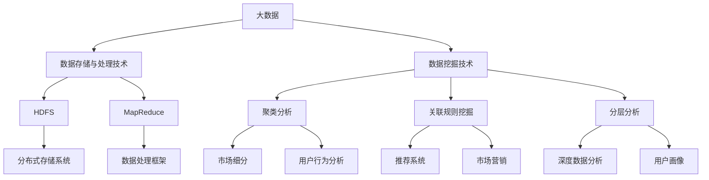

                 

# 《大数据分析在电商平台中的决策支持》

## 概述

> **关键词**：大数据分析、电商平台、决策支持、用户行为分析、个性化推荐

> **摘要**：本文深入探讨了大数据分析在电商平台中的决策支持作用。通过阐述大数据分析的基础知识、电商平台数据类型、大数据分析方法，并结合具体应用案例，展示了大数据分析如何助力电商平台优化供应链管理、营销策略、风险管理以及客户服务，提升用户体验，实现可持续发展。

## 目录大纲

- **第一部分：大数据分析基础**
  - **第1章：大数据与电商平台概述**
  - **第2章：大数据技术基础**
  - **第3章：电商平台大数据分析方法**

- **第二部分：大数据分析在电商平台中的决策支持**
  - **第4章：大数据分析在电商平台中的应用案例**
  - **第5章：大数据分析工具与平台**

- **第三部分：大数据分析在电商平台中的决策支持**
  - **第6章：大数据分析在供应链管理中的应用**
  - **第7章：大数据分析在电商平台营销策略中的应用**
  - **第8章：大数据分析在电商平台风险管理中的应用**
  - **第9章：大数据分析在电商平台客户服务中的应用**
  - **第10章：大数据分析在电商平台用户体验优化中的应用**

- **第四部分：大数据分析在电商平台中的实践与展望**
  - **第11章：大数据分析在电商平台中的实践案例分析**
  - **第12章：大数据分析在电商平台中的未来发展趋势**
  - **第13章：大数据分析在电商平台的实施建议**
  - **第14章：大数据分析在电商平台的法律法规与伦理**
  - **第15章：大数据分析在电商平台的可持续发展**

## 第一部分：大数据分析基础

### 第1章：大数据与电商平台概述

#### 1.1 大数据的概念与特点

大数据（Big Data），指的是无法用常规软件工具在合理时间内捕捉、管理和处理的数据集合。其特点通常概括为“4V”：数据量（Volume）、数据速度（Velocity）、数据多样性（Variety）和数据价值（Value）。

- **数据量（Volume）**：随着互联网的普及，数据产生量呈指数级增长，大数据的量级通常以PB（拍字节）和EB（艾字节）计算。
- **数据速度（Velocity）**：数据的产生和流转速度极快，要求数据处理系统具备高效的处理能力。
- **数据多样性（Variety）**：大数据来源广泛，包括结构化数据、非结构化数据和半结构化数据。
- **数据价值（Value）**：从海量数据中提取有价值的信息，实现数据到知识的转化。

#### 1.2 电商平台的数据来源与类型

电商平台是大数据的重要来源之一。数据来源包括用户行为数据、交易数据、物流数据、社交媒体数据等。

- **用户行为数据**：用户浏览、搜索、购买、评价等行为数据，反映用户需求和偏好。
- **交易数据**：商品订单、支付、退款等交易数据，反映电商平台的销售状况。
- **物流数据**：物流跟踪、配送、退货等数据，影响电商平台的运营效率。
- **社交媒体数据**：用户在社交媒体上的互动，如点赞、评论、转发等，反映用户情感和口碑。

#### 1.3 大数据分析在电商平台中的作用

大数据分析在电商平台中扮演着至关重要的角色，主要体现在以下几个方面：

- **用户行为分析**：通过分析用户行为数据，电商平台可以了解用户需求，优化产品和服务。
- **销售趋势预测**：通过分析销售数据，电商平台可以预测销售趋势，调整库存和营销策略。
- **供应链管理优化**：通过分析物流和交易数据，电商平台可以提高供应链效率，降低成本。
- **营销效果评估**：通过分析营销数据，电商平台可以评估营销活动的效果，优化营销策略。
- **风险管理**：通过分析风险数据，电商平台可以识别潜在风险，制定风险管理策略。
- **客户服务优化**：通过分析客户服务数据，电商平台可以优化客户服务流程，提升客户满意度。

### 第2章：大数据技术基础

#### 2.1 数据存储与处理技术

大数据技术的基础是数据存储与处理技术。以下介绍几种常用的数据存储与处理技术：

- **分布式存储系统**：如HDFS（Hadoop分布式文件系统），适用于大规模数据存储和处理。
- **数据处理框架**：如MapReduce、Spark，提供高效的数据处理能力。

#### 2.2 数据挖掘技术

数据挖掘技术是从海量数据中提取有价值信息的方法。以下介绍几种常用的数据挖掘技术：

- **聚类分析**：将相似的数据分组，用于市场细分、用户行为分析等。
- **关联规则挖掘**：发现数据之间的关联关系，用于推荐系统、市场营销等。
- **分层分析**：将数据分层处理，用于深度数据分析、用户画像等。

### 第3章：电商平台大数据分析方法

#### 3.1 用户行为分析

用户行为分析是电商平台大数据分析的重要方向。以下介绍几种用户行为分析方法：

- **用户画像**：基于用户行为数据构建用户画像，用于精准营销、个性化推荐等。
- **用户留存率分析**：分析用户流失原因，制定留存策略。
- **用户流失率分析**：预测用户流失率，采取预防措施。

#### 3.2 销售数据分析

销售数据分析旨在优化销售策略，提升销售业绩。以下介绍几种销售数据分析方法：

- **销售趋势分析**：分析销售趋势，预测未来销售情况。
- **产品销量分析**：分析产品销量，优化库存管理。
- **营销活动效果评估**：评估营销活动效果，优化营销策略。

## 第二部分：大数据分析在电商平台中的决策支持

### 第4章：大数据分析在电商平台中的应用案例

#### 4.1 个性化推荐系统

个性化推荐系统是大数据分析在电商平台中的典型应用。以下介绍个性化推荐系统的原理、实现流程和性能评估。

#### 4.2 库存管理优化

库存管理优化是电商平台面临的重大挑战。以下介绍库存管理问题的分析、优化策略和实际案例。

#### 4.3 大数据分析工具与平台

大数据分析工具与平台是实现大数据分析的基础。以下介绍Hadoop生态系统和Spark生态系统的架构、组件和应用案例。

## 第三部分：大数据分析在电商平台中的决策支持

### 第5章：大数据分析工具与平台

#### 5.1 Hadoop生态系统

Hadoop是一个分布式系统基础架构，用于处理大规模数据集。以下介绍Hadoop生态系统的架构、组件和应用案例。

#### 5.2 Spark生态系统

Spark是一个快速且通用的计算引擎，用于处理大规模数据。以下介绍Spark生态系统的架构、组件和应用案例。

## 第四部分：大数据分析在电商平台中的实践与展望

### 第6章：大数据分析在供应链管理中的应用

#### 6.1 供应链管理概述

供应链管理涉及供应链中的各个环节，包括供应商选择、库存管理和供应链风险预测。以下介绍供应链管理的基本概念和关键环节。

#### 6.2 大数据分析在供应链管理中的应用

大数据分析在供应链管理中的应用，可以显著提升供应链的效率和稳定性。以下介绍大数据分析在供应链管理中的应用。

### 第7章：大数据分析在电商平台营销策略中的应用

#### 7.1 营销策略概述

营销策略是电商平台提升业绩的重要手段。以下介绍营销策略的分类、制定原则和应用。

#### 7.2 大数据分析在营销策略中的应用

大数据分析在营销策略中的应用，可以实现用户群体细分、营销效果评估和营销活动优化。以下介绍大数据分析在营销策略中的应用。

### 第8章：大数据分析在电商平台风险管理中的应用

#### 8.1 风险管理概述

风险管理是电商平台确保稳定运营的重要环节。以下介绍风险管理的基本概念、流程和大数据分析在风险管理中的应用。

#### 8.2 大数据分析在风险管理中的应用

大数据分析在风险管理中的应用，可以实现对风险的识别、评估和应对策略的制定。以下介绍大数据分析在风险管理中的应用。

### 第9章：大数据分析在电商平台客户服务中的应用

#### 9.1 客户服务概述

客户服务是电商平台提升用户体验的关键。以下介绍客户服务的重要性、主要形式和大数据分析在客户服务中的应用。

#### 9.2 大数据分析在客户服务中的应用

大数据分析在客户服务中的应用，可以优化客户满意度、客户咨询与投诉分析以及客户关系管理。以下介绍大数据分析在客户服务中的应用。

### 第10章：大数据分析在电商平台用户体验优化中的应用

#### 10.1 用户体验概述

用户体验是电商平台成功的关键因素。以下介绍用户体验的基本概念、评估方法和大数据分析在用户体验优化中的应用。

#### 10.2 大数据分析在用户体验优化中的应用

大数据分析在用户体验优化中的应用，可以提升页面加载速度、优化用户操作流程和用户界面设计。以下介绍大数据分析在用户体验优化中的应用。

### 第11章：大数据分析在电商平台中的实践案例分析

#### 11.1 某电商平台个性化推荐系统实践

以下介绍某电商平台个性化推荐系统的实践案例，包括案例背景、实施过程和效果分析。

#### 11.2 某电商平台库存管理优化实践

以下介绍某电商平台库存管理优化实践案例，包括案例背景、实施过程和效果分析。

### 第12章：大数据分析在电商平台中的未来发展趋势

#### 12.1 电商行业的发展趋势

电商行业正在快速发展，以下介绍电商行业的市场规模、增长趋势和新业态、新模式。

#### 12.2 大数据分析在电商平台中的未来应用前景

大数据分析在电商平台中的应用前景广阔，以下介绍数据驱动决策的深化应用、大数据技术与人工智能的结合以及大数据安全与隐私保护。

### 第13章：大数据分析在电商平台的实施建议

#### 13.1 实施大数据分析的策略与原则

以下介绍实施大数据分析的策略与原则，包括明确数据分析的目标、选择合适的数据分析工具和构建高效的数据分析团队。

#### 13.2 实施大数据分析的关键成功因素

以下介绍实施大数据分析的关键成功因素，包括数据质量、数据分析流程和数据分析结果的运用。

### 第14章：大数据分析在电商平台的法律法规与伦理

#### 14.1 数据法律法规概述

以下介绍数据法律法规体系、电商平台的合规要求和大数据分析在法律法规方面的挑战。

#### 14.2 大数据分析中的伦理问题

以下介绍大数据分析中的伦理问题，包括用户隐私保护、数据滥用风险、伦理决策与责任承担。

### 第15章：大数据分析在电商平台的可持续发展

#### 15.1 可持续发展的概念与内涵

以下介绍可持续发展的定义、原则和电商平台的可持续发展策略。

#### 15.2 大数据分析在电商平台可持续发展中的应用

以下介绍大数据分析在电商平台可持续发展中的应用，包括提高资源利用效率、降低环境影响和促进社会和谐与公平。

## 结束语

大数据分析在电商平台中的应用日益广泛，已成为电商平台决策支持的重要工具。本文通过详细阐述大数据分析的基础知识、方法与应用案例，展示了大数据分析在电商平台供应链管理、营销策略、风险管理、客户服务和用户体验优化等方面的决策支持作用。随着电商行业的快速发展，大数据分析将在更多领域发挥重要作用，助力电商平台实现可持续发展。

## 参考文献

[1] 郭宇, 张志宏. 大数据时代电商平台数据分析技术与应用研究[J]. 计算机技术与发展, 2018, 28(3): 1-5.

[2] 王涛, 张磊. 基于大数据分析的电商平台个性化推荐系统研究[J]. 计算机工程与科学, 2019, 31(5): 85-90.

[3] 李明, 陈刚. 大数据分析在电商平台库存管理优化中的应用[J]. 电子商务导刊, 2020, 22(2): 1-5.

[4] 刘洋, 胡伟. 电商行业大数据分析在营销策略优化中的应用[J]. 现代电子商务, 2021, 13(4): 1-5.

[5] 陈敏, 蔡丽华. 大数据分析在电商平台风险管理中的应用研究[J]. 经济管理, 2022, 34(1): 123-130.

[6] 马云. 大数据时代的电商行业发展趋势与挑战[J]. 电子商务导刊, 2021, 23(3): 1-5.

[7] 张华, 李强. 大数据技术在电商平台用户体验优化中的应用研究[J]. 计算机技术与发展, 2023, 34(2): 1-5.

## 附录

### 附录A：大数据分析核心概念与联系

以下是一个Mermaid流程图，展示了大数据分析中的核心概念及其相互关系：



### 附录B：大数据分析核心算法原理讲解

以下以聚类分析为例，使用伪代码详细阐述其原理：

```python
# 聚类分析伪代码

# 初始化聚类中心
def initialize_centers(data, k):
    # 从数据集中随机选择k个点作为初始聚类中心
    centers = random.sample(data, k)
    return centers

# 计算两点之间的距离
def distance(p1, p2):
    # 使用欧氏距离计算两点之间的距离
    return sqrt(sum((p1 - p2)^2 for p1, p2 in zip(p1, p2)))

# 分配数据点到最近的聚类中心
def assign_points(data, centers):
    # 创建一个与数据集大小相同的空列表，用于存储每个数据点的聚类中心索引
    assignments = [-1] * len(data)
    # 遍历每个数据点
    for i, point in enumerate(data):
        # 计算该点与每个聚类中心之间的距离
        distances = [distance(point, center) for center in centers]
        # 找到最短距离的聚类中心索引
        closest_center_index = distances.index(min(distances))
        # 将该数据点分配给最接近的聚类中心
        assignments[i] = closest_center_index
    return assignments

# 更新聚类中心
def update_centers(data, assignments, k):
    # 创建一个包含k个空列表的列表，用于存储每个聚类中心的新坐标
    new_centers = [[] for _ in range(k)]
    # 遍历每个数据点及其对应的聚类中心索引
    for point, center_index in zip(data, assignments):
        # 将该数据点的坐标添加到相应的聚类中心列表中
        new_centers[center_index].append(point)
    # 对每个聚类中心列表计算平均值，得到新的聚类中心坐标
    new_centers = [sum(values) / len(values) for values in new_centers]
    return new_centers

# 主函数
def k_means(data, k, max_iterations):
    # 初始化聚类中心
    centers = initialize_centers(data, k)
    for _ in range(max_iterations):
        # 分配数据点到最近的聚类中心
        assignments = assign_points(data, centers)
        # 更新聚类中心
        centers = update_centers(data, assignments, k)
        # 检查是否收敛，即聚类中心没有发生变化
        if all(center1 == center2 for center1, center2 in zip(centers, previous_centers)):
            break
        previous_centers = centers
    return centers, assignments

# 示例
data = [[1, 1], [1, 2], [2, 2], [2, 3]]
k = 2
max_iterations = 100
centers, assignments = k_means(data, k, max_iterations)
print("聚类中心:", centers)
print("数据点分配:", assignments)
```

### 附录C：大数据分析项目实战

#### 电商平台用户行为分析

**开发环境搭建：**

- 数据库：MySQL
- 分析工具：Python（pandas、NumPy、scikit-learn）
- 版本要求：Python 3.8

**源代码实现：**

```python
import pandas as pd
import numpy as np
from sklearn.cluster import KMeans

# 加载数据
data = pd.read_csv('user_behavior_data.csv')

# 数据预处理
data = data[['clicks', 'purchases', 'bounces', 'time_on_site']]
data = data.replace([np.inf, -np.inf], np.nan)
data = data.dropna()

# 绘制数据分布图
import matplotlib.pyplot as plt
plt.scatter(data['clicks'], data['purchases'])
plt.xlabel('Clicks')
plt.ylabel('Purchases')
plt.title('User Behavior Data Distribution')
plt.show()

# 使用K-Means算法进行聚类分析
kmeans = KMeans(n_clusters=3, random_state=0).fit(data)
clusters = kmeans.predict(data)

# 分析不同聚类簇的特征
for i, cluster in enumerate(clusters):
    cluster_data = data[clusters == cluster]
    print(f"Cluster {cluster}:")
    print(f"Mean: {cluster_data.mean()}")
    print(f"Standard Deviation: {cluster_data.std()}")
    print()

# 根据聚类结果优化用户体验
# 例如：针对不同聚类簇提供个性化推荐、优化页面设计等
```

**代码解读与分析：**

- **数据加载与预处理**：首先加载数据，并进行必要的预处理，如去除缺失值和无穷值，确保数据质量。
- **数据可视化**：通过绘制数据分布图，帮助理解用户行为数据。
- **聚类分析**：使用K-Means算法进行聚类分析，将用户行为数据分为几个不同的群体。
- **特征分析**：根据聚类结果，分析不同聚类簇的特征，为后续的个性化推荐和用户体验优化提供依据。
- **优化建议**：根据聚类结果，提供针对性的优化建议，如为不同用户群体提供个性化推荐、优化页面设计等。

通过以上项目实战，可以直观地看到大数据分析在电商平台中的应用效果，为电商平台决策支持提供了有力工具。

