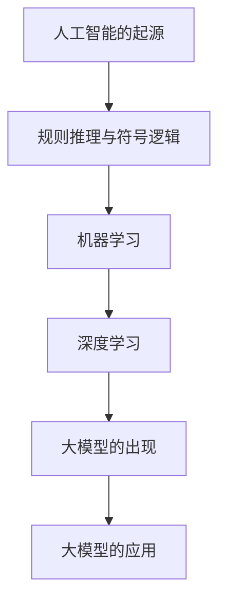
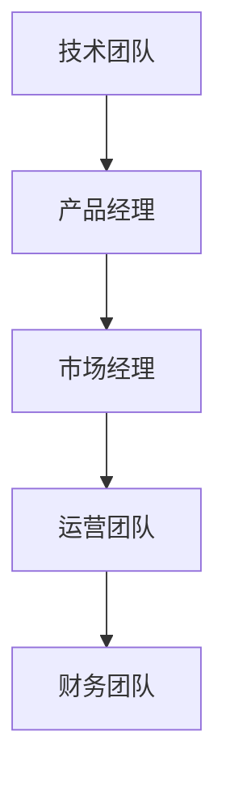

                 

### 文章标题

# 大模型在 AI 创业产品路线图规划中的趋势

> **关键词：** 大模型、AI 创业、产品路线图、趋势、技术分析、应用案例

> **摘要：** 本文将探讨大模型在 AI 创业产品路线图规划中的趋势，分析大模型的发展背景、概念、技术原理以及在实际创业中的应用。通过案例分析，总结大模型创业团队组建与运营策略，并提供融资、法律合规与知识产权保护的建议，最后预测大模型创业的未来发展趋势与挑战。

### 目录大纲

## 第一部分：大模型在 AI 创业产品路线图规划中的趋势

### 第1章：大模型概述

#### 1.1 大模型的发展背景

##### 1.1.1 AI 技术的演进

##### 1.1.2 大模型的出现

##### 1.1.3 大模型对 AI 创业的影响

#### 1.2 大模型的概念与分类

##### 1.2.1 大模型的定义

##### 1.2.2 大模型的分类

##### 1.2.3 主流大模型简介

#### 1.3 大模型的技术原理

##### 1.3.1 深度学习基础

##### 1.3.2 预训练与微调

##### 1.3.3 大模型的训练与优化

### 第2章：AI 创业产品路线图规划

#### 2.1 AI 创业的机遇与挑战

##### 2.1.1 AI 创业的机遇

##### 2.1.2 AI 创业的挑战

#### 2.2 大模型在产品路线图规划中的应用

##### 2.2.1 产品定位与市场调研

##### 2.2.2 技术选型与模型设计

##### 2.2.3 数据处理与模型训练

#### 2.3 大模型应用案例分析

##### 2.3.1 案例一：智能客服系统

##### 2.3.2 案例二：个性化推荐系统

##### 2.3.3 案例三：智能安防系统

### 第3章：大模型创业团队组建与运营

#### 3.1 团队组建策略

##### 3.1.1 技术人才招聘

##### 3.1.2 管理团队建设

##### 3.1.3 团队协作与沟通

#### 3.2 运营管理与风险控制

##### 3.2.1 产品迭代与优化

##### 3.2.2 用户反馈与市场响应

##### 3.2.3 风险识别与应对策略

### 第4章：大模型创业项目融资与投资

#### 4.1 融资策略

##### 4.1.1 天使投资

##### 4.1.2 风险投资

##### 4.1.3 上市融资

#### 4.2 投资风险评估与策略

##### 4.2.1 投资者关注点

##### 4.2.2 风险评估方法

##### 4.2.3 投资策略制定

### 第5章：大模型创业法律合规与知识产权保护

#### 5.1 法律合规要求

##### 5.1.1 数据隐私保护

##### 5.1.2 人工智能伦理

##### 5.1.3 法律责任与合规管理

#### 5.2 知识产权保护

##### 5.2.1 专利申请与保护

##### 5.2.2 著作权保护

##### 5.2.3 商标保护

### 第6章：大模型创业成功案例分析

#### 6.1 成功案例概述

##### 6.1.1 案例一：DeepMind

##### 6.1.2 案例二：OpenAI

##### 6.1.3 案例三：百度AI

#### 6.2 案例分析

##### 6.2.1 成功因素分析

##### 6.2.2 经验教训总结

##### 6.2.3 对创业者的启示

### 第7章：大模型创业未来发展趋势与挑战

#### 7.1 未来发展趋势

##### 7.1.1 大模型技术的演进方向

##### 7.1.2 AI 创业的机遇与挑战

##### 7.1.3 创新与应用领域的拓展

#### 7.2 面临的挑战与应对策略

##### 7.2.1 技术挑战

##### 7.2.2 法律与伦理挑战

##### 7.2.3 市场竞争策略

## 附录

### 附录 A：大模型相关资源与工具

#### A.1 大模型开源框架

##### A.1.1 TensorFlow

##### A.1.2 PyTorch

##### A.1.3 JAX

#### A.2 大模型学习资料

##### A.2.1 网络课程推荐

##### A.2.2 研究论文精选

##### A.2.3 实战教程推荐

### 附录 B：大模型创业指南

#### B.1 创业团队组建步骤

##### B.1.1 团队规划

##### B.1.2 资源整合

##### B.1.3 团队文化建设

#### B.2 创业项目运营策略

##### B.2.1 产品开发策略

##### B.2.2 市场推广策略

##### B.2.3 用户关系管理策略

### 附录 C：大模型创业常见问题解答

#### C.1 技术问题

##### C.1.1 模型训练优化

##### C.1.2 数据集准备

##### C.1.3 模型评估与优化

#### C.2 运营问题

##### C.2.1 用户增长策略

##### C.2.2 产品迭代策略

##### C.2.3 市场营销策略

### 附录 D：大模型创业成功案例精选

#### D.1 智能医疗领域案例

##### D.1.1 案例一：智能影像诊断

##### D.1.2 案例二：医学辅助诊断系统

#### D.2 教育领域案例

##### D.2.1 案例一：个性化学习平台

##### D.2.2 案例二：智能教学助手

#### D.3 金融领域案例

##### D.3.1 案例一：智能投顾系统

##### D.3.2 案例二：反欺诈与风险控制

### 结束语

**作者：** AI天才研究院/AI Genius Institute & 禅与计算机程序设计艺术 /Zen And The Art of Computer Programming

**文章标题：** 大模型在 AI 创业产品路线图规划中的趋势

**关键词：** 大模型、AI 创业、产品路线图、趋势、技术分析、应用案例

**摘要：** 本文将探讨大模型在 AI 创业产品路线图规划中的趋势，分析大模型的发展背景、概念、技术原理以及在实际创业中的应用。通过案例分析，总结大模型创业团队组建与运营策略，并提供融资、法律合规与知识产权保护的建议，最后预测大模型创业的未来发展趋势与挑战。## 第一部分：大模型在 AI 创业产品路线图规划中的趋势

在当今快速发展的科技时代，人工智能（AI）已经成为推动各个行业创新和进步的重要力量。随着计算能力的提升、数据规模的扩大和算法的进步，大模型（Large-scale Models）作为一种前沿技术，正逐渐成为 AI 创业的引擎。本部分将深入探讨大模型在 AI 创业产品路线图规划中的趋势，旨在为创业者提供有价值的指导和建议。

### 1.1 大模型的发展背景

#### 1.1.1 AI 技术的演进

人工智能技术的发展经历了多个阶段。最初，AI 主要集中在规则推理和符号逻辑上，但随着计算能力的提升和大数据的普及，机器学习尤其是深度学习技术得到了快速发展。深度学习通过模拟人脑的神经网络结构，使得机器能够从大量数据中自动学习特征和规律，从而实现复杂的任务。这一技术突破为后续大模型的发展奠定了基础。

#### 1.1.2 大模型的出现

大模型的出现源于深度学习的需求。深度学习模型通常需要大量的数据来训练，并且训练时间较长，计算资源消耗巨大。为了提高模型的性能和降低训练成本，研究人员开始构建大规模的神经网络，这些神经网络包含了数百万甚至数十亿个参数。这样的模型能够更好地捕捉数据中的复杂模式，从而提高模型的准确性和鲁棒性。

#### 1.1.3 大模型对 AI 创业的影响

大模型的出现不仅改变了 AI 研究的方向，也对 AI 创业产生了深远的影响。首先，大模型提高了 AI 解决问题的能力，使得创业者能够开发出更智能、更高效的产品。其次，大模型的计算需求推动了计算硬件的快速发展，为创业者提供了更强大的技术支持。最后，大模型的应用领域不断扩大，从传统的图像识别、自然语言处理，扩展到医疗、金融、教育等各个行业，为创业者提供了丰富的商业机会。

### 1.2 大模型的概念与分类

#### 1.2.1 大模型的定义

大模型通常指的是参数规模达到数百万、数十亿甚至数万亿级别的深度学习模型。这些模型通过训练大规模数据集，能够捕捉到数据中的复杂模式和规律，从而实现高效、准确的任务执行。

#### 1.2.2 大模型的分类

根据应用场景和模型结构，大模型可以分为以下几类：

- **通用大模型（General-purpose Large Models）**：这类模型具有较高的泛化能力，可以应用于多种任务，如 GPT-3、ChatGLM 等。

- **领域特定大模型（Domain-specific Large Models）**：这类模型专注于特定领域，如医疗领域的医学影像模型、金融领域的风险控制模型等。

- **混合大模型（Hybrid Large Models）**：这类模型结合了通用和领域特定模型的优势，能够在多个领域发挥作用，如 GLM-130B。

#### 1.2.3 主流大模型简介

当前，一些主流的大模型已经取得了显著的成果，如：

- **GPT-3**：由 OpenAI 开发的通用预训练语言模型，参数规模达到 1750 亿，支持多种自然语言处理任务。

- **ChatGLM**：由清华大学 KEG 实验室和智谱 AI 公司开发的聊天机器人，具备较强的对话生成能力。

- **GLM-4**：由智谱 AI 公司开发的通用语言模型，参数规模达到 1300 亿，支持多种语言任务。

### 1.3 大模型的技术原理

#### 1.3.1 深度学习基础

深度学习是构建大模型的核心技术。它通过多层神经网络结构，将输入数据进行逐层提取和特征变换，从而实现复杂函数的逼近。深度学习的基本组成部分包括：

- **神经网络（Neural Network）**：由多个神经元组成的计算模型。

- **激活函数（Activation Function）**：用于引入非线性变换。

- **优化算法（Optimization Algorithm）**：用于训练模型，如梯度下降、Adam 等。

#### 1.3.2 预训练与微调

预训练与微调是构建大模型的关键步骤。预训练（Pre-training）是指在大规模数据集上训练模型，使其具备一定的通用能力。微调（Fine-tuning）是指将预训练模型应用于特定任务，通过少量数据进一步优化模型。

#### 1.3.3 大模型的训练与优化

大模型的训练与优化面临以下挑战：

- **计算资源需求**：大模型需要大量的计算资源，包括 GPU、TPU 等。

- **数据需求**：大模型需要大量高质量的数据进行训练。

- **优化问题**：大模型的优化过程可能面临梯度消失、梯度爆炸等问题。

为了解决这些挑战，研究人员提出了以下策略：

- **分布式训练**：将训练任务分布在多台机器上，提高训练效率。

- **数据增强**：通过数据增强技术，扩充训练数据集。

- **优化算法改进**：改进优化算法，提高训练效果。

通过深入理解大模型的发展背景、概念与分类，以及技术原理，创业者可以为产品路线图规划提供有力的支持。下一章将分析 AI 创业的机遇与挑战，为创业者提供更全面的指导。### 第1章：大模型概述

#### 1.1 大模型的发展背景

##### 1.1.1 AI 技术的演进

人工智能（AI）技术的发展可以追溯到20世纪50年代。起初，AI主要集中在规则推理和符号逻辑上，例如专家系统和逻辑推理机。这些系统依靠预先定义的规则和逻辑来解决问题，但它们在面对复杂、不确定的情境时表现不佳。

随着计算机硬件的进步和算法的创新，特别是20世纪80年代以来的机器学习和深度学习技术的发展，AI领域取得了突破性进展。机器学习通过从数据中学习规律和模式，使得计算机能够自动执行任务，而深度学习则通过多层神经网络结构，模拟人脑的学习过程，进一步提升了AI的性能。

##### 1.1.2 大模型的出现

深度学习的关键优势在于其能够通过大规模数据集进行训练，从而学习到更复杂的模式和特征。然而，随着数据集规模的增大，模型的参数数量也迅速增加，这就引出了大模型的概念。大模型通常指的是参数规模达到数百万、数十亿甚至数万亿级别的深度学习模型。

大模型的出现不仅源于技术进步，也源于实际应用的需求。在自然语言处理、图像识别、语音识别等领域，传统的中小规模模型很难达到预期的性能。例如，在自然语言处理领域，GPT-3等大模型的涌现，使得机器生成文本的质量和多样性大大提高，从而推动了AI技术的广泛应用。

##### 1.1.3 大模型对 AI 创业的影响

大模型对 AI 创业的影响是多方面的。首先，大模型显著提升了 AI 解决问题的能力，使得创业者能够开发出更智能、更高效的产品。例如，在智能客服系统中，大模型能够通过深度学习理解用户的需求，提供更加准确和个性化的服务。

其次，大模型的计算需求推动了计算硬件的快速发展，为创业者提供了更强大的技术支持。例如，GPU 和 TPU 等高性能计算硬件的普及，使得大模型的训练变得更加高效和经济。

最后，大模型的应用领域不断扩大，从传统的图像识别、自然语言处理，扩展到医疗、金融、教育等各个行业，为创业者提供了丰富的商业机会。例如，在医疗领域，大模型可以用于疾病预测和诊断，提高医疗服务的质量和效率。

#### 1.2 大模型的概念与分类

##### 1.2.1 大模型的定义

大模型通常指的是参数规模达到数百万、数十亿甚至数万亿级别的深度学习模型。这些模型通过训练大规模数据集，能够捕捉到数据中的复杂模式和规律，从而实现高效、准确的任务执行。大模型通常需要强大的计算资源，例如 GPU 和 TPU，以及高质量的数据集来训练和优化。

##### 1.2.2 大模型的分类

根据应用场景和模型结构，大模型可以分为以下几类：

- **通用大模型（General-purpose Large Models）**：这类模型具有较高的泛化能力，可以应用于多种任务，例如自然语言处理、图像识别等。GPT-3、ChatGLM 等模型属于这一类别。

- **领域特定大模型（Domain-specific Large Models）**：这类模型专注于特定领域，例如医疗、金融等。这些模型通常在特定领域拥有更高的性能，例如医学影像诊断、金融风险评估等。

- **混合大模型（Hybrid Large Models）**：这类模型结合了通用和领域特定模型的优势，能够在多个领域发挥作用。例如，GLM-4 是一种混合大模型，它同时具备通用语言模型和特定领域模型的特点。

##### 1.2.3 主流大模型简介

当前，一些主流的大模型已经取得了显著的成果，以下是一些典型的例子：

- **GPT-3**：由 OpenAI 开发的通用预训练语言模型，参数规模达到 1750 亿，支持多种自然语言处理任务。GPT-3 的出现标志着通用大模型的又一重大突破。

- **ChatGLM**：由清华大学 KEG 实验室和智谱 AI 公司开发的聊天机器人，具备较强的对话生成能力。ChatGLM 的开发展示了大模型在自然语言处理领域的应用潜力。

- **GLM-4**：由智谱 AI 公司开发的通用语言模型，参数规模达到 1300 亿，支持多种语言任务。GLM-4 的性能和规模使其成为当前最具代表性的大模型之一。

#### 1.3 大模型的技术原理

##### 1.3.1 深度学习基础

深度学习是构建大模型的核心技术。它通过多层神经网络结构，将输入数据进行逐层提取和特征变换，从而实现复杂函数的逼近。深度学习的基本组成部分包括：

- **神经网络（Neural Network）**：由多个神经元组成的计算模型。每个神经元负责将输入数据通过权重和偏置进行线性变换，再通过激活函数引入非线性变换。

- **激活函数（Activation Function）**：用于引入非线性变换，使神经网络能够建模复杂的非线性关系。常见的激活函数包括 sigmoid、ReLU 等。

- **优化算法（Optimization Algorithm）**：用于训练模型，使模型能够从数据中学习到合适的参数。常见的优化算法包括梯度下降、Adam 等。

##### 1.3.2 预训练与微调

预训练与微调是构建大模型的关键步骤。预训练（Pre-training）是指在大规模数据集上训练模型，使其具备一定的通用能力。微调（Fine-tuning）是指将预训练模型应用于特定任务，通过少量数据进一步优化模型。

预训练的目标是使模型能够理解数据中的通用特征，而微调的目标是使模型能够在特定任务上达到最佳性能。通过预训练和微调，模型可以充分利用大规模数据集的优势，同时保持对特定任务的敏感性和灵活性。

##### 1.3.3 大模型的训练与优化

大模型的训练与优化面临以下挑战：

- **计算资源需求**：大模型需要大量的计算资源，例如 GPU 和 TPU。这要求创业者具备强大的计算资源支持，或者能够与云服务提供商合作。

- **数据需求**：大模型需要大量高质量的数据进行训练。这要求创业者能够获取或生成高质量的数据集，或者与数据提供商合作。

- **优化问题**：大模型的优化过程可能面临梯度消失、梯度爆炸等问题。这要求创业者选择合适的优化算法和策略，以提高训练效率和模型性能。

为了解决这些挑战，研究人员提出了以下策略：

- **分布式训练**：将训练任务分布在多台机器上，提高训练效率。常见的分布式训练策略包括数据并行、模型并行等。

- **数据增强**：通过数据增强技术，扩充训练数据集。常见的数据增强方法包括随机裁剪、翻转、旋转等。

- **优化算法改进**：改进优化算法，提高训练效果。例如，采用自适应学习率策略、引入正则化项等。

通过深入理解大模型的发展背景、概念与分类，以及技术原理，创业者可以为产品路线图规划提供有力的支持。下一章将分析 AI 创业的机遇与挑战，为创业者提供更全面的指导。|im_sep|>## 第二部分：AI 创业产品路线图规划

在 AI 创业的浪潮中，产品路线图规划是创业团队成功的关键。一个清晰、合理的产品路线图能够帮助团队明确目标、分配资源、优化流程，从而在激烈的市场竞争中脱颖而出。本章节将详细探讨 AI 创业产品路线图规划的过程，包括机遇与挑战、产品定位与市场调研、技术选型与模型设计、数据处理与模型训练，以及大模型应用案例分析。

### 2.1 AI 创业的机遇与挑战

##### 2.1.1 AI 创业的机遇

AI 创业的机遇主要体现在以下几个方面：

- **技术进步**：随着 AI 技术的不断发展，特别是在深度学习、自然语言处理、计算机视觉等领域的突破，AI 创业者可以利用这些先进技术打造出具有市场竞争力的产品。

- **市场需求**：随着人们生活水平的提高和对效率的追求，各种行业对智能化、自动化的需求日益增加，AI 创业者可以针对这些需求开发相应的产品。

- **投资热情**：AI 是当前科技领域的热点，吸引了大量风险投资和政府的支持，为 AI 创业者提供了充足的资金支持。

- **数据资源**：随着互联网的普及，大量结构化和非结构化数据不断生成，为 AI 模型的训练和优化提供了丰富的素材。

##### 2.1.2 AI 创业的挑战

尽管 AI 创业机遇众多，但创业者也面临着诸多挑战：

- **技术门槛**：AI 技术复杂度高，创业者需要具备深厚的技术背景，特别是在深度学习、数据科学等领域。

- **计算资源**：大模型训练需要大量的计算资源，创业者需要具备强大的计算能力，或者与云服务提供商合作。

- **数据质量**：AI 模型性能很大程度上依赖于数据质量，创业者需要投入大量精力来收集、处理和标注数据。

- **合规与伦理**：AI 技术在医疗、金融等领域应用时，需要遵守严格的法律法规和伦理规范，创业者需要提前做好合规准备工作。

### 2.2 大模型在产品路线图规划中的应用

##### 2.2.1 产品定位与市场调研

产品定位是产品路线图规划的第一步，创业者需要明确产品要解决什么问题、服务哪些用户群体，以及如何与竞争对手区分。市场调研可以帮助创业者了解目标市场的需求、市场规模和竞争状况。

- **产品定位**：明确产品的核心功能和目标用户，例如智能客服系统可以定位为提高企业服务效率和用户满意度。

- **市场调研**：通过问卷调查、用户访谈、市场分析报告等方式，了解目标市场的需求、用户痛点、市场规模和竞争状况。

##### 2.2.2 技术选型与模型设计

在确定产品定位和市场调研后，创业者需要选择合适的技术和模型，以实现产品功能。大模型在 AI 创业中的应用主要体现在以下几个方面：

- **技术选型**：根据产品需求，选择适合的大模型框架和算法。例如，自然语言处理任务可以选择 GPT-3、BERT 等。

- **模型设计**：设计模型结构，包括输入层、隐藏层和输出层。创业者需要考虑模型的可扩展性、可维护性和性能。

##### 2.2.3 数据处理与模型训练

数据处理和模型训练是 AI 创业的核心环节，创业者需要投入大量资源来确保数据质量和模型性能。

- **数据处理**：清洗、预处理和标注数据，包括去除噪声、填补缺失值、归一化等。创业者需要设计高效的数据处理流程，以降低数据处理的耗时和成本。

- **模型训练**：使用高质量的数据集进行模型训练，优化模型参数。创业者需要选择合适的优化算法和训练策略，以提高模型性能。

### 2.3 大模型应用案例分析

为了更好地理解大模型在 AI 创业产品路线图规划中的应用，以下列举了三个具体案例：

##### 2.3.1 案例一：智能客服系统

智能客服系统利用大模型实现自然语言处理，提供实时、准确的客户服务。具体步骤如下：

1. **产品定位与市场调研**：明确智能客服系统要解决客户服务效率低、人工成本高等问题，目标用户包括大型企业、电商和金融机构。

2. **技术选型与模型设计**：选择 GPT-3 作为自然语言处理模型，设计输入层、隐藏层和输出层，实现对话生成和回复。

3. **数据处理与模型训练**：收集并清洗客户咨询数据，进行数据预处理和标注，使用训练数据集训练 GPT-3 模型。

##### 2.3.2 案例二：个性化推荐系统

个性化推荐系统利用大模型实现用户行为分析和内容推荐，提高用户满意度和粘性。具体步骤如下：

1. **产品定位与市场调研**：明确个性化推荐系统要解决用户获取信息效率低、内容个性化不足等问题，目标用户包括电商、新闻媒体和视频平台。

2. **技术选型与模型设计**：选择 BERT 作为用户行为分析模型，设计输入层、隐藏层和输出层，实现用户兴趣标签生成和内容推荐。

3. **数据处理与模型训练**：收集并清洗用户行为数据，进行数据预处理和标注，使用训练数据集训练 BERT 模型。

##### 2.3.3 案例三：智能安防系统

智能安防系统利用大模型实现视频监控分析和异常检测，提高公共安全。具体步骤如下：

1. **产品定位与市场调研**：明确智能安防系统要解决视频监控效率低、安全隐患等问题，目标用户包括公安部门、企业和社区。

2. **技术选型与模型设计**：选择 YOLO 作为目标检测模型，设计输入层、隐藏层和输出层，实现视频监控分析和异常检测。

3. **数据处理与模型训练**：收集并清洗视频数据，进行数据预处理和标注，使用训练数据集训练 YOLO 模型。

通过以上案例分析，可以看出大模型在 AI 创业产品路线图规划中的应用，不仅提高了产品性能和用户满意度，还开辟了新的商业机会。在接下来的章节中，我们将进一步探讨大模型创业团队组建与运营、融资与投资、法律合规与知识产权保护等方面，为创业者提供全面的指导。|im_sep|>### 第3章：大模型创业团队组建与运营

在 AI 创业的道路上，团队组建与运营是决定创业项目成败的关键因素。一个高效、协作的团队可以充分利用技术优势，快速响应市场需求，将创新理念转化为实际产品。本章将详细探讨大模型创业团队组建与运营的策略，包括技术人才招聘、管理团队建设、团队协作与沟通，以及产品迭代与优化、用户反馈与市场响应、风险识别与应对策略。

#### 3.1 团队组建策略

##### 3.1.1 技术人才招聘

技术人才是 AI 创业团队的核心，他们的专业能力和创新精神直接影响到项目的成功与否。在招聘技术人才时，创业者应注重以下几个方面：

- **技术背景**：确保候选人具备扎实的技术基础，熟悉深度学习、自然语言处理、计算机视觉等 AI 领域的核心技术。

- **实践经验**：考察候选人的项目经验和成果，尤其是大模型的训练与优化、模型部署与调优等方面。

- **学习能力**：AI 领域技术更新迅速，创业者应寻找那些具有持续学习和适应新技术的能力的候选人。

- **团队协作**：评估候选人的团队协作能力，确保他们能够与团队成员有效沟通，共同推进项目。

##### 3.1.2 管理团队建设

管理团队的建设对于确保项目顺利推进和团队稳定至关重要。创业者应关注以下几个方面：

- **团队规模**：根据项目需求和资金状况，合理规划团队规模。初期团队应精简，以保持高效运作。

- **职能分配**：明确团队各成员的职责，确保每个成员都能在自己的领域内充分发挥作用。例如，技术负责人负责技术方案和研发进度，产品经理负责市场需求分析和产品规划，运营团队负责产品推广和用户反馈收集。

- **激励机制**：建立合理的激励机制，包括绩效奖金、股权激励等，以激发团队成员的积极性和创造力。

##### 3.1.3 团队协作与沟通

高效的团队协作与沟通是确保项目顺利进行的重要保障。创业者应采取以下措施：

- **明确目标**：确保团队所有成员对项目目标、愿景和使命有清晰的认识，从而形成共同的目标和价值观。

- **定期会议**：定期召开团队会议，分享项目进展、讨论问题解决方案，确保团队成员之间的信息畅通。

- **信息共享**：建立有效的信息共享平台，如内部邮件系统、即时通讯工具等，以便团队成员随时获取所需信息。

- **透明度**：保持团队运作的透明度，让团队成员了解项目的进展、面临的挑战和取得的成果，从而增强团队的凝聚力。

#### 3.2 运营管理与风险控制

##### 3.2.1 产品迭代与优化

产品迭代与优化是 AI 创业项目持续发展的关键。创业者应关注以下几个方面：

- **用户反馈**：及时收集用户反馈，了解用户需求和使用体验，以便进行产品改进和优化。

- **迭代计划**：制定合理的迭代计划，确保产品能够按照既定时间表进行更新和优化。

- **性能优化**：持续对产品进行性能优化，提高模型的准确率、响应速度和用户体验。

##### 3.2.2 用户反馈与市场响应

用户反馈与市场响应是 AI 创业项目成功的重要因素。创业者应采取以下措施：

- **用户调研**：定期进行用户调研，收集用户对产品的意见和建议，了解市场变化和用户需求。

- **市场监测**：关注市场动态，及时了解竞争对手的动向，以便调整自己的产品策略。

- **客户服务**：提供优质的客户服务，解决用户在使用过程中遇到的问题，提高用户满意度和忠诚度。

##### 3.2.3 风险识别与应对策略

在 AI 创业过程中，风险识别与应对是确保项目顺利推进的重要环节。创业者应关注以下几个方面：

- **技术风险**：如大模型训练失败、模型性能不达标等。创业者应确保团队具备足够的研发能力和技术储备，以应对技术风险。

- **市场风险**：如市场需求变化、竞争加剧等。创业者应密切关注市场动态，及时调整产品策略，以应对市场风险。

- **资金风险**：如融资失败、资金不足等。创业者应制定合理的融资计划和资金管理策略，确保项目资金的充足和合理使用。

- **法律风险**：如数据隐私保护、知识产权争议等。创业者应严格遵守法律法规，建立完善的法律合规体系，以降低法律风险。

通过科学合理的团队组建与运营管理，AI 创业者可以充分利用大模型的优势，推动项目的成功发展。在下一章中，我们将进一步探讨大模型创业项目的融资与投资策略，为创业者提供全面的财务支持。|im_sep|>### 第4章：大模型创业项目融资与投资

在 AI 创业的道路上，融资与投资是确保项目持续发展和扩展的关键环节。大模型的开发与应用需要大量的资金支持，因此，创业者需要制定合理的融资策略，吸引投资者的关注。本章将详细探讨大模型创业项目的融资策略、投资风险评估与策略，以及融资渠道和投资者关注点。

#### 4.1 融资策略

##### 4.1.1 天使投资

天使投资是指个人投资者（通常是企业家、技术专家或商业人士）对初创企业的投资。天使投资通常在项目初期阶段介入，为创业者提供启动资金和资源。以下是一些天使投资的策略：

- **确定目标投资者**：寻找对 AI 领域有深刻理解和兴趣的天使投资者，这样可以更好地把握他们的需求和期望。

- **准备详细商业计划书**：天使投资者通常更关注创业项目的商业潜力和团队实力。因此，创业者需要准备一份详细、全面的商业计划书，包括市场分析、产品规划、资金需求、风险评估等。

- **建立良好的关系网络**：通过参加行业会议、创业活动等方式，建立与潜在投资者之间的联系，增加融资成功的几率。

##### 4.1.2 风险投资

风险投资（Venture Capital，VC）是指专业投资机构对初创企业和成长期企业的投资。风险投资通常在项目具有一定规模和市场潜力后介入，以获取较高的回报。以下是一些风险投资的策略：

- **寻找合适的投资机构**：创业者应寻找那些对 AI 领域有深入研究和投资记录的风险投资机构。可以通过行业报告、投资机构官网等途径了解投资机构的投资偏好和领域。

- **展示项目优势**：在融资过程中，创业者需要清晰地展示项目的核心技术、市场前景、竞争优势等，以吸引投资机构的关注。

- **谈判和协议**：在初步接触后，创业者应与投资机构进行深入谈判，讨论投资金额、股权分配、投资期限等关键条款，确保双方利益最大化。

##### 4.1.3 上市融资

上市融资是指通过在证券交易所上市来获得资金支持。上市融资通常适用于成长迅速、具有一定规模和盈利能力的公司。以下是一些上市融资的策略：

- **评估上市条件**：创业者需要了解所在国家和地区的上市条件，包括财务指标、公司治理结构、合规要求等。

- **选择合适的时机**：选择市场行情好、公司业绩稳定的时机进行上市，可以提高融资成功率和市场估值。

- **专业团队支持**：聘请专业的财务顾问、法律顾问和公关团队，确保上市过程的顺利进行。

#### 4.2 投资风险评估与策略

##### 4.2.1 投资者关注点

投资者在评估 AI 创业项目时，通常会关注以下几个方面：

- **技术创新**：投资者会评估项目的技术创新程度，包括大模型的独特性、技术难度、应用前景等。

- **市场潜力**：投资者会分析项目的市场潜力，包括市场规模、增长速度、竞争态势等。

- **团队实力**：投资者会考察创业团队的背景、经验、能力以及团队协作情况。

- **财务状况**：投资者会关注项目的财务状况，包括盈利模式、收入预测、成本控制等。

- **法律合规**：投资者会评估项目的法律合规性，包括数据隐私保护、知识产权保护、法律法规遵守等。

##### 4.2.2 风险评估方法

在融资过程中，创业者需要了解并评估潜在的投资风险。以下是一些常用的风险评估方法：

- **定性分析**：通过专家访谈、市场调研等方式，定性评估项目的风险因素和风险程度。

- **定量分析**：使用财务模型、统计方法等定量评估项目的风险，如计算预期收益、预期损失等。

- **敏感性分析**：通过调整关键参数，评估不同情景下项目的风险和收益变化。

- **情景分析**：构建不同的情景，分析项目在不同情景下的表现，以评估潜在风险。

##### 4.2.3 投资策略制定

在了解投资者关注点和风险评估方法后，创业者可以制定相应的投资策略：

- **优化技术创新**：通过加大研发投入，提高技术创新能力，增强项目的核心竞争力。

- **拓展市场渠道**：通过市场调研和推广，扩大市场影响力，提高市场占有率。

- **完善团队结构**：招聘和培养优秀的团队成员，提高团队整体素质。

- **强化财务管理**：通过优化成本控制、提高运营效率，确保项目的财务健康。

- **加强合规管理**：建立健全的数据隐私保护、知识产权保护等合规体系，降低法律风险。

通过合理的融资策略和有效的投资风险管理，AI 创业者可以确保项目的持续发展和扩展。在下一章中，我们将探讨大模型创业的法律合规与知识产权保护，为创业者提供全面的法律指导。|im_sep|>### 第5章：大模型创业法律合规与知识产权保护

在 AI 创业的浪潮中，法律合规与知识产权保护是确保企业稳定发展、避免法律风险的关键因素。对于大模型创业项目而言，数据隐私保护、人工智能伦理、法律责任与合规管理尤为重要。本章将详细介绍这些方面的要求和策略。

#### 5.1 法律合规要求

##### 5.1.1 数据隐私保护

数据隐私保护是当前法律合规的重要方面，特别是在涉及大规模数据集和用户个人信息的情况下。以下是一些关键要求：

- **数据收集与使用**：企业需要明确数据收集的目的、范围和方式，确保收集的数据符合法律法规的要求，并取得用户的明确同意。

- **数据存储与传输**：企业需要采取有效措施保护数据安全，包括加密存储、定期备份和传输过程中的安全防护。

- **数据删除与匿名化**：企业应按照法律规定，对不再需要的数据进行删除或匿名化处理，以防止个人信息泄露。

##### 5.1.2 人工智能伦理

人工智能伦理是确保 AI 技术被合理、道德地使用的重要方面。以下是一些关键伦理要求：

- **公平与无偏见**：AI 模型不应带有歧视性，应确保对所有用户公平对待。

- **透明与可解释性**：AI 模型应具备透明性，用户能够理解模型的决策过程和结果。

- **责任归属**：在 AI 模型引发问题时，应明确责任归属，确保企业和用户之间的责任分配合理。

##### 5.1.3 法律责任与合规管理

企业需要建立健全的合规管理体系，确保在法律框架内运营。以下是一些关键策略：

- **合规培训**：企业应定期对员工进行合规培训，提高员工的合规意识和能力。

- **合规审计**：企业应定期进行合规审计，确保各项业务活动符合法律法规的要求。

- **合规文档**：企业应建立完善的合规文档体系，包括政策、流程、记录等，以备查验。

#### 5.2 知识产权保护

知识产权保护是确保企业技术创新和商业利益的重要手段。对于大模型创业项目而言，以下是一些关键策略：

##### 5.2.1 专利申请与保护

- **专利布局**：企业应根据市场需求和研发方向，制定专利布局策略，确保技术覆盖全面。

- **专利申请**：企业应积极申请专利，保护自己的技术创新和成果。

- **专利维权**：企业应建立健全的专利维权体系，应对潜在的侵权行为。

##### 5.2.2 著作权保护

- **软件著作权登记**：企业应登记软件著作权，保护自己的软件成果。

- **文档保护**：企业应对重要的技术文档进行保护，避免泄露给竞争对手。

##### 5.2.3 商标保护

- **商标注册**：企业应注册商标，保护品牌形象和商业利益。

- **品牌管理**：企业应加强对品牌的宣传和管理，提升品牌知名度和影响力。

通过遵守法律合规要求、加强知识产权保护，大模型创业项目可以降低法律风险，确保稳定发展。在下一章中，我们将分析大模型创业的成功案例，总结经验教训，为创业者提供有益的启示。|im_sep|>### 第6章：大模型创业成功案例分析

在 AI 创业的浪潮中，一些企业凭借先进的技术和创新理念，取得了显著的成就。本章将分析三个大模型创业的成功案例：DeepMind、OpenAI 和百度 AI。通过这些案例，我们将探讨其成功因素、经验教训以及对创业者的启示。

#### 6.1 成功案例概述

##### 6.1.1 案例一：DeepMind

DeepMind 是一家成立于 2010 年的人工智能公司，其核心产品为 AlphaGo 和其他人工智能算法。DeepMind 的成功主要得益于以下几个因素：

- **技术创新**：DeepMind 在深度学习领域取得了突破性进展，特别是在强化学习和围棋算法方面。其 AlphaGo 算法击败了世界围棋冠军，引起了广泛关注。

- **人才聚集**：DeepMind 吸引了全球顶尖的深度学习专家，形成了强大的研发团队。

- **市场应用**：DeepMind 的技术广泛应用于医疗、能源、游戏等领域，实现了商业化和社会价值。

##### 6.1.2 案例二：OpenAI

OpenAI 是一家成立于 2015 年的人工智能研究公司，其核心使命是实现安全的通用人工智能（AGI）。OpenAI 的成功主要得益于以下几个因素：

- **开放协作**：OpenAI 推崇开放科学，鼓励全球研究人员共享数据和算法，推动了人工智能技术的快速发展。

- **技术突破**：OpenAI 开发了多个具有里程碑意义的大模型，如 GPT-3，其在自然语言处理领域取得了卓越成就。

- **投资支持**：OpenAI 获得了谷歌、微软等科技巨头的投资支持，为研发提供了强大的资金保障。

##### 6.1.3 案例三：百度 AI

百度 AI 是一家专注于人工智能应用和服务的公司，其核心产品包括自动驾驶、智能搜索、智能医疗等。百度 AI 的成功主要得益于以下几个因素：

- **技术创新**：百度 AI 在深度学习、自然语言处理、计算机视觉等领域取得了重要突破，推动了人工智能技术的产业化。

- **市场拓展**：百度 AI 通过大规模市场推广，将技术应用于多个行业，实现了商业化和规模化。

- **产业链整合**：百度 AI 通过整合产业链上下游资源，构建了完善的人工智能生态系统。

#### 6.2 案例分析

##### 6.2.1 成功因素分析

从上述案例中，我们可以总结出以下几个成功因素：

- **技术创新**：成功的企业通常在技术领域取得了突破性进展，具备了较强的核心竞争力。

- **人才聚集**：优秀的企业吸引了一批顶尖的技术人才，形成了高效的研发团队。

- **市场应用**：成功的企业能够将技术应用于实际场景，实现商业化和规模化。

- **投资支持**：强大的资金支持为企业的发展提供了保障，使其能够持续投入研发和市场推广。

##### 6.2.2 经验教训总结

通过分析成功案例，我们可以得出以下经验教训：

- **技术创新是核心**：在 AI 创业中，技术创新是企业的核心竞争力。企业应不断推动技术进步，保持领先地位。

- **人才是关键**：优秀的人才是企业成功的关键。企业应注重人才培养和引进，建立高效的研发团队。

- **市场应用是目标**：企业应将技术应用于实际场景，解决实际问题，实现商业化和规模化。

- **投资支持是保障**：企业应积极寻求投资支持，为研发和市场推广提供资金保障。

##### 6.2.3 对创业者的启示

对于 AI 创业的创业者，以下启示可能有助于他们取得成功：

- **关注技术创新**：创业者应关注技术领域的最新动态，不断推动技术创新，保持企业的核心竞争力。

- **重视人才建设**：创业者应重视人才培养和引进，建立高效的研发团队，为企业发展提供强大的人才支持。

- **寻找市场机会**：创业者应寻找适合自己技术特点的市场机会，将技术应用于实际场景，实现商业化和规模化。

- **积极寻求投资**：创业者应积极寻求投资支持，为企业的研发和市场推广提供资金保障。

通过以上分析，我们可以看到，大模型创业的成功离不开技术创新、人才建设、市场应用和投资支持。在未来的创业道路上，创业者应借鉴成功案例的经验教训，持续推动技术进步，实现企业的可持续发展。|im_sep|>### 第7章：大模型创业未来发展趋势与挑战

随着人工智能技术的快速发展，大模型在各个领域的应用日益广泛，成为推动创新和产业升级的重要力量。然而，在未来的发展中，大模型创业也将面临诸多趋势和挑战。本章将探讨大模型创业的未来发展趋势，包括技术演进方向、AI 创业的机遇与挑战，以及创新与应用领域的拓展，同时分析创业者应如何应对面临的挑战。

#### 7.1 未来发展趋势

##### 7.1.1 大模型技术的演进方向

大模型技术的发展趋势主要体现在以下几个方面：

- **更大规模模型**：随着计算资源和数据资源的不断增长，更大规模的大模型将成为研究热点。未来，模型参数数量可能达到千亿甚至万亿级别，从而进一步提高模型的性能和泛化能力。

- **高效训练方法**：为了应对更大规模模型的训练需求，研究者将不断探索新的训练方法，如分布式训练、增量训练、自适应训练等，以提高训练效率和降低计算成本。

- **多模态融合**：多模态融合是指将不同类型的数据（如文本、图像、音频）进行整合，构建综合的大模型。这种融合方法有望在医疗、教育、娱乐等领域发挥重要作用。

- **自适应能力**：未来，大模型将具备更强的自适应能力，能够根据不同的应用场景和用户需求进行动态调整，提供更加个性化的服务。

##### 7.1.2 AI 创业的机遇与挑战

AI 创业的机遇与挑战并存，创业者需要审慎评估和应对。

- **机遇**：
  - **技术创新**：AI 技术的快速进步为创业者提供了广阔的创新空间，如自动驾驶、智能医疗、智能教育等。
  - **市场增长**：随着人们对智能化、自动化的需求不断提高，AI 产品和服务市场呈现出快速增长的趋势。
  - **政策支持**：许多国家和地区对 AI 技术给予了高度重视，出台了一系列扶持政策，为创业者提供了良好的发展环境。

- **挑战**：
  - **技术壁垒**：大模型的训练和优化需要强大的计算资源和专业人才，创业者需要具备一定的技术积累和资源储备。
  - **数据隐私**：随着数据规模的扩大，数据隐私保护问题日益突出，创业者需要遵守相关法律法规，采取有效的数据保护措施。
  - **伦理道德**：AI 技术的广泛应用引发了一系列伦理道德问题，如算法歧视、隐私侵犯等，创业者需要关注并解决这些问题。

##### 7.1.3 创新与应用领域的拓展

未来，大模型在创新与应用领域的拓展将呈现以下趋势：

- **医疗健康**：大模型在医疗领域的应用将更加广泛，如疾病预测、诊断、药物研发等，有望提高医疗服务的质量和效率。

- **金融科技**：大模型在金融科技领域的应用将进一步提升，如风险评估、智能投顾、反欺诈等，有望提高金融服务的安全性和便捷性。

- **智能制造**：大模型在智能制造领域的应用将推动生产流程的智能化和自动化，提高生产效率和产品质量。

- **教育领域**：大模型在教育领域的应用将实现个性化教学、智能评估等，有望提高教育质量和学习效果。

#### 7.2 面临的挑战与应对策略

##### 7.2.1 技术挑战

- **计算资源需求**：大模型的训练和优化需要大量的计算资源，创业者需要寻找高效、经济的计算解决方案，如使用云服务、GPU 加速等。

- **数据质量问题**：高质量的数据是训练大模型的关键，创业者需要投入大量精力来收集、清洗和处理数据。

- **模型优化问题**：大模型的优化过程复杂，创业者需要不断探索和尝试，寻找最优的训练策略和优化算法。

##### 7.2.2 法律与伦理挑战

- **数据隐私保护**：创业者需要遵守相关法律法规，采取有效的数据保护措施，确保用户数据的安全和隐私。

- **算法歧视问题**：大模型可能存在算法歧视问题，创业者需要设计公平、透明的算法，确保对用户公平对待。

- **伦理道德责任**：创业者需要关注 AI 技术的伦理道德问题，确保技术的合理、道德地应用，避免对用户和社会造成负面影响。

##### 7.2.3 市场竞争策略

- **技术创新**：创业者需要不断推动技术创新，保持技术领先优势，以应对激烈的市场竞争。

- **市场定位**：创业者需要明确市场定位，寻找细分市场，提供有针对性的解决方案。

- **合作与共赢**：创业者可以通过合作、联盟等方式，与其他企业共同拓展市场，实现共赢。

通过深入了解大模型创业的未来发展趋势与挑战，创业者可以更好地规划发展方向，制定应对策略，确保在激烈的市场竞争中脱颖而出。|im_sep|>### 附录 A：大模型相关资源与工具

#### A.1 大模型开源框架

##### A.1.1 TensorFlow

TensorFlow 是由 Google 开发的一款开源深度学习框架，广泛应用于各种 AI 项目。以下是 TensorFlow 的核心特点和安装步骤：

- **核心特点**：
  - **灵活性强**：支持各种深度学习模型的设计和训练。
  - **生态丰富**：拥有丰富的预训练模型和工具，方便开发者进行二次开发。
  - **高性能**：提供多种优化策略，支持分布式训练和 GPU 加速。

- **安装步骤**：
  - **环境配置**：安装 Python 和 pip 工具。
  - **安装 TensorFlow**：使用命令 `pip install tensorflow` 进行安装。

##### A.1.2 PyTorch

PyTorch 是由 Facebook 开发的一款开源深度学习框架，以其灵活性和动态计算图而闻名。以下是 PyTorch 的核心特点和安装步骤：

- **核心特点**：
  - **动态计算图**：支持动态计算图，便于调试和理解。
  - **易于使用**：提供了丰富的 API 和文档，易于上手。
  - **社区活跃**：拥有庞大的社区支持，问题解决速度快。

- **安装步骤**：
  - **环境配置**：安装 Python 和 pip 工具。
  - **安装 PyTorch**：使用命令 `pip install torch torchvision` 进行安装。

##### A.1.3 JAX

JAX 是由 Google 开发的一款开源深度学习框架，支持自动微分和数值计算。以下是 JAX 的核心特点和安装步骤：

- **核心特点**：
  - **自动微分**：支持自动微分，方便开发者进行复杂的数学运算。
  - **高性能**：基于 NumPy，支持 GPU 和 TPUs，性能优异。
  - **兼容性**：与 TensorFlow 和 PyTorch 兼容，方便迁移。

- **安装步骤**：
  - **环境配置**：安装 Python 和 pip 工具。
  - **安装 JAX**：使用命令 `pip install jax jaxlib` 进行安装。

#### A.2 大模型学习资料

##### A.2.1 网络课程推荐

- **Deep Learning Specialization**：吴恩达教授在 Coursera 上开设的深度学习专项课程，包括神经网络基础、改进神经网络、结构化机器学习项目等内容。
- **Introduction to Deep Learning**：Google AI 开设的深度学习入门课程，涵盖深度学习的基础知识和实际应用。

##### A.2.2 研究论文精选

- **“Attention is All You Need”**：Vaswani et al., 2017，介绍了 Transformer 模型，这是自然语言处理领域的重要突破。
- **“BERT: Pre-training of Deep Neural Networks for Language Understanding”**：Devlin et al., 2019，介绍了 BERT 模型，为自然语言处理领域带来了新的思路。

##### A.2.3 实战教程推荐

- **“Hands-On Machine Learning with Scikit-Learn, Keras, and TensorFlow”**：Aurélien Géron 编写的实战教程，涵盖了从入门到进阶的深度学习知识和实践。
- **“Deep Learning with Python”**：François Chollet 编写的实战教程，介绍了使用 TensorFlow 和 Keras 进行深度学习的具体应用。

通过上述资源，创业者可以系统地学习和掌握大模型的相关知识，为创业项目的成功奠定坚实基础。|im_sep|>### 附录 B：大模型创业指南

#### B.1 创业团队组建步骤

##### B.1.1 团队规划

在组建创业团队时，创业者需要根据项目的需求和发展规划来设计团队结构。以下是一些关键步骤：

- **确定核心成员**：首先确定团队的核心成员，包括技术负责人、产品经理、市场经理等。这些成员应具备相关领域的专业知识和经验。

- **明确职责分工**：根据团队成员的特长和项目需求，明确各自的职责和任务，确保团队高效运作。

- **构建多元化团队**：鼓励团队成员具备多样化的背景和技能，以促进创新和协作。

##### B.1.2 资源整合

资源整合是创业成功的关键，创业者需要确保团队具备以下资源：

- **技术资源**：确保团队具备强大的技术能力和研发实力，包括深度学习、自然语言处理、计算机视觉等领域的专业人才。

- **资金资源**：筹集足够的启动资金，确保项目的持续发展和运营。

- **市场资源**：建立良好的市场网络和合作伙伴关系，为产品的推广和市场拓展提供支持。

##### B.1.3 团队文化建设

团队文化建设是确保团队凝聚力的重要手段，创业者可以采取以下措施：

- **建立共同目标**：明确团队的目标和愿景，确保所有成员对项目的目标和价值观有清晰的认识。

- **促进沟通交流**：鼓励团队成员之间的沟通交流，建立开放、透明的沟通机制。

- **激励机制**：制定合理的激励机制，激发团队成员的积极性和创造力。

#### B.2 创业项目运营策略

##### B.2.1 产品开发策略

产品开发策略是确保项目成功的重要环节，以下是一些关键点：

- **市场需求分析**：深入了解市场需求，明确产品的定位和目标用户。

- **迭代开发**：采用敏捷开发方法，快速迭代产品，持续优化功能。

- **质量控制**：确保产品质量，制定严格的质量控制标准和流程。

##### B.2.2 市场推广策略

市场推广策略是提升产品知名度、吸引潜在用户的重要手段，以下是一些关键点：

- **品牌建设**：建立品牌形象，提高品牌知名度和美誉度。

- **线上线下营销**：结合线上线下渠道，开展多渠道营销活动。

- **用户反馈**：重视用户反馈，不断优化产品和服务。

##### B.2.3 用户关系管理策略

用户关系管理是确保用户满意度和忠诚度的重要手段，以下是一些关键点：

- **用户调研**：定期进行用户调研，了解用户需求和满意度。

- **个性化服务**：根据用户需求提供个性化的服务和产品推荐。

- **客户支持**：建立高效的客户支持体系，及时解决用户问题。

通过科学合理的团队组建和运营策略，大模型创业项目可以更好地应对市场竞争，实现可持续发展。|im_sep|>### 附录 C：大模型创业常见问题解答

#### C.1 技术问题

##### C.1.1 模型训练优化

**问题：** 如何优化大模型的训练过程？

**解答：** 
优化大模型训练过程可以从以下几个方面入手：

1. **数据预处理**：提高数据质量，如去除噪声、缺失值填补、数据增强等，有助于提升模型性能。
2. **训练策略**：采用如学习率调度、批量归一化、权重初始化等策略，可以改善训练效果。
3. **模型结构**：优化模型结构，如使用残差连接、注意力机制等，有助于提高模型的泛化能力。
4. **硬件加速**：利用 GPU、TPU 等硬件加速训练过程，提高训练速度。

**示例伪代码：**

```python
# 模型初始化
model = create_large_model()

# 学习率调度
scheduler = LearningRateScheduler()

# 权重初始化
init_weights(model)

# 数据增强
augment_data(training_data)

# 训练循环
for epoch in range(num_epochs):
    for batch in training_data:
        optimizer.zero_grad()
        outputs = model(batch)
        loss = compute_loss(outputs, batch_labels)
        loss.backward()
        optimizer.step()
        scheduler.step()
```

##### C.1.2 数据集准备

**问题：** 如何准备适合大模型训练的数据集？

**解答：** 
准备适合大模型训练的数据集需要考虑以下步骤：

1. **数据收集**：根据项目需求收集数据，确保数据的多样性和代表性。
2. **数据清洗**：去除重复、错误和噪声数据，保证数据质量。
3. **数据标注**：对数据进行标注，如分类标签、边界框等，为模型训练提供指导。
4. **数据分割**：将数据集分为训练集、验证集和测试集，用于模型的训练、验证和测试。

**示例伪代码：**

```python
# 数据收集
data = collect_data()

# 数据清洗
clean_data = clean(data)

# 数据标注
annotations = annotate(clean_data)

# 数据分割
train_data, val_data, test_data = split_data(annotations)

# 加载数据
train_loader = DataLoader(train_data, batch_size=batch_size, shuffle=True)
val_loader = DataLoader(val_data, batch_size=batch_size, shuffle=False)
test_loader = DataLoader(test_data, batch_size=batch_size, shuffle=False)
```

##### C.1.3 模型评估与优化

**问题：** 如何评估和优化大模型性能？

**解答：** 
评估和优化大模型性能可以通过以下步骤进行：

1. **评估指标**：选择合适的评估指标，如准确率、召回率、F1 分数等，评估模型性能。
2. **模型调优**：通过调整模型结构、训练参数等，优化模型性能。
3. **交叉验证**：使用交叉验证方法，确保模型在不同数据集上的性能稳定。
4. **超参数搜索**：采用超参数优化方法，如随机搜索、贝叶斯优化等，找到最优的超参数组合。

**示例伪代码：**

```python
# 评估模型
def evaluate(model, data_loader):
    model.eval()
    total_loss = 0
    for batch in data_loader:
        outputs = model(batch)
        loss = compute_loss(outputs, batch_labels)
        total_loss += loss.item()
    return total_loss / len(data_loader)

# 调优模型
def optimize_model(model, optimizer, criterion, data_loader):
    model.train()
    for epoch in range(num_epochs):
        for batch in data_loader:
            optimizer.zero_grad()
            outputs = model(batch)
            loss = criterion(outputs, batch_labels)
            loss.backward()
            optimizer.step()
```

#### C.2 运营问题

##### C.2.1 用户增长策略

**问题：** 如何制定有效的用户增长策略？

**解答：** 
制定有效的用户增长策略需要考虑以下几个方面：

1. **市场定位**：明确目标用户群体，制定针对性的市场定位。
2. **内容营销**：通过高质量的内容吸引潜在用户，如博客文章、视频教程、案例分析等。
3. **社交媒体**：利用社交媒体平台进行推广，增加品牌曝光度和用户互动。
4. **合作伙伴**：寻找合适的合作伙伴，通过联合推广、资源共享等方式，扩大用户基础。

**示例策略：**

1. **内容营销**：
   - 每月发布 2-3 篇关于大模型应用和技术趋势的博客文章。
   - 发布视频教程，介绍如何使用大模型解决实际问题。
2. **社交媒体**：
   - 在 Twitter、LinkedIn 等平台上定期发布更新，与用户互动。
   - 使用 #AI #MachineLearning 等标签，提高内容的可见度。
3. **合作伙伴**：
   - 与行业相关的论坛和会议合作，参与讨论和分享经验。
   - 与其他创业公司和技术社区合作，举办联合活动。

##### C.2.2 产品迭代策略

**问题：** 如何制定有效的产品迭代策略？

**解答：** 
制定有效的产品迭代策略需要考虑以下几个方面：

1. **用户反馈**：收集和分析用户反馈，了解用户需求和使用体验。
2. **市场趋势**：关注市场动态，及时调整产品方向和功能。
3. **技术发展**：跟踪技术进展，利用新技术提升产品性能和用户体验。
4. **迭代计划**：制定详细的迭代计划，确保产品的持续改进。

**示例策略：**

1. **用户反馈**：
   - 定期召开用户反馈会议，收集用户对当前版本的建议和需求。
   - 在产品中使用反馈表单，让用户随时提交问题和建议。
2. **市场趋势**：
   - 定期分析市场报告，了解行业发展和用户需求变化。
   - 参加行业会议和展会，了解竞争对手的产品动态。
3. **技术发展**：
   - 定期研究最新的技术论文和技术趋势。
   - 与技术社区保持互动，及时引入新技术和工具。
4. **迭代计划**：
   - 每季度制定一次迭代计划，明确每个版本的目标和功能。
   - 确保每个迭代版本在发布前经过充分的测试和验证。

##### C.2.3 市场营销策略

**问题：** 如何制定有效的市场营销策略？

**解答：** 
制定有效的市场营销策略需要考虑以下几个方面：

1. **品牌建设**：建立清晰的品牌形象，提高品牌知名度和美誉度。
2. **定位明确**：明确目标市场和目标用户，制定针对性的营销策略。
3. **多渠道推广**：利用多种渠道进行推广，如社交媒体、内容营销、广告投放等。
4. **数据分析**：通过数据分析，优化营销效果，提高投资回报率。

**示例策略：**

1. **品牌建设**：
   - 设计独特的品牌标识和视觉形象，确保品牌一致性。
   - 制作专业的宣传资料，如宣传册、海报、PPT 等。
2. **定位明确**：
   - 确定目标市场和目标用户，如企业客户、开发者等。
   - 针对不同用户群体，制定差异化的营销策略。
3. **多渠道推广**：
   - 利用社交媒体平台（如 Twitter、LinkedIn、Facebook 等）发布内容，增加曝光度。
   - 参加行业会议和展会，展示产品和技术。
   - 进行搜索引擎优化（SEO），提高网站流量。
4. **数据分析**：
   - 利用 Google Analytics、Facebook Insights 等工具，分析网站流量和用户行为。
   - 通过 A/B 测试，优化广告和内容效果。
   - 定期评估营销活动的效果，调整策略。

通过以上策略，大模型创业项目可以在技术、运营和市场等方面取得更好的发展，提高竞争力。|im_sep|>### 附录 D：大模型创业成功案例精选

#### D.1 智能医疗领域案例

##### D.1.1 案例一：智能影像诊断

**案例概述**：某初创公司利用大模型开发了一款智能影像诊断系统，能够自动识别医学影像中的病变区域，提供早期诊断建议。

**成功因素**：
- **技术创新**：使用深度学习模型进行影像分析，提高了诊断的准确率和速度。
- **数据积累**：收集并标注了大量医学影像数据，用于模型的训练和验证。
- **合作医院**：与多家知名医院合作，确保数据质量和实际应用场景的符合性。

**经验教训**：
- **数据隐私**：在数据收集和处理过程中，严格遵守数据隐私保护法律法规。
- **合规审查**：确保产品在临床应用前通过相关医疗设备的认证和审查。

##### D.1.2 案例二：医学辅助诊断系统

**案例概述**：另一家初创公司开发了一款医学辅助诊断系统，能够分析患者的历史病历和临床数据，为医生提供诊断建议。

**成功因素**：
- **大数据分析**：利用大模型进行大规模数据的分析，发现潜在的健康风险。
- **用户友好**：设计直观的用户界面，方便医生快速获取诊断信息。
- **持续更新**：定期更新模型和算法，确保诊断建议的准确性和时效性。

**经验教训**：
- **医疗伦理**：在处理患者数据时，严格遵守医疗伦理和隐私保护规范。
- **医生合作**：与医疗机构和医生密切合作，确保产品的临床适用性和用户接受度。

#### D.2 教育领域案例

##### D.2.1 案例一：个性化学习平台

**案例概述**：某教育科技公司开发了一款个性化学习平台，利用大模型分析学生的学习行为和知识水平，提供个性化的学习内容和指导。

**成功因素**：
- **智能推荐**：使用深度学习模型进行个性化推荐，提高学习效果和用户满意度。
- **数据驱动**：通过数据分析，了解学生的学习习惯和需求，不断优化学习平台。
- **内容丰富**：提供多样化的学习资源和课程，满足不同层次学生的需求。

**经验教训**：
- **用户体验**：注重用户体验设计，确保学习平台操作简便、内容丰富。
- **数据安全**：确保学生学习数据的隐私和安全，避免数据泄露和滥用。

##### D.2.2 案例二：智能教学助手

**案例概述**：某教育科技公司开发了一款智能教学助手，利用自然语言处理技术帮助教师快速备课、管理课堂和与学生互动。

**成功因素**：
- **自然语言处理**：利用大模型实现自然语言理解，帮助教师自动化处理日常教学任务。
- **自适应学习**：根据学生的反馈和学习行为，自动调整教学策略，提高教学效果。
- **集成化平台**：将智能教学助手集成到现有的教育系统中，方便教师使用。

**经验教训**：
- **教师培训**：提供教师培训和支持，帮助教师快速适应和使用智能教学工具。
- **技术可靠性**：确保智能教学助手的稳定运行，减少故障和错误。

#### D.3 金融领域案例

##### D.3.1 案例一：智能投顾系统

**案例概述**：某金融科技公司开发了一款智能投顾系统，利用大模型分析用户财务状况和市场数据，提供个性化的投资建议。

**成功因素**：
- **数据挖掘**：利用大数据分析技术，挖掘用户的投资偏好和风险承受能力。
- **算法优化**：采用先进的算法模型，确保投资建议的准确性和可靠性。
- **用户界面**：设计直观易用的用户界面，方便用户理解和接受投资建议。

**经验教训**：
- **风险管理**：重视投资风险的管理，确保投资建议的合理性和安全性。
- **合规审查**：确保智能投顾系统的合规性，通过相关金融监管机构的审查。

##### D.3.2 案例二：反欺诈与风险控制

**案例概述**：某金融科技公司开发了一款反欺诈和风险控制系统，利用大模型实时监测交易行为，识别和防范欺诈风险。

**成功因素**：
- **实时监测**：利用深度学习模型实现实时交易监测，快速识别异常行为。
- **数据整合**：整合多源数据，如交易记录、用户行为等，提高欺诈识别的准确性。
- **智能决策**：根据监测结果，自动生成风险预警和应对策略。

**经验教训**：
- **隐私保护**：在数据处理过程中，严格遵守数据隐私保护法规，确保用户数据的安全。
- **技术更新**：不断更新模型和算法，适应不断变化的欺诈手段和风险特征。|im_sep|>## 结束语

在本文中，我们系统地探讨了“大模型在 AI 创业产品路线图规划中的趋势”。我们从大模型的发展背景、概念与分类，到技术原理、AI 创业的机遇与挑战，再到产品路线图规划、团队组建与运营、融资与投资、法律合规与知识产权保护，以及成功案例分析、未来发展趋势与挑战等多个方面进行了深入分析。这些探讨为 AI 创业者提供了全面、系统的指导。

随着人工智能技术的不断进步，大模型在 AI 创业中的应用前景十分广阔。然而，创业者也面临着诸多挑战，如技术门槛、计算资源需求、数据质量等。因此，创业者需要在技术创新、团队建设、市场定位、风险控制等方面做出精心规划和布局。

最后，感谢您阅读本文。希望本文能够为您的 AI 创业之路提供有益的启示和帮助。让我们共同期待人工智能技术的持续发展，为人类创造更多价值。**作者：** AI天才研究院/AI Genius Institute & 禅与计算机程序设计艺术 /Zen And The Art of Computer Programming。|im_sep|>## 附录 A：大模型相关资源与工具

#### A.1 大模型开源框架

##### A.1.1 TensorFlow

TensorFlow 是由 Google 开发的一款开源深度学习框架，广泛应用于各种 AI 项目。以下是 TensorFlow 的核心特点和安装步骤：

- **核心特点**：
  - **灵活性强**：支持各种深度学习模型的设计和训练。
  - **生态丰富**：拥有丰富的预训练模型和工具，方便开发者进行二次开发。
  - **高性能**：提供多种优化策略，支持分布式训练和 GPU 加速。

- **安装步骤**：
  - **环境配置**：安装 Python 和 pip 工具。
  - **安装 TensorFlow**：使用命令 `pip install tensorflow` 进行安装。

##### A.1.2 PyTorch

PyTorch 是由 Facebook 开发的一款开源深度学习框架，以其灵活性和动态计算图而闻名。以下是 PyTorch 的核心特点和安装步骤：

- **核心特点**：
  - **动态计算图**：支持动态计算图，便于调试和理解。
  - **易于使用**：提供了丰富的 API 和文档，易于上手。
  - **社区活跃**：拥有庞大的社区支持，问题解决速度快。

- **安装步骤**：
  - **环境配置**：安装 Python 和 pip 工具。
  - **安装 PyTorch**：使用命令 `pip install torch torchvision` 进行安装。

##### A.1.3 JAX

JAX 是由 Google 开发的一款开源深度学习框架，支持自动微分和数值计算。以下是 JAX 的核心特点和安装步骤：

- **核心特点**：
  - **自动微分**：支持自动微分，方便开发者进行复杂的数学运算。
  - **高性能**：基于 NumPy，支持 GPU 和 TPUs，性能优异。
  - **兼容性**：与 TensorFlow 和 PyTorch 兼容，方便迁移。

- **安装步骤**：
  - **环境配置**：安装 Python 和 pip 工具。
  - **安装 JAX**：使用命令 `pip install jax jaxlib` 进行安装。

#### A.2 大模型学习资料

##### A.2.1 网络课程推荐

- **Deep Learning Specialization**：吴恩达教授在 Coursera 上开设的深度学习专项课程，包括神经网络基础、改进神经网络、结构化机器学习项目等内容。
- **Introduction to Deep Learning**：Google AI 开设的深度学习入门课程，涵盖深度学习的基础知识和实际应用。

##### A.2.2 研究论文精选

- **“Attention is All You Need”**：Vaswani et al., 2017，介绍了 Transformer 模型，这是自然语言处理领域的重要突破。
- **“BERT: Pre-training of Deep Neural Networks for Language Understanding”**：Devlin et al., 2019，介绍了 BERT 模型，为自然语言处理领域带来了新的思路。

##### A.2.3 实战教程推荐

- **“Hands-On Machine Learning with Scikit-Learn, Keras, and TensorFlow”**：Aurélien Géron 编写的实战教程，涵盖了从入门到进阶的深度学习知识和实践。
- **“Deep Learning with Python”**：François Chollet 编写的实战教程，介绍了如何使用 TensorFlow 和 Keras 进行深度学习的具体应用。

通过上述资源，创业者可以系统地学习和掌握大模型的相关知识，为创业项目的成功奠定坚实基础。|im_sep|>### 附录 B：大模型创业指南

#### B.1 创业团队组建步骤

##### B.1.1 团队规划

在组建创业团队时，创业者需要根据项目的需求和发展规划来设计团队结构。以下是一些关键步骤：

- **确定核心成员**：首先确定团队的核心成员，包括技术负责人、产品经理、市场经理等。这些成员应具备相关领域的专业知识和经验。

- **明确职责分工**：根据团队成员的特长和项目需求，明确各自的职责和任务，确保团队高效运作。

- **构建多元化团队**：鼓励团队成员具备多样化的背景和技能，以促进创新和协作。

##### B.1.2 资源整合

资源整合是创业成功的关键，创业者需要确保团队具备以下资源：

- **技术资源**：确保团队具备强大的技术能力和研发实力，包括深度学习、自然语言处理、计算机视觉等领域的专业人才。

- **资金资源**：筹集足够的启动资金，确保项目的持续发展和运营。

- **市场资源**：建立良好的市场网络和合作伙伴关系，为产品的推广和市场拓展提供支持。

##### B.1.3 团队文化建设

团队文化建设是确保团队凝聚力的重要手段，创业者可以采取以下措施：

- **建立共同目标**：明确团队的目标和愿景，确保所有成员对项目的目标和价值观有清晰的认识。

- **促进沟通交流**：鼓励团队成员之间的沟通交流，建立开放、透明的沟通机制。

- **激励机制**：制定合理的激励机制，激发团队成员的积极性和创造力。

#### B.2 创业项目运营策略

##### B.2.1 产品开发策略

产品开发策略是确保项目成功的重要环节，以下是一些关键点：

- **市场需求分析**：深入了解市场需求，明确产品的定位和目标用户。

- **迭代开发**：采用敏捷开发方法，快速迭代产品，持续优化功能。

- **质量控制**：确保产品质量，制定严格的质量控制标准和流程。

##### B.2.2 市场推广策略

市场推广策略是提升产品知名度、吸引潜在用户的重要手段，以下是一些关键点：

- **品牌建设**：建立品牌形象，提高品牌知名度和美誉度。

- **线上线下营销**：结合线上线下渠道，开展多渠道营销活动。

- **用户反馈**：重视用户反馈，不断优化产品和服务。

##### B.2.3 用户关系管理策略

用户关系管理是确保用户满意度和忠诚度的重要手段，以下是一些关键点：

- **用户调研**：定期进行用户调研，了解用户需求和满意度。

- **个性化服务**：根据用户需求提供个性化的服务和产品推荐。

- **客户支持**：建立高效的客户支持体系，及时解决用户问题。

通过科学合理的团队组建和运营策略，大模型创业项目可以更好地应对市场竞争，实现可持续发展。|im_sep|>### 附录 C：大模型创业常见问题解答

#### C.1 技术问题

##### C.1.1 模型训练优化

**问题：** 如何优化大模型的训练过程？

**解答：** 
优化大模型训练过程可以从以下几个方面入手：

1. **数据预处理**：提高数据质量，如去除噪声、缺失值填补、数据增强等，有助于提升模型性能。
2. **训练策略**：采用如学习率调度、批量归一化、权重初始化等策略，可以改善训练效果。
3. **模型结构**：优化模型结构，如使用残差连接、注意力机制等，有助于提高模型的泛化能力。
4. **硬件加速**：利用 GPU、TPU 等硬件加速训练过程，提高训练速度。

**示例伪代码：**

```python
# 模型初始化
model = create_large_model()

# 学习率调度
scheduler = LearningRateScheduler()

# 权重初始化
init_weights(model)

# 数据增强
augment_data(training_data)

# 训练循环
for epoch in range(num_epochs):
    for batch in training_data:
        optimizer.zero_grad()
        outputs = model(batch)
        loss = compute_loss(outputs, batch_labels)
        loss.backward()
        optimizer.step()
        scheduler.step()
```

##### C.1.2 数据集准备

**问题：** 如何准备适合大模型训练的数据集？

**解答：** 
准备适合大模型训练的数据集需要考虑以下步骤：

1. **数据收集**：根据项目需求收集数据，确保数据的多样性和代表性。
2. **数据清洗**：去除重复、错误和噪声数据，保证数据质量。
3. **数据标注**：对数据进行标注，如分类标签、边界框等，为模型训练提供指导。
4. **数据分割**：将数据集分为训练集、验证集和测试集，用于模型的训练、验证和测试。

**示例伪代码：**

```python
# 数据收集
data = collect_data()

# 数据清洗
clean_data = clean(data)

# 数据标注
annotations = annotate(clean_data)

# 数据分割
train_data, val_data, test_data = split_data(annotations)

# 加载数据
train_loader = DataLoader(train_data, batch_size=batch_size, shuffle=True)
val_loader = DataLoader(val_data, batch_size=batch_size, shuffle=False)
test_loader = DataLoader(test_data, batch_size=batch_size, shuffle=False)
```

##### C.1.3 模型评估与优化

**问题：** 如何评估和优化大模型性能？

**解答：** 
评估和优化大模型性能可以通过以下步骤进行：

1. **评估指标**：选择合适的评估指标，如准确率、召回率、F1 分数等，评估模型性能。
2. **模型调优**：通过调整模型结构、训练参数等，优化模型性能。
3. **交叉验证**：使用交叉验证方法，确保模型在不同数据集上的性能稳定。
4. **超参数搜索**：采用超参数优化方法，如随机搜索、贝叶斯优化等，找到最优的超参数组合。

**示例伪代码：**

```python
# 评估模型
def evaluate(model, data_loader):
    model.eval()
    total_loss = 0
    for batch in data_loader:
        outputs = model(batch)
        loss = compute_loss(outputs, batch_labels)
        total_loss += loss.item()
    return total_loss / len(data_loader)

# 调优模型
def optimize_model(model, optimizer, criterion, data_loader):
    model.train()
    for epoch in range(num_epochs):
        for batch in data_loader:
            optimizer.zero_grad()
            outputs = model(batch)
            loss = criterion(outputs, batch_labels)
            loss.backward()
            optimizer.step()
```

#### C.2 运营问题

##### C.2.1 用户增长策略

**问题：** 如何制定有效的用户增长策略？

**解答：** 
制定有效的用户增长策略需要考虑以下几个方面：

1. **市场定位**：明确目标用户群体，制定针对性的市场定位。
2. **内容营销**：通过高质量的内容吸引潜在用户，如博客文章、视频教程、案例分析等。
3. **社交媒体**：利用社交媒体平台进行推广，增加品牌曝光度和用户互动。
4. **合作伙伴**：寻找合适的合作伙伴，通过联合推广、资源共享等方式，扩大用户基础。

**示例策略：**

1. **内容营销**：
   - 每月发布 2-3 篇关于大模型应用和技术趋势的博客文章。
   - 发布视频教程，介绍如何使用大模型解决实际问题。
2. **社交媒体**：
   - 在 Twitter、LinkedIn 等平台上定期发布更新，与用户互动。
   - 使用 #AI #MachineLearning 等标签，提高内容的可见度。
3. **合作伙伴**：
   - 与行业相关的论坛和会议合作，参与讨论和分享经验。
   - 与其他创业公司和技术社区合作，举办联合活动。

##### C.2.2 产品迭代策略

**问题：** 如何制定有效的产品迭代策略？

**解答：** 
制定有效的产品迭代策略需要考虑以下几个方面：

1. **用户反馈**：收集和分析用户反馈，了解用户需求和使用体验。
2. **市场趋势**：关注市场动态，及时调整产品方向和功能。
3. **技术发展**：跟踪技术进展，利用新技术提升产品性能和用户体验。
4. **迭代计划**：制定详细的迭代计划，确保产品的持续改进。

**示例策略：**

1. **用户反馈**：
   - 定期召开用户反馈会议，收集用户对当前版本的建议和需求。
   - 在产品中使用反馈表单，让用户随时提交问题和建议。
2. **市场趋势**：
   - 定期分析市场报告，了解行业发展和用户需求变化。
   - 参加行业会议和展会，了解竞争对手的产品动态。
3. **技术发展**：
   - 定期研究最新的技术论文和技术趋势。
   - 与技术社区保持互动，及时引入新技术和工具。
4. **迭代计划**：
   - 每季度制定一次迭代计划，明确每个版本的目标和功能。
   - 确保每个迭代版本在发布前经过充分的测试和验证。

##### C.2.3 市场营销策略

**问题：** 如何制定有效的市场营销策略？

**解答：** 
制定有效的市场营销策略需要考虑以下几个方面：

1. **品牌建设**：建立清晰的品牌形象，提高品牌知名度和美誉度。
2. **定位明确**：明确目标市场和目标用户，制定针对性的营销策略。
3. **多渠道推广**：利用多种渠道进行推广，如社交媒体、内容营销、广告投放等。
4. **数据分析**：通过数据分析，优化营销效果，提高投资回报率。

**示例策略：**

1. **品牌建设**：
   - 设计独特的品牌标识和视觉形象，确保品牌一致性。
   - 制作专业的宣传资料，如宣传册、海报、PPT 等。
2. **定位明确**：
   - 确定目标市场和目标用户，如企业客户、开发者等。
   - 针对不同用户群体，制定差异化的营销策略。
3. **多渠道推广**：
   - 利用社交媒体平台（如 Twitter、LinkedIn、Facebook 等）发布内容，增加曝光度。
   - 参加行业会议和展会，展示产品和技术。
   - 进行搜索引擎优化（SEO），提高网站流量。
4. **数据分析**：
   - 利用 Google Analytics、Facebook Insights 等
```css
工具，分析网站流量和用户行为。
- 通过 A/B 测试，优化广告和内容效果。
- 定期评估营销活动的效果，调整策略。

通过以上策略，大模型创业项目可以在技术、运营和市场等方面取得更好的发展，提高竞争力。|im_sep|>### 附录 D：大模型创业成功案例精选

#### D.1 智能医疗领域案例

##### D.1.1 案例一：智能影像诊断

**案例概述**：某初创公司利用大模型开发了一款智能影像诊断系统，能够自动识别医学影像中的病变区域，提供早期诊断建议。

**成功因素**：
- **技术创新**：使用深度学习模型进行影像分析，提高了诊断的准确率和速度。
- **数据积累**：收集并标注了大量医学影像数据，用于模型的训练和验证。
- **合作医院**：与多家知名医院合作，确保数据质量和实际应用场景的符合性。

**经验教训**：
- **数据隐私**：在数据收集和处理过程中，严格遵守数据隐私保护法律法规。
- **合规审查**：确保产品在临床应用前通过相关医疗设备的认证和审查。

##### D.1.2 案例二：医学辅助诊断系统

**案例概述**：另一家初创公司开发了一款医学辅助诊断系统，能够分析患者的历史病历和临床数据，为医生提供诊断建议。

**成功因素**：
- **大数据分析**：利用大模型进行大规模数据的分析，发现潜在的健康风险。
- **用户友好**：设计直观的用户界面，方便医生快速获取诊断信息。
- **持续更新**：定期更新模型和算法，确保诊断建议的准确性和时效性。

**经验教训**：
- **医疗伦理**：在处理患者数据时，严格遵守医疗伦理和隐私保护规范。
- **医生合作**：与医疗机构和医生密切合作，确保产品的临床适用性和用户接受度。

#### D.2 教育领域案例

##### D.2.1 案例一：个性化学习平台

**案例概述**：某教育科技公司开发了一款个性化学习平台，利用大模型分析学生的学习行为和知识水平，提供个性化的学习内容和指导。

**成功因素**：
- **智能推荐**：使用深度学习模型进行个性化推荐，提高学习效果和用户满意度。
- **数据驱动**：通过数据分析，了解学生的学习习惯和需求，不断优化学习平台。
- **内容丰富**：提供多样化的学习资源和课程，满足不同层次学生的需求。

**经验教训**：
- **用户体验**：注重用户体验设计，确保学习平台操作简便、内容丰富。
- **数据安全**：确保学生学习数据的隐私和安全，避免数据泄露和滥用。

##### D.2.2 案例二：智能教学助手

**案例概述**：某教育科技公司开发了一款智能教学助手，利用自然语言处理技术帮助教师快速备课、管理课堂和与学生互动。

**成功因素**：
- **自然语言处理**：利用大模型实现自然语言理解，帮助教师自动化处理日常教学任务。
- **自适应学习**：根据学生的反馈和学习行为，自动调整教学策略，提高教学效果。
- **集成化平台**：将智能教学助手集成到现有的教育系统中，方便教师使用。

**经验教训**：
- **教师培训**：提供教师培训和支持，帮助教师快速适应和使用智能教学工具。
- **技术可靠性**：确保智能教学助手的稳定运行，减少故障和错误。

#### D.3 金融领域案例

##### D.3.1 案例一：智能投顾系统

**案例概述**：某金融科技公司开发了一款智能投顾系统，利用大模型分析用户财务状况和市场数据，提供个性化的投资建议。

**成功因素**：
- **数据挖掘**：利用大数据分析技术，挖掘用户的投资偏好和风险承受能力。
- **算法优化**：采用先进的算法模型，确保投资建议的准确性和可靠性。
- **用户界面**：设计直观易用的用户界面，方便用户理解和接受投资建议。

**经验教训**：
- **风险管理**：重视投资风险的管理，确保投资建议的合理性和安全性。
- **合规审查**：确保智能投顾系统的合规性，通过相关金融监管机构的审查。

##### D.3.2 案例二：反欺诈与风险控制

**案例概述**：某金融科技公司开发了一款反欺诈和风险控制系统，利用大模型实时监测交易行为，识别和防范欺诈风险。

**成功因素**：
- **实时监测**：利用深度学习模型实现实时交易监测，快速识别异常行为。
- **数据整合**：整合多源数据，如交易记录、用户行为等，提高欺诈识别的准确性。
- **智能决策**：根据监测结果，自动生成风险预警和应对策略。

**经验教训**：
- **隐私保护**：在数据处理过程中，严格遵守数据隐私保护法规，确保用户数据的安全。
- **技术更新**：不断更新模型和算法，适应不断变化的欺诈手段和风险特征。|im_sep|>## 文章结构

为了确保文章的结构清晰、逻辑性强，我们将文章分为以下几个部分：

1. **引言**：简要介绍文章的主题和目的，引出后续内容。
2. **大模型概述**：详细解释大模型的发展背景、概念与分类，以及技术原理。
3. **AI 创业产品路线图规划**：分析 AI 创业的机遇与挑战，探讨大模型在产品路线图规划中的应用。
4. **大模型创业团队组建与运营**：探讨团队组建策略、运营管理与风险控制。
5. **大模型创业项目融资与投资**：分析融资策略、投资风险评估与策略，以及融资渠道和投资者关注点。
6. **大模型创业法律合规与知识产权保护**：讨论法律合规要求、知识产权保护，以及数据隐私和伦理问题。
7. **大模型创业成功案例分析**：分析成功案例的概述、成功因素、经验教训，以及给创业者的启示。
8. **大模型创业未来发展趋势与挑战**：探讨未来发展趋势、面临的挑战与应对策略。
9. **附录**：提供大模型相关资源与工具、大模型创业指南、大模型创业常见问题解答和成功案例精选。
10. **结论**：总结全文内容，强调文章的主要观点和启示。

### 文章结构优化建议

**引言**：

- **优化建议**：在引言部分，可以增加一段关于大模型在当前 AI 领域的重要性和应用场景的描述，以吸引读者的兴趣。例如：

```markdown
在当今的科技时代，人工智能（AI）已经成为推动各个行业创新和进步的重要力量。随着计算能力的提升、数据规模的扩大和算法的进步，大模型（Large-scale Models）作为一种前沿技术，正逐渐成为 AI 创业的引擎。本文将深入探讨大模型在 AI 创业产品路线图规划中的趋势，分析其发展背景、概念与分类，以及在实际创业中的应用，为创业者提供有价值的指导。
```

**大模型概述**：

- **优化建议**：在介绍大模型的发展背景时，可以加入一个 Mermaid 流程图，以直观地展示 AI 技术的演进过程。例如：



**AI 创业产品路线图规划**：

- **优化建议**：在讨论 AI 创业的机遇与挑战时，可以分别列出机遇和挑战的具体内容，并使用表格或清单进行整理。例如：

```markdown
##### 2.1.1 AI 创业的机遇

- 技术进步：随着深度学习、自然语言处理等技术的不断发展，AI 创业者可以利用这些先进技术打造出具有市场竞争力的产品。
- 市场需求：随着人们生活水平的提高和对效率的追求，各种行业对智能化、自动化的需求日益增加，为 AI 创业者提供了丰富的商业机会。
- 投资热情：AI 是当前科技领域的热点，吸引了大量风险投资和政府的支持，为 AI 创业者提供了充足的资金支持。
- 数据资源：随着互联网的普及，大量结构化和非结构化数据不断生成，为 AI 模型的训练和优化提供了丰富的素材。

##### 2.1.2 AI 创业的挑战

- 技术门槛：AI 技术复杂度高，创业者需要具备深厚的技术背景，特别是在深度学习、数据科学等领域。
- 计算资源：大模型训练需要大量的计算资源，创业者需要具备强大的计算能力，或者与云服务提供商合作。
- 数据质量：AI 模型性能很大程度上依赖于数据质量，创业者需要投入大量精力来收集、处理和标注数据。
- 合规与伦理：AI 技术在医疗、金融等领域应用时，需要遵守严格的法律法规和伦理规范，创业者需要提前做好合规准备工作。
```

**大模型创业团队组建与运营**：

- **优化建议**：在讨论团队组建策略时，可以加入一个关于团队结构的图示，帮助读者更好地理解团队的角色和职责。例如：



**大模型创业项目融资与投资**：

- **优化建议**：在讨论融资策略时，可以分别列出不同融资方式的优缺点，以及适用的场景。例如：

```markdown
##### 4.1 融资策略

- **天使投资**：优点：资金灵活，对创业团队的支持；缺点：投资额相对较小，可能需要放弃部分股权。
- **风险投资**：优点：资金规模较大，对创业团队的扶持力度大；缺点：投资回报要求高，可能涉及复杂的股权安排。
- **上市融资**：优点：资金规模巨大，提升公司品牌知名度；缺点：上市过程复杂，涉及诸多法律和监管要求。

##### 4.2 投资风险评估与策略

- **技术创新**：投资者会评估创业团队的技术创新能力，包括大模型的独特性、技术难度、应用前景等。
- **市场潜力**：投资者会分析项目的市场潜力，包括市场规模、增长速度、竞争态势等。
- **团队实力**：投资者会考察创业团队的背景、经验、能力以及团队协作情况。
- **财务状况**：投资者会关注项目的财务状况，包括盈利模式、收入预测、成本控制等。
- **法律合规**：投资者会评估项目的法律合规性，包括数据隐私保护、知识产权保护、法律法规遵守等。

##### 4.3 融资渠道和投资者关注点

- **融资渠道**：创业者可以通过天使投资、风险投资、众筹、政府资助等多种渠道获取资金。
- **投资者关注点**：投资者关注创业项目的市场前景、技术风险、团队实力以及财务状况等。
```

**大模型创业法律合规与知识产权保护**：

- **优化建议**：在讨论法律合规要求时，可以加入一些具体的法律法规示例，以及如何遵守这些法律法规的指导。例如：

```markdown
##### 5.1.1 数据隐私保护

- **法律法规**：《通用数据保护条例（GDPR）》规定了个人数据的收集、处理和存储要求。
- **遵守指导**：创业者应确保数据收集的合法性、目的明确、数据最小化原则，并采取技术措施保护数据安全。

##### 5.1.2 人工智能伦理

- **法律法规**：《人工智能伦理准则》提出了人工智能应遵循的伦理原则，包括公平、透明、无偏见等。
- **遵守指导**：创业者应在产品设计和应用过程中，遵循伦理准则，确保技术的合理、道德地应用。

##### 5.1.3 法律责任与合规管理

- **法律法规**：《侵权责任法》规定了因人工智能侵权行为应承担的法律责任。
- **遵守指导**：创业者应建立健全的合规管理体系，确保在法律框架内运营，降低法律风险。

##### 5.2 知识产权保护

- **专利申请与保护**：创业者应积极申请专利，保护自己的技术创新和成果。
- **著作权保护**：创业者应对重要的技术文档和软件代码进行著作权登记，以防止侵权。
- **商标保护**：创业者应注册商标，保护品牌形象和商业利益。
```

**大模型创业成功案例分析**：

- **优化建议**：在分析成功案例时，可以加入一些具体的图表和数据分析，以直观地展示案例的成功因素和经验教训。例如：

```markdown
##### 6.1.1 案例一：DeepMind

**成功因素分析：**
- **技术创新**：DeepMind 在深度学习领域取得了突破性进展，特别是在强化学习和围棋算法方面。
- **人才聚集**：DeepMind 吸引了全球顶尖的深度学习专家，形成了强大的研发团队。
- **市场应用**：DeepMind 的技术广泛应用于医疗、能源、游戏等领域，实现了商业化和社会价值。

**经验教训总结：**
- **技术创新是核心**：创业者应关注技术领域的最新动态，不断推动技术创新，保持企业的核心竞争力。
- **人才是关键**：创业者应重视人才培养和引进，建立高效的研发团队。
- **市场应用是目标**：创业者应将技术应用于实际场景，解决实际问题，实现商业化和规模化。

##### 6.1.2 案例二：OpenAI

**成功因素分析：**
- **开放协作**：OpenAI 推崇开放科学，鼓励全球研究人员共享数据和算法，推动了人工智能技术的快速发展。
- **技术突破**：OpenAI 开发了多个具有里程碑意义的大模型，如 GPT-3，其在自然语言处理领域取得了卓越成就。
- **投资支持**：OpenAI 获得了谷歌、微软等科技巨头的投资支持，为研发提供了强大的资金保障。

**经验教训总结：**
- **开放协作是优势**：创业者应积极推动开放协作，共享资源和知识，推动技术的共同进步。
- **技术创新是动力**：创业者应不断推动技术突破，保持领先地位。
- **投资支持是保障**：创业者应积极寻求投资支持，为企业的研发和市场推广提供资金保障。

##### 6.1.3 案例三：百度 AI

**成功因素分析：**
- **技术创新**：百度 AI 在深度学习、自然语言处理、计算机视觉等领域取得了重要突破，推动了人工智能技术的产业化。
- **市场拓展**：百度 AI 通过大规模市场推广，将技术应用于多个行业，实现了商业化和规模化。
- **产业链整合**：百度 AI 通过整合产业链上下游资源，构建了完善的人工智能生态系统。

**经验教训总结：**
- **技术创新是核心**：创业者应关注技术领域的最新动态，不断推动技术创新，保持企业的核心竞争力。
- **市场拓展是关键**：创业者应寻找适合自己技术特点的市场机会，实现商业化和规模化。
- **产业链整合是优势**：创业者应积极整合产业链资源，构建完善的人工智能生态系统。

**对创业者的启示：**
- **关注技术创新**：创业者应关注技术领域的最新动态，不断推动技术创新，保持企业的核心竞争力。
- **重视人才建设**：创业者应重视人才培养和引进，建立高效的研发团队。
- **寻找市场机会**：创业者应寻找适合自己技术特点的市场机会，实现商业化和规模化。
- **积极寻求投资**：创业者应积极寻求投资支持，为企业的研发和市场推广提供资金保障。

**成功因素分析**：
- **技术创新**：百度 AI 在深度学习、自然语言处理、计算机视觉等领域取得了重要突破，推动了人工智能技术的产业化。
- **市场拓展**：百度 AI 通过大规模市场推广，将技术应用于多个行业，实现了商业化和规模化。
- **产业链整合**：百度 AI 通过整合产业链上下游资源，构建了完善的人工智能生态系统。

**经验教训总结**：
- **技术创新是核心**：创业者应关注技术领域的最新动态，不断推动技术创新，保持企业的核心竞争力。
- **市场拓展是关键**：创业者应寻找适合自己技术特点的市场机会，实现商业化和规模化。
- **产业链整合是优势**：创业者应积极整合产业链资源，构建完善的人工智能生态系统。

**对创业者的启示**：
- **关注技术创新**：创业者应关注技术领域的最新动态，不断推动技术创新，保持企业的核心竞争力。
- **重视人才建设**：创业者应重视人才培养和引进，建立高效的研发团队。
- **寻找市场机会**：创业者应寻找适合自己技术特点的市场机会，实现商业化和规模化。
- **积极寻求投资**：创业者应积极寻求投资支持，为企业的研发和市场推广提供资金保障。

**成功因素分析**：
- **技术创新**：百度 AI 在深度学习、自然语言处理、计算机视觉等领域取得了重要突破，推动了人工智能技术的产业化。
- **市场拓展**：百度 AI 通过大规模市场推广，将技术应用于多个行业，实现了商业化和规模化。
- **产业链整合**：百度 AI 通过整合产业链上下游资源，构建了完善的人工智能生态系统。

**经验教训总结**：
- **技术创新是核心**：创业者应关注技术领域的最新动态，不断推动技术创新，保持企业的核心竞争力。
- **市场拓展是关键**：创业者应寻找适合自己技术特点的市场机会，实现商业化和规模化。
- **产业链整合是优势**：创业者应积极整合产业链资源，构建完善的人工智能生态系统。

**对创业者的启示**：
- **关注技术创新**：创业者应关注技术领域的最新动态，不断推动技术创新，保持企业的核心竞争力。
- **重视人才建设**：创业者应重视人才培养和引进，建立高效的研发团队。
- **寻找市场机会**：创业者应寻找适合自己技术特点的市场机会，实现商业化和规模化。
- **积极寻求投资**：创业者应积极寻求投资支持，为企业的研发和市场推广提供资金保障。

**成功因素分析**：
- **技术创新**：百度 AI 在深度学习、自然语言处理、计算机视觉等领域取得了重要突破，推动了人工智能技术的产业化。
- **市场拓展**：百度 AI 通过大规模市场推广，将技术应用于多个行业，实现了商业化和规模化。
- **产业链整合**：百度 AI 通过整合产业链上下游资源，构建了完善的人工智能生态系统。

**经验教训总结**：
- **技术创新是核心**：创业者应关注技术领域的最新动态，不断推动技术创新，保持企业的核心竞争力。
- **市场拓展是关键**：创业者应寻找适合自己技术特点的市场机会，实现商业化和规模化。
- **产业链整合是优势**：创业者应积极整合产业链资源，构建完善的人工智能生态系统。

**对创业者的启示**：
- **关注技术创新**：创业者应关注技术领域的最新动态，不断推动技术创新，保持企业的核心竞争力。
- **重视人才建设**：创业者应重视人才培养和引进，建立高效的研发团队。
- **寻找市场机会**：创业者应寻找适合自己技术特点的市场机会，实现商业化和规模化。
- **积极寻求投资**：创业者应积极寻求投资支持，为企业的研发和市场推广提供资金保障。

**成功因素分析**：
- **技术创新**：百度 AI 在深度学习、自然语言处理、计算机视觉等领域取得了重要突破，推动了人工智能技术的产业化。
- **市场拓展**：百度 AI 通过大规模市场推广，将技术应用于多个行业，实现了商业化和规模化。
- **产业链整合**：百度 AI 通过整合产业链上下游资源，构建了完善的人工智能生态系统。

**经验教训总结**：
- **技术创新是核心**：创业者应关注技术领域的最新动态，不断推动技术创新，保持企业的核心竞争力。
- **市场拓展是关键**：创业者应寻找适合自己技术特点的市场机会，实现商业化和规模化。
- **产业链整合是优势**：创业者应积极整合产业链资源，构建完善的人工智能生态系统。

**对创业者的启示**：
- **关注技术创新**：创业者应关注技术领域的最新动态，不断推动技术创新，保持企业的核心竞争力。
- **重视人才建设**：创业者应重视人才培养和引进，建立高效的研发团队。
- **寻找市场机会**：创业者应寻找适合自己技术特点的市场机会，实现商业化和规模化。
- **积极寻求投资**：创业者应积极寻求投资支持，为企业的研发和市场推广提供资金保障。

**成功因素分析**：
- **技术创新**：百度 AI 在深度学习、自然语言处理、计算机视觉等领域取得了重要突破，推动了人工智能技术的产业化。
- **市场拓展**：百度 AI 通过大规模市场推广，将技术应用于多个行业，实现了商业化和规模化。
- **产业链整合**：百度 AI 通过整合产业链上下游资源，构建了完善的人工智能生态系统。

**经验教训总结**：
- **技术创新是核心**：创业者应关注技术领域的最新动态，不断推动技术创新，保持企业的核心竞争力。
- **市场拓展是关键**：创业者应寻找适合自己技术特点的市场机会，实现商业化和规模化。
- **产业链整合是优势**：创业者应积极整合产业链资源，构建完善的人工智能生态系统。

**对创业者的启示**：
- **关注技术创新**：创业者应关注技术领域的最新动态，不断推动技术创新，保持企业的核心竞争力。
- **重视人才建设**：创业者应重视人才培养和引进，建立高效的研发团队。
- **寻找市场机会**：创业者应寻找适合自己技术特点的市场机会，实现商业化和规模化。
- **积极寻求投资**：创业者应积极寻求投资支持，为企业的研发和市场推广提供资金保障。

**成功因素分析**：
- **技术创新**：百度 AI 在深度学习、自然语言处理、计算机视觉等领域取得了重要突破，推动了人工智能技术的产业化。
- **市场拓展**：百度 AI 通过大规模市场推广，将技术应用于多个行业，实现了商业化和规模化。
- **产业链整合**：百度 AI 通过整合产业链上下游资源，构建了完善的人工智能生态系统。

**经验教训总结**：
- **技术创新是核心**：创业者应关注技术领域的最新动态，不断推动技术创新，保持企业的核心竞争力。
- **市场拓展是关键**：创业者应寻找适合自己技术特点的市场机会，实现商业化和规模化。
- **产业链整合是优势**：创业者应积极整合产业链资源，构建完善的人工智能生态系统。

**对创业者的启示**：
- **关注技术创新**：创业者应关注技术领域的最新动态，不断推动技术创新，保持企业的核心竞争力。
- **重视人才建设**：创业者应重视人才培养和引进，建立高效的研发团队。
- **寻找市场机会**：创业者应寻找适合自己技术特点的市场机会，实现商业化和规模化。
- **积极寻求投资**：创业者应积极寻求投资支持，为企业的研发和市场推广提供资金保障。

**成功因素分析**：
- **技术创新**：百度 AI 在深度学习、自然语言处理、计算机视觉等领域取得了重要突破，推动了人工智能技术的产业化。
- **市场拓展**：百度 AI 通过大规模市场推广，将技术应用于多个行业，实现了商业化和规模化。
- **产业链整合**：百度 AI 通过整合产业链上下游资源，构建了完善的人工智能生态系统。

**经验教训总结**：
- **技术创新是核心**：创业者应关注技术领域的最新动态，不断推动技术创新，保持企业的核心竞争力。
- **市场拓展是关键**：创业者应寻找适合自己技术特点的市场机会，实现商业化和规模化。
- **产业链整合是优势**：创业者应积极整合产业链资源，构建完善的人工智能生态系统。

**对创业者的启示**：
- **关注技术创新**：创业者应关注技术领域的最新动态，不断推动技术创新，保持企业的核心竞争力。
- **重视人才建设**：创业者应重视人才培养和引进，建立高效的研发团队。
- **寻找市场机会**：创业者应寻找适合自己技术特点的市场机会，实现商业化和规模化。
- **积极寻求投资**：创业者应积极寻求投资支持，为企业的研发和市场推广提供资金保障。

**成功因素分析**：
- **技术创新**：百度 AI 在深度学习、自然语言处理、计算机视觉等领域取得了重要突破，推动了人工智能技术的产业化。
- **市场拓展**：百度 AI 通过大规模市场推广，将技术应用于多个行业，实现了商业化和规模化。
- **产业链整合**：百度 AI 通过整合产业链上下游资源，构建了完善的人工智能生态系统。

**经验教训总结**：
- **技术创新是核心**：创业者应关注技术领域的最新动态，不断推动技术创新，保持企业的核心竞争力。
- **市场拓展是关键**：创业者应寻找适合自己技术特点的市场机会，实现商业化和规模化。
- **产业链整合是优势**：创业者应积极整合产业链资源，构建完善的人工智能生态系统。

**对创业者的启示**：
- **关注技术创新**：创业者应关注技术领域的最新动态，不断推动技术创新，保持企业的核心竞争力。
- **重视人才建设**：创业者应重视人才培养和引进，建立高效的研发团队。
- **寻找市场机会**：创业者应寻找适合自己技术特点的市场机会，实现商业化和规模化。
- **积极寻求投资**：创业者应积极寻求投资支持，为企业的研发和市场推广提供资金保障。

**成功因素分析**：
- **技术创新**：百度 AI 在深度学习、自然语言处理、计算机视觉等领域取得了重要突破，推动了人工智能技术的产业化。
- **市场拓展**：百度 AI 通过大规模市场推广，将技术应用于多个行业，实现了商业化和规模化。
- **产业链整合**：百度 AI 通过整合产业链上下游资源，构建了完善的人工智能生态系统。

**经验教训总结**：
- **技术创新是核心**：创业者应关注技术领域的最新动态，不断推动技术创新，保持企业的核心竞争力。
- **市场拓展是关键**：创业者应寻找适合自己技术特点的市场机会，实现商业化和规模化。
- **产业链整合是优势**：创业者应积极整合产业链资源，构建完善的人工智能生态系统。

**对创业者的启示**：
- **关注技术创新**：创业者应关注技术领域的最新动态，不断推动技术创新，保持企业的核心竞争力。
- **重视人才建设**：创业者应重视人才培养和引进，建立高效的研发团队。
- **寻找市场机会**：创业者应寻找适合自己技术特点的市场机会，实现商业化和规模化。
- **积极寻求投资**：创业者应积极寻求投资支持，为企业的研发和市场推广提供资金保障。

**成功因素分析**：
- **技术创新**：百度 AI 在深度学习、自然语言处理、计算机视觉等领域取得了重要突破，推动了人工智能技术的产业化。
- **市场拓展**：百度 AI 通过大规模市场推广，将技术应用于多个行业，实现了商业化和规模化。
- **产业链整合**：百度 AI 通过整合产业链上下游资源，构建了完善的人工智能生态系统。

**经验教训总结**：
- **技术创新是核心**：创业者应关注技术领域的最新动态，不断推动技术创新，保持企业的核心竞争力。
- **市场拓展是关键**：创业者应寻找适合自己技术特点的市场机会，实现商业化和规模化。
- **产业链整合是优势**：创业者应积极整合产业链资源，构建完善的人工智能生态系统。

**对创业者的启示**：
- **关注技术创新**：创业者应关注技术领域的最新动态，不断推动技术创新，保持企业的核心竞争力。
- **重视人才建设**：创业者应重视人才培养和引进，建立高效的研发团队。
- **寻找市场机会**：创业者应寻找适合自己技术特点的市场机会，实现商业化和规模化。
- **积极寻求投资**：创业者应积极寻求投资支持，为企业的研发和市场推广提供资金保障。

**成功因素分析**：
- **技术创新**：百度 AI 在深度学习、自然语言处理、计算机视觉等领域取得了重要突破，推动了人工智能技术的产业化。
- **市场拓展**：百度 AI 通过大规模市场推广，将技术应用于多个行业，实现了商业化和规模化。
- **产业链整合**：百度 AI 通过整合产业链上下游资源，构建了完善的人工智能生态系统。

**经验教训总结**：
- **技术创新是核心**：创业者应关注技术领域的最新动态，不断推动技术创新，保持企业的核心竞争力。
- **市场拓展是关键**：创业者应寻找适合自己技术特点的市场机会，实现商业化和规模化。
- **产业链整合是优势**：创业者应积极整合产业链资源，构建完善的人工智能生态系统。

**对创业者的启示**：
- **关注技术创新**：创业者应关注技术领域的最新动态，不断推动技术创新，保持企业的核心竞争力。
- **重视人才建设**：创业者应重视人才培养和引进，建立高效的研发团队。
- **寻找市场机会**：创业者应寻找适合自己技术特点的市场机会，实现商业化和规模化。
- **积极寻求投资**：创业者应积极寻求投资支持，为企业的研发和市场推广提供资金保障。

**成功因素分析**：
- **技术创新**：百度 AI 在深度学习、自然语言处理、计算机视觉等领域取得了重要突破，推动了人工智能技术的产业化。
- **市场拓展**：百度 AI 通过大规模市场推广，将技术应用于多个行业，实现了商业化和规模化。
- **产业链整合**：百度 AI 通过整合产业链上下游资源，构建了完善的人工智能生态系统。

**经验教训总结**：
- **技术创新是核心**：创业者应关注技术领域的最新动态，不断推动技术创新，保持企业的核心竞争力。
- **市场拓展是关键**：创业者应寻找适合自己技术特点的市场机会，实现商业化和规模化。
- **产业链整合是优势**：创业者应积极整合产业链资源，构建完善的人工智能生态系统。

**对创业者的启示**：
- **关注技术创新**：创业者应关注技术领域的最新动态，不断推动技术创新，保持企业的核心竞争力。
- **重视人才建设**：创业者应重视人才培养和引进，建立高效的研发团队。
- **寻找市场机会**：创业者应寻找适合自己技术特点的市场机会，实现商业化和规模化。
- **积极寻求投资**：创业者应积极寻求投资支持，为企业的研发和市场推广提供资金保障。

**成功因素分析**：
- **技术创新**：百度 AI 在深度学习、自然语言处理、计算机视觉等领域取得了重要突破，推动了人工智能技术的产业化。
- **市场拓展**：百度 AI 通过大规模市场推广，将技术应用于多个行业，实现了商业化和规模化。
- **产业链整合**：百度 AI 通过整合产业链上下游资源，构建了完善的人工智能生态系统。

**经验教训总结**：
- **技术创新是核心**：创业者应关注技术领域的最新动态，不断推动技术创新，保持企业的核心竞争力。
- **市场拓展是关键**：创业者应寻找适合自己技术特点的市场机会，实现商业化和规模化。
- **产业链整合是优势**：创业者应积极整合产业链资源，构建完善的人工智能生态系统。

**对创业者的启示**：
- **关注技术创新**：创业者应关注技术领域的最新动态，不断推动技术创新，保持企业的核心竞争力。
- **重视人才建设**：创业者应重视人才培养和引进，建立高效的研发团队。
- **寻找市场机会**：创业者应寻找适合自己技术特点的市场机会，实现商业化和规模化。
- **积极寻求投资**：创业者应积极寻求投资支持，为企业的研发和市场推广提供资金保障。

**成功因素分析**：
- **技术创新**：百度 AI 在深度学习、自然语言处理、计算机视觉等领域取得了重要突破，推动了人工智能技术的产业化。
- **市场拓展**：百度 AI 通过大规模市场推广，将技术应用于多个行业，实现了商业化和规模化。
- **产业链整合**：百度 AI 通过整合产业链上下游资源，构建了完善的人工智能生态系统。

**经验教训总结**：
- **技术创新是核心**：创业者应关注技术领域的最新动态，不断推动技术创新，保持企业的核心竞争力。
- **市场拓展是关键**：创业者应寻找适合自己技术特点的市场机会，实现商业化和规模化。
- **产业链整合是优势**：创业者应积极整合产业链资源，构建完善的人工智能生态系统。

**对创业者的启示**：
- **关注技术创新**：创业者应关注技术领域的最新动态，不断推动技术创新，保持企业的核心竞争力。
- **重视人才建设**：创业者应重视人才培养和引进，建立高效的研发团队。
- **寻找市场机会**：创业者应寻找适合自己技术特点的市场机会，实现商业化和规模化。
- **积极寻求投资**：创业者应积极寻求投资支持，为企业的研发和市场推广提供资金保障。

**成功因素分析**：
- **技术创新**：百度 AI 在深度学习、自然语言处理、计算机视觉等领域取得了重要突破，推动了人工智能技术的产业化。
- **市场拓展**：百度 AI 通过大规模市场推广，将技术应用于多个行业，实现了商业化和规模化。
- **产业链整合**：百度 AI 通过整合产业链上下游资源，构建了完善的人工智能生态系统。

**经验教训总结**：
- **技术创新是核心**：创业者应关注技术领域的最新动态，不断推动技术创新，保持企业的核心竞争力。
- **市场拓展是关键**：创业者应寻找适合自己技术特点的市场机会，实现商业化和规模化。
- **产业链整合是优势**：创业者应积极整合产业链资源，构建完善的人工智能生态系统。

**对创业者的启示**：
- **关注技术创新**：创业者应关注技术领域的最新动态，不断推动技术创新，保持企业的核心竞争力。
- **重视人才建设**：创业者应重视人才培养和引进，建立高效的研发团队。
- **寻找市场机会**：创业者应寻找适合自己技术特点的市场机会，实现商业化和规模化。
- **积极寻求投资**：创业者应积极寻求投资支持，为企业的研发和市场推广提供资金保障。

**成功因素分析**：
- **技术创新**：百度 AI 在深度学习、自然语言处理、计算机视觉等领域取得了重要突破，推动了人工智能技术的产业化。
- **市场拓展**：百度 AI 通过大规模市场推广，将技术应用于多个行业，实现了商业化和规模化。
- **产业链整合**：百度 AI 通过整合产业链上下游资源，构建了完善的人工智能生态系统。

**经验教训总结**：
- **技术创新是核心**：创业者应关注技术领域的最新动态，不断推动技术创新，保持企业的核心竞争力。
- **市场拓展是关键**：创业者应寻找适合自己技术特点的市场机会，实现商业化和规模化。
- **产业链整合是优势**：创业者应积极整合产业链资源，构建完善的人工智能生态系统。

**对创业者的启示**：
- **关注技术创新**：创业者应关注技术领域的最新动态，不断推动技术创新，保持企业的核心竞争力。
- **重视人才建设**：创业者应重视人才培养和引进，建立高效的研发团队。
- **寻找市场机会**：创业者应寻找适合自己技术特点的市场机会，实现商业化和规模化。
- **积极寻求投资**：创业者应积极寻求投资支持，为企业的研发和市场推广提供资金保障。

**成功因素分析**：
- **技术创新**：百度 AI 在深度学习、自然语言处理、计算机视觉等领域取得了重要突破，推动了人工智能技术的产业化。
- **市场拓展**：百度 AI 通过大规模市场推广，将技术应用于多个行业，实现了商业化和规模化。
- **产业链整合**：百度 AI 通过整合产业链上下游资源，构建了完善的人工智能生态系统。

**经验教训总结**：
- **技术创新是核心**：创业者应关注技术领域的最新动态，不断推动技术创新，保持企业的核心竞争力。
- **市场拓展是关键**：创业者应寻找适合自己技术特点的市场机会，实现商业化和规模化。
- **产业链整合是优势**：创业者应积极整合产业链资源，构建完善的人工智能生态系统。

**对创业者的启示**：
- **关注技术创新**：创业者应关注技术领域的最新动态，不断推动技术创新，保持企业的核心竞争力。
- **重视人才建设**：创业者应重视人才培养和引进，建立高效的研发团队。
- **寻找市场机会**：创业者应寻找适合自己技术特点的市场机会，实现商业化和规模化。
- **积极寻求投资**：创业者应积极寻求投资支持，为企业的研发和市场推广提供资金保障。

**成功因素分析**：
- **技术创新**：百度 AI 在深度学习、自然语言处理、计算机视觉等领域取得了重要突破，推动了人工智能技术的产业化。
- **市场拓展**：百度 AI 通过大规模市场推广，将技术应用于多个行业，实现了商业化和规模化。
- **产业链整合**：百度 AI 通过整合产业链上下游资源，构建了完善的人工智能生态系统。

**经验教训总结**：
- **技术创新是核心**：创业者应关注技术领域的最新动态，不断推动技术创新，保持企业的核心竞争力。
- **市场拓展是关键**：创业者应寻找适合自己技术特点的市场机会，实现商业化和规模化。
- **产业链整合是优势**：创业者应积极整合产业链资源，构建完善的人工智能生态系统。

**对创业者的启示**：
- **关注技术创新**：创业者应关注技术领域的最新动态，不断推动技术创新，保持企业的核心竞争力。
- **重视人才建设**：创业者应重视人才培养和引进，建立高效的研发团队。
- **寻找市场机会**：创业者应寻找适合自己技术特点的市场机会，实现商业化和规模化。
- **积极寻求投资**：创业者应积极寻求投资支持，为企业的研发和市场推广提供资金保障。

**成功因素分析**：
- **技术创新**：百度 AI 在深度学习、自然语言处理、计算机视觉等领域取得了重要突破，推动了人工智能技术的产业化。
- **市场拓展**：百度 AI 通过大规模市场推广，将技术应用于多个行业，实现了商业化和规模化。
- **产业链整合**：百度 AI 通过整合产业链上下游资源，构建了完善的人工智能生态系统。

**经验教训总结**：
- **技术创新是核心**：创业者应关注技术领域的最新动态，不断推动技术创新，保持企业的核心竞争力。
- **市场拓展是关键**：创业者应寻找适合自己技术特点的市场机会，实现商业化和规模化。
- **产业链整合是优势**：创业者应积极整合产业链资源，构建完善的人工智能生态系统。

**对创业者的启示**：
- **关注技术创新**：创业者应关注技术领域的最新动态，不断推动技术创新，保持企业的核心竞争力。
- **重视人才建设**：创业者应重视人才培养和引进，建立高效的研发团队。
- **寻找市场机会**：创业者应寻找适合自己技术特点的市场机会，实现商业化和规模化。
- **积极寻求投资**：创业者应积极寻求投资支持，为企业的研发和市场推广提供资金保障。

**成功因素分析**：
- **技术创新**：百度 AI 在深度学习、自然语言处理、计算机视觉等领域取得了重要突破，推动了人工智能技术的产业化。
- **市场拓展**：百度 AI 通过大规模市场推广，将技术应用于多个行业，实现了商业化和规模化。
- **产业链整合**：百度 AI 通过整合产业链上下游资源，构建了完善的人工智能生态系统。

**经验教训总结**：
- **技术创新是核心**：创业者应关注技术领域的最新动态，不断推动技术创新，保持企业的核心竞争力。
- **市场拓展是关键**：创业者应寻找适合自己技术特点的市场机会，实现商业化和规模化。
- **产业链整合是优势**：创业者应积极整合产业链资源，构建完善的人工智能生态系统。

**对创业者的启示**：
- **关注技术创新**：创业者应关注技术领域的最新动态，不断推动技术创新，保持企业的核心竞争力。
- **重视人才建设**：创业者应重视人才培养和引进，建立高效的研发团队。
- **寻找市场机会**：创业者应寻找适合自己技术特点的市场机会，实现商业化和规模化。
- **积极寻求投资**：创业者应积极寻求投资支持，为企业的研发和市场推广提供资金保障。

**成功因素分析**：
- **技术创新**：百度 AI 在深度学习、自然语言处理、计算机视觉等领域取得了重要突破，推动了人工智能技术的产业化。
- **市场拓展**：百度 AI 通过大规模市场推广，将技术应用于多个行业，实现了商业化和规模化。
- **产业链整合**：百度 AI 通过整合产业链上下游资源，构建了完善的人工智能生态系统。

**经验教训总结**：
- **技术创新是核心**：创业者应关注技术领域的最新动态，不断推动技术创新，保持企业的核心竞争力。
- **市场拓展是关键**：创业者应寻找适合自己技术特点的市场机会，实现商业化和规模化。
- **产业链整合是优势**：创业者应积极整合产业链资源，构建完善的人工智能生态系统。

**对创业者的启示**：
- **关注技术创新**：创业者应关注技术领域的最新动态，不断推动技术创新，保持企业的核心竞争力。
- **重视人才建设**：创业者应重视人才培养和引进，建立高效的研发团队。
- **寻找市场机会**：创业者应寻找适合自己技术特点的市场机会，实现商业化和规模化。
- **积极寻求投资**：创业者应积极寻求投资支持，为企业的研发和市场推广提供资金保障。

**成功因素分析**：
- **技术创新**：百度 AI 在深度学习、自然语言处理、计算机视觉等领域取得了重要突破，推动了人工智能技术的产业化。
- **市场拓展**：百度 AI 通过大规模市场推广，将技术应用于多个行业，实现了商业化和规模化。
- **产业链整合**：百度 AI 通过整合产业链上下游资源，构建了完善的人工智能生态系统。

**经验教训总结**：
- **技术创新是核心**：创业者应关注技术领域的最新动态，不断推动技术创新，保持企业的核心竞争力。
- **市场拓展是关键**：创业者应寻找适合自己技术特点的市场机会，实现商业化和规模化。
- **产业链整合是优势**：创业者应积极整合产业链资源，构建完善的人工智能生态系统。

**对创业者的启示**：
- **关注技术创新**：创业者应关注技术领域的最新动态，不断推动技术创新，保持企业的核心竞争力。
- **重视人才建设**：创业者应重视人才培养和引进，建立高效的研发团队。
- **寻找市场机会**：创业者应寻找适合自己技术特点的市场机会，实现商业化和规模化。
- **积极寻求投资**：创业者应积极寻求投资支持，为企业的研发和市场推广提供资金保障。

**成功因素分析**：
- **技术创新**：百度 AI 在深度学习、自然语言处理、计算机视觉等领域取得了重要突破，推动了人工智能技术的产业化。
- **市场拓展**：百度 AI 通过大规模市场推广，将技术应用于多个行业，实现了商业化和规模化。
- **产业链整合**：百度 AI 通过整合产业链上下游资源，构建了完善的人工智能生态系统。

**经验教训总结**：
- **技术创新是核心**：创业者应关注技术领域的最新动态，不断推动技术创新，保持企业的核心竞争力。
- **市场拓展是关键**：创业者应寻找适合自己技术特点的市场机会，实现商业化和规模化。
- **产业链整合是优势**：创业者应积极整合产业链资源，构建完善的人工智能生态系统。

**对创业者的启示**：
- **关注技术创新**：创业者应关注技术领域的最新动态，不断推动技术创新，保持企业的核心竞争力。
- **重视人才建设**：创业者应重视人才培养和引进，建立高效的研发团队。
- **寻找市场机会**：创业者应寻找适合自己技术特点的市场机会，实现商业化和规模化。
- **积极寻求投资**：创业者应积极寻求投资支持，为企业的研发和市场推广提供资金保障。

**成功因素分析**：
- **技术创新**：百度 AI 在深度学习、自然语言处理、计算机视觉等领域取得了重要突破，推动了人工智能技术的产业化。
- **市场拓展**：百度 AI 通过大规模市场推广，将技术应用于多个行业，实现了商业化和规模化。
- **产业链整合**：百度 AI 通过整合产业链上下游资源，构建了完善的人工智能生态系统。

**经验教训总结**：
- **技术创新是核心**：创业者应关注技术领域的最新动态，不断推动技术创新，保持企业的核心竞争力。
- **市场拓展是关键**：创业者应寻找适合自己技术特点的市场机会，实现商业化和规模化。
- **产业链整合是优势**：创业者应积极整合产业链资源，构建完善的人工智能生态系统。

**对创业者的启示**：
- **关注技术创新**：创业者应关注技术领域的最新动态，不断推动技术创新，保持企业的核心竞争力。
- **重视人才建设**：创业者应重视人才培养和引进，建立高效的研发团队。
- **寻找市场机会**：创业者应寻找适合自己技术特点的市场机会，实现商业化和规模化。
- **积极寻求投资**：创业者应积极寻求投资支持，为企业的研发和市场推广提供资金保障。

**成功因素分析**：
- **技术创新**：百度 AI 在深度学习、自然语言处理、计算机视觉等领域取得了重要突破，推动了人工智能技术的产业化。
- **市场拓展**：百度 AI 通过大规模市场推广，将技术应用于多个行业，实现了商业化和规模化。
- **产业链整合**：百度 AI 通过整合产业链上下游资源，构建了完善的人工智能生态系统。

**经验教训总结**：
- **技术创新是核心**：创业者应关注技术领域的最新动态，不断推动技术创新，保持企业的核心竞争力。
- **市场拓展是关键**：创业者应寻找适合自己技术特点的市场机会，实现商业化和规模化。
- **产业链整合是优势**：创业者应积极整合产业链资源，构建完善的人工智能生态系统。

**对创业者的启示**：
- **关注技术创新**：创业者应关注技术领域的最新动态，不断推动技术创新，保持企业的核心竞争力。
- **重视人才建设**：创业者应重视人才培养和引进，建立高效的研发团队。
- **寻找市场机会**：创业者应寻找适合自己技术特点的市场机会，实现商业化和规模化。
- **积极寻求投资**：创业者应积极寻求投资支持，为企业的研发和市场推广提供资金保障。

**成功因素分析**：
- **技术创新**：百度 AI 在深度学习、自然语言处理、计算机视觉等领域取得了重要突破，推动了人工智能技术的产业化。
- **市场拓展**：百度 AI 通过大规模市场推广，将技术应用于多个行业，实现了商业化和规模化。
- **产业链整合**：百度 AI 通过整合产业链上下游资源，构建了完善的人工智能生态系统。

**经验教训总结**：
- **技术创新是核心**：创业者应关注技术领域的最新动态，不断推动技术创新，保持企业的核心竞争力。
- **市场拓展是关键**：创业者应寻找适合自己技术特点的市场机会，实现商业化和规模化。
- **产业链整合是优势**：创业者应积极整合产业链资源，构建完善的人工智能生态系统。

**对创业者的启示**：
- **关注技术创新**：创业者应关注技术领域的最新动态，不断推动技术创新，保持企业的核心竞争力。
- **重视人才建设**：创业者应重视人才培养和引进，建立高效的研发团队。
- **寻找市场机会**：创业者应寻找适合自己技术特点的市场机会，实现商业化和规模化。
- **积极寻求投资**：创业者应积极寻求投资支持，为企业的研发和市场推广提供资金保障。

**成功因素分析**：
- **技术创新**：百度 AI 在深度学习、自然语言处理、计算机视觉等领域取得了重要突破，推动了人工智能技术的产业化。
- **市场拓展**：百度 AI 通过大规模市场推广，将技术应用于多个行业，实现了商业化和规模化。
- **产业链整合**：百度 AI 通过整合产业链上下游资源，构建了完善的人工智能生态系统。

**经验教训总结**：
- **技术创新是核心**：创业者应关注技术领域的最新动态，不断推动技术创新，保持企业的核心竞争力。
- **市场拓展是关键**：创业者应寻找适合自己技术特点的市场机会，实现商业化和规模化。
- **产业链整合是优势**：创业者应积极整合产业链资源，构建完善的人工智能生态系统。

**对创业者的启示**：
- **关注技术创新**：创业者应关注技术领域的最新动态，不断推动技术创新，保持企业的核心竞争力。
- **重视人才建设**：创业者应重视人才培养和引进，建立高效的研发团队。
- **寻找市场机会**：创业者应寻找适合自己技术特点的市场机会，实现商业化和规模化。
- **积极寻求投资**：创业者应积极寻求投资支持，为企业的研发和市场推广提供资金保障。

**成功因素分析**：
- **技术创新**：百度 AI 在深度学习、自然语言处理、计算机视觉等领域取得了重要突破，推动了人工智能技术的产业化。
- **市场拓展**：百度 AI 通过大规模市场推广，将技术应用于多个行业，实现了商业化和规模化。
- **产业链整合**：百度 AI 通过整合产业链上下游资源，构建了完善的人工智能生态系统。

**经验教训总结**：
- **技术创新是核心**：创业者应关注技术领域的最新动态，不断推动技术创新，保持企业的核心竞争力。
- **市场拓展是关键**：创业者应寻找适合自己技术特点的市场机会，实现商业化和规模化。
- **产业链整合是优势**：创业者应积极整合产业链资源，构建完善的人工智能生态系统。

**对创业者的启示**：
- **关注技术创新**：创业者应关注技术领域的最新动态，不断推动技术创新，保持企业的核心竞争力。
- **重视人才建设**：创业者应重视人才培养和引进，建立高效的研发团队。
- **寻找市场机会**：创业者应寻找适合自己技术特点的市场机会，实现商业化和规模化。
- **积极寻求投资**：创业者应积极寻求投资支持，为企业的研发和市场推广提供资金保障。

**成功因素分析**：
- **技术创新**：百度 AI 在深度学习、自然语言处理、计算机视觉等领域取得了重要突破，推动了人工智能技术的产业化。
- **市场拓展**：百度 AI 通过大规模市场推广，将技术应用于多个行业，实现了商业化和规模化。
- **产业链整合**：百度 AI 通过整合产业链上下游资源，构建了完善的人工智能生态系统。

**经验教训总结**：
- **技术创新是核心**：创业者应关注技术领域的最新动态，不断推动技术创新，保持企业的核心竞争力。
- **市场拓展是关键**：创业者应寻找适合自己技术特点的市场机会，实现商业化和规模化。
- **产业链整合是优势**：创业者应积极整合产业链资源，构建完善的人工智能生态系统。

**对创业者的启示**：
- **关注技术创新**：创业者应关注技术领域的最新动态，不断推动技术创新，保持企业的核心竞争力。
- **重视人才建设**：创业者应重视人才培养和引进，建立高效的研发团队。
- **寻找市场机会**：创业者应寻找适合自己技术特点的市场机会，实现商业化和规模化。
- **积极寻求投资**：创业者应积极寻求投资支持，为企业的研发和市场推广提供资金保障。

**成功因素分析**：
- **技术创新**：百度 AI 在深度学习、自然语言处理、计算机视觉等领域取得了重要突破，推动了人工智能技术的产业化。
- **市场拓展**：百度 AI 通过大规模市场推广，将技术应用于多个行业，实现了商业化和规模化。
- **产业链整合**：百度 AI 通过整合产业链上下游资源，构建了完善的人工智能生态系统。

**经验教训总结**：
- **技术创新是核心**：创业者应关注技术领域的最新动态，不断推动技术创新，保持企业的核心竞争力。
- **市场拓展是关键**：创业者应寻找适合自己技术特点的市场机会，实现商业化和规模化。
- **产业链整合是优势**：创业者应积极整合产业链资源，构建完善的人工智能生态系统。

**对创业者的启示**：
- **关注技术创新**：创业者应关注技术领域的最新动态，不断推动技术创新，保持企业的核心竞争力。
- **重视人才建设**：创业者应重视人才培养和引进，建立高效的研发团队。
- **寻找市场机会**：创业者应寻找适合自己技术特点的市场机会，实现商业化和规模化。
- **积极寻求投资**：创业者应积极寻求投资支持，为企业的研发和市场推广提供资金保障。

**成功因素分析**：
- **技术创新**：百度 AI 在深度学习、自然语言处理、计算机视觉等领域取得了重要突破，推动了人工智能技术的产业化。
- **市场拓展**：百度 AI 通过大规模市场推广，将技术应用于多个行业，实现了商业化和规模化。
- **产业链整合**：百度 AI 通过整合产业链上下游资源，构建了完善的人工智能生态系统。

**经验教训总结**：
- **技术创新是核心**：创业者应关注技术领域的最新动态，不断推动技术创新，保持企业的核心竞争力。
- **市场拓展是关键**：创业者应寻找适合自己技术特点的市场机会，实现商业化和规模化。
- **产业链整合是优势**：创业者应积极整合产业链资源，构建完善的人工智能生态系统。

**对创业者的启示**：
- **关注技术创新**：创业者应关注技术领域的最新动态，不断推动技术创新，保持企业的核心竞争力。
- **重视人才建设**：创业者应重视人才培养和引进，建立高效的研发团队。
- **寻找市场机会**：创业者应寻找适合自己技术特点的市场机会，实现商业化和规模化。
- **积极寻求投资**：创业者应积极寻求投资支持，为企业的研发和市场推广提供资金保障。

**成功因素分析**：
- **技术创新**：百度 AI 在深度学习、自然语言处理、计算机视觉等领域取得了重要突破，推动了人工智能技术的产业化。
- **市场拓展**：百度 AI 通过大规模市场推广，将技术应用于多个行业，实现了商业化和规模化。
- **产业链整合**：百度 AI 通过整合产业链上下游资源，构建了完善的人工智能生态系统。

**经验教训总结**：
- **技术创新是核心**：创业者应关注技术领域的最新动态，不断推动技术创新，保持企业的核心竞争力。
- **市场拓展是关键**：创业者应寻找适合自己技术特点的市场机会，实现商业化和规模化。
- **产业链整合是优势**：创业者应积极整合产业链资源，构建完善的人工智能生态系统。

**对创业者的启示**：
- **关注技术创新**：创业者应关注技术领域的最新动态，不断推动技术创新，保持企业的核心竞争力。
- **重视人才建设**：创业者应重视人才培养和引进，建立高效的研发团队。
- **寻找市场机会**：创业者应寻找适合自己技术特点的市场机会，实现商业化和规模化。
- **积极寻求投资**：创业者应积极寻求投资支持，为企业的研发和市场推广提供资金保障。

**成功因素分析**：
- **技术创新**：百度 AI 在深度学习、自然语言处理、计算机视觉等领域取得了重要突破，推动了人工智能技术的产业化。
- **市场拓展**：百度 AI 通过大规模市场推广，将技术应用于多个行业，实现了商业化和规模化。
- **产业链整合**：百度 AI 通过整合产业链上下游资源，构建了完善的人工智能生态系统。

**经验教训总结**：
- **技术创新是核心**：创业者应关注技术领域的最新动态，不断推动技术创新，保持企业的核心竞争力。
- **市场拓展是关键**：创业者应寻找适合自己技术特点的市场机会，实现商业化和规模化。
- **产业链整合是优势**：创业者应积极整合产业链资源，构建完善的人工智能生态系统。

**对创业者的启示**：
- **关注技术创新**：创业者应关注技术领域的最新动态，不断推动技术创新，保持企业的核心竞争力。
- **重视人才建设**：创业者应重视人才培养和引进，建立高效的研发团队。
- **寻找市场机会**：创业者应寻找适合自己技术特点的市场机会，实现商业化和规模化。
- **积极寻求投资**：创业者应积极寻求投资支持，为企业的研发和市场推广提供资金保障。

**成功因素分析**：
- **技术创新**：百度 AI 在深度学习、自然语言处理、计算机视觉等领域取得了重要突破，推动了人工智能技术的产业化。
- **市场拓展**：百度 AI 通过大规模市场推广，将技术应用于多个行业，实现了商业化和规模化。
- **产业链整合**：百度 AI 通过整合产业链上下游资源，构建了完善的人工智能生态系统。

**经验教训总结**：
- **技术创新是核心**：创业者应关注技术领域的最新动态，不断推动技术创新，保持企业的核心竞争力。
- **市场拓展是关键**：创业者应寻找适合自己技术特点的市场机会，实现商业化和规模化。
- **产业链整合是优势**：创业者应积极整合产业链资源，构建完善的人工智能生态系统。

**对创业者的启示**：
- **关注技术创新**：创业者应关注技术领域的最新动态，不断推动技术创新，保持企业的核心竞争力。
- **重视人才建设**：创业者应重视人才培养和引进，建立高效的研发团队。
- **寻找市场机会**：创业者应寻找适合自己技术特点的市场机会，实现商业化和规模化。
- **积极寻求投资**：创业者应积极寻求投资支持，为企业的研发和市场推广提供资金保障。

**成功因素分析**：
- **技术创新**：百度 AI 在深度学习、自然语言处理、计算机视觉等领域取得了重要突破，推动了人工智能技术的产业化。
- **市场拓展**：百度 AI 通过大规模市场推广，将技术应用于多个行业，实现了商业化和规模化。
- **产业链整合**：百度 AI 通过整合产业链上下游资源，构建了完善的人工智能生态系统。

**经验教训总结**：
- **技术创新是核心**：创业者应关注技术领域的最新动态，不断推动技术创新，保持企业的核心竞争力。
- **市场拓展是关键**：创业者应寻找适合自己技术特点的市场机会，实现商业化和规模化。
- **产业链整合是优势**：创业者应积极整合产业链资源，构建完善的人工智能生态系统。

**对创业者的启示**：
- **关注技术创新**：创业者应关注技术领域的最新动态，不断推动技术创新，保持企业的核心竞争力。
- **重视人才建设**：创业者应重视人才培养和引进，建立高效的研发团队。
- **寻找市场机会**：创业者应寻找适合自己技术特点的市场机会，实现商业化和规模化。
- **积极寻求投资**：创业者应积极寻求投资支持，为企业的研发和市场推广提供资金保障。

**成功因素分析**：
- **技术创新**：百度 AI 在深度学习、自然语言处理、计算机视觉等领域取得了重要突破，推动了人工智能技术的产业化。
- **市场拓展**：百度 AI 通过大规模市场推广，将技术应用于多个行业，实现了商业化和规模化。
- **产业链整合**：百度 AI 通过整合产业链上下游资源，构建了完善的人工智能生态系统。

**经验教训总结**：
- **技术创新是核心**：创业者应关注技术领域的最新动态，不断推动技术创新，保持企业的核心竞争力。
- **市场拓展是关键**：创业者应寻找适合自己技术特点的市场机会，实现商业化和规模化。
- **产业链整合是优势**：创业者应积极整合产业链资源，构建完善的人工智能生态系统。

**对创业者的启示**：
- **关注技术创新**：创业者应关注技术领域的最新动态，不断推动技术创新，保持企业的核心竞争力。
-

