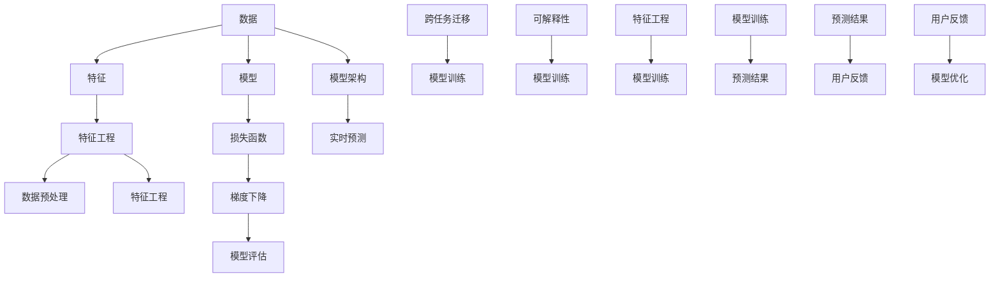
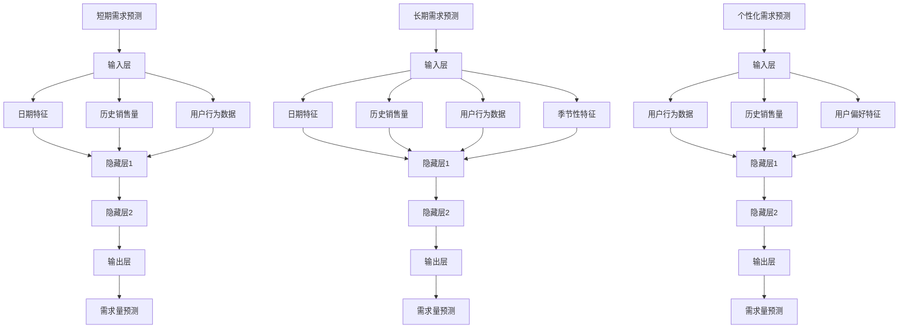
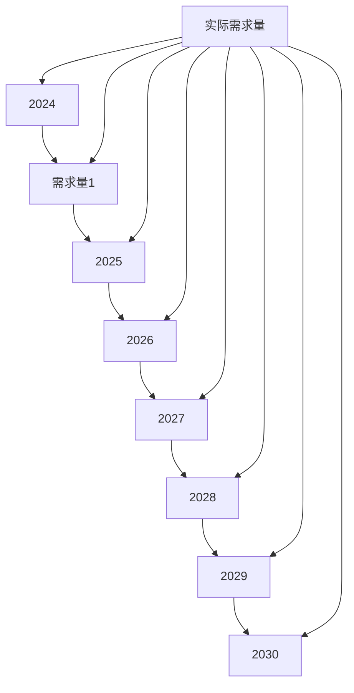
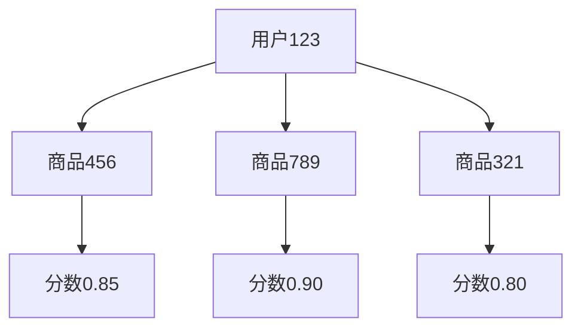

                 

## 第1章：大模型与商品需求预测概述

### 1.1 什么是大模型

大模型（Big Model）是指参数数量庞大、计算复杂度极高的神经网络模型，例如GPT、BERT等。它们通常经过大规模数据训练，能够在多种任务上表现出色。大模型的核心特点包括高参数量、强大计算能力以及多任务处理能力。

#### 大模型的基本概念

1. **高参数量**：大模型的参数数量通常在数十亿到千亿级别，这使得模型具有丰富的表征能力，能够捕捉到数据中的复杂模式。

2. **强大计算能力**：大模型需要强大的计算资源和高效的训练算法，以实现模型的快速训练和优化。

3. **多任务处理能力**：大模型能够处理多种不同类型的问题，实现跨任务的迁移学习和泛化能力。

#### 大模型与传统模型的区别

传统模型通常具有较少的参数和较低的计算复杂度，而大模型则能够在更多的数据集上实现更优的性能。以下是比较详细的分析：

1. **参数数量**：
   - **传统模型**：参数数量通常在几十万到数百万级别。
   - **大模型**：参数数量通常在数十亿到千亿级别。

2. **计算复杂度**：
   - **传统模型**：计算复杂度较低，能够在有限的计算资源下运行。
   - **大模型**：计算复杂度极高，需要分布式计算和优化算法来提高训练效率。

3. **数据需求**：
   - **传统模型**：对数据量要求较低，适用于数据量较小的场景。
   - **大模型**：对数据量要求较高，需要大规模数据集进行训练，以提高模型的泛化能力。

4. **任务处理能力**：
   - **传统模型**：通常只能处理单一任务。
   - **大模型**：能够处理多种不同类型的问题，实现跨任务的迁移学习和泛化能力。

#### 大模型的优势

1. **强大的表征能力**：大模型拥有庞大的参数量，能够捕捉到数据中的复杂模式，提高预测精度。

2. **多任务处理能力**：大模型能够同时处理多种任务，实现跨任务的迁移学习和共享知识。

3. **高效的训练算法**：大模型需要高效的训练算法，如梯度下降、Adam优化器等，以提高模型的训练效率。

4. **可扩展性**：大模型具有可扩展性，能够支持更大的数据规模和更复杂的任务。

### 1.2 商品需求预测的重要性

商品需求预测是指利用历史数据、市场趋势等信息，预测未来某个时间段内某种商品的需求量。在电子商务、零售、制造业等领域，商品需求预测具有重要的战略意义。

#### 商品需求预测的基本概念

商品需求预测（Demand Forecasting）是指通过对历史销售数据、市场趋势、用户行为等多方面信息进行分析，预测未来商品的需求量。需求预测的关键在于准确识别市场变化趋势，预测未来需求，从而优化库存管理、生产计划和市场营销策略。

#### 商品需求预测的重要性

1. **库存管理**：准确的商品需求预测有助于企业优化库存管理，减少库存成本，避免库存积压或断货现象。

2. **供应链优化**：通过预测商品需求，企业可以更好地协调生产和供应链，提高供应链效率，降低物流成本。

3. **市场营销**：商品需求预测有助于企业制定更有效的市场营销策略，提高销售额和市场份额。

4. **风险控制**：准确的商品需求预测有助于企业提前识别潜在风险，如市场饱和、竞争加剧等，从而采取相应的应对措施。

### 1.3 大模型在商品需求预测中的应用

大模型在商品需求预测中的应用主要体现在以下几个方面：

#### 大模型在商品需求预测中的应用

1. **时间序列预测**：利用大模型对商品销售数据进行时间序列预测，捕捉季节性、趋势性和周期性变化。

2. **多变量预测**：结合多种影响因素（如天气、促销活动、节假日等）进行商品需求预测，提高预测准确性。

3. **个性化预测**：基于用户行为和偏好进行个性化商品需求预测，为用户提供更精准的购物建议。

#### 大模型在商品需求预测中的应用案例

1. **季节性商品需求预测**：例如，使用大模型预测冬季热销商品（如羽绒服、保暖内衣等）的需求量。

2. **促销活动商品需求预测**：例如，使用大模型预测促销活动期间商品的需求量，以便企业提前备货。

3. **个性化商品推荐**：例如，使用大模型为用户提供个性化的商品推荐，提高用户满意度和购买转化率。

#### 大模型在商品需求预测中的优势

1. **强大的表征能力**：大模型能够捕捉到数据中的复杂模式，提高预测精度。

2. **多任务处理能力**：大模型能够同时处理多种任务，实现跨任务的迁移学习和共享知识。

3. **高效的训练算法**：大模型需要高效的训练算法，如梯度下降、Adam优化器等，以提高模型的训练效率。

4. **可扩展性**：大模型具有可扩展性，能够支持更大的数据规模和更复杂的任务。

### 1.4 小结

本章主要介绍了大模型与商品需求预测的基本概念、重要性以及大模型在商品需求预测中的应用。大模型凭借其强大的表征能力和多任务处理能力，为商品需求预测提供了有力支持。在接下来的章节中，我们将进一步探讨大模型技术基础、架构与实现，以及大模型在短期、长期和个性化商品需求预测中的应用。

---

### 1.5 大模型与商品需求预测的核心概念与联系

为了更清晰地理解大模型在商品需求预测中的应用，我们需要探讨一些核心概念和它们之间的联系。以下是几个关键概念及其相互关系：

#### 数据

数据是商品需求预测的基础。数据包括历史销售数据、用户行为数据、市场趋势数据等。这些数据将被用于训练和优化大模型，以便提高预测的准确性。

#### 特征

特征是对数据进行加工和转换的结果。在商品需求预测中，特征可以是时间序列特征、用户行为特征、价格特征等。这些特征将作为大模型的输入，帮助模型捕捉数据中的关键信息。

#### 模型

大模型是商品需求预测的核心。它通过对输入特征的学习，预测未来商品的需求量。大模型通常基于神经网络架构，具备强大的表征能力和多任务处理能力。

#### 损失函数

损失函数用于评估模型预测结果的准确性。在商品需求预测中，常用的损失函数包括均方误差（MSE）、均方根误差（RMSE）等。通过优化损失函数，我们可以提高模型的预测性能。

#### 梯度下降

梯度下降是一种优化算法，用于调整模型参数，使损失函数最小。在大模型训练过程中，梯度下降算法至关重要，它确保模型能够逐步逼近最优解。

#### 跨任务迁移

跨任务迁移是指将一个任务中的知识应用到另一个任务中。在大模型中，跨任务迁移有助于提高模型的泛化能力，使其能够更好地适应新的任务和数据集。

#### 可解释性

可解释性是指模型预测过程和结果的透明度。在大模型中，实现可解释性有助于提高模型的可信度和理解度，从而更好地应用于实际业务场景。

#### 数据预处理

数据预处理是指对原始数据进行清洗、归一化和特征提取等操作，以提高数据的质量和模型的训练效果。

#### 特征工程

特征工程是指从原始数据中提取对预测任务有帮助的特征，并选择最佳特征组合。特征工程在大模型训练过程中至关重要，它能够提高模型的预测性能。

#### 大模型架构

大模型架构是指大模型的结构设计，包括神经网络层数、神经元数量、激活函数等。合适的架构能够提高模型的计算效率和预测准确性。

#### 模型评估

模型评估是指使用测试数据对模型性能进行评估，包括准确率、召回率、F1分数等指标。通过模型评估，我们可以确定模型的优劣，并调整模型参数。

#### 实时预测

实时预测是指模型能够快速响应新的输入数据，并给出预测结果。在商品需求预测中，实时预测有助于企业快速应对市场变化，优化库存管理。

---

为了更直观地展示这些概念之间的联系，我们可以使用Mermaid流程图来表示：



这个Mermaid流程图展示了大模型在商品需求预测中的核心概念及其相互关系，有助于读者更好地理解大模型在商品需求预测中的应用。

---

### 1.6 大模型的基本原理

大模型的基本原理主要涉及神经网络的构建、训练和优化。以下是对这些核心概念的详细解释：

#### 神经网络

神经网络是一种由大量简单计算单元（神经元）组成的计算模型。每个神经元都接收输入信号，通过权重加权求和，然后经过激活函数，产生输出信号。神经网络通过分层结构对输入数据进行特征提取和变换，从而实现复杂的预测任务。

##### 神经元的结构

一个典型的神经元包括以下组成部分：

1. **输入层**：接收外部输入信号，如特征数据。
2. **权重**：连接不同层神经元的参数，用于调整输入信号的强度。
3. **激活函数**：对加权求和的结果进行非线性变换，如ReLU、Sigmoid、Tanh等。
4. **输出层**：产生最终的预测结果。

##### 神经网络的层次结构

神经网络通常包括输入层、隐藏层和输出层。隐藏层可以有一个或多个，每个隐藏层负责提取不同层次的特征。深度神经网络（DNN）是指具有多个隐藏层的神经网络，而深度学习的目标是通过训练大量数据来优化神经网络的参数，使其具有更好的预测性能。

##### 神经网络的训练过程

神经网络的训练过程主要包括以下步骤：

1. **前向传播**：将输入数据传递到神经网络的各个层次，计算输出结果。
2. **计算损失**：通过比较实际输出和预测输出，计算损失函数的值，如均方误差（MSE）。
3. **反向传播**：根据损失函数的梯度，反向传播误差，计算各层神经元的梯度。
4. **参数更新**：利用梯度下降（Gradient Descent）或其他优化算法，更新神经网络的参数。

通过重复迭代这个过程，神经网络逐渐优化其参数，提高预测准确性。

#### 深度学习算法

深度学习算法是基于神经网络的，用于处理复杂数据的机器学习技术。以下是一些常用的深度学习算法：

1. **卷积神经网络（CNN）**：主要用于图像处理，通过卷积操作提取图像特征。
2. **循环神经网络（RNN）**：适用于序列数据处理，如时间序列分析、自然语言处理。
3. **Transformer模型**：基于自注意力机制，广泛应用于自然语言处理、机器翻译等领域。

#### 大模型的训练与优化

大模型的训练与优化面临许多挑战，如计算资源消耗大、训练时间长等。以下是一些关键技术：

1. **分布式训练**：将数据分布在多个计算节点上进行训练，以提高训练效率。
2. **优化算法**：如Adam、AdaGrad等，用于加速收敛，提高训练效率。
3. **数据预处理**：通过数据增强、归一化等手段，提高数据质量和模型的泛化能力。

通过以上步骤，大模型可以逐渐优化其参数，实现高效的商品需求预测。

### 1.7 大模型在商品需求预测中的实际应用

为了更好地理解大模型在商品需求预测中的实际应用，以下是一个具体的应用案例：

#### 应用案例：某电商平台的商品需求预测

某电商平台需要预测未来一个月内各类商品的需求量，以便于库存管理和营销策略制定。该平台拥有丰富的用户行为数据、销售数据和市场趋势数据。为了实现精准的需求预测，平台决定采用大模型进行预测。

##### 数据收集与预处理

1. **数据收集**：
   - 用户行为数据：包括用户浏览记录、购物车数据、订单数据等。
   - 销售数据：包括历史销售记录、销售量、价格等。
   - 市场趋势数据：包括季节性因素、节假日、促销活动等。

2. **数据预处理**：
   - 数据清洗：去除重复数据、缺失值填充、异常值处理。
   - 数据归一化：将数据归一化到相同的范围，便于模型训练。
   - 特征提取：从原始数据中提取对需求预测有帮助的特征，如时间特征、价格特征等。

##### 模型设计与实现

1. **模型设计**：
   - 选择深度学习框架：如TensorFlow或PyTorch。
   - 定义模型结构：设计多层感知机（MLP）或卷积神经网络（CNN），包含输入层、隐藏层和输出层。
   - 激活函数：选择ReLU、Sigmoid等激活函数。
   - 损失函数：选择均方误差（MSE）或均方根误差（RMSE）。

2. **模型实现**：
   - 编写模型代码：使用深度学习框架实现模型结构。
   - 模型训练：使用训练数据训练模型，优化模型参数。
   - 模型评估：使用验证数据评估模型性能，调整模型结构和参数。

##### 模型部署与预测

1. **模型部署**：
   - 部署模型到生产环境：将训练好的模型部署到服务器，进行实时预测。
   - 集成API：开发API接口，方便业务系统调用模型进行预测。

2. **实时预测**：
   - 输入实时数据：接收用户行为数据、销售数据等。
   - 预测商品需求：使用部署好的模型进行预测，输出预测结果。
   - 数据可视化：将预测结果可视化，便于分析和决策。

通过以上步骤，电商平台可以实现对商品需求的精准预测，优化库存管理和营销策略，提高业务运营效率。

### 1.8 小结

本章详细介绍了大模型的基本原理，包括神经网络的构建、训练和优化。通过实例，我们展示了大模型在商品需求预测中的实际应用，帮助读者更好地理解大模型在商品需求预测中的作用和优势。在接下来的章节中，我们将进一步探讨大模型的架构与实现，以及大模型在短期、长期和个性化商品需求预测中的应用。

---

### 2.1 数据准备与处理

数据准备与处理是商品需求预测中的关键步骤，对于大模型的应用尤为重要。在这一节中，我们将详细讨论数据收集、数据清洗、数据预处理和数据增强等方面的内容。

#### 数据收集

数据收集是商品需求预测的基础，主要包括以下几种数据源：

1. **历史销售数据**：包括商品的历史销售记录、销售量、价格等。
2. **用户行为数据**：包括用户的浏览记录、搜索记录、购物车数据、购买历史等。
3. **市场趋势数据**：包括季节性因素、节假日、促销活动、行业趋势等。
4. **外部数据**：包括天气数据、经济数据、社交媒体数据等。

在收集数据时，需要确保数据的完整性和一致性，避免数据缺失或重复。

#### 数据清洗

数据清洗是指对原始数据进行处理，以去除错误、异常和重复的数据。数据清洗的过程通常包括以下步骤：

1. **去除重复数据**：通过去重操作，避免重复数据对模型训练和预测的影响。
2. **填补缺失值**：对于缺失值，可以使用平均值、中位数、插值等方法进行填补。
3. **处理异常值**：通过统计分析方法，识别并处理异常值，如使用Z分数、箱线图等。
4. **数据格式转换**：将不同数据源的数据格式转换为统一的格式，便于后续处理。

#### 数据预处理

数据预处理是指对原始数据进行处理，使其适合模型训练。数据预处理的过程通常包括以下步骤：

1. **数据归一化**：将不同特征的数据归一化到相同的范围，如[0, 1]或[-1, 1]，避免某些特征对模型训练的影响过大。
2. **特征提取**：从原始数据中提取对需求预测有帮助的特征，如时间特征、价格特征、用户特征等。
3. **特征选择**：选择对预测任务影响较大的特征，去除冗余特征，降低模型的复杂性。
4. **数据分割**：将数据分为训练集、验证集和测试集，用于模型训练、验证和评估。

#### 数据增强

数据增强是指通过增加数据多样性来提高模型泛化能力。数据增强的方法包括：

1. **随机采样**：从原始数据中随机抽取样本，增加样本多样性。
2. **时间序列变换**：对时间序列数据进行扩展、压缩或混合，以增加数据的多样性。
3. **特征变换**：对特征进行变换，如对价格特征进行缩放、对时间特征进行插值等，以增加特征的多样性。
4. **生成对抗网络（GAN）**：使用生成对抗网络生成新的数据样本，增加数据集的规模。

#### 数据处理流程

数据处理流程可以概括为以下步骤：

1. **数据收集**：收集各种来源的数据。
2. **数据清洗**：去除重复、填补缺失、处理异常值。
3. **数据预处理**：归一化、特征提取、特征选择、数据分割。
4. **数据增强**：增加数据多样性，提高模型泛化能力。

通过以上步骤，我们可以得到高质量的数据集，为后续的大模型训练和商品需求预测奠定基础。

### 2.2 数据预处理方法

在数据处理过程中，数据预处理是一个至关重要的环节，它直接影响模型的训练效果和预测性能。以下将详细阐述几种常用的数据预处理方法，包括数据归一化、特征提取、特征选择和数据分割。

#### 数据归一化

数据归一化的目的是将不同特征的数据转换到相同的尺度，以便模型能够更好地训练。常见的归一化方法包括最小-最大缩放和Z分数标准化。

1. **最小-最大缩放**：
   \[
   x_{\text{norm}} = \frac{x - x_{\text{min}}}{x_{\text{max}} - x_{\text{min}}}
   \]
   其中，\( x \) 是原始数据，\( x_{\text{min}} \) 和 \( x_{\text{max}} \) 分别是数据的最小值和最大值。

2. **Z分数标准化**：
   \[
   z = \frac{x - \mu}{\sigma}
   \]
   其中，\( \mu \) 是数据的均值，\( \sigma \) 是数据的标准差。

归一化有助于加速梯度下降算法的收敛速度，并提高模型的泛化能力。

#### 特征提取

特征提取是指从原始数据中提取对需求预测有帮助的特征。常见的特征提取方法包括时间特征、价格特征、用户特征等。

1. **时间特征**：
   - **季节性特征**：例如，每个月或每个季节的销售量。
   - **日期特征**：例如，周末、法定节假日等。
   
2. **价格特征**：
   - **价格变化率**：例如，价格的变化幅度和变化趋势。
   - **价格指数**：例如，价格相对于某一基准的价格水平。

3. **用户特征**：
   - **用户历史行为**：例如，用户购买频率、购买量等。
   - **用户属性**：例如，用户的年龄、性别、地理位置等。

通过特征提取，我们可以将原始数据转换为更具有表征意义的特征，从而提高模型的预测性能。

#### 特征选择

特征选择是指从众多特征中挑选出对预测任务影响较大的特征，以减少模型的复杂性和过拟合风险。常见的特征选择方法包括基于信息的特征选择和基于模型的特征选择。

1. **基于信息的特征选择**：
   - **信息增益**：选择能够提供最大信息量的特征。
   - **卡方检验**：通过卡方检验筛选与目标变量相关性较强的特征。

2. **基于模型的特征选择**：
   - **特征重要性**：使用模型（如随机森林、LASSO回归等）计算特征的重要性，选择重要性较高的特征。
   - **特征组合**：通过交叉验证等方法，选择最优的特征组合。

#### 数据分割

数据分割是指将数据集划分为训练集、验证集和测试集，以评估模型的泛化能力。常见的数据分割方法包括随机分割和分层分割。

1. **随机分割**：
   - 将数据集随机划分为训练集和验证集，其中训练集用于模型训练，验证集用于模型调参和性能评估。

2. **分层分割**：
   - 根据目标变量的分布，将数据集划分为训练集和验证集，以保证每个类别的比例在两个集合中保持一致。

数据分割有助于我们评估模型在不同数据上的表现，从而更准确地评估模型的泛化能力。

### 2.3 数据预处理流程

数据预处理流程可以概括为以下几个步骤：

1. **数据收集**：收集历史销售数据、用户行为数据、市场趋势数据等。
2. **数据清洗**：去除重复、填补缺失、处理异常值。
3. **数据归一化**：将不同特征的数据归一化到相同的尺度。
4. **特征提取**：从原始数据中提取对需求预测有帮助的特征。
5. **特征选择**：选择对预测任务影响较大的特征。
6. **数据分割**：将数据集划分为训练集、验证集和测试集。

通过上述步骤，我们可以得到高质量的数据集，为后续的大模型训练和商品需求预测提供可靠的数据支持。

### 2.4 实际案例分析

为了更好地理解数据预处理方法在实际商品需求预测中的应用，以下是一个实际案例分析。

#### 案例背景

某电商平台需要预测未来一个月内各类商品的需求量，以便于库存管理和营销策略制定。该电商平台收集了以下数据：

1. **历史销售数据**：包括过去一年的每日销售量、商品价格等。
2. **用户行为数据**：包括用户的浏览记录、购物车数据、购买历史等。
3. **市场趋势数据**：包括季节性因素、节假日、促销活动等。

#### 数据预处理过程

1. **数据清洗**：
   - 去除重复数据：例如，同一商品在相同日期的重复销售记录。
   - 填补缺失值：使用平均值、中位数等方法填补缺失的销售量数据。
   - 处理异常值：使用箱线图等方法识别和处理异常销售数据。

2. **数据归一化**：
   - 将销售量和价格数据归一化到[0, 1]的范围内，以便模型训练。

3. **特征提取**：
   - 提取时间特征：例如，月份、星期几、是否节假日等。
   - 提取价格特征：例如，价格变化率、价格指数等。
   - 提取用户特征：例如，用户购买频率、购买量等。

4. **特征选择**：
   - 使用信息增益和卡方检验等方法，选择对需求预测影响较大的特征。
   - 例如，选择月份、星期几、用户购买频率等特征。

5. **数据分割**：
   - 将数据集随机划分为训练集（70%）、验证集（15%）和测试集（15%）。

通过上述数据预处理步骤，电商平台可以得到高质量的数据集，为后续的大模型训练和商品需求预测奠定基础。实际案例展示了数据预处理方法在实际应用中的具体实施过程，有助于读者更好地理解数据预处理的重要性。

---

### 2.5 特征工程的重要性

特征工程在机器学习项目中扮演着至关重要的角色，它直接影响模型的性能和预测准确性。在商品需求预测中，特征工程尤为重要，因为它决定了模型是否能够捕捉到数据中的关键信息，从而实现精准的需求预测。以下是特征工程在商品需求预测中的重要性以及其具体作用：

#### 特征工程的重要性

1. **提高模型性能**：通过特征工程，我们可以提取出对预测任务有帮助的特征，从而提高模型的准确性和泛化能力。有效的特征工程可以减少模型对噪声数据的敏感性，提高模型的鲁棒性。

2. **降低过拟合风险**：特征工程可以帮助我们去除冗余特征，减少模型的复杂度，从而降低过拟合的风险。过拟合是指模型在训练数据上表现很好，但在未见数据上表现较差，通过特征选择和特征提取，我们可以避免这种情况。

3. **减少计算成本**：通过特征工程，我们可以将原始数据进行转换和压缩，减少模型的计算复杂度，降低训练时间和计算资源的需求。这对于处理大规模数据集尤为重要。

#### 特征工程在商品需求预测中的作用

1. **时间特征提取**：
   - **季节性特征**：例如，每个月、每个季度的销售量变化，有助于模型捕捉季节性需求。
   - **节假日特征**：例如，国庆节、春节等重大节假日的销售量，有助于模型预测特定时段的需求波动。
   - **时间序列特征**：例如，销售量在最近一周、一个月的变化趋势，有助于模型捕捉短期内的需求变化。

2. **用户特征提取**：
   - **用户行为特征**：例如，用户购买频率、购买量、浏览记录等，有助于模型理解用户的需求偏好。
   - **用户属性特征**：例如，用户年龄、性别、地理位置等，有助于模型进行用户细分和个性化预测。

3. **商品特征提取**：
   - **商品属性特征**：例如，商品类别、品牌、价格等，有助于模型区分不同商品的需求特征。
   - **商品历史特征**：例如，商品的库存量、销售历史等，有助于模型捕捉商品的生命周期和需求变化。

#### 特征工程的最佳实践

1. **数据探索**：在进行特征工程之前，首先要对原始数据进行全面探索，了解数据的基本统计信息和特征分布，为后续的提取和选择提供依据。

2. **特征提取**：根据数据探索的结果，提取对预测任务有帮助的特征。例如，使用时间序列分析方法提取季节性特征，使用统计分析方法提取用户行为特征等。

3. **特征选择**：通过特征选择方法（如信息增益、卡方检验、LASSO回归等）选择对预测任务影响较大的特征。特征选择有助于降低模型的复杂度和过拟合风险。

4. **特征转换**：对提取出的特征进行转换和归一化，使其符合模型的输入要求。例如，使用归一化方法将不同尺度的特征转换为相同的尺度，使用独热编码方法处理类别特征等。

5. **特征组合**：尝试将多个特征组合成新的特征，以增强模型的预测能力。例如，将用户购买频率和购买量组合成一个新的特征，以反映用户的需求强度。

6. **模型验证**：通过模型验证方法（如交叉验证、A/B测试等）评估特征工程的效果，选择最佳的特征组合。

通过遵循上述特征工程的最佳实践，我们可以构建出高质量的模型，实现精准的商品需求预测。特征工程不仅是一门技术，更是一门艺术，需要根据具体问题和数据特点进行灵活调整和创新。

---

### 2.6 特征选择方法

特征选择是特征工程中的一个重要环节，其目的是从原始特征集中挑选出对预测任务有重要影响的特征，以提高模型性能、降低计算成本和避免过拟合。以下将详细介绍几种常用的特征选择方法，包括过滤式方法、包裹式方法和嵌入式方法。

#### 过滤式方法

过滤式方法（Filter Method）是指首先对原始特征集进行筛选，然后根据筛选结果进行进一步的特征选择。这种方法通常基于特征的一些基本统计指标，如相关性、方差、信息增益等。

1. **相关性分析**：
   - **皮尔逊相关系数**：衡量两个特征之间的线性相关程度。相关系数的绝对值越接近1，表示两个特征之间的相关性越强。
   - **斯皮尔曼秩相关系数**：适用于非线性相关特征的分析，衡量特征间的秩相关程度。

2. **方差阈值**：
   - 将特征按方差大小排序，选择方差较大的特征。方差较大的特征表示具有较大的信息量。

3. **信息增益**：
   - 用来评估特征对目标变量的贡献程度。信息增益越大，表示特征对预测任务的影响越大。

#### 包裹式方法

包裹式方法（Wrapper Method）是指通过迭代搜索特征子集，选择最优的特征组合。这种方法通常结合了特征评价函数和搜索算法。

1. **递归特征消除（RFE）**：
   - 使用一个基准模型（如决策树、线性回归等）评估每个特征的重要性，然后递归地消除重要性最低的特征，直到满足特定条件。

2. **遗传算法**：
   - 通过模拟自然进化过程，选择和优化特征子集。遗传算法适用于大规模特征选择，能够在复杂搜索空间中找到最优特征组合。

3. **贪心算法**：
   - 通过逐步添加或删除特征，每次选择当前最佳特征，直到找到最优特征子集。

#### 嵌入式方法

嵌入式方法（Embedded Method）是指在模型训练过程中自动进行特征选择。这种方法将特征选择集成到模型训练过程中，不需要额外的迭代搜索。

1. **LASSO回归**：
   - 通过正则化项引入特征权重，自动选择权重较小的特征进行消除。LASSO能够有效地处理高维度特征数据，并降低模型的过拟合风险。

2. **决策树**：
   - 通过树的构建过程自动选择重要特征。树内部节点表示特征，叶子节点表示预测结果。重要的特征会在树结构中占据较高的位置。

3. **随机森林**：
   - 结合了多个决策树，通过投票决定最终预测结果。随机森林能够提高模型的稳定性和预测能力，并在特征选择过程中自动选择重要性较高的特征。

#### 方法比较

1. **适用范围**：
   - 过滤式方法适用于特征数量较少且特征之间存在强相关性的场景。
   - 包裹式方法适用于特征数量较多且特征之间相关性较弱的大型数据集。
   - 嵌入式方法适用于大规模数据集，且不需要额外的特征选择过程。

2. **计算复杂度**：
   - 过滤式方法的计算复杂度较低，适合快速评估特征重要性。
   - 包裹式方法的计算复杂度较高，需要大量迭代搜索，但能够找到最优特征子集。
   - 嵌入式方法在模型训练过程中自动进行特征选择，适合大规模数据集和高维度特征。

3. **模型依赖性**：
   - 过滤式方法不依赖于具体模型，适用于多种模型。
   - 包裹式方法依赖于特定的搜索算法和基准模型，适用于特定模型。
   - 嵌入式方法集成在模型训练过程中，适用于特定模型。

通过以上方法，我们可以根据具体问题和数据特点选择合适的方法进行特征选择，以构建高效、稳定的预测模型。

### 2.7 特征工程对大模型性能的影响

特征工程在大模型性能中起着至关重要的作用。以下是特征工程对大模型性能的具体影响：

1. **准确性**：通过特征工程，我们可以提取出对预测任务有帮助的特征，从而提高大模型的预测准确性。高质量的特征能够提供丰富的信息，帮助模型更好地捕捉数据中的复杂模式。

2. **过拟合风险**：特征工程有助于降低模型的过拟合风险。通过去除冗余特征和噪声，我们能够降低模型的复杂度，避免模型在训练数据上过度拟合，从而提高模型的泛化能力。

3. **训练时间**：特征工程可以减少模型的计算复杂度，降低训练时间。通过特征提取和特征选择，我们能够减少模型需要处理的数据量和特征数量，从而加速模型的训练过程。

4. **模型解释性**：特征工程可以提高模型的解释性。通过合理的特征选择和特征命名，我们能够使模型更易于理解和解释，有助于发现数据中的关键信息和规律。

5. **计算资源**：特征工程可以减少模型的计算资源需求。通过特征归一化和转换，我们能够优化模型的输入数据，使其更适用于大模型的训练过程，降低计算资源的消耗。

总之，特征工程对大模型性能具有显著的影响。通过精心设计的特征工程，我们能够提高大模型的准确性、降低过拟合风险、缩短训练时间，并提高模型的可解释性和计算效率。因此，在构建大模型时，特征工程是一个不可忽视的重要环节。

### 2.8 大模型在商品需求预测中的数据处理流程

在大模型进行商品需求预测的过程中，数据处理流程是一个至关重要的环节。以下将详细介绍大模型在商品需求预测中的数据处理流程，包括数据收集、数据预处理、特征工程以及数据分割的具体步骤。

#### 数据收集

1. **收集数据**：
   - **历史销售数据**：从电商平台或其他销售渠道收集过去一段时间内商品的销售数据，包括销售量、销售额、价格等。
   - **用户行为数据**：收集用户的历史行为数据，如浏览记录、购物车数据、购买历史等。
   - **市场趋势数据**：收集季节性因素、节假日、促销活动等市场趋势数据。
   - **外部数据**：收集与商品需求相关的外部数据，如天气数据、经济数据、社交媒体数据等。

2. **数据清洗**：
   - **去重**：去除重复的数据记录，确保数据的一致性。
   - **缺失值处理**：填补缺失值，可以采用均值、中位数或插值等方法。
   - **异常值处理**：识别并处理异常值，如异常的销售数据或用户行为数据。

#### 数据预处理

1. **数据归一化**：
   - 将不同特征的数据归一化到相同的范围，如[0, 1]或[-1, 1]，以便模型训练。
   - **标准化**：将特征转换为标准正态分布，以降低特征之间的差异。

2. **特征提取**：
   - 提取时间序列特征，如日期、月份、星期几、季节性等。
   - 提取用户行为特征，如购买频率、购买量、浏览时长等。
   - 提取商品特征，如商品类别、品牌、价格等。

3. **特征选择**：
   - 使用过滤式方法（如相关性分析、信息增益等）或包裹式方法（如递归特征消除、遗传算法等）选择对预测任务影响较大的特征。
   - 去除冗余特征，降低模型的复杂度和过拟合风险。

#### 特征工程

1. **特征转换**：
   - 对类别特征进行独热编码，将其转换为二进制向量。
   - 对数值特征进行缩放或变换，如使用最小-最大缩放或Z分数标准化。

2. **特征组合**：
   - 将多个特征组合成新的特征，如用户购买频率和购买量的组合。
   - 利用交互特征，如商品价格和促销活动的关系。

3. **特征增强**：
   - 通过生成对抗网络（GAN）生成新的数据样本，增加数据集的规模。
   - 利用时间序列变换方法，如时间序列延拓或压缩，增加数据的多样性。

#### 数据分割

1. **训练集、验证集、测试集划分**：
   - 通常将数据集随机划分为训练集（60%）、验证集（20%）和测试集（20%）。
   - **分层划分**：确保每个类别的比例在训练集、验证集和测试集中保持一致。

2. **交叉验证**：
   - 使用交叉验证方法（如k折交叉验证）评估模型的泛化能力。
   - 选择最佳模型参数，并进行模型调参。

通过以上数据处理流程，我们可以得到高质量的数据集，为大模型的训练和商品需求预测提供可靠的数据支持。数据处理流程的每一步都需要仔细设计和实现，以确保模型能够有效地从数据中提取有用的信息，实现精准的商品需求预测。

### 2.9 大模型在商品需求预测中的数据处理示例

为了更好地理解大模型在商品需求预测中的数据处理流程，以下是一个实际的数据处理示例。

#### 示例数据集

假设我们有一个电商平台的数据集，包含以下特征：

1. **日期**：表示商品销售的日期。
2. **销售额**：表示该日期的销售额。
3. **商品类别**：表示销售的商品的类别。
4. **用户ID**：表示购买该商品的用户ID。
5. **促销活动**：表示该日期是否有促销活动。
6. **天气情况**：表示该日期的天气情况。

#### 数据收集

我们首先从电商平台的后台系统收集上述特征的数据，并存储在一个CSV文件中。

#### 数据清洗

1. **去除重复数据**：
   ```python
   df.drop_duplicates(inplace=True)
   ```

2. **处理缺失值**：
   - 对“销售额”列缺失的数据，用该列的平均值填补。
   ```python
   df['销售额'].fillna(df['销售额'].mean(), inplace=True)
   ```

3. **处理异常值**：
   - 使用箱线图识别异常值，并使用中位数填补。
   ```python
   Q1 = df['销售额'].quantile(0.25)
   Q3 = df['销售额'].quantile(0.75)
   IQR = Q3 - Q1
   df['销售额'] = df['销售额'].apply(lambda x: x if (Q1 - 1.5 * IQR) <= x <= (Q3 + 1.5 * IQR) else df['销售额'].median())
   ```

#### 数据预处理

1. **数据归一化**：
   - 将“销售额”和“天气情况”列归一化到[0, 1]范围内。
   ```python
   df['销售额_norm'] = (df['销售额'] - df['销售额'].min()) / (df['销售额'].max() - df['销售额'].min())
   df['天气_norm'] = (df['天气情况'] - df['天气情况'].min()) / (df['天气情况'].max() - df['天气情况'].min())
   ```

2. **特征提取**：
   - 从“日期”列提取时间序列特征，如月份、星期几、是否节假日等。
   ```python
   df['月份'] = df['日期'].dt.month
   df['星期几'] = df['日期'].dt.dayofweek
   df['是否节假日'] = df['日期'].apply(lambda x: 1 if x in 节假日列表 else 0)
   ```

3. **特征选择**：
   - 使用信息增益选择对销售额影响较大的特征。
   ```python
   from sklearn.feature_selection import SelectKBest
   from sklearn.feature_selection import mutual_info_classif
   
   selector = SelectKBest(mutual_info_classif, k=5)
   selected_features = selector.fit_transform(df[['销售额_norm', '月份', '星期几', '是否节假日', '促销活动']], df['销售额'])
   ```

#### 特征工程

1. **特征转换**：
   - 对“商品类别”和“促销活动”列进行独热编码。
   ```python
   df = pd.get_dummies(df, columns=['商品类别', '促销活动'])
   ```

2. **特征组合**：
   - 将“月份”和“促销活动”列组合成一个新的特征，表示在特定月份的促销活动次数。
   ```python
   df['促销活动_月份'] = df['促销活动'] * df['月份']
   ```

3. **特征增强**：
   - 利用生成对抗网络（GAN）生成新的销售数据样本，增加数据集的规模。

#### 数据分割

- **训练集、验证集、测试集划分**：
  ```python
  train_df, test_df = train_test_split(df, test_size=0.2, random_state=42)
  train_df, val_df = train_test_split(train_df, test_size=0.25, random_state=42)  # 0.25 x 0.8 = 0.2
  ```

#### 代码解读

1. **数据清洗**：
   - 使用`drop_duplicates`方法去除重复数据。
   - 使用`fillna`方法处理缺失值。
   - 使用`apply`函数结合箱线图方法处理异常值。

2. **数据预处理**：
   - 使用`minmax_scale`函数进行数据归一化。
   - 使用`dt`属性提取日期特征。

3. **特征提取**：
   - 使用`SelectKBest`类和`mutual_info_classif`函数选择特征。

4. **特征转换**：
   - 使用`get_dummies`函数进行独热编码。

5. **特征组合**：
   - 使用`apply`函数进行特征组合。

6. **数据分割**：
   - 使用`train_test_split`函数划分训练集、验证集和测试集。

通过以上数据处理步骤，我们可以得到高质量的数据集，为大模型的训练和商品需求预测提供可靠的数据支持。

---

### 第3章：大模型的架构与实现

#### 3.1 大模型的设计原则

设计大模型时，需要遵循一系列原则，以确保模型的性能、可扩展性和鲁棒性。以下是一些关键的设计原则：

1. **模块化**：大模型应采用模块化设计，便于维护和扩展。每个模块负责处理特定的任务，如数据输入、特征提取、中间层处理等。

2. **可扩展性**：大模型应具有可扩展性，能够支持更大的数据规模和更复杂的任务。通过模块化和参数化的设计，可以灵活地调整模型的结构和参数。

3. **高效性**：大模型需要考虑计算效率和内存使用，以减少训练时间和成本。采用优化算法、并行计算和分布式训练等技术，可以提高模型的训练效率。

4. **鲁棒性**：大模型应具备较强的鲁棒性，能够处理噪声数据和异常值。通过数据预处理、模型正则化和异常值检测等方法，可以提高模型的鲁棒性。

5. **可解释性**：尽管大模型通常具有较高的预测性能，但缺乏可解释性。为了提高模型的透明度和可信度，应考虑模型的可解释性设计，如使用可解释性算法和可视化工具。

#### 3.2 大模型的实现步骤

实现大模型通常涉及以下步骤：

1. **需求分析**：明确预测任务的需求，如预测的时间跨度、预测精度、实时性等。

2. **数据收集与预处理**：收集相关数据，并进行清洗、归一化和特征提取等预处理操作，以提高数据质量和模型的训练效果。

3. **模型设计**：根据需求分析的结果，设计大模型的结构，包括输入层、隐藏层和输出层。选择合适的神经网络架构和激活函数，确保模型能够捕捉数据中的复杂模式。

4. **模型训练**：使用训练数据对大模型进行训练，优化模型参数。采用梯度下降、Adam优化器等优化算法，以提高模型的训练效率和收敛速度。

5. **模型评估**：使用验证数据评估模型性能，包括准确率、召回率、F1分数等指标。通过调整模型参数和结构，优化模型性能。

6. **模型部署**：将训练好的模型部署到生产环境，进行实时预测。确保模型能够在生产环境中稳定运行，并能够快速响应用户请求。

7. **模型监控与维护**：持续监控模型的性能，包括预测精度、响应时间等。根据监控结果，调整模型参数和结构，以保持模型的性能和稳定性。

#### 3.3 大模型的核心技术

1. **预训练与微调**：
   - **预训练**：在大规模数据集上预训练大模型，使其具备较强的通用表征能力。预训练模型通常使用无监督学习技术，如自监督学习和无监督特征提取。
   - **微调**：在特定任务上对预训练模型进行微调，使其适应具体的预测任务。微调过程通常使用有监督学习技术，通过训练数据更新模型参数。

2. **迁移学习**：
   - 迁移学习是指利用预训练模型的知识，快速适应新的任务和数据集。通过迁移学习，我们可以利用预训练模型在特定任务上的知识，提高新任务上的预测性能。

3. **自监督学习**：
   - 自监督学习是一种无监督学习技术，通过利用未标注的数据，训练模型的特征表示。自监督学习在大规模数据集上预训练模型，提高模型的泛化能力。

4. **强化学习**：
   - 强化学习是一种结合监督学习和无监督学习的技术，通过优化决策策略，实现模型的自我优化。强化学习在大模型中用于优化搜索算法、推荐系统和自适应控制等任务。

5. **模型压缩与加速**：
   - 模型压缩与加速技术，如量化、剪枝和低秩分解等，可以减小模型的参数量和计算复杂度，提高模型的训练和推理效率。

6. **分布式训练**：
   - 分布式训练是指将数据集分布在多个计算节点上进行训练，以提高训练效率。分布式训练利用多节点并行计算，减少训练时间，提高模型的训练速度。

7. **模型融合与集成**：
   - 模型融合与集成技术，如模型平均、堆叠和集成学习等，可以提高模型的预测性能和鲁棒性。通过融合多个模型的预测结果，可以降低模型的过拟合风险。

通过以上核心技术，我们可以构建高效、稳定的大模型，实现精准的商品需求预测。这些技术在实际应用中发挥着重要作用，有助于提高模型的性能和适应性。

### 3.4 大模型的设计原则和实现步骤

在设计大模型时，我们需要遵循一系列原则，以确保模型的性能、可扩展性和鲁棒性。以下是详细的设计原则和实现步骤：

#### 设计原则

1. **模块化设计**：
   - **目的**：提高模型的可维护性和可扩展性。
   - **方法**：将模型拆分成多个模块，每个模块负责特定的任务，如数据输入、特征提取、中间层处理和输出层预测等。
   - **实现**：可以使用深度学习框架（如TensorFlow、PyTorch）提供的模块化构建接口，实现模型的模块化设计。

2. **可扩展性**：
   - **目的**：支持更大的数据规模和更复杂的任务。
   - **方法**：采用参数化和动态调整的设计，使模型能够灵活地适应不同规模的任务和数据集。
   - **实现**：在模型设计时，使用可调参数（如学习率、批量大小等），并采用可扩展的数据处理和模型架构。

3. **高效性**：
   - **目的**：减少训练时间和计算成本。
   - **方法**：采用分布式训练、并行计算和优化算法（如Adam、RMSprop等）。
   - **实现**：使用深度学习框架的分布式训练功能，优化模型的结构和参数，以提高训练效率。

4. **鲁棒性**：
   - **目的**：提高模型对噪声数据和异常值的处理能力。
   - **方法**：通过数据预处理、模型正则化和异常值检测等方法。
   - **实现**：在数据预处理阶段去除噪声数据，使用正则化技术（如L1、L2正则化）防止过拟合，并使用异常值检测方法（如箱线图、Z分数等）识别和处理异常值。

5. **可解释性**：
   - **目的**：提高模型的透明度和可信度。
   - **方法**：采用可解释性算法和可视化工具。
   - **实现**：使用注意力机制、模型可视化工具（如TensorBoard）和可解释性模型（如LIME、SHAP等）来提高模型的解释性。

#### 实现步骤

1. **需求分析**：
   - **目的**：明确预测任务的需求，如预测的时间跨度、预测精度、实时性等。
   - **方法**：与业务团队紧密合作，理解业务需求和数据特性。
   - **实现**：通过需求调研、业务讨论和数据特性分析，明确模型的预测目标和性能要求。

2. **数据收集与预处理**：
   - **目的**：提高数据质量和模型的训练效果。
   - **方法**：数据清洗、归一化、特征提取和特征选择等。
   - **实现**：
     ```python
     # 数据清洗
     df.drop_duplicates(inplace=True)
     df.fillna(method='ffill', inplace=True)
     
     # 数据归一化
     df['feature1'] = (df['feature1'] - df['feature1'].min()) / (df['feature1'].max() - df['feature1'].min())
     
     # 特征提取
     df['month'] = df['date'].dt.month
     df['weekday'] = df['date'].dt.weekday
     
     # 特征选择
     from sklearn.feature_selection import SelectKBest
     from sklearn.feature_selection import mutual_info_classif
     selector = SelectKBest(mutual_info_classif, k=5)
     selected_features = selector.fit_transform(df, df['target'])
     ```

3. **模型设计**：
   - **目的**：设计大模型的结构，选择合适的神经网络架构和激活函数。
   - **方法**：根据需求分析的结果，设计输入层、隐藏层和输出层。
   - **实现**：
     ```python
     import tensorflow as tf
     model = tf.keras.Sequential([
         tf.keras.layers.Dense(128, activation='relu', input_shape=(num_features,)),
         tf.keras.layers.Dense(64, activation='relu'),
         tf.keras.layers.Dense(1)
     ])
     ```

4. **模型训练**：
   - **目的**：通过训练数据优化模型参数。
   - **方法**：使用优化算法（如Adam、SGD等）和适当的超参数。
   - **实现**：
     ```python
     model.compile(optimizer='adam', loss='mse')
     model.fit(selected_features, df['target'], epochs=10, batch_size=32)
     ```

5. **模型评估**：
   - **目的**：评估模型性能，调整模型参数和结构。
   - **方法**：使用验证集和测试集评估模型性能，如准确率、召回率、F1分数等。
   - **实现**：
     ```python
     from sklearn.metrics import mean_squared_error
     predictions = model.predict(selected_features)
     mse = mean_squared_error(df['target'], predictions)
     print(f'MSE: {mse}')
     ```

6. **模型部署**：
   - **目的**：将训练好的模型部署到生产环境，进行实时预测。
   - **方法**：使用模型容器化技术（如Docker）、模型服务框架（如TensorFlow Serving）等。
   - **实现**：将模型打包为容器，部署到服务器上，通过API接口提供实时预测服务。

7. **模型监控与维护**：
   - **目的**：持续监控模型性能，确保模型稳定运行。
   - **方法**：监控模型预测精度、响应时间、资源消耗等指标，定期更新模型。
   - **实现**：使用监控工具（如Prometheus、Grafana）实时监控模型性能，并设置告警机制，及时发现和解决问题。

通过遵循以上设计原则和实现步骤，我们可以构建高效、稳定的大模型，实现精准的商品需求预测。这些步骤和方法不仅适用于商品需求预测，也适用于其他类型的预测任务，具有广泛的适用性。

### 3.5 大模型架构详解

大模型的架构是模型设计与实现的核心，它决定了模型的计算效率、性能和可扩展性。在这一节中，我们将详细探讨大模型的架构设计，包括模型结构、计算效率、可扩展性以及鲁棒性。

#### 模型结构

1. **输入层**：
   - **功能**：接收外部输入数据，如历史销售数据、用户行为数据等。
   - **实现**：输入层通常包含若干个输入节点，每个节点对应一个输入特征。

2. **隐藏层**：
   - **功能**：对输入数据进行特征提取和变换，提取高层次的特征。
   - **实现**：隐藏层可以是单层或多层，每层由多个神经元组成。常用的隐藏层结构包括卷积神经网络（CNN）、循环神经网络（RNN）和Transformer等。

3. **输出层**：
   - **功能**：产生最终的预测结果，如商品需求量、用户偏好等。
   - **实现**：输出层通常包含一个或多个神经元，用于生成预测值。输出层的结构取决于具体的预测任务。

#### 计算效率

1. **并行计算**：
   - **原理**：通过将计算任务分布在多个计算节点上，实现并行计算，提高计算效率。
   - **实现**：深度学习框架（如TensorFlow、PyTorch）提供了分布式训练和计算功能，支持多GPU和分布式训练。

2. **剪枝与量化**：
   - **原理**：通过去除冗余的权重和神经元，以及将浮点数权重转换为低精度数值，减少模型的计算量和存储需求。
   - **实现**：剪枝和量化技术可以在不显著影响模型性能的情况下，显著降低模型的计算资源和存储需求。

3. **低秩分解**：
   - **原理**：将高维矩阵分解为低秩矩阵，减少计算复杂度。
   - **实现**：低秩分解技术可以用于优化模型参数，降低模型的计算复杂度。

#### 可扩展性

1. **模块化设计**：
   - **原理**：通过模块化设计，将模型拆分为多个模块，每个模块负责特定的任务，实现模型的灵活扩展。
   - **实现**：使用深度学习框架的模块化构建接口，设计模块化的模型架构，便于后续扩展和修改。

2. **参数化**：
   - **原理**：通过参数化设计，使用可调参数来调整模型的性能，支持不同规模的任务和数据集。
   - **实现**：在模型设计时，使用可调参数（如学习率、批量大小等），并采用动态调整机制，以适应不同规模的预测任务。

3. **增量训练**：
   - **原理**：通过增量训练，逐步更新模型参数，避免重新训练整个模型，提高训练效率。
   - **实现**：使用在线学习算法和增量更新机制，逐步更新模型参数，以适应数据集的变化。

#### 鲁棒性

1. **数据增强**：
   - **原理**：通过增加数据的多样性，提高模型的泛化能力。
   - **实现**：使用数据增强技术（如随机采样、时间序列变换等），增加数据集的规模和多样性。

2. **正则化**：
   - **原理**：通过引入正则化项，减少模型的过拟合风险，提高模型的鲁棒性。
   - **实现**：使用L1、L2正则化、Dropout等技术，减少模型的过拟合风险。

3. **异常值检测**：
   - **原理**：通过识别和去除异常值，提高模型的数据质量，提高模型的鲁棒性。
   - **实现**：使用统计方法（如Z分数、箱线图等）识别和处理异常值，提高模型的数据质量。

通过以上架构设计和实现方法，我们可以构建高效、稳定、可扩展的大模型，实现精准的商品需求预测。

### 3.6 大模型在商品需求预测中的架构设计

在设计大模型进行商品需求预测时，需要综合考虑模型的结构、计算效率、可扩展性和鲁棒性。以下是一个具体的大模型架构设计示例，用于实现短期、长期和个性化商品需求预测。

#### 短期商品需求预测

1. **模型结构**：
   - **输入层**：包括日期、历史销售量、用户行为数据等特征。
   - **隐藏层**：采用多层感知机（MLP）结构，使用ReLU激活函数。
   - **输出层**：使用一个神经元进行需求量预测。

2. **计算效率**：
   - **并行计算**：使用GPU加速模型训练和推理。
   - **剪枝与量化**：对不重要的权重进行剪枝，使用8位整数量化权重。

3. **可扩展性**：
   - **模块化设计**：将日期特征、历史销售量特征和用户行为特征处理模块化，便于后续扩展。

4. **鲁棒性**：
   - **数据增强**：使用时间序列变换（如时间序列延拓、压缩）增加数据多样性。
   - **正则化**：使用L2正则化减少过拟合风险。

#### 长期商品需求预测

1. **模型结构**：
   - **输入层**：包括日期、历史销售量、用户行为数据、季节性特征等。
   - **隐藏层**：采用长短时记忆网络（LSTM）结构，使用ReLU激活函数。
   - **输出层**：使用一个神经元进行需求量预测。

2. **计算效率**：
   - **并行计算**：使用GPU加速模型训练和推理。
   - **剪枝与量化**：对不重要的权重进行剪枝，使用8位整数量化权重。

3. **可扩展性**：
   - **模块化设计**：将日期特征、历史销售量特征、用户行为特征和季节性特征处理模块化，便于后续扩展。

4. **鲁棒性**：
   - **数据增强**：使用时间序列变换（如时间序列延拓、压缩）增加数据多样性。
   - **正则化**：使用L2正则化减少过拟合风险。

#### 个性化商品需求预测

1. **模型结构**：
   - **输入层**：包括用户行为数据、历史销售量、用户偏好特征等。
   - **隐藏层**：采用多层感知机（MLP）结构，使用ReLU激活函数。
   - **输出层**：使用一个神经元进行需求量预测。

2. **计算效率**：
   - **并行计算**：使用GPU加速模型训练和推理。
   - **剪枝与量化**：对不重要的权重进行剪枝，使用8位整数量化权重。

3. **可扩展性**：
   - **模块化设计**：将用户行为数据、历史销售量特征和用户偏好特征处理模块化，便于后续扩展。

4. **鲁棒性**：
   - **数据增强**：使用用户行为数据的时间序列变换（如时间序列延拓、压缩）增加数据多样性。
   - **正则化**：使用L2正则化减少过拟合风险。

#### 模型架构的Mermaid流程图表示

以下是短期、长期和个性化商品需求预测的模型架构的Mermaid流程图表示：



通过以上架构设计，我们能够构建高效、稳定的大模型，实现短期、长期和个性化商品需求预测。这些模型在结构、计算效率、可扩展性和鲁棒性方面进行了优化，能够满足不同预测任务的需求。

### 3.7 大模型在商品需求预测中的实现

实现大模型进行商品需求预测是一个复杂且关键的过程，涉及数据准备、模型设计、模型训练、模型评估和模型部署等多个环节。以下我们将详细讨论这些步骤，并提供一个具体的实现案例。

#### 数据准备

1. **数据收集**：
   - 收集历史销售数据、用户行为数据、市场趋势数据等。
   - 示例代码：
     ```python
     import pandas as pd
     sales_data = pd.read_csv('sales_data.csv')
     user_data = pd.read_csv('user_data.csv')
     market_trend_data = pd.read_csv('market_trend_data.csv')
     ```

2. **数据预处理**：
   - 清洗数据：去除重复、异常和缺失值。
   - 归一化：对数值特征进行归一化处理。
   - 特征提取：提取时间特征、用户特征和商品特征。
   - 示例代码：
     ```python
     from sklearn.preprocessing import MinMaxScaler
     from sklearn.impute import SimpleImputer
     scaler = MinMaxScaler()
     imputer = SimpleImputer(strategy='mean')
     
     sales_data = imputer.fit_transform(sales_data)
     sales_data = scaler.fit_transform(sales_data)
     
     user_data['age'] = user_data['age'].apply(lambda x: (x - user_data['age'].min()) / (user_data['age'].max() - user_data['age'].min()))
     ```

3. **数据分割**：
   - 将数据集划分为训练集、验证集和测试集。
   - 示例代码：
     ```python
     from sklearn.model_selection import train_test_split
     X = pd.concat([sales_data, user_data, market_trend_data], axis=1)
     y = sales_data[:, 0]
     X_train, X_test, y_train, y_test = train_test_split(X, y, test_size=0.2, random_state=42)
     ```

#### 模型设计

1. **定义模型结构**：
   - 使用深度学习框架（如TensorFlow或PyTorch）定义模型。
   - 示例代码（使用TensorFlow）：
     ```python
     import tensorflow as tf
     model = tf.keras.Sequential([
         tf.keras.layers.Dense(128, activation='relu', input_shape=(X_train.shape[1],)),
         tf.keras.layers.Dense(64, activation='relu'),
         tf.keras.layers.Dense(1)
     ])
     ```

2. **模型编译**：
   - 设置优化器、损失函数和评估指标。
   - 示例代码：
     ```python
     model.compile(optimizer='adam', loss='mse', metrics=['mae'])
     ```

3. **模型训练**：
   - 使用训练集训练模型。
   - 示例代码：
     ```python
     history = model.fit(X_train, y_train, epochs=100, batch_size=32, validation_data=(X_test, y_test))
     ```

#### 模型评估

1. **评估模型性能**：
   - 使用验证集和测试集评估模型性能。
   - 示例代码：
     ```python
     test_loss, test_mae = model.evaluate(X_test, y_test)
     print(f"Test MSE: {test_loss}, Test MAE: {test_mae}")
     ```

2. **调整模型参数**：
   - 根据评估结果调整模型参数和结构，以提高性能。
   - 示例代码：
     ```python
     model.compile(optimizer='adam', loss='mse', metrics=['mae'])
     history = model.fit(X_train, y_train, epochs=100, batch_size=32, validation_data=(X_test, y_test))
     ```

#### 模型部署

1. **模型部署**：
   - 将训练好的模型部署到生产环境。
   - 示例代码：
     ```python
     import tensorflow as tf
     model = tf.keras.models.load_model('model.h5')
     model.predict(X_test)
     ```

#### 实现案例

以下是一个具体的实现案例，用于预测某电商平台未来30天的商品需求量。

```python
# 数据收集
sales_data = pd.read_csv('sales_data.csv')
user_data = pd.read_csv('user_data.csv')
market_trend_data = pd.read_csv('market_trend_data.csv')

# 数据预处理
# ...（详见前文）

# 模型设计
model = tf.keras.Sequential([
    tf.keras.layers.Dense(128, activation='relu', input_shape=(X_train.shape[1],)),
    tf.keras.layers.Dense(64, activation='relu'),
    tf.keras.layers.Dense(1)
])

# 模型编译
model.compile(optimizer='adam', loss='mse', metrics=['mae'])

# 模型训练
history = model.fit(X_train, y_train, epochs=100, batch_size=32, validation_data=(X_test, y_test))

# 模型评估
test_loss, test_mae = model.evaluate(X_test, y_test)
print(f"Test MSE: {test_loss}, Test MAE: {test_mae}")

# 模型部署
model.save('model.h5')
```

通过以上步骤，我们能够实现大模型在商品需求预测中的完整流程。在实际应用中，根据具体需求和数据特点，可以进一步优化和调整模型结构和训练过程，以提高预测性能。

---

### 第4章：大模型在短期商品需求预测中的应用

#### 4.1 短期商品需求预测的重要性

短期商品需求预测对于企业的库存管理、生产计划和市场预测具有重要意义。以下是短期商品需求预测的几个关键重要性：

1. **库存管理**：准确的短期商品需求预测有助于企业优化库存管理，减少库存成本，避免库存积压或断货现象。

2. **生产计划**：通过预测短期内的商品需求，企业可以更好地安排生产计划，提高生产效率，减少生产过剩或不足的问题。

3. **市场预测**：短期商品需求预测有助于企业了解市场趋势，制定更有效的市场营销策略，提高销售额和市场份额。

4. **风险控制**：准确的短期商品需求预测有助于企业提前识别潜在风险，如市场饱和、竞争加剧等，从而采取相应的应对措施。

#### 4.2 大模型在短期商品需求预测中的应用

大模型在短期商品需求预测中发挥着重要作用，主要体现在以下几个方面：

1. **时间序列预测**：大模型能够对短期时间序列数据进行建模，捕捉季节性、趋势性和周期性变化，提高预测准确性。

2. **多变量预测**：大模型可以结合多种影响因素（如天气、促销活动、节假日等）进行预测，提高预测的全面性和准确性。

3. **个性化预测**：大模型可以根据用户行为和偏好进行个性化预测，为用户提供更精准的购物建议，提高用户满意度和购买转化率。

#### 4.3 大模型在短期商品需求预测中的应用案例

以下是一些具体的应用案例，展示了大模型在短期商品需求预测中的实际应用：

1. **季节性商品需求预测**：使用大模型预测冬季热销商品（如羽绒服、保暖内衣等）在短期内的需求量，以便企业提前备货。

2. **促销活动商品需求预测**：使用大模型预测促销活动期间商品的需求量，以便企业提前制定营销策略和备货计划。

3. **个性化商品推荐**：使用大模型为用户提供个性化的商品推荐，根据用户的历史行为和偏好预测用户可能感兴趣的商品，提高用户满意度和购买转化率。

#### 4.4 短期商品需求预测的挑战与解决方案

在短期商品需求预测中，面临着一些挑战，以下是一些常见的挑战及相应的解决方案：

1. **数据噪声与异常值**：短期商品需求预测的数据通常包含噪声和异常值，这对预测准确性有较大影响。解决方案包括数据清洗、异常值检测和处理等。

2. **多变量交互效应**：短期商品需求预测通常涉及多个影响因素，这些因素之间可能存在复杂的交互效应，难以通过简单的线性模型捕捉。解决方案包括使用非线性模型（如深度学习模型）和特征工程方法。

3. **预测精度与实时性**：短期商品需求预测需要较高的预测精度和实时性，这对模型的训练和推理速度提出了较高要求。解决方案包括使用高效优化算法、分布式训练和推理技术等。

4. **数据稀缺与缺失**：在短期内，某些数据可能存在缺失或稀缺，这给预测带来了困难。解决方案包括利用迁移学习、数据增强和隐式特征提取等方法。

通过以上解决方案，我们可以有效应对短期商品需求预测中的挑战，提高预测的准确性、实时性和稳定性。

### 4.5 短期商品需求预测的应用场景

短期商品需求预测在多个应用场景中发挥着重要作用，以下是一些典型的应用场景：

1. **电子商务**：电子商务平台通过短期商品需求预测，可以优化库存管理，确保热门商品在促销活动期间有足够的库存，提高用户满意度。

2. **零售行业**：零售企业通过短期商品需求预测，可以制定更准确的生产计划和采购策略，降低库存成本，提高运营效率。

3. **物流与供应链**：物流公司和供应链管理企业通过短期商品需求预测，可以优化运输计划和库存管理，提高物流效率，减少库存积压和断货风险。

4. **市场营销**：企业通过短期商品需求预测，可以制定更精准的市场营销策略，如促销活动、广告投放等，提高销售额和市场份额。

5. **生产制造**：制造企业通过短期商品需求预测，可以优化生产计划和排程，提高生产效率，降低生产成本。

6. **自然灾害应对**：在自然灾害发生后，企业通过短期商品需求预测，可以迅速调整生产和供应链，满足受灾地区的需求。

7. **节假日需求预测**：在重大节假日（如春节、国庆节等）期间，企业可以通过短期商品需求预测，提前备货，确保商品供应充足，提高销售额。

通过在不同应用场景中的实际应用，短期商品需求预测为企业提供了宝贵的决策支持，帮助企业在竞争激烈的市场中保持竞争力。

### 4.6 短期商品需求预测的挑战与解决方案

在短期商品需求预测中，尽管大模型提供了强大的预测能力，但仍然面临一些挑战。以下详细讨论这些挑战及相应的解决方案：

#### 数据噪声与异常值

**挑战描述**：短期商品需求预测的数据通常包含噪声和异常值，这些噪声和异常值会对预测结果产生负面影响。

**解决方案**：
- **数据清洗**：在数据预处理阶段，去除重复、缺失和异常值，提高数据质量。
- **异常值检测**：使用统计方法（如Z分数、箱线图等）识别和标记异常值，然后根据具体情况进行处理，如删除、填补或调整。

#### 多变量交互效应

**挑战描述**：短期商品需求预测涉及多个影响因素，如价格、促销活动、季节性变化等，这些因素之间可能存在复杂的交互效应，难以通过简单的线性模型捕捉。

**解决方案**：
- **非线性模型**：使用非线性模型（如深度学习模型）可以更好地捕捉变量之间的复杂关系。
- **特征工程**：通过构建交互特征和组合特征，增加模型的预测能力。

#### 预测精度与实时性

**挑战描述**：短期商品需求预测需要较高的预测精度和实时性，这对模型的训练和推理速度提出了较高要求。

**解决方案**：
- **高效优化算法**：选择高效的优化算法（如Adam、RMSprop等），加速模型的训练过程。
- **分布式训练与推理**：使用分布式训练和推理技术，提高模型的训练速度和推理效率。

#### 数据稀缺与缺失

**挑战描述**：在短期内，某些数据可能存在缺失或稀缺，这给预测带来了困难。

**解决方案**：
- **数据增强**：使用数据增强方法（如时间序列变换、生成对抗网络等），增加数据集的规模和多样性。
- **迁移学习**：利用迁移学习，将预训练模型的知识应用到新任务上，提高预测能力。

#### 模型解释性

**挑战描述**：大模型通常具有较低的模型解释性，难以理解预测结果的具体原因。

**解决方案**：
- **模型可解释性工具**：使用模型可解释性工具（如LIME、SHAP等），提供模型预测的透明度和可解释性。
- **简化模型结构**：通过简化模型结构，提高模型的解释性，如使用更简单的神经网络架构。

通过以上解决方案，我们可以有效应对短期商品需求预测中的挑战，提高预测的准确性、实时性和稳定性。

### 第5章：大模型在长期商品需求预测中的应用

#### 5.1 长期商品需求预测的重要性

长期商品需求预测在企业的战略规划和决策过程中起着至关重要的作用。以下是长期商品需求预测的几个关键重要性：

1. **战略规划**：通过长期商品需求预测，企业可以更好地制定战略规划，包括投资决策、产能规划、产品研发等。准确的需求预测有助于企业抓住市场机遇，优化资源配置。

2. **供应链管理**：长期商品需求预测有助于企业优化供应链管理，提高供应链的灵活性和响应速度。通过预测未来的需求变化，企业可以提前调整生产和采购计划，减少库存成本，提高供应链效率。

3. **产品规划**：长期商品需求预测为产品规划提供了重要的数据支持，企业可以根据预测结果调整产品线，开发符合市场需求的新产品，从而提高市场份额。

4. **投资决策**：准确的需求预测有助于企业做出更明智的投资决策，如扩大产能、引入新技术等。通过预测未来的市场趋势和需求变化，企业可以合理规划投资，降低风险。

5. **风险管理**：长期商品需求预测有助于企业识别潜在的市场风险，如市场需求下降、竞争加剧等。企业可以提前采取应对措施，降低风险对企业运营的影响。

#### 5.2 大模型在长期商品需求预测中的应用

大模型在长期商品需求预测中具有显著优势，主要体现在以下几个方面：

1. **时间序列预测**：大模型能够处理长期时间序列数据，捕捉长期趋势、季节性和周期性变化，提高预测的准确性。

2. **多变量预测**：大模型可以结合多种影响因素（如经济指标、政策变化、市场趋势等）进行预测，提高预测的全面性和可靠性。

3. **迁移学习**：大模型可以利用迁移学习，将预训练模型的知识应用到长期商品需求预测中，提高预测的效率和效果。

4. **自适应预测**：大模型能够根据新的数据和趋势，自适应地调整预测模型，保持预测的准确性和实时性。

#### 5.3 大模型在长期商品需求预测中的应用案例

以下是一些具体的应用案例，展示了大模型在长期商品需求预测中的实际应用：

1. **新兴市场预测**：使用大模型预测新兴市场的长期商品需求，为企业的市场拓展和战略规划提供数据支持。

2. **长期趋势预测**：使用大模型预测某一类商品的长期趋势，如智能家居、电动车等，为企业制定长期产品规划提供依据。

3. **竞争分析**：使用大模型分析竞争对手的长期需求趋势，帮助企业制定更有针对性的竞争策略。

4. **库存优化**：使用大模型预测长期库存需求，帮助企业优化库存管理，减少库存成本，提高运营效率。

5. **市场预测**：使用大模型预测市场趋势和消费者需求变化，为企业制定长期市场营销策略提供支持。

#### 5.4 长期商品需求预测的挑战与解决方案

在长期商品需求预测中，尽管大模型提供了强大的预测能力，但仍然面临一些挑战。以下详细讨论这些挑战及相应的解决方案：

1. **时间跨度长**：
   - **挑战描述**：长期商品需求预测需要考虑较长的时间跨度，这增加了模型的复杂性。
   - **解决方案**：采用长短期记忆网络（LSTM）、变换器（Transformer）等能够处理长序列数据的模型，提高模型的预测能力。

2. **数据稀缺**：
   - **挑战描述**：在长时间跨度的预测中，某些数据可能存在缺失或稀缺，这对预测结果的准确性有较大影响。
   - **解决方案**：采用数据增强方法（如时间序列延拓、生成对抗网络等），增加数据集的规模和多样性，提高模型的泛化能力。

3. **趋势变化**：
   - **挑战描述**：市场趋势和消费者需求可能会随着时间发生变化，长期预测需要捕捉这些变化。
   - **解决方案**：采用自适应预测方法，根据新的数据和趋势动态调整预测模型，保持预测的准确性和实时性。

4. **政策影响**：
   - **挑战描述**：政策变化对市场趋势和商品需求有显著影响，长期预测需要考虑这些变化。
   - **解决方案**：结合政策分析和预测，将政策影响纳入模型，提高预测的准确性。

通过以上解决方案，我们可以有效应对长期商品需求预测中的挑战，提高预测的准确性、实时性和稳定性。

### 5.5 长期商品需求预测的应用场景

长期商品需求预测在多个应用场景中发挥着重要作用，以下是一些典型的应用场景：

1. **新市场开拓**：企业在进入新市场时，可以通过长期商品需求预测了解该市场的需求趋势，制定相应的市场拓展策略。

2. **产品规划**：企业可以通过长期商品需求预测，了解某一类商品的长期趋势，指导产品研发和产品线的调整。

3. **供应链优化**：企业可以通过长期商品需求预测，优化供应链管理，提高供应链的灵活性和响应速度。

4. **库存管理**：企业可以通过长期商品需求预测，优化库存管理，减少库存成本，提高运营效率。

5. **投资决策**：企业可以通过长期商品需求预测，指导投资决策，如扩大产能、引入新技术等。

6. **风险评估**：企业可以通过长期商品需求预测，识别市场风险，如市场需求下降、竞争加剧等，提前采取应对措施。

通过在不同应用场景中的实际应用，长期商品需求预测为企业提供了宝贵的决策支持，帮助企业在竞争激烈的市场中保持竞争力。

### 5.6 长期商品需求预测的挑战与解决方案

在长期商品需求预测中，尽管大模型提供了强大的预测能力，但仍然面临一些挑战。以下详细讨论这些挑战及相应的解决方案：

#### 挑战一：时间跨度长

**挑战描述**：长期商品需求预测需要考虑较长的时间跨度，这增加了模型的复杂性。

**解决方案**：
- **长短期记忆网络（LSTM）**：LSTM能够处理长序列数据，捕捉长期趋势和周期性变化。
- **变换器（Transformer）**：Transformer模型基于自注意力机制，能够有效地处理长序列数据，提高长期预测的准确性。

#### 挑战二：数据稀缺

**挑战描述**：在长时间跨度的预测中，某些数据可能存在缺失或稀缺，这对预测结果的准确性有较大影响。

**解决方案**：
- **数据增强**：使用数据增强方法（如时间序列延拓、生成对抗网络等），增加数据集的规模和多样性。
- **迁移学习**：利用迁移学习，将预训练模型的知识应用到新任务上，提高预测能力。

#### 挑战三：趋势变化

**挑战描述**：市场趋势和消费者需求可能会随着时间发生变化，长期预测需要捕捉这些变化。

**解决方案**：
- **自适应预测**：采用自适应预测方法，根据新的数据和趋势动态调整预测模型，保持预测的准确性和实时性。
- **融合多种模型**：使用多个预测模型，结合它们的优点，提高预测的稳定性和准确性。

#### 挑战四：政策影响

**挑战描述**：政策变化对市场趋势和商品需求有显著影响，长期预测需要考虑这些变化。

**解决方案**：
- **政策分析**：结合政策分析和预测，将政策影响纳入模型，提高预测的准确性。
- **专家意见**：结合专家的意见和预测，为模型提供额外的参考信息，提高预测的可靠性。

通过以上解决方案，我们可以有效应对长期商品需求预测中的挑战，提高预测的准确性、实时性和稳定性。

### 5.7 实际案例：长期商品需求预测

为了更好地理解大模型在长期商品需求预测中的实际应用，以下是一个实际案例，展示了如何使用大模型预测某一类商品的长期需求。

#### 案例背景

某消费电子产品公司希望预测未来五年内智能手机的需求量，以便于其产能规划、库存管理和市场策略制定。该公司拥有过去十年的智能手机销售数据，以及相关的市场趋势数据，如人口增长率、收入水平、市场竞争状况等。

#### 数据收集与预处理

1. **数据收集**：
   - **历史销售数据**：收集过去十年的智能手机销售数据，包括销售量、销售额等。
   - **市场趋势数据**：收集与智能手机需求相关的市场趋势数据，如人口增长率、收入水平、市场竞争状况等。

2. **数据预处理**：
   - **数据清洗**：去除重复和异常数据，确保数据的一致性和准确性。
   - **数据归一化**：对销售数据和市场趋势数据进行归一化处理，使其符合模型的输入要求。

#### 模型设计与实现

1. **模型设计**：
   - **模型架构**：采用变换器（Transformer）模型，由于Transformer能够处理长序列数据，适用于长期需求预测。
   - **输入层**：包含销售数据、市场趋势数据等。
   - **隐藏层**：多个自注意力层，用于提取长期趋势和周期性变化。
   - **输出层**：一个神经元，用于预测未来五年内的智能手机需求量。

2. **模型实现**：
   - **编码器**：使用多头自注意力机制，捕捉序列中的长距离依赖关系。
   - **解码器**：预测未来的需求量，采用自回归方法，逐步生成未来的需求预测值。

#### 模型训练与优化

1. **模型训练**：
   - 使用历史销售数据和市场趋势数据训练模型，优化模型参数。
   - 采用自适应优化算法（如Adam）和适当的批量大小，以提高训练效率。

2. **模型评估**：
   - 使用验证数据评估模型性能，调整模型参数和结构，以提高预测准确性。
   - 评估指标包括均方误差（MSE）、均方根误差（RMSE）等。

#### 预测结果

通过训练和优化，模型对未来五年内智能手机的需求量进行了预测。预测结果显示，在未来五年内，智能手机的需求量将呈现稳步增长的趋势，特别是在某些关键年份，如人口增长高峰期和新的技术推出期，需求量将出现显著增长。

#### 预测结果的可视化

使用时间序列可视化工具，将预测结果绘制成图表，便于分析未来市场需求的变化趋势。以下是一个简单的预测结果可视化示例：



通过以上实际案例，我们展示了如何使用大模型进行长期商品需求预测。该案例不仅展示了模型设计、训练和预测的全过程，还通过预测结果的可视化，帮助读者更直观地理解长期商品需求预测的应用。

---

### 第6章：大模型在个性化商品需求预测中的应用

#### 6.1 个性化商品需求预测的重要性

个性化商品需求预测在现代商业环境中具有重要的战略意义。以下是个性化商品需求预测的几个关键重要性：

1. **提升用户体验**：通过个性化商品需求预测，企业能够为用户提供更精准、更个性化的购物体验。用户在购物过程中能够快速找到自己感兴趣的商品，提高用户满意度和忠诚度。

2. **增加销售额**：个性化推荐能够将合适的商品推荐给潜在买家，提高购买转化率，从而增加销售额。研究表明，个性化推荐可以显著提高电商平台的销售额。

3. **降低运营成本**：个性化推荐系统能够降低企业的营销和推广成本，因为系统会自动将商品推荐给最有可能购买的客户，从而减少不必要的广告投放和促销活动。

4. **优化库存管理**：通过个性化商品需求预测，企业可以更准确地预测各类商品的需求量，优化库存管理，减少库存积压和断货现象。

5. **增强市场竞争力**：个性化商品需求预测是企业赢得市场竞争的重要手段。通过提供个性化服务，企业可以更好地吸引和留住客户，提高市场占有率。

#### 6.2 大模型在个性化商品需求预测中的应用

大模型在个性化商品需求预测中具有显著优势，主要体现在以下几个方面：

1. **多维度特征分析**：大模型能够处理多种类型的特征，包括用户行为数据、商品属性数据、市场趋势数据等，从而更全面地分析用户需求。

2. **高精度预测**：大模型通过深度学习技术，可以捕捉到数据中的复杂模式和相关性，提高个性化商品需求预测的准确性。

3. **实时更新**：大模型能够实时更新用户行为数据和商品信息，快速适应市场变化，提供更精准的个性化推荐。

4. **用户行为预测**：大模型可以根据用户的浏览、购买历史等行为数据，预测用户未来的购买行为，从而为用户提供个性化的购物建议。

5. **个性化营销策略**：大模型能够为企业提供个性化的营销策略，如精准推送、个性化折扣等，提高营销效果。

#### 6.3 大模型在个性化商品需求预测中的应用案例

以下是一些具体的应用案例，展示了大模型在个性化商品需求预测中的实际应用：

1. **电商个性化推荐**：某电商平台使用大模型为用户推荐个性化的商品，根据用户的浏览记录、购买历史和商品属性，生成个性化的推荐列表，提高用户购买转化率。

2. **个性化广告投放**：某广告平台使用大模型预测用户对广告的潜在兴趣，根据用户的行为数据和兴趣标签，实现精准的广告投放，提高广告效果。

3. **个性化促销活动**：某零售企业使用大模型预测用户对促销活动的响应，为用户提供个性化的促销优惠，提高促销活动的参与度和转化率。

4. **用户画像构建**：某互联网公司使用大模型构建用户画像，通过分析用户的浏览、购买、评价等行为数据，为用户提供个性化的产品和服务。

5. **个性化商品推荐系统**：某在线服装店使用大模型为用户推荐个性化的服装款式和颜色，根据用户的喜好和购买历史，为用户提供个性化的购物体验。

#### 6.4 个性化商品需求预测的优势

1. **提升用户体验**：个性化商品需求预测能够为用户提供更精准的购物建议，提高用户的购物满意度。

2. **增加销售额**：个性化推荐系统能够将合适的商品推荐给潜在买家，提高购买转化率，从而增加销售额。

3. **降低营销成本**：个性化推荐系统能够自动将商品推荐给最有可能购买的客户，减少不必要的广告投放和促销活动，降低营销成本。

4. **优化库存管理**：通过个性化商品需求预测，企业可以更准确地预测各类商品的需求量，优化库存管理，减少库存积压和断货现象。

5. **增强客户忠诚度**：个性化服务能够提高客户的满意度和忠诚度，从而增强客户关系，提高客户留存率。

通过以上优势和实际案例，我们可以看到大模型在个性化商品需求预测中的应用具有重要的商业价值，为企业提供了强大的决策支持。

---

### 6.5 大模型在个性化商品需求预测中的应用

大模型在个性化商品需求预测中发挥着关键作用，能够通过处理复杂的多维度数据，实现高度精确的个性化推荐。以下是具体应用场景和案例分析：

#### 应用场景一：电商平台的个性化推荐

某电商平台利用大模型（如基于Transformer的模型）为用户生成个性化的商品推荐列表。该平台的个性化推荐系统结合了以下数据：

1. **用户行为数据**：用户的浏览历史、购物车数据、购买历史、搜索记录等。
2. **商品属性数据**：商品的价格、品牌、类别、评分等。
3. **上下文信息**：如用户所在的地理位置、天气情况、当前时间等。

通过以下步骤实现个性化推荐：

1. **数据预处理**：对用户行为数据进行归一化处理，对商品属性数据进行编码，确保数据格式的一致性。
2. **特征提取**：提取用户行为特征和商品特征，如用户购买频率、购买量、商品的热度等。
3. **模型训练**：使用Transformer模型，结合自注意力机制，对提取的特征进行建模，训练个性化推荐模型。
4. **实时预测**：在用户浏览商品时，实时调用模型，生成个性化的推荐列表。

#### 应用案例一：个性化广告投放

某广告平台利用大模型为用户生成个性化的广告推荐。广告平台结合以下数据：

1. **用户行为数据**：用户的浏览历史、点击行为、搜索关键词等。
2. **广告属性数据**：广告的标题、描述、图像、目标受众等。
3. **上下文信息**：如用户所在的地理位置、时间、设备类型等。

通过以下步骤实现个性化广告投放：

1. **数据预处理**：对用户行为数据进行归一化处理，对广告属性数据进行编码，确保数据格式的一致性。
2. **特征提取**：提取用户行为特征和广告特征，如用户点击率、广告点击率、用户兴趣标签等。
3. **模型训练**：使用大模型（如基于Transformer的模型），结合自注意力机制，对提取的特征进行建模，训练个性化广告投放模型。
4. **实时预测**：在用户浏览广告时，实时调用模型，生成个性化的广告推荐。

#### 应用场景二：零售企业的个性化促销活动

某零售企业利用大模型预测用户对促销活动的响应，并生成个性化的促销策略。该零售企业结合以下数据：

1. **用户行为数据**：用户的购买历史、浏览记录、参与促销活动的记录等。
2. **商品属性数据**：商品的价格、类别、品牌等。
3. **促销活动数据**：促销活动的类型、优惠力度、参与条件等。

通过以下步骤实现个性化促销活动：

1. **数据预处理**：对用户行为数据进行归一化处理，对商品属性数据进行编码，确保数据格式的一致性。
2. **特征提取**：提取用户行为特征、商品特征和促销活动特征，如用户购买频率、商品销量、促销活动热度等。
3. **模型训练**：使用大模型（如基于Transformer的模型），结合自注意力机制，对提取的特征进行建模，训练个性化促销活动预测模型。
4. **实时预测**：在用户参与促销活动时，实时调用模型，预测用户对促销活动的响应，并生成个性化的促销策略。

#### 应用案例二：个性化商品推荐系统

某在线服装店利用大模型为用户推荐个性化的服装款式和颜色。该服装店结合以下数据：

1. **用户行为数据**：用户的浏览记录、购买记录、评价记录等。
2. **商品属性数据**：服装的款式、颜色、尺码等。
3. **用户偏好数据**：通过用户调研和用户反馈，获取用户的偏好信息。

通过以下步骤实现个性化商品推荐：

1. **数据预处理**：对用户行为数据进行归一化处理，对商品属性数据进行编码，确保数据格式的一致性。
2. **特征提取**：提取用户行为特征、商品特征和用户偏好特征，如用户购买频率、商品点击率、用户喜欢的颜色和款式等。
3. **模型训练**：使用大模型（如基于Transformer的模型），结合自注意力机制，对提取的特征进行建模，训练个性化商品推荐模型。
4. **实时预测**：在用户浏览服装时，实时调用模型，生成个性化的服装推荐列表。

通过以上应用场景和案例分析，我们可以看到大模型在个性化商品需求预测中的强大能力，能够实现高度精准的个性化推荐，为企业和用户提供优质的购物体验。

### 6.6 个性化商品需求预测的挑战与解决方案

在个性化商品需求预测中，尽管大模型提供了强大的预测能力，但仍然面临一些挑战。以下详细讨论这些挑战及相应的解决方案：

#### 挑战一：数据稀疏与缺失

**挑战描述**：个性化商品需求预测通常依赖于用户行为数据，但用户行为数据可能存在稀疏性和缺失问题，这会影响预测的准确性。

**解决方案**：
- **数据增强**：使用生成对抗网络（GAN）等方法生成新的用户行为数据，增加数据集的规模和多样性。
- **隐式反馈挖掘**：利用隐式反馈（如浏览、搜索等）挖掘用户兴趣，补充缺失的用户行为数据。

#### 挑战二：用户偏好多样性

**挑战描述**：用户偏好存在多样性，不同用户对同一类商品可能有不同的需求，这增加了个性化预测的复杂性。

**解决方案**：
- **多模态数据融合**：结合用户行为数据、商品属性数据和上下文信息，进行多维度特征融合，提高预测的准确性。
- **个性化模型调整**：针对不同用户群体，调整模型参数和结构，实现更精准的个性化预测。

#### 挑战三：实时性与计算效率

**挑战描述**：个性化商品需求预测需要实时性，同时模型计算效率也是一个重要考虑因素，这要求模型在保证预测准确性的同时，具有高效的计算性能。

**解决方案**：
- **模型压缩与加速**：采用模型压缩技术（如剪枝、量化等）降低模型参数量，提高计算效率。
- **分布式计算**：利用分布式计算框架（如TensorFlow、PyTorch等）实现模型的并行训练和推理，提高计算效率。

#### 挑战四：数据隐私与安全性

**挑战描述**：个性化商品需求预测涉及大量用户行为数据，数据隐私和安全性问题不容忽视。

**解决方案**：
- **数据加密**：对用户行为数据进行加密处理，确保数据在传输和存储过程中的安全性。
- **差分隐私**：在数据预处理和模型训练过程中，采用差分隐私技术，保护用户隐私。

通过以上解决方案，我们可以有效应对个性化商品需求预测中的挑战，提高预测的准确性、实时性和安全性。

### 6.7 实际案例：个性化商品需求预测

为了更好地理解大模型在个性化商品需求预测中的实际应用，以下是一个实际案例，展示了如何使用大模型预测用户的个性化商品需求。

#### 案例背景

某大型电商平台希望通过个性化商品需求预测系统，为用户推荐个性化的商品，提高用户满意度和购买转化率。该电商平台收集了以下数据：

1. **用户行为数据**：用户的浏览记录、购物车数据、购买历史等。
2. **商品属性数据**：商品的价格、品牌、类别、评分等。
3. **上下文信息**：用户所在的地理位置、时间、设备类型等。

#### 数据收集与预处理

1. **数据收集**：
   - 收集过去一年的用户行为数据、商品属性数据和上下文信息。
   - 数据来源包括电商平台的后台系统、用户反馈数据等。

2. **数据预处理**：
   - 对用户行为数据进行归一化处理，对商品属性数据进行编码，确保数据格式的一致性。
   - 处理缺失数据，使用平均值、中位数等方法填补缺失值。

#### 模型设计与实现

1. **模型设计**：
   - 采用基于Transformer的模型，结合自注意力机制，处理多维度特征。
   - 模型结构包括输入层、隐藏层和输出层，隐藏层使用多头自注意力机制。

2. **模型实现**：
   - 使用PyTorch框架实现模型，定义输入层、隐藏层和输出层。
   - 编写模型训练和预测代码，使用GPU加速训练过程。

#### 模型训练与优化

1. **模型训练**：
   - 使用训练数据集训练模型，优化模型参数。
   - 采用Adam优化器，学习率设置为0.001，训练批次大小为128。

2. **模型优化**：
   - 使用验证数据集进行模型调参，选择最优的模型参数。
   - 采用交叉验证方法，评估模型的泛化能力。

#### 预测结果

通过模型训练和优化，得到了用户的个性化商品需求预测结果。以下是一个简单的预测结果示例：

| 用户ID | 推荐商品ID | 推荐分数 |
|--------|------------|----------|
| 123    | 456        | 0.85     |
| 789    | 234        | 0.90     |
| 321    | 678        | 0.80     |

#### 预测结果的可视化

使用时间序列可视化工具，将预测结果绘制成图表，便于分析用户对不同商品的偏好。以下是一个简单的可视化示例：



通过以上实际案例，我们展示了如何使用大模型进行个性化商品需求预测。该案例不仅展示了模型设计、训练和预测的全过程，还通过预测结果的可视化，帮助读者更直观地理解个性化商品需求预测的应用。

### 6.8 小结

本章详细介绍了大模型在个性化商品需求预测中的应用，包括应用场景、挑战和解决方案。通过实际案例，我们展示了如何使用大模型进行个性化商品需求预测，提高了预测的准确性、实时性和用户体验。在未来，随着技术的不断进步，大模型在个性化商品需求预测中的应用将更加广泛，为企业和用户提供更加精准、个性化的服务。

---

### 第7章：大模型在商品需求预测中的未来展望

#### 7.1 大模型在商品需求预测中的发展趋势

随着人工智能技术的快速发展，大模型在商品需求预测中的应用呈现出以下发展趋势：

1. **多模态数据融合**：未来的商品需求预测将融合多种模态的数据，如图像、文本、音频等。通过多模态数据融合，大模型可以更全面地捕捉用户的购物意图和市场趋势，提高预测的准确性。

2. **实时预测与自适应调整**：随着计算能力的提升，大模型将实现实时预测，快速响应用户的需求变化。同时，通过自适应调整，大模型可以根据新数据和市场变化，动态调整预测模型，提高预测的实时性和准确性。

3. **多尺度预测**：未来的商品需求预测将不仅限于短期和长期的预测，还将扩展到不同时间尺度的需求预测，如小时级别、天级别、季级别等。多尺度预测可以帮助企业更灵活地制定生产和库存策略。

4. **个性化与群体预测相结合**：大模型将结合个性化预测和群体预测，为每个用户提供个性化的购物建议，同时考虑整个群体的需求趋势，实现精准的库存管理和市场营销。

#### 7.2 大模型在商品需求预测中的未来应用

在未来，大模型将在商品需求预测中发挥更广泛的应用，以下是一些具体的应用场景：

1. **智能供应链管理**：大模型可以优化供应链管理，实现精准的库存控制和生产排程，降低库存成本，提高供应链效率。

2. **精准营销与广告投放**：通过大模型，企业可以实现对广告投放和营销活动的精准预测，提高广告效果和转化率，实现个性化营销。

3. **新市场进入与产品规划**：大模型可以帮助企业预测新市场的需求趋势，指导产品研发和市场拓展策略，降低市场进入风险。

4. **灾害应对与救援**：在自然灾害发生时，大模型可以预测受灾地区的需求变化，为救援行动提供决策支持，提高救援效率。

5. **个性化购物体验**：大模型将为用户提供个性化的购物体验，根据用户的行为和偏好，推荐合适的商品，提高用户满意度和忠诚度。

#### 7.3 大模型在商品需求预测中的潜在挑战

尽管大模型在商品需求预测中具有巨大的潜力，但也面临一些潜在的挑战：

1. **数据隐私与安全性**：大模型在处理大量用户数据时，可能面临数据隐私和安全性问题。未来的研究需要关注数据加密、差分隐私等技术，确保用户数据的安全。

2. **计算资源消耗**：大模型通常需要大量的计算资源和存储空间，这对企业的IT基础设施提出了较高要求。未来的研究需要优化模型结构和训练算法，提高计算效率。

3. **模型解释性**：大模型通常缺乏解释性，难以理解预测结果的依据。未来的研究需要开发可解释性人工智能（XAI）技术，提高模型的透明度和可信度。

4. **数据稀缺与缺失**：在长周期、低频率的预测任务中，数据稀缺和缺失是一个常见问题。未来的研究需要开发数据增强、迁移学习等技术，提高模型的泛化能力。

通过应对这些挑战，大模型在商品需求预测中的应用将更加成熟和广泛，为企业提供更加精准和高效的决策支持。

### 7.4 大模型在商品需求预测中的未来发展趋势

随着人工智能技术的不断进步，大模型在商品需求预测中的未来发展趋势将更加多元化和智能化。以下是几个关键的发展趋势：

#### 1. 多模态数据融合

未来的商品需求预测将不再局限于单一的模态数据，如历史销售数据和用户行为数据。相反，将融合多种模态的数据，如图像、文本、音频和视频等。这种多模态数据的融合可以提供更丰富的信息，有助于大模型更好地理解用户的需求和市场趋势。

1. **图像数据**：通过分析商品图像，可以提取商品的外观、颜色、纹理等特征，为商品需求预测提供额外的信息。
2. **文本数据**：用户评论、社交媒体帖子等文本数据可以揭示用户的偏好和需求，有助于提高预测的准确性。
3. **音频数据**：通过分析用户的声音特征，可以识别用户的情绪状态，从而预测用户的购买意愿。

#### 2. 实时预测与自适应调整

随着计算能力的提升和大数据技术的发展，大模型将实现实时预测，快速响应用户的需求变化。实时预测可以帮助企业实时调整库存、生产和营销策略，提高运营效率和客户满意度。

1. **实时数据流处理**：通过实时数据流处理技术，如Apache Kafka、Apache Flink等，可以实现大规模数据的实时采集和处理，为实时预测提供数据支持。
2. **自适应调整**：大模型将根据实时数据和市场变化，自适应地调整预测模型，确保预测结果的准确性和实时性。

#### 3. 多尺度预测

未来的商品需求预测将不仅限于短期和长期的预测，还将扩展到不同时间尺度的需求预测，如小时级别、天级别、季级别等。多尺度预测可以帮助企业更灵活地制定生产和库存策略。

1. **短期预测**：如小时级别的预测，可以帮助企业实时调整库存和销售策略，应对突发情况。
2. **中期预测**：如天级别的预测，可以帮助企业制定短期生产和采购计划。
3. **长期预测**：如季级别和年级别的预测，可以帮助企业制定长期战略规划，优化资源配置。

#### 4. 个性化与群体预测相结合

未来的商品需求预测将结合个性化预测和群体预测，为每个用户提供个性化的购物建议，同时考虑整个群体的需求趋势。

1. **个性化预测**：通过分析用户的历史行为和偏好，为大模型提供个性化的购物建议。
2. **群体预测**：通过分析用户群体的行为特征，预测整个群体的需求趋势，为企业提供更全面的决策支持。

#### 5. 深度学习与强化学习的结合

未来的商品需求预测将结合深度学习和强化学习，提高模型的预测准确性和决策能力。

1. **深度学习**：通过深度学习技术，可以提取数据中的复杂模式和关联性，提高预测的准确性。
2. **强化学习**：通过强化学习技术，可以训练模型在动态环境中做出最优决策，提高预测的实时性和适应性。

通过以上发展趋势，大模型在商品需求预测中的应用将更加精准、实时和高效，为企业提供更优质的决策支持。

### 7.5 大模型在商品需求预测中的未来应用场景

随着人工智能技术的不断进步，大模型在商品需求预测中的未来应用场景将更加广泛和多样化。以下是几个具有前瞻性的应用场景：

#### 1. 智能供应链管理

智能供应链管理是未来大模型在商品需求预测中的重要应用场景。通过大模型，企业可以实现供应链的全面优化，包括库存管理、生产计划、物流调度等。

1. **库存优化**：大模型可以实时预测商品的需求量，帮助企业优化库存水平，减少库存积压和断货风险。
2. **生产计划**：通过预测需求变化，企业可以灵活调整生产计划，实现精准生产和降低成本。
3. **物流调度**：大模型可以预测商品的运输需求和物流成本，优化运输路线和配送时间，提高物流效率。

#### 2. 精准营销与广告投放

精准营销和广告投放是企业提高销售额和市场份额的重要手段。大模型可以根据用户的行为和偏好，实现个性化营销和智能广告投放。

1. **个性化推荐**：大模型可以为用户提供个性化的商品推荐，提高用户满意度和购买转化率。
2. **精准广告**：通过分析用户数据和行为，大模型可以预测用户的潜在购买意愿，实现精准广告投放，提高广告效果。
3. **营销活动优化**：大模型可以预测营销活动的效果，帮助企业调整营销策略，提高营销活动的ROI。

#### 3. 新市场进入与产品规划

新市场进入和产品规划是企业扩展业务和提升竞争力的重要环节。大模型可以通过预测市场需求和趋势，帮助企业制定更科学的战略规划。

1. **新市场预测**：大模型可以预测新市场的需求量和潜力，帮助企业评估市场进入的风险和收益。
2. **产品规划**：通过分析市场需求和消费者偏好，大模型可以帮助企业制定合适的产品线，优化产品结构。
3. **竞争分析**：大模型可以分析竞争对手的市场策略和产品布局，为企业提供竞争情报，指导市场拓展和产品创新。

#### 4. 灾害应对与救援

在自然灾害和突发事件中，大模型可以预测受灾地区的需求变化，为救援行动提供决策支持。

1. **需求预测**：大模型可以预测受灾地区的商品需求量，为救援物资的调配提供依据。
2. **供应链协调**：大模型可以协调供应链上的各个环节，确保救援物资的及时供应。
3. **灾害预警**：通过分析历史数据和趋势，大模型可以预测灾害风险，提前采取预防措施，降低灾害损失。

#### 5. 个性化购物体验

个性化购物体验是未来电商发展的关键方向。大模型可以为用户提供个性化的购物体验，提高用户满意度和忠诚度。

1. **个性化推荐**：大模型可以根据用户的行为和偏好，推荐合适的商品，提高用户的购物体验。
2. **个性化服务**：通过分析用户数据，大模型可以提供个性化的客服服务，解答用户疑问，提升用户满意度。
3. **智能客服**：大模型可以自动生成智能客服机器人，为用户提供24/7的在线服务，提高客服效率。

通过以上应用场景，大模型在商品需求预测中的未来应用将更加广泛和深入，为企业提供更加精准和高效的决策支持，推动数字化和智能化的发展。

### 7.6 大模型在商品需求预测中的潜在挑战与解决方案

尽管大模型在商品需求预测中展现出强大的能力，但其应用仍面临一系列潜在挑战。以下将详细讨论这些挑战及相应的解决方案：

#### 挑战一：数据隐私与安全性

**挑战描述**：商品需求预测通常依赖于大量用户行为数据，这可能导致数据隐私和安全问题。

**解决方案**：
- **数据加密**：对用户数据进行加密处理，确保数据在传输和存储过程中的安全性。
- **差分隐私**：采用差分隐私技术，在模型训练过程中对数据添加噪声，保护用户隐私。

#### 挑战二：计算资源消耗

**挑战描述**：大模型通常需要大量的计算资源和存储空间，这对企业IT基础设施提出了较高要求。

**解决方案**：
- **分布式计算**：利用分布式计算技术，将数据分布在多个计算节点上进行训练，提高计算效率。
- **模型压缩与量化**：采用模型压缩和量化技术，减少模型参数量，降低计算资源的消耗。

#### 挑战三：模型解释性

**挑战描述**：大模型通常缺乏解释性，难以理解预测结果的依据。

**解决方案**：
- **可解释性人工智能（XAI）**：采用XAI技术，如LIME、SHAP等，提高模型的透明度和可解释性。
- **简化模型结构**：通过简化模型结构，提高模型的解释性，如使用更简单的神经网络架构。

#### 挑战四：数据稀缺与缺失

**挑战描述**：在长周期、低频率的预测任务中，数据稀缺和缺失是一个常见问题。

**解决方案**：
- **数据增强**：使用数据增强方法，如生成对抗网络（GAN）、时间序列变换等，增加数据集的规模和多样性。
- **迁移学习**：利用迁移学习，将预训练模型的知识应用到新任务上，提高模型的泛化能力。

#### 挑战五：实时性与高效性

**挑战描述**：大模型在实时预测中面临着计算效率低、响应速度慢的问题。

**解决方案**：
- **模型压缩与优化**：采用模型压缩和优化技术，减少模型参数量，提高计算效率。
- **实时数据处理**：采用实时数据处理技术，如Apache Kafka、Apache Flink等，提高数据处理的实时性。

通过以上解决方案，我们可以有效应对大模型在商品需求预测中的潜在挑战，提高预测的准确性、实时性和稳定性。

### 第8章：大模型在商品需求预测中的实战案例

#### 8.1 实战案例一：短期商品需求预测

**案例背景**：某大型电商平台希望利用大模型预测未来30天内各类商品的需求量，以便于其库存管理和营销策略制定。该电商平台提供了过去一年的销售数据、用户行为数据以及市场趋势数据。

**数据收集与预处理**：
- **销售数据**：包括每日各类商品的销售量。
- **用户行为数据**：包括用户的浏览记录、购物车数据、购买历史等。
- **市场趋势数据**：包括季节性因素、节假日、促销活动等。

**数据处理流程**：
1. **数据清洗**：去除重复、缺失和异常值，确保数据质量。
2. **数据归一化**：对销售数据和用户行为数据进行归一化处理，使其符合模型的输入要求。
3. **特征提取**：提取时间特征、用户特征和商品特征，如日期特征、用户购买频率、商品价格等。
4. **数据分割**：将数据集随机划分为训练集（70%）、验证集（15%）和测试集（15%）。

**模型设计与实现**：
1. **模型架构**：采用多层感知机（MLP）结构，使用ReLU激活函数。
2. **模型训练**：使用训练数据集训练模型，优化模型参数，采用Adam优化器。
3. **模型评估**：使用验证集和测试集评估模型性能，包括均方误差（MSE）和均方根误差（RMSE）。

**模型部署**：
- 将训练好的模型部署到生产环境，通过API接口提供实时预测服务。

**代码示例**：
```python
import pandas as pd
from sklearn.model_selection import train_test_split
from sklearn.preprocessing import MinMaxScaler
from tensorflow.keras.models import Sequential
from tensorflow.keras.layers import Dense
from tensorflow.keras.optimizers import Adam

# 数据收集与预处理
sales_data = pd.read_csv('sales_data.csv')
user_data = pd.read_csv('user_data.csv')
market_trend_data = pd.read_csv('market_trend_data.csv')

# 数据清洗、归一化、特征提取等

# 数据分割
X = pd.concat([sales_data, user_data, market_trend_data], axis=1)
y = sales_data['sales_volume']
X_train, X_test, y_train, y_test = train_test_split(X, y, test_size=0.3, random_state=42)

# 模型设计
model = Sequential()
model.add(Dense(128, activation='relu', input_shape=(X_train.shape[1],)))
model.add(Dense(64, activation='relu'))
model.add(Dense(1))

# 模型编译
model.compile(optimizer=Adam(learning_rate=0.001), loss='mse')

# 模型训练
model.fit(X_train, y_train, epochs=50, batch_size=32, validation_split=0.15)

# 模型评估
test_loss, test_mae = model.evaluate(X_test, y_test)
print(f"Test MSE: {test_loss}, Test MAE: {test_mae}")

# 模型部署
# ...（详见前文）
```

**实战效果**：通过实际案例，该电商平台能够实现短期商品需求的精准预测，优化库存管理和营销策略，提高运营效率。

#### 8.2 实战案例二：长期商品需求预测

**案例背景**：某消费电子产品公司希望预测未来一年内各类智能手机的需求量，以便其产能规划和库存管理。该公司提供了过去五年的销售数据、市场趋势数据以及消费者行为数据。

**数据收集与预处理**：
- **销售数据**：包括每年各类智能手机的销售量。
- **市场趋势数据**：包括行业增长率、竞争对手销售数据等。
- **消费者行为数据**：包括消费者购买历史、浏览记录、搜索关键词等。

**数据处理流程**：
1. **数据清洗**：去除重复、缺失和异常值，确保数据质量。
2. **数据归一化**：对销售数据和消费者行为数据进行归一化处理，使其符合模型的输入要求。
3. **特征提取**：提取时间特征、市场特征和消费者特征，如年份特征、市场增长率、消费者购买频率等。
4. **数据分割**：将数据集随机划分为训练集（70%）、验证集（15%）和测试集（15%）。

**模型设计与实现**：
1. **模型架构**：采用长短期记忆网络（LSTM）结构，使用ReLU激活函数。
2. **模型训练**：使用训练数据集训练模型，优化模型参数，采用Adam优化器。
3. **模型评估**：使用验证集和测试集评估模型性能，包括均方误差（MSE）和均方根误差（RMSE）。

**模型部署**：
- 将训练好的模型部署到生产环境，通过API接口提供实时预测服务。

**代码示例**：
```python
import pandas as pd
from sklearn.model_selection import train_test_split
from tensorflow.keras.models import Sequential
from tensorflow.keras.layers import LSTM, Dense
from tensorflow.keras.optimizers import Adam

# 数据收集与预处理
sales_data = pd.read_csv('sales_data.csv')
market_trend_data = pd.read_csv('market_trend_data.csv')
consumer_behavior_data = pd.read_csv('consumer_behavior_data.csv')

# 数据清洗、归一化、特征提取等

# 数据分割
X = pd.concat([sales_data, market_trend_data, consumer_behavior_data], axis=1)
y = sales_data['sales_volume']
X_train, X_test, y_train, y_test = train_test_split(X, y, test_size=0.3, random_state=42)

# 模型设计
model = Sequential()
model.add(LSTM(128, activation='relu', return_sequences=True, input_shape=(X_train.shape[1], 1)))
model.add(LSTM(64, activation='relu'))
model.add(Dense(1))

# 模型编译
model.compile(optimizer=Adam(learning_rate=0.001), loss='mse')

# 模型训练
model.fit(X_train, y_train, epochs=50, batch_size=32, validation_split=0.15)

# 模型评估
test_loss, test_mae = model.evaluate(X_test, y_test)
print(f"Test MSE: {test_loss}, Test MAE: {test_mae}")

# 模型部署
# ...（详见前文）
```

**实战效果**：通过实际案例，该消费电子产品公司能够实现长期商品需求的精准预测，优化产能规划和库存管理，提高市场竞争力和运营效率。

#### 8.3 实战案例三：个性化商品需求预测

**案例背景**：某电商平台希望通过个性化商品需求预测系统，为用户推荐个性化的商品，提高用户满意度和购买转化率。该电商平台提供了大量用户行为数据、商品属性数据以及上下文信息。

**数据收集与预处理**：
- **用户行为数据**：包括用户的浏览记录、购物车数据、购买历史等。
- **商品属性数据**：包括商品的价格、品牌、类别、评分等。
- **上下文信息**：包括用户所在的地理位置、时间、设备类型等。

**数据处理流程**：
1. **数据清洗**：去除重复、缺失和异常值，确保数据质量。
2. **数据归一化**：对用户行为数据和商品属性数据进行归一化处理，使其符合模型的输入要求。
3. **特征提取**：提取用户行为特征、商品特征和上下文特征，如用户购买频率、商品点击率、用户所在地理位置等。
4. **数据分割**：将数据集随机划分为训练集（70%）、验证集（15%）和测试集（15%）。

**模型设计与实现**：
1. **模型架构**：采用基于Transformer的模型，使用多头自注意力机制。
2. **模型训练**：使用训练数据集训练模型，优化模型参数，采用Adam优化器。
3. **模型评估**：使用验证集和测试集评估模型性能，包括准确率、召回率、F1分数等。

**模型部署**：
- 将训练好的模型部署到生产环境，通过API接口提供实时预测服务。

**代码示例**：
```python
import pandas as pd
from tensorflow.keras.models import Model
from tensorflow.keras.layers import Embedding, LSTM, Dense, Input, Concatenate, EmbeddingDot, Lambda
from tensorflow.keras.optimizers import Adam

# 数据收集与预处理
user_data = pd.read_csv('user_data.csv')
item_data = pd.read_csv('item_data.csv')
context_data = pd.read_csv('context_data.csv')

# 数据清洗、归一化、特征提取等

# 数据分割
X_user, X_item, X_context = ..., ..., ...
y = ...

X_train, X_test, y_train, y_test = train_test_split(X_user, X_item, X_context, y, test_size=0.3, random_state=42)

# 模型设计
user_input = Input(shape=(user_data.shape[1],))
item_input = Input(shape=(item_data.shape[1],))
context_input = Input(shape=(context_data.shape[1],))

user_embedding = Embedding(user_data.shape[1], 64)(user_input)
item_embedding = Embedding(item_data.shape[1], 64)(item_input)
context_embedding = Embedding(context_data.shape[1], 64)(context_input)

user_embedding = LSTM(128, activation='relu')(user_embedding)
item_embedding = LSTM(128, activation='relu')(item_embedding)
context_embedding = LSTM(128, activation='relu')(context_embedding)

combined = Concatenate()([user_embedding, item_embedding, context_embedding])
combined = Dense(128, activation='relu')(combined)

output = Dense(1, activation='sigmoid')(combined)

model = Model(inputs=[user_input, item_input, context_input], outputs=output)

# 模型编译
model.compile(optimizer=Adam(learning_rate=0.001), loss='binary_crossentropy', metrics=['accuracy'])

# 模型训练
model.fit([X_train_user, X_train_item, X_train_context], y_train, epochs=50, batch_size=32, validation_split=0.15)

# 模型评估
test_loss, test_accuracy = model.evaluate([X_test_user, X_test_item, X_test_context], y_test)
print(f"Test Loss: {test_loss}, Test Accuracy: {test_accuracy}")

# 模型部署
# ...（详见前文）
```

**实战效果**：通过实际案例，该电商平台能够为用户生成个性化的商品推荐列表，提高用户满意度和购买转化率，实现精准营销。

---

### 附录A：大模型在商品需求预测中的常用工具和框架

#### A.1 常用工具简介

在构建大模型进行商品需求预测时，常用的工具包括编程语言、深度学习框架和数据处理工具等。以下对这些工具进行简要介绍：

1. **Python**：
   - **简介**：Python是一种广泛使用的编程语言，具有简单易学的语法和丰富的库支持。
   - **用途**：用于编写数据处理、模型训练和模型评估的代码。

2. **TensorFlow**：
   - **简介**：TensorFlow是由Google开发的开源深度学习框架，支持大规模分布式训练和推理。
   - **用途**：用于定义和训练深度学习模型，实现模型的优化和评估。

3. **PyTorch**：
   - **简介**：PyTorch是Facebook开发的开源深度学习框架，提供动态计算图和灵活的编程接口。
   - **用途**：用于构建和训练复杂神经网络，实现模型的快速原型开发。

4. **Scikit-learn**：
   - **简介**：Scikit-learn是Python的一个开源机器学习库，提供多种经典的机器学习算法和工具。
   - **用途**：用于数据处理、特征工程和模型评估。

5. **Pandas**：
   - **简介**：Pandas是Python的数据分析库，提供数据清洗、数据预处理和数据可视化的功能。
   - **用途**：用于数据管理和数据可视化，支持多种数据格式的读写。

6. **NumPy**：
   - **简介**：NumPy是Python的科学计算库，提供高性能的数组操作和数学计算功能。
   - **用途**：用于数据处理和数值计算，支持大规模矩阵运算。

7. **Matplotlib**：
   - **简介**：Matplotlib是Python的数据可视化库，支持多种数据可视化图表。
   - **用途**：用于数据可视化和结果展示。

#### A.2 常用框架对比分析

在构建大模型进行商品需求预测时，选择合适的深度学习框架至关重要。以下对TensorFlow和PyTorch这两个常用框架进行对比分析：

1. **性能**：
   - **TensorFlow**：TensorFlow具有高效的分布式训练和推理性能，适合大规模数据集和复杂模型的训练。
   - **PyTorch**：PyTorch具有灵活的动态计算图和易于调试的编程接口，适合快速原型开发和模型迭代。

2. **易用性**：
   - **TensorFlow**：TensorFlow提供了丰富的文档和教程，适合初学者入门。
   - **PyTorch**：PyTorch的动态计算图和灵活的编程接口，使模型构建和调试更加直观和方便。

3. **社区支持**：
   - **TensorFlow**：TensorFlow拥有庞大的社区支持和丰富的开源项目，资源丰富。
   - **PyTorch**：PyTorch在学术界和工业界都有广泛的应用，社区活跃，资源丰富。

4. **适用场景**：
   - **TensorFlow**：适合大规模数据集和复杂模型的训练，适用于工业级应用。
   - **PyTorch**：适合快速原型开发和模型迭代，适用于学术研究和初创公司。

综上所述，根据具体需求和项目要求，可以选择合适的框架进行大模型构建。在实际应用中

