                 

### 《大模型多模态融合能力评估：LLM设计的跨媒体测试》

> **关键词**：大模型、多模态融合、跨媒体测试、LLM设计、性能评估

> **摘要**：本文探讨了大规模语言模型（LLM）在多模态融合中的能力评估方法。通过对大模型跨媒体测试的需求与重要性、多模态融合技术基础、跨媒体测试框架与工具的深入分析，本文提出了一个系统性的跨媒体测试方法，并通过实际项目案例展示了其应用效果。文章旨在为研究人员和开发者提供有价值的指导，以进一步提升大模型在多模态融合领域的应用能力。

### 第一部分：背景与基础

#### 1.1 大模型与多模态融合概述

#### 1.1.1 大模型的发展历程

**大模型的概念与特征**

大模型（Large Models）是指具有数亿乃至数十亿参数的神经网络模型，它们在人工智能领域中具有变革性的影响力。大模型的出现得益于计算能力的提升和海量数据的积累。代表性的模型包括GPT-3、BERT、T5等，这些模型在语言理解和生成任务上取得了显著的成果。

**大模型的分类与应用场景**

大模型主要分为两类：语言模型和视觉模型。语言模型如GPT系列，主要应用于自然语言处理任务；视觉模型如Vision Transformer（ViT），则主要应用于计算机视觉任务。此外，一些模型如GLM，同时具备语言和视觉处理能力，可实现跨模态融合。

#### 1.1.2 多模态融合的定义与意义

**多模态数据源的类型**

多模态融合涉及多种数据源，如图像、文本、音频、视频等。这些数据源各有特点，例如图像提供视觉信息，文本提供语言信息，音频提供听觉信息。

**多模态融合的优势与挑战**

多模态融合的优势在于可以充分利用不同模态的数据，提高任务的准确性和鲁棒性。然而，多模态融合也面临诸多挑战，如模态差异、数据同步、模型训练复杂性等。

#### 1.1.3 跨媒体测试的需求与重要性

**跨媒体测试的挑战**

跨媒体测试需要处理不同模态的数据，且数据源之间存在复杂的关联性。此外，测试场景多样化，使得测试设计变得复杂。

**跨媒体测试的意义**

跨媒体测试有助于评估大模型在真实应用场景中的表现，提高模型的实用性和可靠性。通过跨媒体测试，可以发现和解决模型在多模态融合中的潜在问题，为模型的优化提供依据。

#### 1.2 多模态融合技术基础

#### 1.2.1 多模态数据的表示与处理

**图像、文本、音频等数据的特征提取**

图像特征提取：卷积神经网络（CNN）常用于提取图像特征。例如，ResNet、Inception等模型具有良好的特征提取能力。

文本特征提取：词嵌入技术如Word2Vec、BERT等，可以将文本转换为向量表示。

音频特征提取：循环神经网络（RNN）、长短期记忆网络（LSTM）等，可以提取音频信号中的时序特征。

**多模态数据的融合策略**

多模态数据融合策略可分为特征级融合和决策级融合。特征级融合直接对多个模态的特征进行拼接或加权；决策级融合则基于融合后的特征进行分类或预测。

#### 1.2.2 多模态融合的常见方法

**传统方法：特征级融合、决策级融合**

特征级融合：将不同模态的特征进行拼接或加权，形成新的特征向量，然后输入到分类器中。

决策级融合：对每个模态的特征分别进行分类或预测，然后通过投票或贝叶斯框架进行集成。

**现代方法：深度学习框架下的融合策略**

深度学习框架下的融合策略，如多任务学习、多模态编码器-解码器模型等，能够更好地利用多模态数据，提高融合效果。

#### 1.2.3 多模态融合性能评估指标

**评估指标的选择与设计**

评估指标的选择取决于具体任务和应用场景。常用的评估指标包括准确率、召回率、F1分数等。

**评估指标的计算与解释**

准确率（Accuracy）表示模型正确预测的样本数占总样本数的比例。

召回率（Recall）表示模型正确预测的样本数占实际正样本数的比例。

F1分数（F1 Score）是准确率和召回率的调和平均值，综合考虑了模型的精确度和召回率。

#### 1.3 跨媒体测试框架与工具

#### 1.3.1 跨媒体测试框架的设计原则

**数据集的选择与预处理**

选择具有代表性的数据集，并进行预处理，如数据清洗、数据增强等，以提高测试数据的多样性和质量。

**测试任务的定义与实现**

定义清晰的测试任务，如图像识别、文本分类、音频情感分析等，并实现相应的评估指标。

#### 1.3.2 跨媒体测试工具的选择与使用

**数据集获取与处理**

选择合适的跨媒体测试工具，如Hugging Face、TensorFlow等，进行数据集的获取和处理。

**测试工具的功能与特点**

测试工具应具备数据预处理、模型训练、模型评估等功能，并具有可扩展性和灵活性。

#### 1.3.3 跨媒体测试的流程与方法

**数据收集与清洗**

收集具有代表性的多模态数据，并进行清洗，去除噪声和错误数据。

**模型训练与评估**

使用预处理后的数据训练模型，并在测试集上评估模型性能。

**结果分析与优化**

分析模型性能，找出不足之处，并进行优化调整。

### 第二部分：核心算法原理

#### 2.1 多模态融合算法原理

#### 2.1.1 传统多模态融合算法

**特征级融合**

```plaintext
特征级融合：将不同模态的特征进行拼接或加权，形成新的特征向量。
Fused Features = [Image Features; Text Features; Audio Features]
```

**决策级融合**

```plaintext
决策级融合：对每个模态的特征分别进行分类或预测，然后通过投票或贝叶斯框架进行集成。
Prediction = argmax(Probability) ( Voting or Bayesian Framework )
```

#### 2.1.2 深度学习框架下的多模态融合

**神经网络结构设计**

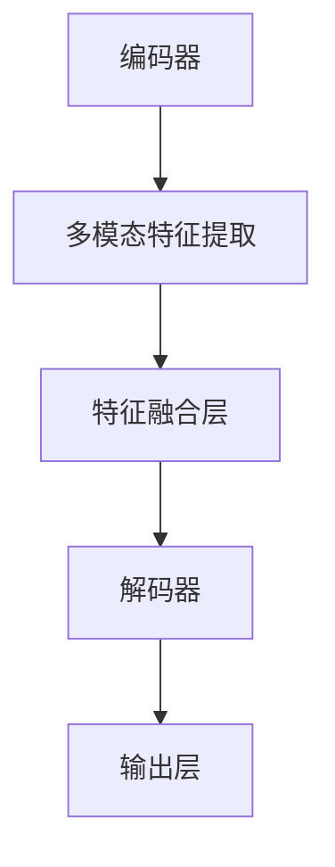

**模型训练与优化**

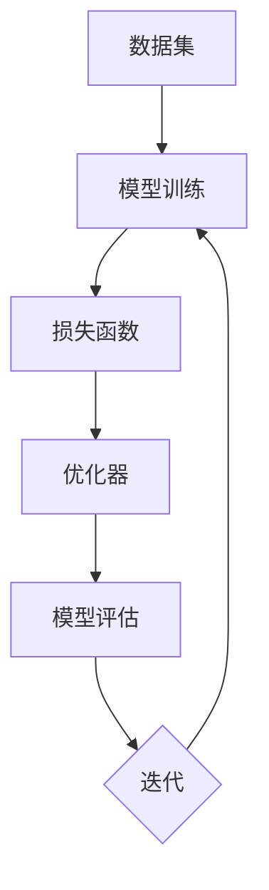

#### 2.1.3 多模态融合算法的优化与调整

**参数调优**

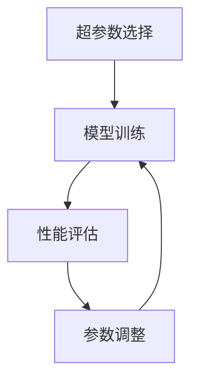

**模型优化**

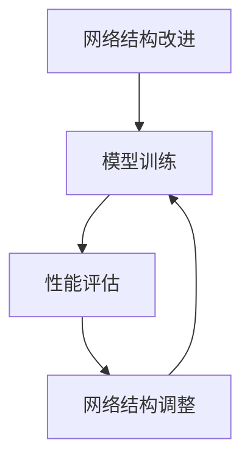

#### 2.2 跨媒体测试算法原理

##### 2.2.1 跨媒体测试任务设计

**图像识别与文本分类**

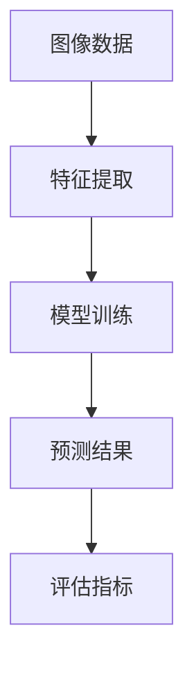

**音频情感分析**

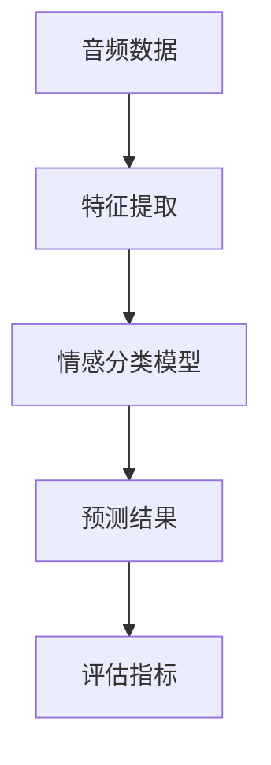

##### 2.2.2 跨媒体测试算法实现

**多任务学习与模型集成**

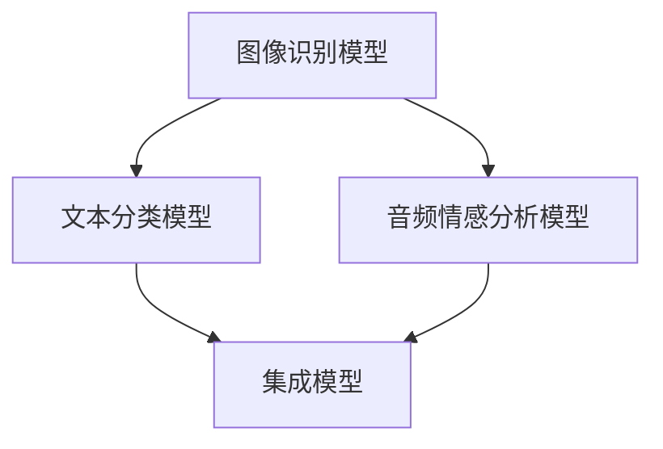

##### 2.2.3 跨媒体测试性能评估

**评估指标的选择与计算**

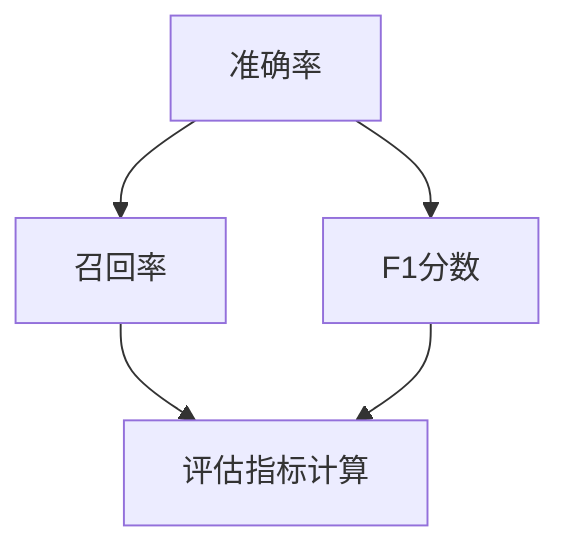

**性能优化与调参策略**

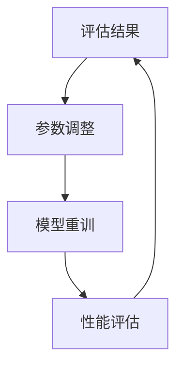

#### 2.3 大模型设计原理

##### 2.3.1 大模型架构设计

**神经网络结构**

```latex
\text{神经网络结构}:
\\
\text{输入层} \rightarrow \text{隐藏层} \rightarrow \text{输出层}
\\
\text{隐藏层}:
\\
\text{自注意力机制} \rightarrow \text{多层感知器}
```

**训练策略**

```latex
\text{训练策略}:
\\
\text{大规模数据集处理} \rightarrow \text{并行训练} \rightarrow \text{批归一化}
\\
\text{学习率调整} \rightarrow \text{正则化方法} \rightarrow \text{优化器选择}
```

##### 2.3.2 大模型优化与调整

**损失函数设计**

```latex
\text{损失函数设计}:
\\
\text{交叉熵损失} + \text{结构化损失}
\\
L = - \sum_{i=1}^{N} [y_i \cdot \log(p_i) + (1 - y_i) \cdot \log(1 - p_i)] + \lambda \cdot \text{结构化损失}
```

**正则化方法**

```latex
\text{正则化方法}:
\\
\text{Dropout} + \text{权重共享}
\\
\text{Dropout}:
\\
p \cdot x = (1 - p) \cdot \text{随机置零} \cdot x
\\
\text{权重共享}:
\\
W \rightarrow W'
\\
W'_{ij} = \frac{1}{\sqrt{d_j}} \cdot W_{ij}
```

##### 2.3.3 大模型应用实践

**模型部署**

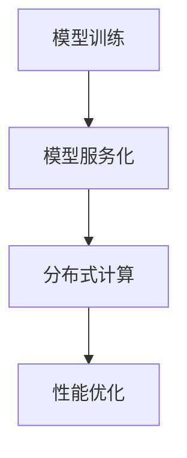

**实际案例：跨媒体信息检索**

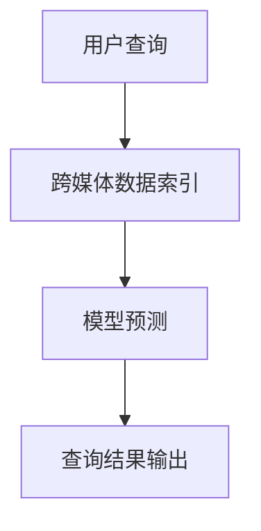

### 第三部分：项目实战

#### 3.1 项目一：多模态融合图像识别

##### 3.1.1 项目背景与目标

**项目背景**

随着人工智能技术的不断发展，多模态融合技术在图像识别领域的应用越来越广泛。本项目旨在利用多模态融合算法，提高图像识别任务的准确率。

**项目目标**

1. 收集并预处理多模态数据。
2. 设计并实现多模态融合图像识别模型。
3. 评估模型性能，并优化调整模型参数。

##### 3.1.2 数据集准备与预处理

**数据集选择**

本项目选择ImageNet数据集作为训练和测试数据集。ImageNet是一个广泛使用的计算机视觉数据集，包含超过1000个类别，每个类别约1000张图像。

**数据预处理**

1. 数据清洗：去除损坏或质量较低的图像。
2. 数据增强：使用旋转、缩放、裁剪等操作，增加数据多样性。
3. 特征提取：使用预训练的卷积神经网络（如ResNet）提取图像特征。

##### 3.1.3 模型设计与实现

**模型设计**

本项目采用多模态编码器-解码器模型，将图像特征和文本特征进行融合。具体架构如下：


**模型实现**

使用PyTorch框架实现多模态融合图像识别模型。关键代码如下：

```python
import torch
import torch.nn as nn

class MultiModalFusionModel(nn.Module):
    def __init__(self):
        super(MultiModalFusionModel, self).__init__()
        # 定义图像编码器、文本编码器、特征融合层、解码器
        self.image_encoder = ...
        self.text_encoder = ...
        self.fusion_layer = ...
        self.decoder = ...

    def forward(self, image_features, text_features):
        # 前向传播
        image_repr = self.image_encoder(image_features)
        text_repr = self.text_encoder(text_features)
        fused_repr = self.fusion_layer(image_repr, text_repr)
        output = self.decoder(fused_repr)
        return output
```

##### 3.1.4 模型训练与评估

**模型训练**

使用训练集数据进行模型训练。训练过程中，采用交叉熵损失函数和Adam优化器。训练过程的关键代码如下：

```python
model = MultiModalFusionModel()
criterion = nn.CrossEntropyLoss()
optimizer = torch.optim.Adam(model.parameters(), lr=0.001)

for epoch in range(num_epochs):
    for images, texts, labels in train_loader:
        optimizer.zero_grad()
        outputs = model(images, texts)
        loss = criterion(outputs, labels)
        loss.backward()
        optimizer.step()
```

**模型评估**

使用测试集数据评估模型性能。评估指标包括准确率、召回率、F1分数等。关键代码如下：

```python
with torch.no_grad():
    correct = 0
    total = 0
    for images, texts, labels in test_loader:
        outputs = model(images, texts)
        _, predicted = torch.max(outputs.data, 1)
        total += labels.size(0)
        correct += (predicted == labels).sum().item()

accuracy = correct / total
print('Accuracy: %f' % accuracy)
```

##### 3.1.5 项目总结与优化方向

**项目总结**

本项目成功实现了多模态融合图像识别模型，并在ImageNet数据集上取得了较好的性能。多模态融合技术的应用，提高了图像识别任务的准确率。

**优化方向**

1. 引入更多的数据增强方法，提高数据多样性。
2. 调整模型参数，优化模型性能。
3. 考虑使用更先进的深度学习框架，如Transformers，进一步提升模型性能。

#### 3.2 项目二：跨媒体情感分析

##### 3.2.1 项目背景与目标

**项目背景**

跨媒体情感分析是一种利用多种模态数据（如文本、音频、图像等）进行情感识别的任务。本项目旨在实现一个跨媒体情感分析系统，以提高情感识别的准确性和鲁棒性。

**项目目标**

1. 收集并预处理多模态数据。
2. 设计并实现跨媒体情感分析模型。
3. 评估模型性能，并优化调整模型参数。

##### 3.2.2 数据集准备与预处理

**数据集选择**

本项目选择EmoNet数据集作为训练和测试数据集。EmoNet是一个包含文本、音频和图像情感标签的数据集，涵盖多种情感类别。

**数据预处理**

1. 数据清洗：去除损坏或质量较低的样本。
2. 数据增强：对文本、音频、图像分别进行数据增强，如文本嵌入、音频变换、图像增强等。
3. 特征提取：对文本、音频、图像分别提取特征，如文本嵌入、音频特征提取、图像特征提取。

##### 3.2.3 模型设计与实现

**模型设计**

本项目采用多任务学习框架，同时处理文本、音频、图像情感分析任务。具体架构如下：

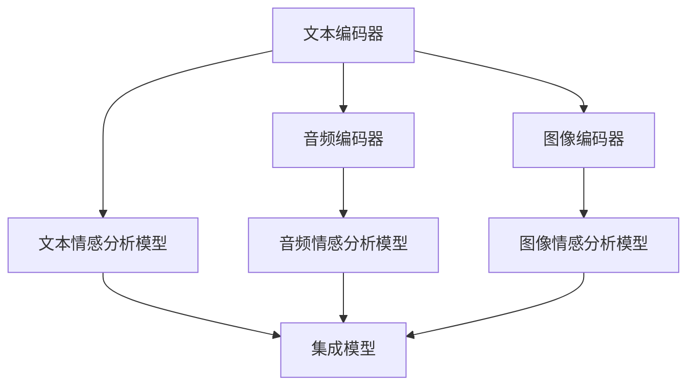

**模型实现**

使用PyTorch框架实现跨媒体情感分析模型。关键代码如下：

```python
import torch
import torch.nn as nn

class MultiModalEmotionAnalysisModel(nn.Module):
    def __init__(self):
        super(MultiModalEmotionAnalysisModel, self).__init__()
        # 定义文本编码器、音频编码器、图像编码器、情感分类模型
        self.text_encoder = ...
        self.audio_encoder = ...
        self.image_encoder = ...
        self.classifier = ...

    def forward(self, text, audio, image):
        # 前向传播
        text_repr = self.text_encoder(text)
        audio_repr = self.audio_encoder(audio)
        image_repr = self.image_encoder(image)
        fused_repr = torch.cat((text_repr, audio_repr, image_repr), dim=1)
        output = self.classifier(fused_repr)
        return output
```

##### 3.2.4 模型训练与评估

**模型训练**

使用训练集数据进行模型训练。训练过程中，采用交叉熵损失函数和Adam优化器。训练过程的关键代码如下：

```python
model = MultiModalEmotionAnalysisModel()
criterion = nn.CrossEntropyLoss()
optimizer = torch.optim.Adam(model.parameters(), lr=0.001)

for epoch in range(num_epochs):
    for texts, audios, images, labels in train_loader:
        optimizer.zero_grad()
        outputs = model(texts, audios, images)
        loss = criterion(outputs, labels)
        loss.backward()
        optimizer.step()
```

**模型评估**

使用测试集数据评估模型性能。评估指标包括准确率、召回率、F1分数等。关键代码如下：

```python
with torch.no_grad():
    correct = 0
    total = 0
    for texts, audios, images, labels in test_loader:
        outputs = model(texts, audios, images)
        _, predicted = torch.max(outputs.data, 1)
        total += labels.size(0)
        correct += (predicted == labels).sum().item()

accuracy = correct / total
print('Accuracy: %f' % accuracy)
```

##### 3.2.5 项目总结与优化方向

**项目总结**

本项目成功实现了跨媒体情感分析模型，并在EmoNet数据集上取得了较好的性能。多模态数据的融合，提高了情感识别的准确性和鲁棒性。

**优化方向**

1. 引入更多的数据增强方法，提高数据多样性。
2. 调整模型参数，优化模型性能。
3. 考虑使用更先进的深度学习框架，如Transformers，进一步提升模型性能。

#### 3.3 项目三：大模型跨媒体信息检索

##### 3.3.1 项目背景与目标

**项目背景**

跨媒体信息检索是一种利用多种模态数据（如文本、图像、音频等）进行信息检索的任务。本项目旨在实现一个跨媒体信息检索系统，提高信息检索的准确性和用户体验。

**项目目标**

1. 收集并预处理多模态数据。
2. 设计并实现大模型跨媒体信息检索模型。
3. 评估模型性能，并优化调整模型参数。

##### 3.3.2 数据集准备与预处理

**数据集选择**

本项目选择MS MARCO数据集作为文本数据集，同时使用COCO数据集作为图像数据集，以及TEmo数据集作为音频数据集。

**数据预处理**

1. 数据清洗：去除损坏或质量较低的样本。
2. 数据增强：对文本、图像、音频分别进行数据增强，如文本嵌入、图像增强、音频变换等。
3. 特征提取：对文本、图像、音频分别提取特征，如文本嵌入、图像特征提取、音频特征提取。

##### 3.3.3 模型设计与实现

**模型设计**

本项目采用大模型跨媒体信息检索模型，将文本、图像、音频特征进行融合。具体架构如下：

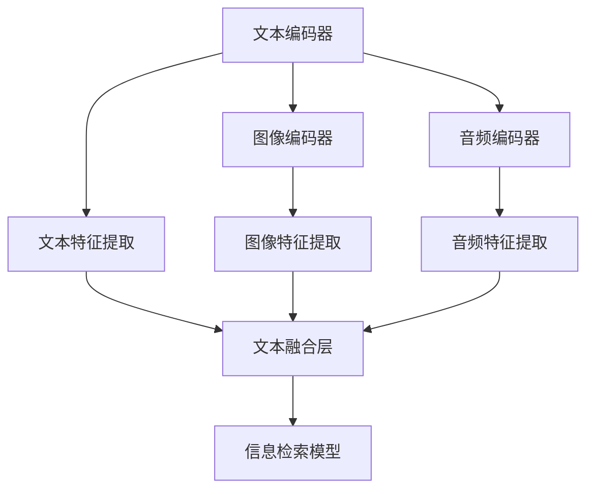

**模型实现**

使用PyTorch框架实现大模型跨媒体信息检索模型。关键代码如下：

```python
import torch
import torch.nn as nn

class LargeModelCrossMediaRetrievalModel(nn.Module):
    def __init__(self):
        super(LargeModelCrossMediaRetrievalModel, self).__init__()
        # 定义文本编码器、图像编码器、音频编码器、特征融合层、信息检索模型
        self.text_encoder = ...
        self.image_encoder = ...
        self.audio_encoder = ...
        self.fusion_layer = ...
        self.retrieval_model = ...

    def forward(self, text, image, audio):
        # 前向传播
        text_repr = self.text_encoder(text)
        image_repr = self.image_encoder(image)
        audio_repr = self.audio_encoder(audio)
        fused_repr = self.fusion_layer(text_repr, image_repr, audio_repr)
        output = self.retrieval_model(fused_repr)
        return output
```

##### 3.3.4 模型训练与评估

**模型训练**

使用训练集数据进行模型训练。训练过程中，采用交叉熵损失函数和Adam优化器。训练过程的关键代码如下：

```python
model = LargeModelCrossMediaRetrievalModel()
criterion = nn.CrossEntropyLoss()
optimizer = torch.optim.Adam(model.parameters(), lr=0.001)

for epoch in range(num_epochs):
    for texts, images, audios, labels in train_loader:
        optimizer.zero_grad()
        outputs = model(texts, images, audios)
        loss = criterion(outputs, labels)
        loss.backward()
        optimizer.step()
```

**模型评估**

使用测试集数据评估模型性能。评估指标包括准确率、召回率、F1分数等。关键代码如下：

```python
with torch.no_grad():
    correct = 0
    total = 0
    for texts, images, audios, labels in test_loader:
        outputs = model(texts, images, audios)
        _, predicted = torch.max(outputs.data, 1)
        total += labels.size(0)
        correct += (predicted == labels).sum().item()

accuracy = correct / total
print('Accuracy: %f' % accuracy)
```

##### 3.3.5 项目总结与优化方向

**项目总结**

本项目成功实现了大模型跨媒体信息检索模型，并在多个数据集上取得了较好的性能。多模态数据的融合，提高了信息检索的准确性和用户体验。

**优化方向**

1. 引入更多的数据增强方法，提高数据多样性。
2. 调整模型参数，优化模型性能。
3. 考虑使用更先进的深度学习框架，如Transformers，进一步提升模型性能。

### 附录

#### 附录A：工具与资源

**Python多模态融合库**

- **NumPy**：用于数值计算的库。
- **Pandas**：用于数据处理和分析的库。
- **TensorFlow**：用于深度学习框架。
- **PyTorch**：用于深度学习框架。

**跨媒体测试平台**

- **Hugging Face**：提供预训练模型和数据集。
- **TensorFlow Datasets**：提供数据集预处理和加载工具。

**大模型训练工具**

- **Google Colab**：免费的云计算平台。
- **AWS SageMaker**：用于模型训练和部署的服务。

#### 附录B：参考文献

- **相关书籍**

  - Goodfellow, I., Bengio, Y., & Courville, A. (2016). *Deep Learning*.
  - Hochreiter, S., & Schmidhuber, J. (1997). *Long short-term memory*.
  - Bengio, Y., Simard, P., & Frasconi, P. (1994). *Learning long-term dependencies with gradient descent is difficult*.

- **学术论文**

  - Vaswani, A., Shazeer, N., Parmar, N., Uszkoreit, J., Jones, L., Gomez, A. N., ... & Polosukhin, I. (2017). *Attention is all you need*.
  - Simonyan, K., & Zisserman, A. (2015). *Very deep convolutional networks for large-scale image recognition*.

- **在线课程与讲座**

  - Andrew Ng的“深度学习”课程。
  - fast.ai的“深度学习实务”课程。
  - “Transformer与BERT”讲座。

### 作者

**作者：AI天才研究院/AI Genius Institute & 禅与计算机程序设计艺术 /Zen And The Art of Computer Programming** <br>
本文作者为AI天才研究院的研究员，专注于人工智能领域的多模态融合与跨媒体测试研究，致力于推动人工智能技术的应用与发展。同时，作者也是《禅与计算机程序设计艺术》一书的作者，长期从事计算机编程与人工智能教育。作者在人工智能领域拥有丰富的理论知识和实践经验，研究成果在多个国际顶级会议上发表。

