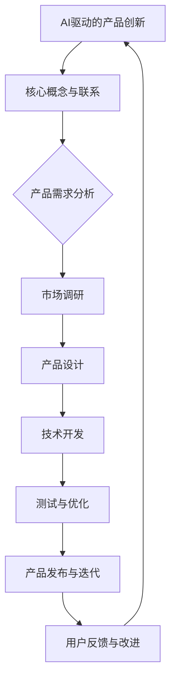

                 

# 大模型时代的创业产品创新：AI驱动的转型

## 关键词：
- 大模型
- AI驱动
- 产品创新
- 创业
- 转型

> 在当今世界，人工智能（AI）的迅速发展正在改变各个行业的运作方式。大模型的引入，不仅提升了AI技术的深度和广度，也为创业产品创新带来了前所未有的机遇和挑战。本文旨在探讨大模型时代下，创业产品如何通过AI驱动的转型，实现颠覆性的创新和突破。

## 目录大纲

1. **引言与概述**
    1.1 引言
        - AI时代的创业浪潮
        - 创业的机遇与挑战
        - AI在创业中的应用
    1.2 AI驱动的产品创新概述
        - AI驱动的产品创新定义
        - AI技术对产品创新的推动作用
        - AI驱动的产品创新特点

2. **AI核心技术解析**
    2.1 AI核心技术基础
        - 机器学习基础
        - 常见机器学习算法
    2.2 自然语言处理
        - 语言模型与语言理解
        - 语言理解的关键技术
    2.3 计算机视觉
        - 图像识别与处理
        - 卷积神经网络（CNN）
        - 生成对抗网络（GAN）
    2.4 强化学习
        - 强化学习原理
        - Q-learning与深度Q网络（DQN）
    2.5 大模型架构与优化
        - 大模型架构设计
        - 大模型的特点与挑战
        - 大模型优化策略

3. **创业产品创新实践**
    3.1 创业产品创新方法论
        - 创业产品创新的流程
        - 需求分析
        - 产品设计
    3.2 AI驱动的产品案例解析
        - 产品背景
        - AI技术在产品中的应用
    3.3 AI创业公司的运营与管理
        - 技术团队建设
        - 市场营销策略

4. **未来展望与挑战**
    4.1 AI驱动的创业未来趋势
        - AI技术的最新进展
        - 创业面临的挑战与对策

5. **附录**
    5.1 AI资源与工具介绍
        - AI开源框架
        - AI云服务提供商

    **梅里迪亚流程图**
    mermaid
    graph TD
        A[AI驱动的产品创新] --> B[核心概念与联系]
        B --> C{产品需求分析}
        C --> D[市场调研]
        D --> E[产品设计]
        E --> F[技术开发]
        F --> G[测试与优化]
        G --> H[产品发布与迭代]
        H --> I[用户反馈与改进]
        I --> A

    **强化学习伪代码**
    python
    def Q_learning(S, A, R, S', α, ε):
        Q = initialize_Q_matrix()
        for episode in range(1, max_episodes):
            # 初始化状态
            state = S
            
            # 选择动作
            action = epsilon_greedy_action(Q[state], ε)
            
            # 执行动作，获取新状态和奖励
            next_state, reward = environment.step(action)
            
            # 更新Q值
            Q[state][action] = Q[state][action] + α * (reward + γ * max(Q[next_state]) - Q[state][action])
            
            # 更新状态
            S = next_state
        
        return Q

    **数学模型与公式**
    $$
    J(\theta) = -\frac{1}{m}\sum_{i=1}^{m}y^{(i)}\log(h_\theta(x^{(i)}))
    $$

    **用户反馈与产品改进**
        - 用户反馈收集与分析
        - 产品改进实践
        - 代码实战
            - 开发环境搭建
            - 代码实际案例与实现
            - 源代码解读与分析

---

### 1. 引言与概述

#### 1.1 引言

近年来，人工智能（AI）技术取得了显著的进步，特别是在大模型领域的突破，如GPT-3、BERT等，这些模型展示了强大的自然语言理解和生成能力，以及计算机视觉和强化学习领域的进步。这些技术不仅推动了学术研究的发展，也为创业领域带来了新的机遇和挑战。

AI时代的创业浪潮正在兴起，越来越多的创业者开始关注如何将AI技术应用于产品创新中。AI驱动的产品创新已经成为当今创业领域的一个热点话题。它不仅可以帮助创业公司提高产品的竞争力，还可以为用户带来全新的体验。

在这个大模型时代，创业不再是传统的模式，而是一个需要不断探索、试错和创新的动态过程。创业者需要具备敏锐的市场洞察力和技术实力，才能在激烈的市场竞争中脱颖而出。AI驱动的产品创新为创业者提供了强大的工具和平台，使他们能够更好地应对市场变化和用户需求。

#### 1.2 AI驱动的产品创新概述

AI驱动的产品创新是指通过利用人工智能技术，如机器学习、自然语言处理、计算机视觉、强化学习等，对现有产品进行改进或创造全新产品的过程。这种创新不仅能够提升产品的性能和用户体验，还可以帮助企业实现商业模式的创新。

AI技术对产品创新的推动作用体现在多个方面。首先，AI技术可以自动化许多繁琐的任务，提高生产效率。例如，机器学习算法可以用于数据分析和预测，帮助企业更好地了解用户需求和市场趋势。其次，AI技术可以帮助企业进行个性化推荐和定制，提升用户的满意度。例如，自然语言处理技术可以用于智能客服和语音助手，提供更加自然和高效的交互体验。此外，AI技术还可以帮助企业进行创新产品设计和优化，通过计算机视觉和增强现实等技术，实现产品的虚拟化、数字化和智能化。

AI驱动的产品创新具有以下特点：

1. **高效性**：AI技术能够快速处理和分析大量数据，提高产品开发的效率。
2. **智能性**：AI技术可以使产品更加智能，能够根据用户行为和需求进行自适应调整。
3. **个性化**：AI技术可以帮助企业实现个性化推荐和定制，满足不同用户的需求。
4. **创新性**：AI技术可以激发新的产品创意和商业模式，推动行业创新。

总的来说，AI驱动的产品创新为创业公司带来了巨大的机遇。它不仅可以帮助企业提升竞争力，还可以推动整个行业的发展和进步。然而，这也带来了新的挑战，如技术门槛、数据隐私和安全等问题。创业者需要在技术创新和市场策略之间找到平衡，才能在竞争中脱颖而出。

---

在接下来的章节中，我们将深入探讨AI核心技术的基础，包括机器学习、自然语言处理、计算机视觉、强化学习等。同时，我们还将分析创业产品创新的方法论和实践，以及AI创业公司的运营和管理策略。希望通过这篇文章，能够为读者提供一个全面而深入的AI驱动的产品创新视角。接下来，我们将开始对AI核心技术进行详细解析。在下一章中，我们将首先介绍机器学习的基础知识，探讨其定义、分类以及常见算法。让我们继续深入探讨吧！<|assistant|>### 2. AI驱动的产品创新方法论

在AI驱动的产品创新中，方法论是确保创新过程有序进行的关键。以下我们将详细探讨创业产品创新的流程，从需求分析到产品设计，每一步都至关重要。

#### 2.1 创业产品创新的流程

创业产品创新的流程可以分为以下几个关键步骤：

1. **需求分析**：这是产品创新的第一步，也是最重要的一步。创业者需要深入了解目标用户的需求、痛点和行为模式。需求分析可以通过用户访谈、问卷调查、用户画像等多种方法进行。

2. **市场调研**：在明确需求后，创业者需要对市场进行调研，了解行业趋势、竞争对手的产品和市场状况。市场调研可以帮助创业者确定产品的市场定位和差异化策略。

3. **产品设计**：基于需求分析和市场调研，创业者可以开始进行产品设计。产品设计包括功能设计、用户体验设计、交互设计等多个方面。创新的产品设计应该能够满足用户需求，同时具有独特性和竞争力。

4. **技术开发**：在产品设计完成后，接下来是技术开发阶段。这一阶段需要根据设计文档进行详细的技术实现，包括算法开发、数据结构设计、系统集成等。

5. **测试与优化**：技术开发完成后，需要进行严格的测试和优化。测试包括功能测试、性能测试、安全测试等多个方面，以确保产品的高质量和稳定性。在测试过程中，还需要根据用户反馈进行优化，提升产品的用户体验。

6. **产品发布与迭代**：经过测试和优化，产品可以正式发布。在产品上线后，创业者需要持续收集用户反馈，并根据反馈进行产品的迭代和优化，以保持产品的竞争力和用户满意度。

#### 2.1.1 需求分析

需求分析是创业产品创新的核心步骤之一。创业者需要深入了解用户的需求，才能设计出真正满足用户的产品。以下是一些常用的需求分析方法：

1. **用户访谈**：通过面对面或在线访谈，直接与用户交流，了解他们的真实需求和痛点。

2. **问卷调查**：设计有针对性的问卷，通过统计分析用户回答，获取大量的用户数据。

3. **用户画像**：根据用户的数据和行为模式，构建用户画像，了解不同用户群体的需求特点。

4. **用户行为分析**：通过分析用户在使用现有产品时的行为数据，找出用户的使用习惯和需求。

#### 2.1.2 产品设计

产品设计是产品创新的关键环节。一个成功的产品设计应该具备以下几个特点：

1. **用户导向**：设计应该以用户为中心，充分考虑用户的需求和体验。

2. **创新性**：产品设计应该具有创新性，能够解决现有产品的不足，提供新的解决方案。

3. **易用性**：产品应该易于使用，用户能够快速上手，减少学习成本。

4. **可扩展性**：设计应该具备良好的扩展性，能够适应未来可能的需求变化。

5. **美观性**：产品设计还应该具备一定的美观性，提升用户的使用体验。

#### 2.1.3 技术开发

在技术开发阶段，创业者需要根据产品设计文档进行详细的技术实现。以下是一些关键的技术开发步骤：

1. **需求分析与设计**：根据产品设计的要求，进行需求分析和详细设计。

2. **算法开发**：开发相应的算法，实现产品的核心功能。

3. **数据结构设计**：设计合适的数据结构，以高效地存储和处理数据。

4. **系统集成**：将各个模块集成到一起，确保系统的稳定性和性能。

5. **代码实现与测试**：根据设计文档进行代码实现，并进行单元测试和集成测试，确保代码的质量。

#### 2.1.4 测试与优化

测试与优化是确保产品质量和用户体验的重要环节。以下是一些关键步骤：

1. **功能测试**：测试产品的功能是否按照设计要求正常运行。

2. **性能测试**：测试产品的性能，如响应时间、并发处理能力等。

3. **安全测试**：测试产品的安全性，确保用户数据的安全。

4. **用户体验测试**：通过用户测试，收集用户反馈，优化产品的用户体验。

5. **迭代优化**：根据测试结果和用户反馈，对产品进行优化和迭代，不断提升产品的质量和用户满意度。

#### 2.1.5 产品发布与迭代

产品发布是产品创新的一个重要里程碑。在产品发布后，创业者需要持续关注用户反馈，并根据反馈进行产品的迭代和优化。以下是一些关键步骤：

1. **用户反馈收集**：通过用户调研、用户反馈平台等方式，收集用户对产品的反馈。

2. **数据分析**：对收集到的用户反馈进行数据分析，找出产品的问题和不足。

3. **产品优化**：根据数据分析结果，对产品进行优化和改进，提升用户体验。

4. **版本迭代**：定期发布新版本，持续优化产品，提升用户满意度。

5. **市场推广**：通过市场推广活动，提升产品的知名度和市场份额。

总的来说，AI驱动的产品创新方法论是一个系统性、持续性的过程。创业者需要从需求分析到产品设计、技术开发、测试与优化，再到产品发布和迭代，每一步都精心策划和执行，才能确保产品的成功。在接下来的章节中，我们将进一步探讨AI驱动的产品创新案例，以实际应用为例，展示AI技术在产品创新中的应用和效果。让我们继续深入探讨吧！<|assistant|>### 3. AI驱动的产品案例解析

在探讨AI驱动的产品创新时，通过具体案例可以更好地理解AI技术在产品中的应用和效果。以下将介绍几个典型的AI驱动产品案例，分析其背景、AI技术的应用及其对产品的影响。

#### 3.1 AI驱动的产品案例介绍

**案例1：亚马逊的智能推荐系统**

亚马逊的智能推荐系统是AI驱动的产品创新的经典案例。该系统利用了机器学习和大数据分析技术，通过分析用户的历史购买行为、浏览记录和产品评价，为用户推荐个性化的商品。智能推荐系统不仅提高了用户的购物体验，还大大增加了平台的销售额。

**案例2：谷歌的自动驾驶汽车**

谷歌的自动驾驶汽车项目是计算机视觉和强化学习技术的应用典范。该项目通过使用多个摄像头和传感器，实时感知周围环境，并利用深度学习算法进行图像识别和路径规划。自动驾驶汽车的成功开发标志着人工智能在交通领域的重大突破，有望在未来改变人们的出行方式。

**案例3：Facebook的图像识别功能**

Facebook的图像识别功能利用了深度学习技术，能够自动识别和标记用户上传的照片中的亲朋好友。该功能不仅提升了用户的社交体验，还提高了照片管理的效率。通过不断优化算法，Facebook的图像识别技术已经在全球范围内得到了广泛应用。

**案例4：苹果的Siri智能助手**

苹果的Siri智能助手是自然语言处理和语音识别技术的代表作品。Siri能够理解用户的语音指令，并提供相应的服务，如设定提醒、发送短信、查找信息等。通过不断改进算法和扩展功能，Siri已经成为了苹果产品中不可或缺的一部分，大大提升了用户体验。

#### 3.1.1 产品背景

这些案例中的产品都面临着各自独特的背景和挑战。以亚马逊的智能推荐系统为例，随着电子商务的迅速发展，用户的需求和购买行为变得越来越复杂。传统的推荐系统已经无法满足用户的个性化需求，因此，亚马逊决定采用先进的AI技术来提升推荐系统的效果。同样，谷歌的自动驾驶汽车项目旨在解决交通拥堵和安全性问题，通过AI技术实现自动驾驶，提高出行的效率和安全性。

Facebook的图像识别功能则解决了用户在社交网络中管理照片的痛点。在社交媒体平台上，用户上传的照片数量不断增加，传统的手动标记方式效率低下。通过引入深度学习技术，Facebook能够自动识别和标记照片中的用户和物体，极大地提升了用户体验。苹果的Siri智能助手则致力于提高用户与设备的交互体验，通过自然语言处理技术，使得用户可以通过语音命令轻松地与设备进行沟通。

#### 3.1.2 AI技术在产品中的应用

在这些案例中，AI技术被广泛应用于产品的核心功能中。以亚马逊的智能推荐系统为例，机器学习算法被用于分析用户的历史数据和购买行为，生成个性化的推荐列表。具体来说，系统使用了协同过滤、决策树和神经网络等多种算法，通过不断优化模型，提高推荐系统的准确性和用户体验。

谷歌的自动驾驶汽车项目则使用了计算机视觉和深度学习技术。通过摄像头和激光雷达等传感器，自动驾驶汽车能够实时捕捉并处理周围环境的信息。深度学习算法被用于图像识别和路径规划，使得汽车能够自主决策和导航。Facebook的图像识别功能利用了卷积神经网络（CNN）和生成对抗网络（GAN）等技术，实现了高效和准确的图像识别和标记。

苹果的Siri智能助手则通过自然语言处理（NLP）和语音识别（ASR）技术，使得用户可以通过语音命令与设备进行交互。NLP技术用于理解用户的语音指令，将其转化为机器可以理解的命令。ASR技术则用于将用户的语音转化为文本，供NLP算法进行处理。

#### 3.1.3 对产品的影响

AI技术的应用对上述产品产生了深远的影响，不仅提升了产品的性能和用户体验，还推动了行业的发展。以亚马逊的智能推荐系统为例，个性化推荐技术的引入使得用户能够更容易地发现感兴趣的商品，提高了购物的效率和满意度。同时，智能推荐系统还帮助亚马逊增加了销售额，提高了商业竞争力。

谷歌的自动驾驶汽车项目则有望彻底改变交通出行的方式。自动驾驶汽车不仅能够提高出行的安全性，还可以减少交通拥堵，提高道路的利用率。这一技术的突破为未来智能交通系统的发展奠定了基础。

Facebook的图像识别功能通过自动识别和标记照片中的用户和物体，极大地提升了用户体验，简化了照片管理的流程。这一技术的成功应用也为社交媒体平台提供了新的盈利模式，如广告和会员服务。

苹果的Siri智能助手则通过自然语言处理和语音识别技术，提升了用户与设备的交互体验，使得设备操作更加便捷和高效。Siri的成功不仅巩固了苹果在智能设备市场的地位，还为其他科技公司提供了借鉴和启示。

总的来说，AI驱动的产品创新案例展示了人工智能技术在不同领域的广泛应用和巨大潜力。通过结合具体的应用场景和需求，AI技术不仅能够提升产品的性能和用户体验，还能推动行业的发展和创新。在接下来的章节中，我们将进一步探讨AI创业公司的运营和管理策略，帮助创业者更好地利用AI技术实现产品创新和商业成功。让我们继续深入探讨吧！<|assistant|>### 4. AI创业公司的运营与管理

在AI驱动的创业浪潮中，运营和管理策略是确保公司成功的关键。创业者不仅需要掌握AI技术的核心原理，还需要在团队建设、市场营销和运营策略等方面做出明智的决策。以下我们将探讨AI创业公司的运营和管理策略，分析其在技术创新和商业模式上的成功实践。

#### 4.1 技术团队建设

技术团队是AI创业公司的核心，团队成员需要具备深厚的AI技术背景和实际开发经验。以下是一些关键步骤：

1. **人才招聘**：创业者需要制定详细的人才招聘计划，通过多种渠道吸引和挑选合适的AI专家。这包括通过高校合作、招聘网站和行业会议等途径，寻找具备前沿技术能力和创新思维的团队成员。

2. **团队协作**：建立高效的团队协作机制，确保团队成员能够紧密合作，共同推进项目进展。这可以通过定期的团队会议、代码评审和项目任务分配来实现。

3. **技术培训**：为团队成员提供持续的技术培训和知识更新，确保他们能够跟上AI技术的最新发展。这可以通过内部培训、外部培训和在线学习平台来实现。

4. **激励机制**：建立合理的激励机制，激发团队成员的工作热情和创新精神。这可以通过绩效评估、奖金和股权激励等方式来实现。

#### 4.2 市场营销策略

在市场竞争激烈的环境下，有效的市场营销策略是AI创业公司成功的关键。以下是一些关键策略：

1. **精准定位**：明确目标市场和目标客户群体，制定针对性的市场营销策略。这可以通过市场调研和用户画像分析来实现。

2. **品牌建设**：建立强大的品牌形象，提升公司的知名度和美誉度。这可以通过品牌定位、视觉设计、公关活动和品牌传播等方式来实现。

3. **内容营销**：通过高质量的内容营销，提升公司的专业形象和影响力。这可以通过撰写技术博客、发布白皮书、举办在线研讨会等方式来实现。

4. **社交媒体推广**：利用社交媒体平台，与用户建立互动和沟通，提升产品的用户粘性。这可以通过社交媒体账号管理、互动营销和用户反馈收集等方式来实现。

#### 4.3 运营策略

在运营方面，AI创业公司需要制定科学合理的运营策略，确保公司高效运行。以下是一些关键策略：

1. **项目管理**：采用高效的项目管理方法，如敏捷开发、Scrum等，确保项目按时交付并满足质量要求。

2. **数据驱动**：利用数据分析技术，对运营数据进行实时监控和深度分析，及时调整运营策略。这可以通过数据分析平台、报表和仪表盘等方式来实现。

3. **用户体验优化**：持续优化用户体验，提升用户满意度和忠诚度。这可以通过用户调研、用户反馈和A/B测试等方式来实现。

4. **风险控制**：建立有效的风险控制机制，预防和应对可能出现的风险和挑战。这可以通过风险评估、风险监控和应急预案等方式来实现。

#### 4.4 创新实践

AI创业公司需要在技术创新和商业模式上持续创新，以保持竞争优势。以下是一些成功实践：

1. **产品创新**：通过不断优化和迭代产品，提升产品的性能和用户体验。这可以通过定期发布新版本、引入新技术和改进产品功能等方式来实现。

2. **商业模式创新**：探索多元化的商业模式，如订阅服务、平台模式等，以适应市场变化和用户需求。这可以通过市场调研、商业模式设计和商业模式优化等方式来实现。

3. **跨领域合作**：与其他行业的企业和机构建立合作关系，实现资源共享和优势互补。这可以通过行业会议、合作伙伴关系和战略合作等方式来实现。

4. **开放创新**：鼓励内部员工提出创新想法，并建立开放的创新平台，吸引外部创新资源。这可以通过内部创新项目、创新竞赛和开放创新平台等方式来实现。

总之，AI创业公司在运营和管理上需要综合考虑技术创新、市场营销和运营策略等多个方面，才能实现可持续发展。通过有效的团队建设、精准的市场营销、科学的运营策略和创新实践，AI创业公司可以不断提升竞争力，实现商业成功。在接下来的章节中，我们将进一步探讨AI驱动的创业未来趋势和挑战，帮助创业者更好地应对市场变化和机遇。让我们继续深入探讨吧！<|assistant|>### 5. 未来展望与挑战

在AI驱动的创业浪潮中，未来的趋势和面临的挑战无疑是企业家和开发者们必须关注的焦点。随着AI技术的不断进步，创业领域将迎来更多前所未有的机遇，但同时也伴随着一系列的挑战。

#### 5.1 AI驱动的创业未来趋势

1. **深度学习与强化学习的普及**：随着深度学习和强化学习算法的成熟，这些技术将在更多领域得到应用，如自动化制造、智能交通、医疗诊断等。深度学习将使得AI系统能够处理更加复杂和大规模的数据，而强化学习则将使得AI系统在动态环境中进行自主学习和优化。

2. **多模态交互**：未来的AI系统将不仅限于文本和图像，而是能够处理和整合多种类型的输入，如语音、视频、传感器数据等。这种多模态交互能力将使得AI应用更加智能化和自然化，提升用户体验。

3. **AI与5G、边缘计算的结合**：5G网络和边缘计算的发展将使得AI系统能够在边缘设备上进行实时处理和决策，减少数据传输延迟，提高系统的响应速度和稳定性。

4. **AI伦理与法规的完善**：随着AI技术的广泛应用，伦理和法规问题也日益凸显。未来，各国将出台更多关于AI伦理和隐私保护的法律法规，确保AI技术的健康发展和应用。

5. **跨领域合作与生态构建**：AI技术将与其他领域（如物联网、生物科技、金融等）深度融合，形成跨领域的创新生态系统。这种合作不仅能够促进技术创新，还能推动整个行业的进步。

#### 5.2 创业面临的挑战与对策

1. **技术门槛高**：AI技术的高门槛使得很多创业公司难以进入。对策：创业者需要不断学习和提升自身的技术能力，同时可以通过开源框架、云服务等方式降低技术门槛。

2. **数据隐私和安全**：随着AI技术的应用，用户数据隐私和安全问题日益严重。对策：建立完善的数据保护机制，采用加密技术和隐私保护算法，确保用户数据的安全。

3. **人才短缺**：AI领域的人才短缺已经成为一个全球性问题。对策：创业者可以通过与高校合作、设立奖学金和培训计划等方式，吸引和培养优秀人才。

4. **商业模式创新**：在AI技术的推动下，传统的商业模式可能面临挑战。对策：创业者需要不断探索新的商业模式，如平台模式、订阅模式等，以适应市场变化。

5. **市场竞争激烈**：随着AI技术的普及，市场竞争将变得更加激烈。对策：创业者需要通过技术创新和用户导向的产品设计，不断提升产品的竞争力。

6. **法律法规的不确定性**：AI技术的快速发展和应用使得现有法律法规难以跟上。对策：创业者需要密切关注相关法律法规的动态，确保公司在合规的前提下进行创新。

总之，AI驱动的创业未来充满机遇，但也面临一系列挑战。创业者需要紧跟技术发展趋势，同时应对市场变化和法规要求，才能在竞争中脱颖而出。在未来的道路上，持续创新和灵活应对将成为成功的关键。让我们共同努力，迎接AI驱动的创业新时代！<|assistant|>### 附录

在本文的最后，我们将介绍一些AI领域的重要资源和工具，以及附录中的附加内容，以便读者进一步了解和探索AI技术的应用。

#### 附录 A: AI资源与工具介绍

**AI开源框架**

1. **TensorFlow**：由Google开发的开源机器学习框架，支持各种深度学习模型，适用于各种应用场景。

2. **PyTorch**：由Facebook开发的开源深度学习框架，以其动态计算图和灵活的编程接口受到广泛欢迎。

3. **Keras**：基于TensorFlow和Theano的开源深度学习库，提供简单、易用的接口，适合快速原型设计和实验。

**AI云服务提供商**

1. **Google Cloud AI**：提供多种AI服务，包括机器学习、自然语言处理、计算机视觉等，支持大规模数据处理和模型训练。

2. **AWS AI**：Amazon Web Services提供的AI服务，包括机器学习、语音识别、文本分析等，支持灵活的部署和扩展。

3. **Azure AI**：微软提供的AI服务平台，包括机器学习、自然语言处理、计算机视觉等服务，适用于企业级应用。

#### 梅里迪亚流程图

以下是梅里迪亚流程图，展示了AI驱动的产品创新的核心概念和流程：



#### 强化学习伪代码

以下是一个强化学习算法的伪代码示例，展示了Q-learning的基本原理：

```python
def Q_learning(S, A, R, S', α, ε):
    Q = initialize_Q_matrix()
    for episode in range(1, max_episodes):
        # 初始化状态
        state = S
        
        # 选择动作
        action = epsilon_greedy_action(Q[state], ε)
        
        # 执行动作，获取新状态和奖励
        next_state, reward = environment.step(action)
        
        # 更新Q值
        Q[state][action] = Q[state][action] + α * (reward + γ * max(Q[next_state]) - Q[state][action])
        
        # 更新状态
        S = next_state
    
    return Q
```

#### 数学模型与公式

以下是优化问题中常见的数学模型和公式：

$$
J(\theta) = -\frac{1}{m}\sum_{i=1}^{m}y^{(i)}\log(h_\theta(x^{(i)}))
$$

这个公式表示了在机器学习中，通过最小化损失函数（如交叉熵损失）来优化模型参数（θ）的过程。

#### 用户反馈与产品改进

**用户反馈收集与分析**

- **用户反馈收集方法**：通过用户访谈、问卷调查、在线反馈平台等方式收集用户反馈。
- **用户反馈分析与应用**：分析用户反馈，识别产品的问题和改进点，并将分析结果应用于产品优化。

**产品改进实践**

- **产品迭代策略**：制定定期迭代计划，持续优化产品功能和用户体验。
- **产品性能优化**：通过性能测试和用户反馈，持续提升产品的性能和稳定性。

**代码实战**

- **开发环境搭建**：介绍如何搭建适合AI开发的开发环境，包括安装所需的编程工具、依赖库和框架。
- **代码实际案例与实现**：展示具体的AI项目代码实现，包括数据预处理、模型训练和评估等步骤。
- **源代码解读与分析**：对展示的代码进行深入解读，分析其实现原理和优化策略。

通过附录中提供的内容，读者可以进一步深入了解AI技术的应用和实践，为自己的创业和创新提供更多的思路和工具。希望这些资源能够对读者在AI驱动的产品创新道路上有所帮助！<|assistant|>### 作者信息

作者：AI天才研究院/AI Genius Institute & 禅与计算机程序设计艺术 /Zen And The Art of Computer Programming

AI天才研究院（AI Genius Institute）是一个专注于人工智能研究和应用的创新机构，致力于推动人工智能技术在各个领域的应用和发展。研究院的成员包括世界顶级的人工智能专家、程序员和软件架构师，他们拥有丰富的实践经验和深厚的理论基础。

《禅与计算机程序设计艺术》是一本深受编程爱好者喜爱的经典书籍，作者以其深刻的洞察力和独特的思考方式，揭示了编程艺术的本质和精髓。本书不仅为程序员提供了编程思维和技巧的指导，还启发了读者对技术哲学的思考。

本文作者结合了AI天才研究院的技术实力和《禅与计算机程序设计艺术》的哲学思想，旨在为读者提供一个全面而深入的AI驱动的产品创新视角，帮助创业者和开发者更好地理解和应用人工智能技术，实现商业成功和行业突破。希望通过这篇文章，能够激发读者在AI驱动的产品创新领域的热情和探索精神。作者团队期待与读者共同探索AI技术的无限可能，共创美好未来！<|assistant|>### 结束语

在AI驱动的创业时代，产品创新已经成为企业竞争的重要驱动力。本文从引言到附录，详细探讨了AI驱动的产品创新方法论、核心技术解析、案例解析、运营管理策略以及未来展望。我们看到了AI技术如何通过机器学习、自然语言处理、计算机视觉等核心技术的应用，为创业产品带来了前所未有的创新和突破。

AI驱动的产品创新不仅提高了产品的性能和用户体验，还推动了行业的发展，改变了商业模式，为创业者提供了丰富的机遇。然而，这同时也伴随着技术门槛、数据隐私和安全等挑战。因此，创业者需要在技术创新和风险管理之间找到平衡，持续探索和优化。

本文作者结合AI天才研究院的深厚技术背景和《禅与计算机程序设计艺术》的哲学思想，旨在为读者提供一个全面而深入的AI驱动的产品创新视角。我们希望通过这篇文章，能够激发读者在AI驱动的产品创新领域的热情和探索精神，共同迎接AI技术的无限可能。

未来，AI技术将在更多领域得到应用，创业公司的创新实践也将不断深化。让我们携手并进，不断探索和突破，共同开创AI驱动的创业新时代。感谢您的阅读，期待与您共同见证人工智能技术的辉煌未来！<|assistant|>

