                 

### 第1章：大模型软件的概述

#### 1.1 大模型软件的定义与意义

大模型软件，通常指的是那些基于深度学习、机器学习或人工智能技术的大型复杂软件系统。这类软件能够在大量数据上进行训练，以实现高度智能化和自动化的功能。大模型软件的定义与意义可以从以下几个方面来理解：

- **定义**：大模型软件不仅仅是指软件规模大，更强调其内部模型的复杂性和处理能力。这些软件通常包含数亿甚至数十亿个参数，能够处理海量数据，从而提供强大的数据处理和分析能力。

- **意义**：大模型软件的出现，标志着人工智能技术的发展进入了一个新阶段。它使得许多传统难以自动化的问题得以解决，如语音识别、图像识别、自然语言处理等。同时，大模型软件的应用也极大地推动了各个行业的数字化进程。

**核心概念与联系**：

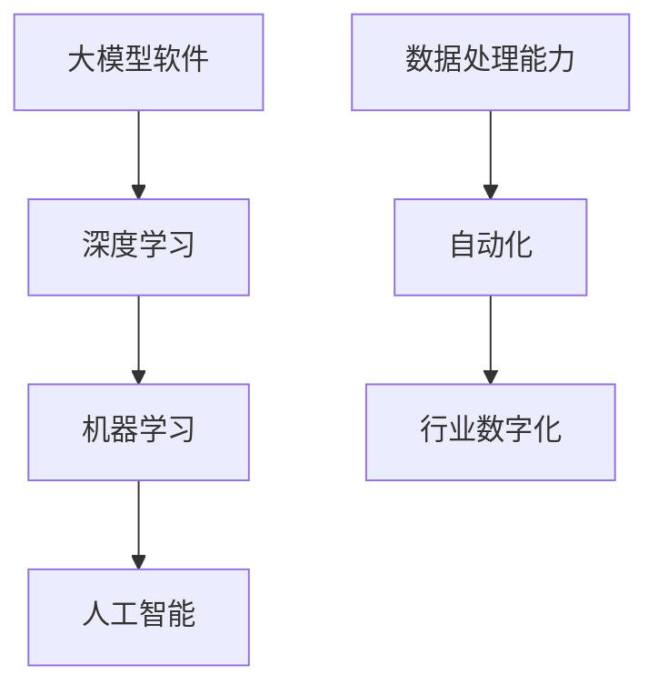

#### 1.2 大模型软件的发展历程

大模型软件的发展历程可以追溯到20世纪80年代，当时人工智能和机器学习开始萌芽。以下是几个重要的发展阶段：

- **1980年代**：这一时期，神经网络和机器学习算法开始受到关注，为后来的大模型软件奠定了基础。

- **2006年**：深度学习算法的提出，标志着人工智能研究进入了一个新的阶段。这一算法能够通过多层神经网络实现复杂的数据处理。

- **2012年**：AlexNet的出现，使得深度学习在图像识别任务中取得了显著成果，这引发了人工智能领域的一场革命。

- **2016年**：谷歌的AlphaGo在围棋比赛中战胜人类顶尖选手，这标志着大模型软件在策略性任务中的强大能力。

**Mermaid 流程图**：

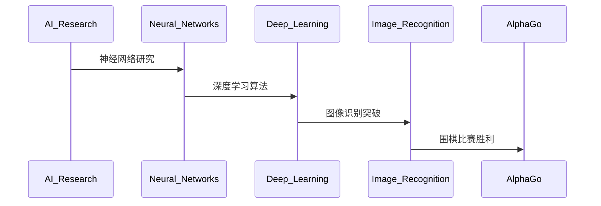

#### 1.3 大模型软件的应用场景

大模型软件的应用场景非常广泛，涵盖了多个行业和领域：

- **工业**：在大数据处理和智能制造领域，大模型软件能够提高生产效率，优化产品设计。

- **金融**：在金融领域，大模型软件可以用于风险控制、投资分析和客户服务等方面。

- **医疗**：大模型软件在医疗诊断、药物研发和患者护理等方面发挥着重要作用。

**应用场景示意图**：

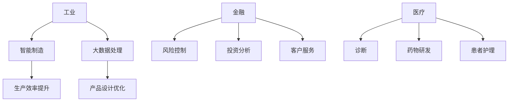

通过以上分析，我们可以看出，大模型软件不仅具有复杂的内部结构，还在各个行业中发挥着重要作用。接下来，我们将进一步探讨大模型软件的容错与恢复机制。

---

**核心算法原理讲解**：

在理解大模型软件的定义与发展历程后，我们需要关注其容错与恢复机制的核心算法原理。

1. **冗余技术**：

   冗余技术是一种通过复制或备份关键组件来提高系统可靠性的方法。在大模型软件中，常见的冗余技术包括：

   - **硬件冗余**：通过增加硬件组件的冗余来提高系统的容错能力。例如，使用多台服务器组成集群，以防止单点故障。

   - **软件冗余**：通过复制或备份软件模块来提高系统的可靠性。例如，使用多线程或分布式计算来处理大量数据。

   - **数据冗余**：通过备份或复制数据来防止数据丢失。例如，在数据库中使用复制或镜像技术来确保数据的一致性。

   **伪代码示例**：

   ```python
   def redundant_data_backup(data):
       backup_data = data.copy()
       save_to_disk(backup_data)
       return backup_data
   ```

2. **故障检测与诊断**：

   故障检测与诊断是容错机制的重要组成部分。在大模型软件中，常用的故障检测与诊断方法包括：

   - **静态检测**：在软件运行前进行检测，以发现潜在的故障。例如，使用代码静态分析工具来检查代码中的潜在错误。

   - **动态检测**：在软件运行时进行检测，以发现运行中的故障。例如，使用实时监控系统来监测系统的性能和状态。

   **伪代码示例**：

   ```python
   def dynamic_fault_detection():
       while True:
           status = check_system_status()
           if status == "error":
               log_fault("System Error Detected")
               initiate_recovery()
   ```

3. **故障恢复策略**：

   在检测到故障后，系统需要采取恢复策略来恢复正常的运行状态。常见的恢复策略包括：

   - **自恢复**：系统自动修复故障，无需人工干预。例如，使用自动化脚本来自动重启失败的进程。

   - **重启**：系统重新启动，以恢复正常的运行状态。例如，使用操作系统提供的重启命令。

   - **修复**：系统对故障部分进行修复，然后重新启动。例如，使用补丁或修复工具来修复软件中的漏洞。

   - **替换**：系统替换故障的部分，然后重新启动。例如，使用备份或冗余组件来替换失败的硬件。

   **伪代码示例**：

   ```python
   def recovery_strategy(fault_type):
       if fault_type == "process_failure":
           restart_process()
       elif fault_type == "software_error":
           apply_patch()
       elif fault_type == "hardware_failure":
           replace_hardware()
   ```

通过以上核心算法原理的讲解，我们可以看到大模型软件的容错与恢复机制是如何实现系统的高可靠性和可用性的。接下来，我们将进一步探讨大模型软件的故障类型与诊断方法。

---

### 第2章：大模型软件容错机制的核心概念

#### 2.1 容错性、可靠性和可用性的区别

在讨论大模型软件的容错机制时，我们首先需要明确几个关键概念：容错性、可靠性和可用性。这三个概念虽然密切相关，但各自有着不同的含义。

- **容错性（Fault Tolerance）**：

  容错性指的是系统在出现故障时，能够继续正常工作的能力。高容错性的系统可以在硬件或软件故障发生时，自动检测并切换到备份系统或组件，从而避免系统崩溃。

  **核心概念与联系**：

  ```mermaid
  graph TB
  A[容错性] --> B[硬件故障]
  B --> C[软件故障]
  A --> D[自动切换]
  D --> E[系统继续运行]
  ```

- **可靠性（Reliability）**：

  可靠性指的是系统在一段时间内正常运行的概率。一个高可靠性的系统意味着它在运行过程中出现故障的概率较低。可靠性通常通过平均无故障时间（MTTF）来衡量，即系统平均能够正常运行的时间。

  **核心概念与联系**：

  ```mermaid
  graph TB
  A[可靠性] --> B[MTTF]
  B --> C[正常运行时间]
  ```

- **可用性（Availability）**：

  可用性指的是系统能够随时响应请求的能力。高可用性的系统意味着它在需要时能够快速且可靠地提供服务。可用性通常通过平均故障修复时间（MTTR）来衡量，即系统在出现故障后恢复运行的时间。

  **核心概念与联系**：

  ```mermaid
  graph TB
  A[可用性] --> B[MTTR]
  B --> C[故障修复时间]
  ```

**比较与分析**：

- **容错性与可靠性的关系**：容错性是确保系统可靠性的关键因素。如果一个系统具有高容错性，那么它在面对故障时能够保持可靠性。

- **可靠性与可用性的关系**：可靠性是可用性的基础。如果一个系统具有高可靠性，那么它在理论上能够保持高可用性。

- **三者之间的平衡**：在实际系统中，我们往往需要在容错性、可靠性和可用性之间找到平衡。例如，增加冗余组件可以提高容错性和可靠性，但可能会降低系统的可用性。

#### 2.2 大模型软件容错机制的分类

根据实现方式和目的，大模型软件的容错机制可以分为以下几类：

- **静态容错机制**：

  静态容错机制是在系统设计阶段就考虑容错性的方法。这类机制主要通过冗余设计、检查点机制和错误检测与纠正码（Error Detection and Correction Codes，EDCs）来实现。

  **实现方式**：

  - **冗余设计**：通过增加硬件或软件的冗余来提高系统的容错能力。
  - **检查点机制**：在系统运行过程中，定期保存系统的状态，以便在故障发生时可以回滚到最近的一个检查点。
  - **错误检测与纠正码**：使用特定的编码方法来检测和纠正数据传输或存储过程中的错误。

  **核心概念与联系**：

  ```mermaid
  graph TB
  A[静态容错机制] --> B[冗余设计]
  B --> C[检查点机制]
  C --> D[错误检测与纠正码]
  ```

- **动态容错机制**：

  动态容错机制是在系统运行过程中动态调整容错策略的方法。这类机制主要通过自适应冗余、动态故障检测与恢复和负载均衡来实现。

  **实现方式**：

  - **自适应冗余**：根据系统当前的状态和负载，动态调整冗余组件的数量和类型。
  - **动态故障检测与恢复**：在系统运行过程中，实时监测系统的健康状况，并在检测到故障时自动进行恢复。
  - **负载均衡**：通过将任务分配到多个节点上，来提高系统的容错性和性能。

  **核心概念与联系**：

  ```mermaid
  graph TB
  A[动态容错机制] --> B[自适应冗余]
  B --> C[动态故障检测与恢复]
  C --> D[负载均衡]
  ```

- **软件冗余容错机制**：

  软件冗余容错机制是通过复制或备份软件组件来实现容错性的方法。这类机制主要包括：

  - **软件组件冗余**：通过复制关键软件组件，以便在某个组件出现故障时，其他组件可以接管其功能。
  - **版本控制**：通过管理多个软件版本，以便在出现问题时，可以回滚到之前的稳定版本。

  **核心概念与联系**：

  ```mermaid
  graph TB
  A[软件冗余容错机制] --> B[软件组件冗余]
  B --> C[版本控制]
  ```

通过以上分类，我们可以看到大模型软件容错机制的多样性。不同的机制适用于不同的应用场景和需求，系统设计师需要根据实际情况选择合适的容错策略。

---

#### 2.3 大模型软件容错性的评估方法

大模型软件容错性的评估方法对于确保系统的可靠性和稳定性至关重要。以下是一些常用的评估方法：

1. **故障注入测试**：

   故障注入测试是一种通过模拟故障来评估系统容错能力的方法。测试过程中，可以在系统的关键部分注入硬件故障、软件故障或网络故障，然后观察系统是否能够自动恢复或切换到备份组件。

   **核心算法原理讲解**：

   ```python
   def fault_injection_test(system):
       # 注入硬件故障
       simulate_hardware_fault()
       if system.recover():
           print("System recovered successfully from hardware fault.")
       else:
           print("System failed to recover from hardware fault.")
       
       # 注入软件故障
       simulate_software_fault()
       if system.recover():
           print("System recovered successfully from software fault.")
       else:
           print("System failed to recover from software fault.")
       
       # 注入网络故障
       simulate_network_fault()
       if system.recover():
           print("System recovered successfully from network fault.")
       else:
           print("System failed to recover from network fault.")
   ```

2. **可靠性模型评估**：

   可靠性模型评估是基于数学模型来评估系统的可靠性。常用的可靠性模型包括马尔可夫模型、泊松过程和泊松分布等。通过这些模型，可以预测系统在一段时间内的故障概率和恢复时间。

   **数学模型与公式**：

   $$ 
   P(t) = 1 - F(t) = e^{-\lambda t}
   $$

   其中，\( P(t) \) 表示系统在时间 \( t \) 内无故障的概率，\( F(t) \) 表示系统在时间 \( t \) 内发生故障的概率，\( \lambda \) 表示故障率。

3. **可用性评估**：

   可用性评估是通过计算系统的平均无故障时间（MTTF）和平均故障修复时间（MTTR）来评估系统的可用性。高可用性的系统应该具有较长的MTTF和较短的MTTR。

   **核心概念与联系**：

   ```mermaid
   graph TB
   A[MTTF] --> B[无故障时间]
   B --> C[可靠性]
   D[MTTR] --> E[故障修复时间]
   E --> F[可用性]
   ```

4. **性能分析评估**：

   性能分析评估是通过监测系统的性能指标（如响应时间、吞吐量和延迟）来评估系统的性能。高性能的系统应该具有较短的响应时间和较高的吞吐量。

   **核心概念与联系**：

   ```mermaid
   graph TB
   A[响应时间] --> B[性能]
   B --> C[吞吐量]
   B --> D[延迟]
   ```

通过以上评估方法，我们可以全面了解大模型软件的容错性，从而采取相应的优化措施来提高系统的可靠性和稳定性。

---

### 第3章：大模型软件的故障类型与诊断

#### 3.1 大模型软件故障的类型

大模型软件的故障类型多样，了解不同类型的故障有助于我们制定有效的诊断和恢复策略。以下是常见的故障类型：

1. **硬件故障**：

   硬件故障通常是由于物理设备的损坏或故障引起的。例如，服务器硬件故障、存储设备故障、网络设备故障等。硬件故障可能导致系统无法正常运行，从而影响大模型软件的执行。

   **案例分析**：

   在一个分布式大模型软件系统中，如果某个服务器硬件出现故障，可能会导致该服务器上的任务无法执行，进而影响整个系统的性能和稳定性。因此，及时检测和修复硬件故障对于保障系统正常运行至关重要。

2. **软件故障**：

   软件故障是指软件在执行过程中出现的错误或异常。常见的软件故障包括：

   - **逻辑错误**：程序中的逻辑错误可能导致系统执行不正确的操作，例如错误的计算结果。
   - **资源耗尽**：系统资源（如内存、CPU、磁盘空间等）耗尽可能导致程序无法正常运行。
   - **死锁**：多个进程因竞争资源而无限期等待，导致系统阻塞。
   - **崩溃**：程序因严重错误而突然停止运行。

   **案例分析**：

   在一个复杂的大模型软件系统中，由于逻辑错误或资源耗尽等问题，可能会导致系统崩溃或无法正常运行。例如，当系统内存耗尽时，程序可能会因为无法分配内存而崩溃。

3. **网络故障**：

   网络故障是指网络设备或连接出现的问题，可能导致数据传输失败或延迟。网络故障可能包括：

   - **断网**：网络连接中断，导致系统无法访问远程资源。
   - **延迟**：数据传输速度过慢，导致系统响应时间增加。
   - **丢包**：数据包在传输过程中丢失，需要重新传输。

   **案例分析**：

   在一个分布式大模型软件系统中，网络故障可能导致数据传输失败或延迟，从而影响系统的性能和可靠性。例如，当网络延迟过高时，系统可能会因为等待数据包而出现卡顿。

#### 3.2 故障检测与诊断的基本原理

故障检测与诊断是确保大模型软件稳定运行的重要环节。以下是故障检测与诊断的基本原理：

1. **故障检测**：

   故障检测是指通过监测系统的状态和性能指标，来判断系统是否出现故障。常见的故障检测方法包括：

   - **异常检测**：通过比较当前系统的状态和预期状态，来检测系统是否出现异常。例如，使用统计方法来检测系统的性能指标是否偏离正常范围。
   - **模式识别**：通过分析系统历史数据，来识别异常模式。例如，使用机器学习方法来识别系统故障的早期信号。
   - **阈值检测**：通过设定特定的阈值，来检测系统的状态是否超过阈值。例如，当系统响应时间超过一定阈值时，认为系统出现故障。

   **核心概念与联系**：

   ```mermaid
   graph TB
   A[故障检测] --> B[异常检测]
   B --> C[模式识别]
   B --> D[阈值检测]
   ```

2. **故障诊断**：

   故障诊断是指通过分析故障检测的结果，来确定故障的原因。常见的故障诊断方法包括：

   - **定位诊断**：通过分析故障现象，来定位故障发生的具体位置。例如，使用故障树分析（Fault Tree Analysis，FTA）来确定故障的原因。
   - **推理诊断**：通过逻辑推理，来推断故障的原因。例如，使用因果分析（Causal Analysis）来确定故障的原因。
   - **自诊断**：系统自身具备故障诊断能力，通过自监测和自分析来识别故障。例如，使用嵌入式诊断系统（Embedded Diagnostic System，EDS）来监测和诊断系统故障。

   **核心概念与联系**：

   ```mermaid
   graph TB
   A[故障诊断] --> B[定位诊断]
   B --> C[推理诊断]
   B --> D[自诊断]
   ```

#### 3.3 故障检测算法与实现

故障检测算法是实现故障检测与诊断的关键。以下是一些常用的故障检测算法：

1. **统计检测算法**：

   统计检测算法基于统计分析方法，通过比较当前系统的状态和预期状态，来检测系统是否出现异常。常见的统计检测算法包括：

   - **均值法**：通过计算系统的状态均值，来检测系统是否偏离正常范围。
   - **方差法**：通过计算系统的状态方差，来检测系统是否出现波动。
   - **标准差法**：通过计算系统的状态标准差，来检测系统是否超出正常范围。

   **伪代码示例**：

   ```python
   def mean_detection(state):
       mean_state = calculate_mean(state)
       if mean_state < expected_mean - threshold:
           return "Abnormal"
       elif mean_state > expected_mean + threshold:
           return "Abnormal"
       else:
           return "Normal"
   ```

2. **模式识别算法**：

   模式识别算法通过分析系统历史数据，来识别异常模式。常见的模式识别算法包括：

   - **K最近邻算法（K-Nearest Neighbors，KNN）**：通过计算系统当前状态与历史状态的相似度，来识别异常状态。
   - **支持向量机（Support Vector Machine，SVM）**：通过将系统状态映射到高维空间，来识别异常状态。

   **伪代码示例**：

   ```python
   def knn_detection(current_state, historical_states):
       distances = calculate_distances(current_state, historical_states)
       neighbors = select_k_nearest(distances, k)
       if most_common_label(neighbors) == "Abnormal":
           return "Abnormal"
       else:
           return "Normal"
   ```

3. **阈值检测算法**：

   阈值检测算法通过设定特定的阈值，来检测系统的状态是否超过阈值。常见的阈值检测算法包括：

   - **固定阈值法**：通过设定一个固定的阈值，来检测系统的状态是否超过阈值。
   - **自适应阈值法**：通过动态调整阈值，来检测系统的状态是否超过阈值。

   **伪代码示例**：

   ```python
   def threshold_detection(state, threshold):
       if state > threshold:
           return "Abnormal"
       else:
           return "Normal"
   ```

通过以上故障检测算法与实现，我们可以有效地检测大模型软件的故障，从而保障系统的稳定运行。

---

### 第4章：大模型软件的冗余技术

#### 4.1 冗余技术的定义与作用

冗余技术是提高系统可靠性和可用性的重要手段。在大模型软件中，冗余技术通过复制关键组件、数据或资源来确保系统在故障发生时能够继续正常运行。以下是冗余技术的定义与作用：

- **定义**：

  冗余技术（Redundancy）是指在系统中引入额外的组件、数据或资源，以便在原始组件、数据或资源出现故障时，能够快速切换到备份组件、数据或资源，从而确保系统的高可用性和稳定性。

- **作用**：

  - **提高可靠性**：通过冗余技术，可以减少系统单点故障的风险，从而提高系统的可靠性。
  - **增强可用性**：在故障发生时，冗余技术能够迅速切换到备份组件，减少系统的停机时间，提高系统的可用性。
  - **降低故障影响**：冗余技术可以在故障发生时，迅速接管故障组件的功能，从而降低故障对系统整体性能的影响。

**核心概念与联系**：

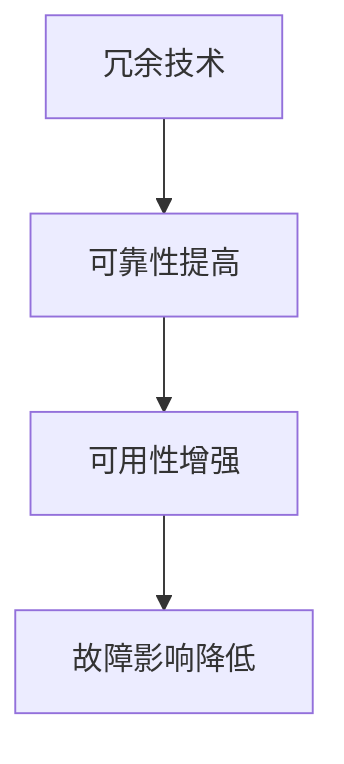

#### 4.2 冗余技术的实现方式

冗余技术可以通过多种方式来实现，以下是一些常见的实现方式：

1. **硬件冗余**：

   硬件冗余是通过增加硬件组件的冗余来提高系统的可靠性。常见的硬件冗余实现方式包括：

   - **集群**：通过将多个服务器组成集群，来提高系统的容错能力。在集群中，如果一个服务器出现故障，其他服务器可以接管其任务，确保系统正常运行。
   - **冗余电源**：在服务器或网络设备中，使用多个电源模块，以确保在电源故障时，系统能够继续运行。
   - **冗余网络**：通过使用多个网络连接，来确保数据传输的可靠性。在冗余网络中，如果一个网络连接失败，其他网络连接可以接管数据传输。

2. **软件冗余**：

   软件冗余是通过复制或备份软件组件来提高系统的可靠性。常见的软件冗余实现方式包括：

   - **多线程**：通过在软件中实现多线程，来提高系统的并行处理能力。在多线程中，如果一个线程出现故障，其他线程可以继续执行，确保系统正常运行。
   - **分布式计算**：通过将任务分配到多个节点上，来提高系统的容错能力和性能。在分布式计算中，如果一个节点出现故障，其他节点可以接管其任务，确保系统正常运行。
   - **数据备份**：通过定期备份软件组件和数据，来防止数据丢失。在数据备份中，如果一个组件或数据出现故障，可以通过备份来恢复，确保系统正常运行。

3. **数据冗余**：

   数据冗余是通过复制或备份数据来提高系统的可靠性。常见的数据冗余实现方式包括：

   - **数据库复制**：通过将数据库复制到多个位置，来确保数据的一致性和可靠性。在数据库复制中，如果一个数据库出现故障，其他数据库可以接管其功能，确保系统正常运行。
   - **数据镜像**：通过将数据镜像到多个存储设备上，来确保数据的安全性和可靠性。在数据镜像中，如果一个存储设备出现故障，其他存储设备可以接管其功能，确保系统正常运行。
   - **数据校验**：通过使用校验和或哈希算法，来检测数据的完整性和一致性。在数据校验中，如果检测到数据损坏，可以通过备份来恢复，确保系统正常运行。

**核心概念与联系**：

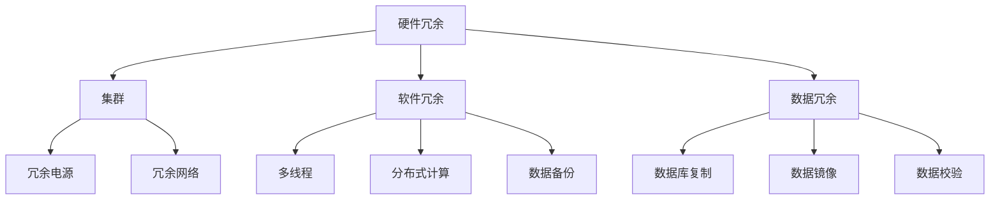

通过以上冗余技术的实现方式，我们可以有效地提高大模型软件的可靠性和可用性，从而保障系统的稳定运行。

---

#### 4.3 冗余技术在软件开发中的应用

冗余技术在软件开发中扮演着至关重要的角色，特别是在大模型软件的开发过程中。以下详细介绍冗余技术在不同软件开发阶段的应用。

##### 1. 设计阶段

在设计阶段，冗余技术的引入是确保系统高可靠性的第一步。在这一阶段，开发者需要考虑以下几个方面：

- **组件冗余**：设计时，应确保关键组件具有冗余机制。例如，数据库集群设计时，可以采用主从复制或多主复制来确保数据的一致性和可用性。
- **网络冗余**：为避免单点故障，应设计冗余的网络结构，如使用多个网络路径或冗余路由器。
- **容错机制**：在设计系统架构时，应考虑容错机制，如使用分布式计算框架来提高系统的容错能力。

**示例**：

在设计一个大型电商平台时，可以采用多数据库集群的方式，每个集群包含主从节点，确保在主节点故障时，从节点能够快速切换为主节点，保证系统的高可用性。

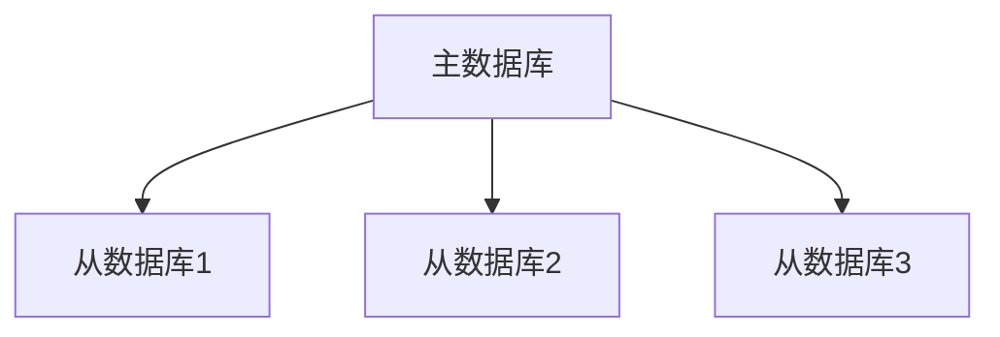

##### 2. 开发阶段

在开发阶段，冗余技术的实现主要涉及以下几个方面：

- **代码冗余**：通过编写冗余代码，实现功能的备份和恢复。例如，在关键模块中，可以编写多个独立的实现，并在主实现失败时，自动切换到备用实现。
- **数据冗余**：在数据存储和处理过程中，采用数据备份和复制策略，确保数据的安全性和一致性。
- **日志记录**：详细记录系统的运行日志，以便在出现故障时，能够快速定位问题并进行恢复。

**示例**：

在开发一个实时数据分析系统时，可以通过以下方式实现冗余：

- **代码冗余**：在数据处理模块中，编写两个独立的处理函数，并在主函数失败时，自动切换到备用函数。
- **数据冗余**：在数据存储模块中，采用多级数据备份策略，确保数据在单点故障时能够快速恢复。

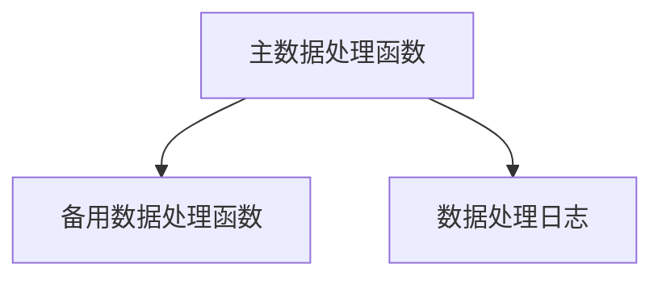

##### 3. 部署阶段

在部署阶段，冗余技术的应用主要涉及以下几个方面：

- **环境冗余**：在部署时，应确保环境配置的一致性，如使用容器化技术来保证环境的一致性。
- **监控冗余**：部署监控工具，实时监控系统的运行状态，确保在故障发生时能够及时响应。
- **故障转移**：在部署过程中，设计故障转移机制，确保在主系统故障时，备用系统能够快速接管。

**示例**：

在部署一个分布式大模型时，可以采用以下方式实现冗余：

- **环境冗余**：使用容器化技术（如Docker），确保各个节点具有相同的环境配置。
- **监控冗余**：部署多个监控工具（如Prometheus、Grafana），确保在故障发生时，能够及时发现并处理。
- **故障转移**：设计故障转移策略，确保在主节点故障时，备用节点能够快速接管。

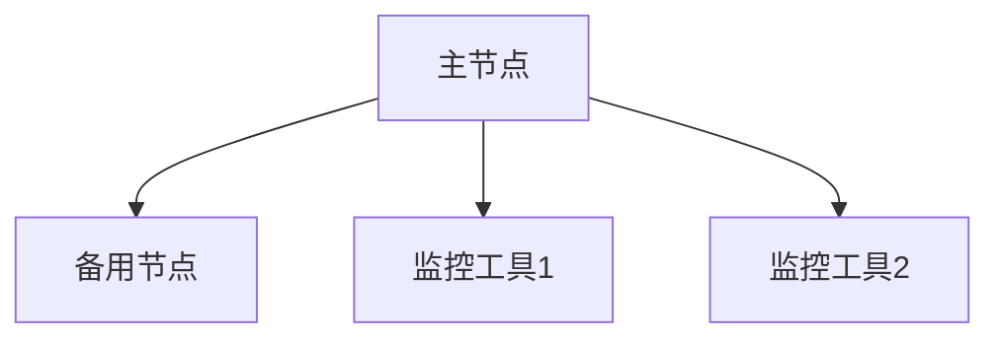

通过在软件开发的不同阶段应用冗余技术，我们可以有效地提高系统的可靠性、可用性和稳定性，确保大模型软件能够稳定运行，为各行业的应用提供坚实的技术支持。

---

### 第5章：大模型软件的故障恢复策略

#### 5.1 故障恢复策略的分类

在构建大模型软件时，故障恢复策略的选择至关重要。这些策略分为以下几种类型：

1. **自恢复策略**：

   自恢复策略是指系统在检测到故障时，自动执行恢复操作，无需人工干预。这种策略通常用于一些简单的故障，如网络中断、暂时性资源不足等。

   **核心算法原理讲解**：

   ```python
   def self_recovery():
       if network_is_down():
           try:
               recover_network()
           except Exception as e:
               log_error(e)
       if resource_is_exhausted():
           try:
               release_unused_resources()
           except Exception as e:
               log_error(e)
   ```

2. **重启策略**：

   重启策略是指系统在检测到故障时，自动重启受影响的进程或服务，以恢复其正常运行。这种策略适用于那些在重启后能够恢复的故障，如某些内存泄漏、逻辑错误等。

   **核心算法原理讲解**：

   ```python
   def restart_service(service):
       try:
           stop_service(service)
           start_service(service)
       except Exception as e:
           log_error(e)
   ```

3. **修复与替换策略**：

   修复与替换策略是指在检测到故障时，系统自动修复受影响的组件或直接替换失败的组件。这种策略适用于硬件故障或严重软件故障。

   **核心算法原理讲解**：

   ```python
   def repair_or_replace(component):
       if component.is_repairable():
           repair_component(component)
       else:
           replace_component(component)
   ```

#### 5.2 自恢复、重启、修复与替换

每种故障恢复策略都有其特定的适用场景和优势。以下是这些策略的详细说明：

1. **自恢复策略**：

   自恢复策略适用于那些对系统影响较小且能够自我修复的故障。例如，当网络连接短暂中断时，系统可以尝试重新连接网络，从而恢复正常的通信。这种策略的优点是简单、快速且无需人工干预，但缺点是可能无法解决所有故障。

   **应用场景**：

   - 网络中断：系统可以尝试重新连接网络。
   - 资源不足：系统可以尝试释放未使用的资源。

2. **重启策略**：

   重启策略适用于那些在重启后能够恢复的故障。例如，当某个服务因为内存泄漏而崩溃时，重启服务可以释放占用的大量内存，从而恢复正常运行。这种策略的优点是简单且有效，但缺点是可能导致系统服务中断，影响用户体验。

   **应用场景**：

   - 服务崩溃：重启受影响的服务。
   - 内存泄漏：重启整个系统或关键组件。

3. **修复与替换策略**：

   修复与替换策略适用于那些无法通过简单重启解决的重大故障。例如，当硬件组件（如硬盘）出现故障时，系统可以尝试修复或直接替换失败的组件，以恢复系统的正常运行。这种策略的优点是能够彻底解决故障，但缺点是复杂且耗时。

   **应用场景**：

   - 硬件故障：修复或替换受影响的硬件组件。
   - 严重软件错误：修复或重新安装受影响的软件模块。

**核心概念与联系**：

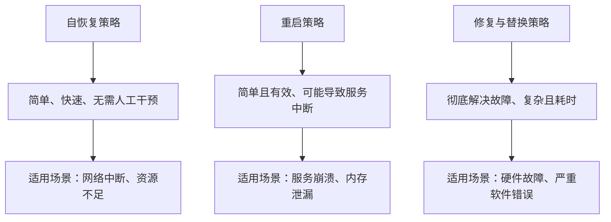

通过合理选择和组合不同的故障恢复策略，大模型软件可以有效地应对各种故障，确保系统的稳定运行和高效服务。

---

#### 5.3 恢复策略的性能评估

恢复策略的性能评估对于确保大模型软件的高可靠性和稳定性至关重要。以下是一些关键的性能评估指标和方法：

1. **恢复时间**：

   恢复时间是指系统从故障发生到恢复正常运行所需的时间。它是评估恢复策略性能的重要指标。理想的恢复时间应该尽可能短，以确保系统的可用性。

   **计算公式**：

   $$
   Recovery\ Time = Time_{fault\_detection} + Time_{fault\_diagnosis} + Time_{fault\_recovery}
   $$

   其中，$Time_{fault\_detection}$ 是故障检测时间，$Time_{fault\_diagnosis}$ 是故障诊断时间，$Time_{fault\_recovery}$ 是故障恢复时间。

2. **恢复成功率**：

   恢复成功率是指系统在故障发生后，能够成功恢复到正常状态的比率。高恢复成功率表明恢复策略的有效性。

   **计算公式**：

   $$
   Recovery\ Success\ Rate = \frac{Number\ of\ Successful\ Recoveries}{Total\ Number\ of\ Faults}
   $$

3. **恢复成本**：

   恢复成本是指系统在故障恢复过程中所消耗的资源，包括人力、时间和资金等。低恢复成本表明恢复策略的性价比高。

   **计算公式**：

   $$
   Recovery\ Cost = Cost_{diagnosis} + Cost_{recovery} + Cost_{post-recovery}
   $$

   其中，$Cost_{diagnosis}$ 是故障诊断成本，$Cost_{recovery}$ 是故障恢复成本，$Cost_{post-recovery}$ 是故障恢复后的维护成本。

4. **恢复效率**：

   恢复效率是指系统在单位时间内成功恢复的故障次数。高恢复效率表明系统在故障发生时，能够迅速有效地进行恢复。

   **计算公式**：

   $$
   Recovery\ Efficiency = \frac{Total\ Number\ of\ Faults\ Recovered}{Total\ Time}
   $$

**评估方法**：

- **定量评估**：

  通过收集系统故障数据，使用上述公式计算恢复时间、恢复成功率、恢复成本和恢复效率等指标。这种方法能够提供具体的量化数据，帮助评估恢复策略的性能。

- **定性评估**：

  通过分析故障恢复过程中的用户体验、系统稳定性和业务连续性等定性指标，来评估恢复策略的效果。这种方法侧重于用户体验和业务连续性，能够提供更全面的评估结果。

**核心概念与联系**：

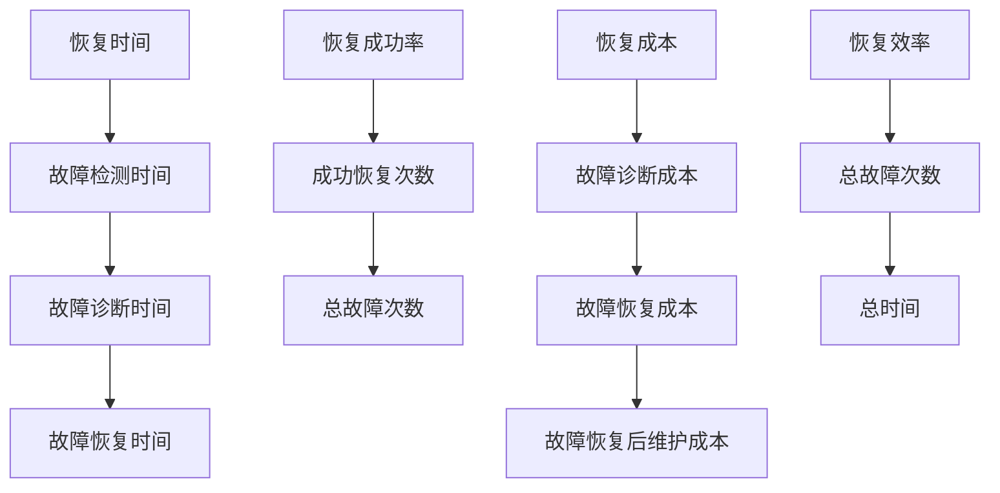

通过以上评估指标和方法，我们可以全面评估大模型软件的恢复策略性能，从而优化和改进恢复策略，确保系统的高可靠性和稳定性。

---

### 第6章：大模型软件容错与恢复机制的实现

#### 6.1 恢复机制的架构设计

在大模型软件的架构设计中，恢复机制的架构设计至关重要。一个有效的恢复机制需要综合考虑硬件、软件和网络等多个方面。以下是恢复机制架构设计的主要步骤和原则：

1. **需求分析**：

   首先，进行需求分析，明确系统需要具备的容错和恢复能力。这包括确定关键组件、数据备份策略、故障检测与诊断方法以及恢复策略等。

2. **系统划分**：

   将系统划分为多个模块，每个模块具有独立的故障域。这样可以确保在某个模块出现故障时，不会影响整个系统的正常运行。

3. **冗余设计**：

   根据需求分析结果，设计冗余结构，包括硬件冗余、软件冗余和数据冗余。硬件冗余可以通过使用多台服务器、网络冗余可以通过使用多个网络路径来实现。软件冗余可以通过多线程、分布式计算和代码备份来实现。数据冗余可以通过数据库复制和数据镜像来实现。

4. **故障检测与诊断**：

   设计故障检测与诊断机制，包括监控工具、报警系统和故障检测算法。监控工具可以实时监控系统的状态，报警系统可以及时通知相关人员，故障检测算法可以快速定位故障原因。

5. **恢复策略**：

   根据不同类型的故障，设计相应的恢复策略，包括自恢复、重启、修复和替换等。这些策略需要与冗余设计相配合，确保在故障发生时，系统能够快速恢复。

6. **架构验证**：

   对恢复机制的架构进行验证，通过模拟故障场景，测试系统的恢复能力。确保在故障发生时，系统能够按照预定的恢复策略进行恢复。

**核心概念与联系**：

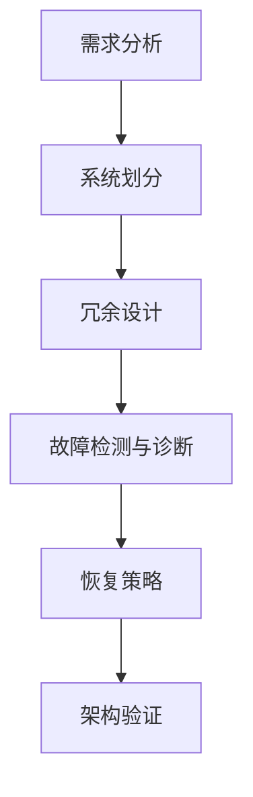

#### 6.2 恢复机制的实现细节

恢复机制的实现涉及多个方面，包括硬件、软件和网络等。以下是恢复机制实现的一些关键细节：

1. **硬件实现**：

   - **服务器集群**：使用多台服务器组成集群，确保在单台服务器故障时，其他服务器可以接管其任务。
   - **网络冗余**：使用多路径网络连接，确保在一条路径故障时，其他路径可以接管数据传输。
   - **存储冗余**：使用RAID技术，通过磁盘阵列提高数据的可靠性。

2. **软件实现**：

   - **多线程与分布式计算**：通过多线程和分布式计算，提高系统的并行处理能力，确保在某个线程或节点故障时，其他线程或节点可以继续运行。
   - **代码备份**：定期备份关键代码，确保在代码出现故障时，可以通过备份恢复。

3. **数据实现**：

   - **数据库复制**：使用主从复制或多主复制，确保在主数据库故障时，其他数据库可以接管其功能。
   - **数据镜像**：使用数据镜像技术，确保在存储设备故障时，其他存储设备可以接管其功能。

**核心概念与联系**：

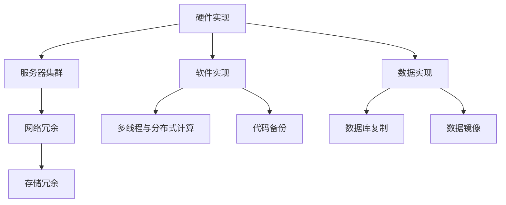

#### 6.3 实现恢复机制的挑战与对策

在实际实现恢复机制时，会面临许多挑战。以下是其中一些常见的挑战及其对策：

1. **性能影响**：

   冗余设计虽然可以提高系统的可靠性，但可能会对系统性能产生一定影响。例如，多线程和分布式计算可能会增加CPU和网络的负载。对策是优化算法和系统架构，确保冗余设计不会显著影响系统的性能。

2. **管理复杂度**：

   随着系统规模的扩大，恢复机制的管理复杂度也会增加。对策是使用自动化工具和平台，如监控工具和配置管理工具，来简化管理过程。

3. **数据一致性**：

   在数据库复制和数据镜像中，确保数据的一致性是一个挑战。对策是使用事务日志和分布式一致性协议，如两阶段提交（2PC）和三阶段提交（3PC），来确保数据的一致性。

4. **资源消耗**：

   冗余设计和恢复策略可能会消耗额外的硬件和软件资源。对策是进行性能优化和资源管理，确保系统在高负载情况下仍然能够正常运行。

**核心概念与联系**：

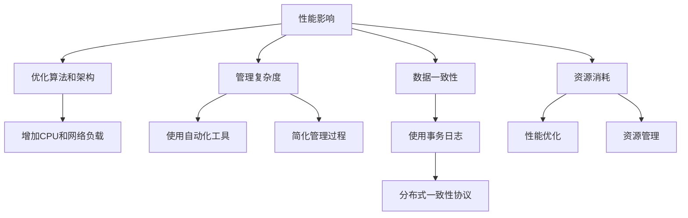

通过合理设计和实现恢复机制，可以有效地应对大模型软件中的各种故障，确保系统的稳定性和可靠性。

---

### 第7章：大模型软件容错与恢复的案例分析

#### 7.1 案例背景与问题描述

在本案例中，我们以一个大型电商平台为例，探讨其在大模型软件容错与恢复机制方面的应用。该电商平台每天处理数百万笔交易，包含大量的用户数据、订单数据和产品信息。系统的高可靠性和稳定性对其业务运营至关重要。

**问题描述**：

在一次高峰时段，由于网络延迟和服务器故障，导致部分用户无法正常访问平台，部分订单处理延迟。尽管平台具备一定的容错能力，但未能完全恢复，影响了用户体验和业务流程。问题主要集中在以下几个方面：

- **网络延迟**：由于网络带宽不足，导致部分数据传输延迟。
- **服务器故障**：某台数据库服务器发生硬件故障，导致数据访问失败。
- **数据处理延迟**：由于部分任务队列积压，导致订单处理延迟。

#### 7.2 容错与恢复机制的实施方案

为了解决上述问题，电商平台采取了以下容错与恢复机制的实施方案：

1. **网络冗余**：

   - **多路径传输**：采用多路径传输技术，将数据传输路径分散到不同的网络路径上，以避免单点故障。具体实现是通过配置负载均衡器，将请求分配到多个可用网络路径上。
   - **CDN缓存**：使用内容分发网络（CDN）缓存静态资源，减少对主服务器的访问压力。

2. **服务器冗余**：

   - **数据库集群**：通过主从复制和多主复制技术，确保在主数据库服务器故障时，从数据库服务器可以接管其功能，保证数据访问的连续性。
   - **负载均衡**：使用负载均衡器，将请求分配到不同的服务器上，避免单点过载。

3. **故障检测与诊断**：

   - **实时监控**：通过监控工具，实时监控系统的各项指标（如CPU使用率、内存使用率、网络延迟等），及时发现异常情况。
   - **故障报警**：设置故障报警机制，当系统指标超过阈值时，及时通知运维人员。

4. **故障恢复策略**：

   - **自恢复**：对于网络延迟等轻微故障，系统会自动尝试重试连接，以恢复正常的网络连接。
   - **重启**：对于服务器故障，系统会自动重启受影响的服务，以恢复其正常运行。
   - **数据恢复**：在数据库服务器故障时，通过从备份恢复数据，确保数据的一致性和完整性。

**具体步骤**：

1. **检测到网络延迟**：监控系统检测到网络延迟超过阈值，触发报警机制。
2. **尝试重试连接**：系统自动尝试重试网络连接，若连接成功，则恢复正常。
3. **检测到服务器故障**：监控系统检测到服务器故障，触发报警机制。
4. **重启受影响服务**：系统自动重启受影响的服务，以恢复其正常运行。
5. **从备份恢复数据**：在数据库服务器故障时，系统从备份中恢复数据，确保数据的一致性和完整性。

**核心概念与联系**：

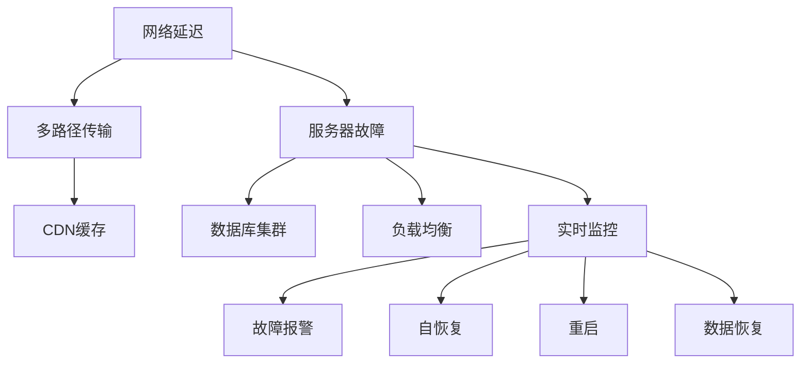

#### 7.3 案例分析与总结

通过对该电商平台的案例分析，我们可以看到，有效的容错与恢复机制在保障系统高可靠性和稳定性方面发挥了重要作用。以下是案例分析的总结：

1. **网络冗余**：通过多路径传输和CDN缓存，提高了系统的网络性能和可靠性，降低了单点故障的风险。

2. **服务器冗余**：通过数据库集群和负载均衡，确保在服务器故障时，系统能够快速恢复，保证数据访问的连续性。

3. **故障检测与诊断**：实时监控和故障报警机制，使系统能够及时发现和响应故障，减少了故障对系统的影响。

4. **故障恢复策略**：自恢复、重启和数据恢复策略，确保了系统在故障发生时，能够快速恢复，保证了业务的连续性。

总结而言，通过合理的容错与恢复机制设计，电商平台在面临网络延迟和服务器故障时，能够迅速响应和恢复，确保了系统的高可用性和稳定性，从而提高了用户体验和业务效率。

---

### 第8章：大模型软件容错与恢复机制的未来发展

#### 8.1 当前挑战与趋势

随着大模型软件在各个领域的广泛应用，其容错与恢复机制也面临诸多挑战。以下是当前的主要挑战和趋势：

1. **大规模分布式系统**：

   大模型软件通常运行在分布式系统中，这使得系统架构更加复杂。分布式系统中的节点数量庞大，节点间的通信和协调变得更加困难。因此，如何设计高效、可靠的容错与恢复机制成为一项重要挑战。

2. **数据隐私和安全**：

   大模型软件涉及大量敏感数据，包括用户数据、订单数据和医疗数据等。在实现容错与恢复机制的同时，如何确保数据隐私和安全成为一项重要任务。需要采用加密、访问控制等技术来保障数据的安全性和完整性。

3. **资源消耗与优化**：

   冗余设计虽然可以提高系统的可靠性，但也会增加硬件和软件资源消耗。如何在保证可靠性的同时，优化资源使用成为一项重要挑战。需要采用高效算法、资源调度策略等来降低资源消耗。

4. **实时性与响应速度**：

   在某些关键场景（如金融交易、医疗诊断等），系统的实时性和响应速度至关重要。如何设计快速、高效的容错与恢复机制，确保系统在故障发生时能够迅速恢复，成为一项重要趋势。

**发展趋势**：

1. **自动化与智能化**：

   随着人工智能技术的发展，自动化和智能化成为大模型软件容错与恢复机制的重要趋势。通过引入机器学习和深度学习技术，可以实现自动故障检测、故障诊断和故障恢复，提高系统的自主恢复能力。

2. **分布式架构与微服务**：

   分布式架构和微服务架构在提高系统可靠性和可维护性方面具有显著优势。通过采用分布式架构和微服务架构，可以更好地应对大规模分布式系统的复杂性，提高系统的容错性与恢复能力。

3. **边缘计算与云计算**：

   边缘计算与云计算的结合，使得大模型软件在处理海量数据和实现高效容错与恢复方面具有巨大潜力。通过将计算和存储任务分布在边缘节点和云端，可以实现高效的资源利用和故障恢复。

4. **安全与隐私保护**：

   随着数据隐私和安全问题的日益突出，大模型软件的容错与恢复机制需要更加重视数据安全和隐私保护。采用加密、访问控制、匿名化等技术，可以确保数据在传输和存储过程中的安全性和隐私性。

#### 8.2 未来发展方向

基于当前的挑战和趋势，未来大模型软件容错与恢复机制的发展方向可以从以下几个方面展开：

1. **智能化故障检测与诊断**：

   利用机器学习和深度学习技术，开发智能化故障检测与诊断算法，实现自动化的故障检测和诊断。通过分析历史数据和实时监控数据，提前预测潜在故障，并采取预防性措施。

2. **分布式架构优化**：

   针对大规模分布式系统的复杂性，优化分布式架构，提高系统的容错性和恢复能力。通过采用分布式存储、分布式计算和分布式通信技术，实现高效的故障恢复和数据备份。

3. **资源优化与调度**：

   通过优化资源使用和调度策略，降低系统资源消耗，提高系统性能和可靠性。采用自适应资源管理、智能调度和能耗优化等技术，实现高效、绿色的系统运行。

4. **安全与隐私保护**：

   加强数据安全和隐私保护，采用加密、访问控制、匿名化等技术，确保数据在传输和存储过程中的安全性和隐私性。同时，制定相应的法律法规，规范数据使用和隐私保护。

5. **边缘计算与云计算结合**：

   探索边缘计算与云计算的结合，实现高效、可靠的数据处理和故障恢复。通过将计算和存储任务分布在边缘节点和云端，提高系统的响应速度和容错能力。

通过以上未来发展方向，大模型软件的容错与恢复机制将能够更好地应对复杂的应用场景和不断变化的技术挑战，为各行业的数字化和智能化转型提供坚实的技术支持。

---

#### 8.3 研究与开发建议

为了应对大模型软件容错与恢复机制面临的挑战和实现未来的发展方向，以下是一些建议：

1. **基础理论研究**：

   加强对分布式系统、人工智能、数据隐私和安全等领域的基础理论研究。探索新的算法和理论，为实际应用提供理论基础。

2. **技术创新**：

   鼓励技术创新，开发高效的故障检测与诊断算法、分布式存储与计算技术、安全与隐私保护机制等。通过实验和实际应用，验证技术的可行性和有效性。

3. **跨学科合作**：

   促进跨学科合作，整合计算机科学、数据科学、人工智能、通信工程等领域的知识和技术。通过多学科协同，实现技术创新和突破。

4. **标准化与规范化**：

   制定相关标准和规范，确保大模型软件容错与恢复机制的一致性和可移植性。通过标准化，提高技术的普及和应用效果。

5. **开源与共享**：

   鼓励开源和共享，开放相关技术和工具，促进技术创新和知识共享。通过开源社区，汇聚全球智慧，推动大模型软件容错与恢复技术的发展。

6. **政策支持**：

   政府和企业应加大对大模型软件容错与恢复机制研发的政策支持，提供资金、技术和人才等资源，推动技术创新和应用。

通过以上建议，可以加速大模型软件容错与恢复机制的研究与开发，为各行业的数字化和智能化转型提供坚实的技术保障。

---

### 附录A：大模型软件容错与恢复机制常用工具与技术

#### A.1 故障检测与诊断工具

在实现大模型软件的容错与恢复机制时，故障检测与诊断工具是至关重要的。以下是一些常用的工具：

1. **Zabbix**：

   Zabbix是一个开源的监控工具，它可以实时监控服务器、网络设备和应用程序的性能。通过Zabbix，可以设置阈值报警、自动执行脚本等，以实现故障检测与诊断。

   **核心功能**：

   - 实时监控
   - 阈值报警
   - 自定义脚本

2. **Prometheus**：

   Prometheus是一个开源的监控解决方案，它具有高度的可扩展性和灵活性。Prometheus可以与Grafana结合使用，提供强大的可视化监控功能。

   **核心功能**：

   - 时间序列数据存储
   - 自定义指标
   - 可扩展性

3. **Grafana**：

   Grafana是一个开源的数据可视化工具，它可以与Prometheus等监控工具集成，提供丰富的可视化仪表盘和报告。

   **核心功能**：

   - 数据可视化
   - 报告生成
   - 自定义仪表盘

#### A.2 冗余技术工具

冗余技术是实现大模型软件高可靠性的关键。以下是一些常用的冗余技术工具：

1. **Docker**：

   Docker是一个开源的应用容器引擎，通过Docker，可以将应用程序及其依赖环境打包成一个独立的容器，实现软件部署和运行的一致性。

   **核心功能**：

   - 容器化
   - 部署一致性
   - 资源隔离

2. **Kubernetes**：

   Kubernetes是一个开源的容器编排平台，它可以帮助自动部署、扩展和管理容器化应用程序。通过Kubernetes，可以实现集群管理、服务发现和负载均衡等功能。

   **核心功能**：

   - 容器编排
   - 集群管理
   - 服务发现

3. **Elasticsearch**：

   Elasticsearch是一个开源的分布式搜索引擎，它支持结构化数据的高效存储和检索。通过Elasticsearch，可以实现数据冗余备份和实时搜索。

   **核心功能**：

   - 分布式搜索
   - 数据存储
   - 备份与恢复

#### A.3 恢复机制开发框架

为了简化大模型软件容错与恢复机制的实现，以下是一些常用的开发框架：

1. **Spring Boot**：

   Spring Boot是一个开源的框架，它简化了基于Spring的应用程序开发。通过Spring Boot，可以快速构建具有容错和恢复能力的应用程序。

   **核心功能**：

   - 自动配置
   - 可扩展性
   - 易于集成

2. **Netflix OSS**：

   Netflix OSS是一系列开源工具和框架，用于构建、部署和监控大规模分布式系统。包括Hystrix、Zuul、Eureka等，可以帮助实现故障检测、故障恢复和负载均衡等功能。

   **核心功能**：

   - 熔断器
   - 负载均衡
   - 服务发现

3. **Resilience4j**：

   Resilience4j是一个开源的Java库，用于构建具有弹性（resilience）的系统。它提供了许多用于处理故障和恢复的组件，如断路器、仪表盘等。

   **核心功能**：

   - 断路器
   - 仪表盘
   - 回调机制

通过以上常用工具与技术的介绍，可以为构建高效、可靠的大模型软件容错与恢复机制提供有力支持。

