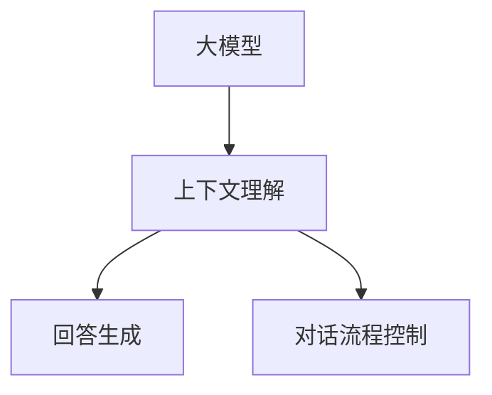
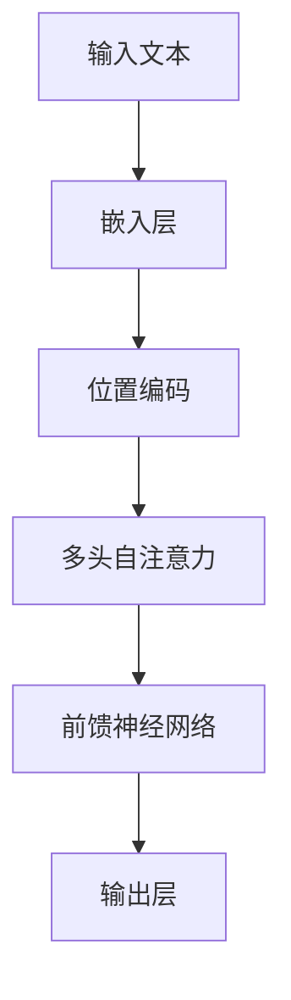
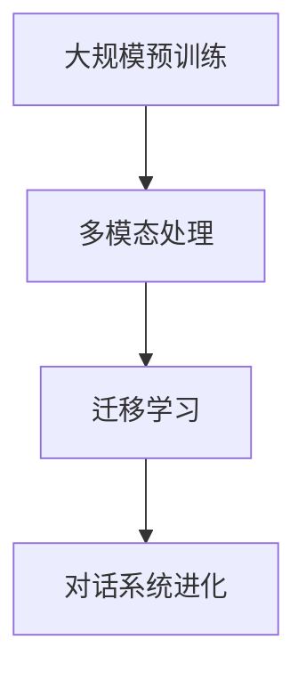

                 

# 大模型问答机器人的上下文处理

> **关键词**：大模型，上下文处理，问答机器人，自注意力机制，Transformer模型，数学基础，训练与优化，推理流程，评估与优化，实战应用，发展趋势与挑战。

> **摘要**：本文将深入探讨大模型问答机器人的上下文处理技术。我们将从基础理论出发，逐步讲解上下文处理的技术原理，包括大模型与上下文处理的关系、上下文编码技术、上下文理解的数学基础以及大模型的训练与优化。随后，我们将介绍大模型问答系统的实现流程、评估与优化策略，并结合实际应用场景进行分析。最后，我们将展望大模型问答系统的未来发展趋势与面临的挑战。

### 第一部分：上下文处理的基础理论

#### 第1章：大模型与上下文处理概述

**1.1 大模型与上下文处理的关系**

大模型与上下文处理之间有着紧密的联系。大模型，如GPT系列、BERT等，具有强大的语义理解和生成能力。而上下文处理则是大模型在处理自然语言任务中的一项关键能力，它能够帮助模型更好地理解用户的问题和提供更准确的回答。

**Mermaid流程图**：



**1.1.1 大模型简介**

大模型是指参数量达到百万级别以上的神经网络模型。例如，GPT-3拥有1750亿个参数，BERT则具有数百万个参数。这些模型的特点是：

- **强大的语义理解能力**：能够捕捉到文本中的深层语义信息。
- **高效的生成能力**：能够生成高质量的自然语言文本。

**1.1.2 上下文处理的重要性**

上下文处理在大模型中起着至关重要的作用。它能够帮助模型理解用户的问题，并根据问题的上下文生成相关的回答。数学公式可以表示为：

$$ \text{上下文理解} = f(\text{输入文本}, \text{模型参数}) $$

**1.1.3 上下文处理的基本流程**

上下文处理的基本流程通常包括以下步骤：

1. **文本预处理**：对输入的文本进行清洗、分词等处理，以便模型能够更好地理解。
2. **上下文编码**：使用特定的技术（如自注意力机制）将文本编码为向量。
3. **回答生成**：根据上下文向量生成回答。
4. **对话流程控制**：控制对话的流程，确保回答与问题的上下文保持一致。

#### 第2章：上下文编码技术

**2.1 自注意力机制**

自注意力机制是上下文编码的核心技术之一。它允许模型在处理文本时，将注意力集中在文本的不同部分上，从而更好地理解上下文。

**伪代码**：

```python
for each position i in the sequence:
    query_i = model.query嵌入层[i]
    key_i = model.key嵌入层[i]
    value_i = model.value嵌入层[i]
    attention_weights = softmax(query_i @ key_i.T)
    context_representation_i = value_i * attention_weights
```

**2.2 Transformer模型架构**

Transformer模型是上下文编码技术的代表。它通过多头自注意力机制和前馈神经网络，实现对输入文本的上下文编码。

**Mermaid流程图**：



**2.3 上下文编码的挑战与优化策略**

上下文编码面临着一些挑战，如计算复杂度高、参数量大等。为了应对这些挑战，研究者们提出了一些优化策略：

- **多层网络结构**：通过增加网络层数，提高模型的表示能力。
- **正则化技术**：如Dropout、Layer Normalization等，以防止过拟合。
- **预训练与微调**：通过预训练获得通用特征，再通过微调适应特定任务。

#### 第3章：上下文理解的数学基础

**3.1 线性代数基础**

线性代数是上下文理解的基础。它包括矩阵与向量的运算，如矩阵-向量乘法。

**伪代码**：

```python
def matrix_vector_multiplication(A, x):
    return [sum(a_i * x_i for a_i, x_i in zip(A_row, x)) for A_row in A]
```

**3.2 深度学习基础**

深度学习是构建大模型的核心技术。它包括前向传播、反向传播等基本概念。

**伪代码**：

```python
def forward_pass(input, weights, biases):
    output = input * weights + biases
    return activation_function(output)
```

**3.3 数学模型**

上下文理解的数学模型通常包括损失函数、优化算法等。

$$ \text{损失函数} = \frac{1}{2} \sum_{i=1}^{N} (y_i - \hat{y_i})^2 $$

**3.3.1 优化算法（如SGD）**

优化算法用于调整模型参数，以最小化损失函数。

$$ \text{优化目标} = \frac{1}{N} \sum_{i=1}^{N} (-\log(p(y_i | x))) $$

**3.3.2 梯度下降算法**

梯度下降算法是一种常用的优化算法，它通过更新模型参数来最小化损失函数。

#### 第4章：大模型的训练与优化

**4.1 训练流程**

大模型的训练流程通常包括以下几个步骤：

1. **数据预处理**：对输入数据进行清洗、分词等处理。
2. **模型初始化**：初始化模型参数。
3. **前向传播**：计算模型输出。
4. **损失计算**：计算损失函数值。
5. **反向传播**：更新模型参数。
6. **迭代训练**：重复上述步骤，直至达到训练目标。

**伪代码**：

```python
for epoch in range(num_epochs):
    for batch in data_loader:
        model.zero_grad()
        output = model(batch.input)
        loss = loss_function(output, batch.target)
        loss.backward()
        optimizer.step()
```

**4.2 优化技巧**

为了提高大模型的训练效果，研究者们提出了一些优化技巧：

- **学习率调整策略**：

$$ \text{学习率调整策略} = \frac{\eta_0}{(1 + \gamma \cdot epoch)^p} $$

- **批量归一化**：通过归一化批量内的数据，提高模型的稳定性。

- **梯度裁剪**：通过限制梯度的大小，防止梯度爆炸或消失。

#### 第5章：大模型的上下文推理

**5.1 推理流程**

大模型的推理流程通常包括以下步骤：

1. **输入预处理**：对输入文本进行预处理。
2. **上下文编码**：使用训练好的模型对输入文本进行上下文编码。
3. **回答生成**：根据上下文向量生成回答。

**伪代码**：

```python
def inference(input, model):
    output = model(input)
    return output
```

**5.2 推理优化**

为了提高大模型的推理效率，研究者们提出了一些优化策略：

- **并行计算**：通过并行计算，提高推理速度。
- **量化技术**：通过量化模型参数，减少模型大小，提高推理速度。

#### 第6章：大模型在问答机器中的应用

**6.1 问答系统简介**

问答系统是人工智能领域的一个重要应用。大模型在问答系统中发挥着重要作用，能够提供更准确、更自然的回答。

**伪代码**：

```python
def question_answering(question, context):
    answer = model.generate_answer(question, context)
    return answer
```

**6.2 上下文检索与匹配**

上下文检索与匹配是问答系统中的一个关键步骤。它通过相似度度量，找到与问题最相关的上下文。

**数学公式**：

$$ \text{匹配分数} = \text{相似度度量}(question, context) $$

**6.2.1 常见检索算法（如BM25）**

BM25是一种常用的检索算法，它通过计算文档与查询之间的相似度，找到最相关的文档。

#### 第7章：大模型问答系统的评估与优化

**7.1 评估指标**

评估大模型问答系统的效果，常用的指标包括准确率、召回率、F1值等。

**伪代码**：

```python
def evaluate(model, dataset):
    accuracy = correct_answers / total_answers
    return accuracy
```

**7.2 优化策略**

为了提高大模型问答系统的效果，研究者们提出了一些优化策略：

- **超参数调优**：通过调整模型超参数，优化模型性能。
- **数据增强**：通过增加训练数据，提高模型泛化能力。

**7.2.1 超参数调优**

超参数调优是优化大模型问答系统的一个关键步骤。它包括学习率、批量大小、迭代次数等超参数的调整。

**7.2.2 数据增强**

数据增强是通过生成新的训练数据，提高模型泛化能力的一种方法。常见的数据增强方法包括数据清洗、数据扩充等。

#### 第8章：大模型问答系统实战

**8.1 系统架构设计**

大模型问答系统的架构设计包括模型选择、数据预处理、推理流程等。

**伪代码**：

```python
class QuestionAnsweringSystem:
    def __init__(self):
        self.model = load_pretrained_model()
        self.inference_engine = InferenceEngine()

    def predict(self, question):
        context = retrieve_context(question)
        answer = self.model.generate_answer(question, context)
        return answer
```

**8.2 实际应用场景**

大模型问答系统在多个实际应用场景中取得了成功，如客服机器人、智能助手等。

**数学公式**：

$$ \text{问答效率} = \frac{\text{回答正确数}}{\text{问题总数}} $$

**8.2.1 常见应用领域**

- **客服机器人**：提供24/7的在线客服服务，提高客户满意度。
- **智能助手**：为用户提供个性化的服务，提升用户体验。

**8.2.2 系统部署与运维**

大模型问答系统的部署与运维包括模型部署、推理服务、监控与优化等。

#### 第9章：未来发展趋势与挑战

**9.1 发展趋势**

大模型问答系统在未来将继续发展，主要趋势包括：

- **大规模预训练**：通过更大规模的预训练模型，提高模型性能。
- **多模态处理**：结合文本、图像、语音等多种模态，提高问答系统的能力。
- **迁移学习**：通过迁移学习，提高模型在特定领域的性能。
- **对话系统进化**：从单轮问答向多轮对话发展，提供更自然、更流畅的交互体验。

**Mermaid流程图**：



**9.2 面临的挑战**

大模型问答系统在发展过程中也面临着一些挑战：

- **计算资源需求**：大模型的训练和推理需要大量的计算资源。
- **模型公平性与透明性**：确保模型在不同群体中的公平性和可解释性。
- **法律与伦理问题**：遵守相关法律法规，确保数据隐私和安全。

**数学公式**：

$$ \text{挑战} = \text{计算成本} + \text{数据隐私} + \text{模型可解释性} $$

### 总结

大模型问答机器人的上下文处理是人工智能领域的一个重要研究方向。通过深入理解上下文处理的技术原理和实现方法，我们可以构建出更智能、更自然的问答系统。本文从基础理论、上下文编码技术、训练与优化、推理流程、应用实战等多个方面进行了详细探讨，希望对读者有所帮助。

**作者**：AI天才研究院/AI Genius Institute & 禅与计算机程序设计艺术 /Zen And The Art of Computer Programming

